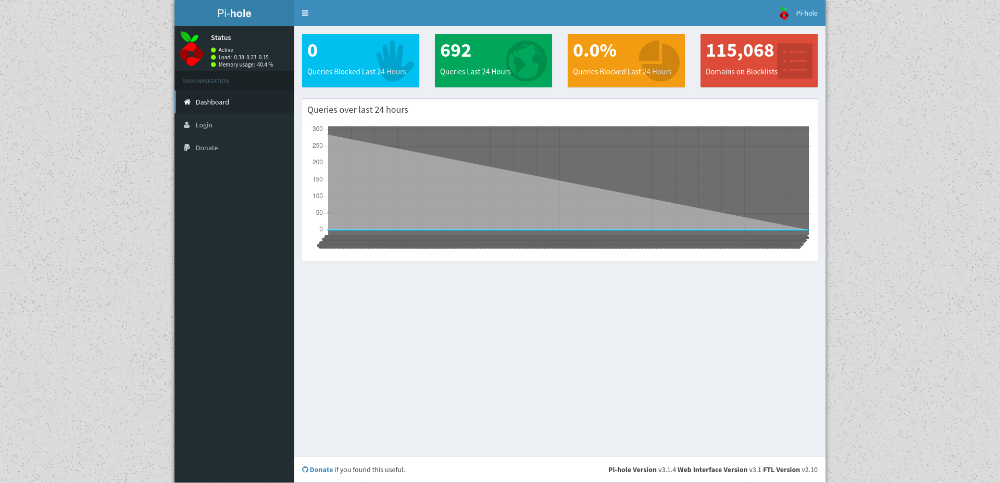
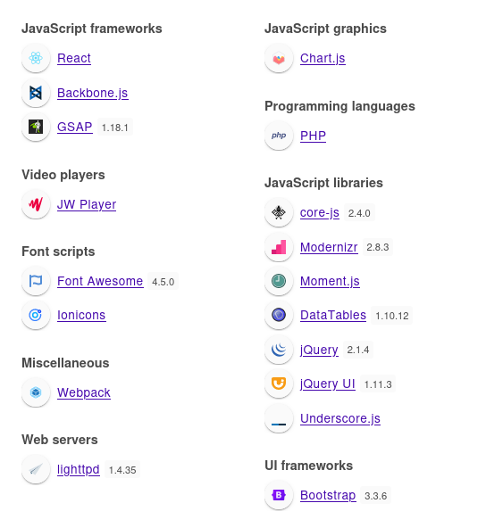
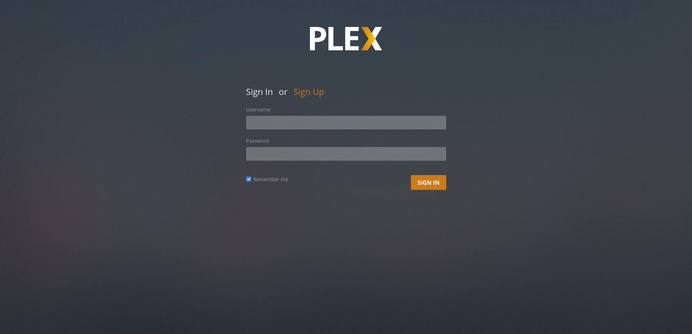
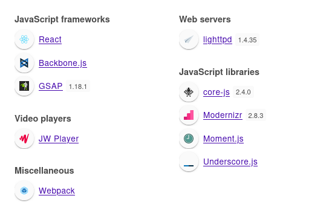

+++
title = "Mirai"
date = "2024-02-22"
description = "This is an easy Linux box."
[extra]
cover = "cover.png"
toc = true
+++

# Information

**Difficulty**: Easy

**OS**: Linux

**Release date**: 2017-09-01

**Created by**: [Arrexel](https://app.hackthebox.com/users/2904)

# Setup

I'll attack this box from a Kali Linux VM as the `root` user — not a great
practice security-wise, but it's a VM so it's alright. This way I won't have to
prefix some commands with `sudo`, which gets cumbersome in the long run.

I like to maintain consistency in my workflow for every box, so before starting
with the actual pentest, I'll prepare a few things:

1. I'll create a directory that will contain every file related to this box.
   I'll call it `workspace`, and it will be located at the root of my filesystem
   `/`.

1. I'll create a `server` directory in `/workspace`. Then, I'll use
   `httpsimpleserver` to create an HTTP server on port `80` and
   `impacket-smbserver` to create an SMB share named `server`. This will make
   files in this folder available over the Internet, which will be especially
   useful for transferring files to the target machine if need be!

1. I'll place all my tools and binaries into the `/workspace/server` directory.
   This will come in handy once we get a foothold, for privilege escalation and
   for pivoting inside the internal network.

I'll also strive to minimize the use of Metasploit, because it hides the
complexity of some exploits, and prefer a more manual approach when it's not too
much hassle. This way, I'll have a better understanding of the exploits I'm
running, and I'll have more control over what's happening on the machine.

Throughout this write-up, my machine's IP address will be `10.10.14.8`. The
commands ran on my machine will be prefixed with `❯` for clarity, and if I ever
need to transfer files or binaries to the target machine, I'll always place them
in the `/tmp` or `C:\tmp` folder to clean up more easily later on.

Now we should be ready to go!

# Host `10.10.10.48`

## Scanning

### Ports

As usual, let's start by initiating a port scan on Mirai using a TCP SYN `nmap`
scan to assess its attack surface.

```sh
❯ nmap -sS "10.10.10.48" -p-
```

```
<SNIP>
PORT      STATE SERVICE
22/tcp    open  ssh
53/tcp    open  domain
80/tcp    open  http
1118/tcp  open  sacred
32400/tcp open  plex
32469/tcp open  unknown
<SNIP>
```

Let's also check the 500 most common UDP ports.

```sh
❯ nmap -sU "10.10.10.48" --top-ports "500"
```

```
<SNIP>
PORT     STATE         SERVICE
53/udp   open          domain
68/udp   open|filtered dhcpc
123/udp  open          ntp
1900/udp open|filtered upnp
1901/udp open|filtered fjicl-tep-a
5353/udp open          zeroconf
<SNIP>
```

### Fingerprinting

Following the ports scans, let's gather more data about the services associated
with the open TCP ports we found.

```sh
❯ nmap -sS "10.10.10.48" -p "22,53,80,1118,32400" -sV
```

```
<SNIP>
PORT      STATE SERVICE VERSION
22/tcp    open  ssh     OpenSSH 6.7p1 Debian 5+deb8u3 (protocol 2.0)
53/tcp    open  domain  dnsmasq 2.76
80/tcp    open  http    lighttpd 1.4.35
1118/tcp  open  upnp    Platinum UPnP 1.0.5.13 (UPnP/1.0 DLNADOC/1.50)
32400/tcp open  http    Plex Media Server httpd
Service Info: OS: Linux; CPE: cpe:/o:linux:linux_kernel
<SNIP>
```

Let's do the same for the UDP ports.

```sh
❯ nmap -sU "10.10.10.48" -p "53,68,123,1900,1901,5353" -sV
```

```
<SNIP>
PORT     STATE         SERVICE     VERSION
53/udp   open          domain      dnsmasq 2.76
68/udp   open|filtered dhcpc
123/udp  open          ntp         NTP v4 (unsynchronized)
1900/udp open|filtered upnp
1901/udp open|filtered fjicl-tep-a
5353/udp open          mdns        DNS-based service discovery
<SNIP>
```

Alright, so `nmap` managed to determine that Mirai is running Linux, and the
version of SSH suggests that it might be Debian.

### Scripts

Let's run `nmap`'s default scripts on the TCP services to see if they can find
additional information.

```sh
❯ nmap -sS "10.10.10.48" -p "22,53,80,1118,32400" -sC
```

```
<SNIP>
PORT      STATE SERVICE
22/tcp    open  ssh
| ssh-hostkey: 
|   1024 aa:ef:5c:e0:8e:86:97:82:47:ff:4a:e5:40:18:90:c5 (DSA)
|   2048 e8:c1:9d:c5:43:ab:fe:61:23:3b:d7:e4:af:9b:74:18 (RSA)
|   256 b6:a0:78:38:d0:c8:10:94:8b:44:b2:ea:a0:17:42:2b (ECDSA)
|_  256 4d:68:40:f7:20:c4:e5:52:80:7a:44:38:b8:a2:a7:52 (ED25519)
53/tcp    open  domain
| dns-nsid: 
|_  bind.version: dnsmasq-2.76
80/tcp    open  http
|_http-title: Site doesn't have a title (text/html; charset=UTF-8).
1118/tcp  open  sacred
32400/tcp open  plex
|_ssl-date: TLS randomness does not represent time
| ssl-cert: Subject: commonName=*.78063b2b367a4a389895262d75b0b03c.plex.direct/organizationName=Plex, Inc./stateOrProvinceName=CA/countryName=US
| Subject Alternative Name: DNS:*.78063b2b367a4a389895262d75b0b03c.plex.direct
| Not valid before: 2017-08-10T00:00:00
|_Not valid after:  2018-08-10T12:00:00
<SNIP>
```

Let's also run them on the UDP services.

```sh
❯ nmap -sU "10.10.10.48" -p "53,68,123,1900,1901,5353" -sC
```

```
<SNIP>
PORT     STATE         SERVICE
53/udp   open          domain
| dns-nsid: 
|_  bind.version: dnsmasq-2.76
68/udp   open|filtered dhcpc
123/udp  open          ntp
| ntp-info: 
|_  
1900/udp open|filtered upnp
1901/udp open|filtered fjicl-tep-a
5353/udp open          zeroconf
| dns-service-discovery: 
|   9/tcp workstation
|     Address=10.10.10.48 dead:beef::9309:ce3c:9a:6056
|   22/tcp udisks-ssh
|_    Address=10.10.10.48 dead:beef::9309:ce3c:9a:6056

Host script results:
|_clock-skew: 1s
<SNIP>
```

## Services enumeration

### DNS

Unfortunately, we can't communicate with the DNS server.

### Lighttpd

#### Exploration

Let's browse to `http://10.10.10.48/`.


It's just a blank page.

#### Known vulnerabilities

If we search [ExploitDB](https://www.exploit-db.com/) for `Lighttpd 1.4`, we
find
[Lighttpd 1.4.x - mod_userdir Information Disclosure](https://www.exploit-db.com/exploits/31396)
([CVE-2008-1270](https://nvd.nist.gov/vuln/detail/CVE-2008-1270)). It could be
interesting, but it doesn't work.

#### Directory fuzzing

Let's see if this website hides unliked web pages and directories.

```sh
❯ ffuf -v -c -u "http://10.10.10.48/FUZZ" -w "/usr/share/wordlists/seclists/Discovery/Web-Content/directory-list-2.3-medium.txt" -mc "100-403,405-599" -e "/"
```

```
<SNIP>
[Status: 301, Size: 0, Words: 1, Lines: 1, Duration: 71ms]
| URL | http://10.10.10.48/admin
| --> | http://10.10.10.48/admin/
    * FUZZ: admin

[Status: 200, Size: 18, Words: 1, Lines: 1, Duration: 74ms]
| URL | http://10.10.10.48/versions
    * FUZZ: versions

[Status: 200, Size: 18, Words: 1, Lines: 1, Duration: 76ms]
| URL | http://10.10.10.48/versions/
    * FUZZ: versions/
<SNIP>
```

We get a hit for `/admin`!

#### Exploration

Let's browse to `http://10.10.10.48/admin/`.



It's a dashboard for Pi-hole. What's that?

> The Pi-hole® is a DNS sinkhole that protects your devices from unwanted
> content without installing any client-side software.
>
> — [GitHub](https://github.com/pi-hole/pi-hole)

#### Fingerprinting

Let's fingerprint the technologies used by this dashboard with the
[Wappalyzer](https://www.wappalyzer.com/) extension.



This reveals that this website is using PHP.

#### Exploration

We can't do anything without being logged in.

I tested common passwords contained in
[this wordlist](https://github.com/danielmiessler/SecLists/blob/master/Passwords/Common-Credentials/top-passwords-shortlist.txt)
by launching a Sniper attack on Burp Suite, but it failed.

#### Known vulnerabilities

If we search [ExploitDB](https://www.exploit-db.com/) for `Pi-hole`, we find
[Pi-Hole - heisenbergCompensator Blocklist OS Command Execution (Metasploit)](https://www.exploit-db.com/exploits/48491)
([CVE-2020-11108](https://nvd.nist.gov/vuln/detail/CVE-2020-11108)). That looks
like a great way to get a foothold, since our version of Pi-hole should be
affected by it, but unfortunately this box is not vulnerable to it.

If we search online, we also find
[a RCE](https://www.rapid7.com/db/modules/exploit/unix/http/pihole_whitelist_exec/),
but it fails too.

### Plex

#### Exploration

Let's browse to `http://10.10.10.48:32400/`.



We're redirected to `/web/index.html`, and we're presented with a Plex login
form.

#### Fingerprinting

Let's fingerprint the technologies used by this website with the
[Wappalyzer](https://www.wappalyzer.com/) extension.



#### Exploration

We don't know any credentials at this point. Luckily we can create an account!
But if we do, we don't get access to noteworthy functionalities, and there's no
installed Plex servers.

#### Known vulnerabilities

I couln't find the version of Plex, so I can't check for vulnerabilities.

## Foothold (SSH)

After further research online, I found that Pi-hole is often installed on a
Raspberry Pi.

Older versions of Raspberry Pi OS automatically enabled SSH with the credentials
`pi`:`raspberry`. It might be worth trying them, in case they haven't been
changed.

```sh
❯ ssh "pi@10.10.10.48"
```

```
The authenticity of host '10.10.10.48 (10.10.10.48)' can't be established.
<SNIP>
Are you sure you want to continue connecting (yes/no/[fingerprint])? yes
<SNIP>
pi@10.10.10.48's password:
<SNIP>
pi@raspberrypi:~ $
```

We got a shell. Nice!

## Getting a lay of the land

If we run `whoami`, we see that we got a foothold as `pi` (obviously).

### Architecture

What is Mirai's architecture?

```sh
pi@raspberrypi:~ $ uname -m
```

```
i686
```

It's using i686. Let's keep that in mind to select the appropriate binaries.

### Distribution

Let's see which distribution Mirai is using.

```sh
pi@raspberrypi:~ $ cat "/etc/os-release"
```

```
PRETTY_NAME="Debian GNU/Linux 8 (jessie)"
NAME="Debian GNU/Linux"
VERSION_ID="8"
VERSION="8 (jessie)"
ID=debian
HOME_URL="http://www.debian.org/"
SUPPORT_URL="http://www.debian.org/support"
BUG_REPORT_URL="https://bugs.debian.org/"
```

Okay, so it's Debian 8.

### Kernel

Let's find the kernel version of Mirai.

```sh
pi@raspberrypi:~ $ uname -r
```

```
3.16.0-4-686-pae
```

It's `3.16.0`.

### Users

Let's enumerate all users.

```sh
pi@raspberrypi:~ $ grep ".*sh$" "/etc/passwd" | cut -d ":" -f "1" | sort
```

```
pi
plex
root
```

There's `pi` (us), `plex` and `root`.

### Groups

Let's enumerate all groups.

```sh
pi@raspberrypi:~ $ cat "/etc/group" | cut -d ":" -f "1" | sort
```

```
adm
audio
avahi
backup
bin
bluetooth
cdrom
crontab
daemon
dialout
dip
disk
fax
floppy
games
gnats
gpio
i2c
input
irc
kmem
lightdm
list
lp
lpadmin
mail
man
messagebus
netdev
news
nogroup
ntp
operator
pi
pihole
plex
plugdev
proxy
pulse
pulse-access
root
rtkit
sasl
shadow
spi
src
ssh
staff
sudo
sys
systemd-bus-proxy
systemd-journal
systemd-network
systemd-resolve
systemd-timesync
tape
tty
users
utmp
uucp
video
voice
www-data
```

### NICs

Let's gather the list of connected NICs.

```sh
pi@raspberrypi:~ $ ifconfig
```

```
eth0      Link encap:Ethernet  HWaddr 00:50:56:b9:87:99  
          inet addr:10.10.10.48  Bcast:10.10.10.255  Mask:255.255.255.0
          inet6 addr: dead:beef::320e:a68c:f5fb:efba/64 Scope:Global
          inet6 addr: fe80::250:56ff:feb9:8799/64 Scope:Link
          inet6 addr: fe80::6ec5:1f0f:8082:c0df/64 Scope:Link
          UP BROADCAST RUNNING MULTICAST  MTU:1500  Metric:1
          RX packets:4884 errors:0 dropped:18 overruns:0 frame:0
          TX packets:11369 errors:0 dropped:0 overruns:0 carrier:0
          collisions:0 txqueuelen:1000 
          RX bytes:364428 (355.8 KiB)  TX bytes:12361462 (11.7 MiB)
          Interrupt:19 Base address:0x2000 

lo        Link encap:Local Loopback  
          inet addr:127.0.0.1  Mask:255.0.0.0
          inet6 addr: ::1/128 Scope:Host
          UP LOOPBACK RUNNING  MTU:65536  Metric:1
          RX packets:5482 errors:0 dropped:0 overruns:0 frame:0
          TX packets:5482 errors:0 dropped:0 overruns:0 carrier:0
          collisions:0 txqueuelen:0 
          RX bytes:1758530 (1.6 MiB)  TX bytes:1758530 (1.6 MiB)
```

There's an Ethernet interface and the loopback interface.

### Hostname

What is Mirai's hostname?

```sh
pi@raspberrypi:~ $ hostname
```

```
raspberrypi
```

## System enumeration

### Flags

If we check the `Desktop` directory in our home folder, we find the user flag.

```sh
pi@raspberrypi:~ $ cat "/home/pi/Desktop/user.txt"
```

```
ff837707441b257a20e32199d7c8838d
```

### Sudo permissions

Let's see if we can execute anything as another user with `sudo`.

```sh
pi@raspberrypi:~ $ sudo -l
```

```
Matching Defaults entries for pi on localhost:
    env_reset, mail_badpass, secure_path=/usr/local/sbin\:/usr/local/bin\:/usr/sbin\:/usr/bin\:/sbin\:/bin

User pi may run the following commands on localhost:
    (ALL : ALL) ALL
    (ALL) NOPASSWD: ALL
```

We can run anything as `root`!

## Privilege escalation (Sudo permissions)

### Exploitation

Let's get an elevated shell:

```sh
pi@raspberrypi:~ $ sudo "su" "-"
```

```
root@raspberrypi:~#
```

Yay!

### Stabilizing the shell

Our home folder contains a `.ssh` directory. There's no existing private key, so
I'll create one and add the corresponding public key to `authorized_keys`.

It won't be enough to connect over SSH to Mirai though, since the
`/etc/ssh/sshd_config` has the line `PubkeyAuthentication no`. I'll set it to
`yes`, and I'll restart the SSH service.

Finally, I'll connect over SSH to Mirai. I have a much more stable shell now!

## System enumeration

```
24e053901c93a1184a983b81af96883f
```

### Home folders

If we check our home folder, we find a `root.txt` file. However, it doesn't
contain the flag...

```
I lost my original root.txt! I think I may have a backup on my USB stick...
```

Apparently, the original file has been modified, but we can find a backup on a
USB stick.

### Drives

Let's retrieve the list of connected drives.

```sh
root@raspberrypi:~# lsblk
```

```
NAME   MAJ:MIN RM  SIZE RO TYPE MOUNTPOINT
sda      8:0    0   10G  0 disk 
├─sda1   8:1    0  1.3G  0 part /lib/live/mount/persistence/sda1
└─sda2   8:2    0  8.7G  0 part /lib/live/mount/persistence/sda2
sdb      8:16   0   10M  0 disk /media/usbstick
sr0     11:0    1 1024M  0 rom  
loop0    7:0    0  1.2G  1 loop /lib/live/mount/rootfs/filesystem.squashfs
```

A USB stick is likely mouted at `/media/usbstick`.

### Exploring `/dev/sdb`

If we check the folder where the USB stick is mounted, we only find a
`damnit.txt` file:

```
Damnit! Sorry man I accidentally deleted your files off the USB stick.
Do you know if there is any way to get them back?

-James
```

Apparently, James deleted the backup files on the USB stick. Luckily, there's
still the `lost+found` folder, so we can recover the deleted files!

Except that this folder is empty, meaning that this is no lost files to recover.
Does that mean that we're at a dead end?

No. When you delete a file using standard commands, the operating system just
removes the pointer to the file's location on the drive, not the actual content
itself. This means that the data might still be physically present on the disk,
so we may be able to use `strings` to recover it!

### Flags

We know we're looking for a string of 32 characters that was present on the
`/dev/sdb` drive. Let's see if we manage to find it.

```sh
root@raspberrypi:~# strings "/dev/sdb" | grep -E "^.{32}$"
```

```
3d3e483143ff12ec505d026fa13e020b
```

It worked!

# Afterwords


That's it for this box! 🎉

I rated the user flag as 'Not too easy' and the root flag as 'Easy'. The
foothold was hard to find, since there were different services that all led to
dead ends. They were rather hints indicating that Mirai was actually a Raspberry
Pi, and combined with further research online it gave away the foothold. The
privilege escalation was trivial to find and to exploit, however the root flag
wasn't that easy to find, and I lost a bit of time messing with the `lost+found`
folder.

Thanks for reading!
