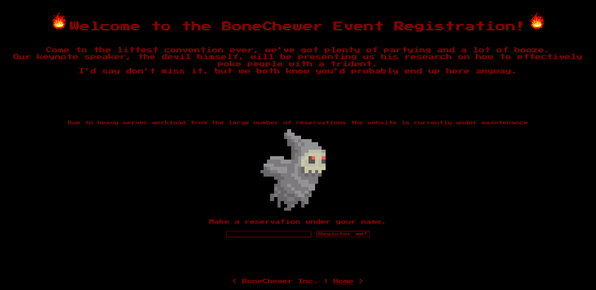
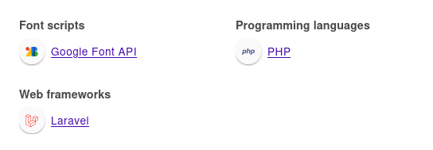
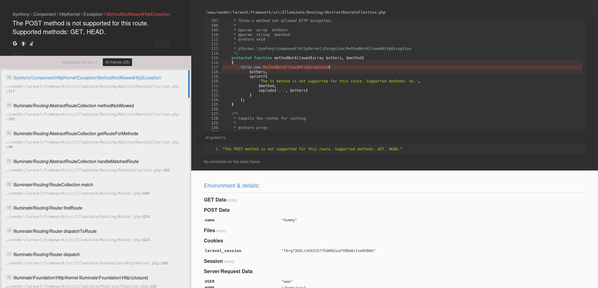
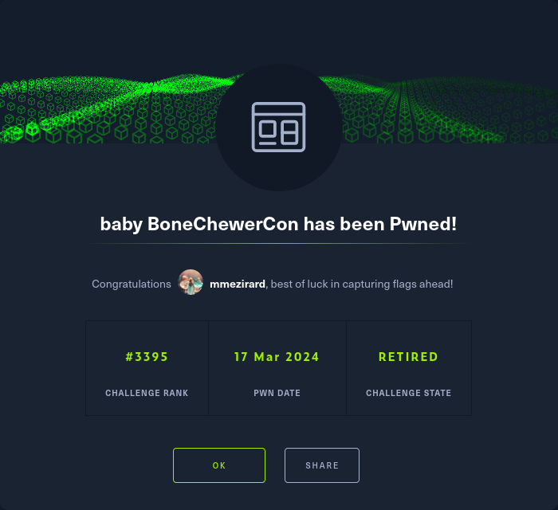

+++
title = "baby BoneChewerCon"
date = "2024-03-17"
description = "This is an easy Web challenge."
[extra]
cover = "cover.svg"
toc = true
+++

# Information

**Difficulty**: Easy

**Category**: Web

**Release date**: 2020-11-18

**Created by**: [makelarisjr](https://app.hackthebox.com/users/95) &
[makelaris](https://app.hackthebox.com/users/107)

**Description**: Due to heavy workload for the upcoming baby BoneChewerCon
event, the website is under maintenance and it errors out, but the debugger is
still enabled in production!! I think the devil is enticing us to go and check
out the secret key.

# Setup

I'll complete this challenge using a Kali Linux VM.

# Socket `83.136.252.32:48648`

## Exploration

Let's browse to `http://83.136.252.32:48648/`:

It's a website to register to the BoneChewer event.

## Fingerprinting

Let's fingerprint the technologies used by this web page with the
[Wappalyzer](https://www.wappalyzer.com/) extension.

This reveals that this web page is using PHP and the Laravel framework.

Moreover, if we check the HTTP headers of the response, we also find a
`X-Powered-By` header specifying that the web page is using PHP version
`7.4.12`.

## Exploration

There's a message indicating that the server is under heavy workload, so that
it's currently under maintenance.

We can fill a form to register to the event. Let's try to enter a random value:

I didn't expect that... we actually entered the Laravel debugger! We have access
to loads of information, including to the `APP_KEY` environment variable, which
is set to the flag: `HTB{wh3n_th3_d3bugg3r_turns_4g41nst_th3_d3bugg33}`!

# Afterwords

That's it for this box! 🎉

I rated this challenge as 'Piece of cake'. It just required to fill a form, the
hardest part was finding the flag in the output to be honest.

Thanks for reading!
