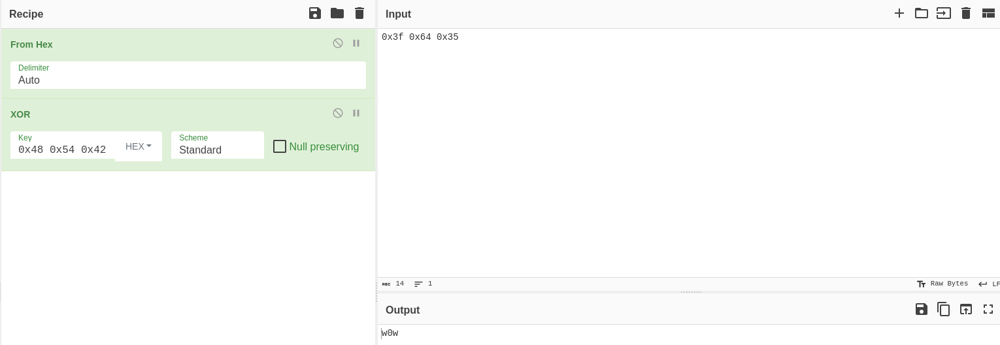

+++
title = "Baby Crypt"
date = "2024-03-22"
description = "This is an easy Reversing challenge."
[extra]
cover = "cover.svg"
toc = true
+++

# Information

**Difficulty**: Easy

**Category**: Reversing

**Release date**: 2021-04-12

**Created by**: [MinatoTW](https://app.hackthebox.com/users/8308)

**Description**: Give me the key and take what's yours.

# Setup

I'll complete this challenge using a Kali Linux VM. I'll create a `workspace`
directory at `/` to hold all the files related to this challenge, and the
commands ran on my machine will be prefixed with `❯` for clarity.

# Files

```sh
❯ tree -a "/workspace"
```

```
/workspace
└── baby_crypt

<SNIP>
```

This challenge is comprised of a single file named `baby_crypt`.

# Static analysis

Let's start by statically analyzing the `baby_crypt` file using the Rizin
toolkit.

## Properties

Let's inspect the properties of this file.

```sh
❯ file "/workspace/baby_crypt"
```

```
baby_crypt: ELF 64-bit LSB pie executable, x86-64, version 1 (SYSV), dynamically linked, interpreter /lib64/ld-linux-x86-64.so.2, BuildID[sha1]=24af7e68eab982022ea63c1828813c3bfa671b51, for GNU/Linux 3.2.0, not stripped
```

This is an ELF 64-bit, LSB executable.

## Libraries

Let's find out which libraries are used by this binary.

```sh
❯ rz-bin -l "/workspace/baby_crypt"
```

```
[Libs]
library   
----------
libc.so.6
```

This binary uses the `libc.so.6` library, which provides the fundamental
functionalities for programs written in C.

## Imports

Now, let's find the list of objects imported by this binary.

```sh
❯ rz-bin -i "/workspace/baby_crypt"
```

```
[Imports]
nth vaddr      bind   type   lib name                        
-------------------------------------------------------------
1   ---------- WEAK   NOTYPE     _ITM_deregisterTMCloneTable
2   0x00001080 GLOBAL FUNC       __stack_chk_fail
3   0x00001090 GLOBAL FUNC       printf
4   ---------- GLOBAL FUNC       __libc_start_main
5   0x000010a0 GLOBAL FUNC       fgets
6   ---------- WEAK   NOTYPE     __gmon_start__
7   0x000010b0 GLOBAL FUNC       malloc
8   ---------- WEAK   NOTYPE     _ITM_registerTMCloneTable
9   ---------- WEAK   FUNC       __cxa_finalize
```

This binary imports functions like `printf`, but also `fgets`, so we can expect
to see text printed to the terminal and to be asked for input.

## Strings

Finally, let's retrieve the list of strings contained in this binary.

```sh
❯ rz-bin -z "/workspace/baby_crypt"
```

```
[Strings]
nth paddr      vaddr      len size section type  string                                       
----------------------------------------------------------------------------------------------
0   0x00002008 0x00002008 44  45   .rodata ascii Give me the key and I'll give you the flag: 
1   0x00002035 0x00002035 6   7    .rodata ascii %.26s\n
```

This binary probably asks for a key to obtain the flag.

# Dynamic analysis

Now that we have an idea of what this binary could be doing, let's see what it
really does.

## Execution

Let's execute this binary on Linux.

```sh
❯ "/workspace/baby_crypt"
```

```
Give me the key and I'll give you the flag: 
```

We're indeed asked to enter a key. I'll enter a random one:

```
Give me the key and I'll give you the flag: hello?
WYd-+m
*l
nlf@7b@=/gei>(
```

The output is gibberish.

# Static analysis

## Decompilation

I'll load `baby_crypt` with the default options using Binary Ninja.

As usual, I'll start by exploring the `main` function.

### `main`

```c
int main(int argc, char **argv, char **envp) {
    printf("Give me the key and I'll give you the flag: ");
    char *input = malloc(4);
    fgets(input, 4, stdin);

    char encryptedFlag[24];
    memcpy(encryptedFlag,
           "\x3f\x64\x35\x0c\x48\x47\x05\x6f\x46\x04\x6f\x02\x04\x03"
           "\x13\x28\x52\x0e\x28\x58\x43\x0f\x00\x05",
           sizeof(encryptedFlag));
    for (int i = 0; i < 24; i++) {
        encryptedFlag[i] ^= input[i % 3];
    }
    printf("%.26s\n", encryptedFlag);
    free(input);

    return 0;
}
```

This program iterates over each character of the ciphertext
`\x3f\x64\x35\x0c\x48\x47\x05\x6f\x46\x04\x6f\x02\x04\x03\x13\x28\x52\x0e\x28\x58\x43\x0f\x00\x05`,
and XOR's it with the corresponding character in the user input modulo `3`.

# Putting everything together

This is an example of a XOR cipher. This means that the flag has been encrypted
with a specific key, used for both encryption and decryption. Unfortunately it's
not hardcoded in the program.

Let's think for a bit. We have the encrypted flag, and we know that the flag
starts with the character `HTB`. Therefore, we simply have to find the key that,
when XOR'ed with the first three characters of the encrypted flag
(`\x3f\x64\x35`), will give us the `HTB` (`\x48\x54\42`) string!

Based on the decompilation of the program, only the first three characters that
we enter are used for decryption. This means that the key we'll obtain this way
will be valid for the whole encrypted flag!

To obtain the result of the XOR operation, I'll open
[CyberChef](https://gchq.github.io/CyberChef/) and I'll set the key to
`0x48 0x54 0x42`. Then, I'll cook:



The key is `w0w`!

Let's run the binary once again, and enter this as the key.

```
HTB{x0r_1s_us3d_by_h4x0r!}
```

We got the flag!

# Afterwords


That's it for this box! 🎉

I rated this challenge as 'Very easy'. The decompiled code was really close to
the reality, and it was easy to understand. The key required to obtain the flag
wasn't written in cleartext, but it was really straightforward to obtain
nevertheless.

Thanks for reading!
