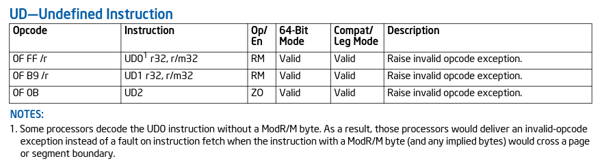

+++
title = "Behind the Scenes"
date = "2023-12-09"
description = "This is a very easy Reversing challenge."
[extra]
cover = "cover.svg"
toc = true
+++

# Information

**Difficulty**: Very easy

**Category**: Reversing

**Release date**: 2022-03-11

**Created by**: [Leeky](https://app.hackthebox.com/users/129896)

**Description**: After struggling to secure our secret strings for a long time, we finally figured out the solution to our problem: make decompilation harder. It should now be impossible to figure out how our programs work!

# Setup

I'll complete this challenge using a Linux VM. I'll create a `workspace` directory at `/` to hold all the files related to this challenge. The commands ran on my machine will be prefixed with `❯` for clarity.

# Identification

The challenge file is named `behindthescenes`, so we can infer that it's meant to be run on Linux. But let's confirm this by running `file` on it.

```sh
❯ file /workspace/behindthescenes
```

```
/workspace/behindthescenes: ELF 64-bit LSB pie executable, x86-64, version 1 (SYSV), dynamically linked, interpreter /lib64/ld-linux-x86-64.so.2, BuildID[sha1]=e60ae4c886619b869178148afd12d0a5428bfe18, for GNU/Linux 3.2.0, not stripped
```

Okay, so it looks like this is a ELF 64-bit, LSB executable.

Let's find more information about it using `zn-bin`.

```sh
❯ rz-bin -I /workspace/behindthescenes
```

```
[Info]
arch     x86
cpu      N/A
baddr    0x00000000
binsz    0x00003ae2
bintype  elf
bits     64
class    ELF64
compiler GCC: (Ubuntu 9.3.0-17ubuntu1~20.04) 9.3.0
dbg_file N/A
endian   LE
hdr.csum N/A
guid     N/A
intrp    /lib64/ld-linux-x86-64.so.2
laddr    0x00000000
lang     c
machine  AMD x86-64 architecture
maxopsz  16
minopsz  1
os       linux
cc       N/A
pcalign  0
relro    full
rpath    NONE
subsys   linux
stripped false
crypto   false
havecode true
va       true
sanitiz  false
static   false
linenum  true
lsyms    true
canary   true
PIE      true
RELROCS  true
NX       true
```

This confirms the information we got with `file`.

We notice that there are a few protections in place. This is not a binary exploitation challenge, but it's still interesting to know.

# Libraries

Let's find the list of libraries used by this binary.

```sh
❯ rz-bin -l /workspace/behindthescenes
```

```
[Libs]
library   
----------
libc.so.6
```

So this binary uses the `libc.so.6` library, which provides the fundamental functionalities for programs written in C.

# Imports

Now, let's find the list of imports used by this binary.

```sh
❯ rz-bin -i /workspace/behindthescenes
```

```
[Imports]
nth vaddr      bind   type   lib name                        
-------------------------------------------------------------
1   0x000010c0 GLOBAL FUNC       strncmp
2   ---------- WEAK   NOTYPE     _ITM_deregisterTMCloneTable
3   0x000010d0 GLOBAL FUNC       puts
4   0x000010e0 GLOBAL FUNC       sigaction
5   0x000010f0 GLOBAL FUNC       strlen
6   0x00001100 GLOBAL FUNC       __stack_chk_fail
7   0x00001110 GLOBAL FUNC       printf
8   0x00001120 GLOBAL FUNC       memset
9   ---------- GLOBAL FUNC       __libc_start_main
10  0x00001130 GLOBAL FUNC       sigemptyset
11  ---------- WEAK   NOTYPE     __gmon_start__
12  ---------- WEAK   NOTYPE     _ITM_registerTMCloneTable
13  ---------- WEAK   FUNC       __cxa_finalize
```

So this binary imports functions like `strncmp`, `strlen` and `memset`, but also `puts` and `printf`, so we can expect to see text printed to the terminal.

# Symbols

Let's find the list of symbols for this binary.

```sh
❯ rz-bin -s /workspace/behindthescenes
```

```
[Symbols]
nth paddr      vaddr      bind   type   size lib name                                   
----------------------------------------------------------------------------------------
1   0x00000318 0x00000318 LOCAL  SECT   0        .interp
2   0x00000338 0x00000338 LOCAL  SECT   0        .note.gnu.property
3   0x00000358 0x00000358 LOCAL  SECT   0        .note.gnu.build-id
4   0x0000037c 0x0000037c LOCAL  SECT   0        .note.ABI-tag
5   0x000003a0 0x000003a0 LOCAL  SECT   0        .gnu.hash
6   0x000003c8 0x000003c8 LOCAL  SECT   0        .dynsym
7   0x00000518 0x00000518 LOCAL  SECT   0        .dynstr
8   0x000005e8 0x000005e8 LOCAL  SECT   0        .gnu.version
9   0x00000608 0x00000608 LOCAL  SECT   0        .gnu.version_r
10  0x00000638 0x00000638 LOCAL  SECT   0        .rela.dyn
11  0x000006f8 0x000006f8 LOCAL  SECT   0        .rela.plt
12  0x00001000 0x00001000 LOCAL  SECT   0        .init
13  0x00001020 0x00001020 LOCAL  SECT   0        .plt
14  0x000010b0 0x000010b0 LOCAL  SECT   0        .plt.got
15  0x000010c0 0x000010c0 LOCAL  SECT   0        .plt.sec
16  0x00001140 0x00001140 LOCAL  SECT   0        .text
17  0x000014c8 0x000014c8 LOCAL  SECT   0        .fini
18  0x00002000 0x00002000 LOCAL  SECT   0        .rodata
19  0x00002038 0x00002038 LOCAL  SECT   0        .eh_frame_hdr
20  0x00002088 0x00002088 LOCAL  SECT   0        .eh_frame
21  0x00002d80 0x00003d80 LOCAL  SECT   0        .init_array
22  0x00002d88 0x00003d88 LOCAL  SECT   0        .fini_array
23  0x00002d90 0x00003d90 LOCAL  SECT   0        .dynamic
24  0x00002f80 0x00003f80 LOCAL  SECT   0        .got
25  0x00003000 0x00004000 LOCAL  SECT   0        .data
26  ---------- 0x00004010 LOCAL  SECT   0        .bss
27  0x00000000 0x00000000 LOCAL  SECT   0        .comment
28  0x00000000 0x00000000 LOCAL  FILE   0        crtstuff.c
29  0x00001170 0x00001170 LOCAL  FUNC   0        deregister_tm_clones
30  0x000011a0 0x000011a0 LOCAL  FUNC   0        register_tm_clones
31  0x000011e0 0x000011e0 LOCAL  FUNC   0        __do_global_dtors_aux
32  ---------- 0x00004010 LOCAL  OBJ    1        completed.8060
33  0x00002d88 0x00003d88 LOCAL  OBJ    0        __do_global_dtors_aux_fini_array_entry
34  0x00001220 0x00001220 LOCAL  FUNC   0        frame_dummy
35  0x00002d80 0x00003d80 LOCAL  OBJ    0        __frame_dummy_init_array_entry
36  0x00000000 0x00000000 LOCAL  FILE   0        main.c
37  0x00000000 0x00000000 LOCAL  FILE   0        crtstuff.c
38  0x000021ac 0x000021ac LOCAL  OBJ    0        __FRAME_END__
39  0x00000000 0x00000000 LOCAL  FILE   0        
40  0x00002d88 0x00003d88 LOCAL  NOTYPE 0        __init_array_end
41  0x00002d90 0x00003d90 LOCAL  OBJ    0        _DYNAMIC
42  0x00002d80 0x00003d80 LOCAL  NOTYPE 0        __init_array_start
43  0x00002038 0x00002038 LOCAL  NOTYPE 0        __GNU_EH_FRAME_HDR
44  0x00002f80 0x00003f80 LOCAL  OBJ    0        _GLOBAL_OFFSET_TABLE_
45  0x00001000 0x00001000 LOCAL  FUNC   0        _init
46  0x000014c0 0x000014c0 GLOBAL FUNC   5        __libc_csu_fini
49  0x00003000 0x00004000 WEAK   NOTYPE 0        data_start
52  ---------- 0x00004010 GLOBAL NOTYPE 0        _edata
53  0x000014c8 0x000014c8 GLOBAL FUNC   0        _fini
59  0x00003000 0x00004000 GLOBAL NOTYPE 0        __data_start
60  0x00001229 0x00001229 GLOBAL FUNC   56       segill_sigaction
63  0x00003008 0x00004008 GLOBAL OBJ    0        __dso_handle
64  0x00002000 0x00002000 GLOBAL OBJ    4        _IO_stdin_used
65  0x00001450 0x00001450 GLOBAL FUNC   101      __libc_csu_init
66  ---------- 0x00004018 GLOBAL NOTYPE 0        _end
67  0x00001140 0x00001140 GLOBAL FUNC   47       _start
68  ---------- 0x00004010 GLOBAL NOTYPE 0        __bss_start
69  0x00001261 0x00001261 GLOBAL FUNC   494      main
70  ---------- 0x00004010 GLOBAL OBJ    0        __TMC_END__
1   0x000010c0 0x000010c0 GLOBAL FUNC   16       imp.strncmp
2   ---------- ---------- WEAK   NOTYPE 0        imp._ITM_deregisterTMCloneTable
3   0x000010d0 0x000010d0 GLOBAL FUNC   16       imp.puts
4   0x000010e0 0x000010e0 GLOBAL FUNC   16       imp.sigaction
5   0x000010f0 0x000010f0 GLOBAL FUNC   16       imp.strlen
6   0x00001100 0x00001100 GLOBAL FUNC   16       imp.__stack_chk_fail
7   0x00001110 0x00001110 GLOBAL FUNC   16       imp.printf
8   0x00001120 0x00001120 GLOBAL FUNC   16       imp.memset
9   ---------- ---------- GLOBAL FUNC   0        imp.__libc_start_main
10  0x00001130 0x00001130 GLOBAL FUNC   16       imp.sigemptyset
11  ---------- ---------- WEAK   NOTYPE 0        imp.__gmon_start__
12  ---------- ---------- WEAK   NOTYPE 0        imp._ITM_registerTMCloneTable
13  ---------- ---------- WEAK   FUNC   0        imp.__cxa_finalize
```

We notice a `main.c` entry, and some of the functions we discovered in the last section.

# Strings

Finally, let's retrieve the list of strings contained in this binary.

```sh
❯ rz-bin -z /workspace/behindthescenes
```

```
[Strings]
nth paddr      vaddr      len size section type  string                 
------------------------------------------------------------------------
0   0x00002004 0x00002004 22  23   .rodata ascii ./challenge <password>
1   0x0000202b 0x0000202b 10  11   .rodata ascii > HTB{%s}\n
```

There's only `2` strings.

The first one is `./challenge <password>`. We can assume that this is a kind of help message that instructs us on the way to run this program.

The second is `HTB{%s}\n`. It probably corresponds to the flag, and the `%s` here is formatted with the flag value.

# Execution

Let's execute this binary and see how it behaves.

```sh
❯ /workspace/behindthescenes
```

```
./challenge <password>
```

As we found out in the [Strings](#strings) section, we are prompted to give an argument to the program, probably a `password` as indicated by the output. Let's enter `foo`.

```sh
❯ /workspace/behindthescenes foo
```

And there's no output...

If we read the instructions provided by HTB, we clearly understand that we have to reverse it.

# Decompilation

Now that we have an of idea of how this C program behaves and of what its dependencies are, let's decompile it and explore it using [Ghidra](https://github.com/NationalSecurityAgency/ghidra). I'm going to load `TheArtOfReversing.exe` with the default options, and I'll analyze it, once again with the default options.

As usual, I'll start by exploring the `main` function.

## `main`

```c,linenos
void main(void)
{
    long in_FS_OFFSET;
    sigaction local_a8;
    undefined8 local_10;

    local_10 = * (undefined8 * )(in_FS_OFFSET + 0x28);
    memset( & local_a8, 0, 0x98);
    sigemptyset( & local_a8.sa_mask);
    local_a8.__sigaction_handler.sa_handler = segill_sigaction;
    local_a8.sa_flags = 4;
    sigaction(4, & local_a8, (sigaction * ) 0x0);
    do {
        invalidInstructionException();
    } while (true);
}
```

That's quite unusual for a `main` function. Let's break down its most notable instructions:

### Preparation

The line `4` defines an `local_a8` pointer to a `sigaction` structure, used for handling signal events in Linux systems.

The line `8` fills the `local_a8` structure with `0`'s, essentially resetting its contents. This might be done to clear any existing signal handling settings.

The line `12` configures the signal handling for signal number `4`, using the `local_a8` structure as the signal handler. This effectively connects the `segill_sigaction` function to handle invalid instruction exceptions.

### Checks

Finally, the lines `13` to `15` create an infinite loop continuously calling the `invalidInstructionException` function.

## `ud2` instruction

We can try to obtain the decompiled `invalidInstructionException` function, but it doesn't work. Instead, we are redirected to the corresponding instruction in the disassembly:

```asm
ud2
```

`ud2`? I don't know what this instruction does.

If we browse the [Intel® 64 and IA-32 Architectures Software Developer’s Manual Combined Volumes: 1, 2A, 2B, 2C, 2D, 3A, 3B, 3C, 3D, and 4](https://www.intel.com/content/www/us/en/content-details/789583/intel-64-and-ia-32-architectures-software-developer-s-manual-combined-volumes-1-2a-2b-2c-2d-3a-3b-3c-3d-and-4.html) and search for `ud2`, we find this:



So apparently `ud2` is an instruction used to 'Raise invalid opcode exception'. Therefore, the code in the `main` function constantly results in an error.

## Uncovering the whole source code of `main`

Surprisingly, we can see that there's some instructions after the `ud2` one, but since they will never be reached Ghidra didn't analyze them.

We can force their decompilation by pressing `D`. Let's also change the `ud2` instruction to a `nop`, which does nothing, in order to see the decompiled version of the `main` function.

Now it looks different:

```c
void main(int param_1)
{
    long in_FS_OFFSET;
    sigaction local_a8;
    undefined8 local_10;

    local_10 = * (undefined8 * )(in_FS_OFFSET + 0x28);
    memset( & local_a8, 0, 0x98);
    sigemptyset( & local_a8.sa_mask);
    local_a8.__sigaction_handler.sa_handler = segill_sigaction;
    local_a8.sa_flags = 4;
    sigaction(4, & local_a8, (sigaction * ) 0x0);
    if (param_1 != 2) {
        do {
            invalidInstructionException();
        } while (true);
    }
    do {
        invalidInstructionException();
    } while (true);
}
```

It revealed new instructions. Once again, we find `invalidInstructionException` calls. Let's continue to decompile and replace all `ud2` instructions to `nop` instructions until all `invalidInstructionException` are gone — there's actually a lot of them! In the end, here's what the `main` function looks like:

```c,linenos
void main(int param_1, long param_2)
{
    int iVar1;
    size_t sVar2;
    long in_FS_OFFSET;
    sigaction local_a8;
    long local_10;

    local_10 = *(long *)(in_FS_OFFSET + 0x28);
    memset(&local_a8, 0, 0x98);
    sigemptyset(&local_a8.sa_mask);
    local_a8.__sigaction_handler.sa_handler = segill_sigaction;
    local_a8.sa_flags = 4;
    sigaction(4, &local_a8, (sigaction *)0x0);
    if (param_1 == 2) {
        sVar2 = strlen(*(char **)(param_2 + 8));
        if ((((sVar2 == 0xc) &&
              (iVar1 = strncmp(*(char **)(param_2 + 8), "Itz", 3),
               iVar1 == 0)) &&
             (iVar1 = strncmp((char *)(*(long *)(param_2 + 8) + 3), "_0n", 3),
              iVar1 == 0)) &&
            ((iVar1 = strncmp((char *)(*(long *)(param_2 + 8) + 6), "Ly_", 3),
              iVar1 == 0 &&
                  (iVar1 =
                       strncmp((char *)(*(long *)(param_2 + 8) + 9), "UD2", 3),
                   iVar1 == 0)))) {
            printf("> HTB{%s}\n", *(undefined8 *)(param_2 + 8));
        }
    } else {
        puts("./challenge <password>");
    }
    if (local_10 == *(long *)(in_FS_OFFSET + 0x28)) {
        return;
    }
    __stack_chk_fail();
}
```

This is a bit messy, but now we have a better view of the `main` function.

### Checks

The line `15` checks if an argument was given. If it's not the case, it prints `./challenge <password>`, which is exactly what happened when we didn't provide an argument to the program in the [Execution](#execution) section.

The line `17` checks if the length of the input is equal to `0xc`, which is `12` in decimal.

The lines `18` and `19` check if the first 3 characters are equal to `Itz`.

The lines `20` and `21` check if the next 3 characters are equal to `_0n`.

The lines `22` and `23` check if the next 3 characters are equal to `Ly_`.

The lines `26` and `27` check if the last 3 characters are equal to `UD2`.

### Display

Finally, if all these checks are passed, the string `> HTB{%s}\n` formatted with our input is printed back to the terminal.


# Putting it all together

Okay, we have a better understanding of how the binary works. To obtain the flag, we just need to enter a word of `12` characters, which succeeds all of these checks!

We can find it simply by concatenating the values this word is checked against.

Therefore, the secret input to get the flag must be `Itz_0nLy_UD2`!

## Testing

Let's check if this works.

```sh
❯ /workspace/behindthescenes Itz_0nLy_UD2
```

```
> HTB{Itz_0nLy_UD2}
```

And it did! Yay!

# Afterwords


That's it for this challenge! I found it really hard for a challenge classified as 'Very easy'. It took me some time to have the idea of modifying the `ud2` instructions. It was fairly easy to get the flag afterwards.

Thanks for reading!
