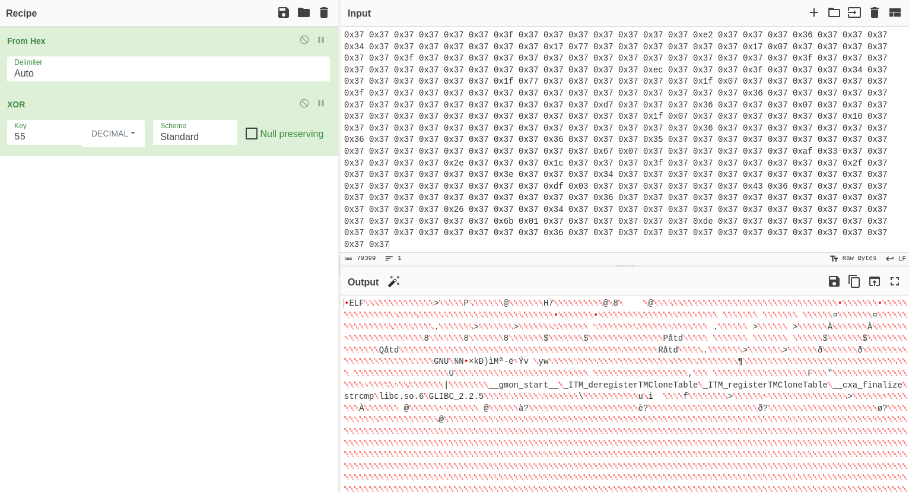

+++
title = "BioBundle"
date = "2024-03-26"
description = "This is a medium Reversing challenge."
[extra]
cover = "cover.svg"
toc = true
+++

# Information

**Difficulty**: Medium

**Category**: Reversing

**Release date**: 2024-03-01

**Created by**: [clubby789](https://app.hackthebox.com/users/83743)

**Description**: We've obtained a sample of zombie DNA. Can you extract and
decrypt their genetic code - we believe we can use it to create a cure...

# Setup

I'll complete this challenge using a Kali Linux VM. I'll create a `workspace`
directory at `/` to hold all the files related to this challenge, and the
commands ran on my machine will be prefixed with `❯` for clarity.

# Files

```sh
❯ tree -a "/workspace"
```

```
/workspace
└── rev_biobundle
    └── biobundle

<SNIP>
```

This challenge is comprised of a single file named `biobundle`.

# Static analysis

Let's start by statically analyzing the `biobundle` file using the Rizin toolkit.

## Properties

Let's inspect the properties of this file.

```sh
❯ file "/workspace/rev_biobundle/biobundle"
```

```
biobundle: ELF 64-bit LSB pie executable, x86-64, version 1 (SYSV), dynamically linked, interpreter /lib64/ld-linux-x86-64.so.2, BuildID[sha1]=0ff6e374d4953a88af400e872f4df8d48fa5472e, for GNU/Linux 3.2.0, not stripped
```

This is an ELF 64-bit, LSB executable.

## Libraries

Let's find out which libraries are used by this binary.

```sh
❯ rz-bin -l "/workspace/rev_biobundle/biobundle"
```

```
[Libs]
library    
-----------
libdl.so.2
libc.so.6
```

This binary uses the `libc.so.6` library, which provides the fundamental
functionalities for programs written in C. It also uses the `libdl.so.2`
library, which is used to dynamically load libraries during program execution.

## Imports

Now, let's find the list of objects imported by this binary.

```sh
❯ rz-bin -i "/workspace/rev_biobundle/biobundle"
```

```
[Imports]
nth vaddr      bind   type   lib name                        
-------------------------------------------------------------
1   0x00001030 GLOBAL FUNC       memfd_create
2   ---------- WEAK   NOTYPE     _ITM_deregisterTMCloneTable
3   0x00001040 GLOBAL FUNC       puts
4   0x00001050 GLOBAL FUNC       write
5   0x00001060 GLOBAL FUNC       strcspn
6   ---------- GLOBAL FUNC       __libc_start_main
7   0x00001070 GLOBAL FUNC       fgets
8   ---------- WEAK   NOTYPE     __gmon_start__
9   0x00001080 GLOBAL FUNC       dlopen
10  0x00001090 GLOBAL FUNC       sprintf
11  0x000010a0 GLOBAL FUNC       exit
12  ---------- WEAK   NOTYPE     _ITM_registerTMCloneTable
13  0x000010b0 GLOBAL FUNC       dlsym
14  0x000010c0 WEAK   FUNC       __cxa_finalize
```

This binary imports functions like `puts`, but also `fgets`, so we can expect to
see text printed to the terminal and to be asked for input. We also notice the
`dlopen` function, so the binary probably opens handles with other shared
libraries.

## Strings

Finally, let's retrieve the list of strings contained in this binary.

```sh
❯ rz-bin -z "/workspace/rev_biobundle/biobundle"
```

```
[Strings]
nth paddr      vaddr      len  size section type   string                                                                                                                                                                                                                                                                                                                                                                                                                                                                                                                                                                                                                                                                                                                                                                                                                                                                                                                                                                                                                                                                                                                                                                                                                                                                                                                                                                                                                                                                                                                                                                                                                                                                                                                                                                                                                                                                                                                                                                                                                                                                                                                        
---------------------------------------------------------------------------------------------------------------------------------------------------------------------------------------------------------------------------------------------------------------------------------------------------------------------------------------------------------------------------------------------------------------------------------------------------------------------------------------------------------------------------------------------------------------------------------------------------------------------------------------------------------------------------------------------------------------------------------------------------------------------------------------------------------------------------------------------------------------------------------------------------------------------------------------------------------------------------------------------------------------------------------------------------------------------------------------------------------------------------------------------------------------------------------------------------------------------------------------------------------------------------------------------------------------------------------------------------------------------------------------------------------------------------------------------------------------------------------------------------------------------------------------------------------------------------------------------------------------------------------------------------------------------------------------------------------------------------------------------------------------------------------------------------------------------------------------------------------------------------------------------------------------------------------------------------------------------------------------------------------------------------------------------------------------------------------------------------------------------------------------------------------------------------------
0   0x00002008 0x00002008 16   17   .rodata ascii  /proc/self/fd/%d
1   0x0000201d 0x0000201d 24   25   .rodata ascii  [*] Untangled the bundle
2   0x00002036 0x00002036 20   21   .rodata ascii  [x] Critical Failure
3   0x00003080 0x00004080 40   41   .data   ascii  Hr{q56677777777747\t76777g'777777w7777777
4   0x000030aa 0x000040aa 12   13   .data   ascii  7777777777w7
5   0x000030b7 0x000040b7 41   42   .data   ascii  7>7w7,7-767773777777777777777777777777777
6   0x000030e1 0x000040e1 7    8    .data   ascii  3777777
7   0x000030e9 0x000040e9 47   48   .data   ascii  37777777'777777677727777'7777777'7777777'777777
8   0x00003119 0x00004119 7    8    .data   ascii  6777777
9   0x00003121 0x00004121 24   25   .data   ascii  67777777'777777677737777
10  0x0000313a 0x0000413a 7    8    .data   ascii  7777777
11  0x00003142 0x00004142 7    8    .data   ascii  7777777
12  0x0000314a 0x0000414a 6    7    .data   ascii  777777
13  0x00003151 0x00004151 7    8    .data   ascii  7777777
14  0x00003159 0x00004159 24   25   .data   ascii  77777777'77777767771777'
15  0x00003172 0x00004172 30   31   .data   ascii  777777'\t777777'\t777777/5777777
16  0x00003191 0x00004191 23   24   .data   ascii  57777777'77777757771777
17  0x000031aa 0x000041aa 6    7    .data   ascii  777777
18  0x000031b1 0x000041b1 7    8    .data   ascii  \t777777
19  0x000031b9 0x000041b9 7    8    .data   ascii  \t777777
20  0x000031c1 0x000041c1 7    8    .data   ascii  6777777
21  0x000031c9 0x000041c9 23   24   .data   ascii  6777777?777777737773777
22  0x000031e1 0x000041e1 7    8    .data   ascii  5777777
23  0x000031e9 0x000041e9 7    8    .data   ascii  5777777
24  0x000031f1 0x000041f1 7    8    .data   ascii  5777777
25  0x000031f9 0x000041f9 7    8    .data   ascii  7777777
26  0x00003201 0x00004201 16   17   .data   ascii  777777737777777g
27  0x00003212 0x00004212 7    8    .data   ascii  CS37777
28  0x0000321a 0x0000421a 7    8    .data   ascii  7777777
29  0x00003222 0x00004222 7    8    .data   ascii  7777777
30  0x0000322a 0x0000422a 6    7    .data   ascii  777777
31  0x00003231 0x00004231 7    8    .data   ascii  7777777
32  0x00003239 0x00004239 16   17   .data   ascii  777777737777777f
33  0x0000324a 0x0000424a 55   56   .data   ascii  CS17777777777777777777777777777777777777777777'7777777e
34  0x00003282 0x00004282 7    8    .data   ascii  CS3777'
35  0x0000328a 0x0000428a 22   23   .data   ascii  777777'\t777777'\t777777
36  0x000032a1 0x000042a1 7    8    .data   ascii  6777777
37  0x000032a9 0x000042a9 31   32   .data   ascii  6777777677777773777#7774777pyb7
38  0x000032d8 0x000042d8 41   42   .data   ascii  %N@&77775777177767771777'7767777177777772
39  0x00003302 0x00004302 34   35   .data   ascii  577777777777777777777777777777'777
40  0x00003325 0x00004325 47   48   .data   ascii  7777777777777777777b777%77777777777777777776777
41  0x00003355 0x00004355 23   24   .data   ascii  7777777777777777777\e777
42  0x0000336d 0x0000436d 23   24   .data   ascii  7777777777777777777q777
43  0x00003385 0x00004385 139  140  .data   ascii  77777777777777777779777%7;72&777777K77777777hhPZXYhDCVEChh7h~czhSRERP^DCREczt[XYRcVU[R7h~czhERP^DCREczt[XYRcVU[R7hhTOVhQ^YV[^MR7DCETZG7[^UT
44  0x00003415 0x00004415 7    8    .data   ascii  7p{~uth
45  0x00003421 0x00004421 87   88   .data   ascii  7777757777757676767k777'7777777B-^>7757Q7777777'\t777777?77777777&777777/\t777777?7777777
46  0x00003479 0x00004479 7    8    .data   ascii  '777777
47  0x00003481 0x00004481 15   16   .data   ascii  w777777?7777777
48  0x00003491 0x00004491 7    8    .data   ascii  w777777
49  0x00003499 0x00004499 23   24   .data   ascii  \b7777771777677777777777
50  0x000034b1 0x000044b1 23   24   .data   ascii  \b7777771777477777777777
51  0x000034c9 0x000044c9 23   24   .data   ascii  \b7777771777377777777777
52  0x000034e1 0x000044e1 2044 2044 .data   ascii  \b7777771777277777777777/w777777077757777777777777777777777777777777777777777777777777777777777777777777777777777777777777777777777777777777777777777777777777777777777777777777777777777777777777777777777777777777777777777777777777777777777777777777777777777777777777777777777777777777777777777777777777777777777777777777777777777777777777777777777777777777777777777777777777777777777777777777777777777777777777777777777777777777777777777777777777777777777777777777777777777777777777777777777777777777777777777777777777777777777777777777777777777777777777777777777777777777777777777777777777777777777777777777777777777777777777777777777777777777777777777777777777777777777777777777777777777777777777777777777777777777777777777777777777777777777777777777777777777777777777777777777777777777777777777777777777777777777777777777777777777777777777777777777777777777777777777777777777777777777777777777777777777777777777777777777777777777777777777777777777777777777777777777777777777777777777777777777777777777777777777777777777777777777777777777777777777777777777777777777777777777777777777777777777777777777777777777777777777777777777777777777777777777777777777777777777777777777777777777777777777777777777777777777777777777777777777777777777777777777777777777777777777777777777777777777777777777777777777777777777777777777777777777777777777777777777777777777777777777777777777777777777777777777777777777777777777777777777777777777777777777777777777777777777777777777777777777777777777777777777777777777777777777777777777777777777777777777777777777777777777777777777777777777777777777777777777777777777777777777777777777777777777777777777777777777777777777777777777777777777777777777777777777777777777777777777777777777777777777777777777777777777777777777777777777777777777777777777777777777777777777777777777777777777777777777777777777777777777777777777777777777777777777777777777777777777777777777777777777777777777777777777777777777777777777777777777777777777777777777777777777777777777777777777777777777777777777777777777777777777777777777777777
53  0x00003cdd 0x00004cdd 931  932  .data   ascii  7777777777777777777777777777777777777777777777777777777777777777777777777777777777777777777777777777777777777777777777777777777777777777777777777777777777777777777777777777777777777777777777777777777777777777777777777777777777777777777777777777777777777777777777777777777777777777777777777777777777777777777777777777777777777777777777777777777777777777777777777777777777777777777777777777777777777777777777777777777777777777777777777777777777777777777777777777777777777777777777777777777777777777777777777777777777777777777777777777777777777777777777777777777777777777777777777777777777777777777777777777777777777777777777777777777777777777777777777777777777777777777777777777777777777777777777777777777777777777777777777777777777777777777777777777777777777777777777777777777777777777777777777777777777777777777777777777777777777777777777777777777777777777777777777777777777777777777777777777777777777777777777777777777777777777777
54  0x00004097 0x00005097 9    10   .data   ascii  777777777
55  0x000040aa 0x000050aa 6    7    .data   ascii  778(w7
56  0x000040b4 0x000050b4 7    8    .data   ascii  77_7777
57  0x000040bc 0x000050bc 5    6    .data   ibm037 PHHHH
58  0x000040c8 0x000050c8 8    9    .data   ascii  77777777
59  0x000040f4 0x000050f4 4    5    .data   ascii  7777
60  0x000040fc 0x000050fc 4    5    .data   ascii  7777
61  0x00004132 0x00005132 6    7    .data   ascii  Q8(s77
62  0x0000413c 0x0000513c 4    5    .data   ascii  7777
63  0x00004144 0x00005144 4    5    .data   ascii  777B
64  0x0000415e 0x0000515e 11   12   .data   ibm037 ÿ¦HHHÿ¬HHH1
65  0x0000416c 0x0000516c 4    5    .data   ascii  776j
66  0x00004174 0x00005174 4    5    .data   ascii  7777
67  0x0000417c 0x0000517c 4    5    .data   ascii  7777
68  0x00004194 0x00005194 5    6    .data   ascii  cuLDC
69  0x000041af 0x000051af 8    9    .data   ascii  UBChT\a\a[
70  0x000041c8 0x000051c8 4    5    .data   ascii  7777
71  0x000041d0 0x000051d0 4    5    .data   ascii  7777
72  0x000041d8 0x000051d8 4    5    .data   ascii  7777
73  0x000041e0 0x000051e0 4    5    .data   ascii  7777
74  0x0000420d 0x0000520d 2044 2044 .data   ascii  7777777777777777777777777777777777777777777777777777777777777777777777777777777777777777777777777777777777777777777777777777777777777777777777777777777777777777777777777777777777777777777777777777777777777777777777777777777777777777777777777777777777777777777777777777777777777777777777777777777777777777777777777777777777777777777777777777777777777777777777777777777777777777777777777777777777777777777777777777777777777777777777777777777777777777777777777777777777777777777777777777777777777777777777777777777777777777777777777777777777777777777777777777777777777777777777777777777777777777777777777777777777777777777777777777777777777777777777777777777777777777777777777777777777777777777777777777777777777777777777777777777777777777777777777777777777777777777777777777777777777777777777777777777777777777777777777777777777777777777777777777777777777777777777777777777777777777777777777777777777777777777777777777777777777777777777777777777777777777777777777777777777777777777777777777777777777777777777777777777777777777777777777777777777777777777777777777777777777777777777777777777777777777777777777777777777777777777777777777777777777777777777777777777777777777777777777777777777777777777777777777777777777777777777777777777777777777777777777777777777777777777777777777777777777777777777777777777777777777777777777777777777777777777777777777777777777777777777777777777777777777777777777777777777777777777777777777777777777777777777777777777777777777777777777777777777777777777777777777777777777777777777777777777777777777777777777777777777777777777777777777777777777777777777777777777777777777777777777777777777777777777777777777777777777777777777777777777777777777777777777777777777777777777777777777777777777777777777777777777777777777777777777777777777777777777777777777777777777777777777777777777777777777777777777777777777777777777777777777777777777777777777777777777777777777777777777777777777777777777777777777777777777777777777777777777777777777777777777777777777777777777777777777777777777777777777777777777777777777777777777777
75  0x00004a09 0x00005a09 1659 1660 .data   ascii  777777777777777777777777777777777777777777777777777777777777777777777777777777777777777777777777777777777777777777777777777777777777777777777777777777777777777777777777777777777777777777777777777777777777777777777777777777777777777777777777777777777777777777777777777777777777777777777777777777777777777777777777777777777777777777777777777777777777777777777777777777777777777777777777777777777777777777777777777777777777777777777777777777777777777777777777777777777777777777777777777777777777777777777777777777777777777777777777777777777777777777777777777777777777777777777777777777777777777777777777777777777777777777777777777777777777777777777777777777777777777777777777777777777777777777777777777777777777777777777777777777777777777777777777777777777777777777777777777777777777777777777777777777777777777777777777777777777777777777777777777777777777777777777777777777777777777777777777777777777777777777777777777777777777777777777777777777777777777777777777777777777777777777777777777777777777777777777777777777777777777777777777777777777777777777777777777777777777777777777777777777777777777777777777777777777777777777777777777777777777777777777777777777777777777777777777777777777777777777777777777777777777777777777777777777777777777777777777777777777777777777777777777777777777777777777777777777777777777777777777777777777777777777777777777777777777777777777777777777777777777777777777777777777777777777777777777777777777777777777777777777777777777777777777777777777777777777777777777777777777777777777777777777777777777777777777777777777777777777777777777777777777777777777777777777777777777777777777777777777777777777777777777777777777777777777776,4\f
76  0x00005085 0x00006085 7    8    .data   ascii  7774777
77  0x0000508d 0x0000608d 4    5    .data   ibm037 GHHÏ
78  0x00005098 0x00006098 5    6    .data   ascii  _7772
79  0x000050a1 0x000060a1 27   28   .data   ascii  7777777#77777776Me76O'6,;0?
80  0x000050c1 0x000060c1 7    8    .data   ascii  777+777
81  0x000050cd 0x000060cd 14   15   .data   ascii  77779'q9/}8<@?
82  0x000050dc 0x000060dc 4    5    .data   ascii  7\b-\f
83  0x000050e4 0x000060e4 12   13   .data   ascii  7777#777s777
84  0x000050f4 0x000060f4 21   22   .data   ascii  ?77777777777+777k777J
85  0x0000510c 0x0000610c 8    9    .data   ascii  K7777v9'
86  0x00005115 0x00006115 2044 2044 .data   ascii  5t:15@;0?7777777777777777777777777777777777777777777777777777777777777777777777777777777777777777777777777777777777777777777777777777777777777777777777777777777777777777777777777777777777777777777777777777777777777777777777777777777777777777777777777777777777777777777777777777777777777777777777777777777777777777777777777777777777777777777777777777777777777777777777777777777777777777777777777777777777777777777777777777777777777777777777777777777777777777777777777777777777777777777777777777777777777777777777777777777777777777777777777777777777777777777777777777777777777777777777777777777777777777777777777777777777777777777777777777777777777777777777777777777777777777777777777777777777777777777777777777777777777777777777777777777777777777777777777777777777777777777777777777777777777777777777777777777777777777777777777777777777777777777777777777777777777777777777777777777777777777777777777777777777777777777777777777777777777777777777777777777777777777777777777777777777777777777777777777777777777777777777777777777777777777777777777777777777777777777777777777777777777777777777777777777777777777777777777777777777777777777777777777777777777777777777777777777777777777777777777777777777777777777777777777777777777777777777777777777777777777777777777777777777777777777777777777777777777777777777777777777777777777777777777777777777777777777777777777777777777777777777777777777777777777777777777777777777777777777777777777777777777777777777777777777777777777777777777777777777777777777777777777777777777777777777777777777777777777777777777777777777777777777777777777777777777777777777777777777777777777777777777777777777777777777777777777777777777777777777777777777777777777777777777777777777777777777777777777777777777777777777777777777777777777777777777777777777777777777777777777777777777777777777777777777777777777777777777777777777777777777777777777777777777777777777777777777777777777777777777777777777777777777777777777777777777777777777777777777777777777777777777777777777777777777777777777777777777777777777777777777777777777777
87  0x00005911 0x00006911 1415 1416 .data   ascii  7777777777777777777777777777777777777777777777777777777777777777777777777777777777777777777777777777777777777777777777777777777777777777777777777777777777777777777777777777777777777777777777777777777777777777777777777777777777777777777777777777777777777777777777777777777777777777777777777777777777777777777777777777777777777777777777777777777777777777777777777777777777777777777777777777777777777777777777777777777777777777777777777777777777777777777777777777777777777777777777777777777777777777777777777777777777777777777777777777777777777777777777777777777777777777777777777777777777777777777777777777777777777777777777777777777777777777777777777777777777777777777777777777777777777777777777777777777777777777777777777777777777777777777777777777777777777777777777777777777777777777777777777777777777777777777777777777777777777777777777777777777777777777777777777777777777777777777777777777777777777777777777777777777777777777777777777777777777777777777777777777777777777777777777777777777777777777777777777777777777777777777777777777777777777777777777777777777777777777777777777777777777777777777777777777777777777777777777777777777777777777777777777777777777777777777777777777777777777777777777777777777777777777777777777777777777777777777777777777777777777777777777777777777777777777777777777777777777777777777777777777777777777777777777777777777777777777777777777777777777777777777777777777777777777777&777777
88  0x00005e99 0x00006e99 47   48   .data   ascii  '77777767777777k7777777;77777777'777777:7777777
89  0x00005ec9 0x00006ec9 71   72   .data   ascii  &777777.7777777'\t777777,7777777?7777777-7777777/\t777777+7777777?7777777
90  0x00005f13 0x00006f13 37   38   .data   ascii  X7777W577777727777777\a477777717777777
91  0x00005f39 0x00006f39 111  112  .data   ascii  5777777=7777777E7777777<7777777/7777777477777777w77777757777777/7777777#777777707777777 7777777O377777707777777
92  0x00005fa9 0x00006fa9 15   16   .data   ascii  4777777?7777777
93  0x00005fb9 0x00006fb9 23   24   .data   ascii  7777777>7777777/7777777
94  0x00005fd3 0x00006fd3 5    6    .data   ascii  X7777
95  0x00005fd9 0x00006fd9 7    8    .data   ascii  4777777
96  0x00005fe3 0x00006fe3 13   14   .data   ascii  X777767777777
97  0x00005ff3 0x00006ff3 5    6    .data   ascii  X7777
98  0x00005ff9 0x00006ff9 7    8    .data   ascii  4777777
99  0x00006003 0x00007003 125  126  .data   ascii  X7777477777777777777777777777777777777777777777777777777777777777777777777777777777777777777777777777777777777777777777777777
100 0x00006081 0x00007081 23   24   .data   ascii  \t7777777777777777777777
101 0x00006099 0x00007099 7    8    .data   ascii  '777777
102 0x000060a1 0x000070a1 11   12   .data   ascii  w777777ptt\r
103 0x000060ae 0x000070ae 6    7    .data   ascii  sRU^VY
104 0x000060cd 0x000070cd 35   36   .data   ascii  \a7777777777777777777777777777774767
105 0x000060f1 0x000070f1 47   48   .data   ascii  57777777777777777774757W57777777777777777774747
106 0x00006121 0x00007121 47   48   .data   ascii  57777777777777777774737\a47777777777777777774727
107 0x00006151 0x00007151 23   24   .data   ascii  47777777777777777774717
108 0x00006169 0x00007169 23   24   .data   ascii  47777777777777777774707
109 0x00006181 0x00007181 71   72   .data   ascii  477777777777777777747?7O377777777777777777747>77'77777777777777777747=7
110 0x000061c9 0x000071c9 71   72   .data   ascii  '77777777777777777747<7w'77777777777777777747;7g'77777777777777777747:7
111 0x00006211 0x00007211 24   25   .data   ascii  &77777777777777777747977
112 0x0000622a 0x0000722a 22   23   .data   ascii  7777777777777777774787
113 0x00006242 0x00007242 70   71   .data   ascii  77777777777777777747'7'\t77777777777777777747&7/\t77777777777777777747%7
114 0x00006289 0x00007289 23   24   .data   ascii  \t77777777777777777747$7
115 0x000062a1 0x000072a1 47   48   .data   ascii  \b77777777777777777747#77w77777777777777777747"7
116 0x000062d1 0x000072d1 23   24   .data   ascii  w77777777777777777747!7
117 0x000062e9 0x000072e9 45   46   .data   ascii  w77777777777777777747 77777777777777777677737
118 0x00006318 0x00007318 48   49   .data   ascii  7777777777777777;77757;7g'77777777777777977757;7
119 0x00006349 0x00007349 15   16   .data   ascii  '77777777777777
120 0x00006359 0x00007359 7    8    .data   ascii  77757;7
121 0x00006361 0x00007361 15   16   .data   ascii  '77777777777777
122 0x00006371 0x00007371 7    8    .data   ascii  77767!7
123 0x00006379 0x00007379 87   88   .data   ascii  w77777767777777t77767&7/\t77777777777777]77757;77&77777777777777A77767'7'\t77777777777777
124 0x000063d1 0x000073d1 5    6    .data   ascii  77737
125 0x000063d8 0x000073d8 22   23   .data   ascii  7777777777777777677737
126 0x000063f0 0x000073f0 16   17   .data   ascii  7777777777777777
127 0x00006401 0x00007401 7    8    .data   ascii  7776787
128 0x0000640a 0x0000740a 20   21   .data   ascii  77777777777777777737
129 0x00006420 0x00007420 16   17   .data   ascii  7777777777777777
130 0x00006431 0x00007431 7    8    .data   ascii  77757:7
131 0x00006439 0x00007439 15   16   .data   ascii  &77777777777777
132 0x00006449 0x00007449 7    8    .data   ascii  77767"7
133 0x00006451 0x00007451 15   16   .data   ascii  w77777777777777
134 0x00006461 0x00007461 7    8    .data   ascii  77767%7
135 0x00006469 0x00007469 15   16   .data   ascii  \t77777777777777
136 0x00006479 0x00007479 8    9    .data   ascii  77777977
137 0x00006482 0x00007482 14   15   .data   ascii  77777777777777
138 0x00006491 0x00007491 7    8    .data   ascii  77767"7
139 0x00006499 0x00007499 15   16   .data   ascii  w77777777777777
140 0x000064a9 0x000074a9 23   24   .data   ascii  77767#77w77777777777777
141 0x000064c1 0x000074c1 27   28   .data   ascii  77757>77'777777777777776677
142 0x000064dd 0x000074dd 47   48   .data   ascii  7777777777777777777*677%7777777777777777777\a677
143 0x0000650d 0x0000750d 19   20   .data   ascii  7777777777777777777
144 0x00006521 0x00007521 27   28   .data   ascii  777%7;72&777777K7777777\b677
145 0x0000653d 0x0000753d 23   24   .data   ascii  7777777777777777777n677
146 0x00006555 0x00007555 28   29   .data   ascii  77777777777777777777TECDCBQQ
147 0x00006572 0x00007572 54   55   .data   ascii  T7SRERP^DCREhCZhT[XYRD7hhSXhP[XUV[hSCXEDhVBO7TXZG[RCRS
148 0x000065a9 0x000075a9 88   89   .data   ascii  \a7hhSXhP[XUV[hSCXEDhVBOhQ^Y^hVEEVNhRYCEN7QEVZRhSBZZN7hhQEVZRhSBZZNh^Y^ChVEEVNhRYCEN7Q[VP
149 0x00006602 0x00007602 51   52   .data   ascii  T7hhqevzrhryshh7hQ^Y^7hhSDXh_VYS[R7hsnyvz~t7hhpybhr
150 0x00006636 0x00007636 7    8    .data   ascii  hqevzrh
151 0x0000663e 0x0000763e 84   85   .data   ascii  se7hhczthryshh7hp{xuv{hxqqdrchcvu{rh7h^Y^C7h~czhSRERP^DCREczt[XYRcVU[R7DCETZGwp{~uth
152 0x00006697 0x00007697 63   64   .data   ascii  7hhPZXYhDCVEChh7h~czhERP^DCREczt[XYRcVU[R7hhTOVhQ^YV[^MRwp{~uth
153 0x000066de 0x000076de 7    8    .data   ascii  DNZCVU7
154 0x000066e6 0x000076e6 7    8    .data   ascii  DCECVU7
155 0x000066ee 0x000076ee 9    10   .data   ascii  D_DCECVU7
156 0x000066f8 0x000076f8 4    5    .data   ascii  YXCR
157 0x00006701 0x00007701 5    6    .data   ascii  UB^[S
158 0x0000670f 0x0000770f 5    6    .data   ascii  _VD_7
159 0x00006715 0x00007715 7    8    .data   ascii  SNYDNZ7
160 0x0000671d 0x0000771d 7    8    .data   ascii  SNYDCE7
161 0x00006729 0x00007729 8    9    .data   ascii  ARED^XY7
162 0x00006736 0x00007736 10   11   .data   ascii  ARED^XYhE7
163 0x00006741 0x00007741 4    5    .data   ascii  ER[V
164 0x00006746 0x00007746 4    5    .data   ascii  SNY7
165 0x0000674b 0x0000774b 4    5    .data   ascii  ER[V
166 0x00006750 0x00007750 4    5    .data   ascii  G[C7
167 0x00006755 0x00007755 5    6    .data   ascii  ^Y^C7
168 0x0000675f 0x0000775f 4    5    .data   ascii  PXC7
169 0x00006764 0x00007764 5    6    .data   ascii  CROC7
170 0x0000676a 0x0000776a 5    6    .data   ascii  Q^Y^7
171 0x00006770 0x00007770 13   14   .data   ascii  R_hQEVZRh_SE7
172 0x0000677e 0x0000777e 9    10   .data   ascii  R_hQEVZR7
173 0x00006788 0x00007788 11   12   .data   ascii  ^Y^ChVEEVN7
174 0x00006794 0x00007794 11   12   .data   ascii  Q^Y^hVEEVN7
175 0x000067a0 0x000077a0 8    9    .data   ascii  SNYVZ^T7
176 0x000067ad 0x000077ad 4    5    .data   ascii  G[C7
177 0x000067b2 0x000077b2 5    6    .data   ascii  SVCV7
178 0x000067b8 0x000077b8 4    5    .data   ascii  UDD7
179 0x000067bd 0x000077bd 91   92   .data   ascii  TXZZRYC77777777777777777777777777777777777777777777777777777777777777777777,777077757777777
180 0x00006819 0x00007819 7    8    .data   ascii  5777777
181 0x00006821 0x00007821 7    8    .data   ascii  5777777
182 0x00006829 0x00007829 31   32   .data   ascii  7777777777777773777777777777777
183 0x0000684c 0x0000784c 4    5    .data   ibm037 AHHì
184 0x00006851 0x00007851 23   24   .data   ascii  7777777W5777777W5777777
185 0x00006869 0x00007869 31   32   .data   ascii  777777747777777?777777777777777
186 0x00006889 0x00007889 15   16   .data   ascii  777<77757777777
187 0x00006899 0x00007899 7    8    .data   ascii  5777777
188 0x000068a1 0x000078a1 7    8    .data   ascii  5777777
189 0x000068a9 0x000078a9 95   96   .data   ascii  777777737776777?7777777/7777777w777477757777777\a4777777\a4777777E7777777777777776777777777777777
190 0x0000690c 0x0000790c 4    5    .data   ibm037 HHHì
191 0x00006911 0x00007911 7    8    .data   ascii  7777777
192 0x00006919 0x00007919 7    8    .data   ascii  4777777
193 0x00006921 0x00007921 43   44   .data   ascii  477777797777777477777775777777757777777b777
194 0x0000694f 0x0000794f 9    10   .data   ascii  X57777777
195 0x00006959 0x00007959 7    8    .data   ascii  4777777
196 0x00006961 0x00007961 7    8    .data   ascii  4777777
197 0x00006969 0x00007969 47   48   .data   ascii  777777737776777?777777777777777S777377757777777
198 0x00006999 0x00007999 7    8    .data   ascii  4777777
199 0x000069a1 0x000079a1 7    8    .data   ascii  4777777
200 0x000069a9 0x000079a9 175  176  .data   ascii  777777747777777?7777777/7777777Y7773777u7777777O3777777O3777777/77777774777#777?7777777/7777777O7776777177777777'7777777'777777 7777777777777773777777777777777D777677717777777
201 0x00006a59 0x00007a59 7    8    .data   ascii  '777777
202 0x00006a61 0x00007a61 7    8    .data   ascii  '777777
203 0x00006a69 0x00007a69 95   96   .data   ascii  777777777777777'7777777'7777777I777677717777777w'777777w'777777?777777777777777?7777777?7777777
204 0x00006ac9 0x00007ac9 31   32   .data   ascii  777677717777777g'777777g'777777
205 0x00006ae9 0x00007ae9 31   32   .data   ascii  677777777777777'777777777777777
206 0x00006b09 0x00007b09 15   16   .data   ascii  777677717777777
207 0x00006b19 0x00007b19 7    8    .data   ascii  &777777
208 0x00006b21 0x00007b21 39   40   .data   ascii  &777777>7777777777777773777777777777777
209 0x00006b49 0x00007b49 16   17   .data   ascii  7776777577777777
210 0x00006b5a 0x00007b5a 7    8    .data   ascii  7777777
211 0x00006b62 0x00007b62 6    7    .data   ascii  777777
212 0x00006b69 0x00007b69 31   32   .data   ascii  7777777777777773777777777777777
213 0x00006b89 0x00007b89 15   16   .data   ascii  777677757777777
214 0x00006b9a 0x00007b9a 6    7    .data   ascii  777777
215 0x00006ba2 0x00007ba2 38   39   .data   ascii  777777K777777777777777?777777777777777
216 0x00006bc9 0x00007bc9 24   25   .data   ascii  777977747777777'\t777777'
217 0x00006be2 0x00007be2 38   39   .data   ascii  777777?777777777777777?7777777?7777777
218 0x00006c09 0x00007c09 24   25   .data   ascii  777877747777777/\t777777/
219 0x00006c22 0x00007c22 38   39   .data   ascii  777777?777777777777777?7777777?7777777
220 0x00006c49 0x00007c49 15   16   .data   ascii  777177747777777
221 0x00006c59 0x00007c59 7    8    .data   ascii  \t777777
222 0x00006c62 0x00007c62 6    7    .data   ascii  777777
223 0x00006c69 0x00007c69 31   32   .data   ascii  677777737777777?7777777'7777777
224 0x00006c89 0x00007c89 15   16   .data   ascii  777677747777777
225 0x00006c99 0x00007c99 7    8    .data   ascii  \b777777
226 0x00006ca2 0x00007ca2 6    7    .data   ascii  777777
227 0x00006ca9 0x00007ca9 31   32   .data   ascii  777777777777777?7777777?7777777
228 0x00006cc9 0x00007cc9 31   32   .data   ascii  7776777477777777w7777777\a777777
229 0x00006ce9 0x00007ce9 31   32   .data   ascii  777777777777777?7777777?7777777
230 0x00006d09 0x00007d09 15   16   .data   ascii  777677747777777
231 0x00006d19 0x00007d19 7    8    .data   ascii  w777777
232 0x00006d21 0x00007d21 39   40   .data   ascii  \a777777?777777777777777?777777777777777
233 0x00006d49 0x00007d49 15   16   .data   ascii  777?77747777777
234 0x00006d59 0x00007d59 7    8    .data   ascii  w777777
235 0x00006d61 0x00007d61 39   40   .data   ascii  \a777777?7777777777777776777777777777777
236 0x00006d89 0x00007d89 23   24   .data   ascii  7776777\a777777777777777
237 0x00006da1 0x00007da1 7    8    .data   ascii  \a777777
238 0x00006da9 0x00007da9 63   64   .data   ascii  7777777777777776777777767777777677757777777777777777777g\a777777
239 0x00006de9 0x00007de9 11   12   .data   ascii  3777777.777
240 0x00006df5 0x00007df5 43   44   .data   ascii  777?7777777/7777777>77747777777777777777777
241 0x00006e22 0x00007e22 63   64   .data   ascii  777777C6777777777777776777777777777777&77747777777777777777777k
242 0x00006e62 0x00007e62 6    7    .data   ascii  777777
243 0x00006e69 0x00007e69 31   31   .data   ascii  7777777777777776777777777777777
```

That's really weird!

# Dynamic analysis

Now that we have an idea of what this binary could be doing, let's see what it
really does.

## Execution

Let's execute this binary on Linux.

```sh
❯ "/workspace/rev_biobundle/biobundle"
```

```
```

I guess we're supposed to enter something? Let's enter a random string.:

```
hello?
[x] Critical Failure
```

# Static analysis

## Decompilation

I'll load `biobundle` with the default options using Binary Ninja.

As usual, I'll start by exploring the `main` function.

### `main`

```c
int main(int argc, char **argv, char **envp) {
    long long int libraryFunction = dlsym(get_handle(), "_");

    if (libraryFunction == NULL) {
        return EXIT_FAILURE;
    }

    char password[128];
    fgets(password, sizeof(password) - 1, stdin);
    password[strcspn(password, "\n")] = '\0';

    if (libraryFunction(password) == 0) {
        puts("[x] Critical Failure");
    } else {
        puts("[*] Untangled the bundle");
    }
    return 0;
}
```

This function calls `dlsym` with `get_handle` as the handle to a library and `_`
as the symbol to look up. Then, it calls the function associated with this
symbol on the null-terminated user password. If the result of the `_` function
call is `0`, it means that an error occured. If it's `1`, it means that the
user-supplied password is correct.

### `getHandle`

```c
long long int get_handle() {
    int fd = memfd_create(":^)", 0);
    if (fd == -1) {
        exit(EXIT_FAILURE);
    }

    for (int i = 0; i <= 15879; i++) {
        char deobfuscated_byte = (&obfuscatedData[i] ^ 55);
        write(fd, &deobfuscated_byte, 1);
    }

    int path_length = 0;
    sprintf(&path_length, "/proc/self/fd/%d", fd);

    long long int library_handle = dlopen(&path_length, RTLD_LAZY);
    if (library_handle != 0) {
        return library_handle;
    }
    exit(EXIT_FAILURE);
}
```

This function creates an anonymous in-memory file named `:^)`. Then, it XOR's
`15880` bytes from the symbol `obfuscatedData` with the key `55`, and writes
each resulting byte to the anonymous file. Finally, the program tries to load a
dynamic library from the file descriptor, and returns the handle to the loaded
library if successful.

The symbol `obfuscatedData` is defined on the `.data` segment:

```
00000000: obfuscatedData:
00000000: 48 72 7b 71 35 36 36 37 37 37 37 37 37 37 37 37  Hr{q566777777777
00000010: 34 37 09 37 36 37 37 37 67 27 37 37 37 37 37 37  47.76777g'777777
00000020: 77 37 37 37 37 37 37 37 7f 00 37 37 37 37 37 37  w7777777..777777
00000030: 37 37 37 37 77 37 0f 37 3e 37 77 37 2c 37 2d 37  7777w7.7>7w7,7-7
00000040: 36 37 37 37 33 37 37 37 37 37 37 37 37 37 37 37  6777377777777777
00000050: 37 37 37 37 37 37 37 37 37 37 37 37 37 37 37 37  7777777777777777
00000060: a7 33 37 37 37 37 37 37 a7 33 37 37 37 37 37 37  .3777777.3777777
00000070: 37 27 37 37 37 37 37 37 36 37 37 37 32 37 37 37  7'77777767772777
00000080: 37 27 37 37 37 37 37 37 37 27 37 37 37 37 37 37  7'7777777'777777
00000090: 37 27 37 37 37 37 37 37 ba 36 37 37 37 37 37 37  7'777777.6777777
000000a0: ba 36 37 37 37 37 37 37 37 27 37 37 37 37 37 37  .67777777'777777
000000b0: 36 37 37 37 33 37 37 37 37 17 37 37 37 37 37 37  677737777.777777
000000c0: 37 17 37 37 37 37 37 37 37 17 37 37 37 37 37 37  7.7777777.777777
000000d0: 93 37 37 37 37 37 37 37 93 37 37 37 37 37 37 37  .7777777.7777777
000000e0: 37 27 37 37 37 37 37 37 36 37 37 37 31 37 37 37  7'77777767771777
000000f0: 27 19 37 37 37 37 37 37 27 09 37 37 37 37 37 37  '.777777'.777777
00000100: 27 09 37 37 37 37 37 37 2f 35 37 37 37 37 37 37  '.777777/5777777
00000110: 17 35 37 37 37 37 37 37 37 27 37 37 37 37 37 37  .57777777'777777
00000120: 35 37 37 37 31 37 37 37 17 19 37 37 37 37 37 37  57771777..777777
00000130: 17 09 37 37 37 37 37 37 17 09 37 37 37 37 37 37  ..777777..777777
<SNIP>
00003cd0: 34 37 37 37 37 37 37 37 1f 77 37 37 37 37 37 37  47777777.w777777
00003ce0: 1f 07 37 37 37 37 37 37 3f 37 37 37 37 37 37 37  ..777777?7777777
00003cf0: 37 37 37 37 37 37 37 37 36 37 37 37 37 37 37 37  7777777767777777
00003d00: 37 37 37 37 37 37 37 37 d7 37 37 37 36 37 37 37  77777777.7776777
00003d10: 07 37 37 37 37 37 37 37 37 37 37 37 37 37 37 37  .777777777777777
00003d20: 1f 07 37 37 37 37 37 37 10 37 37 37 37 37 37 37  ..777777.7777777
00003d30: 37 37 37 37 37 37 37 37 36 37 37 37 37 37 37 37  7777777767777777
00003d40: 36 37 37 37 37 37 37 37 36 37 37 37 35 37 37 37  6777777767775777
00003d50: 37 37 37 37 37 37 37 37 37 37 37 37 37 37 37 37  7777777777777777
00003d60: 67 07 37 37 37 37 37 37 af 33 37 37 37 37 37 37  g.777777.3777777
00003d70: 2e 37 37 37 1c 37 37 37 3f 37 37 37 37 37 37 37  .777.777?7777777
00003d80: 2f 37 37 37 37 37 37 37 3e 37 37 37 34 37 37 37  /7777777>7774777
00003d90: 37 37 37 37 37 37 37 37 37 37 37 37 37 37 37 37  7777777777777777
00003da0: df 03 37 37 37 37 37 37 43 36 37 37 37 37 37 37  ..777777C6777777
00003db0: 37 37 37 37 37 37 37 37 36 37 37 37 37 37 37 37  7777777767777777
00003dc0: 37 37 37 37 37 37 37 37 26 37 37 37 34 37 37 37  77777777&7774777
00003dd0: 37 37 37 37 37 37 37 37 37 37 37 37 37 37 37 37  7777777777777777
00003de0: 6b 01 37 37 37 37 37 37 de 37 37 37 37 37 37 37  k.777777.7777777
00003df0: 37 37 37 37 37 37 37 37 36 37 37 37 37 37 37 37  7777777767777777
00003e00: 37 37 37 37 37 37 37 37                          77777777
```

There's thousands of bytes that looks like gibberish, since it's obfuscated.

Here are all the obfuscated data bytes:

```
0x48 0x72 0x7b 0x71 0x35 0x36 0x36 0x37 0x37 0x37 0x37 0x37 0x37 0x37 0x37 0x37 0x34 0x37 0x09 0x37 0x36 0x37 0x37 0x37 0x67 0x27 0x37 0x37 0x37 0x37 0x37 0x37 0x77 0x37 0x37 0x37 0x37 0x37 0x37 0x37 0x7f 0x00 0x37 0x37 0x37 0x37 0x37 0x37 0x37 0x37 0x37 0x37 0x77 0x37 0x0f 0x37 0x3e 0x37 0x77 0x37 0x2c 0x37 0x2d 0x37 0x36 0x37 0x37 0x37 0x33 0x37 0x37 0x37 0x37 0x37 0x37 0x37 0x37 0x37 0x37 0x37 0x37 0x37 0x37 0x37 0x37 0x37 0x37 0x37 0x37 0x37 0x37 0x37 0x37 0x37 0x37 0x37 0xa7 0x33 0x37 0x37 0x37 0x37 0x37 0x37 0xa7 0x33 0x37 0x37 0x37 0x37 0x37 0x37 0x37 0x27 0x37 0x37 0x37 0x37 0x37 0x37 0x36 0x37 0x37 0x37 0x32 0x37 0x37 0x37 0x37 0x27 0x37 0x37 0x37 0x37 0x37 0x37 0x37 0x27 0x37 0x37 0x37 0x37 0x37 0x37 0x37 0x27 0x37 0x37 0x37 0x37 0x37 0x37 0xba 0x36 0x37 0x37 0x37 0x37 0x37 0x37 0xba 0x36 0x37 0x37 0x37 0x37 0x37 0x37 0x37 0x27 0x37 0x37 0x37 0x37 0x37 0x37 0x36 0x37 0x37 0x37 0x33 0x37 0x37 0x37 0x37 0x17 0x37 0x37 0x37 0x37 0x37 0x37 0x37 0x17 0x37 0x37 0x37 0x37 0x37 0x37 0x37 0x17 0x37 0x37 0x37 0x37 0x37 0x37 0x93 0x37 0x37 0x37 0x37 0x37 0x37 0x37 0x93 0x37 0x37 0x37 0x37 0x37 0x37 0x37 0x37 0x27 0x37 0x37 0x37 0x37 0x37 0x37 0x36 0x37 0x37 0x37 0x31 0x37 0x37 0x37 0x27 0x19 0x37 0x37 0x37 0x37 0x37 0x37 0x27 0x09 0x37 0x37 0x37 0x37 0x37 0x37 0x27 0x09 0x37 0x37 0x37 0x37 0x37 0x37 0x2f 0x35 0x37 0x37 0x37 0x37 0x37 0x37 0x17 0x35 0x37 0x37 0x37 0x37 0x37 0x37 0x37 0x27 0x37 0x37 0x37 0x37 0x37 0x37 0x35 0x37 0x37 0x37 0x31 0x37 0x37 0x37 0x17 0x19 0x37 0x37 0x37 0x37 0x37 0x37 0x17 0x09 0x37 0x37 0x37 0x37 0x37 0x37 0x17 0x09 0x37 0x37 0x37 0x37 0x37 0x37 0xf7 0x36 0x37 0x37 0x37 0x37 0x37 0x37 0xf7 0x36 0x37 0x37 0x37 0x37 0x37 0x37 0x3f 0x37 0x37 0x37 0x37 0x37 0x37 0x37 0x33 0x37 0x37 0x37 0x33 0x37 0x37 0x37 0x0f 0x35 0x37 0x37 0x37 0x37 0x37 0x37 0x0f 0x35 0x37 0x37 0x37 0x37 0x37 0x37 0x0f 0x35 0x37 0x37 0x37 0x37 0x37 0x37 0x13 0x37 0x37 0x37 0x37 0x37 0x37 0x37 0x13 0x37 0x37 0x37 0x37 0x37 0x37 0x37 0x33 0x37 0x37 0x37 0x37 0x37 0x37 0x37 0x67 0xd2 0x43 0x53 0x33 0x37 0x37 0x37 0x37 0x17 0x37 0x37 0x37 0x37 0x37 0x37 0x37 0x17 0x37 0x37 0x37 0x37 0x37 0x37 0x37 0x17 0x37 0x37 0x37 0x37 0x37 0x37 0x13 0x37 0x37 0x37 0x37 0x37 0x37 0x37 0x13 0x37 0x37 0x37 0x37 0x37 0x37 0x37 0x33 0x37 0x37 0x37 0x37 0x37 0x37 0x37 0x66 0xd2 0x43 0x53 0x31 0x37 0x37 0x37 0x37 0x37 0x37 0x37 0x37 0x37 0x37 0x37 0x37 0x37 0x37 0x37 0x37 0x37 0x37 0x37 0x37 0x37 0x37 0x37 0x37 0x37 0x37 0x37 0x37 0x37 0x37 0x37 0x37 0x37 0x37 0x37 0x37 0x37 0x37 0x37 0x37 0x37 0x37 0x37 0x27 0x37 0x37 0x37 0x37 0x37 0x37 0x37 0x65 0xd2 0x43 0x53 0x33 0x37 0x37 0x37 0x27 0x19 0x37 0x37 0x37 0x37 0x37 0x37 0x27 0x09 0x37 0x37 0x37 0x37 0x37 0x37 0x27 0x09 0x37 0x37 0x37 0x37 0x37 0x37 0xc7 0x36 0x37 0x37 0x37 0x37 0x37 0x37 0xc7 0x36 0x37 0x37 0x37 0x37 0x37 0x37 0x36 0x37 0x37 0x37 0x37 0x37 0x37 0x37 0x33 0x37 0x37 0x37 0x23 0x37 0x37 0x37 0x34 0x37 0x37 0x37 0x70 0x79 0x62 0x37 0x89 0x79 0xae 0xe0 0x5c 0xe7 0x1e 0xdb 0x7a 0x9d 0x1a 0xdc 0x29 0xea 0x41 0x97 0x25 0x4e 0x40 0x26 0x37 0x37 0x37 0x37 0x35 0x37 0x37 0x37 0x31 0x37 0x37 0x37 0x36 0x37 0x37 0x37 0x31 0x37 0x37 0x37 0x27 0x37 0x37 0x36 0x37 0x37 0x37 0x37 0x31 0x37 0x37 0x37 0x37 0x37 0x37 0x37 0x32 0x81 0x35 0x37 0x37 0x37 0x37 0x37 0x37 0x37 0x37 0x37 0x37 0x37 0x37 0x37 0x37 0x37 0x37 0x37 0x37 0x37 0x37 0x37 0x37 0x37 0x37 0x37 0x37 0x37 0x37 0x37 0x27 0x37 0x37 0x37 0x17 0x37 0x37 0x37 0x37 0x37 0x37 0x37 0x37 0x37 0x37 0x37 0x37 0x37 0x37 0x37 0x37 0x37 0x37 0x37 0x62 0x37 0x37 0x37 0x25 0x37 0x37 0x37 0x37 0x37 0x37 0x37 0x37 0x37 0x37 0x37 0x37 0x37 0x37 0x37 0x37 0x37 0x37 0x37 0x36 0x37 0x37 0x37 0x17 0x37 0x37 0x37 0x37 0x37 0x37 0x37 0x37 0x37 0x37 0x37 0x37 0x37 0x37 0x37 0x37 0x37 0x37 0x37 0x1b 0x37 0x37 0x37 0x17 0x37 0x37 0x37 0x37 0x37 0x37 0x37 0x37 0x37 0x37 0x37 0x37 0x37 0x37 0x37 0x37 0x37 0x37 0x37 0x71 0x37 0x37 0x37 0x15 0x37 0x37 0x37 0x37 0x37 0x37 0x37 0x37 0x37 0x37 0x37 0x37 0x37 0x37 0x37 0x37 0x37 0x37 0x37 0x39 0x37 0x37 0x37 0x25 0x37 0x3b 0x37 0x32 0x26 0x37 0x37 0x37 0x37 0x37 0x37 0x4b 0x37 0x37 0x37 0x37 0x37 0x37 0x37 0x37 0x68 0x68 0x50 0x5a 0x58 0x59 0x68 0x44 0x43 0x56 0x45 0x43 0x68 0x68 0x37 0x68 0x7e 0x63 0x7a 0x68 0x53 0x52 0x45 0x52 0x50 0x5e 0x44 0x43 0x52 0x45 0x63 0x7a 0x74 0x5b 0x58 0x59 0x52 0x63 0x56 0x55 0x5b 0x52 0x37 0x68 0x7e 0x63 0x7a 0x68 0x45 0x52 0x50 0x5e 0x44 0x43 0x52 0x45 0x63 0x7a 0x74 0x5b 0x58 0x59 0x52 0x63 0x56 0x55 0x5b 0x52 0x37 0x68 0x68 0x54 0x4f 0x56 0x68 0x51 0x5e 0x59 0x56 0x5b 0x5e 0x4d 0x52 0x37 0x44 0x43 0x45 0x54 0x5a 0x47 0x37 0x5b 0x5e 0x55 0x54 0x19 0x44 0x58 0x19 0x01 0x37 0x70 0x7b 0x7e 0x75 0x74 0x68 0x05 0x19 0x05 0x19 0x02 0x37 0x37 0x37 0x37 0x37 0x35 0x37 0x37 0x37 0x37 0x37 0x35 0x37 0x36 0x37 0x36 0x37 0x36 0x37 0x6b 0x37 0x37 0x37 0x27 0x37 0x37 0x37 0x37 0x37 0x37 0x37 0x42 0x2d 0x5e 0x3e 0x37 0x37 0x35 0x37 0x51 0x37 0x37 0x37 0x37 0x37 0x37 0x37 0x27 0x09 0x37 0x37 0x37 0x37 0x37 0x37 0x3f 0x37 0x37 0x37 0x37 0x37 0x37 0x37 0x37 0x26 0x37 0x37 0x37 0x37 0x37 0x37 0x2f 0x09 0x37 0x37 0x37 0x37 0x37 0x37 0x3f 0x37 0x37 0x37 0x37 0x37 0x37 0x37 0xf7 0x27 0x37 0x37 0x37 0x37 0x37 0x37 0x17 0x77 0x37 0x37 0x37 0x37 0x37 0x37 0x3f 0x37 0x37 0x37 0x37 0x37 0x37 0x37 0x17 0x77 0x37 0x37 0x37 0x37 0x37 0x37 0xd7 0x08 0x37 0x37 0x37 0x37 0x37 0x37 0x31 0x37 0x37 0x37 0x36 0x37 0x37 0x37 0x37 0x37 0x37 0x37 0x37 0x37 0x37 0x37 0xdf 0x08 0x37 0x37 0x37 0x37 0x37 0x37 0x31 0x37 0x37 0x37 0x34 0x37 0x37 0x37 0x37 0x37 0x37 0x37 0x37 0x37 0x37 0x37 0xc7 0x08 0x37 0x37 0x37 0x37 0x37 0x37 0x31 0x37 0x37 0x37 0x33 0x37 0x37 0x37 0x37 0x37 0x37 0x37 0x37 0x37 0x37 0x37 0xcf 0x08 0x37 0x37 0x37 0x37 0x37 0x37 0x31 0x37 0x37 0x37 0x32 0x37 0x37 0x37 0x37 0x37 0x37 0x37 0x37 0x37 0x37 0x37 0x2f 0x77 0x37 0x37 0x37 0x37 0x37 0x37 0x30 0x37 0x37 0x37 0x35 0x37 0x37 0x37 0x37 0x37 0x37 0x37 0x37 0x37 0x37 0x37 0x37 0x37 0x37 0x37 0x37 0x37 0x37 0x37 0x37 0x37 0x37 0x37 0x37 0x37 0x37 0x37 0x37 0x37 0x37 0x37 0x37 0x37 0x37 0x37 0x37 0x37 0x37 0x37 0x37 0x37 0x37 0x37 0x37 0x37 0x37 0x37 0x37 0x37 0x37 0x37 0x37 0x37 0x37 0x37 0x37 0x37 0x37 0x37 0x37 0x37 0x37 0x37 0x37 0x37 0x37 0x37 0x37 0x37 0x37 0x37 0x37 0x37 0x37 0x37 0x37 0x37 0x37 0x37 0x37 0x37 0x37 0x37 0x37 0x37 0x37 0x37 0x37 0x37 0x37 0x37 0x37 0x37 0x37 0x37 0x37 0x37 0x37 0x37 0x37 0x37 0x37 0x37 0x37 0x37 0x37 0x37 0x37 0x37 0x37 0x37 0x37 0x37 0x37 0x37 0x37 0x37 0x37 0x37 0x37 0x37 0x37 0x37 0x37 0x37 0x37 0x37 0x37 0x37 0x37 0x37 0x37 0x37 0x37 0x37 0x37 0x37 0x37 0x37 0x37 0x37 0x37 0x37 0x37 0x37 0x37 0x37 0x37 0x37 0x37 0x37 0x37 0x37 0x37 0x37 0x37 0x37 0x37 0x37 0x37 0x37 0x37 0x37 0x37 0x37 0x37 0x37 0x37 0x37 0x37 0x37 0x37 0x37 0x37 0x37 0x37 0x37 0x37 0x37 0x37 0x37 0x37 0x37 0x37 0x37 0x37 0x37 0x37 0x37 0x37 0x37 0x37 0x37 0x37 0x37 0x37 0x37 0x37 0x37 0x37 0x37 0x37 0x37 0x37 0x37 0x37 0x37 0x37 0x37 0x37 0x37 0x37 0x37 0x37 0x37 0x37 0x37 0x37 0x37 0x37 0x37 0x37 0x37 0x37 0x37 0x37 0x37 0x37 0x37 0x37 0x37 0x37 0x37 0x37 0x37 0x37 0x37 0x37 0x37 0x37 0x37 0x37 0x37 0x37 0x37 0x37 0x37 0x37 0x37 0x37 0x37 0x37 0x37 0x37 0x37 0x37 0x37 0x37 0x37 0x37 0x37 0x37 0x37 0x37 0x37 0x37 0x37 0x37 0x37 0x37 0x37 0x37 0x37 0x37 0x37 0x37 0x37 0x37 0x37 0x37 0x37 0x37 0x37 0x37 0x37 0x37 0x37 0x37 0x37 0x37 0x37 0x37 0x37 0x37 0x37 0x37 0x37 0x37 0x37 0x37 0x37 0x37 0x37 0x37 0x37 0x37 0x37 0x37 0x37 0x37 0x37 0x37 0x37 0x37 0x37 0x37 0x37 0x37 0x37 0x37 0x37 0x37 0x37 0x37 0x37 0x37 0x37 0x37 0x37 0x37 0x37 0x37 0x37 0x37 0x37 0x37 0x37 0x37 0x37 0x37 0x37 0x37 0x37 0x37 0x37 0x37 0x37 0x37 0x37 0x37 0x37 0x37 0x37 0x37 0x37 0x37 0x37 0x37 0x37 0x37 0x37 0x37 0x37 0x37 0x37 0x37 0x37 0x37 0x37 0x37 0x37 0x37 0x37 0x37 0x37 0x37 0x37 0x37 0x37 0x37 0x37 0x37 0x37 0x37 0x37 0x37 0x37 0x37 0x37 0x37 0x37 0x37 0x37 0x37 0x37 0x37 0x37 0x37 0x37 0x37 0x37 0x37 0x37 0x37 0x37 0x37 0x37 0x37 0x37 0x37 0x37 0x37 0x37 0x37 0x37 0x37 0x37 0x37 0x37 0x37 0x37 0x37 0x37 0x37 0x37 0x37 0x37 0x37 0x37 0x37 0x37 0x37 0x37 0x37 0x37 0x37 0x37 0x37 0x37 0x37 0x37 0x37 0x37 0x37 0x37 0x37 0x37 0x37 0x37 0x37 0x37 0x37 0x37 0x37 0x37 0x37 0x37 0x37 0x37 0x37 0x37 0x37 0x37 0x37 0x37 0x37 0x37 0x37 0x37 0x37 0x37 0x37 0x37 0x37 0x37 0x37 0x37 0x37 0x37 0x37 0x37 0x37 0x37 0x37 0x37 0x37 0x37 0x37 0x37 0x37 0x37 0x37 0x37 0x37 0x37 0x37 0x37 0x37 0x37 0x37 0x37 0x37 0x37 0x37 0x37 0x37 0x37 0x37 0x37 0x37 0x37 0x37 0x37 0x37 0x37 0x37 0x37 0x37 0x37 0x37 0x37 0x37 0x37 0x37 0x37 0x37 0x37 0x37 0x37 0x37 0x37 0x37 0x37 0x37 0x37 0x37 0x37 0x37 0x37 0x37 0x37 0x37 0x37 0x37 0x37 0x37 0x37 0x37 0x37 0x37 0x37 0x37 0x37 0x37 0x37 0x37 0x37 0x37 0x37 0x37 0x37 0x37 0x37 0x37 0x37 0x37 0x37 0x37 0x37 0x37 0x37 0x37 0x37 0x37 0x37 0x37 0x37 0x37 0x37 0x37 0x37 0x37 0x37 0x37 0x37 0x37 0x37 0x37 0x37 0x37 0x37 0x37 0x37 0x37 0x37 0x37 0x37 0x37 0x37 0x37 0x37 0x37 0x37 0x37 0x37 0x37 0x37 0x37 0x37 0x37 0x37 0x37 0x37 0x37 0x37 0x37 0x37 0x37 0x37 0x37 0x37 0x37 0x37 0x37 0x37 0x37 0x37 0x37 0x37 0x37 0x37 0x37 0x37 0x37 0x37 0x37 0x37 0x37 0x37 0x37 0x37 0x37 0x37 0x37 0x37 0x37 0x37 0x37 0x37 0x37 0x37 0x37 0x37 0x37 0x37 0x37 0x37 0x37 0x37 0x37 0x37 0x37 0x37 0x37 0x37 0x37 0x37 0x37 0x37 0x37 0x37 0x37 0x37 0x37 0x37 0x37 0x37 0x37 0x37 0x37 0x37 0x37 0x37 0x37 0x37 0x37 0x37 0x37 0x37 0x37 0x37 0x37 0x37 0x37 0x37 0x37 0x37 0x37 0x37 0x37 0x37 0x37 0x37 0x37 0x37 0x37 0x37 0x37 0x37 0x37 0x37 0x37 0x37 0x37 0x37 0x37 0x37 0x37 0x37 0x37 0x37 0x37 0x37 0x37 0x37 0x37 0x37 0x37 0x37 0x37 0x37 0x37 0x37 0x37 0x37 0x37 0x37 0x37 0x37 0x37 0x37 0x37 0x37 0x37 0x37 0x37 0x37 0x37 0x37 0x37 0x37 0x37 0x37 0x37 0x37 0x37 0x37 0x37 0x37 0x37 0x37 0x37 0x37 0x37 0x37 0x37 0x37 0x37 0x37 0x37 0x37 0x37 0x37 0x37 0x37 0x37 0x37 0x37 0x37 0x37 0x37 0x37 0x37 0x37 0x37 0x37 0x37 0x37 0x37 0x37 0x37 0x37 0x37 0x37 0x37 0x37 0x37 0x37 0x37 0x37 0x37 0x37 0x37 0x37 0x37 0x37 0x37 0x37 0x37 0x37 0x37 0x37 0x37 0x37 0x37 0x37 0x37 0x37 0x37 0x37 0x37 0x37 0x37 0x37 0x37 0x37 0x37 0x37 0x37 0x37 0x37 0x37 0x37 0x37 0x37 0x37 0x37 0x37 0x37 0x37 0x37 0x37 0x37 0x37 0x37 0x37 0x37 0x37 0x37 0x37 0x37 0x37 0x37 0x37 0x37 0x37 0x37 0x37 0x37 0x37 0x37 0x37 0x37 0x37 0x37 0x37 0x37 0x37 0x37 0x37 0x37 0x37 0x37 0x37 0x37 0x37 0x37 0x37 0x37 0x37 0x37 0x37 0x37 0x37 0x37 0x37 0x37 0x37 0x37 0x37 0x37 0x37 0x37 0x37 0x37 0x37 0x37 0x37 0x37 0x37 0x37 0x37 0x37 0x37 0x37 0x37 0x37 0x37 0x37 0x37 0x37 0x37 0x37 0x37 0x37 0x37 0x37 0x37 0x37 0x37 0x37 0x37 0x37 0x37 0x37 0x37 0x37 0x37 0x37 0x37 0x37 0x37 0x37 0x37 0x37 0x37 0x37 0x37 0x37 0x37 0x37 0x37 0x37 0x37 0x37 0x37 0x37 0x37 0x37 0x37 0x37 0x37 0x37 0x37 0x37 0x37 0x37 0x37 0x37 0x37 0x37 0x37 0x37 0x37 0x37 0x37 0x37 0x37 0x37 0x37 0x37 0x37 0x37 0x37 0x37 0x37 0x37 0x37 0x37 0x37 0x37 0x37 0x37 0x37 0x37 0x37 0x37 0x37 0x37 0x37 0x37 0x37 0x37 0x37 0x37 0x37 0x37 0x37 0x37 0x37 0x37 0x37 0x37 0x37 0x37 0x37 0x37 0x37 0x37 0x37 0x37 0x37 0x37 0x37 0x37 0x37 0x37 0x37 0x37 0x37 0x37 0x37 0x37 0x37 0x37 0x37 0x37 0x37 0x37 0x37 0x37 0x37 0x37 0x37 0x37 0x37 0x37 0x37 0x37 0x37 0x37 0x37 0x37 0x37 0x37 0x37 0x37 0x37 0x37 0x37 0x37 0x37 0x37 0x37 0x37 0x37 0x37 0x37 0x37 0x37 0x37 0x37 0x37 0x37 0x37 0x37 0x37 0x37 0x37 0x37 0x37 0x37 0x37 0x37 0x37 0x37 0x37 0x37 0x37 0x37 0x37 0x37 0x37 0x37 0x37 0x37 0x37 0x37 0x37 0x37 0x37 0x37 0x37 0x37 0x37 0x37 0x37 0x37 0x37 0x37 0x37 0x37 0x37 0x37 0x37 0x37 0x37 0x37 0x37 0x37 0x37 0x37 0x37 0x37 0x37 0x37 0x37 0x37 0x37 0x37 0x37 0x37 0x37 0x37 0x37 0x37 0x37 0x37 0x37 0x37 0x37 0x37 0x37 0x37 0x37 0x37 0x37 0x37 0x37 0x37 0x37 0x37 0x37 0x37 0x37 0x37 0x37 0x37 0x37 0x37 0x37 0x37 0x37 0x37 0x37 0x37 0x37 0x37 0x37 0x37 0x37 0x37 0x37 0x37 0x37 0x37 0x37 0x37 0x37 0x37 0x37 0x37 0x37 0x37 0x37 0x37 0x37 0x37 0x37 0x37 0x37 0x37 0x37 0x37 0x37 0x37 0x37 0x37 0x37 0x37 0x37 0x37 0x37 0x37 0x37 0x37 0x37 0x37 0x37 0x37 0x37 0x37 0x37 0x37 0x37 0x37 0x37 0x37 0x37 0x37 0x37 0x37 0x37 0x37 0x37 0x37 0x37 0x37 0x37 0x37 0x37 0x37 0x37 0x37 0x37 0x37 0x37 0x37 0x37 0x37 0x37 0x37 0x37 0x37 0x37 0x37 0x37 0x37 0x37 0x37 0x37 0x37 0x37 0x37 0x37 0x37 0x37 0x37 0x37 0x37 0x37 0x37 0x37 0x37 0x37 0x37 0x37 0x37 0x37 0x37 0x37 0x37 0x37 0x37 0x37 0x37 0x37 0x37 0x37 0x37 0x37 0x37 0x37 0x37 0x37 0x37 0x37 0x37 0x37 0x37 0x37 0x37 0x37 0x37 0x37 0x37 0x37 0x37 0x37 0x37 0x37 0x37 0x37 0x37 0x37 0x37 0x37 0x37 0x37 0x37 0x37 0x37 0x37 0x37 0x37 0x37 0x37 0x37 0x37 0x37 0x37 0x37 0x37 0x37 0x37 0x37 0x37 0x37 0x37 0x37 0x37 0x37 0x37 0x37 0x37 0x37 0x37 0x37 0x37 0x37 0x37 0x37 0x37 0x37 0x37 0x37 0x37 0x37 0x37 0x37 0x37 0x37 0x37 0x37 0x37 0x37 0x37 0x37 0x37 0x37 0x37 0x37 0x37 0x37 0x37 0x37 0x37 0x37 0x37 0x37 0x37 0x37 0x37 0x37 0x37 0x37 0x37 0x37 0x37 0x37 0x37 0x37 0x37 0x37 0x37 0x37 0x37 0x37 0x37 0x37 0x37 0x37 0x37 0x37 0x37 0x37 0x37 0x37 0x37 0x37 0x37 0x37 0x37 0x37 0x37 0x37 0x37 0x37 0x37 0x37 0x37 0x37 0x37 0x37 0x37 0x37 0x37 0x37 0x37 0x37 0x37 0x37 0x37 0x37 0x37 0x37 0x37 0x37 0x37 0x37 0x37 0x37 0x37 0x37 0x37 0x37 0x37 0x37 0x37 0x37 0x37 0x37 0x37 0x37 0x37 0x37 0x37 0x37 0x37 0x37 0x37 0x37 0x37 0x37 0x37 0x37 0x37 0x37 0x37 0x37 0x37 0x37 0x37 0x37 0x37 0x37 0x37 0x37 0x37 0x37 0x37 0x37 0x37 0x37 0x37 0x37 0x37 0x37 0x37 0x37 0x37 0x37 0x37 0x37 0x37 0x37 0x37 0x37 0x37 0x37 0x37 0x37 0x37 0x37 0x37 0x37 0x37 0x37 0x37 0x37 0x37 0x37 0x37 0x37 0x37 0x37 0x37 0x37 0x37 0x37 0x37 0x37 0x37 0x37 0x37 0x37 0x37 0x37 0x37 0x37 0x37 0x37 0x37 0x37 0x37 0x37 0x37 0x37 0x37 0x37 0x37 0x37 0x37 0x37 0x37 0x37 0x37 0x37 0x37 0x37 0x37 0x37 0x37 0x37 0x37 0x37 0x37 0x37 0x37 0x37 0x37 0x37 0x37 0x37 0x37 0x37 0x37 0x37 0x37 0x37 0x37 0x37 0x37 0x37 0x37 0x37 0x37 0x37 0x37 0x37 0x37 0x37 0x37 0x37 0x37 0x37 0x37 0x37 0x37 0x37 0x37 0x37 0x37 0x37 0x37 0x37 0x37 0x37 0x37 0x37 0x37 0x37 0x37 0x37 0x37 0x37 0x37 0x37 0x37 0x37 0x37 0x37 0x37 0x37 0x37 0x37 0x37 0x37 0x37 0x37 0x37 0x37 0x37 0x37 0x37 0x37 0x37 0x37 0x37 0x37 0x37 0x37 0x37 0x37 0x37 0x37 0x37 0x37 0x37 0x37 0x37 0x37 0x37 0x37 0x37 0x37 0x37 0x37 0x37 0x37 0x37 0x37 0x37 0x37 0x37 0x37 0x37 0x37 0x37 0x37 0x37 0x37 0x37 0x37 0x37 0x37 0x37 0x37 0x37 0x37 0x37 0x37 0x37 0x37 0x37 0x37 0x37 0x37 0x37 0x37 0x37 0x37 0x37 0x37 0x37 0x37 0x37 0x37 0x37 0x37 0x37 0x37 0x37 0x37 0x37 0x37 0x37 0x37 0x37 0x37 0x37 0x37 0x37 0x37 0x37 0x37 0x37 0x37 0x37 0x37 0x37 0x37 0x37 0x37 0x37 0x37 0x37 0x37 0x37 0x37 0x37 0x37 0x37 0x37 0x37 0x37 0x37 0x37 0x37 0x37 0x37 0x37 0x37 0x37 0x37 0x37 0x37 0x37 0x37 0x37 0x37 0x37 0x37 0x37 0x37 0x37 0x37 0x37 0x37 0x37 0x37 0x37 0x37 0x37 0x37 0x37 0x37 0x37 0x37 0x37 0x37 0x37 0x37 0x37 0x37 0x37 0x37 0x37 0x37 0x37 0x37 0x37 0x37 0x37 0x37 0x37 0x37 0x37 0x37 0x37 0x37 0x37 0x37 0x37 0x37 0x37 0x37 0x37 0x37 0x37 0x37 0x37 0x37 0x37 0x37 0x37 0x37 0x37 0x37 0x37 0x37 0x37 0x37 0x37 0x37 0x37 0x37 0x37 0x37 0x37 0x37 0x37 0x37 0x37 0x37 0x37 0x37 0x37 0x37 0x37 0x37 0x37 0x37 0x37 0x37 0x37 0x37 0x37 0x37 0x37 0x37 0x37 0x37 0x37 0x37 0x37 0x37 0x37 0x37 0x37 0x37 0x37 0x37 0x37 0x37 0x37 0x37 0x37 0x37 0x37 0x37 0x37 0x37 0x37 0x37 0x37 0x37 0x37 0x37 0x37 0x37 0x37 0x37 0x37 0x37 0x37 0x37 0x37 0x37 0x37 0x37 0x37 0x37 0x37 0x37 0x37 0x37 0x37 0x37 0x37 0x37 0x37 0x37 0x37 0x37 0x37 0x37 0x37 0x37 0x37 0x37 0x37 0x37 0x37 0x37 0x37 0x37 0x37 0x37 0x37 0x37 0x37 0x37 0x37 0x37 0x37 0x37 0x37 0x37 0x37 0x37 0x37 0x37 0x37 0x37 0x37 0x37 0x37 0x37 0x37 0x37 0x37 0x37 0x37 0x37 0x37 0x37 0x37 0x37 0x37 0x37 0x37 0x37 0x37 0x37 0x37 0x37 0x37 0x37 0x37 0x37 0x37 0x37 0x37 0x37 0x37 0x37 0x37 0x37 0x37 0x37 0x37 0x37 0x37 0x37 0x37 0x37 0x37 0x37 0x37 0x37 0x37 0x37 0x37 0x37 0x37 0x37 0x37 0x37 0x37 0x37 0x37 0x37 0x37 0x37 0x37 0x37 0x37 0x37 0x37 0x37 0x37 0x37 0x37 0x37 0x37 0x37 0x37 0x37 0x37 0x37 0x37 0x37 0x37 0x37 0x37 0x37 0x37 0x37 0x37 0x37 0x37 0x37 0x37 0x37 0x37 0x37 0x37 0x37 0x37 0x37 0x37 0x37 0x37 0x37 0x37 0x37 0x37 0x37 0x37 0x37 0x37 0x37 0x37 0x37 0x37 0x37 0x37 0x37 0x37 0x37 0x37 0x37 0x37 0x37 0x37 0x37 0x37 0x37 0x37 0x37 0x37 0x37 0x37 0x37 0x37 0x37 0x37 0x37 0x37 0x37 0x37 0x37 0x37 0x37 0x37 0x37 0x37 0x37 0x37 0x37 0x37 0x37 0x37 0x37 0x37 0x37 0x37 0x37 0x37 0x37 0x37 0x37 0x37 0x37 0x37 0x37 0x37 0x37 0x37 0x37 0x37 0x37 0x37 0x37 0x37 0x37 0x37 0x37 0x37 0x37 0x37 0x37 0x37 0x37 0x37 0x37 0x37 0x37 0x37 0x37 0x37 0x37 0x37 0x37 0x37 0x37 0x37 0x37 0x37 0x37 0x37 0x37 0x37 0x37 0x37 0x37 0x37 0x37 0x37 0x37 0x37 0x37 0x37 0x37 0x37 0x37 0x37 0x37 0x37 0x37 0x37 0x37 0x37 0x37 0x37 0x37 0x37 0x37 0x37 0x37 0x37 0x37 0x37 0x37 0x37 0x37 0x37 0x37 0x37 0x37 0x37 0x37 0x37 0x37 0x37 0x37 0x37 0x37 0x37 0x37 0x37 0x37 0x37 0x37 0x37 0x37 0x37 0x37 0x37 0x37 0x37 0x37 0x37 0x37 0x37 0x37 0x37 0x37 0x37 0x37 0x37 0x37 0x37 0x37 0x37 0x37 0x37 0x37 0x37 0x37 0x37 0x37 0x37 0x37 0x37 0x37 0x37 0x37 0x37 0x37 0x37 0x37 0x37 0x37 0x37 0x37 0x37 0x37 0x37 0x37 0x37 0x37 0x37 0x37 0x37 0x37 0x37 0x37 0x37 0x37 0x37 0x37 0x37 0x37 0x37 0x37 0x37 0x37 0x37 0x37 0x37 0x37 0x37 0x37 0x37 0x37 0x37 0x37 0x37 0x37 0x37 0x37 0x37 0x37 0x37 0x37 0x37 0x37 0x37 0x37 0x37 0x37 0x37 0x37 0x37 0x37 0x37 0x37 0x37 0x37 0x37 0x37 0x37 0x37 0x37 0x37 0x37 0x37 0x37 0x37 0x37 0x37 0x37 0x37 0x37 0x37 0x37 0x37 0x37 0x37 0x37 0x37 0x37 0x37 0x37 0x37 0x37 0x37 0x37 0x37 0x37 0x37 0x37 0x37 0x37 0x37 0x37 0x37 0x37 0x37 0x37 0x37 0x37 0x37 0x37 0x37 0x37 0x37 0x37 0x37 0x37 0x37 0x37 0x37 0x37 0x37 0x37 0x37 0x37 0x37 0x37 0x37 0x37 0x37 0x37 0x37 0x37 0x37 0x37 0x37 0x37 0x37 0x37 0x37 0x37 0x37 0x37 0x37 0x37 0x37 0x37 0x37 0x37 0x37 0x37 0x37 0x37 0x37 0x37 0x37 0x37 0x37 0x37 0x37 0x37 0x37 0x37 0x37 0x37 0x37 0x37 0x37 0x37 0x37 0x37 0x37 0x37 0x37 0x37 0x37 0x37 0x37 0x37 0x37 0x37 0x37 0x37 0x37 0x37 0x37 0x37 0x37 0x37 0x37 0x37 0x37 0x37 0x37 0x37 0x37 0x37 0x37 0x37 0x37 0x37 0x37 0x37 0x37 0x37 0x37 0x37 0x37 0x37 0x37 0x37 0x37 0x37 0x37 0x37 0x37 0x37 0x37 0x37 0x37 0x37 0x37 0x37 0x37 0x37 0x37 0x37 0x37 0x37 0x37 0x37 0x37 0x37 0x37 0x37 0x37 0x37 0x37 0x37 0x37 0x37 0x37 0x37 0x37 0x37 0x37 0x37 0x37 0x37 0x37 0x37 0x37 0x37 0x37 0x37 0x37 0x37 0x37 0x37 0x37 0x37 0x37 0x37 0x37 0x37 0x37 0x37 0x37 0x37 0x37 0x37 0x37 0x37 0x37 0x37 0x37 0x37 0x37 0x37 0x37 0x37 0x37 0x37 0x37 0x37 0x37 0x37 0x37 0x37 0x37 0x37 0x37 0x37 0x37 0x37 0x37 0x37 0x37 0x37 0x37 0x37 0x37 0x37 0x37 0x37 0x37 0x37 0x37 0x37 0x37 0x37 0x37 0x37 0x37 0x37 0x37 0x37 0x37 0x37 0x37 0x37 0x37 0x37 0x37 0x37 0x37 0x37 0x37 0x37 0x37 0x37 0x37 0x37 0x37 0x37 0x37 0x37 0x37 0x37 0x37 0x37 0x37 0x37 0x37 0x37 0x37 0x37 0x37 0x37 0x37 0x37 0x37 0x37 0x37 0x37 0x37 0x37 0x37 0x37 0x37 0x37 0x37 0x37 0x37 0x37 0x37 0x37 0x37 0x37 0x37 0x37 0x37 0x37 0x37 0x37 0x37 0x37 0x37 0x37 0x37 0x37 0x37 0x37 0x37 0x37 0x37 0x37 0x37 0x37 0x37 0x37 0x37 0x37 0x37 0x37 0x37 0x37 0x37 0x37 0x37 0x37 0x37 0x37 0x37 0x37 0x37 0x37 0x37 0x37 0x37 0x37 0x37 0x37 0x37 0x37 0x37 0x37 0x37 0x37 0x37 0x37 0x37 0x37 0x37 0x37 0x37 0x37 0x37 0x37 0x37 0x37 0x37 0x37 0x37 0x37 0x37 0x37 0x37 0x37 0x37 0x37 0x37 0x37 0x37 0x37 0x37 0x37 0x37 0x37 0x37 0x37 0x37 0x37 0x37 0x37 0x37 0x37 0x37 0x37 0x37 0x37 0x37 0x37 0x37 0x37 0x37 0x37 0x37 0x37 0x37 0x37 0x37 0x37 0x37 0x37 0x37 0x37 0x37 0x37 0x37 0x37 0x37 0x37 0x37 0x37 0x37 0x37 0x37 0x37 0x37 0x37 0x37 0x37 0x37 0x37 0x37 0x37 0x37 0x37 0x37 0x37 0x37 0x37 0x37 0x37 0x37 0x37 0x37 0x37 0x37 0x37 0x37 0x37 0x37 0x37 0x37 0x37 0x37 0x37 0x37 0x37 0x37 0x37 0x37 0x37 0x37 0x37 0x37 0x37 0x37 0x37 0x37 0x37 0x37 0x37 0x37 0x37 0x37 0x37 0x37 0x37 0x37 0x37 0x37 0x37 0x37 0x37 0x37 0x37 0x37 0x37 0x37 0x37 0x37 0x37 0x37 0x37 0x37 0x37 0x37 0x37 0x37 0x37 0x37 0x37 0x37 0x37 0x37 0x37 0x37 0x37 0x37 0x37 0x37 0x37 0x37 0x37 0x37 0x37 0x37 0x37 0x37 0x37 0x37 0x37 0x37 0x37 0x37 0x37 0x37 0x37 0x37 0x37 0x37 0x37 0x37 0x37 0x37 0x37 0x37 0x37 0x37 0x37 0x37 0x37 0x37 0x37 0x37 0x37 0x37 0x37 0x37 0x37 0x37 0x37 0x37 0x37 0x37 0x37 0x37 0x37 0x37 0x37 0x37 0x37 0x37 0x37 0x37 0x37 0x37 0x37 0x37 0x37 0x37 0x37 0x37 0x37 0x37 0x37 0x37 0x37 0x37 0x37 0x37 0x37 0x37 0x37 0x37 0x37 0x37 0x37 0x37 0x37 0x37 0x37 0x37 0x37 0x37 0x37 0x37 0x37 0x37 0x37 0x37 0x37 0x37 0x37 0x37 0x37 0x37 0x37 0x37 0x37 0x37 0x37 0x37 0x37 0x37 0x37 0x37 0x37 0x37 0x37 0x37 0x37 0x37 0x37 0x37 0x37 0x37 0x37 0x37 0x37 0x37 0x37 0x37 0x37 0x37 0x37 0x37 0x37 0x37 0x37 0x37 0x37 0x37 0x37 0x37 0x37 0x37 0x37 0x37 0x37 0x37 0x37 0x37 0x37 0x37 0x37 0x37 0x37 0x37 0x37 0x37 0x37 0x37 0x37 0x37 0x37 0x37 0x37 0x37 0x37 0x37 0x37 0x37 0x37 0x37 0x37 0x37 0x37 0x37 0x37 0x37 0x37 0x37 0x37 0x37 0x37 0x37 0x37 0x37 0x37 0x37 0x37 0x37 0x37 0x37 0x37 0x37 0x37 0x37 0x37 0x37 0x7f 0xb4 0xdb 0x3f 0x7f 0xbc 0x32 0xea 0x18 0x37 0x37 0x7f 0xb2 0xf7 0x43 0x35 0xc8 0xe7 0x7f 0xb4 0xf3 0x3f 0xf4 0x37 0x37 0x37 0x37 0x37 0x37 0x37 0x37 0x37 0xc8 0x02 0xd5 0x18 0x37 0x37 0xc8 0x12 0xd3 0x18 0x37 0x37 0x38 0x28 0x77 0x37 0xc8 0x12 0xd5 0x18 0x37 0x37 0x5f 0x37 0x37 0x37 0x37 0xde 0xd7 0xc8 0xc8 0xc8 0xc8 0x12 0x85 0x18 0x37 0x37 0x51 0xa7 0x37 0x37 0x37 0x37 0x37 0x37 0x37 0x37 0x7f 0xba 0x0a 0xe6 0x18 0x37 0x37 0x7f 0xba 0x32 0xfd 0x18 0x37 0x37 0x7f 0x0e 0xcf 0x43 0x22 0x7f 0xbc 0x32 0x41 0x18 0x37 0x37 0x7f 0xb2 0xf7 0x43 0x3e 0xc8 0xd7 0x38 0x28 0xb7 0x37 0x37 0x37 0x37 0xf4 0x38 0x28 0xb7 0x37 0x37 0x37 0x37 0x7f 0xba 0x0a 0x96 0x18 0x37 0x37 0x7f 0xba 0x02 0xad 0x18 0x37 0x37 0x7f 0x1e 0xc9 0x7f 0xbe 0xc7 0x7f 0xf6 0xd9 0x08 0x7f 0xf6 0xcf 0x34 0x7f 0x36 0xf1 0x7f 0xe6 0xc9 0x43 0x23 0x7f 0xbc 0x32 0x72 0x18 0x37 0x37 0x7f 0xb2 0xf7 0x43 0x3f 0xc8 0xd7 0x51 0x38 0x28 0x73 0x37 0x37 0xf4 0x38 0x28 0xb7 0x37 0x37 0x37 0x37 0xb7 0x0a 0x56 0x18 0x37 0x37 0x37 0x42 0x18 0x62 0x7f 0xb4 0x0a 0x11 0x18 0x37 0x37 0x37 0x7f 0xbe 0xd2 0x43 0x3b 0x7f 0xbc 0x0a 0x75 0x18 0x37 0x37 0xdf 0x6a 0xc8 0xc8 0xc8 0xdf 0x5f 0xc8 0xc8 0xc8 0xf1 0x32 0x0e 0x18 0x37 0x37 0x36 0x6a 0xf4 0x38 0x28 0xb7 0x37 0x37 0x37 0x37 0xf4 0x38 0x28 0xb7 0x37 0x37 0x37 0x37 0xde 0x4c 0xc8 0xc8 0xc8 0x62 0x7f 0xbe 0xd2 0x7f 0xb4 0xdb 0x67 0x7f 0xbe 0x4a 0x8f 0x7f 0x8f 0x7f 0x63 0x75 0x4c 0x44 0x43 0x03 0x43 0x7f 0x8d 0x06 0x54 0x68 0x5b 0x06 0x55 0x02 0x68 0x7f 0xbe 0x72 0xf7 0x7f 0xbe 0x62 0xff 0x7f 0x8f 0x55 0x42 0x43 0x68 0x54 0x07 0x07 0x5b 0x8d 0x04 0x45 0x4a 0x37 0x7f 0xbe 0x72 0xe7 0x7f 0xbe 0x62 0xef 0x7f 0xf0 0x72 0xd7 0x37 0x37 0x37 0x37 0x7f 0xf0 0x72 0xdf 0x37 0x37 0x37 0x37 0x7f 0xf0 0x72 0xc7 0x37 0x37 0x37 0x37 0x7f 0xf0 0x72 0xcf 0x37 0x37 0x37 0x37 0x7f 0xba 0x62 0xf7 0x7f 0xbc 0x72 0x8f 0x7f 0xbe 0xe1 0x7f 0xbe 0xf0 0xdf 0x8e 0xc9 0xc8 0xc8 0xb2 0xf7 0x38 0xa3 0xf7 0x38 0x81 0xf7 0xfe 0xf4 0x37 0x37 0x37 0x7f 0xb4 0xdb 0x3f 0x7f 0xb4 0xf3 0x3f 0xf4 0x37 0x37 0x37 0x37 0x37 0x37 0x37 0x37 0x37 0x37 0x37 0x37 0x37 0x37 0x37 0x37 0x37 0x37 0x37 0x37 0x37 0x37 0x37 0x37 0x37 0x37 0x37 0x37 0x37 0x37 0x37 0x37 0x37 0x37 0x37 0x37 0x37 0x37 0x37 0x37 0x37 0x37 0x37 0x37 0x37 0x37 0x37 0x37 0x37 0x37 0x37 0x37 0x37 0x37 0x37 0x37 0x37 0x37 0x37 0x37 0x37 0x37 0x37 0x37 0x37 0x37 0x37 0x37 0x37 0x37 0x37 0x37 0x37 0x37 0x37 0x37 0x37 0x37 0x37 0x37 0x37 0x37 0x37 0x37 0x37 0x37 0x37 0x37 0x37 0x37 0x37 0x37 0x37 0x37 0x37 0x37 0x37 0x37 0x37 0x37 0x37 0x37 0x37 0x37 0x37 0x37 0x37 0x37 0x37 0x37 0x37 0x37 0x37 0x37 0x37 0x37 0x37 0x37 0x37 0x37 0x37 0x37 0x37 0x37 0x37 0x37 0x37 0x37 0x37 0x37 0x37 0x37 0x37 0x37 0x37 0x37 0x37 0x37 0x37 0x37 0x37 0x37 0x37 0x37 0x37 0x37 0x37 0x37 0x37 0x37 0x37 0x37 0x37 0x37 0x37 0x37 0x37 0x37 0x37 0x37 0x37 0x37 0x37 0x37 0x37 0x37 0x37 0x37 0x37 0x37 0x37 0x37 0x37 0x37 0x37 0x37 0x37 0x37 0x37 0x37 0x37 0x37 0x37 0x37 0x37 0x37 0x37 0x37 0x37 0x37 0x37 0x37 0x37 0x37 0x37 0x37 0x37 0x37 0x37 0x37 0x37 0x37 0x37 0x37 0x37 0x37 0x37 0x37 0x37 0x37 0x37 0x37 0x37 0x37 0x37 0x37 0x37 0x37 0x37 0x37 0x37 0x37 0x37 0x37 0x37 0x37 0x37 0x37 0x37 0x37 0x37 0x37 0x37 0x37 0x37 0x37 0x37 0x37 0x37 0x37 0x37 0x37 0x37 0x37 0x37 0x37 0x37 0x37 0x37 0x37 0x37 0x37 0x37 0x37 0x37 0x37 0x37 0x37 0x37 0x37 0x37 0x37 0x37 0x37 0x37 0x37 0x37 0x37 0x37 0x37 0x37 0x37 0x37 0x37 0x37 0x37 0x37 0x37 0x37 0x37 0x37 0x37 0x37 0x37 0x37 0x37 0x37 0x37 0x37 0x37 0x37 0x37 0x37 0x37 0x37 0x37 0x37 0x37 0x37 0x37 0x37 0x37 0x37 0x37 0x37 0x37 0x37 0x37 0x37 0x37 0x37 0x37 0x37 0x37 0x37 0x37 0x37 0x37 0x37 0x37 0x37 0x37 0x37 0x37 0x37 0x37 0x37 0x37 0x37 0x37 0x37 0x37 0x37 0x37 0x37 0x37 0x37 0x37 0x37 0x37 0x37 0x37 0x37 0x37 0x37 0x37 0x37 0x37 0x37 0x37 0x37 0x37 0x37 0x37 0x37 0x37 0x37 0x37 0x37 0x37 0x37 0x37 0x37 0x37 0x37 0x37 0x37 0x37 0x37 0x37 0x37 0x37 0x37 0x37 0x37 0x37 0x37 0x37 0x37 0x37 0x37 0x37 0x37 0x37 0x37 0x37 0x37 0x37 0x37 0x37 0x37 0x37 0x37 0x37 0x37 0x37 0x37 0x37 0x37 0x37 0x37 0x37 0x37 0x37 0x37 0x37 0x37 0x37 0x37 0x37 0x37 0x37 0x37 0x37 0x37 0x37 0x37 0x37 0x37 0x37 0x37 0x37 0x37 0x37 0x37 0x37 0x37 0x37 0x37 0x37 0x37 0x37 0x37 0x37 0x37 0x37 0x37 0x37 0x37 0x37 0x37 0x37 0x37 0x37 0x37 0x37 0x37 0x37 0x37 0x37 0x37 0x37 0x37 0x37 0x37 0x37 0x37 0x37 0x37 0x37 0x37 0x37 0x37 0x37 0x37 0x37 0x37 0x37 0x37 0x37 0x37 0x37 0x37 0x37 0x37 0x37 0x37 0x37 0x37 0x37 0x37 0x37 0x37 0x37 0x37 0x37 0x37 0x37 0x37 0x37 0x37 0x37 0x37 0x37 0x37 0x37 0x37 0x37 0x37 0x37 0x37 0x37 0x37 0x37 0x37 0x37 0x37 0x37 0x37 0x37 0x37 0x37 0x37 0x37 0x37 0x37 0x37 0x37 0x37 0x37 0x37 0x37 0x37 0x37 0x37 0x37 0x37 0x37 0x37 0x37 0x37 0x37 0x37 0x37 0x37 0x37 0x37 0x37 0x37 0x37 0x37 0x37 0x37 0x37 0x37 0x37 0x37 0x37 0x37 0x37 0x37 0x37 0x37 0x37 0x37 0x37 0x37 0x37 0x37 0x37 0x37 0x37 0x37 0x37 0x37 0x37 0x37 0x37 0x37 0x37 0x37 0x37 0x37 0x37 0x37 0x37 0x37 0x37 0x37 0x37 0x37 0x37 0x37 0x37 0x37 0x37 0x37 0x37 0x37 0x37 0x37 0x37 0x37 0x37 0x37 0x37 0x37 0x37 0x37 0x37 0x37 0x37 0x37 0x37 0x37 0x37 0x37 0x37 0x37 0x37 0x37 0x37 0x37 0x37 0x37 0x37 0x37 0x37 0x37 0x37 0x37 0x37 0x37 0x37 0x37 0x37 0x37 0x37 0x37 0x37 0x37 0x37 0x37 0x37 0x37 0x37 0x37 0x37 0x37 0x37 0x37 0x37 0x37 0x37 0x37 0x37 0x37 0x37 0x37 0x37 0x37 0x37 0x37 0x37 0x37 0x37 0x37 0x37 0x37 0x37 0x37 0x37 0x37 0x37 0x37 0x37 0x37 0x37 0x37 0x37 0x37 0x37 0x37 0x37 0x37 0x37 0x37 0x37 0x37 0x37 0x37 0x37 0x37 0x37 0x37 0x37 0x37 0x37 0x37 0x37 0x37 0x37 0x37 0x37 0x37 0x37 0x37 0x37 0x37 0x37 0x37 0x37 0x37 0x37 0x37 0x37 0x37 0x37 0x37 0x37 0x37 0x37 0x37 0x37 0x37 0x37 0x37 0x37 0x37 0x37 0x37 0x37 0x37 0x37 0x37 0x37 0x37 0x37 0x37 0x37 0x37 0x37 0x37 0x37 0x37 0x37 0x37 0x37 0x37 0x37 0x37 0x37 0x37 0x37 0x37 0x37 0x37 0x37 0x37 0x37 0x37 0x37 0x37 0x37 0x37 0x37 0x37 0x37 0x37 0x37 0x37 0x37 0x37 0x37 0x37 0x37 0x37 0x37 0x37 0x37 0x37 0x37 0x37 0x37 0x37 0x37 0x37 0x37 0x37 0x37 0x37 0x37 0x37 0x37 0x37 0x37 0x37 0x37 0x37 0x37 0x37 0x37 0x37 0x37 0x37 0x37 0x37 0x37 0x37 0x37 0x37 0x37 0x37 0x37 0x37 0x37 0x37 0x37 0x37 0x37 0x37 0x37 0x37 0x37 0x37 0x37 0x37 0x37 0x37 0x37 0x37 0x37 0x37 0x37 0x37 0x37 0x37 0x37 0x37 0x37 0x37 0x37 0x37 0x37 0x37 0x37 0x37 0x37 0x37 0x37 0x37 0x37 0x37 0x37 0x37 0x37 0x37 0x37 0x37 0x37 0x37 0x37 0x37 0x37 0x37 0x37 0x37 0x37 0x37 0x37 0x37 0x37 0x37 0x37 0x37 0x37 0x37 0x37 0x37 0x37 0x37 0x37 0x37 0x37 0x37 0x37 0x37 0x37 0x37 0x37 0x37 0x37 0x37 0x37 0x37 0x37 0x37 0x37 0x37 0x37 0x37 0x37 0x37 0x37 0x37 0x37 0x37 0x37 0x37 0x37 0x37 0x37 0x37 0x37 0x37 0x37 0x37 0x37 0x37 0x37 0x37 0x37 0x37 0x37 0x37 0x37 0x37 0x37 0x37 0x37 0x37 0x37 0x37 0x37 0x37 0x37 0x37 0x37 0x37 0x37 0x37 0x37 0x37 0x37 0x37 0x37 0x37 0x37 0x37 0x37 0x37 0x37 0x37 0x37 0x37 0x37 0x37 0x37 0x37 0x37 0x37 0x37 0x37 0x37 0x37 0x37 0x37 0x37 0x37 0x37 0x37 0x37 0x37 0x37 0x37 0x37 0x37 0x37 0x37 0x37 0x37 0x37 0x37 0x37 0x37 0x37 0x37 0x37 0x37 0x37 0x37 0x37 0x37 0x37 0x37 0x37 0x37 0x37 0x37 0x37 0x37 0x37 0x37 0x37 0x37 0x37 0x37 0x37 0x37 0x37 0x37 0x37 0x37 0x37 0x37 0x37 0x37 0x37 0x37 0x37 0x37 0x37 0x37 0x37 0x37 0x37 0x37 0x37 0x37 0x37 0x37 0x37 0x37 0x37 0x37 0x37 0x37 0x37 0x37 0x37 0x37 0x37 0x37 0x37 0x37 0x37 0x37 0x37 0x37 0x37 0x37 0x37 0x37 0x37 0x37 0x37 0x37 0x37 0x37 0x37 0x37 0x37 0x37 0x37 0x37 0x37 0x37 0x37 0x37 0x37 0x37 0x37 0x37 0x37 0x37 0x37 0x37 0x37 0x37 0x37 0x37 0x37 0x37 0x37 0x37 0x37 0x37 0x37 0x37 0x37 0x37 0x37 0x37 0x37 0x37 0x37 0x37 0x37 0x37 0x37 0x37 0x37 0x37 0x37 0x37 0x37 0x37 0x37 0x37 0x37 0x37 0x37 0x37 0x37 0x37 0x37 0x37 0x37 0x37 0x37 0x37 0x37 0x37 0x37 0x37 0x37 0x37 0x37 0x37 0x37 0x37 0x37 0x37 0x37 0x37 0x37 0x37 0x37 0x37 0x37 0x37 0x37 0x37 0x37 0x37 0x37 0x37 0x37 0x37 0x37 0x37 0x37 0x37 0x37 0x37 0x37 0x37 0x37 0x37 0x37 0x37 0x37 0x37 0x37 0x37 0x37 0x37 0x37 0x37 0x37 0x37 0x37 0x37 0x37 0x37 0x37 0x37 0x37 0x37 0x37 0x37 0x37 0x37 0x37 0x37 0x37 0x37 0x37 0x37 0x37 0x37 0x37 0x37 0x37 0x37 0x37 0x37 0x37 0x37 0x37 0x37 0x37 0x37 0x37 0x37 0x37 0x37 0x37 0x37 0x37 0x37 0x37 0x37 0x37 0x37 0x37 0x37 0x37 0x37 0x37 0x37 0x37 0x37 0x37 0x37 0x37 0x37 0x37 0x37 0x37 0x37 0x37 0x37 0x37 0x37 0x37 0x37 0x37 0x37 0x37 0x37 0x37 0x37 0x37 0x37 0x37 0x37 0x37 0x37 0x37 0x37 0x37 0x37 0x37 0x37 0x37 0x37 0x37 0x37 0x37 0x37 0x37 0x37 0x37 0x37 0x37 0x37 0x37 0x37 0x37 0x37 0x37 0x37 0x37 0x37 0x37 0x37 0x37 0x37 0x37 0x37 0x37 0x37 0x37 0x37 0x37 0x37 0x37 0x37 0x37 0x37 0x37 0x37 0x37 0x37 0x37 0x37 0x37 0x37 0x37 0x37 0x37 0x37 0x37 0x37 0x37 0x37 0x37 0x37 0x37 0x37 0x37 0x37 0x37 0x37 0x37 0x37 0x37 0x37 0x37 0x37 0x37 0x37 0x37 0x37 0x37 0x37 0x37 0x37 0x37 0x37 0x37 0x37 0x37 0x37 0x37 0x37 0x37 0x37 0x37 0x37 0x37 0x37 0x37 0x37 0x37 0x37 0x37 0x37 0x37 0x37 0x37 0x37 0x37 0x37 0x37 0x37 0x37 0x37 0x37 0x37 0x37 0x37 0x37 0x37 0x37 0x37 0x37 0x37 0x37 0x37 0x37 0x37 0x37 0x37 0x37 0x37 0x37 0x37 0x37 0x37 0x37 0x37 0x37 0x37 0x37 0x37 0x37 0x37 0x37 0x37 0x37 0x37 0x37 0x37 0x37 0x37 0x37 0x37 0x37 0x37 0x37 0x37 0x37 0x37 0x37 0x37 0x37 0x37 0x37 0x37 0x37 0x37 0x37 0x37 0x37 0x37 0x37 0x37 0x37 0x37 0x37 0x37 0x37 0x37 0x37 0x37 0x37 0x37 0x37 0x37 0x37 0x37 0x37 0x37 0x37 0x37 0x37 0x37 0x37 0x37 0x37 0x37 0x37 0x37 0x37 0x37 0x37 0x37 0x37 0x37 0x37 0x37 0x37 0x37 0x37 0x37 0x37 0x37 0x37 0x37 0x37 0x37 0x37 0x37 0x37 0x37 0x37 0x37 0x37 0x37 0x37 0x37 0x37 0x37 0x37 0x37 0x37 0x37 0x37 0x37 0x37 0x37 0x37 0x37 0x37 0x37 0x37 0x37 0x37 0x37 0x37 0x37 0x37 0x37 0x37 0x37 0x37 0x37 0x37 0x37 0x37 0x37 0x37 0x37 0x37 0x37 0x37 0x37 0x37 0x37 0x37 0x37 0x37 0x37 0x37 0x37 0x37 0x37 0x37 0x37 0x37 0x37 0x37 0x37 0x37 0x37 0x37 0x37 0x37 0x37 0x37 0x37 0x37 0x37 0x37 0x37 0x37 0x37 0x37 0x37 0x37 0x37 0x37 0x37 0x37 0x37 0x37 0x37 0x37 0x37 0x37 0x37 0x37 0x37 0x37 0x37 0x37 0x37 0x37 0x37 0x37 0x37 0x37 0x37 0x37 0x37 0x37 0x37 0x37 0x37 0x37 0x37 0x37 0x37 0x37 0x37 0x37 0x37 0x37 0x37 0x37 0x37 0x37 0x37 0x37 0x37 0x37 0x37 0x37 0x37 0x37 0x37 0x37 0x37 0x37 0x37 0x37 0x37 0x37 0x37 0x37 0x37 0x37 0x37 0x37 0x37 0x37 0x37 0x37 0x37 0x37 0x37 0x37 0x37 0x37 0x37 0x37 0x37 0x37 0x37 0x37 0x37 0x37 0x37 0x37 0x37 0x37 0x37 0x37 0x37 0x37 0x37 0x37 0x37 0x37 0x37 0x37 0x37 0x37 0x37 0x37 0x37 0x37 0x37 0x37 0x37 0x37 0x37 0x37 0x37 0x37 0x37 0x37 0x37 0x37 0x37 0x37 0x37 0x37 0x37 0x37 0x37 0x37 0x37 0x37 0x37 0x37 0x37 0x37 0x37 0x37 0x37 0x37 0x37 0x37 0x37 0x37 0x37 0x37 0x37 0x37 0x37 0x37 0x37 0x37 0x37 0x37 0x37 0x37 0x37 0x37 0x37 0x37 0x37 0x37 0x37 0x37 0x37 0x37 0x37 0x37 0x37 0x37 0x37 0x37 0x37 0x37 0x37 0x37 0x37 0x37 0x37 0x37 0x37 0x37 0x37 0x37 0x37 0x37 0x37 0x37 0x37 0x37 0x37 0x37 0x37 0x37 0x37 0x37 0x37 0x37 0x37 0x37 0x37 0x37 0x37 0x37 0x37 0x37 0x37 0x37 0x37 0x37 0x37 0x37 0x37 0x37 0x37 0x37 0x37 0x37 0x37 0x37 0x37 0x37 0x37 0x37 0x37 0x37 0x37 0x37 0x37 0x37 0x37 0x37 0x37 0x37 0x37 0x37 0x37 0x37 0x37 0x37 0x37 0x37 0x37 0x37 0x37 0x37 0x37 0x37 0x37 0x37 0x37 0x37 0x37 0x37 0x37 0x37 0x37 0x37 0x37 0x37 0x37 0x37 0x37 0x37 0x37 0x37 0x37 0x37 0x37 0x37 0x37 0x37 0x37 0x37 0x37 0x37 0x37 0x37 0x37 0x37 0x37 0x37 0x37 0x37 0x37 0x37 0x37 0x37 0x37 0x37 0x37 0x37 0x37 0x37 0x37 0x37 0x37 0x37 0x37 0x37 0x37 0x37 0x37 0x37 0x37 0x37 0x37 0x37 0x37 0x37 0x37 0x37 0x37 0x37 0x37 0x37 0x37 0x37 0x37 0x37 0x37 0x37 0x37 0x37 0x37 0x37 0x37 0x37 0x37 0x37 0x37 0x37 0x37 0x37 0x37 0x37 0x37 0x37 0x37 0x37 0x37 0x37 0x37 0x37 0x37 0x37 0x37 0x37 0x37 0x37 0x37 0x37 0x37 0x37 0x37 0x37 0x37 0x37 0x37 0x37 0x37 0x37 0x37 0x37 0x37 0x37 0x37 0x37 0x37 0x37 0x37 0x37 0x37 0x37 0x37 0x37 0x37 0x37 0x37 0x37 0x37 0x37 0x37 0x37 0x37 0x37 0x37 0x37 0x37 0x37 0x37 0x37 0x37 0x37 0x37 0x37 0x37 0x37 0x37 0x37 0x37 0x37 0x37 0x37 0x37 0x37 0x37 0x37 0x37 0x37 0x37 0x37 0x37 0x37 0x37 0x37 0x37 0x37 0x37 0x37 0x37 0x37 0x37 0x37 0x37 0x37 0x37 0x37 0x37 0x37 0x37 0x37 0x37 0x37 0x37 0x37 0x37 0x37 0x37 0x37 0x37 0x37 0x37 0x37 0x37 0x37 0x37 0x37 0x37 0x37 0x37 0x37 0x37 0x37 0x37 0x37 0x37 0x37 0x37 0x37 0x37 0x37 0x37 0x37 0x37 0x37 0x37 0x37 0x37 0x37 0x37 0x37 0x37 0x37 0x37 0x37 0x37 0x37 0x37 0x37 0x37 0x37 0x37 0x37 0x37 0x37 0x37 0x37 0x37 0x37 0x37 0x37 0x37 0x37 0x37 0x37 0x37 0x37 0x37 0x37 0x37 0x37 0x37 0x37 0x37 0x37 0x37 0x37 0x37 0x37 0x37 0x37 0x37 0x37 0x37 0x37 0x37 0x37 0x37 0x37 0x37 0x37 0x37 0x37 0x37 0x37 0x37 0x37 0x37 0x37 0x37 0x37 0x37 0x37 0x37 0x37 0x37 0x37 0x37 0x37 0x37 0x37 0x37 0x37 0x37 0x37 0x37 0x37 0x37 0x37 0x37 0x37 0x37 0x37 0x37 0x37 0x37 0x37 0x37 0x37 0x37 0x37 0x37 0x37 0x37 0x37 0x37 0x37 0x37 0x37 0x37 0x37 0x37 0x37 0x37 0x37 0x37 0x37 0x37 0x37 0x37 0x37 0x37 0x37 0x37 0x37 0x37 0x37 0x37 0x37 0x37 0x37 0x37 0x37 0x37 0x37 0x37 0x37 0x37 0x37 0x37 0x37 0x37 0x37 0x37 0x37 0x37 0x37 0x37 0x37 0x37 0x37 0x37 0x37 0x37 0x37 0x37 0x37 0x37 0x37 0x37 0x37 0x37 0x37 0x37 0x37 0x37 0x37 0x37 0x37 0x37 0x37 0x37 0x37 0x37 0x37 0x37 0x37 0x37 0x37 0x37 0x37 0x37 0x37 0x37 0x37 0x37 0x37 0x37 0x37 0x37 0x37 0x37 0x37 0x37 0x37 0x37 0x37 0x37 0x37 0x37 0x37 0x37 0x37 0x37 0x37 0x37 0x37 0x37 0x37 0x37 0x37 0x37 0x37 0x37 0x37 0x37 0x37 0x37 0x37 0x37 0x37 0x37 0x37 0x37 0x37 0x37 0x37 0x37 0x37 0x37 0x37 0x37 0x37 0x37 0x37 0x37 0x37 0x37 0x37 0x37 0x37 0x37 0x37 0x37 0x37 0x37 0x37 0x37 0x37 0x37 0x37 0x37 0x37 0x37 0x37 0x37 0x37 0x37 0x37 0x37 0x37 0x37 0x37 0x37 0x37 0x37 0x37 0x37 0x37 0x37 0x37 0x37 0x37 0x37 0x37 0x37 0x37 0x37 0x37 0x37 0x37 0x37 0x37 0x37 0x37 0x37 0x37 0x37 0x37 0x37 0x37 0x37 0x37 0x37 0x37 0x37 0x37 0x37 0x37 0x37 0x37 0x37 0x37 0x37 0x37 0x37 0x37 0x37 0x37 0x37 0x37 0x37 0x37 0x37 0x37 0x37 0x37 0x37 0x37 0x37 0x37 0x37 0x37 0x37 0x37 0x37 0x37 0x37 0x37 0x37 0x37 0x37 0x37 0x37 0x37 0x37 0x37 0x37 0x37 0x37 0x37 0x37 0x37 0x37 0x37 0x37 0x37 0x37 0x37 0x37 0x37 0x37 0x37 0x37 0x37 0x37 0x37 0x37 0x37 0x37 0x37 0x37 0x37 0x37 0x37 0x37 0x37 0x37 0x37 0x37 0x37 0x37 0x37 0x37 0x37 0x37 0x37 0x37 0x37 0x37 0x37 0x37 0x37 0x37 0x37 0x37 0x37 0x37 0x37 0x37 0x37 0x37 0x37 0x37 0x37 0x37 0x37 0x37 0x37 0x37 0x37 0x37 0x37 0x37 0x37 0x37 0x37 0x37 0x37 0x37 0x37 0x37 0x37 0x37 0x37 0x37 0x37 0x37 0x37 0x37 0x37 0x37 0x37 0x37 0x37 0x37 0x37 0x37 0x37 0x37 0x37 0x37 0x37 0x37 0x37 0x37 0x37 0x37 0x37 0x37 0x37 0x37 0x37 0x37 0x37 0x37 0x37 0x37 0x37 0x37 0x37 0x37 0x37 0x37 0x37 0x37 0x37 0x37 0x37 0x37 0x37 0x37 0x37 0x37 0x37 0x37 0x37 0x37 0x37 0x37 0x37 0x37 0x37 0x37 0x37 0x37 0x37 0x37 0x37 0x37 0x37 0x37 0x37 0x37 0x37 0x37 0x37 0x37 0x37 0x37 0x37 0x37 0x37 0x37 0x37 0x37 0x37 0x37 0x37 0x37 0x37 0x37 0x37 0x37 0x37 0x37 0x37 0x37 0x37 0x37 0x37 0x37 0x37 0x37 0x37 0x37 0x37 0x37 0x37 0x37 0x37 0x37 0x37 0x37 0x37 0x37 0x37 0x37 0x37 0x37 0x37 0x37 0x37 0x37 0x37 0x37 0x37 0x37 0x37 0x37 0x37 0x37 0x37 0x37 0x37 0x37 0x37 0x37 0x37 0x37 0x37 0x37 0x37 0x37 0x37 0x37 0x37 0x37 0x37 0x37 0x37 0x37 0x37 0x37 0x37 0x37 0x37 0x37 0x37 0x37 0x37 0x37 0x37 0x37 0x37 0x37 0x37 0x37 0x37 0x37 0x37 0x37 0x37 0x37 0x37 0x37 0x37 0x37 0x37 0x37 0x37 0x37 0x37 0x37 0x37 0x37 0x37 0x37 0x37 0x37 0x37 0x37 0x37 0x37 0x37 0x37 0x37 0x37 0x37 0x37 0x37 0x37 0x37 0x37 0x37 0x37 0x37 0x37 0x37 0x37 0x37 0x37 0x37 0x37 0x37 0x37 0x37 0x37 0x37 0x37 0x37 0x37 0x37 0x37 0x37 0x37 0x37 0x37 0x37 0x37 0x37 0x37 0x37 0x37 0x37 0x37 0x37 0x37 0x37 0x37 0x37 0x37 0x37 0x37 0x37 0x37 0x37 0x37 0x37 0x37 0x37 0x37 0x37 0x37 0x37 0x37 0x37 0x37 0x37 0x37 0x37 0x37 0x37 0x37 0x37 0x37 0x37 0x37 0x37 0x37 0x37 0x37 0x37 0x37 0x37 0x37 0x37 0x37 0x37 0x37 0x37 0x37 0x37 0x37 0x37 0x37 0x37 0x37 0x37 0x37 0x37 0x37 0x37 0x37 0x37 0x37 0x37 0x37 0x37 0x37 0x37 0x37 0x37 0x37 0x37 0x37 0x37 0x37 0x37 0x37 0x37 0x37 0x37 0x37 0x37 0x37 0x37 0x37 0x37 0x37 0x37 0x37 0x37 0x37 0x37 0x37 0x37 0x37 0x37 0x37 0x37 0x37 0x37 0x37 0x37 0x37 0x37 0x37 0x37 0x37 0x37 0x37 0x37 0x37 0x37 0x37 0x37 0x37 0x37 0x37 0x37 0x37 0x37 0x37 0x37 0x37 0x37 0x37 0x37 0x37 0x37 0x37 0x37 0x37 0x37 0x37 0x37 0x37 0x37 0x37 0x37 0x37 0x37 0x37 0x37 0x37 0x37 0x37 0x37 0x37 0x37 0x37 0x37 0x37 0x37 0x37 0x37 0x37 0x37 0x37 0x37 0x37 0x37 0x37 0x37 0x37 0x37 0x37 0x37 0x37 0x37 0x37 0x37 0x37 0x37 0x37 0x37 0x37 0x37 0x37 0x37 0x37 0x37 0x37 0x37 0x37 0x37 0x37 0x37 0x37 0x37 0x37 0x37 0x37 0x37 0x37 0x37 0x37 0x37 0x37 0x37 0x37 0x37 0x37 0x37 0x37 0x37 0x37 0x37 0x37 0x37 0x37 0x37 0x37 0x37 0x37 0x37 0x37 0x37 0x37 0x37 0x37 0x37 0x37 0x37 0x37 0x37 0x37 0x37 0x37 0x37 0x37 0x37 0x37 0x37 0x37 0x37 0x37 0x37 0x37 0x37 0x37 0x37 0x37 0x37 0x37 0x37 0x37 0x37 0x37 0x37 0x37 0x37 0x37 0x37 0x37 0x37 0x37 0x37 0x37 0x37 0x37 0x37 0x37 0x37 0x37 0x37 0x37 0x37 0x37 0x37 0x37 0x37 0x37 0x37 0x37 0x37 0x37 0x37 0x37 0x37 0x37 0x37 0x37 0x37 0x37 0x37 0x37 0x37 0x37 0x37 0x37 0x37 0x37 0x37 0x37 0x37 0x37 0x37 0x37 0x37 0x37 0x37 0x37 0x37 0x37 0x37 0x37 0x37 0x37 0x37 0x37 0x37 0x37 0x37 0x37 0x37 0x37 0x37 0x37 0x37 0x37 0x37 0x37 0x37 0x37 0x37 0x37 0x37 0x37 0x37 0x37 0x37 0x37 0x37 0x37 0x37 0x37 0x37 0x37 0x37 0x37 0x37 0x37 0x37 0x37 0x37 0x37 0x37 0x37 0x37 0x37 0x37 0x37 0x37 0x37 0x37 0x37 0x37 0x37 0x37 0x37 0x37 0x37 0x37 0x37 0x37 0x37 0x37 0x37 0x37 0x37 0x37 0x37 0x37 0x37 0x37 0x37 0x37 0x37 0x37 0x37 0x37 0x37 0x37 0x37 0x37 0x37 0x37 0x37 0x37 0x37 0x37 0x37 0x37 0x37 0x37 0x37 0x37 0x37 0x37 0x37 0x37 0x37 0x37 0x37 0x37 0x37 0x37 0x37 0x37 0x37 0x37 0x37 0x37 0x37 0x37 0x37 0x37 0x37 0x37 0x37 0x37 0x37 0x37 0x37 0x37 0x37 0x37 0x37 0x37 0x37 0x37 0x37 0x37 0x37 0x37 0x37 0x37 0x37 0x37 0x37 0x37 0x37 0x37 0x37 0x37 0x37 0x37 0x37 0x37 0x37 0x37 0x37 0x37 0x37 0x37 0x37 0x37 0x37 0x37 0x37 0x37 0x37 0x37 0x37 0x37 0x37 0x37 0x37 0x37 0x37 0x37 0x37 0x37 0x37 0x37 0x37 0x37 0x37 0x37 0x37 0x37 0x37 0x37 0x37 0x37 0x37 0x37 0x37 0x37 0x37 0x37 0x37 0x37 0x37 0x37 0x37 0x37 0x37 0x37 0x37 0x37 0x37 0x37 0x37 0x37 0x37 0x37 0x37 0x37 0x37 0x37 0x37 0x37 0x37 0x37 0x37 0x37 0x37 0x37 0x37 0x37 0x37 0x37 0x37 0x37 0x37 0x37 0x37 0x37 0x37 0x37 0x37 0x37 0x37 0x37 0x37 0x37 0x37 0x37 0x37 0x37 0x37 0x37 0x37 0x37 0x37 0x37 0x37 0x37 0x37 0x37 0x37 0x37 0x37 0x37 0x37 0x37 0x37 0x37 0x37 0x37 0x37 0x37 0x37 0x37 0x37 0x37 0x37 0x37 0x37 0x37 0x37 0x37 0x37 0x37 0x37 0x37 0x37 0x37 0x37 0x37 0x37 0x37 0x37 0x37 0x37 0x37 0x37 0x37 0x37 0x37 0x37 0x37 0x37 0x37 0x37 0x37 0x37 0x37 0x37 0x37 0x37 0x37 0x37 0x37 0x37 0x37 0x37 0x37 0x37 0x37 0x37 0x37 0x37 0x37 0x37 0x37 0x37 0x37 0x37 0x37 0x37 0x37 0x37 0x37 0x37 0x37 0x37 0x37 0x37 0x37 0x37 0x37 0x37 0x37 0x37 0x37 0x37 0x37 0x37 0x37 0x37 0x37 0x37 0x37 0x37 0x37 0x37 0x37 0x37 0x37 0x37 0x37 0x37 0x37 0x37 0x37 0x37 0x37 0x37 0x37 0x37 0x37 0x37 0x37 0x37 0x37 0x37 0x37 0x37 0x37 0x37 0x37 0x37 0x37 0x37 0x37 0x37 0x37 0x37 0x37 0x37 0x37 0x37 0x37 0x37 0x37 0x37 0x37 0x37 0x37 0x37 0x37 0x37 0x37 0x37 0x37 0x37 0x37 0x37 0x37 0x37 0x37 0x37 0x37 0x37 0x37 0x37 0x37 0x37 0x37 0x37 0x37 0x37 0x37 0x37 0x37 0x37 0x37 0x37 0x37 0x37 0x37 0x37 0x37 0x37 0x37 0x37 0x37 0x37 0x37 0x37 0x37 0x37 0x37 0x37 0x37 0x37 0x37 0x37 0x37 0x37 0x37 0x37 0x37 0x37 0x37 0x37 0x37 0x37 0x37 0x37 0x37 0x37 0x37 0x37 0x37 0x37 0x37 0x37 0x37 0x37 0x37 0x37 0x37 0x37 0x37 0x37 0x37 0x37 0x37 0x37 0x37 0x37 0x37 0x37 0x37 0x37 0x37 0x37 0x37 0x37 0x37 0x37 0x37 0x37 0x37 0x37 0x37 0x37 0x37 0x37 0x37 0x37 0x37 0x37 0x37 0x37 0x37 0x37 0x37 0x37 0x37 0x37 0x37 0x37 0x37 0x37 0x37 0x37 0x37 0x37 0x37 0x37 0x37 0x37 0x37 0x37 0x37 0x37 0x37 0x37 0x37 0x37 0x37 0x37 0x37 0x37 0x37 0x37 0x37 0x37 0x37 0x37 0x37 0x37 0x37 0x37 0x37 0x37 0x37 0x37 0x37 0x37 0x37 0x37 0x37 0x37 0x37 0x37 0x37 0x37 0x37 0x37 0x37 0x37 0x37 0x37 0x37 0x37 0x37 0x37 0x37 0x37 0x37 0x37 0x37 0x37 0x37 0x37 0x37 0x37 0x37 0x37 0x37 0x37 0x37 0x37 0x37 0x37 0x37 0x37 0x37 0x37 0x37 0x37 0x37 0x37 0x37 0x37 0x37 0x37 0x37 0x37 0x37 0x37 0x37 0x37 0x37 0x37 0x37 0x37 0x37 0x37 0x37 0x37 0x37 0x37 0x37 0x37 0x37 0x37 0x37 0x37 0x37 0x37 0x37 0x37 0x37 0x37 0x37 0x37 0x37 0x37 0x37 0x37 0x37 0x37 0x37 0x37 0x37 0x37 0x37 0x37 0x37 0x37 0x37 0x37 0x37 0x37 0x37 0x37 0x37 0x37 0x37 0x37 0x37 0x37 0x37 0x37 0x37 0x37 0x37 0x37 0x37 0x37 0x37 0x37 0x37 0x37 0x37 0x37 0x37 0x37 0x37 0x37 0x37 0x37 0x37 0x37 0x37 0x37 0x37 0x37 0x37 0x37 0x37 0x37 0x37 0x37 0x37 0x37 0x37 0x37 0x37 0x37 0x37 0x37 0x37 0x37 0x37 0x37 0x37 0x37 0x37 0x37 0x37 0x37 0x37 0x37 0x37 0x37 0x37 0x37 0x37 0x37 0x37 0x37 0x37 0x37 0x37 0x37 0x37 0x37 0x37 0x37 0x37 0x37 0x37 0x37 0x37 0x37 0x37 0x37 0x37 0x37 0x37 0x37 0x37 0x37 0x37 0x37 0x37 0x37 0x37 0x37 0x37 0x37 0x37 0x37 0x37 0x37 0x37 0x37 0x37 0x37 0x37 0x37 0x37 0x37 0x37 0x37 0x37 0x37 0x37 0x37 0x37 0x37 0x37 0x37 0x37 0x37 0x37 0x37 0x37 0x37 0x37 0x37 0x37 0x37 0x37 0x37 0x36 0x2c 0x34 0x0c 0x13 0x37 0x37 0x37 0x34 0x37 0x37 0x37 0x17 0xc7 0xc8 0xc8 0x77 0x37 0x37 0x37 0x77 0xc7 0xc8 0xc8 0x5f 0x37 0x37 0x37 0x32 0xc6 0xc8 0xc8 0xb7 0x37 0x37 0x37 0x37 0x37 0x37 0x37 0x23 0x37 0x37 0x37 0x37 0x37 0x37 0x37 0x36 0x4d 0x65 0x37 0x36 0x4f 0x27 0x36 0x2c 0x3b 0x30 0x3f 0xa7 0x36 0x37 0x37 0x13 0x37 0x37 0x37 0x2b 0x37 0x37 0x37 0xef 0xd8 0xc8 0xc8 0x17 0x37 0x37 0x37 0x37 0x39 0x27 0x71 0x39 0x2f 0x7d 0x38 0x3c 0x40 0x3f 0xb7 0x37 0x08 0x2d 0x0c 0x1d 0x04 0x13 0x15 0x37 0x37 0x37 0x37 0x23 0x37 0x37 0x37 0x73 0x37 0x37 0x37 0xe7 0xd8 0xc8 0xc8 0x3f 0x37 0x37 0x37 0x37 0x37 0x37 0x37 0x37 0x37 0x37 0x37 0x2b 0x37 0x37 0x37 0x6b 0x37 0x37 0x37 0x4a 0xc7 0xc8 0xc8 0x4b 0x37 0x37 0x37 0x37 0x76 0x39 0x27 0xb1 0x35 0x74 0x3a 0x31 0x35 0x40 0x3b 0x30 0x3f 0x37 0x37 0x37 0x37 0x37 0x37 0x37 0x37 0x37 0x37 0x37 0x37 0x37 0x37 0x37 0x37 0x37 0x37 0x37 0x37 0x37 0x37 0x37 0x37 0x37 0x37 0x37 0x37 0x37 0x37 0x37 0x37 0x37 0x37 0x37 0x37 0x37 0x37 0x37 0x37 0x37 0x37 0x37 0x37 0x37 0x37 0x37 0x37 0x37 0x37 0x37 0x37 0x37 0x37 0x37 0x37 0x37 0x37 0x37 0x37 0x37 0x37 0x37 0x37 0x37 0x37 0x37 0x37 0x37 0x37 0x37 0x37 0x37 0x37 0x37 0x37 0x37 0x37 0x37 0x37 0x37 0x37 0x37 0x37 0x37 0x37 0x37 0x37 0x37 0x37 0x37 0x37 0x37 0x37 0x37 0x37 0x37 0x37 0x37 0x37 0x37 0x37 0x37 0x37 0x37 0x37 0x37 0x37 0x37 0x37 0x37 0x37 0x37 0x37 0x37 0x37 0x37 0x37 0x37 0x37 0x37 0x37 0x37 0x37 0x37 0x37 0x37 0x37 0x37 0x37 0x37 0x37 0x37 0x37 0x37 0x37 0x37 0x37 0x37 0x37 0x37 0x37 0x37 0x37 0x37 0x37 0x37 0x37 0x37 0x37 0x37 0x37 0x37 0x37 0x37 0x37 0x37 0x37 0x37 0x37 0x37 0x37 0x37 0x37 0x37 0x37 0x37 0x37 0x37 0x37 0x37 0x37 0x37 0x37 0x37 0x37 0x37 0x37 0x37 0x37 0x37 0x37 0x37 0x37 0x37 0x37 0x37 0x37 0x37 0x37 0x37 0x37 0x37 0x37 0x37 0x37 0x37 0x37 0x37 0x37 0x37 0x37 0x37 0x37 0x37 0x37 0x37 0x37 0x37 0x37 0x37 0x37 0x37 0x37 0x37 0x37 0x37 0x37 0x37 0x37 0x37 0x37 0x37 0x37 0x37 0x37 0x37 0x37 0x37 0x37 0x37 0x37 0x37 0x37 0x37 0x37 0x37 0x37 0x37 0x37 0x37 0x37 0x37 0x37 0x37 0x37 0x37 0x37 0x37 0x37 0x37 0x37 0x37 0x37 0x37 0x37 0x37 0x37 0x37 0x37 0x37 0x37 0x37 0x37 0x37 0x37 0x37 0x37 0x37 0x37 0x37 0x37 0x37 0x37 0x37 0x37 0x37 0x37 0x37 0x37 0x37 0x37 0x37 0x37 0x37 0x37 0x37 0x37 0x37 0x37 0x37 0x37 0x37 0x37 0x37 0x37 0x37 0x37 0x37 0x37 0x37 0x37 0x37 0x37 0x37 0x37 0x37 0x37 0x37 0x37 0x37 0x37 0x37 0x37 0x37 0x37 0x37 0x37 0x37 0x37 0x37 0x37 0x37 0x37 0x37 0x37 0x37 0x37 0x37 0x37 0x37 0x37 0x37 0x37 0x37 0x37 0x37 0x37 0x37 0x37 0x37 0x37 0x37 0x37 0x37 0x37 0x37 0x37 0x37 0x37 0x37 0x37 0x37 0x37 0x37 0x37 0x37 0x37 0x37 0x37 0x37 0x37 0x37 0x37 0x37 0x37 0x37 0x37 0x37 0x37 0x37 0x37 0x37 0x37 0x37 0x37 0x37 0x37 0x37 0x37 0x37 0x37 0x37 0x37 0x37 0x37 0x37 0x37 0x37 0x37 0x37 0x37 0x37 0x37 0x37 0x37 0x37 0x37 0x37 0x37 0x37 0x37 0x37 0x37 0x37 0x37 0x37 0x37 0x37 0x37 0x37 0x37 0x37 0x37 0x37 0x37 0x37 0x37 0x37 0x37 0x37 0x37 0x37 0x37 0x37 0x37 0x37 0x37 0x37 0x37 0x37 0x37 0x37 0x37 0x37 0x37 0x37 0x37 0x37 0x37 0x37 0x37 0x37 0x37 0x37 0x37 0x37 0x37 0x37 0x37 0x37 0x37 0x37 0x37 0x37 0x37 0x37 0x37 0x37 0x37 0x37 0x37 0x37 0x37 0x37 0x37 0x37 0x37 0x37 0x37 0x37 0x37 0x37 0x37 0x37 0x37 0x37 0x37 0x37 0x37 0x37 0x37 0x37 0x37 0x37 0x37 0x37 0x37 0x37 0x37 0x37 0x37 0x37 0x37 0x37 0x37 0x37 0x37 0x37 0x37 0x37 0x37 0x37 0x37 0x37 0x37 0x37 0x37 0x37 0x37 0x37 0x37 0x37 0x37 0x37 0x37 0x37 0x37 0x37 0x37 0x37 0x37 0x37 0x37 0x37 0x37 0x37 0x37 0x37 0x37 0x37 0x37 0x37 0x37 0x37 0x37 0x37 0x37 0x37 0x37 0x37 0x37 0x37 0x37 0x37 0x37 0x37 0x37 0x37 0x37 0x37 0x37 0x37 0x37 0x37 0x37 0x37 0x37 0x37 0x37 0x37 0x37 0x37 0x37 0x37 0x37 0x37 0x37 0x37 0x37 0x37 0x37 0x37 0x37 0x37 0x37 0x37 0x37 0x37 0x37 0x37 0x37 0x37 0x37 0x37 0x37 0x37 0x37 0x37 0x37 0x37 0x37 0x37 0x37 0x37 0x37 0x37 0x37 0x37 0x37 0x37 0x37 0x37 0x37 0x37 0x37 0x37 0x37 0x37 0x37 0x37 0x37 0x37 0x37 0x37 0x37 0x37 0x37 0x37 0x37 0x37 0x37 0x37 0x37 0x37 0x37 0x37 0x37 0x37 0x37 0x37 0x37 0x37 0x37 0x37 0x37 0x37 0x37 0x37 0x37 0x37 0x37 0x37 0x37 0x37 0x37 0x37 0x37 0x37 0x37 0x37 0x37 0x37 0x37 0x37 0x37 0x37 0x37 0x37 0x37 0x37 0x37 0x37 0x37 0x37 0x37 0x37 0x37 0x37 0x37 0x37 0x37 0x37 0x37 0x37 0x37 0x37 0x37 0x37 0x37 0x37 0x37 0x37 0x37 0x37 0x37 0x37 0x37 0x37 0x37 0x37 0x37 0x37 0x37 0x37 0x37 0x37 0x37 0x37 0x37 0x37 0x37 0x37 0x37 0x37 0x37 0x37 0x37 0x37 0x37 0x37 0x37 0x37 0x37 0x37 0x37 0x37 0x37 0x37 0x37 0x37 0x37 0x37 0x37 0x37 0x37 0x37 0x37 0x37 0x37 0x37 0x37 0x37 0x37 0x37 0x37 0x37 0x37 0x37 0x37 0x37 0x37 0x37 0x37 0x37 0x37 0x37 0x37 0x37 0x37 0x37 0x37 0x37 0x37 0x37 0x37 0x37 0x37 0x37 0x37 0x37 0x37 0x37 0x37 0x37 0x37 0x37 0x37 0x37 0x37 0x37 0x37 0x37 0x37 0x37 0x37 0x37 0x37 0x37 0x37 0x37 0x37 0x37 0x37 0x37 0x37 0x37 0x37 0x37 0x37 0x37 0x37 0x37 0x37 0x37 0x37 0x37 0x37 0x37 0x37 0x37 0x37 0x37 0x37 0x37 0x37 0x37 0x37 0x37 0x37 0x37 0x37 0x37 0x37 0x37 0x37 0x37 0x37 0x37 0x37 0x37 0x37 0x37 0x37 0x37 0x37 0x37 0x37 0x37 0x37 0x37 0x37 0x37 0x37 0x37 0x37 0x37 0x37 0x37 0x37 0x37 0x37 0x37 0x37 0x37 0x37 0x37 0x37 0x37 0x37 0x37 0x37 0x37 0x37 0x37 0x37 0x37 0x37 0x37 0x37 0x37 0x37 0x37 0x37 0x37 0x37 0x37 0x37 0x37 0x37 0x37 0x37 0x37 0x37 0x37 0x37 0x37 0x37 0x37 0x37 0x37 0x37 0x37 0x37 0x37 0x37 0x37 0x37 0x37 0x37 0x37 0x37 0x37 0x37 0x37 0x37 0x37 0x37 0x37 0x37 0x37 0x37 0x37 0x37 0x37 0x37 0x37 0x37 0x37 0x37 0x37 0x37 0x37 0x37 0x37 0x37 0x37 0x37 0x37 0x37 0x37 0x37 0x37 0x37 0x37 0x37 0x37 0x37 0x37 0x37 0x37 0x37 0x37 0x37 0x37 0x37 0x37 0x37 0x37 0x37 0x37 0x37 0x37 0x37 0x37 0x37 0x37 0x37 0x37 0x37 0x37 0x37 0x37 0x37 0x37 0x37 0x37 0x37 0x37 0x37 0x37 0x37 0x37 0x37 0x37 0x37 0x37 0x37 0x37 0x37 0x37 0x37 0x37 0x37 0x37 0x37 0x37 0x37 0x37 0x37 0x37 0x37 0x37 0x37 0x37 0x37 0x37 0x37 0x37 0x37 0x37 0x37 0x37 0x37 0x37 0x37 0x37 0x37 0x37 0x37 0x37 0x37 0x37 0x37 0x37 0x37 0x37 0x37 0x37 0x37 0x37 0x37 0x37 0x37 0x37 0x37 0x37 0x37 0x37 0x37 0x37 0x37 0x37 0x37 0x37 0x37 0x37 0x37 0x37 0x37 0x37 0x37 0x37 0x37 0x37 0x37 0x37 0x37 0x37 0x37 0x37 0x37 0x37 0x37 0x37 0x37 0x37 0x37 0x37 0x37 0x37 0x37 0x37 0x37 0x37 0x37 0x37 0x37 0x37 0x37 0x37 0x37 0x37 0x37 0x37 0x37 0x37 0x37 0x37 0x37 0x37 0x37 0x37 0x37 0x37 0x37 0x37 0x37 0x37 0x37 0x37 0x37 0x37 0x37 0x37 0x37 0x37 0x37 0x37 0x37 0x37 0x37 0x37 0x37 0x37 0x37 0x37 0x37 0x37 0x37 0x37 0x37 0x37 0x37 0x37 0x37 0x37 0x37 0x37 0x37 0x37 0x37 0x37 0x37 0x37 0x37 0x37 0x37 0x37 0x37 0x37 0x37 0x37 0x37 0x37 0x37 0x37 0x37 0x37 0x37 0x37 0x37 0x37 0x37 0x37 0x37 0x37 0x37 0x37 0x37 0x37 0x37 0x37 0x37 0x37 0x37 0x37 0x37 0x37 0x37 0x37 0x37 0x37 0x37 0x37 0x37 0x37 0x37 0x37 0x37 0x37 0x37 0x37 0x37 0x37 0x37 0x37 0x37 0x37 0x37 0x37 0x37 0x37 0x37 0x37 0x37 0x37 0x37 0x37 0x37 0x37 0x37 0x37 0x37 0x37 0x37 0x37 0x37 0x37 0x37 0x37 0x37 0x37 0x37 0x37 0x37 0x37 0x37 0x37 0x37 0x37 0x37 0x37 0x37 0x37 0x37 0x37 0x37 0x37 0x37 0x37 0x37 0x37 0x37 0x37 0x37 0x37 0x37 0x37 0x37 0x37 0x37 0x37 0x37 0x37 0x37 0x37 0x37 0x37 0x37 0x37 0x37 0x37 0x37 0x37 0x37 0x37 0x37 0x37 0x37 0x37 0x37 0x37 0x37 0x37 0x37 0x37 0x37 0x37 0x37 0x37 0x37 0x37 0x37 0x37 0x37 0x37 0x37 0x37 0x37 0x37 0x37 0x37 0x37 0x37 0x37 0x37 0x37 0x37 0x37 0x37 0x37 0x37 0x37 0x37 0x37 0x37 0x37 0x37 0x37 0x37 0x37 0x37 0x37 0x37 0x37 0x37 0x37 0x37 0x37 0x37 0x37 0x37 0x37 0x37 0x37 0x37 0x37 0x37 0x37 0x37 0x37 0x37 0x37 0x37 0x37 0x37 0x37 0x37 0x37 0x37 0x37 0x37 0x37 0x37 0x37 0x37 0x37 0x37 0x37 0x37 0x37 0x37 0x37 0x37 0x37 0x37 0x37 0x37 0x37 0x37 0x37 0x37 0x37 0x37 0x37 0x37 0x37 0x37 0x37 0x37 0x37 0x37 0x37 0x37 0x37 0x37 0x37 0x37 0x37 0x37 0x37 0x37 0x37 0x37 0x37 0x37 0x37 0x37 0x37 0x37 0x37 0x37 0x37 0x37 0x37 0x37 0x37 0x37 0x37 0x37 0x37 0x37 0x37 0x37 0x37 0x37 0x37 0x37 0x37 0x37 0x37 0x37 0x37 0x37 0x37 0x37 0x37 0x37 0x37 0x37 0x37 0x37 0x37 0x37 0x37 0x37 0x37 0x37 0x37 0x37 0x37 0x37 0x37 0x37 0x37 0x37 0x37 0x37 0x37 0x37 0x37 0x37 0x37 0x37 0x37 0x37 0x37 0x37 0x37 0x37 0x37 0x37 0x37 0x37 0x37 0x37 0x37 0x37 0x37 0x37 0x37 0x37 0x37 0x37 0x37 0x37 0x37 0x37 0x37 0x37 0x37 0x37 0x37 0x37 0x37 0x37 0x37 0x37 0x37 0x37 0x37 0x37 0x37 0x37 0x37 0x37 0x37 0x37 0x37 0x37 0x37 0x37 0x37 0x37 0x37 0x37 0x37 0x37 0x37 0x37 0x37 0x37 0x37 0x37 0x37 0x37 0x37 0x37 0x37 0x37 0x37 0x37 0x37 0x37 0x37 0x37 0x37 0x37 0x37 0x37 0x37 0x37 0x37 0x37 0x37 0x37 0x37 0x37 0x37 0x37 0x37 0x37 0x37 0x37 0x37 0x37 0x37 0x37 0x37 0x37 0x37 0x37 0x37 0x37 0x37 0x37 0x37 0x37 0x37 0x37 0x37 0x37 0x37 0x37 0x37 0x37 0x37 0x37 0x37 0x37 0x37 0x37 0x37 0x37 0x37 0x37 0x37 0x37 0x37 0x37 0x37 0x37 0x37 0x37 0x37 0x37 0x37 0x37 0x37 0x37 0x37 0x37 0x37 0x37 0x37 0x37 0x37 0x37 0x37 0x37 0x37 0x37 0x37 0x37 0x37 0x37 0x37 0x37 0x37 0x37 0x37 0x37 0x37 0x37 0x37 0x37 0x37 0x37 0x37 0x37 0x37 0x37 0x37 0x37 0x37 0x37 0x37 0x37 0x37 0x37 0x37 0x37 0x37 0x37 0x37 0x37 0x37 0x37 0x37 0x37 0x37 0x37 0x37 0x37 0x37 0x37 0x37 0x37 0x37 0x37 0x37 0x37 0x37 0x37 0x37 0x37 0x37 0x37 0x37 0x37 0x37 0x37 0x37 0x37 0x37 0x37 0x37 0x37 0x37 0x37 0x37 0x37 0x37 0x37 0x37 0x37 0x37 0x37 0x37 0x37 0x37 0x37 0x37 0x37 0x37 0x37 0x37 0x37 0x37 0x37 0x37 0x37 0x37 0x37 0x37 0x37 0x37 0x37 0x37 0x37 0x37 0x37 0x37 0x37 0x37 0x37 0x37 0x37 0x37 0x37 0x37 0x37 0x37 0x37 0x37 0x37 0x37 0x37 0x37 0x37 0x37 0x37 0x37 0x37 0x37 0x37 0x37 0x37 0x37 0x37 0x37 0x37 0x37 0x37 0x37 0x37 0x37 0x37 0x37 0x37 0x37 0x37 0x37 0x37 0x37 0x37 0x37 0x37 0x37 0x37 0x37 0x37 0x37 0x37 0x37 0x37 0x37 0x37 0x37 0x37 0x37 0x37 0x37 0x37 0x37 0x37 0x37 0x37 0x37 0x37 0x37 0x37 0x37 0x37 0x37 0x37 0x37 0x37 0x37 0x37 0x37 0x37 0x37 0x37 0x37 0x37 0x37 0x37 0x37 0x37 0x37 0x37 0x37 0x37 0x37 0x37 0x37 0x37 0x37 0x37 0x37 0x37 0x37 0x37 0x37 0x37 0x37 0x37 0x37 0x37 0x37 0x37 0x37 0x37 0x37 0x37 0x37 0x37 0x37 0x37 0x37 0x37 0x37 0x37 0x37 0x37 0x37 0x37 0x37 0x37 0x37 0x37 0x37 0x37 0x37 0x37 0x37 0x37 0x37 0x37 0x37 0x37 0x37 0x37 0x37 0x37 0x37 0x37 0x37 0x37 0x37 0x37 0x37 0x37 0x37 0x37 0x37 0x37 0x37 0x37 0x37 0x37 0x37 0x37 0x37 0x37 0x37 0x37 0x37 0x37 0x37 0x37 0x37 0x37 0x37 0x37 0x37 0x37 0x37 0x37 0x37 0x37 0x37 0x37 0x37 0x37 0x37 0x37 0x37 0x37 0x37 0x37 0x37 0x37 0x37 0x37 0x37 0x37 0x37 0x37 0x37 0x37 0x37 0x37 0x37 0x37 0x37 0x37 0x37 0x37 0x37 0x37 0x37 0x37 0x37 0x37 0x37 0x37 0x37 0x37 0x37 0x37 0x37 0x37 0x37 0x37 0x37 0x37 0x37 0x37 0x37 0x37 0x37 0x37 0x37 0x37 0x37 0x37 0x37 0x37 0x37 0x37 0x37 0x37 0x37 0x37 0x37 0x37 0x37 0x37 0x37 0x37 0x37 0x37 0x37 0x37 0x37 0x37 0x37 0x37 0x37 0x37 0x37 0x37 0x37 0x37 0x37 0x37 0x37 0x37 0x37 0x37 0x37 0x37 0x37 0x37 0x37 0x37 0x37 0x37 0x37 0x37 0x37 0x37 0x37 0x37 0x37 0x37 0x37 0x37 0x37 0x37 0x37 0x37 0x37 0x37 0x37 0x37 0x37 0x37 0x37 0x37 0x37 0x37 0x37 0x37 0x37 0x37 0x37 0x37 0x37 0x37 0x37 0x37 0x37 0x37 0x37 0x37 0x37 0x37 0x37 0x37 0x37 0x37 0x37 0x37 0x37 0x37 0x37 0x37 0x37 0x37 0x37 0x37 0x37 0x37 0x37 0x37 0x37 0x37 0x37 0x37 0x37 0x37 0x37 0x37 0x37 0x37 0x37 0x37 0x37 0x37 0x37 0x37 0x37 0x37 0x37 0x37 0x37 0x37 0x37 0x37 0x37 0x37 0x37 0x37 0x37 0x37 0x37 0x37 0x37 0x37 0x37 0x37 0x37 0x37 0x37 0x37 0x37 0x37 0x37 0x37 0x37 0x37 0x37 0x37 0x37 0x37 0x37 0x37 0x37 0x37 0x37 0x37 0x37 0x37 0x37 0x37 0x37 0x37 0x37 0x37 0x37 0x37 0x37 0x37 0x37 0x37 0x37 0x37 0x37 0x37 0x37 0x37 0x37 0x37 0x37 0x37 0x37 0x37 0x37 0x37 0x37 0x37 0x37 0x37 0x37 0x37 0x37 0x37 0x37 0x37 0x37 0x37 0x37 0x37 0x37 0x37 0x37 0x37 0x37 0x37 0x37 0x37 0x37 0x37 0x37 0x37 0x37 0x37 0x37 0x37 0x37 0x37 0x37 0x37 0x37 0x37 0x37 0x37 0x37 0x37 0x37 0x37 0x37 0x37 0x37 0x37 0x37 0x37 0x37 0x37 0x37 0x37 0x37 0x37 0x37 0x37 0x37 0x37 0x37 0x37 0x37 0x37 0x37 0x37 0x37 0x37 0x37 0x37 0x37 0x37 0x37 0x37 0x37 0x37 0x37 0x37 0x37 0x37 0x37 0x37 0x37 0x37 0x37 0x37 0x37 0x37 0x37 0x37 0x37 0x37 0x37 0x37 0x37 0x37 0x37 0x37 0x37 0x37 0x37 0x37 0x37 0x37 0x37 0x37 0x37 0x37 0x37 0x37 0x37 0x37 0x37 0x37 0x37 0x37 0x37 0x37 0x37 0x37 0x37 0x37 0x37 0x37 0x37 0x37 0x37 0x37 0x37 0x37 0x37 0x37 0x37 0x37 0x37 0x37 0x37 0x37 0x37 0x37 0x37 0x37 0x37 0x37 0x37 0x37 0x37 0x37 0x37 0x37 0x37 0x37 0x37 0x37 0x37 0x37 0x37 0x37 0x37 0x37 0x37 0x37 0x37 0x37 0x37 0x37 0x37 0x37 0x37 0x37 0x37 0x37 0x37 0x37 0x37 0x37 0x37 0x37 0x37 0x37 0x37 0x37 0x37 0x37 0x37 0x37 0x37 0x37 0x37 0x37 0x37 0x37 0x37 0x37 0x37 0x37 0x37 0x37 0x37 0x37 0x37 0x37 0x37 0x37 0x37 0x37 0x37 0x37 0x37 0x37 0x37 0x37 0x37 0x37 0x37 0x37 0x37 0x37 0x37 0x37 0x37 0x37 0x37 0x37 0x37 0x37 0x37 0x37 0x37 0x37 0x37 0x37 0x37 0x37 0x37 0x37 0x37 0x37 0x37 0x37 0x37 0x37 0x37 0x37 0x37 0x37 0x37 0x37 0x37 0x37 0x37 0x37 0x37 0x37 0x37 0x37 0x37 0x37 0x37 0x37 0x37 0x37 0x37 0x37 0x37 0x37 0x37 0x37 0x37 0x37 0x37 0x37 0x37 0x37 0x37 0x37 0x37 0x37 0x37 0x37 0x37 0x37 0x37 0x37 0x37 0x37 0x37 0x37 0x37 0x37 0x37 0x37 0x37 0x37 0x37 0x37 0x37 0x37 0x37 0x37 0x37 0x37 0x37 0x37 0x37 0x37 0x37 0x37 0x37 0x37 0x37 0x37 0x37 0x37 0x37 0x37 0x37 0x37 0x37 0x37 0x37 0x37 0x37 0x37 0x37 0x37 0x37 0x37 0x37 0x37 0x37 0x37 0x37 0x37 0x37 0x37 0x37 0x37 0x37 0x37 0x37 0x37 0x37 0x37 0x37 0x37 0x37 0x37 0x37 0x37 0x37 0x37 0x37 0x37 0x37 0x37 0x37 0x37 0x37 0x37 0x37 0x37 0x37 0x37 0x37 0x37 0x37 0x37 0x37 0x37 0x37 0x37 0x37 0x37 0x37 0x37 0x37 0x37 0x37 0x37 0x37 0x37 0x37 0x37 0x37 0x37 0x37 0x37 0x37 0x37 0x37 0x37 0x37 0x37 0x37 0x37 0x37 0x37 0x37 0x37 0x37 0x37 0x37 0x37 0x37 0x37 0x37 0x37 0x37 0x37 0x37 0x37 0x37 0x37 0x37 0x37 0x37 0x37 0x37 0x37 0x37 0x37 0x37 0x37 0x37 0x37 0x37 0x37 0x37 0x37 0x37 0x37 0x37 0x37 0x37 0x37 0x37 0x37 0x37 0x37 0x37 0x37 0x37 0x37 0x37 0x37 0x37 0x37 0x37 0x37 0x37 0x37 0x37 0x37 0x37 0x37 0x37 0x37 0x37 0x37 0x37 0x37 0x37 0x37 0x37 0x37 0x37 0x37 0x37 0x37 0x37 0x37 0x37 0x37 0x37 0x37 0x37 0x37 0x37 0x37 0x37 0x37 0x37 0x37 0x37 0x37 0x37 0x37 0x37 0x37 0x37 0x37 0x37 0x37 0x37 0x37 0x37 0x37 0x37 0x37 0x37 0x37 0x37 0x37 0x37 0x37 0x37 0x37 0x37 0x37 0x37 0x37 0x37 0x37 0x37 0x37 0x37 0x37 0x37 0x37 0x37 0x37 0x37 0x37 0x37 0x37 0x37 0x37 0x37 0x37 0x37 0x37 0x37 0x37 0x37 0x37 0x37 0x37 0x37 0x37 0x37 0x37 0x37 0x37 0x37 0x37 0x37 0x37 0x37 0x37 0x37 0x37 0x37 0x37 0x37 0x37 0x37 0x37 0x37 0x37 0x37 0x37 0x37 0x37 0x37 0x37 0x37 0x37 0x37 0x37 0x37 0x37 0x37 0x37 0x37 0x37 0x37 0x37 0x37 0x37 0x37 0x37 0x37 0x37 0x37 0x37 0x37 0x37 0x37 0x37 0x37 0x37 0x37 0x37 0x37 0x37 0x37 0x37 0x37 0x37 0x37 0x37 0x37 0x37 0x37 0x37 0x37 0x37 0x37 0x37 0x37 0x37 0x37 0x37 0x37 0x37 0x37 0x37 0x37 0x37 0x37 0x37 0x37 0x37 0x37 0x37 0x37 0x37 0x37 0x37 0x37 0x37 0x37 0x37 0x37 0x37 0x37 0x37 0x37 0x37 0x37 0x37 0x37 0x37 0x37 0x37 0x37 0x37 0x37 0x37 0x37 0x37 0x37 0x37 0x37 0x37 0x37 0x37 0x37 0x37 0x37 0x37 0x37 0x37 0x37 0x37 0x37 0x37 0x37 0x37 0x37 0x37 0x37 0x37 0x37 0x37 0x37 0x37 0x37 0x37 0x37 0x37 0x37 0x37 0x37 0x37 0x37 0x37 0x37 0x37 0x37 0x37 0x37 0x37 0x37 0x37 0x37 0x37 0x37 0x37 0x37 0x37 0x37 0x37 0x37 0x37 0x37 0x37 0x37 0x37 0x37 0x37 0x37 0x37 0x37 0x37 0x37 0x37 0x37 0x37 0x37 0x37 0x37 0x37 0x37 0x37 0x37 0x37 0x37 0x37 0x37 0x37 0x37 0x37 0x37 0x37 0x37 0x37 0x37 0x37 0x37 0x37 0x37 0x37 0x37 0x37 0x37 0x37 0x37 0x37 0x37 0x37 0x37 0x37 0x37 0x37 0x37 0x37 0x37 0x37 0x37 0x37 0x37 0x37 0x37 0x37 0x37 0x37 0x37 0x37 0x37 0x37 0x37 0x37 0x37 0x37 0x37 0x37 0x37 0x37 0x37 0x37 0x37 0x37 0x37 0x37 0x37 0x37 0x37 0x37 0x37 0x37 0x37 0x37 0x37 0x37 0x37 0x37 0x37 0x37 0x37 0x37 0x37 0x37 0x37 0x37 0x37 0x37 0x37 0x37 0x37 0x37 0x37 0x37 0x37 0x37 0x37 0x37 0x37 0x37 0x37 0x37 0x37 0x37 0x37 0x37 0x37 0x37 0x37 0x37 0x37 0x37 0x37 0x37 0x37 0x37 0x37 0x37 0x37 0x37 0x37 0x37 0x37 0x37 0x37 0x37 0x37 0x37 0x37 0x37 0x37 0x37 0x37 0x37 0x37 0x37 0x37 0x37 0x37 0x37 0x37 0x37 0x37 0x37 0x37 0x37 0x37 0x37 0x37 0x37 0x37 0x37 0x37 0x37 0x37 0x37 0x37 0x37 0x37 0x37 0x37 0x37 0x37 0x37 0x37 0x37 0x37 0x37 0x37 0x37 0x37 0x37 0x37 0x37 0x37 0x37 0x37 0x37 0x37 0x37 0x37 0x37 0x37 0x37 0x37 0x37 0x37 0x37 0x37 0x37 0x37 0x37 0x37 0x37 0x37 0x37 0x37 0x37 0x37 0x37 0x37 0x37 0x37 0x37 0x37 0x37 0x37 0x37 0x37 0x37 0x37 0x37 0x37 0x37 0x37 0x37 0x37 0x37 0x37 0x37 0x37 0x37 0x37 0x37 0x37 0x37 0x37 0x37 0x37 0x37 0x37 0x37 0x37 0x37 0x37 0x37 0x37 0x37 0x37 0x37 0x37 0x37 0x37 0x37 0x37 0x37 0x37 0x37 0x37 0x37 0x37 0x37 0x37 0x37 0x37 0x37 0x37 0x37 0x37 0x37 0x37 0x37 0x37 0x37 0x37 0x37 0x37 0x37 0x37 0x37 0x37 0x37 0x37 0x37 0x37 0x37 0x37 0x37 0x37 0x37 0x37 0x37 0x37 0x37 0x37 0x37 0x37 0x37 0x37 0x37 0x37 0x37 0x37 0x37 0x37 0x37 0x37 0x37 0x37 0x37 0x37 0x37 0x37 0x37 0x37 0x37 0x37 0x37 0x37 0x37 0x37 0x37 0x37 0x37 0x37 0x37 0x37 0x37 0x37 0x37 0x37 0x37 0x37 0x37 0x37 0x37 0x37 0x37 0x37 0x37 0x37 0x37 0x37 0x37 0x37 0x37 0x37 0x37 0x37 0x37 0x37 0x37 0x37 0x37 0x37 0x37 0x37 0x37 0x37 0x37 0x37 0x37 0x37 0x37 0x37 0x37 0x37 0x37 0x37 0x37 0x37 0x37 0x37 0x37 0x37 0x37 0x37 0x37 0x37 0x37 0x37 0x37 0x37 0x37 0x37 0x37 0x37 0x37 0x37 0x37 0x37 0x37 0x37 0x37 0x37 0x37 0x37 0x37 0x37 0x37 0x37 0x37 0x37 0x37 0x37 0x37 0x37 0x37 0x37 0x37 0x37 0x37 0x37 0x37 0x37 0x37 0x37 0x37 0x37 0x37 0x37 0x37 0x37 0x37 0x37 0x37 0x37 0x37 0x37 0x37 0x37 0x37 0x37 0x37 0x37 0x37 0x37 0x37 0x37 0x37 0x37 0x37 0x37 0x37 0x37 0x37 0x37 0x37 0x37 0x37 0x37 0x37 0x37 0x37 0x37 0x37 0x37 0x37 0x37 0x37 0x37 0x37 0x37 0x37 0x37 0x37 0x37 0x37 0x37 0x37 0x37 0x37 0x37 0x37 0x37 0x37 0x37 0x37 0x37 0x37 0x37 0x37 0x37 0x37 0x37 0x37 0x37 0x37 0x37 0x37 0x37 0x37 0x37 0x37 0x37 0x37 0x37 0x37 0x37 0x37 0x37 0x37 0x37 0x37 0x37 0x37 0x37 0x37 0x37 0x37 0x37 0x37 0x37 0x37 0x37 0x37 0x37 0x37 0x37 0x37 0x37 0x37 0x37 0x37 0x37 0x37 0x37 0x37 0x37 0x37 0x37 0x37 0x37 0x37 0x37 0x37 0x37 0x37 0x37 0x37 0x37 0x37 0x37 0x37 0x37 0x37 0x37 0x37 0x37 0x37 0x37 0x37 0x37 0x37 0x37 0x37 0x37 0x37 0x37 0x37 0x37 0x37 0x37 0x37 0x37 0x37 0x37 0x37 0x37 0x37 0x37 0x37 0x37 0x37 0x37 0x37 0x37 0x37 0x37 0x37 0x37 0x37 0x37 0x37 0x37 0x37 0x37 0x37 0x37 0x37 0x37 0x37 0x37 0x37 0x37 0x37 0x37 0x37 0x37 0x37 0x37 0x37 0x37 0x37 0x37 0x37 0x37 0x37 0x37 0x37 0x37 0x37 0x37 0x37 0x37 0x37 0x37 0x37 0x37 0x37 0x37 0x37 0x37 0x37 0x37 0x37 0x37 0x37 0x37 0x37 0x37 0x37 0x37 0x37 0x37 0x37 0x37 0x37 0x37 0x37 0x37 0x37 0x37 0x37 0x37 0x37 0x37 0x37 0x37 0x37 0x37 0x37 0x26 0x37 0x37 0x37 0x37 0x37 0x37 0xf7 0x27 0x37 0x37 0x37 0x37 0x37 0x37 0x36 0x37 0x37 0x37 0x37 0x37 0x37 0x37 0x6b 0x37 0x37 0x37 0x37 0x37 0x37 0x37 0x3b 0x37 0x37 0x37 0x37 0x37 0x37 0x37 0x37 0x27 0x37 0x37 0x37 0x37 0x37 0x37 0x3a 0x37 0x37 0x37 0x37 0x37 0x37 0x37 0xb3 0x26 0x37 0x37 0x37 0x37 0x37 0x37 0x2e 0x37 0x37 0x37 0x37 0x37 0x37 0x37 0x27 0x09 0x37 0x37 0x37 0x37 0x37 0x37 0x2c 0x37 0x37 0x37 0x37 0x37 0x37 0x37 0x3f 0x37 0x37 0x37 0x37 0x37 0x37 0x37 0x2d 0x37 0x37 0x37 0x37 0x37 0x37 0x37 0x2f 0x09 0x37 0x37 0x37 0x37 0x37 0x37 0x2b 0x37 0x37 0x37 0x37 0x37 0x37 0x37 0x3f 0x37 0x37 0x37 0x37 0x37 0x37 0x37 0xc2 0xc9 0xc8 0x58 0x37 0x37 0x37 0x37 0x57 0x35 0x37 0x37 0x37 0x37 0x37 0x37 0x32 0x37 0x37 0x37 0x37 0x37 0x37 0x37 0x07 0x34 0x37 0x37 0x37 0x37 0x37 0x37 0x31 0x37 0x37 0x37 0x37 0x37 0x37 0x37 0xbf 0x35 0x37 0x37 0x37 0x37 0x37 0x37 0x3d 0x37 0x37 0x37 0x37 0x37 0x37 0x37 0x45 0x37 0x37 0x37 0x37 0x37 0x37 0x37 0x3c 0x37 0x37 0x37 0x37 0x37 0x37 0x37 0x2f 0x37 0x37 0x37 0x37 0x37 0x37 0x37 0x34 0x37 0x37 0x37 0x37 0x37 0x37 0x37 0x37 0x77 0x37 0x37 0x37 0x37 0x37 0x37 0x35 0x37 0x37 0x37 0x37 0x37 0x37 0x37 0x2f 0x37 0x37 0x37 0x37 0x37 0x37 0x37 0x23 0x37 0x37 0x37 0x37 0x37 0x37 0x37 0x30 0x37 0x37 0x37 0x37 0x37 0x37 0x37 0x20 0x37 0x37 0x37 0x37 0x37 0x37 0x37 0x4f 0x33 0x37 0x37 0x37 0x37 0x37 0x37 0x30 0x37 0x37 0x37 0x37 0x37 0x37 0x37 0xe7 0x34 0x37 0x37 0x37 0x37 0x37 0x37 0x3f 0x37 0x37 0x37 0x37 0x37 0x37 0x37 0x9f 0x37 0x37 0x37 0x37 0x37 0x37 0x37 0x3e 0x37 0x37 0x37 0x37 0x37 0x37 0x37 0x2f 0x37 0x37 0x37 0x37 0x37 0x37 0x37 0xc9 0xc8 0xc8 0x58 0x37 0x37 0x37 0x37 0x87 0x34 0x37 0x37 0x37 0x37 0x37 0x37 0xc8 0xc8 0xc8 0x58 0x37 0x37 0x37 0x37 0x36 0x37 0x37 0x37 0x37 0x37 0x37 0x37 0xc7 0xc8 0xc8 0x58 0x37 0x37 0x37 0x37 0x95 0x34 0x37 0x37 0x37 0x37 0x37 0x37 0xce 0xc8 0xc8 0x58 0x37 0x37 0x37 0x37 0x34 0x37 0x37 0x37 0x37 0x37 0x37 0x37 0x37 0x37 0x37 0x37 0x37 0x37 0x37 0x37 0x37 0x37 0x37 0x37 0x37 0x37 0x37 0x37 0x37 0x37 0x37 0x37 0x37 0x37 0x37 0x37 0x37 0x37 0x37 0x37 0x37 0x37 0x37 0x37 0x37 0x37 0x37 0x37 0x37 0x37 0x37 0x37 0x37 0x37 0x37 0x37 0x37 0x37 0x37 0x37 0x37 0x37 0x37 0x37 0x37 0x37 0x37 0x37 0x37 0x37 0x37 0x37 0x37 0x37 0x37 0x37 0x37 0x37 0x37 0x37 0x37 0x37 0x37 0x37 0x37 0x37 0x37 0x37 0x37 0x37 0x37 0x37 0x37 0x37 0x37 0x37 0x37 0x37 0x37 0x37 0x37 0x37 0x37 0x37 0x37 0x37 0x37 0x37 0x37 0x37 0x37 0x37 0x37 0x37 0x37 0x37 0x37 0x37 0x37 0x37 0x37 0x37 0x37 0x37 0x17 0x09 0x37 0x37 0x37 0x37 0x37 0x37 0x37 0x37 0x37 0x37 0x37 0x37 0x37 0x37 0x37 0x37 0x37 0x37 0x37 0x37 0x37 0x37 0x01 0x27 0x37 0x37 0x37 0x37 0x37 0x37 0x17 0x77 0x37 0x37 0x37 0x37 0x37 0x37 0x70 0x74 0x74 0x0d 0x17 0x1f 0x73 0x52 0x55 0x5e 0x56 0x59 0x17 0x06 0x07 0x19 0x05 0x19 0x06 0x1a 0x01 0x1e 0x17 0x06 0x07 0x19 0x05 0x19 0x06 0x17 0x05 0x07 0x05 0x06 0x07 0x06 0x06 0x07 0x37 0x37 0x37 0x37 0x37 0x37 0x37 0x37 0x37 0x37 0x37 0x37 0x37 0x37 0x37 0x37 0x37 0x37 0x37 0x37 0x37 0x37 0x37 0x37 0x37 0x37 0x37 0x37 0x37 0x37 0x34 0x37 0x36 0x37 0x0f 0x35 0x37 0x37 0x37 0x37 0x37 0x37 0x37 0x37 0x37 0x37 0x37 0x37 0x37 0x37 0x37 0x37 0x37 0x37 0x34 0x37 0x35 0x37 0x57 0x35 0x37 0x37 0x37 0x37 0x37 0x37 0x37 0x37 0x37 0x37 0x37 0x37 0x37 0x37 0x37 0x37 0x37 0x37 0x34 0x37 0x34 0x37 0xbf 0x35 0x37 0x37 0x37 0x37 0x37 0x37 0x37 0x37 0x37 0x37 0x37 0x37 0x37 0x37 0x37 0x37 0x37 0x37 0x34 0x37 0x33 0x37 0x07 0x34 0x37 0x37 0x37 0x37 0x37 0x37 0x37 0x37 0x37 0x37 0x37 0x37 0x37 0x37 0x37 0x37 0x37 0x37 0x34 0x37 0x32 0x37 0x95 0x34 0x37 0x37 0x37 0x37 0x37 0x37 0x37 0x37 0x37 0x37 0x37 0x37 0x37 0x37 0x37 0x37 0x37 0x37 0x34 0x37 0x31 0x37 0x87 0x34 0x37 0x37 0x37 0x37 0x37 0x37 0x37 0x37 0x37 0x37 0x37 0x37 0x37 0x37 0x37 0x37 0x37 0x37 0x34 0x37 0x30 0x37 0xe7 0x34 0x37 0x37 0x37 0x37 0x37 0x37 0x37 0x37 0x37 0x37 0x37 0x37 0x37 0x37 0x37 0x37 0x37 0x37 0x34 0x37 0x3f 0x37 0x4f 0x33 0x37 0x37 0x37 0x37 0x37 0x37 0x37 0x37 0x37 0x37 0x37 0x37 0x37 0x37 0x37 0x37 0x37 0x37 0x34 0x37 0x3e 0x37 0x37 0x27 0x37 0x37 0x37 0x37 0x37 0x37 0x37 0x37 0x37 0x37 0x37 0x37 0x37 0x37 0x37 0x37 0x37 0x37 0x34 0x37 0x3d 0x37 0x17 0x27 0x37 0x37 0x37 0x37 0x37 0x37 0x37 0x37 0x37 0x37 0x37 0x37 0x37 0x37 0x37 0x37 0x37 0x37 0x34 0x37 0x3c 0x37 0x77 0x27 0x37 0x37 0x37 0x37 0x37 0x37 0x37 0x37 0x37 0x37 0x37 0x37 0x37 0x37 0x37 0x37 0x37 0x37 0x34 0x37 0x3b 0x37 0x67 0x27 0x37 0x37 0x37 0x37 0x37 0x37 0x37 0x37 0x37 0x37 0x37 0x37 0x37 0x37 0x37 0x37 0x37 0x37 0x34 0x37 0x3a 0x37 0xb3 0x26 0x37 0x37 0x37 0x37 0x37 0x37 0x37 0x37 0x37 0x37 0x37 0x37 0x37 0x37 0x37 0x37 0x37 0x37 0x34 0x37 0x39 0x37 0x37 0x17 0x37 0x37 0x37 0x37 0x37 0x37 0x37 0x37 0x37 0x37 0x37 0x37 0x37 0x37 0x37 0x37 0x37 0x37 0x34 0x37 0x38 0x37 0x1f 0x17 0x37 0x37 0x37 0x37 0x37 0x37 0x37 0x37 0x37 0x37 0x37 0x37 0x37 0x37 0x37 0x37 0x37 0x37 0x34 0x37 0x27 0x37 0x27 0x09 0x37 0x37 0x37 0x37 0x37 0x37 0x37 0x37 0x37 0x37 0x37 0x37 0x37 0x37 0x37 0x37 0x37 0x37 0x34 0x37 0x26 0x37 0x2f 0x09 0x37 0x37 0x37 0x37 0x37 0x37 0x37 0x37 0x37 0x37 0x37 0x37 0x37 0x37 0x37 0x37 0x37 0x37 0x34 0x37 0x25 0x37 0x17 0x09 0x37 0x37 0x37 0x37 0x37 0x37 0x37 0x37 0x37 0x37 0x37 0x37 0x37 0x37 0x37 0x37 0x37 0x37 0x34 0x37 0x24 0x37 0xd7 0x08 0x37 0x37 0x37 0x37 0x37 0x37 0x37 0x37 0x37 0x37 0x37 0x37 0x37 0x37 0x37 0x37 0x37 0x37 0x34 0x37 0x23 0x37 0x37 0x77 0x37 0x37 0x37 0x37 0x37 0x37 0x37 0x37 0x37 0x37 0x37 0x37 0x37 0x37 0x37 0x37 0x37 0x37 0x34 0x37 0x22 0x37 0x17 0x77 0x37 0x37 0x37 0x37 0x37 0x37 0x37 0x37 0x37 0x37 0x37 0x37 0x37 0x37 0x37 0x37 0x37 0x37 0x34 0x37 0x21 0x37 0x1f 0x77 0x37 0x37 0x37 0x37 0x37 0x37 0x37 0x37 0x37 0x37 0x37 0x37 0x37 0x37 0x37 0x37 0x37 0x37 0x34 0x37 0x20 0x37 0x37 0x37 0x37 0x37 0x37 0x37 0x37 0x37 0x37 0x37 0x37 0x37 0x37 0x37 0x37 0x37 0x36 0x37 0x37 0x37 0x33 0x37 0xc6 0xc8 0x37 0x37 0x37 0x37 0x37 0x37 0x37 0x37 0x37 0x37 0x37 0x37 0x37 0x37 0x37 0x37 0x3b 0x37 0x37 0x37 0x35 0x37 0x3b 0x37 0x67 0x27 0x37 0x37 0x37 0x37 0x37 0x37 0x37 0x37 0x37 0x37 0x37 0x37 0x37 0x37 0x39 0x37 0x37 0x37 0x35 0x37 0x3b 0x37 0xb7 0x27 0x37 0x37 0x37 0x37 0x37 0x37 0x37 0x37 0x37 0x37 0x37 0x37 0x37 0x37 0x16 0x37 0x37 0x37 0x35 0x37 0x3b 0x37 0xf7 0x27 0x37 0x37 0x37 0x37 0x37 0x37 0x37 0x37 0x37 0x37 0x37 0x37 0x37 0x37 0x00 0x37 0x37 0x37 0x36 0x37 0x21 0x37 0x1f 0x77 0x37 0x37 0x37 0x37 0x37 0x37 0x36 0x37 0x37 0x37 0x37 0x37 0x37 0x37 0x74 0x37 0x37 0x37 0x36 0x37 0x26 0x37 0x2f 0x09 0x37 0x37 0x37 0x37 0x37 0x37 0x37 0x37 0x37 0x37 0x37 0x37 0x37 0x37 0x5d 0x37 0x37 0x37 0x35 0x37 0x3b 0x37 0x37 0x26 0x37 0x37 0x37 0x37 0x37 0x37 0x37 0x37 0x37 0x37 0x37 0x37 0x37 0x37 0x41 0x37 0x37 0x37 0x36 0x37 0x27 0x37 0x27 0x09 0x37 0x37 0x37 0x37 0x37 0x37 0x37 0x37 0x37 0x37 0x37 0x37 0x37 0x37 0xa2 0x37 0x37 0x37 0x33 0x37 0xc6 0xc8 0x37 0x37 0x37 0x37 0x37 0x37 0x37 0x37 0x37 0x37 0x37 0x37 0x37 0x37 0x37 0x37 0x36 0x37 0x37 0x37 0x33 0x37 0xc6 0xc8 0x37 0x37 0x37 0x37 0x37 0x37 0x37 0x37 0x37 0x37 0x37 0x37 0x37 0x37 0x37 0x37 0xab 0x37 0x37 0x37 0x36 0x37 0x38 0x37 0x97 0x17 0x37 0x37 0x37 0x37 0x37 0x37 0x37 0x37 0x37 0x37 0x37 0x37 0x37 0x37 0x37 0x37 0x37 0x37 0x33 0x37 0xc6 0xc8 0x37 0x37 0x37 0x37 0x37 0x37 0x37 0x37 0x37 0x37 0x37 0x37 0x37 0x37 0x37 0x37 0x9d 0x37 0x37 0x37 0x35 0x37 0x3a 0x37 0xb3 0x26 0x37 0x37 0x37 0x37 0x37 0x37 0x37 0x37 0x37 0x37 0x37 0x37 0x37 0x37 0x87 0x37 0x37 0x37 0x36 0x37 0x22 0x37 0x17 0x77 0x37 0x37 0x37 0x37 0x37 0x37 0x37 0x37 0x37 0x37 0x37 0x37 0x37 0x37 0x8a 0x37 0x37 0x37 0x36 0x37 0x25 0x37 0x17 0x09 0x37 0x37 0x37 0x37 0x37 0x37 0x37 0x37 0x37 0x37 0x37 0x37 0x37 0x37 0xf1 0x37 0x37 0x37 0x37 0x37 0x39 0x37 0x37 0x17 0x37 0x37 0x37 0x37 0x37 0x37 0x37 0x37 0x37 0x37 0x37 0x37 0x37 0x37 0xee 0x37 0x37 0x37 0x36 0x37 0x22 0x37 0x1f 0x77 0x37 0x37 0x37 0x37 0x37 0x37 0x37 0x37 0x37 0x37 0x37 0x37 0x37 0x37 0xd2 0x37 0x37 0x37 0x36 0x37 0x23 0x37 0x37 0x77 0x37 0x37 0x37 0x37 0x37 0x37 0x37 0x37 0x37 0x37 0x37 0x37 0x37 0x37 0xcc 0x37 0x37 0x37 0x35 0x37 0x3e 0x37 0x37 0x27 0x37 0x37 0x37 0x37 0x37 0x37 0x37 0x37 0x37 0x37 0x37 0x37 0x37 0x37 0x36 0x36 0x37 0x37 0x17 0x37 0x37 0x37 0x37 0x37 0x37 0x37 0x37 0x37 0x37 0x37 0x37 0x37 0x37 0x37 0x37 0x37 0x37 0x37 0x2a 0x36 0x37 0x37 0x25 0x37 0x37 0x37 0x37 0x37 0x37 0x37 0x37 0x37 0x37 0x37 0x37 0x37 0x37 0x37 0x37 0x37 0x37 0x37 0x07 0x36 0x37 0x37 0x17 0x37 0x37 0x37 0x37 0x37 0x37 0x37 0x37 0x37 0x37 0x37 0x37 0x37 0x37 0x37 0x37 0x37 0x37 0x37 0xce 0x37 0x37 0x37 0x25 0x37 0x3b 0x37 0x32 0x26 0x37 0x37 0x37 0x37 0x37 0x37 0x4b 0x37 0x37 0x37 0x37 0x37 0x37 0x37 0x08 0x36 0x37 0x37 0x17 0x37 0x37 0x37 0x37 0x37 0x37 0x37 0x37 0x37 0x37 0x37 0x37 0x37 0x37 0x37 0x37 0x37 0x37 0x37 0x6e 0x36 0x37 0x37 0x15 0x37 0x37 0x37 0x37 0x37 0x37 0x37 0x37 0x37 0x37 0x37 0x37 0x37 0x37 0x37 0x37 0x37 0x37 0x37 0x37 0x54 0x45 0x43 0x44 0x43 0x42 0x51 0x51 0x19 0x54 0x37 0x53 0x52 0x45 0x52 0x50 0x5e 0x44 0x43 0x52 0x45 0x68 0x43 0x5a 0x68 0x54 0x5b 0x58 0x59 0x52 0x44 0x37 0x68 0x68 0x53 0x58 0x68 0x50 0x5b 0x58 0x55 0x56 0x5b 0x68 0x53 0x43 0x58 0x45 0x44 0x68 0x56 0x42 0x4f 0x37 0x54 0x58 0x5a 0x47 0x5b 0x52 0x43 0x52 0x53 0x19 0x07 0x37 0x68 0x68 0x53 0x58 0x68 0x50 0x5b 0x58 0x55 0x56 0x5b 0x68 0x53 0x43 0x58 0x45 0x44 0x68 0x56 0x42 0x4f 0x68 0x51 0x5e 0x59 0x5e 0x68 0x56 0x45 0x45 0x56 0x4e 0x68 0x52 0x59 0x43 0x45 0x4e 0x37 0x51 0x45 0x56 0x5a 0x52 0x68 0x53 0x42 0x5a 0x5a 0x4e 0x37 0x68 0x68 0x51 0x45 0x56 0x5a 0x52 0x68 0x53 0x42 0x5a 0x5a 0x4e 0x68 0x5e 0x59 0x5e 0x43 0x68 0x56 0x45 0x45 0x56 0x4e 0x68 0x52 0x59 0x43 0x45 0x4e 0x37 0x51 0x5b 0x56 0x50 0x19 0x54 0x37 0x68 0x68 0x71 0x65 0x76 0x7a 0x72 0x68 0x72 0x79 0x73 0x68 0x68 0x37 0x68 0x51 0x5e 0x59 0x5e 0x37 0x68 0x68 0x53 0x44 0x58 0x68 0x5f 0x56 0x59 0x53 0x5b 0x52 0x37 0x68 0x73 0x6e 0x79 0x76 0x7a 0x7e 0x74 0x37 0x68 0x68 0x70 0x79 0x62 0x68 0x72 0x7f 0x68 0x71 0x65 0x76 0x7a 0x72 0x68 0x7f 0x73 0x65 0x37 0x68 0x68 0x63 0x7a 0x74 0x68 0x72 0x79 0x73 0x68 0x68 0x37 0x68 0x70 0x7b 0x78 0x75 0x76 0x7b 0x68 0x78 0x71 0x71 0x64 0x72 0x63 0x68 0x63 0x76 0x75 0x7b 0x72 0x68 0x37 0x68 0x5e 0x59 0x5e 0x43 0x37 0x68 0x7e 0x63 0x7a 0x68 0x53 0x52 0x45 0x52 0x50 0x5e 0x44 0x43 0x52 0x45 0x63 0x7a 0x74 0x5b 0x58 0x59 0x52 0x63 0x56 0x55 0x5b 0x52 0x37 0x44 0x43 0x45 0x54 0x5a 0x47 0x77 0x70 0x7b 0x7e 0x75 0x74 0x68 0x05 0x19 0x05 0x19 0x02 0x37 0x68 0x68 0x50 0x5a 0x58 0x59 0x68 0x44 0x43 0x56 0x45 0x43 0x68 0x68 0x37 0x68 0x7e 0x63 0x7a 0x68 0x45 0x52 0x50 0x5e 0x44 0x43 0x52 0x45 0x63 0x7a 0x74 0x5b 0x58 0x59 0x52 0x63 0x56 0x55 0x5b 0x52 0x37 0x68 0x68 0x54 0x4f 0x56 0x68 0x51 0x5e 0x59 0x56 0x5b 0x5e 0x4d 0x52 0x77 0x70 0x7b 0x7e 0x75 0x74 0x68 0x05 0x19 0x05 0x19 0x02 0x37 0x37 0x19 0x44 0x4e 0x5a 0x43 0x56 0x55 0x37 0x19 0x44 0x43 0x45 0x43 0x56 0x55 0x37 0x19 0x44 0x5f 0x44 0x43 0x45 0x43 0x56 0x55 0x37 0x19 0x59 0x58 0x43 0x52 0x19 0x50 0x59 0x42 0x19 0x55 0x42 0x5e 0x5b 0x53 0x1a 0x5e 0x53 0x37 0x19 0x50 0x59 0x42 0x19 0x5f 0x56 0x44 0x5f 0x37 0x19 0x53 0x4e 0x59 0x44 0x4e 0x5a 0x37 0x19 0x53 0x4e 0x59 0x44 0x43 0x45 0x37 0x19 0x50 0x59 0x42 0x19 0x41 0x52 0x45 0x44 0x5e 0x58 0x59 0x37 0x19 0x50 0x59 0x42 0x19 0x41 0x52 0x45 0x44 0x5e 0x58 0x59 0x68 0x45 0x37 0x19 0x45 0x52 0x5b 0x56 0x19 0x53 0x4e 0x59 0x37 0x19 0x45 0x52 0x5b 0x56 0x19 0x47 0x5b 0x43 0x37 0x19 0x5e 0x59 0x5e 0x43 0x37 0x19 0x47 0x5b 0x43 0x19 0x50 0x58 0x43 0x37 0x19 0x43 0x52 0x4f 0x43 0x37 0x19 0x51 0x5e 0x59 0x5e 0x37 0x19 0x52 0x5f 0x68 0x51 0x45 0x56 0x5a 0x52 0x68 0x5f 0x53 0x45 0x37 0x19 0x52 0x5f 0x68 0x51 0x45 0x56 0x5a 0x52 0x37 0x19 0x5e 0x59 0x5e 0x43 0x68 0x56 0x45 0x45 0x56 0x4e 0x37 0x19 0x51 0x5e 0x59 0x5e 0x68 0x56 0x45 0x45 0x56 0x4e 0x37 0x19 0x53 0x4e 0x59 0x56 0x5a 0x5e 0x54 0x37 0x19 0x50 0x58 0x43 0x19 0x47 0x5b 0x43 0x37 0x19 0x53 0x56 0x43 0x56 0x37 0x19 0x55 0x44 0x44 0x37 0x19 0x54 0x58 0x5a 0x5a 0x52 0x59 0x43 0x37 0x37 0x37 0x37 0x37 0x37 0x37 0x37 0x37 0x37 0x37 0x37 0x37 0x37 0x37 0x37 0x37 0x37 0x37 0x37 0x37 0x37 0x37 0x37 0x37 0x37 0x37 0x37 0x37 0x37 0x37 0x37 0x37 0x37 0x37 0x37 0x37 0x37 0x37 0x37 0x37 0x37 0x37 0x37 0x37 0x37 0x37 0x37 0x37 0x37 0x37 0x37 0x37 0x37 0x37 0x37 0x37 0x37 0x37 0x37 0x37 0x37 0x37 0x37 0x37 0x37 0x37 0x37 0x2c 0x37 0x37 0x37 0x30 0x37 0x37 0x37 0x35 0x37 0x37 0x37 0x37 0x37 0x37 0x37 0x0f 0x35 0x37 0x37 0x37 0x37 0x37 0x37 0x0f 0x35 0x37 0x37 0x37 0x37 0x37 0x37 0x13 0x37 0x37 0x37 0x37 0x37 0x37 0x37 0x37 0x37 0x37 0x37 0x37 0x37 0x37 0x37 0x33 0x37 0x37 0x37 0x37 0x37 0x37 0x37 0x37 0x37 0x37 0x37 0x37 0x37 0x37 0x37 0x19 0x37 0x37 0x37 0xc1 0xc8 0xc8 0x58 0x35 0x37 0x37 0x37 0x37 0x37 0x37 0x37 0x57 0x35 0x37 0x37 0x37 0x37 0x37 0x37 0x57 0x35 0x37 0x37 0x37 0x37 0x37 0x37 0x13 0x37 0x37 0x37 0x37 0x37 0x37 0x37 0x34 0x37 0x37 0x37 0x37 0x37 0x37 0x37 0x3f 0x37 0x37 0x37 0x37 0x37 0x37 0x37 0x37 0x37 0x37 0x37 0x37 0x37 0x37 0x37 0x0f 0x37 0x37 0x37 0x3c 0x37 0x37 0x37 0x35 0x37 0x37 0x37 0x37 0x37 0x37 0x37 0xbf 0x35 0x37 0x37 0x37 0x37 0x37 0x37 0xbf 0x35 0x37 0x37 0x37 0x37 0x37 0x37 0x9f 0x37 0x37 0x37 0x37 0x37 0x37 0x37 0x33 0x37 0x37 0x37 0x36 0x37 0x37 0x37 0x3f 0x37 0x37 0x37 0x37 0x37 0x37 0x37 0x2f 0x37 0x37 0x37 0x37 0x37 0x37 0x37 0x77 0x37 0x37 0x37 0x34 0x37 0x37 0x37 0x35 0x37 0x37 0x37 0x37 0x37 0x37 0x37 0x07 0x34 0x37 0x37 0x37 0x37 0x37 0x37 0x07 0x34 0x37 0x37 0x37 0x37 0x37 0x37 0x45 0x37 0x37 0x37 0x37 0x37 0x37 0x37 0x37 0x37 0x37 0x37 0x37 0x37 0x37 0x37 0x36 0x37 0x37 0x37 0x37 0x37 0x37 0x37 0x37 0x37 0x37 0x37 0x37 0x37 0x37 0x37 0x7f 0x37 0x37 0x37 0xc8 0xc8 0xc8 0x58 0x35 0x37 0x37 0x37 0x37 0x37 0x37 0x37 0x95 0x34 0x37 0x37 0x37 0x37 0x37 0x37 0x95 0x34 0x37 0x37 0x37 0x37 0x37 0x37 0x39 0x37 0x37 0x37 0x37 0x37 0x37 0x37 0x34 0x37 0x37 0x37 0x37 0x37 0x37 0x37 0x35 0x37 0x37 0x37 0x37 0x37 0x37 0x37 0x35 0x37 0x37 0x37 0x37 0x37 0x37 0x37 0x62 0x37 0x37 0x37 0xc9 0xc8 0xc8 0x58 0x35 0x37 0x37 0x37 0x37 0x37 0x37 0x37 0x87 0x34 0x37 0x37 0x37 0x37 0x37 0x37 0x87 0x34 0x37 0x37 0x37 0x37 0x37 0x37 0x17 0x37 0x37 0x37 0x37 0x37 0x37 0x37 0x33 0x37 0x37 0x37 0x36 0x37 0x37 0x37 0x3f 0x37 0x37 0x37 0x37 0x37 0x37 0x37 0x37 0x37 0x37 0x37 0x37 0x37 0x37 0x37 0x53 0x37 0x37 0x37 0x33 0x37 0x37 0x37 0x35 0x37 0x37 0x37 0x37 0x37 0x37 0x37 0xe7 0x34 0x37 0x37 0x37 0x37 0x37 0x37 0xe7 0x34 0x37 0x37 0x37 0x37 0x37 0x37 0x9f 0x37 0x37 0x37 0x37 0x37 0x37 0x37 0x34 0x37 0x37 0x37 0x37 0x37 0x37 0x37 0x3f 0x37 0x37 0x37 0x37 0x37 0x37 0x37 0x2f 0x37 0x37 0x37 0x37 0x37 0x37 0x37 0x59 0x37 0x37 0x37 0x33 0x37 0x37 0x37 0x75 0x37 0x37 0x37 0x37 0x37 0x37 0x37 0x4f 0x33 0x37 0x37 0x37 0x37 0x37 0x37 0x4f 0x33 0x37 0x37 0x37 0x37 0x37 0x37 0x2f 0x37 0x37 0x37 0x37 0x37 0x37 0x37 0x34 0x37 0x37 0x37 0x23 0x37 0x37 0x37 0x3f 0x37 0x37 0x37 0x37 0x37 0x37 0x37 0x2f 0x37 0x37 0x37 0x37 0x37 0x37 0x37 0x4f 0x37 0x37 0x37 0x36 0x37 0x37 0x37 0x31 0x37 0x37 0x37 0x37 0x37 0x37 0x37 0x37 0x27 0x37 0x37 0x37 0x37 0x37 0x37 0x37 0x27 0x37 0x37 0x37 0x37 0x37 0x37 0x20 0x37 0x37 0x37 0x37 0x37 0x37 0x37 0x37 0x37 0x37 0x37 0x37 0x37 0x37 0x37 0x33 0x37 0x37 0x37 0x37 0x37 0x37 0x37 0x37 0x37 0x37 0x37 0x37 0x37 0x37 0x37 0x44 0x37 0x37 0x37 0x36 0x37 0x37 0x37 0x31 0x37 0x37 0x37 0x37 0x37 0x37 0x37 0x17 0x27 0x37 0x37 0x37 0x37 0x37 0x37 0x17 0x27 0x37 0x37 0x37 0x37 0x37 0x37 0x17 0x37 0x37 0x37 0x37 0x37 0x37 0x37 0x37 0x37 0x37 0x37 0x37 0x37 0x37 0x37 0x27 0x37 0x37 0x37 0x37 0x37 0x37 0x37 0x27 0x37 0x37 0x37 0x37 0x37 0x37 0x37 0x49 0x37 0x37 0x37 0x36 0x37 0x37 0x37 0x31 0x37 0x37 0x37 0x37 0x37 0x37 0x37 0x77 0x27 0x37 0x37 0x37 0x37 0x37 0x37 0x77 0x27 0x37 0x37 0x37 0x37 0x37 0x37 0x3f 0x37 0x37 0x37 0x37 0x37 0x37 0x37 0x37 0x37 0x37 0x37 0x37 0x37 0x37 0x37 0x3f 0x37 0x37 0x37 0x37 0x37 0x37 0x37 0x3f 0x37 0x37 0x37 0x37 0x37 0x37 0x37 0xb0 0x37 0x37 0x37 0x36 0x37 0x37 0x37 0x31 0x37 0x37 0x37 0x37 0x37 0x37 0x37 0x67 0x27 0x37 0x37 0x37 0x37 0x37 0x37 0x67 0x27 0x37 0x37 0x37 0x37 0x37 0x37 0x06 0x36 0x37 0x37 0x37 0x37 0x37 0x37 0x37 0x37 0x37 0x37 0x37 0x37 0x37 0x37 0x27 0x37 0x37 0x37 0x37 0x37 0x37 0x37 0x37 0x37 0x37 0x37 0x37 0x37 0x37 0x37 0xba 0x37 0x37 0x37 0x36 0x37 0x37 0x37 0x31 0x37 0x37 0x37 0x37 0x37 0x37 0x37 0xb3 0x26 0x37 0x37 0x37 0x37 0x37 0x37 0xb3 0x26 0x37 0x37 0x37 0x37 0x37 0x37 0x3e 0x37 0x37 0x37 0x37 0x37 0x37 0x37 0x37 0x37 0x37 0x37 0x37 0x37 0x37 0x37 0x33 0x37 0x37 0x37 0x37 0x37 0x37 0x37 0x37 0x37 0x37 0x37 0x37 0x37 0x37 0x37 0xa4 0x37 0x37 0x37 0x36 0x37 0x37 0x37 0x35 0x37 0x37 0x37 0x37 0x37 0x37 0x37 0x37 0x17 0x37 0x37 0x37 0x37 0x37 0x37 0x37 0x17 0x37 0x37 0x37 0x37 0x37 0x37 0x13 0x37 0x37 0x37 0x37 0x37 0x37 0x37 0x37 0x37 0x37 0x37 0x37 0x37 0x37 0x37 0x33 0x37 0x37 0x37 0x37 0x37 0x37 0x37 0x37 0x37 0x37 0x37 0x37 0x37 0x37 0x37 0x96 0x37 0x37 0x37 0x36 0x37 0x37 0x37 0x35 0x37 0x37 0x37 0x37 0x37 0x37 0x37 0x1f 0x17 0x37 0x37 0x37 0x37 0x37 0x37 0x1f 0x17 0x37 0x37 0x37 0x37 0x37 0x37 0x4b 0x37 0x37 0x37 0x37 0x37 0x37 0x37 0x37 0x37 0x37 0x37 0x37 0x37 0x37 0x37 0x3f 0x37 0x37 0x37 0x37 0x37 0x37 0x37 0x37 0x37 0x37 0x37 0x37 0x37 0x37 0x37 0x9c 0x37 0x37 0x37 0x39 0x37 0x37 0x37 0x34 0x37 0x37 0x37 0x37 0x37 0x37 0x37 0x27 0x09 0x37 0x37 0x37 0x37 0x37 0x37 0x27 0x19 0x37 0x37 0x37 0x37 0x37 0x37 0x3f 0x37 0x37 0x37 0x37 0x37 0x37 0x37 0x37 0x37 0x37 0x37 0x37 0x37 0x37 0x37 0x3f 0x37 0x37 0x37 0x37 0x37 0x37 0x37 0x3f 0x37 0x37 0x37 0x37 0x37 0x37 0x37 0x80 0x37 0x37 0x37 0x38 0x37 0x37 0x37 0x34 0x37 0x37 0x37 0x37 0x37 0x37 0x37 0x2f 0x09 0x37 0x37 0x37 0x37 0x37 0x37 0x2f 0x19 0x37 0x37 0x37 0x37 0x37 0x37 0x3f 0x37 0x37 0x37 0x37 0x37 0x37 0x37 0x37 0x37 0x37 0x37 0x37 0x37 0x37 0x37 0x3f 0x37 0x37 0x37 0x37 0x37 0x37 0x37 0x3f 0x37 0x37 0x37 0x37 0x37 0x37 0x37 0xf4 0x37 0x37 0x37 0x31 0x37 0x37 0x37 0x34 0x37 0x37 0x37 0x37 0x37 0x37 0x37 0x17 0x09 0x37 0x37 0x37 0x37 0x37 0x37 0x17 0x19 0x37 0x37 0x37 0x37 0x37 0x37 0xf7 0x36 0x37 0x37 0x37 0x37 0x37 0x37 0x33 0x37 0x37 0x37 0x37 0x37 0x37 0x37 0x3f 0x37 0x37 0x37 0x37 0x37 0x37 0x37 0x27 0x37 0x37 0x37 0x37 0x37 0x37 0x37 0xb5 0x37 0x37 0x37 0x36 0x37 0x37 0x37 0x34 0x37 0x37 0x37 0x37 0x37 0x37 0x37 0xd7 0x08 0x37 0x37 0x37 0x37 0x37 0x37 0xd7 0x18 0x37 0x37 0x37 0x37 0x37 0x37 0x17 0x37 0x37 0x37 0x37 0x37 0x37 0x37 0x37 0x37 0x37 0x37 0x37 0x37 0x37 0x37 0x3f 0x37 0x37 0x37 0x37 0x37 0x37 0x37 0x3f 0x37 0x37 0x37 0x37 0x37 0x37 0x37 0xfb 0x37 0x37 0x37 0x36 0x37 0x37 0x37 0x34 0x37 0x37 0x37 0x37 0x37 0x37 0x37 0x37 0x77 0x37 0x37 0x37 0x37 0x37 0x37 0x37 0x07 0x37 0x37 0x37 0x37 0x37 0x37 0x17 0x37 0x37 0x37 0x37 0x37 0x37 0x37 0x37 0x37 0x37 0x37 0x37 0x37 0x37 0x37 0x3f 0x37 0x37 0x37 0x37 0x37 0x37 0x37 0x3f 0x37 0x37 0x37 0x37 0x37 0x37 0x37 0xe2 0x37 0x37 0x37 0x36 0x37 0x37 0x37 0x34 0x37 0x37 0x37 0x37 0x37 0x37 0x37 0x17 0x77 0x37 0x37 0x37 0x37 0x37 0x37 0x17 0x07 0x37 0x37 0x37 0x37 0x37 0x37 0x3f 0x37 0x37 0x37 0x37 0x37 0x37 0x37 0x37 0x37 0x37 0x37 0x37 0x37 0x37 0x37 0x3f 0x37 0x37 0x37 0x37 0x37 0x37 0x37 0x37 0x37 0x37 0x37 0x37 0x37 0x37 0x37 0xec 0x37 0x37 0x37 0x3f 0x37 0x37 0x37 0x34 0x37 0x37 0x37 0x37 0x37 0x37 0x37 0x1f 0x77 0x37 0x37 0x37 0x37 0x37 0x37 0x1f 0x07 0x37 0x37 0x37 0x37 0x37 0x37 0x3f 0x37 0x37 0x37 0x37 0x37 0x37 0x37 0x37 0x37 0x37 0x37 0x37 0x37 0x37 0x37 0x36 0x37 0x37 0x37 0x37 0x37 0x37 0x37 0x37 0x37 0x37 0x37 0x37 0x37 0x37 0x37 0xd7 0x37 0x37 0x37 0x36 0x37 0x37 0x37 0x07 0x37 0x37 0x37 0x37 0x37 0x37 0x37 0x37 0x37 0x37 0x37 0x37 0x37 0x37 0x37 0x1f 0x07 0x37 0x37 0x37 0x37 0x37 0x37 0x10 0x37 0x37 0x37 0x37 0x37 0x37 0x37 0x37 0x37 0x37 0x37 0x37 0x37 0x37 0x37 0x36 0x37 0x37 0x37 0x37 0x37 0x37 0x37 0x36 0x37 0x37 0x37 0x37 0x37 0x37 0x37 0x36 0x37 0x37 0x37 0x35 0x37 0x37 0x37 0x37 0x37 0x37 0x37 0x37 0x37 0x37 0x37 0x37 0x37 0x37 0x37 0x37 0x37 0x37 0x37 0x67 0x07 0x37 0x37 0x37 0x37 0x37 0x37 0xaf 0x33 0x37 0x37 0x37 0x37 0x37 0x37 0x2e 0x37 0x37 0x37 0x1c 0x37 0x37 0x37 0x3f 0x37 0x37 0x37 0x37 0x37 0x37 0x37 0x2f 0x37 0x37 0x37 0x37 0x37 0x37 0x37 0x3e 0x37 0x37 0x37 0x34 0x37 0x37 0x37 0x37 0x37 0x37 0x37 0x37 0x37 0x37 0x37 0x37 0x37 0x37 0x37 0x37 0x37 0x37 0x37 0xdf 0x03 0x37 0x37 0x37 0x37 0x37 0x37 0x43 0x36 0x37 0x37 0x37 0x37 0x37 0x37 0x37 0x37 0x37 0x37 0x37 0x37 0x37 0x37 0x36 0x37 0x37 0x37 0x37 0x37 0x37 0x37 0x37 0x37 0x37 0x37 0x37 0x37 0x37 0x37 0x26 0x37 0x37 0x37 0x34 0x37 0x37 0x37 0x37 0x37 0x37 0x37 0x37 0x37 0x37 0x37 0x37 0x37 0x37 0x37 0x37 0x37 0x37 0x37 0x6b 0x01 0x37 0x37 0x37 0x37 0x37 0x37 0xde 0x37 0x37 0x37 0x37 0x37 0x37 0x37 0x37 0x37 0x37 0x37 0x37 0x37 0x37 0x37 0x36 0x37 0x37 0x37 0x37 0x37 0x37 0x37 0x37 0x37 0x37 0x37 0x37 0x37 0x37 0x37
```

---

I'll place them

To obtain the result of the XOR operation on each byte, I'll open
[CyberChef](https://gchq.github.io/CyberChef/) and I'll set the key to
`55`. Then, I'll cook:



The first few bytes indicate that the result corresponds to an ELF file (which
is predictable, since it's used as a library in the code):

```
0x7f 0x45 0x4c 0x46 0x02 0x01 0x01 0x00 0x00 0x00 0x00 0x00 0x00 0x00 0x00 0x00 0x03 0x00 0x3e 0x00 0x01 0x00 0x00 0x00 0x50 0x10 0x00 0x00 0x00 0x00 0x00 0x00 0x40 0x00 0x00 0x00 0x00 0x00 0x00 0x00 0x48 0x37 0x00 0x00 0x00 0x00 0x00 0x00 0x00 0x00 0x00 0x00 0x40 0x00 0x38 0x00 0x09 0x00 0x40 0x00 0x1b 0x00 0x1a 0x00 0x01 0x00 0x00 0x00 0x04 0x00 0x00 0x00 0x00 0x00 0x00 0x00 0x00 0x00 0x00 0x00 0x00 0x00 0x00 0x00 0x00 0x00 0x00 0x00 0x00 0x00 0x00 0x00 0x00 0x00 0x00 0x00 0x90 0x04 0x00 0x00 0x00 0x00 0x00 0x00 0x90 0x04 0x00 0x00 0x00 0x00 0x00 0x00 0x00 0x10 0x00 0x00 0x00 0x00 0x00 0x00 0x01 0x00 0x00 0x00 0x05 0x00 0x00 0x00 0x00 0x10 0x00 0x00 0x00 0x00 0x00 0x00 0x00 0x10 0x00 0x00 0x00 0x00 0x00 0x00 0x00 0x10 0x00 0x00 0x00 0x00 0x00 0x00 0x8d 0x01 0x00 0x00 0x00 0x00 0x00 0x00 0x8d 0x01 0x00 0x00 0x00 0x00 0x00 0x00 0x00 0x10 0x00 0x00 0x00 0x00 0x00 0x00 0x01 0x00 0x00 0x00 0x04 0x00 0x00 0x00 0x00 0x20 0x00 0x00 0x00 0x00 0x00 0x00 0x00 0x20 0x00 0x00 0x00 0x00 0x00 0x00 0x00 0x20 0x00 0x00 0x00 0x00 0x00 0x00 0xa4 0x00 0x00 0x00 0x00 0x00 0x00 0x00 0xa4 0x00 0x00 0x00 0x00 0x00 0x00 0x00 0x00 0x10 0x00 0x00 0x00 0x00 0x00 0x00 0x01 0x00 0x00 0x00 0x06 0x00 0x00 0x00 0x10 0x2e 0x00 0x00 0x00 0x00 0x00 0x00 0x10 0x3e 0x00 0x00 0x00 0x00 0x00 0x00 0x10 0x3e 0x00 0x00 0x00 0x00 0x00 0x00 0x18 0x02 0x00 0x00 0x00 0x00 0x00 0x00 0x20 0x02 0x00 0x00 0x00 0x00 0x00 0x00 0x00 0x10 0x00 0x00 0x00 0x00 0x00 0x00 0x02 0x00 0x00 0x00 0x06 0x00 0x00 0x00 0x20 0x2e 0x00 0x00 0x00 0x00 0x00 0x00 0x20 0x3e 0x00 0x00 0x00 0x00 0x00 0x00 0x20 0x3e 0x00 0x00 0x00 0x00 0x00 0x00 0xc0 0x01 0x00 0x00 0x00 0x00 0x00 0x00 0xc0 0x01 0x00 0x00 0x00 0x00 0x00 0x00 0x08 0x00 0x00 0x00 0x00 0x00 0x00 0x00 0x04 0x00 0x00 0x00 0x04 0x00 0x00 0x00 0x38 0x02 0x00 0x00 0x00 0x00 0x00 0x00 0x38 0x02 0x00 0x00 0x00 0x00 0x00 0x00 0x38 0x02 0x00 0x00 0x00 0x00 0x00 0x00 0x24 0x00 0x00 0x00 0x00 0x00 0x00 0x00 0x24 0x00 0x00 0x00 0x00 0x00 0x00 0x00 0x04 0x00 0x00 0x00 0x00 0x00 0x00 0x00 0x50 0xe5 0x74 0x64 0x04 0x00 0x00 0x00 0x00 0x20 0x00 0x00 0x00 0x00 0x00 0x00 0x00 0x20 0x00 0x00 0x00 0x00 0x00 0x00 0x00 0x20 0x00 0x00 0x00 0x00 0x00 0x00 0x24 0x00 0x00 0x00 0x00 0x00 0x00 0x00 0x24 0x00 0x00 0x00 0x00 0x00 0x00 0x00 0x04 0x00 0x00 0x00 0x00 0x00 0x00 0x00 0x51 0xe5 0x74 0x64 0x06 0x00 0x00 0x00 0x00 0x00 0x00 0x00 0x00 0x00 0x00 0x00 0x00 0x00 0x00 0x00 0x00 0x00 0x00 0x00 0x00 0x00 0x00 0x00 0x00 0x00 0x00 0x00 0x00 0x00 0x00 0x00 0x00 0x00 0x00 0x00 0x00 0x00 0x00 0x00 0x00 0x00 0x00 0x00 0x10 0x00 0x00 0x00 0x00 0x00 0x00 0x00 0x52 0xe5 0x74 0x64 0x04 0x00 0x00 0x00 0x10 0x2e 0x00 0x00 0x00 0x00 0x00 0x00 0x10 0x3e 0x00 0x00 0x00 0x00 0x00 0x00 0x10 0x3e 0x00 0x00 0x00 0x00 0x00 0x00 0xf0 0x01 0x00 0x00 0x00 0x00 0x00 0x00 0xf0 0x01 0x00 0x00 0x00 0x00 0x00 0x00 0x01 0x00 0x00 0x00 0x00 0x00 0x00 0x00 0x04 0x00 0x00 0x00 0x14 0x00 0x00 0x00 0x03 0x00 0x00 0x00 0x47 0x4e 0x55 0x00 0xbe 0x4e 0x99 0xd7 0x6b 0xd0 0x29 0xec 0x4d 0xaa 0x2d 0xeb 0x1e 0xdd 0x76 0xa0 0x12 0x79 0x77 0x11 0x00 0x00 0x00 0x00 0x02 0x00 0x00 0x00 0x06 0x00 0x00 0x00 0x01 0x00 0x00 0x00 0x06 0x00 0x00 0x00 0x10 0x00 0x00 0x01 0x00 0x00 0x00 0x00 0x06 0x00 0x00 0x00 0x00 0x00 0x00 0x00 0x05 0xb6 0x02 0x00 0x00 0x00 0x00 0x00 0x00 0x00 0x00 0x00 0x00 0x00 0x00 0x00 0x00 0x00 0x00 0x00 0x00 0x00 0x00 0x00 0x00 0x00 0x00 0x00 0x00 0x00 0x00 0x00 0x10 0x00 0x00 0x00 0x20 0x00 0x00 0x00 0x00 0x00 0x00 0x00 0x00 0x00 0x00 0x00 0x00 0x00 0x00 0x00 0x00 0x00 0x00 0x00 0x55 0x00 0x00 0x00 0x12 0x00 0x00 0x00 0x00 0x00 0x00 0x00 0x00 0x00 0x00 0x00 0x00 0x00 0x00 0x00 0x00 0x00 0x00 0x00 0x01 0x00 0x00 0x00 0x20 0x00 0x00 0x00 0x00 0x00 0x00 0x00 0x00 0x00 0x00 0x00 0x00 0x00 0x00 0x00 0x00 0x00 0x00 0x00 0x2c 0x00 0x00 0x00 0x20 0x00 0x00 0x00 0x00 0x00 0x00 0x00 0x00 0x00 0x00 0x00 0x00 0x00 0x00 0x00 0x00 0x00 0x00 0x00 0x46 0x00 0x00 0x00 0x22 0x00 0x00 0x00 0x00 0x00 0x00 0x00 0x00 0x00 0x00 0x00 0x00 0x00 0x00 0x00 0x00 0x00 0x00 0x00 0x0e 0x00 0x00 0x00 0x12 0x00 0x0c 0x00 0x05 0x11 0x00 0x00 0x00 0x00 0x00 0x00 0x7c 0x00 0x00 0x00 0x00 0x00 0x00 0x00 0x00 0x5f 0x5f 0x67 0x6d 0x6f 0x6e 0x5f 0x73 0x74 0x61 0x72 0x74 0x5f 0x5f 0x00 0x5f 0x49 0x54 0x4d 0x5f 0x64 0x65 0x72 0x65 0x67 0x69 0x73 0x74 0x65 0x72 0x54 0x4d 0x43 0x6c 0x6f 0x6e 0x65 0x54 0x61 0x62 0x6c 0x65 0x00 0x5f 0x49 0x54 0x4d 0x5f 0x72 0x65 0x67 0x69 0x73 0x74 0x65 0x72 0x54 0x4d 0x43 0x6c 0x6f 0x6e 0x65 0x54 0x61 0x62 0x6c 0x65 0x00 0x5f 0x5f 0x63 0x78 0x61 0x5f 0x66 0x69 0x6e 0x61 0x6c 0x69 0x7a 0x65 0x00 0x73 0x74 0x72 0x63 0x6d 0x70 0x00 0x6c 0x69 0x62 0x63 0x2e 0x73 0x6f 0x2e 0x36 0x00 0x47 0x4c 0x49 0x42 0x43 0x5f 0x32 0x2e 0x32 0x2e 0x35 0x00 0x00 0x00 0x00 0x00 0x02 0x00 0x00 0x00 0x00 0x00 0x02 0x00 0x01 0x00 0x01 0x00 0x01 0x00 0x5c 0x00 0x00 0x00 0x10 0x00 0x00 0x00 0x00 0x00 0x00 0x00 0x75 0x1a 0x69 0x09 0x00 0x00 0x02 0x00 0x66 0x00 0x00 0x00 0x00 0x00 0x00 0x00 0x10 0x3e 0x00 0x00 0x00 0x00 0x00 0x00 0x08 0x00 0x00 0x00 0x00 0x00 0x00 0x00 0x00 0x11 0x00 0x00 0x00 0x00 0x00 0x00 0x18 0x3e 0x00 0x00 0x00 0x00 0x00 0x00 0x08 0x00 0x00 0x00 0x00 0x00 0x00 0x00 0xc0 0x10 0x00 0x00 0x00 0x00 0x00 0x00 0x20 0x40 0x00 0x00 0x00 0x00 0x00 0x00 0x08 0x00 0x00 0x00 0x00 0x00 0x00 0x00 0x20 0x40 0x00 0x00 0x00 0x00 0x00 0x00 0xe0 0x3f 0x00 0x00 0x00 0x00 0x00 0x00 0x06 0x00 0x00 0x00 0x01 0x00 0x00 0x00 0x00 0x00 0x00 0x00 0x00 0x00 0x00 0x00 0xe8 0x3f 0x00 0x00 0x00 0x00 0x00 0x00 0x06 0x00 0x00 0x00 0x03 0x00 0x00 0x00 0x00 0x00 0x00 0x00 0x00 0x00 0x00 0x00 0xf0 0x3f 0x00 0x00 0x00 0x00 0x00 0x00 0x06 0x00 0x00 0x00 0x04 0x00 0x00 0x00 0x00 0x00 0x00 0x00 0x00 0x00 0x00 0x00 0xf8 0x3f 0x00 0x00 0x00 0x00 0x00 0x00 0x06 0x00 0x00 0x00 0x05 0x00 0x00 0x00 0x00 0x00 0x00 0x00 0x00 0x00 0x00 0x00 0x18 0x40 0x00 0x00 0x00 0x00 0x00 0x00 0x07 0x00 0x00 0x00 0x02 0x00 0x00 0x00 0x00 0x00 0x00 0x00 0x00 0x00 0x00 0x00 0x00 0x00 0x00 0x00 0x00 0x00 0x00 0x00 0x00 0x00 0x00 0x00 0x00 0x00 0x00 0x00 0x00 0x00 0x00 0x00 0x00 0x00 0x00 0x00 0x00 0x00 0x00 0x00 0x00 0x00 0x00 0x00 0x00 0x00 0x00 0x00 0x00 0x00 0x00 0x00 0x00 0x00 0x00 0x00 0x00 0x00 0x00 0x00 0x00 0x00 0x00 0x00 0x00 0x00 0x00 0x00 0x00 0x00 0x00 0x00 0x00 0x00 0x00 0x00 0x00 0x00 0x00 0x00 0x00 0x00 0x00 0x00 0x00 0x00 0x00 0x00 0x00 0x00 0x00 0x00 0x00 0x00 0x00 0x00 0x00 0x00 0x00 0x00 0x00 0x00 0x00 0x00 0x00 0x00 0x00 0x00 0x00 0x00 0x00 0x00 0x00 0x00 0x00 0x00 0x00 0x00 0x00 0x00 0x00 0x00 0x00 0x00 0x00 0x00 0x00 0x00 0x00 0x00 0x00 0x00 0x00 0x00 0x00 0x00 0x00 0x00 0x00 0x00 0x00 0x00 0x00 0x00 0x00 0x00 0x00 0x00 0x00 0x00 0x00 0x00 0x00 0x00 0x00 0x00 0x00 0x00 0x00 0x00 0x00 0x00 0x00 0x00 0x00 0x00 0x00 0x00 0x00 0x00 0x00 0x00 0x00 0x00 0x00 0x00 0x00 0x00 0x00 0x00 0x00 0x00 0x00 0x00 0x00 0x00 0x00 0x00 0x00 0x00 0x00 0x00 0x00 0x00 0x00 0x00 0x00 0x00 0x00 0x00 0x00 0x00 0x00 0x00 0x00 0x00 0x00 0x00 0x00 0x00 0x00 0x00 0x00 0x00 0x00 0x00 0x00 0x00 0x00 0x00 0x00 0x00 0x00 0x00 0x00 0x00 0x00 0x00 0x00 0x00 0x00 0x00 0x00 0x00 0x00 0x00 0x00 0x00 0x00 0x00 0x00 0x00 0x00 0x00 0x00 0x00 0x00 0x00 0x00 0x00 0x00 0x00 0x00 0x00 0x00 0x00 0x00 0x00 0x00 0x00 0x00 0x00 0x00 0x00 0x00 0x00 0x00 0x00 0x00 0x00 0x00 0x00 0x00 0x00 0x00 0x00 0x00 0x00 0x00 0x00 0x00 0x00 0x00 0x00 0x00 0x00 0x00 0x00 0x00 0x00 0x00 0x00 0x00 0x00 0x00 0x00 0x00 0x00 0x00 0x00 0x00 0x00 0x00 0x00 0x00 0x00 0x00 0x00 0x00 0x00 0x00 0x00 0x00 0x00 0x00 0x00 0x00 0x00 0x00 0x00 0x00 0x00 0x00 0x00 0x00 0x00 0x00 0x00 0x00 0x00 0x00 0x00 0x00 0x00 0x00 0x00 0x00 0x00 0x00 0x00 0x00 0x00 0x00 0x00 0x00 0x00 0x00 0x00 0x00 0x00 0x00 0x00 0x00 0x00 0x00 0x00 0x00 0x00 0x00 0x00 0x00 0x00 0x00 0x00 0x00 0x00 0x00 0x00 0x00 0x00 0x00 0x00 0x00 0x00 0x00 0x00 0x00 0x00 0x00 0x00 0x00 0x00 0x00 0x00 0x00 0x00 0x00 0x00 0x00 0x00 0x00 0x00 0x00 0x00 0x00 0x00 0x00 0x00 0x00 0x00 0x00 0x00 0x00 0x00 0x00 0x00 0x00 0x00 0x00 0x00 0x00 0x00 0x00 0x00 0x00 0x00 0x00 0x00 0x00 0x00 0x00 0x00 0x00 0x00 0x00 0x00 0x00 0x00 0x00 0x00 0x00 0x00 0x00 0x00 0x00 0x00 0x00 0x00 0x00 0x00 0x00 0x00 0x00 0x00 0x00 0x00 0x00 0x00 0x00 0x00 0x00 0x00 0x00 0x00 0x00 0x00 0x00 0x00 0x00 0x00 0x00 0x00 0x00 0x00 0x00 0x00 0x00 0x00 0x00 0x00 0x00 0x00 0x00 0x00 0x00 0x00 0x00 0x00 0x00 0x00 0x00 0x00 0x00 0x00 0x00 0x00 0x00 0x00 0x00 0x00 0x00 0x00 0x00 0x00 0x00 0x00 0x00 0x00 0x00 0x00 0x00 0x00 0x00 0x00 0x00 0x00 0x00 0x00 0x00 0x00 0x00 0x00 0x00 0x00 0x00 0x00 0x00 0x00 0x00 0x00 0x00 0x00 0x00 0x00 0x00 0x00 0x00 0x00 0x00 0x00 0x00 0x00 0x00 0x00 0x00 0x00 0x00 0x00 0x00 0x00 0x00 0x00 0x00 0x00 0x00 0x00 0x00 0x00 0x00 0x00 0x00 0x00 0x00 0x00 0x00 0x00 0x00 0x00 0x00 0x00 0x00 0x00 0x00 0x00 0x00 0x00 0x00 0x00 0x00 0x00 0x00 0x00 0x00 0x00 0x00 0x00 0x00 0x00 0x00 0x00 0x00 0x00 0x00 0x00 0x00 0x00 0x00 0x00 0x00 0x00 0x00 0x00 0x00 0x00 0x00 0x00 0x00 0x00 0x00 0x00 0x00 0x00 0x00 0x00 0x00 0x00 0x00 0x00 0x00 0x00 0x00 0x00 0x00 0x00 0x00 0x00 0x00 0x00 0x00 0x00 0x00 0x00 0x00 0x00 0x00 0x00 0x00 0x00 0x00 0x00 0x00 0x00 0x00 0x00 0x00 0x00 0x00 0x00 0x00 0x00 0x00 0x00 0x00 0x00 0x00 0x00 0x00 0x00 0x00 0x00 0x00 0x00 0x00 0x00 0x00 0x00 0x00 0x00 0x00 0x00 0x00 0x00 0x00 0x00 0x00 0x00 0x00 0x00 0x00 0x00 0x00 0x00 0x00 0x00 0x00 0x00 0x00 0x00 0x00 0x00 0x00 0x00 0x00 0x00 0x00 0x00 0x00 0x00 0x00 0x00 0x00 0x00 0x00 0x00 0x00 0x00 0x00 0x00 0x00 0x00 0x00 0x00 0x00 0x00 0x00 0x00 0x00 0x00 0x00 0x00 0x00 0x00 0x00 0x00 0x00 0x00 0x00 0x00 0x00 0x00 0x00 0x00 0x00 0x00 0x00 0x00 0x00 0x00 0x00 0x00 0x00 0x00 0x00 0x00 0x00 0x00 0x00 0x00 0x00 0x00 0x00 0x00 0x00 0x00 0x00 0x00 0x00 0x00 0x00 0x00 0x00 0x00 0x00 0x00 0x00 0x00 0x00 0x00 0x00 0x00 0x00 0x00 0x00 0x00 0x00 0x00 0x00 0x00 0x00 0x00 0x00 0x00 0x00 0x00 0x00 0x00 0x00 0x00 0x00 0x00 0x00 0x00 0x00 0x00 0x00 0x00 0x00 0x00 0x00 0x00 0x00 0x00 0x00 0x00 0x00 0x00 0x00 0x00 0x00 0x00 0x00 0x00 0x00 0x00 0x00 0x00 0x00 0x00 0x00 0x00 0x00 0x00 0x00 0x00 0x00 0x00 0x00 0x00 0x00 0x00 0x00 0x00 0x00 0x00 0x00 0x00 0x00 0x00 0x00 0x00 0x00 0x00 0x00 0x00 0x00 0x00 0x00 0x00 0x00 0x00 0x00 0x00 0x00 0x00 0x00 0x00 0x00 0x00 0x00 0x00 0x00 0x00 0x00 0x00 0x00 0x00 0x00 0x00 0x00 0x00 0x00 0x00 0x00 0x00 0x00 0x00 0x00 0x00 0x00 0x00 0x00 0x00 0x00 0x00 0x00 0x00 0x00 0x00 0x00 0x00 0x00 0x00 0x00 0x00 0x00 0x00 0x00 0x00 0x00 0x00 0x00 0x00 0x00 0x00 0x00 0x00 0x00 0x00 0x00 0x00 0x00 0x00 0x00 0x00 0x00 0x00 0x00 0x00 0x00 0x00 0x00 0x00 0x00 0x00 0x00 0x00 0x00 0x00 0x00 0x00 0x00 0x00 0x00 0x00 0x00 0x00 0x00 0x00 0x00 0x00 0x00 0x00 0x00 0x00 0x00 0x00 0x00 0x00 0x00 0x00 0x00 0x00 0x00 0x00 0x00 0x00 0x00 0x00 0x00 0x00 0x00 0x00 0x00 0x00 0x00 0x00 0x00 0x00 0x00 0x00 0x00 0x00 0x00 0x00 0x00 0x00 0x00 0x00 0x00 0x00 0x00 0x00 0x00 0x00 0x00 0x00 0x00 0x00 0x00 0x00 0x00 0x00 0x00 0x00 0x00 0x00 0x00 0x00 0x00 0x00 0x00 0x00 0x00 0x00 0x00 0x00 0x00 0x00 0x00 0x00 0x00 0x00 0x00 0x00 0x00 0x00 0x00 0x00 0x00 0x00 0x00 0x00 0x00 0x00 0x00 0x00 0x00 0x00 0x00 0x00 0x00 0x00 0x00 0x00 0x00 0x00 0x00 0x00 0x00 0x00 0x00 0x00 0x00 0x00 0x00 0x00 0x00 0x00 0x00 0x00 0x00 0x00 0x00 0x00 0x00 0x00 0x00 0x00 0x00 0x00 0x00 0x00 0x00 0x00 0x00 0x00 0x00 0x00 0x00 0x00 0x00 0x00 0x00 0x00 0x00 0x00 0x00 0x00 0x00 0x00 0x00 0x00 0x00 0x00 0x00 0x00 0x00 0x00 0x00 0x00 0x00 0x00 0x00 0x00 0x00 0x00 0x00 0x00 0x00 0x00 0x00 0x00 0x00 0x00 0x00 0x00 0x00 0x00 0x00 0x00 0x00 0x00 0x00 0x00 0x00 0x00 0x00 0x00 0x00 0x00 0x00 0x00 0x00 0x00 0x00 0x00 0x00 0x00 0x00 0x00 0x00 0x00 0x00 0x00 0x00 0x00 0x00 0x00 0x00 0x00 0x00 0x00 0x00 0x00 0x00 0x00 0x00 0x00 0x00 0x00 0x00 0x00 0x00 0x00 0x00 0x00 0x00 0x00 0x00 0x00 0x00 0x00 0x00 0x00 0x00 0x00 0x00 0x00 0x00 0x00 0x00 0x00 0x00 0x00 0x00 0x00 0x00 0x00 0x00 0x00 0x00 0x00 0x00 0x00 0x00 0x00 0x00 0x00 0x00 0x00 0x00 0x00 0x00 0x00 0x00 0x00 0x00 0x00 0x00 0x00 0x00 0x00 0x00 0x00 0x00 0x00 0x00 0x00 0x00 0x00 0x00 0x00 0x00 0x00 0x00 0x00 0x00 0x00 0x00 0x00 0x00 0x00 0x00 0x00 0x00 0x00 0x00 0x00 0x00 0x00 0x00 0x00 0x00 0x00 0x00 0x00 0x00 0x00 0x00 0x00 0x00 0x00 0x00 0x00 0x00 0x00 0x00 0x00 0x00 0x00 0x00 0x00 0x00 0x00 0x00 0x00 0x00 0x00 0x00 0x00 0x00 0x00 0x00 0x00 0x00 0x00 0x00 0x00 0x00 0x00 0x00 0x00 0x00 0x00 0x00 0x00 0x00 0x00 0x00 0x00 0x00 0x00 0x00 0x00 0x00 0x00 0x00 0x00 0x00 0x00 0x00 0x00 0x00 0x00 0x00 0x00 0x00 0x00 0x00 0x00 0x00 0x00 0x00 0x00 0x00 0x00 0x00 0x00 0x00 0x00 0x00 0x00 0x00 0x00 0x00 0x00 0x00 0x00 0x00 0x00 0x00 0x00 0x00 0x00 0x00 0x00 0x00 0x00 0x00 0x00 0x00 0x00 0x00 0x00 0x00 0x00 0x00 0x00 0x00 0x00 0x00 0x00 0x00 0x00 0x00 0x00 0x00 0x00 0x00 0x00 0x00 0x00 0x00 0x00 0x00 0x00 0x00 0x00 0x00 0x00 0x00 0x00 0x00 0x00 0x00 0x00 0x00 0x00 0x00 0x00 0x00 0x00 0x00 0x00 0x00 0x00 0x00 0x00 0x00 0x00 0x00 0x00 0x00 0x00 0x00 0x00 0x00 0x00 0x00 0x00 0x00 0x00 0x00 0x00 0x00 0x00 0x00 0x00 0x00 0x00 0x00 0x00 0x00 0x00 0x00 0x00 0x00 0x00 0x00 0x00 0x00 0x00 0x00 0x00 0x00 0x00 0x00 0x00 0x00 0x00 0x00 0x00 0x00 0x00 0x00 0x00 0x00 0x00 0x00 0x00 0x00 0x00 0x00 0x00 0x00 0x00 0x00 0x00 0x00 0x00 0x00 0x00 0x00 0x00 0x00 0x00 0x00 0x00 0x00 0x00 0x00 0x00 0x00 0x00 0x00 0x00 0x00 0x00 0x00 0x00 0x00 0x00 0x00 0x00 0x00 0x00 0x00 0x00 0x00 0x00 0x00 0x00 0x00 0x00 0x00 0x00 0x00 0x00 0x00 0x00 0x00 0x00 0x00 0x00 0x00 0x00 0x00 0x00 0x00 0x00 0x00 0x00 0x00 0x00 0x00 0x00 0x00 0x00 0x00 0x00 0x00 0x00 0x00 0x00 0x00 0x00 0x00 0x00 0x00 0x00 0x00 0x00 0x00 0x00 0x00 0x00 0x00 0x00 0x00 0x00 0x00 0x00 0x00 0x00 0x00 0x00 0x00 0x00 0x00 0x00 0x00 0x00 0x00 0x00 0x00 0x00 0x00 0x00 0x00 0x00 0x00 0x00 0x00 0x00 0x00 0x00 0x00 0x00 0x00 0x00 0x00 0x00 0x00 0x00 0x00 0x00 0x00 0x00 0x00 0x00 0x00 0x00 0x00 0x00 0x00 0x00 0x00 0x00 0x00 0x00 0x00 0x00 0x00 0x00 0x00 0x00 0x00 0x00 0x00 0x00 0x00 0x00 0x00 0x00 0x00 0x00 0x00 0x00 0x00 0x00 0x00 0x00 0x00 0x00 0x00 0x00 0x00 0x00 0x00 0x00 0x00 0x00 0x00 0x00 0x00 0x00 0x00 0x00 0x00 0x00 0x00 0x00 0x00 0x00 0x00 0x00 0x00 0x00 0x00 0x00 0x00 0x00 0x00 0x00 0x00 0x00 0x00 0x00 0x00 0x00 0x00 0x00 0x00 0x00 0x00 0x00 0x00 0x00 0x00 0x00 0x00 0x00 0x00 0x00 0x00 0x00 0x00 0x00 0x00 0x00 0x00 0x00 0x00 0x00 0x00 0x00 0x00 0x00 0x00 0x00 0x00 0x00 0x00 0x00 0x00 0x00 0x00 0x00 0x00 0x00 0x00 0x00 0x00 0x00 0x00 0x00 0x00 0x00 0x00 0x00 0x00 0x00 0x00 0x00 0x00 0x00 0x00 0x00 0x00 0x00 0x00 0x00 0x00 0x00 0x00 0x00 0x00 0x00 0x00 0x00 0x00 0x00 0x00 0x00 0x00 0x00 0x00 0x00 0x00 0x00 0x00 0x00 0x00 0x00 0x00 0x00 0x00 0x00 0x00 0x00 0x00 0x00 0x00 0x00 0x00 0x00 0x00 0x00 0x00 0x00 0x00 0x00 0x00 0x00 0x00 0x00 0x00 0x00 0x00 0x00 0x00 0x00 0x00 0x00 0x00 0x00 0x00 0x00 0x00 0x00 0x00 0x00 0x00 0x00 0x00 0x00 0x00 0x00 0x00 0x00 0x00 0x00 0x00 0x00 0x00 0x00 0x00 0x00 0x00 0x00 0x00 0x00 0x00 0x00 0x00 0x00 0x00 0x00 0x00 0x00 0x00 0x00 0x00 0x00 0x00 0x00 0x00 0x00 0x00 0x00 0x00 0x00 0x00 0x00 0x00 0x00 0x00 0x00 0x00 0x00 0x00 0x00 0x00 0x00 0x00 0x00 0x00 0x00 0x00 0x00 0x00 0x00 0x00 0x00 0x00 0x00 0x00 0x00 0x00 0x00 0x00 0x00 0x00 0x00 0x00 0x00 0x00 0x00 0x00 0x00 0x00 0x00 0x00 0x00 0x00 0x00 0x00 0x00 0x00 0x00 0x00 0x00 0x00 0x00 0x00 0x00 0x00 0x00 0x00 0x00 0x00 0x00 0x00 0x00 0x00 0x00 0x00 0x00 0x00 0x00 0x00 0x00 0x00 0x00 0x00 0x00 0x00 0x00 0x00 0x00 0x00 0x00 0x00 0x00 0x00 0x00 0x00 0x00 0x00 0x00 0x00 0x00 0x00 0x00 0x00 0x00 0x00 0x00 0x00 0x00 0x00 0x00 0x00 0x00 0x00 0x00 0x00 0x00 0x00 0x00 0x00 0x00 0x00 0x00 0x00 0x00 0x00 0x00 0x00 0x00 0x00 0x00 0x00 0x00 0x00 0x00 0x00 0x00 0x00 0x00 0x00 0x00 0x00 0x00 0x00 0x00 0x00 0x00 0x00 0x00 0x00 0x00 0x00 0x00 0x00 0x00 0x00 0x00 0x00 0x00 0x00 0x00 0x00 0x00 0x00 0x00 0x00 0x00 0x00 0x00 0x00 0x00 0x00 0x00 0x00 0x00 0x00 0x00 0x00 0x00 0x00 0x00 0x00 0x00 0x00 0x00 0x00 0x00 0x00 0x00 0x00 0x00 0x00 0x00 0x00 0x00 0x00 0x00 0x00 0x00 0x00 0x00 0x00 0x00 0x00 0x00 0x00 0x00 0x00 0x00 0x00 0x00 0x00 0x00 0x00 0x00 0x00 0x00 0x00 0x00 0x00 0x00 0x00 0x00 0x00 0x00 0x00 0x00 0x00 0x00 0x00 0x00 0x00 0x00 0x00 0x00 0x00 0x00 0x00 0x00 0x00 0x00 0x00 0x00 0x00 0x00 0x00 0x00 0x00 0x00 0x00 0x00 0x00 0x00 0x00 0x00 0x00 0x00 0x00 0x00 0x00 0x00 0x00 0x00 0x00 0x00 0x00 0x00 0x00 0x00 0x00 0x00 0x00 0x00 0x00 0x00 0x00 0x00 0x00 0x00 0x00 0x00 0x00 0x00 0x00 0x00 0x00 0x00 0x00 0x00 0x00 0x00 0x00 0x00 0x00 0x00 0x00 0x00 0x00 0x00 0x00 0x00 0x00 0x00 0x00 0x00 0x00 0x00 0x00 0x00 0x00 0x00 0x00 0x00 0x00 0x00 0x00 0x00 0x00 0x00 0x00 0x00 0x00 0x00 0x00 0x00 0x00 0x00 0x00 0x00 0x00 0x00 0x00 0x00 0x00 0x00 0x00 0x00 0x00 0x00 0x00 0x00 0x00 0x00 0x00 0x00 0x00 0x00 0x00 0x00 0x00 0x00 0x00 0x00 0x00 0x00 0x00 0x00 0x00 0x00 0x00 0x00 0x00 0x00 0x00 0x00 0x00 0x00 0x00 0x00 0x00 0x00 0x00 0x00 0x00 0x00 0x00 0x00 0x00 0x00 0x00 0x00 0x00 0x00 0x00 0x00 0x00 0x00 0x00 0x00 0x00 0x00 0x00 0x00 0x00 0x00 0x00 0x00 0x00 0x00 0x00 0x00 0x00 0x00 0x00 0x00 0x00 0x00 0x00 0x00 0x00 0x00 0x00 0x00 0x00 0x00 0x00 0x00 0x00 0x00 0x00 0x00 0x00 0x00 0x00 0x00 0x00 0x00 0x00 0x00 0x00 0x00 0x00 0x00 0x00 0x00 0x00 0x00 0x00 0x00 0x00 0x00 0x00 0x00 0x00 0x00 0x00 0x00 0x00 0x00 0x00 0x00 0x00 0x00 0x00 0x00 0x00 0x00 0x00 0x00 0x00 0x00 0x00 0x00 0x00 0x00 0x00 0x00 0x00 0x00 0x00 0x00 0x00 0x00 0x00 0x00 0x00 0x00 0x00 0x00 0x00 0x00 0x00 0x00 0x00 0x00 0x00 0x00 0x00 0x00 0x00 0x00 0x00 0x00 0x00 0x00 0x00 0x00 0x00 0x00 0x00 0x00 0x00 0x00 0x00 0x00 0x00 0x00 0x00 0x00 0x00 0x00 0x00 0x00 0x00 0x00 0x00 0x00 0x00 0x00 0x00 0x00 0x00 0x00 0x00 0x00 0x00 0x00 0x00 0x00 0x00 0x00 0x00 0x00 0x00 0x00 0x00 0x00 0x00 0x00 0x00 0x00 0x00 0x00 0x00 0x00 0x00 0x00 0x00 0x00 0x00 0x00 0x00 0x00 0x00 0x00 0x00 0x00 0x00 0x00 0x00 0x00 0x00 0x00 0x00 0x00 0x00 0x00 0x00 0x00 0x00 0x00 0x00 0x00 0x00 0x00 0x00 0x00 0x00 0x00 0x00 0x00 0x00 0x00 0x00 0x00 0x00 0x00 0x00 0x00 0x00 0x00 0x00 0x00 0x00 0x00 0x00 0x00 0x00 0x00 0x00 0x00 0x00 0x00 0x00 0x00 0x00 0x00 0x00 0x00 0x00 0x00 0x00 0x00 0x00 0x00 0x00 0x00 0x00 0x00 0x00 0x00 0x00 0x00 0x00 0x00 0x00 0x00 0x00 0x00 0x00 0x00 0x00 0x00 0x00 0x00 0x00 0x00 0x00 0x00 0x00 0x00 0x00 0x00 0x00 0x00 0x00 0x00 0x00 0x00 0x00 0x00 0x00 0x00 0x00 0x00 0x00 0x00 0x00 0x00 0x00 0x00 0x00 0x00 0x00 0x00 0x00 0x00 0x00 0x00 0x00 0x00 0x00 0x00 0x00 0x00 0x00 0x00 0x00 0x00 0x00 0x00 0x00 0x00 0x00 0x00 0x00 0x00 0x00 0x00 0x00 0x00 0x00 0x00 0x00 0x00 0x00 0x00 0x00 0x00 0x00 0x00 0x00 0x00 0x00 0x00 0x00 0x00 0x00 0x00 0x00 0x00 0x00 0x00 0x00 0x00 0x00 0x00 0x00 0x00 0x00 0x00 0x00 0x00 0x00 0x00 0x00 0x00 0x00 0x00 0x00 0x00 0x00 0x00 0x00 0x00 0x00 0x00 0x00 0x00 0x00 0x00 0x00 0x00 0x00 0x00 0x00 0x00 0x00 0x00 0x00 0x00 0x00 0x00 0x00 0x00 0x00 0x00 0x00 0x00 0x00 0x00 0x00 0x00 0x00 0x00 0x00 0x00 0x00 0x00 0x00 0x00 0x00 0x00 0x00 0x00 0x00 0x00 0x00 0x00 0x00 0x00 0x00 0x00 0x00 0x00 0x00 0x00 0x00 0x00 0x00 0x00 0x00 0x00 0x00 0x00 0x00 0x00 0x00 0x00 0x00 0x00 0x00 0x00 0x00 0x00 0x00 0x00 0x00 0x00 0x00 0x00 0x00 0x00 0x00 0x00 0x00 0x00 0x00 0x00 0x00 0x00 0x00 0x00 0x00 0x00 0x00 0x00 0x00 0x00 0x00 0x00 0x00 0x00 0x00 0x00 0x00 0x00 0x00 0x00 0x00 0x00 0x00 0x00 0x00 0x00 0x00 0x00 0x00 0x00 0x00 0x00 0x00 0x00 0x00 0x00 0x00 0x00 0x00 0x00 0x00 0x00 0x00 0x00 0x00 0x00 0x00 0x00 0x00 0x00 0x00 0x00 0x00 0x00 0x00 0x00 0x00 0x00 0x00 0x00 0x00 0x00 0x00 0x00 0x00 0x00 0x00 0x00 0x00 0x00 0x00 0x00 0x00 0x00 0x00 0x00 0x00 0x00 0x00 0x00 0x00 0x00 0x00 0x00 0x00 0x00 0x00 0x00 0x00 0x00 0x00 0x00 0x00 0x00 0x00 0x00 0x00 0x00 0x00 0x00 0x00 0x00 0x00 0x00 0x00 0x00 0x00 0x00 0x00 0x00 0x00 0x00 0x00 0x00 0x00 0x00 0x00 0x00 0x00 0x00 0x00 0x00 0x00 0x00 0x00 0x00 0x00 0x00 0x00 0x00 0x00 0x00 0x00 0x00 0x00 0x00 0x00 0x00 0x00 0x00 0x00 0x00 0x00 0x00 0x00 0x00 0x00 0x00 0x00 0x00 0x00 0x00 0x00 0x00 0x00 0x00 0x00 0x00 0x00 0x00 0x00 0x00 0x00 0x00 0x00 0x00 0x00 0x00 0x00 0x00 0x00 0x00 0x00 0x00 0x00 0x00 0x00 0x00 0x00 0x00 0x00 0x00 0x00 0x00 0x00 0x00 0x00 0x00 0x00 0x00 0x00 0x00 0x00 0x00 0x00 0x00 0x00 0x00 0x00 0x00 0x00 0x00 0x00 0x00 0x00 0x00 0x00 0x00 0x00 0x00 0x00 0x00 0x00 0x00 0x00 0x00 0x00 0x00 0x00 0x00 0x00 0x00 0x00 0x00 0x00 0x00 0x00 0x00 0x00 0x00 0x00 0x00 0x00 0x00 0x00 0x00 0x00 0x00 0x00 0x00 0x00 0x00 0x00 0x00 0x00 0x00 0x00 0x00 0x00 0x00 0x00 0x00 0x00 0x00 0x00 0x00 0x00 0x00 0x00 0x00 0x00 0x00 0x00 0x00 0x00 0x00 0x00 0x00 0x00 0x00 0x00 0x00 0x00 0x00 0x00 0x00 0x00 0x00 0x00 0x00 0x00 0x00 0x00 0x00 0x00 0x00 0x00 0x00 0x00 0x00 0x00 0x00 0x00 0x00 0x00 0x00 0x00 0x00 0x00 0x00 0x00 0x00 0x00 0x00 0x00 0x00 0x00 0x00 0x00 0x00 0x00 0x00 0x00 0x00 0x00 0x00 0x00 0x00 0x00 0x00 0x00 0x00 0x00 0x00 0x00 0x00 0x00 0x00 0x00 0x00 0x00 0x00 0x00 0x00 0x00 0x00 0x00 0x00 0x00 0x00 0x00 0x00 0x00 0x00 0x00 0x00 0x00 0x00 0x00 0x00 0x48 0x83 0xec 0x08 0x48 0x8b 0x05 0xdd 0x2f 0x00 0x00 0x48 0x85 0xc0 0x74 0x02 0xff 0xd0 0x48 0x83 0xc4 0x08 0xc3 0x00 0x00 0x00 0x00 0x00 0x00 0x00 0x00 0x00 0xff 0x35 0xe2 0x2f 0x00 0x00 0xff 0x25 0xe4 0x2f 0x00 0x00 0x0f 0x1f 0x40 0x00 0xff 0x25 0xe2 0x2f 0x00 0x00 0x68 0x00 0x00 0x00 0x00 0xe9 0xe0 0xff 0xff 0xff 0xff 0x25 0xb2 0x2f 0x00 0x00 0x66 0x90 0x00 0x00 0x00 0x00 0x00 0x00 0x00 0x00 0x48 0x8d 0x3d 0xd1 0x2f 0x00 0x00 0x48 0x8d 0x05 0xca 0x2f 0x00 0x00 0x48 0x39 0xf8 0x74 0x15 0x48 0x8b 0x05 0x76 0x2f 0x00 0x00 0x48 0x85 0xc0 0x74 0x09 0xff 0xe0 0x0f 0x1f 0x80 0x00 0x00 0x00 0x00 0xc3 0x0f 0x1f 0x80 0x00 0x00 0x00 0x00 0x48 0x8d 0x3d 0xa1 0x2f 0x00 0x00 0x48 0x8d 0x35 0x9a 0x2f 0x00 0x00 0x48 0x29 0xfe 0x48 0x89 0xf0 0x48 0xc1 0xee 0x3f 0x48 0xc1 0xf8 0x03 0x48 0x01 0xc6 0x48 0xd1 0xfe 0x74 0x14 0x48 0x8b 0x05 0x45 0x2f 0x00 0x00 0x48 0x85 0xc0 0x74 0x08 0xff 0xe0 0x66 0x0f 0x1f 0x44 0x00 0x00 0xc3 0x0f 0x1f 0x80 0x00 0x00 0x00 0x00 0x80 0x3d 0x61 0x2f 0x00 0x00 0x00 0x75 0x2f 0x55 0x48 0x83 0x3d 0x26 0x2f 0x00 0x00 0x00 0x48 0x89 0xe5 0x74 0x0c 0x48 0x8b 0x3d 0x42 0x2f 0x00 0x00 0xe8 0x5d 0xff 0xff 0xff 0xe8 0x68 0xff 0xff 0xff 0xc6 0x05 0x39 0x2f 0x00 0x00 0x01 0x5d 0xc3 0x0f 0x1f 0x80 0x00 0x00 0x00 0x00 0xc3 0x0f 0x1f 0x80 0x00 0x00 0x00 0x00 0xe9 0x7b 0xff 0xff 0xff 0x55 0x48 0x89 0xe5 0x48 0x83 0xec 0x50 0x48 0x89 0x7d 0xb8 0x48 0xb8 0x48 0x54 0x42 0x7b 0x73 0x74 0x34 0x74 0x48 0xba 0x31 0x63 0x5f 0x6c 0x31 0x62 0x35 0x5f 0x48 0x89 0x45 0xc0 0x48 0x89 0x55 0xc8 0x48 0xb8 0x62 0x75 0x74 0x5f 0x63 0x30 0x30 0x6c 0xba 0x33 0x72 0x7d 0x00 0x48 0x89 0x45 0xd0 0x48 0x89 0x55 0xd8 0x48 0xc7 0x45 0xe0 0x00 0x00 0x00 0x00 0x48 0xc7 0x45 0xe8 0x00 0x00 0x00 0x00 0x48 0xc7 0x45 0xf0 0x00 0x00 0x00 0x00 0x48 0xc7 0x45 0xf8 0x00 0x00 0x00 0x00 0x48 0x8d 0x55 0xc0 0x48 0x8b 0x45 0xb8 0x48 0x89 0xd6 0x48 0x89 0xc7 0xe8 0xb9 0xfe 0xff 0xff 0x85 0xc0 0x0f 0x94 0xc0 0x0f 0xb6 0xc0 0xc9 0xc3 0x00 0x00 0x00 0x48 0x83 0xec 0x08 0x48 0x83 0xc4 0x08 0xc3 0x00 0x00 0x00 0x00 0x00 0x00 0x00 0x00 0x00 0x00 0x00 0x00 0x00 0x00 0x00 0x00 0x00 0x00 0x00 0x00 0x00 0x00 0x00 0x00 0x00 0x00 0x00 0x00 0x00 0x00 0x00 0x00 0x00 0x00 0x00 0x00 0x00 0x00 0x00 0x00 0x00 0x00 0x00 0x00 0x00 0x00 0x00 0x00 0x00 0x00 0x00 0x00 0x00 0x00 0x00 0x00 0x00 0x00 0x00 0x00 0x00 0x00 0x00 0x00 0x00 0x00 0x00 0x00 0x00 0x00 0x00 0x00 0x00 0x00 0x00 0x00 0x00 0x00 0x00 0x00 0x00 0x00 0x00 0x00 0x00 0x00 0x00 0x00 0x00 0x00 0x00 0x00 0x00 0x00 0x00 0x00 0x00 0x00 0x00 0x00 0x00 0x00 0x00 0x00 0x00 0x00 0x00 0x00 0x00 0x00 0x00 0x00 0x00 0x00 0x00 0x00 0x00 0x00 0x00 0x00 0x00 0x00 0x00 0x00 0x00 0x00 0x00 0x00 0x00 0x00 0x00 0x00 0x00 0x00 0x00 0x00 0x00 0x00 0x00 0x00 0x00 0x00 0x00 0x00 0x00 0x00 0x00 0x00 0x00 0x00 0x00 0x00 0x00 0x00 0x00 0x00 0x00 0x00 0x00 0x00 0x00 0x00 0x00 0x00 0x00 0x00 0x00 0x00 0x00 0x00 0x00 0x00 0x00 0x00 0x00 0x00 0x00 0x00 0x00 0x00 0x00 0x00 0x00 0x00 0x00 0x00 0x00 0x00 0x00 0x00 0x00 0x00 0x00 0x00 0x00 0x00 0x00 0x00 0x00 0x00 0x00 0x00 0x00 0x00 0x00 0x00 0x00 0x00 0x00 0x00 0x00 0x00 0x00 0x00 0x00 0x00 0x00 0x00 0x00 0x00 0x00 0x00 0x00 0x00 0x00 0x00 0x00 0x00 0x00 0x00 0x00 0x00 0x00 0x00 0x00 0x00 0x00 0x00 0x00 0x00 0x00 0x00 0x00 0x00 0x00 0x00 0x00 0x00 0x00 0x00 0x00 0x00 0x00 0x00 0x00 0x00 0x00 0x00 0x00 0x00 0x00 0x00 0x00 0x00 0x00 0x00 0x00 0x00 0x00 0x00 0x00 0x00 0x00 0x00 0x00 0x00 0x00 0x00 0x00 0x00 0x00 0x00 0x00 0x00 0x00 0x00 0x00 0x00 0x00 0x00 0x00 0x00 0x00 0x00 0x00 0x00 0x00 0x00 0x00 0x00 0x00 0x00 0x00 0x00 0x00 0x00 0x00 0x00 0x00 0x00 0x00 0x00 0x00 0x00 0x00 0x00 0x00 0x00 0x00 0x00 0x00 0x00 0x00 0x00 0x00 0x00 0x00 0x00 0x00 0x00 0x00 0x00 0x00 0x00 0x00 0x00 0x00 0x00 0x00 0x00 0x00 0x00 0x00 0x00 0x00 0x00 0x00 0x00 0x00 0x00 0x00 0x00 0x00 0x00 0x00 0x00 0x00 0x00 0x00 0x00 0x00 0x00 0x00 0x00 0x00 0x00 0x00 0x00 0x00 0x00 0x00 0x00 0x00 0x00 0x00 0x00 0x00 0x00 0x00 0x00 0x00 0x00 0x00 0x00 0x00 0x00 0x00 0x00 0x00 0x00 0x00 0x00 0x00 0x00 0x00 0x00 0x00 0x00 0x00 0x00 0x00 0x00 0x00 0x00 0x00 0x00 0x00 0x00 0x00 0x00 0x00 0x00 0x00 0x00 0x00 0x00 0x00 0x00 0x00 0x00 0x00 0x00 0x00 0x00 0x00 0x00 0x00 0x00 0x00 0x00 0x00 0x00 0x00 0x00 0x00 0x00 0x00 0x00 0x00 0x00 0x00 0x00 0x00 0x00 0x00 0x00 0x00 0x00 0x00 0x00 0x00 0x00 0x00 0x00 0x00 0x00 0x00 0x00 0x00 0x00 0x00 0x00 0x00 0x00 0x00 0x00 0x00 0x00 0x00 0x00 0x00 0x00 0x00 0x00 0x00 0x00 0x00 0x00 0x00 0x00 0x00 0x00 0x00 0x00 0x00 0x00 0x00 0x00 0x00 0x00 0x00 0x00 0x00 0x00 0x00 0x00 0x00 0x00 0x00 0x00 0x00 0x00 0x00 0x00 0x00 0x00 0x00 0x00 0x00 0x00 0x00 0x00 0x00 0x00 0x00 0x00 0x00 0x00 0x00 0x00 0x00 0x00 0x00 0x00 0x00 0x00 0x00 0x00 0x00 0x00 0x00 0x00 0x00 0x00 0x00 0x00 0x00 0x00 0x00 0x00 0x00 0x00 0x00 0x00 0x00 0x00 0x00 0x00 0x00 0x00 0x00 0x00 0x00 0x00 0x00 0x00 0x00 0x00 0x00 0x00 0x00 0x00 0x00 0x00 0x00 0x00 0x00 0x00 0x00 0x00 0x00 0x00 0x00 0x00 0x00 0x00 0x00 0x00 0x00 0x00 0x00 0x00 0x00 0x00 0x00 0x00 0x00 0x00 0x00 0x00 0x00 0x00 0x00 0x00 0x00 0x00 0x00 0x00 0x00 0x00 0x00 0x00 0x00 0x00 0x00 0x00 0x00 0x00 0x00 0x00 0x00 0x00 0x00 0x00 0x00 0x00 0x00 0x00 0x00 0x00 0x00 0x00 0x00 0x00 0x00 0x00 0x00 0x00 0x00 0x00 0x00 0x00 0x00 0x00 0x00 0x00 0x00 0x00 0x00 0x00 0x00 0x00 0x00 0x00 0x00 0x00 0x00 0x00 0x00 0x00 0x00 0x00 0x00 0x00 0x00 0x00 0x00 0x00 0x00 0x00 0x00 0x00 0x00 0x00 0x00 0x00 0x00 0x00 0x00 0x00 0x00 0x00 0x00 0x00 0x00 0x00 0x00 0x00 0x00 0x00 0x00 0x00 0x00 0x00 0x00 0x00 0x00 0x00 0x00 0x00 0x00 0x00 0x00 0x00 0x00 0x00 0x00 0x00 0x00 0x00 0x00 0x00 0x00 0x00 0x00 0x00 0x00 0x00 0x00 0x00 0x00 0x00 0x00 0x00 0x00 0x00 0x00 0x00 0x00 0x00 0x00 0x00 0x00 0x00 0x00 0x00 0x00 0x00 0x00 0x00 0x00 0x00 0x00 0x00 0x00 0x00 0x00 0x00 0x00 0x00 0x00 0x00 0x00 0x00 0x00 0x00 0x00 0x00 0x00 0x00 0x00 0x00 0x00 0x00 0x00 0x00 0x00 0x00 0x00 0x00 0x00 0x00 0x00 0x00 0x00 0x00 0x00 0x00 0x00 0x00 0x00 0x00 0x00 0x00 0x00 0x00 0x00 0x00 0x00 0x00 0x00 0x00 0x00 0x00 0x00 0x00 0x00 0x00 0x00 0x00 0x00 0x00 0x00 0x00 0x00 0x00 0x00 0x00 0x00 0x00 0x00 0x00 0x00 0x00 0x00 0x00 0x00 0x00 0x00 0x00 0x00 0x00 0x00 0x00 0x00 0x00 0x00 0x00 0x00 0x00 0x00 0x00 0x00 0x00 0x00 0x00 0x00 0x00 0x00 0x00 0x00 0x00 0x00 0x00 0x00 0x00 0x00 0x00 0x00 0x00 0x00 0x00 0x00 0x00 0x00 0x00 0x00 0x00 0x00 0x00 0x00 0x00 0x00 0x00 0x00 0x00 0x00 0x00 0x00 0x00 0x00 0x00 0x00 0x00 0x00 0x00 0x00 0x00 0x00 0x00 0x00 0x00 0x00 0x00 0x00 0x00 0x00 0x00 0x00 0x00 0x00 0x00 0x00 0x00 0x00 0x00 0x00 0x00 0x00 0x00 0x00 0x00 0x00 0x00 0x00 0x00 0x00 0x00 0x00 0x00 0x00 0x00 0x00 0x00 0x00 0x00 0x00 0x00 0x00 0x00 0x00 0x00 0x00 0x00 0x00 0x00 0x00 0x00 0x00 0x00 0x00 0x00 0x00 0x00 0x00 0x00 0x00 0x00 0x00 0x00 0x00 0x00 0x00 0x00 0x00 0x00 0x00 0x00 0x00 0x00 0x00 0x00 0x00 0x00 0x00 0x00 0x00 0x00 0x00 0x00 0x00 0x00 0x00 0x00 0x00 0x00 0x00 0x00 0x00 0x00 0x00 0x00 0x00 0x00 0x00 0x00 0x00 0x00 0x00 0x00 0x00 0x00 0x00 0x00 0x00 0x00 0x00 0x00 0x00 0x00 0x00 0x00 0x00 0x00 0x00 0x00 0x00 0x00 0x00 0x00 0x00 0x00 0x00 0x00 0x00 0x00 0x00 0x00 0x00 0x00 0x00 0x00 0x00 0x00 0x00 0x00 0x00 0x00 0x00 0x00 0x00 0x00 0x00 0x00 0x00 0x00 0x00 0x00 0x00 0x00 0x00 0x00 0x00 0x00 0x00 0x00 0x00 0x00 0x00 0x00 0x00 0x00 0x00 0x00 0x00 0x00 0x00 0x00 0x00 0x00 0x00 0x00 0x00 0x00 0x00 0x00 0x00 0x00 0x00 0x00 0x00 0x00 0x00 0x00 0x00 0x00 0x00 0x00 0x00 0x00 0x00 0x00 0x00 0x00 0x00 0x00 0x00 0x00 0x00 0x00 0x00 0x00 0x00 0x00 0x00 0x00 0x00 0x00 0x00 0x00 0x00 0x00 0x00 0x00 0x00 0x00 0x00 0x00 0x00 0x00 0x00 0x00 0x00 0x00 0x00 0x00 0x00 0x00 0x00 0x00 0x00 0x00 0x00 0x00 0x00 0x00 0x00 0x00 0x00 0x00 0x00 0x00 0x00 0x00 0x00 0x00 0x00 0x00 0x00 0x00 0x00 0x00 0x00 0x00 0x00 0x00 0x00 0x00 0x00 0x00 0x00 0x00 0x00 0x00 0x00 0x00 0x00 0x00 0x00 0x00 0x00 0x00 0x00 0x00 0x00 0x00 0x00 0x00 0x00 0x00 0x00 0x00 0x00 0x00 0x00 0x00 0x00 0x00 0x00 0x00 0x00 0x00 0x00 0x00 0x00 0x00 0x00 0x00 0x00 0x00 0x00 0x00 0x00 0x00 0x00 0x00 0x00 0x00 0x00 0x00 0x00 0x00 0x00 0x00 0x00 0x00 0x00 0x00 0x00 0x00 0x00 0x00 0x00 0x00 0x00 0x00 0x00 0x00 0x00 0x00 0x00 0x00 0x00 0x00 0x00 0x00 0x00 0x00 0x00 0x00 0x00 0x00 0x00 0x00 0x00 0x00 0x00 0x00 0x00 0x00 0x00 0x00 0x00 0x00 0x00 0x00 0x00 0x00 0x00 0x00 0x00 0x00 0x00 0x00 0x00 0x00 0x00 0x00 0x00 0x00 0x00 0x00 0x00 0x00 0x00 0x00 0x00 0x00 0x00 0x00 0x00 0x00 0x00 0x00 0x00 0x00 0x00 0x00 0x00 0x00 0x00 0x00 0x00 0x00 0x00 0x00 0x00 0x00 0x00 0x00 0x00 0x00 0x00 0x00 0x00 0x00 0x00 0x00 0x00 0x00 0x00 0x00 0x00 0x00 0x00 0x00 0x00 0x00 0x00 0x00 0x00 0x00 0x00 0x00 0x00 0x00 0x00 0x00 0x00 0x00 0x00 0x00 0x00 0x00 0x00 0x00 0x00 0x00 0x00 0x00 0x00 0x00 0x00 0x00 0x00 0x00 0x00 0x00 0x00 0x00 0x00 0x00 0x00 0x00 0x00 0x00 0x00 0x00 0x00 0x00 0x00 0x00 0x00 0x00 0x00 0x00 0x00 0x00 0x00 0x00 0x00 0x00 0x00 0x00 0x00 0x00 0x00 0x00 0x00 0x00 0x00 0x00 0x00 0x00 0x00 0x00 0x00 0x00 0x00 0x00 0x00 0x00 0x00 0x00 0x00 0x00 0x00 0x00 0x00 0x00 0x00 0x00 0x00 0x00 0x00 0x00 0x00 0x00 0x00 0x00 0x00 0x00 0x00 0x00 0x00 0x00 0x00 0x00 0x00 0x00 0x00 0x00 0x00 0x00 0x00 0x00 0x00 0x00 0x00 0x00 0x00 0x00 0x00 0x00 0x00 0x00 0x00 0x00 0x00 0x00 0x00 0x00 0x00 0x00 0x00 0x00 0x00 0x00 0x00 0x00 0x00 0x00 0x00 0x00 0x00 0x00 0x00 0x00 0x00 0x00 0x00 0x00 0x00 0x00 0x00 0x00 0x00 0x00 0x00 0x00 0x00 0x00 0x00 0x00 0x00 0x00 0x00 0x00 0x00 0x00 0x00 0x00 0x00 0x00 0x00 0x00 0x00 0x00 0x00 0x00 0x00 0x00 0x00 0x00 0x00 0x00 0x00 0x00 0x00 0x00 0x00 0x00 0x00 0x00 0x00 0x00 0x00 0x00 0x00 0x00 0x00 0x00 0x00 0x00 0x00 0x00 0x00 0x00 0x00 0x00 0x00 0x00 0x00 0x00 0x00 0x00 0x00 0x00 0x00 0x00 0x00 0x00 0x00 0x00 0x00 0x00 0x00 0x00 0x00 0x00 0x00 0x00 0x00 0x00 0x00 0x00 0x00 0x00 0x00 0x00 0x00 0x00 0x00 0x00 0x00 0x00 0x00 0x00 0x00 0x00 0x00 0x00 0x00 0x00 0x00 0x00 0x00 0x00 0x00 0x00 0x00 0x00 0x00 0x00 0x00 0x00 0x00 0x00 0x00 0x00 0x00 0x00 0x00 0x00 0x00 0x00 0x00 0x00 0x00 0x00 0x00 0x00 0x00 0x00 0x00 0x00 0x00 0x00 0x00 0x00 0x00 0x00 0x00 0x00 0x00 0x00 0x00 0x00 0x00 0x00 0x00 0x00 0x00 0x00 0x00 0x00 0x00 0x00 0x00 0x00 0x00 0x00 0x00 0x00 0x00 0x00 0x00 0x00 0x00 0x00 0x00 0x00 0x00 0x00 0x00 0x00 0x00 0x00 0x00 0x00 0x00 0x00 0x00 0x00 0x00 0x00 0x00 0x00 0x00 0x00 0x00 0x00 0x00 0x00 0x00 0x00 0x00 0x00 0x00 0x00 0x00 0x00 0x00 0x00 0x00 0x00 0x00 0x00 0x00 0x00 0x00 0x00 0x00 0x00 0x00 0x00 0x00 0x00 0x00 0x00 0x00 0x00 0x00 0x00 0x00 0x00 0x00 0x00 0x00 0x00 0x00 0x00 0x00 0x00 0x00 0x00 0x00 0x00 0x00 0x00 0x00 0x00 0x00 0x00 0x00 0x00 0x00 0x00 0x00 0x00 0x00 0x00 0x00 0x00 0x00 0x00 0x00 0x00 0x00 0x00 0x00 0x00 0x00 0x00 0x00 0x00 0x00 0x00 0x00 0x00 0x00 0x00 0x00 0x00 0x00 0x00 0x00 0x00 0x00 0x00 0x00 0x00 0x00 0x00 0x00 0x00 0x00 0x00 0x00 0x00 0x00 0x00 0x00 0x00 0x00 0x00 0x00 0x00 0x00 0x00 0x00 0x00 0x00 0x00 0x00 0x00 0x00 0x00 0x00 0x00 0x00 0x00 0x00 0x00 0x00 0x00 0x00 0x00 0x00 0x00 0x00 0x00 0x00 0x00 0x00 0x00 0x00 0x00 0x00 0x00 0x00 0x00 0x00 0x00 0x00 0x00 0x00 0x00 0x00 0x00 0x00 0x00 0x00 0x00 0x00 0x00 0x00 0x00 0x00 0x00 0x00 0x00 0x00 0x00 0x00 0x00 0x00 0x00 0x00 0x00 0x00 0x00 0x00 0x00 0x00 0x00 0x00 0x00 0x00 0x00 0x00 0x00 0x00 0x00 0x00 0x00 0x00 0x00 0x00 0x00 0x00 0x00 0x00 0x00 0x00 0x00 0x00 0x00 0x00 0x00 0x00 0x00 0x00 0x00 0x00 0x00 0x00 0x00 0x00 0x00 0x00 0x00 0x00 0x00 0x00 0x00 0x00 0x00 0x00 0x00 0x00 0x00 0x00 0x00 0x00 0x00 0x00 0x00 0x00 0x00 0x00 0x00 0x00 0x00 0x00 0x00 0x00 0x00 0x00 0x00 0x00 0x00 0x00 0x00 0x00 0x00 0x00 0x00 0x00 0x00 0x00 0x00 0x00 0x00 0x00 0x00 0x00 0x00 0x00 0x00 0x00 0x00 0x00 0x00 0x00 0x00 0x00 0x00 0x00 0x00 0x00 0x00 0x00 0x00 0x00 0x00 0x00 0x00 0x00 0x00 0x00 0x00 0x00 0x00 0x00 0x00 0x00 0x00 0x00 0x00 0x00 0x00 0x00 0x00 0x00 0x00 0x00 0x00 0x00 0x00 0x00 0x00 0x00 0x00 0x00 0x00 0x00 0x00 0x00 0x00 0x00 0x00 0x00 0x00 0x00 0x00 0x00 0x00 0x00 0x00 0x00 0x00 0x00 0x00 0x00 0x00 0x00 0x00 0x00 0x00 0x00 0x00 0x00 0x00 0x00 0x00 0x00 0x00 0x00 0x00 0x00 0x00 0x00 0x00 0x00 0x00 0x00 0x00 0x00 0x00 0x00 0x00 0x00 0x00 0x00 0x00 0x00 0x00 0x00 0x00 0x00 0x00 0x00 0x00 0x00 0x00 0x00 0x00 0x00 0x00 0x00 0x00 0x00 0x00 0x00 0x00 0x00 0x00 0x00 0x00 0x00 0x00 0x00 0x00 0x00 0x00 0x00 0x00 0x00 0x00 0x00 0x00 0x00 0x00 0x00 0x00 0x00 0x00 0x00 0x00 0x00 0x00 0x00 0x00 0x00 0x00 0x00 0x00 0x00 0x00 0x00 0x00 0x00 0x00 0x00 0x00 0x00 0x00 0x00 0x00 0x00 0x00 0x00 0x00 0x00 0x00 0x00 0x00 0x00 0x00 0x00 0x00 0x00 0x00 0x00 0x00 0x00 0x00 0x00 0x00 0x00 0x00 0x00 0x00 0x00 0x00 0x00 0x00 0x00 0x00 0x00 0x00 0x00 0x00 0x00 0x00 0x00 0x00 0x00 0x00 0x00 0x00 0x00 0x00 0x00 0x00 0x00 0x00 0x00 0x00 0x00 0x00 0x00 0x00 0x00 0x00 0x00 0x00 0x00 0x00 0x00 0x00 0x00 0x00 0x00 0x00 0x00 0x00 0x00 0x00 0x00 0x00 0x00 0x00 0x00 0x00 0x00 0x00 0x00 0x00 0x00 0x00 0x00 0x00 0x00 0x00 0x00 0x00 0x00 0x00 0x00 0x00 0x00 0x00 0x00 0x00 0x00 0x00 0x00 0x00 0x00 0x00 0x00 0x00 0x00 0x00 0x00 0x00 0x00 0x00 0x00 0x00 0x00 0x00 0x00 0x00 0x00 0x00 0x00 0x00 0x00 0x00 0x00 0x00 0x00 0x00 0x00 0x00 0x00 0x00 0x00 0x00 0x00 0x00 0x00 0x00 0x00 0x00 0x00 0x00 0x00 0x00 0x00 0x00 0x00 0x00 0x00 0x00 0x00 0x00 0x00 0x00 0x00 0x00 0x00 0x00 0x00 0x00 0x00 0x00 0x00 0x00 0x00 0x00 0x00 0x00 0x00 0x00 0x00 0x00 0x00 0x00 0x00 0x00 0x00 0x00 0x00 0x00 0x00 0x00 0x00 0x00 0x00 0x00 0x00 0x00 0x00 0x00 0x00 0x00 0x00 0x00 0x00 0x00 0x00 0x00 0x00 0x00 0x00 0x00 0x00 0x00 0x00 0x00 0x00 0x00 0x00 0x00 0x00 0x00 0x00 0x00 0x00 0x00 0x00 0x00 0x00 0x00 0x00 0x00 0x00 0x00 0x00 0x00 0x00 0x00 0x00 0x00 0x00 0x00 0x00 0x00 0x00 0x00 0x00 0x00 0x00 0x00 0x00 0x00 0x00 0x00 0x00 0x00 0x00 0x00 0x00 0x00 0x00 0x00 0x00 0x00 0x00 0x00 0x00 0x00 0x00 0x00 0x00 0x00 0x00 0x00 0x00 0x00 0x00 0x00 0x00 0x00 0x00 0x00 0x00 0x00 0x00 0x00 0x00 0x00 0x00 0x00 0x00 0x00 0x00 0x00 0x00 0x00 0x00 0x00 0x00 0x00 0x00 0x00 0x00 0x00 0x00 0x00 0x00 0x00 0x00 0x00 0x00 0x00 0x00 0x00 0x00 0x00 0x00 0x00 0x00 0x00 0x00 0x00 0x00 0x00 0x00 0x00 0x00 0x00 0x00 0x00 0x00 0x00 0x00 0x00 0x00 0x00 0x00 0x00 0x00 0x00 0x00 0x00 0x00 0x00 0x00 0x00 0x00 0x00 0x00 0x00 0x00 0x00 0x00 0x00 0x00 0x00 0x00 0x00 0x00 0x00 0x00 0x00 0x00 0x00 0x00 0x00 0x00 0x00 0x00 0x00 0x00 0x00 0x00 0x00 0x00 0x00 0x00 0x00 0x00 0x00 0x00 0x00 0x00 0x00 0x00 0x00 0x00 0x00 0x00 0x00 0x00 0x00 0x00 0x00 0x00 0x00 0x00 0x00 0x00 0x00 0x00 0x00 0x00 0x00 0x00 0x00 0x00 0x00 0x00 0x00 0x00 0x00 0x00 0x00 0x00 0x00 0x00 0x00 0x00 0x00 0x00 0x00 0x00 0x00 0x00 0x00 0x00 0x00 0x00 0x00 0x00 0x00 0x00 0x00 0x00 0x00 0x00 0x00 0x00 0x00 0x00 0x00 0x00 0x00 0x00 0x00 0x00 0x00 0x00 0x00 0x00 0x00 0x00 0x00 0x00 0x00 0x00 0x00 0x00 0x00 0x00 0x00 0x00 0x00 0x00 0x00 0x00 0x00 0x00 0x00 0x00 0x00 0x00 0x00 0x00 0x00 0x00 0x00 0x00 0x00 0x00 0x00 0x00 0x00 0x00 0x00 0x00 0x00 0x00 0x00 0x00 0x00 0x00 0x00 0x00 0x00 0x00 0x00 0x00 0x00 0x00 0x00 0x00 0x00 0x00 0x00 0x00 0x00 0x00 0x00 0x00 0x00 0x00 0x00 0x00 0x00 0x00 0x00 0x00 0x00 0x00 0x00 0x00 0x00 0x00 0x00 0x00 0x00 0x00 0x00 0x00 0x00 0x00 0x00 0x00 0x00 0x00 0x00 0x00 0x00 0x00 0x00 0x00 0x00 0x00 0x00 0x00 0x00 0x00 0x00 0x00 0x00 0x00 0x00 0x00 0x00 0x00 0x00 0x00 0x00 0x00 0x00 0x00 0x00 0x00 0x00 0x00 0x00 0x00 0x00 0x00 0x00 0x00 0x00 0x00 0x00 0x00 0x00 0x00 0x00 0x00 0x00 0x00 0x00 0x00 0x00 0x00 0x00 0x00 0x00 0x00 0x00 0x00 0x00 0x00 0x00 0x00 0x00 0x00 0x00 0x00 0x00 0x00 0x00 0x00 0x00 0x00 0x00 0x00 0x00 0x00 0x00 0x00 0x00 0x00 0x00 0x00 0x00 0x00 0x00 0x00 0x00 0x00 0x00 0x00 0x00 0x00 0x00 0x00 0x00 0x00 0x00 0x00 0x00 0x00 0x00 0x00 0x00 0x00 0x00 0x00 0x00 0x00 0x00 0x00 0x00 0x00 0x00 0x00 0x00 0x00 0x00 0x00 0x00 0x00 0x00 0x00 0x00 0x00 0x00 0x00 0x00 0x00 0x00 0x00 0x00 0x00 0x00 0x00 0x00 0x00 0x00 0x00 0x00 0x00 0x00 0x00 0x00 0x00 0x00 0x00 0x00 0x00 0x00 0x00 0x00 0x00 0x00 0x00 0x00 0x00 0x00 0x00 0x00 0x00 0x00 0x00 0x00 0x00 0x00 0x00 0x00 0x00 0x00 0x00 0x00 0x00 0x00 0x00 0x00 0x00 0x00 0x00 0x00 0x00 0x00 0x00 0x00 0x00 0x00 0x00 0x00 0x00 0x00 0x00 0x00 0x00 0x00 0x00 0x00 0x00 0x00 0x00 0x00 0x00 0x00 0x00 0x00 0x00 0x00 0x00 0x00 0x00 0x00 0x00 0x00 0x00 0x00 0x00 0x00 0x00 0x00 0x00 0x00 0x00 0x00 0x00 0x00 0x00 0x00 0x00 0x00 0x00 0x00 0x00 0x00 0x00 0x00 0x00 0x00 0x00 0x00 0x00 0x00 0x00 0x00 0x00 0x00 0x00 0x00 0x00 0x00 0x00 0x00 0x00 0x00 0x00 0x00 0x00 0x00 0x00 0x00 0x00 0x00 0x00 0x00 0x00 0x00 0x00 0x00 0x00 0x00 0x00 0x00 0x00 0x00 0x00 0x00 0x00 0x00 0x00 0x00 0x00 0x00 0x00 0x00 0x00 0x00 0x00 0x00 0x00 0x00 0x00 0x00 0x00 0x00 0x00 0x00 0x00 0x00 0x00 0x00 0x00 0x00 0x00 0x00 0x00 0x00 0x00 0x00 0x00 0x00 0x00 0x00 0x00 0x00 0x00 0x00 0x00 0x00 0x00 0x00 0x00 0x00 0x00 0x00 0x00 0x00 0x00 0x00 0x00 0x00 0x00 0x00 0x00 0x00 0x00 0x00 0x00 0x00 0x00 0x00 0x00 0x00 0x00 0x00 0x00 0x00 0x00 0x00 0x00 0x00 0x00 0x00 0x00 0x00 0x00 0x00 0x00 0x00 0x00 0x00 0x00 0x00 0x00 0x00 0x00 0x00 0x00 0x00 0x00 0x00 0x00 0x00 0x00 0x00 0x00 0x00 0x00 0x00 0x00 0x00 0x00 0x00 0x00 0x00 0x00 0x00 0x00 0x00 0x00 0x00 0x00 0x00 0x00 0x00 0x00 0x00 0x00 0x00 0x00 0x00 0x00 0x00 0x00 0x00 0x00 0x00 0x00 0x00 0x00 0x00 0x00 0x00 0x00 0x00 0x00 0x00 0x00 0x00 0x00 0x00 0x00 0x00 0x00 0x00 0x00 0x00 0x00 0x00 0x00 0x00 0x00 0x00 0x00 0x00 0x00 0x00 0x00 0x00 0x00 0x00 0x00 0x00 0x00 0x00 0x00 0x00 0x00 0x00 0x00 0x00 0x00 0x00 0x00 0x00 0x00 0x00 0x00 0x00 0x00 0x00 0x00 0x00 0x00 0x00 0x00 0x00 0x00 0x00 0x00 0x00 0x00 0x00 0x00 0x00 0x00 0x00 0x00 0x00 0x00 0x00 0x00 0x00 0x00 0x00 0x00 0x00 0x00 0x00 0x00 0x00 0x00 0x00 0x00 0x00 0x00 0x00 0x00 0x00 0x00 0x00 0x00 0x00 0x00 0x00 0x00 0x00 0x00 0x00 0x00 0x00 0x00 0x00 0x00 0x00 0x00 0x00 0x00 0x00 0x00 0x00 0x00 0x00 0x00 0x00 0x00 0x00 0x00 0x00 0x00 0x00 0x00 0x00 0x00 0x00 0x00 0x00 0x00 0x00 0x00 0x00 0x00 0x00 0x00 0x00 0x00 0x00 0x00 0x00 0x00 0x00 0x00 0x00 0x00 0x00 0x00 0x00 0x00 0x00 0x00 0x00 0x00 0x00 0x00 0x00 0x00 0x00 0x00 0x00 0x00 0x00 0x00 0x00 0x00 0x00 0x00 0x00 0x00 0x00 0x00 0x00 0x00 0x00 0x00 0x00 0x00 0x00 0x00 0x00 0x00 0x00 0x00 0x00 0x00 0x00 0x00 0x00 0x00 0x00 0x00 0x00 0x00 0x00 0x00 0x00 0x00 0x00 0x00 0x00 0x00 0x00 0x00 0x00 0x00 0x00 0x00 0x00 0x00 0x00 0x00 0x00 0x00 0x00 0x00 0x00 0x00 0x00 0x00 0x00 0x00 0x00 0x00 0x00 0x00 0x00 0x00 0x00 0x00 0x00 0x00 0x00 0x00 0x00 0x00 0x00 0x00 0x00 0x00 0x00 0x00 0x00 0x00 0x00 0x00 0x00 0x00 0x00 0x00 0x00 0x00 0x00 0x00 0x00 0x00 0x00 0x00 0x00 0x00 0x00 0x00 0x00 0x00 0x00 0x00 0x00 0x00 0x00 0x00 0x00 0x00 0x00 0x00 0x00 0x00 0x00 0x00 0x00 0x00 0x00 0x00 0x00 0x00 0x00 0x00 0x00 0x00 0x00 0x00 0x00 0x00 0x00 0x00 0x00 0x00 0x00 0x00 0x00 0x00 0x00 0x00 0x00 0x00 0x00 0x00 0x00 0x00 0x00 0x00 0x00 0x00 0x00 0x00 0x00 0x00 0x00 0x00 0x00 0x00 0x00 0x00 0x00 0x00 0x00 0x00 0x00 0x00 0x00 0x00 0x00 0x00 0x00 0x00 0x00 0x00 0x00 0x00 0x00 0x00 0x00 0x00 0x00 0x00 0x00 0x00 0x00 0x00 0x00 0x00 0x00 0x00 0x00 0x00 0x00 0x00 0x00 0x00 0x00 0x00 0x00 0x00 0x00 0x00 0x00 0x00 0x00 0x00 0x00 0x00 0x00 0x00 0x00 0x00 0x00 0x00 0x00 0x00 0x00 0x00 0x00 0x00 0x00 0x00 0x00 0x00 0x00 0x00 0x00 0x00 0x00 0x00 0x00 0x00 0x00 0x00 0x00 0x00 0x00 0x00 0x00 0x00 0x00 0x00 0x00 0x00 0x00 0x00 0x00 0x00 0x00 0x00 0x00 0x00 0x00 0x00 0x00 0x00 0x00 0x00 0x00 0x00 0x00 0x00 0x00 0x00 0x00 0x00 0x00 0x00 0x00 0x00 0x00 0x00 0x00 0x00 0x00 0x00 0x00 0x00 0x00 0x00 0x00 0x00 0x00 0x00 0x00 0x00 0x00 0x00 0x00 0x00 0x00 0x00 0x00 0x00 0x00 0x00 0x00 0x00 0x00 0x00 0x00 0x00 0x00 0x00 0x00 0x00 0x00 0x00 0x00 0x00 0x00 0x00 0x00 0x00 0x00 0x00 0x00 0x00 0x00 0x00 0x00 0x00 0x00 0x00 0x00 0x00 0x00 0x00 0x00 0x00 0x00 0x00 0x00 0x00 0x00 0x00 0x00 0x00 0x00 0x00 0x00 0x00 0x00 0x00 0x00 0x00 0x00 0x00 0x00 0x00 0x00 0x00 0x00 0x00 0x00 0x00 0x00 0x00 0x00 0x00 0x00 0x00 0x00 0x00 0x00 0x00 0x00 0x00 0x00 0x00 0x00 0x00 0x00 0x00 0x00 0x00 0x00 0x00 0x00 0x00 0x00 0x00 0x00 0x00 0x00 0x00 0x00 0x00 0x00 0x00 0x00 0x00 0x00 0x00 0x00 0x00 0x00 0x00 0x00 0x00 0x00 0x00 0x00 0x00 0x00 0x00 0x00 0x00 0x00 0x00 0x00 0x00 0x00 0x00 0x00 0x00 0x00 0x00 0x00 0x00 0x00 0x00 0x00 0x00 0x00 0x00 0x00 0x00 0x00 0x00 0x00 0x00 0x00 0x00 0x00 0x00 0x00 0x00 0x00 0x00 0x00 0x00 0x00 0x00 0x00 0x00 0x00 0x00 0x00 0x00 0x00 0x00 0x00 0x00 0x00 0x00 0x00 0x00 0x00 0x00 0x00 0x00 0x00 0x00 0x00 0x00 0x00 0x00 0x00 0x00 0x00 0x00 0x00 0x00 0x00 0x00 0x00 0x00 0x00 0x00 0x00 0x00 0x00 0x00 0x00 0x00 0x00 0x00 0x00 0x00 0x00 0x00 0x00 0x00 0x00 0x00 0x00 0x00 0x00 0x00 0x00 0x00 0x00 0x00 0x00 0x00 0x00 0x00 0x00 0x00 0x00 0x00 0x00 0x00 0x00 0x00 0x00 0x00 0x00 0x00 0x00 0x00 0x00 0x00 0x00 0x00 0x00 0x00 0x00 0x00 0x00 0x00 0x00 0x00 0x00 0x00 0x00 0x00 0x00 0x00 0x00 0x00 0x00 0x00 0x00 0x00 0x00 0x00 0x00 0x00 0x00 0x00 0x00 0x00 0x00 0x00 0x00 0x00 0x00 0x00 0x00 0x00 0x00 0x00 0x00 0x00 0x00 0x00 0x00 0x00 0x01 0x1b 0x03 0x3b 0x24 0x00 0x00 0x00 0x03 0x00 0x00 0x00 0x20 0xf0 0xff 0xff 0x40 0x00 0x00 0x00 0x40 0xf0 0xff 0xff 0x68 0x00 0x00 0x00 0x05 0xf1 0xff 0xff 0x80 0x00 0x00 0x00 0x00 0x00 0x00 0x00 0x14 0x00 0x00 0x00 0x00 0x00 0x00 0x00 0x01 0x7a 0x52 0x00 0x01 0x78 0x10 0x01 0x1b 0x0c 0x07 0x08 0x90 0x01 0x00 0x00 0x24 0x00 0x00 0x00 0x1c 0x00 0x00 0x00 0xd8 0xef 0xff 0xff 0x20 0x00 0x00 0x00 0x00 0x0e 0x10 0x46 0x0e 0x18 0x4a 0x0f 0x0b 0x77 0x08 0x80 0x00 0x3f 0x1a 0x3b 0x2a 0x33 0x24 0x22 0x00 0x00 0x00 0x00 0x14 0x00 0x00 0x00 0x44 0x00 0x00 0x00 0xd0 0xef 0xff 0xff 0x08 0x00 0x00 0x00 0x00 0x00 0x00 0x00 0x00 0x00 0x00 0x00 0x1c 0x00 0x00 0x00 0x5c 0x00 0x00 0x00 0x7d 0xf0 0xff 0xff 0x7c 0x00 0x00 0x00 0x00 0x41 0x0e 0x10 0x86 0x02 0x43 0x0d 0x06 0x02 0x77 0x0c 0x07 0x08 0x00 0x00 0x00 0x00 0x00 0x00 0x00 0x00 0x00 0x00 0x00 0x00 0x00 0x00 0x00 0x00 0x00 0x00 0x00 0x00 0x00 0x00 0x00 0x00 0x00 0x00 0x00 0x00 0x00 0x00 0x00 0x00 0x00 0x00 0x00 0x00 0x00 0x00 0x00 0x00 0x00 0x00 0x00 0x00 0x00 0x00 0x00 0x00 0x00 0x00 0x00 0x00 0x00 0x00 0x00 0x00 0x00 0x00 0x00 0x00 0x00 0x00 0x00 0x00 0x00 0x00 0x00 0x00 0x00 0x00 0x00 0x00 0x00 0x00 0x00 0x00 0x00 0x00 0x00 0x00 0x00 0x00 0x00 0x00 0x00 0x00 0x00 0x00 0x00 0x00 0x00 0x00 0x00 0x00 0x00 0x00 0x00 0x00 0x00 0x00 0x00 0x00 0x00 0x00 0x00 0x00 0x00 0x00 0x00 0x00 0x00 0x00 0x00 0x00 0x00 0x00 0x00 0x00 0x00 0x00 0x00 0x00 0x00 0x00 0x00 0x00 0x00 0x00 0x00 0x00 0x00 0x00 0x00 0x00 0x00 0x00 0x00 0x00 0x00 0x00 0x00 0x00 0x00 0x00 0x00 0x00 0x00 0x00 0x00 0x00 0x00 0x00 0x00 0x00 0x00 0x00 0x00 0x00 0x00 0x00 0x00 0x00 0x00 0x00 0x00 0x00 0x00 0x00 0x00 0x00 0x00 0x00 0x00 0x00 0x00 0x00 0x00 0x00 0x00 0x00 0x00 0x00 0x00 0x00 0x00 0x00 0x00 0x00 0x00 0x00 0x00 0x00 0x00 0x00 0x00 0x00 0x00 0x00 0x00 0x00 0x00 0x00 0x00 0x00 0x00 0x00 0x00 0x00 0x00 0x00 0x00 0x00 0x00 0x00 0x00 0x00 0x00 0x00 0x00 0x00 0x00 0x00 0x00 0x00 0x00 0x00 0x00 0x00 0x00 0x00 0x00 0x00 0x00 0x00 0x00 0x00 0x00 0x00 0x00 0x00 0x00 0x00 0x00 0x00 0x00 0x00 0x00 0x00 0x00 0x00 0x00 0x00 0x00 0x00 0x00 0x00 0x00 0x00 0x00 0x00 0x00 0x00 0x00 0x00 0x00 0x00 0x00 0x00 0x00 0x00 0x00 0x00 0x00 0x00 0x00 0x00 0x00 0x00 0x00 0x00 0x00 0x00 0x00 0x00 0x00 0x00 0x00 0x00 0x00 0x00 0x00 0x00 0x00 0x00 0x00 0x00 0x00 0x00 0x00 0x00 0x00 0x00 0x00 0x00 0x00 0x00 0x00 0x00 0x00 0x00 0x00 0x00 0x00 0x00 0x00 0x00 0x00 0x00 0x00 0x00 0x00 0x00 0x00 0x00 0x00 0x00 0x00 0x00 0x00 0x00 0x00 0x00 0x00 0x00 0x00 0x00 0x00 0x00 0x00 0x00 0x00 0x00 0x00 0x00 0x00 0x00 0x00 0x00 0x00 0x00 0x00 0x00 0x00 0x00 0x00 0x00 0x00 0x00 0x00 0x00 0x00 0x00 0x00 0x00 0x00 0x00 0x00 0x00 0x00 0x00 0x00 0x00 0x00 0x00 0x00 0x00 0x00 0x00 0x00 0x00 0x00 0x00 0x00 0x00 0x00 0x00 0x00 0x00 0x00 0x00 0x00 0x00 0x00 0x00 0x00 0x00 0x00 0x00 0x00 0x00 0x00 0x00 0x00 0x00 0x00 0x00 0x00 0x00 0x00 0x00 0x00 0x00 0x00 0x00 0x00 0x00 0x00 0x00 0x00 0x00 0x00 0x00 0x00 0x00 0x00 0x00 0x00 0x00 0x00 0x00 0x00 0x00 0x00 0x00 0x00 0x00 0x00 0x00 0x00 0x00 0x00 0x00 0x00 0x00 0x00 0x00 0x00 0x00 0x00 0x00 0x00 0x00 0x00 0x00 0x00 0x00 0x00 0x00 0x00 0x00 0x00 0x00 0x00 0x00 0x00 0x00 0x00 0x00 0x00 0x00 0x00 0x00 0x00 0x00 0x00 0x00 0x00 0x00 0x00 0x00 0x00 0x00 0x00 0x00 0x00 0x00 0x00 0x00 0x00 0x00 0x00 0x00 0x00 0x00 0x00 0x00 0x00 0x00 0x00 0x00 0x00 0x00 0x00 0x00 0x00 0x00 0x00 0x00 0x00 0x00 0x00 0x00 0x00 0x00 0x00 0x00 0x00 0x00 0x00 0x00 0x00 0x00 0x00 0x00 0x00 0x00 0x00 0x00 0x00 0x00 0x00 0x00 0x00 0x00 0x00 0x00 0x00 0x00 0x00 0x00 0x00 0x00 0x00 0x00 0x00 0x00 0x00 0x00 0x00 0x00 0x00 0x00 0x00 0x00 0x00 0x00 0x00 0x00 0x00 0x00 0x00 0x00 0x00 0x00 0x00 0x00 0x00 0x00 0x00 0x00 0x00 0x00 0x00 0x00 0x00 0x00 0x00 0x00 0x00 0x00 0x00 0x00 0x00 0x00 0x00 0x00 0x00 0x00 0x00 0x00 0x00 0x00 0x00 0x00 0x00 0x00 0x00 0x00 0x00 0x00 0x00 0x00 0x00 0x00 0x00 0x00 0x00 0x00 0x00 0x00 0x00 0x00 0x00 0x00 0x00 0x00 0x00 0x00 0x00 0x00 0x00 0x00 0x00 0x00 0x00 0x00 0x00 0x00 0x00 0x00 0x00 0x00 0x00 0x00 0x00 0x00 0x00 0x00 0x00 0x00 0x00 0x00 0x00 0x00 0x00 0x00 0x00 0x00 0x00 0x00 0x00 0x00 0x00 0x00 0x00 0x00 0x00 0x00 0x00 0x00 0x00 0x00 0x00 0x00 0x00 0x00 0x00 0x00 0x00 0x00 0x00 0x00 0x00 0x00 0x00 0x00 0x00 0x00 0x00 0x00 0x00 0x00 0x00 0x00 0x00 0x00 0x00 0x00 0x00 0x00 0x00 0x00 0x00 0x00 0x00 0x00 0x00 0x00 0x00 0x00 0x00 0x00 0x00 0x00 0x00 0x00 0x00 0x00 0x00 0x00 0x00 0x00 0x00 0x00 0x00 0x00 0x00 0x00 0x00 0x00 0x00 0x00 0x00 0x00 0x00 0x00 0x00 0x00 0x00 0x00 0x00 0x00 0x00 0x00 0x00 0x00 0x00 0x00 0x00 0x00 0x00 0x00 0x00 0x00 0x00 0x00 0x00 0x00 0x00 0x00 0x00 0x00 0x00 0x00 0x00 0x00 0x00 0x00 0x00 0x00 0x00 0x00 0x00 0x00 0x00 0x00 0x00 0x00 0x00 0x00 0x00 0x00 0x00 0x00 0x00 0x00 0x00 0x00 0x00 0x00 0x00 0x00 0x00 0x00 0x00 0x00 0x00 0x00 0x00 0x00 0x00 0x00 0x00 0x00 0x00 0x00 0x00 0x00 0x00 0x00 0x00 0x00 0x00 0x00 0x00 0x00 0x00 0x00 0x00 0x00 0x00 0x00 0x00 0x00 0x00 0x00 0x00 0x00 0x00 0x00 0x00 0x00 0x00 0x00 0x00 0x00 0x00 0x00 0x00 0x00 0x00 0x00 0x00 0x00 0x00 0x00 0x00 0x00 0x00 0x00 0x00 0x00 0x00 0x00 0x00 0x00 0x00 0x00 0x00 0x00 0x00 0x00 0x00 0x00 0x00 0x00 0x00 0x00 0x00 0x00 0x00 0x00 0x00 0x00 0x00 0x00 0x00 0x00 0x00 0x00 0x00 0x00 0x00 0x00 0x00 0x00 0x00 0x00 0x00 0x00 0x00 0x00 0x00 0x00 0x00 0x00 0x00 0x00 0x00 0x00 0x00 0x00 0x00 0x00 0x00 0x00 0x00 0x00 0x00 0x00 0x00 0x00 0x00 0x00 0x00 0x00 0x00 0x00 0x00 0x00 0x00 0x00 0x00 0x00 0x00 0x00 0x00 0x00 0x00 0x00 0x00 0x00 0x00 0x00 0x00 0x00 0x00 0x00 0x00 0x00 0x00 0x00 0x00 0x00 0x00 0x00 0x00 0x00 0x00 0x00 0x00 0x00 0x00 0x00 0x00 0x00 0x00 0x00 0x00 0x00 0x00 0x00 0x00 0x00 0x00 0x00 0x00 0x00 0x00 0x00 0x00 0x00 0x00 0x00 0x00 0x00 0x00 0x00 0x00 0x00 0x00 0x00 0x00 0x00 0x00 0x00 0x00 0x00 0x00 0x00 0x00 0x00 0x00 0x00 0x00 0x00 0x00 0x00 0x00 0x00 0x00 0x00 0x00 0x00 0x00 0x00 0x00 0x00 0x00 0x00 0x00 0x00 0x00 0x00 0x00 0x00 0x00 0x00 0x00 0x00 0x00 0x00 0x00 0x00 0x00 0x00 0x00 0x00 0x00 0x00 0x00 0x00 0x00 0x00 0x00 0x00 0x00 0x00 0x00 0x00 0x00 0x00 0x00 0x00 0x00 0x00 0x00 0x00 0x00 0x00 0x00 0x00 0x00 0x00 0x00 0x00 0x00 0x00 0x00 0x00 0x00 0x00 0x00 0x00 0x00 0x00 0x00 0x00 0x00 0x00 0x00 0x00 0x00 0x00 0x00 0x00 0x00 0x00 0x00 0x00 0x00 0x00 0x00 0x00 0x00 0x00 0x00 0x00 0x00 0x00 0x00 0x00 0x00 0x00 0x00 0x00 0x00 0x00 0x00 0x00 0x00 0x00 0x00 0x00 0x00 0x00 0x00 0x00 0x00 0x00 0x00 0x00 0x00 0x00 0x00 0x00 0x00 0x00 0x00 0x00 0x00 0x00 0x00 0x00 0x00 0x00 0x00 0x00 0x00 0x00 0x00 0x00 0x00 0x00 0x00 0x00 0x00 0x00 0x00 0x00 0x00 0x00 0x00 0x00 0x00 0x00 0x00 0x00 0x00 0x00 0x00 0x00 0x00 0x00 0x00 0x00 0x00 0x00 0x00 0x00 0x00 0x00 0x00 0x00 0x00 0x00 0x00 0x00 0x00 0x00 0x00 0x00 0x00 0x00 0x00 0x00 0x00 0x00 0x00 0x00 0x00 0x00 0x00 0x00 0x00 0x00 0x00 0x00 0x00 0x00 0x00 0x00 0x00 0x00 0x00 0x00 0x00 0x00 0x00 0x00 0x00 0x00 0x00 0x00 0x00 0x00 0x00 0x00 0x00 0x00 0x00 0x00 0x00 0x00 0x00 0x00 0x00 0x00 0x00 0x00 0x00 0x00 0x00 0x00 0x00 0x00 0x00 0x00 0x00 0x00 0x00 0x00 0x00 0x00 0x00 0x00 0x00 0x00 0x00 0x00 0x00 0x00 0x00 0x00 0x00 0x00 0x00 0x00 0x00 0x00 0x00 0x00 0x00 0x00 0x00 0x00 0x00 0x00 0x00 0x00 0x00 0x00 0x00 0x00 0x00 0x00 0x00 0x00 0x00 0x00 0x00 0x00 0x00 0x00 0x00 0x00 0x00 0x00 0x00 0x00 0x00 0x00 0x00 0x00 0x00 0x00 0x00 0x00 0x00 0x00 0x00 0x00 0x00 0x00 0x00 0x00 0x00 0x00 0x00 0x00 0x00 0x00 0x00 0x00 0x00 0x00 0x00 0x00 0x00 0x00 0x00 0x00 0x00 0x00 0x00 0x00 0x00 0x00 0x00 0x00 0x00 0x00 0x00 0x00 0x00 0x00 0x00 0x00 0x00 0x00 0x00 0x00 0x00 0x00 0x00 0x00 0x00 0x00 0x00 0x00 0x00 0x00 0x00 0x00 0x00 0x00 0x00 0x00 0x00 0x00 0x00 0x00 0x00 0x00 0x00 0x00 0x00 0x00 0x00 0x00 0x00 0x00 0x00 0x00 0x00 0x00 0x00 0x00 0x00 0x00 0x00 0x00 0x00 0x00 0x00 0x00 0x00 0x00 0x00 0x00 0x00 0x00 0x00 0x00 0x00 0x00 0x00 0x00 0x00 0x00 0x00 0x00 0x00 0x00 0x00 0x00 0x00 0x00 0x00 0x00 0x00 0x00 0x00 0x00 0x00 0x00 0x00 0x00 0x00 0x00 0x00 0x00 0x00 0x00 0x00 0x00 0x00 0x00 0x00 0x00 0x00 0x00 0x00 0x00 0x00 0x00 0x00 0x00 0x00 0x00 0x00 0x00 0x00 0x00 0x00 0x00 0x00 0x00 0x00 0x00 0x00 0x00 0x00 0x00 0x00 0x00 0x00 0x00 0x00 0x00 0x00 0x00 0x00 0x00 0x00 0x00 0x00 0x00 0x00 0x00 0x00 0x00 0x00 0x00 0x00 0x00 0x00 0x00 0x00 0x00 0x00 0x00 0x00 0x00 0x00 0x00 0x00 0x00 0x00 0x00 0x00 0x00 0x00 0x00 0x00 0x00 0x00 0x00 0x00 0x00 0x00 0x00 0x00 0x00 0x00 0x00 0x00 0x00 0x00 0x00 0x00 0x00 0x00 0x00 0x00 0x00 0x00 0x00 0x00 0x00 0x00 0x00 0x00 0x00 0x00 0x00 0x00 0x00 0x00 0x00 0x00 0x00 0x00 0x00 0x00 0x00 0x00 0x00 0x00 0x00 0x00 0x00 0x00 0x00 0x00 0x00 0x00 0x00 0x00 0x00 0x00 0x00 0x00 0x00 0x00 0x00 0x00 0x00 0x00 0x00 0x00 0x00 0x00 0x00 0x00 0x00 0x00 0x00 0x00 0x00 0x00 0x00 0x00 0x00 0x00 0x00 0x00 0x00 0x00 0x00 0x00 0x00 0x00 0x00 0x00 0x00 0x00 0x00 0x00 0x00 0x00 0x00 0x00 0x00 0x00 0x00 0x00 0x00 0x00 0x00 0x00 0x00 0x00 0x00 0x00 0x00 0x00 0x00 0x00 0x00 0x00 0x00 0x00 0x00 0x00 0x00 0x00 0x00 0x00 0x00 0x00 0x00 0x00 0x00 0x00 0x00 0x00 0x00 0x00 0x00 0x00 0x00 0x00 0x00 0x00 0x00 0x00 0x00 0x00 0x00 0x00 0x00 0x00 0x00 0x00 0x00 0x00 0x00 0x00 0x00 0x00 0x00 0x00 0x00 0x00 0x00 0x00 0x00 0x00 0x00 0x00 0x00 0x00 0x00 0x00 0x00 0x00 0x00 0x00 0x00 0x00 0x00 0x00 0x00 0x00 0x00 0x00 0x00 0x00 0x00 0x00 0x00 0x00 0x00 0x00 0x00 0x00 0x00 0x00 0x00 0x00 0x00 0x00 0x00 0x00 0x00 0x00 0x00 0x00 0x00 0x00 0x00 0x00 0x00 0x00 0x00 0x00 0x00 0x00 0x00 0x00 0x00 0x00 0x00 0x00 0x00 0x00 0x00 0x00 0x00 0x00 0x00 0x00 0x00 0x00 0x00 0x00 0x00 0x00 0x00 0x00 0x00 0x00 0x00 0x00 0x00 0x00 0x00 0x00 0x00 0x00 0x00 0x00 0x00 0x00 0x00 0x00 0x00 0x00 0x00 0x00 0x00 0x00 0x00 0x00 0x00 0x00 0x00 0x00 0x00 0x00 0x00 0x00 0x00 0x00 0x00 0x00 0x00 0x00 0x00 0x00 0x00 0x00 0x00 0x00 0x00 0x00 0x00 0x00 0x00 0x00 0x00 0x00 0x00 0x00 0x00 0x00 0x00 0x00 0x00 0x00 0x00 0x00 0x00 0x00 0x00 0x00 0x00 0x00 0x00 0x00 0x00 0x00 0x00 0x00 0x00 0x00 0x00 0x00 0x00 0x00 0x00 0x00 0x00 0x00 0x00 0x00 0x00 0x00 0x00 0x00 0x00 0x00 0x00 0x00 0x00 0x00 0x00 0x00 0x00 0x00 0x00 0x00 0x00 0x00 0x00 0x00 0x00 0x00 0x00 0x00 0x00 0x00 0x00 0x00 0x00 0x00 0x00 0x00 0x00 0x00 0x00 0x00 0x00 0x00 0x00 0x00 0x00 0x00 0x00 0x00 0x00 0x00 0x00 0x00 0x00 0x00 0x00 0x00 0x00 0x00 0x00 0x00 0x00 0x00 0x00 0x00 0x00 0x00 0x00 0x00 0x00 0x00 0x00 0x00 0x00 0x00 0x00 0x00 0x00 0x00 0x00 0x00 0x00 0x00 0x00 0x00 0x00 0x00 0x00 0x00 0x00 0x00 0x00 0x00 0x00 0x00 0x00 0x00 0x00 0x00 0x00 0x00 0x00 0x00 0x00 0x00 0x00 0x00 0x00 0x00 0x00 0x00 0x00 0x00 0x00 0x00 0x00 0x00 0x00 0x00 0x00 0x00 0x00 0x00 0x00 0x00 0x00 0x00 0x00 0x00 0x00 0x00 0x00 0x00 0x00 0x00 0x00 0x00 0x00 0x00 0x00 0x00 0x00 0x00 0x00 0x00 0x00 0x00 0x00 0x00 0x00 0x00 0x00 0x00 0x00 0x00 0x00 0x00 0x00 0x00 0x00 0x00 0x00 0x00 0x00 0x00 0x00 0x00 0x00 0x00 0x00 0x00 0x00 0x00 0x00 0x00 0x00 0x00 0x00 0x00 0x00 0x00 0x00 0x00 0x00 0x00 0x00 0x00 0x00 0x00 0x00 0x00 0x00 0x00 0x00 0x00 0x00 0x00 0x00 0x00 0x00 0x00 0x00 0x00 0x00 0x00 0x00 0x00 0x00 0x00 0x00 0x00 0x00 0x00 0x00 0x00 0x00 0x00 0x00 0x00 0x00 0x00 0x00 0x00 0x00 0x00 0x00 0x00 0x00 0x00 0x00 0x00 0x00 0x00 0x00 0x00 0x00 0x00 0x00 0x00 0x00 0x00 0x00 0x00 0x00 0x00 0x00 0x00 0x00 0x00 0x00 0x00 0x00 0x00 0x00 0x00 0x00 0x00 0x00 0x00 0x00 0x00 0x00 0x00 0x00 0x00 0x00 0x00 0x00 0x00 0x00 0x00 0x00 0x00 0x00 0x00 0x00 0x00 0x00 0x00 0x00 0x00 0x00 0x00 0x00 0x00 0x00 0x00 0x00 0x00 0x00 0x00 0x00 0x00 0x00 0x00 0x00 0x00 0x00 0x00 0x00 0x00 0x00 0x00 0x00 0x00 0x00 0x00 0x00 0x00 0x00 0x00 0x00 0x00 0x00 0x00 0x00 0x00 0x00 0x00 0x00 0x00 0x00 0x00 0x00 0x00 0x00 0x00 0x00 0x00 0x00 0x00 0x00 0x00 0x00 0x00 0x00 0x00 0x00 0x00 0x00 0x00 0x00 0x00 0x00 0x00 0x00 0x00 0x00 0x00 0x00 0x00 0x00 0x00 0x00 0x00 0x00 0x00 0x00 0x00 0x00 0x00 0x00 0x00 0x00 0x00 0x00 0x00 0x00 0x00 0x00 0x00 0x00 0x00 0x00 0x00 0x00 0x00 0x00 0x00 0x00 0x00 0x00 0x00 0x00 0x00 0x00 0x00 0x00 0x00 0x00 0x00 0x00 0x00 0x00 0x00 0x00 0x00 0x00 0x00 0x00 0x00 0x00 0x00 0x00 0x00 0x00 0x00 0x00 0x00 0x00 0x00 0x00 0x00 0x00 0x00 0x00 0x00 0x00 0x00 0x00 0x00 0x00 0x00 0x00 0x00 0x00 0x00 0x00 0x00 0x00 0x00 0x00 0x00 0x00 0x00 0x00 0x00 0x00 0x00 0x00 0x00 0x00 0x00 0x00 0x00 0x00 0x00 0x00 0x00 0x00 0x00 0x00 0x00 0x00 0x00 0x00 0x00 0x00 0x00 0x00 0x00 0x00 0x00 0x00 0x00 0x00 0x00 0x00 0x00 0x00 0x00 0x00 0x00 0x00 0x00 0x00 0x00 0x00 0x00 0x00 0x00 0x00 0x00 0x00 0x00 0x00 0x00 0x00 0x00 0x00 0x00 0x00 0x00 0x00 0x00 0x00 0x00 0x00 0x00 0x00 0x00 0x00 0x00 0x00 0x00 0x00 0x00 0x00 0x00 0x00 0x00 0x00 0x00 0x00 0x00 0x00 0x00 0x00 0x00 0x00 0x00 0x00 0x00 0x00 0x00 0x00 0x00 0x00 0x00 0x00 0x00 0x00 0x00 0x00 0x00 0x00 0x00 0x00 0x00 0x00 0x00 0x00 0x00 0x00 0x00 0x00 0x00 0x00 0x00 0x00 0x00 0x00 0x00 0x00 0x00 0x00 0x00 0x00 0x00 0x00 0x00 0x00 0x00 0x00 0x00 0x00 0x00 0x00 0x00 0x00 0x00 0x00 0x00 0x00 0x00 0x00 0x00 0x00 0x00 0x00 0x00 0x00 0x00 0x00 0x00 0x00 0x00 0x00 0x00 0x00 0x00 0x00 0x00 0x00 0x00 0x00 0x00 0x00 0x00 0x00 0x00 0x00 0x00 0x00 0x00 0x00 0x00 0x00 0x00 0x00 0x00 0x00 0x00 0x00 0x00 0x00 0x00 0x00 0x00 0x00 0x00 0x00 0x00 0x00 0x00 0x00 0x00 0x00 0x00 0x00 0x00 0x00 0x00 0x00 0x00 0x00 0x00 0x00 0x00 0x00 0x00 0x00 0x00 0x00 0x00 0x00 0x00 0x00 0x00 0x00 0x00 0x00 0x00 0x00 0x00 0x00 0x00 0x00 0x00 0x00 0x00 0x00 0x00 0x00 0x00 0x00 0x00 0x00 0x00 0x00 0x00 0x00 0x00 0x00 0x00 0x00 0x00 0x00 0x00 0x00 0x00 0x00 0x00 0x00 0x00 0x00 0x00 0x00 0x00 0x00 0x00 0x00 0x00 0x00 0x00 0x00 0x00 0x00 0x00 0x00 0x00 0x00 0x00 0x00 0x00 0x00 0x00 0x00 0x00 0x00 0x00 0x00 0x00 0x00 0x00 0x00 0x00 0x00 0x00 0x00 0x00 0x00 0x00 0x00 0x00 0x00 0x00 0x00 0x00 0x00 0x00 0x00 0x00 0x00 0x00 0x00 0x00 0x00 0x00 0x00 0x00 0x00 0x00 0x00 0x00 0x00 0x00 0x00 0x00 0x00 0x00 0x00 0x00 0x00 0x00 0x00 0x00 0x00 0x00 0x00 0x00 0x00 0x00 0x00 0x00 0x00 0x00 0x00 0x00 0x00 0x00 0x00 0x00 0x00 0x00 0x00 0x00 0x00 0x00 0x00 0x00 0x00 0x00 0x00 0x00 0x00 0x00 0x00 0x00 0x00 0x00 0x00 0x00 0x00 0x00 0x00 0x00 0x00 0x00 0x00 0x00 0x00 0x00 0x00 0x00 0x00 0x00 0x00 0x00 0x00 0x00 0x00 0x00 0x00 0x00 0x00 0x00 0x00 0x00 0x00 0x00 0x00 0x00 0x00 0x00 0x00 0x00 0x00 0x00 0x00 0x00 0x00 0x00 0x00 0x00 0x00 0x00 0x00 0x00 0x00 0x00 0x00 0x00 0x00 0x00 0x00 0x00 0x00 0x00 0x00 0x00 0x00 0x00 0x00 0x00 0x00 0x00 0x00 0x00 0x00 0x00 0x00 0x00 0x00 0x00 0x00 0x00 0x00 0x00 0x00 0x00 0x00 0x00 0x00 0x00 0x00 0x00 0x00 0x00 0x00 0x00 0x00 0x00 0x00 0x00 0x00 0x00 0x00 0x00 0x00 0x00 0x00 0x00 0x00 0x00 0x00 0x00 0x00 0x00 0x00 0x00 0x00 0x00 0x00 0x00 0x00 0x00 0x00 0x00 0x00 0x00 0x00 0x00 0x00 0x00 0x00 0x00 0x00 0x00 0x00 0x00 0x00 0x00 0x00 0x00 0x00 0x00 0x00 0x00 0x00 0x00 0x00 0x00 0x00 0x00 0x00 0x00 0x00 0x00 0x00 0x00 0x00 0x00 0x00 0x00 0x00 0x00 0x00 0x00 0x00 0x00 0x00 0x00 0x00 0x00 0x00 0x00 0x00 0x00 0x00 0x00 0x00 0x00 0x00 0x00 0x00 0x00 0x00 0x00 0x00 0x00 0x00 0x00 0x00 0x00 0x00 0x00 0x00 0x00 0x00 0x00 0x00 0x00 0x00 0x00 0x00 0x00 0x00 0x00 0x00 0x00 0x00 0x00 0x00 0x00 0x00 0x00 0x00 0x00 0x00 0x00 0x00 0x00 0x00 0x00 0x00 0x00 0x00 0x00 0x00 0x00 0x00 0x00 0x00 0x00 0x00 0x00 0x00 0x00 0x00 0x00 0x00 0x00 0x00 0x00 0x00 0x00 0x00 0x00 0x00 0x00 0x00 0x00 0x00 0x00 0x00 0x00 0x00 0x00 0x00 0x00 0x00 0x00 0x00 0x00 0x00 0x00 0x00 0x00 0x00 0x00 0x00 0x00 0x00 0x00 0x00 0x00 0x00 0x00 0x00 0x00 0x00 0x00 0x00 0x00 0x00 0x00 0x00 0x00 0x00 0x00 0x00 0x00 0x00 0x00 0x00 0x00 0x00 0x00 0x00 0x00 0x00 0x00 0x00 0x00 0x00 0x00 0x00 0x00 0x00 0x00 0x00 0x00 0x00 0x00 0x00 0x00 0x00 0x00 0x00 0x00 0x00 0x00 0x00 0x00 0x00 0x00 0x00 0x00 0x00 0x00 0x00 0x00 0x00 0x00 0x00 0x00 0x00 0x00 0x00 0x00 0x00 0x00 0x00 0x00 0x00 0x00 0x00 0x00 0x00 0x00 0x00 0x00 0x00 0x00 0x00 0x00 0x00 0x00 0x00 0x00 0x00 0x00 0x00 0x00 0x00 0x00 0x00 0x00 0x00 0x00 0x00 0x00 0x00 0x00 0x00 0x00 0x00 0x00 0x00 0x00 0x00 0x00 0x00 0x00 0x00 0x00 0x00 0x00 0x00 0x00 0x00 0x00 0x00 0x00 0x00 0x00 0x00 0x00 0x00 0x00 0x00 0x00 0x00 0x00 0x00 0x00 0x00 0x00 0x00 0x00 0x00 0x00 0x00 0x00 0x00 0x00 0x00 0x00 0x00 0x00 0x00 0x00 0x00 0x00 0x00 0x00 0x00 0x00 0x00 0x00 0x00 0x00 0x00 0x00 0x00 0x00 0x00 0x00 0x00 0x00 0x00 0x00 0x00 0x00 0x00 0x00 0x00 0x00 0x00 0x00 0x00 0x00 0x00 0x00 0x00 0x00 0x00 0x00 0x00 0x00 0x00 0x00 0x00 0x00 0x00 0x00 0x00 0x00 0x00 0x00 0x00 0x00 0x00 0x00 0x00 0x00 0x00 0x00 0x00 0x00 0x00 0x00 0x00 0x00 0x00 0x00 0x00 0x00 0x00 0x00 0x00 0x00 0x00 0x00 0x00 0x00 0x00 0x00 0x00 0x00 0x00 0x00 0x00 0x00 0x00 0x00 0x00 0x00 0x00 0x00 0x00 0x00 0x00 0x00 0x00 0x00 0x00 0x00 0x00 0x00 0x00 0x00 0x00 0x00 0x00 0x00 0x00 0x00 0x00 0x00 0x00 0x00 0x00 0x00 0x00 0x00 0x00 0x00 0x00 0x00 0x00 0x00 0x00 0x00 0x00 0x00 0x00 0x00 0x00 0x00 0x00 0x00 0x00 0x00 0x00 0x00 0x00 0x00 0x00 0x00 0x00 0x00 0x00 0x00 0x00 0x00 0x00 0x00 0x00 0x00 0x00 0x00 0x00 0x00 0x00 0x00 0x00 0x00 0x00 0x00 0x00 0x00 0x00 0x00 0x00 0x00 0x00 0x00 0x00 0x00 0x00 0x00 0x00 0x00 0x00 0x00 0x00 0x00 0x00 0x00 0x00 0x00 0x00 0x00 0x00 0x00 0x00 0x00 0x00 0x00 0x00 0x00 0x00 0x00 0x00 0x00 0x00 0x00 0x00 0x00 0x00 0x00 0x00 0x00 0x00 0x00 0x00 0x00 0x00 0x00 0x00 0x00 0x00 0x00 0x00 0x00 0x00 0x00 0x00 0x00 0x00 0x00 0x00 0x00 0x00 0x00 0x00 0x00 0x00 0x00 0x00 0x00 0x00 0x00 0x00 0x00 0x00 0x00 0x00 0x00 0x00 0x00 0x00 0x00 0x00 0x00 0x00 0x00 0x00 0x00 0x00 0x00 0x00 0x00 0x00 0x00 0x00 0x00 0x00 0x00 0x00 0x00 0x00 0x00 0x00 0x00 0x00 0x00 0x00 0x00 0x00 0x00 0x00 0x00 0x00 0x00 0x00 0x00 0x00 0x00 0x00 0x00 0x00 0x00 0x00 0x00 0x00 0x00 0x00 0x00 0x00 0x00 0x00 0x00 0x00 0x00 0x00 0x00 0x00 0x00 0x00 0x00 0x00 0x00 0x00 0x00 0x00 0x00 0x00 0x00 0x00 0x00 0x00 0x00 0x00 0x00 0x00 0x00 0x00 0x00 0x00 0x00 0x00 0x00 0x00 0x00 0x00 0x00 0x00 0x00 0x00 0x00 0x00 0x00 0x00 0x00 0x00 0x00 0x00 0x00 0x00 0x00 0x00 0x00 0x00 0x00 0x00 0x00 0x00 0x00 0x00 0x00 0x00 0x00 0x00 0x00 0x00 0x00 0x00 0x00 0x00 0x00 0x00 0x00 0x00 0x00 0x00 0x00 0x00 0x00 0x00 0x00 0x00 0x00 0x00 0x00 0x00 0x00 0x00 0x00 0x00 0x00 0x00 0x00 0x00 0x00 0x00 0x00 0x00 0x00 0x00 0x00 0x00 0x00 0x00 0x00 0x00 0x00 0x00 0x00 0x00 0x00 0x00 0x00 0x00 0x00 0x00 0x00 0x00 0x00 0x00 0x00 0x00 0x00 0x00 0x00 0x00 0x00 0x00 0x00 0x00 0x00 0x00 0x00 0x00 0x00 0x00 0x00 0x00 0x00 0x00 0x00 0x00 0x00 0x00 0x00 0x00 0x00 0x00 0x00 0x00 0x00 0x00 0x00 0x00 0x00 0x00 0x00 0x00 0x00 0x11 0x00 0x00 0x00 0x00 0x00 0x00 0xc0 0x10 0x00 0x00 0x00 0x00 0x00 0x00 0x01 0x00 0x00 0x00 0x00 0x00 0x00 0x00 0x5c 0x00 0x00 0x00 0x00 0x00 0x00 0x00 0x0c 0x00 0x00 0x00 0x00 0x00 0x00 0x00 0x00 0x10 0x00 0x00 0x00 0x00 0x00 0x00 0x0d 0x00 0x00 0x00 0x00 0x00 0x00 0x00 0x84 0x11 0x00 0x00 0x00 0x00 0x00 0x00 0x19 0x00 0x00 0x00 0x00 0x00 0x00 0x00 0x10 0x3e 0x00 0x00 0x00 0x00 0x00 0x00 0x1b 0x00 0x00 0x00 0x00 0x00 0x00 0x00 0x08 0x00 0x00 0x00 0x00 0x00 0x00 0x00 0x1a 0x00 0x00 0x00 0x00 0x00 0x00 0x00 0x18 0x3e 0x00 0x00 0x00 0x00 0x00 0x00 0x1c 0x00 0x00 0x00 0x00 0x00 0x00 0x00 0x08 0x00 0x00 0x00 0x00 0x00 0x00 0x00 0xf5 0xfe 0xff 0x6f 0x00 0x00 0x00 0x00 0x60 0x02 0x00 0x00 0x00 0x00 0x00 0x00 0x05 0x00 0x00 0x00 0x00 0x00 0x00 0x00 0x30 0x03 0x00 0x00 0x00 0x00 0x00 0x00 0x06 0x00 0x00 0x00 0x00 0x00 0x00 0x00 0x88 0x02 0x00 0x00 0x00 0x00 0x00 0x00 0x0a 0x00 0x00 0x00 0x00 0x00 0x00 0x00 0x72 0x00 0x00 0x00 0x00 0x00 0x00 0x00 0x0b 0x00 0x00 0x00 0x00 0x00 0x00 0x00 0x18 0x00 0x00 0x00 0x00 0x00 0x00 0x00 0x03 0x00 0x00 0x00 0x00 0x00 0x00 0x00 0x00 0x40 0x00 0x00 0x00 0x00 0x00 0x00 0x02 0x00 0x00 0x00 0x00 0x00 0x00 0x00 0x18 0x00 0x00 0x00 0x00 0x00 0x00 0x00 0x14 0x00 0x00 0x00 0x00 0x00 0x00 0x00 0x07 0x00 0x00 0x00 0x00 0x00 0x00 0x00 0x17 0x00 0x00 0x00 0x00 0x00 0x00 0x00 0x78 0x04 0x00 0x00 0x00 0x00 0x00 0x00 0x07 0x00 0x00 0x00 0x00 0x00 0x00 0x00 0xd0 0x03 0x00 0x00 0x00 0x00 0x00 0x00 0x08 0x00 0x00 0x00 0x00 0x00 0x00 0x00 0xa8 0x00 0x00 0x00 0x00 0x00 0x00 0x00 0x09 0x00 0x00 0x00 0x00 0x00 0x00 0x00 0x18 0x00 0x00 0x00 0x00 0x00 0x00 0x00 0xfe 0xff 0xff 0x6f 0x00 0x00 0x00 0x00 0xb0 0x03 0x00 0x00 0x00 0x00 0x00 0x00 0xff 0xff 0xff 0x6f 0x00 0x00 0x00 0x00 0x01 0x00 0x00 0x00 0x00 0x00 0x00 0x00 0xf0 0xff 0xff 0x6f 0x00 0x00 0x00 0x00 0xa2 0x03 0x00 0x00 0x00 0x00 0x00 0x00 0xf9 0xff 0xff 0x6f 0x00 0x00 0x00 0x00 0x03 0x00 0x00 0x00 0x00 0x00 0x00 0x00 0x00 0x00 0x00 0x00 0x00 0x00 0x00 0x00 0x00 0x00 0x00 0x00 0x00 0x00 0x00 0x00 0x00 0x00 0x00 0x00 0x00 0x00 0x00 0x00 0x00 0x00 0x00 0x00 0x00 0x00 0x00 0x00 0x00 0x00 0x00 0x00 0x00 0x00 0x00 0x00 0x00 0x00 0x00 0x00 0x00 0x00 0x00 0x00 0x00 0x00 0x00 0x00 0x00 0x00 0x00 0x00 0x00 0x00 0x00 0x00 0x00 0x00 0x00 0x00 0x00 0x00 0x00 0x00 0x00 0x00 0x00 0x00 0x00 0x00 0x00 0x00 0x00 0x00 0x00 0x00 0x00 0x00 0x00 0x00 0x00 0x00 0x00 0x00 0x00 0x00 0x00 0x00 0x00 0x00 0x00 0x00 0x00 0x00 0x00 0x00 0x00 0x00 0x00 0x00 0x00 0x00 0x00 0x00 0x00 0x00 0x00 0x00 0x20 0x3e 0x00 0x00 0x00 0x00 0x00 0x00 0x00 0x00 0x00 0x00 0x00 0x00 0x00 0x00 0x00 0x00 0x00 0x00 0x00 0x00 0x00 0x00 0x36 0x10 0x00 0x00 0x00 0x00 0x00 0x00 0x20 0x40 0x00 0x00 0x00 0x00 0x00 0x00 0x47 0x43 0x43 0x3a 0x20 0x28 0x44 0x65 0x62 0x69 0x61 0x6e 0x20 0x31 0x30 0x2e 0x32 0x2e 0x31 0x2d 0x36 0x29 0x20 0x31 0x30 0x2e 0x32 0x2e 0x31 0x20 0x32 0x30 0x32 0x31 0x30 0x31 0x31 0x30 0x00 0x00 0x00 0x00 0x00 0x00 0x00 0x00 0x00 0x00 0x00 0x00 0x00 0x00 0x00 0x00 0x00 0x00 0x00 0x00 0x00 0x00 0x00 0x00 0x00 0x00 0x00 0x00 0x00 0x00 0x03 0x00 0x01 0x00 0x38 0x02 0x00 0x00 0x00 0x00 0x00 0x00 0x00 0x00 0x00 0x00 0x00 0x00 0x00 0x00 0x00 0x00 0x00 0x00 0x03 0x00 0x02 0x00 0x60 0x02 0x00 0x00 0x00 0x00 0x00 0x00 0x00 0x00 0x00 0x00 0x00 0x00 0x00 0x00 0x00 0x00 0x00 0x00 0x03 0x00 0x03 0x00 0x88 0x02 0x00 0x00 0x00 0x00 0x00 0x00 0x00 0x00 0x00 0x00 0x00 0x00 0x00 0x00 0x00 0x00 0x00 0x00 0x03 0x00 0x04 0x00 0x30 0x03 0x00 0x00 0x00 0x00 0x00 0x00 0x00 0x00 0x00 0x00 0x00 0x00 0x00 0x00 0x00 0x00 0x00 0x00 0x03 0x00 0x05 0x00 0xa2 0x03 0x00 0x00 0x00 0x00 0x00 0x00 0x00 0x00 0x00 0x00 0x00 0x00 0x00 0x00 0x00 0x00 0x00 0x00 0x03 0x00 0x06 0x00 0xb0 0x03 0x00 0x00 0x00 0x00 0x00 0x00 0x00 0x00 0x00 0x00 0x00 0x00 0x00 0x00 0x00 0x00 0x00 0x00 0x03 0x00 0x07 0x00 0xd0 0x03 0x00 0x00 0x00 0x00 0x00 0x00 0x00 0x00 0x00 0x00 0x00 0x00 0x00 0x00 0x00 0x00 0x00 0x00 0x03 0x00 0x08 0x00 0x78 0x04 0x00 0x00 0x00 0x00 0x00 0x00 0x00 0x00 0x00 0x00 0x00 0x00 0x00 0x00 0x00 0x00 0x00 0x00 0x03 0x00 0x09 0x00 0x00 0x10 0x00 0x00 0x00 0x00 0x00 0x00 0x00 0x00 0x00 0x00 0x00 0x00 0x00 0x00 0x00 0x00 0x00 0x00 0x03 0x00 0x0a 0x00 0x20 0x10 0x00 0x00 0x00 0x00 0x00 0x00 0x00 0x00 0x00 0x00 0x00 0x00 0x00 0x00 0x00 0x00 0x00 0x00 0x03 0x00 0x0b 0x00 0x40 0x10 0x00 0x00 0x00 0x00 0x00 0x00 0x00 0x00 0x00 0x00 0x00 0x00 0x00 0x00 0x00 0x00 0x00 0x00 0x03 0x00 0x0c 0x00 0x50 0x10 0x00 0x00 0x00 0x00 0x00 0x00 0x00 0x00 0x00 0x00 0x00 0x00 0x00 0x00 0x00 0x00 0x00 0x00 0x03 0x00 0x0d 0x00 0x84 0x11 0x00 0x00 0x00 0x00 0x00 0x00 0x00 0x00 0x00 0x00 0x00 0x00 0x00 0x00 0x00 0x00 0x00 0x00 0x03 0x00 0x0e 0x00 0x00 0x20 0x00 0x00 0x00 0x00 0x00 0x00 0x00 0x00 0x00 0x00 0x00 0x00 0x00 0x00 0x00 0x00 0x00 0x00 0x03 0x00 0x0f 0x00 0x28 0x20 0x00 0x00 0x00 0x00 0x00 0x00 0x00 0x00 0x00 0x00 0x00 0x00 0x00 0x00 0x00 0x00 0x00 0x00 0x03 0x00 0x10 0x00 0x10 0x3e 0x00 0x00 0x00 0x00 0x00 0x00 0x00 0x00 0x00 0x00 0x00 0x00 0x00 0x00 0x00 0x00 0x00 0x00 0x03 0x00 0x11 0x00 0x18 0x3e 0x00 0x00 0x00 0x00 0x00 0x00 0x00 0x00 0x00 0x00 0x00 0x00 0x00 0x00 0x00 0x00 0x00 0x00 0x03 0x00 0x12 0x00 0x20 0x3e 0x00 0x00 0x00 0x00 0x00 0x00 0x00 0x00 0x00 0x00 0x00 0x00 0x00 0x00 0x00 0x00 0x00 0x00 0x03 0x00 0x13 0x00 0xe0 0x3f 0x00 0x00 0x00 0x00 0x00 0x00 0x00 0x00 0x00 0x00 0x00 0x00 0x00 0x00 0x00 0x00 0x00 0x00 0x03 0x00 0x14 0x00 0x00 0x40 0x00 0x00 0x00 0x00 0x00 0x00 0x00 0x00 0x00 0x00 0x00 0x00 0x00 0x00 0x00 0x00 0x00 0x00 0x03 0x00 0x15 0x00 0x20 0x40 0x00 0x00 0x00 0x00 0x00 0x00 0x00 0x00 0x00 0x00 0x00 0x00 0x00 0x00 0x00 0x00 0x00 0x00 0x03 0x00 0x16 0x00 0x28 0x40 0x00 0x00 0x00 0x00 0x00 0x00 0x00 0x00 0x00 0x00 0x00 0x00 0x00 0x00 0x00 0x00 0x00 0x00 0x03 0x00 0x17 0x00 0x00 0x00 0x00 0x00 0x00 0x00 0x00 0x00 0x00 0x00 0x00 0x00 0x00 0x00 0x00 0x00 0x01 0x00 0x00 0x00 0x04 0x00 0xf1 0xff 0x00 0x00 0x00 0x00 0x00 0x00 0x00 0x00 0x00 0x00 0x00 0x00 0x00 0x00 0x00 0x00 0x0c 0x00 0x00 0x00 0x02 0x00 0x0c 0x00 0x50 0x10 0x00 0x00 0x00 0x00 0x00 0x00 0x00 0x00 0x00 0x00 0x00 0x00 0x00 0x00 0x0e 0x00 0x00 0x00 0x02 0x00 0x0c 0x00 0x80 0x10 0x00 0x00 0x00 0x00 0x00 0x00 0x00 0x00 0x00 0x00 0x00 0x00 0x00 0x00 0x21 0x00 0x00 0x00 0x02 0x00 0x0c 0x00 0xc0 0x10 0x00 0x00 0x00 0x00 0x00 0x00 0x00 0x00 0x00 0x00 0x00 0x00 0x00 0x00 0x37 0x00 0x00 0x00 0x01 0x00 0x16 0x00 0x28 0x40 0x00 0x00 0x00 0x00 0x00 0x00 0x01 0x00 0x00 0x00 0x00 0x00 0x00 0x00 0x43 0x00 0x00 0x00 0x01 0x00 0x11 0x00 0x18 0x3e 0x00 0x00 0x00 0x00 0x00 0x00 0x00 0x00 0x00 0x00 0x00 0x00 0x00 0x00 0x6a 0x00 0x00 0x00 0x02 0x00 0x0c 0x00 0x00 0x11 0x00 0x00 0x00 0x00 0x00 0x00 0x00 0x00 0x00 0x00 0x00 0x00 0x00 0x00 0x76 0x00 0x00 0x00 0x01 0x00 0x10 0x00 0x10 0x3e 0x00 0x00 0x00 0x00 0x00 0x00 0x00 0x00 0x00 0x00 0x00 0x00 0x00 0x00 0x95 0x00 0x00 0x00 0x04 0x00 0xf1 0xff 0x00 0x00 0x00 0x00 0x00 0x00 0x00 0x00 0x00 0x00 0x00 0x00 0x00 0x00 0x00 0x00 0x01 0x00 0x00 0x00 0x04 0x00 0xf1 0xff 0x00 0x00 0x00 0x00 0x00 0x00 0x00 0x00 0x00 0x00 0x00 0x00 0x00 0x00 0x00 0x00 0x9c 0x00 0x00 0x00 0x01 0x00 0x0f 0x00 0xa0 0x20 0x00 0x00 0x00 0x00 0x00 0x00 0x00 0x00 0x00 0x00 0x00 0x00 0x00 0x00 0x00 0x00 0x00 0x00 0x04 0x00 0xf1 0xff 0x00 0x00 0x00 0x00 0x00 0x00 0x00 0x00 0x00 0x00 0x00 0x00 0x00 0x00 0x00 0x00 0xaa 0x00 0x00 0x00 0x02 0x00 0x0d 0x00 0x84 0x11 0x00 0x00 0x00 0x00 0x00 0x00 0x00 0x00 0x00 0x00 0x00 0x00 0x00 0x00 0xb0 0x00 0x00 0x00 0x01 0x00 0x15 0x00 0x20 0x40 0x00 0x00 0x00 0x00 0x00 0x00 0x00 0x00 0x00 0x00 0x00 0x00 0x00 0x00 0xbd 0x00 0x00 0x00 0x01 0x00 0x12 0x00 0x20 0x3e 0x00 0x00 0x00 0x00 0x00 0x00 0x00 0x00 0x00 0x00 0x00 0x00 0x00 0x00 0xc6 0x00 0x00 0x00 0x00 0x00 0x0e 0x00 0x00 0x20 0x00 0x00 0x00 0x00 0x00 0x00 0x00 0x00 0x00 0x00 0x00 0x00 0x00 0x00 0xd9 0x00 0x00 0x00 0x01 0x00 0x15 0x00 0x28 0x40 0x00 0x00 0x00 0x00 0x00 0x00 0x00 0x00 0x00 0x00 0x00 0x00 0x00 0x00 0xe5 0x00 0x00 0x00 0x01 0x00 0x14 0x00 0x00 0x40 0x00 0x00 0x00 0x00 0x00 0x00 0x00 0x00 0x00 0x00 0x00 0x00 0x00 0x00 0xfb 0x00 0x00 0x00 0x02 0x00 0x09 0x00 0x00 0x10 0x00 0x00 0x00 0x00 0x00 0x00 0x00 0x00 0x00 0x00 0x00 0x00 0x00 0x00 0x01 0x01 0x00 0x00 0x20 0x00 0x00 0x00 0x00 0x00 0x00 0x00 0x00 0x00 0x00 0x00 0x00 0x00 0x00 0x00 0x00 0x00 0x00 0x00 0x1d 0x01 0x00 0x00 0x12 0x00 0x00 0x00 0x00 0x00 0x00 0x00 0x00 0x00 0x00 0x00 0x00 0x00 0x00 0x00 0x00 0x00 0x00 0x00 0x30 0x01 0x00 0x00 0x20 0x00 0x00 0x00 0x00 0x00 0x00 0x00 0x00 0x00 0x00 0x00 0x00 0x00 0x00 0x00 0x00 0x00 0x00 0x00 0xf9 0x00 0x00 0x00 0x12 0x00 0x0c 0x00 0x05 0x11 0x00 0x00 0x00 0x00 0x00 0x00 0x7c 0x00 0x00 0x00 0x00 0x00 0x00 0x00 0x3f 0x01 0x00 0x00 0x20 0x00 0x00 0x00 0x00 0x00 0x00 0x00 0x00 0x00 0x00 0x00 0x00 0x00 0x00 0x00 0x00 0x00 0x00 0x00 0x59 0x01 0x00 0x00 0x22 0x00 0x00 0x00 0x00 0x00 0x00 0x00 0x00 0x00 0x00 0x00 0x00 0x00 0x00 0x00 0x00 0x00 0x00 0x00 0x00 0x63 0x72 0x74 0x73 0x74 0x75 0x66 0x66 0x2e 0x63 0x00 0x64 0x65 0x72 0x65 0x67 0x69 0x73 0x74 0x65 0x72 0x5f 0x74 0x6d 0x5f 0x63 0x6c 0x6f 0x6e 0x65 0x73 0x00 0x5f 0x5f 0x64 0x6f 0x5f 0x67 0x6c 0x6f 0x62 0x61 0x6c 0x5f 0x64 0x74 0x6f 0x72 0x73 0x5f 0x61 0x75 0x78 0x00 0x63 0x6f 0x6d 0x70 0x6c 0x65 0x74 0x65 0x64 0x2e 0x30 0x00 0x5f 0x5f 0x64 0x6f 0x5f 0x67 0x6c 0x6f 0x62 0x61 0x6c 0x5f 0x64 0x74 0x6f 0x72 0x73 0x5f 0x61 0x75 0x78 0x5f 0x66 0x69 0x6e 0x69 0x5f 0x61 0x72 0x72 0x61 0x79 0x5f 0x65 0x6e 0x74 0x72 0x79 0x00 0x66 0x72 0x61 0x6d 0x65 0x5f 0x64 0x75 0x6d 0x6d 0x79 0x00 0x5f 0x5f 0x66 0x72 0x61 0x6d 0x65 0x5f 0x64 0x75 0x6d 0x6d 0x79 0x5f 0x69 0x6e 0x69 0x74 0x5f 0x61 0x72 0x72 0x61 0x79 0x5f 0x65 0x6e 0x74 0x72 0x79 0x00 0x66 0x6c 0x61 0x67 0x2e 0x63 0x00 0x5f 0x5f 0x46 0x52 0x41 0x4d 0x45 0x5f 0x45 0x4e 0x44 0x5f 0x5f 0x00 0x5f 0x66 0x69 0x6e 0x69 0x00 0x5f 0x5f 0x64 0x73 0x6f 0x5f 0x68 0x61 0x6e 0x64 0x6c 0x65 0x00 0x5f 0x44 0x59 0x4e 0x41 0x4d 0x49 0x43 0x00 0x5f 0x5f 0x47 0x4e 0x55 0x5f 0x45 0x48 0x5f 0x46 0x52 0x41 0x4d 0x45 0x5f 0x48 0x44 0x52 0x00 0x5f 0x5f 0x54 0x4d 0x43 0x5f 0x45 0x4e 0x44 0x5f 0x5f 0x00 0x5f 0x47 0x4c 0x4f 0x42 0x41 0x4c 0x5f 0x4f 0x46 0x46 0x53 0x45 0x54 0x5f 0x54 0x41 0x42 0x4c 0x45 0x5f 0x00 0x5f 0x69 0x6e 0x69 0x74 0x00 0x5f 0x49 0x54 0x4d 0x5f 0x64 0x65 0x72 0x65 0x67 0x69 0x73 0x74 0x65 0x72 0x54 0x4d 0x43 0x6c 0x6f 0x6e 0x65 0x54 0x61 0x62 0x6c 0x65 0x00 0x73 0x74 0x72 0x63 0x6d 0x70 0x40 0x47 0x4c 0x49 0x42 0x43 0x5f 0x32 0x2e 0x32 0x2e 0x35 0x00 0x5f 0x5f 0x67 0x6d 0x6f 0x6e 0x5f 0x73 0x74 0x61 0x72 0x74 0x5f 0x5f 0x00 0x5f 0x49 0x54 0x4d 0x5f 0x72 0x65 0x67 0x69 0x73 0x74 0x65 0x72 0x54 0x4d 0x43 0x6c 0x6f 0x6e 0x65 0x54 0x61 0x62 0x6c 0x65 0x00 0x5f 0x5f 0x63 0x78 0x61 0x5f 0x66 0x69 0x6e 0x61 0x6c 0x69 0x7a 0x65 0x40 0x47 0x4c 0x49 0x42 0x43 0x5f 0x32 0x2e 0x32 0x2e 0x35 0x00 0x00 0x2e 0x73 0x79 0x6d 0x74 0x61 0x62 0x00 0x2e 0x73 0x74 0x72 0x74 0x61 0x62 0x00 0x2e 0x73 0x68 0x73 0x74 0x72 0x74 0x61 0x62 0x00 0x2e 0x6e 0x6f 0x74 0x65 0x2e 0x67 0x6e 0x75 0x2e 0x62 0x75 0x69 0x6c 0x64 0x2d 0x69 0x64 0x00 0x2e 0x67 0x6e 0x75 0x2e 0x68 0x61 0x73 0x68 0x00 0x2e 0x64 0x79 0x6e 0x73 0x79 0x6d 0x00 0x2e 0x64 0x79 0x6e 0x73 0x74 0x72 0x00 0x2e 0x67 0x6e 0x75 0x2e 0x76 0x65 0x72 0x73 0x69 0x6f 0x6e 0x00 0x2e 0x67 0x6e 0x75 0x2e 0x76 0x65 0x72 0x73 0x69 0x6f 0x6e 0x5f 0x72 0x00 0x2e 0x72 0x65 0x6c 0x61 0x2e 0x64 0x79 0x6e 0x00 0x2e 0x72 0x65 0x6c 0x61 0x2e 0x70 0x6c 0x74 0x00 0x2e 0x69 0x6e 0x69 0x74 0x00 0x2e 0x70 0x6c 0x74 0x2e 0x67 0x6f 0x74 0x00 0x2e 0x74 0x65 0x78 0x74 0x00 0x2e 0x66 0x69 0x6e 0x69 0x00 0x2e 0x65 0x68 0x5f 0x66 0x72 0x61 0x6d 0x65 0x5f 0x68 0x64 0x72 0x00 0x2e 0x65 0x68 0x5f 0x66 0x72 0x61 0x6d 0x65 0x00 0x2e 0x69 0x6e 0x69 0x74 0x5f 0x61 0x72 0x72 0x61 0x79 0x00 0x2e 0x66 0x69 0x6e 0x69 0x5f 0x61 0x72 0x72 0x61 0x79 0x00 0x2e 0x64 0x79 0x6e 0x61 0x6d 0x69 0x63 0x00 0x2e 0x67 0x6f 0x74 0x2e 0x70 0x6c 0x74 0x00 0x2e 0x64 0x61 0x74 0x61 0x00 0x2e 0x62 0x73 0x73 0x00 0x2e 0x63 0x6f 0x6d 0x6d 0x65 0x6e 0x74 0x00 0x00 0x00 0x00 0x00 0x00 0x00 0x00 0x00 0x00 0x00 0x00 0x00 0x00 0x00 0x00 0x00 0x00 0x00 0x00 0x00 0x00 0x00 0x00 0x00 0x00 0x00 0x00 0x00 0x00 0x00 0x00 0x00 0x00 0x00 0x00 0x00 0x00 0x00 0x00 0x00 0x00 0x00 0x00 0x00 0x00 0x00 0x00 0x00 0x00 0x00 0x00 0x00 0x00 0x00 0x00 0x00 0x00 0x00 0x00 0x00 0x00 0x00 0x00 0x00 0x00 0x00 0x00 0x1b 0x00 0x00 0x00 0x07 0x00 0x00 0x00 0x02 0x00 0x00 0x00 0x00 0x00 0x00 0x00 0x38 0x02 0x00 0x00 0x00 0x00 0x00 0x00 0x38 0x02 0x00 0x00 0x00 0x00 0x00 0x00 0x24 0x00 0x00 0x00 0x00 0x00 0x00 0x00 0x00 0x00 0x00 0x00 0x00 0x00 0x00 0x00 0x04 0x00 0x00 0x00 0x00 0x00 0x00 0x00 0x00 0x00 0x00 0x00 0x00 0x00 0x00 0x00 0x2e 0x00 0x00 0x00 0xf6 0xff 0xff 0x6f 0x02 0x00 0x00 0x00 0x00 0x00 0x00 0x00 0x60 0x02 0x00 0x00 0x00 0x00 0x00 0x00 0x60 0x02 0x00 0x00 0x00 0x00 0x00 0x00 0x24 0x00 0x00 0x00 0x00 0x00 0x00 0x00 0x03 0x00 0x00 0x00 0x00 0x00 0x00 0x00 0x08 0x00 0x00 0x00 0x00 0x00 0x00 0x00 0x00 0x00 0x00 0x00 0x00 0x00 0x00 0x00 0x38 0x00 0x00 0x00 0x0b 0x00 0x00 0x00 0x02 0x00 0x00 0x00 0x00 0x00 0x00 0x00 0x88 0x02 0x00 0x00 0x00 0x00 0x00 0x00 0x88 0x02 0x00 0x00 0x00 0x00 0x00 0x00 0xa8 0x00 0x00 0x00 0x00 0x00 0x00 0x00 0x04 0x00 0x00 0x00 0x01 0x00 0x00 0x00 0x08 0x00 0x00 0x00 0x00 0x00 0x00 0x00 0x18 0x00 0x00 0x00 0x00 0x00 0x00 0x00 0x40 0x00 0x00 0x00 0x03 0x00 0x00 0x00 0x02 0x00 0x00 0x00 0x00 0x00 0x00 0x00 0x30 0x03 0x00 0x00 0x00 0x00 0x00 0x00 0x30 0x03 0x00 0x00 0x00 0x00 0x00 0x00 0x72 0x00 0x00 0x00 0x00 0x00 0x00 0x00 0x00 0x00 0x00 0x00 0x00 0x00 0x00 0x00 0x01 0x00 0x00 0x00 0x00 0x00 0x00 0x00 0x00 0x00 0x00 0x00 0x00 0x00 0x00 0x00 0x48 0x00 0x00 0x00 0xff 0xff 0xff 0x6f 0x02 0x00 0x00 0x00 0x00 0x00 0x00 0x00 0xa2 0x03 0x00 0x00 0x00 0x00 0x00 0x00 0xa2 0x03 0x00 0x00 0x00 0x00 0x00 0x00 0x0e 0x00 0x00 0x00 0x00 0x00 0x00 0x00 0x03 0x00 0x00 0x00 0x00 0x00 0x00 0x00 0x02 0x00 0x00 0x00 0x00 0x00 0x00 0x00 0x02 0x00 0x00 0x00 0x00 0x00 0x00 0x00 0x55 0x00 0x00 0x00 0xfe 0xff 0xff 0x6f 0x02 0x00 0x00 0x00 0x00 0x00 0x00 0x00 0xb0 0x03 0x00 0x00 0x00 0x00 0x00 0x00 0xb0 0x03 0x00 0x00 0x00 0x00 0x00 0x00 0x20 0x00 0x00 0x00 0x00 0x00 0x00 0x00 0x04 0x00 0x00 0x00 0x01 0x00 0x00 0x00 0x08 0x00 0x00 0x00 0x00 0x00 0x00 0x00 0x00 0x00 0x00 0x00 0x00 0x00 0x00 0x00 0x64 0x00 0x00 0x00 0x04 0x00 0x00 0x00 0x02 0x00 0x00 0x00 0x00 0x00 0x00 0x00 0xd0 0x03 0x00 0x00 0x00 0x00 0x00 0x00 0xd0 0x03 0x00 0x00 0x00 0x00 0x00 0x00 0xa8 0x00 0x00 0x00 0x00 0x00 0x00 0x00 0x03 0x00 0x00 0x00 0x00 0x00 0x00 0x00 0x08 0x00 0x00 0x00 0x00 0x00 0x00 0x00 0x18 0x00 0x00 0x00 0x00 0x00 0x00 0x00 0x6e 0x00 0x00 0x00 0x04 0x00 0x00 0x00 0x42 0x00 0x00 0x00 0x00 0x00 0x00 0x00 0x78 0x04 0x00 0x00 0x00 0x00 0x00 0x00 0x78 0x04 0x00 0x00 0x00 0x00 0x00 0x00 0x18 0x00 0x00 0x00 0x00 0x00 0x00 0x00 0x03 0x00 0x00 0x00 0x14 0x00 0x00 0x00 0x08 0x00 0x00 0x00 0x00 0x00 0x00 0x00 0x18 0x00 0x00 0x00 0x00 0x00 0x00 0x00 0x78 0x00 0x00 0x00 0x01 0x00 0x00 0x00 0x06 0x00 0x00 0x00 0x00 0x00 0x00 0x00 0x00 0x10 0x00 0x00 0x00 0x00 0x00 0x00 0x00 0x10 0x00 0x00 0x00 0x00 0x00 0x00 0x17 0x00 0x00 0x00 0x00 0x00 0x00 0x00 0x00 0x00 0x00 0x00 0x00 0x00 0x00 0x00 0x04 0x00 0x00 0x00 0x00 0x00 0x00 0x00 0x00 0x00 0x00 0x00 0x00 0x00 0x00 0x00 0x73 0x00 0x00 0x00 0x01 0x00 0x00 0x00 0x06 0x00 0x00 0x00 0x00 0x00 0x00 0x00 0x20 0x10 0x00 0x00 0x00 0x00 0x00 0x00 0x20 0x10 0x00 0x00 0x00 0x00 0x00 0x00 0x20 0x00 0x00 0x00 0x00 0x00 0x00 0x00 0x00 0x00 0x00 0x00 0x00 0x00 0x00 0x00 0x10 0x00 0x00 0x00 0x00 0x00 0x00 0x00 0x10 0x00 0x00 0x00 0x00 0x00 0x00 0x00 0x7e 0x00 0x00 0x00 0x01 0x00 0x00 0x00 0x06 0x00 0x00 0x00 0x00 0x00 0x00 0x00 0x40 0x10 0x00 0x00 0x00 0x00 0x00 0x00 0x40 0x10 0x00 0x00 0x00 0x00 0x00 0x00 0x08 0x00 0x00 0x00 0x00 0x00 0x00 0x00 0x00 0x00 0x00 0x00 0x00 0x00 0x00 0x00 0x08 0x00 0x00 0x00 0x00 0x00 0x00 0x00 0x08 0x00 0x00 0x00 0x00 0x00 0x00 0x00 0x87 0x00 0x00 0x00 0x01 0x00 0x00 0x00 0x06 0x00 0x00 0x00 0x00 0x00 0x00 0x00 0x50 0x10 0x00 0x00 0x00 0x00 0x00 0x00 0x50 0x10 0x00 0x00 0x00 0x00 0x00 0x00 0x31 0x01 0x00 0x00 0x00 0x00 0x00 0x00 0x00 0x00 0x00 0x00 0x00 0x00 0x00 0x00 0x10 0x00 0x00 0x00 0x00 0x00 0x00 0x00 0x00 0x00 0x00 0x00 0x00 0x00 0x00 0x00 0x8d 0x00 0x00 0x00 0x01 0x00 0x00 0x00 0x06 0x00 0x00 0x00 0x00 0x00 0x00 0x00 0x84 0x11 0x00 0x00 0x00 0x00 0x00 0x00 0x84 0x11 0x00 0x00 0x00 0x00 0x00 0x00 0x09 0x00 0x00 0x00 0x00 0x00 0x00 0x00 0x00 0x00 0x00 0x00 0x00 0x00 0x00 0x00 0x04 0x00 0x00 0x00 0x00 0x00 0x00 0x00 0x00 0x00 0x00 0x00 0x00 0x00 0x00 0x00 0x93 0x00 0x00 0x00 0x01 0x00 0x00 0x00 0x02 0x00 0x00 0x00 0x00 0x00 0x00 0x00 0x00 0x20 0x00 0x00 0x00 0x00 0x00 0x00 0x00 0x20 0x00 0x00 0x00 0x00 0x00 0x00 0x24 0x00 0x00 0x00 0x00 0x00 0x00 0x00 0x00 0x00 0x00 0x00 0x00 0x00 0x00 0x00 0x04 0x00 0x00 0x00 0x00 0x00 0x00 0x00 0x00 0x00 0x00 0x00 0x00 0x00 0x00 0x00 0xa1 0x00 0x00 0x00 0x01 0x00 0x00 0x00 0x02 0x00 0x00 0x00 0x00 0x00 0x00 0x00 0x28 0x20 0x00 0x00 0x00 0x00 0x00 0x00 0x28 0x20 0x00 0x00 0x00 0x00 0x00 0x00 0x7c 0x00 0x00 0x00 0x00 0x00 0x00 0x00 0x00 0x00 0x00 0x00 0x00 0x00 0x00 0x00 0x08 0x00 0x00 0x00 0x00 0x00 0x00 0x00 0x00 0x00 0x00 0x00 0x00 0x00 0x00 0x00 0xab 0x00 0x00 0x00 0x0e 0x00 0x00 0x00 0x03 0x00 0x00 0x00 0x00 0x00 0x00 0x00 0x10 0x3e 0x00 0x00 0x00 0x00 0x00 0x00 0x10 0x2e 0x00 0x00 0x00 0x00 0x00 0x00 0x08 0x00 0x00 0x00 0x00 0x00 0x00 0x00 0x00 0x00 0x00 0x00 0x00 0x00 0x00 0x00 0x08 0x00 0x00 0x00 0x00 0x00 0x00 0x00 0x08 0x00 0x00 0x00 0x00 0x00 0x00 0x00 0xb7 0x00 0x00 0x00 0x0f 0x00 0x00 0x00 0x03 0x00 0x00 0x00 0x00 0x00 0x00 0x00 0x18 0x3e 0x00 0x00 0x00 0x00 0x00 0x00 0x18 0x2e 0x00 0x00 0x00 0x00 0x00 0x00 0x08 0x00 0x00 0x00 0x00 0x00 0x00 0x00 0x00 0x00 0x00 0x00 0x00 0x00 0x00 0x00 0x08 0x00 0x00 0x00 0x00 0x00 0x00 0x00 0x08 0x00 0x00 0x00 0x00 0x00 0x00 0x00 0xc3 0x00 0x00 0x00 0x06 0x00 0x00 0x00 0x03 0x00 0x00 0x00 0x00 0x00 0x00 0x00 0x20 0x3e 0x00 0x00 0x00 0x00 0x00 0x00 0x20 0x2e 0x00 0x00 0x00 0x00 0x00 0x00 0xc0 0x01 0x00 0x00 0x00 0x00 0x00 0x00 0x04 0x00 0x00 0x00 0x00 0x00 0x00 0x00 0x08 0x00 0x00 0x00 0x00 0x00 0x00 0x00 0x10 0x00 0x00 0x00 0x00 0x00 0x00 0x00 0x82 0x00 0x00 0x00 0x01 0x00 0x00 0x00 0x03 0x00 0x00 0x00 0x00 0x00 0x00 0x00 0xe0 0x3f 0x00 0x00 0x00 0x00 0x00 0x00 0xe0 0x2f 0x00 0x00 0x00 0x00 0x00 0x00 0x20 0x00 0x00 0x00 0x00 0x00 0x00 0x00 0x00 0x00 0x00 0x00 0x00 0x00 0x00 0x00 0x08 0x00 0x00 0x00 0x00 0x00 0x00 0x00 0x08 0x00 0x00 0x00 0x00 0x00 0x00 0x00 0xcc 0x00 0x00 0x00 0x01 0x00 0x00 0x00 0x03 0x00 0x00 0x00 0x00 0x00 0x00 0x00 0x00 0x40 0x00 0x00 0x00 0x00 0x00 0x00 0x00 0x30 0x00 0x00 0x00 0x00 0x00 0x00 0x20 0x00 0x00 0x00 0x00 0x00 0x00 0x00 0x00 0x00 0x00 0x00 0x00 0x00 0x00 0x00 0x08 0x00 0x00 0x00 0x00 0x00 0x00 0x00 0x08 0x00 0x00 0x00 0x00 0x00 0x00 0x00 0xd5 0x00 0x00 0x00 0x01 0x00 0x00 0x00 0x03 0x00 0x00 0x00 0x00 0x00 0x00 0x00 0x20 0x40 0x00 0x00 0x00 0x00 0x00 0x00 0x20 0x30 0x00 0x00 0x00 0x00 0x00 0x00 0x08 0x00 0x00 0x00 0x00 0x00 0x00 0x00 0x00 0x00 0x00 0x00 0x00 0x00 0x00 0x00 0x08 0x00 0x00 0x00 0x00 0x00 0x00 0x00 0x00 0x00 0x00 0x00 0x00 0x00 0x00 0x00 0xdb 0x00 0x00 0x00 0x08 0x00 0x00 0x00 0x03 0x00 0x00 0x00 0x00 0x00 0x00 0x00 0x28 0x40 0x00 0x00 0x00 0x00 0x00 0x00 0x28 0x30 0x00 0x00 0x00 0x00 0x00 0x00 0x08 0x00 0x00 0x00 0x00 0x00 0x00 0x00 0x00 0x00 0x00 0x00 0x00 0x00 0x00 0x00 0x01 0x00 0x00 0x00 0x00 0x00 0x00 0x00 0x00 0x00 0x00 0x00 0x00 0x00 0x00 0x00 0xe0 0x00 0x00 0x00 0x01 0x00 0x00 0x00 0x30 0x00 0x00 0x00 0x00 0x00 0x00 0x00 0x00 0x00 0x00 0x00 0x00 0x00 0x00 0x00 0x28 0x30 0x00 0x00 0x00 0x00 0x00 0x00 0x27 0x00 0x00 0x00 0x00 0x00 0x00 0x00 0x00 0x00 0x00 0x00 0x00 0x00 0x00 0x00 0x01 0x00 0x00 0x00 0x00 0x00 0x00 0x00 0x01 0x00 0x00 0x00 0x00 0x00 0x00 0x00 0x01 0x00 0x00 0x00 0x02 0x00 0x00 0x00 0x00 0x00 0x00 0x00 0x00 0x00 0x00 0x00 0x00 0x00 0x00 0x00 0x00 0x00 0x00 0x00 0x50 0x30 0x00 0x00 0x00 0x00 0x00 0x00 0x98 0x04 0x00 0x00 0x00 0x00 0x00 0x00 0x19 0x00 0x00 0x00 0x2b 0x00 0x00 0x00 0x08 0x00 0x00 0x00 0x00 0x00 0x00 0x00 0x18 0x00 0x00 0x00 0x00 0x00 0x00 0x00 0x09 0x00 0x00 0x00 0x03 0x00 0x00 0x00 0x00 0x00 0x00 0x00 0x00 0x00 0x00 0x00 0x00 0x00 0x00 0x00 0x00 0x00 0x00 0x00 0xe8 0x34 0x00 0x00 0x00 0x00 0x00 0x00 0x74 0x01 0x00 0x00 0x00 0x00 0x00 0x00 0x00 0x00 0x00 0x00 0x00 0x00 0x00 0x00 0x01 0x00 0x00 0x00 0x00 0x00 0x00 0x00 0x00 0x00 0x00 0x00 0x00 0x00 0x00 0x00 0x11 0x00 0x00 0x00 0x03 0x00 0x00 0x00 0x00 0x00 0x00 0x00 0x00 0x00 0x00 0x00 0x00 0x00 0x00 0x00 0x00 0x00 0x00 0x00 0x5c 0x36 0x00 0x00 0x00 0x00 0x00 0x00 0xe9 0x00 0x00 0x00 0x00 0x00 0x00 0x00 0x00 0x00 0x00 0x00 0x00 0x00 0x00 0x00 0x01 0x00 0x00 0x00 0x00 0x00 0x00 0x00 0x00 0x00 0x00 0x00 0x00 0x00 0x00 0x00
```

I'll save these bytes as a `library` file. Then, I'll load it with Binary Ninja.

### `_`

```c
unsigned long long int _(char* arg1)

{
    char* password;
    strncpy(&password, "HTB{st4t1c_l1b5_but_c00l3r}", 64);
    return strcmp(arg1, &password) == 0;
}
```

This function compares the given argument to the string
`HTB{st4t1c_l1b5_but_c00l3r}`.

# Putting everything together

The flag should be `HTB{st4t1c_l1b5_but_c00l3r}`!

If we run the binary once again and enter this password, we get the
`Untangled the bundle` message.

# Afterwords


That's it for this box! 🎉

I rated this challenge as 'Easy'. It was a bit tricky to identify the inner
workings of this binary, but the decompiled code was really close to the
reality, so it wasn't that hard.

Thanks for reading!
